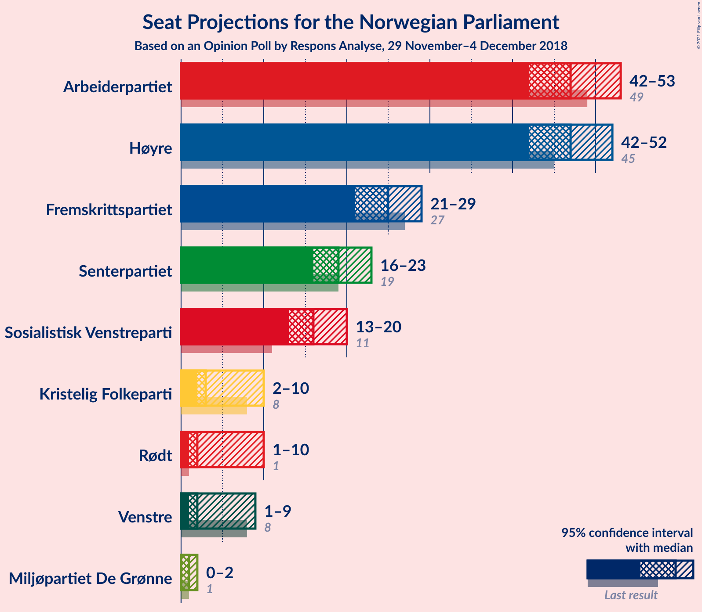
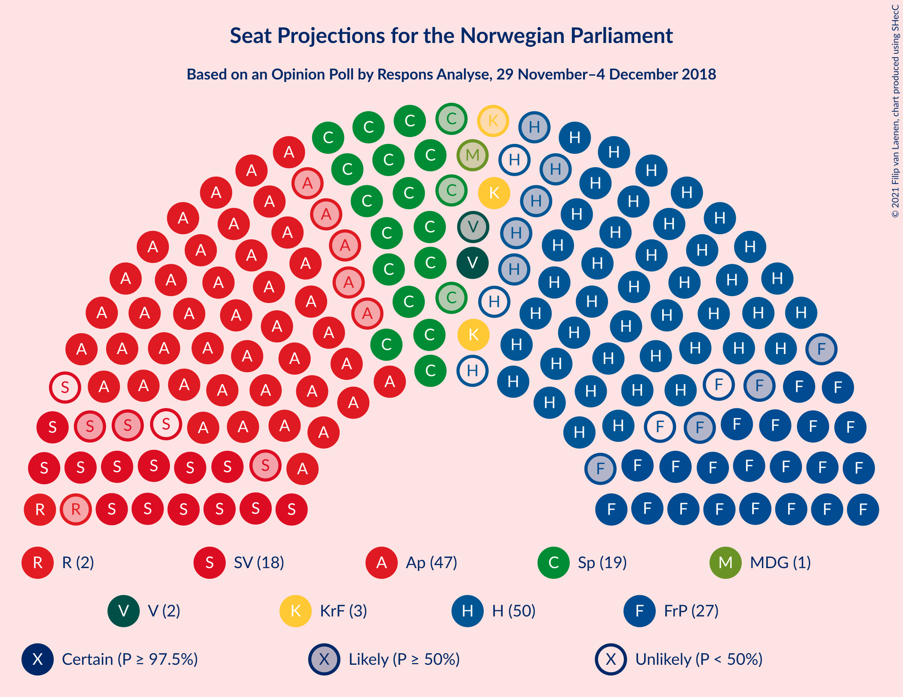
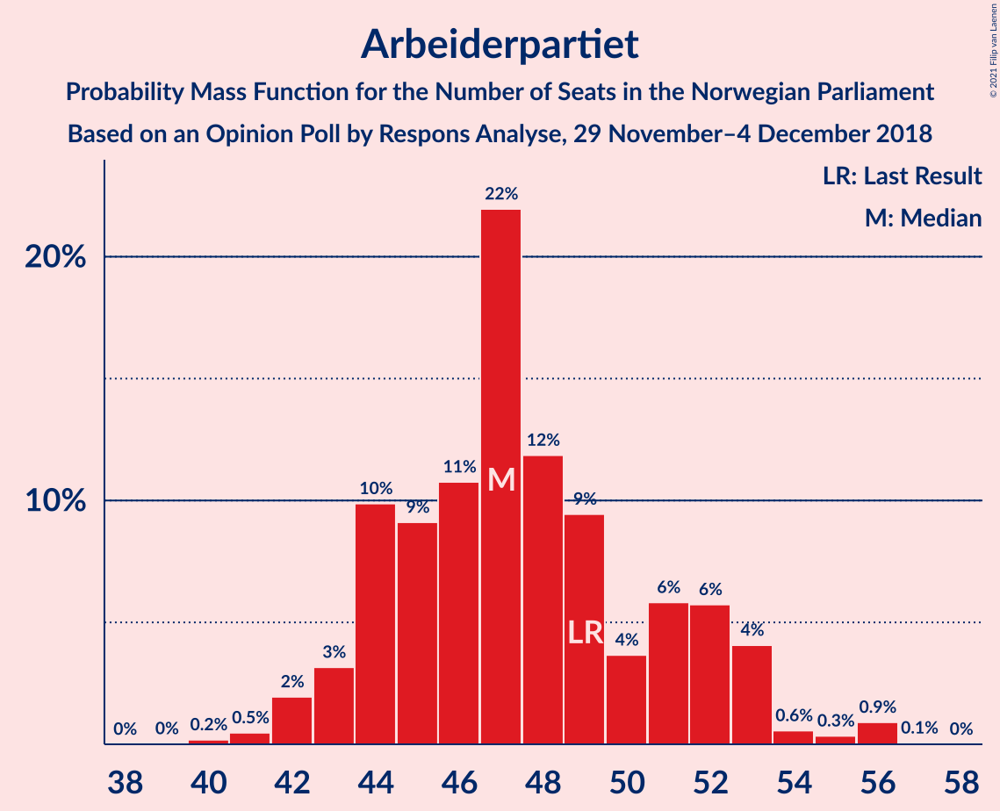
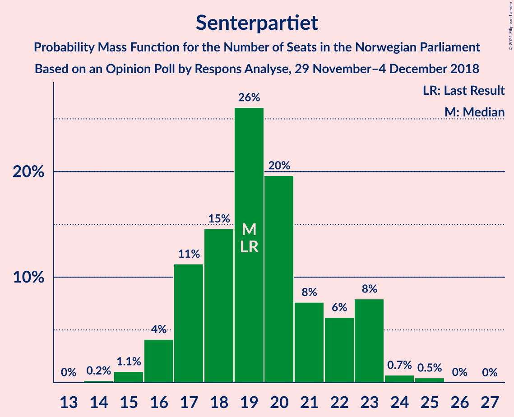
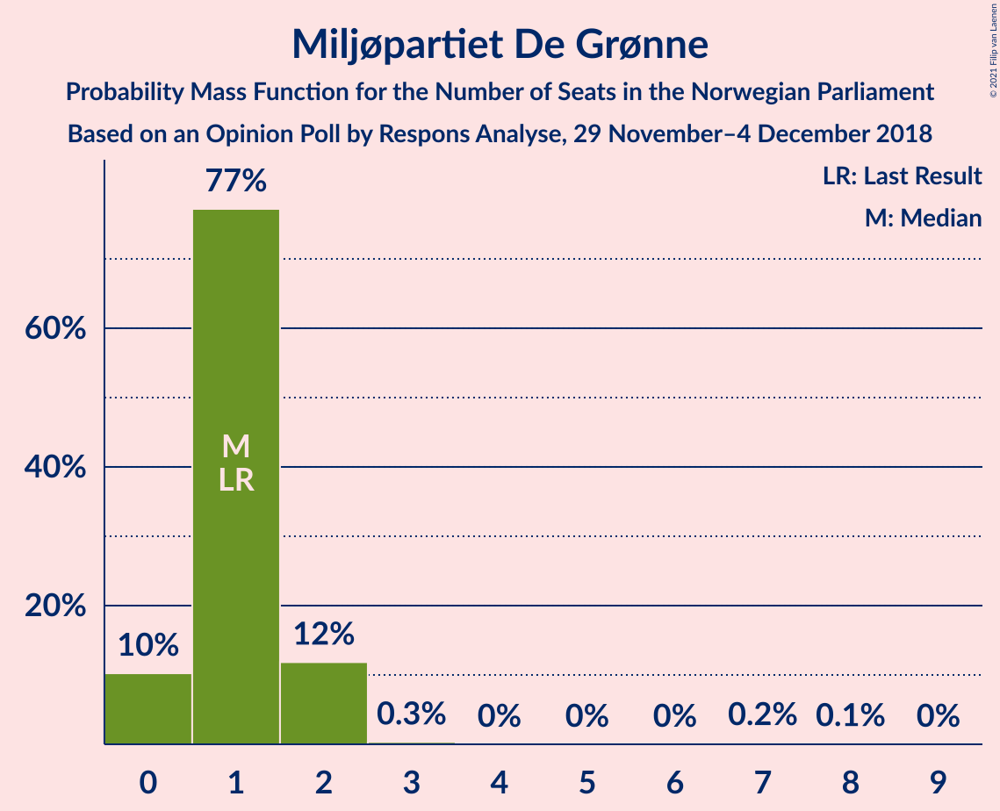
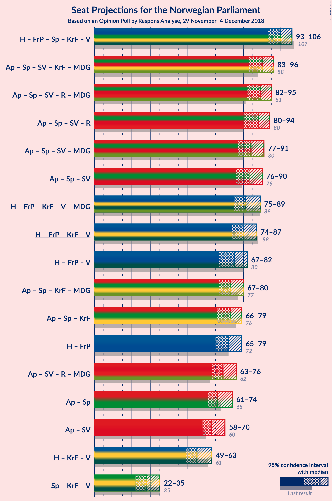
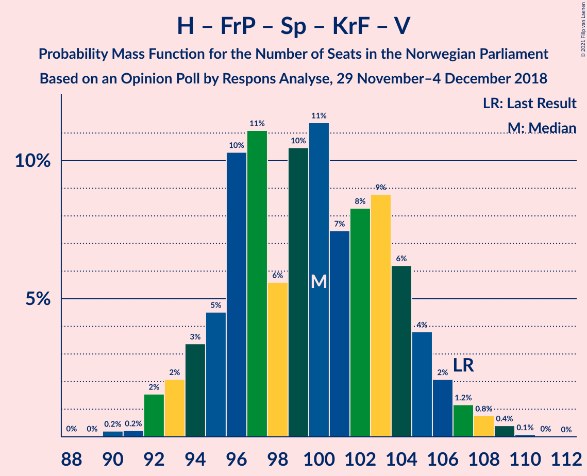
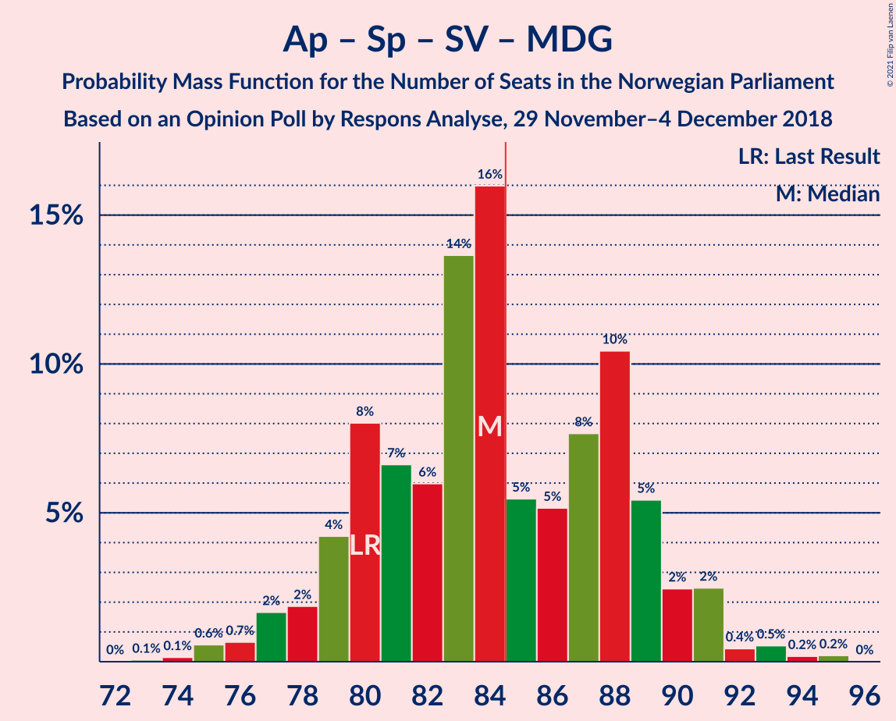

# Opinion Poll by Respons Analyse, 29 November–4 December 2018

<a href="#voting-intentions">Voting Intentions</a> | <a href="#seats">Seats</a> | <a href="#coalitions">Coalitions</a> | <a href="#technical-information">Technical Information</a>

## Voting Intentions

### Confidence Intervals

| Party | Last Result | Poll Result | 80% Confidence Interval | 90% Confidence Interval | 95% Confidence Interval | 99% Confidence Interval |
|:-----:|:-----------:|:-----------:|:-----------------------:|:-----------------------:|:-----------------------:|:-----------------------:|
| Arbeiderpartiet | 27.4% | 26.0% | 24.3–27.8% |23.8–28.4% |23.4–28.8% |22.6–29.7% |
| Høyre | 25.0% | 25.7% | 24.0–27.5% |23.5–28.1% |23.1–28.5% |22.3–29.4% |
| Fremskrittspartiet | 15.2% | 13.5% | 12.2–15.0% |11.8–15.4% |11.5–15.8% |10.9–16.5% |
| Senterpartiet | 10.3% | 10.5% | 9.3–11.8% |9.0–12.2% |8.7–12.6% |8.2–13.2% |
| Sosialistisk Venstreparti | 6.0% | 8.8% | 7.7–10.1% |7.4–10.4% |7.2–10.7% |6.7–11.4% |
| Kristelig Folkeparti | 4.2% | 4.1% | 3.4–5.0% |3.2–5.3% |3.0–5.5% |2.7–6.0% |
| Rødt | 2.4% | 3.9% | 3.2–4.8% |3.0–5.1% |2.9–5.3% |2.6–5.8% |
| Venstre | 4.4% | 3.4% | 2.8–4.3% |2.6–4.5% |2.4–4.7% |2.2–5.2% |
| Miljøpartiet De Grønne | 3.2% | 2.4% | 1.9–3.2% |1.7–3.4% |1.6–3.6% |1.4–3.9% |

*Note:* The poll result column reflects the actual value used in the calculations. Published results may vary slightly, and in addition be rounded to fewer digits.

## Seats

### Confidence Intervals

| Party | Last Result | Median | 80% Confidence Interval | 90% Confidence Interval | 95% Confidence Interval | 99% Confidence Interval |
|:-----:|:-----------:|:------:|:-----------------------:|:-----------------------:|:-----------------------:|:-----------------------:|
| <a href="#arbeiderpartiet">Arbeiderpartiet</a> | 49 | 47 | 45–49 |43–51 |43–52 |42–56 |
| <a href="#høyre">Høyre</a> | 45 | 46 | 44–50 |42–53 |42–53 |40–54 |
| <a href="#fremskrittspartiet">Fremskrittspartiet</a> | 27 | 25 | 22–28 |22–28 |21–28 |20–30 |
| <a href="#senterpartiet">Senterpartiet</a> | 19 | 20 | 17–21 |17–23 |16–23 |15–24 |
| <a href="#sosialistisk-venstreparti">Sosialistisk Venstreparti</a> | 11 | 16 | 14–18 |14–18 |13–20 |12–20 |
| <a href="#kristelig-folkeparti">Kristelig Folkeparti</a> | 8 | 3 | 3–9 |3–10 |2–10 |1–11 |
| <a href="#rødt">Rødt</a> | 1 | 8 | 2–8 |2–9 |2–10 |1–10 |
| <a href="#venstre">Venstre</a> | 8 | 2 | 2 |2–8 |1–8 |1–9 |
| <a href="#miljøpartiet-de-grønne">Miljøpartiet De Grønne</a> | 1 | 1 | 1–2 |0–2 |0–2 |0–2 |

### Arbeiderpartiet

*For a full overview of the results for this party, see the [Arbeiderpartiet](party-arbeiderpartiet.html) page.*

| Number of Seats | Probability | Accumulated | Special Marks |
|:---------------:|:-----------:|:-----------:|:-------------:|
| 40 | 0.2% | 100% |  |
| 41 | 0.2% | 99.8% |  |
| 42 | 0.7% | 99.6% |  |
| 43 | 5% | 98.9% |  |
| 44 | 2% | 93% |  |
| 45 | 11% | 91% |  |
| 46 | 29% | 80% |  |
| 47 | 12% | 51% | Median |
| 48 | 25% | 38% |  |
| 49 | 5% | 13% | Last Result |
| 50 | 3% | 8% |  |
| 51 | 1.4% | 6% |  |
| 52 | 2% | 4% |  |
| 53 | 0.6% | 2% |  |
| 54 | 0.6% | 1.2% |  |
| 55 | 0% | 0.6% |  |
| 56 | 0.6% | 0.6% |  |
| 57 | 0% | 0% |  |

### Høyre

*For a full overview of the results for this party, see the [Høyre](party-høyre.html) page.*

| Number of Seats | Probability | Accumulated | Special Marks |
|:---------------:|:-----------:|:-----------:|:-------------:|
| 39 | 0.2% | 100% |  |
| 40 | 0.6% | 99.7% |  |
| 41 | 1.0% | 99.1% |  |
| 42 | 4% | 98% |  |
| 43 | 3% | 94% |  |
| 44 | 5% | 91% |  |
| 45 | 26% | 86% | Last Result |
| 46 | 12% | 60% | Median |
| 47 | 11% | 48% |  |
| 48 | 2% | 37% |  |
| 49 | 22% | 34% |  |
| 50 | 2% | 12% |  |
| 51 | 1.1% | 10% |  |
| 52 | 3% | 9% |  |
| 53 | 5% | 6% |  |
| 54 | 0.4% | 0.6% |  |
| 55 | 0% | 0.2% |  |
| 56 | 0.2% | 0.2% |  |
| 57 | 0% | 0% |  |

### Fremskrittspartiet

*For a full overview of the results for this party, see the [Fremskrittspartiet](party-fremskrittspartiet.html) page.*

| Number of Seats | Probability | Accumulated | Special Marks |
|:---------------:|:-----------:|:-----------:|:-------------:|
| 18 | 0.1% | 100% |  |
| 19 | 0.3% | 99.9% |  |
| 20 | 1.0% | 99.6% |  |
| 21 | 3% | 98.6% |  |
| 22 | 9% | 96% |  |
| 23 | 25% | 87% |  |
| 24 | 7% | 62% |  |
| 25 | 8% | 55% | Median |
| 26 | 15% | 47% |  |
| 27 | 21% | 32% | Last Result |
| 28 | 9% | 11% |  |
| 29 | 0.6% | 1.4% |  |
| 30 | 0.3% | 0.8% |  |
| 31 | 0.3% | 0.4% |  |
| 32 | 0.2% | 0.2% |  |
| 33 | 0% | 0% |  |

### Senterpartiet

*For a full overview of the results for this party, see the [Senterpartiet](party-senterpartiet.html) page.*

| Number of Seats | Probability | Accumulated | Special Marks |
|:---------------:|:-----------:|:-----------:|:-------------:|
| 14 | 0.1% | 100% |  |
| 15 | 0.7% | 99.9% |  |
| 16 | 3% | 99.2% |  |
| 17 | 13% | 96% |  |
| 18 | 5% | 83% |  |
| 19 | 24% | 79% | Last Result |
| 20 | 31% | 55% | Median |
| 21 | 15% | 24% |  |
| 22 | 1.5% | 9% |  |
| 23 | 7% | 8% |  |
| 24 | 0.6% | 1.0% |  |
| 25 | 0.4% | 0.4% |  |
| 26 | 0.1% | 0.1% |  |
| 27 | 0% | 0% |  |

### Sosialistisk Venstreparti

*For a full overview of the results for this party, see the [Sosialistisk Venstreparti](party-sosialistiskvenstreparti.html) page.*

| Number of Seats | Probability | Accumulated | Special Marks |
|:---------------:|:-----------:|:-----------:|:-------------:|
| 11 | 0.2% | 100% | Last Result |
| 12 | 0.6% | 99.8% |  |
| 13 | 2% | 99.2% |  |
| 14 | 10% | 97% |  |
| 15 | 31% | 87% |  |
| 16 | 18% | 56% | Median |
| 17 | 9% | 38% |  |
| 18 | 25% | 29% |  |
| 19 | 2% | 5% |  |
| 20 | 2% | 3% |  |
| 21 | 0.1% | 0.5% |  |
| 22 | 0.3% | 0.4% |  |
| 23 | 0% | 0% |  |

### Kristelig Folkeparti

*For a full overview of the results for this party, see the [Kristelig Folkeparti](party-kristeligfolkeparti.html) page.*

| Number of Seats | Probability | Accumulated | Special Marks |
|:---------------:|:-----------:|:-----------:|:-------------:|
| 1 | 2% | 100% |  |
| 2 | 1.0% | 98% |  |
| 3 | 61% | 97% | Median |
| 4 | 0% | 36% |  |
| 5 | 0% | 36% |  |
| 6 | 0% | 36% |  |
| 7 | 7% | 36% |  |
| 8 | 19% | 29% | Last Result |
| 9 | 5% | 10% |  |
| 10 | 4% | 5% |  |
| 11 | 1.5% | 2% |  |
| 12 | 0% | 0.1% |  |
| 13 | 0% | 0% |  |

### Rødt

*For a full overview of the results for this party, see the [Rødt](party-rødt.html) page.*

| Number of Seats | Probability | Accumulated | Special Marks |
|:---------------:|:-----------:|:-----------:|:-------------:|
| 1 | 2% | 100% | Last Result |
| 2 | 27% | 98% |  |
| 3 | 0% | 70% |  |
| 4 | 0% | 70% |  |
| 5 | 0% | 70% |  |
| 6 | 0% | 70% |  |
| 7 | 6% | 70% |  |
| 8 | 58% | 64% | Median |
| 9 | 2% | 6% |  |
| 10 | 4% | 4% |  |
| 11 | 0.1% | 0.1% |  |
| 12 | 0% | 0% |  |

### Venstre

*For a full overview of the results for this party, see the [Venstre](party-venstre.html) page.*

| Number of Seats | Probability | Accumulated | Special Marks |
|:---------------:|:-----------:|:-----------:|:-------------:|
| 0 | 0.1% | 100% |  |
| 1 | 3% | 99.9% |  |
| 2 | 88% | 97% | Median |
| 3 | 0.2% | 9% |  |
| 4 | 0% | 9% |  |
| 5 | 0% | 9% |  |
| 6 | 0% | 9% |  |
| 7 | 2% | 9% |  |
| 8 | 5% | 7% | Last Result |
| 9 | 2% | 2% |  |
| 10 | 0.1% | 0.1% |  |
| 11 | 0% | 0% |  |

### Miljøpartiet De Grønne

*For a full overview of the results for this party, see the [Miljøpartiet De Grønne](party-miljøpartietdegrønne.html) page.*

| Number of Seats | Probability | Accumulated | Special Marks |
|:---------------:|:-----------:|:-----------:|:-------------:|
| 0 | 5% | 100% |  |
| 1 | 83% | 95% | Last Result, Median |
| 2 | 12% | 12% |  |
| 3 | 0.1% | 0.3% |  |
| 4 | 0% | 0.3% |  |
| 5 | 0% | 0.3% |  |
| 6 | 0% | 0.3% |  |
| 7 | 0.1% | 0.3% |  |
| 8 | 0.2% | 0.2% |  |
| 9 | 0% | 0% |  |

## Coalitions

### Confidence Intervals

| Coalition | Last Result | Median | Majority? | 80% Confidence Interval | 90% Confidence Interval | 95% Confidence Interval | 99% Confidence Interval |
|:---------:|:-----------:|:------:|:---------:|:-----------------------:|:-----------------------:|:-----------------------:|:-----------------------:|
| Høyre – Fremskrittspartiet – Senterpartiet – Kristelig Folkeparti – Venstre | 107 | 97 | 100% | 96–103 | 95–105 | 94–108 | 93–109 |
| Arbeiderpartiet – Senterpartiet – Sosialistisk Venstreparti – Kristelig Folkeparti – Miljøpartiet De Grønne | 88 | 87 | 89% | 84–94 | 84–96 | 83–96 | 82–99 |
| Arbeiderpartiet – Senterpartiet – Sosialistisk Venstreparti – Rødt – Miljøpartiet De Grønne | 81 | 92 | 88% | 83–92 | 82–92 | 81–95 | 80–96 |
| Arbeiderpartiet – Senterpartiet – Sosialistisk Venstreparti – Rødt | 80 | 90 | 84% | 82–91 | 81–91 | 80–94 | 79–95 |
| Arbeiderpartiet – Senterpartiet – Sosialistisk Venstreparti – Miljøpartiet De Grønne | 80 | 84 | 18% | 80–88 | 79–88 | 78–90 | 76–94 |
| Arbeiderpartiet – Senterpartiet – Sosialistisk Venstreparti | 79 | 83 | 15% | 79–86 | 78–87 | 77–89 | 75–92 |
| Høyre – Fremskrittspartiet – Kristelig Folkeparti – Venstre – Miljøpartiet De Grønne | 89 | 79 | 16% | 78–87 | 78–88 | 75–89 | 74–90 |
| Høyre – Fremskrittspartiet – Kristelig Folkeparti – Venstre | 88 | 77 | 12% | 77–86 | 77–87 | 74–88 | 73–89 |
| Høyre – Fremskrittspartiet – Venstre | 80 | 74 | 0.5% | 70–79 | 69–83 | 69–83 | 67–85 |
| Høyre – Fremskrittspartiet | 72 | 72 | 0% | 68–75 | 67–81 | 67–81 | 62–82 |
| Arbeiderpartiet – Senterpartiet – Kristelig Folkeparti – Miljøpartiet De Grønne | 77 | 72 | 0% | 69–78 | 68–79 | 68–79 | 64–83 |
| Arbeiderpartiet – Senterpartiet – Kristelig Folkeparti | 76 | 71 | 0% | 67–76 | 67–77 | 67–78 | 63–82 |
| Arbeiderpartiet – Senterpartiet | 68 | 66 | 0% | 64–69 | 62–71 | 61–72 | 59–74 |
| Arbeiderpartiet – Sosialistisk Venstreparti | 60 | 63 | 0% | 60–65 | 58–68 | 57–70 | 56–71 |
| Høyre – Kristelig Folkeparti – Venstre | 61 | 54 | 0% | 50–58 | 50–62 | 49–63 | 48–64 |
| Senterpartiet – Kristelig Folkeparti – Venstre | 35 | 25 | 0% | 24–31 | 22–32 | 22–34 | 21–36 |

### Høyre – Fremskrittspartiet – Senterpartiet – Kristelig Folkeparti – Venstre

| Number of Seats | Probability | Accumulated | Special Marks |
|:---------------:|:-----------:|:-----------:|:-------------:|
| 89 | 0% | 100% |  |
| 90 | 0.1% | 99.9% |  |
| 91 | 0.2% | 99.8% |  |
| 92 | 0.1% | 99.6% |  |
| 93 | 0.7% | 99.5% |  |
| 94 | 3% | 98.8% |  |
| 95 | 6% | 96% |  |
| 96 | 22% | 90% | Median |
| 97 | 22% | 68% |  |
| 98 | 2% | 46% |  |
| 99 | 6% | 44% |  |
| 100 | 17% | 39% |  |
| 101 | 1.2% | 22% |  |
| 102 | 4% | 21% |  |
| 103 | 7% | 17% |  |
| 104 | 4% | 9% |  |
| 105 | 2% | 6% |  |
| 106 | 0.6% | 4% |  |
| 107 | 0.3% | 3% | Last Result |
| 108 | 0.5% | 3% |  |
| 109 | 2% | 2% |  |
| 110 | 0.1% | 0.1% |  |
| 111 | 0% | 0% |  |

### Arbeiderpartiet – Senterpartiet – Sosialistisk Venstreparti – Kristelig Folkeparti – Miljøpartiet De Grønne

| Number of Seats | Probability | Accumulated | Special Marks |
|:---------------:|:-----------:|:-----------:|:-------------:|
| 77 | 0.1% | 100% |  |
| 78 | 0% | 99.9% |  |
| 79 | 0% | 99.9% |  |
| 80 | 0.2% | 99.9% |  |
| 81 | 0.2% | 99.7% |  |
| 82 | 0.8% | 99.5% |  |
| 83 | 3% | 98.7% |  |
| 84 | 7% | 95% |  |
| 85 | 1.2% | 89% | Majority |
| 86 | 0.5% | 87% |  |
| 87 | 48% | 87% | Median |
| 88 | 1.1% | 39% | Last Result |
| 89 | 2% | 38% |  |
| 90 | 10% | 35% |  |
| 91 | 8% | 25% |  |
| 92 | 5% | 18% |  |
| 93 | 2% | 12% |  |
| 94 | 2% | 10% |  |
| 95 | 1.3% | 9% |  |
| 96 | 5% | 7% |  |
| 97 | 0.8% | 2% |  |
| 98 | 0.3% | 1.0% |  |
| 99 | 0.5% | 0.6% |  |
| 100 | 0.1% | 0.1% |  |
| 101 | 0% | 0% |  |

### Arbeiderpartiet – Senterpartiet – Sosialistisk Venstreparti – Rødt – Miljøpartiet De Grønne

| Number of Seats | Probability | Accumulated | Special Marks |
|:---------------:|:-----------:|:-----------:|:-------------:|
| 78 | 0% | 100% |  |
| 79 | 0.2% | 99.9% |  |
| 80 | 2% | 99.7% |  |
| 81 | 2% | 98% | Last Result |
| 82 | 1.0% | 96% |  |
| 83 | 6% | 95% |  |
| 84 | 0.9% | 89% |  |
| 85 | 4% | 88% | Majority |
| 86 | 2% | 84% |  |
| 87 | 1.4% | 82% |  |
| 88 | 5% | 81% |  |
| 89 | 3% | 76% |  |
| 90 | 14% | 73% |  |
| 91 | 6% | 59% |  |
| 92 | 49% | 53% | Median |
| 93 | 0.9% | 4% |  |
| 94 | 0.4% | 4% |  |
| 95 | 2% | 3% |  |
| 96 | 1.1% | 1.5% |  |
| 97 | 0.2% | 0.4% |  |
| 98 | 0% | 0.2% |  |
| 99 | 0.1% | 0.1% |  |
| 100 | 0% | 0.1% |  |
| 101 | 0% | 0% |  |

### Arbeiderpartiet – Senterpartiet – Sosialistisk Venstreparti – Rødt

| Number of Seats | Probability | Accumulated | Special Marks |
|:---------------:|:-----------:|:-----------:|:-------------:|
| 77 | 0% | 100% |  |
| 78 | 0.1% | 99.9% |  |
| 79 | 2% | 99.8% |  |
| 80 | 2% | 98% | Last Result |
| 81 | 0.7% | 95% |  |
| 82 | 6% | 95% |  |
| 83 | 0.8% | 89% |  |
| 84 | 4% | 88% |  |
| 85 | 2% | 84% | Majority |
| 86 | 2% | 82% |  |
| 87 | 3% | 80% |  |
| 88 | 9% | 77% |  |
| 89 | 8% | 68% |  |
| 90 | 10% | 60% |  |
| 91 | 45% | 50% | Median |
| 92 | 1.2% | 5% |  |
| 93 | 0.5% | 4% |  |
| 94 | 2% | 3% |  |
| 95 | 0.7% | 1.0% |  |
| 96 | 0.1% | 0.3% |  |
| 97 | 0% | 0.2% |  |
| 98 | 0% | 0.1% |  |
| 99 | 0.1% | 0.1% |  |
| 100 | 0% | 0% |  |

### Arbeiderpartiet – Senterpartiet – Sosialistisk Venstreparti – Miljøpartiet De Grønne

| Number of Seats | Probability | Accumulated | Special Marks |
|:---------------:|:-----------:|:-----------:|:-------------:|
| 73 | 0.1% | 100% |  |
| 74 | 0.1% | 99.9% |  |
| 75 | 0.1% | 99.7% |  |
| 76 | 0.6% | 99.6% |  |
| 77 | 0.7% | 99.0% |  |
| 78 | 2% | 98% |  |
| 79 | 4% | 96% |  |
| 80 | 5% | 92% | Last Result |
| 81 | 7% | 87% |  |
| 82 | 3% | 80% |  |
| 83 | 12% | 77% |  |
| 84 | 47% | 65% | Median |
| 85 | 2% | 18% | Majority |
| 86 | 2% | 16% |  |
| 87 | 3% | 14% |  |
| 88 | 7% | 11% |  |
| 89 | 1.1% | 5% |  |
| 90 | 2% | 4% |  |
| 91 | 0.7% | 2% |  |
| 92 | 0.2% | 1.0% |  |
| 93 | 0.1% | 0.8% |  |
| 94 | 0.7% | 0.8% |  |
| 95 | 0% | 0.1% |  |
| 96 | 0% | 0% |  |

### Arbeiderpartiet – Senterpartiet – Sosialistisk Venstreparti

| Number of Seats | Probability | Accumulated | Special Marks |
|:---------------:|:-----------:|:-----------:|:-------------:|
| 72 | 0.1% | 100% |  |
| 73 | 0.1% | 99.9% |  |
| 74 | 0.2% | 99.7% |  |
| 75 | 0.6% | 99.6% |  |
| 76 | 0.2% | 98.9% |  |
| 77 | 2% | 98.7% |  |
| 78 | 5% | 96% |  |
| 79 | 3% | 92% | Last Result |
| 80 | 8% | 88% |  |
| 81 | 3% | 80% |  |
| 82 | 15% | 77% |  |
| 83 | 44% | 62% | Median |
| 84 | 2% | 18% |  |
| 85 | 2% | 15% | Majority |
| 86 | 7% | 14% |  |
| 87 | 2% | 7% |  |
| 88 | 2% | 5% |  |
| 89 | 0.7% | 3% |  |
| 90 | 0.5% | 2% |  |
| 91 | 0.5% | 1.3% |  |
| 92 | 0.5% | 0.8% |  |
| 93 | 0.2% | 0.3% |  |
| 94 | 0% | 0% |  |

### Høyre – Fremskrittspartiet – Kristelig Folkeparti – Venstre – Miljøpartiet De Grønne

| Number of Seats | Probability | Accumulated | Special Marks |
|:---------------:|:-----------:|:-----------:|:-------------:|
| 70 | 0.1% | 100% |  |
| 71 | 0% | 99.9% |  |
| 72 | 0% | 99.9% |  |
| 73 | 0.1% | 99.8% |  |
| 74 | 0.7% | 99.7% |  |
| 75 | 2% | 99.0% |  |
| 76 | 0.5% | 97% |  |
| 77 | 1.2% | 96% | Median |
| 78 | 45% | 95% |  |
| 79 | 10% | 50% |  |
| 80 | 8% | 40% |  |
| 81 | 9% | 32% |  |
| 82 | 3% | 23% |  |
| 83 | 2% | 20% |  |
| 84 | 2% | 18% |  |
| 85 | 4% | 16% | Majority |
| 86 | 0.8% | 12% |  |
| 87 | 6% | 11% |  |
| 88 | 0.7% | 5% |  |
| 89 | 2% | 5% | Last Result |
| 90 | 2% | 2% |  |
| 91 | 0.1% | 0.2% |  |
| 92 | 0% | 0.1% |  |
| 93 | 0% | 0% |  |

### Høyre – Fremskrittspartiet – Kristelig Folkeparti – Venstre

| Number of Seats | Probability | Accumulated | Special Marks |
|:---------------:|:-----------:|:-----------:|:-------------:|
| 69 | 0% | 100% |  |
| 70 | 0.1% | 99.9% |  |
| 71 | 0% | 99.9% |  |
| 72 | 0.2% | 99.8% |  |
| 73 | 1.1% | 99.6% |  |
| 74 | 2% | 98.5% |  |
| 75 | 0.4% | 97% |  |
| 76 | 0.9% | 96% | Median |
| 77 | 49% | 96% |  |
| 78 | 6% | 47% |  |
| 79 | 14% | 41% |  |
| 80 | 3% | 27% |  |
| 81 | 5% | 24% |  |
| 82 | 1.4% | 19% |  |
| 83 | 2% | 18% |  |
| 84 | 4% | 16% |  |
| 85 | 0.9% | 12% | Majority |
| 86 | 6% | 11% |  |
| 87 | 1.0% | 5% |  |
| 88 | 2% | 4% | Last Result |
| 89 | 2% | 2% |  |
| 90 | 0.2% | 0.3% |  |
| 91 | 0% | 0.1% |  |
| 92 | 0% | 0% |  |

### Høyre – Fremskrittspartiet – Venstre

| Number of Seats | Probability | Accumulated | Special Marks |
|:---------------:|:-----------:|:-----------:|:-------------:|
| 65 | 0% | 100% |  |
| 66 | 0.1% | 99.9% |  |
| 67 | 0.4% | 99.8% |  |
| 68 | 1.1% | 99.4% |  |
| 69 | 5% | 98% |  |
| 70 | 5% | 93% |  |
| 71 | 7% | 88% |  |
| 72 | 8% | 81% |  |
| 73 | 1.2% | 73% | Median |
| 74 | 47% | 72% |  |
| 75 | 3% | 25% |  |
| 76 | 5% | 23% |  |
| 77 | 4% | 18% |  |
| 78 | 4% | 14% |  |
| 79 | 2% | 11% |  |
| 80 | 2% | 9% | Last Result |
| 81 | 0.3% | 7% |  |
| 82 | 0.6% | 7% |  |
| 83 | 5% | 6% |  |
| 84 | 0.3% | 0.9% |  |
| 85 | 0.4% | 0.5% | Majority |
| 86 | 0% | 0.1% |  |
| 87 | 0.1% | 0.1% |  |
| 88 | 0% | 0% |  |

### Høyre – Fremskrittspartiet

| Number of Seats | Probability | Accumulated | Special Marks |
|:---------------:|:-----------:|:-----------:|:-------------:|
| 60 | 0.4% | 100% |  |
| 61 | 0% | 99.6% |  |
| 62 | 0.1% | 99.6% |  |
| 63 | 0.1% | 99.5% |  |
| 64 | 0.4% | 99.3% |  |
| 65 | 0.6% | 99.0% |  |
| 66 | 0.8% | 98% |  |
| 67 | 4% | 98% |  |
| 68 | 9% | 93% |  |
| 69 | 8% | 85% |  |
| 70 | 10% | 77% |  |
| 71 | 1.1% | 67% | Median |
| 72 | 46% | 66% | Last Result |
| 73 | 2% | 20% |  |
| 74 | 5% | 17% |  |
| 75 | 3% | 13% |  |
| 76 | 0.9% | 10% |  |
| 77 | 1.0% | 9% |  |
| 78 | 2% | 8% |  |
| 79 | 0.3% | 6% |  |
| 80 | 0% | 6% |  |
| 81 | 5% | 6% |  |
| 82 | 0.2% | 0.6% |  |
| 83 | 0.4% | 0.4% |  |
| 84 | 0% | 0% |  |

### Arbeiderpartiet – Senterpartiet – Kristelig Folkeparti – Miljøpartiet De Grønne

| Number of Seats | Probability | Accumulated | Special Marks |
|:---------------:|:-----------:|:-----------:|:-------------:|
| 63 | 0.2% | 100% |  |
| 64 | 0.4% | 99.8% |  |
| 65 | 0.3% | 99.4% |  |
| 66 | 0.4% | 99.1% |  |
| 67 | 0.9% | 98.6% |  |
| 68 | 8% | 98% |  |
| 69 | 21% | 90% |  |
| 70 | 5% | 69% |  |
| 71 | 2% | 64% | Median |
| 72 | 25% | 63% |  |
| 73 | 5% | 37% |  |
| 74 | 3% | 33% |  |
| 75 | 8% | 29% |  |
| 76 | 8% | 21% |  |
| 77 | 3% | 13% | Last Result |
| 78 | 2% | 10% |  |
| 79 | 7% | 8% |  |
| 80 | 0.4% | 2% |  |
| 81 | 0.4% | 1.2% |  |
| 82 | 0.3% | 0.8% |  |
| 83 | 0.1% | 0.5% |  |
| 84 | 0.4% | 0.4% |  |
| 85 | 0% | 0% | Majority |

### Arbeiderpartiet – Senterpartiet – Kristelig Folkeparti

| Number of Seats | Probability | Accumulated | Special Marks |
|:---------------:|:-----------:|:-----------:|:-------------:|
| 62 | 0.1% | 100% |  |
| 63 | 0.5% | 99.9% |  |
| 64 | 0.3% | 99.4% |  |
| 65 | 0.2% | 99.1% |  |
| 66 | 0.8% | 98.8% |  |
| 67 | 8% | 98% |  |
| 68 | 21% | 90% |  |
| 69 | 4% | 69% |  |
| 70 | 2% | 64% | Median |
| 71 | 25% | 62% |  |
| 72 | 4% | 37% |  |
| 73 | 5% | 33% |  |
| 74 | 9% | 29% |  |
| 75 | 6% | 19% |  |
| 76 | 3% | 13% | Last Result |
| 77 | 7% | 10% |  |
| 78 | 1.0% | 3% |  |
| 79 | 0.9% | 2% |  |
| 80 | 0.6% | 1.2% |  |
| 81 | 0.1% | 0.7% |  |
| 82 | 0.1% | 0.5% |  |
| 83 | 0.4% | 0.4% |  |
| 84 | 0% | 0% |  |

### Arbeiderpartiet – Senterpartiet

| Number of Seats | Probability | Accumulated | Special Marks |
|:---------------:|:-----------:|:-----------:|:-------------:|
| 56 | 0.1% | 100% |  |
| 57 | 0% | 99.9% |  |
| 58 | 0.1% | 99.8% |  |
| 59 | 0.3% | 99.7% |  |
| 60 | 0.7% | 99.5% |  |
| 61 | 2% | 98.8% |  |
| 62 | 3% | 97% |  |
| 63 | 3% | 94% |  |
| 64 | 10% | 91% |  |
| 65 | 22% | 81% |  |
| 66 | 15% | 60% |  |
| 67 | 2% | 45% | Median |
| 68 | 29% | 43% | Last Result |
| 69 | 7% | 14% |  |
| 70 | 2% | 7% |  |
| 71 | 2% | 5% |  |
| 72 | 0.5% | 3% |  |
| 73 | 1.2% | 2% |  |
| 74 | 0.8% | 1.2% |  |
| 75 | 0.3% | 0.4% |  |
| 76 | 0.1% | 0.1% |  |
| 77 | 0% | 0% |  |

### Arbeiderpartiet – Sosialistisk Venstreparti

| Number of Seats | Probability | Accumulated | Special Marks |
|:---------------:|:-----------:|:-----------:|:-------------:|
| 55 | 0.2% | 100% |  |
| 56 | 0.7% | 99.8% |  |
| 57 | 2% | 99.1% |  |
| 58 | 3% | 97% |  |
| 59 | 1.4% | 94% |  |
| 60 | 7% | 93% | Last Result |
| 61 | 9% | 85% |  |
| 62 | 10% | 76% |  |
| 63 | 25% | 67% | Median |
| 64 | 22% | 42% |  |
| 65 | 11% | 20% |  |
| 66 | 2% | 9% |  |
| 67 | 1.5% | 7% |  |
| 68 | 2% | 6% |  |
| 69 | 1.4% | 4% |  |
| 70 | 2% | 3% |  |
| 71 | 0.3% | 0.7% |  |
| 72 | 0% | 0.5% |  |
| 73 | 0.4% | 0.5% |  |
| 74 | 0% | 0% |  |

### Høyre – Kristelig Folkeparti – Venstre

| Number of Seats | Probability | Accumulated | Special Marks |
|:---------------:|:-----------:|:-----------:|:-------------:|
| 46 | 0.3% | 100% |  |
| 47 | 0.1% | 99.7% |  |
| 48 | 2% | 99.6% |  |
| 49 | 0.6% | 98% |  |
| 50 | 20% | 97% |  |
| 51 | 10% | 77% | Median |
| 52 | 1.0% | 67% |  |
| 53 | 2% | 66% |  |
| 54 | 24% | 64% |  |
| 55 | 3% | 41% |  |
| 56 | 14% | 38% |  |
| 57 | 9% | 24% |  |
| 58 | 6% | 16% |  |
| 59 | 2% | 10% |  |
| 60 | 2% | 8% |  |
| 61 | 0.9% | 6% | Last Result |
| 62 | 2% | 5% |  |
| 63 | 3% | 3% |  |
| 64 | 0.3% | 0.8% |  |
| 65 | 0.3% | 0.5% |  |
| 66 | 0.1% | 0.2% |  |
| 67 | 0% | 0.1% |  |
| 68 | 0% | 0% |  |

### Senterpartiet – Kristelig Folkeparti – Venstre

| Number of Seats | Probability | Accumulated | Special Marks |
|:---------------:|:-----------:|:-----------:|:-------------:|
| 20 | 0.3% | 100% |  |
| 21 | 0.9% | 99.7% |  |
| 22 | 5% | 98.8% |  |
| 23 | 2% | 93% |  |
| 24 | 21% | 91% |  |
| 25 | 20% | 70% | Median |
| 26 | 4% | 50% |  |
| 27 | 5% | 46% |  |
| 28 | 8% | 41% |  |
| 29 | 4% | 33% |  |
| 30 | 10% | 29% |  |
| 31 | 8% | 18% |  |
| 32 | 6% | 10% |  |
| 33 | 1.3% | 4% |  |
| 34 | 0.7% | 3% |  |
| 35 | 1.4% | 2% | Last Result |
| 36 | 0.4% | 0.9% |  |
| 37 | 0.3% | 0.4% |  |
| 38 | 0.1% | 0.2% |  |
| 39 | 0% | 0.1% |  |
| 40 | 0.1% | 0.1% |  |
| 41 | 0% | 0% |  |

## Technical Information

### Opinion Poll

+ **Polling firm:** Respons Analyse
+ **Commissioner(s):** —
+ **Fieldwork period:** 29 November–4 December 2018

### Calculations

+ **Sample size:** 1000
+ **Simulations done:** 131,072
+ **Error estimate:** 2.19%

