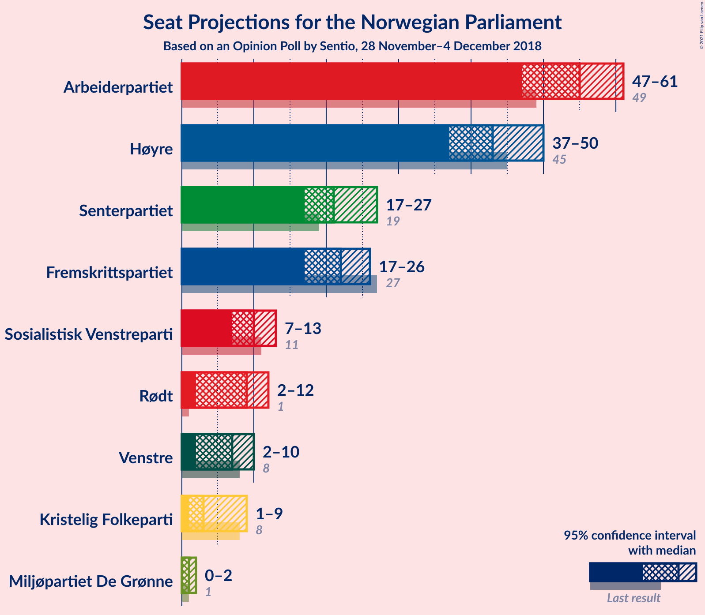
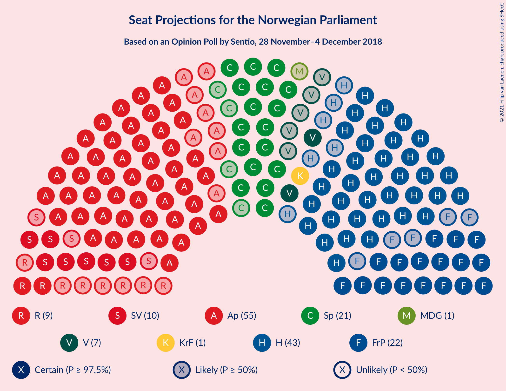
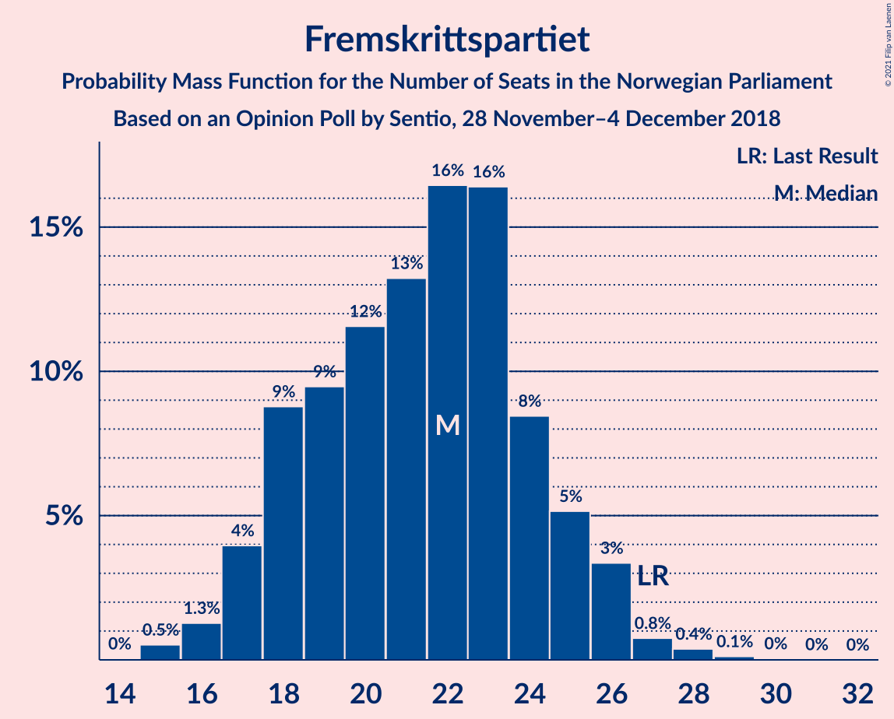
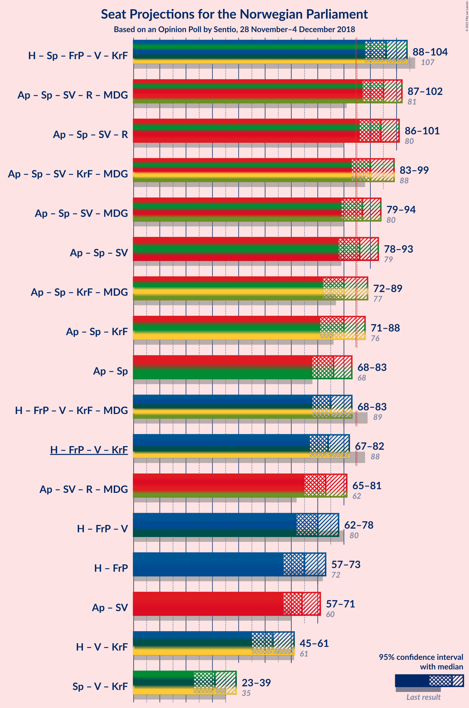
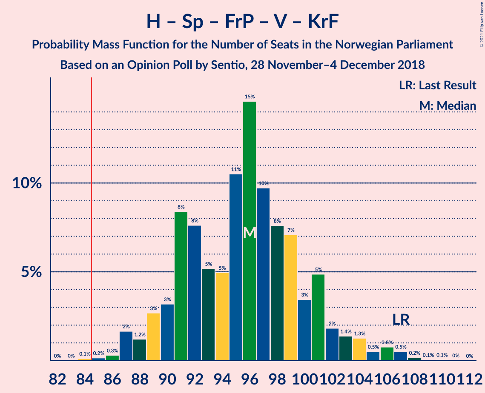
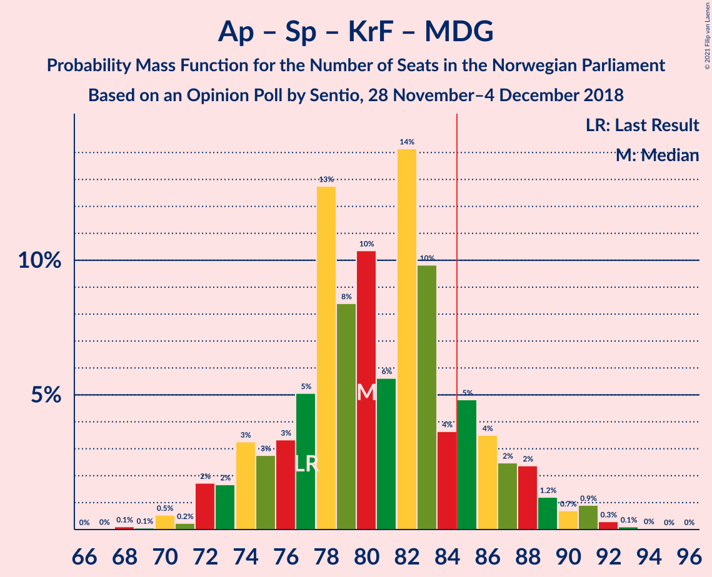
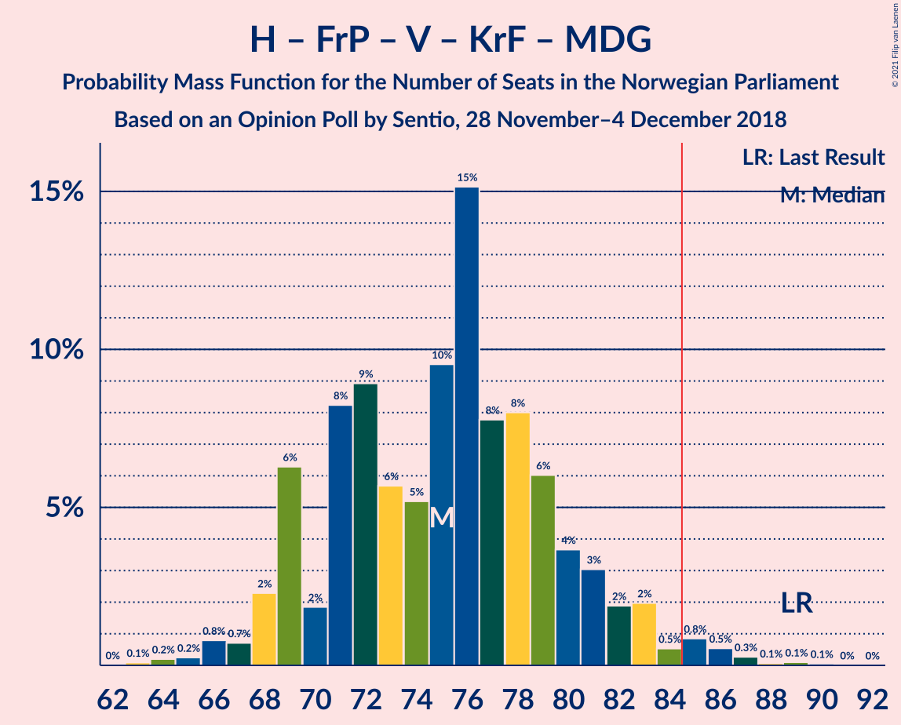
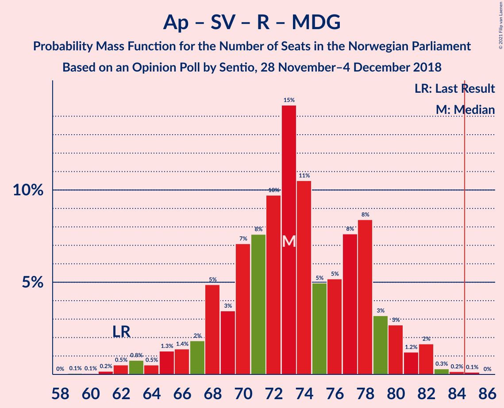
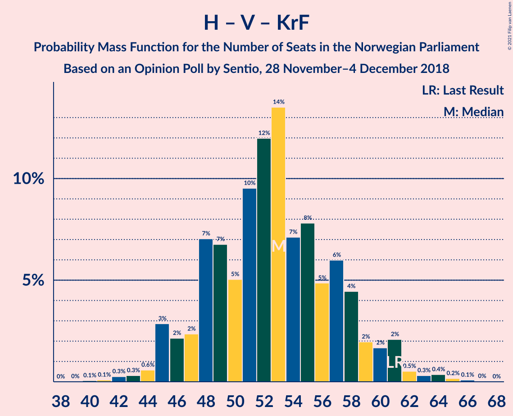

# Opinion Poll by Sentio, 28 November–4 December 2018

<a href="#voting-intentions">Voting Intentions</a> | <a href="#seats">Seats</a> | <a href="#coalitions">Coalitions</a> | <a href="#technical-information">Technical Information</a>

## Voting Intentions

### Confidence Intervals

| Party | Last Result | Poll Result | 80% Confidence Interval | 90% Confidence Interval | 95% Confidence Interval | 99% Confidence Interval |
|:-----:|:-----------:|:-----------:|:-----------------------:|:-----------------------:|:-----------------------:|:-----------------------:|
| Arbeiderpartiet | 27.4% | 29.9% | 27.8–32.2% |27.2–32.9% |26.7–33.4% |25.7–34.5% |
| Høyre | 25.0% | 24.3% | 22.3–26.5% |21.7–27.1% |21.3–27.6% |20.3–28.7% |
| Senterpartiet | 10.3% | 12.1% | 10.7–13.9% |10.3–14.3% |9.9–14.8% |9.3–15.6% |
| Fremskrittspartiet | 15.2% | 12.0% | 10.6–13.7% |10.2–14.2% |9.8–14.6% |9.2–15.5% |
| Sosialistisk Venstreparti | 6.0% | 5.5% | 4.5–6.8% |4.3–7.1% |4.1–7.5% |3.6–8.1% |
| Rødt | 2.4% | 4.8% | 3.9–6.0% |3.7–6.3% |3.5–6.6% |3.1–7.3% |
| Venstre | 4.4% | 4.2% | 3.4–5.4% |3.2–5.7% |3.0–6.0% |2.6–6.6% |
| Kristelig Folkeparti | 4.2% | 3.5% | 2.8–4.6% |2.6–4.9% |2.4–5.2% |2.1–5.7% |
| Miljøpartiet De Grønne | 3.2% | 2.4% | 1.8–3.3% |1.6–3.6% |1.5–3.8% |1.3–4.3% |

*Note:* The poll result column reflects the actual value used in the calculations. Published results may vary slightly, and in addition be rounded to fewer digits.

## Seats

### Confidence Intervals

| Party | Last Result | Median | 80% Confidence Interval | 90% Confidence Interval | 95% Confidence Interval | 99% Confidence Interval |
|:-----:|:-----------:|:------:|:-----------------------:|:-----------------------:|:-----------------------:|:-----------------------:|
| <a href="#arbeiderpartiet">Arbeiderpartiet</a> | 49 | 55 | 50–59 |48–60 |47–61 |45–63 |
| <a href="#høyre">Høyre</a> | 45 | 43 | 39–47 |38–48 |37–50 |36–51 |
| <a href="#senterpartiet">Senterpartiet</a> | 19 | 21 | 18–25 |18–26 |17–27 |16–28 |
| <a href="#fremskrittspartiet">Fremskrittspartiet</a> | 27 | 22 | 18–24 |17–25 |17–26 |15–28 |
| <a href="#sosialistisk-venstreparti">Sosialistisk Venstreparti</a> | 11 | 10 | 8–12 |7–13 |7–13 |1–14 |
| <a href="#rødt">Rødt</a> | 1 | 9 | 2–10 |2–11 |2–12 |2–13 |
| <a href="#venstre">Venstre</a> | 8 | 7 | 2–9 |2–10 |2–10 |2–11 |
| <a href="#kristelig-folkeparti">Kristelig Folkeparti</a> | 8 | 3 | 1–8 |1–8 |1–9 |0–10 |
| <a href="#miljøpartiet-de-grønne">Miljøpartiet De Grønne</a> | 1 | 1 | 0–2 |0–2 |0–2 |0–7 |

### Arbeiderpartiet

*For a full overview of the results for this party, see the [Arbeiderpartiet](party-arbeiderpartiet.html) page.*

| Number of Seats | Probability | Accumulated | Special Marks |
|:---------------:|:-----------:|:-----------:|:-------------:|
| 43 | 0% | 100% |  |
| 44 | 0.1% | 99.9% |  |
| 45 | 0.3% | 99.8% |  |
| 46 | 0.8% | 99.5% |  |
| 47 | 1.3% | 98.7% |  |
| 48 | 3% | 97% |  |
| 49 | 3% | 94% | Last Result |
| 50 | 4% | 91% |  |
| 51 | 6% | 87% |  |
| 52 | 6% | 82% |  |
| 53 | 9% | 76% |  |
| 54 | 10% | 67% |  |
| 55 | 15% | 57% | Median |
| 56 | 15% | 42% |  |
| 57 | 11% | 26% |  |
| 58 | 4% | 15% |  |
| 59 | 5% | 11% |  |
| 60 | 2% | 6% |  |
| 61 | 2% | 4% |  |
| 62 | 1.1% | 2% |  |
| 63 | 0.2% | 0.7% |  |
| 64 | 0.4% | 0.5% |  |
| 65 | 0.1% | 0.1% |  |
| 66 | 0% | 0.1% |  |
| 67 | 0% | 0% |  |

### Høyre

*For a full overview of the results for this party, see the [Høyre](party-høyre.html) page.*

| Number of Seats | Probability | Accumulated | Special Marks |
|:---------------:|:-----------:|:-----------:|:-------------:|
| 34 | 0.1% | 100% |  |
| 35 | 0.2% | 99.9% |  |
| 36 | 1.0% | 99.7% |  |
| 37 | 2% | 98.7% |  |
| 38 | 3% | 97% |  |
| 39 | 5% | 94% |  |
| 40 | 6% | 89% |  |
| 41 | 15% | 83% |  |
| 42 | 9% | 69% |  |
| 43 | 16% | 59% | Median |
| 44 | 11% | 43% |  |
| 45 | 13% | 32% | Last Result |
| 46 | 8% | 19% |  |
| 47 | 3% | 11% |  |
| 48 | 3% | 8% |  |
| 49 | 2% | 5% |  |
| 50 | 2% | 3% |  |
| 51 | 1.1% | 2% |  |
| 52 | 0.2% | 0.5% |  |
| 53 | 0.1% | 0.3% |  |
| 54 | 0.1% | 0.1% |  |
| 55 | 0% | 0% |  |

### Senterpartiet

*For a full overview of the results for this party, see the [Senterpartiet](party-senterpartiet.html) page.*

| Number of Seats | Probability | Accumulated | Special Marks |
|:---------------:|:-----------:|:-----------:|:-------------:|
| 15 | 0.1% | 100% |  |
| 16 | 0.5% | 99.9% |  |
| 17 | 3% | 99.4% |  |
| 18 | 8% | 97% |  |
| 19 | 8% | 89% | Last Result |
| 20 | 15% | 81% |  |
| 21 | 17% | 66% | Median |
| 22 | 16% | 49% |  |
| 23 | 12% | 33% |  |
| 24 | 10% | 21% |  |
| 25 | 4% | 10% |  |
| 26 | 2% | 6% |  |
| 27 | 3% | 4% |  |
| 28 | 0.6% | 0.9% |  |
| 29 | 0.3% | 0.4% |  |
| 30 | 0% | 0.1% |  |
| 31 | 0% | 0% |  |

### Fremskrittspartiet

*For a full overview of the results for this party, see the [Fremskrittspartiet](party-fremskrittspartiet.html) page.*

| Number of Seats | Probability | Accumulated | Special Marks |
|:---------------:|:-----------:|:-----------:|:-------------:|
| 15 | 0.5% | 100% |  |
| 16 | 1.3% | 99.4% |  |
| 17 | 4% | 98% |  |
| 18 | 9% | 94% |  |
| 19 | 9% | 85% |  |
| 20 | 12% | 76% |  |
| 21 | 13% | 64% |  |
| 22 | 16% | 51% | Median |
| 23 | 16% | 35% |  |
| 24 | 8% | 18% |  |
| 25 | 5% | 10% |  |
| 26 | 3% | 5% |  |
| 27 | 0.8% | 1.3% | Last Result |
| 28 | 0.4% | 0.6% |  |
| 29 | 0.1% | 0.2% |  |
| 30 | 0% | 0.1% |  |
| 31 | 0% | 0% |  |

### Sosialistisk Venstreparti

*For a full overview of the results for this party, see the [Sosialistisk Venstreparti](party-sosialistiskvenstreparti.html) page.*

| Number of Seats | Probability | Accumulated | Special Marks |
|:---------------:|:-----------:|:-----------:|:-------------:|
| 1 | 0.5% | 100% |  |
| 2 | 1.0% | 99.5% |  |
| 3 | 0.8% | 98.5% |  |
| 4 | 0% | 98% |  |
| 5 | 0% | 98% |  |
| 6 | 0% | 98% |  |
| 7 | 3% | 98% |  |
| 8 | 17% | 94% |  |
| 9 | 18% | 77% |  |
| 10 | 28% | 58% | Median |
| 11 | 16% | 31% | Last Result |
| 12 | 9% | 14% |  |
| 13 | 4% | 5% |  |
| 14 | 1.3% | 2% |  |
| 15 | 0.3% | 0.4% |  |
| 16 | 0.1% | 0.1% |  |
| 17 | 0% | 0% |  |

### Rødt

*For a full overview of the results for this party, see the [Rødt](party-rødt.html) page.*

| Number of Seats | Probability | Accumulated | Special Marks |
|:---------------:|:-----------:|:-----------:|:-------------:|
| 1 | 0.3% | 100% | Last Result |
| 2 | 13% | 99.7% |  |
| 3 | 0% | 87% |  |
| 4 | 0% | 87% |  |
| 5 | 0% | 87% |  |
| 6 | 0% | 87% |  |
| 7 | 10% | 87% |  |
| 8 | 22% | 77% |  |
| 9 | 29% | 55% | Median |
| 10 | 17% | 26% |  |
| 11 | 7% | 10% |  |
| 12 | 2% | 3% |  |
| 13 | 0.7% | 0.8% |  |
| 14 | 0.1% | 0.1% |  |
| 15 | 0% | 0% |  |

### Venstre

*For a full overview of the results for this party, see the [Venstre](party-venstre.html) page.*

| Number of Seats | Probability | Accumulated | Special Marks |
|:---------------:|:-----------:|:-----------:|:-------------:|
| 1 | 0.1% | 100% |  |
| 2 | 32% | 99.9% |  |
| 3 | 2% | 67% |  |
| 4 | 0% | 65% |  |
| 5 | 0% | 65% |  |
| 6 | 0% | 65% |  |
| 7 | 19% | 65% | Median |
| 8 | 21% | 46% | Last Result |
| 9 | 16% | 24% |  |
| 10 | 7% | 9% |  |
| 11 | 1.3% | 2% |  |
| 12 | 0.4% | 0.4% |  |
| 13 | 0.1% | 0.1% |  |
| 14 | 0% | 0% |  |

### Kristelig Folkeparti

*For a full overview of the results for this party, see the [Kristelig Folkeparti](party-kristeligfolkeparti.html) page.*

| Number of Seats | Probability | Accumulated | Special Marks |
|:---------------:|:-----------:|:-----------:|:-------------:|
| 0 | 0.9% | 100% |  |
| 1 | 32% | 99.1% |  |
| 2 | 17% | 67% |  |
| 3 | 24% | 50% | Median |
| 4 | 0% | 26% |  |
| 5 | 0% | 26% |  |
| 6 | 0% | 26% |  |
| 7 | 11% | 26% |  |
| 8 | 11% | 15% | Last Result |
| 9 | 3% | 4% |  |
| 10 | 0.8% | 1.0% |  |
| 11 | 0.1% | 0.1% |  |
| 12 | 0% | 0% |  |

### Miljøpartiet De Grønne

*For a full overview of the results for this party, see the [Miljøpartiet De Grønne](party-miljøpartietdegrønne.html) page.*

| Number of Seats | Probability | Accumulated | Special Marks |
|:---------------:|:-----------:|:-----------:|:-------------:|
| 0 | 14% | 100% |  |
| 1 | 71% | 86% | Last Result, Median |
| 2 | 12% | 14% |  |
| 3 | 0.1% | 2% |  |
| 4 | 0% | 2% |  |
| 5 | 0% | 2% |  |
| 6 | 0% | 2% |  |
| 7 | 1.1% | 2% |  |
| 8 | 0.4% | 0.4% |  |
| 9 | 0% | 0% |  |

## Coalitions

### Confidence Intervals

| Coalition | Last Result | Median | Majority? | 80% Confidence Interval | 90% Confidence Interval | 95% Confidence Interval | 99% Confidence Interval |
|:---------:|:-----------:|:------:|:---------:|:-----------------------:|:-----------------------:|:-----------------------:|:-----------------------:|
| Høyre – Senterpartiet – Fremskrittspartiet – Venstre – Kristelig Folkeparti | 107 | 96 | 99.8% | 91–101 | 89–102 | 88–104 | 86–107 |
| Arbeiderpartiet – Senterpartiet – Sosialistisk Venstreparti – Rødt – Miljøpartiet De Grønne | 81 | 95 | 99.2% | 90–100 | 88–102 | 87–102 | 84–105 |
| Arbeiderpartiet – Senterpartiet – Sosialistisk Venstreparti – Rødt | 80 | 94 | 98% | 89–100 | 87–100 | 86–101 | 82–104 |
| Arbeiderpartiet – Senterpartiet – Sosialistisk Venstreparti – Kristelig Folkeparti – Miljøpartiet De Grønne | 88 | 90 | 92% | 85–96 | 84–98 | 83–99 | 80–102 |
| Arbeiderpartiet – Senterpartiet – Sosialistisk Venstreparti – Miljøpartiet De Grønne | 80 | 87 | 72% | 81–92 | 80–93 | 79–94 | 77–97 |
| Arbeiderpartiet – Senterpartiet – Sosialistisk Venstreparti | 79 | 86 | 60% | 80–91 | 79–92 | 78–93 | 76–95 |
| Arbeiderpartiet – Senterpartiet – Kristelig Folkeparti – Miljøpartiet De Grønne | 77 | 80 | 16% | 75–86 | 74–88 | 72–89 | 70–91 |
| Arbeiderpartiet – Senterpartiet – Kristelig Folkeparti | 76 | 80 | 10% | 74–85 | 73–87 | 71–88 | 69–90 |
| Arbeiderpartiet – Senterpartiet | 68 | 76 | 1.2% | 71–81 | 69–82 | 68–83 | 66–86 |
| Høyre – Fremskrittspartiet – Venstre – Kristelig Folkeparti – Miljøpartiet De Grønne | 89 | 75 | 2% | 69–80 | 69–82 | 68–83 | 65–87 |
| Høyre – Fremskrittspartiet – Venstre – Kristelig Folkeparti | 88 | 74 | 0.8% | 69–79 | 67–81 | 67–82 | 64–85 |
| Arbeiderpartiet – Sosialistisk Venstreparti – Rødt – Miljøpartiet De Grønne | 62 | 73 | 0.2% | 68–78 | 67–80 | 65–81 | 62–83 |
| Høyre – Fremskrittspartiet – Venstre | 80 | 70 | 0% | 66–75 | 64–77 | 62–78 | 60–81 |
| Høyre – Fremskrittspartiet | 72 | 65 | 0% | 59–69 | 58–70 | 57–73 | 55–75 |
| Arbeiderpartiet – Sosialistisk Venstreparti | 60 | 64 | 0% | 60–68 | 58–70 | 57–71 | 55–74 |
| Høyre – Venstre – Kristelig Folkeparti | 61 | 53 | 0% | 48–58 | 46–60 | 45–61 | 43–64 |
| Senterpartiet – Venstre – Kristelig Folkeparti | 35 | 31 | 0% | 26–36 | 25–39 | 23–39 | 22–41 |

### Høyre – Senterpartiet – Fremskrittspartiet – Venstre – Kristelig Folkeparti

| Number of Seats | Probability | Accumulated | Special Marks |
|:---------------:|:-----------:|:-----------:|:-------------:|
| 84 | 0.1% | 100% |  |
| 85 | 0.2% | 99.8% | Majority |
| 86 | 0.3% | 99.7% |  |
| 87 | 2% | 99.4% |  |
| 88 | 1.2% | 98% |  |
| 89 | 3% | 97% |  |
| 90 | 3% | 94% |  |
| 91 | 8% | 91% |  |
| 92 | 8% | 82% |  |
| 93 | 5% | 75% |  |
| 94 | 5% | 69% |  |
| 95 | 11% | 64% |  |
| 96 | 15% | 54% | Median |
| 97 | 10% | 39% |  |
| 98 | 8% | 30% |  |
| 99 | 7% | 22% |  |
| 100 | 3% | 15% |  |
| 101 | 5% | 11% |  |
| 102 | 2% | 7% |  |
| 103 | 1.4% | 5% |  |
| 104 | 1.3% | 3% |  |
| 105 | 0.5% | 2% |  |
| 106 | 0.8% | 2% |  |
| 107 | 0.5% | 0.9% | Last Result |
| 108 | 0.2% | 0.3% |  |
| 109 | 0.1% | 0.2% |  |
| 110 | 0.1% | 0.1% |  |
| 111 | 0% | 0% |  |

### Arbeiderpartiet – Senterpartiet – Sosialistisk Venstreparti – Rødt – Miljøpartiet De Grønne

| Number of Seats | Probability | Accumulated | Special Marks |
|:---------------:|:-----------:|:-----------:|:-------------:|
| 80 | 0.1% | 100% |  |
| 81 | 0.1% | 99.9% | Last Result |
| 82 | 0.1% | 99.8% |  |
| 83 | 0.2% | 99.8% |  |
| 84 | 0.3% | 99.6% |  |
| 85 | 1.2% | 99.2% | Majority |
| 86 | 0.5% | 98% |  |
| 87 | 1.3% | 98% |  |
| 88 | 2% | 96% |  |
| 89 | 4% | 95% |  |
| 90 | 3% | 90% |  |
| 91 | 7% | 87% |  |
| 92 | 6% | 80% |  |
| 93 | 8% | 74% |  |
| 94 | 15% | 66% |  |
| 95 | 10% | 51% |  |
| 96 | 5% | 41% | Median |
| 97 | 7% | 37% |  |
| 98 | 8% | 30% |  |
| 99 | 8% | 21% |  |
| 100 | 4% | 14% |  |
| 101 | 5% | 10% |  |
| 102 | 3% | 5% |  |
| 103 | 0.5% | 2% |  |
| 104 | 0.9% | 1.5% |  |
| 105 | 0.3% | 0.6% |  |
| 106 | 0.1% | 0.3% |  |
| 107 | 0.1% | 0.1% |  |
| 108 | 0% | 0% |  |

### Arbeiderpartiet – Senterpartiet – Sosialistisk Venstreparti – Rødt

| Number of Seats | Probability | Accumulated | Special Marks |
|:---------------:|:-----------:|:-----------:|:-------------:|
| 79 | 0.1% | 100% |  |
| 80 | 0.1% | 99.9% | Last Result |
| 81 | 0.1% | 99.8% |  |
| 82 | 0.3% | 99.8% |  |
| 83 | 0.5% | 99.5% |  |
| 84 | 0.8% | 99.0% |  |
| 85 | 0.5% | 98% | Majority |
| 86 | 2% | 98% |  |
| 87 | 2% | 96% |  |
| 88 | 3% | 94% |  |
| 89 | 4% | 91% |  |
| 90 | 6% | 87% |  |
| 91 | 8% | 81% |  |
| 92 | 8% | 73% |  |
| 93 | 15% | 65% |  |
| 94 | 10% | 50% |  |
| 95 | 5% | 41% | Median |
| 96 | 6% | 35% |  |
| 97 | 9% | 30% |  |
| 98 | 8% | 21% |  |
| 99 | 2% | 12% |  |
| 100 | 6% | 11% |  |
| 101 | 2% | 4% |  |
| 102 | 0.7% | 2% |  |
| 103 | 0.8% | 1.4% |  |
| 104 | 0.2% | 0.6% |  |
| 105 | 0.2% | 0.3% |  |
| 106 | 0.1% | 0.1% |  |
| 107 | 0% | 0% |  |

### Arbeiderpartiet – Senterpartiet – Sosialistisk Venstreparti – Kristelig Folkeparti – Miljøpartiet De Grønne

| Number of Seats | Probability | Accumulated | Special Marks |
|:---------------:|:-----------:|:-----------:|:-------------:|
| 76 | 0.1% | 100% |  |
| 77 | 0.1% | 99.9% |  |
| 78 | 0% | 99.9% |  |
| 79 | 0.1% | 99.8% |  |
| 80 | 0.5% | 99.7% |  |
| 81 | 0.3% | 99.3% |  |
| 82 | 0.9% | 98.9% |  |
| 83 | 1.4% | 98% |  |
| 84 | 5% | 97% |  |
| 85 | 3% | 92% | Majority |
| 86 | 10% | 89% |  |
| 87 | 8% | 79% |  |
| 88 | 5% | 71% | Last Result |
| 89 | 7% | 65% |  |
| 90 | 10% | 58% | Median |
| 91 | 6% | 48% |  |
| 92 | 12% | 42% |  |
| 93 | 9% | 29% |  |
| 94 | 5% | 21% |  |
| 95 | 4% | 16% |  |
| 96 | 5% | 12% |  |
| 97 | 2% | 7% |  |
| 98 | 2% | 6% |  |
| 99 | 2% | 3% |  |
| 100 | 0.5% | 2% |  |
| 101 | 0.5% | 1.0% |  |
| 102 | 0.4% | 0.5% |  |
| 103 | 0.1% | 0.1% |  |
| 104 | 0% | 0.1% |  |
| 105 | 0% | 0% |  |

### Arbeiderpartiet – Senterpartiet – Sosialistisk Venstreparti – Miljøpartiet De Grønne

| Number of Seats | Probability | Accumulated | Special Marks |
|:---------------:|:-----------:|:-----------:|:-------------:|
| 73 | 0.1% | 100% |  |
| 74 | 0% | 99.9% |  |
| 75 | 0.2% | 99.9% |  |
| 76 | 0.1% | 99.7% |  |
| 77 | 0.4% | 99.6% |  |
| 78 | 0.9% | 99.2% |  |
| 79 | 1.4% | 98% |  |
| 80 | 3% | 97% | Last Result |
| 81 | 5% | 94% |  |
| 82 | 4% | 90% |  |
| 83 | 6% | 85% |  |
| 84 | 7% | 80% |  |
| 85 | 12% | 72% | Majority |
| 86 | 8% | 60% |  |
| 87 | 7% | 52% | Median |
| 88 | 7% | 45% |  |
| 89 | 9% | 38% |  |
| 90 | 6% | 29% |  |
| 91 | 11% | 23% |  |
| 92 | 3% | 12% |  |
| 93 | 5% | 9% |  |
| 94 | 2% | 4% |  |
| 95 | 1.2% | 2% |  |
| 96 | 0.4% | 1.1% |  |
| 97 | 0.3% | 0.7% |  |
| 98 | 0.2% | 0.3% |  |
| 99 | 0.1% | 0.2% |  |
| 100 | 0% | 0.1% |  |
| 101 | 0% | 0% |  |

### Arbeiderpartiet – Senterpartiet – Sosialistisk Venstreparti

| Number of Seats | Probability | Accumulated | Special Marks |
|:---------------:|:-----------:|:-----------:|:-------------:|
| 72 | 0.1% | 100% |  |
| 73 | 0.1% | 99.9% |  |
| 74 | 0.2% | 99.8% |  |
| 75 | 0.1% | 99.7% |  |
| 76 | 0.4% | 99.6% |  |
| 77 | 0.8% | 99.2% |  |
| 78 | 2% | 98% |  |
| 79 | 2% | 96% | Last Result |
| 80 | 6% | 95% |  |
| 81 | 4% | 89% |  |
| 82 | 5% | 85% |  |
| 83 | 7% | 80% |  |
| 84 | 13% | 72% |  |
| 85 | 9% | 60% | Majority |
| 86 | 8% | 51% | Median |
| 87 | 8% | 44% |  |
| 88 | 6% | 36% |  |
| 89 | 8% | 30% |  |
| 90 | 11% | 22% |  |
| 91 | 3% | 11% |  |
| 92 | 3% | 8% |  |
| 93 | 2% | 4% |  |
| 94 | 0.9% | 2% |  |
| 95 | 0.6% | 1.1% |  |
| 96 | 0.1% | 0.5% |  |
| 97 | 0.2% | 0.4% |  |
| 98 | 0.1% | 0.2% |  |
| 99 | 0% | 0.1% |  |
| 100 | 0% | 0% |  |

### Arbeiderpartiet – Senterpartiet – Kristelig Folkeparti – Miljøpartiet De Grønne

| Number of Seats | Probability | Accumulated | Special Marks |
|:---------------:|:-----------:|:-----------:|:-------------:|
| 68 | 0.1% | 100% |  |
| 69 | 0.1% | 99.9% |  |
| 70 | 0.5% | 99.8% |  |
| 71 | 0.2% | 99.3% |  |
| 72 | 2% | 99.0% |  |
| 73 | 2% | 97% |  |
| 74 | 3% | 96% |  |
| 75 | 3% | 92% |  |
| 76 | 3% | 90% |  |
| 77 | 5% | 86% | Last Result |
| 78 | 13% | 81% |  |
| 79 | 8% | 68% |  |
| 80 | 10% | 60% | Median |
| 81 | 6% | 50% |  |
| 82 | 14% | 44% |  |
| 83 | 10% | 30% |  |
| 84 | 4% | 20% |  |
| 85 | 5% | 16% | Majority |
| 86 | 4% | 12% |  |
| 87 | 2% | 8% |  |
| 88 | 2% | 6% |  |
| 89 | 1.2% | 3% |  |
| 90 | 0.7% | 2% |  |
| 91 | 0.9% | 1.4% |  |
| 92 | 0.3% | 0.5% |  |
| 93 | 0.1% | 0.2% |  |
| 94 | 0% | 0.1% |  |
| 95 | 0% | 0% |  |

### Arbeiderpartiet – Senterpartiet – Kristelig Folkeparti

| Number of Seats | Probability | Accumulated | Special Marks |
|:---------------:|:-----------:|:-----------:|:-------------:|
| 67 | 0.1% | 100% |  |
| 68 | 0.1% | 99.9% |  |
| 69 | 0.6% | 99.8% |  |
| 70 | 0.2% | 99.2% |  |
| 71 | 3% | 99.0% |  |
| 72 | 1.4% | 96% |  |
| 73 | 3% | 95% |  |
| 74 | 3% | 92% |  |
| 75 | 4% | 90% |  |
| 76 | 5% | 86% | Last Result |
| 77 | 13% | 81% |  |
| 78 | 6% | 68% |  |
| 79 | 11% | 61% | Median |
| 80 | 6% | 51% |  |
| 81 | 17% | 44% |  |
| 82 | 8% | 28% |  |
| 83 | 4% | 20% |  |
| 84 | 5% | 15% |  |
| 85 | 3% | 10% | Majority |
| 86 | 2% | 7% |  |
| 87 | 2% | 5% |  |
| 88 | 1.2% | 3% |  |
| 89 | 0.9% | 2% |  |
| 90 | 0.5% | 0.9% |  |
| 91 | 0.3% | 0.4% |  |
| 92 | 0.1% | 0.1% |  |
| 93 | 0% | 0.1% |  |
| 94 | 0% | 0% |  |

### Arbeiderpartiet – Senterpartiet

| Number of Seats | Probability | Accumulated | Special Marks |
|:---------------:|:-----------:|:-----------:|:-------------:|
| 63 | 0% | 100% |  |
| 64 | 0.1% | 99.9% |  |
| 65 | 0.2% | 99.9% |  |
| 66 | 0.4% | 99.7% |  |
| 67 | 0.4% | 99.3% |  |
| 68 | 3% | 98.9% | Last Result |
| 69 | 2% | 96% |  |
| 70 | 4% | 94% |  |
| 71 | 4% | 90% |  |
| 72 | 3% | 86% |  |
| 73 | 7% | 83% |  |
| 74 | 7% | 76% |  |
| 75 | 7% | 69% |  |
| 76 | 18% | 62% | Median |
| 77 | 6% | 45% |  |
| 78 | 10% | 39% |  |
| 79 | 11% | 29% |  |
| 80 | 6% | 18% |  |
| 81 | 5% | 12% |  |
| 82 | 3% | 7% |  |
| 83 | 1.2% | 4% |  |
| 84 | 1.2% | 2% |  |
| 85 | 0.6% | 1.2% | Majority |
| 86 | 0.3% | 0.6% |  |
| 87 | 0.1% | 0.3% |  |
| 88 | 0.1% | 0.2% |  |
| 89 | 0.1% | 0.1% |  |
| 90 | 0% | 0% |  |

### Høyre – Fremskrittspartiet – Venstre – Kristelig Folkeparti – Miljøpartiet De Grønne

| Number of Seats | Probability | Accumulated | Special Marks |
|:---------------:|:-----------:|:-----------:|:-------------:|
| 63 | 0.1% | 100% |  |
| 64 | 0.2% | 99.9% |  |
| 65 | 0.2% | 99.7% |  |
| 66 | 0.8% | 99.4% |  |
| 67 | 0.7% | 98.6% |  |
| 68 | 2% | 98% |  |
| 69 | 6% | 96% |  |
| 70 | 2% | 89% |  |
| 71 | 8% | 88% |  |
| 72 | 9% | 79% |  |
| 73 | 6% | 70% |  |
| 74 | 5% | 65% |  |
| 75 | 10% | 59% |  |
| 76 | 15% | 50% | Median |
| 77 | 8% | 35% |  |
| 78 | 8% | 27% |  |
| 79 | 6% | 19% |  |
| 80 | 4% | 13% |  |
| 81 | 3% | 9% |  |
| 82 | 2% | 6% |  |
| 83 | 2% | 4% |  |
| 84 | 0.5% | 2% |  |
| 85 | 0.8% | 2% | Majority |
| 86 | 0.5% | 1.0% |  |
| 87 | 0.3% | 0.5% |  |
| 88 | 0.1% | 0.2% |  |
| 89 | 0.1% | 0.2% | Last Result |
| 90 | 0.1% | 0.1% |  |
| 91 | 0% | 0% |  |

### Høyre – Fremskrittspartiet – Venstre – Kristelig Folkeparti

| Number of Seats | Probability | Accumulated | Special Marks |
|:---------------:|:-----------:|:-----------:|:-------------:|
| 62 | 0.1% | 100% |  |
| 63 | 0.1% | 99.9% |  |
| 64 | 0.3% | 99.7% |  |
| 65 | 0.9% | 99.4% |  |
| 66 | 0.5% | 98.5% |  |
| 67 | 3% | 98% |  |
| 68 | 5% | 95% |  |
| 69 | 4% | 90% |  |
| 70 | 8% | 86% |  |
| 71 | 8% | 79% |  |
| 72 | 7% | 70% |  |
| 73 | 5% | 63% |  |
| 74 | 10% | 59% |  |
| 75 | 15% | 49% | Median |
| 76 | 8% | 34% |  |
| 77 | 6% | 26% |  |
| 78 | 7% | 20% |  |
| 79 | 3% | 13% |  |
| 80 | 4% | 10% |  |
| 81 | 2% | 5% |  |
| 82 | 1.3% | 4% |  |
| 83 | 0.5% | 2% |  |
| 84 | 1.2% | 2% |  |
| 85 | 0.3% | 0.8% | Majority |
| 86 | 0.2% | 0.4% |  |
| 87 | 0.1% | 0.2% |  |
| 88 | 0.1% | 0.2% | Last Result |
| 89 | 0.1% | 0.1% |  |
| 90 | 0% | 0% |  |

### Arbeiderpartiet – Sosialistisk Venstreparti – Rødt – Miljøpartiet De Grønne

| Number of Seats | Probability | Accumulated | Special Marks |
|:---------------:|:-----------:|:-----------:|:-------------:|
| 59 | 0.1% | 100% |  |
| 60 | 0.1% | 99.9% |  |
| 61 | 0.2% | 99.8% |  |
| 62 | 0.5% | 99.7% | Last Result |
| 63 | 0.8% | 99.1% |  |
| 64 | 0.5% | 98% |  |
| 65 | 1.3% | 98% |  |
| 66 | 1.4% | 97% |  |
| 67 | 2% | 95% |  |
| 68 | 5% | 93% |  |
| 69 | 3% | 89% |  |
| 70 | 7% | 85% |  |
| 71 | 8% | 78% |  |
| 72 | 10% | 70% |  |
| 73 | 15% | 61% |  |
| 74 | 11% | 46% |  |
| 75 | 5% | 36% | Median |
| 76 | 5% | 31% |  |
| 77 | 8% | 25% |  |
| 78 | 8% | 18% |  |
| 79 | 3% | 9% |  |
| 80 | 3% | 6% |  |
| 81 | 1.2% | 3% |  |
| 82 | 2% | 2% |  |
| 83 | 0.3% | 0.6% |  |
| 84 | 0.2% | 0.3% |  |
| 85 | 0.1% | 0.2% | Majority |
| 86 | 0% | 0% |  |

### Høyre – Fremskrittspartiet – Venstre

| Number of Seats | Probability | Accumulated | Special Marks |
|:---------------:|:-----------:|:-----------:|:-------------:|
| 58 | 0% | 100% |  |
| 59 | 0.2% | 99.9% |  |
| 60 | 0.9% | 99.7% |  |
| 61 | 0.5% | 98.9% |  |
| 62 | 1.0% | 98% |  |
| 63 | 1.2% | 97% |  |
| 64 | 2% | 96% |  |
| 65 | 3% | 94% |  |
| 66 | 4% | 91% |  |
| 67 | 6% | 87% |  |
| 68 | 16% | 81% |  |
| 69 | 8% | 65% |  |
| 70 | 8% | 56% |  |
| 71 | 6% | 49% |  |
| 72 | 6% | 42% | Median |
| 73 | 9% | 36% |  |
| 74 | 10% | 27% |  |
| 75 | 8% | 17% |  |
| 76 | 3% | 10% |  |
| 77 | 4% | 7% |  |
| 78 | 1.3% | 3% |  |
| 79 | 0.6% | 2% |  |
| 80 | 0.5% | 2% | Last Result |
| 81 | 0.6% | 1.1% |  |
| 82 | 0.1% | 0.5% |  |
| 83 | 0.3% | 0.4% |  |
| 84 | 0% | 0.1% |  |
| 85 | 0% | 0% | Majority |

### Høyre – Fremskrittspartiet

| Number of Seats | Probability | Accumulated | Special Marks |
|:---------------:|:-----------:|:-----------:|:-------------:|
| 53 | 0.1% | 100% |  |
| 54 | 0.2% | 99.9% |  |
| 55 | 0.3% | 99.7% |  |
| 56 | 0.9% | 99.3% |  |
| 57 | 0.9% | 98% |  |
| 58 | 3% | 97% |  |
| 59 | 7% | 95% |  |
| 60 | 5% | 88% |  |
| 61 | 8% | 84% |  |
| 62 | 7% | 76% |  |
| 63 | 8% | 69% |  |
| 64 | 7% | 61% |  |
| 65 | 8% | 53% | Median |
| 66 | 13% | 45% |  |
| 67 | 13% | 32% |  |
| 68 | 6% | 20% |  |
| 69 | 5% | 13% |  |
| 70 | 3% | 8% |  |
| 71 | 1.1% | 5% |  |
| 72 | 0.8% | 4% | Last Result |
| 73 | 1.4% | 3% |  |
| 74 | 0.9% | 1.5% |  |
| 75 | 0.4% | 0.5% |  |
| 76 | 0% | 0.1% |  |
| 77 | 0.1% | 0.1% |  |
| 78 | 0% | 0% |  |

### Arbeiderpartiet – Sosialistisk Venstreparti

| Number of Seats | Probability | Accumulated | Special Marks |
|:---------------:|:-----------:|:-----------:|:-------------:|
| 51 | 0% | 100% |  |
| 52 | 0.1% | 99.9% |  |
| 53 | 0.1% | 99.8% |  |
| 54 | 0.2% | 99.7% |  |
| 55 | 0.9% | 99.5% |  |
| 56 | 0.8% | 98.6% |  |
| 57 | 1.4% | 98% |  |
| 58 | 2% | 96% |  |
| 59 | 3% | 94% |  |
| 60 | 7% | 91% | Last Result |
| 61 | 6% | 85% |  |
| 62 | 10% | 79% |  |
| 63 | 12% | 69% |  |
| 64 | 9% | 57% |  |
| 65 | 10% | 48% | Median |
| 66 | 9% | 38% |  |
| 67 | 9% | 29% |  |
| 68 | 11% | 20% |  |
| 69 | 2% | 10% |  |
| 70 | 4% | 8% |  |
| 71 | 2% | 4% |  |
| 72 | 0.7% | 2% |  |
| 73 | 0.5% | 1.0% |  |
| 74 | 0.5% | 0.6% |  |
| 75 | 0% | 0.1% |  |
| 76 | 0% | 0.1% |  |
| 77 | 0% | 0% |  |

### Høyre – Venstre – Kristelig Folkeparti

| Number of Seats | Probability | Accumulated | Special Marks |
|:---------------:|:-----------:|:-----------:|:-------------:|
| 40 | 0.1% | 100% |  |
| 41 | 0.1% | 99.9% |  |
| 42 | 0.3% | 99.8% |  |
| 43 | 0.3% | 99.6% |  |
| 44 | 0.6% | 99.3% |  |
| 45 | 3% | 98.7% |  |
| 46 | 2% | 96% |  |
| 47 | 2% | 94% |  |
| 48 | 7% | 91% |  |
| 49 | 7% | 84% |  |
| 50 | 5% | 78% |  |
| 51 | 10% | 72% |  |
| 52 | 12% | 63% |  |
| 53 | 14% | 51% | Median |
| 54 | 7% | 37% |  |
| 55 | 8% | 30% |  |
| 56 | 5% | 23% |  |
| 57 | 6% | 18% |  |
| 58 | 4% | 12% |  |
| 59 | 2% | 7% |  |
| 60 | 2% | 5% |  |
| 61 | 2% | 4% | Last Result |
| 62 | 0.5% | 1.5% |  |
| 63 | 0.3% | 1.0% |  |
| 64 | 0.4% | 0.7% |  |
| 65 | 0.2% | 0.3% |  |
| 66 | 0.1% | 0.1% |  |
| 67 | 0% | 0.1% |  |
| 68 | 0% | 0% |  |

### Senterpartiet – Venstre – Kristelig Folkeparti

| Number of Seats | Probability | Accumulated | Special Marks |
|:---------------:|:-----------:|:-----------:|:-------------:|
| 20 | 0.1% | 100% |  |
| 21 | 0.2% | 99.9% |  |
| 22 | 0.4% | 99.7% |  |
| 23 | 3% | 99.3% |  |
| 24 | 1.1% | 96% |  |
| 25 | 3% | 95% |  |
| 26 | 7% | 92% |  |
| 27 | 5% | 85% |  |
| 28 | 4% | 80% |  |
| 29 | 13% | 76% |  |
| 30 | 6% | 62% |  |
| 31 | 11% | 56% | Median |
| 32 | 7% | 45% |  |
| 33 | 11% | 39% |  |
| 34 | 9% | 27% |  |
| 35 | 6% | 18% | Last Result |
| 36 | 3% | 12% |  |
| 37 | 2% | 9% |  |
| 38 | 1.4% | 6% |  |
| 39 | 3% | 5% |  |
| 40 | 0.8% | 2% |  |
| 41 | 0.7% | 1.2% |  |
| 42 | 0.2% | 0.5% |  |
| 43 | 0.2% | 0.3% |  |
| 44 | 0.1% | 0.1% |  |
| 45 | 0% | 0% |  |

## Technical Information

### Opinion Poll

+ **Polling firm:** Sentio
+ **Commissioner(s):** —
+ **Fieldwork period:** 28 November–4 December 2018

### Calculations

+ **Sample size:** 708
+ **Simulations done:** 1,048,576
+ **Error estimate:** 2.29%

