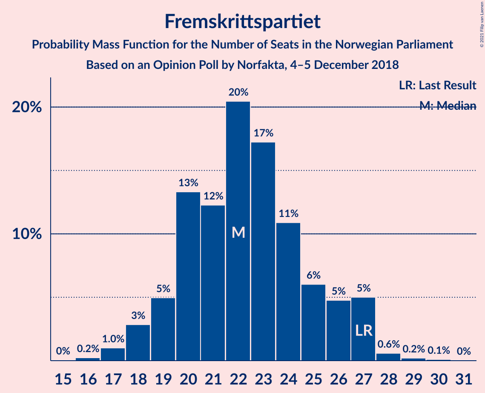
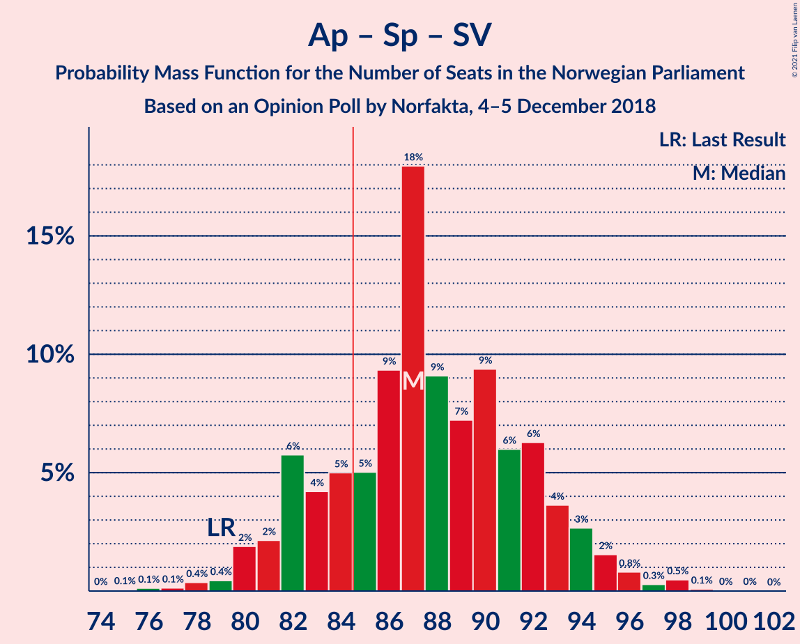
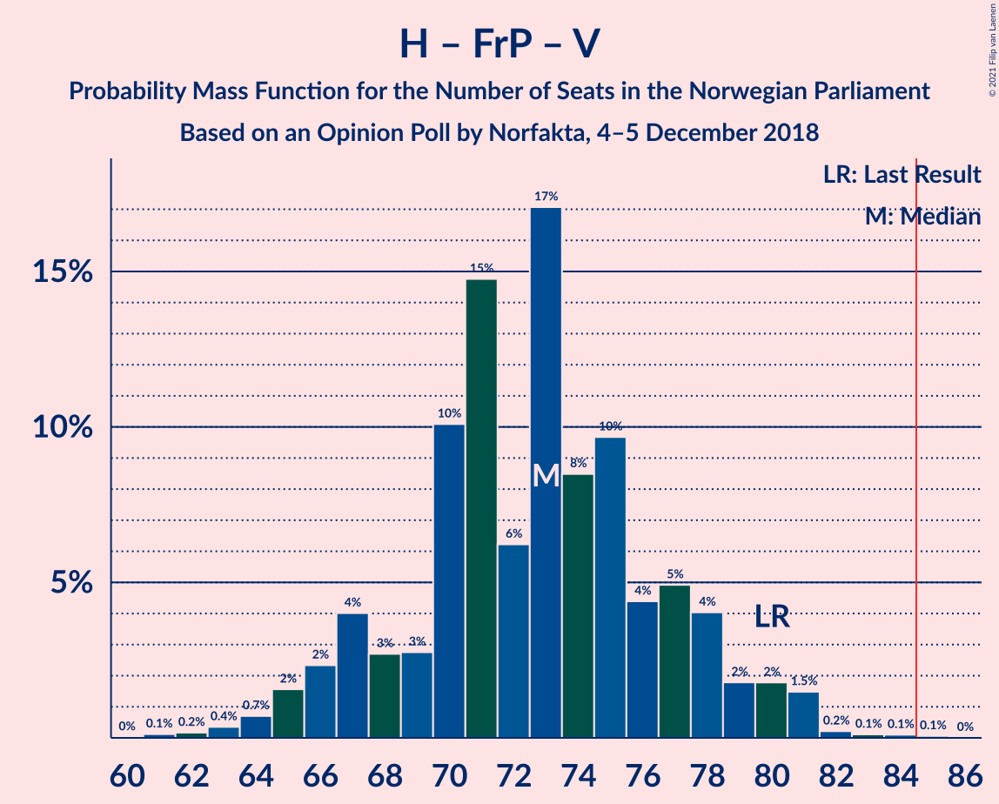

# Opinion Poll by Norfakta, 4–5 December 2018

<a href="#voting-intentions">Voting Intentions</a> | <a href="#seats">Seats</a> | <a href="#coalitions">Coalitions</a> | <a href="#technical-information">Technical Information</a>

## Voting Intentions

### Confidence Intervals

| Party | Last Result | Poll Result | 80% Confidence Interval | 90% Confidence Interval | 95% Confidence Interval | 99% Confidence Interval |
|:-----:|:-----------:|:-----------:|:-----------------------:|:-----------------------:|:-----------------------:|:-----------------------:|
| Arbeiderpartiet | 27.4% | 28.4% | 26.4–30.6% |25.8–31.2% |25.3–31.7% |24.4–32.8% |
| Høyre | 25.0% | 25.9% | 24.0–28.0% |23.4–28.6% |22.9–29.2% |22.0–30.2% |
| Fremskrittspartiet | 15.2% | 12.0% | 10.6–13.6% |10.2–14.1% |9.8–14.5% |9.2–15.3% |
| Senterpartiet | 10.3% | 11.6% | 10.2–13.2% |9.8–13.7% |9.5–14.1% |8.9–14.9% |
| Sosialistisk Venstreparti | 6.0% | 7.4% | 6.3–8.7% |6.0–9.1% |5.7–9.4% |5.2–10.2% |
| Kristelig Folkeparti | 4.2% | 3.8% | 3.1–4.9% |2.9–5.2% |2.7–5.4% |2.3–6.0% |
| Rødt | 2.4% | 3.2% | 2.5–4.1% |2.3–4.4% |2.1–4.7% |1.8–5.2% |
| Venstre | 4.4% | 3.0% | 2.4–4.0% |2.2–4.3% |2.0–4.5% |1.8–5.0% |
| Miljøpartiet De Grønne | 3.2% | 2.5% | 1.9–3.4% |1.7–3.6% |1.6–3.9% |1.4–4.4% |

*Note:* The poll result column reflects the actual value used in the calculations. Published results may vary slightly, and in addition be rounded to fewer digits.

## Seats

### Confidence Intervals

| Party | Last Result | Median | 80% Confidence Interval | 90% Confidence Interval | 95% Confidence Interval | 99% Confidence Interval |
|:-----:|:-----------:|:------:|:-----------------------:|:-----------------------:|:-----------------------:|:-----------------------:|
| <a href="#arbeiderpartiet">Arbeiderpartiet</a> | 49 | 53 | 48–57 |47–59 |46–59 |44–61 |
| <a href="#høyre">Høyre</a> | 45 | 48 | 43–51 |43–53 |42–55 |40–55 |
| <a href="#fremskrittspartiet">Fremskrittspartiet</a> | 27 | 22 | 20–26 |19–27 |18–27 |17–28 |
| <a href="#senterpartiet">Senterpartiet</a> | 19 | 21 | 19–24 |18–25 |18–26 |16–27 |
| <a href="#sosialistisk-venstreparti">Sosialistisk Venstreparti</a> | 11 | 14 | 12–16 |11–17 |10–18 |9–19 |
| <a href="#kristelig-folkeparti">Kristelig Folkeparti</a> | 8 | 3 | 1–9 |1–9 |1–10 |1–11 |
| <a href="#rødt">Rødt</a> | 1 | 2 | 1–7 |1–8 |1–8 |1–9 |
| <a href="#venstre">Venstre</a> | 8 | 2 | 1–7 |1–8 |1–8 |0–9 |
| <a href="#miljøpartiet-de-grønne">Miljøpartiet De Grønne</a> | 1 | 1 | 1–2 |0–2 |0–3 |0–8 |

### Arbeiderpartiet

*For a full overview of the results for this party, see the [Arbeiderpartiet](party-arbeiderpartiet.html) page.*

| Number of Seats | Probability | Accumulated | Special Marks |
|:---------------:|:-----------:|:-----------:|:-------------:|
| 43 | 0.2% | 100% |  |
| 44 | 0.3% | 99.8% |  |
| 45 | 0.7% | 99.5% |  |
| 46 | 2% | 98.8% |  |
| 47 | 3% | 97% |  |
| 48 | 5% | 94% |  |
| 49 | 7% | 89% | Last Result |
| 50 | 14% | 82% |  |
| 51 | 8% | 68% |  |
| 52 | 7% | 61% |  |
| 53 | 7% | 53% | Median |
| 54 | 18% | 46% |  |
| 55 | 10% | 28% |  |
| 56 | 6% | 18% |  |
| 57 | 4% | 12% |  |
| 58 | 3% | 8% |  |
| 59 | 3% | 5% |  |
| 60 | 1.5% | 2% |  |
| 61 | 0.5% | 0.9% |  |
| 62 | 0.2% | 0.4% |  |
| 63 | 0.1% | 0.2% |  |
| 64 | 0% | 0% |  |

### Høyre

*For a full overview of the results for this party, see the [Høyre](party-høyre.html) page.*

| Number of Seats | Probability | Accumulated | Special Marks |
|:---------------:|:-----------:|:-----------:|:-------------:|
| 38 | 0.1% | 100% |  |
| 39 | 0.2% | 99.9% |  |
| 40 | 0.5% | 99.7% |  |
| 41 | 1.0% | 99.2% |  |
| 42 | 2% | 98% |  |
| 43 | 6% | 96% |  |
| 44 | 6% | 89% |  |
| 45 | 4% | 83% | Last Result |
| 46 | 17% | 79% |  |
| 47 | 8% | 62% |  |
| 48 | 12% | 54% | Median |
| 49 | 11% | 42% |  |
| 50 | 12% | 31% |  |
| 51 | 9% | 19% |  |
| 52 | 4% | 10% |  |
| 53 | 2% | 6% |  |
| 54 | 1.3% | 4% |  |
| 55 | 3% | 3% |  |
| 56 | 0.2% | 0.5% |  |
| 57 | 0.1% | 0.2% |  |
| 58 | 0.1% | 0.1% |  |
| 59 | 0% | 0% |  |

### Fremskrittspartiet

*For a full overview of the results for this party, see the [Fremskrittspartiet](party-fremskrittspartiet.html) page.*

| Number of Seats | Probability | Accumulated | Special Marks |
|:---------------:|:-----------:|:-----------:|:-------------:|
| 15 | 0% | 100% |  |
| 16 | 0.2% | 99.9% |  |
| 17 | 1.0% | 99.7% |  |
| 18 | 3% | 98.7% |  |
| 19 | 5% | 96% |  |
| 20 | 13% | 91% |  |
| 21 | 12% | 78% |  |
| 22 | 20% | 65% | Median |
| 23 | 17% | 45% |  |
| 24 | 11% | 28% |  |
| 25 | 6% | 17% |  |
| 26 | 5% | 11% |  |
| 27 | 5% | 6% | Last Result |
| 28 | 0.6% | 0.9% |  |
| 29 | 0.2% | 0.3% |  |
| 30 | 0.1% | 0.1% |  |
| 31 | 0% | 0% |  |

### Senterpartiet

*For a full overview of the results for this party, see the [Senterpartiet](party-senterpartiet.html) page.*

| Number of Seats | Probability | Accumulated | Special Marks |
|:---------------:|:-----------:|:-----------:|:-------------:|
| 15 | 0.1% | 100% |  |
| 16 | 0.5% | 99.8% |  |
| 17 | 2% | 99.4% |  |
| 18 | 6% | 98% |  |
| 19 | 14% | 92% | Last Result |
| 20 | 13% | 77% |  |
| 21 | 18% | 64% | Median |
| 22 | 19% | 46% |  |
| 23 | 12% | 27% |  |
| 24 | 6% | 15% |  |
| 25 | 6% | 9% |  |
| 26 | 2% | 3% |  |
| 27 | 0.8% | 1.2% |  |
| 28 | 0.3% | 0.4% |  |
| 29 | 0.1% | 0.1% |  |
| 30 | 0% | 0% |  |

### Sosialistisk Venstreparti

*For a full overview of the results for this party, see the [Sosialistisk Venstreparti](party-sosialistiskvenstreparti.html) page.*

| Number of Seats | Probability | Accumulated | Special Marks |
|:---------------:|:-----------:|:-----------:|:-------------:|
| 8 | 0% | 100% |  |
| 9 | 0.5% | 99.9% |  |
| 10 | 2% | 99.5% |  |
| 11 | 7% | 97% | Last Result |
| 12 | 15% | 90% |  |
| 13 | 20% | 75% |  |
| 14 | 31% | 55% | Median |
| 15 | 10% | 24% |  |
| 16 | 6% | 14% |  |
| 17 | 4% | 8% |  |
| 18 | 3% | 4% |  |
| 19 | 0.4% | 0.5% |  |
| 20 | 0.1% | 0.1% |  |
| 21 | 0% | 0% |  |

### Kristelig Folkeparti

*For a full overview of the results for this party, see the [Kristelig Folkeparti](party-kristeligfolkeparti.html) page.*

| Number of Seats | Probability | Accumulated | Special Marks |
|:---------------:|:-----------:|:-----------:|:-------------:|
| 0 | 0.4% | 100% |  |
| 1 | 10% | 99.6% |  |
| 2 | 14% | 89% |  |
| 3 | 29% | 75% | Median |
| 4 | 0% | 46% |  |
| 5 | 0% | 46% |  |
| 6 | 0% | 46% |  |
| 7 | 4% | 46% |  |
| 8 | 28% | 42% | Last Result |
| 9 | 9% | 14% |  |
| 10 | 4% | 4% |  |
| 11 | 0.5% | 0.6% |  |
| 12 | 0.1% | 0.1% |  |
| 13 | 0% | 0% |  |

### Rødt

*For a full overview of the results for this party, see the [Rødt](party-rødt.html) page.*

| Number of Seats | Probability | Accumulated | Special Marks |
|:---------------:|:-----------:|:-----------:|:-------------:|
| 1 | 29% | 100% | Last Result |
| 2 | 59% | 71% | Median |
| 3 | 0% | 13% |  |
| 4 | 0% | 13% |  |
| 5 | 0% | 13% |  |
| 6 | 0% | 13% |  |
| 7 | 3% | 13% |  |
| 8 | 8% | 10% |  |
| 9 | 1.3% | 2% |  |
| 10 | 0.3% | 0.3% |  |
| 11 | 0% | 0% |  |

### Venstre

*For a full overview of the results for this party, see the [Venstre](party-venstre.html) page.*

| Number of Seats | Probability | Accumulated | Special Marks |
|:---------------:|:-----------:|:-----------:|:-------------:|
| 0 | 0.6% | 100% |  |
| 1 | 15% | 99.4% |  |
| 2 | 71% | 84% | Median |
| 3 | 2% | 13% |  |
| 4 | 0.1% | 11% |  |
| 5 | 0% | 11% |  |
| 6 | 0% | 11% |  |
| 7 | 1.4% | 11% |  |
| 8 | 9% | 10% | Last Result |
| 9 | 1.0% | 1.1% |  |
| 10 | 0.1% | 0.1% |  |
| 11 | 0% | 0% |  |

### Miljøpartiet De Grønne

*For a full overview of the results for this party, see the [Miljøpartiet De Grønne](party-miljøpartietdegrønne.html) page.*

| Number of Seats | Probability | Accumulated | Special Marks |
|:---------------:|:-----------:|:-----------:|:-------------:|
| 0 | 10% | 100% |  |
| 1 | 74% | 90% | Last Result, Median |
| 2 | 14% | 17% |  |
| 3 | 1.0% | 3% |  |
| 4 | 0% | 2% |  |
| 5 | 0% | 2% |  |
| 6 | 0% | 2% |  |
| 7 | 0.5% | 2% |  |
| 8 | 1.0% | 1.1% |  |
| 9 | 0.1% | 0.2% |  |
| 10 | 0% | 0% |  |

## Coalitions

### Confidence Intervals

| Coalition | Last Result | Median | Majority? | 80% Confidence Interval | 90% Confidence Interval | 95% Confidence Interval | 99% Confidence Interval |
|:---------:|:-----------:|:------:|:---------:|:-----------------------:|:-----------------------:|:-----------------------:|:-----------------------:|
| Høyre – Fremskrittspartiet – Senterpartiet – Kristelig Folkeparti – Venstre | 107 | 99 | 100% | 94–103 | 93–105 | 92–106 | 88–108 |
| Arbeiderpartiet – Senterpartiet – Sosialistisk Venstreparti – Kristelig Folkeparti – Miljøpartiet De Grønne | 88 | 94 | 99.2% | 89–98 | 87–100 | 86–101 | 84–104 |
| Arbeiderpartiet – Senterpartiet – Sosialistisk Venstreparti – Rødt – Miljøpartiet De Grønne | 81 | 91 | 97% | 86–96 | 85–97 | 84–99 | 82–102 |
| Arbeiderpartiet – Senterpartiet – Sosialistisk Venstreparti – Rødt | 80 | 90 | 92% | 85–95 | 84–96 | 83–97 | 81–101 |
| Arbeiderpartiet – Senterpartiet – Sosialistisk Venstreparti – Miljøpartiet De Grønne | 80 | 88 | 85% | 84–94 | 83–95 | 81–96 | 79–99 |
| Arbeiderpartiet – Senterpartiet – Sosialistisk Venstreparti | 79 | 87 | 80% | 82–92 | 81–94 | 80–95 | 78–98 |
| Arbeiderpartiet – Senterpartiet – Kristelig Folkeparti – Miljøpartiet De Grønne | 77 | 81 | 12% | 76–85 | 73–87 | 72–88 | 71–90 |
| Arbeiderpartiet – Senterpartiet – Kristelig Folkeparti | 76 | 79 | 9% | 74–84 | 72–85 | 71–87 | 69–89 |
| Høyre – Fremskrittspartiet – Kristelig Folkeparti – Venstre – Miljøpartiet De Grønne | 89 | 79 | 7% | 74–84 | 73–85 | 72–86 | 68–88 |
| Høyre – Fremskrittspartiet – Kristelig Folkeparti – Venstre | 88 | 78 | 3% | 73–83 | 71–84 | 70–85 | 67–87 |
| Arbeiderpartiet – Senterpartiet | 68 | 73 | 0.1% | 69–79 | 68–80 | 67–81 | 65–83 |
| Høyre – Fremskrittspartiet – Venstre | 80 | 73 | 0.1% | 68–77 | 66–79 | 65–80 | 63–82 |
| Arbeiderpartiet – Sosialistisk Venstreparti – Rødt – Miljøpartiet De Grønne | 62 | 70 | 0% | 66–75 | 64–76 | 63–77 | 61–81 |
| Høyre – Fremskrittspartiet | 72 | 70 | 0% | 65–74 | 64–75 | 63–77 | 60–79 |
| Arbeiderpartiet – Sosialistisk Venstreparti | 60 | 67 | 0% | 61–71 | 60–72 | 59–73 | 57–75 |
| Høyre – Kristelig Folkeparti – Venstre | 61 | 56 | 0% | 51–60 | 49–62 | 47–63 | 46–65 |
| Senterpartiet – Kristelig Folkeparti – Venstre | 35 | 29 | 0% | 24–34 | 23–35 | 22–37 | 21–38 |

### Høyre – Fremskrittspartiet – Senterpartiet – Kristelig Folkeparti – Venstre

| Number of Seats | Probability | Accumulated | Special Marks |
|:---------------:|:-----------:|:-----------:|:-------------:|
| 86 | 0.1% | 100% |  |
| 87 | 0.1% | 99.8% |  |
| 88 | 0.3% | 99.8% |  |
| 89 | 0.5% | 99.5% |  |
| 90 | 0.5% | 98.9% |  |
| 91 | 0.8% | 98% |  |
| 92 | 1.3% | 98% |  |
| 93 | 2% | 96% |  |
| 94 | 6% | 94% |  |
| 95 | 4% | 88% |  |
| 96 | 6% | 84% | Median |
| 97 | 10% | 78% |  |
| 98 | 17% | 68% |  |
| 99 | 7% | 51% |  |
| 100 | 7% | 43% |  |
| 101 | 9% | 36% |  |
| 102 | 5% | 27% |  |
| 103 | 12% | 22% |  |
| 104 | 3% | 9% |  |
| 105 | 3% | 7% |  |
| 106 | 2% | 4% |  |
| 107 | 1.2% | 2% | Last Result |
| 108 | 0.4% | 0.7% |  |
| 109 | 0.2% | 0.3% |  |
| 110 | 0.1% | 0.1% |  |
| 111 | 0% | 0% |  |

### Arbeiderpartiet – Senterpartiet – Sosialistisk Venstreparti – Kristelig Folkeparti – Miljøpartiet De Grønne

| Number of Seats | Probability | Accumulated | Special Marks |
|:---------------:|:-----------:|:-----------:|:-------------:|
| 81 | 0% | 100% |  |
| 82 | 0.1% | 99.9% |  |
| 83 | 0.2% | 99.8% |  |
| 84 | 0.4% | 99.6% |  |
| 85 | 0.5% | 99.2% | Majority |
| 86 | 3% | 98.7% |  |
| 87 | 2% | 96% |  |
| 88 | 1.4% | 94% | Last Result |
| 89 | 5% | 92% |  |
| 90 | 6% | 87% |  |
| 91 | 6% | 81% |  |
| 92 | 8% | 75% | Median |
| 93 | 8% | 66% |  |
| 94 | 12% | 59% |  |
| 95 | 12% | 47% |  |
| 96 | 14% | 35% |  |
| 97 | 5% | 21% |  |
| 98 | 7% | 15% |  |
| 99 | 2% | 8% |  |
| 100 | 3% | 6% |  |
| 101 | 1.0% | 3% |  |
| 102 | 1.0% | 2% |  |
| 103 | 0.4% | 0.9% |  |
| 104 | 0.4% | 0.5% |  |
| 105 | 0.1% | 0.2% |  |
| 106 | 0% | 0.1% |  |
| 107 | 0% | 0% |  |

### Arbeiderpartiet – Senterpartiet – Sosialistisk Venstreparti – Rødt – Miljøpartiet De Grønne

| Number of Seats | Probability | Accumulated | Special Marks |
|:---------------:|:-----------:|:-----------:|:-------------:|
| 78 | 0% | 100% |  |
| 79 | 0% | 99.9% |  |
| 80 | 0.1% | 99.9% |  |
| 81 | 0.1% | 99.8% | Last Result |
| 82 | 0.8% | 99.7% |  |
| 83 | 0.7% | 98.9% |  |
| 84 | 2% | 98% |  |
| 85 | 3% | 97% | Majority |
| 86 | 5% | 94% |  |
| 87 | 5% | 89% |  |
| 88 | 8% | 84% |  |
| 89 | 7% | 76% |  |
| 90 | 15% | 69% |  |
| 91 | 10% | 54% | Median |
| 92 | 5% | 44% |  |
| 93 | 11% | 39% |  |
| 94 | 7% | 27% |  |
| 95 | 4% | 20% |  |
| 96 | 7% | 15% |  |
| 97 | 3% | 8% |  |
| 98 | 2% | 5% |  |
| 99 | 0.9% | 3% |  |
| 100 | 0.5% | 2% |  |
| 101 | 0.9% | 1.4% |  |
| 102 | 0.3% | 0.6% |  |
| 103 | 0.2% | 0.3% |  |
| 104 | 0.1% | 0.1% |  |
| 105 | 0% | 0% |  |

### Arbeiderpartiet – Senterpartiet – Sosialistisk Venstreparti – Rødt

| Number of Seats | Probability | Accumulated | Special Marks |
|:---------------:|:-----------:|:-----------:|:-------------:|
| 77 | 0% | 100% |  |
| 78 | 0.1% | 99.9% |  |
| 79 | 0.1% | 99.9% |  |
| 80 | 0.2% | 99.8% | Last Result |
| 81 | 0.8% | 99.6% |  |
| 82 | 1.1% | 98.8% |  |
| 83 | 2% | 98% |  |
| 84 | 3% | 96% |  |
| 85 | 5% | 92% | Majority |
| 86 | 5% | 88% |  |
| 87 | 8% | 83% |  |
| 88 | 6% | 75% |  |
| 89 | 15% | 69% |  |
| 90 | 12% | 54% | Median |
| 91 | 5% | 42% |  |
| 92 | 11% | 37% |  |
| 93 | 8% | 26% |  |
| 94 | 4% | 18% |  |
| 95 | 7% | 14% |  |
| 96 | 3% | 7% |  |
| 97 | 2% | 4% |  |
| 98 | 0.7% | 2% |  |
| 99 | 0.3% | 2% |  |
| 100 | 0.8% | 1.3% |  |
| 101 | 0.4% | 0.5% |  |
| 102 | 0.1% | 0.1% |  |
| 103 | 0% | 0.1% |  |
| 104 | 0% | 0% |  |

### Arbeiderpartiet – Senterpartiet – Sosialistisk Venstreparti – Miljøpartiet De Grønne

| Number of Seats | Probability | Accumulated | Special Marks |
|:---------------:|:-----------:|:-----------:|:-------------:|
| 76 | 0.1% | 100% |  |
| 77 | 0.1% | 99.9% |  |
| 78 | 0.2% | 99.9% |  |
| 79 | 0.3% | 99.7% |  |
| 80 | 0.4% | 99.3% | Last Result |
| 81 | 2% | 99.0% |  |
| 82 | 2% | 97% |  |
| 83 | 5% | 96% |  |
| 84 | 5% | 90% |  |
| 85 | 3% | 85% | Majority |
| 86 | 6% | 82% |  |
| 87 | 10% | 76% |  |
| 88 | 17% | 66% |  |
| 89 | 8% | 49% | Median |
| 90 | 8% | 40% |  |
| 91 | 10% | 33% |  |
| 92 | 5% | 23% |  |
| 93 | 7% | 17% |  |
| 94 | 4% | 11% |  |
| 95 | 3% | 7% |  |
| 96 | 2% | 4% |  |
| 97 | 0.8% | 2% |  |
| 98 | 0.4% | 1.2% |  |
| 99 | 0.5% | 0.8% |  |
| 100 | 0.2% | 0.3% |  |
| 101 | 0.1% | 0.1% |  |
| 102 | 0% | 0% |  |

### Arbeiderpartiet – Senterpartiet – Sosialistisk Venstreparti

| Number of Seats | Probability | Accumulated | Special Marks |
|:---------------:|:-----------:|:-----------:|:-------------:|
| 75 | 0.1% | 100% |  |
| 76 | 0.1% | 99.9% |  |
| 77 | 0.1% | 99.8% |  |
| 78 | 0.4% | 99.6% |  |
| 79 | 0.4% | 99.3% | Last Result |
| 80 | 2% | 98.8% |  |
| 81 | 2% | 97% |  |
| 82 | 6% | 95% |  |
| 83 | 4% | 89% |  |
| 84 | 5% | 85% |  |
| 85 | 5% | 80% | Majority |
| 86 | 9% | 75% |  |
| 87 | 18% | 65% |  |
| 88 | 9% | 48% | Median |
| 89 | 7% | 38% |  |
| 90 | 9% | 31% |  |
| 91 | 6% | 22% |  |
| 92 | 6% | 16% |  |
| 93 | 4% | 10% |  |
| 94 | 3% | 6% |  |
| 95 | 2% | 3% |  |
| 96 | 0.8% | 2% |  |
| 97 | 0.3% | 0.9% |  |
| 98 | 0.5% | 0.6% |  |
| 99 | 0.1% | 0.2% |  |
| 100 | 0% | 0.1% |  |
| 101 | 0% | 0% |  |

### Arbeiderpartiet – Senterpartiet – Kristelig Folkeparti – Miljøpartiet De Grønne

| Number of Seats | Probability | Accumulated | Special Marks |
|:---------------:|:-----------:|:-----------:|:-------------:|
| 68 | 0.1% | 100% |  |
| 69 | 0.2% | 99.9% |  |
| 70 | 0.2% | 99.7% |  |
| 71 | 0.6% | 99.6% |  |
| 72 | 2% | 98.9% |  |
| 73 | 3% | 97% |  |
| 74 | 2% | 94% |  |
| 75 | 2% | 92% |  |
| 76 | 8% | 90% |  |
| 77 | 6% | 82% | Last Result |
| 78 | 8% | 76% | Median |
| 79 | 7% | 67% |  |
| 80 | 9% | 60% |  |
| 81 | 13% | 51% |  |
| 82 | 14% | 38% |  |
| 83 | 4% | 24% |  |
| 84 | 8% | 20% |  |
| 85 | 2% | 12% | Majority |
| 86 | 4% | 9% |  |
| 87 | 2% | 5% |  |
| 88 | 2% | 4% |  |
| 89 | 0.4% | 1.2% |  |
| 90 | 0.5% | 0.8% |  |
| 91 | 0.2% | 0.3% |  |
| 92 | 0.1% | 0.1% |  |
| 93 | 0.1% | 0.1% |  |
| 94 | 0% | 0% |  |

### Arbeiderpartiet – Senterpartiet – Kristelig Folkeparti

| Number of Seats | Probability | Accumulated | Special Marks |
|:---------------:|:-----------:|:-----------:|:-------------:|
| 66 | 0.1% | 100% |  |
| 67 | 0% | 99.9% |  |
| 68 | 0.2% | 99.9% |  |
| 69 | 0.2% | 99.7% |  |
| 70 | 0.7% | 99.5% |  |
| 71 | 2% | 98.8% |  |
| 72 | 3% | 97% |  |
| 73 | 3% | 94% |  |
| 74 | 2% | 91% |  |
| 75 | 7% | 89% |  |
| 76 | 8% | 82% | Last Result |
| 77 | 9% | 75% | Median |
| 78 | 7% | 66% |  |
| 79 | 9% | 58% |  |
| 80 | 14% | 49% |  |
| 81 | 12% | 35% |  |
| 82 | 5% | 23% |  |
| 83 | 7% | 18% |  |
| 84 | 2% | 11% |  |
| 85 | 4% | 9% | Majority |
| 86 | 1.3% | 5% |  |
| 87 | 2% | 3% |  |
| 88 | 0.4% | 0.9% |  |
| 89 | 0.4% | 0.5% |  |
| 90 | 0.1% | 0.2% |  |
| 91 | 0.1% | 0.1% |  |
| 92 | 0% | 0% |  |

### Høyre – Fremskrittspartiet – Kristelig Folkeparti – Venstre – Miljøpartiet De Grønne

| Number of Seats | Probability | Accumulated | Special Marks |
|:---------------:|:-----------:|:-----------:|:-------------:|
| 66 | 0% | 100% |  |
| 67 | 0.1% | 99.9% |  |
| 68 | 0.4% | 99.9% |  |
| 69 | 0.8% | 99.4% |  |
| 70 | 0.4% | 98.6% |  |
| 71 | 0.8% | 98% |  |
| 72 | 2% | 98% |  |
| 73 | 3% | 96% |  |
| 74 | 7% | 92% |  |
| 75 | 4% | 86% |  |
| 76 | 8% | 82% | Median |
| 77 | 11% | 74% |  |
| 78 | 5% | 63% |  |
| 79 | 12% | 58% |  |
| 80 | 15% | 46% |  |
| 81 | 6% | 31% |  |
| 82 | 8% | 25% |  |
| 83 | 5% | 17% |  |
| 84 | 5% | 12% |  |
| 85 | 3% | 7% | Majority |
| 86 | 2% | 4% |  |
| 87 | 1.1% | 2% |  |
| 88 | 0.8% | 1.2% |  |
| 89 | 0.2% | 0.4% | Last Result |
| 90 | 0.1% | 0.2% |  |
| 91 | 0% | 0.1% |  |
| 92 | 0% | 0.1% |  |
| 93 | 0% | 0% |  |

### Høyre – Fremskrittspartiet – Kristelig Folkeparti – Venstre

| Number of Seats | Probability | Accumulated | Special Marks |
|:---------------:|:-----------:|:-----------:|:-------------:|
| 65 | 0.1% | 100% |  |
| 66 | 0.2% | 99.9% |  |
| 67 | 0.3% | 99.7% |  |
| 68 | 0.9% | 99.4% |  |
| 69 | 0.5% | 98.5% |  |
| 70 | 0.9% | 98% |  |
| 71 | 2% | 97% |  |
| 72 | 3% | 95% |  |
| 73 | 7% | 92% |  |
| 74 | 4% | 84% |  |
| 75 | 7% | 80% | Median |
| 76 | 11% | 73% |  |
| 77 | 5% | 61% |  |
| 78 | 10% | 56% |  |
| 79 | 15% | 45% |  |
| 80 | 7% | 31% |  |
| 81 | 8% | 24% |  |
| 82 | 5% | 16% |  |
| 83 | 5% | 11% |  |
| 84 | 3% | 6% |  |
| 85 | 2% | 3% | Majority |
| 86 | 0.7% | 2% |  |
| 87 | 0.8% | 1.1% |  |
| 88 | 0.1% | 0.3% | Last Result |
| 89 | 0.1% | 0.2% |  |
| 90 | 0% | 0.1% |  |
| 91 | 0% | 0.1% |  |
| 92 | 0% | 0% |  |

### Arbeiderpartiet – Senterpartiet

| Number of Seats | Probability | Accumulated | Special Marks |
|:---------------:|:-----------:|:-----------:|:-------------:|
| 62 | 0% | 100% |  |
| 63 | 0.1% | 99.9% |  |
| 64 | 0.2% | 99.8% |  |
| 65 | 0.6% | 99.6% |  |
| 66 | 0.8% | 99.0% |  |
| 67 | 1.3% | 98% |  |
| 68 | 3% | 97% | Last Result |
| 69 | 7% | 93% |  |
| 70 | 4% | 87% |  |
| 71 | 7% | 83% |  |
| 72 | 12% | 77% |  |
| 73 | 15% | 65% |  |
| 74 | 10% | 50% | Median |
| 75 | 7% | 40% |  |
| 76 | 6% | 34% |  |
| 77 | 11% | 27% |  |
| 78 | 4% | 17% |  |
| 79 | 4% | 12% |  |
| 80 | 4% | 8% |  |
| 81 | 2% | 4% |  |
| 82 | 1.2% | 2% |  |
| 83 | 0.6% | 0.9% |  |
| 84 | 0.2% | 0.3% |  |
| 85 | 0% | 0.1% | Majority |
| 86 | 0% | 0.1% |  |
| 87 | 0% | 0% |  |

### Høyre – Fremskrittspartiet – Venstre

| Number of Seats | Probability | Accumulated | Special Marks |
|:---------------:|:-----------:|:-----------:|:-------------:|
| 60 | 0% | 100% |  |
| 61 | 0.1% | 99.9% |  |
| 62 | 0.2% | 99.8% |  |
| 63 | 0.4% | 99.7% |  |
| 64 | 0.7% | 99.3% |  |
| 65 | 2% | 98.6% |  |
| 66 | 2% | 97% |  |
| 67 | 4% | 95% |  |
| 68 | 3% | 91% |  |
| 69 | 3% | 88% |  |
| 70 | 10% | 85% |  |
| 71 | 15% | 75% |  |
| 72 | 6% | 60% | Median |
| 73 | 17% | 54% |  |
| 74 | 8% | 37% |  |
| 75 | 10% | 29% |  |
| 76 | 4% | 19% |  |
| 77 | 5% | 15% |  |
| 78 | 4% | 10% |  |
| 79 | 2% | 6% |  |
| 80 | 2% | 4% | Last Result |
| 81 | 1.5% | 2% |  |
| 82 | 0.2% | 0.5% |  |
| 83 | 0.1% | 0.3% |  |
| 84 | 0.1% | 0.2% |  |
| 85 | 0.1% | 0.1% | Majority |
| 86 | 0% | 0% |  |

### Arbeiderpartiet – Sosialistisk Venstreparti – Rødt – Miljøpartiet De Grønne

| Number of Seats | Probability | Accumulated | Special Marks |
|:---------------:|:-----------:|:-----------:|:-------------:|
| 58 | 0% | 100% |  |
| 59 | 0.1% | 99.9% |  |
| 60 | 0.2% | 99.9% |  |
| 61 | 0.4% | 99.7% |  |
| 62 | 1.2% | 99.3% | Last Result |
| 63 | 2% | 98% |  |
| 64 | 3% | 96% |  |
| 65 | 3% | 93% |  |
| 66 | 12% | 90% |  |
| 67 | 5% | 78% |  |
| 68 | 9% | 73% |  |
| 69 | 7% | 64% |  |
| 70 | 7% | 56% | Median |
| 71 | 17% | 49% |  |
| 72 | 10% | 32% |  |
| 73 | 6% | 22% |  |
| 74 | 4% | 16% |  |
| 75 | 6% | 12% |  |
| 76 | 2% | 6% |  |
| 77 | 1.3% | 4% |  |
| 78 | 0.8% | 2% |  |
| 79 | 0.5% | 1.5% |  |
| 80 | 0.5% | 1.0% |  |
| 81 | 0.3% | 0.5% |  |
| 82 | 0.1% | 0.2% |  |
| 83 | 0.1% | 0.2% |  |
| 84 | 0% | 0% |  |

### Høyre – Fremskrittspartiet

| Number of Seats | Probability | Accumulated | Special Marks |
|:---------------:|:-----------:|:-----------:|:-------------:|
| 58 | 0.1% | 100% |  |
| 59 | 0.1% | 99.9% |  |
| 60 | 0.5% | 99.8% |  |
| 61 | 0.7% | 99.3% |  |
| 62 | 0.7% | 98.6% |  |
| 63 | 2% | 98% |  |
| 64 | 3% | 96% |  |
| 65 | 4% | 93% |  |
| 66 | 3% | 89% |  |
| 67 | 4% | 85% |  |
| 68 | 10% | 82% |  |
| 69 | 14% | 71% |  |
| 70 | 7% | 57% | Median |
| 71 | 12% | 50% |  |
| 72 | 14% | 38% | Last Result |
| 73 | 11% | 24% |  |
| 74 | 4% | 13% |  |
| 75 | 5% | 9% |  |
| 76 | 2% | 5% |  |
| 77 | 0.9% | 3% |  |
| 78 | 0.8% | 2% |  |
| 79 | 0.7% | 0.9% |  |
| 80 | 0.1% | 0.2% |  |
| 81 | 0.1% | 0.1% |  |
| 82 | 0% | 0.1% |  |
| 83 | 0% | 0% |  |

### Arbeiderpartiet – Sosialistisk Venstreparti

| Number of Seats | Probability | Accumulated | Special Marks |
|:---------------:|:-----------:|:-----------:|:-------------:|
| 55 | 0.1% | 100% |  |
| 56 | 0.1% | 99.9% |  |
| 57 | 0.4% | 99.8% |  |
| 58 | 0.9% | 99.4% |  |
| 59 | 1.1% | 98.5% |  |
| 60 | 3% | 97% | Last Result |
| 61 | 5% | 95% |  |
| 62 | 3% | 90% |  |
| 63 | 7% | 87% |  |
| 64 | 14% | 80% |  |
| 65 | 7% | 66% |  |
| 66 | 9% | 59% |  |
| 67 | 8% | 50% | Median |
| 68 | 18% | 43% |  |
| 69 | 10% | 25% |  |
| 70 | 5% | 15% |  |
| 71 | 4% | 11% |  |
| 72 | 4% | 7% |  |
| 73 | 2% | 3% |  |
| 74 | 0.5% | 2% |  |
| 75 | 0.7% | 1.1% |  |
| 76 | 0.3% | 0.4% |  |
| 77 | 0.1% | 0.2% |  |
| 78 | 0% | 0.1% |  |
| 79 | 0% | 0% |  |

### Høyre – Kristelig Folkeparti – Venstre

| Number of Seats | Probability | Accumulated | Special Marks |
|:---------------:|:-----------:|:-----------:|:-------------:|
| 44 | 0.1% | 100% |  |
| 45 | 0.2% | 99.9% |  |
| 46 | 0.5% | 99.7% |  |
| 47 | 2% | 99.3% |  |
| 48 | 1.2% | 97% |  |
| 49 | 2% | 96% |  |
| 50 | 4% | 94% |  |
| 51 | 7% | 90% |  |
| 52 | 10% | 84% |  |
| 53 | 7% | 73% | Median |
| 54 | 7% | 66% |  |
| 55 | 7% | 60% |  |
| 56 | 15% | 52% |  |
| 57 | 7% | 37% |  |
| 58 | 7% | 30% |  |
| 59 | 9% | 23% |  |
| 60 | 5% | 14% |  |
| 61 | 2% | 9% | Last Result |
| 62 | 3% | 7% |  |
| 63 | 2% | 4% |  |
| 64 | 1.2% | 2% |  |
| 65 | 0.4% | 0.7% |  |
| 66 | 0.2% | 0.3% |  |
| 67 | 0.1% | 0.1% |  |
| 68 | 0.1% | 0.1% |  |
| 69 | 0% | 0% |  |

### Senterpartiet – Kristelig Folkeparti – Venstre

| Number of Seats | Probability | Accumulated | Special Marks |
|:---------------:|:-----------:|:-----------:|:-------------:|
| 19 | 0.1% | 100% |  |
| 20 | 0.2% | 99.9% |  |
| 21 | 0.6% | 99.7% |  |
| 22 | 3% | 99.1% |  |
| 23 | 4% | 96% |  |
| 24 | 4% | 93% |  |
| 25 | 9% | 89% |  |
| 26 | 10% | 79% | Median |
| 27 | 6% | 69% |  |
| 28 | 7% | 63% |  |
| 29 | 11% | 56% |  |
| 30 | 8% | 45% |  |
| 31 | 12% | 37% |  |
| 32 | 8% | 25% |  |
| 33 | 6% | 17% |  |
| 34 | 3% | 11% |  |
| 35 | 2% | 7% | Last Result |
| 36 | 2% | 5% |  |
| 37 | 2% | 3% |  |
| 38 | 0.4% | 0.9% |  |
| 39 | 0.2% | 0.5% |  |
| 40 | 0.1% | 0.2% |  |
| 41 | 0% | 0.1% |  |
| 42 | 0% | 0% |  |

## Technical Information

### Opinion Poll

+ **Polling firm:** Norfakta
+ **Commissioner(s):** —
+ **Fieldwork period:** 4–5 December 2018

### Calculations

+ **Sample size:** 760
+ **Simulations done:** 1,048,576
+ **Error estimate:** 1.97%

