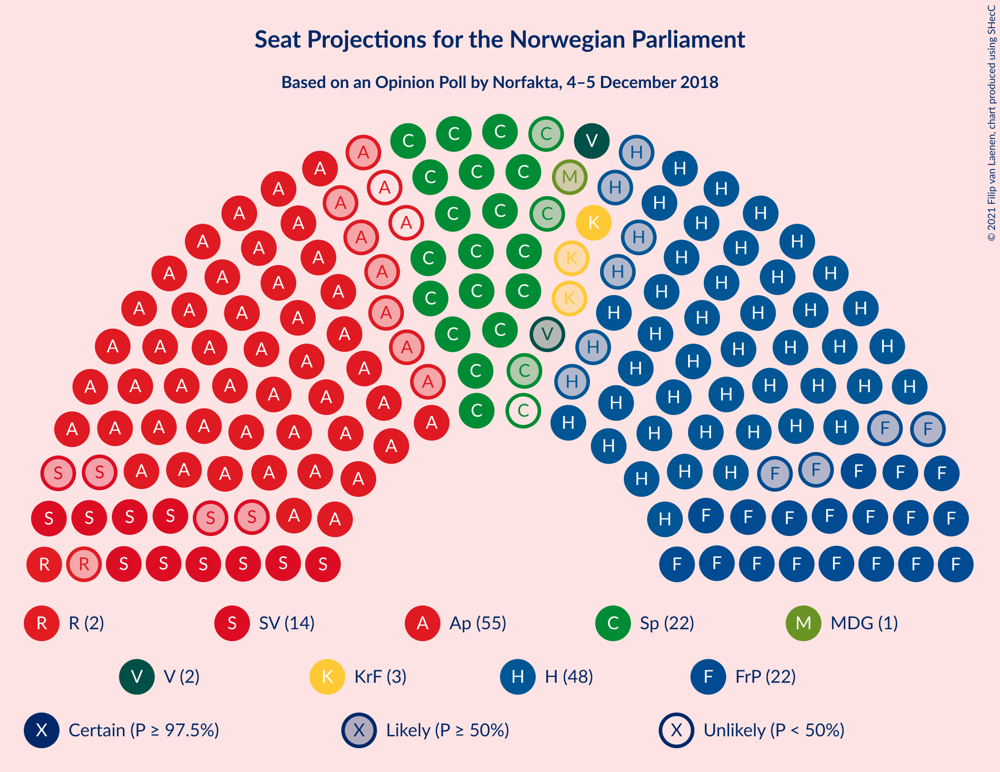
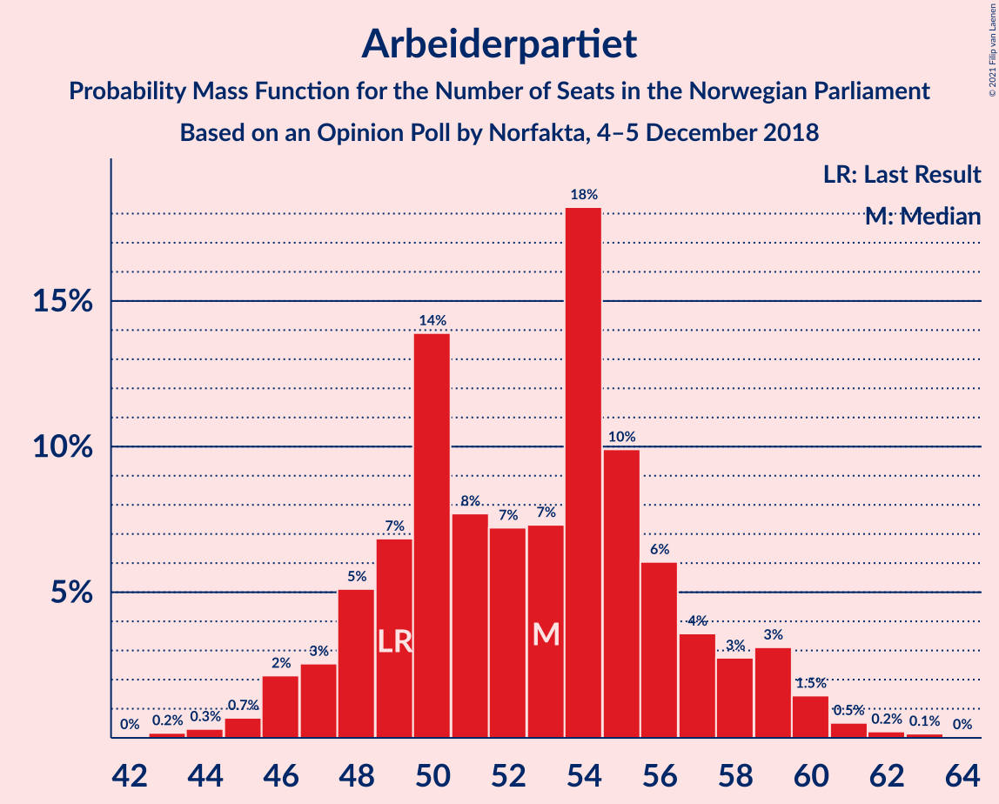
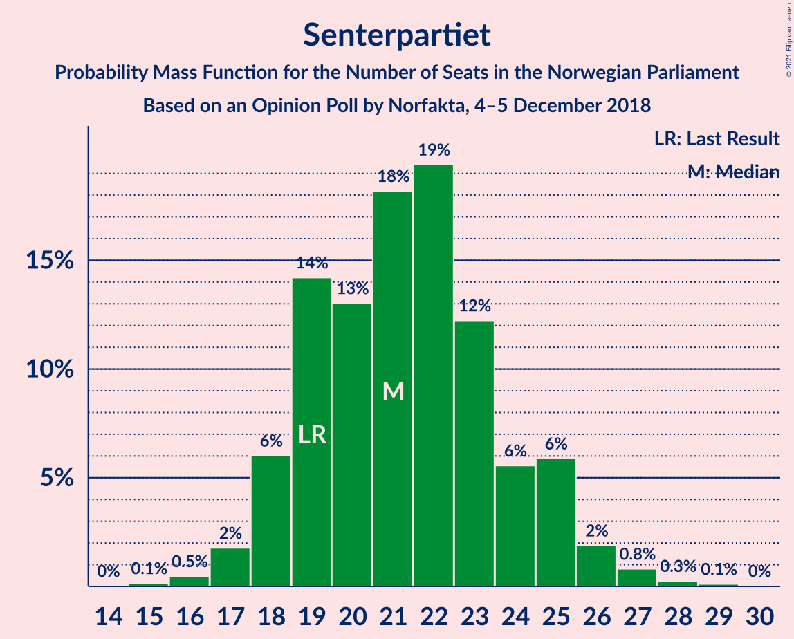
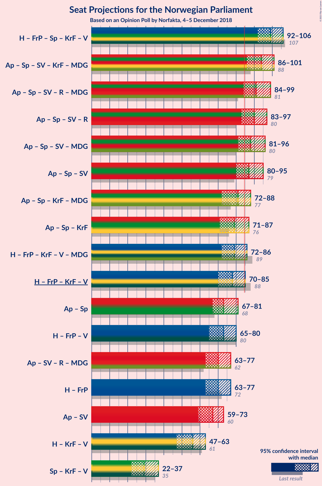
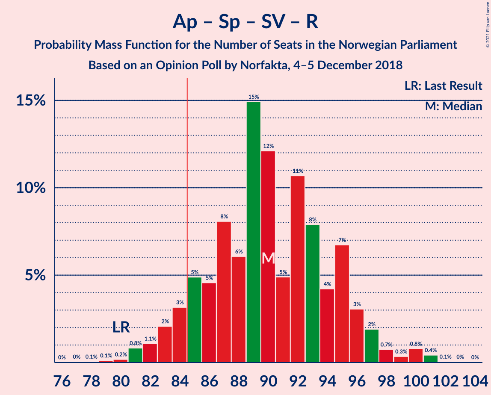
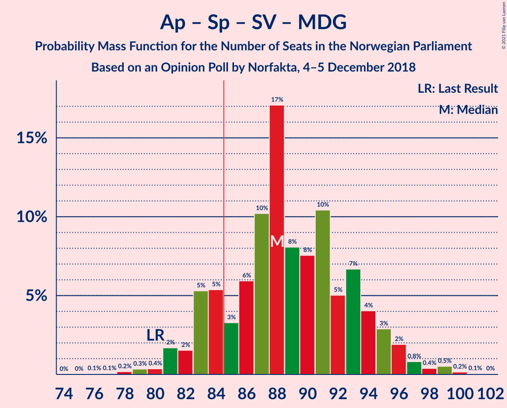
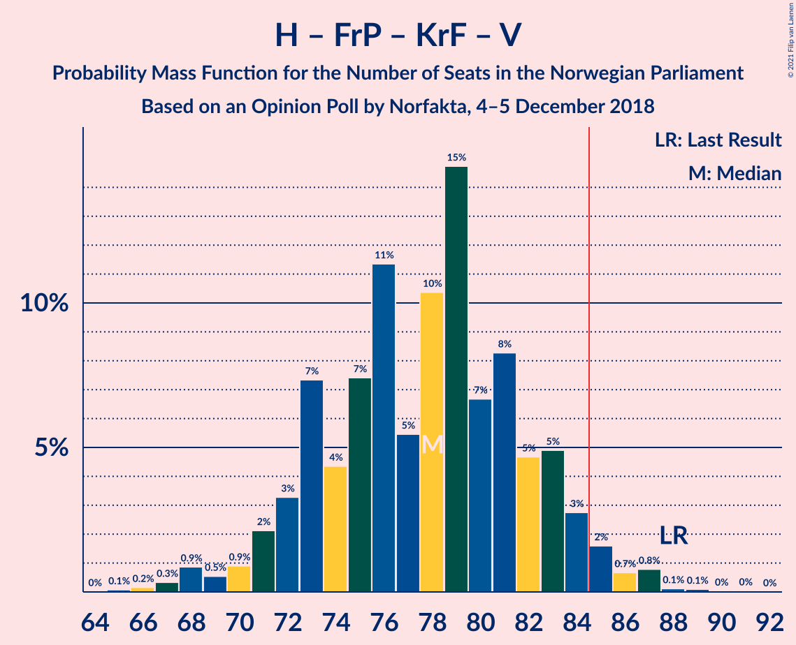
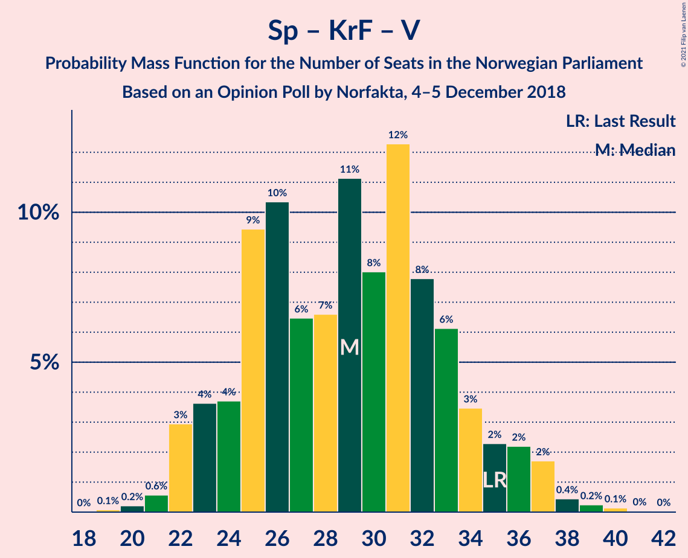

# Opinion Poll by Norfakta, 4–5 December 2018

<a href="#voting-intentions">Voting Intentions</a> | <a href="#seats">Seats</a> | <a href="#coalitions">Coalitions</a> | <a href="#technical-information">Technical Information</a>

## Voting Intentions

### Confidence Intervals

| Party | Last Result | Poll Result | 80% Confidence Interval | 90% Confidence Interval | 95% Confidence Interval | 99% Confidence Interval |
|:-----:|:-----------:|:-----------:|:-----------------------:|:-----------------------:|:-----------------------:|:-----------------------:|
| Arbeiderpartiet | 27.4% | 28.4% | 26.4–30.6% |25.8–31.2% |25.3–31.7% |24.4–32.8% |
| Høyre | 25.0% | 25.9% | 24.0–28.0% |23.4–28.6% |22.9–29.2% |22.0–30.2% |
| Fremskrittspartiet | 15.2% | 12.0% | 10.6–13.6% |10.2–14.1% |9.8–14.5% |9.2–15.3% |
| Senterpartiet | 10.3% | 11.6% | 10.2–13.2% |9.8–13.7% |9.5–14.1% |8.9–14.9% |
| Sosialistisk Venstreparti | 6.0% | 7.4% | 6.3–8.7% |6.0–9.1% |5.7–9.4% |5.2–10.2% |
| Kristelig Folkeparti | 4.2% | 3.8% | 3.1–4.9% |2.9–5.2% |2.7–5.4% |2.3–6.0% |
| Rødt | 2.4% | 3.2% | 2.5–4.1% |2.3–4.4% |2.1–4.7% |1.8–5.2% |
| Venstre | 4.4% | 3.0% | 2.4–4.0% |2.2–4.3% |2.0–4.5% |1.8–5.0% |
| Miljøpartiet De Grønne | 3.2% | 2.5% | 1.9–3.4% |1.7–3.6% |1.6–3.9% |1.4–4.4% |

*Note:* The poll result column reflects the actual value used in the calculations. Published results may vary slightly, and in addition be rounded to fewer digits.

## Seats

### Confidence Intervals

| Party | Last Result | Median | 80% Confidence Interval | 90% Confidence Interval | 95% Confidence Interval | 99% Confidence Interval |
|:-----:|:-----------:|:------:|:-----------------------:|:-----------------------:|:-----------------------:|:-----------------------:|
| <a href="#arbeiderpartiet">Arbeiderpartiet</a> | 49 | 53 | 48–58 |47–59 |47–59 |44–62 |
| <a href="#høyre">Høyre</a> | 45 | 48 | 44–51 |42–53 |42–54 |40–56 |
| <a href="#fremskrittspartiet">Fremskrittspartiet</a> | 27 | 22 | 19–25 |18–26 |17–27 |17–28 |
| <a href="#senterpartiet">Senterpartiet</a> | 19 | 21 | 18–24 |18–25 |17–26 |16–28 |
| <a href="#sosialistisk-venstreparti">Sosialistisk Venstreparti</a> | 11 | 14 | 11–16 |10–18 |10–18 |9–19 |
| <a href="#kristelig-folkeparti">Kristelig Folkeparti</a> | 8 | 3 | 1–9 |1–9 |1–10 |1–11 |
| <a href="#rødt">Rødt</a> | 1 | 2 | 1–7 |1–8 |1–9 |1–9 |
| <a href="#venstre">Venstre</a> | 8 | 2 | 1–8 |1–8 |1–8 |0–9 |
| <a href="#miljøpartiet-de-grønne">Miljøpartiet De Grønne</a> | 1 | 1 | 0–2 |0–2 |0–2 |0–8 |

### Arbeiderpartiet

*For a full overview of the results for this party, see the [Arbeiderpartiet](party-arbeiderpartiet.html) page.*

| Number of Seats | Probability | Accumulated | Special Marks |
|:---------------:|:-----------:|:-----------:|:-------------:|
| 43 | 0.2% | 100% |  |
| 44 | 0.4% | 99.7% |  |
| 45 | 0.4% | 99.3% |  |
| 46 | 1.3% | 99.0% |  |
| 47 | 3% | 98% |  |
| 48 | 7% | 95% |  |
| 49 | 5% | 87% | Last Result |
| 50 | 12% | 82% |  |
| 51 | 14% | 70% |  |
| 52 | 5% | 55% |  |
| 53 | 15% | 51% | Median |
| 54 | 11% | 35% |  |
| 55 | 2% | 24% |  |
| 56 | 7% | 23% |  |
| 57 | 3% | 15% |  |
| 58 | 4% | 12% |  |
| 59 | 7% | 9% |  |
| 60 | 0.2% | 2% |  |
| 61 | 0.6% | 2% |  |
| 62 | 1.0% | 1.1% |  |
| 63 | 0% | 0.1% |  |
| 64 | 0% | 0% |  |

### Høyre

*For a full overview of the results for this party, see the [Høyre](party-høyre.html) page.*

| Number of Seats | Probability | Accumulated | Special Marks |
|:---------------:|:-----------:|:-----------:|:-------------:|
| 38 | 0.2% | 100% |  |
| 39 | 0.2% | 99.8% |  |
| 40 | 0.5% | 99.6% |  |
| 41 | 1.4% | 99.1% |  |
| 42 | 3% | 98% |  |
| 43 | 3% | 95% |  |
| 44 | 14% | 92% |  |
| 45 | 4% | 78% | Last Result |
| 46 | 4% | 74% |  |
| 47 | 8% | 70% |  |
| 48 | 25% | 62% | Median |
| 49 | 4% | 37% |  |
| 50 | 7% | 33% |  |
| 51 | 16% | 25% |  |
| 52 | 1.2% | 9% |  |
| 53 | 3% | 8% |  |
| 54 | 4% | 5% |  |
| 55 | 0.7% | 1.3% |  |
| 56 | 0.3% | 0.5% |  |
| 57 | 0.1% | 0.2% |  |
| 58 | 0.1% | 0.1% |  |
| 59 | 0% | 0% |  |

### Fremskrittspartiet

*For a full overview of the results for this party, see the [Fremskrittspartiet](party-fremskrittspartiet.html) page.*

| Number of Seats | Probability | Accumulated | Special Marks |
|:---------------:|:-----------:|:-----------:|:-------------:|
| 15 | 0.1% | 100% |  |
| 16 | 0.1% | 99.9% |  |
| 17 | 3% | 99.8% |  |
| 18 | 5% | 97% |  |
| 19 | 9% | 92% |  |
| 20 | 7% | 83% |  |
| 21 | 18% | 76% |  |
| 22 | 14% | 57% | Median |
| 23 | 7% | 44% |  |
| 24 | 22% | 37% |  |
| 25 | 9% | 15% |  |
| 26 | 3% | 6% |  |
| 27 | 2% | 3% | Last Result |
| 28 | 0.4% | 0.8% |  |
| 29 | 0.3% | 0.4% |  |
| 30 | 0% | 0.1% |  |
| 31 | 0.1% | 0.1% |  |
| 32 | 0% | 0% |  |

### Senterpartiet

*For a full overview of the results for this party, see the [Senterpartiet](party-senterpartiet.html) page.*

| Number of Seats | Probability | Accumulated | Special Marks |
|:---------------:|:-----------:|:-----------:|:-------------:|
| 14 | 0.1% | 100% |  |
| 15 | 0.4% | 99.9% |  |
| 16 | 1.0% | 99.5% |  |
| 17 | 1.1% | 98.5% |  |
| 18 | 8% | 97% |  |
| 19 | 8% | 90% | Last Result |
| 20 | 13% | 82% |  |
| 21 | 19% | 69% | Median |
| 22 | 21% | 50% |  |
| 23 | 15% | 29% |  |
| 24 | 6% | 14% |  |
| 25 | 4% | 8% |  |
| 26 | 3% | 4% |  |
| 27 | 0.4% | 1.1% |  |
| 28 | 0.5% | 0.6% |  |
| 29 | 0.1% | 0.2% |  |
| 30 | 0% | 0.1% |  |
| 31 | 0% | 0% |  |

### Sosialistisk Venstreparti

*For a full overview of the results for this party, see the [Sosialistisk Venstreparti](party-sosialistiskvenstreparti.html) page.*

| Number of Seats | Probability | Accumulated | Special Marks |
|:---------------:|:-----------:|:-----------:|:-------------:|
| 8 | 0.1% | 100% |  |
| 9 | 0.5% | 99.9% |  |
| 10 | 7% | 99.4% |  |
| 11 | 5% | 93% | Last Result |
| 12 | 23% | 88% |  |
| 13 | 9% | 65% |  |
| 14 | 24% | 56% | Median |
| 15 | 10% | 31% |  |
| 16 | 11% | 21% |  |
| 17 | 5% | 10% |  |
| 18 | 4% | 5% |  |
| 19 | 1.1% | 1.1% |  |
| 20 | 0% | 0.1% |  |
| 21 | 0% | 0% |  |

### Kristelig Folkeparti

*For a full overview of the results for this party, see the [Kristelig Folkeparti](party-kristeligfolkeparti.html) page.*

| Number of Seats | Probability | Accumulated | Special Marks |
|:---------------:|:-----------:|:-----------:|:-------------:|
| 0 | 0.3% | 100% |  |
| 1 | 19% | 99.7% |  |
| 2 | 20% | 81% |  |
| 3 | 14% | 60% | Median |
| 4 | 0% | 46% |  |
| 5 | 0% | 46% |  |
| 6 | 0% | 46% |  |
| 7 | 4% | 46% |  |
| 8 | 14% | 42% | Last Result |
| 9 | 25% | 29% |  |
| 10 | 3% | 4% |  |
| 11 | 0.9% | 1.0% |  |
| 12 | 0.1% | 0.1% |  |
| 13 | 0% | 0% |  |

### Rødt

*For a full overview of the results for this party, see the [Rødt](party-rødt.html) page.*

| Number of Seats | Probability | Accumulated | Special Marks |
|:---------------:|:-----------:|:-----------:|:-------------:|
| 1 | 30% | 100% | Last Result |
| 2 | 58% | 70% | Median |
| 3 | 0% | 12% |  |
| 4 | 0% | 12% |  |
| 5 | 0% | 12% |  |
| 6 | 0% | 12% |  |
| 7 | 3% | 12% |  |
| 8 | 6% | 9% |  |
| 9 | 2% | 3% |  |
| 10 | 0.2% | 0.2% |  |
| 11 | 0% | 0% |  |

### Venstre

*For a full overview of the results for this party, see the [Venstre](party-venstre.html) page.*

| Number of Seats | Probability | Accumulated | Special Marks |
|:---------------:|:-----------:|:-----------:|:-------------:|
| 0 | 0.9% | 100% |  |
| 1 | 14% | 99.1% |  |
| 2 | 66% | 85% | Median |
| 3 | 6% | 19% |  |
| 4 | 0.7% | 14% |  |
| 5 | 0% | 13% |  |
| 6 | 0% | 13% |  |
| 7 | 3% | 13% |  |
| 8 | 8% | 10% | Last Result |
| 9 | 2% | 2% |  |
| 10 | 0.4% | 0.4% |  |
| 11 | 0% | 0% |  |

### Miljøpartiet De Grønne

*For a full overview of the results for this party, see the [Miljøpartiet De Grønne](party-miljøpartietdegrønne.html) page.*

| Number of Seats | Probability | Accumulated | Special Marks |
|:---------------:|:-----------:|:-----------:|:-------------:|
| 0 | 12% | 100% |  |
| 1 | 69% | 88% | Last Result, Median |
| 2 | 17% | 19% |  |
| 3 | 0.6% | 2% |  |
| 4 | 0% | 2% |  |
| 5 | 0% | 2% |  |
| 6 | 0% | 2% |  |
| 7 | 0.5% | 2% |  |
| 8 | 0.8% | 1.0% |  |
| 9 | 0.2% | 0.2% |  |
| 10 | 0% | 0% |  |

## Coalitions

### Confidence Intervals

| Coalition | Last Result | Median | Majority? | 80% Confidence Interval | 90% Confidence Interval | 95% Confidence Interval | 99% Confidence Interval |
|:---------:|:-----------:|:------:|:---------:|:-----------------------:|:-----------------------:|:-----------------------:|:-----------------------:|
| Høyre – Fremskrittspartiet – Senterpartiet – Kristelig Folkeparti – Venstre | 107 | 99 | 100% | 94–104 | 93–105 | 91–106 | 88–108 |
| Arbeiderpartiet – Senterpartiet – Sosialistisk Venstreparti – Kristelig Folkeparti – Miljøpartiet De Grønne | 88 | 94 | 98.8% | 87–99 | 87–100 | 87–102 | 84–104 |
| Arbeiderpartiet – Senterpartiet – Sosialistisk Venstreparti – Rødt – Miljøpartiet De Grønne | 81 | 91 | 97% | 86–97 | 86–99 | 84–101 | 82–102 |
| Arbeiderpartiet – Senterpartiet – Sosialistisk Venstreparti – Rødt | 80 | 90 | 91% | 85–96 | 84–97 | 83–100 | 81–101 |
| Arbeiderpartiet – Senterpartiet – Sosialistisk Venstreparti – Miljøpartiet De Grønne | 80 | 89 | 82% | 84–95 | 83–95 | 82–98 | 80–99 |
| Arbeiderpartiet – Senterpartiet – Sosialistisk Venstreparti | 79 | 88 | 77% | 82–93 | 82–94 | 81–96 | 78–98 |
| Arbeiderpartiet – Senterpartiet – Kristelig Folkeparti – Miljøpartiet De Grønne | 77 | 81 | 16% | 74–86 | 72–87 | 72–88 | 70–89 |
| Arbeiderpartiet – Senterpartiet – Kristelig Folkeparti | 76 | 80 | 10% | 73–84 | 72–85 | 71–86 | 69–89 |
| Høyre – Fremskrittspartiet – Kristelig Folkeparti – Venstre – Miljøpartiet De Grønne | 89 | 79 | 9% | 73–84 | 72–85 | 69–86 | 68–88 |
| Høyre – Fremskrittspartiet – Kristelig Folkeparti – Venstre | 88 | 78 | 2% | 72–83 | 70–83 | 68–84 | 67–87 |
| Arbeiderpartiet – Senterpartiet | 68 | 74 | 0.3% | 70–80 | 69–82 | 67–82 | 65–83 |
| Høyre – Fremskrittspartiet – Venstre | 80 | 72 | 0.1% | 67–79 | 66–80 | 65–80 | 63–82 |
| Høyre – Fremskrittspartiet | 72 | 70 | 0% | 65–74 | 63–77 | 61–78 | 60–79 |
| Arbeiderpartiet – Sosialistisk Venstreparti | 60 | 66 | 0% | 61–71 | 60–72 | 59–73 | 57–75 |
| Høyre – Kristelig Folkeparti – Venstre | 61 | 55 | 0% | 51–60 | 49–62 | 47–62 | 46–66 |
| Senterpartiet – Kristelig Folkeparti – Venstre | 35 | 28 | 0% | 24–34 | 23–36 | 23–37 | 20–39 |

### Høyre – Fremskrittspartiet – Senterpartiet – Kristelig Folkeparti – Venstre

| Number of Seats | Probability | Accumulated | Special Marks |
|:---------------:|:-----------:|:-----------:|:-------------:|
| 85 | 0% | 100% | Majority |
| 86 | 0% | 99.9% |  |
| 87 | 0.1% | 99.9% |  |
| 88 | 0.4% | 99.8% |  |
| 89 | 1.2% | 99.4% |  |
| 90 | 0.5% | 98% |  |
| 91 | 1.2% | 98% |  |
| 92 | 1.1% | 97% |  |
| 93 | 3% | 95% |  |
| 94 | 3% | 93% |  |
| 95 | 16% | 89% |  |
| 96 | 2% | 74% | Median |
| 97 | 9% | 71% |  |
| 98 | 11% | 63% |  |
| 99 | 4% | 51% |  |
| 100 | 2% | 47% |  |
| 101 | 15% | 46% |  |
| 102 | 5% | 30% |  |
| 103 | 10% | 25% |  |
| 104 | 7% | 16% |  |
| 105 | 5% | 9% |  |
| 106 | 2% | 4% |  |
| 107 | 1.1% | 2% | Last Result |
| 108 | 0.3% | 0.6% |  |
| 109 | 0.2% | 0.3% |  |
| 110 | 0.1% | 0.1% |  |
| 111 | 0.1% | 0.1% |  |
| 112 | 0% | 0% |  |

### Arbeiderpartiet – Senterpartiet – Sosialistisk Venstreparti – Kristelig Folkeparti – Miljøpartiet De Grønne

| Number of Seats | Probability | Accumulated | Special Marks |
|:---------------:|:-----------:|:-----------:|:-------------:|
| 82 | 0.1% | 100% |  |
| 83 | 0.2% | 99.9% |  |
| 84 | 0.8% | 99.6% |  |
| 85 | 0.5% | 98.8% | Majority |
| 86 | 0.4% | 98% |  |
| 87 | 11% | 98% |  |
| 88 | 1.1% | 87% | Last Result |
| 89 | 3% | 85% |  |
| 90 | 3% | 82% |  |
| 91 | 3% | 79% |  |
| 92 | 13% | 76% | Median |
| 93 | 10% | 63% |  |
| 94 | 5% | 53% |  |
| 95 | 4% | 47% |  |
| 96 | 12% | 43% |  |
| 97 | 11% | 31% |  |
| 98 | 10% | 20% |  |
| 99 | 1.5% | 10% |  |
| 100 | 4% | 9% |  |
| 101 | 2% | 5% |  |
| 102 | 1.3% | 3% |  |
| 103 | 0.8% | 1.4% |  |
| 104 | 0.4% | 0.6% |  |
| 105 | 0% | 0.2% |  |
| 106 | 0.1% | 0.1% |  |
| 107 | 0% | 0% |  |

### Arbeiderpartiet – Senterpartiet – Sosialistisk Venstreparti – Rødt – Miljøpartiet De Grønne

| Number of Seats | Probability | Accumulated | Special Marks |
|:---------------:|:-----------:|:-----------:|:-------------:|
| 79 | 0% | 100% |  |
| 80 | 0.2% | 99.9% |  |
| 81 | 0.1% | 99.7% | Last Result |
| 82 | 0.3% | 99.6% |  |
| 83 | 0.8% | 99.4% |  |
| 84 | 1.2% | 98.5% |  |
| 85 | 1.2% | 97% | Majority |
| 86 | 12% | 96% |  |
| 87 | 5% | 84% |  |
| 88 | 9% | 79% |  |
| 89 | 2% | 70% |  |
| 90 | 16% | 68% |  |
| 91 | 5% | 52% | Median |
| 92 | 11% | 47% |  |
| 93 | 9% | 36% |  |
| 94 | 3% | 27% |  |
| 95 | 5% | 24% |  |
| 96 | 4% | 19% |  |
| 97 | 9% | 15% |  |
| 98 | 0.5% | 6% |  |
| 99 | 1.3% | 5% |  |
| 100 | 1.0% | 4% |  |
| 101 | 2% | 3% |  |
| 102 | 0.3% | 0.7% |  |
| 103 | 0% | 0.3% |  |
| 104 | 0.2% | 0.3% |  |
| 105 | 0% | 0% |  |

### Arbeiderpartiet – Senterpartiet – Sosialistisk Venstreparti – Rødt

| Number of Seats | Probability | Accumulated | Special Marks |
|:---------------:|:-----------:|:-----------:|:-------------:|
| 77 | 0% | 100% |  |
| 78 | 0% | 99.9% |  |
| 79 | 0.2% | 99.9% |  |
| 80 | 0.1% | 99.7% | Last Result |
| 81 | 0.5% | 99.6% |  |
| 82 | 0.6% | 99.1% |  |
| 83 | 2% | 98% |  |
| 84 | 6% | 97% |  |
| 85 | 8% | 91% | Majority |
| 86 | 6% | 83% |  |
| 87 | 5% | 77% |  |
| 88 | 4% | 72% |  |
| 89 | 17% | 68% |  |
| 90 | 5% | 51% | Median |
| 91 | 10% | 46% |  |
| 92 | 7% | 36% |  |
| 93 | 7% | 28% |  |
| 94 | 4% | 22% |  |
| 95 | 7% | 18% |  |
| 96 | 6% | 11% |  |
| 97 | 1.0% | 5% |  |
| 98 | 1.1% | 4% |  |
| 99 | 0.2% | 3% |  |
| 100 | 2% | 3% |  |
| 101 | 0.3% | 0.6% |  |
| 102 | 0% | 0.3% |  |
| 103 | 0.2% | 0.3% |  |
| 104 | 0% | 0% |  |

### Arbeiderpartiet – Senterpartiet – Sosialistisk Venstreparti – Miljøpartiet De Grønne

| Number of Seats | Probability | Accumulated | Special Marks |
|:---------------:|:-----------:|:-----------:|:-------------:|
| 75 | 0.1% | 100% |  |
| 76 | 0% | 99.9% |  |
| 77 | 0.1% | 99.9% |  |
| 78 | 0.1% | 99.8% |  |
| 79 | 0.3% | 99.8% |  |
| 80 | 0.5% | 99.5% | Last Result |
| 81 | 1.0% | 99.0% |  |
| 82 | 1.5% | 98% |  |
| 83 | 2% | 97% |  |
| 84 | 13% | 95% |  |
| 85 | 5% | 82% | Majority |
| 86 | 8% | 77% |  |
| 87 | 6% | 68% |  |
| 88 | 6% | 62% |  |
| 89 | 14% | 56% | Median |
| 90 | 15% | 42% |  |
| 91 | 3% | 27% |  |
| 92 | 5% | 24% |  |
| 93 | 2% | 19% |  |
| 94 | 4% | 17% |  |
| 95 | 9% | 13% |  |
| 96 | 0.4% | 4% |  |
| 97 | 0.3% | 3% |  |
| 98 | 0.5% | 3% |  |
| 99 | 2% | 2% |  |
| 100 | 0% | 0.3% |  |
| 101 | 0% | 0.3% |  |
| 102 | 0.2% | 0.2% |  |
| 103 | 0% | 0% |  |

### Arbeiderpartiet – Senterpartiet – Sosialistisk Venstreparti

| Number of Seats | Probability | Accumulated | Special Marks |
|:---------------:|:-----------:|:-----------:|:-------------:|
| 74 | 0.1% | 100% |  |
| 75 | 0% | 99.9% |  |
| 76 | 0.1% | 99.9% |  |
| 77 | 0.1% | 99.8% |  |
| 78 | 0.4% | 99.8% |  |
| 79 | 0.5% | 99.4% | Last Result |
| 80 | 0.7% | 98.8% |  |
| 81 | 2% | 98% |  |
| 82 | 6% | 96% |  |
| 83 | 9% | 90% |  |
| 84 | 4% | 81% |  |
| 85 | 7% | 77% | Majority |
| 86 | 8% | 70% |  |
| 87 | 6% | 62% |  |
| 88 | 16% | 56% | Median |
| 89 | 12% | 39% |  |
| 90 | 5% | 27% |  |
| 91 | 5% | 22% |  |
| 92 | 1.4% | 17% |  |
| 93 | 6% | 16% |  |
| 94 | 7% | 10% |  |
| 95 | 0.4% | 3% |  |
| 96 | 0.2% | 3% |  |
| 97 | 0.2% | 2% |  |
| 98 | 2% | 2% |  |
| 99 | 0% | 0.2% |  |
| 100 | 0% | 0.2% |  |
| 101 | 0.2% | 0.2% |  |
| 102 | 0% | 0% |  |

### Arbeiderpartiet – Senterpartiet – Kristelig Folkeparti – Miljøpartiet De Grønne

| Number of Seats | Probability | Accumulated | Special Marks |
|:---------------:|:-----------:|:-----------:|:-------------:|
| 69 | 0.4% | 100% |  |
| 70 | 0.2% | 99.5% |  |
| 71 | 0.8% | 99.3% |  |
| 72 | 4% | 98.5% |  |
| 73 | 3% | 95% |  |
| 74 | 4% | 91% |  |
| 75 | 6% | 87% |  |
| 76 | 2% | 81% |  |
| 77 | 3% | 79% | Last Result |
| 78 | 13% | 76% | Median |
| 79 | 3% | 63% |  |
| 80 | 8% | 60% |  |
| 81 | 10% | 52% |  |
| 82 | 11% | 42% |  |
| 83 | 7% | 31% |  |
| 84 | 8% | 23% |  |
| 85 | 5% | 16% | Majority |
| 86 | 6% | 11% |  |
| 87 | 2% | 6% |  |
| 88 | 1.2% | 3% |  |
| 89 | 2% | 2% |  |
| 90 | 0.1% | 0.4% |  |
| 91 | 0.1% | 0.3% |  |
| 92 | 0.1% | 0.3% |  |
| 93 | 0.1% | 0.1% |  |
| 94 | 0% | 0% |  |

### Arbeiderpartiet – Senterpartiet – Kristelig Folkeparti

| Number of Seats | Probability | Accumulated | Special Marks |
|:---------------:|:-----------:|:-----------:|:-------------:|
| 67 | 0% | 100% |  |
| 68 | 0.4% | 99.9% |  |
| 69 | 0.2% | 99.5% |  |
| 70 | 1.1% | 99.3% |  |
| 71 | 1.0% | 98% |  |
| 72 | 5% | 97% |  |
| 73 | 11% | 92% |  |
| 74 | 0.7% | 82% |  |
| 75 | 2% | 81% |  |
| 76 | 3% | 79% | Last Result |
| 77 | 13% | 76% | Median |
| 78 | 5% | 62% |  |
| 79 | 5% | 57% |  |
| 80 | 10% | 51% |  |
| 81 | 12% | 41% |  |
| 82 | 7% | 29% |  |
| 83 | 8% | 22% |  |
| 84 | 4% | 14% |  |
| 85 | 5% | 10% | Majority |
| 86 | 2% | 5% |  |
| 87 | 0.9% | 2% |  |
| 88 | 0.2% | 2% |  |
| 89 | 1.0% | 1.3% |  |
| 90 | 0.1% | 0.3% |  |
| 91 | 0.2% | 0.2% |  |
| 92 | 0% | 0% |  |

### Høyre – Fremskrittspartiet – Kristelig Folkeparti – Venstre – Miljøpartiet De Grønne

| Number of Seats | Probability | Accumulated | Special Marks |
|:---------------:|:-----------:|:-----------:|:-------------:|
| 66 | 0.2% | 100% |  |
| 67 | 0.1% | 99.7% |  |
| 68 | 0.3% | 99.7% |  |
| 69 | 2% | 99.3% |  |
| 70 | 0.2% | 97% |  |
| 71 | 1.1% | 97% |  |
| 72 | 1.0% | 96% |  |
| 73 | 6% | 95% |  |
| 74 | 7% | 89% |  |
| 75 | 4% | 82% |  |
| 76 | 7% | 78% | Median |
| 77 | 7% | 72% |  |
| 78 | 11% | 64% |  |
| 79 | 5% | 54% |  |
| 80 | 17% | 49% |  |
| 81 | 4% | 32% |  |
| 82 | 5% | 28% |  |
| 83 | 6% | 23% |  |
| 84 | 8% | 17% |  |
| 85 | 6% | 9% | Majority |
| 86 | 1.3% | 3% |  |
| 87 | 0.6% | 1.5% |  |
| 88 | 0.5% | 0.9% |  |
| 89 | 0.1% | 0.4% | Last Result |
| 90 | 0.2% | 0.3% |  |
| 91 | 0% | 0.1% |  |
| 92 | 0% | 0% |  |

### Høyre – Fremskrittspartiet – Kristelig Folkeparti – Venstre

| Number of Seats | Probability | Accumulated | Special Marks |
|:---------------:|:-----------:|:-----------:|:-------------:|
| 64 | 0% | 100% |  |
| 65 | 0.2% | 99.9% |  |
| 66 | 0.1% | 99.7% |  |
| 67 | 0.3% | 99.6% |  |
| 68 | 2% | 99.3% |  |
| 69 | 1.0% | 97% |  |
| 70 | 1.3% | 96% |  |
| 71 | 0.5% | 95% |  |
| 72 | 9% | 94% |  |
| 73 | 4% | 85% |  |
| 74 | 5% | 81% |  |
| 75 | 3% | 76% | Median |
| 76 | 9% | 73% |  |
| 77 | 11% | 64% |  |
| 78 | 5% | 53% |  |
| 79 | 16% | 48% |  |
| 80 | 2% | 31% |  |
| 81 | 9% | 30% |  |
| 82 | 5% | 21% |  |
| 83 | 12% | 16% |  |
| 84 | 1.2% | 4% |  |
| 85 | 1.0% | 2% | Majority |
| 86 | 0.8% | 1.4% |  |
| 87 | 0.3% | 0.6% |  |
| 88 | 0.1% | 0.3% | Last Result |
| 89 | 0.2% | 0.2% |  |
| 90 | 0% | 0.1% |  |
| 91 | 0% | 0% |  |

### Arbeiderpartiet – Senterpartiet

| Number of Seats | Probability | Accumulated | Special Marks |
|:---------------:|:-----------:|:-----------:|:-------------:|
| 62 | 0.1% | 100% |  |
| 63 | 0.1% | 99.9% |  |
| 64 | 0.1% | 99.8% |  |
| 65 | 0.7% | 99.7% |  |
| 66 | 0.7% | 99.1% |  |
| 67 | 0.9% | 98% |  |
| 68 | 1.4% | 97% | Last Result |
| 69 | 4% | 96% |  |
| 70 | 7% | 92% |  |
| 71 | 15% | 85% |  |
| 72 | 13% | 70% |  |
| 73 | 5% | 58% |  |
| 74 | 8% | 52% | Median |
| 75 | 16% | 45% |  |
| 76 | 9% | 29% |  |
| 77 | 4% | 20% |  |
| 78 | 3% | 15% |  |
| 79 | 2% | 12% |  |
| 80 | 0.9% | 10% |  |
| 81 | 0.5% | 9% |  |
| 82 | 7% | 9% |  |
| 83 | 2% | 2% |  |
| 84 | 0% | 0.3% |  |
| 85 | 0% | 0.3% | Majority |
| 86 | 0.2% | 0.3% |  |
| 87 | 0% | 0% |  |

### Høyre – Fremskrittspartiet – Venstre

| Number of Seats | Probability | Accumulated | Special Marks |
|:---------------:|:-----------:|:-----------:|:-------------:|
| 61 | 0.2% | 100% |  |
| 62 | 0.1% | 99.8% |  |
| 63 | 0.3% | 99.7% |  |
| 64 | 0.6% | 99.4% |  |
| 65 | 1.4% | 98.8% |  |
| 66 | 3% | 97% |  |
| 67 | 7% | 94% |  |
| 68 | 3% | 87% |  |
| 69 | 2% | 85% |  |
| 70 | 15% | 83% |  |
| 71 | 14% | 68% |  |
| 72 | 5% | 54% | Median |
| 73 | 3% | 49% |  |
| 74 | 13% | 46% |  |
| 75 | 14% | 33% |  |
| 76 | 1.4% | 19% |  |
| 77 | 4% | 17% |  |
| 78 | 3% | 14% |  |
| 79 | 1.0% | 10% |  |
| 80 | 8% | 9% | Last Result |
| 81 | 0.2% | 1.0% |  |
| 82 | 0.3% | 0.8% |  |
| 83 | 0.2% | 0.5% |  |
| 84 | 0.2% | 0.3% |  |
| 85 | 0.1% | 0.1% | Majority |
| 86 | 0% | 0% |  |

### Høyre – Fremskrittspartiet

| Number of Seats | Probability | Accumulated | Special Marks |
|:---------------:|:-----------:|:-----------:|:-------------:|
| 57 | 0.1% | 100% |  |
| 58 | 0% | 99.9% |  |
| 59 | 0.2% | 99.9% |  |
| 60 | 2% | 99.7% |  |
| 61 | 0.4% | 98% |  |
| 62 | 0.7% | 97% |  |
| 63 | 2% | 96% |  |
| 64 | 3% | 95% |  |
| 65 | 4% | 92% |  |
| 66 | 6% | 87% |  |
| 67 | 1.3% | 82% |  |
| 68 | 16% | 80% |  |
| 69 | 13% | 64% |  |
| 70 | 3% | 51% | Median |
| 71 | 8% | 48% |  |
| 72 | 10% | 40% | Last Result |
| 73 | 18% | 30% |  |
| 74 | 2% | 12% |  |
| 75 | 3% | 10% |  |
| 76 | 1.1% | 6% |  |
| 77 | 1.0% | 5% |  |
| 78 | 4% | 4% |  |
| 79 | 0.1% | 0.6% |  |
| 80 | 0.2% | 0.4% |  |
| 81 | 0.2% | 0.3% |  |
| 82 | 0% | 0% |  |

### Arbeiderpartiet – Sosialistisk Venstreparti

| Number of Seats | Probability | Accumulated | Special Marks |
|:---------------:|:-----------:|:-----------:|:-------------:|
| 55 | 0.1% | 100% |  |
| 56 | 0.1% | 99.9% |  |
| 57 | 0.3% | 99.8% |  |
| 58 | 0.3% | 99.5% |  |
| 59 | 2% | 99.1% |  |
| 60 | 5% | 97% | Last Result |
| 61 | 4% | 92% |  |
| 62 | 2% | 88% |  |
| 63 | 13% | 86% |  |
| 64 | 6% | 73% |  |
| 65 | 8% | 67% |  |
| 66 | 15% | 59% |  |
| 67 | 3% | 44% | Median |
| 68 | 12% | 41% |  |
| 69 | 3% | 29% |  |
| 70 | 11% | 25% |  |
| 71 | 8% | 15% |  |
| 72 | 2% | 7% |  |
| 73 | 2% | 5% |  |
| 74 | 1.0% | 2% |  |
| 75 | 0.8% | 1.2% |  |
| 76 | 0.1% | 0.4% |  |
| 77 | 0.3% | 0.3% |  |
| 78 | 0.1% | 0.1% |  |
| 79 | 0% | 0% |  |

### Høyre – Kristelig Folkeparti – Venstre

| Number of Seats | Probability | Accumulated | Special Marks |
|:---------------:|:-----------:|:-----------:|:-------------:|
| 44 | 0% | 100% |  |
| 45 | 0.2% | 99.9% |  |
| 46 | 0.6% | 99.7% |  |
| 47 | 3% | 99.1% |  |
| 48 | 0.8% | 96% |  |
| 49 | 1.5% | 96% |  |
| 50 | 4% | 94% |  |
| 51 | 9% | 90% |  |
| 52 | 5% | 81% |  |
| 53 | 2% | 76% | Median |
| 54 | 3% | 74% |  |
| 55 | 22% | 71% |  |
| 56 | 11% | 49% |  |
| 57 | 5% | 38% |  |
| 58 | 13% | 34% |  |
| 59 | 6% | 20% |  |
| 60 | 5% | 14% |  |
| 61 | 1.5% | 9% | Last Result |
| 62 | 5% | 7% |  |
| 63 | 0.4% | 2% |  |
| 64 | 0.2% | 2% |  |
| 65 | 1.1% | 2% |  |
| 66 | 0.4% | 0.5% |  |
| 67 | 0.1% | 0.1% |  |
| 68 | 0% | 0.1% |  |
| 69 | 0% | 0% |  |

### Senterpartiet – Kristelig Folkeparti – Venstre

| Number of Seats | Probability | Accumulated | Special Marks |
|:---------------:|:-----------:|:-----------:|:-------------:|
| 18 | 0.1% | 100% |  |
| 19 | 0.1% | 99.9% |  |
| 20 | 0.5% | 99.9% |  |
| 21 | 0.3% | 99.4% |  |
| 22 | 1.4% | 99.0% |  |
| 23 | 4% | 98% |  |
| 24 | 5% | 93% |  |
| 25 | 11% | 88% |  |
| 26 | 12% | 77% | Median |
| 27 | 6% | 65% |  |
| 28 | 8% | 58% |  |
| 29 | 4% | 50% |  |
| 30 | 10% | 46% |  |
| 31 | 2% | 37% |  |
| 32 | 3% | 34% |  |
| 33 | 20% | 32% |  |
| 34 | 2% | 11% |  |
| 35 | 4% | 10% | Last Result |
| 36 | 2% | 6% |  |
| 37 | 3% | 4% |  |
| 38 | 0.4% | 1.4% |  |
| 39 | 0.9% | 1.0% |  |
| 40 | 0.1% | 0.2% |  |
| 41 | 0.1% | 0.1% |  |
| 42 | 0% | 0% |  |

## Technical Information

### Opinion Poll

+ **Polling firm:** Norfakta
+ **Commissioner(s):** —
+ **Fieldwork period:** 4–5 December 2018

### Calculations

+ **Sample size:** 760
+ **Simulations done:** 131,072
+ **Error estimate:** 2.12%

