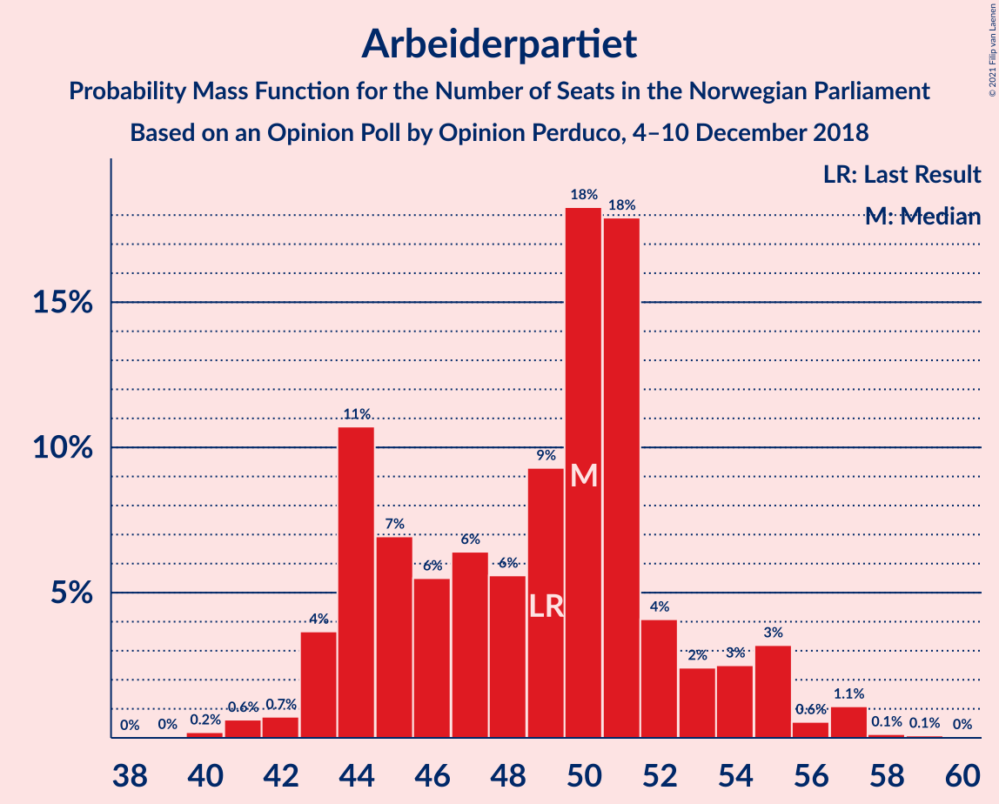
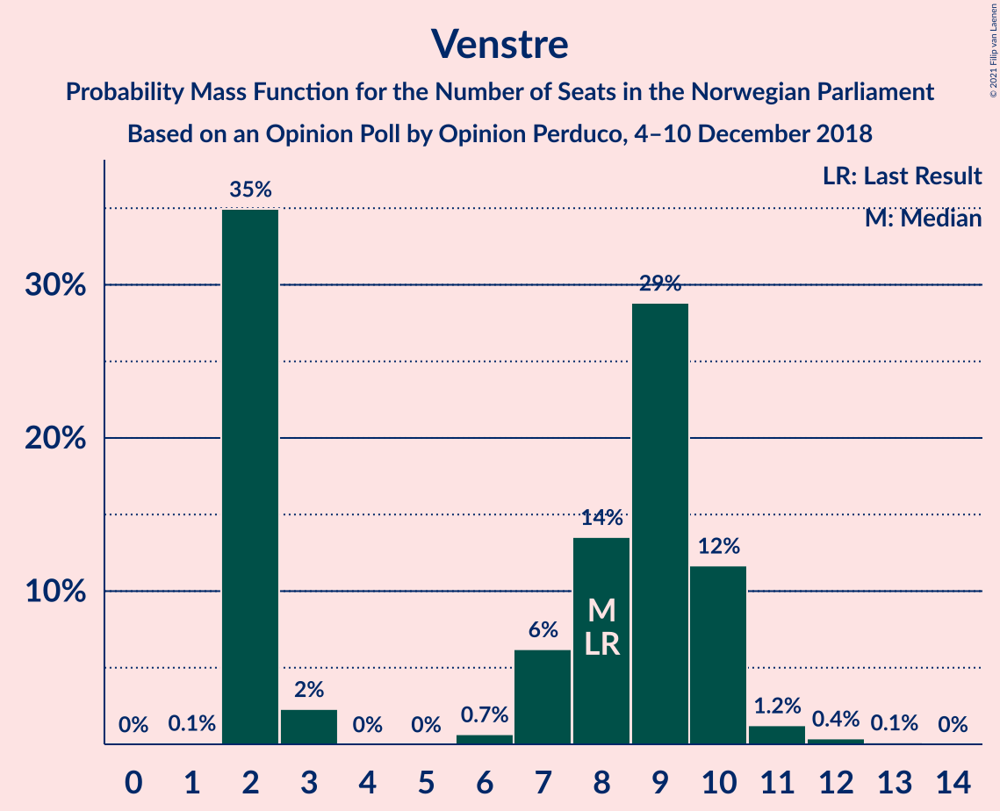
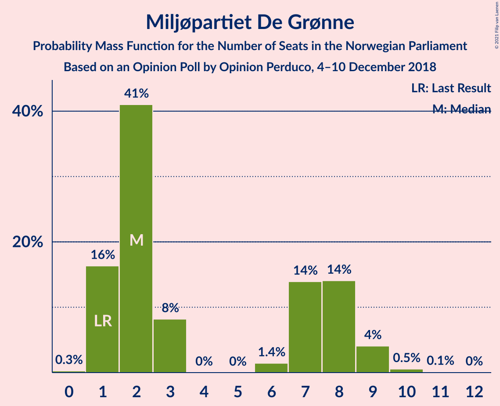
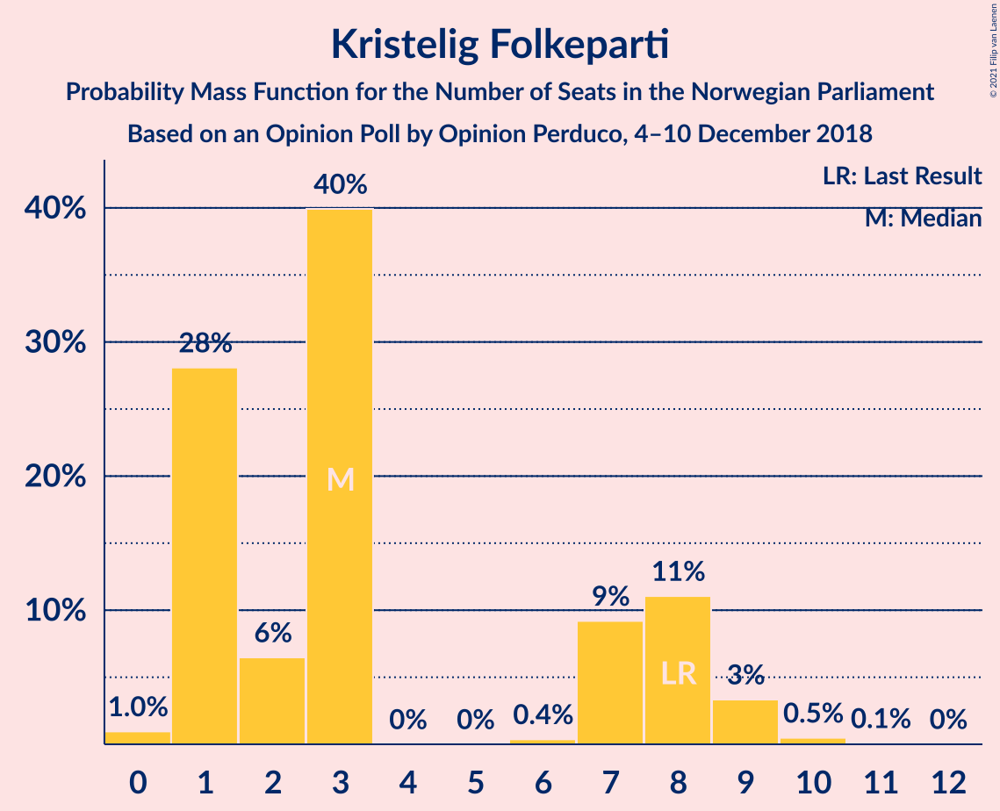
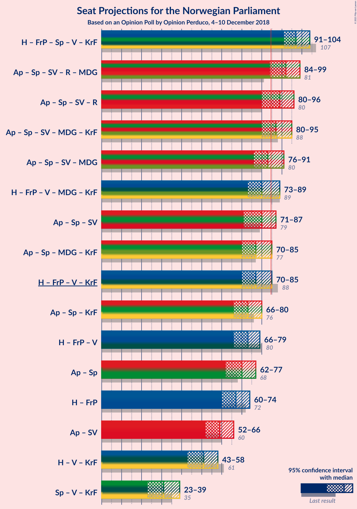
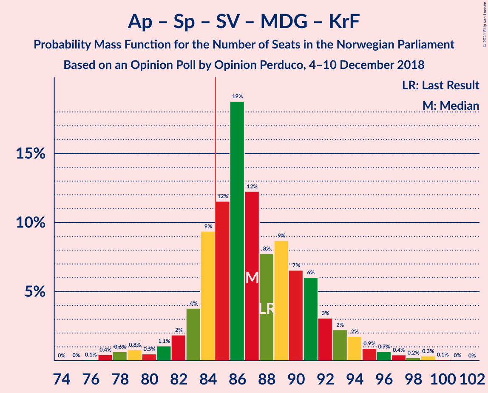
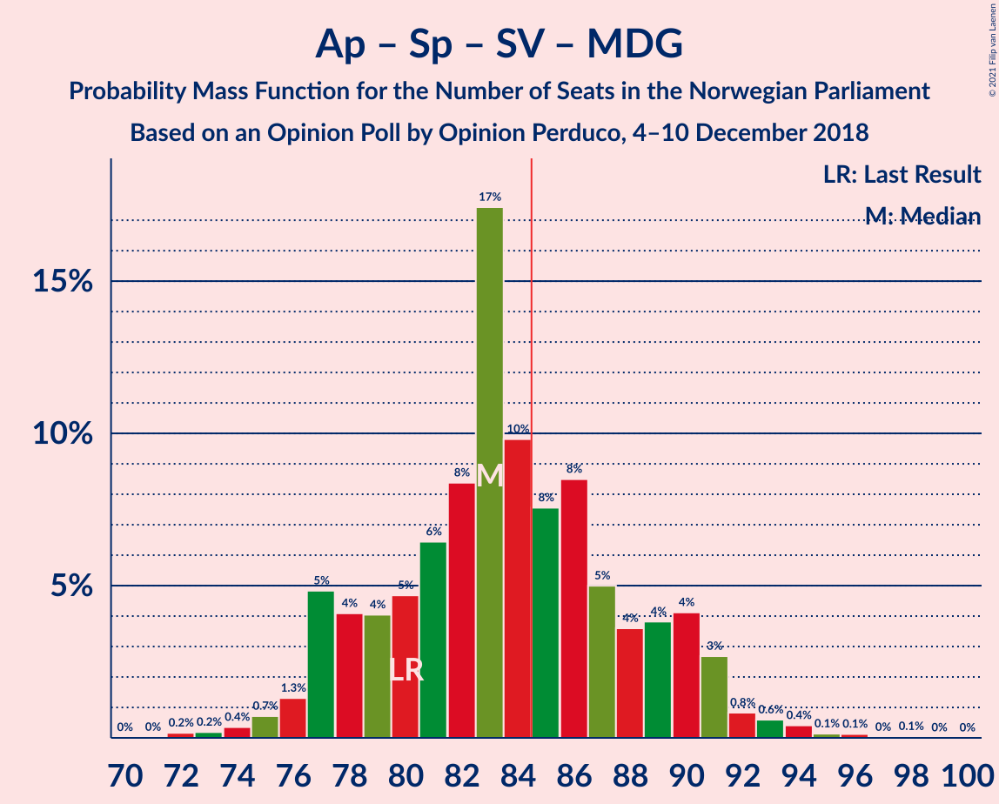
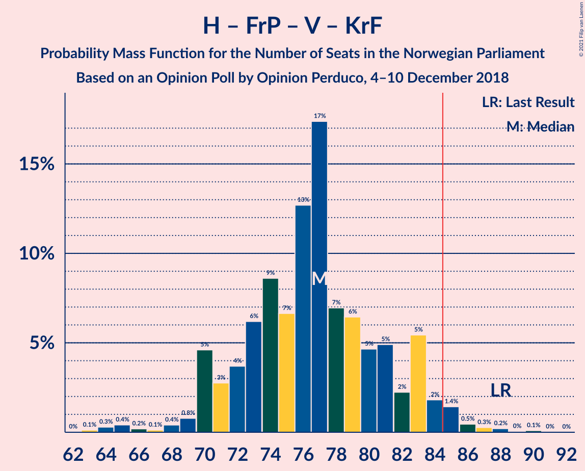
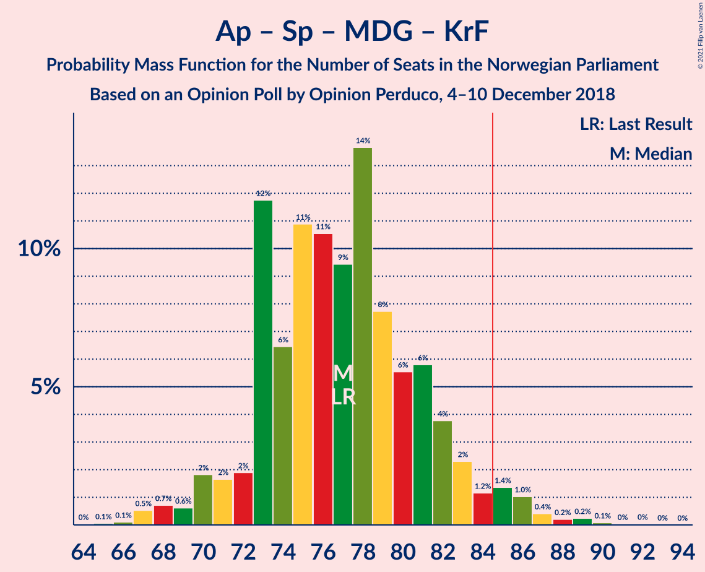
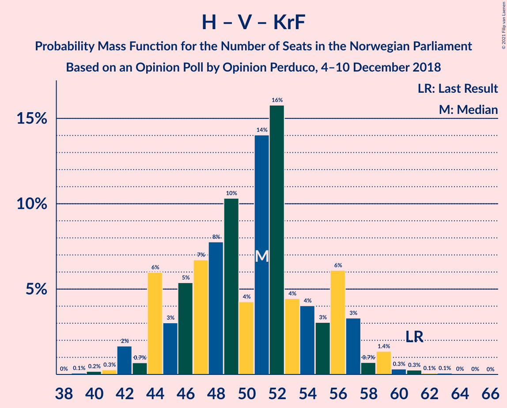

# Opinion Poll by Opinion Perduco, 4–10 December 2018

<a href="#voting-intentions">Voting Intentions</a> | <a href="#seats">Seats</a> | <a href="#coalitions">Coalitions</a> | <a href="#technical-information">Technical Information</a>

## Voting Intentions

### Confidence Intervals

| Party | Last Result | Poll Result | 80% Confidence Interval | 90% Confidence Interval | 95% Confidence Interval | 99% Confidence Interval |
|:-----:|:-----------:|:-----------:|:-----------------------:|:-----------------------:|:-----------------------:|:-----------------------:|
| Arbeiderpartiet | 27.4% | 27.1% | 25.0–29.3% |24.4–29.9% |23.9–30.5% |22.9–31.6% |
| Høyre | 25.0% | 22.9% | 20.9–25.0% |20.4–25.6% |19.9–26.2% |19.0–27.2% |
| Fremskrittspartiet | 15.2% | 14.6% | 13.0–16.5% |12.6–17.0% |12.2–17.5% |11.4–18.4% |
| Senterpartiet | 10.3% | 11.9% | 10.4–13.6% |10.0–14.1% |9.7–14.5% |9.0–15.4% |
| Sosialistisk Venstreparti | 6.0% | 5.8% | 4.8–7.1% |4.5–7.5% |4.3–7.8% |3.8–8.5% |
| Rødt | 2.4% | 5.1% | 4.1–6.3% |3.9–6.7% |3.7–7.0% |3.3–7.6% |
| Venstre | 4.4% | 4.3% | 3.5–5.5% |3.2–5.8% |3.1–6.1% |2.7–6.8% |
| Miljøpartiet De Grønne | 3.2% | 3.6% | 2.9–4.7% |2.6–5.0% |2.5–5.3% |2.1–5.9% |
| Kristelig Folkeparti | 4.2% | 3.5% | 2.7–4.5% |2.5–4.8% |2.3–5.1% |2.0–5.7% |

*Note:* The poll result column reflects the actual value used in the calculations. Published results may vary slightly, and in addition be rounded to fewer digits.

## Seats

### Confidence Intervals

| Party | Last Result | Median | 80% Confidence Interval | 90% Confidence Interval | 95% Confidence Interval | 99% Confidence Interval |
|:-----:|:-----------:|:------:|:-----------------------:|:-----------------------:|:-----------------------:|:-----------------------:|
| <a href="#arbeiderpartiet">Arbeiderpartiet</a> | 49 | 48 | 45–52 |44–53 |43–53 |41–57 |
| <a href="#høyre">Høyre</a> | 45 | 41 | 37–46 |36–46 |36–49 |34–49 |
| <a href="#fremskrittspartiet">Fremskrittspartiet</a> | 27 | 27 | 24–31 |23–32 |20–32 |20–32 |
| <a href="#senterpartiet">Senterpartiet</a> | 19 | 21 | 18–24 |18–25 |17–26 |15–28 |
| <a href="#sosialistisk-venstreparti">Sosialistisk Venstreparti</a> | 11 | 9 | 9–12 |8–13 |3–13 |1–15 |
| <a href="#rødt">Rødt</a> | 1 | 9 | 8–11 |2–11 |2–12 |2–13 |
| <a href="#venstre">Venstre</a> | 8 | 7 | 2–10 |2–10 |2–10 |2–13 |
| <a href="#miljøpartiet-de-grønne">Miljøpartiet De Grønne</a> | 1 | 2 | 1–8 |1–8 |1–9 |1–9 |
| <a href="#kristelig-folkeparti">Kristelig Folkeparti</a> | 8 | 2 | 1–7 |1–8 |1–9 |0–10 |

### Arbeiderpartiet

*For a full overview of the results for this party, see the [Arbeiderpartiet](party-arbeiderpartiet.html) page.*

| Number of Seats | Probability | Accumulated | Special Marks |
|:---------------:|:-----------:|:-----------:|:-------------:|
| 40 | 0.5% | 100% |  |
| 41 | 0.8% | 99.5% |  |
| 42 | 0.4% | 98.7% |  |
| 43 | 1.3% | 98% |  |
| 44 | 3% | 97% |  |
| 45 | 14% | 94% |  |
| 46 | 13% | 80% |  |
| 47 | 4% | 67% |  |
| 48 | 16% | 63% | Median |
| 49 | 1.4% | 47% | Last Result |
| 50 | 22% | 46% |  |
| 51 | 3% | 24% |  |
| 52 | 13% | 21% |  |
| 53 | 6% | 8% |  |
| 54 | 0.6% | 2% |  |
| 55 | 0.6% | 1.5% |  |
| 56 | 0.2% | 0.9% |  |
| 57 | 0.2% | 0.7% |  |
| 58 | 0.3% | 0.5% |  |
| 59 | 0% | 0.1% |  |
| 60 | 0.1% | 0.1% |  |
| 61 | 0% | 0% |  |

### Høyre

*For a full overview of the results for this party, see the [Høyre](party-høyre.html) page.*

| Number of Seats | Probability | Accumulated | Special Marks |
|:---------------:|:-----------:|:-----------:|:-------------:|
| 30 | 0.1% | 100% |  |
| 31 | 0% | 99.9% |  |
| 32 | 0% | 99.8% |  |
| 33 | 0.2% | 99.8% |  |
| 34 | 0.7% | 99.6% |  |
| 35 | 0.9% | 98.9% |  |
| 36 | 3% | 98% |  |
| 37 | 24% | 95% |  |
| 38 | 6% | 71% |  |
| 39 | 3% | 65% |  |
| 40 | 4% | 62% |  |
| 41 | 19% | 57% | Median |
| 42 | 4% | 38% |  |
| 43 | 4% | 35% |  |
| 44 | 17% | 30% |  |
| 45 | 0.7% | 13% | Last Result |
| 46 | 9% | 13% |  |
| 47 | 0.4% | 4% |  |
| 48 | 0.3% | 4% |  |
| 49 | 3% | 3% |  |
| 50 | 0.3% | 0.5% |  |
| 51 | 0.1% | 0.2% |  |
| 52 | 0.1% | 0.1% |  |
| 53 | 0% | 0% |  |

### Fremskrittspartiet

*For a full overview of the results for this party, see the [Fremskrittspartiet](party-fremskrittspartiet.html) page.*

| Number of Seats | Probability | Accumulated | Special Marks |
|:---------------:|:-----------:|:-----------:|:-------------:|
| 18 | 0.3% | 100% |  |
| 19 | 0.2% | 99.7% |  |
| 20 | 2% | 99.5% |  |
| 21 | 2% | 97% |  |
| 22 | 0.4% | 95% |  |
| 23 | 2% | 95% |  |
| 24 | 6% | 93% |  |
| 25 | 20% | 87% |  |
| 26 | 13% | 66% |  |
| 27 | 29% | 54% | Last Result, Median |
| 28 | 4% | 25% |  |
| 29 | 3% | 20% |  |
| 30 | 7% | 17% |  |
| 31 | 2% | 10% |  |
| 32 | 8% | 8% |  |
| 33 | 0.1% | 0.3% |  |
| 34 | 0% | 0.1% |  |
| 35 | 0.1% | 0.1% |  |
| 36 | 0% | 0% |  |

### Senterpartiet

*For a full overview of the results for this party, see the [Senterpartiet](party-senterpartiet.html) page.*

| Number of Seats | Probability | Accumulated | Special Marks |
|:---------------:|:-----------:|:-----------:|:-------------:|
| 15 | 0.5% | 100% |  |
| 16 | 0.5% | 99.4% |  |
| 17 | 2% | 99.0% |  |
| 18 | 24% | 97% |  |
| 19 | 4% | 74% | Last Result |
| 20 | 10% | 70% |  |
| 21 | 22% | 60% | Median |
| 22 | 6% | 38% |  |
| 23 | 18% | 32% |  |
| 24 | 8% | 14% |  |
| 25 | 3% | 6% |  |
| 26 | 2% | 3% |  |
| 27 | 0.1% | 0.9% |  |
| 28 | 0.3% | 0.8% |  |
| 29 | 0.1% | 0.5% |  |
| 30 | 0.3% | 0.3% |  |
| 31 | 0% | 0% |  |

### Sosialistisk Venstreparti

*For a full overview of the results for this party, see the [Sosialistisk Venstreparti](party-sosialistiskvenstreparti.html) page.*

| Number of Seats | Probability | Accumulated | Special Marks |
|:---------------:|:-----------:|:-----------:|:-------------:|
| 1 | 0.6% | 100% |  |
| 2 | 0.5% | 99.4% |  |
| 3 | 2% | 98.9% |  |
| 4 | 0% | 97% |  |
| 5 | 0% | 97% |  |
| 6 | 0% | 97% |  |
| 7 | 0.6% | 97% |  |
| 8 | 2% | 97% |  |
| 9 | 46% | 95% | Median |
| 10 | 29% | 49% |  |
| 11 | 1.4% | 20% | Last Result |
| 12 | 10% | 19% |  |
| 13 | 7% | 8% |  |
| 14 | 0.7% | 1.2% |  |
| 15 | 0.4% | 0.5% |  |
| 16 | 0.1% | 0.2% |  |
| 17 | 0% | 0% |  |

### Rødt

*For a full overview of the results for this party, see the [Rødt](party-rødt.html) page.*

| Number of Seats | Probability | Accumulated | Special Marks |
|:---------------:|:-----------:|:-----------:|:-------------:|
| 1 | 0.2% | 100% | Last Result |
| 2 | 6% | 99.8% |  |
| 3 | 0% | 93% |  |
| 4 | 0% | 93% |  |
| 5 | 0% | 93% |  |
| 6 | 0% | 93% |  |
| 7 | 2% | 93% |  |
| 8 | 32% | 92% |  |
| 9 | 27% | 60% | Median |
| 10 | 15% | 33% |  |
| 11 | 14% | 18% |  |
| 12 | 3% | 4% |  |
| 13 | 0.6% | 1.0% |  |
| 14 | 0.3% | 0.4% |  |
| 15 | 0% | 0% |  |

### Venstre

*For a full overview of the results for this party, see the [Venstre](party-venstre.html) page.*

| Number of Seats | Probability | Accumulated | Special Marks |
|:---------------:|:-----------:|:-----------:|:-------------:|
| 1 | 0.1% | 100% |  |
| 2 | 33% | 99.9% |  |
| 3 | 3% | 67% |  |
| 4 | 0% | 64% |  |
| 5 | 0% | 64% |  |
| 6 | 5% | 64% |  |
| 7 | 10% | 59% | Median |
| 8 | 10% | 49% | Last Result |
| 9 | 19% | 40% |  |
| 10 | 18% | 20% |  |
| 11 | 0.8% | 2% |  |
| 12 | 0.4% | 1.0% |  |
| 13 | 0.6% | 0.6% |  |
| 14 | 0% | 0% |  |

### Miljøpartiet De Grønne

*For a full overview of the results for this party, see the [Miljøpartiet De Grønne](party-miljøpartietdegrønne.html) page.*

| Number of Seats | Probability | Accumulated | Special Marks |
|:---------------:|:-----------:|:-----------:|:-------------:|
| 0 | 0.3% | 100% |  |
| 1 | 27% | 99.7% | Last Result |
| 2 | 23% | 73% | Median |
| 3 | 0.6% | 50% |  |
| 4 | 0% | 49% |  |
| 5 | 0% | 49% |  |
| 6 | 5% | 49% |  |
| 7 | 32% | 44% |  |
| 8 | 9% | 13% |  |
| 9 | 3% | 3% |  |
| 10 | 0.4% | 0.5% |  |
| 11 | 0.1% | 0.1% |  |
| 12 | 0.1% | 0.1% |  |
| 13 | 0% | 0% |  |

### Kristelig Folkeparti

*For a full overview of the results for this party, see the [Kristelig Folkeparti](party-kristeligfolkeparti.html) page.*

| Number of Seats | Probability | Accumulated | Special Marks |
|:---------------:|:-----------:|:-----------:|:-------------:|
| 0 | 2% | 100% |  |
| 1 | 38% | 98% |  |
| 2 | 26% | 60% | Median |
| 3 | 13% | 34% |  |
| 4 | 0% | 21% |  |
| 5 | 0% | 21% |  |
| 6 | 0.2% | 21% |  |
| 7 | 15% | 21% |  |
| 8 | 3% | 6% | Last Result |
| 9 | 2% | 3% |  |
| 10 | 0.6% | 0.8% |  |
| 11 | 0.1% | 0.2% |  |
| 12 | 0% | 0% |  |

## Coalitions

### Confidence Intervals

| Coalition | Last Result | Median | Majority? | 80% Confidence Interval | 90% Confidence Interval | 95% Confidence Interval | 99% Confidence Interval |
|:---------:|:-----------:|:------:|:---------:|:-----------------------:|:-----------------------:|:-----------------------:|:-----------------------:|
| Høyre – Fremskrittspartiet – Senterpartiet – Venstre – Kristelig Folkeparti | 107 | 96 | 99.8% | 95–101 | 92–103 | 89–105 | 86–108 |
| Arbeiderpartiet – Senterpartiet – Sosialistisk Venstreparti – Rødt – Miljøpartiet De Grønne | 81 | 92 | 97% | 88–96 | 86–98 | 84–101 | 81–105 |
| Arbeiderpartiet – Senterpartiet – Sosialistisk Venstreparti – Rødt | 80 | 87 | 86% | 83–95 | 80–95 | 80–96 | 78–99 |
| Arbeiderpartiet – Senterpartiet – Sosialistisk Venstreparti – Miljøpartiet De Grønne – Kristelig Folkeparti | 88 | 86 | 80% | 83–92 | 81–94 | 80–95 | 78–99 |
| Arbeiderpartiet – Senterpartiet – Sosialistisk Venstreparti – Miljøpartiet De Grønne | 80 | 84 | 40% | 78–88 | 78–91 | 76–92 | 73–94 |
| Høyre – Fremskrittspartiet – Venstre – Miljøpartiet De Grønne – Kristelig Folkeparti | 89 | 82 | 14% | 74–86 | 74–89 | 73–89 | 70–91 |
| Arbeiderpartiet – Senterpartiet – Sosialistisk Venstreparti | 79 | 79 | 14% | 74–85 | 72–85 | 72–86 | 70–90 |
| Høyre – Fremskrittspartiet – Venstre – Kristelig Folkeparti | 88 | 77 | 3% | 73–81 | 71–83 | 68–85 | 64–88 |
| Arbeiderpartiet – Senterpartiet – Miljøpartiet De Grønne – Kristelig Folkeparti | 77 | 77 | 2% | 73–81 | 72–83 | 70–84 | 68–89 |
| Arbeiderpartiet – Senterpartiet – Kristelig Folkeparti | 76 | 71 | 0.3% | 70–77 | 67–78 | 65–80 | 64–84 |
| Høyre – Fremskrittspartiet – Venstre | 80 | 74 | 0.2% | 72–76 | 67–78 | 64–79 | 62–80 |
| Arbeiderpartiet – Senterpartiet | 68 | 69 | 0% | 64–75 | 63–75 | 63–76 | 60–79 |
| Høyre – Fremskrittspartiet | 72 | 67 | 0% | 64–73 | 60–73 | 58–74 | 56–76 |
| Arbeiderpartiet – Sosialistisk Venstreparti | 60 | 58 | 0% | 54–62 | 54–63 | 52–64 | 49–67 |
| Høyre – Venstre – Kristelig Folkeparti | 61 | 50 | 0% | 47–55 | 46–56 | 44–58 | 42–62 |
| Senterpartiet – Venstre – Kristelig Folkeparti | 35 | 29 | 0% | 26–34 | 24–36 | 23–38 | 22–41 |

### Høyre – Fremskrittspartiet – Senterpartiet – Venstre – Kristelig Folkeparti

| Number of Seats | Probability | Accumulated | Special Marks |
|:---------------:|:-----------:|:-----------:|:-------------:|
| 84 | 0.2% | 100% |  |
| 85 | 0.1% | 99.8% | Majority |
| 86 | 1.4% | 99.7% |  |
| 87 | 0.3% | 98% |  |
| 88 | 0.3% | 98% |  |
| 89 | 2% | 98% |  |
| 90 | 0.2% | 96% |  |
| 91 | 0.5% | 96% |  |
| 92 | 0.5% | 95% |  |
| 93 | 1.0% | 95% |  |
| 94 | 2% | 94% |  |
| 95 | 17% | 92% |  |
| 96 | 26% | 75% |  |
| 97 | 1.0% | 49% |  |
| 98 | 8% | 49% | Median |
| 99 | 3% | 41% |  |
| 100 | 13% | 38% |  |
| 101 | 16% | 25% |  |
| 102 | 2% | 9% |  |
| 103 | 3% | 7% |  |
| 104 | 1.4% | 4% |  |
| 105 | 1.3% | 3% |  |
| 106 | 0.2% | 2% |  |
| 107 | 0.8% | 1.4% | Last Result |
| 108 | 0.2% | 0.6% |  |
| 109 | 0.4% | 0.5% |  |
| 110 | 0.1% | 0.1% |  |
| 111 | 0% | 0% |  |

### Arbeiderpartiet – Senterpartiet – Sosialistisk Venstreparti – Rødt – Miljøpartiet De Grønne

| Number of Seats | Probability | Accumulated | Special Marks |
|:---------------:|:-----------:|:-----------:|:-------------:|
| 79 | 0% | 100% |  |
| 80 | 0.1% | 99.9% |  |
| 81 | 0.5% | 99.9% | Last Result |
| 82 | 0.5% | 99.4% |  |
| 83 | 0.4% | 98.9% |  |
| 84 | 1.2% | 98% |  |
| 85 | 1.2% | 97% | Majority |
| 86 | 5% | 96% |  |
| 87 | 0.8% | 91% |  |
| 88 | 9% | 90% |  |
| 89 | 1.1% | 82% | Median |
| 90 | 7% | 81% |  |
| 91 | 4% | 73% |  |
| 92 | 25% | 69% |  |
| 93 | 5% | 44% |  |
| 94 | 16% | 39% |  |
| 95 | 5% | 23% |  |
| 96 | 12% | 18% |  |
| 97 | 0.9% | 6% |  |
| 98 | 0.5% | 5% |  |
| 99 | 2% | 5% |  |
| 100 | 0.6% | 3% |  |
| 101 | 0.5% | 3% |  |
| 102 | 0.1% | 2% |  |
| 103 | 0.2% | 2% |  |
| 104 | 1.2% | 2% |  |
| 105 | 0.3% | 0.5% |  |
| 106 | 0.2% | 0.2% |  |
| 107 | 0% | 0% |  |

### Arbeiderpartiet – Senterpartiet – Sosialistisk Venstreparti – Rødt

| Number of Seats | Probability | Accumulated | Special Marks |
|:---------------:|:-----------:|:-----------:|:-------------:|
| 73 | 0% | 100% |  |
| 74 | 0% | 99.9% |  |
| 75 | 0.1% | 99.9% |  |
| 76 | 0.1% | 99.8% |  |
| 77 | 0% | 99.7% |  |
| 78 | 0.4% | 99.7% |  |
| 79 | 0.5% | 99.3% |  |
| 80 | 6% | 98.8% | Last Result |
| 81 | 1.1% | 93% |  |
| 82 | 2% | 92% |  |
| 83 | 2% | 90% |  |
| 84 | 2% | 88% |  |
| 85 | 19% | 86% | Majority |
| 86 | 2% | 67% |  |
| 87 | 22% | 66% | Median |
| 88 | 4% | 43% |  |
| 89 | 4% | 39% |  |
| 90 | 10% | 35% |  |
| 91 | 4% | 25% |  |
| 92 | 0.9% | 20% |  |
| 93 | 5% | 19% |  |
| 94 | 0.5% | 15% |  |
| 95 | 11% | 14% |  |
| 96 | 1.5% | 3% |  |
| 97 | 0.5% | 1.3% |  |
| 98 | 0.2% | 0.8% |  |
| 99 | 0.4% | 0.6% |  |
| 100 | 0.1% | 0.2% |  |
| 101 | 0% | 0.1% |  |
| 102 | 0% | 0.1% |  |
| 103 | 0% | 0% |  |

### Arbeiderpartiet – Senterpartiet – Sosialistisk Venstreparti – Miljøpartiet De Grønne – Kristelig Folkeparti

| Number of Seats | Probability | Accumulated | Special Marks |
|:---------------:|:-----------:|:-----------:|:-------------:|
| 73 | 0.1% | 100% |  |
| 74 | 0% | 99.9% |  |
| 75 | 0% | 99.9% |  |
| 76 | 0.1% | 99.9% |  |
| 77 | 0.2% | 99.8% |  |
| 78 | 1.2% | 99.6% |  |
| 79 | 0.2% | 98% |  |
| 80 | 0.9% | 98% |  |
| 81 | 3% | 97% |  |
| 82 | 2% | 95% | Median |
| 83 | 10% | 93% |  |
| 84 | 3% | 82% |  |
| 85 | 13% | 80% | Majority |
| 86 | 29% | 67% |  |
| 87 | 18% | 38% |  |
| 88 | 5% | 20% | Last Result |
| 89 | 1.3% | 15% |  |
| 90 | 1.4% | 14% |  |
| 91 | 0.7% | 12% |  |
| 92 | 4% | 11% |  |
| 93 | 2% | 7% |  |
| 94 | 2% | 5% |  |
| 95 | 1.4% | 3% |  |
| 96 | 0.9% | 2% |  |
| 97 | 0.2% | 1.0% |  |
| 98 | 0.1% | 0.7% |  |
| 99 | 0.5% | 0.6% |  |
| 100 | 0.1% | 0.2% |  |
| 101 | 0% | 0.1% |  |
| 102 | 0% | 0.1% |  |
| 103 | 0% | 0% |  |

### Arbeiderpartiet – Senterpartiet – Sosialistisk Venstreparti – Miljøpartiet De Grønne

| Number of Seats | Probability | Accumulated | Special Marks |
|:---------------:|:-----------:|:-----------:|:-------------:|
| 69 | 0.1% | 100% |  |
| 70 | 0% | 99.9% |  |
| 71 | 0% | 99.9% |  |
| 72 | 0.4% | 99.9% |  |
| 73 | 0.2% | 99.5% |  |
| 74 | 0.2% | 99.3% |  |
| 75 | 1.4% | 99.1% |  |
| 76 | 0.4% | 98% |  |
| 77 | 2% | 97% |  |
| 78 | 6% | 96% |  |
| 79 | 3% | 90% |  |
| 80 | 6% | 87% | Last Result, Median |
| 81 | 10% | 80% |  |
| 82 | 7% | 70% |  |
| 83 | 3% | 63% |  |
| 84 | 21% | 61% |  |
| 85 | 16% | 40% | Majority |
| 86 | 12% | 23% |  |
| 87 | 2% | 12% |  |
| 88 | 1.2% | 10% |  |
| 89 | 2% | 9% |  |
| 90 | 1.4% | 7% |  |
| 91 | 2% | 5% |  |
| 92 | 2% | 3% |  |
| 93 | 0.5% | 1.2% |  |
| 94 | 0.3% | 0.7% |  |
| 95 | 0% | 0.4% |  |
| 96 | 0.3% | 0.4% |  |
| 97 | 0% | 0.1% |  |
| 98 | 0.1% | 0.1% |  |
| 99 | 0% | 0% |  |

### Høyre – Fremskrittspartiet – Venstre – Miljøpartiet De Grønne – Kristelig Folkeparti

| Number of Seats | Probability | Accumulated | Special Marks |
|:---------------:|:-----------:|:-----------:|:-------------:|
| 67 | 0% | 100% |  |
| 68 | 0% | 99.9% |  |
| 69 | 0.1% | 99.9% |  |
| 70 | 0.4% | 99.8% |  |
| 71 | 0.2% | 99.4% |  |
| 72 | 0.5% | 99.2% |  |
| 73 | 1.5% | 98.7% |  |
| 74 | 11% | 97% |  |
| 75 | 0.5% | 86% |  |
| 76 | 5% | 85% |  |
| 77 | 0.9% | 81% |  |
| 78 | 4% | 80% |  |
| 79 | 10% | 75% | Median |
| 80 | 4% | 65% |  |
| 81 | 4% | 61% |  |
| 82 | 22% | 57% |  |
| 83 | 2% | 34% |  |
| 84 | 19% | 33% |  |
| 85 | 2% | 14% | Majority |
| 86 | 2% | 12% |  |
| 87 | 2% | 10% |  |
| 88 | 1.1% | 8% |  |
| 89 | 6% | 7% | Last Result |
| 90 | 0.5% | 1.2% |  |
| 91 | 0.4% | 0.7% |  |
| 92 | 0% | 0.3% |  |
| 93 | 0.1% | 0.3% |  |
| 94 | 0.1% | 0.2% |  |
| 95 | 0% | 0.1% |  |
| 96 | 0% | 0.1% |  |
| 97 | 0% | 0% |  |

### Arbeiderpartiet – Senterpartiet – Sosialistisk Venstreparti

| Number of Seats | Probability | Accumulated | Special Marks |
|:---------------:|:-----------:|:-----------:|:-------------:|
| 67 | 0.2% | 100% |  |
| 68 | 0.1% | 99.8% |  |
| 69 | 0.1% | 99.7% |  |
| 70 | 0.7% | 99.6% |  |
| 71 | 1.2% | 98.9% |  |
| 72 | 5% | 98% |  |
| 73 | 2% | 93% |  |
| 74 | 0.9% | 91% |  |
| 75 | 2% | 90% |  |
| 76 | 4% | 88% |  |
| 77 | 16% | 85% |  |
| 78 | 17% | 69% | Median |
| 79 | 15% | 52% | Last Result |
| 80 | 2% | 37% |  |
| 81 | 8% | 34% |  |
| 82 | 7% | 27% |  |
| 83 | 3% | 20% |  |
| 84 | 3% | 17% |  |
| 85 | 11% | 14% | Majority |
| 86 | 1.2% | 3% |  |
| 87 | 0.9% | 2% |  |
| 88 | 0.1% | 1.3% |  |
| 89 | 0.3% | 1.1% |  |
| 90 | 0.4% | 0.8% |  |
| 91 | 0.3% | 0.4% |  |
| 92 | 0% | 0.1% |  |
| 93 | 0% | 0.1% |  |
| 94 | 0% | 0% |  |

### Høyre – Fremskrittspartiet – Venstre – Kristelig Folkeparti

| Number of Seats | Probability | Accumulated | Special Marks |
|:---------------:|:-----------:|:-----------:|:-------------:|
| 63 | 0.2% | 100% |  |
| 64 | 0.3% | 99.8% |  |
| 65 | 1.2% | 99.5% |  |
| 66 | 0.2% | 98% |  |
| 67 | 0.1% | 98% |  |
| 68 | 0.5% | 98% |  |
| 69 | 0.6% | 97% |  |
| 70 | 2% | 97% |  |
| 71 | 0.5% | 95% |  |
| 72 | 0.9% | 95% |  |
| 73 | 12% | 94% |  |
| 74 | 5% | 82% |  |
| 75 | 16% | 77% |  |
| 76 | 5% | 61% |  |
| 77 | 25% | 56% | Median |
| 78 | 4% | 31% |  |
| 79 | 7% | 27% |  |
| 80 | 1.1% | 19% |  |
| 81 | 9% | 18% |  |
| 82 | 0.8% | 10% |  |
| 83 | 5% | 9% |  |
| 84 | 1.2% | 4% |  |
| 85 | 1.2% | 3% | Majority |
| 86 | 0.4% | 2% |  |
| 87 | 0.5% | 1.1% |  |
| 88 | 0.5% | 0.6% | Last Result |
| 89 | 0.1% | 0.1% |  |
| 90 | 0% | 0.1% |  |
| 91 | 0% | 0% |  |

### Arbeiderpartiet – Senterpartiet – Miljøpartiet De Grønne – Kristelig Folkeparti

| Number of Seats | Probability | Accumulated | Special Marks |
|:---------------:|:-----------:|:-----------:|:-------------:|
| 63 | 0% | 100% |  |
| 64 | 0% | 99.9% |  |
| 65 | 0% | 99.9% |  |
| 66 | 0.1% | 99.9% |  |
| 67 | 0.2% | 99.8% |  |
| 68 | 1.3% | 99.5% |  |
| 69 | 0.3% | 98% |  |
| 70 | 0.9% | 98% |  |
| 71 | 1.2% | 97% |  |
| 72 | 1.4% | 96% |  |
| 73 | 17% | 94% | Median |
| 74 | 2% | 77% |  |
| 75 | 6% | 75% |  |
| 76 | 5% | 69% |  |
| 77 | 40% | 64% | Last Result |
| 78 | 8% | 23% |  |
| 79 | 1.0% | 16% |  |
| 80 | 2% | 15% |  |
| 81 | 3% | 12% |  |
| 82 | 1.3% | 10% |  |
| 83 | 5% | 8% |  |
| 84 | 0.4% | 3% |  |
| 85 | 1.1% | 2% | Majority |
| 86 | 0.3% | 1.4% |  |
| 87 | 0.3% | 1.1% |  |
| 88 | 0.2% | 0.7% |  |
| 89 | 0.2% | 0.5% |  |
| 90 | 0.3% | 0.3% |  |
| 91 | 0% | 0.1% |  |
| 92 | 0% | 0% |  |

### Arbeiderpartiet – Senterpartiet – Kristelig Folkeparti

| Number of Seats | Probability | Accumulated | Special Marks |
|:---------------:|:-----------:|:-----------:|:-------------:|
| 61 | 0.1% | 100% |  |
| 62 | 0.2% | 99.9% |  |
| 63 | 0.2% | 99.7% |  |
| 64 | 0.5% | 99.5% |  |
| 65 | 2% | 99.0% |  |
| 66 | 1.5% | 97% |  |
| 67 | 1.4% | 96% |  |
| 68 | 1.0% | 95% |  |
| 69 | 2% | 94% |  |
| 70 | 35% | 92% |  |
| 71 | 14% | 57% | Median |
| 72 | 5% | 43% |  |
| 73 | 5% | 38% |  |
| 74 | 4% | 33% |  |
| 75 | 5% | 30% |  |
| 76 | 11% | 25% | Last Result |
| 77 | 7% | 13% |  |
| 78 | 2% | 6% |  |
| 79 | 0.6% | 4% |  |
| 80 | 1.3% | 4% |  |
| 81 | 1.2% | 2% |  |
| 82 | 0.4% | 1.2% |  |
| 83 | 0.3% | 0.9% |  |
| 84 | 0.3% | 0.6% |  |
| 85 | 0.2% | 0.3% | Majority |
| 86 | 0% | 0.1% |  |
| 87 | 0% | 0.1% |  |
| 88 | 0.1% | 0.1% |  |
| 89 | 0% | 0% |  |

### Høyre – Fremskrittspartiet – Venstre

| Number of Seats | Probability | Accumulated | Special Marks |
|:---------------:|:-----------:|:-----------:|:-------------:|
| 61 | 0.2% | 100% |  |
| 62 | 0.4% | 99.7% |  |
| 63 | 0.2% | 99.3% |  |
| 64 | 2% | 99.1% |  |
| 65 | 0.9% | 97% |  |
| 66 | 1.0% | 96% |  |
| 67 | 2% | 95% |  |
| 68 | 0.4% | 93% |  |
| 69 | 0.1% | 93% |  |
| 70 | 0.6% | 92% |  |
| 71 | 0.8% | 92% |  |
| 72 | 15% | 91% |  |
| 73 | 6% | 76% |  |
| 74 | 23% | 70% |  |
| 75 | 27% | 47% | Median |
| 76 | 11% | 20% |  |
| 77 | 3% | 10% |  |
| 78 | 2% | 7% |  |
| 79 | 3% | 5% |  |
| 80 | 1.2% | 2% | Last Result |
| 81 | 0.2% | 0.5% |  |
| 82 | 0.1% | 0.3% |  |
| 83 | 0% | 0.3% |  |
| 84 | 0% | 0.2% |  |
| 85 | 0.1% | 0.2% | Majority |
| 86 | 0% | 0.1% |  |
| 87 | 0.1% | 0.1% |  |
| 88 | 0% | 0% |  |

### Arbeiderpartiet – Senterpartiet

| Number of Seats | Probability | Accumulated | Special Marks |
|:---------------:|:-----------:|:-----------:|:-------------:|
| 58 | 0.2% | 100% |  |
| 59 | 0.1% | 99.7% |  |
| 60 | 0.6% | 99.7% |  |
| 61 | 0.5% | 99.1% |  |
| 62 | 0.9% | 98.6% |  |
| 63 | 7% | 98% |  |
| 64 | 1.0% | 91% |  |
| 65 | 1.3% | 90% |  |
| 66 | 6% | 88% |  |
| 67 | 1.5% | 82% |  |
| 68 | 16% | 80% | Last Result |
| 69 | 25% | 65% | Median |
| 70 | 12% | 39% |  |
| 71 | 3% | 27% |  |
| 72 | 4% | 24% |  |
| 73 | 1.3% | 21% |  |
| 74 | 4% | 19% |  |
| 75 | 12% | 15% |  |
| 76 | 0.4% | 3% |  |
| 77 | 1.0% | 2% |  |
| 78 | 0.5% | 1.2% |  |
| 79 | 0.4% | 0.7% |  |
| 80 | 0.2% | 0.3% |  |
| 81 | 0.1% | 0.2% |  |
| 82 | 0% | 0% |  |

### Høyre – Fremskrittspartiet

| Number of Seats | Probability | Accumulated | Special Marks |
|:---------------:|:-----------:|:-----------:|:-------------:|
| 53 | 0.1% | 100% |  |
| 54 | 0.1% | 99.9% |  |
| 55 | 0.2% | 99.7% |  |
| 56 | 0.4% | 99.6% |  |
| 57 | 1.4% | 99.2% |  |
| 58 | 0.4% | 98% |  |
| 59 | 0.9% | 97% |  |
| 60 | 2% | 97% |  |
| 61 | 0.5% | 95% |  |
| 62 | 1.4% | 94% |  |
| 63 | 0.8% | 93% |  |
| 64 | 15% | 92% |  |
| 65 | 4% | 77% |  |
| 66 | 16% | 72% |  |
| 67 | 10% | 57% |  |
| 68 | 1.4% | 47% | Median |
| 69 | 5% | 45% |  |
| 70 | 18% | 40% |  |
| 71 | 7% | 22% |  |
| 72 | 4% | 15% | Last Result |
| 73 | 8% | 11% |  |
| 74 | 2% | 3% |  |
| 75 | 0.2% | 0.9% |  |
| 76 | 0.5% | 0.7% |  |
| 77 | 0% | 0.1% |  |
| 78 | 0% | 0.1% |  |
| 79 | 0.1% | 0.1% |  |
| 80 | 0% | 0% |  |

### Arbeiderpartiet – Sosialistisk Venstreparti

| Number of Seats | Probability | Accumulated | Special Marks |
|:---------------:|:-----------:|:-----------:|:-------------:|
| 48 | 0.1% | 100% |  |
| 49 | 0.3% | 99.8% |  |
| 50 | 0.7% | 99.5% |  |
| 51 | 0.2% | 98.8% |  |
| 52 | 2% | 98.6% |  |
| 53 | 1.3% | 96% |  |
| 54 | 8% | 95% |  |
| 55 | 3% | 87% |  |
| 56 | 10% | 84% |  |
| 57 | 17% | 74% | Median |
| 58 | 8% | 57% |  |
| 59 | 24% | 50% |  |
| 60 | 2% | 25% | Last Result |
| 61 | 3% | 23% |  |
| 62 | 12% | 20% |  |
| 63 | 3% | 8% |  |
| 64 | 2% | 4% |  |
| 65 | 0.9% | 2% |  |
| 66 | 0.3% | 1.4% |  |
| 67 | 0.6% | 1.1% |  |
| 68 | 0% | 0.5% |  |
| 69 | 0% | 0.5% |  |
| 70 | 0.3% | 0.4% |  |
| 71 | 0% | 0.1% |  |
| 72 | 0.1% | 0.1% |  |
| 73 | 0% | 0% |  |

### Høyre – Venstre – Kristelig Folkeparti

| Number of Seats | Probability | Accumulated | Special Marks |
|:---------------:|:-----------:|:-----------:|:-------------:|
| 37 | 0.1% | 100% |  |
| 38 | 0% | 99.9% |  |
| 39 | 0.1% | 99.9% |  |
| 40 | 0% | 99.8% |  |
| 41 | 0.2% | 99.8% |  |
| 42 | 0.2% | 99.6% |  |
| 43 | 0.7% | 99.4% |  |
| 44 | 2% | 98.7% |  |
| 45 | 0.9% | 97% |  |
| 46 | 3% | 96% |  |
| 47 | 20% | 93% |  |
| 48 | 16% | 74% |  |
| 49 | 5% | 58% |  |
| 50 | 9% | 53% | Median |
| 51 | 11% | 44% |  |
| 52 | 17% | 33% |  |
| 53 | 4% | 16% |  |
| 54 | 2% | 12% |  |
| 55 | 4% | 10% |  |
| 56 | 2% | 6% |  |
| 57 | 0.4% | 5% |  |
| 58 | 3% | 4% |  |
| 59 | 0.4% | 2% |  |
| 60 | 0.4% | 1.2% |  |
| 61 | 0.3% | 0.8% | Last Result |
| 62 | 0.3% | 0.6% |  |
| 63 | 0.2% | 0.3% |  |
| 64 | 0% | 0% |  |

### Senterpartiet – Venstre – Kristelig Folkeparti

| Number of Seats | Probability | Accumulated | Special Marks |
|:---------------:|:-----------:|:-----------:|:-------------:|
| 20 | 0.2% | 100% |  |
| 21 | 0.2% | 99.8% |  |
| 22 | 0.7% | 99.6% |  |
| 23 | 2% | 98.9% |  |
| 24 | 2% | 97% |  |
| 25 | 0.7% | 95% |  |
| 26 | 11% | 94% |  |
| 27 | 12% | 83% |  |
| 28 | 1.0% | 71% |  |
| 29 | 20% | 70% |  |
| 30 | 1.4% | 50% | Median |
| 31 | 10% | 48% |  |
| 32 | 17% | 38% |  |
| 33 | 2% | 21% |  |
| 34 | 11% | 19% |  |
| 35 | 3% | 9% | Last Result |
| 36 | 2% | 6% |  |
| 37 | 1.4% | 4% |  |
| 38 | 1.4% | 3% |  |
| 39 | 0.4% | 2% |  |
| 40 | 0.7% | 1.3% |  |
| 41 | 0.2% | 0.6% |  |
| 42 | 0.1% | 0.3% |  |
| 43 | 0.2% | 0.2% |  |
| 44 | 0% | 0% |  |

## Technical Information

### Opinion Poll

+ **Polling firm:** Opinion Perduco
+ **Commissioner(s):** —
+ **Fieldwork period:** 4–10 December 2018

### Calculations

+ **Sample size:** 691
+ **Simulations done:** 131,072
+ **Error estimate:** 3.28%

