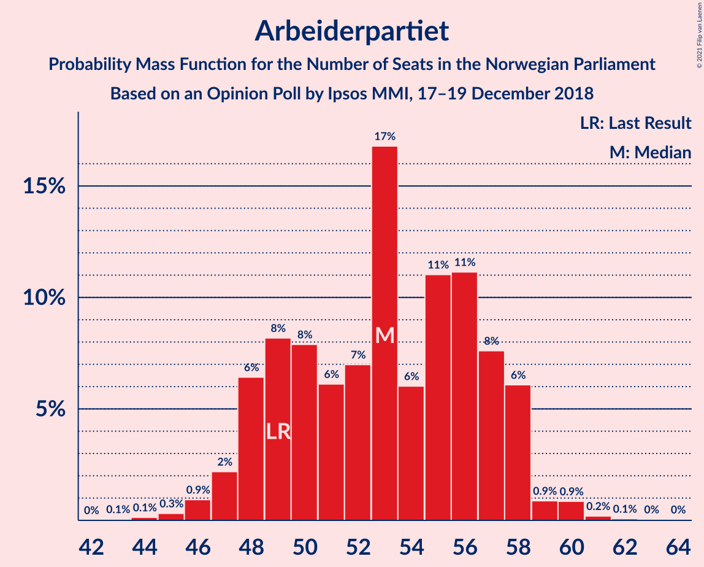
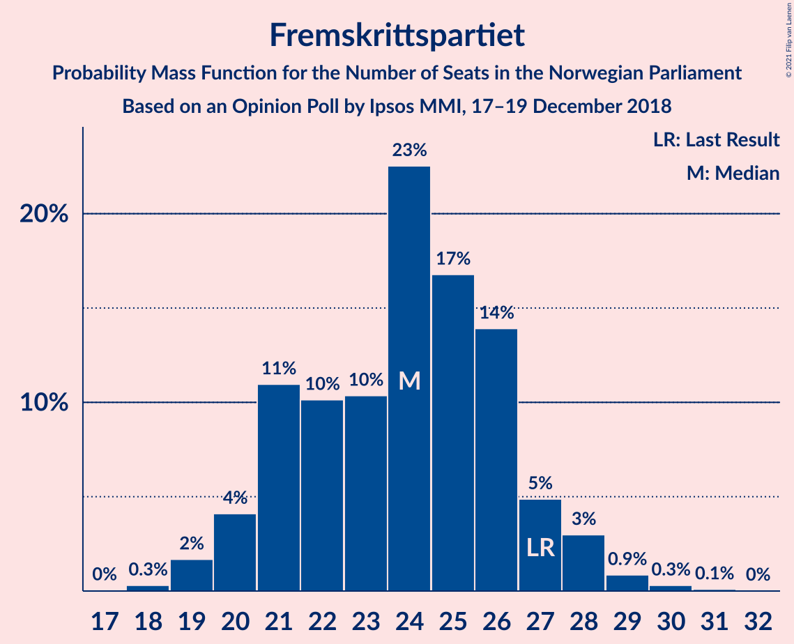
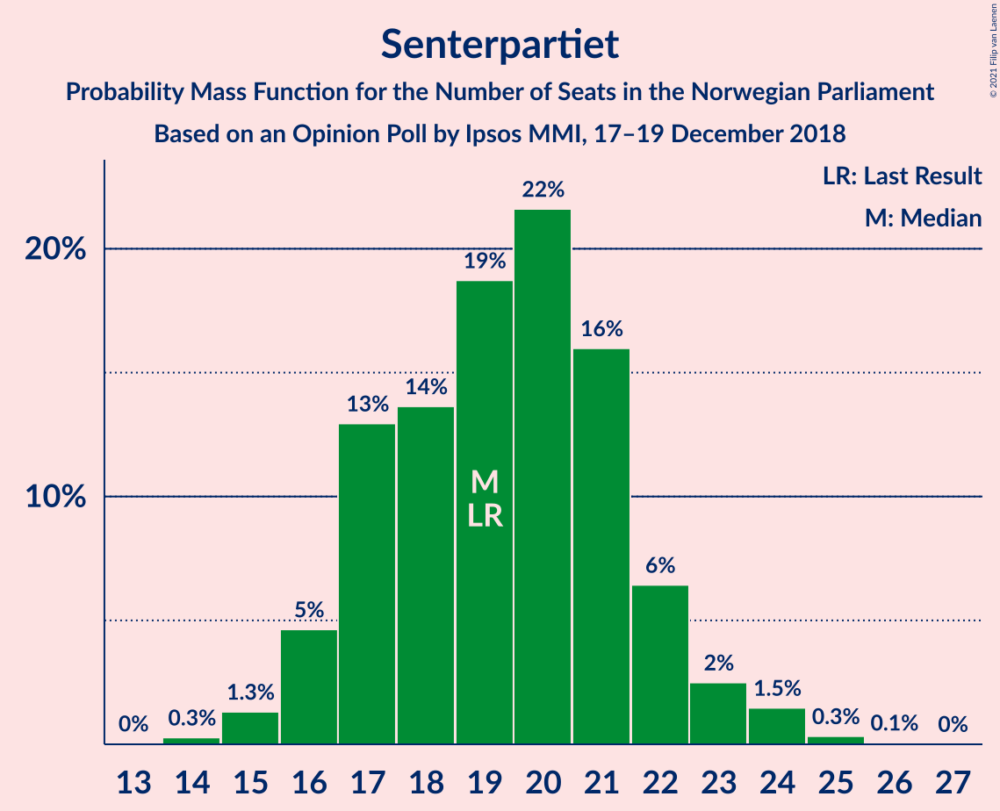
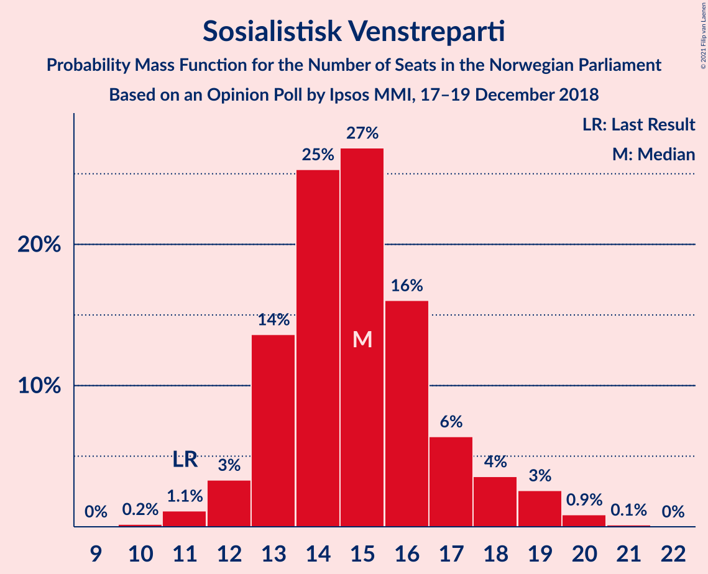
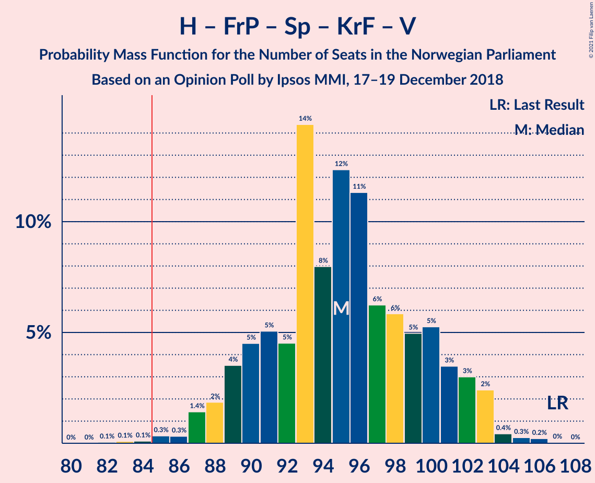
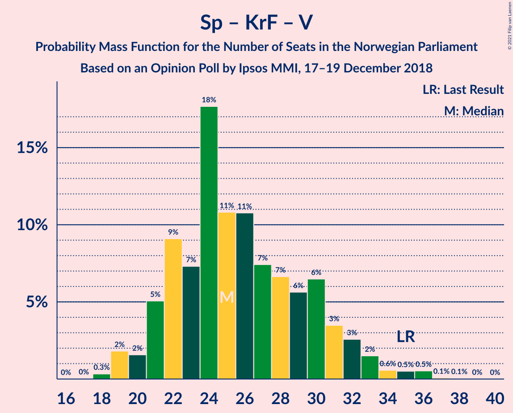

# Opinion Poll by Ipsos MMI, 17–19 December 2018

<a href="#voting-intentions">Voting Intentions</a> | <a href="#seats">Seats</a> | <a href="#coalitions">Coalitions</a> | <a href="#technical-information">Technical Information</a>

## Voting Intentions

### Confidence Intervals

| Party | Last Result | Poll Result | 80% Confidence Interval | 90% Confidence Interval | 95% Confidence Interval | 99% Confidence Interval |
|:-----:|:-----------:|:-----------:|:-----------------------:|:-----------------------:|:-----------------------:|:-----------------------:|
| Arbeiderpartiet | 27.4% | 28.5% | 26.7–30.4% |26.1–31.0% |25.7–31.5% |24.8–32.4% |
| Høyre | 25.0% | 24.7% | 22.9–26.6% |22.5–27.1% |22.0–27.5% |21.2–28.5% |
| Fremskrittspartiet | 15.2% | 12.8% | 11.5–14.3% |11.1–14.7% |10.8–15.1% |10.2–15.9% |
| Senterpartiet | 10.3% | 10.4% | 9.2–11.8% |8.9–12.1% |8.6–12.5% |8.0–13.2% |
| Sosialistisk Venstreparti | 6.0% | 8.1% | 7.0–9.3% |6.7–9.7% |6.5–10.0% |6.0–10.6% |
| Kristelig Folkeparti | 4.2% | 3.8% | 3.1–4.7% |2.9–5.0% |2.8–5.2% |2.5–5.7% |
| Miljøpartiet De Grønne | 3.2% | 3.7% | 3.0–4.6% |2.8–4.9% |2.7–5.1% |2.4–5.6% |
| Venstre | 4.4% | 3.0% | 2.4–3.8% |2.2–4.1% |2.1–4.3% |1.8–4.7% |
| Rødt | 2.4% | 2.6% | 2.1–3.5% |1.9–3.7% |1.8–3.9% |1.6–4.3% |

*Note:* The poll result column reflects the actual value used in the calculations. Published results may vary slightly, and in addition be rounded to fewer digits.

## Seats

### Confidence Intervals

| Party | Last Result | Median | 80% Confidence Interval | 90% Confidence Interval | 95% Confidence Interval | 99% Confidence Interval |
|:-----:|:-----------:|:------:|:-----------------------:|:-----------------------:|:-----------------------:|:-----------------------:|
| <a href="#arbeiderpartiet">Arbeiderpartiet</a> | 49 | 53 | 48–57 |48–58 |47–58 |45–60 |
| <a href="#høyre">Høyre</a> | 45 | 46 | 41–49 |41–50 |40–52 |38–53 |
| <a href="#fremskrittspartiet">Fremskrittspartiet</a> | 27 | 24 | 21–26 |20–27 |20–28 |19–29 |
| <a href="#senterpartiet">Senterpartiet</a> | 19 | 19 | 17–22 |16–22 |16–23 |15–24 |
| <a href="#sosialistisk-venstreparti">Sosialistisk Venstreparti</a> | 11 | 15 | 13–17 |13–18 |12–19 |11–20 |
| <a href="#kristelig-folkeparti">Kristelig Folkeparti</a> | 8 | 3 | 1–8 |1–9 |1–10 |1–10 |
| <a href="#miljøpartiet-de-grønne">Miljøpartiet De Grønne</a> | 1 | 3 | 1–8 |1–9 |1–9 |1–10 |
| <a href="#venstre">Venstre</a> | 8 | 2 | 1–2 |1–7 |1–8 |0–8 |
| <a href="#rødt">Rødt</a> | 1 | 1 | 1–2 |1–2 |1–2 |1–8 |

### Arbeiderpartiet

*For a full overview of the results for this party, see the [Arbeiderpartiet](party-arbeiderpartiet.html) page.*

| Number of Seats | Probability | Accumulated | Special Marks |
|:---------------:|:-----------:|:-----------:|:-------------:|
| 43 | 0.1% | 100% |  |
| 44 | 0.1% | 99.9% |  |
| 45 | 0.3% | 99.8% |  |
| 46 | 0.9% | 99.5% |  |
| 47 | 2% | 98.6% |  |
| 48 | 6% | 96% |  |
| 49 | 8% | 90% | Last Result |
| 50 | 8% | 82% |  |
| 51 | 6% | 74% |  |
| 52 | 7% | 68% |  |
| 53 | 17% | 61% | Median |
| 54 | 6% | 44% |  |
| 55 | 11% | 38% |  |
| 56 | 11% | 27% |  |
| 57 | 8% | 16% |  |
| 58 | 6% | 8% |  |
| 59 | 0.9% | 2% |  |
| 60 | 0.9% | 1.2% |  |
| 61 | 0.2% | 0.4% |  |
| 62 | 0.1% | 0.2% |  |
| 63 | 0% | 0.1% |  |
| 64 | 0% | 0% |  |

### Høyre

*For a full overview of the results for this party, see the [Høyre](party-høyre.html) page.*

| Number of Seats | Probability | Accumulated | Special Marks |
|:---------------:|:-----------:|:-----------:|:-------------:|
| 36 | 0.1% | 100% |  |
| 37 | 0.2% | 99.9% |  |
| 38 | 0.2% | 99.7% |  |
| 39 | 0.5% | 99.5% |  |
| 40 | 2% | 98.9% |  |
| 41 | 8% | 97% |  |
| 42 | 6% | 89% |  |
| 43 | 6% | 83% |  |
| 44 | 9% | 77% |  |
| 45 | 16% | 67% | Last Result |
| 46 | 15% | 52% | Median |
| 47 | 9% | 36% |  |
| 48 | 14% | 27% |  |
| 49 | 6% | 13% |  |
| 50 | 3% | 8% |  |
| 51 | 2% | 4% |  |
| 52 | 2% | 3% |  |
| 53 | 0.3% | 0.5% |  |
| 54 | 0.2% | 0.2% |  |
| 55 | 0.1% | 0.1% |  |
| 56 | 0% | 0% |  |

### Fremskrittspartiet

*For a full overview of the results for this party, see the [Fremskrittspartiet](party-fremskrittspartiet.html) page.*

| Number of Seats | Probability | Accumulated | Special Marks |
|:---------------:|:-----------:|:-----------:|:-------------:|
| 17 | 0% | 100% |  |
| 18 | 0.3% | 99.9% |  |
| 19 | 2% | 99.6% |  |
| 20 | 4% | 98% |  |
| 21 | 11% | 94% |  |
| 22 | 10% | 83% |  |
| 23 | 10% | 73% |  |
| 24 | 23% | 62% | Median |
| 25 | 17% | 40% |  |
| 26 | 14% | 23% |  |
| 27 | 5% | 9% | Last Result |
| 28 | 3% | 4% |  |
| 29 | 0.9% | 1.3% |  |
| 30 | 0.3% | 0.4% |  |
| 31 | 0.1% | 0.1% |  |
| 32 | 0% | 0% |  |

### Senterpartiet

*For a full overview of the results for this party, see the [Senterpartiet](party-senterpartiet.html) page.*

| Number of Seats | Probability | Accumulated | Special Marks |
|:---------------:|:-----------:|:-----------:|:-------------:|
| 14 | 0.3% | 100% |  |
| 15 | 1.3% | 99.7% |  |
| 16 | 5% | 98% |  |
| 17 | 13% | 94% |  |
| 18 | 14% | 81% |  |
| 19 | 19% | 67% | Last Result, Median |
| 20 | 22% | 48% |  |
| 21 | 16% | 27% |  |
| 22 | 6% | 11% |  |
| 23 | 2% | 4% |  |
| 24 | 1.5% | 2% |  |
| 25 | 0.3% | 0.4% |  |
| 26 | 0.1% | 0.1% |  |
| 27 | 0% | 0% |  |

### Sosialistisk Venstreparti

*For a full overview of the results for this party, see the [Sosialistisk Venstreparti](party-sosialistiskvenstreparti.html) page.*

| Number of Seats | Probability | Accumulated | Special Marks |
|:---------------:|:-----------:|:-----------:|:-------------:|
| 10 | 0.2% | 100% |  |
| 11 | 1.1% | 99.8% | Last Result |
| 12 | 3% | 98.7% |  |
| 13 | 14% | 95% |  |
| 14 | 25% | 82% |  |
| 15 | 27% | 56% | Median |
| 16 | 16% | 30% |  |
| 17 | 6% | 14% |  |
| 18 | 4% | 7% |  |
| 19 | 3% | 4% |  |
| 20 | 0.9% | 1.0% |  |
| 21 | 0.1% | 0.2% |  |
| 22 | 0% | 0% |  |

### Kristelig Folkeparti

*For a full overview of the results for this party, see the [Kristelig Folkeparti](party-kristeligfolkeparti.html) page.*

| Number of Seats | Probability | Accumulated | Special Marks |
|:---------------:|:-----------:|:-----------:|:-------------:|
| 0 | 0.1% | 100% |  |
| 1 | 13% | 99.9% |  |
| 2 | 21% | 87% |  |
| 3 | 37% | 67% | Median |
| 4 | 0% | 30% |  |
| 5 | 0% | 30% |  |
| 6 | 0% | 30% |  |
| 7 | 5% | 30% |  |
| 8 | 16% | 25% | Last Result |
| 9 | 6% | 9% |  |
| 10 | 3% | 3% |  |
| 11 | 0.4% | 0.4% |  |
| 12 | 0% | 0% |  |

### Miljøpartiet De Grønne

*For a full overview of the results for this party, see the [Miljøpartiet De Grønne](party-miljøpartietdegrønne.html) page.*

| Number of Seats | Probability | Accumulated | Special Marks |
|:---------------:|:-----------:|:-----------:|:-------------:|
| 1 | 11% | 100% | Last Result |
| 2 | 37% | 89% |  |
| 3 | 10% | 52% | Median |
| 4 | 3% | 42% |  |
| 5 | 0% | 39% |  |
| 6 | 0.1% | 39% |  |
| 7 | 11% | 38% |  |
| 8 | 20% | 27% |  |
| 9 | 5% | 7% |  |
| 10 | 2% | 2% |  |
| 11 | 0.1% | 0.2% |  |
| 12 | 0% | 0% |  |

### Venstre

*For a full overview of the results for this party, see the [Venstre](party-venstre.html) page.*

| Number of Seats | Probability | Accumulated | Special Marks |
|:---------------:|:-----------:|:-----------:|:-------------:|
| 0 | 0.5% | 100% |  |
| 1 | 11% | 99.5% |  |
| 2 | 80% | 89% | Median |
| 3 | 3% | 9% |  |
| 4 | 0.1% | 6% |  |
| 5 | 0% | 6% |  |
| 6 | 0% | 6% |  |
| 7 | 2% | 6% |  |
| 8 | 3% | 3% | Last Result |
| 9 | 0.5% | 0.5% |  |
| 10 | 0% | 0% |  |

### Rødt

*For a full overview of the results for this party, see the [Rødt](party-rødt.html) page.*

| Number of Seats | Probability | Accumulated | Special Marks |
|:---------------:|:-----------:|:-----------:|:-------------:|
| 1 | 51% | 100% | Last Result, Median |
| 2 | 47% | 49% |  |
| 3 | 0% | 2% |  |
| 4 | 0% | 2% |  |
| 5 | 0% | 2% |  |
| 6 | 0% | 2% |  |
| 7 | 0.9% | 2% |  |
| 8 | 0.8% | 0.8% |  |
| 9 | 0% | 0.1% |  |
| 10 | 0% | 0% |  |

## Coalitions

### Confidence Intervals

| Coalition | Last Result | Median | Majority? | 80% Confidence Interval | 90% Confidence Interval | 95% Confidence Interval | 99% Confidence Interval |
|:---------:|:-----------:|:------:|:---------:|:-----------------------:|:-----------------------:|:-----------------------:|:-----------------------:|
| Arbeiderpartiet – Senterpartiet – Sosialistisk Venstreparti – Kristelig Folkeparti – Miljøpartiet De Grønne | 88 | 96 | 99.9% | 91–100 | 90–101 | 88–103 | 87–105 |
| Høyre – Fremskrittspartiet – Senterpartiet – Kristelig Folkeparti – Venstre | 107 | 95 | 99.8% | 90–100 | 89–102 | 88–103 | 85–105 |
| Arbeiderpartiet – Senterpartiet – Sosialistisk Venstreparti – Miljøpartiet De Grønne – Rødt | 81 | 93 | 98.6% | 88–98 | 86–99 | 86–100 | 83–103 |
| Arbeiderpartiet – Senterpartiet – Sosialistisk Venstreparti – Miljøpartiet De Grønne | 80 | 92 | 96% | 86–97 | 85–98 | 84–98 | 82–101 |
| Arbeiderpartiet – Senterpartiet – Sosialistisk Venstreparti – Rødt | 80 | 89 | 88% | 84–93 | 82–94 | 81–95 | 79–97 |
| Arbeiderpartiet – Senterpartiet – Sosialistisk Venstreparti | 79 | 88 | 74% | 82–91 | 81–93 | 80–94 | 78–95 |
| Arbeiderpartiet – Senterpartiet – Kristelig Folkeparti – Miljøpartiet De Grønne | 77 | 81 | 14% | 76–85 | 75–87 | 74–88 | 71–91 |
| Høyre – Fremskrittspartiet – Kristelig Folkeparti – Miljøpartiet De Grønne – Venstre | 89 | 80 | 12% | 76–85 | 75–87 | 74–88 | 72–90 |
| Arbeiderpartiet – Senterpartiet – Kristelig Folkeparti | 76 | 76 | 1.3% | 72–81 | 71–83 | 70–84 | 68–85 |
| Høyre – Fremskrittspartiet – Kristelig Folkeparti – Venstre | 88 | 75 | 1.3% | 71–81 | 70–83 | 69–83 | 66–86 |
| Høyre – Fremskrittspartiet – Venstre | 80 | 72 | 0% | 67–76 | 66–77 | 64–79 | 62–81 |
| Arbeiderpartiet – Senterpartiet | 68 | 73 | 0% | 68–77 | 66–77 | 65–78 | 63–80 |
| Høyre – Fremskrittspartiet | 72 | 70 | 0% | 65–74 | 63–75 | 62–76 | 60–78 |
| Arbeiderpartiet – Sosialistisk Venstreparti | 60 | 69 | 0% | 63–72 | 62–74 | 61–74 | 60–76 |
| Høyre – Kristelig Folkeparti – Venstre | 61 | 52 | 0% | 47–57 | 46–58 | 45–60 | 44–61 |
| Senterpartiet – Kristelig Folkeparti – Venstre | 35 | 25 | 0% | 22–30 | 21–32 | 20–33 | 19–36 |

### Arbeiderpartiet – Senterpartiet – Sosialistisk Venstreparti – Kristelig Folkeparti – Miljøpartiet De Grønne

| Number of Seats | Probability | Accumulated | Special Marks |
|:---------------:|:-----------:|:-----------:|:-------------:|
| 84 | 0% | 100% |  |
| 85 | 0.1% | 99.9% | Majority |
| 86 | 0.2% | 99.8% |  |
| 87 | 0.7% | 99.6% |  |
| 88 | 2% | 98.9% | Last Result |
| 89 | 1.2% | 97% |  |
| 90 | 3% | 96% |  |
| 91 | 7% | 93% |  |
| 92 | 4% | 87% |  |
| 93 | 7% | 83% | Median |
| 94 | 12% | 76% |  |
| 95 | 10% | 64% |  |
| 96 | 16% | 54% |  |
| 97 | 7% | 38% |  |
| 98 | 10% | 31% |  |
| 99 | 8% | 22% |  |
| 100 | 7% | 13% |  |
| 101 | 2% | 7% |  |
| 102 | 2% | 5% |  |
| 103 | 1.1% | 3% |  |
| 104 | 1.2% | 2% |  |
| 105 | 0.1% | 0.6% |  |
| 106 | 0.4% | 0.5% |  |
| 107 | 0.1% | 0.1% |  |
| 108 | 0% | 0% |  |

### Høyre – Fremskrittspartiet – Senterpartiet – Kristelig Folkeparti – Venstre

| Number of Seats | Probability | Accumulated | Special Marks |
|:---------------:|:-----------:|:-----------:|:-------------:|
| 82 | 0.1% | 100% |  |
| 83 | 0.1% | 99.9% |  |
| 84 | 0.1% | 99.9% |  |
| 85 | 0.3% | 99.8% | Majority |
| 86 | 0.3% | 99.4% |  |
| 87 | 1.4% | 99.1% |  |
| 88 | 2% | 98% |  |
| 89 | 4% | 96% |  |
| 90 | 5% | 92% |  |
| 91 | 5% | 88% |  |
| 92 | 5% | 83% |  |
| 93 | 14% | 78% |  |
| 94 | 8% | 64% | Median |
| 95 | 12% | 56% |  |
| 96 | 11% | 43% |  |
| 97 | 6% | 32% |  |
| 98 | 6% | 26% |  |
| 99 | 5% | 20% |  |
| 100 | 5% | 15% |  |
| 101 | 3% | 10% |  |
| 102 | 3% | 6% |  |
| 103 | 2% | 3% |  |
| 104 | 0.4% | 1.0% |  |
| 105 | 0.3% | 0.5% |  |
| 106 | 0.2% | 0.3% |  |
| 107 | 0% | 0.1% | Last Result |
| 108 | 0% | 0% |  |

### Arbeiderpartiet – Senterpartiet – Sosialistisk Venstreparti – Miljøpartiet De Grønne – Rødt

| Number of Seats | Probability | Accumulated | Special Marks |
|:---------------:|:-----------:|:-----------:|:-------------:|
| 80 | 0% | 100% |  |
| 81 | 0.1% | 99.9% | Last Result |
| 82 | 0.1% | 99.9% |  |
| 83 | 0.4% | 99.8% |  |
| 84 | 0.8% | 99.4% |  |
| 85 | 0.8% | 98.6% | Majority |
| 86 | 3% | 98% |  |
| 87 | 5% | 95% |  |
| 88 | 3% | 90% |  |
| 89 | 7% | 87% |  |
| 90 | 5% | 81% |  |
| 91 | 6% | 75% | Median |
| 92 | 11% | 69% |  |
| 93 | 9% | 58% |  |
| 94 | 10% | 50% |  |
| 95 | 11% | 40% |  |
| 96 | 10% | 29% |  |
| 97 | 7% | 19% |  |
| 98 | 2% | 12% |  |
| 99 | 6% | 10% |  |
| 100 | 2% | 4% |  |
| 101 | 0.5% | 2% |  |
| 102 | 0.9% | 1.4% |  |
| 103 | 0.5% | 0.6% |  |
| 104 | 0% | 0.1% |  |
| 105 | 0.1% | 0.1% |  |
| 106 | 0% | 0% |  |

### Arbeiderpartiet – Senterpartiet – Sosialistisk Venstreparti – Miljøpartiet De Grønne

| Number of Seats | Probability | Accumulated | Special Marks |
|:---------------:|:-----------:|:-----------:|:-------------:|
| 79 | 0.1% | 100% |  |
| 80 | 0.1% | 99.9% | Last Result |
| 81 | 0.2% | 99.8% |  |
| 82 | 0.6% | 99.6% |  |
| 83 | 0.7% | 99.0% |  |
| 84 | 2% | 98% |  |
| 85 | 4% | 96% | Majority |
| 86 | 4% | 93% |  |
| 87 | 5% | 89% |  |
| 88 | 6% | 84% |  |
| 89 | 8% | 78% |  |
| 90 | 5% | 71% | Median |
| 91 | 14% | 66% |  |
| 92 | 7% | 52% |  |
| 93 | 12% | 45% |  |
| 94 | 12% | 33% |  |
| 95 | 6% | 21% |  |
| 96 | 5% | 15% |  |
| 97 | 4% | 10% |  |
| 98 | 4% | 6% |  |
| 99 | 0.6% | 2% |  |
| 100 | 0.3% | 1.2% |  |
| 101 | 0.7% | 0.9% |  |
| 102 | 0.1% | 0.2% |  |
| 103 | 0% | 0% |  |

### Arbeiderpartiet – Senterpartiet – Sosialistisk Venstreparti – Rødt

| Number of Seats | Probability | Accumulated | Special Marks |
|:---------------:|:-----------:|:-----------:|:-------------:|
| 77 | 0.1% | 100% |  |
| 78 | 0.2% | 99.9% |  |
| 79 | 0.6% | 99.7% |  |
| 80 | 0.7% | 99.1% | Last Result |
| 81 | 2% | 98% |  |
| 82 | 2% | 96% |  |
| 83 | 4% | 94% |  |
| 84 | 3% | 90% |  |
| 85 | 10% | 88% | Majority |
| 86 | 7% | 78% |  |
| 87 | 5% | 71% |  |
| 88 | 6% | 66% | Median |
| 89 | 15% | 60% |  |
| 90 | 7% | 45% |  |
| 91 | 11% | 38% |  |
| 92 | 12% | 27% |  |
| 93 | 7% | 15% |  |
| 94 | 3% | 8% |  |
| 95 | 2% | 4% |  |
| 96 | 1.4% | 2% |  |
| 97 | 0.4% | 0.7% |  |
| 98 | 0.1% | 0.3% |  |
| 99 | 0.1% | 0.2% |  |
| 100 | 0% | 0.1% |  |
| 101 | 0% | 0% |  |

### Arbeiderpartiet – Senterpartiet – Sosialistisk Venstreparti

| Number of Seats | Probability | Accumulated | Special Marks |
|:---------------:|:-----------:|:-----------:|:-------------:|
| 75 | 0% | 100% |  |
| 76 | 0.1% | 99.9% |  |
| 77 | 0.2% | 99.8% |  |
| 78 | 0.7% | 99.6% |  |
| 79 | 0.8% | 98.9% | Last Result |
| 80 | 2% | 98% |  |
| 81 | 3% | 96% |  |
| 82 | 4% | 93% |  |
| 83 | 7% | 89% |  |
| 84 | 8% | 82% |  |
| 85 | 6% | 74% | Majority |
| 86 | 6% | 68% |  |
| 87 | 12% | 62% | Median |
| 88 | 8% | 50% |  |
| 89 | 12% | 42% |  |
| 90 | 10% | 30% |  |
| 91 | 11% | 21% |  |
| 92 | 3% | 10% |  |
| 93 | 3% | 6% |  |
| 94 | 2% | 3% |  |
| 95 | 0.7% | 1.2% |  |
| 96 | 0.2% | 0.4% |  |
| 97 | 0.1% | 0.2% |  |
| 98 | 0.1% | 0.1% |  |
| 99 | 0% | 0% |  |

### Arbeiderpartiet – Senterpartiet – Kristelig Folkeparti – Miljøpartiet De Grønne

| Number of Seats | Probability | Accumulated | Special Marks |
|:---------------:|:-----------:|:-----------:|:-------------:|
| 69 | 0% | 100% |  |
| 70 | 0.1% | 99.9% |  |
| 71 | 0.5% | 99.8% |  |
| 72 | 0.3% | 99.3% |  |
| 73 | 0.7% | 99.0% |  |
| 74 | 2% | 98% |  |
| 75 | 2% | 96% |  |
| 76 | 7% | 94% |  |
| 77 | 5% | 87% | Last Result |
| 78 | 8% | 82% | Median |
| 79 | 9% | 74% |  |
| 80 | 12% | 65% |  |
| 81 | 9% | 53% |  |
| 82 | 12% | 45% |  |
| 83 | 9% | 32% |  |
| 84 | 9% | 23% |  |
| 85 | 6% | 14% | Majority |
| 86 | 2% | 8% |  |
| 87 | 2% | 6% |  |
| 88 | 2% | 4% |  |
| 89 | 0.9% | 2% |  |
| 90 | 0.6% | 1.2% |  |
| 91 | 0.4% | 0.6% |  |
| 92 | 0.1% | 0.2% |  |
| 93 | 0.1% | 0.1% |  |
| 94 | 0% | 0% |  |

### Høyre – Fremskrittspartiet – Kristelig Folkeparti – Miljøpartiet De Grønne – Venstre

| Number of Seats | Probability | Accumulated | Special Marks |
|:---------------:|:-----------:|:-----------:|:-------------:|
| 69 | 0% | 100% |  |
| 70 | 0.1% | 99.9% |  |
| 71 | 0.1% | 99.8% |  |
| 72 | 0.4% | 99.7% |  |
| 73 | 2% | 99.2% |  |
| 74 | 2% | 98% |  |
| 75 | 3% | 95% |  |
| 76 | 8% | 92% |  |
| 77 | 12% | 84% |  |
| 78 | 11% | 73% | Median |
| 79 | 7% | 61% |  |
| 80 | 14% | 54% |  |
| 81 | 6% | 40% |  |
| 82 | 5% | 34% |  |
| 83 | 7% | 29% |  |
| 84 | 10% | 22% |  |
| 85 | 3% | 12% | Majority |
| 86 | 4% | 9% |  |
| 87 | 2% | 5% |  |
| 88 | 2% | 3% |  |
| 89 | 0.7% | 1.5% | Last Result |
| 90 | 0.6% | 0.8% |  |
| 91 | 0.1% | 0.2% |  |
| 92 | 0% | 0.1% |  |
| 93 | 0% | 0% |  |

### Arbeiderpartiet – Senterpartiet – Kristelig Folkeparti

| Number of Seats | Probability | Accumulated | Special Marks |
|:---------------:|:-----------:|:-----------:|:-------------:|
| 65 | 0.1% | 100% |  |
| 66 | 0.1% | 99.9% |  |
| 67 | 0.3% | 99.9% |  |
| 68 | 0.5% | 99.6% |  |
| 69 | 1.3% | 99.0% |  |
| 70 | 2% | 98% |  |
| 71 | 4% | 96% |  |
| 72 | 4% | 92% |  |
| 73 | 8% | 88% |  |
| 74 | 10% | 80% |  |
| 75 | 12% | 70% | Median |
| 76 | 9% | 58% | Last Result |
| 77 | 10% | 49% |  |
| 78 | 11% | 39% |  |
| 79 | 4% | 27% |  |
| 80 | 11% | 23% |  |
| 81 | 3% | 12% |  |
| 82 | 3% | 9% |  |
| 83 | 2% | 5% |  |
| 84 | 2% | 3% |  |
| 85 | 0.8% | 1.3% | Majority |
| 86 | 0.2% | 0.5% |  |
| 87 | 0.2% | 0.2% |  |
| 88 | 0% | 0.1% |  |
| 89 | 0% | 0% |  |

### Høyre – Fremskrittspartiet – Kristelig Folkeparti – Venstre

| Number of Seats | Probability | Accumulated | Special Marks |
|:---------------:|:-----------:|:-----------:|:-------------:|
| 64 | 0.1% | 100% |  |
| 65 | 0% | 99.9% |  |
| 66 | 0.5% | 99.9% |  |
| 67 | 0.9% | 99.4% |  |
| 68 | 0.5% | 98.6% |  |
| 69 | 2% | 98% |  |
| 70 | 6% | 96% |  |
| 71 | 2% | 90% |  |
| 72 | 7% | 88% |  |
| 73 | 10% | 81% |  |
| 74 | 11% | 71% |  |
| 75 | 10% | 60% | Median |
| 76 | 9% | 50% |  |
| 77 | 11% | 41% |  |
| 78 | 6% | 31% |  |
| 79 | 5% | 24% |  |
| 80 | 7% | 19% |  |
| 81 | 3% | 12% |  |
| 82 | 5% | 10% |  |
| 83 | 3% | 5% |  |
| 84 | 0.7% | 2% |  |
| 85 | 0.8% | 1.3% | Majority |
| 86 | 0.3% | 0.5% |  |
| 87 | 0.1% | 0.2% |  |
| 88 | 0% | 0.1% | Last Result |
| 89 | 0% | 0.1% |  |
| 90 | 0% | 0% |  |

### Høyre – Fremskrittspartiet – Venstre

| Number of Seats | Probability | Accumulated | Special Marks |
|:---------------:|:-----------:|:-----------:|:-------------:|
| 60 | 0.1% | 100% |  |
| 61 | 0.1% | 99.9% |  |
| 62 | 0.4% | 99.8% |  |
| 63 | 0.3% | 99.4% |  |
| 64 | 2% | 99.2% |  |
| 65 | 2% | 97% |  |
| 66 | 2% | 96% |  |
| 67 | 5% | 94% |  |
| 68 | 6% | 89% |  |
| 69 | 10% | 83% |  |
| 70 | 8% | 73% |  |
| 71 | 15% | 65% |  |
| 72 | 10% | 50% | Median |
| 73 | 13% | 40% |  |
| 74 | 8% | 28% |  |
| 75 | 5% | 20% |  |
| 76 | 5% | 14% |  |
| 77 | 4% | 9% |  |
| 78 | 2% | 4% |  |
| 79 | 1.3% | 3% |  |
| 80 | 0.8% | 2% | Last Result |
| 81 | 0.5% | 0.7% |  |
| 82 | 0.1% | 0.2% |  |
| 83 | 0.1% | 0.1% |  |
| 84 | 0% | 0% |  |

### Arbeiderpartiet – Senterpartiet

| Number of Seats | Probability | Accumulated | Special Marks |
|:---------------:|:-----------:|:-----------:|:-------------:|
| 61 | 0% | 100% |  |
| 62 | 0.2% | 99.9% |  |
| 63 | 0.3% | 99.8% |  |
| 64 | 0.7% | 99.5% |  |
| 65 | 2% | 98.8% |  |
| 66 | 4% | 97% |  |
| 67 | 2% | 93% |  |
| 68 | 4% | 91% | Last Result |
| 69 | 8% | 87% |  |
| 70 | 9% | 78% |  |
| 71 | 6% | 69% |  |
| 72 | 10% | 64% | Median |
| 73 | 12% | 54% |  |
| 74 | 14% | 42% |  |
| 75 | 10% | 28% |  |
| 76 | 6% | 18% |  |
| 77 | 8% | 12% |  |
| 78 | 3% | 4% |  |
| 79 | 0.7% | 1.3% |  |
| 80 | 0.2% | 0.6% |  |
| 81 | 0.3% | 0.4% |  |
| 82 | 0.1% | 0.1% |  |
| 83 | 0% | 0.1% |  |
| 84 | 0% | 0% |  |

### Høyre – Fremskrittspartiet

| Number of Seats | Probability | Accumulated | Special Marks |
|:---------------:|:-----------:|:-----------:|:-------------:|
| 58 | 0.1% | 100% |  |
| 59 | 0.1% | 99.9% |  |
| 60 | 0.4% | 99.8% |  |
| 61 | 0.3% | 99.4% |  |
| 62 | 2% | 99.1% |  |
| 63 | 3% | 97% |  |
| 64 | 2% | 94% |  |
| 65 | 5% | 92% |  |
| 66 | 6% | 87% |  |
| 67 | 10% | 81% |  |
| 68 | 7% | 70% |  |
| 69 | 12% | 64% |  |
| 70 | 16% | 52% | Median |
| 71 | 10% | 36% |  |
| 72 | 8% | 26% | Last Result |
| 73 | 5% | 18% |  |
| 74 | 6% | 13% |  |
| 75 | 4% | 8% |  |
| 76 | 1.5% | 4% |  |
| 77 | 1.4% | 2% |  |
| 78 | 0.6% | 1.0% |  |
| 79 | 0.2% | 0.3% |  |
| 80 | 0.1% | 0.2% |  |
| 81 | 0% | 0% |  |

### Arbeiderpartiet – Sosialistisk Venstreparti

| Number of Seats | Probability | Accumulated | Special Marks |
|:---------------:|:-----------:|:-----------:|:-------------:|
| 57 | 0% | 100% |  |
| 58 | 0.1% | 99.9% |  |
| 59 | 0.2% | 99.8% |  |
| 60 | 0.7% | 99.6% | Last Result |
| 61 | 2% | 98.9% |  |
| 62 | 5% | 97% |  |
| 63 | 8% | 92% |  |
| 64 | 5% | 84% |  |
| 65 | 8% | 79% |  |
| 66 | 6% | 71% |  |
| 67 | 9% | 65% |  |
| 68 | 5% | 56% | Median |
| 69 | 14% | 51% |  |
| 70 | 15% | 37% |  |
| 71 | 3% | 22% |  |
| 72 | 10% | 19% |  |
| 73 | 4% | 10% |  |
| 74 | 3% | 5% |  |
| 75 | 0.7% | 2% |  |
| 76 | 1.1% | 1.4% |  |
| 77 | 0.1% | 0.3% |  |
| 78 | 0% | 0.2% |  |
| 79 | 0.1% | 0.1% |  |
| 80 | 0% | 0% |  |

### Høyre – Kristelig Folkeparti – Venstre

| Number of Seats | Probability | Accumulated | Special Marks |
|:---------------:|:-----------:|:-----------:|:-------------:|
| 42 | 0% | 100% |  |
| 43 | 0.2% | 99.9% |  |
| 44 | 0.4% | 99.8% |  |
| 45 | 2% | 99.4% |  |
| 46 | 6% | 97% |  |
| 47 | 2% | 91% |  |
| 48 | 5% | 89% |  |
| 49 | 11% | 84% |  |
| 50 | 9% | 73% |  |
| 51 | 13% | 65% | Median |
| 52 | 12% | 52% |  |
| 53 | 8% | 40% |  |
| 54 | 8% | 31% |  |
| 55 | 5% | 23% |  |
| 56 | 5% | 18% |  |
| 57 | 5% | 12% |  |
| 58 | 3% | 7% |  |
| 59 | 2% | 4% |  |
| 60 | 1.3% | 3% |  |
| 61 | 0.8% | 1.2% | Last Result |
| 62 | 0.2% | 0.4% |  |
| 63 | 0.1% | 0.2% |  |
| 64 | 0% | 0.1% |  |
| 65 | 0% | 0.1% |  |
| 66 | 0% | 0% |  |

### Senterpartiet – Kristelig Folkeparti – Venstre

| Number of Seats | Probability | Accumulated | Special Marks |
|:---------------:|:-----------:|:-----------:|:-------------:|
| 18 | 0.3% | 100% |  |
| 19 | 2% | 99.6% |  |
| 20 | 2% | 98% |  |
| 21 | 5% | 96% |  |
| 22 | 9% | 91% |  |
| 23 | 7% | 82% |  |
| 24 | 18% | 75% | Median |
| 25 | 11% | 57% |  |
| 26 | 11% | 46% |  |
| 27 | 7% | 36% |  |
| 28 | 7% | 28% |  |
| 29 | 6% | 21% |  |
| 30 | 6% | 16% |  |
| 31 | 3% | 9% |  |
| 32 | 3% | 6% |  |
| 33 | 2% | 3% |  |
| 34 | 0.6% | 2% |  |
| 35 | 0.5% | 1.2% | Last Result |
| 36 | 0.5% | 0.7% |  |
| 37 | 0.1% | 0.1% |  |
| 38 | 0.1% | 0.1% |  |
| 39 | 0% | 0% |  |

## Technical Information

### Opinion Poll

+ **Polling firm:** Ipsos MMI
+ **Commissioner(s):** —
+ **Fieldwork period:** 17–19 December 2018

### Calculations

+ **Sample size:** 944
+ **Simulations done:** 1,048,576
+ **Error estimate:** 2.41%

