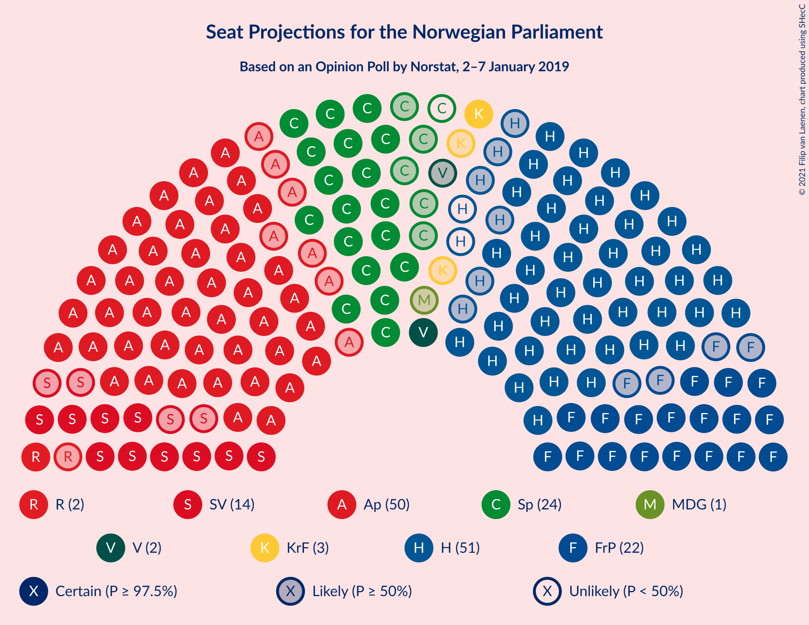
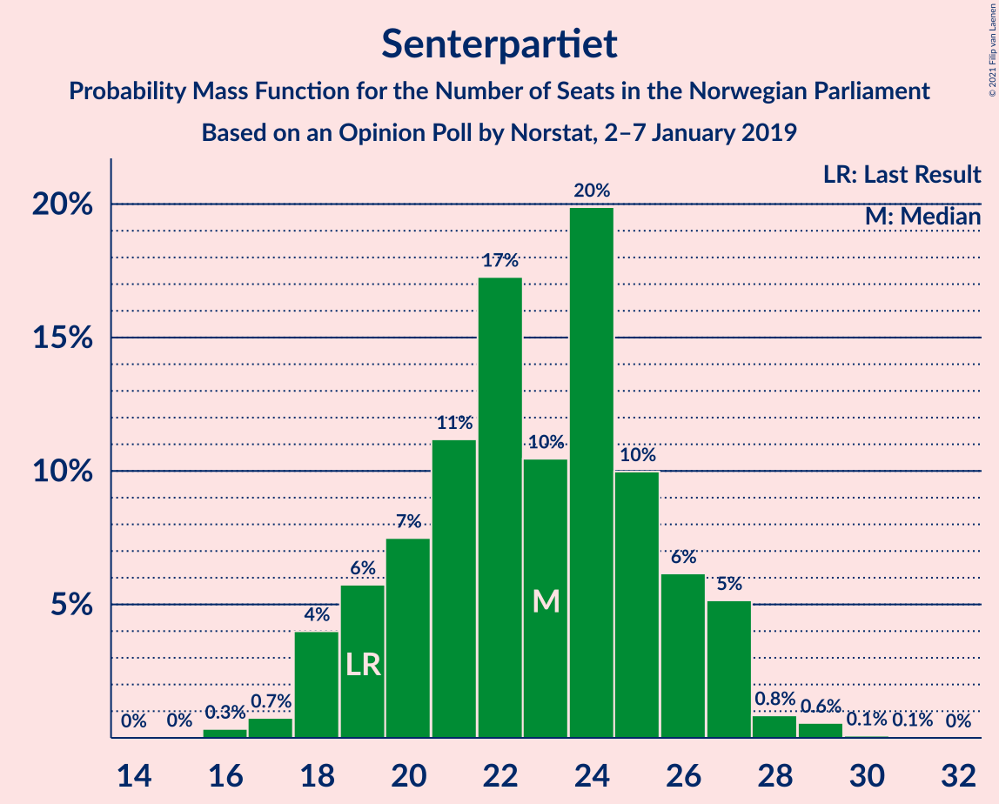
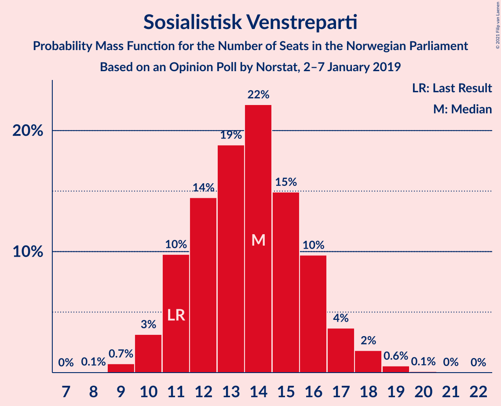
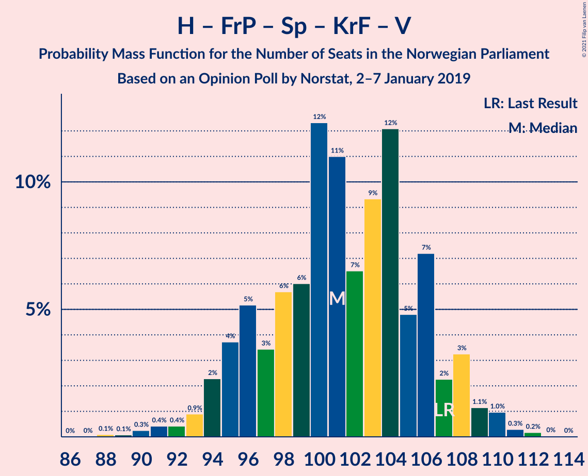
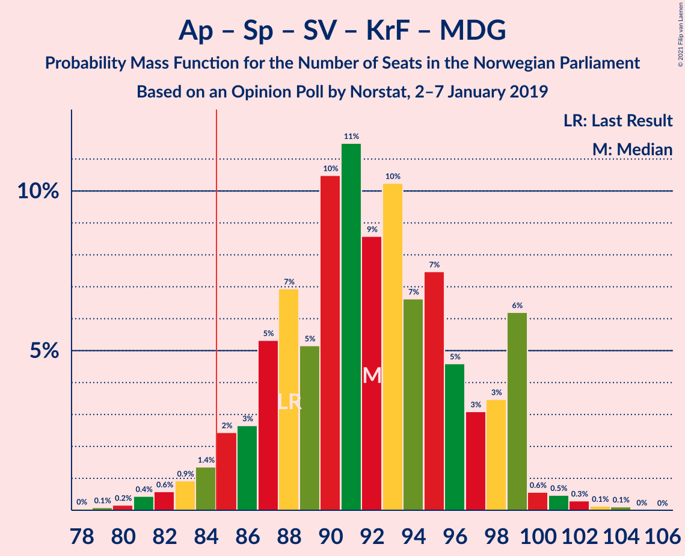
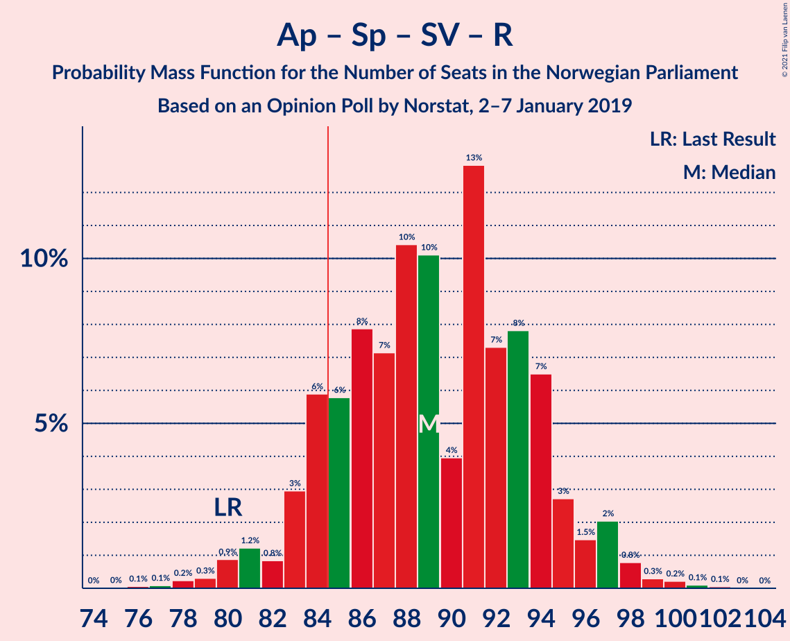
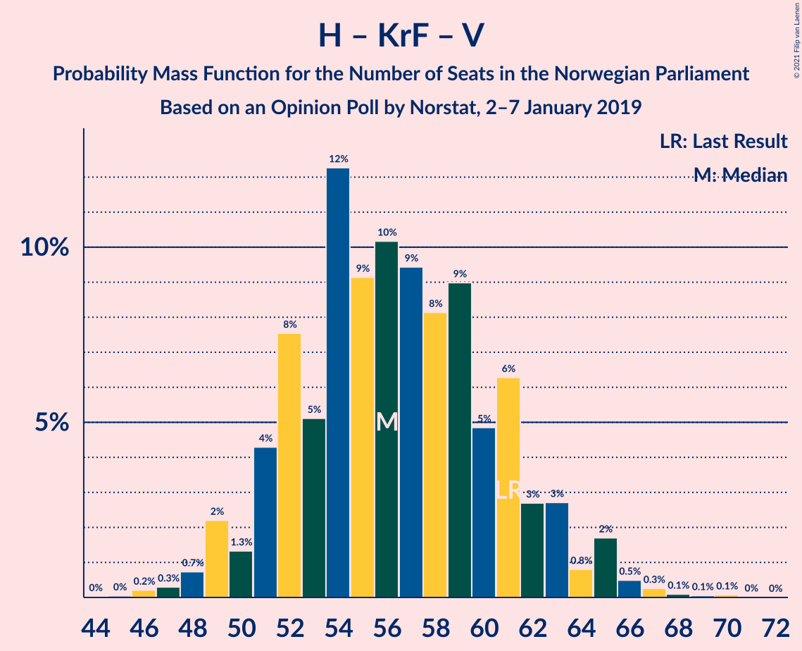

# Opinion Poll by Norstat, 2–7 January 2019

<a href="#voting-intentions">Voting Intentions</a> | <a href="#seats">Seats</a> | <a href="#coalitions">Coalitions</a> | <a href="#technical-information">Technical Information</a>

## Voting Intentions

### Confidence Intervals

| Party | Last Result | Poll Result | 80% Confidence Interval | 90% Confidence Interval | 95% Confidence Interval | 99% Confidence Interval |
|:-----:|:-----------:|:-----------:|:-----------------------:|:-----------------------:|:-----------------------:|:-----------------------:|
| Arbeiderpartiet | 27.4% | 27.3% | 25.2–29.5% |24.6–30.1% |24.1–30.7% |23.1–31.7% |
| Høyre | 25.0% | 27.0% | 24.9–29.2% |24.3–29.8% |23.8–30.4% |22.9–31.5% |
| Senterpartiet | 10.3% | 12.1% | 10.7–13.9% |10.3–14.3% |9.9–14.8% |9.3–15.6% |
| Fremskrittspartiet | 15.2% | 12.1% | 10.7–13.9% |10.3–14.3% |9.9–14.8% |9.3–15.6% |
| Sosialistisk Venstreparti | 6.0% | 7.3% | 6.2–8.8% |5.9–9.2% |5.6–9.5% |5.2–10.2% |
| Kristelig Folkeparti | 4.2% | 3.7% | 2.9–4.8% |2.7–5.1% |2.5–5.3% |2.2–5.9% |
| Rødt | 2.4% | 3.2% | 2.5–4.3% |2.3–4.6% |2.2–4.8% |1.9–5.4% |
| Venstre | 4.4% | 3.1% | 2.4–4.1% |2.2–4.4% |2.1–4.7% |1.8–5.2% |
| Miljøpartiet De Grønne | 3.2% | 2.4% | 1.8–3.3% |1.6–3.6% |1.5–3.8% |1.3–4.3% |

*Note:* The poll result column reflects the actual value used in the calculations. Published results may vary slightly, and in addition be rounded to fewer digits.

## Seats

### Confidence Intervals

| Party | Last Result | Median | 80% Confidence Interval | 90% Confidence Interval | 95% Confidence Interval | 99% Confidence Interval |
|:-----:|:-----------:|:------:|:-----------------------:|:-----------------------:|:-----------------------:|:-----------------------:|
| <a href="#arbeiderpartiet">Arbeiderpartiet</a> | 49 | 47 | 44–54 |43–56 |43–57 |42–59 |
| <a href="#høyre">Høyre</a> | 45 | 51 | 46–53 |45–54 |44–56 |41–60 |
| <a href="#senterpartiet">Senterpartiet</a> | 19 | 24 | 20–26 |19–26 |18–26 |16–29 |
| <a href="#fremskrittspartiet">Fremskrittspartiet</a> | 27 | 23 | 20–27 |18–28 |18–28 |16–29 |
| <a href="#sosialistisk-venstreparti">Sosialistisk Venstreparti</a> | 11 | 14 | 11–16 |11–17 |10–17 |10–18 |
| <a href="#kristelig-folkeparti">Kristelig Folkeparti</a> | 8 | 3 | 1–8 |1–9 |1–9 |0–10 |
| <a href="#rødt">Rødt</a> | 1 | 2 | 1–7 |1–8 |1–9 |1–9 |
| <a href="#venstre">Venstre</a> | 8 | 2 | 1–2 |1–8 |1–9 |0–10 |
| <a href="#miljøpartiet-de-grønne">Miljøpartiet De Grønne</a> | 1 | 1 | 0–2 |0–2 |0–2 |0–8 |

### Arbeiderpartiet

*For a full overview of the results for this party, see the [Arbeiderpartiet](party-arbeiderpartiet.html) page.*

| Number of Seats | Probability | Accumulated | Special Marks |
|:---------------:|:-----------:|:-----------:|:-------------:|
| 40 | 0.1% | 100% |  |
| 41 | 0.2% | 99.9% |  |
| 42 | 1.4% | 99.7% |  |
| 43 | 6% | 98% |  |
| 44 | 3% | 92% |  |
| 45 | 6% | 89% |  |
| 46 | 9% | 83% |  |
| 47 | 35% | 74% | Median |
| 48 | 2% | 40% |  |
| 49 | 2% | 37% | Last Result |
| 50 | 9% | 35% |  |
| 51 | 4% | 26% |  |
| 52 | 4% | 22% |  |
| 53 | 5% | 18% |  |
| 54 | 6% | 13% |  |
| 55 | 1.0% | 7% |  |
| 56 | 2% | 6% |  |
| 57 | 3% | 4% |  |
| 58 | 0.2% | 0.7% |  |
| 59 | 0.3% | 0.5% |  |
| 60 | 0.1% | 0.2% |  |
| 61 | 0% | 0% |  |

### Høyre

*For a full overview of the results for this party, see the [Høyre](party-høyre.html) page.*

| Number of Seats | Probability | Accumulated | Special Marks |
|:---------------:|:-----------:|:-----------:|:-------------:|
| 40 | 0.1% | 100% |  |
| 41 | 0.3% | 99.8% |  |
| 42 | 0.3% | 99.5% |  |
| 43 | 1.5% | 99.2% |  |
| 44 | 1.1% | 98% |  |
| 45 | 3% | 97% | Last Result |
| 46 | 5% | 94% |  |
| 47 | 4% | 89% |  |
| 48 | 12% | 85% |  |
| 49 | 18% | 73% |  |
| 50 | 3% | 55% |  |
| 51 | 39% | 53% | Median |
| 52 | 1.5% | 13% |  |
| 53 | 4% | 12% |  |
| 54 | 4% | 8% |  |
| 55 | 0.5% | 4% |  |
| 56 | 1.0% | 3% |  |
| 57 | 0.3% | 2% |  |
| 58 | 0.2% | 2% |  |
| 59 | 0.3% | 2% |  |
| 60 | 1.1% | 1.2% |  |
| 61 | 0% | 0.1% |  |
| 62 | 0% | 0.1% |  |
| 63 | 0% | 0% |  |

### Senterpartiet

*For a full overview of the results for this party, see the [Senterpartiet](party-senterpartiet.html) page.*

| Number of Seats | Probability | Accumulated | Special Marks |
|:---------------:|:-----------:|:-----------:|:-------------:|
| 16 | 0.6% | 100% |  |
| 17 | 1.3% | 99.4% |  |
| 18 | 1.2% | 98% |  |
| 19 | 5% | 97% | Last Result |
| 20 | 7% | 91% |  |
| 21 | 10% | 85% |  |
| 22 | 9% | 74% |  |
| 23 | 8% | 65% |  |
| 24 | 11% | 58% | Median |
| 25 | 36% | 47% |  |
| 26 | 8% | 11% |  |
| 27 | 0.8% | 2% |  |
| 28 | 0.8% | 1.4% |  |
| 29 | 0.2% | 0.6% |  |
| 30 | 0.1% | 0.3% |  |
| 31 | 0.2% | 0.3% |  |
| 32 | 0% | 0% |  |

### Fremskrittspartiet

*For a full overview of the results for this party, see the [Fremskrittspartiet](party-fremskrittspartiet.html) page.*

| Number of Seats | Probability | Accumulated | Special Marks |
|:---------------:|:-----------:|:-----------:|:-------------:|
| 15 | 0.1% | 100% |  |
| 16 | 0.5% | 99.9% |  |
| 17 | 1.3% | 99.4% |  |
| 18 | 4% | 98% |  |
| 19 | 4% | 94% |  |
| 20 | 6% | 90% |  |
| 21 | 5% | 85% |  |
| 22 | 5% | 79% |  |
| 23 | 40% | 74% | Median |
| 24 | 9% | 34% |  |
| 25 | 12% | 24% |  |
| 26 | 2% | 13% |  |
| 27 | 5% | 10% | Last Result |
| 28 | 4% | 5% |  |
| 29 | 0.7% | 1.1% |  |
| 30 | 0.3% | 0.3% |  |
| 31 | 0% | 0% |  |

### Sosialistisk Venstreparti

*For a full overview of the results for this party, see the [Sosialistisk Venstreparti](party-sosialistiskvenstreparti.html) page.*

| Number of Seats | Probability | Accumulated | Special Marks |
|:---------------:|:-----------:|:-----------:|:-------------:|
| 9 | 0.2% | 100% |  |
| 10 | 3% | 99.7% |  |
| 11 | 10% | 97% | Last Result |
| 12 | 8% | 87% |  |
| 13 | 14% | 79% |  |
| 14 | 15% | 65% | Median |
| 15 | 39% | 50% |  |
| 16 | 4% | 11% |  |
| 17 | 6% | 7% |  |
| 18 | 1.2% | 2% |  |
| 19 | 0.2% | 0.4% |  |
| 20 | 0% | 0.2% |  |
| 21 | 0.1% | 0.1% |  |
| 22 | 0% | 0% |  |

### Kristelig Folkeparti

*For a full overview of the results for this party, see the [Kristelig Folkeparti](party-kristeligfolkeparti.html) page.*

| Number of Seats | Probability | Accumulated | Special Marks |
|:---------------:|:-----------:|:-----------:|:-------------:|
| 0 | 0.8% | 100% |  |
| 1 | 12% | 99.2% |  |
| 2 | 8% | 87% |  |
| 3 | 51% | 79% | Median |
| 4 | 0% | 28% |  |
| 5 | 0% | 28% |  |
| 6 | 0% | 28% |  |
| 7 | 4% | 28% |  |
| 8 | 19% | 25% | Last Result |
| 9 | 4% | 6% |  |
| 10 | 2% | 2% |  |
| 11 | 0.2% | 0.3% |  |
| 12 | 0.1% | 0.1% |  |
| 13 | 0% | 0% |  |

### Rødt

*For a full overview of the results for this party, see the [Rødt](party-rødt.html) page.*

| Number of Seats | Probability | Accumulated | Special Marks |
|:---------------:|:-----------:|:-----------:|:-------------:|
| 1 | 14% | 100% | Last Result |
| 2 | 72% | 86% | Median |
| 3 | 0% | 14% |  |
| 4 | 0% | 14% |  |
| 5 | 0% | 14% |  |
| 6 | 0% | 14% |  |
| 7 | 5% | 14% |  |
| 8 | 5% | 9% |  |
| 9 | 4% | 4% |  |
| 10 | 0.2% | 0.3% |  |
| 11 | 0.1% | 0.1% |  |
| 12 | 0% | 0% |  |

### Venstre

*For a full overview of the results for this party, see the [Venstre](party-venstre.html) page.*

| Number of Seats | Probability | Accumulated | Special Marks |
|:---------------:|:-----------:|:-----------:|:-------------:|
| 0 | 0.9% | 100% |  |
| 1 | 11% | 99.1% |  |
| 2 | 79% | 88% | Median |
| 3 | 1.4% | 9% |  |
| 4 | 0% | 8% |  |
| 5 | 0% | 8% |  |
| 6 | 0% | 8% |  |
| 7 | 1.0% | 8% |  |
| 8 | 4% | 7% | Last Result |
| 9 | 2% | 3% |  |
| 10 | 0.7% | 0.7% |  |
| 11 | 0% | 0% |  |

### Miljøpartiet De Grønne

*For a full overview of the results for this party, see the [Miljøpartiet De Grønne](party-miljøpartietdegrønne.html) page.*

| Number of Seats | Probability | Accumulated | Special Marks |
|:---------------:|:-----------:|:-----------:|:-------------:|
| 0 | 13% | 100% |  |
| 1 | 72% | 87% | Last Result, Median |
| 2 | 14% | 16% |  |
| 3 | 0.3% | 2% |  |
| 4 | 0% | 1.3% |  |
| 5 | 0% | 1.2% |  |
| 6 | 0% | 1.2% |  |
| 7 | 0.4% | 1.2% |  |
| 8 | 0.8% | 0.8% |  |
| 9 | 0% | 0.1% |  |
| 10 | 0% | 0% |  |

## Coalitions

### Confidence Intervals

| Coalition | Last Result | Median | Majority? | 80% Confidence Interval | 90% Confidence Interval | 95% Confidence Interval | 99% Confidence Interval |
|:---------:|:-----------:|:------:|:---------:|:-----------------------:|:-----------------------:|:-----------------------:|:-----------------------:|
| Høyre – Fremskrittspartiet – Senterpartiet – Kristelig Folkeparti – Venstre | 107 | 104 | 100% | 98–107 | 96–108 | 96–109 | 91–111 |
| Arbeiderpartiet – Senterpartiet – Sosialistisk Venstreparti – Kristelig Folkeparti – Miljøpartiet De Grønne | 88 | 91 | 94% | 85–95 | 84–97 | 81–99 | 80–102 |
| Arbeiderpartiet – Senterpartiet – Sosialistisk Venstreparti – Rødt – Miljøpartiet De Grønne | 81 | 90 | 93% | 85–93 | 84–96 | 81–99 | 79–101 |
| Arbeiderpartiet – Senterpartiet – Sosialistisk Venstreparti – Rødt | 80 | 89 | 85% | 84–92 | 83–95 | 80–98 | 78–100 |
| Arbeiderpartiet – Senterpartiet – Sosialistisk Venstreparti – Miljøpartiet De Grønne | 80 | 88 | 74% | 80–91 | 79–94 | 78–96 | 76–97 |
| Arbeiderpartiet – Senterpartiet – Sosialistisk Venstreparti | 79 | 87 | 71% | 79–90 | 77–92 | 77–95 | 75–96 |
| Høyre – Fremskrittspartiet – Kristelig Folkeparti – Venstre – Miljøpartiet De Grønne | 89 | 80 | 15% | 77–85 | 74–86 | 71–89 | 69–91 |
| Høyre – Fremskrittspartiet – Kristelig Folkeparti – Venstre | 88 | 79 | 7% | 76–84 | 73–85 | 70–88 | 68–90 |
| Arbeiderpartiet – Senterpartiet – Kristelig Folkeparti – Miljøpartiet De Grønne | 77 | 76 | 5% | 73–82 | 71–85 | 69–86 | 67–88 |
| Arbeiderpartiet – Senterpartiet – Kristelig Folkeparti | 76 | 75 | 4% | 72–81 | 70–83 | 68–85 | 66–87 |
| Høyre – Fremskrittspartiet – Venstre | 80 | 76 | 2% | 72–78 | 70–80 | 68–82 | 65–86 |
| Arbeiderpartiet – Senterpartiet | 68 | 72 | 0.3% | 66–76 | 65–79 | 64–82 | 62–83 |
| Høyre – Fremskrittspartiet | 72 | 74 | 0.3% | 68–76 | 66–78 | 64–79 | 61–84 |
| Arbeiderpartiet – Sosialistisk Venstreparti | 60 | 62 | 0% | 57–68 | 56–69 | 56–70 | 53–72 |
| Høyre – Kristelig Folkeparti – Venstre | 61 | 56 | 0% | 52–61 | 50–63 | 50–64 | 47–67 |
| Senterpartiet – Kristelig Folkeparti – Venstre | 35 | 30 | 0% | 25–34 | 23–36 | 23–37 | 21–39 |

### Høyre – Fremskrittspartiet – Senterpartiet – Kristelig Folkeparti – Venstre

| Number of Seats | Probability | Accumulated | Special Marks |
|:---------------:|:-----------:|:-----------:|:-------------:|
| 87 | 0.1% | 100% |  |
| 88 | 0% | 99.9% |  |
| 89 | 0% | 99.9% |  |
| 90 | 0.1% | 99.9% |  |
| 91 | 0.4% | 99.8% |  |
| 92 | 0.2% | 99.4% |  |
| 93 | 0.3% | 99.2% |  |
| 94 | 0.6% | 98.9% |  |
| 95 | 0.6% | 98% |  |
| 96 | 3% | 98% |  |
| 97 | 2% | 95% |  |
| 98 | 6% | 92% |  |
| 99 | 4% | 87% |  |
| 100 | 4% | 83% |  |
| 101 | 5% | 78% |  |
| 102 | 9% | 73% |  |
| 103 | 11% | 64% | Median |
| 104 | 37% | 53% |  |
| 105 | 1.3% | 16% |  |
| 106 | 4% | 14% |  |
| 107 | 2% | 10% | Last Result |
| 108 | 4% | 8% |  |
| 109 | 2% | 5% |  |
| 110 | 2% | 2% |  |
| 111 | 0.3% | 0.8% |  |
| 112 | 0.4% | 0.5% |  |
| 113 | 0% | 0.1% |  |
| 114 | 0.1% | 0.1% |  |
| 115 | 0% | 0% |  |

### Arbeiderpartiet – Senterpartiet – Sosialistisk Venstreparti – Kristelig Folkeparti – Miljøpartiet De Grønne

| Number of Seats | Probability | Accumulated | Special Marks |
|:---------------:|:-----------:|:-----------:|:-------------:|
| 78 | 0.1% | 100% |  |
| 79 | 0.1% | 99.9% |  |
| 80 | 0.4% | 99.9% |  |
| 81 | 2% | 99.4% |  |
| 82 | 0.7% | 97% |  |
| 83 | 1.0% | 97% |  |
| 84 | 1.5% | 96% |  |
| 85 | 4% | 94% | Majority |
| 86 | 0.8% | 90% |  |
| 87 | 5% | 89% |  |
| 88 | 2% | 85% | Last Result |
| 89 | 4% | 82% | Median |
| 90 | 8% | 79% |  |
| 91 | 42% | 71% |  |
| 92 | 3% | 29% |  |
| 93 | 5% | 26% |  |
| 94 | 5% | 21% |  |
| 95 | 7% | 16% |  |
| 96 | 4% | 9% |  |
| 97 | 2% | 6% |  |
| 98 | 0.6% | 4% |  |
| 99 | 2% | 3% |  |
| 100 | 0.3% | 1.0% |  |
| 101 | 0.1% | 0.7% |  |
| 102 | 0.2% | 0.6% |  |
| 103 | 0.1% | 0.4% |  |
| 104 | 0.2% | 0.2% |  |
| 105 | 0% | 0% |  |

### Arbeiderpartiet – Senterpartiet – Sosialistisk Venstreparti – Rødt – Miljøpartiet De Grønne

| Number of Seats | Probability | Accumulated | Special Marks |
|:---------------:|:-----------:|:-----------:|:-------------:|
| 76 | 0% | 100% |  |
| 77 | 0.2% | 99.9% |  |
| 78 | 0.1% | 99.7% |  |
| 79 | 0.8% | 99.6% |  |
| 80 | 0.5% | 98.9% |  |
| 81 | 2% | 98% | Last Result |
| 82 | 0.7% | 97% |  |
| 83 | 0.2% | 96% |  |
| 84 | 3% | 96% |  |
| 85 | 4% | 93% | Majority |
| 86 | 8% | 89% |  |
| 87 | 3% | 81% |  |
| 88 | 4% | 78% | Median |
| 89 | 8% | 75% |  |
| 90 | 44% | 67% |  |
| 91 | 2% | 22% |  |
| 92 | 10% | 20% |  |
| 93 | 2% | 11% |  |
| 94 | 2% | 8% |  |
| 95 | 0.8% | 7% |  |
| 96 | 2% | 6% |  |
| 97 | 0.3% | 4% |  |
| 98 | 0.7% | 4% |  |
| 99 | 2% | 3% |  |
| 100 | 0.1% | 0.9% |  |
| 101 | 0.4% | 0.8% |  |
| 102 | 0.3% | 0.4% |  |
| 103 | 0.1% | 0.1% |  |
| 104 | 0% | 0% |  |

### Arbeiderpartiet – Senterpartiet – Sosialistisk Venstreparti – Rødt

| Number of Seats | Probability | Accumulated | Special Marks |
|:---------------:|:-----------:|:-----------:|:-------------:|
| 75 | 0% | 100% |  |
| 76 | 0.2% | 99.9% |  |
| 77 | 0.2% | 99.7% |  |
| 78 | 0.7% | 99.6% |  |
| 79 | 0.5% | 98.9% |  |
| 80 | 2% | 98% | Last Result |
| 81 | 0.5% | 97% |  |
| 82 | 0.5% | 96% |  |
| 83 | 1.5% | 96% |  |
| 84 | 9% | 94% |  |
| 85 | 5% | 85% | Majority |
| 86 | 4% | 81% |  |
| 87 | 3% | 77% | Median |
| 88 | 8% | 74% |  |
| 89 | 44% | 66% |  |
| 90 | 4% | 22% |  |
| 91 | 7% | 18% |  |
| 92 | 3% | 10% |  |
| 93 | 0.9% | 7% |  |
| 94 | 1.0% | 6% |  |
| 95 | 1.4% | 5% |  |
| 96 | 0.5% | 4% |  |
| 97 | 0.5% | 4% |  |
| 98 | 2% | 3% |  |
| 99 | 0.2% | 0.9% |  |
| 100 | 0.3% | 0.7% |  |
| 101 | 0.3% | 0.3% |  |
| 102 | 0% | 0% |  |

### Arbeiderpartiet – Senterpartiet – Sosialistisk Venstreparti – Miljøpartiet De Grønne

| Number of Seats | Probability | Accumulated | Special Marks |
|:---------------:|:-----------:|:-----------:|:-------------:|
| 74 | 0% | 100% |  |
| 75 | 0.3% | 99.9% |  |
| 76 | 0.3% | 99.6% |  |
| 77 | 2% | 99.4% |  |
| 78 | 0.7% | 98% |  |
| 79 | 4% | 97% |  |
| 80 | 4% | 93% | Last Result |
| 81 | 0.7% | 89% |  |
| 82 | 7% | 88% |  |
| 83 | 3% | 81% |  |
| 84 | 4% | 78% |  |
| 85 | 2% | 74% | Majority |
| 86 | 4% | 72% | Median |
| 87 | 4% | 68% |  |
| 88 | 42% | 64% |  |
| 89 | 2% | 22% |  |
| 90 | 8% | 20% |  |
| 91 | 4% | 12% |  |
| 92 | 2% | 8% |  |
| 93 | 0.8% | 6% |  |
| 94 | 2% | 5% |  |
| 95 | 0.2% | 3% |  |
| 96 | 0.5% | 3% |  |
| 97 | 2% | 2% |  |
| 98 | 0% | 0.5% |  |
| 99 | 0.1% | 0.4% |  |
| 100 | 0.3% | 0.3% |  |
| 101 | 0% | 0.1% |  |
| 102 | 0% | 0% |  |

### Arbeiderpartiet – Senterpartiet – Sosialistisk Venstreparti

| Number of Seats | Probability | Accumulated | Special Marks |
|:---------------:|:-----------:|:-----------:|:-------------:|
| 73 | 0% | 100% |  |
| 74 | 0.3% | 99.9% |  |
| 75 | 0.3% | 99.6% |  |
| 76 | 2% | 99.3% |  |
| 77 | 4% | 98% |  |
| 78 | 1.1% | 94% |  |
| 79 | 4% | 93% | Last Result |
| 80 | 1.2% | 89% |  |
| 81 | 5% | 88% |  |
| 82 | 5% | 83% |  |
| 83 | 4% | 78% |  |
| 84 | 2% | 74% |  |
| 85 | 3% | 71% | Median, Majority |
| 86 | 5% | 68% |  |
| 87 | 42% | 63% |  |
| 88 | 4% | 21% |  |
| 89 | 6% | 17% |  |
| 90 | 4% | 11% |  |
| 91 | 2% | 8% |  |
| 92 | 0.7% | 6% |  |
| 93 | 2% | 5% |  |
| 94 | 0.3% | 3% |  |
| 95 | 0.2% | 3% |  |
| 96 | 2% | 2% |  |
| 97 | 0.1% | 0.5% |  |
| 98 | 0% | 0.3% |  |
| 99 | 0.2% | 0.3% |  |
| 100 | 0% | 0% |  |

### Høyre – Fremskrittspartiet – Kristelig Folkeparti – Venstre – Miljøpartiet De Grønne

| Number of Seats | Probability | Accumulated | Special Marks |
|:---------------:|:-----------:|:-----------:|:-------------:|
| 68 | 0.3% | 100% |  |
| 69 | 0.3% | 99.7% |  |
| 70 | 0.2% | 99.3% |  |
| 71 | 2% | 99.1% |  |
| 72 | 0.5% | 97% |  |
| 73 | 0.5% | 96% |  |
| 74 | 1.4% | 96% |  |
| 75 | 1.0% | 95% |  |
| 76 | 0.9% | 94% |  |
| 77 | 3% | 93% |  |
| 78 | 7% | 90% |  |
| 79 | 4% | 82% |  |
| 80 | 44% | 78% | Median |
| 81 | 8% | 34% |  |
| 82 | 3% | 26% |  |
| 83 | 4% | 23% |  |
| 84 | 5% | 19% |  |
| 85 | 9% | 15% | Majority |
| 86 | 1.5% | 6% |  |
| 87 | 0.5% | 4% |  |
| 88 | 0.5% | 4% |  |
| 89 | 2% | 3% | Last Result |
| 90 | 0.5% | 2% |  |
| 91 | 0.7% | 1.1% |  |
| 92 | 0.2% | 0.4% |  |
| 93 | 0.2% | 0.3% |  |
| 94 | 0% | 0.1% |  |
| 95 | 0% | 0% |  |

### Høyre – Fremskrittspartiet – Kristelig Folkeparti – Venstre

| Number of Seats | Probability | Accumulated | Special Marks |
|:---------------:|:-----------:|:-----------:|:-------------:|
| 66 | 0.1% | 100% |  |
| 67 | 0.3% | 99.9% |  |
| 68 | 0.4% | 99.6% |  |
| 69 | 0.1% | 99.2% |  |
| 70 | 2% | 99.1% |  |
| 71 | 0.7% | 97% |  |
| 72 | 0.3% | 96% |  |
| 73 | 2% | 96% |  |
| 74 | 0.8% | 94% |  |
| 75 | 2% | 93% |  |
| 76 | 2% | 92% |  |
| 77 | 10% | 89% |  |
| 78 | 2% | 80% |  |
| 79 | 44% | 77% | Median |
| 80 | 8% | 33% |  |
| 81 | 4% | 25% |  |
| 82 | 3% | 22% |  |
| 83 | 8% | 19% |  |
| 84 | 4% | 11% |  |
| 85 | 3% | 7% | Majority |
| 86 | 0.2% | 4% |  |
| 87 | 0.7% | 4% |  |
| 88 | 2% | 3% | Last Result |
| 89 | 0.5% | 2% |  |
| 90 | 0.8% | 1.1% |  |
| 91 | 0.1% | 0.4% |  |
| 92 | 0.2% | 0.3% |  |
| 93 | 0% | 0.1% |  |
| 94 | 0% | 0% |  |

### Arbeiderpartiet – Senterpartiet – Kristelig Folkeparti – Miljøpartiet De Grønne

| Number of Seats | Probability | Accumulated | Special Marks |
|:---------------:|:-----------:|:-----------:|:-------------:|
| 65 | 0.1% | 100% |  |
| 66 | 0.3% | 99.8% |  |
| 67 | 0.3% | 99.5% |  |
| 68 | 2% | 99.2% |  |
| 69 | 2% | 98% |  |
| 70 | 1.0% | 96% |  |
| 71 | 4% | 95% |  |
| 72 | 0.9% | 91% |  |
| 73 | 3% | 90% |  |
| 74 | 7% | 88% |  |
| 75 | 2% | 80% | Median |
| 76 | 43% | 78% |  |
| 77 | 2% | 35% | Last Result |
| 78 | 3% | 33% |  |
| 79 | 8% | 30% |  |
| 80 | 3% | 22% |  |
| 81 | 4% | 19% |  |
| 82 | 5% | 15% |  |
| 83 | 4% | 10% |  |
| 84 | 1.0% | 6% |  |
| 85 | 0.6% | 5% | Majority |
| 86 | 3% | 5% |  |
| 87 | 0.5% | 1.3% |  |
| 88 | 0.3% | 0.8% |  |
| 89 | 0.2% | 0.5% |  |
| 90 | 0.1% | 0.3% |  |
| 91 | 0% | 0.3% |  |
| 92 | 0.2% | 0.2% |  |
| 93 | 0% | 0% |  |

### Arbeiderpartiet – Senterpartiet – Kristelig Folkeparti

| Number of Seats | Probability | Accumulated | Special Marks |
|:---------------:|:-----------:|:-----------:|:-------------:|
| 64 | 0.1% | 100% |  |
| 65 | 0.3% | 99.8% |  |
| 66 | 0.3% | 99.5% |  |
| 67 | 2% | 99.2% |  |
| 68 | 2% | 98% |  |
| 69 | 0.9% | 96% |  |
| 70 | 4% | 95% |  |
| 71 | 0.6% | 91% |  |
| 72 | 2% | 91% |  |
| 73 | 8% | 88% |  |
| 74 | 5% | 80% | Median |
| 75 | 39% | 75% |  |
| 76 | 6% | 36% | Last Result |
| 77 | 3% | 30% |  |
| 78 | 5% | 28% |  |
| 79 | 5% | 23% |  |
| 80 | 2% | 19% |  |
| 81 | 9% | 16% |  |
| 82 | 2% | 7% |  |
| 83 | 1.1% | 5% |  |
| 84 | 0.2% | 4% |  |
| 85 | 3% | 4% | Majority |
| 86 | 0.1% | 0.8% |  |
| 87 | 0.3% | 0.7% |  |
| 88 | 0.1% | 0.4% |  |
| 89 | 0.1% | 0.3% |  |
| 90 | 0% | 0.2% |  |
| 91 | 0.2% | 0.2% |  |
| 92 | 0% | 0% |  |

### Høyre – Fremskrittspartiet – Venstre

| Number of Seats | Probability | Accumulated | Special Marks |
|:---------------:|:-----------:|:-----------:|:-------------:|
| 63 | 0.2% | 100% |  |
| 64 | 0.2% | 99.7% |  |
| 65 | 0.3% | 99.5% |  |
| 66 | 0.2% | 99.2% |  |
| 67 | 0.6% | 99.0% |  |
| 68 | 2% | 98% |  |
| 69 | 0.8% | 96% |  |
| 70 | 2% | 95% |  |
| 71 | 3% | 93% |  |
| 72 | 5% | 90% |  |
| 73 | 5% | 85% |  |
| 74 | 7% | 80% |  |
| 75 | 6% | 73% |  |
| 76 | 48% | 67% | Median |
| 77 | 8% | 20% |  |
| 78 | 3% | 11% |  |
| 79 | 3% | 8% |  |
| 80 | 2% | 5% | Last Result |
| 81 | 0.9% | 4% |  |
| 82 | 0.2% | 3% |  |
| 83 | 0.7% | 2% |  |
| 84 | 0.1% | 2% |  |
| 85 | 0.7% | 2% | Majority |
| 86 | 0.5% | 1.0% |  |
| 87 | 0.4% | 0.5% |  |
| 88 | 0% | 0.1% |  |
| 89 | 0.1% | 0.1% |  |
| 90 | 0% | 0% |  |

### Arbeiderpartiet – Senterpartiet

| Number of Seats | Probability | Accumulated | Special Marks |
|:---------------:|:-----------:|:-----------:|:-------------:|
| 60 | 0.1% | 100% |  |
| 61 | 0.1% | 99.9% |  |
| 62 | 0.4% | 99.8% |  |
| 63 | 0.5% | 99.4% |  |
| 64 | 2% | 98.9% |  |
| 65 | 3% | 97% |  |
| 66 | 7% | 94% |  |
| 67 | 4% | 87% |  |
| 68 | 2% | 83% | Last Result |
| 69 | 0.8% | 81% |  |
| 70 | 6% | 81% |  |
| 71 | 4% | 75% | Median |
| 72 | 40% | 71% |  |
| 73 | 15% | 31% |  |
| 74 | 4% | 17% |  |
| 75 | 2% | 12% |  |
| 76 | 2% | 10% |  |
| 77 | 0.9% | 8% |  |
| 78 | 2% | 7% |  |
| 79 | 1.0% | 6% |  |
| 80 | 0.6% | 5% |  |
| 81 | 0.2% | 4% |  |
| 82 | 1.4% | 4% |  |
| 83 | 2% | 2% |  |
| 84 | 0.1% | 0.4% |  |
| 85 | 0.3% | 0.3% | Majority |
| 86 | 0% | 0% |  |

### Høyre – Fremskrittspartiet

| Number of Seats | Probability | Accumulated | Special Marks |
|:---------------:|:-----------:|:-----------:|:-------------:|
| 59 | 0.3% | 100% |  |
| 60 | 0.1% | 99.7% |  |
| 61 | 0.2% | 99.6% |  |
| 62 | 0.4% | 99.3% |  |
| 63 | 0.3% | 98.9% |  |
| 64 | 2% | 98.6% |  |
| 65 | 0.7% | 97% |  |
| 66 | 3% | 96% |  |
| 67 | 0.7% | 93% |  |
| 68 | 4% | 92% |  |
| 69 | 4% | 89% |  |
| 70 | 6% | 85% |  |
| 71 | 3% | 79% |  |
| 72 | 4% | 77% | Last Result |
| 73 | 9% | 72% |  |
| 74 | 45% | 64% | Median |
| 75 | 8% | 19% |  |
| 76 | 1.2% | 10% |  |
| 77 | 4% | 9% |  |
| 78 | 2% | 5% |  |
| 79 | 1.1% | 3% |  |
| 80 | 0.2% | 2% |  |
| 81 | 0.5% | 2% |  |
| 82 | 0.3% | 2% |  |
| 83 | 0.7% | 1.4% |  |
| 84 | 0.3% | 0.7% |  |
| 85 | 0.3% | 0.3% | Majority |
| 86 | 0% | 0% |  |

### Arbeiderpartiet – Sosialistisk Venstreparti

| Number of Seats | Probability | Accumulated | Special Marks |
|:---------------:|:-----------:|:-----------:|:-------------:|
| 53 | 1.4% | 100% |  |
| 54 | 0.2% | 98.5% |  |
| 55 | 0.5% | 98% |  |
| 56 | 4% | 98% |  |
| 57 | 6% | 94% |  |
| 58 | 5% | 88% |  |
| 59 | 3% | 82% |  |
| 60 | 2% | 79% | Last Result |
| 61 | 3% | 78% | Median |
| 62 | 35% | 74% |  |
| 63 | 8% | 39% |  |
| 64 | 5% | 31% |  |
| 65 | 8% | 26% |  |
| 66 | 4% | 18% |  |
| 67 | 3% | 15% |  |
| 68 | 6% | 12% |  |
| 69 | 1.3% | 6% |  |
| 70 | 4% | 5% |  |
| 71 | 0.3% | 1.1% |  |
| 72 | 0.3% | 0.7% |  |
| 73 | 0.3% | 0.4% |  |
| 74 | 0% | 0.1% |  |
| 75 | 0.1% | 0.1% |  |
| 76 | 0% | 0% |  |

### Høyre – Kristelig Folkeparti – Venstre

| Number of Seats | Probability | Accumulated | Special Marks |
|:---------------:|:-----------:|:-----------:|:-------------:|
| 45 | 0% | 100% |  |
| 46 | 0.1% | 99.9% |  |
| 47 | 0.4% | 99.8% |  |
| 48 | 0.3% | 99.4% |  |
| 49 | 1.3% | 99.1% |  |
| 50 | 4% | 98% |  |
| 51 | 2% | 94% |  |
| 52 | 8% | 92% |  |
| 53 | 3% | 84% |  |
| 54 | 7% | 81% |  |
| 55 | 4% | 74% |  |
| 56 | 34% | 70% | Median |
| 57 | 6% | 36% |  |
| 58 | 5% | 30% |  |
| 59 | 6% | 24% |  |
| 60 | 4% | 18% |  |
| 61 | 6% | 15% | Last Result |
| 62 | 1.4% | 9% |  |
| 63 | 3% | 7% |  |
| 64 | 2% | 4% |  |
| 65 | 1.2% | 2% |  |
| 66 | 0.7% | 1.2% |  |
| 67 | 0.5% | 0.6% |  |
| 68 | 0% | 0.1% |  |
| 69 | 0% | 0.1% |  |
| 70 | 0% | 0.1% |  |
| 71 | 0% | 0% |  |

### Senterpartiet – Kristelig Folkeparti – Venstre

| Number of Seats | Probability | Accumulated | Special Marks |
|:---------------:|:-----------:|:-----------:|:-------------:|
| 20 | 0% | 100% |  |
| 21 | 0.5% | 99.9% |  |
| 22 | 1.5% | 99.4% |  |
| 23 | 4% | 98% |  |
| 24 | 4% | 94% |  |
| 25 | 2% | 90% |  |
| 26 | 0.8% | 88% |  |
| 27 | 6% | 87% |  |
| 28 | 2% | 81% |  |
| 29 | 12% | 79% | Median |
| 30 | 38% | 67% |  |
| 31 | 8% | 29% |  |
| 32 | 8% | 21% |  |
| 33 | 3% | 14% |  |
| 34 | 4% | 10% |  |
| 35 | 0.5% | 7% | Last Result |
| 36 | 1.2% | 6% |  |
| 37 | 3% | 5% |  |
| 38 | 2% | 2% |  |
| 39 | 0.4% | 0.6% |  |
| 40 | 0.1% | 0.3% |  |
| 41 | 0% | 0.2% |  |
| 42 | 0% | 0.2% |  |
| 43 | 0.1% | 0.2% |  |
| 44 | 0% | 0% |  |

## Technical Information

### Opinion Poll

+ **Polling firm:** Norstat
+ **Commissioner(s):** —
+ **Fieldwork period:** 2–7 January 2019

### Calculations

+ **Sample size:** 708
+ **Simulations done:** 131,072
+ **Error estimate:** 3.76%

