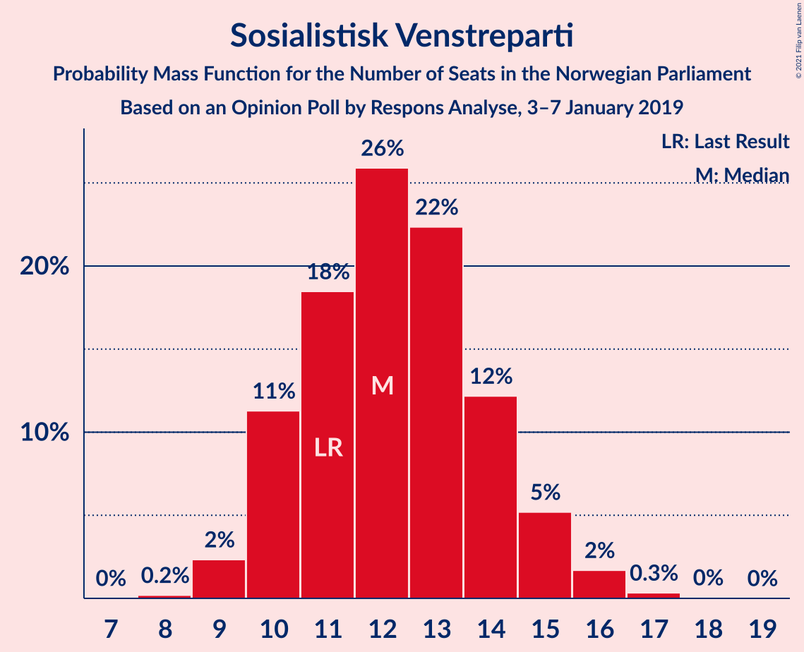
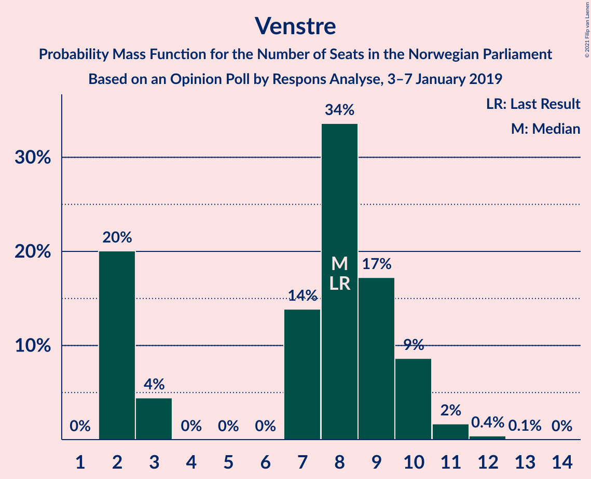
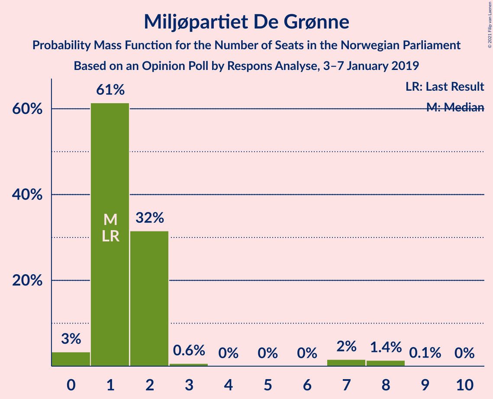
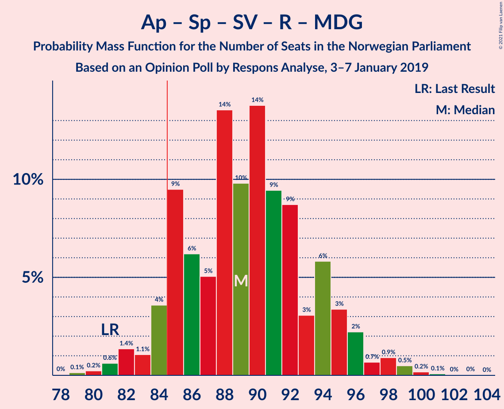
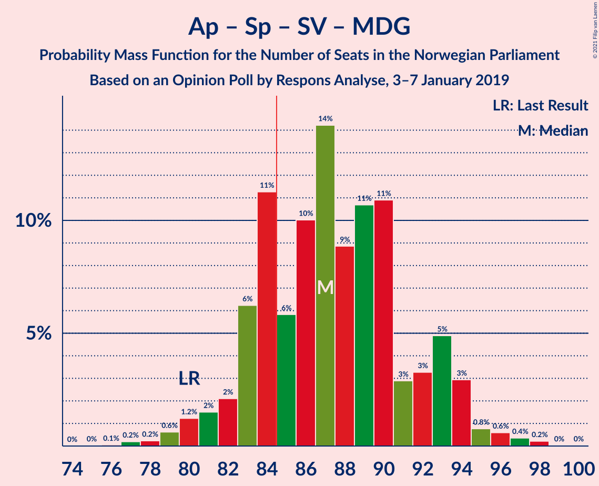
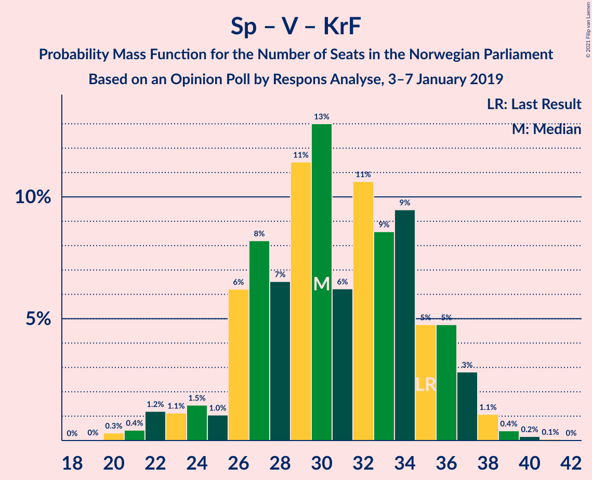

# Opinion Poll by Respons Analyse, 3–7 January 2019

<a href="#voting-intentions">Voting Intentions</a> | <a href="#seats">Seats</a> | <a href="#coalitions">Coalitions</a> | <a href="#technical-information">Technical Information</a>

## Voting Intentions

### Confidence Intervals

| Party | Last Result | Poll Result | 80% Confidence Interval | 90% Confidence Interval | 95% Confidence Interval | 99% Confidence Interval |
|:-----:|:-----------:|:-----------:|:-----------------------:|:-----------------------:|:-----------------------:|:-----------------------:|
| Arbeiderpartiet | 27.4% | 29.7% | 27.9–31.6% |27.4–32.1% |26.9–32.6% |26.1–33.5% |
| Høyre | 25.0% | 26.0% | 24.2–27.8% |23.8–28.3% |23.4–28.8% |22.5–29.7% |
| Fremskrittspartiet | 15.2% | 11.5% | 10.3–12.9% |9.9–13.3% |9.6–13.6% |9.1–14.3% |
| Senterpartiet | 10.3% | 10.5% | 9.3–11.8% |9.0–12.2% |8.7–12.5% |8.2–13.2% |
| Sosialistisk Venstreparti | 6.0% | 6.7% | 5.8–7.8% |5.5–8.1% |5.3–8.4% |4.9–9.0% |
| Venstre | 4.4% | 4.4% | 3.7–5.3% |3.5–5.6% |3.3–5.9% |3.0–6.3% |
| Kristelig Folkeparti | 4.2% | 3.8% | 3.1–4.7% |2.9–5.0% |2.8–5.2% |2.5–5.6% |
| Rødt | 2.4% | 3.1% | 2.5–3.9% |2.3–4.2% |2.2–4.4% |1.9–4.8% |
| Miljøpartiet De Grønne | 3.2% | 2.8% | 2.2–3.6% |2.1–3.8% |1.9–4.0% |1.7–4.4% |

*Note:* The poll result column reflects the actual value used in the calculations. Published results may vary slightly, and in addition be rounded to fewer digits.

## Seats

### Confidence Intervals

| Party | Last Result | Median | 80% Confidence Interval | 90% Confidence Interval | 95% Confidence Interval | 99% Confidence Interval |
|:-----:|:-----------:|:------:|:-----------------------:|:-----------------------:|:-----------------------:|:-----------------------:|
| <a href="#arbeiderpartiet">Arbeiderpartiet</a> | 49 | 55 | 51–58 |49–60 |48–60 |47–62 |
| <a href="#høyre">Høyre</a> | 45 | 47 | 43–51 |43–52 |42–53 |41–55 |
| <a href="#fremskrittspartiet">Fremskrittspartiet</a> | 27 | 21 | 19–23 |18–24 |17–25 |16–26 |
| <a href="#senterpartiet">Senterpartiet</a> | 19 | 19 | 17–21 |16–22 |15–23 |15–24 |
| <a href="#sosialistisk-venstreparti">Sosialistisk Venstreparti</a> | 11 | 12 | 10–14 |10–15 |9–15 |9–16 |
| <a href="#venstre">Venstre</a> | 8 | 8 | 2–10 |2–10 |2–10 |2–11 |
| <a href="#kristelig-folkeparti">Kristelig Folkeparti</a> | 8 | 3 | 1–8 |1–9 |1–9 |1–10 |
| <a href="#rødt">Rødt</a> | 1 | 2 | 1–2 |1–7 |1–8 |1–8 |
| <a href="#miljøpartiet-de-grønne">Miljøpartiet De Grønne</a> | 1 | 1 | 1–2 |1–2 |0–7 |0–8 |

### Arbeiderpartiet

*For a full overview of the results for this party, see the [Arbeiderpartiet](party-arbeiderpartiet.html) page.*

| Number of Seats | Probability | Accumulated | Special Marks |
|:---------------:|:-----------:|:-----------:|:-------------:|
| 45 | 0.1% | 100% |  |
| 46 | 0.3% | 99.9% |  |
| 47 | 0.7% | 99.6% |  |
| 48 | 2% | 99.0% |  |
| 49 | 2% | 97% | Last Result |
| 50 | 3% | 95% |  |
| 51 | 10% | 92% |  |
| 52 | 7% | 82% |  |
| 53 | 11% | 75% |  |
| 54 | 10% | 63% |  |
| 55 | 15% | 54% | Median |
| 56 | 8% | 39% |  |
| 57 | 15% | 31% |  |
| 58 | 6% | 15% |  |
| 59 | 4% | 9% |  |
| 60 | 3% | 5% |  |
| 61 | 1.1% | 2% |  |
| 62 | 0.7% | 1.0% |  |
| 63 | 0.1% | 0.3% |  |
| 64 | 0.1% | 0.1% |  |
| 65 | 0% | 0% |  |

### Høyre

*For a full overview of the results for this party, see the [Høyre](party-høyre.html) page.*

| Number of Seats | Probability | Accumulated | Special Marks |
|:---------------:|:-----------:|:-----------:|:-------------:|
| 39 | 0.1% | 100% |  |
| 40 | 0.2% | 99.8% |  |
| 41 | 1.3% | 99.6% |  |
| 42 | 3% | 98% |  |
| 43 | 8% | 95% |  |
| 44 | 5% | 87% |  |
| 45 | 16% | 82% | Last Result |
| 46 | 7% | 66% |  |
| 47 | 12% | 59% | Median |
| 48 | 12% | 47% |  |
| 49 | 12% | 35% |  |
| 50 | 6% | 23% |  |
| 51 | 10% | 17% |  |
| 52 | 3% | 7% |  |
| 53 | 3% | 4% |  |
| 54 | 0.3% | 1.0% |  |
| 55 | 0.3% | 0.7% |  |
| 56 | 0.3% | 0.3% |  |
| 57 | 0% | 0.1% |  |
| 58 | 0% | 0% |  |

### Fremskrittspartiet

*For a full overview of the results for this party, see the [Fremskrittspartiet](party-fremskrittspartiet.html) page.*

| Number of Seats | Probability | Accumulated | Special Marks |
|:---------------:|:-----------:|:-----------:|:-------------:|
| 15 | 0.1% | 100% |  |
| 16 | 2% | 99.9% |  |
| 17 | 2% | 98% |  |
| 18 | 5% | 96% |  |
| 19 | 14% | 91% |  |
| 20 | 17% | 77% |  |
| 21 | 24% | 60% | Median |
| 22 | 21% | 36% |  |
| 23 | 8% | 15% |  |
| 24 | 3% | 7% |  |
| 25 | 3% | 4% |  |
| 26 | 1.0% | 1.4% |  |
| 27 | 0.3% | 0.4% | Last Result |
| 28 | 0.1% | 0.1% |  |
| 29 | 0% | 0% |  |

### Senterpartiet

*For a full overview of the results for this party, see the [Senterpartiet](party-senterpartiet.html) page.*

| Number of Seats | Probability | Accumulated | Special Marks |
|:---------------:|:-----------:|:-----------:|:-------------:|
| 14 | 0.2% | 100% |  |
| 15 | 3% | 99.7% |  |
| 16 | 3% | 97% |  |
| 17 | 9% | 94% |  |
| 18 | 25% | 85% |  |
| 19 | 23% | 60% | Last Result, Median |
| 20 | 14% | 37% |  |
| 21 | 13% | 23% |  |
| 22 | 6% | 10% |  |
| 23 | 2% | 3% |  |
| 24 | 0.9% | 1.3% |  |
| 25 | 0.3% | 0.4% |  |
| 26 | 0.1% | 0.1% |  |
| 27 | 0% | 0% |  |

### Sosialistisk Venstreparti

*For a full overview of the results for this party, see the [Sosialistisk Venstreparti](party-sosialistiskvenstreparti.html) page.*

| Number of Seats | Probability | Accumulated | Special Marks |
|:---------------:|:-----------:|:-----------:|:-------------:|
| 8 | 0.2% | 100% |  |
| 9 | 2% | 99.8% |  |
| 10 | 11% | 97% |  |
| 11 | 18% | 86% | Last Result |
| 12 | 26% | 68% | Median |
| 13 | 22% | 42% |  |
| 14 | 12% | 19% |  |
| 15 | 5% | 7% |  |
| 16 | 2% | 2% |  |
| 17 | 0.3% | 0.4% |  |
| 18 | 0% | 0.1% |  |
| 19 | 0% | 0% |  |

### Venstre

*For a full overview of the results for this party, see the [Venstre](party-venstre.html) page.*

| Number of Seats | Probability | Accumulated | Special Marks |
|:---------------:|:-----------:|:-----------:|:-------------:|
| 2 | 20% | 100% |  |
| 3 | 4% | 80% |  |
| 4 | 0% | 75% |  |
| 5 | 0% | 75% |  |
| 6 | 0% | 75% |  |
| 7 | 14% | 75% |  |
| 8 | 34% | 62% | Last Result, Median |
| 9 | 17% | 28% |  |
| 10 | 9% | 11% |  |
| 11 | 2% | 2% |  |
| 12 | 0.4% | 0.5% |  |
| 13 | 0.1% | 0.1% |  |
| 14 | 0% | 0% |  |

### Kristelig Folkeparti

*For a full overview of the results for this party, see the [Kristelig Folkeparti](party-kristeligfolkeparti.html) page.*

| Number of Seats | Probability | Accumulated | Special Marks |
|:---------------:|:-----------:|:-----------:|:-------------:|
| 0 | 0.1% | 100% |  |
| 1 | 11% | 99.9% |  |
| 2 | 16% | 89% |  |
| 3 | 29% | 73% | Median |
| 4 | 0% | 44% |  |
| 5 | 0% | 44% |  |
| 6 | 0% | 44% |  |
| 7 | 21% | 44% |  |
| 8 | 16% | 23% | Last Result |
| 9 | 7% | 8% |  |
| 10 | 0.7% | 0.9% |  |
| 11 | 0.1% | 0.2% |  |
| 12 | 0% | 0% |  |

### Rødt

*For a full overview of the results for this party, see the [Rødt](party-rødt.html) page.*

| Number of Seats | Probability | Accumulated | Special Marks |
|:---------------:|:-----------:|:-----------:|:-------------:|
| 1 | 39% | 100% | Last Result |
| 2 | 54% | 60% | Median |
| 3 | 0% | 6% |  |
| 4 | 0% | 6% |  |
| 5 | 0% | 6% |  |
| 6 | 0.1% | 6% |  |
| 7 | 3% | 6% |  |
| 8 | 2% | 3% |  |
| 9 | 0.4% | 0.5% |  |
| 10 | 0% | 0% |  |

### Miljøpartiet De Grønne

*For a full overview of the results for this party, see the [Miljøpartiet De Grønne](party-miljøpartietdegrønne.html) page.*

| Number of Seats | Probability | Accumulated | Special Marks |
|:---------------:|:-----------:|:-----------:|:-------------:|
| 0 | 3% | 100% |  |
| 1 | 61% | 97% | Last Result, Median |
| 2 | 32% | 35% |  |
| 3 | 0.6% | 4% |  |
| 4 | 0% | 3% |  |
| 5 | 0% | 3% |  |
| 6 | 0% | 3% |  |
| 7 | 2% | 3% |  |
| 8 | 1.4% | 1.5% |  |
| 9 | 0.1% | 0.1% |  |
| 10 | 0% | 0% |  |

## Coalitions

### Confidence Intervals

| Coalition | Last Result | Median | Majority? | 80% Confidence Interval | 90% Confidence Interval | 95% Confidence Interval | 99% Confidence Interval |
|:---------:|:-----------:|:------:|:---------:|:-----------------------:|:-----------------------:|:-----------------------:|:-----------------------:|
| Høyre – Fremskrittspartiet – Senterpartiet – Venstre – Kristelig Folkeparti | 107 | 99 | 100% | 95–103 | 93–104 | 92–105 | 89–107 |
| Arbeiderpartiet – Senterpartiet – Sosialistisk Venstreparti – Kristelig Folkeparti – Miljøpartiet De Grønne | 88 | 92 | 98% | 87–97 | 86–98 | 85–99 | 83–101 |
| Arbeiderpartiet – Senterpartiet – Sosialistisk Venstreparti – Rødt – Miljøpartiet De Grønne | 81 | 89 | 93% | 85–94 | 84–95 | 83–96 | 81–99 |
| Arbeiderpartiet – Senterpartiet – Sosialistisk Venstreparti – Rødt | 80 | 88 | 80% | 84–92 | 82–93 | 81–95 | 79–97 |
| Arbeiderpartiet – Senterpartiet – Sosialistisk Venstreparti – Miljøpartiet De Grønne | 80 | 87 | 77% | 83–92 | 82–93 | 81–94 | 78–97 |
| Arbeiderpartiet – Senterpartiet – Sosialistisk Venstreparti | 79 | 86 | 69% | 82–91 | 80–92 | 79–92 | 77–95 |
| Høyre – Fremskrittspartiet – Venstre – Kristelig Folkeparti – Miljøpartiet De Grønne | 89 | 81 | 20% | 77–85 | 76–87 | 74–88 | 72–90 |
| Arbeiderpartiet – Senterpartiet – Kristelig Folkeparti – Miljøpartiet De Grønne | 77 | 80 | 13% | 74–85 | 74–86 | 73–87 | 71–90 |
| Høyre – Fremskrittspartiet – Venstre – Kristelig Folkeparti | 88 | 80 | 7% | 75–84 | 74–85 | 73–86 | 70–88 |
| Arbeiderpartiet – Senterpartiet – Kristelig Folkeparti | 76 | 78 | 6% | 73–84 | 73–85 | 72–86 | 69–88 |
| Høyre – Fremskrittspartiet – Venstre | 80 | 75 | 0.1% | 70–81 | 69–81 | 68–82 | 66–84 |
| Arbeiderpartiet – Senterpartiet | 68 | 74 | 0% | 70–78 | 68–80 | 67–80 | 65–82 |
| Arbeiderpartiet – Sosialistisk Venstreparti – Rødt – Miljøpartiet De Grønne | 62 | 70 | 0% | 66–74 | 65–76 | 64–77 | 62–80 |
| Høyre – Fremskrittspartiet | 72 | 68 | 0% | 64–73 | 63–74 | 62–74 | 59–76 |
| Arbeiderpartiet – Sosialistisk Venstreparti | 60 | 67 | 0% | 63–71 | 62–72 | 61–73 | 59–75 |
| Høyre – Venstre – Kristelig Folkeparti | 61 | 59 | 0% | 54–64 | 53–64 | 51–66 | 48–68 |
| Senterpartiet – Venstre – Kristelig Folkeparti | 35 | 30 | 0% | 26–35 | 25–36 | 23–37 | 21–39 |

### Høyre – Fremskrittspartiet – Senterpartiet – Venstre – Kristelig Folkeparti

| Number of Seats | Probability | Accumulated | Special Marks |
|:---------------:|:-----------:|:-----------:|:-------------:|
| 86 | 0.1% | 100% |  |
| 87 | 0.1% | 99.9% |  |
| 88 | 0.1% | 99.9% |  |
| 89 | 0.3% | 99.8% |  |
| 90 | 0.5% | 99.4% |  |
| 91 | 1.2% | 98.9% |  |
| 92 | 1.5% | 98% |  |
| 93 | 2% | 96% |  |
| 94 | 4% | 95% |  |
| 95 | 7% | 90% |  |
| 96 | 9% | 83% |  |
| 97 | 11% | 74% |  |
| 98 | 9% | 63% | Median |
| 99 | 13% | 54% |  |
| 100 | 10% | 41% |  |
| 101 | 6% | 30% |  |
| 102 | 8% | 24% |  |
| 103 | 10% | 17% |  |
| 104 | 4% | 7% |  |
| 105 | 1.0% | 3% |  |
| 106 | 0.9% | 2% |  |
| 107 | 0.8% | 1.0% | Last Result |
| 108 | 0.1% | 0.2% |  |
| 109 | 0.1% | 0.1% |  |
| 110 | 0% | 0% |  |

### Arbeiderpartiet – Senterpartiet – Sosialistisk Venstreparti – Kristelig Folkeparti – Miljøpartiet De Grønne

| Number of Seats | Probability | Accumulated | Special Marks |
|:---------------:|:-----------:|:-----------:|:-------------:|
| 81 | 0% | 100% |  |
| 82 | 0.2% | 99.9% |  |
| 83 | 0.5% | 99.7% |  |
| 84 | 1.1% | 99.3% |  |
| 85 | 1.5% | 98% | Majority |
| 86 | 3% | 97% |  |
| 87 | 8% | 93% |  |
| 88 | 7% | 85% | Last Result |
| 89 | 5% | 78% |  |
| 90 | 7% | 73% | Median |
| 91 | 9% | 67% |  |
| 92 | 11% | 58% |  |
| 93 | 7% | 47% |  |
| 94 | 11% | 39% |  |
| 95 | 7% | 29% |  |
| 96 | 7% | 21% |  |
| 97 | 9% | 14% |  |
| 98 | 2% | 5% |  |
| 99 | 2% | 3% |  |
| 100 | 1.2% | 2% |  |
| 101 | 0.4% | 0.7% |  |
| 102 | 0.1% | 0.3% |  |
| 103 | 0.1% | 0.2% |  |
| 104 | 0.1% | 0.1% |  |
| 105 | 0% | 0% |  |

### Arbeiderpartiet – Senterpartiet – Sosialistisk Venstreparti – Rødt – Miljøpartiet De Grønne

| Number of Seats | Probability | Accumulated | Special Marks |
|:---------------:|:-----------:|:-----------:|:-------------:|
| 78 | 0% | 100% |  |
| 79 | 0.1% | 99.9% |  |
| 80 | 0.2% | 99.8% |  |
| 81 | 0.6% | 99.5% | Last Result |
| 82 | 1.4% | 98.9% |  |
| 83 | 1.1% | 98% |  |
| 84 | 4% | 97% |  |
| 85 | 9% | 93% | Majority |
| 86 | 6% | 83% |  |
| 87 | 5% | 77% |  |
| 88 | 14% | 72% |  |
| 89 | 10% | 59% | Median |
| 90 | 14% | 49% |  |
| 91 | 9% | 35% |  |
| 92 | 9% | 26% |  |
| 93 | 3% | 17% |  |
| 94 | 6% | 14% |  |
| 95 | 3% | 8% |  |
| 96 | 2% | 5% |  |
| 97 | 0.7% | 2% |  |
| 98 | 0.9% | 2% |  |
| 99 | 0.5% | 0.8% |  |
| 100 | 0.2% | 0.3% |  |
| 101 | 0.1% | 0.2% |  |
| 102 | 0% | 0.1% |  |
| 103 | 0% | 0% |  |

### Arbeiderpartiet – Senterpartiet – Sosialistisk Venstreparti – Rødt

| Number of Seats | Probability | Accumulated | Special Marks |
|:---------------:|:-----------:|:-----------:|:-------------:|
| 76 | 0% | 100% |  |
| 77 | 0.1% | 99.9% |  |
| 78 | 0.2% | 99.8% |  |
| 79 | 0.3% | 99.6% |  |
| 80 | 0.9% | 99.3% | Last Result |
| 81 | 2% | 98% |  |
| 82 | 2% | 97% |  |
| 83 | 4% | 95% |  |
| 84 | 12% | 91% |  |
| 85 | 4% | 80% | Majority |
| 86 | 9% | 75% |  |
| 87 | 11% | 66% |  |
| 88 | 10% | 54% | Median |
| 89 | 14% | 44% |  |
| 90 | 10% | 30% |  |
| 91 | 6% | 21% |  |
| 92 | 6% | 15% |  |
| 93 | 4% | 9% |  |
| 94 | 2% | 5% |  |
| 95 | 1.3% | 3% |  |
| 96 | 0.9% | 2% |  |
| 97 | 0.6% | 1.0% |  |
| 98 | 0.2% | 0.4% |  |
| 99 | 0.1% | 0.2% |  |
| 100 | 0.1% | 0.1% |  |
| 101 | 0% | 0% |  |

### Arbeiderpartiet – Senterpartiet – Sosialistisk Venstreparti – Miljøpartiet De Grønne

| Number of Seats | Probability | Accumulated | Special Marks |
|:---------------:|:-----------:|:-----------:|:-------------:|
| 76 | 0.1% | 100% |  |
| 77 | 0.2% | 99.9% |  |
| 78 | 0.2% | 99.7% |  |
| 79 | 0.6% | 99.5% |  |
| 80 | 1.2% | 98.9% | Last Result |
| 81 | 2% | 98% |  |
| 82 | 2% | 96% |  |
| 83 | 6% | 94% |  |
| 84 | 11% | 88% |  |
| 85 | 6% | 77% | Majority |
| 86 | 10% | 71% |  |
| 87 | 14% | 61% | Median |
| 88 | 9% | 46% |  |
| 89 | 11% | 38% |  |
| 90 | 11% | 27% |  |
| 91 | 3% | 16% |  |
| 92 | 3% | 13% |  |
| 93 | 5% | 10% |  |
| 94 | 3% | 5% |  |
| 95 | 0.8% | 2% |  |
| 96 | 0.6% | 1.2% |  |
| 97 | 0.4% | 0.6% |  |
| 98 | 0.2% | 0.3% |  |
| 99 | 0% | 0.1% |  |
| 100 | 0% | 0% |  |

### Arbeiderpartiet – Senterpartiet – Sosialistisk Venstreparti

| Number of Seats | Probability | Accumulated | Special Marks |
|:---------------:|:-----------:|:-----------:|:-------------:|
| 74 | 0.1% | 100% |  |
| 75 | 0.1% | 99.9% |  |
| 76 | 0.3% | 99.9% |  |
| 77 | 0.4% | 99.6% |  |
| 78 | 0.9% | 99.2% |  |
| 79 | 1.3% | 98% | Last Result |
| 80 | 2% | 97% |  |
| 81 | 3% | 95% |  |
| 82 | 8% | 92% |  |
| 83 | 9% | 84% |  |
| 84 | 6% | 74% |  |
| 85 | 17% | 69% | Majority |
| 86 | 10% | 52% | Median |
| 87 | 9% | 42% |  |
| 88 | 10% | 33% |  |
| 89 | 9% | 22% |  |
| 90 | 3% | 14% |  |
| 91 | 6% | 11% |  |
| 92 | 3% | 5% |  |
| 93 | 0.7% | 2% |  |
| 94 | 1.0% | 2% |  |
| 95 | 0.3% | 0.6% |  |
| 96 | 0.1% | 0.3% |  |
| 97 | 0.1% | 0.1% |  |
| 98 | 0% | 0% |  |

### Høyre – Fremskrittspartiet – Venstre – Kristelig Folkeparti – Miljøpartiet De Grønne

| Number of Seats | Probability | Accumulated | Special Marks |
|:---------------:|:-----------:|:-----------:|:-------------:|
| 69 | 0.1% | 100% |  |
| 70 | 0.1% | 99.9% |  |
| 71 | 0.2% | 99.8% |  |
| 72 | 0.6% | 99.6% |  |
| 73 | 0.9% | 99.0% |  |
| 74 | 1.3% | 98% |  |
| 75 | 2% | 97% |  |
| 76 | 4% | 95% |  |
| 77 | 6% | 91% |  |
| 78 | 6% | 85% |  |
| 79 | 10% | 79% |  |
| 80 | 14% | 70% | Median |
| 81 | 10% | 56% |  |
| 82 | 11% | 46% |  |
| 83 | 9% | 34% |  |
| 84 | 4% | 25% |  |
| 85 | 12% | 20% | Majority |
| 86 | 4% | 9% |  |
| 87 | 2% | 5% |  |
| 88 | 2% | 3% |  |
| 89 | 0.9% | 2% | Last Result |
| 90 | 0.3% | 0.7% |  |
| 91 | 0.2% | 0.4% |  |
| 92 | 0.1% | 0.2% |  |
| 93 | 0% | 0.1% |  |
| 94 | 0% | 0% |  |

### Arbeiderpartiet – Senterpartiet – Kristelig Folkeparti – Miljøpartiet De Grønne

| Number of Seats | Probability | Accumulated | Special Marks |
|:---------------:|:-----------:|:-----------:|:-------------:|
| 68 | 0% | 100% |  |
| 69 | 0.1% | 99.9% |  |
| 70 | 0.3% | 99.9% |  |
| 71 | 0.5% | 99.6% |  |
| 72 | 0.9% | 99.1% |  |
| 73 | 2% | 98% |  |
| 74 | 9% | 96% |  |
| 75 | 3% | 87% |  |
| 76 | 6% | 84% |  |
| 77 | 6% | 78% | Last Result |
| 78 | 9% | 73% | Median |
| 79 | 11% | 64% |  |
| 80 | 9% | 54% |  |
| 81 | 7% | 45% |  |
| 82 | 9% | 38% |  |
| 83 | 12% | 29% |  |
| 84 | 4% | 17% |  |
| 85 | 6% | 13% | Majority |
| 86 | 4% | 7% |  |
| 87 | 2% | 3% |  |
| 88 | 0.5% | 1.5% |  |
| 89 | 0.3% | 1.0% |  |
| 90 | 0.5% | 0.7% |  |
| 91 | 0.1% | 0.2% |  |
| 92 | 0.1% | 0.1% |  |
| 93 | 0% | 0% |  |

### Høyre – Fremskrittspartiet – Venstre – Kristelig Folkeparti

| Number of Seats | Probability | Accumulated | Special Marks |
|:---------------:|:-----------:|:-----------:|:-------------:|
| 67 | 0% | 100% |  |
| 68 | 0.1% | 99.9% |  |
| 69 | 0.2% | 99.8% |  |
| 70 | 0.5% | 99.7% |  |
| 71 | 0.9% | 99.2% |  |
| 72 | 0.7% | 98% |  |
| 73 | 2% | 98% |  |
| 74 | 3% | 95% |  |
| 75 | 6% | 92% |  |
| 76 | 3% | 86% |  |
| 77 | 9% | 83% |  |
| 78 | 9% | 74% |  |
| 79 | 14% | 65% | Median |
| 80 | 10% | 51% |  |
| 81 | 14% | 41% |  |
| 82 | 5% | 28% |  |
| 83 | 6% | 23% |  |
| 84 | 9% | 17% |  |
| 85 | 4% | 7% | Majority |
| 86 | 1.1% | 3% |  |
| 87 | 1.4% | 2% |  |
| 88 | 0.6% | 1.1% | Last Result |
| 89 | 0.2% | 0.5% |  |
| 90 | 0.1% | 0.2% |  |
| 91 | 0% | 0.1% |  |
| 92 | 0% | 0% |  |

### Arbeiderpartiet – Senterpartiet – Kristelig Folkeparti

| Number of Seats | Probability | Accumulated | Special Marks |
|:---------------:|:-----------:|:-----------:|:-------------:|
| 67 | 0.1% | 100% |  |
| 68 | 0.1% | 99.9% |  |
| 69 | 0.3% | 99.8% |  |
| 70 | 0.7% | 99.5% |  |
| 71 | 1.2% | 98.8% |  |
| 72 | 2% | 98% |  |
| 73 | 9% | 95% |  |
| 74 | 4% | 87% |  |
| 75 | 7% | 83% |  |
| 76 | 8% | 75% | Last Result |
| 77 | 7% | 68% | Median |
| 78 | 15% | 60% |  |
| 79 | 5% | 46% |  |
| 80 | 9% | 40% |  |
| 81 | 9% | 31% |  |
| 82 | 9% | 23% |  |
| 83 | 2% | 14% |  |
| 84 | 5% | 12% |  |
| 85 | 3% | 6% | Majority |
| 86 | 2% | 3% |  |
| 87 | 0.4% | 1.0% |  |
| 88 | 0.1% | 0.6% |  |
| 89 | 0.4% | 0.5% |  |
| 90 | 0% | 0.1% |  |
| 91 | 0% | 0% |  |

### Høyre – Fremskrittspartiet – Venstre

| Number of Seats | Probability | Accumulated | Special Marks |
|:---------------:|:-----------:|:-----------:|:-------------:|
| 63 | 0.1% | 100% |  |
| 64 | 0.1% | 99.9% |  |
| 65 | 0.2% | 99.8% |  |
| 66 | 0.5% | 99.6% |  |
| 67 | 1.2% | 99.1% |  |
| 68 | 2% | 98% |  |
| 69 | 2% | 96% |  |
| 70 | 5% | 94% |  |
| 71 | 8% | 89% |  |
| 72 | 13% | 81% |  |
| 73 | 6% | 68% |  |
| 74 | 9% | 62% |  |
| 75 | 12% | 53% |  |
| 76 | 8% | 41% | Median |
| 77 | 7% | 33% |  |
| 78 | 4% | 26% |  |
| 79 | 8% | 22% |  |
| 80 | 2% | 14% | Last Result |
| 81 | 8% | 12% |  |
| 82 | 3% | 4% |  |
| 83 | 0.6% | 1.5% |  |
| 84 | 0.7% | 0.8% |  |
| 85 | 0.1% | 0.1% | Majority |
| 86 | 0% | 0.1% |  |
| 87 | 0% | 0% |  |

### Arbeiderpartiet – Senterpartiet

| Number of Seats | Probability | Accumulated | Special Marks |
|:---------------:|:-----------:|:-----------:|:-------------:|
| 63 | 0.1% | 100% |  |
| 64 | 0.2% | 99.9% |  |
| 65 | 0.5% | 99.6% |  |
| 66 | 0.6% | 99.2% |  |
| 67 | 1.4% | 98.5% |  |
| 68 | 3% | 97% | Last Result |
| 69 | 3% | 94% |  |
| 70 | 11% | 91% |  |
| 71 | 8% | 80% |  |
| 72 | 7% | 72% |  |
| 73 | 10% | 65% |  |
| 74 | 11% | 55% | Median |
| 75 | 16% | 44% |  |
| 76 | 8% | 28% |  |
| 77 | 8% | 20% |  |
| 78 | 6% | 12% |  |
| 79 | 1.2% | 6% |  |
| 80 | 3% | 5% |  |
| 81 | 1.3% | 2% |  |
| 82 | 0.4% | 0.7% |  |
| 83 | 0.1% | 0.3% |  |
| 84 | 0.1% | 0.2% |  |
| 85 | 0% | 0% | Majority |

### Arbeiderpartiet – Sosialistisk Venstreparti – Rødt – Miljøpartiet De Grønne

| Number of Seats | Probability | Accumulated | Special Marks |
|:---------------:|:-----------:|:-----------:|:-------------:|
| 60 | 0.1% | 100% |  |
| 61 | 0.1% | 99.9% |  |
| 62 | 0.8% | 99.8% | Last Result |
| 63 | 0.9% | 99.0% |  |
| 64 | 1.0% | 98% |  |
| 65 | 4% | 97% |  |
| 66 | 10% | 93% |  |
| 67 | 8% | 83% |  |
| 68 | 6% | 76% |  |
| 69 | 10% | 70% |  |
| 70 | 13% | 59% | Median |
| 71 | 9% | 46% |  |
| 72 | 11% | 37% |  |
| 73 | 9% | 26% |  |
| 74 | 7% | 17% |  |
| 75 | 4% | 10% |  |
| 76 | 2% | 5% |  |
| 77 | 1.5% | 4% |  |
| 78 | 1.2% | 2% |  |
| 79 | 0.5% | 1.1% |  |
| 80 | 0.3% | 0.6% |  |
| 81 | 0.1% | 0.2% |  |
| 82 | 0.1% | 0.1% |  |
| 83 | 0.1% | 0.1% |  |
| 84 | 0% | 0% |  |

### Høyre – Fremskrittspartiet

| Number of Seats | Probability | Accumulated | Special Marks |
|:---------------:|:-----------:|:-----------:|:-------------:|
| 58 | 0.1% | 100% |  |
| 59 | 0.4% | 99.8% |  |
| 60 | 0.3% | 99.4% |  |
| 61 | 1.0% | 99.1% |  |
| 62 | 3% | 98% |  |
| 63 | 5% | 95% |  |
| 64 | 8% | 90% |  |
| 65 | 7% | 82% |  |
| 66 | 9% | 75% |  |
| 67 | 11% | 66% |  |
| 68 | 11% | 55% | Median |
| 69 | 8% | 44% |  |
| 70 | 12% | 36% |  |
| 71 | 5% | 24% |  |
| 72 | 4% | 19% | Last Result |
| 73 | 9% | 15% |  |
| 74 | 4% | 6% |  |
| 75 | 1.0% | 2% |  |
| 76 | 0.9% | 1.4% |  |
| 77 | 0.2% | 0.5% |  |
| 78 | 0.2% | 0.3% |  |
| 79 | 0.1% | 0.1% |  |
| 80 | 0% | 0% |  |

### Arbeiderpartiet – Sosialistisk Venstreparti

| Number of Seats | Probability | Accumulated | Special Marks |
|:---------------:|:-----------:|:-----------:|:-------------:|
| 56 | 0% | 100% |  |
| 57 | 0.1% | 99.9% |  |
| 58 | 0.3% | 99.9% |  |
| 59 | 0.6% | 99.6% |  |
| 60 | 1.5% | 99.1% | Last Result |
| 61 | 2% | 98% |  |
| 62 | 5% | 96% |  |
| 63 | 4% | 91% |  |
| 64 | 14% | 87% |  |
| 65 | 9% | 73% |  |
| 66 | 9% | 65% |  |
| 67 | 17% | 56% | Median |
| 68 | 7% | 39% |  |
| 69 | 10% | 32% |  |
| 70 | 12% | 23% |  |
| 71 | 5% | 11% |  |
| 72 | 3% | 6% |  |
| 73 | 1.1% | 3% |  |
| 74 | 1.0% | 2% |  |
| 75 | 0.5% | 0.8% |  |
| 76 | 0.2% | 0.3% |  |
| 77 | 0% | 0.1% |  |
| 78 | 0% | 0% |  |

### Høyre – Venstre – Kristelig Folkeparti

| Number of Seats | Probability | Accumulated | Special Marks |
|:---------------:|:-----------:|:-----------:|:-------------:|
| 46 | 0.1% | 100% |  |
| 47 | 0.1% | 99.9% |  |
| 48 | 0.4% | 99.8% |  |
| 49 | 0.6% | 99.4% |  |
| 50 | 0.5% | 98.8% |  |
| 51 | 1.4% | 98% |  |
| 52 | 2% | 97% |  |
| 53 | 2% | 95% |  |
| 54 | 7% | 94% |  |
| 55 | 4% | 87% |  |
| 56 | 8% | 83% |  |
| 57 | 5% | 75% |  |
| 58 | 16% | 69% | Median |
| 59 | 13% | 53% |  |
| 60 | 10% | 40% |  |
| 61 | 6% | 31% | Last Result |
| 62 | 11% | 25% |  |
| 63 | 3% | 13% |  |
| 64 | 6% | 10% |  |
| 65 | 2% | 5% |  |
| 66 | 1.2% | 3% |  |
| 67 | 0.6% | 1.4% |  |
| 68 | 0.5% | 0.8% |  |
| 69 | 0.2% | 0.3% |  |
| 70 | 0.1% | 0.1% |  |
| 71 | 0% | 0% |  |

### Senterpartiet – Venstre – Kristelig Folkeparti

| Number of Seats | Probability | Accumulated | Special Marks |
|:---------------:|:-----------:|:-----------:|:-------------:|
| 20 | 0.3% | 100% |  |
| 21 | 0.4% | 99.6% |  |
| 22 | 1.2% | 99.2% |  |
| 23 | 1.1% | 98% |  |
| 24 | 1.5% | 97% |  |
| 25 | 1.0% | 95% |  |
| 26 | 6% | 94% |  |
| 27 | 8% | 88% |  |
| 28 | 7% | 80% |  |
| 29 | 11% | 73% |  |
| 30 | 13% | 62% | Median |
| 31 | 6% | 49% |  |
| 32 | 11% | 43% |  |
| 33 | 9% | 32% |  |
| 34 | 9% | 24% |  |
| 35 | 5% | 14% | Last Result |
| 36 | 5% | 9% |  |
| 37 | 3% | 5% |  |
| 38 | 1.1% | 2% |  |
| 39 | 0.4% | 0.7% |  |
| 40 | 0.2% | 0.3% |  |
| 41 | 0.1% | 0.1% |  |
| 42 | 0% | 0% |  |

## Technical Information

### Opinion Poll

+ **Polling firm:** Respons Analyse
+ **Commissioner(s):** —
+ **Fieldwork period:** 3–7 January 2019

### Calculations

+ **Sample size:** 1001
+ **Simulations done:** 1,048,576
+ **Error estimate:** 1.95%

