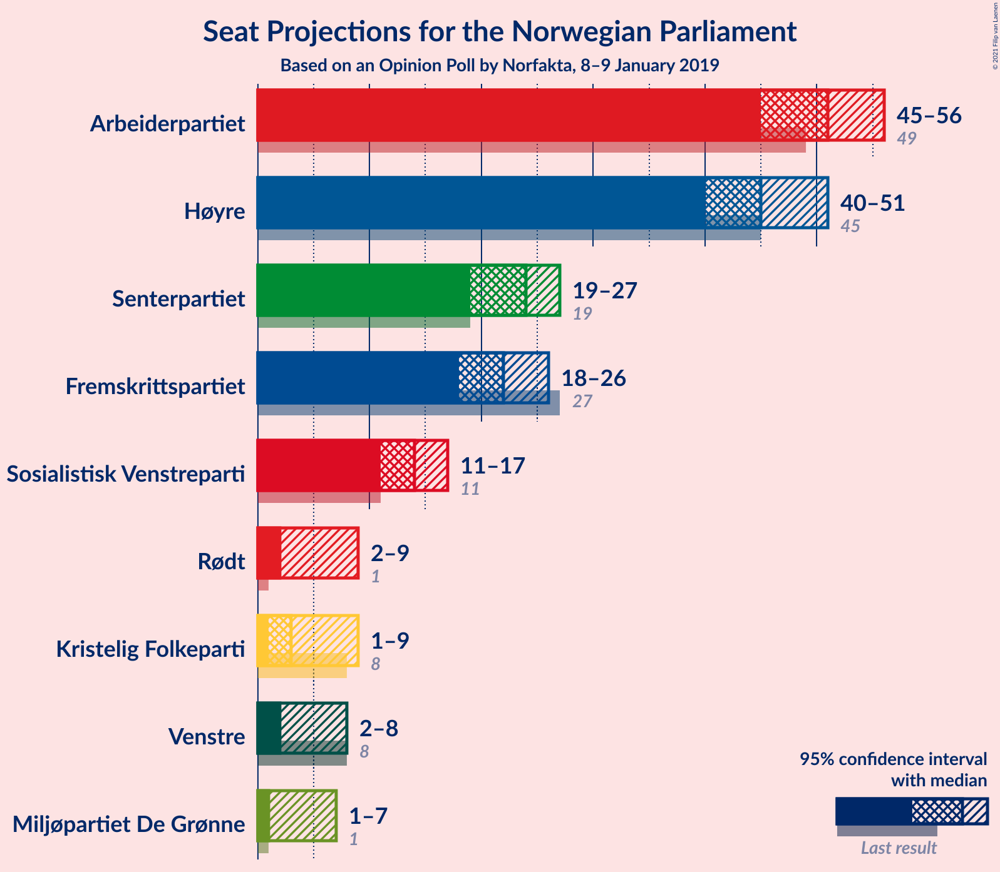
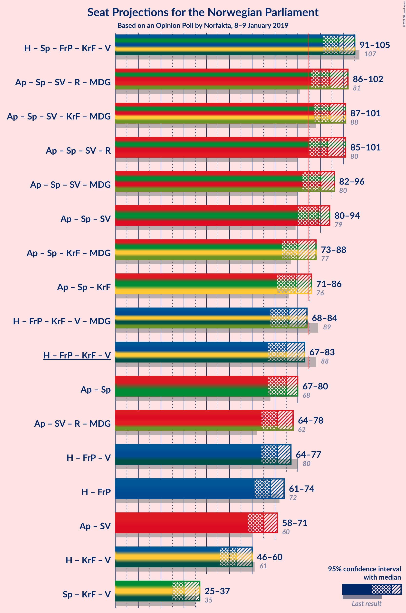
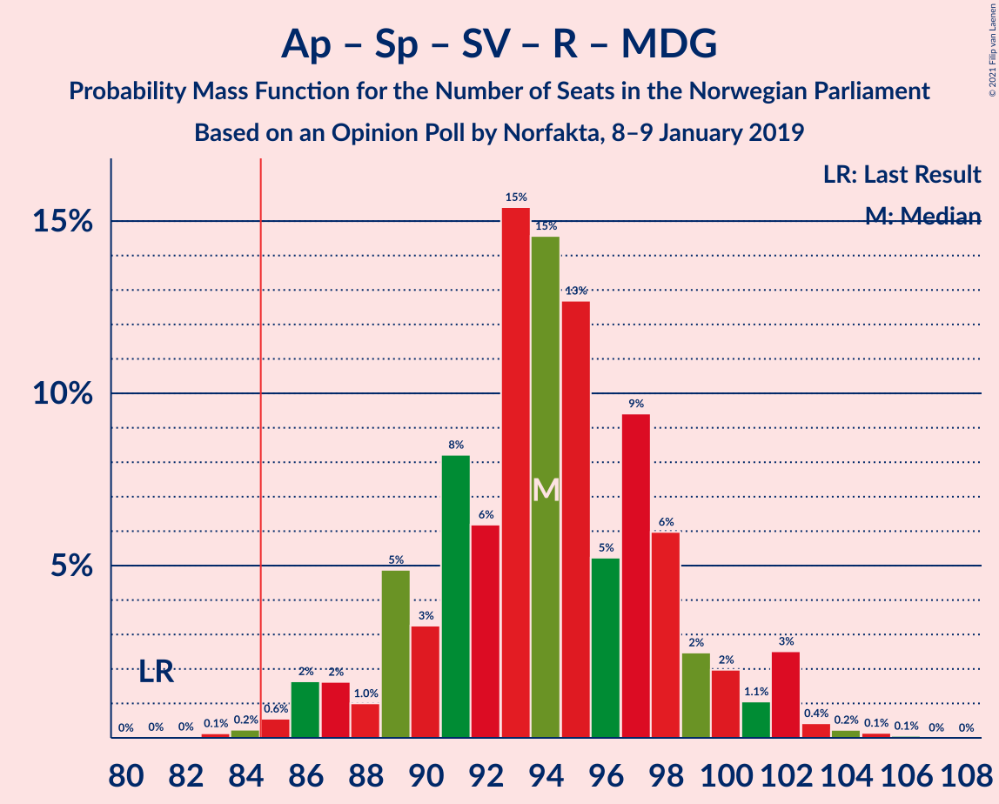
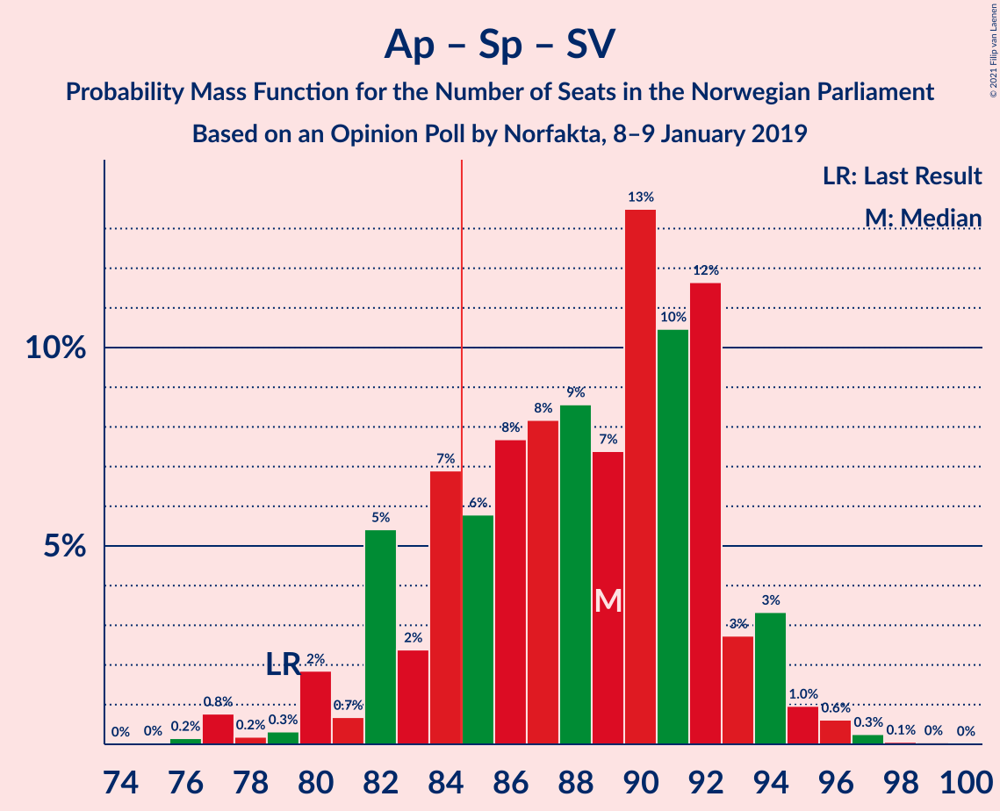
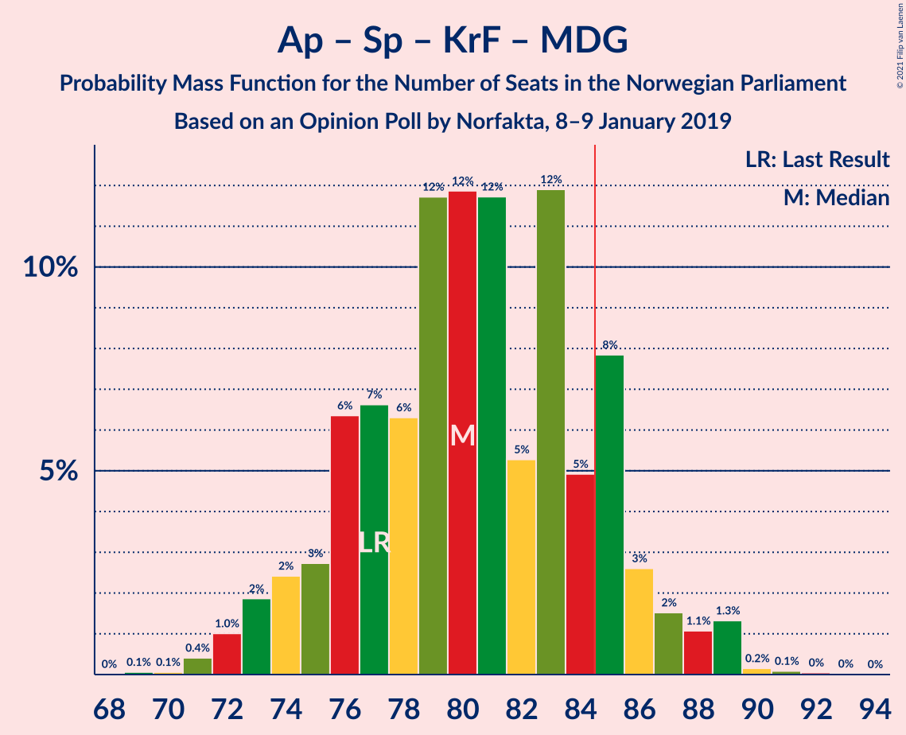
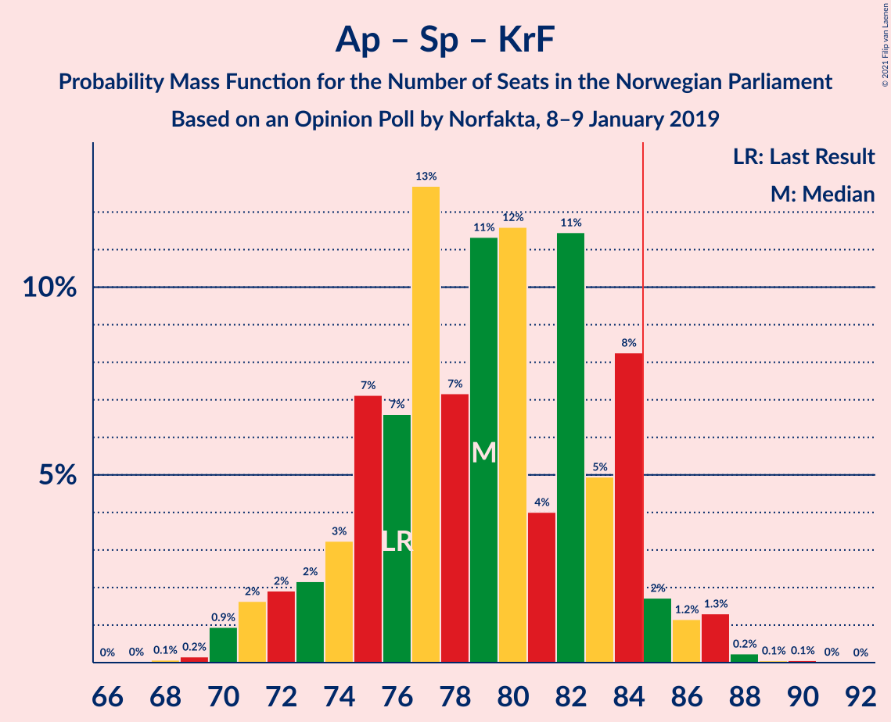
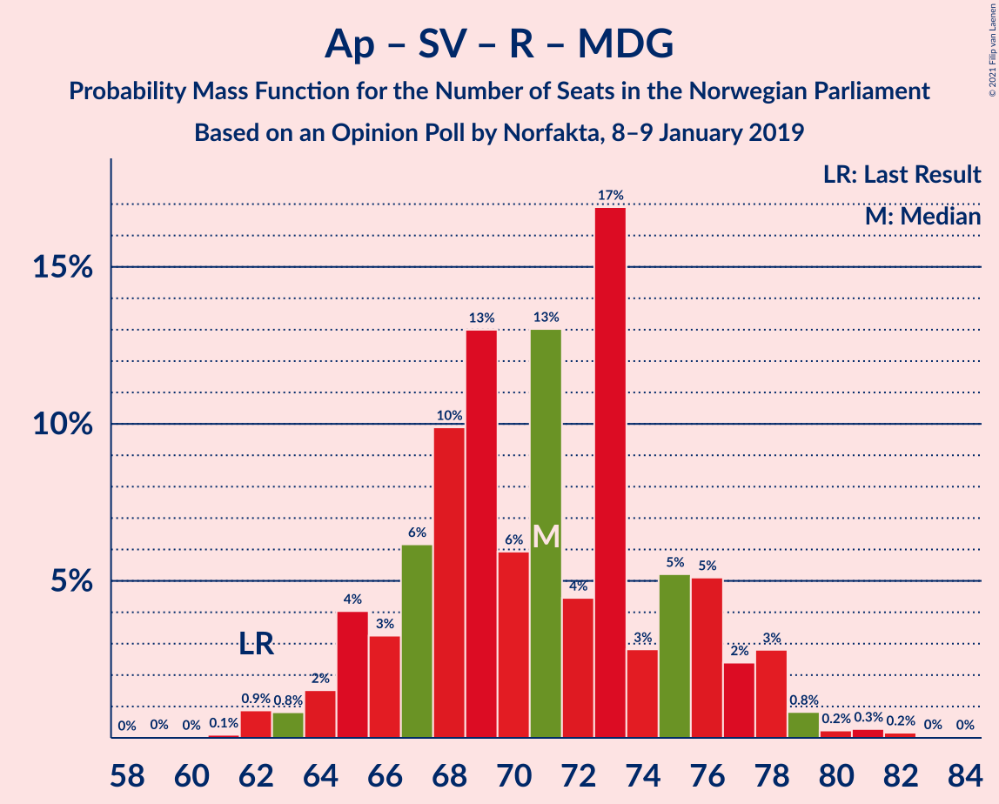
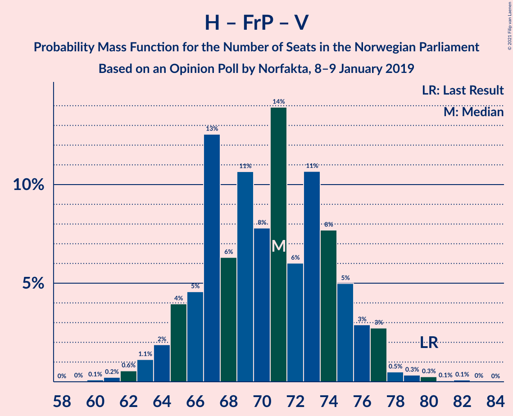
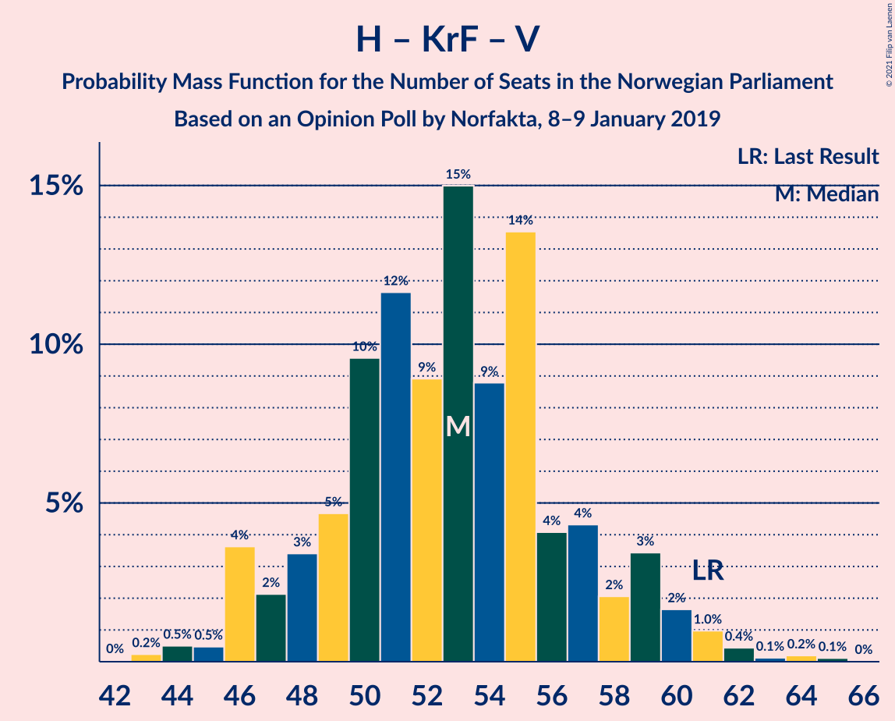
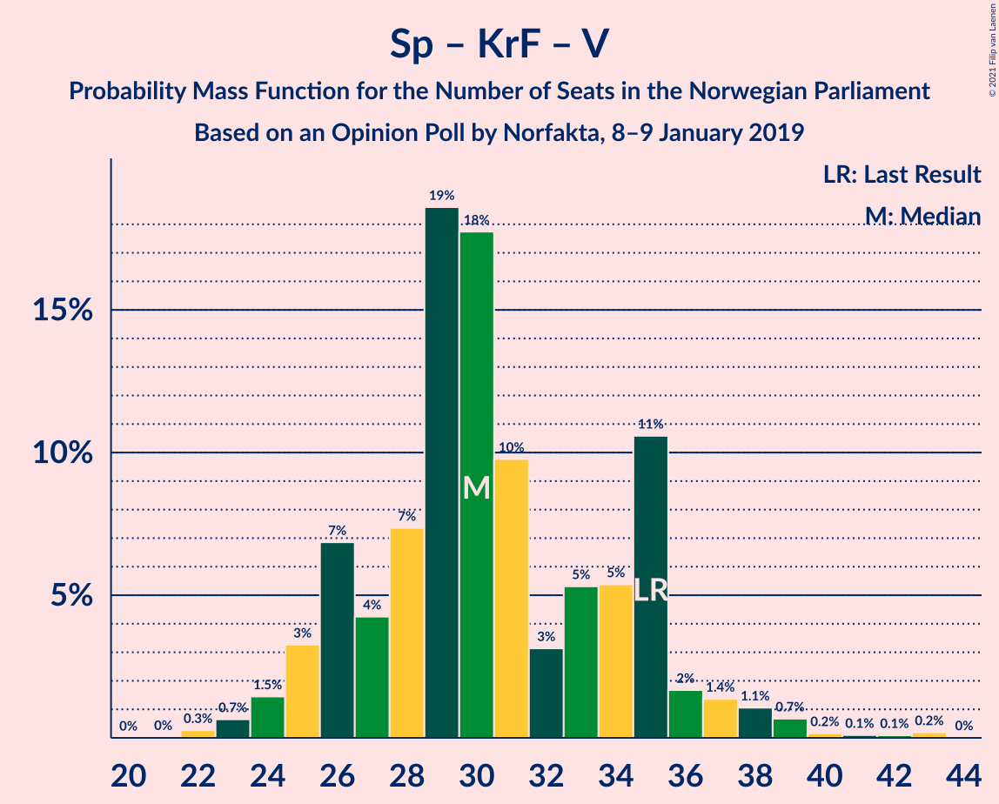

# Opinion Poll by Norfakta, 8–9 January 2019

<a href="#voting-intentions">Voting Intentions</a> | <a href="#seats">Seats</a> | <a href="#coalitions">Coalitions</a> | <a href="#technical-information">Technical Information</a>

## Voting Intentions

### Confidence Intervals

| Party | Last Result | Poll Result | 80% Confidence Interval | 90% Confidence Interval | 95% Confidence Interval | 99% Confidence Interval |
|:-----:|:-----------:|:-----------:|:-----------------------:|:-----------------------:|:-----------------------:|:-----------------------:|
| Arbeiderpartiet | 27.4% | 27.7% | 25.9–29.6% |25.4–30.1% |25.0–30.6% |24.2–31.5% |
| Høyre | 25.0% | 24.7% | 23.0–26.5% |22.5–27.0% |22.1–27.5% |21.3–28.4% |
| Senterpartiet | 10.3% | 12.5% | 11.2–13.9% |10.9–14.3% |10.6–14.7% |10.0–15.4% |
| Fremskrittspartiet | 15.2% | 12.0% | 10.8–13.4% |10.4–13.8% |10.1–14.2% |9.6–14.9% |
| Sosialistisk Venstreparti | 6.0% | 7.4% | 6.4–8.6% |6.2–8.9% |5.9–9.2% |5.5–9.8% |
| Rødt | 2.4% | 3.9% | 3.2–4.8% |3.0–5.1% |2.9–5.3% |2.6–5.8% |
| Kristelig Folkeparti | 4.2% | 3.8% | 3.1–4.7% |2.9–5.0% |2.8–5.2% |2.5–5.6% |
| Venstre | 4.4% | 3.3% | 2.7–4.1% |2.5–4.4% |2.4–4.6% |2.1–5.0% |
| Miljøpartiet De Grønne | 3.2% | 2.8% | 2.2–3.6% |2.1–3.8% |1.9–4.0% |1.7–4.4% |

*Note:* The poll result column reflects the actual value used in the calculations. Published results may vary slightly, and in addition be rounded to fewer digits.

## Seats

### Confidence Intervals

| Party | Last Result | Median | 80% Confidence Interval | 90% Confidence Interval | 95% Confidence Interval | 99% Confidence Interval |
|:-----:|:-----------:|:------:|:-----------------------:|:-----------------------:|:-----------------------:|:-----------------------:|
| <a href="#arbeiderpartiet">Arbeiderpartiet</a> | 49 | 51 | 48–55 |46–55 |45–56 |44–59 |
| <a href="#høyre">Høyre</a> | 45 | 45 | 42–50 |41–50 |40–51 |39–53 |
| <a href="#senterpartiet">Senterpartiet</a> | 19 | 24 | 20–25 |20–26 |19–27 |18–28 |
| <a href="#fremskrittspartiet">Fremskrittspartiet</a> | 27 | 22 | 20–25 |19–25 |18–26 |17–27 |
| <a href="#sosialistisk-venstreparti">Sosialistisk Venstreparti</a> | 11 | 14 | 12–16 |11–16 |11–17 |10–18 |
| <a href="#rødt">Rødt</a> | 1 | 2 | 2–9 |2–9 |2–9 |1–10 |
| <a href="#kristelig-folkeparti">Kristelig Folkeparti</a> | 8 | 3 | 2–8 |1–9 |1–9 |1–10 |
| <a href="#venstre">Venstre</a> | 8 | 2 | 2–7 |2–8 |2–8 |1–9 |
| <a href="#miljøpartiet-de-grønne">Miljøpartiet De Grønne</a> | 1 | 1 | 1–2 |1–2 |1–7 |0–8 |

### Arbeiderpartiet

*For a full overview of the results for this party, see the [Arbeiderpartiet](party-arbeiderpartiet.html) page.*

| Number of Seats | Probability | Accumulated | Special Marks |
|:---------------:|:-----------:|:-----------:|:-------------:|
| 42 | 0.1% | 100% |  |
| 43 | 0.3% | 99.9% |  |
| 44 | 1.2% | 99.6% |  |
| 45 | 2% | 98% |  |
| 46 | 2% | 97% |  |
| 47 | 3% | 95% |  |
| 48 | 10% | 91% |  |
| 49 | 14% | 82% | Last Result |
| 50 | 6% | 68% |  |
| 51 | 22% | 62% | Median |
| 52 | 7% | 40% |  |
| 53 | 5% | 33% |  |
| 54 | 9% | 29% |  |
| 55 | 15% | 20% |  |
| 56 | 2% | 4% |  |
| 57 | 1.1% | 2% |  |
| 58 | 0.4% | 1.4% |  |
| 59 | 0.8% | 1.0% |  |
| 60 | 0.1% | 0.2% |  |
| 61 | 0% | 0.1% |  |
| 62 | 0% | 0% |  |

### Høyre

*For a full overview of the results for this party, see the [Høyre](party-høyre.html) page.*

| Number of Seats | Probability | Accumulated | Special Marks |
|:---------------:|:-----------:|:-----------:|:-------------:|
| 37 | 0.1% | 100% |  |
| 38 | 0.3% | 99.9% |  |
| 39 | 1.0% | 99.5% |  |
| 40 | 2% | 98.6% |  |
| 41 | 4% | 97% |  |
| 42 | 6% | 93% |  |
| 43 | 15% | 87% |  |
| 44 | 11% | 71% |  |
| 45 | 16% | 60% | Last Result, Median |
| 46 | 9% | 45% |  |
| 47 | 9% | 35% |  |
| 48 | 5% | 26% |  |
| 49 | 5% | 21% |  |
| 50 | 11% | 15% |  |
| 51 | 2% | 4% |  |
| 52 | 0.8% | 1.5% |  |
| 53 | 0.4% | 0.6% |  |
| 54 | 0.2% | 0.2% |  |
| 55 | 0.1% | 0.1% |  |
| 56 | 0% | 0% |  |

### Senterpartiet

*For a full overview of the results for this party, see the [Senterpartiet](party-senterpartiet.html) page.*

| Number of Seats | Probability | Accumulated | Special Marks |
|:---------------:|:-----------:|:-----------:|:-------------:|
| 17 | 0.2% | 100% |  |
| 18 | 0.4% | 99.8% |  |
| 19 | 2% | 99.4% | Last Result |
| 20 | 10% | 97% |  |
| 21 | 16% | 87% |  |
| 22 | 7% | 71% |  |
| 23 | 8% | 65% |  |
| 24 | 27% | 56% | Median |
| 25 | 23% | 29% |  |
| 26 | 4% | 7% |  |
| 27 | 1.5% | 3% |  |
| 28 | 1.3% | 2% |  |
| 29 | 0.4% | 0.4% |  |
| 30 | 0% | 0.1% |  |
| 31 | 0% | 0% |  |

### Fremskrittspartiet

*For a full overview of the results for this party, see the [Fremskrittspartiet](party-fremskrittspartiet.html) page.*

| Number of Seats | Probability | Accumulated | Special Marks |
|:---------------:|:-----------:|:-----------:|:-------------:|
| 16 | 0.1% | 100% |  |
| 17 | 0.4% | 99.9% |  |
| 18 | 3% | 99.4% |  |
| 19 | 6% | 97% |  |
| 20 | 10% | 91% |  |
| 21 | 21% | 81% |  |
| 22 | 17% | 59% | Median |
| 23 | 13% | 42% |  |
| 24 | 18% | 29% |  |
| 25 | 7% | 11% |  |
| 26 | 2% | 4% |  |
| 27 | 2% | 2% | Last Result |
| 28 | 0.2% | 0.4% |  |
| 29 | 0.1% | 0.2% |  |
| 30 | 0% | 0% |  |

### Sosialistisk Venstreparti

*For a full overview of the results for this party, see the [Sosialistisk Venstreparti](party-sosialistiskvenstreparti.html) page.*

| Number of Seats | Probability | Accumulated | Special Marks |
|:---------------:|:-----------:|:-----------:|:-------------:|
| 9 | 0.1% | 100% |  |
| 10 | 1.1% | 99.9% |  |
| 11 | 6% | 98.7% | Last Result |
| 12 | 16% | 93% |  |
| 13 | 24% | 77% |  |
| 14 | 20% | 53% | Median |
| 15 | 20% | 33% |  |
| 16 | 8% | 13% |  |
| 17 | 3% | 4% |  |
| 18 | 0.6% | 0.8% |  |
| 19 | 0.2% | 0.2% |  |
| 20 | 0% | 0% |  |

### Rødt

*For a full overview of the results for this party, see the [Rødt](party-rødt.html) page.*

| Number of Seats | Probability | Accumulated | Special Marks |
|:---------------:|:-----------:|:-----------:|:-------------:|
| 1 | 2% | 100% | Last Result |
| 2 | 57% | 98% | Median |
| 3 | 0% | 40% |  |
| 4 | 0% | 40% |  |
| 5 | 0% | 40% |  |
| 6 | 0% | 40% |  |
| 7 | 8% | 40% |  |
| 8 | 18% | 32% |  |
| 9 | 12% | 14% |  |
| 10 | 2% | 2% |  |
| 11 | 0.2% | 0.3% |  |
| 12 | 0% | 0% |  |

### Kristelig Folkeparti

*For a full overview of the results for this party, see the [Kristelig Folkeparti](party-kristeligfolkeparti.html) page.*

| Number of Seats | Probability | Accumulated | Special Marks |
|:---------------:|:-----------:|:-----------:|:-------------:|
| 0 | 0.1% | 100% |  |
| 1 | 10% | 99.9% |  |
| 2 | 10% | 90% |  |
| 3 | 43% | 80% | Median |
| 4 | 0% | 38% |  |
| 5 | 0% | 38% |  |
| 6 | 0% | 38% |  |
| 7 | 9% | 38% |  |
| 8 | 23% | 29% | Last Result |
| 9 | 5% | 6% |  |
| 10 | 1.3% | 2% |  |
| 11 | 0.2% | 0.2% |  |
| 12 | 0% | 0% |  |

### Venstre

*For a full overview of the results for this party, see the [Venstre](party-venstre.html) page.*

| Number of Seats | Probability | Accumulated | Special Marks |
|:---------------:|:-----------:|:-----------:|:-------------:|
| 1 | 2% | 100% |  |
| 2 | 84% | 98% | Median |
| 3 | 2% | 13% |  |
| 4 | 0% | 12% |  |
| 5 | 0% | 12% |  |
| 6 | 0% | 12% |  |
| 7 | 5% | 12% |  |
| 8 | 6% | 7% | Last Result |
| 9 | 1.2% | 1.3% |  |
| 10 | 0.1% | 0.1% |  |
| 11 | 0% | 0% |  |

### Miljøpartiet De Grønne

*For a full overview of the results for this party, see the [Miljøpartiet De Grønne](party-miljøpartietdegrønne.html) page.*

| Number of Seats | Probability | Accumulated | Special Marks |
|:---------------:|:-----------:|:-----------:|:-------------:|
| 0 | 2% | 100% |  |
| 1 | 70% | 98% | Last Result, Median |
| 2 | 25% | 29% |  |
| 3 | 1.3% | 4% |  |
| 4 | 0% | 3% |  |
| 5 | 0% | 3% |  |
| 6 | 0% | 3% |  |
| 7 | 1.3% | 3% |  |
| 8 | 1.2% | 1.3% |  |
| 9 | 0.1% | 0.1% |  |
| 10 | 0% | 0% |  |

## Coalitions

### Confidence Intervals

| Coalition | Last Result | Median | Majority? | 80% Confidence Interval | 90% Confidence Interval | 95% Confidence Interval | 99% Confidence Interval |
|:---------:|:-----------:|:------:|:---------:|:-----------------------:|:-----------------------:|:-----------------------:|:-----------------------:|
| Høyre – Senterpartiet – Fremskrittspartiet – Kristelig Folkeparti – Venstre | 107 | 98 | 100% | 93–103 | 92–104 | 91–105 | 88–107 |
| Arbeiderpartiet – Senterpartiet – Sosialistisk Venstreparti – Rødt – Miljøpartiet De Grønne | 81 | 94 | 99.6% | 89–98 | 88–100 | 86–102 | 85–103 |
| Arbeiderpartiet – Senterpartiet – Sosialistisk Venstreparti – Kristelig Folkeparti – Miljøpartiet De Grønne | 88 | 94 | 99.7% | 90–100 | 88–100 | 87–101 | 85–103 |
| Arbeiderpartiet – Senterpartiet – Sosialistisk Venstreparti – Rødt | 80 | 93 | 98% | 88–97 | 86–99 | 85–101 | 83–102 |
| Arbeiderpartiet – Senterpartiet – Sosialistisk Venstreparti – Miljøpartiet De Grønne | 80 | 90 | 89% | 84–94 | 83–95 | 82–96 | 79–98 |
| Arbeiderpartiet – Senterpartiet – Sosialistisk Venstreparti | 79 | 89 | 81% | 83–92 | 82–94 | 80–94 | 77–96 |
| Arbeiderpartiet – Senterpartiet – Kristelig Folkeparti – Miljøpartiet De Grønne | 77 | 80 | 15% | 76–85 | 74–86 | 73–88 | 71–89 |
| Arbeiderpartiet – Senterpartiet – Kristelig Folkeparti | 76 | 79 | 5% | 74–84 | 73–84 | 71–86 | 70–87 |
| Høyre – Fremskrittspartiet – Kristelig Folkeparti – Venstre – Miljøpartiet De Grønne | 89 | 76 | 2% | 72–81 | 70–83 | 68–84 | 67–86 |
| Høyre – Fremskrittspartiet – Kristelig Folkeparti – Venstre | 88 | 75 | 0.4% | 71–80 | 69–81 | 67–83 | 66–84 |
| Arbeiderpartiet – Senterpartiet | 68 | 75 | 0.1% | 69–79 | 68–79 | 67–80 | 64–82 |
| Arbeiderpartiet – Sosialistisk Venstreparti – Rødt – Miljøpartiet De Grønne | 62 | 71 | 0% | 66–76 | 65–77 | 64–78 | 62–81 |
| Høyre – Fremskrittspartiet – Venstre | 80 | 71 | 0% | 66–75 | 65–76 | 64–77 | 62–79 |
| Høyre – Fremskrittspartiet | 72 | 68 | 0% | 63–72 | 62–73 | 61–74 | 59–76 |
| Arbeiderpartiet – Sosialistisk Venstreparti | 60 | 65 | 0% | 61–69 | 60–70 | 58–71 | 56–72 |
| Høyre – Kristelig Folkeparti – Venstre | 61 | 53 | 0% | 48–57 | 47–59 | 46–60 | 44–62 |
| Senterpartiet – Kristelig Folkeparti – Venstre | 35 | 30 | 0% | 26–35 | 25–36 | 25–37 | 23–40 |

### Høyre – Senterpartiet – Fremskrittspartiet – Kristelig Folkeparti – Venstre

| Number of Seats | Probability | Accumulated | Special Marks |
|:---------------:|:-----------:|:-----------:|:-------------:|
| 86 | 0% | 100% |  |
| 87 | 0.2% | 99.9% |  |
| 88 | 0.3% | 99.7% |  |
| 89 | 0.2% | 99.5% |  |
| 90 | 0.8% | 99.2% |  |
| 91 | 3% | 98% |  |
| 92 | 2% | 96% |  |
| 93 | 5% | 93% |  |
| 94 | 5% | 88% |  |
| 95 | 3% | 83% |  |
| 96 | 17% | 80% | Median |
| 97 | 4% | 63% |  |
| 98 | 13% | 59% |  |
| 99 | 6% | 46% |  |
| 100 | 13% | 40% |  |
| 101 | 10% | 27% |  |
| 102 | 6% | 17% |  |
| 103 | 3% | 11% |  |
| 104 | 4% | 7% |  |
| 105 | 2% | 3% |  |
| 106 | 0.8% | 2% |  |
| 107 | 0.9% | 1.0% | Last Result |
| 108 | 0.1% | 0.2% |  |
| 109 | 0% | 0.1% |  |
| 110 | 0% | 0.1% |  |
| 111 | 0% | 0% |  |

### Arbeiderpartiet – Senterpartiet – Sosialistisk Venstreparti – Rødt – Miljøpartiet De Grønne

| Number of Seats | Probability | Accumulated | Special Marks |
|:---------------:|:-----------:|:-----------:|:-------------:|
| 81 | 0% | 100% | Last Result |
| 82 | 0% | 100% |  |
| 83 | 0.1% | 99.9% |  |
| 84 | 0.2% | 99.8% |  |
| 85 | 0.6% | 99.6% | Majority |
| 86 | 2% | 99.0% |  |
| 87 | 2% | 97% |  |
| 88 | 1.0% | 96% |  |
| 89 | 5% | 95% |  |
| 90 | 3% | 90% |  |
| 91 | 8% | 87% |  |
| 92 | 6% | 78% | Median |
| 93 | 15% | 72% |  |
| 94 | 15% | 57% |  |
| 95 | 13% | 42% |  |
| 96 | 5% | 30% |  |
| 97 | 9% | 24% |  |
| 98 | 6% | 15% |  |
| 99 | 2% | 9% |  |
| 100 | 2% | 6% |  |
| 101 | 1.1% | 4% |  |
| 102 | 3% | 3% |  |
| 103 | 0.4% | 0.9% |  |
| 104 | 0.2% | 0.4% |  |
| 105 | 0.1% | 0.2% |  |
| 106 | 0.1% | 0.1% |  |
| 107 | 0% | 0% |  |

### Arbeiderpartiet – Senterpartiet – Sosialistisk Venstreparti – Kristelig Folkeparti – Miljøpartiet De Grønne

| Number of Seats | Probability | Accumulated | Special Marks |
|:---------------:|:-----------:|:-----------:|:-------------:|
| 83 | 0.1% | 100% |  |
| 84 | 0.1% | 99.8% |  |
| 85 | 1.3% | 99.7% | Majority |
| 86 | 0.6% | 98% |  |
| 87 | 2% | 98% |  |
| 88 | 1.3% | 95% | Last Result |
| 89 | 3% | 94% |  |
| 90 | 5% | 91% |  |
| 91 | 8% | 86% |  |
| 92 | 11% | 78% |  |
| 93 | 10% | 67% | Median |
| 94 | 15% | 57% |  |
| 95 | 5% | 42% |  |
| 96 | 13% | 37% |  |
| 97 | 5% | 24% |  |
| 98 | 6% | 19% |  |
| 99 | 2% | 13% |  |
| 100 | 7% | 11% |  |
| 101 | 2% | 3% |  |
| 102 | 1.1% | 2% |  |
| 103 | 0.5% | 0.7% |  |
| 104 | 0.1% | 0.2% |  |
| 105 | 0% | 0.1% |  |
| 106 | 0% | 0% |  |

### Arbeiderpartiet – Senterpartiet – Sosialistisk Venstreparti – Rødt

| Number of Seats | Probability | Accumulated | Special Marks |
|:---------------:|:-----------:|:-----------:|:-------------:|
| 80 | 0% | 100% | Last Result |
| 81 | 0.1% | 99.9% |  |
| 82 | 0.2% | 99.9% |  |
| 83 | 0.3% | 99.7% |  |
| 84 | 1.4% | 99.4% |  |
| 85 | 1.2% | 98% | Majority |
| 86 | 2% | 97% |  |
| 87 | 3% | 95% |  |
| 88 | 4% | 92% |  |
| 89 | 6% | 88% |  |
| 90 | 8% | 82% |  |
| 91 | 5% | 74% | Median |
| 92 | 16% | 69% |  |
| 93 | 16% | 53% |  |
| 94 | 11% | 37% |  |
| 95 | 6% | 26% |  |
| 96 | 9% | 20% |  |
| 97 | 3% | 11% |  |
| 98 | 3% | 8% |  |
| 99 | 1.5% | 5% |  |
| 100 | 0.5% | 4% |  |
| 101 | 2% | 3% |  |
| 102 | 0.3% | 0.6% |  |
| 103 | 0.2% | 0.3% |  |
| 104 | 0.1% | 0.1% |  |
| 105 | 0% | 0% |  |

### Arbeiderpartiet – Senterpartiet – Sosialistisk Venstreparti – Miljøpartiet De Grønne

| Number of Seats | Probability | Accumulated | Special Marks |
|:---------------:|:-----------:|:-----------:|:-------------:|
| 77 | 0.1% | 100% |  |
| 78 | 0.1% | 99.8% |  |
| 79 | 0.8% | 99.8% |  |
| 80 | 0.2% | 99.0% | Last Result |
| 81 | 0.6% | 98.8% |  |
| 82 | 2% | 98% |  |
| 83 | 1.4% | 96% |  |
| 84 | 6% | 95% |  |
| 85 | 5% | 89% | Majority |
| 86 | 6% | 84% |  |
| 87 | 7% | 78% |  |
| 88 | 6% | 71% |  |
| 89 | 11% | 65% |  |
| 90 | 7% | 54% | Median |
| 91 | 14% | 47% |  |
| 92 | 10% | 34% |  |
| 93 | 13% | 23% |  |
| 94 | 3% | 11% |  |
| 95 | 6% | 8% |  |
| 96 | 1.2% | 3% |  |
| 97 | 0.6% | 2% |  |
| 98 | 0.5% | 0.9% |  |
| 99 | 0.2% | 0.4% |  |
| 100 | 0.1% | 0.1% |  |
| 101 | 0% | 0.1% |  |
| 102 | 0% | 0% |  |

### Arbeiderpartiet – Senterpartiet – Sosialistisk Venstreparti

| Number of Seats | Probability | Accumulated | Special Marks |
|:---------------:|:-----------:|:-----------:|:-------------:|
| 75 | 0% | 100% |  |
| 76 | 0.2% | 99.9% |  |
| 77 | 0.8% | 99.8% |  |
| 78 | 0.2% | 99.0% |  |
| 79 | 0.3% | 98.8% | Last Result |
| 80 | 2% | 98.5% |  |
| 81 | 0.7% | 97% |  |
| 82 | 5% | 96% |  |
| 83 | 2% | 91% |  |
| 84 | 7% | 88% |  |
| 85 | 6% | 81% | Majority |
| 86 | 8% | 75% |  |
| 87 | 8% | 68% |  |
| 88 | 9% | 60% |  |
| 89 | 7% | 51% | Median |
| 90 | 13% | 44% |  |
| 91 | 10% | 30% |  |
| 92 | 12% | 20% |  |
| 93 | 3% | 8% |  |
| 94 | 3% | 5% |  |
| 95 | 1.0% | 2% |  |
| 96 | 0.6% | 1.0% |  |
| 97 | 0.3% | 0.4% |  |
| 98 | 0.1% | 0.1% |  |
| 99 | 0% | 0.1% |  |
| 100 | 0% | 0% |  |

### Arbeiderpartiet – Senterpartiet – Kristelig Folkeparti – Miljøpartiet De Grønne

| Number of Seats | Probability | Accumulated | Special Marks |
|:---------------:|:-----------:|:-----------:|:-------------:|
| 69 | 0.1% | 100% |  |
| 70 | 0.1% | 99.9% |  |
| 71 | 0.4% | 99.9% |  |
| 72 | 1.0% | 99.4% |  |
| 73 | 2% | 98% |  |
| 74 | 2% | 97% |  |
| 75 | 3% | 94% |  |
| 76 | 6% | 91% |  |
| 77 | 7% | 85% | Last Result |
| 78 | 6% | 78% |  |
| 79 | 12% | 72% | Median |
| 80 | 12% | 60% |  |
| 81 | 12% | 49% |  |
| 82 | 5% | 37% |  |
| 83 | 12% | 32% |  |
| 84 | 5% | 20% |  |
| 85 | 8% | 15% | Majority |
| 86 | 3% | 7% |  |
| 87 | 2% | 4% |  |
| 88 | 1.1% | 3% |  |
| 89 | 1.3% | 2% |  |
| 90 | 0.2% | 0.3% |  |
| 91 | 0.1% | 0.2% |  |
| 92 | 0% | 0.1% |  |
| 93 | 0% | 0% |  |

### Arbeiderpartiet – Senterpartiet – Kristelig Folkeparti

| Number of Seats | Probability | Accumulated | Special Marks |
|:---------------:|:-----------:|:-----------:|:-------------:|
| 68 | 0.1% | 100% |  |
| 69 | 0.2% | 99.9% |  |
| 70 | 0.9% | 99.7% |  |
| 71 | 2% | 98.8% |  |
| 72 | 2% | 97% |  |
| 73 | 2% | 95% |  |
| 74 | 3% | 93% |  |
| 75 | 7% | 90% |  |
| 76 | 7% | 83% | Last Result |
| 77 | 13% | 76% |  |
| 78 | 7% | 63% | Median |
| 79 | 11% | 56% |  |
| 80 | 12% | 45% |  |
| 81 | 4% | 33% |  |
| 82 | 11% | 29% |  |
| 83 | 5% | 18% |  |
| 84 | 8% | 13% |  |
| 85 | 2% | 5% | Majority |
| 86 | 1.2% | 3% |  |
| 87 | 1.3% | 2% |  |
| 88 | 0.2% | 0.4% |  |
| 89 | 0.1% | 0.2% |  |
| 90 | 0.1% | 0.1% |  |
| 91 | 0% | 0% |  |

### Høyre – Fremskrittspartiet – Kristelig Folkeparti – Venstre – Miljøpartiet De Grønne

| Number of Seats | Probability | Accumulated | Special Marks |
|:---------------:|:-----------:|:-----------:|:-------------:|
| 65 | 0.1% | 100% |  |
| 66 | 0.2% | 99.9% |  |
| 67 | 0.3% | 99.7% |  |
| 68 | 2% | 99.4% |  |
| 69 | 0.5% | 97% |  |
| 70 | 1.5% | 96% |  |
| 71 | 3% | 95% |  |
| 72 | 3% | 92% |  |
| 73 | 9% | 89% | Median |
| 74 | 6% | 80% |  |
| 75 | 11% | 74% |  |
| 76 | 16% | 63% |  |
| 77 | 16% | 47% |  |
| 78 | 5% | 31% |  |
| 79 | 8% | 26% |  |
| 80 | 6% | 18% |  |
| 81 | 4% | 12% |  |
| 82 | 3% | 8% |  |
| 83 | 2% | 5% |  |
| 84 | 1.2% | 3% |  |
| 85 | 1.4% | 2% | Majority |
| 86 | 0.3% | 0.6% |  |
| 87 | 0.2% | 0.3% |  |
| 88 | 0.1% | 0.1% |  |
| 89 | 0% | 0.1% | Last Result |
| 90 | 0% | 0% |  |

### Høyre – Fremskrittspartiet – Kristelig Folkeparti – Venstre

| Number of Seats | Probability | Accumulated | Special Marks |
|:---------------:|:-----------:|:-----------:|:-------------:|
| 63 | 0.1% | 100% |  |
| 64 | 0.1% | 99.9% |  |
| 65 | 0.2% | 99.8% |  |
| 66 | 0.4% | 99.5% |  |
| 67 | 3% | 99.1% |  |
| 68 | 1.1% | 97% |  |
| 69 | 2% | 96% |  |
| 70 | 2% | 94% |  |
| 71 | 6% | 91% |  |
| 72 | 9% | 85% | Median |
| 73 | 5% | 76% |  |
| 74 | 13% | 70% |  |
| 75 | 15% | 58% |  |
| 76 | 15% | 43% |  |
| 77 | 6% | 28% |  |
| 78 | 8% | 22% |  |
| 79 | 3% | 13% |  |
| 80 | 5% | 10% |  |
| 81 | 1.0% | 5% |  |
| 82 | 2% | 4% |  |
| 83 | 2% | 3% |  |
| 84 | 0.6% | 1.0% |  |
| 85 | 0.2% | 0.4% | Majority |
| 86 | 0.1% | 0.2% |  |
| 87 | 0% | 0.1% |  |
| 88 | 0% | 0% | Last Result |

### Arbeiderpartiet – Senterpartiet

| Number of Seats | Probability | Accumulated | Special Marks |
|:---------------:|:-----------:|:-----------:|:-------------:|
| 63 | 0.1% | 100% |  |
| 64 | 0.7% | 99.9% |  |
| 65 | 0.3% | 99.2% |  |
| 66 | 0.4% | 99.0% |  |
| 67 | 1.4% | 98.5% |  |
| 68 | 3% | 97% | Last Result |
| 69 | 5% | 94% |  |
| 70 | 6% | 89% |  |
| 71 | 5% | 83% |  |
| 72 | 10% | 79% |  |
| 73 | 5% | 68% |  |
| 74 | 9% | 63% |  |
| 75 | 9% | 54% | Median |
| 76 | 19% | 46% |  |
| 77 | 5% | 26% |  |
| 78 | 5% | 21% |  |
| 79 | 13% | 17% |  |
| 80 | 2% | 4% |  |
| 81 | 0.9% | 2% |  |
| 82 | 0.3% | 0.7% |  |
| 83 | 0.3% | 0.4% |  |
| 84 | 0.1% | 0.2% |  |
| 85 | 0.1% | 0.1% | Majority |
| 86 | 0% | 0% |  |

### Arbeiderpartiet – Sosialistisk Venstreparti – Rødt – Miljøpartiet De Grønne

| Number of Seats | Probability | Accumulated | Special Marks |
|:---------------:|:-----------:|:-----------:|:-------------:|
| 59 | 0% | 100% |  |
| 60 | 0% | 99.9% |  |
| 61 | 0.1% | 99.9% |  |
| 62 | 0.9% | 99.8% | Last Result |
| 63 | 0.8% | 98.9% |  |
| 64 | 2% | 98% |  |
| 65 | 4% | 97% |  |
| 66 | 3% | 93% |  |
| 67 | 6% | 89% |  |
| 68 | 10% | 83% | Median |
| 69 | 13% | 73% |  |
| 70 | 6% | 60% |  |
| 71 | 13% | 54% |  |
| 72 | 4% | 41% |  |
| 73 | 17% | 37% |  |
| 74 | 3% | 20% |  |
| 75 | 5% | 17% |  |
| 76 | 5% | 12% |  |
| 77 | 2% | 7% |  |
| 78 | 3% | 4% |  |
| 79 | 0.8% | 2% |  |
| 80 | 0.2% | 0.8% |  |
| 81 | 0.3% | 0.5% |  |
| 82 | 0.2% | 0.3% |  |
| 83 | 0% | 0.1% |  |
| 84 | 0% | 0% |  |

### Høyre – Fremskrittspartiet – Venstre

| Number of Seats | Probability | Accumulated | Special Marks |
|:---------------:|:-----------:|:-----------:|:-------------:|
| 59 | 0% | 100% |  |
| 60 | 0.1% | 99.9% |  |
| 61 | 0.2% | 99.8% |  |
| 62 | 0.6% | 99.6% |  |
| 63 | 1.1% | 99.1% |  |
| 64 | 2% | 98% |  |
| 65 | 4% | 96% |  |
| 66 | 5% | 92% |  |
| 67 | 13% | 88% |  |
| 68 | 6% | 75% |  |
| 69 | 11% | 69% | Median |
| 70 | 8% | 58% |  |
| 71 | 14% | 50% |  |
| 72 | 6% | 36% |  |
| 73 | 11% | 30% |  |
| 74 | 8% | 20% |  |
| 75 | 5% | 12% |  |
| 76 | 3% | 7% |  |
| 77 | 3% | 4% |  |
| 78 | 0.5% | 1.3% |  |
| 79 | 0.3% | 0.8% |  |
| 80 | 0.3% | 0.4% | Last Result |
| 81 | 0.1% | 0.2% |  |
| 82 | 0.1% | 0.1% |  |
| 83 | 0% | 0% |  |

### Høyre – Fremskrittspartiet

| Number of Seats | Probability | Accumulated | Special Marks |
|:---------------:|:-----------:|:-----------:|:-------------:|
| 57 | 0.1% | 100% |  |
| 58 | 0.2% | 99.9% |  |
| 59 | 0.5% | 99.6% |  |
| 60 | 1.0% | 99.1% |  |
| 61 | 1.5% | 98% |  |
| 62 | 4% | 97% |  |
| 63 | 4% | 93% |  |
| 64 | 7% | 88% |  |
| 65 | 13% | 82% |  |
| 66 | 7% | 69% |  |
| 67 | 11% | 62% | Median |
| 68 | 7% | 51% |  |
| 69 | 12% | 44% |  |
| 70 | 6% | 32% |  |
| 71 | 10% | 26% |  |
| 72 | 7% | 15% | Last Result |
| 73 | 5% | 9% |  |
| 74 | 2% | 4% |  |
| 75 | 2% | 2% |  |
| 76 | 0.2% | 0.6% |  |
| 77 | 0.2% | 0.4% |  |
| 78 | 0.1% | 0.2% |  |
| 79 | 0% | 0.1% |  |
| 80 | 0% | 0% |  |

### Arbeiderpartiet – Sosialistisk Venstreparti

| Number of Seats | Probability | Accumulated | Special Marks |
|:---------------:|:-----------:|:-----------:|:-------------:|
| 54 | 0.2% | 100% |  |
| 55 | 0.2% | 99.8% |  |
| 56 | 0.2% | 99.6% |  |
| 57 | 1.0% | 99.4% |  |
| 58 | 1.5% | 98% |  |
| 59 | 2% | 97% |  |
| 60 | 2% | 95% | Last Result |
| 61 | 7% | 93% |  |
| 62 | 9% | 86% |  |
| 63 | 6% | 77% |  |
| 64 | 13% | 70% |  |
| 65 | 13% | 58% | Median |
| 66 | 15% | 45% |  |
| 67 | 7% | 30% |  |
| 68 | 12% | 23% |  |
| 69 | 4% | 11% |  |
| 70 | 3% | 7% |  |
| 71 | 2% | 4% |  |
| 72 | 0.9% | 1.3% |  |
| 73 | 0.2% | 0.4% |  |
| 74 | 0.1% | 0.2% |  |
| 75 | 0.1% | 0.1% |  |
| 76 | 0% | 0% |  |

### Høyre – Kristelig Folkeparti – Venstre

| Number of Seats | Probability | Accumulated | Special Marks |
|:---------------:|:-----------:|:-----------:|:-------------:|
| 42 | 0% | 100% |  |
| 43 | 0.2% | 99.9% |  |
| 44 | 0.5% | 99.7% |  |
| 45 | 0.5% | 99.2% |  |
| 46 | 4% | 98.7% |  |
| 47 | 2% | 95% |  |
| 48 | 3% | 93% |  |
| 49 | 5% | 90% |  |
| 50 | 10% | 85% | Median |
| 51 | 12% | 75% |  |
| 52 | 9% | 64% |  |
| 53 | 15% | 55% |  |
| 54 | 9% | 40% |  |
| 55 | 14% | 31% |  |
| 56 | 4% | 17% |  |
| 57 | 4% | 13% |  |
| 58 | 2% | 9% |  |
| 59 | 3% | 7% |  |
| 60 | 2% | 4% |  |
| 61 | 1.0% | 2% | Last Result |
| 62 | 0.4% | 0.9% |  |
| 63 | 0.1% | 0.5% |  |
| 64 | 0.2% | 0.3% |  |
| 65 | 0.1% | 0.1% |  |
| 66 | 0% | 0% |  |

### Senterpartiet – Kristelig Folkeparti – Venstre

| Number of Seats | Probability | Accumulated | Special Marks |
|:---------------:|:-----------:|:-----------:|:-------------:|
| 22 | 0.3% | 100% |  |
| 23 | 0.7% | 99.7% |  |
| 24 | 1.5% | 99.1% |  |
| 25 | 3% | 98% |  |
| 26 | 7% | 94% |  |
| 27 | 4% | 87% |  |
| 28 | 7% | 83% |  |
| 29 | 19% | 76% | Median |
| 30 | 18% | 57% |  |
| 31 | 10% | 40% |  |
| 32 | 3% | 30% |  |
| 33 | 5% | 27% |  |
| 34 | 5% | 21% |  |
| 35 | 11% | 16% | Last Result |
| 36 | 2% | 5% |  |
| 37 | 1.4% | 4% |  |
| 38 | 1.1% | 2% |  |
| 39 | 0.7% | 1.2% |  |
| 40 | 0.2% | 0.6% |  |
| 41 | 0.1% | 0.4% |  |
| 42 | 0.1% | 0.3% |  |
| 43 | 0.2% | 0.2% |  |
| 44 | 0% | 0% |  |

## Technical Information

### Opinion Poll

+ **Polling firm:** Norfakta
+ **Commissioner(s):** —
+ **Fieldwork period:** 8–9 January 2019

### Calculations

+ **Sample size:** 1000
+ **Simulations done:** 1,048,576
+ **Error estimate:** 2.06%

