# Opinion Poll by Kantar TNS, 3–10 January 2019

<a href="#voting-intentions">Voting Intentions</a> | <a href="#seats">Seats</a> | <a href="#coalitions">Coalitions</a> | <a href="#technical-information">Technical Information</a>

## Voting Intentions

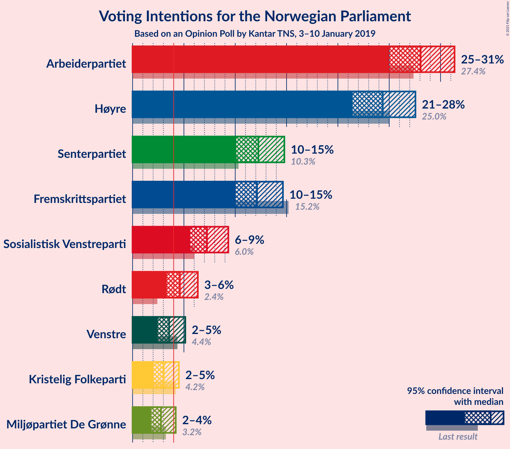

### Confidence Intervals

| Party | Last Result | Poll Result | 80% Confidence Interval | 90% Confidence Interval | 95% Confidence Interval | 99% Confidence Interval |
|:-----:|:-----------:|:-----------:|:-----------------------:|:-----------------------:|:-----------------------:|:-----------------------:|
| Arbeiderpartiet | 27.4% | 28.1% | 26.0–30.2% |25.5–30.8% |25.0–31.4% |24.0–32.4% |
| Høyre | 25.0% | 24.4% | 22.5–26.5% |21.9–27.1% |21.4–27.6% |20.6–28.6% |
| Senterpartiet | 10.3% | 12.3% | 10.8–13.9% |10.4–14.4% |10.1–14.8% |9.5–15.6% |
| Fremskrittspartiet | 15.2% | 12.1% | 10.7–13.8% |10.3–14.2% |10.0–14.6% |9.3–15.5% |
| Sosialistisk Venstreparti | 6.0% | 7.2% | 6.2–8.6% |5.9–9.0% |5.6–9.3% |5.1–10.0% |
| Rødt | 2.4% | 4.6% | 3.8–5.7% |3.5–6.1% |3.3–6.4% |3.0–6.9% |
| Venstre | 4.4% | 3.6% | 2.8–4.6% |2.6–4.9% |2.5–5.1% |2.1–5.7% |
| Kristelig Folkeparti | 4.2% | 3.0% | 2.4–4.0% |2.2–4.3% |2.0–4.5% |1.8–5.0% |
| Miljøpartiet De Grønne | 3.2% | 2.8% | 2.1–3.7% |2.0–4.0% |1.8–4.2% |1.6–4.7% |

*Note:* The poll result column reflects the actual value used in the calculations. Published results may vary slightly, and in addition be rounded to fewer digits.

## Seats

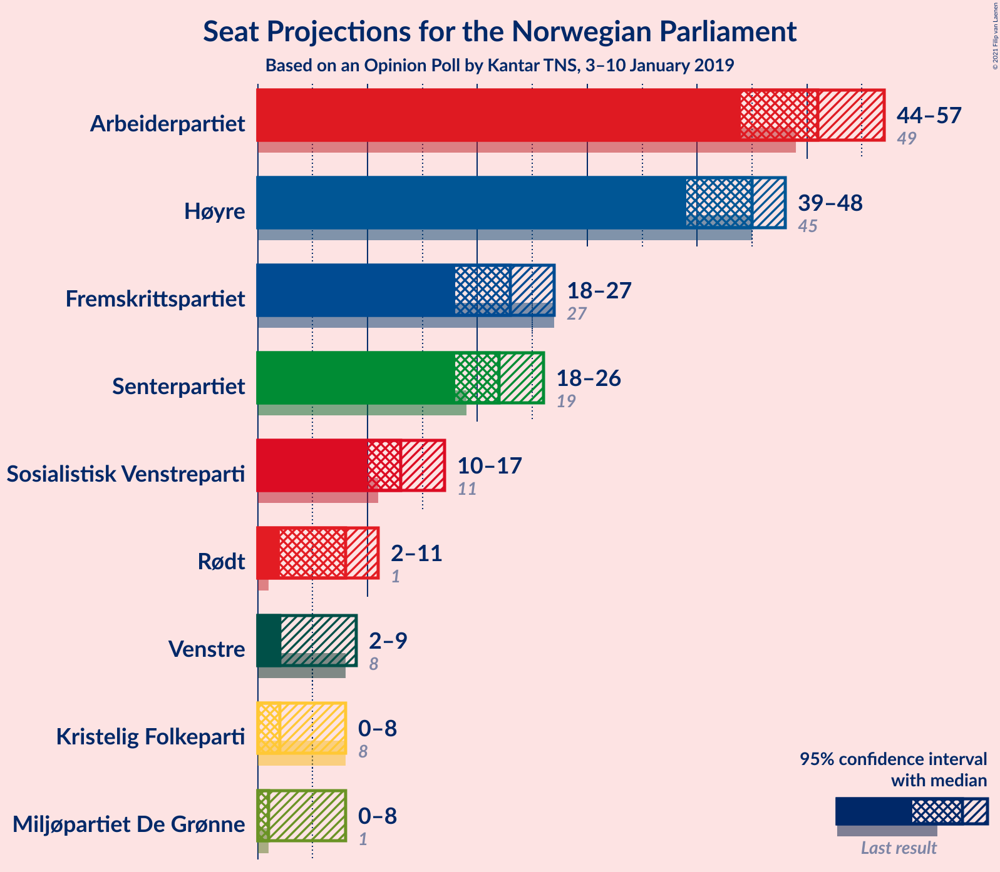

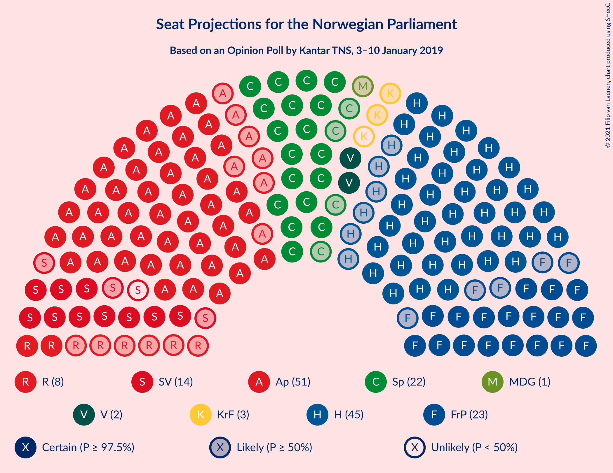

### Confidence Intervals

| Party | Last Result | Median | 80% Confidence Interval | 90% Confidence Interval | 95% Confidence Interval | 99% Confidence Interval |
|:-----:|:-----------:|:------:|:-----------------------:|:-----------------------:|:-----------------------:|:-----------------------:|
| <a href="#arbeiderpartiet">Arbeiderpartiet</a> | 49 | 51 | 47–54 |46–54 |44–57 |43–59 |
| <a href="#høyre">Høyre</a> | 45 | 45 | 42–47 |41–48 |39–48 |37–52 |
| <a href="#senterpartiet">Senterpartiet</a> | 19 | 22 | 20–25 |19–26 |18–26 |17–29 |
| <a href="#fremskrittspartiet">Fremskrittspartiet</a> | 27 | 23 | 19–25 |19–26 |18–27 |17–28 |
| <a href="#sosialistisk-venstreparti">Sosialistisk Venstreparti</a> | 11 | 13 | 12–15 |10–16 |10–17 |9–19 |
| <a href="#rødt">Rødt</a> | 1 | 8 | 7–10 |2–11 |2–11 |1–13 |
| <a href="#venstre">Venstre</a> | 8 | 2 | 2–8 |2–8 |2–9 |1–10 |
| <a href="#kristelig-folkeparti">Kristelig Folkeparti</a> | 8 | 2 | 1–7 |1–7 |0–8 |0–9 |
| <a href="#miljøpartiet-de-grønne">Miljøpartiet De Grønne</a> | 1 | 1 | 1–2 |0–8 |0–8 |0–8 |

### Arbeiderpartiet

*For a full overview of the results for this party, see the [Arbeiderpartiet](party-arbeiderpartiet.html) page.*

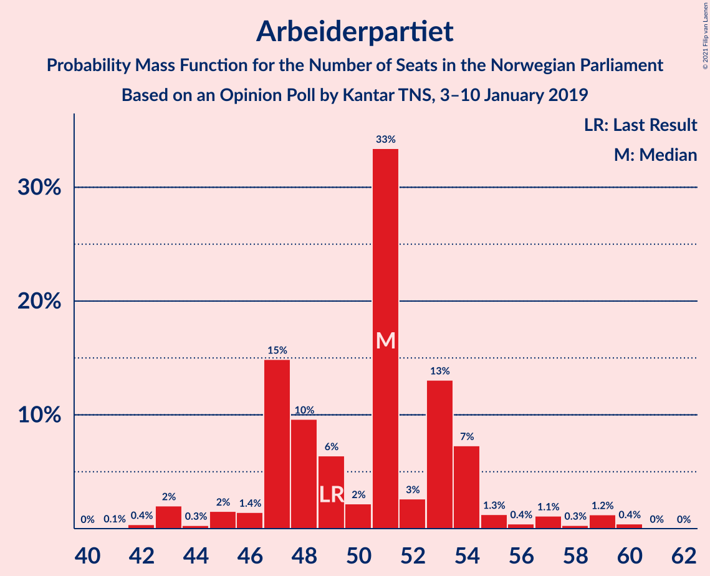

| Number of Seats | Probability | Accumulated | Special Marks |
|:---------------:|:-----------:|:-----------:|:-------------:|
| 41 | 0.1% | 100% |  |
| 42 | 0.4% | 99.9% |  |
| 43 | 2% | 99.6% |  |
| 44 | 0.3% | 98% |  |
| 45 | 2% | 97% |  |
| 46 | 1.4% | 96% |  |
| 47 | 15% | 94% |  |
| 48 | 10% | 79% |  |
| 49 | 6% | 70% | Last Result |
| 50 | 2% | 63% |  |
| 51 | 33% | 61% | Median |
| 52 | 3% | 28% |  |
| 53 | 13% | 25% |  |
| 54 | 7% | 12% |  |
| 55 | 1.3% | 5% |  |
| 56 | 0.4% | 4% |  |
| 57 | 1.1% | 3% |  |
| 58 | 0.3% | 2% |  |
| 59 | 1.2% | 2% |  |
| 60 | 0.4% | 0.5% |  |
| 61 | 0% | 0.1% |  |
| 62 | 0% | 0% |  |

### Høyre

*For a full overview of the results for this party, see the [Høyre](party-høyre.html) page.*

| Number of Seats | Probability | Accumulated | Special Marks |
|:---------------:|:-----------:|:-----------:|:-------------:|
| 34 | 0.1% | 100% |  |
| 35 | 0% | 99.9% |  |
| 36 | 0.1% | 99.9% |  |
| 37 | 0.3% | 99.7% |  |
| 38 | 0.7% | 99.4% |  |
| 39 | 2% | 98.8% |  |
| 40 | 2% | 97% |  |
| 41 | 2% | 95% |  |
| 42 | 5% | 93% |  |
| 43 | 12% | 88% |  |
| 44 | 13% | 76% |  |
| 45 | 14% | 63% | Last Result, Median |
| 46 | 21% | 49% |  |
| 47 | 18% | 28% |  |
| 48 | 8% | 10% |  |
| 49 | 0.3% | 2% |  |
| 50 | 0.3% | 1.4% |  |
| 51 | 0.4% | 1.1% |  |
| 52 | 0.4% | 0.7% |  |
| 53 | 0.1% | 0.3% |  |
| 54 | 0% | 0.2% |  |
| 55 | 0% | 0.2% |  |
| 56 | 0.2% | 0.2% |  |
| 57 | 0% | 0% |  |

### Senterpartiet

*For a full overview of the results for this party, see the [Senterpartiet](party-senterpartiet.html) page.*

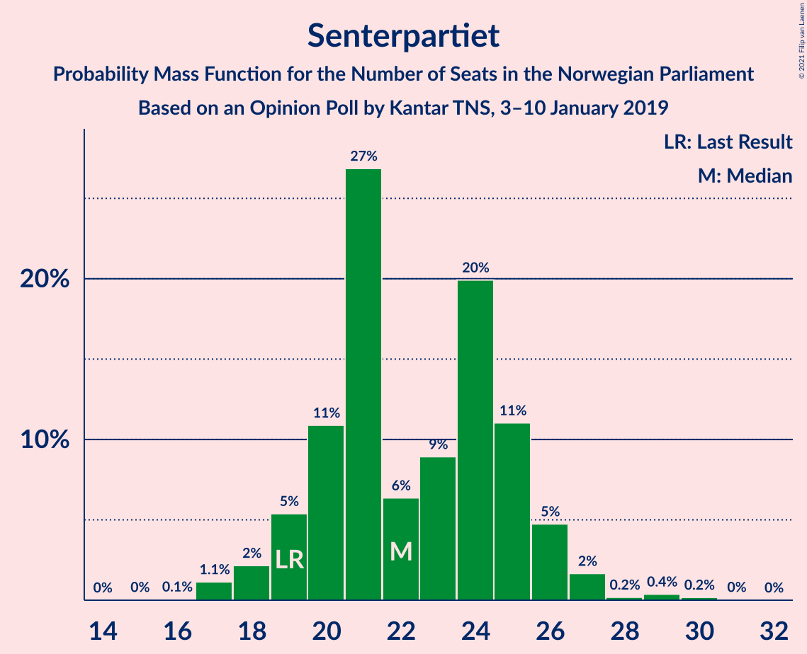

| Number of Seats | Probability | Accumulated | Special Marks |
|:---------------:|:-----------:|:-----------:|:-------------:|
| 16 | 0.1% | 100% |  |
| 17 | 1.1% | 99.9% |  |
| 18 | 2% | 98.8% |  |
| 19 | 5% | 97% | Last Result |
| 20 | 11% | 91% |  |
| 21 | 27% | 80% |  |
| 22 | 6% | 53% | Median |
| 23 | 9% | 47% |  |
| 24 | 20% | 38% |  |
| 25 | 11% | 18% |  |
| 26 | 5% | 7% |  |
| 27 | 2% | 2% |  |
| 28 | 0.2% | 0.8% |  |
| 29 | 0.4% | 0.6% |  |
| 30 | 0.2% | 0.2% |  |
| 31 | 0% | 0.1% |  |
| 32 | 0% | 0% |  |

### Fremskrittspartiet

*For a full overview of the results for this party, see the [Fremskrittspartiet](party-fremskrittspartiet.html) page.*

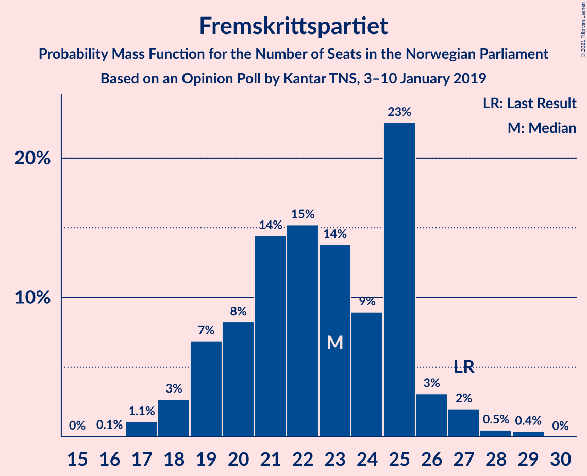

| Number of Seats | Probability | Accumulated | Special Marks |
|:---------------:|:-----------:|:-----------:|:-------------:|
| 15 | 0% | 100% |  |
| 16 | 0.1% | 99.9% |  |
| 17 | 1.1% | 99.8% |  |
| 18 | 3% | 98.8% |  |
| 19 | 7% | 96% |  |
| 20 | 8% | 89% |  |
| 21 | 14% | 81% |  |
| 22 | 15% | 67% |  |
| 23 | 14% | 51% | Median |
| 24 | 9% | 38% |  |
| 25 | 23% | 29% |  |
| 26 | 3% | 6% |  |
| 27 | 2% | 3% | Last Result |
| 28 | 0.5% | 0.9% |  |
| 29 | 0.4% | 0.4% |  |
| 30 | 0% | 0% |  |

### Sosialistisk Venstreparti

*For a full overview of the results for this party, see the [Sosialistisk Venstreparti](party-sosialistiskvenstreparti.html) page.*

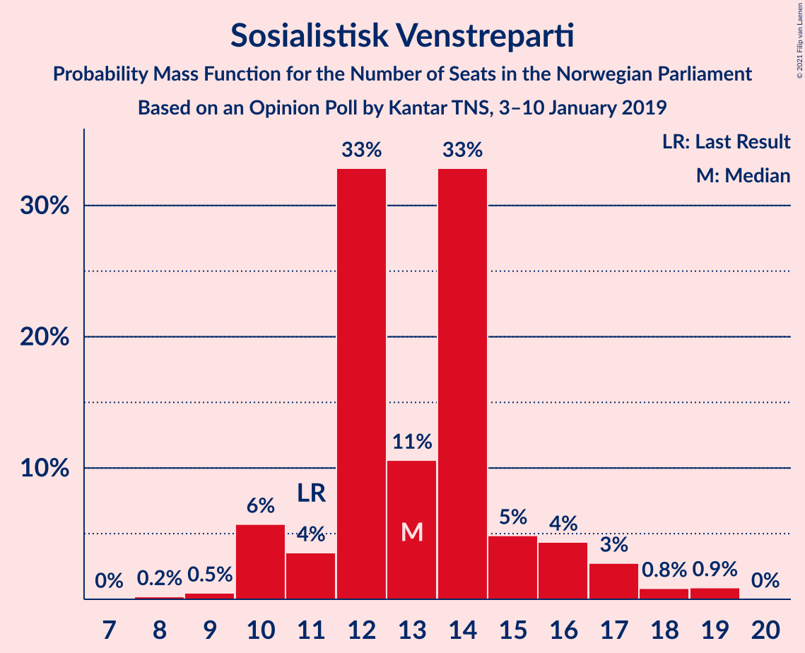

| Number of Seats | Probability | Accumulated | Special Marks |
|:---------------:|:-----------:|:-----------:|:-------------:|
| 8 | 0.2% | 100% |  |
| 9 | 0.5% | 99.8% |  |
| 10 | 6% | 99.3% |  |
| 11 | 4% | 94% | Last Result |
| 12 | 33% | 90% |  |
| 13 | 11% | 57% | Median |
| 14 | 33% | 47% |  |
| 15 | 5% | 14% |  |
| 16 | 4% | 9% |  |
| 17 | 3% | 5% |  |
| 18 | 0.8% | 2% |  |
| 19 | 0.9% | 0.9% |  |
| 20 | 0% | 0% |  |

### Rødt

*For a full overview of the results for this party, see the [Rødt](party-rødt.html) page.*

| Number of Seats | Probability | Accumulated | Special Marks |
|:---------------:|:-----------:|:-----------:|:-------------:|
| 1 | 1.1% | 100% | Last Result |
| 2 | 9% | 98.9% |  |
| 3 | 0% | 90% |  |
| 4 | 0% | 90% |  |
| 5 | 0% | 90% |  |
| 6 | 0% | 90% |  |
| 7 | 4% | 90% |  |
| 8 | 49% | 86% | Median |
| 9 | 10% | 37% |  |
| 10 | 22% | 27% |  |
| 11 | 4% | 5% |  |
| 12 | 0.8% | 2% |  |
| 13 | 0.6% | 0.7% |  |
| 14 | 0.1% | 0.1% |  |
| 15 | 0% | 0% |  |

### Venstre

*For a full overview of the results for this party, see the [Venstre](party-venstre.html) page.*

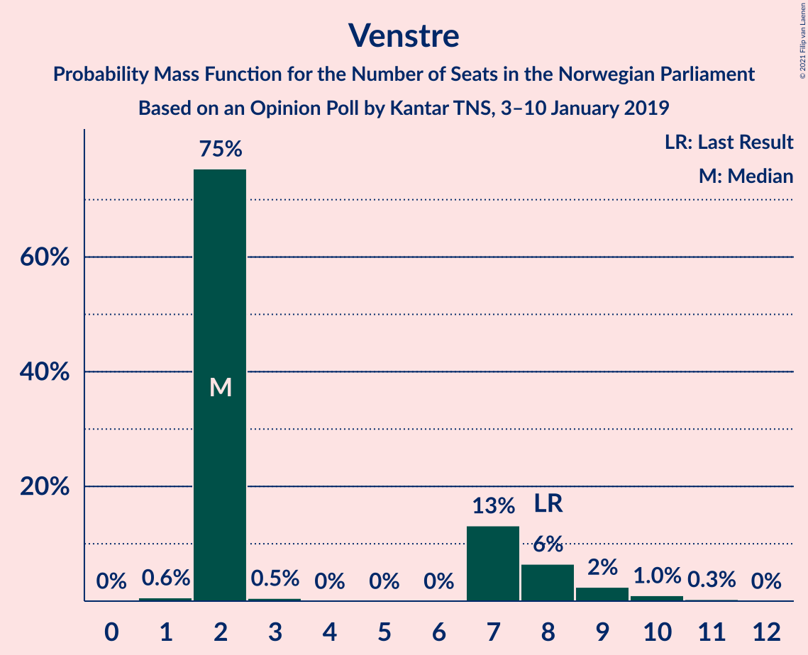

| Number of Seats | Probability | Accumulated | Special Marks |
|:---------------:|:-----------:|:-----------:|:-------------:|
| 1 | 0.6% | 100% |  |
| 2 | 75% | 99.4% | Median |
| 3 | 0.5% | 24% |  |
| 4 | 0% | 23% |  |
| 5 | 0% | 23% |  |
| 6 | 0% | 23% |  |
| 7 | 13% | 23% |  |
| 8 | 6% | 10% | Last Result |
| 9 | 2% | 4% |  |
| 10 | 1.0% | 1.3% |  |
| 11 | 0.3% | 0.3% |  |
| 12 | 0% | 0% |  |

### Kristelig Folkeparti

*For a full overview of the results for this party, see the [Kristelig Folkeparti](party-kristeligfolkeparti.html) page.*

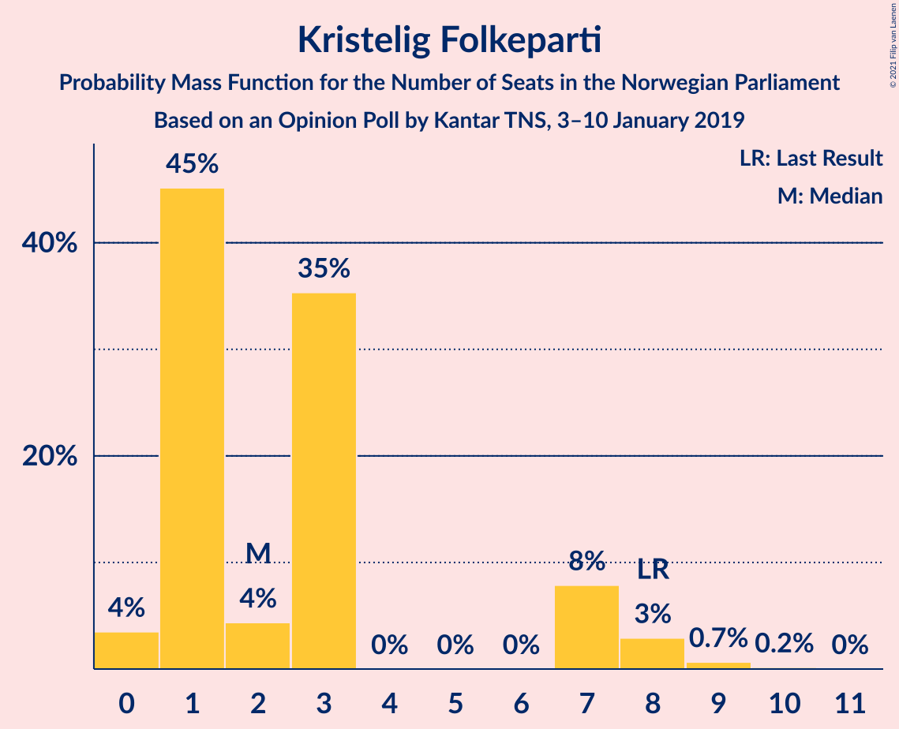

| Number of Seats | Probability | Accumulated | Special Marks |
|:---------------:|:-----------:|:-----------:|:-------------:|
| 0 | 4% | 100% |  |
| 1 | 45% | 96% |  |
| 2 | 4% | 51% | Median |
| 3 | 35% | 47% |  |
| 4 | 0% | 12% |  |
| 5 | 0% | 12% |  |
| 6 | 0% | 12% |  |
| 7 | 8% | 12% |  |
| 8 | 3% | 4% | Last Result |
| 9 | 0.7% | 0.8% |  |
| 10 | 0.2% | 0.2% |  |
| 11 | 0% | 0% |  |

### Miljøpartiet De Grønne

*For a full overview of the results for this party, see the [Miljøpartiet De Grønne](party-miljøpartietdegrønne.html) page.*

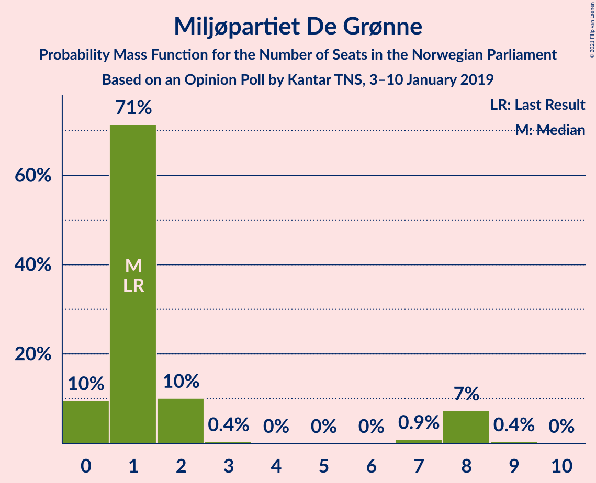

| Number of Seats | Probability | Accumulated | Special Marks |
|:---------------:|:-----------:|:-----------:|:-------------:|
| 0 | 10% | 100% |  |
| 1 | 71% | 90% | Last Result, Median |
| 2 | 10% | 19% |  |
| 3 | 0.4% | 9% |  |
| 4 | 0% | 9% |  |
| 5 | 0% | 9% |  |
| 6 | 0% | 9% |  |
| 7 | 0.9% | 9% |  |
| 8 | 7% | 8% |  |
| 9 | 0.4% | 0.4% |  |
| 10 | 0% | 0% |  |

## Coalitions

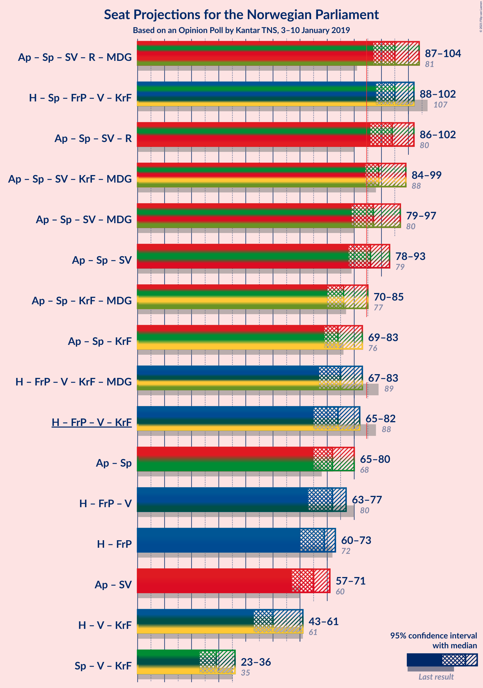

### Confidence Intervals

| Coalition | Last Result | Median | Majority? | 80% Confidence Interval | 90% Confidence Interval | 95% Confidence Interval | 99% Confidence Interval |
|:---------:|:-----------:|:------:|:---------:|:-----------------------:|:-----------------------:|:-----------------------:|:-----------------------:|
| Arbeiderpartiet – Senterpartiet – Sosialistisk Venstreparti – Rødt – Miljøpartiet De Grønne | 81 | 95 | 99.8% | 92–101 | 89–102 | 87–104 | 86–107 |
| Høyre – Senterpartiet – Fremskrittspartiet – Venstre – Kristelig Folkeparti | 107 | 95 | 99.7% | 90–100 | 89–101 | 88–102 | 85–106 |
| Arbeiderpartiet – Senterpartiet – Sosialistisk Venstreparti – Rødt | 80 | 94 | 99.4% | 91–98 | 88–100 | 86–102 | 84–105 |
| Arbeiderpartiet – Senterpartiet – Sosialistisk Venstreparti – Kristelig Folkeparti – Miljøpartiet De Grønne | 88 | 89 | 95% | 87–95 | 85–98 | 84–99 | 81–101 |
| Arbeiderpartiet – Senterpartiet – Sosialistisk Venstreparti – Miljøpartiet De Grønne | 80 | 87 | 77% | 84–93 | 82–94 | 79–97 | 77–99 |
| Arbeiderpartiet – Senterpartiet – Sosialistisk Venstreparti | 79 | 86 | 74% | 83–90 | 80–92 | 78–93 | 76–97 |
| Arbeiderpartiet – Senterpartiet – Kristelig Folkeparti – Miljøpartiet De Grønne | 77 | 76 | 3% | 73–83 | 70–84 | 70–85 | 67–88 |
| Arbeiderpartiet – Senterpartiet – Kristelig Folkeparti | 76 | 74 | 0.6% | 72–81 | 69–82 | 69–83 | 66–85 |
| Høyre – Fremskrittspartiet – Venstre – Kristelig Folkeparti – Miljøpartiet De Grønne | 89 | 75 | 0.6% | 71–78 | 69–81 | 67–83 | 64–85 |
| Høyre – Fremskrittspartiet – Venstre – Kristelig Folkeparti | 88 | 74 | 0.2% | 68–77 | 67–80 | 65–82 | 62–83 |
| Arbeiderpartiet – Senterpartiet | 68 | 72 | 0.1% | 69–77 | 67–79 | 65–80 | 62–82 |
| Høyre – Fremskrittspartiet – Venstre | 80 | 72 | 0% | 65–74 | 64–75 | 63–77 | 61–81 |
| Høyre – Fremskrittspartiet | 72 | 69 | 0% | 63–71 | 61–72 | 60–73 | 58–75 |
| Arbeiderpartiet – Sosialistisk Venstreparti | 60 | 65 | 0% | 59–67 | 59–68 | 57–71 | 56–72 |
| Høyre – Venstre – Kristelig Folkeparti | 61 | 50 | 0% | 47–55 | 45–59 | 43–61 | 41–62 |
| Senterpartiet – Venstre – Kristelig Folkeparti | 35 | 29 | 0% | 24–34 | 24–35 | 23–36 | 21–37 |

### Arbeiderpartiet – Senterpartiet – Sosialistisk Venstreparti – Rødt – Miljøpartiet De Grønne

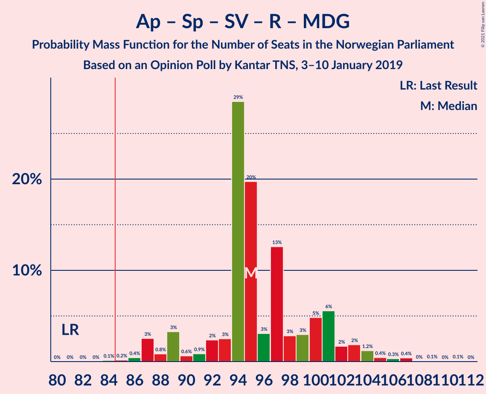

| Number of Seats | Probability | Accumulated | Special Marks |
|:---------------:|:-----------:|:-----------:|:-------------:|
| 81 | 0% | 100% | Last Result |
| 82 | 0% | 100% |  |
| 83 | 0% | 100% |  |
| 84 | 0.1% | 100% |  |
| 85 | 0.2% | 99.8% | Majority |
| 86 | 0.4% | 99.7% |  |
| 87 | 3% | 99.2% |  |
| 88 | 0.8% | 97% |  |
| 89 | 3% | 96% |  |
| 90 | 0.6% | 93% |  |
| 91 | 0.9% | 92% |  |
| 92 | 2% | 91% |  |
| 93 | 3% | 89% |  |
| 94 | 29% | 86% |  |
| 95 | 20% | 58% | Median |
| 96 | 3% | 38% |  |
| 97 | 13% | 35% |  |
| 98 | 3% | 22% |  |
| 99 | 3% | 19% |  |
| 100 | 5% | 16% |  |
| 101 | 6% | 12% |  |
| 102 | 2% | 6% |  |
| 103 | 2% | 4% |  |
| 104 | 1.2% | 3% |  |
| 105 | 0.4% | 1.3% |  |
| 106 | 0.3% | 0.9% |  |
| 107 | 0.4% | 0.6% |  |
| 108 | 0% | 0.2% |  |
| 109 | 0.1% | 0.1% |  |
| 110 | 0% | 0.1% |  |
| 111 | 0.1% | 0.1% |  |
| 112 | 0% | 0% |  |

### Høyre – Senterpartiet – Fremskrittspartiet – Venstre – Kristelig Folkeparti

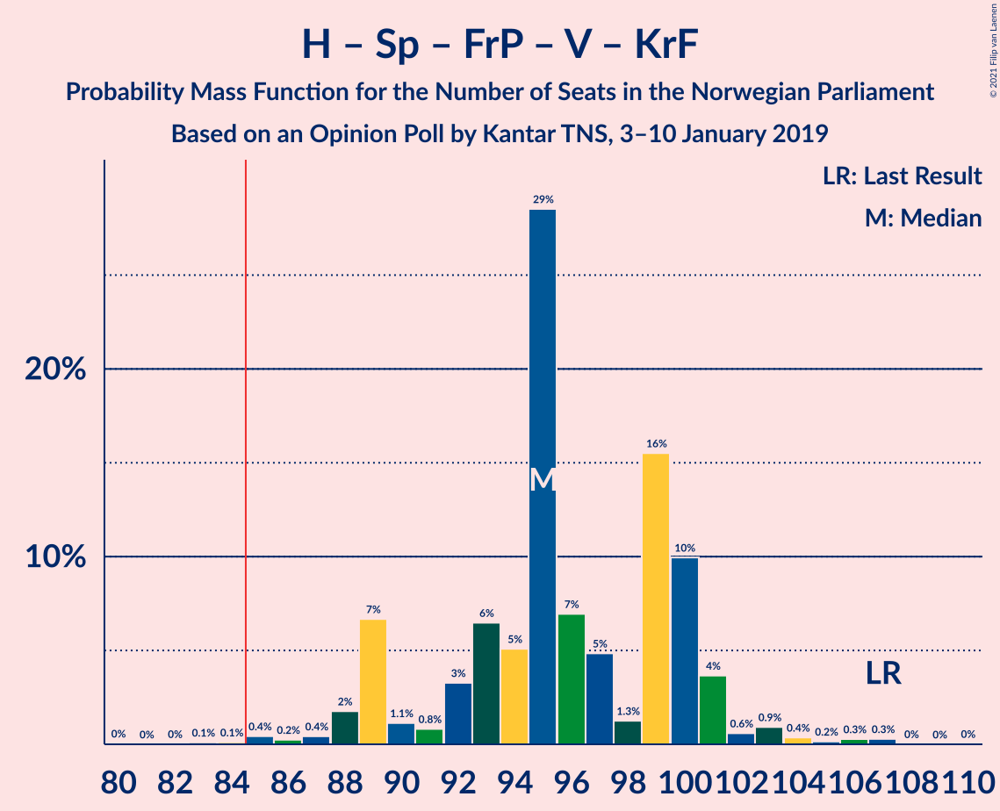

| Number of Seats | Probability | Accumulated | Special Marks |
|:---------------:|:-----------:|:-----------:|:-------------:|
| 80 | 0% | 100% |  |
| 81 | 0% | 99.9% |  |
| 82 | 0% | 99.9% |  |
| 83 | 0.1% | 99.9% |  |
| 84 | 0.1% | 99.8% |  |
| 85 | 0.4% | 99.7% | Majority |
| 86 | 0.2% | 99.3% |  |
| 87 | 0.4% | 99.0% |  |
| 88 | 2% | 98.6% |  |
| 89 | 7% | 97% |  |
| 90 | 1.1% | 90% |  |
| 91 | 0.8% | 89% |  |
| 92 | 3% | 88% |  |
| 93 | 6% | 85% |  |
| 94 | 5% | 78% | Median |
| 95 | 29% | 73% |  |
| 96 | 7% | 45% |  |
| 97 | 5% | 38% |  |
| 98 | 1.3% | 33% |  |
| 99 | 16% | 32% |  |
| 100 | 10% | 16% |  |
| 101 | 4% | 6% |  |
| 102 | 0.6% | 3% |  |
| 103 | 0.9% | 2% |  |
| 104 | 0.4% | 1.1% |  |
| 105 | 0.2% | 0.8% |  |
| 106 | 0.3% | 0.6% |  |
| 107 | 0.3% | 0.3% | Last Result |
| 108 | 0% | 0.1% |  |
| 109 | 0% | 0% |  |

### Arbeiderpartiet – Senterpartiet – Sosialistisk Venstreparti – Rødt

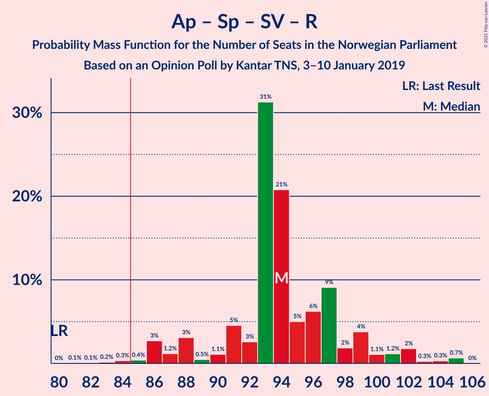

| Number of Seats | Probability | Accumulated | Special Marks |
|:---------------:|:-----------:|:-----------:|:-------------:|
| 80 | 0% | 100% | Last Result |
| 81 | 0.1% | 100% |  |
| 82 | 0.1% | 99.9% |  |
| 83 | 0.2% | 99.9% |  |
| 84 | 0.3% | 99.7% |  |
| 85 | 0.4% | 99.4% | Majority |
| 86 | 3% | 99.0% |  |
| 87 | 1.2% | 96% |  |
| 88 | 3% | 95% |  |
| 89 | 0.5% | 92% |  |
| 90 | 1.1% | 92% |  |
| 91 | 5% | 90% |  |
| 92 | 3% | 86% |  |
| 93 | 31% | 83% |  |
| 94 | 21% | 52% | Median |
| 95 | 5% | 31% |  |
| 96 | 6% | 26% |  |
| 97 | 9% | 20% |  |
| 98 | 2% | 11% |  |
| 99 | 4% | 9% |  |
| 100 | 1.1% | 5% |  |
| 101 | 1.2% | 4% |  |
| 102 | 2% | 3% |  |
| 103 | 0.3% | 1.3% |  |
| 104 | 0.3% | 1.0% |  |
| 105 | 0.7% | 0.7% |  |
| 106 | 0% | 0% |  |

### Arbeiderpartiet – Senterpartiet – Sosialistisk Venstreparti – Kristelig Folkeparti – Miljøpartiet De Grønne

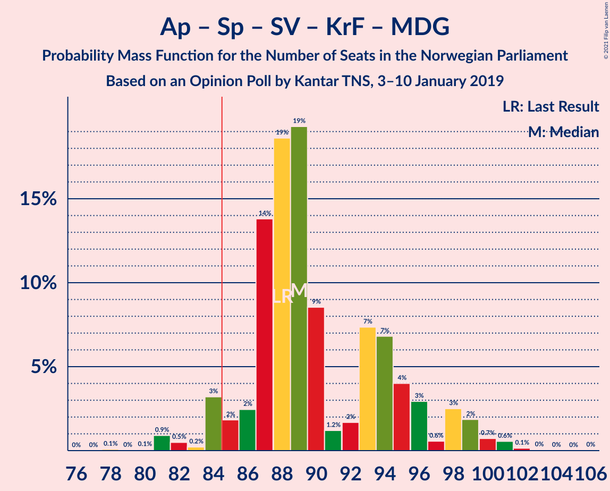

| Number of Seats | Probability | Accumulated | Special Marks |
|:---------------:|:-----------:|:-----------:|:-------------:|
| 78 | 0.1% | 100% |  |
| 79 | 0% | 99.9% |  |
| 80 | 0.1% | 99.9% |  |
| 81 | 0.9% | 99.8% |  |
| 82 | 0.5% | 98.9% |  |
| 83 | 0.2% | 98% |  |
| 84 | 3% | 98% |  |
| 85 | 2% | 95% | Majority |
| 86 | 2% | 93% |  |
| 87 | 14% | 91% |  |
| 88 | 19% | 77% | Last Result |
| 89 | 19% | 58% | Median |
| 90 | 9% | 39% |  |
| 91 | 1.2% | 30% |  |
| 92 | 2% | 29% |  |
| 93 | 7% | 28% |  |
| 94 | 7% | 20% |  |
| 95 | 4% | 13% |  |
| 96 | 3% | 9% |  |
| 97 | 0.6% | 6% |  |
| 98 | 3% | 6% |  |
| 99 | 2% | 3% |  |
| 100 | 0.7% | 2% |  |
| 101 | 0.6% | 0.8% |  |
| 102 | 0.1% | 0.3% |  |
| 103 | 0% | 0.1% |  |
| 104 | 0% | 0.1% |  |
| 105 | 0% | 0% |  |

### Arbeiderpartiet – Senterpartiet – Sosialistisk Venstreparti – Miljøpartiet De Grønne

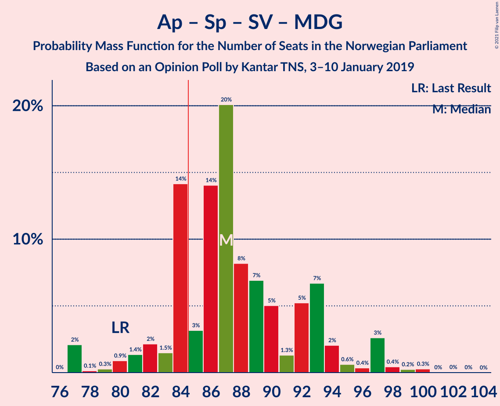

| Number of Seats | Probability | Accumulated | Special Marks |
|:---------------:|:-----------:|:-----------:|:-------------:|
| 76 | 0% | 100% |  |
| 77 | 2% | 99.9% |  |
| 78 | 0.1% | 98% |  |
| 79 | 0.3% | 98% |  |
| 80 | 0.9% | 97% | Last Result |
| 81 | 1.4% | 97% |  |
| 82 | 2% | 95% |  |
| 83 | 1.5% | 93% |  |
| 84 | 14% | 92% |  |
| 85 | 3% | 77% | Majority |
| 86 | 14% | 74% |  |
| 87 | 20% | 60% | Median |
| 88 | 8% | 40% |  |
| 89 | 7% | 32% |  |
| 90 | 5% | 25% |  |
| 91 | 1.3% | 20% |  |
| 92 | 5% | 19% |  |
| 93 | 7% | 13% |  |
| 94 | 2% | 7% |  |
| 95 | 0.6% | 5% |  |
| 96 | 0.4% | 4% |  |
| 97 | 3% | 4% |  |
| 98 | 0.4% | 1.1% |  |
| 99 | 0.2% | 0.6% |  |
| 100 | 0.3% | 0.4% |  |
| 101 | 0% | 0.1% |  |
| 102 | 0% | 0.1% |  |
| 103 | 0% | 0.1% |  |
| 104 | 0% | 0% |  |

### Arbeiderpartiet – Senterpartiet – Sosialistisk Venstreparti

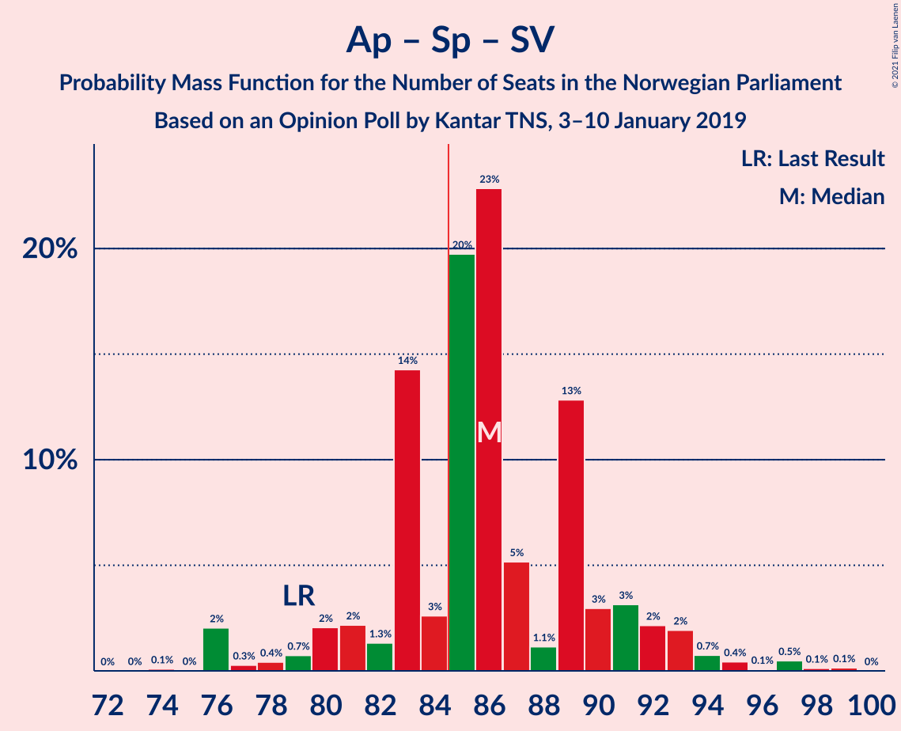

| Number of Seats | Probability | Accumulated | Special Marks |
|:---------------:|:-----------:|:-----------:|:-------------:|
| 74 | 0.1% | 100% |  |
| 75 | 0% | 99.9% |  |
| 76 | 2% | 99.9% |  |
| 77 | 0.3% | 98% |  |
| 78 | 0.4% | 98% |  |
| 79 | 0.7% | 97% | Last Result |
| 80 | 2% | 96% |  |
| 81 | 2% | 94% |  |
| 82 | 1.3% | 92% |  |
| 83 | 14% | 91% |  |
| 84 | 3% | 77% |  |
| 85 | 20% | 74% | Majority |
| 86 | 23% | 54% | Median |
| 87 | 5% | 31% |  |
| 88 | 1.1% | 26% |  |
| 89 | 13% | 25% |  |
| 90 | 3% | 12% |  |
| 91 | 3% | 9% |  |
| 92 | 2% | 6% |  |
| 93 | 2% | 4% |  |
| 94 | 0.7% | 2% |  |
| 95 | 0.4% | 1.3% |  |
| 96 | 0.1% | 0.8% |  |
| 97 | 0.5% | 0.8% |  |
| 98 | 0.1% | 0.3% |  |
| 99 | 0.1% | 0.2% |  |
| 100 | 0% | 0% |  |

### Arbeiderpartiet – Senterpartiet – Kristelig Folkeparti – Miljøpartiet De Grønne

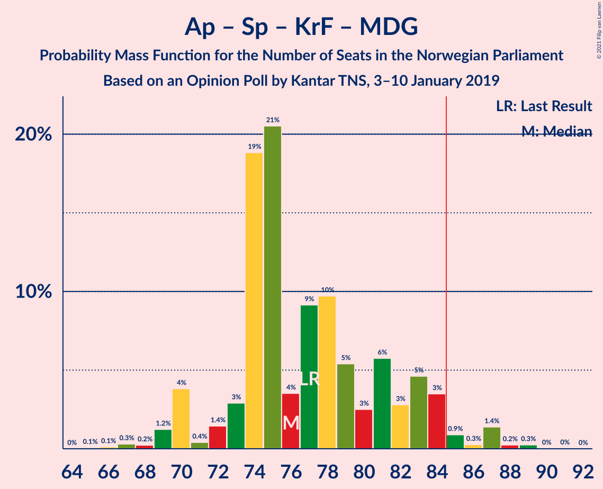

| Number of Seats | Probability | Accumulated | Special Marks |
|:---------------:|:-----------:|:-----------:|:-------------:|
| 65 | 0.1% | 100% |  |
| 66 | 0.1% | 99.9% |  |
| 67 | 0.3% | 99.8% |  |
| 68 | 0.2% | 99.5% |  |
| 69 | 1.2% | 99.3% |  |
| 70 | 4% | 98% |  |
| 71 | 0.4% | 94% |  |
| 72 | 1.4% | 94% |  |
| 73 | 3% | 92% |  |
| 74 | 19% | 89% |  |
| 75 | 21% | 71% |  |
| 76 | 4% | 50% | Median |
| 77 | 9% | 47% | Last Result |
| 78 | 10% | 37% |  |
| 79 | 5% | 28% |  |
| 80 | 3% | 22% |  |
| 81 | 6% | 20% |  |
| 82 | 3% | 14% |  |
| 83 | 5% | 11% |  |
| 84 | 3% | 7% |  |
| 85 | 0.9% | 3% | Majority |
| 86 | 0.3% | 2% |  |
| 87 | 1.4% | 2% |  |
| 88 | 0.2% | 0.6% |  |
| 89 | 0.3% | 0.3% |  |
| 90 | 0% | 0.1% |  |
| 91 | 0% | 0% |  |

### Arbeiderpartiet – Senterpartiet – Kristelig Folkeparti

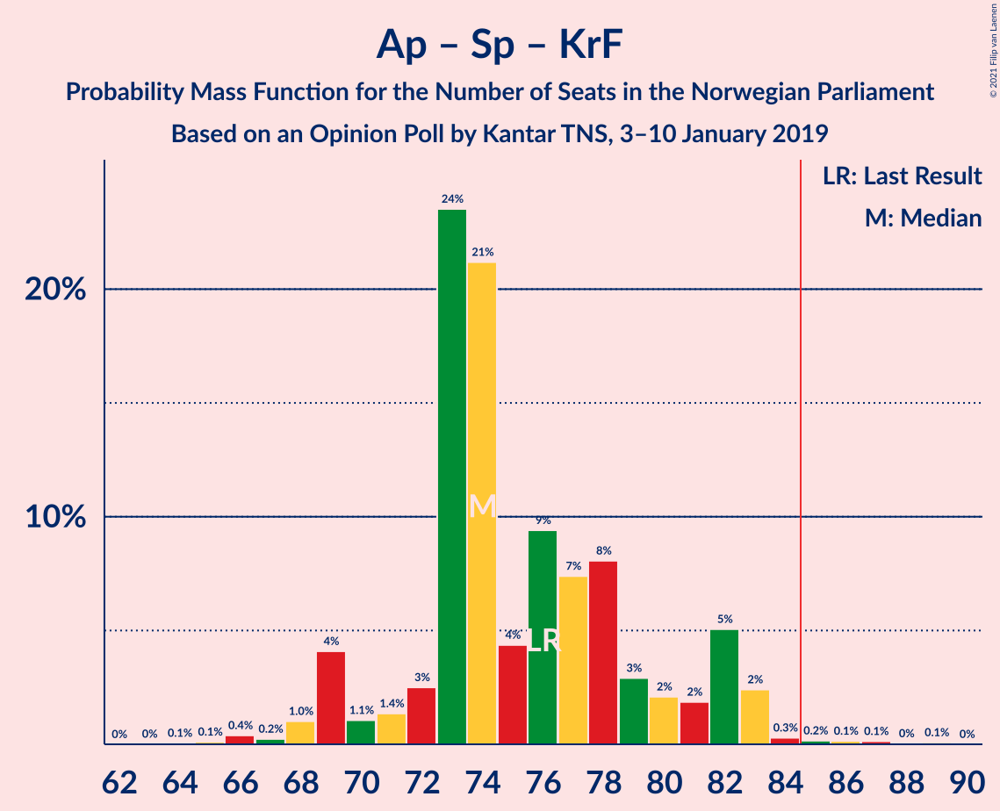

| Number of Seats | Probability | Accumulated | Special Marks |
|:---------------:|:-----------:|:-----------:|:-------------:|
| 64 | 0.1% | 100% |  |
| 65 | 0.1% | 99.9% |  |
| 66 | 0.4% | 99.8% |  |
| 67 | 0.2% | 99.4% |  |
| 68 | 1.0% | 99.2% |  |
| 69 | 4% | 98% |  |
| 70 | 1.1% | 94% |  |
| 71 | 1.4% | 93% |  |
| 72 | 3% | 92% |  |
| 73 | 24% | 89% |  |
| 74 | 21% | 66% |  |
| 75 | 4% | 44% | Median |
| 76 | 9% | 40% | Last Result |
| 77 | 7% | 31% |  |
| 78 | 8% | 23% |  |
| 79 | 3% | 15% |  |
| 80 | 2% | 12% |  |
| 81 | 2% | 10% |  |
| 82 | 5% | 8% |  |
| 83 | 2% | 3% |  |
| 84 | 0.3% | 0.9% |  |
| 85 | 0.2% | 0.6% | Majority |
| 86 | 0.1% | 0.4% |  |
| 87 | 0.1% | 0.3% |  |
| 88 | 0% | 0.1% |  |
| 89 | 0.1% | 0.1% |  |
| 90 | 0% | 0% |  |

### Høyre – Fremskrittspartiet – Venstre – Kristelig Folkeparti – Miljøpartiet De Grønne

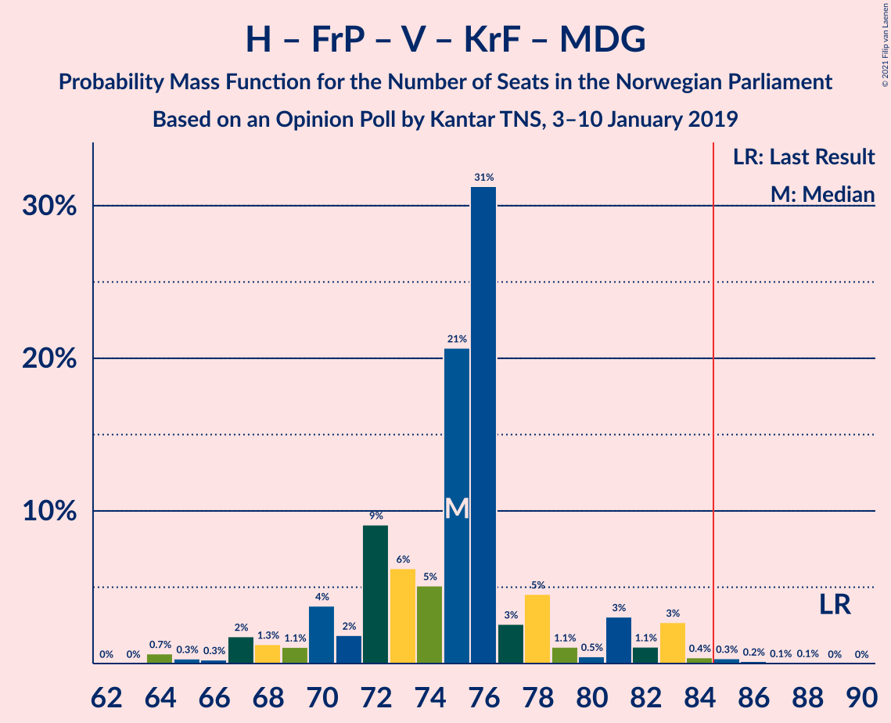

| Number of Seats | Probability | Accumulated | Special Marks |
|:---------------:|:-----------:|:-----------:|:-------------:|
| 64 | 0.7% | 100% |  |
| 65 | 0.3% | 99.3% |  |
| 66 | 0.3% | 99.0% |  |
| 67 | 2% | 98.7% |  |
| 68 | 1.3% | 97% |  |
| 69 | 1.1% | 96% |  |
| 70 | 4% | 95% |  |
| 71 | 2% | 91% |  |
| 72 | 9% | 89% |  |
| 73 | 6% | 80% | Median |
| 74 | 5% | 74% |  |
| 75 | 21% | 69% |  |
| 76 | 31% | 48% |  |
| 77 | 3% | 17% |  |
| 78 | 5% | 14% |  |
| 79 | 1.1% | 9% |  |
| 80 | 0.5% | 8% |  |
| 81 | 3% | 8% |  |
| 82 | 1.1% | 5% |  |
| 83 | 3% | 4% |  |
| 84 | 0.4% | 1.0% |  |
| 85 | 0.3% | 0.6% | Majority |
| 86 | 0.2% | 0.3% |  |
| 87 | 0.1% | 0.1% |  |
| 88 | 0.1% | 0.1% |  |
| 89 | 0% | 0% | Last Result |

### Høyre – Fremskrittspartiet – Venstre – Kristelig Folkeparti

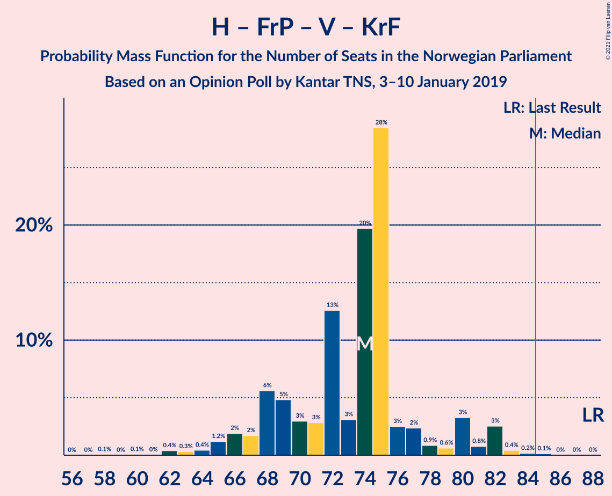

| Number of Seats | Probability | Accumulated | Special Marks |
|:---------------:|:-----------:|:-----------:|:-------------:|
| 58 | 0.1% | 100% |  |
| 59 | 0% | 99.9% |  |
| 60 | 0.1% | 99.9% |  |
| 61 | 0% | 99.9% |  |
| 62 | 0.4% | 99.8% |  |
| 63 | 0.3% | 99.4% |  |
| 64 | 0.4% | 99.1% |  |
| 65 | 1.2% | 98.7% |  |
| 66 | 2% | 97% |  |
| 67 | 2% | 96% |  |
| 68 | 6% | 94% |  |
| 69 | 5% | 88% |  |
| 70 | 3% | 83% |  |
| 71 | 3% | 80% |  |
| 72 | 13% | 78% | Median |
| 73 | 3% | 65% |  |
| 74 | 20% | 62% |  |
| 75 | 28% | 42% |  |
| 76 | 3% | 14% |  |
| 77 | 2% | 11% |  |
| 78 | 0.9% | 9% |  |
| 79 | 0.6% | 8% |  |
| 80 | 3% | 7% |  |
| 81 | 0.8% | 4% |  |
| 82 | 3% | 3% |  |
| 83 | 0.4% | 0.8% |  |
| 84 | 0.2% | 0.3% |  |
| 85 | 0.1% | 0.2% | Majority |
| 86 | 0% | 0% |  |
| 87 | 0% | 0% |  |
| 88 | 0% | 0% | Last Result |

### Arbeiderpartiet – Senterpartiet

| Number of Seats | Probability | Accumulated | Special Marks |
|:---------------:|:-----------:|:-----------:|:-------------:|
| 62 | 2% | 100% |  |
| 63 | 0.1% | 98% |  |
| 64 | 0.1% | 98% |  |
| 65 | 0.5% | 98% |  |
| 66 | 0.7% | 97% |  |
| 67 | 2% | 97% |  |
| 68 | 4% | 95% | Last Result |
| 69 | 3% | 91% |  |
| 70 | 3% | 88% |  |
| 71 | 19% | 85% |  |
| 72 | 24% | 67% |  |
| 73 | 11% | 42% | Median |
| 74 | 3% | 32% |  |
| 75 | 7% | 29% |  |
| 76 | 5% | 21% |  |
| 77 | 9% | 16% |  |
| 78 | 0.9% | 7% |  |
| 79 | 3% | 6% |  |
| 80 | 0.9% | 3% |  |
| 81 | 0.9% | 2% |  |
| 82 | 0.8% | 1.1% |  |
| 83 | 0.2% | 0.3% |  |
| 84 | 0% | 0.2% |  |
| 85 | 0.1% | 0.1% | Majority |
| 86 | 0% | 0% |  |

### Høyre – Fremskrittspartiet – Venstre

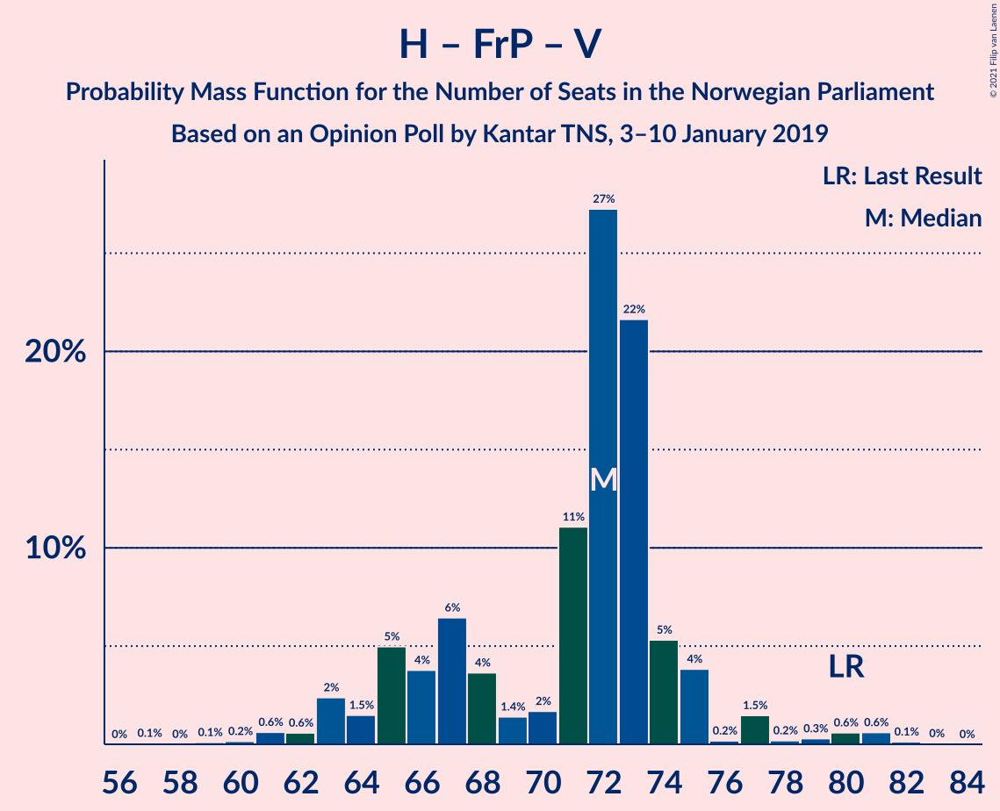

| Number of Seats | Probability | Accumulated | Special Marks |
|:---------------:|:-----------:|:-----------:|:-------------:|
| 57 | 0.1% | 100% |  |
| 58 | 0% | 99.9% |  |
| 59 | 0.1% | 99.9% |  |
| 60 | 0.2% | 99.8% |  |
| 61 | 0.6% | 99.7% |  |
| 62 | 0.6% | 99.0% |  |
| 63 | 2% | 98% |  |
| 64 | 1.5% | 96% |  |
| 65 | 5% | 95% |  |
| 66 | 4% | 90% |  |
| 67 | 6% | 86% |  |
| 68 | 4% | 79% |  |
| 69 | 1.4% | 76% |  |
| 70 | 2% | 74% | Median |
| 71 | 11% | 73% |  |
| 72 | 27% | 62% |  |
| 73 | 22% | 34% |  |
| 74 | 5% | 13% |  |
| 75 | 4% | 7% |  |
| 76 | 0.2% | 4% |  |
| 77 | 1.5% | 3% |  |
| 78 | 0.2% | 2% |  |
| 79 | 0.3% | 2% |  |
| 80 | 0.6% | 1.4% | Last Result |
| 81 | 0.6% | 0.8% |  |
| 82 | 0.1% | 0.2% |  |
| 83 | 0% | 0.1% |  |
| 84 | 0% | 0% |  |

### Høyre – Fremskrittspartiet

| Number of Seats | Probability | Accumulated | Special Marks |
|:---------------:|:-----------:|:-----------:|:-------------:|
| 55 | 0.1% | 100% |  |
| 56 | 0% | 99.9% |  |
| 57 | 0.2% | 99.9% |  |
| 58 | 0.3% | 99.7% |  |
| 59 | 2% | 99.4% |  |
| 60 | 2% | 98% |  |
| 61 | 3% | 96% |  |
| 62 | 2% | 93% |  |
| 63 | 5% | 91% |  |
| 64 | 7% | 86% |  |
| 65 | 14% | 79% |  |
| 66 | 5% | 65% |  |
| 67 | 4% | 60% |  |
| 68 | 2% | 56% | Median |
| 69 | 8% | 54% |  |
| 70 | 21% | 46% |  |
| 71 | 19% | 26% |  |
| 72 | 4% | 7% | Last Result |
| 73 | 1.2% | 3% |  |
| 74 | 0.2% | 2% |  |
| 75 | 0.9% | 1.4% |  |
| 76 | 0% | 0.5% |  |
| 77 | 0.1% | 0.4% |  |
| 78 | 0.1% | 0.3% |  |
| 79 | 0.2% | 0.2% |  |
| 80 | 0% | 0% |  |

### Arbeiderpartiet – Sosialistisk Venstreparti

| Number of Seats | Probability | Accumulated | Special Marks |
|:---------------:|:-----------:|:-----------:|:-------------:|
| 54 | 0% | 100% |  |
| 55 | 0.4% | 99.9% |  |
| 56 | 0.5% | 99.5% |  |
| 57 | 2% | 99.0% |  |
| 58 | 1.2% | 97% |  |
| 59 | 13% | 95% |  |
| 60 | 7% | 83% | Last Result |
| 61 | 5% | 76% |  |
| 62 | 1.5% | 71% |  |
| 63 | 8% | 69% |  |
| 64 | 9% | 61% | Median |
| 65 | 34% | 52% |  |
| 66 | 8% | 19% |  |
| 67 | 2% | 11% |  |
| 68 | 4% | 9% |  |
| 69 | 1.4% | 5% |  |
| 70 | 0.7% | 4% |  |
| 71 | 2% | 3% |  |
| 72 | 0.8% | 1.3% |  |
| 73 | 0.2% | 0.4% |  |
| 74 | 0.2% | 0.3% |  |
| 75 | 0.1% | 0.1% |  |
| 76 | 0% | 0% |  |

### Høyre – Venstre – Kristelig Folkeparti

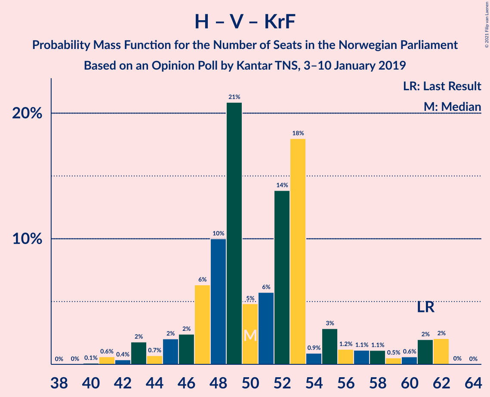

| Number of Seats | Probability | Accumulated | Special Marks |
|:---------------:|:-----------:|:-----------:|:-------------:|
| 40 | 0.1% | 100% |  |
| 41 | 0.6% | 99.9% |  |
| 42 | 0.4% | 99.3% |  |
| 43 | 2% | 98.9% |  |
| 44 | 0.7% | 97% |  |
| 45 | 2% | 96% |  |
| 46 | 2% | 94% |  |
| 47 | 6% | 92% |  |
| 48 | 10% | 86% |  |
| 49 | 21% | 76% | Median |
| 50 | 5% | 55% |  |
| 51 | 6% | 50% |  |
| 52 | 14% | 44% |  |
| 53 | 18% | 30% |  |
| 54 | 0.9% | 12% |  |
| 55 | 3% | 12% |  |
| 56 | 1.2% | 9% |  |
| 57 | 1.1% | 7% |  |
| 58 | 1.1% | 6% |  |
| 59 | 0.5% | 5% |  |
| 60 | 0.6% | 5% |  |
| 61 | 2% | 4% | Last Result |
| 62 | 2% | 2% |  |
| 63 | 0% | 0.1% |  |
| 64 | 0% | 0% |  |

### Senterpartiet – Venstre – Kristelig Folkeparti

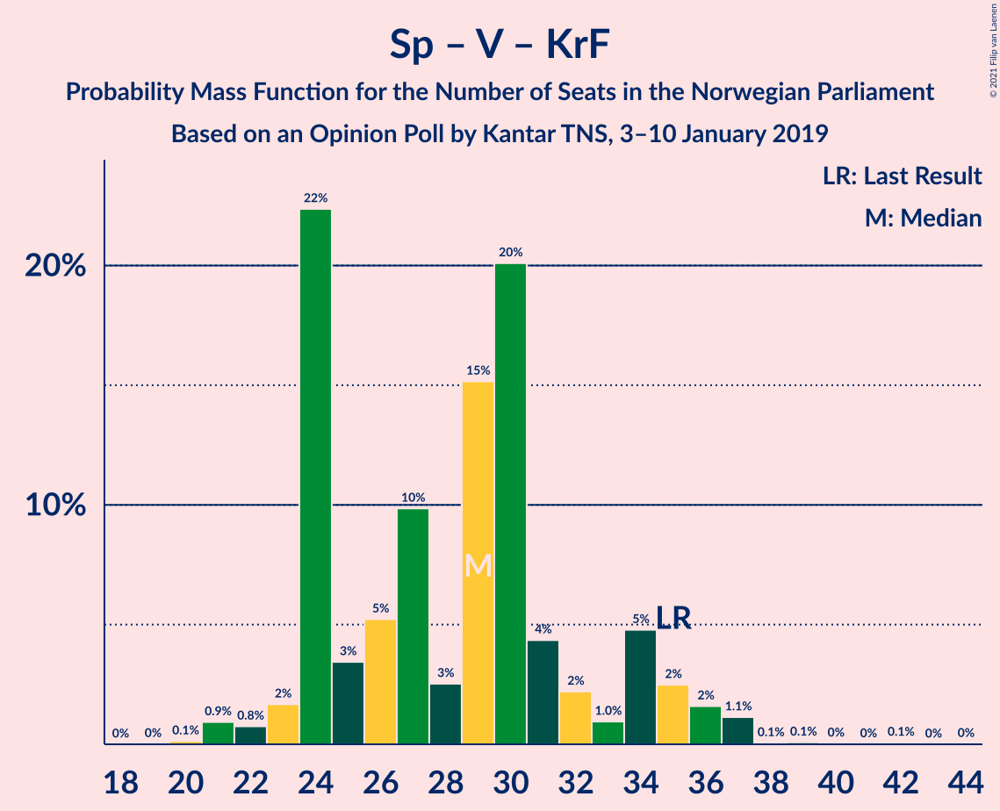

| Number of Seats | Probability | Accumulated | Special Marks |
|:---------------:|:-----------:|:-----------:|:-------------:|
| 20 | 0.1% | 100% |  |
| 21 | 0.9% | 99.8% |  |
| 22 | 0.8% | 98.9% |  |
| 23 | 2% | 98% |  |
| 24 | 22% | 96% |  |
| 25 | 3% | 74% |  |
| 26 | 5% | 71% | Median |
| 27 | 10% | 65% |  |
| 28 | 3% | 56% |  |
| 29 | 15% | 53% |  |
| 30 | 20% | 38% |  |
| 31 | 4% | 18% |  |
| 32 | 2% | 13% |  |
| 33 | 1.0% | 11% |  |
| 34 | 5% | 10% |  |
| 35 | 2% | 6% | Last Result |
| 36 | 2% | 3% |  |
| 37 | 1.1% | 1.4% |  |
| 38 | 0.1% | 0.3% |  |
| 39 | 0.1% | 0.2% |  |
| 40 | 0% | 0.2% |  |
| 41 | 0% | 0.1% |  |
| 42 | 0.1% | 0.1% |  |
| 43 | 0% | 0% |  |

## Technical Information

### Opinion Poll

+ **Polling firm:** Kantar TNS
+ **Commissioner(s):** —
+ **Fieldwork period:** 3–10 January 2019

### Calculations

+ **Sample size:** 759
+ **Simulations done:** 131,072
+ **Error estimate:** 1.28%

