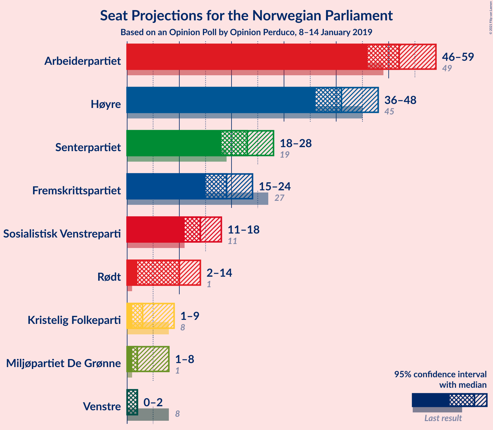
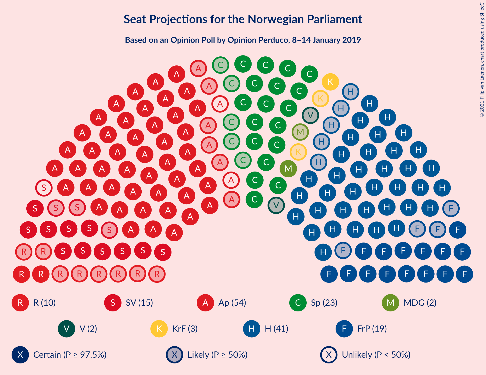
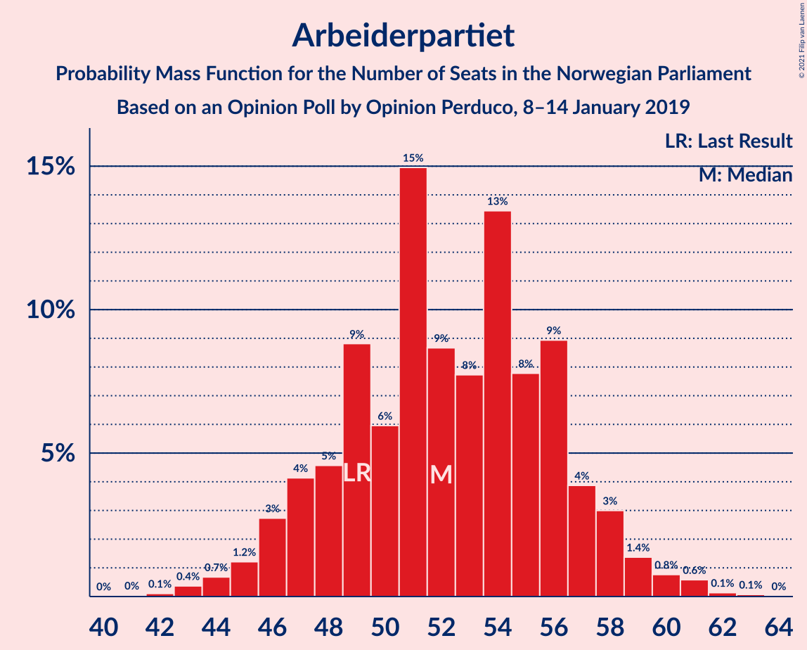
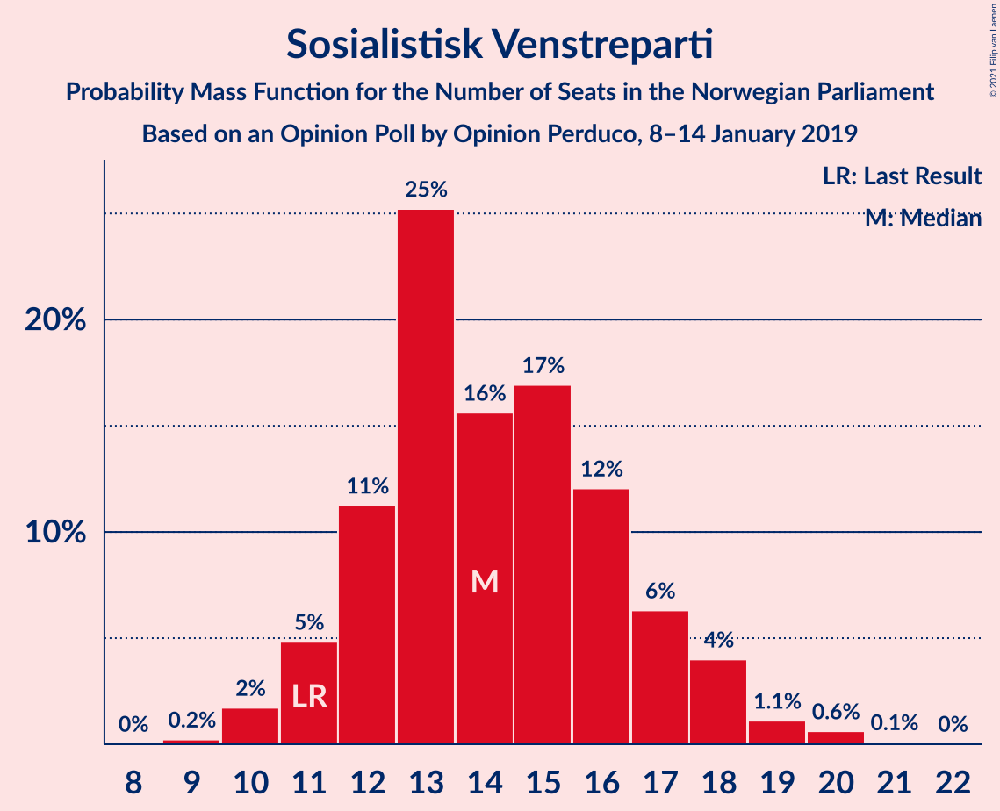
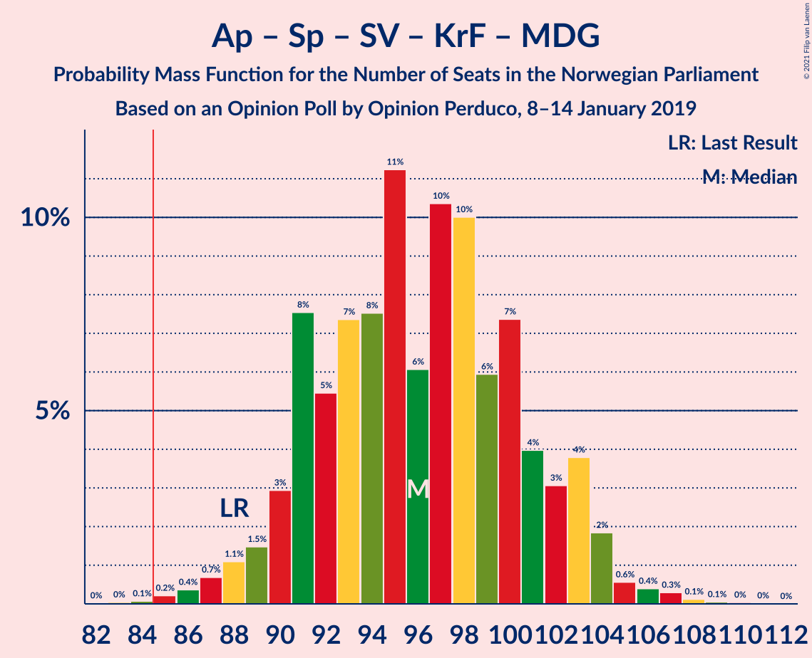
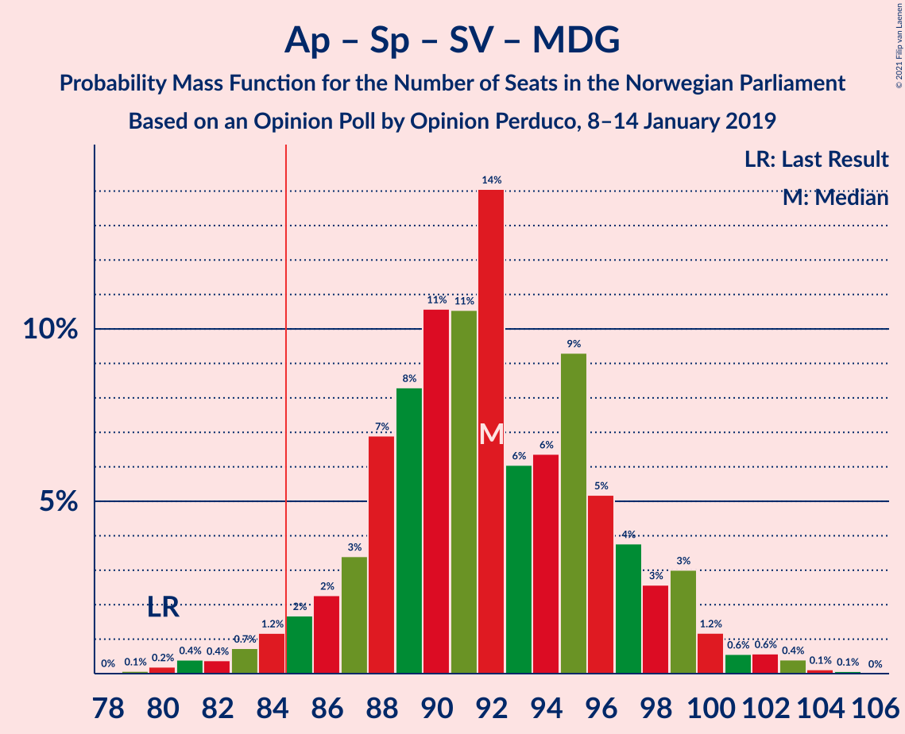
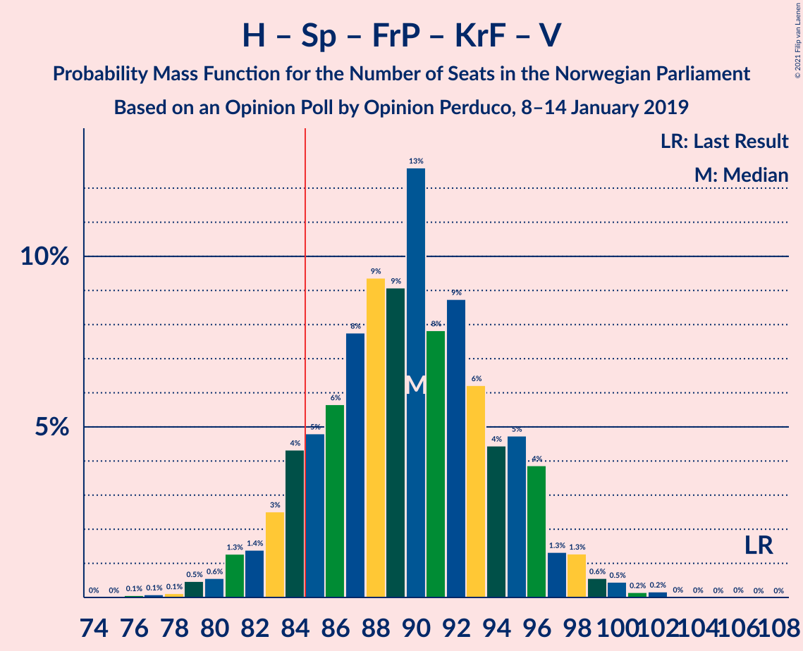
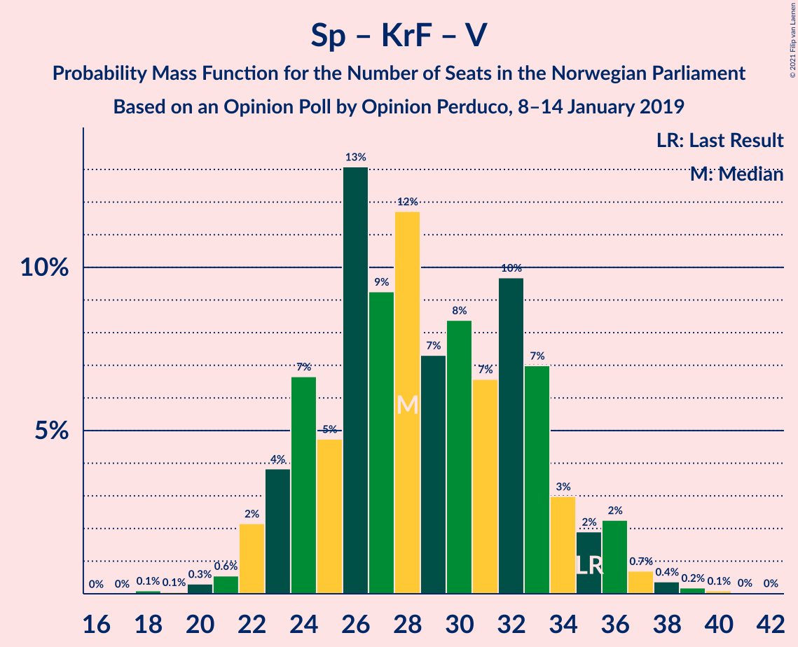

# Opinion Poll by Opinion Perduco, 8–14 January 2019

<a href="#voting-intentions">Voting Intentions</a> | <a href="#seats">Seats</a> | <a href="#coalitions">Coalitions</a> | <a href="#technical-information">Technical Information</a>

## Voting Intentions

### Confidence Intervals

| Party | Last Result | Poll Result | 80% Confidence Interval | 90% Confidence Interval | 95% Confidence Interval | 99% Confidence Interval |
|:-----:|:-----------:|:-----------:|:-----------------------:|:-----------------------:|:-----------------------:|:-----------------------:|
| Arbeiderpartiet | 27.4% | 28.4% | 26.3–30.7% |25.7–31.4% |25.2–31.9% |24.2–33.0% |
| Høyre | 25.0% | 22.9% | 21.0–25.1% |20.4–25.7% |19.9–26.2% |19.0–27.3% |
| Senterpartiet | 10.3% | 12.6% | 11.1–14.4% |10.7–14.9% |10.3–15.3% |9.7–16.2% |
| Fremskrittspartiet | 15.2% | 10.7% | 9.4–12.4% |9.0–12.9% |8.6–13.3% |8.0–14.1% |
| Sosialistisk Venstreparti | 6.0% | 7.8% | 6.7–9.3% |6.3–9.7% |6.1–10.1% |5.5–10.8% |
| Rødt | 2.4% | 5.5% | 4.5–6.8% |4.3–7.2% |4.0–7.5% |3.6–8.2% |
| Kristelig Folkeparti | 4.2% | 3.6% | 2.9–4.7% |2.7–5.0% |2.5–5.3% |2.1–5.9% |
| Miljøpartiet De Grønne | 3.2% | 3.2% | 2.5–4.2% |2.3–4.5% |2.1–4.8% |1.8–5.3% |
| Venstre | 4.4% | 2.5% | 1.9–3.4% |1.7–3.7% |1.5–3.9% |1.3–4.4% |

*Note:* The poll result column reflects the actual value used in the calculations. Published results may vary slightly, and in addition be rounded to fewer digits.

## Seats

### Confidence Intervals

| Party | Last Result | Median | 80% Confidence Interval | 90% Confidence Interval | 95% Confidence Interval | 99% Confidence Interval |
|:-----:|:-----------:|:------:|:-----------------------:|:-----------------------:|:-----------------------:|:-----------------------:|
| <a href="#arbeiderpartiet">Arbeiderpartiet</a> | 49 | 52 | 48–56 |46–58 |46–59 |43–61 |
| <a href="#høyre">Høyre</a> | 45 | 41 | 37–47 |37–47 |36–48 |34–50 |
| <a href="#senterpartiet">Senterpartiet</a> | 19 | 23 | 20–26 |19–27 |18–28 |17–30 |
| <a href="#fremskrittspartiet">Fremskrittspartiet</a> | 27 | 19 | 17–23 |16–23 |15–24 |14–26 |
| <a href="#sosialistisk-venstreparti">Sosialistisk Venstreparti</a> | 11 | 14 | 12–17 |11–18 |11–18 |10–20 |
| <a href="#rødt">Rødt</a> | 1 | 10 | 8–13 |8–13 |2–14 |2–15 |
| <a href="#kristelig-folkeparti">Kristelig Folkeparti</a> | 8 | 3 | 1–8 |1–9 |1–9 |0–10 |
| <a href="#miljøpartiet-de-grønne">Miljøpartiet De Grønne</a> | 1 | 2 | 1–7 |1–8 |1–8 |0–9 |
| <a href="#venstre">Venstre</a> | 8 | 2 | 0–2 |0–2 |0–2 |0–8 |

### Arbeiderpartiet

*For a full overview of the results for this party, see the [Arbeiderpartiet](party-arbeiderpartiet.html) page.*

| Number of Seats | Probability | Accumulated | Special Marks |
|:---------------:|:-----------:|:-----------:|:-------------:|
| 41 | 0% | 100% |  |
| 42 | 0.1% | 99.9% |  |
| 43 | 0.4% | 99.8% |  |
| 44 | 0.7% | 99.5% |  |
| 45 | 1.2% | 98.8% |  |
| 46 | 3% | 98% |  |
| 47 | 4% | 95% |  |
| 48 | 5% | 91% |  |
| 49 | 9% | 86% | Last Result |
| 50 | 6% | 77% |  |
| 51 | 15% | 71% |  |
| 52 | 9% | 56% | Median |
| 53 | 8% | 48% |  |
| 54 | 13% | 40% |  |
| 55 | 8% | 27% |  |
| 56 | 9% | 19% |  |
| 57 | 4% | 10% |  |
| 58 | 3% | 6% |  |
| 59 | 1.4% | 3% |  |
| 60 | 0.8% | 2% |  |
| 61 | 0.6% | 0.8% |  |
| 62 | 0.1% | 0.2% |  |
| 63 | 0.1% | 0.1% |  |
| 64 | 0% | 0% |  |

### Høyre

*For a full overview of the results for this party, see the [Høyre](party-høyre.html) page.*

| Number of Seats | Probability | Accumulated | Special Marks |
|:---------------:|:-----------:|:-----------:|:-------------:|
| 32 | 0.1% | 100% |  |
| 33 | 0.2% | 99.9% |  |
| 34 | 0.6% | 99.7% |  |
| 35 | 1.5% | 99.2% |  |
| 36 | 2% | 98% |  |
| 37 | 6% | 95% |  |
| 38 | 7% | 90% |  |
| 39 | 14% | 83% |  |
| 40 | 12% | 69% |  |
| 41 | 12% | 58% | Median |
| 42 | 12% | 46% |  |
| 43 | 13% | 34% |  |
| 44 | 4% | 21% |  |
| 45 | 3% | 17% | Last Result |
| 46 | 3% | 14% |  |
| 47 | 6% | 11% |  |
| 48 | 3% | 5% |  |
| 49 | 1.3% | 2% |  |
| 50 | 0.3% | 0.7% |  |
| 51 | 0.4% | 0.5% |  |
| 52 | 0.1% | 0.1% |  |
| 53 | 0% | 0% |  |

### Senterpartiet

*For a full overview of the results for this party, see the [Senterpartiet](party-senterpartiet.html) page.*

| Number of Seats | Probability | Accumulated | Special Marks |
|:---------------:|:-----------:|:-----------:|:-------------:|
| 16 | 0.1% | 100% |  |
| 17 | 0.6% | 99.8% |  |
| 18 | 2% | 99.2% |  |
| 19 | 4% | 97% | Last Result |
| 20 | 10% | 93% |  |
| 21 | 12% | 83% |  |
| 22 | 17% | 72% |  |
| 23 | 20% | 55% | Median |
| 24 | 12% | 35% |  |
| 25 | 9% | 22% |  |
| 26 | 6% | 14% |  |
| 27 | 3% | 7% |  |
| 28 | 3% | 4% |  |
| 29 | 0.9% | 2% |  |
| 30 | 0.6% | 0.8% |  |
| 31 | 0.1% | 0.2% |  |
| 32 | 0% | 0.1% |  |
| 33 | 0% | 0.1% |  |
| 34 | 0% | 0% |  |

### Fremskrittspartiet

*For a full overview of the results for this party, see the [Fremskrittspartiet](party-fremskrittspartiet.html) page.*

| Number of Seats | Probability | Accumulated | Special Marks |
|:---------------:|:-----------:|:-----------:|:-------------:|
| 13 | 0.2% | 100% |  |
| 14 | 0.8% | 99.8% |  |
| 15 | 3% | 99.0% |  |
| 16 | 5% | 96% |  |
| 17 | 8% | 91% |  |
| 18 | 15% | 83% |  |
| 19 | 19% | 67% | Median |
| 20 | 17% | 49% |  |
| 21 | 10% | 31% |  |
| 22 | 10% | 21% |  |
| 23 | 7% | 12% |  |
| 24 | 3% | 5% |  |
| 25 | 1.4% | 2% |  |
| 26 | 0.3% | 0.5% |  |
| 27 | 0.1% | 0.2% | Last Result |
| 28 | 0% | 0.1% |  |
| 29 | 0% | 0% |  |

### Sosialistisk Venstreparti

*For a full overview of the results for this party, see the [Sosialistisk Venstreparti](party-sosialistiskvenstreparti.html) page.*

| Number of Seats | Probability | Accumulated | Special Marks |
|:---------------:|:-----------:|:-----------:|:-------------:|
| 9 | 0.2% | 100% |  |
| 10 | 2% | 99.8% |  |
| 11 | 5% | 98% | Last Result |
| 12 | 11% | 93% |  |
| 13 | 25% | 82% |  |
| 14 | 16% | 57% | Median |
| 15 | 17% | 41% |  |
| 16 | 12% | 24% |  |
| 17 | 6% | 12% |  |
| 18 | 4% | 6% |  |
| 19 | 1.1% | 2% |  |
| 20 | 0.6% | 0.7% |  |
| 21 | 0.1% | 0.1% |  |
| 22 | 0% | 0% |  |

### Rødt

*For a full overview of the results for this party, see the [Rødt](party-rødt.html) page.*

| Number of Seats | Probability | Accumulated | Special Marks |
|:---------------:|:-----------:|:-----------:|:-------------:|
| 1 | 0% | 100% | Last Result |
| 2 | 3% | 100% |  |
| 3 | 0% | 97% |  |
| 4 | 0% | 97% |  |
| 5 | 0% | 97% |  |
| 6 | 0% | 97% |  |
| 7 | 2% | 97% |  |
| 8 | 10% | 96% |  |
| 9 | 22% | 86% |  |
| 10 | 25% | 63% | Median |
| 11 | 18% | 38% |  |
| 12 | 9% | 21% |  |
| 13 | 9% | 11% |  |
| 14 | 2% | 3% |  |
| 15 | 0.7% | 0.8% |  |
| 16 | 0.1% | 0.2% |  |
| 17 | 0% | 0% |  |

### Kristelig Folkeparti

*For a full overview of the results for this party, see the [Kristelig Folkeparti](party-kristeligfolkeparti.html) page.*

| Number of Seats | Probability | Accumulated | Special Marks |
|:---------------:|:-----------:|:-----------:|:-------------:|
| 0 | 0.9% | 100% |  |
| 1 | 21% | 99.1% |  |
| 2 | 10% | 78% |  |
| 3 | 34% | 68% | Median |
| 4 | 0% | 34% |  |
| 5 | 0% | 34% |  |
| 6 | 0% | 34% |  |
| 7 | 9% | 34% |  |
| 8 | 15% | 25% | Last Result |
| 9 | 8% | 10% |  |
| 10 | 2% | 2% |  |
| 11 | 0.4% | 0.4% |  |
| 12 | 0% | 0% |  |

### Miljøpartiet De Grønne

*For a full overview of the results for this party, see the [Miljøpartiet De Grønne](party-miljøpartietdegrønne.html) page.*

| Number of Seats | Probability | Accumulated | Special Marks |
|:---------------:|:-----------:|:-----------:|:-------------:|
| 0 | 1.1% | 100% |  |
| 1 | 35% | 98.9% | Last Result |
| 2 | 44% | 64% | Median |
| 3 | 1.0% | 20% |  |
| 4 | 0% | 19% |  |
| 5 | 0% | 19% |  |
| 6 | 0% | 19% |  |
| 7 | 9% | 19% |  |
| 8 | 8% | 10% |  |
| 9 | 1.4% | 2% |  |
| 10 | 0.3% | 0.3% |  |
| 11 | 0.1% | 0.1% |  |
| 12 | 0% | 0% |  |

### Venstre

*For a full overview of the results for this party, see the [Venstre](party-venstre.html) page.*

| Number of Seats | Probability | Accumulated | Special Marks |
|:---------------:|:-----------:|:-----------:|:-------------:|
| 0 | 11% | 100% |  |
| 1 | 25% | 89% |  |
| 2 | 62% | 64% | Median |
| 3 | 0.5% | 2% |  |
| 4 | 0% | 2% |  |
| 5 | 0% | 2% |  |
| 6 | 0% | 2% |  |
| 7 | 0.8% | 2% |  |
| 8 | 0.7% | 0.8% | Last Result |
| 9 | 0.2% | 0.2% |  |
| 10 | 0% | 0% |  |

## Coalitions

### Confidence Intervals

| Coalition | Last Result | Median | Majority? | 80% Confidence Interval | 90% Confidence Interval | 95% Confidence Interval | 99% Confidence Interval |
|:---------:|:-----------:|:------:|:---------:|:-----------------------:|:-----------------------:|:-----------------------:|:-----------------------:|
| Arbeiderpartiet – Senterpartiet – Sosialistisk Venstreparti – Rødt – Miljøpartiet De Grønne | 81 | 102 | 100% | 97–107 | 96–108 | 94–110 | 91–112 |
| Arbeiderpartiet – Senterpartiet – Sosialistisk Venstreparti – Rødt | 80 | 99 | 100% | 94–104 | 92–105 | 91–107 | 88–109 |
| Arbeiderpartiet – Senterpartiet – Sosialistisk Venstreparti – Kristelig Folkeparti – Miljøpartiet De Grønne | 88 | 96 | 99.9% | 91–102 | 90–103 | 88–104 | 86–107 |
| Arbeiderpartiet – Senterpartiet – Sosialistisk Venstreparti – Miljøpartiet De Grønne | 80 | 92 | 97% | 87–97 | 86–99 | 84–100 | 81–103 |
| Høyre – Senterpartiet – Fremskrittspartiet – Kristelig Folkeparti – Venstre | 107 | 90 | 89% | 84–95 | 83–96 | 81–98 | 79–100 |
| Arbeiderpartiet – Senterpartiet – Sosialistisk Venstreparti | 79 | 89 | 90% | 85–94 | 83–96 | 81–97 | 78–100 |
| Arbeiderpartiet – Senterpartiet – Kristelig Folkeparti – Miljøpartiet De Grønne | 77 | 82 | 27% | 77–87 | 75–90 | 74–90 | 71–93 |
| Arbeiderpartiet – Senterpartiet – Kristelig Folkeparti | 76 | 79 | 13% | 74–85 | 73–87 | 71–88 | 69–90 |
| Arbeiderpartiet – Senterpartiet | 68 | 75 | 0.5% | 70–80 | 69–81 | 67–83 | 65–84 |
| Høyre – Fremskrittspartiet – Kristelig Folkeparti – Miljøpartiet De Grønne – Venstre | 89 | 69 | 0% | 65–74 | 63–76 | 62–78 | 59–81 |
| Arbeiderpartiet – Sosialistisk Venstreparti | 60 | 67 | 0% | 62–71 | 61–72 | 59–74 | 57–76 |
| Høyre – Fremskrittspartiet – Kristelig Folkeparti – Venstre | 88 | 67 | 0% | 62–72 | 61–73 | 59–74 | 57–78 |
| Høyre – Fremskrittspartiet – Venstre | 80 | 63 | 0% | 58–68 | 56–69 | 56–70 | 53–72 |
| Høyre – Fremskrittspartiet | 72 | 61 | 0% | 56–66 | 55–67 | 54–68 | 52–71 |
| Høyre – Kristelig Folkeparti – Venstre | 61 | 47 | 0% | 43–52 | 41–53 | 40–55 | 38–58 |
| Senterpartiet – Kristelig Folkeparti – Venstre | 35 | 28 | 0% | 24–33 | 23–35 | 22–36 | 21–38 |

### Arbeiderpartiet – Senterpartiet – Sosialistisk Venstreparti – Rødt – Miljøpartiet De Grønne

| Number of Seats | Probability | Accumulated | Special Marks |
|:---------------:|:-----------:|:-----------:|:-------------:|
| 81 | 0% | 100% | Last Result |
| 82 | 0% | 100% |  |
| 83 | 0% | 100% |  |
| 84 | 0% | 100% |  |
| 85 | 0% | 100% | Majority |
| 86 | 0% | 100% |  |
| 87 | 0% | 100% |  |
| 88 | 0.1% | 100% |  |
| 89 | 0.1% | 99.9% |  |
| 90 | 0.2% | 99.8% |  |
| 91 | 0.3% | 99.6% |  |
| 92 | 0.6% | 99.3% |  |
| 93 | 1.0% | 98.7% |  |
| 94 | 0.7% | 98% |  |
| 95 | 2% | 97% |  |
| 96 | 4% | 95% |  |
| 97 | 4% | 92% |  |
| 98 | 5% | 87% |  |
| 99 | 7% | 83% |  |
| 100 | 8% | 76% |  |
| 101 | 14% | 68% | Median |
| 102 | 9% | 54% |  |
| 103 | 8% | 45% |  |
| 104 | 12% | 37% |  |
| 105 | 9% | 25% |  |
| 106 | 5% | 16% |  |
| 107 | 3% | 11% |  |
| 108 | 4% | 8% |  |
| 109 | 1.3% | 4% |  |
| 110 | 1.2% | 3% |  |
| 111 | 0.9% | 2% |  |
| 112 | 0.5% | 0.7% |  |
| 113 | 0.1% | 0.2% |  |
| 114 | 0.1% | 0.1% |  |
| 115 | 0% | 0.1% |  |
| 116 | 0% | 0% |  |

### Arbeiderpartiet – Senterpartiet – Sosialistisk Venstreparti – Rødt

| Number of Seats | Probability | Accumulated | Special Marks |
|:---------------:|:-----------:|:-----------:|:-------------:|
| 80 | 0% | 100% | Last Result |
| 81 | 0% | 100% |  |
| 82 | 0% | 100% |  |
| 83 | 0% | 100% |  |
| 84 | 0% | 100% |  |
| 85 | 0% | 100% | Majority |
| 86 | 0.1% | 99.9% |  |
| 87 | 0.1% | 99.9% |  |
| 88 | 0.4% | 99.8% |  |
| 89 | 1.1% | 99.4% |  |
| 90 | 0.7% | 98% |  |
| 91 | 2% | 98% |  |
| 92 | 0.7% | 95% |  |
| 93 | 2% | 95% |  |
| 94 | 3% | 92% |  |
| 95 | 3% | 89% |  |
| 96 | 4% | 86% |  |
| 97 | 9% | 82% |  |
| 98 | 11% | 73% |  |
| 99 | 13% | 62% | Median |
| 100 | 11% | 49% |  |
| 101 | 11% | 38% |  |
| 102 | 10% | 27% |  |
| 103 | 6% | 17% |  |
| 104 | 5% | 12% |  |
| 105 | 2% | 7% |  |
| 106 | 2% | 5% |  |
| 107 | 0.9% | 3% |  |
| 108 | 1.0% | 2% |  |
| 109 | 0.6% | 1.0% |  |
| 110 | 0.2% | 0.3% |  |
| 111 | 0.1% | 0.2% |  |
| 112 | 0% | 0.1% |  |
| 113 | 0% | 0% |  |

### Arbeiderpartiet – Senterpartiet – Sosialistisk Venstreparti – Kristelig Folkeparti – Miljøpartiet De Grønne

| Number of Seats | Probability | Accumulated | Special Marks |
|:---------------:|:-----------:|:-----------:|:-------------:|
| 83 | 0% | 100% |  |
| 84 | 0.1% | 99.9% |  |
| 85 | 0.2% | 99.9% | Majority |
| 86 | 0.4% | 99.6% |  |
| 87 | 0.7% | 99.3% |  |
| 88 | 1.1% | 98.6% | Last Result |
| 89 | 1.5% | 97% |  |
| 90 | 3% | 96% |  |
| 91 | 8% | 93% |  |
| 92 | 5% | 86% |  |
| 93 | 7% | 80% |  |
| 94 | 8% | 73% | Median |
| 95 | 11% | 65% |  |
| 96 | 6% | 54% |  |
| 97 | 10% | 48% |  |
| 98 | 10% | 38% |  |
| 99 | 6% | 27% |  |
| 100 | 7% | 22% |  |
| 101 | 4% | 14% |  |
| 102 | 3% | 10% |  |
| 103 | 4% | 7% |  |
| 104 | 2% | 3% |  |
| 105 | 0.6% | 1.5% |  |
| 106 | 0.4% | 0.9% |  |
| 107 | 0.3% | 0.5% |  |
| 108 | 0.1% | 0.2% |  |
| 109 | 0.1% | 0.1% |  |
| 110 | 0% | 0.1% |  |
| 111 | 0% | 0% |  |

### Arbeiderpartiet – Senterpartiet – Sosialistisk Venstreparti – Miljøpartiet De Grønne

| Number of Seats | Probability | Accumulated | Special Marks |
|:---------------:|:-----------:|:-----------:|:-------------:|
| 78 | 0% | 100% |  |
| 79 | 0.1% | 99.9% |  |
| 80 | 0.2% | 99.9% | Last Result |
| 81 | 0.4% | 99.7% |  |
| 82 | 0.4% | 99.3% |  |
| 83 | 0.7% | 98.9% |  |
| 84 | 1.2% | 98% |  |
| 85 | 2% | 97% | Majority |
| 86 | 2% | 95% |  |
| 87 | 3% | 93% |  |
| 88 | 7% | 90% |  |
| 89 | 8% | 83% |  |
| 90 | 11% | 74% |  |
| 91 | 11% | 64% | Median |
| 92 | 14% | 53% |  |
| 93 | 6% | 39% |  |
| 94 | 6% | 33% |  |
| 95 | 9% | 27% |  |
| 96 | 5% | 17% |  |
| 97 | 4% | 12% |  |
| 98 | 3% | 9% |  |
| 99 | 3% | 6% |  |
| 100 | 1.2% | 3% |  |
| 101 | 0.6% | 2% |  |
| 102 | 0.6% | 1.2% |  |
| 103 | 0.4% | 0.6% |  |
| 104 | 0.1% | 0.2% |  |
| 105 | 0.1% | 0.1% |  |
| 106 | 0% | 0% |  |

### Høyre – Senterpartiet – Fremskrittspartiet – Kristelig Folkeparti – Venstre

| Number of Seats | Probability | Accumulated | Special Marks |
|:---------------:|:-----------:|:-----------:|:-------------:|
| 76 | 0.1% | 100% |  |
| 77 | 0.1% | 99.9% |  |
| 78 | 0.1% | 99.8% |  |
| 79 | 0.5% | 99.7% |  |
| 80 | 0.6% | 99.2% |  |
| 81 | 1.3% | 98.7% |  |
| 82 | 1.4% | 97% |  |
| 83 | 3% | 96% |  |
| 84 | 4% | 93% |  |
| 85 | 5% | 89% | Majority |
| 86 | 6% | 84% |  |
| 87 | 8% | 79% |  |
| 88 | 9% | 71% | Median |
| 89 | 9% | 62% |  |
| 90 | 13% | 52% |  |
| 91 | 8% | 40% |  |
| 92 | 9% | 32% |  |
| 93 | 6% | 23% |  |
| 94 | 4% | 17% |  |
| 95 | 5% | 13% |  |
| 96 | 4% | 8% |  |
| 97 | 1.3% | 4% |  |
| 98 | 1.3% | 3% |  |
| 99 | 0.6% | 1.4% |  |
| 100 | 0.5% | 0.8% |  |
| 101 | 0.2% | 0.4% |  |
| 102 | 0.2% | 0.2% |  |
| 103 | 0% | 0.1% |  |
| 104 | 0% | 0% |  |
| 105 | 0% | 0% |  |
| 106 | 0% | 0% |  |
| 107 | 0% | 0% | Last Result |

### Arbeiderpartiet – Senterpartiet – Sosialistisk Venstreparti

| Number of Seats | Probability | Accumulated | Special Marks |
|:---------------:|:-----------:|:-----------:|:-------------:|
| 76 | 0.1% | 100% |  |
| 77 | 0.1% | 99.9% |  |
| 78 | 0.4% | 99.8% |  |
| 79 | 0.6% | 99.5% | Last Result |
| 80 | 1.1% | 98.9% |  |
| 81 | 0.8% | 98% |  |
| 82 | 2% | 97% |  |
| 83 | 2% | 95% |  |
| 84 | 3% | 93% |  |
| 85 | 3% | 90% | Majority |
| 86 | 5% | 88% |  |
| 87 | 11% | 82% |  |
| 88 | 12% | 71% |  |
| 89 | 13% | 60% | Median |
| 90 | 14% | 47% |  |
| 91 | 7% | 32% |  |
| 92 | 6% | 25% |  |
| 93 | 8% | 19% |  |
| 94 | 3% | 11% |  |
| 95 | 3% | 8% |  |
| 96 | 2% | 5% |  |
| 97 | 2% | 3% |  |
| 98 | 0.7% | 1.5% |  |
| 99 | 0.2% | 0.7% |  |
| 100 | 0.3% | 0.5% |  |
| 101 | 0.1% | 0.2% |  |
| 102 | 0% | 0.1% |  |
| 103 | 0% | 0% |  |

### Arbeiderpartiet – Senterpartiet – Kristelig Folkeparti – Miljøpartiet De Grønne

| Number of Seats | Probability | Accumulated | Special Marks |
|:---------------:|:-----------:|:-----------:|:-------------:|
| 69 | 0.1% | 100% |  |
| 70 | 0.1% | 99.9% |  |
| 71 | 0.4% | 99.8% |  |
| 72 | 0.5% | 99.4% |  |
| 73 | 1.1% | 98.9% |  |
| 74 | 1.3% | 98% |  |
| 75 | 2% | 97% |  |
| 76 | 3% | 94% |  |
| 77 | 8% | 91% | Last Result |
| 78 | 5% | 83% |  |
| 79 | 6% | 78% |  |
| 80 | 9% | 72% | Median |
| 81 | 10% | 64% |  |
| 82 | 11% | 53% |  |
| 83 | 7% | 43% |  |
| 84 | 9% | 36% |  |
| 85 | 7% | 27% | Majority |
| 86 | 4% | 20% |  |
| 87 | 6% | 16% |  |
| 88 | 2% | 10% |  |
| 89 | 2% | 8% |  |
| 90 | 3% | 6% |  |
| 91 | 1.3% | 2% |  |
| 92 | 0.4% | 1.0% |  |
| 93 | 0.4% | 0.6% |  |
| 94 | 0.1% | 0.2% |  |
| 95 | 0% | 0.1% |  |
| 96 | 0% | 0.1% |  |
| 97 | 0% | 0% |  |

### Arbeiderpartiet – Senterpartiet – Kristelig Folkeparti

| Number of Seats | Probability | Accumulated | Special Marks |
|:---------------:|:-----------:|:-----------:|:-------------:|
| 66 | 0% | 100% |  |
| 67 | 0.1% | 99.9% |  |
| 68 | 0.2% | 99.8% |  |
| 69 | 0.2% | 99.6% |  |
| 70 | 0.7% | 99.4% |  |
| 71 | 2% | 98.7% |  |
| 72 | 2% | 97% |  |
| 73 | 3% | 95% |  |
| 74 | 4% | 92% |  |
| 75 | 9% | 89% |  |
| 76 | 5% | 79% | Last Result |
| 77 | 9% | 74% |  |
| 78 | 8% | 65% | Median |
| 79 | 11% | 57% |  |
| 80 | 9% | 46% |  |
| 81 | 6% | 37% |  |
| 82 | 8% | 30% |  |
| 83 | 6% | 22% |  |
| 84 | 3% | 16% |  |
| 85 | 6% | 13% | Majority |
| 86 | 2% | 7% |  |
| 87 | 1.2% | 5% |  |
| 88 | 3% | 4% |  |
| 89 | 0.4% | 1.3% |  |
| 90 | 0.7% | 0.9% |  |
| 91 | 0.2% | 0.3% |  |
| 92 | 0.1% | 0.1% |  |
| 93 | 0% | 0% |  |

### Arbeiderpartiet – Senterpartiet

| Number of Seats | Probability | Accumulated | Special Marks |
|:---------------:|:-----------:|:-----------:|:-------------:|
| 63 | 0.1% | 100% |  |
| 64 | 0.2% | 99.9% |  |
| 65 | 0.5% | 99.7% |  |
| 66 | 0.6% | 99.1% |  |
| 67 | 1.2% | 98.6% |  |
| 68 | 2% | 97% | Last Result |
| 69 | 2% | 95% |  |
| 70 | 3% | 93% |  |
| 71 | 5% | 90% |  |
| 72 | 7% | 85% |  |
| 73 | 6% | 78% |  |
| 74 | 16% | 72% |  |
| 75 | 9% | 56% | Median |
| 76 | 15% | 47% |  |
| 77 | 10% | 32% |  |
| 78 | 5% | 22% |  |
| 79 | 5% | 17% |  |
| 80 | 5% | 12% |  |
| 81 | 4% | 8% |  |
| 82 | 1.3% | 4% |  |
| 83 | 1.2% | 3% |  |
| 84 | 0.8% | 1.3% |  |
| 85 | 0.3% | 0.5% | Majority |
| 86 | 0.1% | 0.2% |  |
| 87 | 0.1% | 0.1% |  |
| 88 | 0% | 0% |  |

### Høyre – Fremskrittspartiet – Kristelig Folkeparti – Miljøpartiet De Grønne – Venstre

| Number of Seats | Probability | Accumulated | Special Marks |
|:---------------:|:-----------:|:-----------:|:-------------:|
| 56 | 0.1% | 100% |  |
| 57 | 0% | 99.9% |  |
| 58 | 0.1% | 99.9% |  |
| 59 | 0.3% | 99.8% |  |
| 60 | 0.8% | 99.4% |  |
| 61 | 1.1% | 98.6% |  |
| 62 | 1.1% | 98% |  |
| 63 | 2% | 96% |  |
| 64 | 2% | 94% |  |
| 65 | 5% | 92% |  |
| 66 | 6% | 87% |  |
| 67 | 10% | 81% | Median |
| 68 | 11% | 71% |  |
| 69 | 11% | 60% |  |
| 70 | 13% | 50% |  |
| 71 | 11% | 37% |  |
| 72 | 9% | 26% |  |
| 73 | 5% | 17% |  |
| 74 | 3% | 13% |  |
| 75 | 3% | 9% |  |
| 76 | 2% | 7% |  |
| 77 | 0.7% | 4% |  |
| 78 | 2% | 4% |  |
| 79 | 0.6% | 2% |  |
| 80 | 0.5% | 1.0% |  |
| 81 | 0.4% | 0.5% |  |
| 82 | 0.1% | 0.2% |  |
| 83 | 0% | 0.1% |  |
| 84 | 0% | 0% |  |
| 85 | 0% | 0% | Majority |
| 86 | 0% | 0% |  |
| 87 | 0% | 0% |  |
| 88 | 0% | 0% |  |
| 89 | 0% | 0% | Last Result |

### Arbeiderpartiet – Sosialistisk Venstreparti

| Number of Seats | Probability | Accumulated | Special Marks |
|:---------------:|:-----------:|:-----------:|:-------------:|
| 55 | 0.2% | 100% |  |
| 56 | 0.3% | 99.8% |  |
| 57 | 0.4% | 99.6% |  |
| 58 | 0.6% | 99.1% |  |
| 59 | 2% | 98.5% |  |
| 60 | 2% | 97% | Last Result |
| 61 | 4% | 95% |  |
| 62 | 3% | 91% |  |
| 63 | 5% | 87% |  |
| 64 | 11% | 82% |  |
| 65 | 12% | 71% |  |
| 66 | 7% | 60% | Median |
| 67 | 15% | 52% |  |
| 68 | 8% | 37% |  |
| 69 | 11% | 29% |  |
| 70 | 7% | 18% |  |
| 71 | 3% | 11% |  |
| 72 | 2% | 7% |  |
| 73 | 2% | 5% |  |
| 74 | 1.5% | 3% |  |
| 75 | 0.5% | 1.1% |  |
| 76 | 0.3% | 0.6% |  |
| 77 | 0.2% | 0.3% |  |
| 78 | 0.1% | 0.2% |  |
| 79 | 0% | 0.1% |  |
| 80 | 0% | 0% |  |

### Høyre – Fremskrittspartiet – Kristelig Folkeparti – Venstre

| Number of Seats | Probability | Accumulated | Special Marks |
|:---------------:|:-----------:|:-----------:|:-------------:|
| 54 | 0.1% | 100% |  |
| 55 | 0.1% | 99.9% |  |
| 56 | 0.1% | 99.8% |  |
| 57 | 0.6% | 99.7% |  |
| 58 | 1.1% | 99.1% |  |
| 59 | 1.3% | 98% |  |
| 60 | 1.4% | 97% |  |
| 61 | 4% | 95% |  |
| 62 | 3% | 91% |  |
| 63 | 5% | 88% |  |
| 64 | 9% | 83% |  |
| 65 | 12% | 74% | Median |
| 66 | 8% | 62% |  |
| 67 | 10% | 53% |  |
| 68 | 14% | 44% |  |
| 69 | 8% | 30% |  |
| 70 | 7% | 22% |  |
| 71 | 5% | 16% |  |
| 72 | 4% | 11% |  |
| 73 | 3% | 7% |  |
| 74 | 2% | 4% |  |
| 75 | 0.5% | 2% |  |
| 76 | 0.9% | 2% |  |
| 77 | 0.5% | 1.0% |  |
| 78 | 0.2% | 0.5% |  |
| 79 | 0.2% | 0.3% |  |
| 80 | 0% | 0.1% |  |
| 81 | 0% | 0.1% |  |
| 82 | 0% | 0% |  |
| 83 | 0% | 0% |  |
| 84 | 0% | 0% |  |
| 85 | 0% | 0% | Majority |
| 86 | 0% | 0% |  |
| 87 | 0% | 0% |  |
| 88 | 0% | 0% | Last Result |

### Høyre – Fremskrittspartiet – Venstre

| Number of Seats | Probability | Accumulated | Special Marks |
|:---------------:|:-----------:|:-----------:|:-------------:|
| 51 | 0.1% | 100% |  |
| 52 | 0.1% | 99.8% |  |
| 53 | 0.3% | 99.7% |  |
| 54 | 0.9% | 99.4% |  |
| 55 | 0.7% | 98.5% |  |
| 56 | 4% | 98% |  |
| 57 | 2% | 94% |  |
| 58 | 6% | 91% |  |
| 59 | 6% | 85% |  |
| 60 | 7% | 79% |  |
| 61 | 11% | 72% |  |
| 62 | 10% | 61% | Median |
| 63 | 13% | 51% |  |
| 64 | 8% | 38% |  |
| 65 | 5% | 29% |  |
| 66 | 7% | 24% |  |
| 67 | 4% | 17% |  |
| 68 | 6% | 13% |  |
| 69 | 3% | 7% |  |
| 70 | 2% | 3% |  |
| 71 | 0.8% | 2% |  |
| 72 | 0.5% | 0.9% |  |
| 73 | 0.3% | 0.5% |  |
| 74 | 0.1% | 0.2% |  |
| 75 | 0% | 0.1% |  |
| 76 | 0% | 0.1% |  |
| 77 | 0% | 0% |  |
| 78 | 0% | 0% |  |
| 79 | 0% | 0% |  |
| 80 | 0% | 0% | Last Result |

### Høyre – Fremskrittspartiet

| Number of Seats | Probability | Accumulated | Special Marks |
|:---------------:|:-----------:|:-----------:|:-------------:|
| 49 | 0.1% | 100% |  |
| 50 | 0.1% | 99.9% |  |
| 51 | 0.2% | 99.8% |  |
| 52 | 0.7% | 99.6% |  |
| 53 | 0.9% | 99.0% |  |
| 54 | 2% | 98% |  |
| 55 | 4% | 96% |  |
| 56 | 4% | 93% |  |
| 57 | 6% | 89% |  |
| 58 | 9% | 83% |  |
| 59 | 10% | 74% |  |
| 60 | 7% | 63% | Median |
| 61 | 14% | 56% |  |
| 62 | 10% | 42% |  |
| 63 | 6% | 32% |  |
| 64 | 8% | 26% |  |
| 65 | 5% | 18% |  |
| 66 | 6% | 13% |  |
| 67 | 4% | 8% |  |
| 68 | 2% | 4% |  |
| 69 | 1.2% | 2% |  |
| 70 | 0.5% | 1.1% |  |
| 71 | 0.3% | 0.7% |  |
| 72 | 0.2% | 0.3% | Last Result |
| 73 | 0% | 0.1% |  |
| 74 | 0% | 0% |  |

### Høyre – Kristelig Folkeparti – Venstre

| Number of Seats | Probability | Accumulated | Special Marks |
|:---------------:|:-----------:|:-----------:|:-------------:|
| 36 | 0.1% | 100% |  |
| 37 | 0.2% | 99.9% |  |
| 38 | 0.4% | 99.7% |  |
| 39 | 0.6% | 99.3% |  |
| 40 | 1.3% | 98.7% |  |
| 41 | 3% | 97% |  |
| 42 | 4% | 95% |  |
| 43 | 7% | 91% |  |
| 44 | 11% | 84% |  |
| 45 | 8% | 73% |  |
| 46 | 9% | 65% | Median |
| 47 | 11% | 56% |  |
| 48 | 11% | 46% |  |
| 49 | 4% | 35% |  |
| 50 | 12% | 31% |  |
| 51 | 4% | 19% |  |
| 52 | 6% | 15% |  |
| 53 | 5% | 9% |  |
| 54 | 1.4% | 4% |  |
| 55 | 0.7% | 3% |  |
| 56 | 0.9% | 2% |  |
| 57 | 0.4% | 1.0% |  |
| 58 | 0.3% | 0.6% |  |
| 59 | 0.1% | 0.2% |  |
| 60 | 0.1% | 0.1% |  |
| 61 | 0% | 0.1% | Last Result |
| 62 | 0% | 0% |  |

### Senterpartiet – Kristelig Folkeparti – Venstre

| Number of Seats | Probability | Accumulated | Special Marks |
|:---------------:|:-----------:|:-----------:|:-------------:|
| 18 | 0.1% | 100% |  |
| 19 | 0.1% | 99.9% |  |
| 20 | 0.3% | 99.8% |  |
| 21 | 0.6% | 99.5% |  |
| 22 | 2% | 99.0% |  |
| 23 | 4% | 97% |  |
| 24 | 7% | 93% |  |
| 25 | 5% | 86% |  |
| 26 | 13% | 82% |  |
| 27 | 9% | 69% |  |
| 28 | 12% | 59% | Median |
| 29 | 7% | 48% |  |
| 30 | 8% | 40% |  |
| 31 | 7% | 32% |  |
| 32 | 10% | 25% |  |
| 33 | 7% | 16% |  |
| 34 | 3% | 9% |  |
| 35 | 2% | 6% | Last Result |
| 36 | 2% | 4% |  |
| 37 | 0.7% | 1.4% |  |
| 38 | 0.4% | 0.7% |  |
| 39 | 0.2% | 0.4% |  |
| 40 | 0.1% | 0.2% |  |
| 41 | 0% | 0.1% |  |
| 42 | 0% | 0% |  |

## Technical Information

### Opinion Poll

+ **Polling firm:** Opinion Perduco
+ **Commissioner(s):** —
+ **Fieldwork period:** 8–14 January 2019

### Calculations

+ **Sample size:** 689
+ **Simulations done:** 1,048,576
+ **Error estimate:** 3.22%

