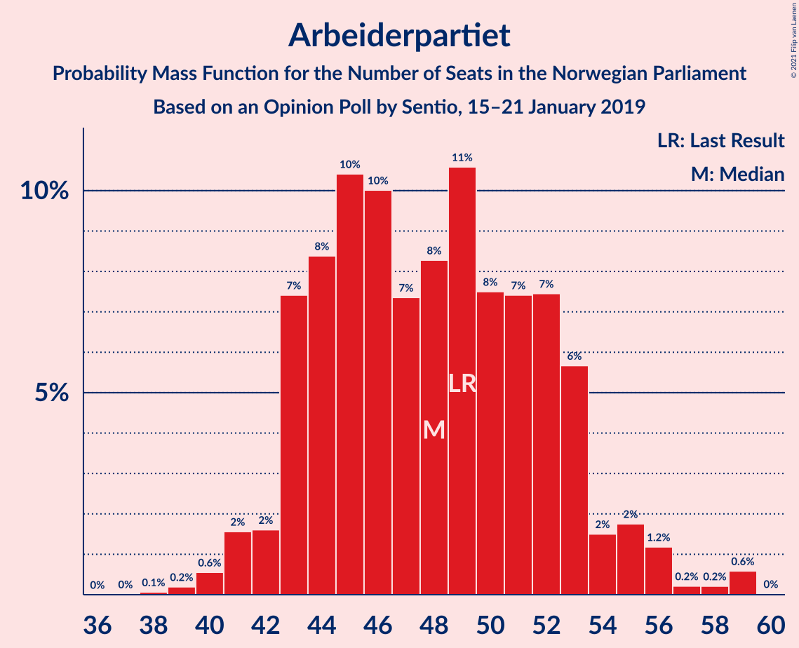
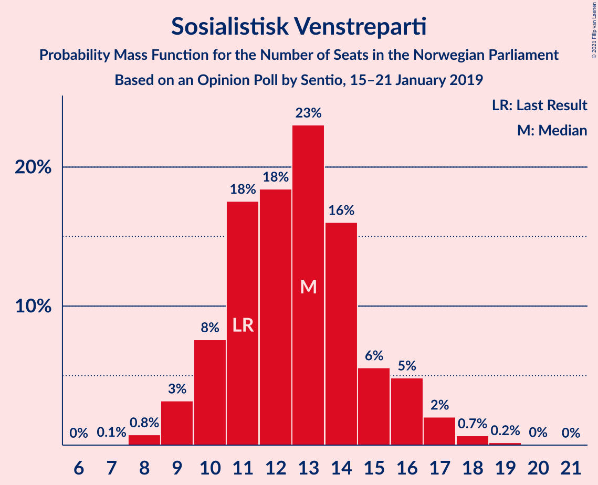
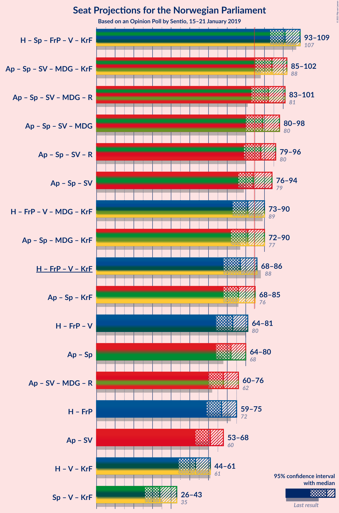
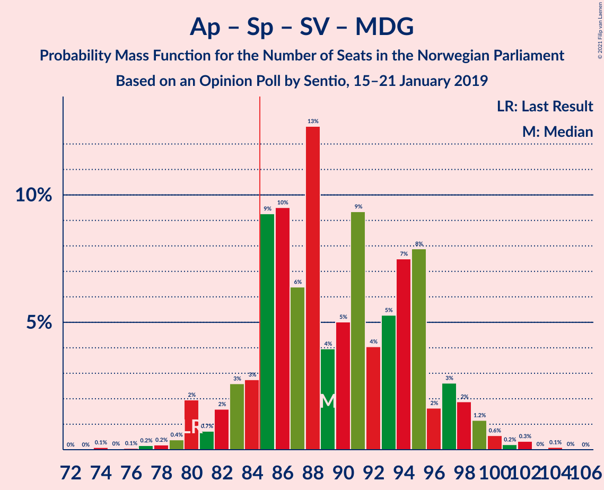
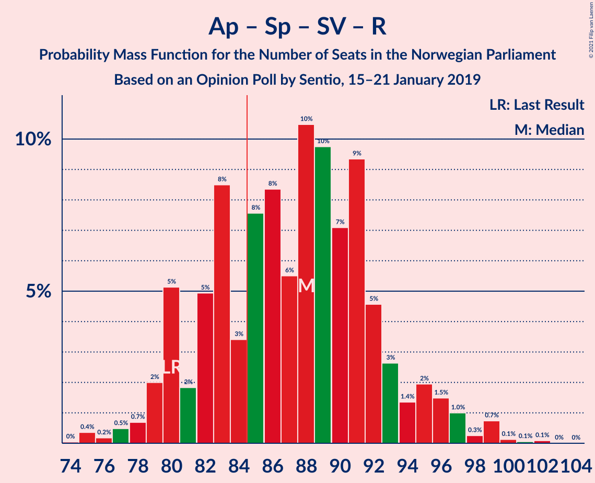
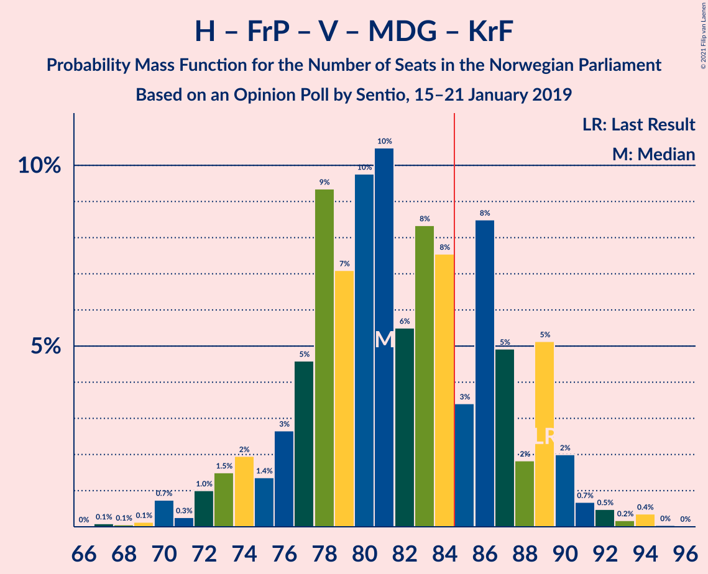
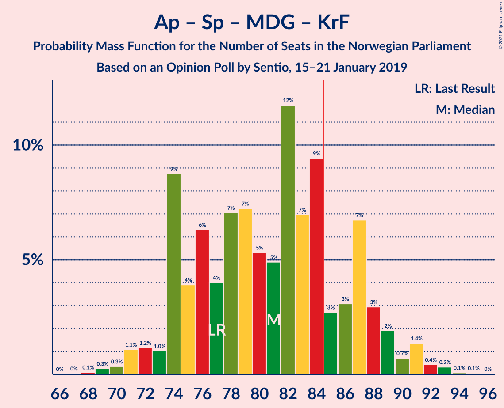
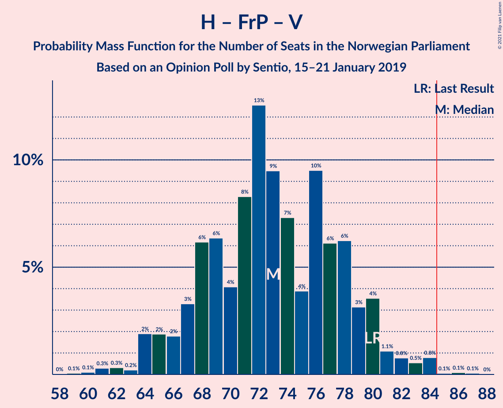

# Opinion Poll by Sentio, 15–21 January 2019

<a href="#voting-intentions">Voting Intentions</a> | <a href="#seats">Seats</a> | <a href="#coalitions">Coalitions</a> | <a href="#technical-information">Technical Information</a>

## Voting Intentions

### Confidence Intervals

| Party | Last Result | Poll Result | 80% Confidence Interval | 90% Confidence Interval | 95% Confidence Interval | 99% Confidence Interval |
|:-----:|:-----------:|:-----------:|:-----------------------:|:-----------------------:|:-----------------------:|:-----------------------:|
| Arbeiderpartiet | 27.4% | 26.4% | 24.2–28.7% |23.7–29.3% |23.1–29.9% |22.1–31.0% |
| Høyre | 25.0% | 23.6% | 21.6–25.8% |21.0–26.5% |20.5–27.0% |19.6–28.1% |
| Senterpartiet | 10.3% | 13.3% | 11.8–15.2% |11.3–15.7% |10.9–16.2% |10.2–17.1% |
| Fremskrittspartiet | 15.2% | 13.2% | 11.6–15.0% |11.2–15.6% |10.8–16.0% |10.1–16.9% |
| Sosialistisk Venstreparti | 6.0% | 6.9% | 5.8–8.4% |5.5–8.7% |5.2–9.1% |4.7–9.9% |
| Venstre | 4.4% | 4.3% | 3.4–5.5% |3.2–5.8% |3.0–6.1% |2.6–6.8% |
| Miljøpartiet De Grønne | 3.2% | 3.8% | 3.0–5.0% |2.8–5.3% |2.6–5.6% |2.3–6.2% |
| Kristelig Folkeparti | 4.2% | 3.5% | 2.8–4.6% |2.5–5.0% |2.4–5.2% |2.0–5.8% |
| Rødt | 2.4% | 3.1% | 2.4–4.1% |2.2–4.4% |2.0–4.7% |1.7–5.3% |

*Note:* The poll result column reflects the actual value used in the calculations. Published results may vary slightly, and in addition be rounded to fewer digits.

## Seats

### Confidence Intervals

| Party | Last Result | Median | 80% Confidence Interval | 90% Confidence Interval | 95% Confidence Interval | 99% Confidence Interval |
|:-----:|:-----------:|:------:|:-----------------------:|:-----------------------:|:-----------------------:|:-----------------------:|
| <a href="#arbeiderpartiet">Arbeiderpartiet</a> | 49 | 49 | 44–52 |43–54 |43–55 |40–58 |
| <a href="#høyre">Høyre</a> | 45 | 44 | 37–46 |37–49 |36–50 |35–50 |
| <a href="#senterpartiet">Senterpartiet</a> | 19 | 24 | 19–27 |19–28 |19–30 |18–32 |
| <a href="#fremskrittspartiet">Fremskrittspartiet</a> | 27 | 24 | 21–27 |20–29 |20–30 |19–31 |
| <a href="#sosialistisk-venstreparti">Sosialistisk Venstreparti</a> | 11 | 12 | 10–15 |10–16 |9–16 |8–18 |
| <a href="#venstre">Venstre</a> | 8 | 7 | 2–9 |2–10 |2–11 |2–12 |
| <a href="#miljøpartiet-de-grønne">Miljøpartiet De Grønne</a> | 1 | 7 | 1–9 |1–9 |1–9 |1–11 |
| <a href="#kristelig-folkeparti">Kristelig Folkeparti</a> | 8 | 3 | 1–8 |1–8 |1–9 |0–10 |
| <a href="#rødt">Rødt</a> | 1 | 2 | 1–6 |1–8 |1–8 |1–9 |

### Arbeiderpartiet

*For a full overview of the results for this party, see the [Arbeiderpartiet](party-arbeiderpartiet.html) page.*

| Number of Seats | Probability | Accumulated | Special Marks |
|:---------------:|:-----------:|:-----------:|:-------------:|
| 38 | 0.1% | 100% |  |
| 39 | 0.3% | 99.9% |  |
| 40 | 0.4% | 99.6% |  |
| 41 | 0.3% | 99.2% |  |
| 42 | 1.2% | 98.9% |  |
| 43 | 6% | 98% |  |
| 44 | 14% | 92% |  |
| 45 | 13% | 78% |  |
| 46 | 3% | 65% |  |
| 47 | 4% | 62% |  |
| 48 | 2% | 58% |  |
| 49 | 8% | 56% | Last Result, Median |
| 50 | 21% | 48% |  |
| 51 | 11% | 27% |  |
| 52 | 9% | 16% |  |
| 53 | 1.1% | 7% |  |
| 54 | 2% | 6% |  |
| 55 | 2% | 3% |  |
| 56 | 0.9% | 2% |  |
| 57 | 0.4% | 0.9% |  |
| 58 | 0.5% | 0.5% |  |
| 59 | 0% | 0% |  |

### Høyre

*For a full overview of the results for this party, see the [Høyre](party-høyre.html) page.*

| Number of Seats | Probability | Accumulated | Special Marks |
|:---------------:|:-----------:|:-----------:|:-------------:|
| 33 | 0% | 100% |  |
| 34 | 0.3% | 99.9% |  |
| 35 | 0.8% | 99.6% |  |
| 36 | 2% | 98.8% |  |
| 37 | 10% | 96% |  |
| 38 | 5% | 86% |  |
| 39 | 2% | 82% |  |
| 40 | 5% | 80% |  |
| 41 | 4% | 75% |  |
| 42 | 13% | 71% |  |
| 43 | 4% | 58% |  |
| 44 | 21% | 54% | Median |
| 45 | 20% | 32% | Last Result |
| 46 | 4% | 12% |  |
| 47 | 0.8% | 9% |  |
| 48 | 0.7% | 8% |  |
| 49 | 4% | 7% |  |
| 50 | 3% | 3% |  |
| 51 | 0.1% | 0.3% |  |
| 52 | 0% | 0.1% |  |
| 53 | 0% | 0.1% |  |
| 54 | 0% | 0.1% |  |
| 55 | 0% | 0% |  |

### Senterpartiet

*For a full overview of the results for this party, see the [Senterpartiet](party-senterpartiet.html) page.*

| Number of Seats | Probability | Accumulated | Special Marks |
|:---------------:|:-----------:|:-----------:|:-------------:|
| 16 | 0.1% | 100% |  |
| 17 | 0.1% | 99.9% |  |
| 18 | 1.2% | 99.7% |  |
| 19 | 9% | 98.6% | Last Result |
| 20 | 2% | 90% |  |
| 21 | 17% | 88% |  |
| 22 | 11% | 70% |  |
| 23 | 6% | 59% |  |
| 24 | 21% | 53% | Median |
| 25 | 1.3% | 32% |  |
| 26 | 20% | 31% |  |
| 27 | 5% | 12% |  |
| 28 | 2% | 6% |  |
| 29 | 0.9% | 4% |  |
| 30 | 1.2% | 3% |  |
| 31 | 1.2% | 2% |  |
| 32 | 0.4% | 0.8% |  |
| 33 | 0.4% | 0.5% |  |
| 34 | 0% | 0% |  |

### Fremskrittspartiet

*For a full overview of the results for this party, see the [Fremskrittspartiet](party-fremskrittspartiet.html) page.*

| Number of Seats | Probability | Accumulated | Special Marks |
|:---------------:|:-----------:|:-----------:|:-------------:|
| 17 | 0.2% | 100% |  |
| 18 | 0.2% | 99.8% |  |
| 19 | 2% | 99.5% |  |
| 20 | 4% | 98% |  |
| 21 | 13% | 94% |  |
| 22 | 6% | 80% |  |
| 23 | 4% | 74% |  |
| 24 | 38% | 70% | Median |
| 25 | 14% | 31% |  |
| 26 | 4% | 17% |  |
| 27 | 3% | 13% | Last Result |
| 28 | 1.0% | 10% |  |
| 29 | 5% | 9% |  |
| 30 | 1.4% | 4% |  |
| 31 | 2% | 2% |  |
| 32 | 0.3% | 0.3% |  |
| 33 | 0% | 0% |  |

### Sosialistisk Venstreparti

*For a full overview of the results for this party, see the [Sosialistisk Venstreparti](party-sosialistiskvenstreparti.html) page.*

| Number of Seats | Probability | Accumulated | Special Marks |
|:---------------:|:-----------:|:-----------:|:-------------:|
| 7 | 0.3% | 100% |  |
| 8 | 1.5% | 99.7% |  |
| 9 | 1.4% | 98% |  |
| 10 | 17% | 97% |  |
| 11 | 10% | 79% | Last Result |
| 12 | 29% | 69% | Median |
| 13 | 18% | 40% |  |
| 14 | 9% | 22% |  |
| 15 | 5% | 12% |  |
| 16 | 6% | 8% |  |
| 17 | 1.1% | 2% |  |
| 18 | 0.6% | 0.8% |  |
| 19 | 0.2% | 0.2% |  |
| 20 | 0% | 0% |  |

### Venstre

*For a full overview of the results for this party, see the [Venstre](party-venstre.html) page.*

| Number of Seats | Probability | Accumulated | Special Marks |
|:---------------:|:-----------:|:-----------:|:-------------:|
| 1 | 0.1% | 100% |  |
| 2 | 27% | 99.9% |  |
| 3 | 12% | 73% |  |
| 4 | 0% | 61% |  |
| 5 | 0% | 61% |  |
| 6 | 0% | 61% |  |
| 7 | 16% | 61% | Median |
| 8 | 24% | 45% | Last Result |
| 9 | 16% | 21% |  |
| 10 | 3% | 5% |  |
| 11 | 2% | 3% |  |
| 12 | 0.8% | 1.0% |  |
| 13 | 0.1% | 0.2% |  |
| 14 | 0.1% | 0.1% |  |
| 15 | 0% | 0% |  |

### Miljøpartiet De Grønne

*For a full overview of the results for this party, see the [Miljøpartiet De Grønne](party-miljøpartietdegrønne.html) page.*

| Number of Seats | Probability | Accumulated | Special Marks |
|:---------------:|:-----------:|:-----------:|:-------------:|
| 1 | 13% | 100% | Last Result |
| 2 | 11% | 87% |  |
| 3 | 14% | 75% |  |
| 4 | 0.2% | 62% |  |
| 5 | 0% | 61% |  |
| 6 | 0% | 61% |  |
| 7 | 21% | 61% | Median |
| 8 | 30% | 41% |  |
| 9 | 8% | 10% |  |
| 10 | 1.2% | 2% |  |
| 11 | 1.1% | 1.2% |  |
| 12 | 0.1% | 0.1% |  |
| 13 | 0% | 0% |  |

### Kristelig Folkeparti

*For a full overview of the results for this party, see the [Kristelig Folkeparti](party-kristeligfolkeparti.html) page.*

| Number of Seats | Probability | Accumulated | Special Marks |
|:---------------:|:-----------:|:-----------:|:-------------:|
| 0 | 1.0% | 100% |  |
| 1 | 24% | 99.0% |  |
| 2 | 4% | 75% |  |
| 3 | 33% | 71% | Median |
| 4 | 0% | 39% |  |
| 5 | 0% | 39% |  |
| 6 | 0.1% | 39% |  |
| 7 | 10% | 39% |  |
| 8 | 25% | 29% | Last Result |
| 9 | 2% | 3% |  |
| 10 | 1.2% | 2% |  |
| 11 | 0.3% | 0.3% |  |
| 12 | 0% | 0% |  |

### Rødt

*For a full overview of the results for this party, see the [Rødt](party-rødt.html) page.*

| Number of Seats | Probability | Accumulated | Special Marks |
|:---------------:|:-----------:|:-----------:|:-------------:|
| 1 | 37% | 100% | Last Result |
| 2 | 48% | 63% | Median |
| 3 | 0% | 16% |  |
| 4 | 0% | 16% |  |
| 5 | 0% | 16% |  |
| 6 | 6% | 16% |  |
| 7 | 4% | 10% |  |
| 8 | 4% | 5% |  |
| 9 | 0.8% | 1.3% |  |
| 10 | 0.3% | 0.4% |  |
| 11 | 0.2% | 0.2% |  |
| 12 | 0% | 0% |  |

## Coalitions

### Confidence Intervals

| Coalition | Last Result | Median | Majority? | 80% Confidence Interval | 90% Confidence Interval | 95% Confidence Interval | 99% Confidence Interval |
|:---------:|:-----------:|:------:|:---------:|:-----------------------:|:-----------------------:|:-----------------------:|:-----------------------:|
| Høyre – Senterpartiet – Fremskrittspartiet – Venstre – Kristelig Folkeparti | 107 | 102 | 100% | 96–106 | 94–107 | 92–109 | 90–110 |
| Arbeiderpartiet – Senterpartiet – Sosialistisk Venstreparti – Miljøpartiet De Grønne – Kristelig Folkeparti | 88 | 94 | 99.0% | 88–100 | 86–101 | 85–103 | 84–105 |
| Arbeiderpartiet – Senterpartiet – Sosialistisk Venstreparti – Miljøpartiet De Grønne – Rødt | 81 | 93 | 97% | 86–97 | 86–100 | 83–102 | 83–103 |
| Arbeiderpartiet – Senterpartiet – Sosialistisk Venstreparti – Miljøpartiet De Grønne | 80 | 91 | 87% | 83–95 | 80–95 | 80–98 | 79–102 |
| Arbeiderpartiet – Senterpartiet – Sosialistisk Venstreparti – Rødt | 80 | 86 | 63% | 79–92 | 79–94 | 78–95 | 75–100 |
| Arbeiderpartiet – Senterpartiet – Sosialistisk Venstreparti | 79 | 83 | 45% | 77–89 | 73–91 | 73–92 | 73–95 |
| Høyre – Fremskrittspartiet – Venstre – Miljøpartiet De Grønne – Kristelig Folkeparti | 89 | 83 | 37% | 77–90 | 75–90 | 74–91 | 69–94 |
| Arbeiderpartiet – Senterpartiet – Miljøpartiet De Grønne – Kristelig Folkeparti | 77 | 82 | 28% | 76–88 | 74–88 | 72–90 | 70–93 |
| Høyre – Fremskrittspartiet – Venstre – Kristelig Folkeparti | 88 | 76 | 3% | 72–83 | 69–83 | 67–86 | 66–86 |
| Arbeiderpartiet – Senterpartiet – Kristelig Folkeparti | 76 | 76 | 2% | 70–84 | 69–84 | 68–84 | 66–87 |
| Høyre – Fremskrittspartiet – Venstre | 80 | 73 | 0.1% | 68–79 | 65–79 | 64–82 | 61–83 |
| Arbeiderpartiet – Senterpartiet | 68 | 73 | 0% | 66–76 | 63–77 | 63–80 | 62–82 |
| Høyre – Fremskrittspartiet | 72 | 66 | 0% | 61–70 | 61–73 | 59–74 | 57–77 |
| Arbeiderpartiet – Sosialistisk Venstreparti | 60 | 62 | 0% | 55–65 | 54–66 | 54–68 | 52–70 |
| Høyre – Venstre – Kristelig Folkeparti | 61 | 53 | 0% | 48–59 | 45–60 | 43–61 | 43–64 |
| Senterpartiet – Venstre – Kristelig Folkeparti | 35 | 34 | 0% | 27–38 | 27–41 | 27–43 | 24–46 |

### Høyre – Senterpartiet – Fremskrittspartiet – Venstre – Kristelig Folkeparti

| Number of Seats | Probability | Accumulated | Special Marks |
|:---------------:|:-----------:|:-----------:|:-------------:|
| 86 | 0.1% | 100% |  |
| 87 | 0.1% | 99.9% |  |
| 88 | 0% | 99.8% |  |
| 89 | 0% | 99.8% |  |
| 90 | 1.3% | 99.8% |  |
| 91 | 0.3% | 98.5% |  |
| 92 | 2% | 98% |  |
| 93 | 0.7% | 97% |  |
| 94 | 1.4% | 96% |  |
| 95 | 2% | 95% |  |
| 96 | 12% | 92% |  |
| 97 | 16% | 80% |  |
| 98 | 1.0% | 64% |  |
| 99 | 2% | 63% |  |
| 100 | 3% | 61% |  |
| 101 | 6% | 58% |  |
| 102 | 21% | 52% | Median |
| 103 | 6% | 31% |  |
| 104 | 13% | 25% |  |
| 105 | 2% | 12% |  |
| 106 | 3% | 10% |  |
| 107 | 3% | 7% | Last Result |
| 108 | 0.5% | 5% |  |
| 109 | 4% | 4% |  |
| 110 | 0.3% | 0.7% |  |
| 111 | 0% | 0.4% |  |
| 112 | 0.2% | 0.4% |  |
| 113 | 0.1% | 0.1% |  |
| 114 | 0% | 0.1% |  |
| 115 | 0% | 0% |  |

### Arbeiderpartiet – Senterpartiet – Sosialistisk Venstreparti – Miljøpartiet De Grønne – Kristelig Folkeparti

| Number of Seats | Probability | Accumulated | Special Marks |
|:---------------:|:-----------:|:-----------:|:-------------:|
| 79 | 0% | 100% |  |
| 80 | 0% | 99.9% |  |
| 81 | 0% | 99.9% |  |
| 82 | 0.1% | 99.9% |  |
| 83 | 0.2% | 99.8% |  |
| 84 | 0.6% | 99.6% |  |
| 85 | 2% | 99.0% | Majority |
| 86 | 2% | 97% |  |
| 87 | 1.1% | 95% |  |
| 88 | 10% | 94% | Last Result |
| 89 | 11% | 84% |  |
| 90 | 3% | 73% |  |
| 91 | 3% | 69% |  |
| 92 | 4% | 66% |  |
| 93 | 8% | 62% |  |
| 94 | 7% | 54% |  |
| 95 | 4% | 47% | Median |
| 96 | 11% | 43% |  |
| 97 | 4% | 31% |  |
| 98 | 10% | 28% |  |
| 99 | 2% | 18% |  |
| 100 | 11% | 16% |  |
| 101 | 1.5% | 6% |  |
| 102 | 0.6% | 4% |  |
| 103 | 3% | 4% |  |
| 104 | 0.1% | 0.9% |  |
| 105 | 0.6% | 0.8% |  |
| 106 | 0.1% | 0.2% |  |
| 107 | 0.1% | 0.1% |  |
| 108 | 0% | 0.1% |  |
| 109 | 0% | 0% |  |

### Arbeiderpartiet – Senterpartiet – Sosialistisk Venstreparti – Miljøpartiet De Grønne – Rødt

| Number of Seats | Probability | Accumulated | Special Marks |
|:---------------:|:-----------:|:-----------:|:-------------:|
| 79 | 0.1% | 100% |  |
| 80 | 0.1% | 99.8% |  |
| 81 | 0.1% | 99.7% | Last Result |
| 82 | 0.1% | 99.6% |  |
| 83 | 2% | 99.6% |  |
| 84 | 0.3% | 97% |  |
| 85 | 0.7% | 97% | Majority |
| 86 | 12% | 96% |  |
| 87 | 10% | 85% |  |
| 88 | 2% | 74% |  |
| 89 | 2% | 73% |  |
| 90 | 4% | 70% |  |
| 91 | 2% | 66% |  |
| 92 | 10% | 65% |  |
| 93 | 27% | 54% |  |
| 94 | 3% | 28% | Median |
| 95 | 2% | 24% |  |
| 96 | 4% | 22% |  |
| 97 | 11% | 18% |  |
| 98 | 0.7% | 8% |  |
| 99 | 2% | 7% |  |
| 100 | 0.7% | 5% |  |
| 101 | 1.2% | 4% |  |
| 102 | 2% | 3% |  |
| 103 | 0.9% | 1.1% |  |
| 104 | 0% | 0.2% |  |
| 105 | 0% | 0.2% |  |
| 106 | 0% | 0.1% |  |
| 107 | 0.1% | 0.1% |  |
| 108 | 0.1% | 0.1% |  |
| 109 | 0% | 0% |  |

### Arbeiderpartiet – Senterpartiet – Sosialistisk Venstreparti – Miljøpartiet De Grønne

| Number of Seats | Probability | Accumulated | Special Marks |
|:---------------:|:-----------:|:-----------:|:-------------:|
| 76 | 0.1% | 100% |  |
| 77 | 0.1% | 99.9% |  |
| 78 | 0.2% | 99.7% |  |
| 79 | 0.2% | 99.5% |  |
| 80 | 6% | 99.4% | Last Result |
| 81 | 1.0% | 93% |  |
| 82 | 1.3% | 92% |  |
| 83 | 0.9% | 91% |  |
| 84 | 3% | 90% |  |
| 85 | 7% | 87% | Majority |
| 86 | 13% | 80% |  |
| 87 | 2% | 67% |  |
| 88 | 0.8% | 65% |  |
| 89 | 4% | 64% |  |
| 90 | 8% | 59% |  |
| 91 | 15% | 52% |  |
| 92 | 14% | 37% | Median |
| 93 | 2% | 23% |  |
| 94 | 3% | 21% |  |
| 95 | 13% | 18% |  |
| 96 | 0.3% | 5% |  |
| 97 | 1.0% | 5% |  |
| 98 | 1.3% | 4% |  |
| 99 | 0.1% | 2% |  |
| 100 | 1.3% | 2% |  |
| 101 | 0.1% | 0.9% |  |
| 102 | 0.7% | 0.8% |  |
| 103 | 0% | 0.1% |  |
| 104 | 0% | 0.1% |  |
| 105 | 0.1% | 0.1% |  |
| 106 | 0% | 0% |  |

### Arbeiderpartiet – Senterpartiet – Sosialistisk Venstreparti – Rødt

| Number of Seats | Probability | Accumulated | Special Marks |
|:---------------:|:-----------:|:-----------:|:-------------:|
| 73 | 0.1% | 100% |  |
| 74 | 0% | 99.9% |  |
| 75 | 0.6% | 99.9% |  |
| 76 | 0.1% | 99.3% |  |
| 77 | 0.2% | 99.2% |  |
| 78 | 2% | 99.0% |  |
| 79 | 8% | 97% |  |
| 80 | 8% | 89% | Last Result |
| 81 | 1.1% | 80% |  |
| 82 | 3% | 79% |  |
| 83 | 2% | 76% |  |
| 84 | 12% | 75% |  |
| 85 | 10% | 63% | Majority |
| 86 | 3% | 53% |  |
| 87 | 3% | 49% | Median |
| 88 | 1.1% | 46% |  |
| 89 | 14% | 45% |  |
| 90 | 14% | 31% |  |
| 91 | 7% | 18% |  |
| 92 | 2% | 11% |  |
| 93 | 3% | 9% |  |
| 94 | 1.0% | 6% |  |
| 95 | 3% | 5% |  |
| 96 | 0.5% | 2% |  |
| 97 | 0.3% | 1.4% |  |
| 98 | 0.2% | 1.2% |  |
| 99 | 0.5% | 1.0% |  |
| 100 | 0.5% | 0.5% |  |
| 101 | 0% | 0% |  |

### Arbeiderpartiet – Senterpartiet – Sosialistisk Venstreparti

| Number of Seats | Probability | Accumulated | Special Marks |
|:---------------:|:-----------:|:-----------:|:-------------:|
| 71 | 0.1% | 100% |  |
| 72 | 0.1% | 99.9% |  |
| 73 | 7% | 99.8% |  |
| 74 | 0.1% | 93% |  |
| 75 | 0.4% | 93% |  |
| 76 | 2% | 93% |  |
| 77 | 0.9% | 91% |  |
| 78 | 3% | 90% |  |
| 79 | 9% | 87% | Last Result |
| 80 | 3% | 78% |  |
| 81 | 2% | 75% |  |
| 82 | 10% | 73% |  |
| 83 | 15% | 64% |  |
| 84 | 3% | 49% |  |
| 85 | 3% | 45% | Median, Majority |
| 86 | 2% | 43% |  |
| 87 | 11% | 41% |  |
| 88 | 5% | 30% |  |
| 89 | 16% | 25% |  |
| 90 | 3% | 9% |  |
| 91 | 2% | 6% |  |
| 92 | 2% | 4% |  |
| 93 | 0.6% | 2% |  |
| 94 | 1.3% | 2% |  |
| 95 | 0.3% | 0.6% |  |
| 96 | 0% | 0.3% |  |
| 97 | 0% | 0.3% |  |
| 98 | 0.2% | 0.2% |  |
| 99 | 0% | 0% |  |

### Høyre – Fremskrittspartiet – Venstre – Miljøpartiet De Grønne – Kristelig Folkeparti

| Number of Seats | Probability | Accumulated | Special Marks |
|:---------------:|:-----------:|:-----------:|:-------------:|
| 69 | 0.5% | 100% |  |
| 70 | 0.5% | 99.5% |  |
| 71 | 0.2% | 99.0% |  |
| 72 | 0.3% | 98.8% |  |
| 73 | 0.5% | 98.6% |  |
| 74 | 3% | 98% |  |
| 75 | 1.0% | 95% |  |
| 76 | 4% | 94% |  |
| 77 | 2% | 91% |  |
| 78 | 7% | 89% |  |
| 79 | 14% | 82% |  |
| 80 | 14% | 68% |  |
| 81 | 1.2% | 55% |  |
| 82 | 3% | 54% |  |
| 83 | 3% | 51% |  |
| 84 | 10% | 47% |  |
| 85 | 12% | 37% | Median, Majority |
| 86 | 2% | 25% |  |
| 87 | 3% | 24% |  |
| 88 | 1.1% | 21% |  |
| 89 | 8% | 20% | Last Result |
| 90 | 8% | 11% |  |
| 91 | 2% | 3% |  |
| 92 | 0.2% | 0.9% |  |
| 93 | 0.1% | 0.8% |  |
| 94 | 0.6% | 0.7% |  |
| 95 | 0% | 0.1% |  |
| 96 | 0.1% | 0.1% |  |
| 97 | 0% | 0% |  |

### Arbeiderpartiet – Senterpartiet – Miljøpartiet De Grønne – Kristelig Folkeparti

| Number of Seats | Probability | Accumulated | Special Marks |
|:---------------:|:-----------:|:-----------:|:-------------:|
| 68 | 0.1% | 100% |  |
| 69 | 0.3% | 99.9% |  |
| 70 | 0.1% | 99.6% |  |
| 71 | 1.0% | 99.4% |  |
| 72 | 2% | 98% |  |
| 73 | 0.6% | 97% |  |
| 74 | 4% | 96% |  |
| 75 | 1.2% | 93% |  |
| 76 | 2% | 91% |  |
| 77 | 16% | 90% | Last Result |
| 78 | 8% | 74% |  |
| 79 | 5% | 66% |  |
| 80 | 6% | 61% |  |
| 81 | 4% | 55% |  |
| 82 | 3% | 51% |  |
| 83 | 9% | 48% | Median |
| 84 | 11% | 39% |  |
| 85 | 3% | 28% | Majority |
| 86 | 0.9% | 26% |  |
| 87 | 12% | 25% |  |
| 88 | 9% | 12% |  |
| 89 | 0.4% | 4% |  |
| 90 | 1.1% | 3% |  |
| 91 | 0.6% | 2% |  |
| 92 | 1.1% | 2% |  |
| 93 | 0.5% | 0.7% |  |
| 94 | 0% | 0.2% |  |
| 95 | 0.1% | 0.1% |  |
| 96 | 0% | 0.1% |  |
| 97 | 0% | 0% |  |

### Høyre – Fremskrittspartiet – Venstre – Kristelig Folkeparti

| Number of Seats | Probability | Accumulated | Special Marks |
|:---------------:|:-----------:|:-----------:|:-------------:|
| 61 | 0.1% | 100% |  |
| 62 | 0.1% | 99.9% |  |
| 63 | 0% | 99.9% |  |
| 64 | 0% | 99.9% |  |
| 65 | 0% | 99.8% |  |
| 66 | 0.9% | 99.8% |  |
| 67 | 2% | 98.9% |  |
| 68 | 1.3% | 97% |  |
| 69 | 0.7% | 95% |  |
| 70 | 2% | 95% |  |
| 71 | 0.7% | 93% |  |
| 72 | 11% | 92% |  |
| 73 | 4% | 82% |  |
| 74 | 2% | 78% |  |
| 75 | 3% | 76% |  |
| 76 | 27% | 72% |  |
| 77 | 10% | 45% |  |
| 78 | 2% | 35% | Median |
| 79 | 4% | 33% |  |
| 80 | 2% | 29% |  |
| 81 | 2% | 27% |  |
| 82 | 10% | 26% |  |
| 83 | 12% | 15% |  |
| 84 | 0.7% | 4% |  |
| 85 | 0.3% | 3% | Majority |
| 86 | 2% | 3% |  |
| 87 | 0.1% | 0.4% |  |
| 88 | 0.1% | 0.4% | Last Result |
| 89 | 0.1% | 0.3% |  |
| 90 | 0.1% | 0.2% |  |
| 91 | 0% | 0% |  |

### Arbeiderpartiet – Senterpartiet – Kristelig Folkeparti

| Number of Seats | Probability | Accumulated | Special Marks |
|:---------------:|:-----------:|:-----------:|:-------------:|
| 64 | 0.4% | 100% |  |
| 65 | 0% | 99.6% |  |
| 66 | 0.1% | 99.5% |  |
| 67 | 2% | 99.4% |  |
| 68 | 0.6% | 98% |  |
| 69 | 3% | 97% |  |
| 70 | 10% | 94% |  |
| 71 | 10% | 83% |  |
| 72 | 4% | 74% |  |
| 73 | 3% | 70% |  |
| 74 | 8% | 67% |  |
| 75 | 3% | 59% |  |
| 76 | 17% | 57% | Last Result, Median |
| 77 | 1.0% | 40% |  |
| 78 | 8% | 39% |  |
| 79 | 2% | 31% |  |
| 80 | 9% | 29% |  |
| 81 | 2% | 19% |  |
| 82 | 3% | 17% |  |
| 83 | 2% | 14% |  |
| 84 | 10% | 12% |  |
| 85 | 1.0% | 2% | Majority |
| 86 | 0.2% | 0.9% |  |
| 87 | 0.6% | 0.7% |  |
| 88 | 0% | 0.1% |  |
| 89 | 0% | 0.1% |  |
| 90 | 0% | 0.1% |  |
| 91 | 0% | 0% |  |

### Høyre – Fremskrittspartiet – Venstre

| Number of Seats | Probability | Accumulated | Special Marks |
|:---------------:|:-----------:|:-----------:|:-------------:|
| 58 | 0% | 100% |  |
| 59 | 0.1% | 99.9% |  |
| 60 | 0.3% | 99.9% |  |
| 61 | 0.1% | 99.6% |  |
| 62 | 0.5% | 99.5% |  |
| 63 | 0.3% | 99.0% |  |
| 64 | 2% | 98.7% |  |
| 65 | 3% | 97% |  |
| 66 | 0.8% | 94% |  |
| 67 | 2% | 93% |  |
| 68 | 12% | 91% |  |
| 69 | 9% | 79% |  |
| 70 | 2% | 71% |  |
| 71 | 14% | 69% |  |
| 72 | 4% | 55% |  |
| 73 | 9% | 51% |  |
| 74 | 7% | 42% |  |
| 75 | 11% | 36% | Median |
| 76 | 5% | 25% |  |
| 77 | 3% | 20% |  |
| 78 | 1.1% | 17% |  |
| 79 | 11% | 16% |  |
| 80 | 1.1% | 5% | Last Result |
| 81 | 0.8% | 4% |  |
| 82 | 2% | 3% |  |
| 83 | 1.4% | 1.5% |  |
| 84 | 0% | 0.1% |  |
| 85 | 0% | 0.1% | Majority |
| 86 | 0% | 0.1% |  |
| 87 | 0% | 0% |  |

### Arbeiderpartiet – Senterpartiet

| Number of Seats | Probability | Accumulated | Special Marks |
|:---------------:|:-----------:|:-----------:|:-------------:|
| 60 | 0.1% | 100% |  |
| 61 | 0.2% | 99.9% |  |
| 62 | 0.8% | 99.6% |  |
| 63 | 6% | 98.8% |  |
| 64 | 2% | 93% |  |
| 65 | 0.8% | 91% |  |
| 66 | 3% | 90% |  |
| 67 | 10% | 87% |  |
| 68 | 3% | 77% | Last Result |
| 69 | 2% | 74% |  |
| 70 | 6% | 71% |  |
| 71 | 9% | 65% |  |
| 72 | 3% | 56% |  |
| 73 | 16% | 53% | Median |
| 74 | 4% | 37% |  |
| 75 | 14% | 34% |  |
| 76 | 12% | 20% |  |
| 77 | 4% | 8% |  |
| 78 | 0.3% | 4% |  |
| 79 | 1.1% | 4% |  |
| 80 | 1.1% | 3% |  |
| 81 | 0.9% | 2% |  |
| 82 | 0.2% | 0.7% |  |
| 83 | 0.2% | 0.5% |  |
| 84 | 0.2% | 0.3% |  |
| 85 | 0% | 0% | Majority |

### Høyre – Fremskrittspartiet

| Number of Seats | Probability | Accumulated | Special Marks |
|:---------------:|:-----------:|:-----------:|:-------------:|
| 55 | 0.2% | 100% |  |
| 56 | 0.3% | 99.8% |  |
| 57 | 0.2% | 99.5% |  |
| 58 | 1.4% | 99.3% |  |
| 59 | 0.8% | 98% |  |
| 60 | 0.8% | 97% |  |
| 61 | 9% | 96% |  |
| 62 | 3% | 87% |  |
| 63 | 5% | 84% |  |
| 64 | 1.4% | 79% |  |
| 65 | 14% | 78% |  |
| 66 | 14% | 64% |  |
| 67 | 1.5% | 50% |  |
| 68 | 9% | 48% | Median |
| 69 | 18% | 39% |  |
| 70 | 11% | 21% |  |
| 71 | 2% | 10% |  |
| 72 | 0.8% | 7% | Last Result |
| 73 | 2% | 6% |  |
| 74 | 2% | 4% |  |
| 75 | 0.1% | 2% |  |
| 76 | 0.8% | 2% |  |
| 77 | 1.3% | 1.5% |  |
| 78 | 0% | 0.2% |  |
| 79 | 0% | 0.1% |  |
| 80 | 0% | 0.1% |  |
| 81 | 0.1% | 0.1% |  |
| 82 | 0% | 0% |  |

### Arbeiderpartiet – Sosialistisk Venstreparti

| Number of Seats | Probability | Accumulated | Special Marks |
|:---------------:|:-----------:|:-----------:|:-------------:|
| 49 | 0% | 100% |  |
| 50 | 0.3% | 99.9% |  |
| 51 | 0.1% | 99.6% |  |
| 52 | 0.3% | 99.6% |  |
| 53 | 1.4% | 99.2% |  |
| 54 | 7% | 98% |  |
| 55 | 7% | 91% |  |
| 56 | 4% | 84% |  |
| 57 | 15% | 80% |  |
| 58 | 0.9% | 65% |  |
| 59 | 2% | 65% |  |
| 60 | 3% | 62% | Last Result |
| 61 | 7% | 59% | Median |
| 62 | 11% | 52% |  |
| 63 | 21% | 40% |  |
| 64 | 7% | 19% |  |
| 65 | 6% | 12% |  |
| 66 | 1.4% | 6% |  |
| 67 | 0.5% | 5% |  |
| 68 | 2% | 4% |  |
| 69 | 0.8% | 2% |  |
| 70 | 0.9% | 1.3% |  |
| 71 | 0.3% | 0.4% |  |
| 72 | 0.1% | 0.1% |  |
| 73 | 0% | 0% |  |

### Høyre – Venstre – Kristelig Folkeparti

| Number of Seats | Probability | Accumulated | Special Marks |
|:---------------:|:-----------:|:-----------:|:-------------:|
| 41 | 0.1% | 100% |  |
| 42 | 0.3% | 99.9% |  |
| 43 | 3% | 99.6% |  |
| 44 | 0.7% | 97% |  |
| 45 | 2% | 96% |  |
| 46 | 0.7% | 95% |  |
| 47 | 3% | 94% |  |
| 48 | 14% | 90% |  |
| 49 | 2% | 77% |  |
| 50 | 3% | 75% |  |
| 51 | 4% | 72% |  |
| 52 | 14% | 68% |  |
| 53 | 9% | 54% |  |
| 54 | 2% | 45% | Median |
| 55 | 13% | 42% |  |
| 56 | 3% | 29% |  |
| 57 | 11% | 26% |  |
| 58 | 3% | 15% |  |
| 59 | 8% | 13% |  |
| 60 | 0.5% | 5% |  |
| 61 | 4% | 5% | Last Result |
| 62 | 0.2% | 1.0% |  |
| 63 | 0.1% | 0.8% |  |
| 64 | 0.5% | 0.7% |  |
| 65 | 0.1% | 0.2% |  |
| 66 | 0.1% | 0.2% |  |
| 67 | 0% | 0% |  |

### Senterpartiet – Venstre – Kristelig Folkeparti

| Number of Seats | Probability | Accumulated | Special Marks |
|:---------------:|:-----------:|:-----------:|:-------------:|
| 21 | 0% | 100% |  |
| 22 | 0% | 99.9% |  |
| 23 | 0.3% | 99.9% |  |
| 24 | 0.1% | 99.6% |  |
| 25 | 0.3% | 99.5% |  |
| 26 | 0.4% | 99.1% |  |
| 27 | 11% | 98.8% |  |
| 28 | 4% | 88% |  |
| 29 | 4% | 84% |  |
| 30 | 2% | 81% |  |
| 31 | 9% | 78% |  |
| 32 | 3% | 69% |  |
| 33 | 2% | 66% |  |
| 34 | 21% | 64% | Median |
| 35 | 6% | 43% | Last Result |
| 36 | 10% | 36% |  |
| 37 | 14% | 26% |  |
| 38 | 3% | 12% |  |
| 39 | 2% | 9% |  |
| 40 | 0.4% | 7% |  |
| 41 | 2% | 6% |  |
| 42 | 0.4% | 4% |  |
| 43 | 3% | 4% |  |
| 44 | 0.1% | 1.3% |  |
| 45 | 0.2% | 1.1% |  |
| 46 | 0.6% | 0.9% |  |
| 47 | 0.2% | 0.3% |  |
| 48 | 0.1% | 0.1% |  |
| 49 | 0% | 0% |  |

## Technical Information

### Opinion Poll

+ **Polling firm:** Sentio
+ **Commissioner(s):** —
+ **Fieldwork period:** 15–21 January 2019

### Calculations

+ **Sample size:** 652
+ **Simulations done:** 131,072
+ **Error estimate:** 1.71%

