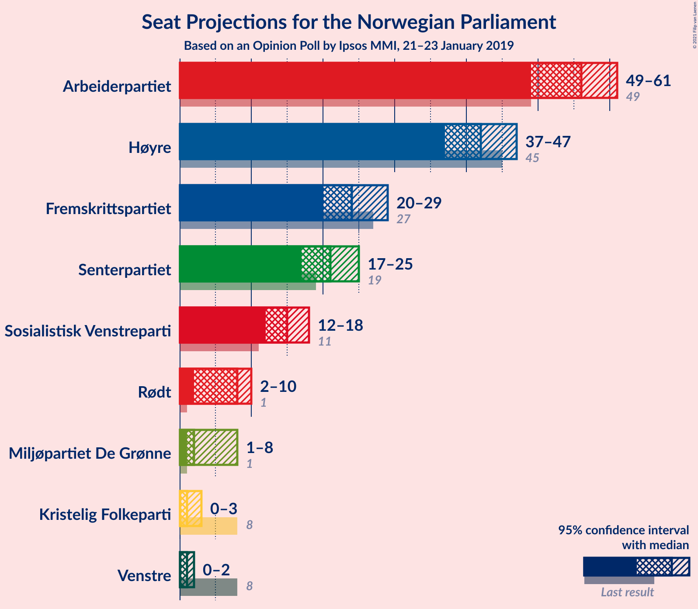
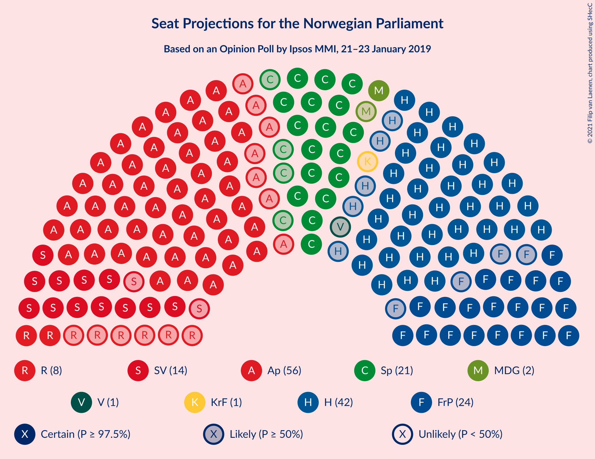
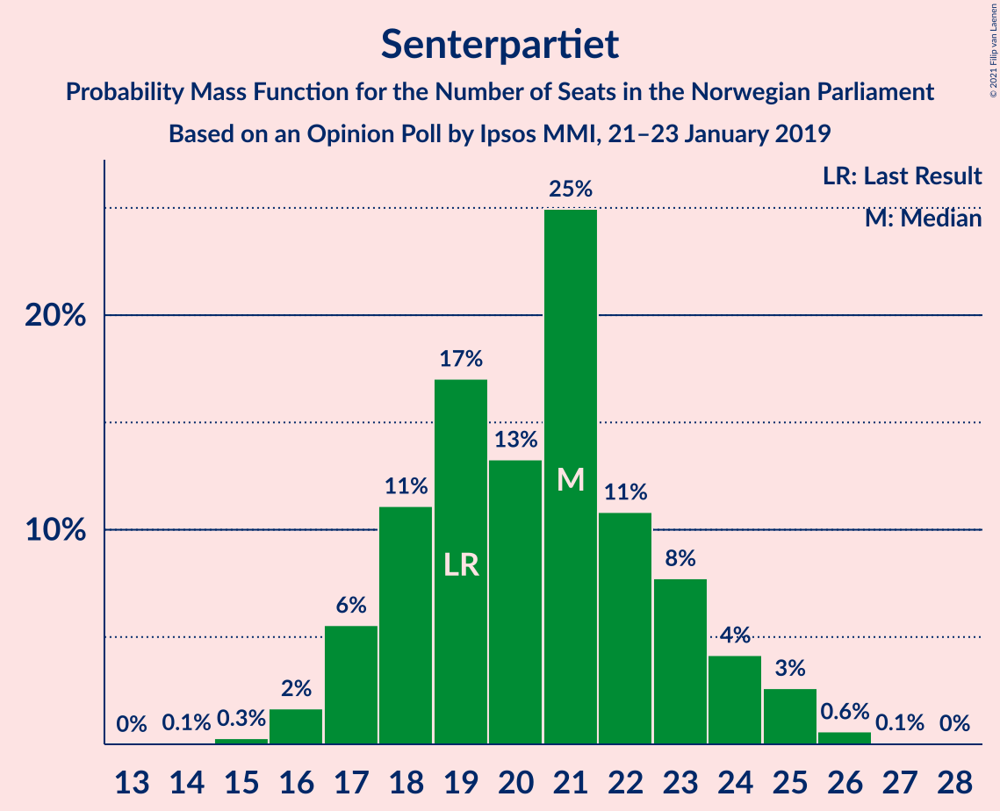
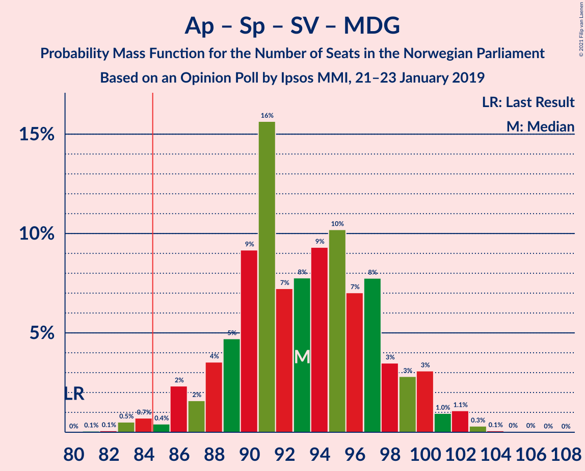
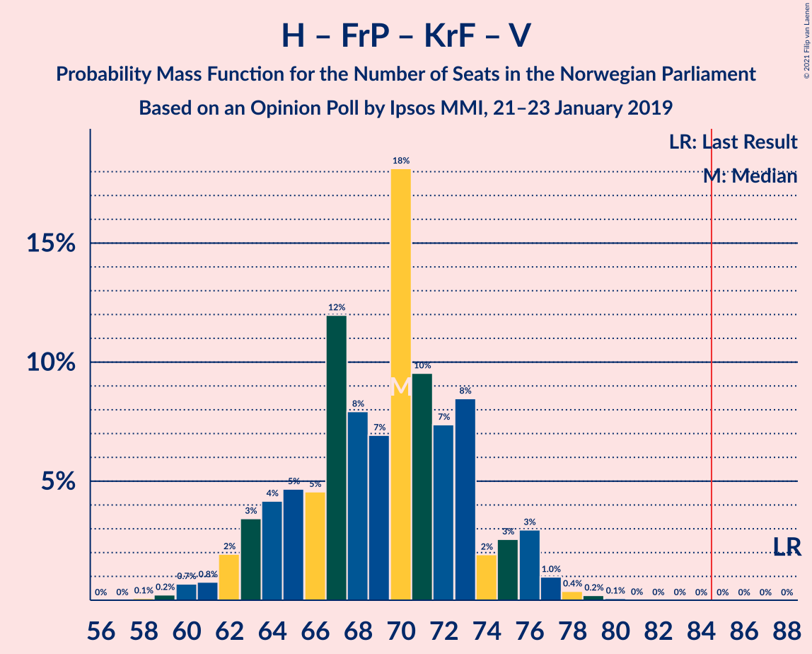

# Opinion Poll by Ipsos MMI, 21–23 January 2019

<a href="#voting-intentions">Voting Intentions</a> | <a href="#seats">Seats</a> | <a href="#coalitions">Coalitions</a> | <a href="#technical-information">Technical Information</a>

## Voting Intentions

### Confidence Intervals

| Party | Last Result | Poll Result | 80% Confidence Interval | 90% Confidence Interval | 95% Confidence Interval | 99% Confidence Interval |
|:-----:|:-----------:|:-----------:|:-----------------------:|:-----------------------:|:-----------------------:|:-----------------------:|
| Arbeiderpartiet | 27.4% | 29.8% | 28.0–31.8% |27.4–32.4% |27.0–32.9% |26.1–33.8% |
| Høyre | 25.0% | 22.8% | 21.1–24.6% |20.6–25.1% |20.2–25.6% |19.4–26.5% |
| Fremskrittspartiet | 15.2% | 13.0% | 11.7–14.6% |11.4–15.0% |11.0–15.4% |10.4–16.1% |
| Senterpartiet | 10.3% | 10.9% | 9.7–12.3% |9.4–12.7% |9.1–13.1% |8.5–13.8% |
| Sosialistisk Venstreparti | 6.0% | 8.0% | 7.0–9.3% |6.7–9.6% |6.4–10.0% |6.0–10.6% |
| Rødt | 2.4% | 4.2% | 3.4–5.1% |3.2–5.4% |3.1–5.7% |2.7–6.2% |
| Miljøpartiet De Grønne | 3.2% | 3.2% | 2.6–4.1% |2.4–4.3% |2.3–4.6% |2.0–5.0% |
| Kristelig Folkeparti | 4.2% | 2.7% | 2.1–3.5% |2.0–3.7% |1.8–3.9% |1.6–4.3% |
| Venstre | 4.4% | 2.2% | 1.7–3.0% |1.6–3.2% |1.5–3.4% |1.3–3.8% |

*Note:* The poll result column reflects the actual value used in the calculations. Published results may vary slightly, and in addition be rounded to fewer digits.

## Seats

### Confidence Intervals

| Party | Last Result | Median | 80% Confidence Interval | 90% Confidence Interval | 95% Confidence Interval | 99% Confidence Interval |
|:-----:|:-----------:|:------:|:-----------------------:|:-----------------------:|:-----------------------:|:-----------------------:|
| <a href="#arbeiderpartiet">Arbeiderpartiet</a> | 49 | 55 | 52–59 |51–59 |50–60 |47–63 |
| <a href="#høyre">Høyre</a> | 45 | 42 | 40–45 |38–46 |37–47 |35–48 |
| <a href="#fremskrittspartiet">Fremskrittspartiet</a> | 27 | 24 | 21–27 |21–29 |20–30 |19–30 |
| <a href="#senterpartiet">Senterpartiet</a> | 19 | 20 | 18–23 |17–24 |17–24 |15–26 |
| <a href="#sosialistisk-venstreparti">Sosialistisk Venstreparti</a> | 11 | 15 | 12–17 |12–18 |11–19 |11–20 |
| <a href="#rødt">Rødt</a> | 1 | 8 | 2–9 |2–10 |2–10 |1–11 |
| <a href="#miljøpartiet-de-grønne">Miljøpartiet De Grønne</a> | 1 | 2 | 1–7 |1–8 |1–8 |1–9 |
| <a href="#kristelig-folkeparti">Kristelig Folkeparti</a> | 8 | 1 | 0–2 |0–3 |0–3 |0–8 |
| <a href="#venstre">Venstre</a> | 8 | 1 | 0–2 |0–2 |0–2 |0–2 |

### Arbeiderpartiet

*For a full overview of the results for this party, see the [Arbeiderpartiet](party-arbeiderpartiet.html) page.*

| Number of Seats | Probability | Accumulated | Special Marks |
|:---------------:|:-----------:|:-----------:|:-------------:|
| 46 | 0.3% | 100% |  |
| 47 | 0.2% | 99.6% |  |
| 48 | 0.4% | 99.5% |  |
| 49 | 1.0% | 99.1% | Last Result |
| 50 | 0.9% | 98% |  |
| 51 | 5% | 97% |  |
| 52 | 5% | 93% |  |
| 53 | 15% | 87% |  |
| 54 | 3% | 72% |  |
| 55 | 25% | 69% | Median |
| 56 | 5% | 44% |  |
| 57 | 11% | 39% |  |
| 58 | 16% | 29% |  |
| 59 | 10% | 12% |  |
| 60 | 0.6% | 3% |  |
| 61 | 0.7% | 2% |  |
| 62 | 0.1% | 1.2% |  |
| 63 | 0.7% | 1.0% |  |
| 64 | 0.2% | 0.3% |  |
| 65 | 0% | 0.1% |  |
| 66 | 0% | 0% |  |

### Høyre

*For a full overview of the results for this party, see the [Høyre](party-høyre.html) page.*

| Number of Seats | Probability | Accumulated | Special Marks |
|:---------------:|:-----------:|:-----------:|:-------------:|
| 34 | 0.1% | 100% |  |
| 35 | 0.5% | 99.9% |  |
| 36 | 1.0% | 99.3% |  |
| 37 | 2% | 98% |  |
| 38 | 3% | 97% |  |
| 39 | 3% | 94% |  |
| 40 | 19% | 91% |  |
| 41 | 17% | 72% |  |
| 42 | 11% | 55% | Median |
| 43 | 19% | 44% |  |
| 44 | 10% | 24% |  |
| 45 | 6% | 14% | Last Result |
| 46 | 5% | 8% |  |
| 47 | 1.3% | 3% |  |
| 48 | 2% | 2% |  |
| 49 | 0.3% | 0.5% |  |
| 50 | 0.1% | 0.2% |  |
| 51 | 0% | 0.1% |  |
| 52 | 0.1% | 0.1% |  |
| 53 | 0% | 0% |  |

### Fremskrittspartiet

*For a full overview of the results for this party, see the [Fremskrittspartiet](party-fremskrittspartiet.html) page.*

| Number of Seats | Probability | Accumulated | Special Marks |
|:---------------:|:-----------:|:-----------:|:-------------:|
| 18 | 0.4% | 100% |  |
| 19 | 1.5% | 99.6% |  |
| 20 | 3% | 98% |  |
| 21 | 7% | 95% |  |
| 22 | 5% | 88% |  |
| 23 | 27% | 84% |  |
| 24 | 9% | 56% | Median |
| 25 | 23% | 48% |  |
| 26 | 13% | 25% |  |
| 27 | 4% | 12% | Last Result |
| 28 | 3% | 8% |  |
| 29 | 0.6% | 5% |  |
| 30 | 4% | 4% |  |
| 31 | 0.1% | 0.2% |  |
| 32 | 0% | 0.1% |  |
| 33 | 0.1% | 0.1% |  |
| 34 | 0% | 0% |  |

### Senterpartiet

*For a full overview of the results for this party, see the [Senterpartiet](party-senterpartiet.html) page.*

| Number of Seats | Probability | Accumulated | Special Marks |
|:---------------:|:-----------:|:-----------:|:-------------:|
| 14 | 0.1% | 100% |  |
| 15 | 0.4% | 99.9% |  |
| 16 | 1.2% | 99.5% |  |
| 17 | 4% | 98% |  |
| 18 | 14% | 95% |  |
| 19 | 17% | 81% | Last Result |
| 20 | 16% | 64% | Median |
| 21 | 30% | 48% |  |
| 22 | 6% | 17% |  |
| 23 | 6% | 11% |  |
| 24 | 3% | 5% |  |
| 25 | 0.8% | 2% |  |
| 26 | 0.7% | 0.8% |  |
| 27 | 0.1% | 0.1% |  |
| 28 | 0% | 0% |  |

### Sosialistisk Venstreparti

*For a full overview of the results for this party, see the [Sosialistisk Venstreparti](party-sosialistiskvenstreparti.html) page.*

| Number of Seats | Probability | Accumulated | Special Marks |
|:---------------:|:-----------:|:-----------:|:-------------:|
| 10 | 0.1% | 100% |  |
| 11 | 3% | 99.9% | Last Result |
| 12 | 14% | 97% |  |
| 13 | 7% | 83% |  |
| 14 | 8% | 76% |  |
| 15 | 28% | 68% | Median |
| 16 | 12% | 41% |  |
| 17 | 22% | 28% |  |
| 18 | 4% | 6% |  |
| 19 | 2% | 3% |  |
| 20 | 0.7% | 0.8% |  |
| 21 | 0% | 0.1% |  |
| 22 | 0% | 0% |  |

### Rødt

*For a full overview of the results for this party, see the [Rødt](party-rødt.html) page.*

| Number of Seats | Probability | Accumulated | Special Marks |
|:---------------:|:-----------:|:-----------:|:-------------:|
| 1 | 1.3% | 100% | Last Result |
| 2 | 26% | 98.7% |  |
| 3 | 2% | 73% |  |
| 4 | 0% | 70% |  |
| 5 | 0% | 70% |  |
| 6 | 0% | 70% |  |
| 7 | 1.5% | 70% |  |
| 8 | 38% | 69% | Median |
| 9 | 23% | 30% |  |
| 10 | 6% | 8% |  |
| 11 | 1.3% | 1.4% |  |
| 12 | 0.1% | 0.2% |  |
| 13 | 0.1% | 0.1% |  |
| 14 | 0% | 0% |  |

### Miljøpartiet De Grønne

*For a full overview of the results for this party, see the [Miljøpartiet De Grønne](party-miljøpartietdegrønne.html) page.*

| Number of Seats | Probability | Accumulated | Special Marks |
|:---------------:|:-----------:|:-----------:|:-------------:|
| 0 | 0.1% | 100% |  |
| 1 | 37% | 99.9% | Last Result |
| 2 | 37% | 63% | Median |
| 3 | 12% | 26% |  |
| 4 | 0% | 13% |  |
| 5 | 0% | 13% |  |
| 6 | 0% | 13% |  |
| 7 | 4% | 13% |  |
| 8 | 9% | 9% |  |
| 9 | 0.8% | 0.8% |  |
| 10 | 0% | 0.1% |  |
| 11 | 0% | 0% |  |

### Kristelig Folkeparti

*For a full overview of the results for this party, see the [Kristelig Folkeparti](party-kristeligfolkeparti.html) page.*

| Number of Seats | Probability | Accumulated | Special Marks |
|:---------------:|:-----------:|:-----------:|:-------------:|
| 0 | 24% | 100% |  |
| 1 | 47% | 76% | Median |
| 2 | 19% | 29% |  |
| 3 | 9% | 10% |  |
| 4 | 0% | 1.4% |  |
| 5 | 0% | 1.4% |  |
| 6 | 0% | 1.4% |  |
| 7 | 0.8% | 1.4% |  |
| 8 | 0.6% | 0.7% | Last Result |
| 9 | 0.1% | 0.1% |  |
| 10 | 0% | 0% |  |

### Venstre

*For a full overview of the results for this party, see the [Venstre](party-venstre.html) page.*

| Number of Seats | Probability | Accumulated | Special Marks |
|:---------------:|:-----------:|:-----------:|:-------------:|
| 0 | 31% | 100% |  |
| 1 | 30% | 69% | Median |
| 2 | 39% | 39% |  |
| 3 | 0% | 0.1% |  |
| 4 | 0% | 0.1% |  |
| 5 | 0% | 0.1% |  |
| 6 | 0% | 0.1% |  |
| 7 | 0.1% | 0.1% |  |
| 8 | 0% | 0.1% | Last Result |
| 9 | 0% | 0% |  |

## Coalitions

### Confidence Intervals

| Coalition | Last Result | Median | Majority? | 80% Confidence Interval | 90% Confidence Interval | 95% Confidence Interval | 99% Confidence Interval |
|:---------:|:-----------:|:------:|:---------:|:-----------------------:|:-----------------------:|:-----------------------:|:-----------------------:|
| Arbeiderpartiet – Senterpartiet – Sosialistisk Venstreparti – Rødt – Miljøpartiet De Grønne | 81 | 100 | 100% | 95–104 | 93–104 | 92–106 | 89–108 |
| Arbeiderpartiet – Senterpartiet – Sosialistisk Venstreparti – Rødt | 80 | 98 | 99.8% | 93–102 | 91–102 | 90–104 | 87–105 |
| Arbeiderpartiet – Senterpartiet – Sosialistisk Venstreparti – Miljøpartiet De Grønne – Kristelig Folkeparti | 88 | 94 | 99.6% | 91–100 | 89–101 | 88–103 | 85–103 |
| Arbeiderpartiet – Senterpartiet – Sosialistisk Venstreparti – Miljøpartiet De Grønne | 80 | 93 | 99.4% | 90–99 | 87–100 | 86–102 | 84–102 |
| Arbeiderpartiet – Senterpartiet – Sosialistisk Venstreparti | 79 | 91 | 97% | 87–95 | 85–96 | 84–97 | 81–99 |
| Høyre – Fremskrittspartiet – Senterpartiet – Kristelig Folkeparti – Venstre | 107 | 89 | 88% | 84–94 | 83–96 | 82–97 | 79–98 |
| Arbeiderpartiet – Senterpartiet – Miljøpartiet De Grønne – Kristelig Folkeparti | 77 | 80 | 11% | 75–85 | 74–85 | 72–87 | 70–88 |
| Arbeiderpartiet – Senterpartiet – Kristelig Folkeparti | 76 | 77 | 1.4% | 73–81 | 72–82 | 71–82 | 69–85 |
| Arbeiderpartiet – Senterpartiet | 68 | 76 | 0.1% | 72–79 | 71–81 | 70–82 | 68–84 |
| Høyre – Fremskrittspartiet – Miljøpartiet De Grønne – Kristelig Folkeparti – Venstre | 89 | 70 | 0% | 67–76 | 66–78 | 64–78 | 63–80 |
| Arbeiderpartiet – Sosialistisk Venstreparti | 60 | 70 | 0% | 67–75 | 65–75 | 64–76 | 62–80 |
| Høyre – Fremskrittspartiet – Kristelig Folkeparti – Venstre | 88 | 68 | 0% | 65–73 | 64–75 | 63–76 | 60–78 |
| Høyre – Fremskrittspartiet – Venstre | 80 | 67 | 0% | 64–72 | 62–74 | 61–76 | 59–76 |
| Høyre – Fremskrittspartiet | 72 | 66 | 0% | 63–70 | 62–73 | 60–76 | 58–76 |
| Høyre – Kristelig Folkeparti – Venstre | 61 | 45 | 0% | 41–47 | 41–49 | 40–50 | 38–52 |
| Senterpartiet – Kristelig Folkeparti – Venstre | 35 | 23 | 0% | 20–25 | 19–26 | 19–27 | 17–30 |

### Arbeiderpartiet – Senterpartiet – Sosialistisk Venstreparti – Rødt – Miljøpartiet De Grønne

| Number of Seats | Probability | Accumulated | Special Marks |
|:---------------:|:-----------:|:-----------:|:-------------:|
| 81 | 0% | 100% | Last Result |
| 82 | 0% | 100% |  |
| 83 | 0% | 100% |  |
| 84 | 0% | 100% |  |
| 85 | 0% | 100% | Majority |
| 86 | 0% | 100% |  |
| 87 | 0% | 100% |  |
| 88 | 0.1% | 100% |  |
| 89 | 0.4% | 99.8% |  |
| 90 | 0.5% | 99.5% |  |
| 91 | 0.7% | 99.0% |  |
| 92 | 1.0% | 98% |  |
| 93 | 3% | 97% |  |
| 94 | 4% | 94% |  |
| 95 | 4% | 90% |  |
| 96 | 5% | 86% |  |
| 97 | 2% | 81% |  |
| 98 | 2% | 79% |  |
| 99 | 14% | 77% |  |
| 100 | 13% | 63% | Median |
| 101 | 21% | 50% |  |
| 102 | 11% | 28% |  |
| 103 | 4% | 17% |  |
| 104 | 8% | 13% |  |
| 105 | 1.2% | 4% |  |
| 106 | 2% | 3% |  |
| 107 | 0.3% | 1.2% |  |
| 108 | 0.7% | 0.9% |  |
| 109 | 0.1% | 0.2% |  |
| 110 | 0.2% | 0.2% |  |
| 111 | 0% | 0% |  |

### Arbeiderpartiet – Senterpartiet – Sosialistisk Venstreparti – Rødt

| Number of Seats | Probability | Accumulated | Special Marks |
|:---------------:|:-----------:|:-----------:|:-------------:|
| 80 | 0% | 100% | Last Result |
| 81 | 0% | 100% |  |
| 82 | 0% | 100% |  |
| 83 | 0% | 100% |  |
| 84 | 0.2% | 100% |  |
| 85 | 0.1% | 99.8% | Majority |
| 86 | 0% | 99.8% |  |
| 87 | 0.4% | 99.7% |  |
| 88 | 0.4% | 99.3% |  |
| 89 | 1.1% | 98.9% |  |
| 90 | 0.6% | 98% |  |
| 91 | 5% | 97% |  |
| 92 | 1.3% | 92% |  |
| 93 | 11% | 90% |  |
| 94 | 2% | 79% |  |
| 95 | 4% | 77% |  |
| 96 | 4% | 73% |  |
| 97 | 8% | 69% |  |
| 98 | 11% | 61% | Median |
| 99 | 35% | 50% |  |
| 100 | 3% | 15% |  |
| 101 | 2% | 12% |  |
| 102 | 7% | 10% |  |
| 103 | 0.5% | 3% |  |
| 104 | 0.5% | 3% |  |
| 105 | 2% | 2% |  |
| 106 | 0.1% | 0.4% |  |
| 107 | 0.2% | 0.2% |  |
| 108 | 0% | 0% |  |

### Arbeiderpartiet – Senterpartiet – Sosialistisk Venstreparti – Miljøpartiet De Grønne – Kristelig Folkeparti

| Number of Seats | Probability | Accumulated | Special Marks |
|:---------------:|:-----------:|:-----------:|:-------------:|
| 82 | 0.3% | 100% |  |
| 83 | 0% | 99.7% |  |
| 84 | 0.1% | 99.7% |  |
| 85 | 0.1% | 99.6% | Majority |
| 86 | 0.4% | 99.4% |  |
| 87 | 0.9% | 99.0% |  |
| 88 | 3% | 98% | Last Result |
| 89 | 2% | 95% |  |
| 90 | 0.5% | 93% |  |
| 91 | 8% | 92% |  |
| 92 | 21% | 84% |  |
| 93 | 2% | 64% | Median |
| 94 | 13% | 62% |  |
| 95 | 25% | 49% |  |
| 96 | 1.1% | 23% |  |
| 97 | 3% | 22% |  |
| 98 | 3% | 19% |  |
| 99 | 2% | 17% |  |
| 100 | 9% | 14% |  |
| 101 | 1.4% | 6% |  |
| 102 | 1.2% | 4% |  |
| 103 | 3% | 3% |  |
| 104 | 0.1% | 0.4% |  |
| 105 | 0.1% | 0.3% |  |
| 106 | 0% | 0.2% |  |
| 107 | 0.2% | 0.2% |  |
| 108 | 0% | 0% |  |

### Arbeiderpartiet – Senterpartiet – Sosialistisk Venstreparti – Miljøpartiet De Grønne

| Number of Seats | Probability | Accumulated | Special Marks |
|:---------------:|:-----------:|:-----------:|:-------------:|
| 80 | 0% | 100% | Last Result |
| 81 | 0.3% | 100% |  |
| 82 | 0.1% | 99.7% |  |
| 83 | 0.1% | 99.6% |  |
| 84 | 0.1% | 99.5% |  |
| 85 | 0.5% | 99.4% | Majority |
| 86 | 2% | 98.9% |  |
| 87 | 2% | 96% |  |
| 88 | 2% | 94% |  |
| 89 | 2% | 92% |  |
| 90 | 4% | 90% |  |
| 91 | 24% | 86% |  |
| 92 | 5% | 62% | Median |
| 93 | 16% | 57% |  |
| 94 | 13% | 41% |  |
| 95 | 7% | 28% |  |
| 96 | 3% | 21% |  |
| 97 | 5% | 19% |  |
| 98 | 1.0% | 13% |  |
| 99 | 7% | 12% |  |
| 100 | 0.8% | 5% |  |
| 101 | 0.9% | 4% |  |
| 102 | 3% | 3% |  |
| 103 | 0.1% | 0.4% |  |
| 104 | 0.1% | 0.3% |  |
| 105 | 0% | 0.2% |  |
| 106 | 0.2% | 0.2% |  |
| 107 | 0% | 0% |  |

### Arbeiderpartiet – Senterpartiet – Sosialistisk Venstreparti

| Number of Seats | Probability | Accumulated | Special Marks |
|:---------------:|:-----------:|:-----------:|:-------------:|
| 79 | 0.1% | 100% | Last Result |
| 80 | 0.3% | 99.9% |  |
| 81 | 0.2% | 99.6% |  |
| 82 | 0.4% | 99.4% |  |
| 83 | 0.3% | 99.0% |  |
| 84 | 2% | 98.6% |  |
| 85 | 3% | 97% | Majority |
| 86 | 3% | 94% |  |
| 87 | 3% | 92% |  |
| 88 | 6% | 89% |  |
| 89 | 7% | 83% |  |
| 90 | 23% | 76% | Median |
| 91 | 28% | 53% |  |
| 92 | 4% | 25% |  |
| 93 | 6% | 21% |  |
| 94 | 3% | 15% |  |
| 95 | 6% | 13% |  |
| 96 | 2% | 6% |  |
| 97 | 2% | 4% |  |
| 98 | 0.7% | 2% |  |
| 99 | 1.2% | 1.4% |  |
| 100 | 0.1% | 0.2% |  |
| 101 | 0.1% | 0.1% |  |
| 102 | 0% | 0% |  |

### Høyre – Fremskrittspartiet – Senterpartiet – Kristelig Folkeparti – Venstre

| Number of Seats | Probability | Accumulated | Special Marks |
|:---------------:|:-----------:|:-----------:|:-------------:|
| 77 | 0% | 100% |  |
| 78 | 0.3% | 99.9% |  |
| 79 | 0.5% | 99.7% |  |
| 80 | 0.1% | 99.2% |  |
| 81 | 0.4% | 99.1% |  |
| 82 | 2% | 98.6% |  |
| 83 | 5% | 97% |  |
| 84 | 4% | 92% |  |
| 85 | 3% | 88% | Majority |
| 86 | 4% | 85% |  |
| 87 | 7% | 81% |  |
| 88 | 17% | 74% | Median |
| 89 | 32% | 57% |  |
| 90 | 3% | 25% |  |
| 91 | 6% | 22% |  |
| 92 | 2% | 15% |  |
| 93 | 2% | 13% |  |
| 94 | 2% | 11% |  |
| 95 | 1.3% | 9% |  |
| 96 | 3% | 7% |  |
| 97 | 4% | 5% |  |
| 98 | 0.7% | 0.9% |  |
| 99 | 0.1% | 0.2% |  |
| 100 | 0.1% | 0.2% |  |
| 101 | 0% | 0.1% |  |
| 102 | 0% | 0% |  |
| 103 | 0% | 0% |  |
| 104 | 0% | 0% |  |
| 105 | 0% | 0% |  |
| 106 | 0% | 0% |  |
| 107 | 0% | 0% | Last Result |

### Arbeiderpartiet – Senterpartiet – Miljøpartiet De Grønne – Kristelig Folkeparti

| Number of Seats | Probability | Accumulated | Special Marks |
|:---------------:|:-----------:|:-----------:|:-------------:|
| 68 | 0% | 100% |  |
| 69 | 0% | 99.9% |  |
| 70 | 0.4% | 99.9% |  |
| 71 | 0.3% | 99.5% |  |
| 72 | 2% | 99.2% |  |
| 73 | 1.2% | 97% |  |
| 74 | 5% | 96% |  |
| 75 | 9% | 91% |  |
| 76 | 4% | 83% |  |
| 77 | 10% | 79% | Last Result |
| 78 | 5% | 68% | Median |
| 79 | 7% | 63% |  |
| 80 | 27% | 56% |  |
| 81 | 4% | 29% |  |
| 82 | 4% | 24% |  |
| 83 | 5% | 20% |  |
| 84 | 4% | 16% |  |
| 85 | 8% | 11% | Majority |
| 86 | 0.7% | 4% |  |
| 87 | 0.9% | 3% |  |
| 88 | 2% | 2% |  |
| 89 | 0.1% | 0.4% |  |
| 90 | 0% | 0.3% |  |
| 91 | 0.1% | 0.3% |  |
| 92 | 0% | 0.2% |  |
| 93 | 0.2% | 0.2% |  |
| 94 | 0% | 0% |  |

### Arbeiderpartiet – Senterpartiet – Kristelig Folkeparti

| Number of Seats | Probability | Accumulated | Special Marks |
|:---------------:|:-----------:|:-----------:|:-------------:|
| 66 | 0.1% | 100% |  |
| 67 | 0% | 99.9% |  |
| 68 | 0.1% | 99.9% |  |
| 69 | 0.8% | 99.8% |  |
| 70 | 0.7% | 99.0% |  |
| 71 | 2% | 98% |  |
| 72 | 4% | 96% |  |
| 73 | 3% | 92% |  |
| 74 | 21% | 89% |  |
| 75 | 3% | 68% |  |
| 76 | 5% | 65% | Last Result, Median |
| 77 | 13% | 61% |  |
| 78 | 18% | 48% |  |
| 79 | 15% | 30% |  |
| 80 | 3% | 15% |  |
| 81 | 5% | 12% |  |
| 82 | 5% | 7% |  |
| 83 | 0.2% | 2% |  |
| 84 | 0.8% | 2% |  |
| 85 | 1.0% | 1.4% | Majority |
| 86 | 0.3% | 0.4% |  |
| 87 | 0.1% | 0.1% |  |
| 88 | 0% | 0% |  |

### Arbeiderpartiet – Senterpartiet

| Number of Seats | Probability | Accumulated | Special Marks |
|:---------------:|:-----------:|:-----------:|:-------------:|
| 64 | 0% | 100% |  |
| 65 | 0.1% | 99.9% |  |
| 66 | 0.1% | 99.9% |  |
| 67 | 0.2% | 99.8% |  |
| 68 | 0.8% | 99.6% | Last Result |
| 69 | 0.8% | 98.8% |  |
| 70 | 2% | 98% |  |
| 71 | 4% | 96% |  |
| 72 | 5% | 92% |  |
| 73 | 9% | 87% |  |
| 74 | 13% | 77% |  |
| 75 | 5% | 64% | Median |
| 76 | 22% | 59% |  |
| 77 | 9% | 37% |  |
| 78 | 16% | 28% |  |
| 79 | 3% | 12% |  |
| 80 | 3% | 9% |  |
| 81 | 3% | 6% |  |
| 82 | 1.4% | 3% |  |
| 83 | 0.3% | 1.2% |  |
| 84 | 0.8% | 0.9% |  |
| 85 | 0.1% | 0.1% | Majority |
| 86 | 0% | 0.1% |  |
| 87 | 0% | 0% |  |

### Høyre – Fremskrittspartiet – Miljøpartiet De Grønne – Kristelig Folkeparti – Venstre

| Number of Seats | Probability | Accumulated | Special Marks |
|:---------------:|:-----------:|:-----------:|:-------------:|
| 60 | 0.2% | 100% |  |
| 61 | 0% | 99.7% |  |
| 62 | 0.2% | 99.7% |  |
| 63 | 0.4% | 99.5% |  |
| 64 | 2% | 99.2% |  |
| 65 | 1.1% | 97% |  |
| 66 | 2% | 96% |  |
| 67 | 7% | 95% |  |
| 68 | 3% | 87% |  |
| 69 | 5% | 85% |  |
| 70 | 35% | 79% | Median |
| 71 | 11% | 44% |  |
| 72 | 8% | 33% |  |
| 73 | 4% | 25% |  |
| 74 | 3% | 21% |  |
| 75 | 2% | 17% |  |
| 76 | 8% | 15% |  |
| 77 | 1.0% | 8% |  |
| 78 | 5% | 7% |  |
| 79 | 0.6% | 1.3% |  |
| 80 | 0.5% | 0.7% |  |
| 81 | 0.1% | 0.2% |  |
| 82 | 0.1% | 0.1% |  |
| 83 | 0% | 0.1% |  |
| 84 | 0% | 0.1% |  |
| 85 | 0% | 0% | Majority |
| 86 | 0% | 0% |  |
| 87 | 0% | 0% |  |
| 88 | 0% | 0% |  |
| 89 | 0% | 0% | Last Result |

### Arbeiderpartiet – Sosialistisk Venstreparti

| Number of Seats | Probability | Accumulated | Special Marks |
|:---------------:|:-----------:|:-----------:|:-------------:|
| 59 | 0.1% | 100% |  |
| 60 | 0.2% | 99.9% | Last Result |
| 61 | 0.2% | 99.7% |  |
| 62 | 0.9% | 99.5% |  |
| 63 | 0.5% | 98.6% |  |
| 64 | 1.4% | 98% |  |
| 65 | 3% | 97% |  |
| 66 | 1.3% | 94% |  |
| 67 | 3% | 93% |  |
| 68 | 10% | 90% |  |
| 69 | 4% | 80% |  |
| 70 | 39% | 76% | Median |
| 71 | 5% | 37% |  |
| 72 | 14% | 33% |  |
| 73 | 5% | 19% |  |
| 74 | 3% | 14% |  |
| 75 | 6% | 11% |  |
| 76 | 3% | 5% |  |
| 77 | 0.6% | 1.5% |  |
| 78 | 0.2% | 0.9% |  |
| 79 | 0.1% | 0.7% |  |
| 80 | 0.5% | 0.6% |  |
| 81 | 0% | 0.1% |  |
| 82 | 0% | 0% |  |

### Høyre – Fremskrittspartiet – Kristelig Folkeparti – Venstre

| Number of Seats | Probability | Accumulated | Special Marks |
|:---------------:|:-----------:|:-----------:|:-------------:|
| 58 | 0.2% | 100% |  |
| 59 | 0.2% | 99.7% |  |
| 60 | 0.1% | 99.6% |  |
| 61 | 0.7% | 99.5% |  |
| 62 | 0.9% | 98.8% |  |
| 63 | 3% | 98% |  |
| 64 | 1.4% | 95% |  |
| 65 | 9% | 94% |  |
| 66 | 5% | 85% |  |
| 67 | 14% | 80% |  |
| 68 | 22% | 66% | Median |
| 69 | 13% | 44% |  |
| 70 | 13% | 31% |  |
| 71 | 3% | 17% |  |
| 72 | 2% | 15% |  |
| 73 | 4% | 13% |  |
| 74 | 1.2% | 9% |  |
| 75 | 3% | 7% |  |
| 76 | 3% | 5% |  |
| 77 | 0.8% | 1.4% |  |
| 78 | 0.4% | 0.6% |  |
| 79 | 0.1% | 0.2% |  |
| 80 | 0% | 0.1% |  |
| 81 | 0% | 0% |  |
| 82 | 0% | 0% |  |
| 83 | 0% | 0% |  |
| 84 | 0% | 0% |  |
| 85 | 0% | 0% | Majority |
| 86 | 0% | 0% |  |
| 87 | 0% | 0% |  |
| 88 | 0% | 0% | Last Result |

### Høyre – Fremskrittspartiet – Venstre

| Number of Seats | Probability | Accumulated | Special Marks |
|:---------------:|:-----------:|:-----------:|:-------------:|
| 57 | 0% | 100% |  |
| 58 | 0.3% | 99.9% |  |
| 59 | 0.4% | 99.6% |  |
| 60 | 0.7% | 99.2% |  |
| 61 | 1.2% | 98% |  |
| 62 | 3% | 97% |  |
| 63 | 2% | 95% |  |
| 64 | 8% | 93% |  |
| 65 | 7% | 85% |  |
| 66 | 18% | 78% |  |
| 67 | 20% | 60% | Median |
| 68 | 14% | 40% |  |
| 69 | 10% | 26% |  |
| 70 | 3% | 16% |  |
| 71 | 1.3% | 13% |  |
| 72 | 4% | 12% |  |
| 73 | 2% | 8% |  |
| 74 | 1.0% | 6% |  |
| 75 | 2% | 5% |  |
| 76 | 3% | 3% |  |
| 77 | 0.1% | 0.2% |  |
| 78 | 0% | 0.1% |  |
| 79 | 0.1% | 0.1% |  |
| 80 | 0% | 0% | Last Result |

### Høyre – Fremskrittspartiet

| Number of Seats | Probability | Accumulated | Special Marks |
|:---------------:|:-----------:|:-----------:|:-------------:|
| 56 | 0.3% | 100% |  |
| 57 | 0.2% | 99.7% |  |
| 58 | 0.6% | 99.5% |  |
| 59 | 0.5% | 98.9% |  |
| 60 | 2% | 98% |  |
| 61 | 1.2% | 97% |  |
| 62 | 5% | 96% |  |
| 63 | 7% | 91% |  |
| 64 | 8% | 84% |  |
| 65 | 6% | 76% |  |
| 66 | 35% | 70% | Median |
| 67 | 16% | 35% |  |
| 68 | 2% | 19% |  |
| 69 | 3% | 16% |  |
| 70 | 3% | 13% |  |
| 71 | 3% | 10% |  |
| 72 | 1.5% | 7% | Last Result |
| 73 | 2% | 6% |  |
| 74 | 0.4% | 4% |  |
| 75 | 0.1% | 3% |  |
| 76 | 3% | 3% |  |
| 77 | 0.1% | 0.1% |  |
| 78 | 0% | 0% |  |

### Høyre – Kristelig Folkeparti – Venstre

| Number of Seats | Probability | Accumulated | Special Marks |
|:---------------:|:-----------:|:-----------:|:-------------:|
| 36 | 0.1% | 100% |  |
| 37 | 0.1% | 99.8% |  |
| 38 | 0.6% | 99.7% |  |
| 39 | 2% | 99.1% |  |
| 40 | 2% | 98% |  |
| 41 | 18% | 95% |  |
| 42 | 4% | 78% |  |
| 43 | 7% | 74% |  |
| 44 | 14% | 67% | Median |
| 45 | 22% | 52% |  |
| 46 | 11% | 31% |  |
| 47 | 11% | 20% |  |
| 48 | 2% | 9% |  |
| 49 | 3% | 6% |  |
| 50 | 2% | 3% |  |
| 51 | 0.4% | 2% |  |
| 52 | 0.8% | 1.2% |  |
| 53 | 0.3% | 0.4% |  |
| 54 | 0.1% | 0.1% |  |
| 55 | 0.1% | 0.1% |  |
| 56 | 0% | 0% |  |
| 57 | 0% | 0% |  |
| 58 | 0% | 0% |  |
| 59 | 0% | 0% |  |
| 60 | 0% | 0% |  |
| 61 | 0% | 0% | Last Result |

### Senterpartiet – Kristelig Folkeparti – Venstre

| Number of Seats | Probability | Accumulated | Special Marks |
|:---------------:|:-----------:|:-----------:|:-------------:|
| 15 | 0.1% | 100% |  |
| 16 | 0.1% | 99.9% |  |
| 17 | 0.3% | 99.8% |  |
| 18 | 1.0% | 99.4% |  |
| 19 | 6% | 98% |  |
| 20 | 9% | 92% |  |
| 21 | 14% | 84% |  |
| 22 | 17% | 69% | Median |
| 23 | 29% | 52% |  |
| 24 | 6% | 24% |  |
| 25 | 9% | 17% |  |
| 26 | 5% | 9% |  |
| 27 | 1.0% | 3% |  |
| 28 | 0.7% | 2% |  |
| 29 | 0.9% | 2% |  |
| 30 | 0.3% | 0.6% |  |
| 31 | 0.2% | 0.3% |  |
| 32 | 0% | 0.1% |  |
| 33 | 0% | 0% |  |
| 34 | 0% | 0% |  |
| 35 | 0% | 0% | Last Result |

## Technical Information

### Opinion Poll

+ **Polling firm:** Ipsos MMI
+ **Commissioner(s):** —
+ **Fieldwork period:** 21–23 January 2019

### Calculations

+ **Sample size:** 935
+ **Simulations done:** 131,072
+ **Error estimate:** 1.60%

