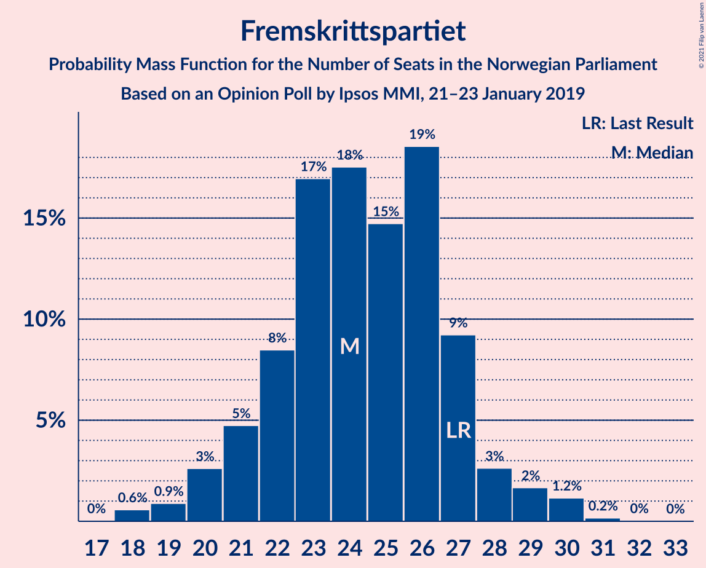
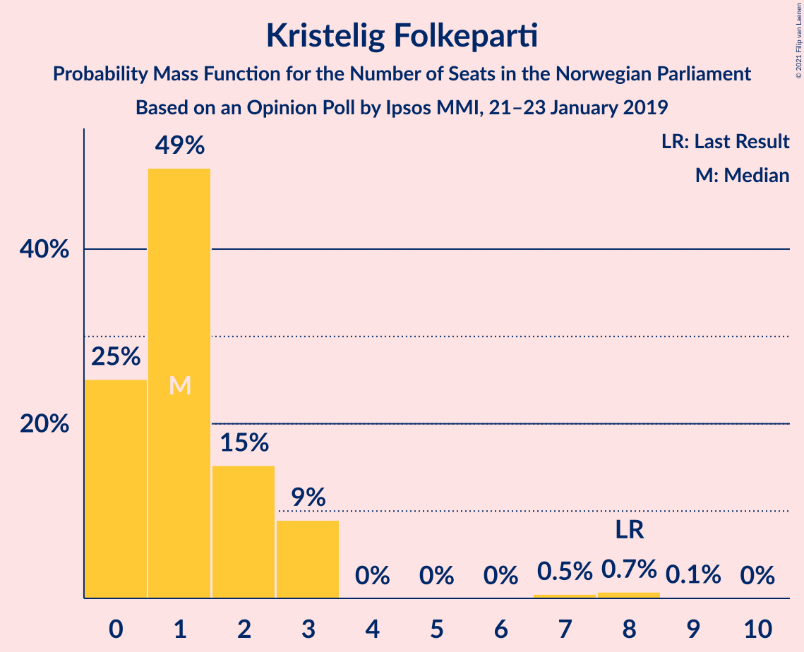
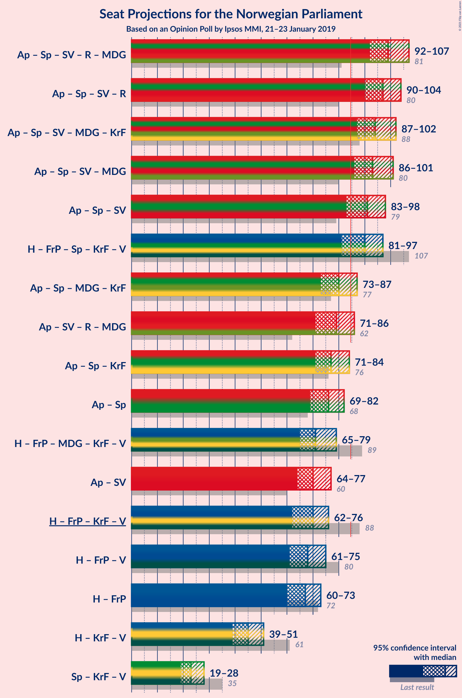
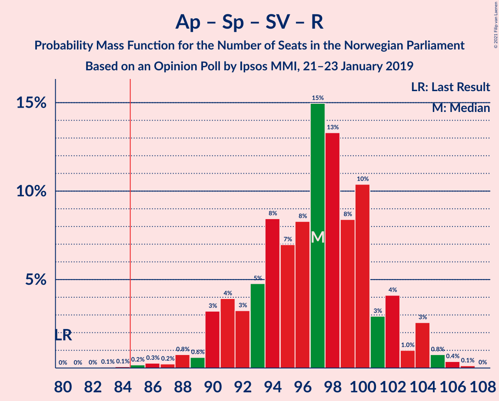
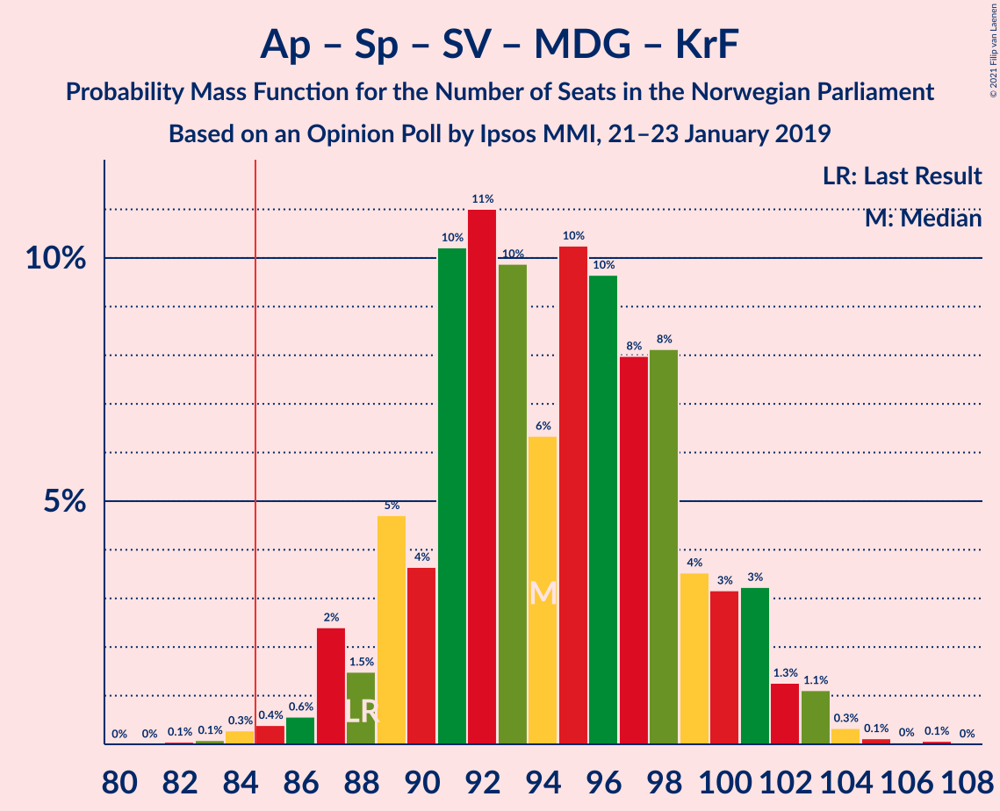
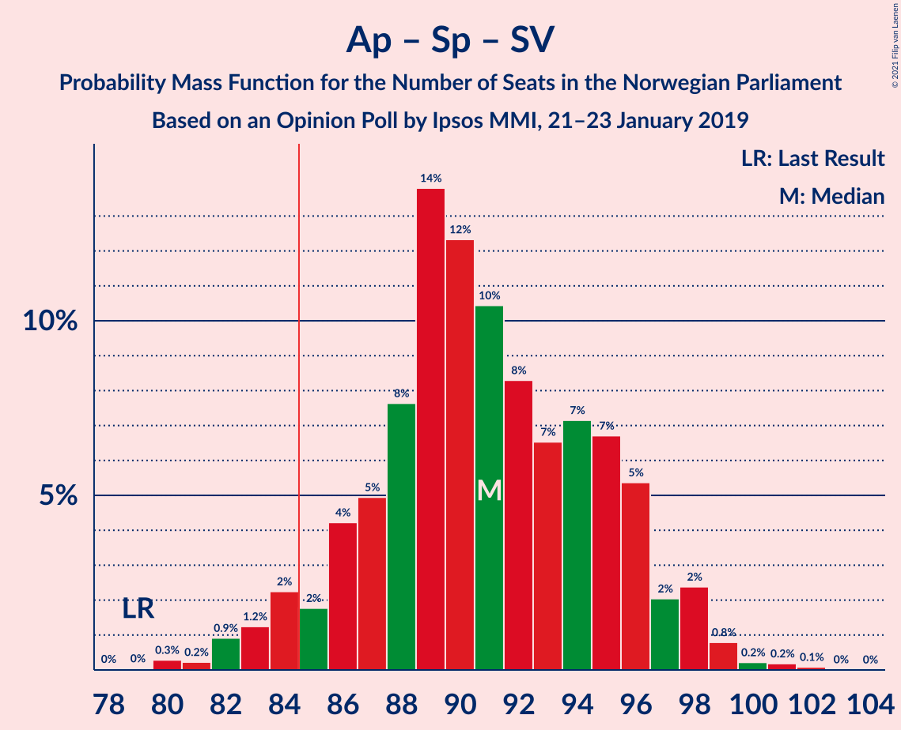
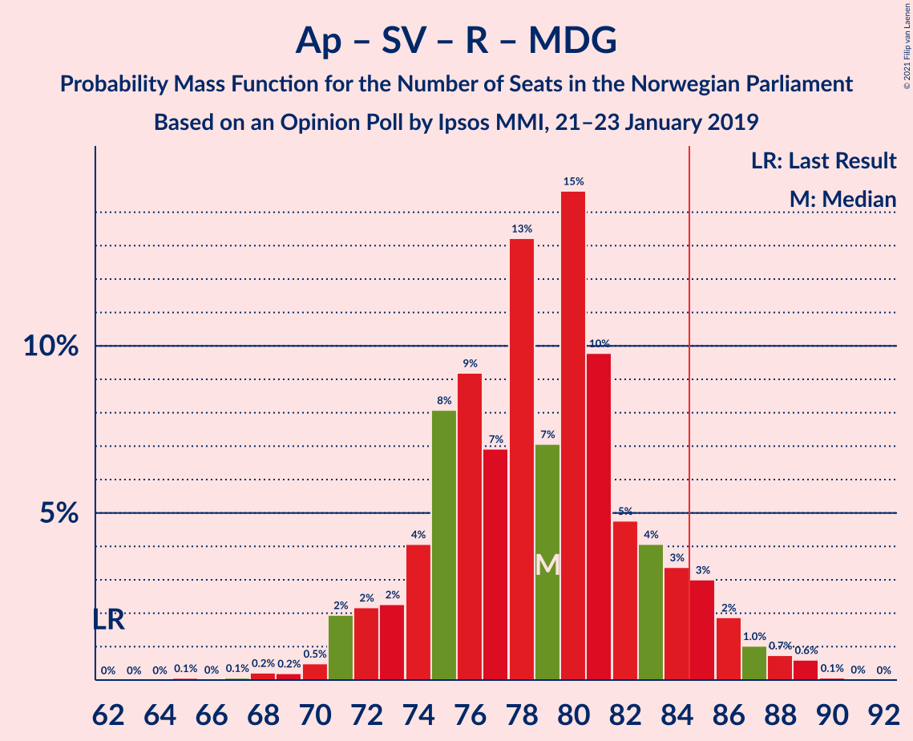
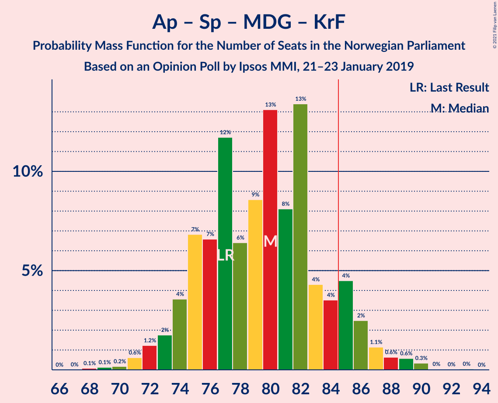

# Opinion Poll by Ipsos MMI, 21–23 January 2019

<a href="#voting-intentions">Voting Intentions</a> | <a href="#seats">Seats</a> | <a href="#coalitions">Coalitions</a> | <a href="#technical-information">Technical Information</a>

## Voting Intentions

### Confidence Intervals

| Party | Last Result | Poll Result | 80% Confidence Interval | 90% Confidence Interval | 95% Confidence Interval | 99% Confidence Interval |
|:-----:|:-----------:|:-----------:|:-----------------------:|:-----------------------:|:-----------------------:|:-----------------------:|
| Arbeiderpartiet | 27.4% | 29.8% | 28.0–31.8% |27.4–32.4% |27.0–32.9% |26.1–33.8% |
| Høyre | 25.0% | 22.8% | 21.1–24.6% |20.6–25.1% |20.2–25.6% |19.4–26.5% |
| Fremskrittspartiet | 15.2% | 13.0% | 11.7–14.6% |11.4–15.0% |11.0–15.4% |10.4–16.1% |
| Senterpartiet | 10.3% | 10.9% | 9.7–12.3% |9.4–12.7% |9.1–13.1% |8.5–13.8% |
| Sosialistisk Venstreparti | 6.0% | 8.0% | 7.0–9.3% |6.7–9.6% |6.4–10.0% |6.0–10.6% |
| Rødt | 2.4% | 4.2% | 3.4–5.1% |3.2–5.4% |3.1–5.7% |2.7–6.2% |
| Miljøpartiet De Grønne | 3.2% | 3.2% | 2.6–4.1% |2.4–4.3% |2.3–4.6% |2.0–5.0% |
| Kristelig Folkeparti | 4.2% | 2.7% | 2.1–3.5% |2.0–3.7% |1.8–3.9% |1.6–4.3% |
| Venstre | 4.4% | 2.2% | 1.7–3.0% |1.6–3.2% |1.5–3.4% |1.3–3.8% |

*Note:* The poll result column reflects the actual value used in the calculations. Published results may vary slightly, and in addition be rounded to fewer digits.

## Seats

### Confidence Intervals

| Party | Last Result | Median | 80% Confidence Interval | 90% Confidence Interval | 95% Confidence Interval | 99% Confidence Interval |
|:-----:|:-----------:|:------:|:-----------------------:|:-----------------------:|:-----------------------:|:-----------------------:|
| <a href="#arbeiderpartiet">Arbeiderpartiet</a> | 49 | 56 | 51–57 |49–57 |49–57 |47–58 |
| <a href="#høyre">Høyre</a> | 45 | 40 | 40–43 |40–43 |38–44 |36–46 |
| <a href="#fremskrittspartiet">Fremskrittspartiet</a> | 27 | 25 | 20–25 |20–28 |20–28 |20–29 |
| <a href="#senterpartiet">Senterpartiet</a> | 19 | 19 | 16–24 |16–24 |15–25 |15–25 |
| <a href="#sosialistisk-venstreparti">Sosialistisk Venstreparti</a> | 11 | 16 | 13–19 |13–19 |13–19 |12–19 |
| <a href="#rødt">Rødt</a> | 1 | 7 | 2–9 |2–10 |2–11 |1–12 |
| <a href="#miljøpartiet-de-grønne">Miljøpartiet De Grønne</a> | 1 | 2 | 1–8 |1–8 |1–8 |1–9 |
| <a href="#kristelig-folkeparti">Kristelig Folkeparti</a> | 8 | 2 | 0–3 |0–3 |0–3 |0–8 |
| <a href="#venstre">Venstre</a> | 8 | 2 | 0–2 |0–2 |0–2 |0–2 |

### Arbeiderpartiet

*For a full overview of the results for this party, see the [Arbeiderpartiet](party-arbeiderpartiet.html) page.*

| Number of Seats | Probability | Accumulated | Special Marks |
|:---------------:|:-----------:|:-----------:|:-------------:|
| 46 | 0.1% | 100% |  |
| 47 | 0.5% | 99.9% |  |
| 48 | 0.2% | 99.5% |  |
| 49 | 6% | 99.3% | Last Result |
| 50 | 2% | 94% |  |
| 51 | 7% | 92% |  |
| 52 | 0.9% | 85% |  |
| 53 | 8% | 84% |  |
| 54 | 0.3% | 77% |  |
| 55 | 20% | 76% |  |
| 56 | 13% | 56% | Median |
| 57 | 42% | 44% |  |
| 58 | 1.0% | 1.5% |  |
| 59 | 0% | 0.5% |  |
| 60 | 0% | 0.4% |  |
| 61 | 0% | 0.4% |  |
| 62 | 0.2% | 0.4% |  |
| 63 | 0% | 0.2% |  |
| 64 | 0.2% | 0.2% |  |
| 65 | 0% | 0% |  |

### Høyre

*For a full overview of the results for this party, see the [Høyre](party-høyre.html) page.*

| Number of Seats | Probability | Accumulated | Special Marks |
|:---------------:|:-----------:|:-----------:|:-------------:|
| 35 | 0.2% | 100% |  |
| 36 | 0.7% | 99.8% |  |
| 37 | 0.7% | 99.1% |  |
| 38 | 1.4% | 98% |  |
| 39 | 0.9% | 97% |  |
| 40 | 51% | 96% | Median |
| 41 | 14% | 45% |  |
| 42 | 0.1% | 31% |  |
| 43 | 27% | 31% |  |
| 44 | 3% | 4% |  |
| 45 | 1.2% | 2% | Last Result |
| 46 | 0.4% | 0.7% |  |
| 47 | 0.1% | 0.2% |  |
| 48 | 0.1% | 0.2% |  |
| 49 | 0% | 0.1% |  |
| 50 | 0% | 0.1% |  |
| 51 | 0% | 0.1% |  |
| 52 | 0% | 0% |  |

### Fremskrittspartiet

*For a full overview of the results for this party, see the [Fremskrittspartiet](party-fremskrittspartiet.html) page.*

| Number of Seats | Probability | Accumulated | Special Marks |
|:---------------:|:-----------:|:-----------:|:-------------:|
| 18 | 0.2% | 100% |  |
| 19 | 0% | 99.8% |  |
| 20 | 12% | 99.7% |  |
| 21 | 0.6% | 88% |  |
| 22 | 20% | 87% |  |
| 23 | 8% | 67% |  |
| 24 | 3% | 59% |  |
| 25 | 46% | 56% | Median |
| 26 | 1.4% | 10% |  |
| 27 | 2% | 9% | Last Result |
| 28 | 5% | 6% |  |
| 29 | 0.6% | 0.9% |  |
| 30 | 0.2% | 0.3% |  |
| 31 | 0.1% | 0.1% |  |
| 32 | 0% | 0% |  |

### Senterpartiet

*For a full overview of the results for this party, see the [Senterpartiet](party-senterpartiet.html) page.*

| Number of Seats | Probability | Accumulated | Special Marks |
|:---------------:|:-----------:|:-----------:|:-------------:|
| 15 | 3% | 100% |  |
| 16 | 20% | 97% |  |
| 17 | 0.8% | 78% |  |
| 18 | 1.1% | 77% |  |
| 19 | 51% | 76% | Last Result, Median |
| 20 | 1.5% | 24% |  |
| 21 | 0.7% | 23% |  |
| 22 | 11% | 22% |  |
| 23 | 0.5% | 11% |  |
| 24 | 7% | 10% |  |
| 25 | 3% | 3% |  |
| 26 | 0% | 0% |  |

### Sosialistisk Venstreparti

*For a full overview of the results for this party, see the [Sosialistisk Venstreparti](party-sosialistiskvenstreparti.html) page.*

| Number of Seats | Probability | Accumulated | Special Marks |
|:---------------:|:-----------:|:-----------:|:-------------:|
| 11 | 0.3% | 100% | Last Result |
| 12 | 2% | 99.7% |  |
| 13 | 8% | 98% |  |
| 14 | 27% | 90% |  |
| 15 | 12% | 63% |  |
| 16 | 4% | 51% | Median |
| 17 | 0.4% | 47% |  |
| 18 | 7% | 47% |  |
| 19 | 39% | 40% |  |
| 20 | 0% | 0% |  |

### Rødt

*For a full overview of the results for this party, see the [Rødt](party-rødt.html) page.*

| Number of Seats | Probability | Accumulated | Special Marks |
|:---------------:|:-----------:|:-----------:|:-------------:|
| 1 | 0.8% | 100% | Last Result |
| 2 | 49% | 99.2% |  |
| 3 | 0% | 50% |  |
| 4 | 0% | 50% |  |
| 5 | 0% | 50% |  |
| 6 | 0% | 50% |  |
| 7 | 0.7% | 50% | Median |
| 8 | 34% | 50% |  |
| 9 | 7% | 16% |  |
| 10 | 6% | 9% |  |
| 11 | 0.8% | 3% |  |
| 12 | 2% | 2% |  |
| 13 | 0% | 0% |  |

### Miljøpartiet De Grønne

*For a full overview of the results for this party, see the [Miljøpartiet De Grønne](party-miljøpartietdegrønne.html) page.*

| Number of Seats | Probability | Accumulated | Special Marks |
|:---------------:|:-----------:|:-----------:|:-------------:|
| 1 | 35% | 100% | Last Result |
| 2 | 49% | 65% | Median |
| 3 | 0.1% | 16% |  |
| 4 | 0.3% | 15% |  |
| 5 | 0% | 15% |  |
| 6 | 0.4% | 15% |  |
| 7 | 0.1% | 15% |  |
| 8 | 14% | 15% |  |
| 9 | 0.8% | 1.0% |  |
| 10 | 0.2% | 0.2% |  |
| 11 | 0.1% | 0.1% |  |
| 12 | 0% | 0% |  |

### Kristelig Folkeparti

*For a full overview of the results for this party, see the [Kristelig Folkeparti](party-kristeligfolkeparti.html) page.*

| Number of Seats | Probability | Accumulated | Special Marks |
|:---------------:|:-----------:|:-----------:|:-------------:|
| 0 | 12% | 100% |  |
| 1 | 36% | 88% |  |
| 2 | 3% | 52% | Median |
| 3 | 49% | 50% |  |
| 4 | 0% | 0.7% |  |
| 5 | 0% | 0.7% |  |
| 6 | 0% | 0.7% |  |
| 7 | 0.1% | 0.7% |  |
| 8 | 0.5% | 0.6% | Last Result |
| 9 | 0.2% | 0.2% |  |
| 10 | 0% | 0% |  |

### Venstre

*For a full overview of the results for this party, see the [Venstre](party-venstre.html) page.*

| Number of Seats | Probability | Accumulated | Special Marks |
|:---------------:|:-----------:|:-----------:|:-------------:|
| 0 | 11% | 100% |  |
| 1 | 22% | 89% |  |
| 2 | 67% | 67% | Median |
| 3 | 0% | 0.2% |  |
| 4 | 0% | 0.2% |  |
| 5 | 0% | 0.2% |  |
| 6 | 0% | 0.2% |  |
| 7 | 0.1% | 0.2% |  |
| 8 | 0.1% | 0.1% | Last Result |
| 9 | 0% | 0% |  |

## Coalitions

### Confidence Intervals

| Coalition | Last Result | Median | Majority? | 80% Confidence Interval | 90% Confidence Interval | 95% Confidence Interval | 99% Confidence Interval |
|:---------:|:-----------:|:------:|:---------:|:-----------------------:|:-----------------------:|:-----------------------:|:-----------------------:|
| Arbeiderpartiet – Senterpartiet – Sosialistisk Venstreparti – Rødt – Miljøpartiet De Grønne | 81 | 99 | 100% | 94–106 | 90–106 | 90–106 | 90–108 |
| Arbeiderpartiet – Senterpartiet – Sosialistisk Venstreparti – Rødt | 80 | 97 | 100% | 93–98 | 89–104 | 89–104 | 87–107 |
| Arbeiderpartiet – Senterpartiet – Sosialistisk Venstreparti – Miljøpartiet De Grønne – Kristelig Folkeparti | 88 | 98 | 99.3% | 87–100 | 87–100 | 87–100 | 84–101 |
| Arbeiderpartiet – Senterpartiet – Sosialistisk Venstreparti – Miljøpartiet De Grønne | 80 | 97 | 99.3% | 86–98 | 86–98 | 86–98 | 84–98 |
| Høyre – Fremskrittspartiet – Senterpartiet – Kristelig Folkeparti – Venstre | 107 | 89 | 67% | 82–93 | 82–95 | 82–96 | 82–98 |
| Arbeiderpartiet – Senterpartiet – Sosialistisk Venstreparti | 79 | 90 | 92% | 85–95 | 84–95 | 84–95 | 79–96 |
| Arbeiderpartiet – Sosialistisk Venstreparti – Rødt – Miljøpartiet De Grønne | 62 | 80 | 13% | 74–87 | 68–87 | 68–87 | 68–87 |
| Arbeiderpartiet – Senterpartiet – Miljøpartiet De Grønne – Kristelig Folkeparti | 77 | 81 | 2% | 73–83 | 73–83 | 73–84 | 71–86 |
| Arbeiderpartiet – Senterpartiet – Kristelig Folkeparti | 76 | 76 | 0.4% | 72–79 | 72–79 | 72–82 | 69–84 |
| Arbeiderpartiet – Senterpartiet | 68 | 75 | 0.2% | 71–77 | 71–77 | 70–79 | 66–81 |
| Høyre – Fremskrittspartiet – Miljøpartiet De Grønne – Kristelig Folkeparti – Venstre | 89 | 72 | 0% | 68–74 | 65–75 | 65–79 | 62–79 |
| Arbeiderpartiet – Sosialistisk Venstreparti | 60 | 71 | 0% | 65–76 | 62–76 | 62–76 | 62–76 |
| Høyre – Fremskrittspartiet – Kristelig Folkeparti – Venstre | 88 | 70 | 0% | 63–71 | 63–73 | 63–73 | 61–75 |
| Høyre – Fremskrittspartiet – Venstre | 80 | 67 | 0% | 63–70 | 63–70 | 63–70 | 59–72 |
| Høyre – Fremskrittspartiet | 72 | 65 | 0% | 61–68 | 61–68 | 61–69 | 57–71 |
| Høyre – Kristelig Folkeparti – Venstre | 61 | 45 | 0% | 42–46 | 41–46 | 41–47 | 40–54 |
| Senterpartiet – Kristelig Folkeparti – Venstre | 35 | 24 | 0% | 18–25 | 18–27 | 18–28 | 17–29 |

### Arbeiderpartiet – Senterpartiet – Sosialistisk Venstreparti – Rødt – Miljøpartiet De Grønne

| Number of Seats | Probability | Accumulated | Special Marks |
|:---------------:|:-----------:|:-----------:|:-------------:|
| 81 | 0% | 100% | Last Result |
| 82 | 0% | 100% |  |
| 83 | 0% | 100% |  |
| 84 | 0% | 100% |  |
| 85 | 0% | 100% | Majority |
| 86 | 0% | 100% |  |
| 87 | 0% | 100% |  |
| 88 | 0% | 100% |  |
| 89 | 0.1% | 99.9% |  |
| 90 | 6% | 99.8% |  |
| 91 | 0.4% | 94% |  |
| 92 | 0% | 94% |  |
| 93 | 0.2% | 94% |  |
| 94 | 20% | 93% |  |
| 95 | 0.1% | 73% |  |
| 96 | 7% | 73% |  |
| 97 | 1.0% | 66% |  |
| 98 | 5% | 65% |  |
| 99 | 39% | 61% |  |
| 100 | 0.1% | 21% | Median |
| 101 | 0% | 21% |  |
| 102 | 0.1% | 21% |  |
| 103 | 0% | 21% |  |
| 104 | 0.3% | 21% |  |
| 105 | 8% | 21% |  |
| 106 | 11% | 12% |  |
| 107 | 0.3% | 0.9% |  |
| 108 | 0.6% | 0.7% |  |
| 109 | 0.1% | 0.1% |  |
| 110 | 0% | 0% |  |

### Arbeiderpartiet – Senterpartiet – Sosialistisk Venstreparti – Rødt

| Number of Seats | Probability | Accumulated | Special Marks |
|:---------------:|:-----------:|:-----------:|:-------------:|
| 80 | 0% | 100% | Last Result |
| 81 | 0% | 100% |  |
| 82 | 0% | 100% |  |
| 83 | 0% | 100% |  |
| 84 | 0% | 100% |  |
| 85 | 0.4% | 100% | Majority |
| 86 | 0.1% | 99.6% |  |
| 87 | 0.2% | 99.5% |  |
| 88 | 0.1% | 99.3% |  |
| 89 | 6% | 99.2% |  |
| 90 | 3% | 93% |  |
| 91 | 0.2% | 91% |  |
| 92 | 0.2% | 91% |  |
| 93 | 20% | 90% |  |
| 94 | 5% | 71% |  |
| 95 | 2% | 65% |  |
| 96 | 3% | 63% |  |
| 97 | 40% | 60% |  |
| 98 | 11% | 20% | Median |
| 99 | 0% | 9% |  |
| 100 | 0% | 9% |  |
| 101 | 0.1% | 9% |  |
| 102 | 0.3% | 9% |  |
| 103 | 0.9% | 9% |  |
| 104 | 7% | 8% |  |
| 105 | 0.2% | 0.8% |  |
| 106 | 0% | 0.6% |  |
| 107 | 0.6% | 0.6% |  |
| 108 | 0% | 0% |  |

### Arbeiderpartiet – Senterpartiet – Sosialistisk Venstreparti – Miljøpartiet De Grønne – Kristelig Folkeparti

| Number of Seats | Probability | Accumulated | Special Marks |
|:---------------:|:-----------:|:-----------:|:-------------:|
| 83 | 0.1% | 100% |  |
| 84 | 0.6% | 99.9% |  |
| 85 | 0% | 99.3% | Majority |
| 86 | 0% | 99.3% |  |
| 87 | 19% | 99.3% |  |
| 88 | 1.0% | 80% | Last Result |
| 89 | 11% | 79% |  |
| 90 | 0.1% | 68% |  |
| 91 | 0.4% | 68% |  |
| 92 | 0.3% | 67% |  |
| 93 | 3% | 67% |  |
| 94 | 0.8% | 64% |  |
| 95 | 0.9% | 64% | Median |
| 96 | 0.4% | 63% |  |
| 97 | 10% | 62% |  |
| 98 | 11% | 53% |  |
| 99 | 1.2% | 41% |  |
| 100 | 40% | 40% |  |
| 101 | 0.2% | 0.7% |  |
| 102 | 0% | 0.4% |  |
| 103 | 0.1% | 0.4% |  |
| 104 | 0% | 0.3% |  |
| 105 | 0.1% | 0.3% |  |
| 106 | 0% | 0.2% |  |
| 107 | 0% | 0.2% |  |
| 108 | 0.2% | 0.2% |  |
| 109 | 0% | 0% |  |

### Arbeiderpartiet – Senterpartiet – Sosialistisk Venstreparti – Miljøpartiet De Grønne

| Number of Seats | Probability | Accumulated | Special Marks |
|:---------------:|:-----------:|:-----------:|:-------------:|
| 80 | 0.1% | 100% | Last Result |
| 81 | 0% | 99.9% |  |
| 82 | 0.2% | 99.9% |  |
| 83 | 0% | 99.7% |  |
| 84 | 0.4% | 99.7% |  |
| 85 | 1.0% | 99.3% | Majority |
| 86 | 25% | 98% |  |
| 87 | 0% | 74% |  |
| 88 | 6% | 74% |  |
| 89 | 0.1% | 68% |  |
| 90 | 3% | 68% |  |
| 91 | 0% | 65% |  |
| 92 | 0.8% | 65% |  |
| 93 | 2% | 64% | Median |
| 94 | 2% | 62% |  |
| 95 | 0.1% | 61% |  |
| 96 | 8% | 61% |  |
| 97 | 40% | 52% |  |
| 98 | 11% | 12% |  |
| 99 | 0% | 0.5% |  |
| 100 | 0.2% | 0.5% |  |
| 101 | 0% | 0.3% |  |
| 102 | 0% | 0.3% |  |
| 103 | 0% | 0.2% |  |
| 104 | 0.1% | 0.2% |  |
| 105 | 0.1% | 0.2% |  |
| 106 | 0% | 0% |  |

### Høyre – Fremskrittspartiet – Senterpartiet – Kristelig Folkeparti – Venstre

| Number of Seats | Probability | Accumulated | Special Marks |
|:---------------:|:-----------:|:-----------:|:-------------:|
| 79 | 0.1% | 100% |  |
| 80 | 0.1% | 99.9% |  |
| 81 | 0.2% | 99.8% |  |
| 82 | 11% | 99.6% |  |
| 83 | 20% | 88% |  |
| 84 | 0.8% | 68% |  |
| 85 | 1.1% | 67% | Majority |
| 86 | 2% | 66% |  |
| 87 | 0.3% | 64% |  |
| 88 | 7% | 63% | Median |
| 89 | 39% | 57% |  |
| 90 | 1.5% | 17% |  |
| 91 | 0.7% | 16% |  |
| 92 | 0.3% | 15% |  |
| 93 | 6% | 15% |  |
| 94 | 0.6% | 9% |  |
| 95 | 5% | 8% |  |
| 96 | 2% | 3% |  |
| 97 | 0% | 1.3% |  |
| 98 | 1.1% | 1.3% |  |
| 99 | 0.1% | 0.2% |  |
| 100 | 0% | 0% |  |
| 101 | 0% | 0% |  |
| 102 | 0% | 0% |  |
| 103 | 0% | 0% |  |
| 104 | 0% | 0% |  |
| 105 | 0% | 0% |  |
| 106 | 0% | 0% |  |
| 107 | 0% | 0% | Last Result |

### Arbeiderpartiet – Senterpartiet – Sosialistisk Venstreparti

| Number of Seats | Probability | Accumulated | Special Marks |
|:---------------:|:-----------:|:-----------:|:-------------:|
| 78 | 0.4% | 100% |  |
| 79 | 0.1% | 99.6% | Last Result |
| 80 | 0.2% | 99.4% |  |
| 81 | 0% | 99.3% |  |
| 82 | 0% | 99.3% |  |
| 83 | 0.9% | 99.3% |  |
| 84 | 6% | 98% |  |
| 85 | 20% | 92% | Majority |
| 86 | 0% | 73% |  |
| 87 | 6% | 73% |  |
| 88 | 4% | 67% |  |
| 89 | 1.1% | 62% |  |
| 90 | 12% | 61% |  |
| 91 | 1.0% | 50% | Median |
| 92 | 0.6% | 49% |  |
| 93 | 1.1% | 48% |  |
| 94 | 0.1% | 47% |  |
| 95 | 46% | 47% |  |
| 96 | 0.6% | 0.9% |  |
| 97 | 0% | 0.3% |  |
| 98 | 0% | 0.2% |  |
| 99 | 0% | 0.2% |  |
| 100 | 0% | 0.2% |  |
| 101 | 0% | 0.2% |  |
| 102 | 0% | 0.2% |  |
| 103 | 0.2% | 0.2% |  |
| 104 | 0% | 0% |  |

### Arbeiderpartiet – Sosialistisk Venstreparti – Rødt – Miljøpartiet De Grønne

| Number of Seats | Probability | Accumulated | Special Marks |
|:---------------:|:-----------:|:-----------:|:-------------:|
| 62 | 0% | 100% | Last Result |
| 63 | 0% | 100% |  |
| 64 | 0% | 100% |  |
| 65 | 0% | 100% |  |
| 66 | 0% | 100% |  |
| 67 | 0% | 100% |  |
| 68 | 6% | 100% |  |
| 69 | 0% | 94% |  |
| 70 | 0.1% | 94% |  |
| 71 | 1.1% | 94% |  |
| 72 | 0% | 93% |  |
| 73 | 2% | 93% |  |
| 74 | 5% | 91% |  |
| 75 | 0.6% | 86% |  |
| 76 | 0.5% | 85% |  |
| 77 | 0.5% | 84% |  |
| 78 | 20% | 84% |  |
| 79 | 1.5% | 64% |  |
| 80 | 39% | 62% |  |
| 81 | 7% | 23% | Median |
| 82 | 0.1% | 16% |  |
| 83 | 2% | 16% |  |
| 84 | 0.6% | 14% |  |
| 85 | 0.8% | 13% | Majority |
| 86 | 0.9% | 12% |  |
| 87 | 11% | 12% |  |
| 88 | 0.2% | 0.3% |  |
| 89 | 0.1% | 0.2% |  |
| 90 | 0.1% | 0.1% |  |
| 91 | 0% | 0% |  |

### Arbeiderpartiet – Senterpartiet – Miljøpartiet De Grønne – Kristelig Folkeparti

| Number of Seats | Probability | Accumulated | Special Marks |
|:---------------:|:-----------:|:-----------:|:-------------:|
| 70 | 0.5% | 100% |  |
| 71 | 0.1% | 99.5% |  |
| 72 | 0.4% | 99.4% |  |
| 73 | 20% | 99.0% |  |
| 74 | 0.1% | 79% |  |
| 75 | 7% | 79% |  |
| 76 | 5% | 72% |  |
| 77 | 3% | 67% | Last Result |
| 78 | 0% | 64% |  |
| 79 | 7% | 64% | Median |
| 80 | 0.8% | 58% |  |
| 81 | 39% | 57% |  |
| 82 | 0.8% | 17% |  |
| 83 | 12% | 17% |  |
| 84 | 3% | 5% |  |
| 85 | 1.2% | 2% | Majority |
| 86 | 0.4% | 0.9% |  |
| 87 | 0.1% | 0.4% |  |
| 88 | 0% | 0.3% |  |
| 89 | 0% | 0.3% |  |
| 90 | 0.2% | 0.2% |  |
| 91 | 0% | 0.1% |  |
| 92 | 0.1% | 0.1% |  |
| 93 | 0% | 0% |  |

### Arbeiderpartiet – Senterpartiet – Kristelig Folkeparti

| Number of Seats | Probability | Accumulated | Special Marks |
|:---------------:|:-----------:|:-----------:|:-------------:|
| 64 | 0.4% | 100% |  |
| 65 | 0% | 99.6% |  |
| 66 | 0% | 99.6% |  |
| 67 | 0% | 99.6% |  |
| 68 | 0% | 99.5% |  |
| 69 | 0.1% | 99.5% |  |
| 70 | 0.1% | 99.4% |  |
| 71 | 1.3% | 99.3% |  |
| 72 | 20% | 98% |  |
| 73 | 1.1% | 78% |  |
| 74 | 11% | 77% |  |
| 75 | 14% | 66% |  |
| 76 | 2% | 52% | Last Result |
| 77 | 0% | 50% | Median |
| 78 | 7% | 50% |  |
| 79 | 39% | 43% |  |
| 80 | 0.9% | 4% |  |
| 81 | 0% | 3% |  |
| 82 | 0.8% | 3% |  |
| 83 | 0.6% | 2% |  |
| 84 | 1.2% | 2% |  |
| 85 | 0.2% | 0.4% | Majority |
| 86 | 0% | 0.2% |  |
| 87 | 0.1% | 0.2% |  |
| 88 | 0.1% | 0.1% |  |
| 89 | 0% | 0% |  |

### Arbeiderpartiet – Senterpartiet

| Number of Seats | Probability | Accumulated | Special Marks |
|:---------------:|:-----------:|:-----------:|:-------------:|
| 64 | 0.4% | 100% |  |
| 65 | 0% | 99.6% |  |
| 66 | 0.1% | 99.6% |  |
| 67 | 0.1% | 99.4% |  |
| 68 | 0% | 99.3% | Last Result |
| 69 | 0.2% | 99.3% |  |
| 70 | 2% | 99.1% |  |
| 71 | 25% | 97% |  |
| 72 | 2% | 72% |  |
| 73 | 7% | 70% |  |
| 74 | 0.6% | 63% |  |
| 75 | 13% | 63% | Median |
| 76 | 39% | 49% |  |
| 77 | 7% | 10% |  |
| 78 | 0.8% | 3% |  |
| 79 | 0.3% | 3% |  |
| 80 | 0.4% | 2% |  |
| 81 | 2% | 2% |  |
| 82 | 0% | 0.2% |  |
| 83 | 0% | 0.2% |  |
| 84 | 0% | 0.2% |  |
| 85 | 0.1% | 0.2% | Majority |
| 86 | 0% | 0% |  |

### Høyre – Fremskrittspartiet – Miljøpartiet De Grønne – Kristelig Folkeparti – Venstre

| Number of Seats | Probability | Accumulated | Special Marks |
|:---------------:|:-----------:|:-----------:|:-------------:|
| 61 | 0.1% | 100% |  |
| 62 | 0.6% | 99.9% |  |
| 63 | 0% | 99.4% |  |
| 64 | 0.2% | 99.4% |  |
| 65 | 7% | 99.1% |  |
| 66 | 0.9% | 92% |  |
| 67 | 0.6% | 91% |  |
| 68 | 20% | 91% |  |
| 69 | 0.1% | 71% |  |
| 70 | 0.2% | 71% |  |
| 71 | 11% | 71% | Median |
| 72 | 46% | 60% |  |
| 73 | 3% | 14% |  |
| 74 | 2% | 11% |  |
| 75 | 5% | 9% |  |
| 76 | 0.5% | 4% |  |
| 77 | 0.1% | 3% |  |
| 78 | 0.2% | 3% |  |
| 79 | 3% | 3% |  |
| 80 | 0% | 0.4% |  |
| 81 | 0.1% | 0.4% |  |
| 82 | 0.2% | 0.3% |  |
| 83 | 0.1% | 0.1% |  |
| 84 | 0% | 0% |  |
| 85 | 0% | 0% | Majority |
| 86 | 0% | 0% |  |
| 87 | 0% | 0% |  |
| 88 | 0% | 0% |  |
| 89 | 0% | 0% | Last Result |

### Arbeiderpartiet – Sosialistisk Venstreparti

| Number of Seats | Probability | Accumulated | Special Marks |
|:---------------:|:-----------:|:-----------:|:-------------:|
| 60 | 0.1% | 100% | Last Result |
| 61 | 0.2% | 99.9% |  |
| 62 | 5% | 99.7% |  |
| 63 | 2% | 94% |  |
| 64 | 0.1% | 92% |  |
| 65 | 8% | 92% |  |
| 66 | 0.5% | 85% |  |
| 67 | 0.5% | 84% |  |
| 68 | 1.2% | 84% |  |
| 69 | 20% | 83% |  |
| 70 | 0.2% | 62% |  |
| 71 | 19% | 62% |  |
| 72 | 0.6% | 43% | Median |
| 73 | 3% | 42% |  |
| 74 | 0% | 40% |  |
| 75 | 0% | 40% |  |
| 76 | 39% | 40% |  |
| 77 | 0% | 0.4% |  |
| 78 | 0.1% | 0.4% |  |
| 79 | 0.1% | 0.3% |  |
| 80 | 0% | 0.2% |  |
| 81 | 0% | 0.2% |  |
| 82 | 0.1% | 0.1% |  |
| 83 | 0% | 0% |  |

### Høyre – Fremskrittspartiet – Kristelig Folkeparti – Venstre

| Number of Seats | Probability | Accumulated | Special Marks |
|:---------------:|:-----------:|:-----------:|:-------------:|
| 60 | 0.1% | 100% |  |
| 61 | 0.6% | 99.8% |  |
| 62 | 0.3% | 99.2% |  |
| 63 | 11% | 99.0% |  |
| 64 | 8% | 88% |  |
| 65 | 0.4% | 79% |  |
| 66 | 0.2% | 79% |  |
| 67 | 20% | 79% |  |
| 68 | 0.2% | 59% |  |
| 69 | 0.1% | 59% | Median |
| 70 | 40% | 59% |  |
| 71 | 11% | 19% |  |
| 72 | 1.0% | 9% |  |
| 73 | 7% | 7% |  |
| 74 | 0.1% | 1.0% |  |
| 75 | 0.4% | 0.8% |  |
| 76 | 0.2% | 0.4% |  |
| 77 | 0% | 0.2% |  |
| 78 | 0% | 0.2% |  |
| 79 | 0% | 0.2% |  |
| 80 | 0.1% | 0.2% |  |
| 81 | 0% | 0% |  |
| 82 | 0% | 0% |  |
| 83 | 0% | 0% |  |
| 84 | 0% | 0% |  |
| 85 | 0% | 0% | Majority |
| 86 | 0% | 0% |  |
| 87 | 0% | 0% |  |
| 88 | 0% | 0% | Last Result |

### Høyre – Fremskrittspartiet – Venstre

| Number of Seats | Probability | Accumulated | Special Marks |
|:---------------:|:-----------:|:-----------:|:-------------:|
| 58 | 0% | 100% |  |
| 59 | 0.9% | 99.9% |  |
| 60 | 0% | 99.1% |  |
| 61 | 0.2% | 99.0% |  |
| 62 | 0.8% | 98.8% |  |
| 63 | 19% | 98% |  |
| 64 | 0.2% | 79% |  |
| 65 | 0.2% | 79% |  |
| 66 | 19% | 78% |  |
| 67 | 40% | 59% | Median |
| 68 | 2% | 19% |  |
| 69 | 2% | 17% |  |
| 70 | 15% | 15% |  |
| 71 | 0% | 0.7% |  |
| 72 | 0.2% | 0.6% |  |
| 73 | 0.1% | 0.5% |  |
| 74 | 0.2% | 0.4% |  |
| 75 | 0% | 0.2% |  |
| 76 | 0% | 0.2% |  |
| 77 | 0.1% | 0.2% |  |
| 78 | 0% | 0% |  |
| 79 | 0% | 0% |  |
| 80 | 0% | 0% | Last Result |

### Høyre – Fremskrittspartiet

| Number of Seats | Probability | Accumulated | Special Marks |
|:---------------:|:-----------:|:-----------:|:-------------:|
| 57 | 0.8% | 100% |  |
| 58 | 0% | 99.2% |  |
| 59 | 0.1% | 99.2% |  |
| 60 | 0.3% | 99.0% |  |
| 61 | 13% | 98.8% |  |
| 62 | 0.2% | 86% |  |
| 63 | 7% | 85% |  |
| 64 | 0.1% | 78% |  |
| 65 | 59% | 78% | Median |
| 66 | 0% | 20% |  |
| 67 | 1.1% | 20% |  |
| 68 | 16% | 18% |  |
| 69 | 2% | 3% |  |
| 70 | 0.4% | 0.9% |  |
| 71 | 0.1% | 0.5% |  |
| 72 | 0.1% | 0.4% | Last Result |
| 73 | 0.2% | 0.2% |  |
| 74 | 0% | 0.1% |  |
| 75 | 0% | 0.1% |  |
| 76 | 0% | 0.1% |  |
| 77 | 0% | 0% |  |

### Høyre – Kristelig Folkeparti – Venstre

| Number of Seats | Probability | Accumulated | Special Marks |
|:---------------:|:-----------:|:-----------:|:-------------:|
| 37 | 0.1% | 100% |  |
| 38 | 0.1% | 99.9% |  |
| 39 | 0.1% | 99.8% |  |
| 40 | 0.6% | 99.7% |  |
| 41 | 8% | 99.0% |  |
| 42 | 1.4% | 91% |  |
| 43 | 12% | 89% |  |
| 44 | 2% | 78% | Median |
| 45 | 64% | 76% |  |
| 46 | 8% | 12% |  |
| 47 | 2% | 4% |  |
| 48 | 0% | 2% |  |
| 49 | 1.1% | 2% |  |
| 50 | 0% | 0.9% |  |
| 51 | 0.1% | 0.9% |  |
| 52 | 0.1% | 0.7% |  |
| 53 | 0.1% | 0.6% |  |
| 54 | 0.3% | 0.5% |  |
| 55 | 0.2% | 0.2% |  |
| 56 | 0% | 0% |  |
| 57 | 0% | 0% |  |
| 58 | 0% | 0% |  |
| 59 | 0% | 0% |  |
| 60 | 0% | 0% |  |
| 61 | 0% | 0% | Last Result |

### Senterpartiet – Kristelig Folkeparti – Venstre

| Number of Seats | Probability | Accumulated | Special Marks |
|:---------------:|:-----------:|:-----------:|:-------------:|
| 17 | 0.6% | 100% |  |
| 18 | 22% | 99.4% |  |
| 19 | 0.2% | 78% |  |
| 20 | 0.1% | 77% |  |
| 21 | 12% | 77% |  |
| 22 | 1.0% | 65% |  |
| 23 | 0.9% | 64% | Median |
| 24 | 41% | 63% |  |
| 25 | 13% | 23% |  |
| 26 | 0.3% | 10% |  |
| 27 | 5% | 9% |  |
| 28 | 2% | 4% |  |
| 29 | 2% | 2% |  |
| 30 | 0.1% | 0.3% |  |
| 31 | 0.1% | 0.2% |  |
| 32 | 0.1% | 0.1% |  |
| 33 | 0% | 0% |  |
| 34 | 0% | 0% |  |
| 35 | 0% | 0% | Last Result |

## Technical Information

### Opinion Poll

+ **Polling firm:** Ipsos MMI
+ **Commissioner(s):** —
+ **Fieldwork period:** 21–23 January 2019

### Calculations

+ **Sample size:** 935
+ **Simulations done:** 8,192
+ **Error estimate:** 4.01%

