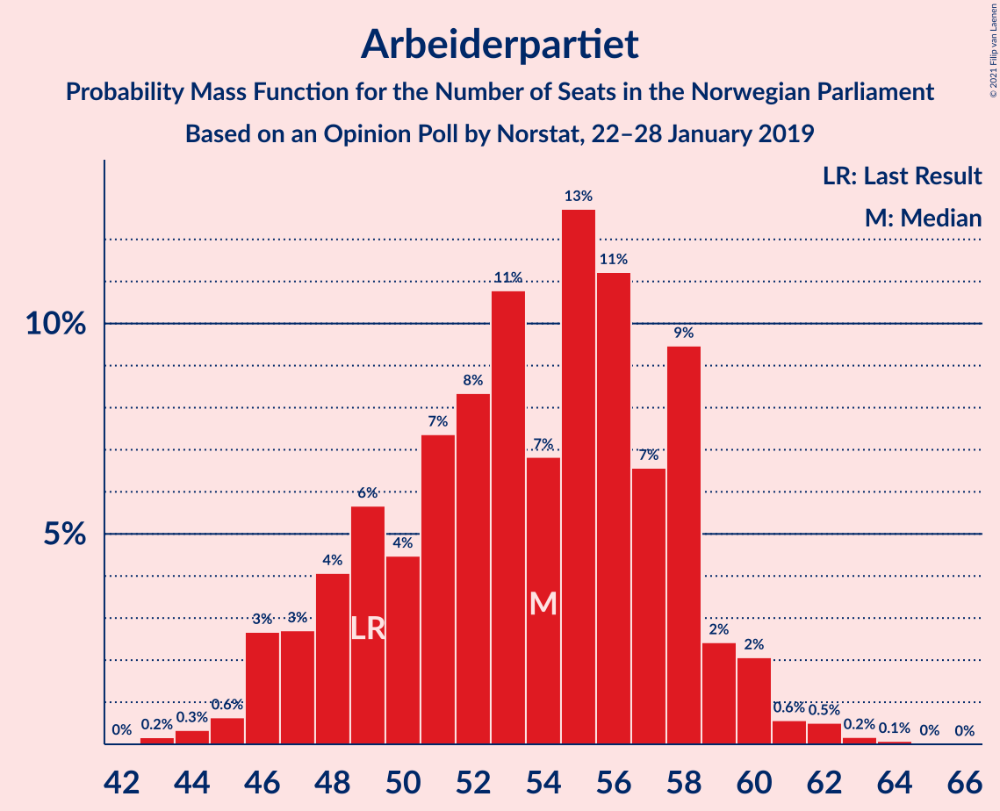
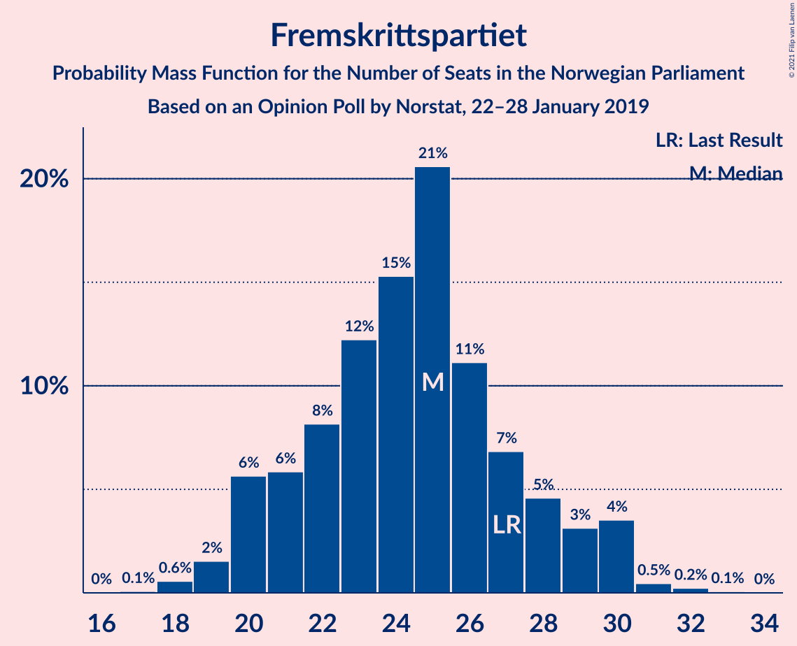
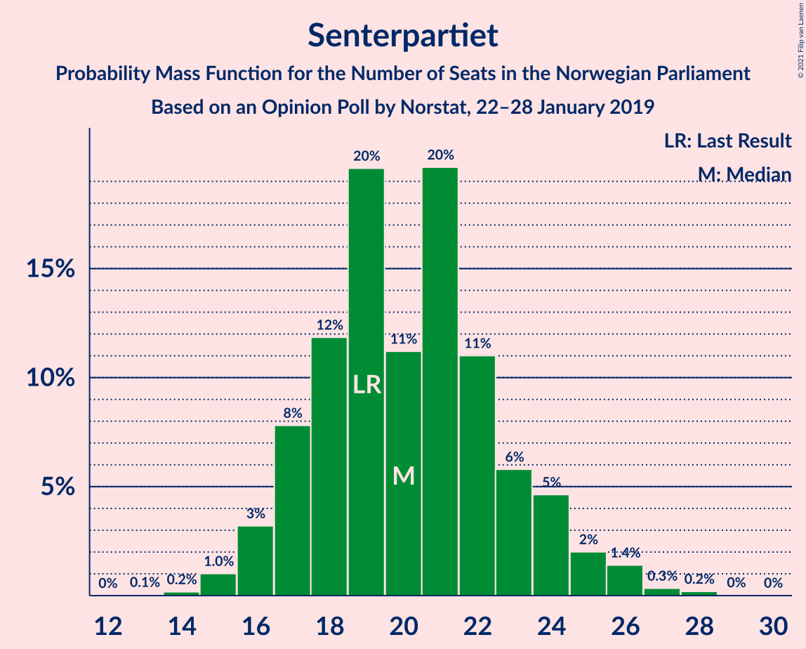
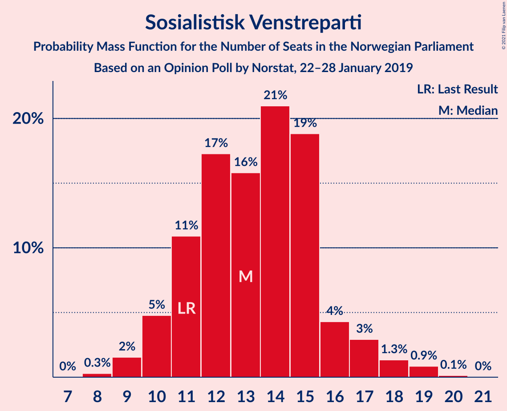
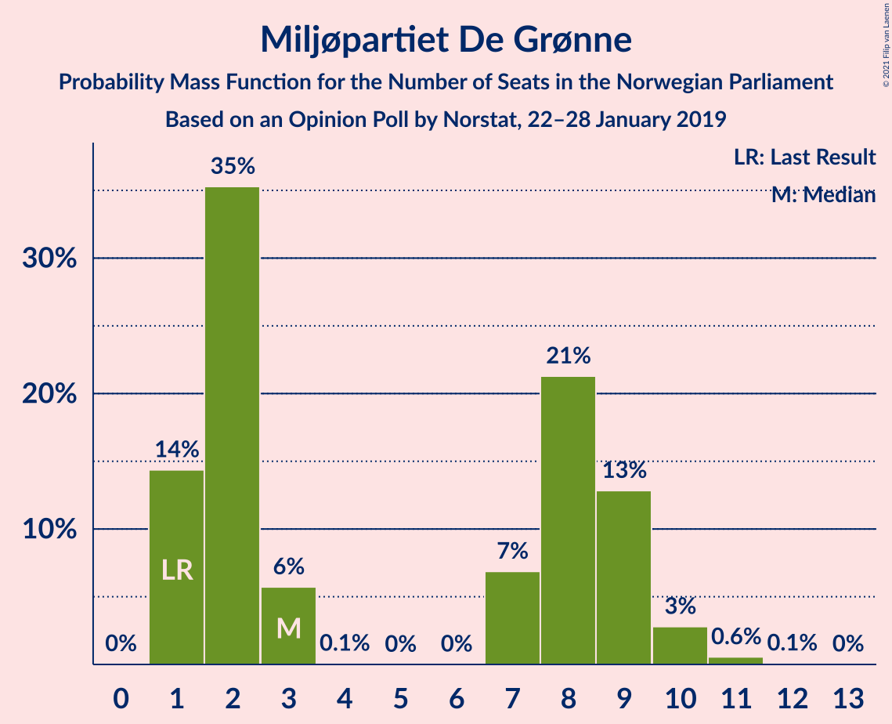
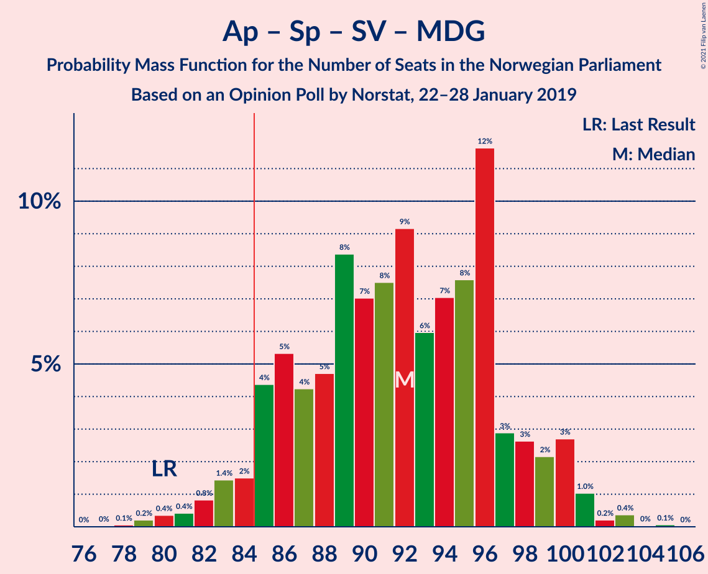
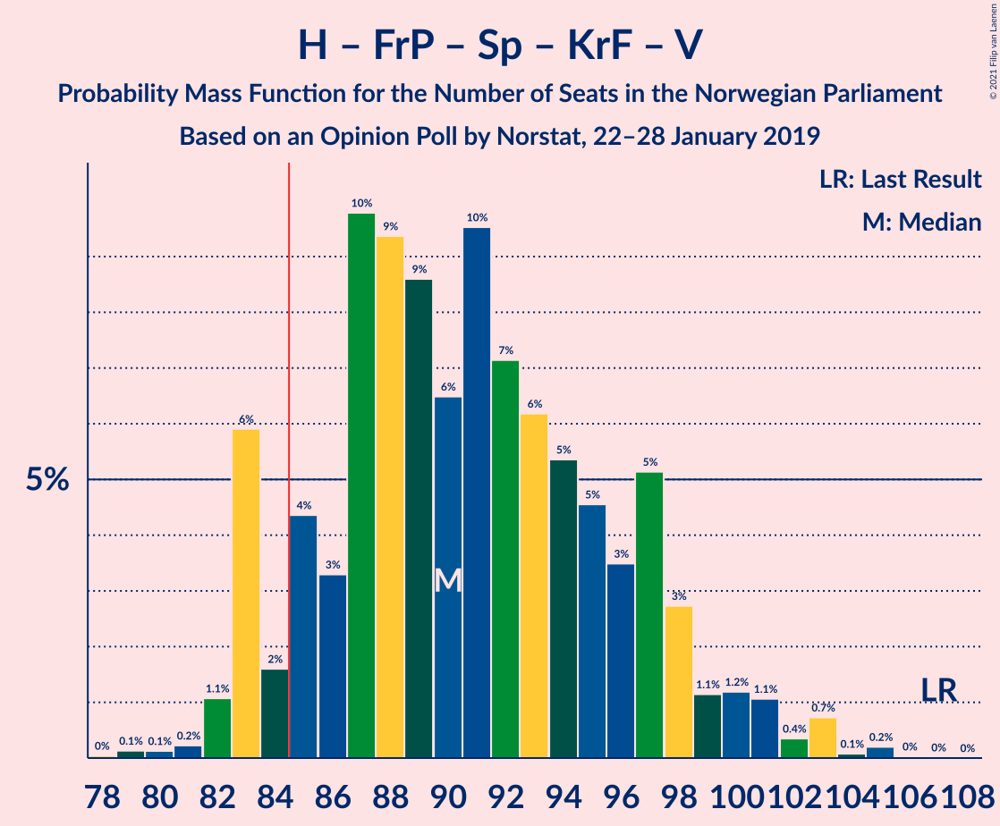
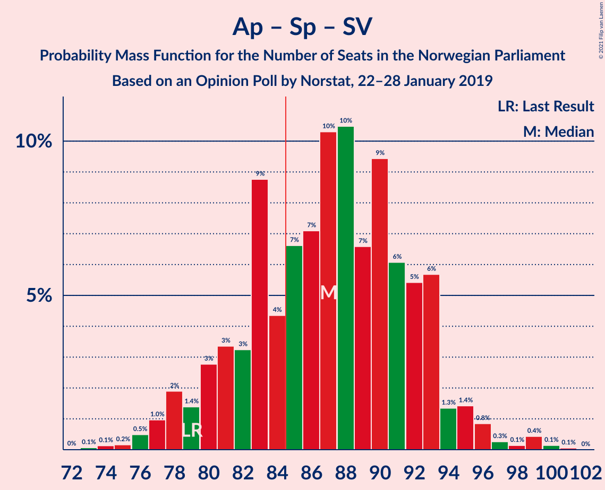
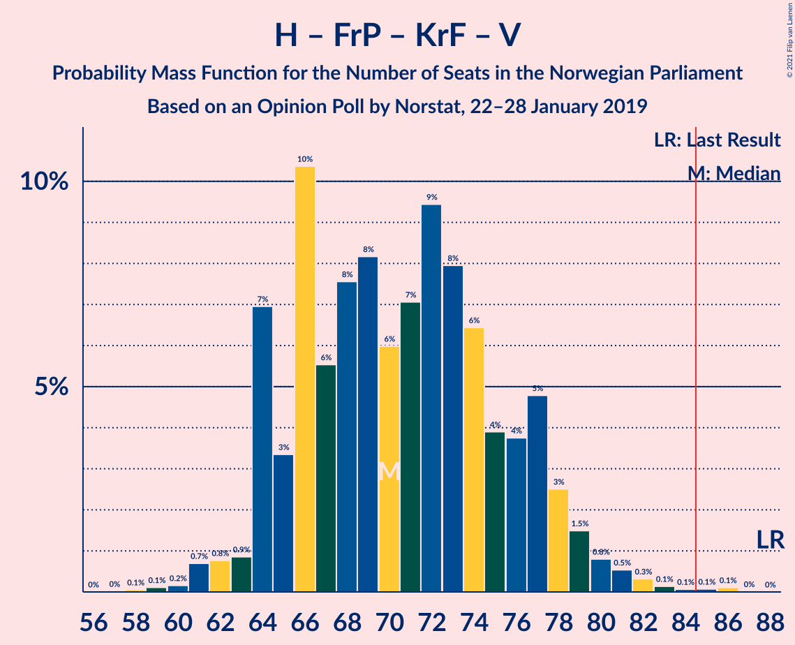

# Opinion Poll by Norstat, 22–28 January 2019

<a href="#voting-intentions">Voting Intentions</a> | <a href="#seats">Seats</a> | <a href="#coalitions">Coalitions</a> | <a href="#technical-information">Technical Information</a>

## Voting Intentions

### Confidence Intervals

| Party | Last Result | Poll Result | 80% Confidence Interval | 90% Confidence Interval | 95% Confidence Interval | 99% Confidence Interval |
|:-----:|:-----------:|:-----------:|:-----------------------:|:-----------------------:|:-----------------------:|:-----------------------:|
| Arbeiderpartiet | 27.4% | 29.1% | 26.9–31.4% |26.3–32.0% |25.8–32.6% |24.8–33.7% |
| Høyre | 25.0% | 22.4% | 20.5–24.6% |19.9–25.2% |19.5–25.7% |18.6–26.7% |
| Fremskrittspartiet | 15.2% | 13.5% | 11.9–15.3% |11.5–15.8% |11.1–16.2% |10.4–17.1% |
| Senterpartiet | 10.3% | 11.1% | 9.7–12.8% |9.3–13.3% |9.0–13.7% |8.4–14.6% |
| Sosialistisk Venstreparti | 6.0% | 7.2% | 6.1–8.7% |5.8–9.1% |5.5–9.4% |5.0–10.2% |
| Rødt | 2.4% | 4.3% | 3.5–5.5% |3.2–5.8% |3.1–6.1% |2.7–6.8% |
| Miljøpartiet De Grønne | 3.2% | 3.8% | 3.0–4.9% |2.8–5.2% |2.6–5.5% |2.3–6.0% |
| Kristelig Folkeparti | 4.2% | 3.5% | 2.7–4.5% |2.5–4.8% |2.3–5.1% |2.0–5.7% |
| Venstre | 4.4% | 2.7% | 2.1–3.7% |1.9–4.0% |1.8–4.3% |1.5–4.8% |

*Note:* The poll result column reflects the actual value used in the calculations. Published results may vary slightly, and in addition be rounded to fewer digits.

## Seats

### Confidence Intervals

| Party | Last Result | Median | 80% Confidence Interval | 90% Confidence Interval | 95% Confidence Interval | 99% Confidence Interval |
|:-----:|:-----------:|:------:|:-----------------------:|:-----------------------:|:-----------------------:|:-----------------------:|
| <a href="#arbeiderpartiet">Arbeiderpartiet</a> | 49 | 53 | 49–57 |48–59 |47–60 |45–61 |
| <a href="#høyre">Høyre</a> | 45 | 40 | 36–45 |36–46 |35–49 |33–49 |
| <a href="#fremskrittspartiet">Fremskrittspartiet</a> | 27 | 25 | 22–28 |20–30 |19–30 |19–31 |
| <a href="#senterpartiet">Senterpartiet</a> | 19 | 19 | 17–23 |16–23 |16–26 |15–26 |
| <a href="#sosialistisk-venstreparti">Sosialistisk Venstreparti</a> | 11 | 13 | 10–15 |10–16 |10–17 |9–19 |
| <a href="#rødt">Rødt</a> | 1 | 8 | 2–10 |2–10 |2–11 |1–12 |
| <a href="#miljøpartiet-de-grønne">Miljøpartiet De Grønne</a> | 1 | 8 | 1–9 |1–9 |1–9 |1–11 |
| <a href="#kristelig-folkeparti">Kristelig Folkeparti</a> | 8 | 3 | 1–8 |1–8 |1–9 |0–10 |
| <a href="#venstre">Venstre</a> | 8 | 2 | 1–2 |1–7 |1–8 |0–8 |

### Arbeiderpartiet

*For a full overview of the results for this party, see the [Arbeiderpartiet](party-arbeiderpartiet.html) page.*

| Number of Seats | Probability | Accumulated | Special Marks |
|:---------------:|:-----------:|:-----------:|:-------------:|
| 43 | 0.1% | 100% |  |
| 44 | 0.3% | 99.9% |  |
| 45 | 0.7% | 99.6% |  |
| 46 | 1.4% | 99.0% |  |
| 47 | 2% | 98% |  |
| 48 | 3% | 96% |  |
| 49 | 10% | 93% | Last Result |
| 50 | 2% | 83% |  |
| 51 | 7% | 81% |  |
| 52 | 14% | 74% |  |
| 53 | 16% | 60% | Median |
| 54 | 12% | 44% |  |
| 55 | 4% | 32% |  |
| 56 | 11% | 28% |  |
| 57 | 9% | 17% |  |
| 58 | 2% | 8% |  |
| 59 | 3% | 5% |  |
| 60 | 1.0% | 3% |  |
| 61 | 1.2% | 2% |  |
| 62 | 0.1% | 0.4% |  |
| 63 | 0.3% | 0.4% |  |
| 64 | 0.1% | 0.1% |  |
| 65 | 0% | 0% |  |

### Høyre

*For a full overview of the results for this party, see the [Høyre](party-høyre.html) page.*

| Number of Seats | Probability | Accumulated | Special Marks |
|:---------------:|:-----------:|:-----------:|:-------------:|
| 30 | 0.1% | 100% |  |
| 31 | 0% | 99.9% |  |
| 32 | 0.2% | 99.9% |  |
| 33 | 0.3% | 99.7% |  |
| 34 | 0.8% | 99.4% |  |
| 35 | 2% | 98.6% |  |
| 36 | 10% | 97% |  |
| 37 | 6% | 87% |  |
| 38 | 11% | 81% |  |
| 39 | 9% | 70% |  |
| 40 | 13% | 61% | Median |
| 41 | 6% | 48% |  |
| 42 | 13% | 42% |  |
| 43 | 14% | 29% |  |
| 44 | 3% | 15% |  |
| 45 | 3% | 11% | Last Result |
| 46 | 3% | 8% |  |
| 47 | 0.5% | 5% |  |
| 48 | 0.1% | 4% |  |
| 49 | 4% | 4% |  |
| 50 | 0.2% | 0.2% |  |
| 51 | 0% | 0% |  |

### Fremskrittspartiet

*For a full overview of the results for this party, see the [Fremskrittspartiet](party-fremskrittspartiet.html) page.*

| Number of Seats | Probability | Accumulated | Special Marks |
|:---------------:|:-----------:|:-----------:|:-------------:|
| 17 | 0.1% | 100% |  |
| 18 | 0.3% | 99.9% |  |
| 19 | 2% | 99.6% |  |
| 20 | 3% | 97% |  |
| 21 | 4% | 95% |  |
| 22 | 7% | 91% |  |
| 23 | 10% | 84% |  |
| 24 | 20% | 75% |  |
| 25 | 27% | 55% | Median |
| 26 | 9% | 28% |  |
| 27 | 7% | 18% | Last Result |
| 28 | 4% | 11% |  |
| 29 | 2% | 8% |  |
| 30 | 5% | 6% |  |
| 31 | 0.8% | 1.0% |  |
| 32 | 0.1% | 0.2% |  |
| 33 | 0% | 0% |  |

### Senterpartiet

*For a full overview of the results for this party, see the [Senterpartiet](party-senterpartiet.html) page.*

| Number of Seats | Probability | Accumulated | Special Marks |
|:---------------:|:-----------:|:-----------:|:-------------:|
| 14 | 0.2% | 100% |  |
| 15 | 2% | 99.8% |  |
| 16 | 3% | 98% |  |
| 17 | 6% | 95% |  |
| 18 | 22% | 88% |  |
| 19 | 18% | 67% | Last Result, Median |
| 20 | 12% | 49% |  |
| 21 | 17% | 37% |  |
| 22 | 5% | 20% |  |
| 23 | 11% | 15% |  |
| 24 | 0.9% | 5% |  |
| 25 | 1.1% | 4% |  |
| 26 | 3% | 3% |  |
| 27 | 0.1% | 0.2% |  |
| 28 | 0.1% | 0.1% |  |
| 29 | 0% | 0% |  |

### Sosialistisk Venstreparti

*For a full overview of the results for this party, see the [Sosialistisk Venstreparti](party-sosialistiskvenstreparti.html) page.*

| Number of Seats | Probability | Accumulated | Special Marks |
|:---------------:|:-----------:|:-----------:|:-------------:|
| 8 | 0.1% | 100% |  |
| 9 | 1.0% | 99.8% |  |
| 10 | 9% | 98.8% |  |
| 11 | 12% | 89% | Last Result |
| 12 | 13% | 78% |  |
| 13 | 15% | 64% | Median |
| 14 | 32% | 50% |  |
| 15 | 12% | 17% |  |
| 16 | 2% | 6% |  |
| 17 | 2% | 4% |  |
| 18 | 1.0% | 2% |  |
| 19 | 0.6% | 0.7% |  |
| 20 | 0% | 0.1% |  |
| 21 | 0% | 0% |  |

### Rødt

*For a full overview of the results for this party, see the [Rødt](party-rødt.html) page.*

| Number of Seats | Probability | Accumulated | Special Marks |
|:---------------:|:-----------:|:-----------:|:-------------:|
| 1 | 1.0% | 100% | Last Result |
| 2 | 42% | 99.0% |  |
| 3 | 0% | 57% |  |
| 4 | 0% | 57% |  |
| 5 | 0% | 57% |  |
| 6 | 0% | 57% |  |
| 7 | 2% | 57% |  |
| 8 | 22% | 55% | Median |
| 9 | 11% | 33% |  |
| 10 | 17% | 22% |  |
| 11 | 4% | 5% |  |
| 12 | 1.1% | 1.3% |  |
| 13 | 0.1% | 0.2% |  |
| 14 | 0.1% | 0.1% |  |
| 15 | 0% | 0% |  |

### Miljøpartiet De Grønne

*For a full overview of the results for this party, see the [Miljøpartiet De Grønne](party-miljøpartietdegrønne.html) page.*

| Number of Seats | Probability | Accumulated | Special Marks |
|:---------------:|:-----------:|:-----------:|:-------------:|
| 1 | 18% | 100% | Last Result |
| 2 | 20% | 82% |  |
| 3 | 4% | 61% |  |
| 4 | 0% | 58% |  |
| 5 | 0% | 58% |  |
| 6 | 0% | 58% |  |
| 7 | 5% | 58% |  |
| 8 | 26% | 53% | Median |
| 9 | 25% | 27% |  |
| 10 | 1.4% | 2% |  |
| 11 | 0.4% | 0.5% |  |
| 12 | 0% | 0.1% |  |
| 13 | 0% | 0% |  |

### Kristelig Folkeparti

*For a full overview of the results for this party, see the [Kristelig Folkeparti](party-kristeligfolkeparti.html) page.*

| Number of Seats | Probability | Accumulated | Special Marks |
|:---------------:|:-----------:|:-----------:|:-------------:|
| 0 | 2% | 100% |  |
| 1 | 22% | 98% |  |
| 2 | 23% | 76% |  |
| 3 | 20% | 53% | Median |
| 4 | 0% | 32% |  |
| 5 | 0% | 32% |  |
| 6 | 0% | 32% |  |
| 7 | 5% | 32% |  |
| 8 | 22% | 27% | Last Result |
| 9 | 4% | 5% |  |
| 10 | 0.5% | 0.7% |  |
| 11 | 0.2% | 0.3% |  |
| 12 | 0.1% | 0.1% |  |
| 13 | 0% | 0% |  |

### Venstre

*For a full overview of the results for this party, see the [Venstre](party-venstre.html) page.*

| Number of Seats | Probability | Accumulated | Special Marks |
|:---------------:|:-----------:|:-----------:|:-------------:|
| 0 | 2% | 100% |  |
| 1 | 15% | 98% |  |
| 2 | 77% | 83% | Median |
| 3 | 0.3% | 6% |  |
| 4 | 0% | 5% |  |
| 5 | 0% | 5% |  |
| 6 | 0% | 5% |  |
| 7 | 2% | 5% |  |
| 8 | 3% | 4% | Last Result |
| 9 | 0.2% | 0.2% |  |
| 10 | 0% | 0% |  |

## Coalitions

### Confidence Intervals

| Coalition | Last Result | Median | Majority? | 80% Confidence Interval | 90% Confidence Interval | 95% Confidence Interval | 99% Confidence Interval |
|:---------:|:-----------:|:------:|:---------:|:-----------------------:|:-----------------------:|:-----------------------:|:-----------------------:|
| Arbeiderpartiet – Senterpartiet – Sosialistisk Venstreparti – Rødt – Miljøpartiet De Grønne | 81 | 97 | 100% | 92–102 | 92–106 | 90–108 | 88–108 |
| Arbeiderpartiet – Senterpartiet – Sosialistisk Venstreparti – Miljøpartiet De Grønne – Kristelig Folkeparti | 88 | 96 | 99.6% | 91–100 | 88–102 | 88–102 | 85–105 |
| Arbeiderpartiet – Senterpartiet – Sosialistisk Venstreparti – Rødt | 80 | 91 | 97% | 88–100 | 85–100 | 84–102 | 81–104 |
| Arbeiderpartiet – Senterpartiet – Sosialistisk Venstreparti – Miljøpartiet De Grønne | 80 | 92 | 96% | 86–96 | 85–99 | 83–100 | 81–103 |
| Høyre – Fremskrittspartiet – Senterpartiet – Kristelig Folkeparti – Venstre | 107 | 91 | 95% | 87–97 | 84–100 | 83–100 | 81–102 |
| Arbeiderpartiet – Senterpartiet – Sosialistisk Venstreparti | 79 | 86 | 65% | 79–91 | 78–93 | 78–94 | 74–98 |
| Arbeiderpartiet – Senterpartiet – Miljøpartiet De Grønne – Kristelig Folkeparti | 77 | 83 | 29% | 78–89 | 75–89 | 74–90 | 72–92 |
| Høyre – Fremskrittspartiet – Miljøpartiet De Grønne – Kristelig Folkeparti – Venstre | 89 | 78 | 3% | 69–81 | 68–84 | 67–85 | 65–88 |
| Arbeiderpartiet – Senterpartiet – Kristelig Folkeparti | 76 | 77 | 2% | 73–82 | 71–82 | 68–84 | 65–87 |
| Arbeiderpartiet – Senterpartiet | 68 | 73 | 0.1% | 67–78 | 67–79 | 65–80 | 62–82 |
| Høyre – Fremskrittspartiet – Kristelig Folkeparti – Venstre | 88 | 72 | 0% | 67–77 | 63–77 | 61–79 | 61–81 |
| Høyre – Fremskrittspartiet – Venstre | 80 | 68 | 0% | 62–73 | 61–75 | 60–75 | 57–78 |
| Arbeiderpartiet – Sosialistisk Venstreparti | 60 | 67 | 0% | 60–72 | 60–72 | 59–74 | 56–75 |
| Høyre – Fremskrittspartiet | 72 | 65 | 0% | 60–70 | 59–72 | 58–73 | 55–74 |
| Høyre – Kristelig Folkeparti – Venstre | 61 | 47 | 0% | 41–52 | 41–53 | 40–54 | 38–55 |
| Senterpartiet – Kristelig Folkeparti – Venstre | 35 | 26 | 0% | 21–31 | 21–31 | 20–32 | 17–35 |

### Arbeiderpartiet – Senterpartiet – Sosialistisk Venstreparti – Rødt – Miljøpartiet De Grønne

| Number of Seats | Probability | Accumulated | Special Marks |
|:---------------:|:-----------:|:-----------:|:-------------:|
| 81 | 0% | 100% | Last Result |
| 82 | 0% | 100% |  |
| 83 | 0% | 100% |  |
| 84 | 0% | 100% |  |
| 85 | 0% | 100% | Majority |
| 86 | 0.1% | 99.9% |  |
| 87 | 0.1% | 99.8% |  |
| 88 | 1.1% | 99.7% |  |
| 89 | 0.4% | 98.6% |  |
| 90 | 1.0% | 98% |  |
| 91 | 2% | 97% |  |
| 92 | 6% | 96% |  |
| 93 | 2% | 90% |  |
| 94 | 6% | 87% |  |
| 95 | 7% | 82% |  |
| 96 | 13% | 75% |  |
| 97 | 17% | 62% |  |
| 98 | 6% | 45% |  |
| 99 | 10% | 39% |  |
| 100 | 8% | 29% |  |
| 101 | 6% | 20% | Median |
| 102 | 5% | 14% |  |
| 103 | 3% | 10% |  |
| 104 | 1.2% | 7% |  |
| 105 | 0.5% | 6% |  |
| 106 | 2% | 5% |  |
| 107 | 0.2% | 3% |  |
| 108 | 2% | 3% |  |
| 109 | 0.1% | 0.4% |  |
| 110 | 0.3% | 0.3% |  |
| 111 | 0% | 0% |  |

### Arbeiderpartiet – Senterpartiet – Sosialistisk Venstreparti – Miljøpartiet De Grønne – Kristelig Folkeparti

| Number of Seats | Probability | Accumulated | Special Marks |
|:---------------:|:-----------:|:-----------:|:-------------:|
| 82 | 0.2% | 100% |  |
| 83 | 0% | 99.8% |  |
| 84 | 0.1% | 99.7% |  |
| 85 | 1.3% | 99.6% | Majority |
| 86 | 0.4% | 98% |  |
| 87 | 0.2% | 98% |  |
| 88 | 3% | 98% | Last Result |
| 89 | 2% | 95% |  |
| 90 | 0.8% | 92% |  |
| 91 | 3% | 91% |  |
| 92 | 10% | 89% |  |
| 93 | 11% | 79% |  |
| 94 | 10% | 68% |  |
| 95 | 7% | 58% |  |
| 96 | 4% | 51% | Median |
| 97 | 17% | 47% |  |
| 98 | 4% | 30% |  |
| 99 | 14% | 27% |  |
| 100 | 3% | 12% |  |
| 101 | 3% | 10% |  |
| 102 | 5% | 7% |  |
| 103 | 0.5% | 2% |  |
| 104 | 0.8% | 2% |  |
| 105 | 0.4% | 0.8% |  |
| 106 | 0% | 0.4% |  |
| 107 | 0.2% | 0.4% |  |
| 108 | 0% | 0.1% |  |
| 109 | 0.1% | 0.1% |  |
| 110 | 0% | 0.1% |  |
| 111 | 0% | 0% |  |

### Arbeiderpartiet – Senterpartiet – Sosialistisk Venstreparti – Rødt

| Number of Seats | Probability | Accumulated | Special Marks |
|:---------------:|:-----------:|:-----------:|:-------------:|
| 80 | 0.1% | 100% | Last Result |
| 81 | 0.9% | 99.9% |  |
| 82 | 0.5% | 99.0% |  |
| 83 | 0.5% | 98% |  |
| 84 | 0.9% | 98% |  |
| 85 | 5% | 97% | Majority |
| 86 | 1.1% | 92% |  |
| 87 | 0.6% | 91% |  |
| 88 | 23% | 90% |  |
| 89 | 2% | 67% |  |
| 90 | 12% | 66% |  |
| 91 | 9% | 53% |  |
| 92 | 4% | 44% |  |
| 93 | 4% | 41% | Median |
| 94 | 7% | 36% |  |
| 95 | 3% | 29% |  |
| 96 | 4% | 27% |  |
| 97 | 2% | 23% |  |
| 98 | 7% | 21% |  |
| 99 | 3% | 15% |  |
| 100 | 7% | 11% |  |
| 101 | 2% | 5% |  |
| 102 | 2% | 3% |  |
| 103 | 0.6% | 2% |  |
| 104 | 0.8% | 1.0% |  |
| 105 | 0% | 0.1% |  |
| 106 | 0% | 0.1% |  |
| 107 | 0% | 0% |  |

### Arbeiderpartiet – Senterpartiet – Sosialistisk Venstreparti – Miljøpartiet De Grønne

| Number of Seats | Probability | Accumulated | Special Marks |
|:---------------:|:-----------:|:-----------:|:-------------:|
| 79 | 0.1% | 100% |  |
| 80 | 0.1% | 99.8% | Last Result |
| 81 | 0.3% | 99.7% |  |
| 82 | 1.0% | 99.4% |  |
| 83 | 2% | 98% |  |
| 84 | 0.4% | 97% |  |
| 85 | 2% | 96% | Majority |
| 86 | 13% | 94% |  |
| 87 | 2% | 81% |  |
| 88 | 3% | 79% |  |
| 89 | 3% | 76% |  |
| 90 | 6% | 73% |  |
| 91 | 16% | 67% |  |
| 92 | 14% | 52% |  |
| 93 | 2% | 38% | Median |
| 94 | 4% | 37% |  |
| 95 | 17% | 32% |  |
| 96 | 6% | 16% |  |
| 97 | 3% | 10% |  |
| 98 | 1.1% | 7% |  |
| 99 | 0.6% | 6% |  |
| 100 | 4% | 5% |  |
| 101 | 0.2% | 1.1% |  |
| 102 | 0.3% | 0.8% |  |
| 103 | 0.5% | 0.6% |  |
| 104 | 0% | 0.1% |  |
| 105 | 0% | 0.1% |  |
| 106 | 0% | 0.1% |  |
| 107 | 0% | 0% |  |

### Høyre – Fremskrittspartiet – Senterpartiet – Kristelig Folkeparti – Venstre

| Number of Seats | Probability | Accumulated | Special Marks |
|:---------------:|:-----------:|:-----------:|:-------------:|
| 78 | 0% | 100% |  |
| 79 | 0% | 99.9% |  |
| 80 | 0.4% | 99.9% |  |
| 81 | 0.4% | 99.5% |  |
| 82 | 0.2% | 99.2% |  |
| 83 | 2% | 99.0% |  |
| 84 | 3% | 97% |  |
| 85 | 0.7% | 95% | Majority |
| 86 | 3% | 94% |  |
| 87 | 8% | 91% |  |
| 88 | 5% | 83% |  |
| 89 | 5% | 78% | Median |
| 90 | 4% | 72% |  |
| 91 | 35% | 68% |  |
| 92 | 10% | 34% |  |
| 93 | 7% | 24% |  |
| 94 | 2% | 16% |  |
| 95 | 3% | 15% |  |
| 96 | 1.0% | 12% |  |
| 97 | 3% | 11% |  |
| 98 | 1.1% | 8% |  |
| 99 | 0.4% | 7% |  |
| 100 | 4% | 6% |  |
| 101 | 1.1% | 2% |  |
| 102 | 0.8% | 1.0% |  |
| 103 | 0.1% | 0.2% |  |
| 104 | 0% | 0.1% |  |
| 105 | 0% | 0.1% |  |
| 106 | 0% | 0% |  |
| 107 | 0% | 0% | Last Result |

### Arbeiderpartiet – Senterpartiet – Sosialistisk Venstreparti

| Number of Seats | Probability | Accumulated | Special Marks |
|:---------------:|:-----------:|:-----------:|:-------------:|
| 74 | 0.5% | 100% |  |
| 75 | 0.3% | 99.4% |  |
| 76 | 0.1% | 99.1% |  |
| 77 | 0.3% | 99.0% |  |
| 78 | 7% | 98.7% |  |
| 79 | 2% | 91% | Last Result |
| 80 | 1.3% | 90% |  |
| 81 | 3% | 88% |  |
| 82 | 2% | 86% |  |
| 83 | 15% | 84% |  |
| 84 | 4% | 69% |  |
| 85 | 6% | 65% | Median, Majority |
| 86 | 16% | 59% |  |
| 87 | 2% | 43% |  |
| 88 | 12% | 41% |  |
| 89 | 1.4% | 29% |  |
| 90 | 12% | 28% |  |
| 91 | 7% | 15% |  |
| 92 | 0.3% | 8% |  |
| 93 | 3% | 8% |  |
| 94 | 2% | 4% |  |
| 95 | 1.1% | 2% |  |
| 96 | 0.3% | 1.0% |  |
| 97 | 0.1% | 0.7% |  |
| 98 | 0.4% | 0.6% |  |
| 99 | 0.1% | 0.1% |  |
| 100 | 0% | 0% |  |

### Arbeiderpartiet – Senterpartiet – Miljøpartiet De Grønne – Kristelig Folkeparti

| Number of Seats | Probability | Accumulated | Special Marks |
|:---------------:|:-----------:|:-----------:|:-------------:|
| 69 | 0.2% | 100% |  |
| 70 | 0.1% | 99.8% |  |
| 71 | 0.1% | 99.6% |  |
| 72 | 0.2% | 99.5% |  |
| 73 | 1.0% | 99.4% |  |
| 74 | 3% | 98% |  |
| 75 | 3% | 96% |  |
| 76 | 2% | 92% |  |
| 77 | 0.9% | 91% | Last Result |
| 78 | 16% | 90% |  |
| 79 | 0.8% | 74% |  |
| 80 | 3% | 73% |  |
| 81 | 7% | 71% |  |
| 82 | 10% | 63% |  |
| 83 | 23% | 54% | Median |
| 84 | 2% | 31% |  |
| 85 | 3% | 29% | Majority |
| 86 | 6% | 26% |  |
| 87 | 4% | 20% |  |
| 88 | 3% | 17% |  |
| 89 | 9% | 13% |  |
| 90 | 3% | 4% |  |
| 91 | 0.8% | 2% |  |
| 92 | 0.5% | 0.8% |  |
| 93 | 0.2% | 0.3% |  |
| 94 | 0.1% | 0.1% |  |
| 95 | 0% | 0.1% |  |
| 96 | 0% | 0.1% |  |
| 97 | 0% | 0.1% |  |
| 98 | 0% | 0% |  |

### Høyre – Fremskrittspartiet – Miljøpartiet De Grønne – Kristelig Folkeparti – Venstre

| Number of Seats | Probability | Accumulated | Special Marks |
|:---------------:|:-----------:|:-----------:|:-------------:|
| 63 | 0% | 100% |  |
| 64 | 0% | 99.9% |  |
| 65 | 0.9% | 99.9% |  |
| 66 | 0.7% | 99.0% |  |
| 67 | 2% | 98% |  |
| 68 | 2% | 97% |  |
| 69 | 7% | 95% |  |
| 70 | 3% | 88% |  |
| 71 | 7% | 85% |  |
| 72 | 2% | 78% |  |
| 73 | 4% | 77% |  |
| 74 | 3% | 73% |  |
| 75 | 7% | 70% |  |
| 76 | 4% | 63% |  |
| 77 | 4% | 59% |  |
| 78 | 9% | 55% | Median |
| 79 | 12% | 47% |  |
| 80 | 2% | 34% |  |
| 81 | 23% | 33% |  |
| 82 | 0.6% | 10% |  |
| 83 | 1.1% | 9% |  |
| 84 | 5% | 8% |  |
| 85 | 0.9% | 3% | Majority |
| 86 | 0.4% | 2% |  |
| 87 | 0.5% | 2% |  |
| 88 | 0.9% | 1.0% |  |
| 89 | 0.1% | 0.1% | Last Result |
| 90 | 0% | 0% |  |

### Arbeiderpartiet – Senterpartiet – Kristelig Folkeparti

| Number of Seats | Probability | Accumulated | Special Marks |
|:---------------:|:-----------:|:-----------:|:-------------:|
| 65 | 0.5% | 100% |  |
| 66 | 1.3% | 99.5% |  |
| 67 | 0.4% | 98% |  |
| 68 | 0.4% | 98% |  |
| 69 | 1.3% | 97% |  |
| 70 | 0.2% | 96% |  |
| 71 | 3% | 96% |  |
| 72 | 2% | 93% |  |
| 73 | 7% | 92% |  |
| 74 | 13% | 85% |  |
| 75 | 9% | 71% | Median |
| 76 | 11% | 62% | Last Result |
| 77 | 6% | 51% |  |
| 78 | 10% | 45% |  |
| 79 | 4% | 35% |  |
| 80 | 9% | 30% |  |
| 81 | 11% | 21% |  |
| 82 | 6% | 10% |  |
| 83 | 0.7% | 4% |  |
| 84 | 2% | 3% |  |
| 85 | 0.4% | 2% | Majority |
| 86 | 0.3% | 1.2% |  |
| 87 | 0.4% | 0.9% |  |
| 88 | 0.1% | 0.4% |  |
| 89 | 0.3% | 0.3% |  |
| 90 | 0% | 0.1% |  |
| 91 | 0% | 0% |  |

### Arbeiderpartiet – Senterpartiet

| Number of Seats | Probability | Accumulated | Special Marks |
|:---------------:|:-----------:|:-----------:|:-------------:|
| 61 | 0% | 100% |  |
| 62 | 0.5% | 99.9% |  |
| 63 | 0.2% | 99.4% |  |
| 64 | 0.5% | 99.3% |  |
| 65 | 2% | 98.8% |  |
| 66 | 1.3% | 97% |  |
| 67 | 9% | 95% |  |
| 68 | 1.4% | 86% | Last Result |
| 69 | 1.2% | 85% |  |
| 70 | 8% | 84% |  |
| 71 | 3% | 75% |  |
| 72 | 14% | 72% | Median |
| 73 | 13% | 58% |  |
| 74 | 9% | 45% |  |
| 75 | 12% | 36% |  |
| 76 | 7% | 24% |  |
| 77 | 6% | 18% |  |
| 78 | 1.5% | 11% |  |
| 79 | 6% | 10% |  |
| 80 | 1.3% | 4% |  |
| 81 | 1.2% | 2% |  |
| 82 | 0.8% | 1.2% |  |
| 83 | 0.2% | 0.3% |  |
| 84 | 0% | 0.1% |  |
| 85 | 0% | 0.1% | Majority |
| 86 | 0% | 0% |  |

### Høyre – Fremskrittspartiet – Kristelig Folkeparti – Venstre

| Number of Seats | Probability | Accumulated | Special Marks |
|:---------------:|:-----------:|:-----------:|:-------------:|
| 59 | 0.3% | 100% |  |
| 60 | 0.1% | 99.7% |  |
| 61 | 2% | 99.6% |  |
| 62 | 0.3% | 97% |  |
| 63 | 2% | 97% |  |
| 64 | 0.5% | 95% |  |
| 65 | 1.3% | 94% |  |
| 66 | 3% | 93% |  |
| 67 | 5% | 90% |  |
| 68 | 6% | 85% |  |
| 69 | 8% | 79% |  |
| 70 | 10% | 71% | Median |
| 71 | 6% | 61% |  |
| 72 | 17% | 54% |  |
| 73 | 13% | 38% |  |
| 74 | 7% | 25% |  |
| 75 | 6% | 18% |  |
| 76 | 2% | 13% |  |
| 77 | 6% | 10% |  |
| 78 | 2% | 4% |  |
| 79 | 0.9% | 3% |  |
| 80 | 0.4% | 2% |  |
| 81 | 1.1% | 1.3% |  |
| 82 | 0.1% | 0.2% |  |
| 83 | 0.1% | 0.1% |  |
| 84 | 0% | 0.1% |  |
| 85 | 0% | 0% | Majority |
| 86 | 0% | 0% |  |
| 87 | 0% | 0% |  |
| 88 | 0% | 0% | Last Result |

### Høyre – Fremskrittspartiet – Venstre

| Number of Seats | Probability | Accumulated | Special Marks |
|:---------------:|:-----------:|:-----------:|:-------------:|
| 54 | 0.1% | 100% |  |
| 55 | 0.2% | 99.9% |  |
| 56 | 0% | 99.7% |  |
| 57 | 0.3% | 99.7% |  |
| 58 | 0.5% | 99.4% |  |
| 59 | 0.6% | 98.9% |  |
| 60 | 3% | 98% |  |
| 61 | 2% | 95% |  |
| 62 | 10% | 94% |  |
| 63 | 3% | 84% |  |
| 64 | 3% | 81% |  |
| 65 | 14% | 78% |  |
| 66 | 1.0% | 64% |  |
| 67 | 12% | 63% | Median |
| 68 | 13% | 51% |  |
| 69 | 3% | 39% |  |
| 70 | 18% | 36% |  |
| 71 | 3% | 18% |  |
| 72 | 5% | 15% |  |
| 73 | 3% | 10% |  |
| 74 | 0.7% | 7% |  |
| 75 | 4% | 6% |  |
| 76 | 0.9% | 2% |  |
| 77 | 0.1% | 1.2% |  |
| 78 | 0.9% | 1.0% |  |
| 79 | 0% | 0.1% |  |
| 80 | 0.1% | 0.1% | Last Result |
| 81 | 0% | 0% |  |

### Arbeiderpartiet – Sosialistisk Venstreparti

| Number of Seats | Probability | Accumulated | Special Marks |
|:---------------:|:-----------:|:-----------:|:-------------:|
| 54 | 0.1% | 100% |  |
| 55 | 0% | 99.9% |  |
| 56 | 0.5% | 99.9% |  |
| 57 | 0.2% | 99.4% |  |
| 58 | 1.0% | 99.2% |  |
| 59 | 1.2% | 98% |  |
| 60 | 8% | 97% | Last Result |
| 61 | 1.1% | 89% |  |
| 62 | 10% | 88% |  |
| 63 | 4% | 78% |  |
| 64 | 4% | 74% |  |
| 65 | 10% | 71% |  |
| 66 | 4% | 60% | Median |
| 67 | 20% | 56% |  |
| 68 | 10% | 36% |  |
| 69 | 6% | 26% |  |
| 70 | 7% | 20% |  |
| 71 | 0.5% | 13% |  |
| 72 | 9% | 13% |  |
| 73 | 0.8% | 4% |  |
| 74 | 2% | 3% |  |
| 75 | 1.0% | 1.4% |  |
| 76 | 0.2% | 0.4% |  |
| 77 | 0.1% | 0.2% |  |
| 78 | 0% | 0.2% |  |
| 79 | 0% | 0.1% |  |
| 80 | 0.1% | 0.1% |  |
| 81 | 0% | 0% |  |

### Høyre – Fremskrittspartiet

| Number of Seats | Probability | Accumulated | Special Marks |
|:---------------:|:-----------:|:-----------:|:-------------:|
| 53 | 0.2% | 100% |  |
| 54 | 0.1% | 99.7% |  |
| 55 | 0.3% | 99.7% |  |
| 56 | 0.2% | 99.4% |  |
| 57 | 0.9% | 99.2% |  |
| 58 | 2% | 98% |  |
| 59 | 3% | 96% |  |
| 60 | 9% | 93% |  |
| 61 | 3% | 84% |  |
| 62 | 4% | 82% |  |
| 63 | 9% | 78% |  |
| 64 | 9% | 69% |  |
| 65 | 12% | 60% | Median |
| 66 | 12% | 48% |  |
| 67 | 2% | 37% |  |
| 68 | 18% | 34% |  |
| 69 | 1.3% | 16% |  |
| 70 | 6% | 15% |  |
| 71 | 3% | 9% |  |
| 72 | 0.7% | 6% | Last Result |
| 73 | 4% | 5% |  |
| 74 | 0.2% | 0.6% |  |
| 75 | 0.3% | 0.3% |  |
| 76 | 0% | 0.1% |  |
| 77 | 0% | 0.1% |  |
| 78 | 0% | 0.1% |  |
| 79 | 0% | 0% |  |

### Høyre – Kristelig Folkeparti – Venstre

| Number of Seats | Probability | Accumulated | Special Marks |
|:---------------:|:-----------:|:-----------:|:-------------:|
| 36 | 0.1% | 100% |  |
| 37 | 0.4% | 99.9% |  |
| 38 | 1.2% | 99.5% |  |
| 39 | 0.3% | 98% |  |
| 40 | 3% | 98% |  |
| 41 | 10% | 96% |  |
| 42 | 3% | 86% |  |
| 43 | 1.0% | 83% |  |
| 44 | 3% | 82% |  |
| 45 | 17% | 79% | Median |
| 46 | 11% | 62% |  |
| 47 | 17% | 51% |  |
| 48 | 11% | 35% |  |
| 49 | 1.0% | 24% |  |
| 50 | 4% | 23% |  |
| 51 | 8% | 18% |  |
| 52 | 1.0% | 10% |  |
| 53 | 4% | 9% |  |
| 54 | 3% | 5% |  |
| 55 | 2% | 2% |  |
| 56 | 0.1% | 0.4% |  |
| 57 | 0.1% | 0.3% |  |
| 58 | 0.1% | 0.1% |  |
| 59 | 0% | 0% |  |
| 60 | 0% | 0% |  |
| 61 | 0% | 0% | Last Result |

### Senterpartiet – Kristelig Folkeparti – Venstre

| Number of Seats | Probability | Accumulated | Special Marks |
|:---------------:|:-----------:|:-----------:|:-------------:|
| 17 | 0.5% | 100% |  |
| 18 | 0.8% | 99.4% |  |
| 19 | 0.3% | 98.6% |  |
| 20 | 1.4% | 98% |  |
| 21 | 8% | 97% |  |
| 22 | 1.0% | 89% |  |
| 23 | 22% | 88% |  |
| 24 | 6% | 66% | Median |
| 25 | 3% | 59% |  |
| 26 | 13% | 56% |  |
| 27 | 17% | 43% |  |
| 28 | 2% | 26% |  |
| 29 | 5% | 24% |  |
| 30 | 5% | 19% |  |
| 31 | 11% | 13% |  |
| 32 | 0.8% | 3% |  |
| 33 | 0.8% | 2% |  |
| 34 | 0.4% | 1.1% |  |
| 35 | 0.4% | 0.7% | Last Result |
| 36 | 0% | 0.3% |  |
| 37 | 0.1% | 0.2% |  |
| 38 | 0.1% | 0.1% |  |
| 39 | 0% | 0% |  |

## Technical Information

### Opinion Poll

+ **Polling firm:** Norstat
+ **Commissioner(s):** —
+ **Fieldwork period:** 22–28 January 2019

### Calculations

+ **Sample size:** 691
+ **Simulations done:** 131,072
+ **Error estimate:** 2.01%

