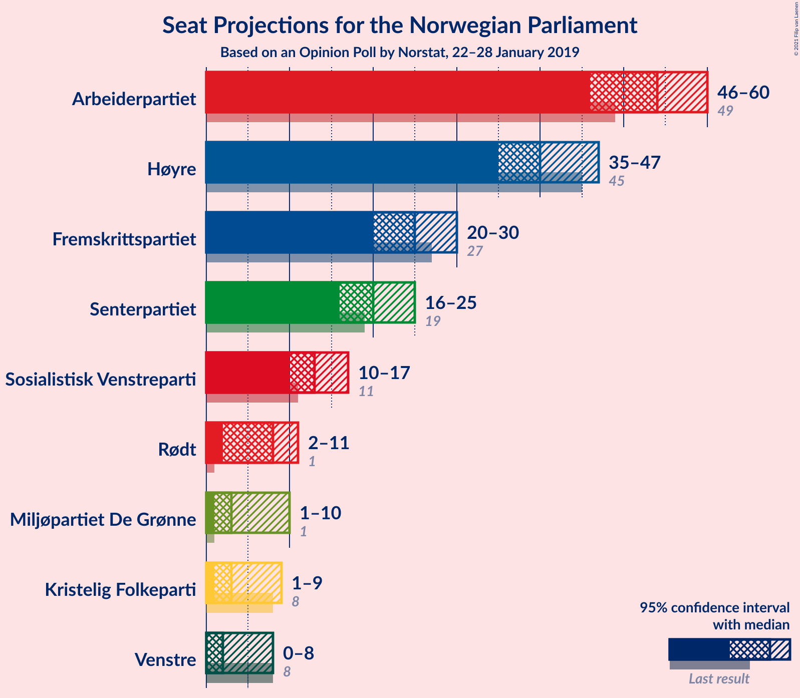
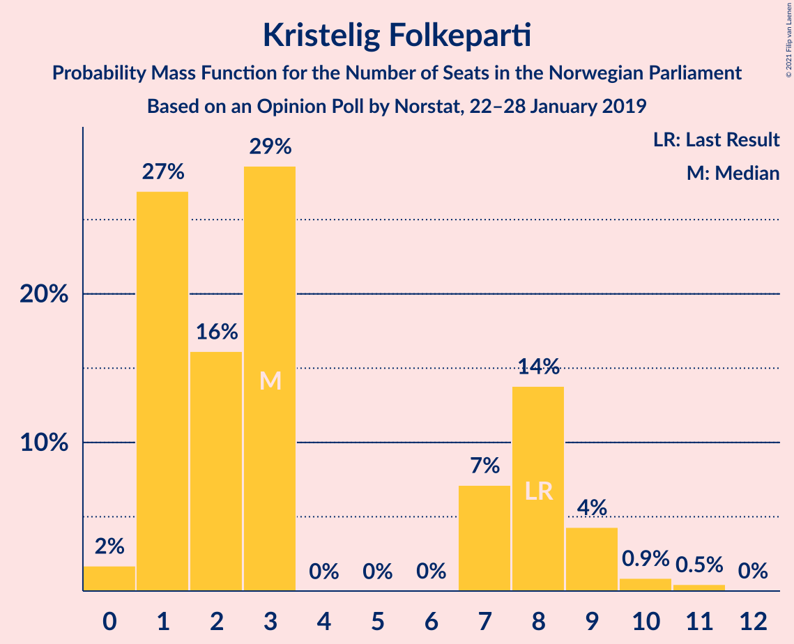
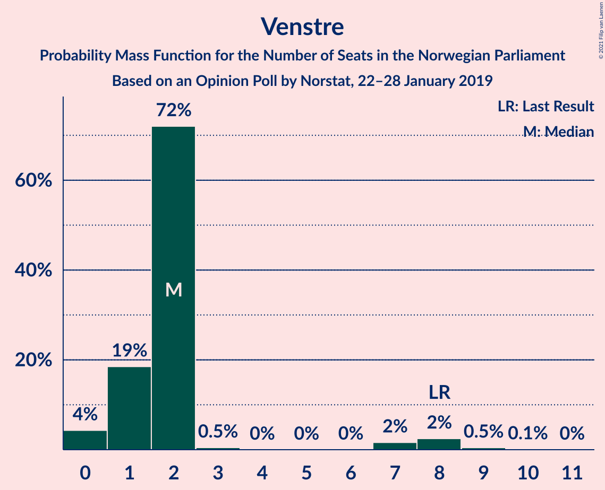
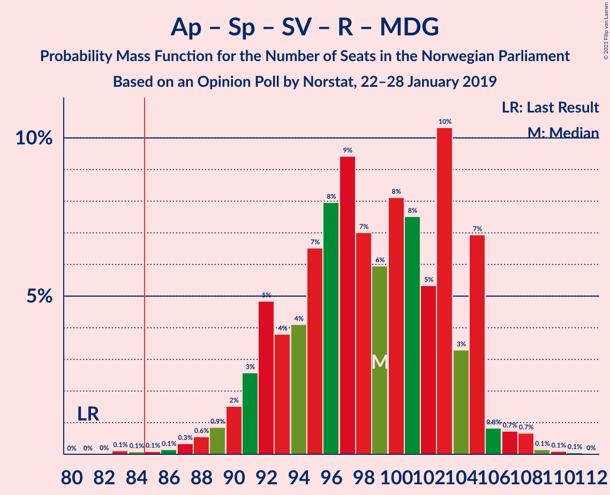
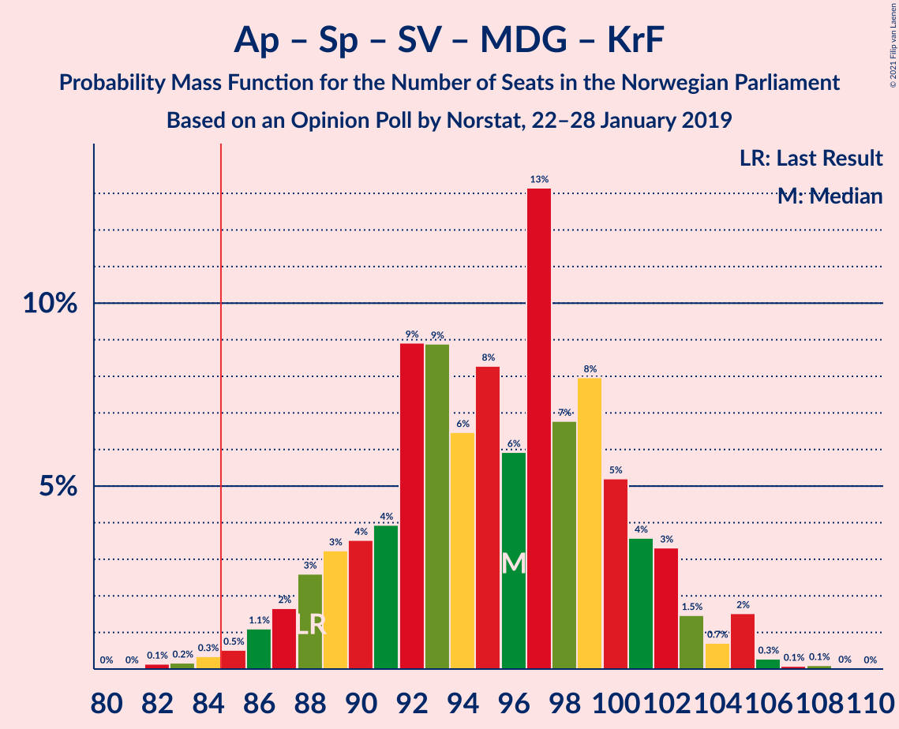
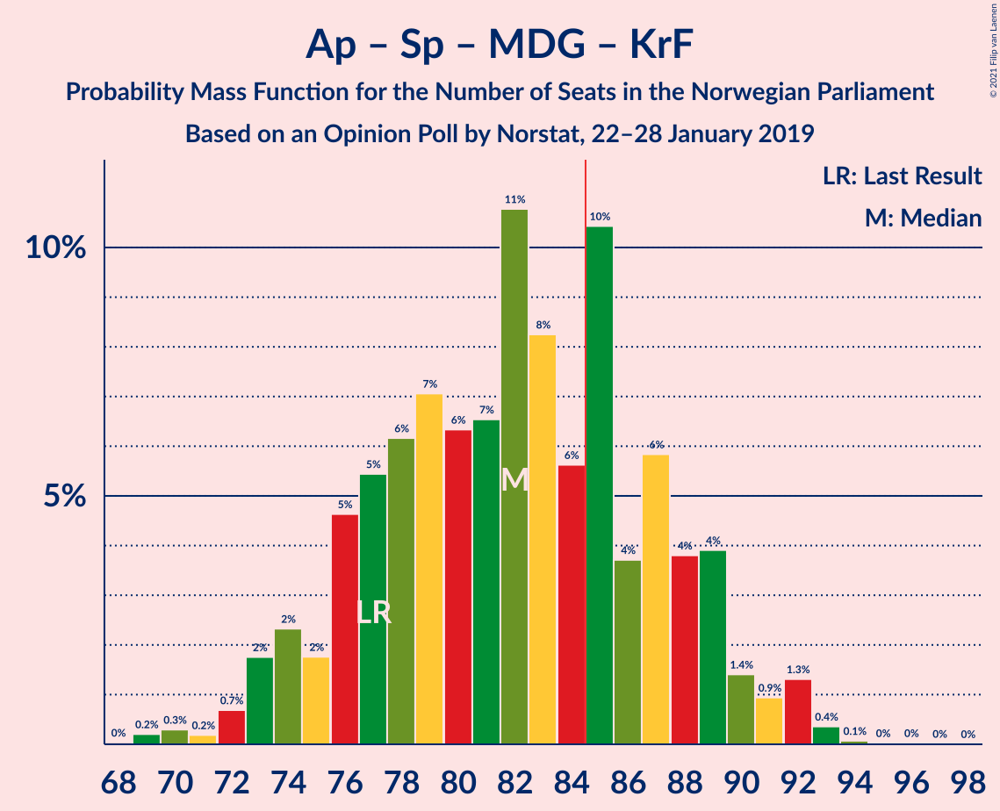
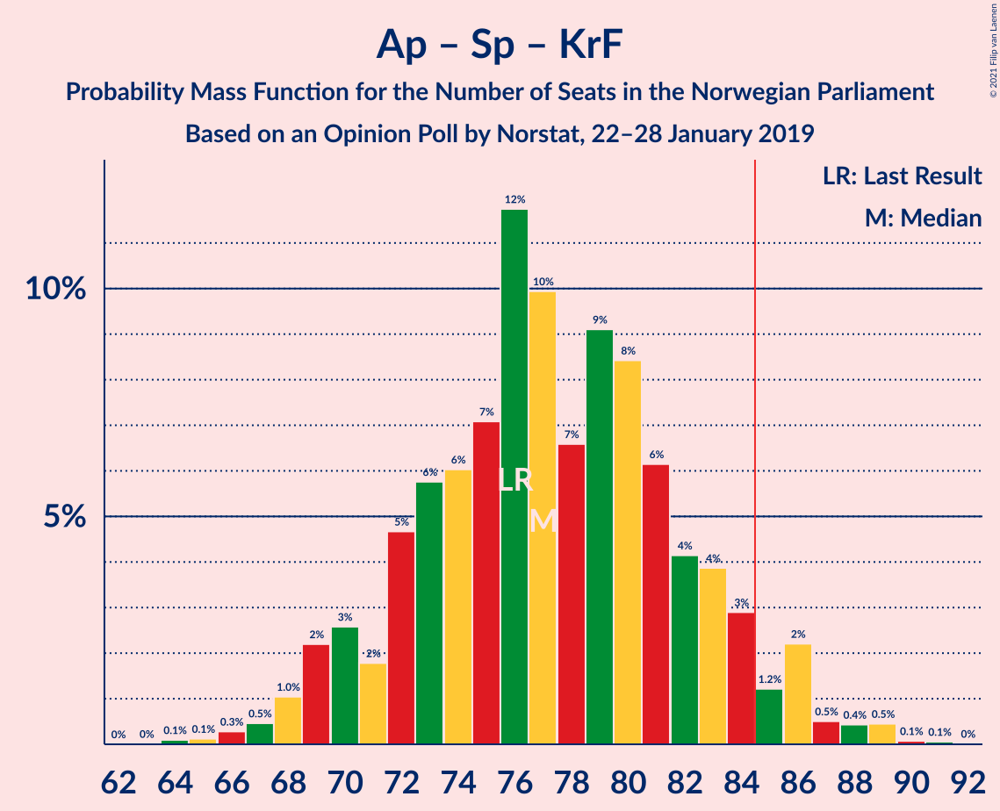
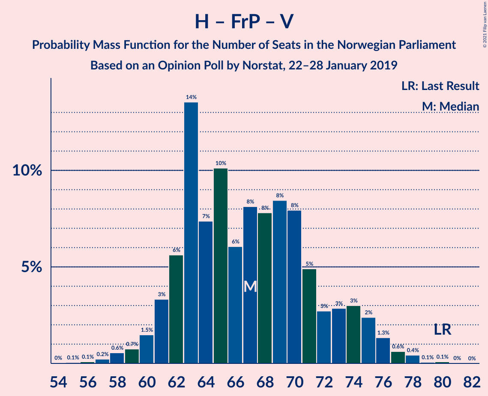
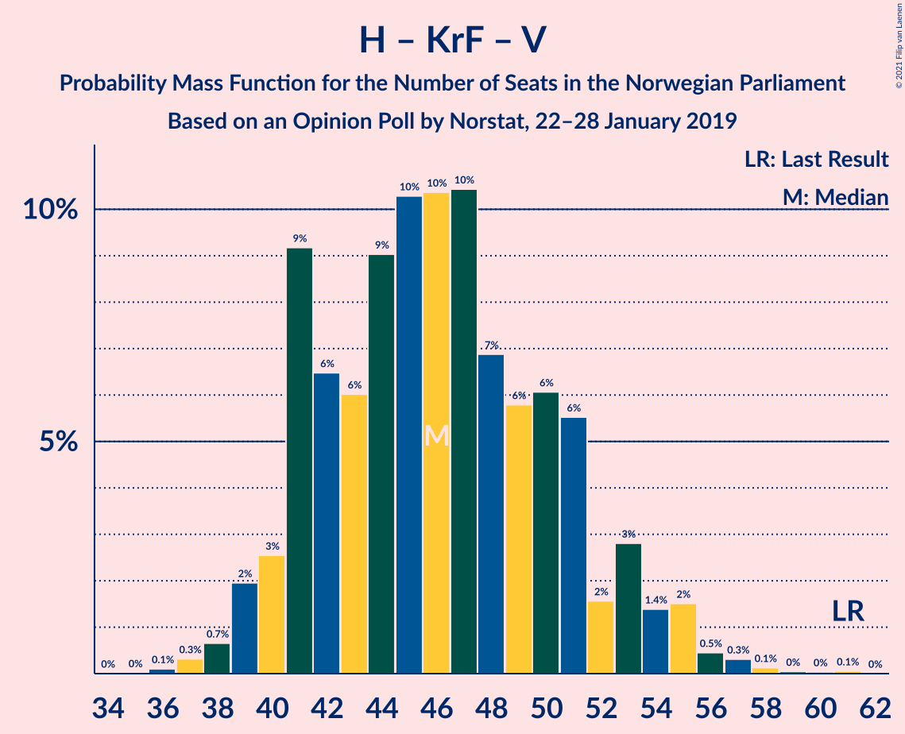

# Opinion Poll by Norstat, 22–28 January 2019

<a href="#voting-intentions">Voting Intentions</a> | <a href="#seats">Seats</a> | <a href="#coalitions">Coalitions</a> | <a href="#technical-information">Technical Information</a>

## Voting Intentions

### Confidence Intervals

| Party | Last Result | Poll Result | 80% Confidence Interval | 90% Confidence Interval | 95% Confidence Interval | 99% Confidence Interval |
|:-----:|:-----------:|:-----------:|:-----------------------:|:-----------------------:|:-----------------------:|:-----------------------:|
| Arbeiderpartiet | 27.4% | 29.1% | 26.9–31.4% |26.3–32.0% |25.8–32.6% |24.8–33.7% |
| Høyre | 25.0% | 22.4% | 20.5–24.6% |19.9–25.2% |19.5–25.7% |18.6–26.7% |
| Fremskrittspartiet | 15.2% | 13.5% | 11.9–15.3% |11.5–15.8% |11.1–16.2% |10.4–17.1% |
| Senterpartiet | 10.3% | 11.1% | 9.7–12.8% |9.3–13.3% |9.0–13.7% |8.4–14.6% |
| Sosialistisk Venstreparti | 6.0% | 7.2% | 6.1–8.7% |5.8–9.1% |5.5–9.4% |5.0–10.2% |
| Rødt | 2.4% | 4.3% | 3.5–5.5% |3.2–5.8% |3.1–6.1% |2.7–6.8% |
| Miljøpartiet De Grønne | 3.2% | 3.8% | 3.0–4.9% |2.8–5.2% |2.6–5.5% |2.3–6.0% |
| Kristelig Folkeparti | 4.2% | 3.5% | 2.7–4.5% |2.5–4.8% |2.3–5.1% |2.0–5.7% |
| Venstre | 4.4% | 2.7% | 2.1–3.7% |1.9–4.0% |1.8–4.3% |1.5–4.8% |

*Note:* The poll result column reflects the actual value used in the calculations. Published results may vary slightly, and in addition be rounded to fewer digits.

## Seats

### Confidence Intervals

| Party | Last Result | Median | 80% Confidence Interval | 90% Confidence Interval | 95% Confidence Interval | 99% Confidence Interval |
|:-----:|:-----------:|:------:|:-----------------------:|:-----------------------:|:-----------------------:|:-----------------------:|
| <a href="#arbeiderpartiet">Arbeiderpartiet</a> | 49 | 54 | 48–58 |47–59 |46–60 |44–62 |
| <a href="#høyre">Høyre</a> | 45 | 40 | 36–45 |36–46 |35–47 |34–49 |
| <a href="#fremskrittspartiet">Fremskrittspartiet</a> | 27 | 25 | 21–28 |20–29 |20–30 |18–31 |
| <a href="#senterpartiet">Senterpartiet</a> | 19 | 20 | 17–23 |17–24 |16–25 |15–27 |
| <a href="#sosialistisk-venstreparti">Sosialistisk Venstreparti</a> | 11 | 13 | 11–15 |10–17 |10–17 |9–19 |
| <a href="#rødt">Rødt</a> | 1 | 8 | 2–10 |2–11 |2–11 |1–12 |
| <a href="#miljøpartiet-de-grønne">Miljøpartiet De Grønne</a> | 1 | 3 | 1–9 |1–9 |1–10 |1–11 |
| <a href="#kristelig-folkeparti">Kristelig Folkeparti</a> | 8 | 3 | 1–8 |1–9 |1–9 |0–10 |
| <a href="#venstre">Venstre</a> | 8 | 2 | 1–2 |1–3 |0–8 |0–9 |

### Arbeiderpartiet

*For a full overview of the results for this party, see the [Arbeiderpartiet](party-arbeiderpartiet.html) page.*

| Number of Seats | Probability | Accumulated | Special Marks |
|:---------------:|:-----------:|:-----------:|:-------------:|
| 42 | 0% | 100% |  |
| 43 | 0.2% | 99.9% |  |
| 44 | 0.3% | 99.8% |  |
| 45 | 0.6% | 99.4% |  |
| 46 | 3% | 98.8% |  |
| 47 | 3% | 96% |  |
| 48 | 4% | 93% |  |
| 49 | 6% | 89% | Last Result |
| 50 | 4% | 84% |  |
| 51 | 7% | 79% |  |
| 52 | 8% | 72% |  |
| 53 | 11% | 63% |  |
| 54 | 7% | 53% | Median |
| 55 | 13% | 46% |  |
| 56 | 11% | 33% |  |
| 57 | 7% | 22% |  |
| 58 | 9% | 15% |  |
| 59 | 2% | 6% |  |
| 60 | 2% | 3% |  |
| 61 | 0.6% | 1.4% |  |
| 62 | 0.5% | 0.8% |  |
| 63 | 0.2% | 0.3% |  |
| 64 | 0.1% | 0.1% |  |
| 65 | 0% | 0.1% |  |
| 66 | 0% | 0% |  |

### Høyre

*For a full overview of the results for this party, see the [Høyre](party-høyre.html) page.*

| Number of Seats | Probability | Accumulated | Special Marks |
|:---------------:|:-----------:|:-----------:|:-------------:|
| 31 | 0% | 100% |  |
| 32 | 0.1% | 99.9% |  |
| 33 | 0.3% | 99.8% |  |
| 34 | 1.0% | 99.5% |  |
| 35 | 3% | 98% |  |
| 36 | 5% | 95% |  |
| 37 | 6% | 90% |  |
| 38 | 13% | 84% |  |
| 39 | 11% | 71% |  |
| 40 | 12% | 60% | Median |
| 41 | 15% | 47% |  |
| 42 | 8% | 33% |  |
| 43 | 10% | 25% |  |
| 44 | 4% | 15% |  |
| 45 | 4% | 11% | Last Result |
| 46 | 3% | 7% |  |
| 47 | 0.9% | 3% |  |
| 48 | 1.0% | 2% |  |
| 49 | 1.0% | 1.5% |  |
| 50 | 0.2% | 0.4% |  |
| 51 | 0.2% | 0.2% |  |
| 52 | 0% | 0.1% |  |
| 53 | 0% | 0% |  |

### Fremskrittspartiet

*For a full overview of the results for this party, see the [Fremskrittspartiet](party-fremskrittspartiet.html) page.*

| Number of Seats | Probability | Accumulated | Special Marks |
|:---------------:|:-----------:|:-----------:|:-------------:|
| 17 | 0.1% | 100% |  |
| 18 | 0.6% | 99.9% |  |
| 19 | 2% | 99.3% |  |
| 20 | 6% | 98% |  |
| 21 | 6% | 92% |  |
| 22 | 8% | 86% |  |
| 23 | 12% | 78% |  |
| 24 | 15% | 66% |  |
| 25 | 21% | 51% | Median |
| 26 | 11% | 30% |  |
| 27 | 7% | 19% | Last Result |
| 28 | 5% | 12% |  |
| 29 | 3% | 7% |  |
| 30 | 4% | 4% |  |
| 31 | 0.5% | 0.8% |  |
| 32 | 0.2% | 0.3% |  |
| 33 | 0.1% | 0.1% |  |
| 34 | 0% | 0% |  |

### Senterpartiet

*For a full overview of the results for this party, see the [Senterpartiet](party-senterpartiet.html) page.*

| Number of Seats | Probability | Accumulated | Special Marks |
|:---------------:|:-----------:|:-----------:|:-------------:|
| 13 | 0.1% | 100% |  |
| 14 | 0.2% | 99.9% |  |
| 15 | 1.0% | 99.8% |  |
| 16 | 3% | 98.8% |  |
| 17 | 8% | 96% |  |
| 18 | 12% | 88% |  |
| 19 | 20% | 76% | Last Result |
| 20 | 11% | 56% | Median |
| 21 | 20% | 45% |  |
| 22 | 11% | 25% |  |
| 23 | 6% | 14% |  |
| 24 | 5% | 9% |  |
| 25 | 2% | 4% |  |
| 26 | 1.4% | 2% |  |
| 27 | 0.3% | 0.6% |  |
| 28 | 0.2% | 0.3% |  |
| 29 | 0% | 0.1% |  |
| 30 | 0% | 0% |  |

### Sosialistisk Venstreparti

*For a full overview of the results for this party, see the [Sosialistisk Venstreparti](party-sosialistiskvenstreparti.html) page.*

| Number of Seats | Probability | Accumulated | Special Marks |
|:---------------:|:-----------:|:-----------:|:-------------:|
| 8 | 0.3% | 100% |  |
| 9 | 2% | 99.7% |  |
| 10 | 5% | 98% |  |
| 11 | 11% | 93% | Last Result |
| 12 | 17% | 82% |  |
| 13 | 16% | 65% | Median |
| 14 | 21% | 49% |  |
| 15 | 19% | 28% |  |
| 16 | 4% | 10% |  |
| 17 | 3% | 5% |  |
| 18 | 1.3% | 2% |  |
| 19 | 0.9% | 1.0% |  |
| 20 | 0.1% | 0.2% |  |
| 21 | 0% | 0% |  |

### Rødt

*For a full overview of the results for this party, see the [Rødt](party-rødt.html) page.*

| Number of Seats | Probability | Accumulated | Special Marks |
|:---------------:|:-----------:|:-----------:|:-------------:|
| 1 | 1.1% | 100% | Last Result |
| 2 | 29% | 98.9% |  |
| 3 | 0% | 70% |  |
| 4 | 0% | 70% |  |
| 5 | 0% | 70% |  |
| 6 | 0.1% | 70% |  |
| 7 | 10% | 70% |  |
| 8 | 25% | 60% | Median |
| 9 | 18% | 35% |  |
| 10 | 11% | 17% |  |
| 11 | 5% | 6% |  |
| 12 | 1.1% | 1.4% |  |
| 13 | 0.2% | 0.2% |  |
| 14 | 0.1% | 0.1% |  |
| 15 | 0% | 0% |  |

### Miljøpartiet De Grønne

*For a full overview of the results for this party, see the [Miljøpartiet De Grønne](party-miljøpartietdegrønne.html) page.*

| Number of Seats | Probability | Accumulated | Special Marks |
|:---------------:|:-----------:|:-----------:|:-------------:|
| 1 | 14% | 100% | Last Result |
| 2 | 35% | 86% |  |
| 3 | 6% | 50% | Median |
| 4 | 0.1% | 45% |  |
| 5 | 0% | 44% |  |
| 6 | 0% | 44% |  |
| 7 | 7% | 44% |  |
| 8 | 21% | 38% |  |
| 9 | 13% | 16% |  |
| 10 | 3% | 3% |  |
| 11 | 0.6% | 0.7% |  |
| 12 | 0.1% | 0.1% |  |
| 13 | 0% | 0% |  |

### Kristelig Folkeparti

*For a full overview of the results for this party, see the [Kristelig Folkeparti](party-kristeligfolkeparti.html) page.*

| Number of Seats | Probability | Accumulated | Special Marks |
|:---------------:|:-----------:|:-----------:|:-------------:|
| 0 | 2% | 100% |  |
| 1 | 27% | 98% |  |
| 2 | 16% | 71% |  |
| 3 | 29% | 55% | Median |
| 4 | 0% | 27% |  |
| 5 | 0% | 27% |  |
| 6 | 0% | 27% |  |
| 7 | 7% | 27% |  |
| 8 | 14% | 19% | Last Result |
| 9 | 4% | 6% |  |
| 10 | 0.9% | 1.4% |  |
| 11 | 0.5% | 0.5% |  |
| 12 | 0% | 0% |  |

### Venstre

*For a full overview of the results for this party, see the [Venstre](party-venstre.html) page.*

| Number of Seats | Probability | Accumulated | Special Marks |
|:---------------:|:-----------:|:-----------:|:-------------:|
| 0 | 4% | 100% |  |
| 1 | 19% | 96% |  |
| 2 | 72% | 77% | Median |
| 3 | 0.5% | 5% |  |
| 4 | 0% | 5% |  |
| 5 | 0% | 5% |  |
| 6 | 0% | 5% |  |
| 7 | 2% | 5% |  |
| 8 | 2% | 3% | Last Result |
| 9 | 0.5% | 0.6% |  |
| 10 | 0.1% | 0.1% |  |
| 11 | 0% | 0% |  |

## Coalitions

### Confidence Intervals

| Coalition | Last Result | Median | Majority? | 80% Confidence Interval | 90% Confidence Interval | 95% Confidence Interval | 99% Confidence Interval |
|:---------:|:-----------:|:------:|:---------:|:-----------------------:|:-----------------------:|:-----------------------:|:-----------------------:|
| Arbeiderpartiet – Senterpartiet – Sosialistisk Venstreparti – Rødt – Miljøpartiet De Grønne | 81 | 99 | 99.8% | 92–104 | 91–105 | 90–106 | 87–108 |
| Arbeiderpartiet – Senterpartiet – Sosialistisk Venstreparti – Miljøpartiet De Grønne – Kristelig Folkeparti | 88 | 96 | 99.3% | 90–101 | 88–102 | 87–104 | 84–106 |
| Arbeiderpartiet – Senterpartiet – Sosialistisk Venstreparti – Rødt | 80 | 94 | 97% | 88–100 | 86–101 | 84–103 | 81–104 |
| Arbeiderpartiet – Senterpartiet – Sosialistisk Venstreparti – Miljøpartiet De Grønne | 80 | 92 | 95% | 86–97 | 85–99 | 83–100 | 80–103 |
| Høyre – Fremskrittspartiet – Senterpartiet – Kristelig Folkeparti – Venstre | 107 | 90 | 91% | 85–97 | 83–98 | 83–100 | 81–103 |
| Arbeiderpartiet – Senterpartiet – Sosialistisk Venstreparti | 79 | 87 | 72% | 81–93 | 79–93 | 78–95 | 76–99 |
| Arbeiderpartiet – Senterpartiet – Miljøpartiet De Grønne – Kristelig Folkeparti | 77 | 82 | 32% | 76–88 | 74–89 | 73–91 | 70–93 |
| Arbeiderpartiet – Senterpartiet – Kristelig Folkeparti | 76 | 77 | 5% | 72–83 | 70–84 | 69–86 | 66–89 |
| Arbeiderpartiet – Sosialistisk Venstreparti – Rødt – Miljøpartiet De Grønne | 62 | 79 | 9% | 72–84 | 71–86 | 68–86 | 66–88 |
| Høyre – Fremskrittspartiet – Miljøpartiet De Grønne – Kristelig Folkeparti – Venstre | 89 | 75 | 2% | 69–81 | 67–83 | 66–84 | 65–88 |
| Arbeiderpartiet – Senterpartiet | 68 | 74 | 0.3% | 68–79 | 66–80 | 66–81 | 63–84 |
| Høyre – Fremskrittspartiet – Kristelig Folkeparti – Venstre | 88 | 70 | 0.2% | 65–77 | 64–78 | 63–79 | 61–82 |
| Høyre – Fremskrittspartiet – Venstre | 80 | 67 | 0% | 62–73 | 61–74 | 60–76 | 58–78 |
| Arbeiderpartiet – Sosialistisk Venstreparti | 60 | 67 | 0% | 61–72 | 60–73 | 59–74 | 56–76 |
| Høyre – Fremskrittspartiet | 72 | 65 | 0% | 60–70 | 59–72 | 58–73 | 56–75 |
| Høyre – Kristelig Folkeparti – Venstre | 61 | 46 | 0% | 41–51 | 40–53 | 39–55 | 38–57 |
| Senterpartiet – Kristelig Folkeparti – Venstre | 35 | 26 | 0% | 21–31 | 21–32 | 20–33 | 18–36 |

### Arbeiderpartiet – Senterpartiet – Sosialistisk Venstreparti – Rødt – Miljøpartiet De Grønne

| Number of Seats | Probability | Accumulated | Special Marks |
|:---------------:|:-----------:|:-----------:|:-------------:|
| 81 | 0% | 100% | Last Result |
| 82 | 0% | 100% |  |
| 83 | 0.1% | 100% |  |
| 84 | 0.1% | 99.9% |  |
| 85 | 0.1% | 99.8% | Majority |
| 86 | 0.1% | 99.7% |  |
| 87 | 0.3% | 99.5% |  |
| 88 | 0.6% | 99.2% |  |
| 89 | 0.9% | 98.6% |  |
| 90 | 2% | 98% |  |
| 91 | 3% | 96% |  |
| 92 | 5% | 94% |  |
| 93 | 4% | 89% |  |
| 94 | 4% | 85% |  |
| 95 | 7% | 81% |  |
| 96 | 8% | 74% |  |
| 97 | 9% | 66% |  |
| 98 | 7% | 57% | Median |
| 99 | 6% | 50% |  |
| 100 | 8% | 44% |  |
| 101 | 8% | 36% |  |
| 102 | 5% | 28% |  |
| 103 | 10% | 23% |  |
| 104 | 3% | 13% |  |
| 105 | 7% | 9% |  |
| 106 | 0.8% | 3% |  |
| 107 | 0.7% | 2% |  |
| 108 | 0.7% | 1.0% |  |
| 109 | 0.1% | 0.3% |  |
| 110 | 0.1% | 0.2% |  |
| 111 | 0.1% | 0.1% |  |
| 112 | 0% | 0% |  |

### Arbeiderpartiet – Senterpartiet – Sosialistisk Venstreparti – Miljøpartiet De Grønne – Kristelig Folkeparti

| Number of Seats | Probability | Accumulated | Special Marks |
|:---------------:|:-----------:|:-----------:|:-------------:|
| 82 | 0.1% | 100% |  |
| 83 | 0.2% | 99.8% |  |
| 84 | 0.3% | 99.7% |  |
| 85 | 0.5% | 99.3% | Majority |
| 86 | 1.1% | 98.8% |  |
| 87 | 2% | 98% |  |
| 88 | 3% | 96% | Last Result |
| 89 | 3% | 93% |  |
| 90 | 4% | 90% |  |
| 91 | 4% | 87% |  |
| 92 | 9% | 83% |  |
| 93 | 9% | 74% | Median |
| 94 | 6% | 65% |  |
| 95 | 8% | 58% |  |
| 96 | 6% | 50% |  |
| 97 | 13% | 44% |  |
| 98 | 7% | 31% |  |
| 99 | 8% | 24% |  |
| 100 | 5% | 16% |  |
| 101 | 4% | 11% |  |
| 102 | 3% | 8% |  |
| 103 | 1.5% | 4% |  |
| 104 | 0.7% | 3% |  |
| 105 | 2% | 2% |  |
| 106 | 0.3% | 0.5% |  |
| 107 | 0.1% | 0.2% |  |
| 108 | 0.1% | 0.2% |  |
| 109 | 0% | 0.1% |  |
| 110 | 0% | 0% |  |

### Arbeiderpartiet – Senterpartiet – Sosialistisk Venstreparti – Rødt

| Number of Seats | Probability | Accumulated | Special Marks |
|:---------------:|:-----------:|:-----------:|:-------------:|
| 79 | 0.1% | 100% |  |
| 80 | 0.1% | 99.8% | Last Result |
| 81 | 0.4% | 99.8% |  |
| 82 | 0.3% | 99.4% |  |
| 83 | 0.8% | 99.1% |  |
| 84 | 0.8% | 98% |  |
| 85 | 2% | 97% | Majority |
| 86 | 0.9% | 95% |  |
| 87 | 3% | 95% |  |
| 88 | 7% | 92% |  |
| 89 | 3% | 84% |  |
| 90 | 7% | 82% |  |
| 91 | 7% | 75% |  |
| 92 | 6% | 68% |  |
| 93 | 8% | 62% |  |
| 94 | 8% | 54% |  |
| 95 | 11% | 46% | Median |
| 96 | 9% | 35% |  |
| 97 | 5% | 26% |  |
| 98 | 5% | 22% |  |
| 99 | 5% | 16% |  |
| 100 | 3% | 11% |  |
| 101 | 3% | 8% |  |
| 102 | 1.2% | 5% |  |
| 103 | 3% | 4% |  |
| 104 | 0.4% | 0.6% |  |
| 105 | 0.1% | 0.2% |  |
| 106 | 0% | 0.1% |  |
| 107 | 0% | 0.1% |  |
| 108 | 0% | 0% |  |

### Arbeiderpartiet – Senterpartiet – Sosialistisk Venstreparti – Miljøpartiet De Grønne

| Number of Seats | Probability | Accumulated | Special Marks |
|:---------------:|:-----------:|:-----------:|:-------------:|
| 78 | 0.1% | 100% |  |
| 79 | 0.2% | 99.9% |  |
| 80 | 0.4% | 99.7% | Last Result |
| 81 | 0.4% | 99.3% |  |
| 82 | 0.8% | 98.9% |  |
| 83 | 1.4% | 98% |  |
| 84 | 2% | 97% |  |
| 85 | 4% | 95% | Majority |
| 86 | 5% | 91% |  |
| 87 | 4% | 85% |  |
| 88 | 5% | 81% |  |
| 89 | 8% | 76% |  |
| 90 | 7% | 68% | Median |
| 91 | 8% | 61% |  |
| 92 | 9% | 54% |  |
| 93 | 6% | 44% |  |
| 94 | 7% | 38% |  |
| 95 | 8% | 31% |  |
| 96 | 12% | 24% |  |
| 97 | 3% | 12% |  |
| 98 | 3% | 9% |  |
| 99 | 2% | 7% |  |
| 100 | 3% | 4% |  |
| 101 | 1.0% | 2% |  |
| 102 | 0.2% | 0.7% |  |
| 103 | 0.4% | 0.5% |  |
| 104 | 0% | 0.1% |  |
| 105 | 0.1% | 0.1% |  |
| 106 | 0% | 0% |  |

### Høyre – Fremskrittspartiet – Senterpartiet – Kristelig Folkeparti – Venstre

| Number of Seats | Probability | Accumulated | Special Marks |
|:---------------:|:-----------:|:-----------:|:-------------:|
| 78 | 0% | 100% |  |
| 79 | 0.1% | 99.9% |  |
| 80 | 0.1% | 99.8% |  |
| 81 | 0.2% | 99.6% |  |
| 82 | 1.1% | 99.4% |  |
| 83 | 6% | 98% |  |
| 84 | 2% | 92% |  |
| 85 | 4% | 91% | Majority |
| 86 | 3% | 86% |  |
| 87 | 10% | 83% |  |
| 88 | 9% | 73% |  |
| 89 | 9% | 64% |  |
| 90 | 6% | 55% | Median |
| 91 | 10% | 49% |  |
| 92 | 7% | 39% |  |
| 93 | 6% | 32% |  |
| 94 | 5% | 26% |  |
| 95 | 5% | 21% |  |
| 96 | 3% | 16% |  |
| 97 | 5% | 13% |  |
| 98 | 3% | 8% |  |
| 99 | 1.1% | 5% |  |
| 100 | 1.2% | 4% |  |
| 101 | 1.1% | 2% |  |
| 102 | 0.4% | 1.4% |  |
| 103 | 0.7% | 1.1% |  |
| 104 | 0.1% | 0.3% |  |
| 105 | 0.2% | 0.2% |  |
| 106 | 0% | 0% |  |
| 107 | 0% | 0% | Last Result |

### Arbeiderpartiet – Senterpartiet – Sosialistisk Venstreparti

| Number of Seats | Probability | Accumulated | Special Marks |
|:---------------:|:-----------:|:-----------:|:-------------:|
| 73 | 0.1% | 100% |  |
| 74 | 0.1% | 99.9% |  |
| 75 | 0.2% | 99.8% |  |
| 76 | 0.5% | 99.6% |  |
| 77 | 1.0% | 99.1% |  |
| 78 | 2% | 98% |  |
| 79 | 1.4% | 96% | Last Result |
| 80 | 3% | 95% |  |
| 81 | 3% | 92% |  |
| 82 | 3% | 89% |  |
| 83 | 9% | 85% |  |
| 84 | 4% | 77% |  |
| 85 | 7% | 72% | Majority |
| 86 | 7% | 66% |  |
| 87 | 10% | 59% | Median |
| 88 | 10% | 48% |  |
| 89 | 7% | 38% |  |
| 90 | 9% | 31% |  |
| 91 | 6% | 22% |  |
| 92 | 5% | 16% |  |
| 93 | 6% | 10% |  |
| 94 | 1.3% | 5% |  |
| 95 | 1.4% | 3% |  |
| 96 | 0.8% | 2% |  |
| 97 | 0.3% | 1.0% |  |
| 98 | 0.1% | 0.8% |  |
| 99 | 0.4% | 0.6% |  |
| 100 | 0.1% | 0.2% |  |
| 101 | 0.1% | 0.1% |  |
| 102 | 0% | 0% |  |

### Arbeiderpartiet – Senterpartiet – Miljøpartiet De Grønne – Kristelig Folkeparti

| Number of Seats | Probability | Accumulated | Special Marks |
|:---------------:|:-----------:|:-----------:|:-------------:|
| 68 | 0% | 100% |  |
| 69 | 0.2% | 99.9% |  |
| 70 | 0.3% | 99.7% |  |
| 71 | 0.2% | 99.4% |  |
| 72 | 0.7% | 99.3% |  |
| 73 | 2% | 98.6% |  |
| 74 | 2% | 97% |  |
| 75 | 2% | 94% |  |
| 76 | 5% | 93% |  |
| 77 | 5% | 88% | Last Result |
| 78 | 6% | 83% |  |
| 79 | 7% | 76% |  |
| 80 | 6% | 69% | Median |
| 81 | 7% | 63% |  |
| 82 | 11% | 57% |  |
| 83 | 8% | 46% |  |
| 84 | 6% | 38% |  |
| 85 | 10% | 32% | Majority |
| 86 | 4% | 21% |  |
| 87 | 6% | 18% |  |
| 88 | 4% | 12% |  |
| 89 | 4% | 8% |  |
| 90 | 1.4% | 4% |  |
| 91 | 0.9% | 3% |  |
| 92 | 1.3% | 2% |  |
| 93 | 0.4% | 0.5% |  |
| 94 | 0.1% | 0.2% |  |
| 95 | 0% | 0.1% |  |
| 96 | 0% | 0.1% |  |
| 97 | 0% | 0% |  |

### Arbeiderpartiet – Senterpartiet – Kristelig Folkeparti

| Number of Seats | Probability | Accumulated | Special Marks |
|:---------------:|:-----------:|:-----------:|:-------------:|
| 64 | 0.1% | 100% |  |
| 65 | 0.1% | 99.9% |  |
| 66 | 0.3% | 99.8% |  |
| 67 | 0.5% | 99.5% |  |
| 68 | 1.0% | 99.0% |  |
| 69 | 2% | 98% |  |
| 70 | 3% | 96% |  |
| 71 | 2% | 93% |  |
| 72 | 5% | 91% |  |
| 73 | 6% | 87% |  |
| 74 | 6% | 81% |  |
| 75 | 7% | 75% |  |
| 76 | 12% | 68% | Last Result |
| 77 | 10% | 56% | Median |
| 78 | 7% | 46% |  |
| 79 | 9% | 40% |  |
| 80 | 8% | 30% |  |
| 81 | 6% | 22% |  |
| 82 | 4% | 16% |  |
| 83 | 4% | 12% |  |
| 84 | 3% | 8% |  |
| 85 | 1.2% | 5% | Majority |
| 86 | 2% | 4% |  |
| 87 | 0.5% | 2% |  |
| 88 | 0.4% | 1.0% |  |
| 89 | 0.5% | 0.6% |  |
| 90 | 0.1% | 0.2% |  |
| 91 | 0.1% | 0.1% |  |
| 92 | 0% | 0% |  |

### Arbeiderpartiet – Sosialistisk Venstreparti – Rødt – Miljøpartiet De Grønne

| Number of Seats | Probability | Accumulated | Special Marks |
|:---------------:|:-----------:|:-----------:|:-------------:|
| 62 | 0% | 100% | Last Result |
| 63 | 0% | 100% |  |
| 64 | 0.2% | 99.9% |  |
| 65 | 0.1% | 99.7% |  |
| 66 | 0.7% | 99.7% |  |
| 67 | 0.4% | 98.9% |  |
| 68 | 1.1% | 98.5% |  |
| 69 | 1.2% | 97% |  |
| 70 | 1.2% | 96% |  |
| 71 | 3% | 95% |  |
| 72 | 5% | 92% |  |
| 73 | 4% | 87% |  |
| 74 | 5% | 83% |  |
| 75 | 5% | 79% |  |
| 76 | 6% | 73% |  |
| 77 | 7% | 67% |  |
| 78 | 10% | 60% | Median |
| 79 | 6% | 50% |  |
| 80 | 9% | 44% |  |
| 81 | 9% | 35% |  |
| 82 | 10% | 26% |  |
| 83 | 3% | 16% |  |
| 84 | 4% | 13% |  |
| 85 | 2% | 9% | Majority |
| 86 | 6% | 7% |  |
| 87 | 1.0% | 2% |  |
| 88 | 0.2% | 0.5% |  |
| 89 | 0.1% | 0.3% |  |
| 90 | 0.1% | 0.2% |  |
| 91 | 0% | 0.1% |  |
| 92 | 0% | 0% |  |

### Høyre – Fremskrittspartiet – Miljøpartiet De Grønne – Kristelig Folkeparti – Venstre

| Number of Seats | Probability | Accumulated | Special Marks |
|:---------------:|:-----------:|:-----------:|:-------------:|
| 62 | 0% | 100% |  |
| 63 | 0.1% | 99.9% |  |
| 64 | 0.1% | 99.9% |  |
| 65 | 0.4% | 99.7% |  |
| 66 | 3% | 99.3% |  |
| 67 | 1.2% | 96% |  |
| 68 | 3% | 95% |  |
| 69 | 3% | 92% |  |
| 70 | 5% | 89% |  |
| 71 | 5% | 83% |  |
| 72 | 5% | 78% |  |
| 73 | 9% | 73% | Median |
| 74 | 11% | 64% |  |
| 75 | 8% | 53% |  |
| 76 | 8% | 45% |  |
| 77 | 5% | 37% |  |
| 78 | 7% | 32% |  |
| 79 | 7% | 25% |  |
| 80 | 2% | 18% |  |
| 81 | 7% | 15% |  |
| 82 | 3% | 8% |  |
| 83 | 0.9% | 5% |  |
| 84 | 2% | 4% |  |
| 85 | 0.7% | 2% | Majority |
| 86 | 0.8% | 2% |  |
| 87 | 0.3% | 0.9% |  |
| 88 | 0.4% | 0.6% |  |
| 89 | 0.1% | 0.2% | Last Result |
| 90 | 0.1% | 0.1% |  |
| 91 | 0% | 0% |  |

### Arbeiderpartiet – Senterpartiet

| Number of Seats | Probability | Accumulated | Special Marks |
|:---------------:|:-----------:|:-----------:|:-------------:|
| 61 | 0.1% | 100% |  |
| 62 | 0.2% | 99.9% |  |
| 63 | 0.3% | 99.7% |  |
| 64 | 0.5% | 99.4% |  |
| 65 | 1.1% | 98.9% |  |
| 66 | 3% | 98% |  |
| 67 | 5% | 95% |  |
| 68 | 2% | 90% | Last Result |
| 69 | 3% | 88% |  |
| 70 | 6% | 84% |  |
| 71 | 6% | 79% |  |
| 72 | 10% | 73% |  |
| 73 | 6% | 63% |  |
| 74 | 12% | 57% | Median |
| 75 | 12% | 45% |  |
| 76 | 9% | 33% |  |
| 77 | 7% | 24% |  |
| 78 | 3% | 17% |  |
| 79 | 7% | 13% |  |
| 80 | 3% | 7% |  |
| 81 | 1.4% | 3% |  |
| 82 | 1.1% | 2% |  |
| 83 | 0.4% | 0.9% |  |
| 84 | 0.2% | 0.5% |  |
| 85 | 0.1% | 0.3% | Majority |
| 86 | 0.1% | 0.1% |  |
| 87 | 0% | 0.1% |  |
| 88 | 0% | 0.1% |  |
| 89 | 0% | 0% |  |

### Høyre – Fremskrittspartiet – Kristelig Folkeparti – Venstre

| Number of Seats | Probability | Accumulated | Special Marks |
|:---------------:|:-----------:|:-----------:|:-------------:|
| 58 | 0.1% | 100% |  |
| 59 | 0.1% | 99.9% |  |
| 60 | 0.2% | 99.8% |  |
| 61 | 0.7% | 99.7% |  |
| 62 | 0.8% | 99.0% |  |
| 63 | 0.9% | 98% |  |
| 64 | 7% | 97% |  |
| 65 | 3% | 90% |  |
| 66 | 10% | 87% |  |
| 67 | 6% | 77% |  |
| 68 | 8% | 71% |  |
| 69 | 8% | 64% |  |
| 70 | 6% | 55% | Median |
| 71 | 7% | 49% |  |
| 72 | 9% | 42% |  |
| 73 | 8% | 33% |  |
| 74 | 6% | 25% |  |
| 75 | 4% | 19% |  |
| 76 | 4% | 15% |  |
| 77 | 5% | 11% |  |
| 78 | 3% | 6% |  |
| 79 | 1.5% | 4% |  |
| 80 | 0.8% | 2% |  |
| 81 | 0.5% | 1.3% |  |
| 82 | 0.3% | 0.7% |  |
| 83 | 0.1% | 0.4% |  |
| 84 | 0.1% | 0.3% |  |
| 85 | 0.1% | 0.2% | Majority |
| 86 | 0.1% | 0.1% |  |
| 87 | 0% | 0% |  |
| 88 | 0% | 0% | Last Result |

### Høyre – Fremskrittspartiet – Venstre

| Number of Seats | Probability | Accumulated | Special Marks |
|:---------------:|:-----------:|:-----------:|:-------------:|
| 55 | 0.1% | 100% |  |
| 56 | 0.1% | 99.9% |  |
| 57 | 0.2% | 99.8% |  |
| 58 | 0.6% | 99.6% |  |
| 59 | 0.7% | 99.0% |  |
| 60 | 1.5% | 98% |  |
| 61 | 3% | 97% |  |
| 62 | 6% | 93% |  |
| 63 | 14% | 88% |  |
| 64 | 7% | 74% |  |
| 65 | 10% | 67% |  |
| 66 | 6% | 57% |  |
| 67 | 8% | 51% | Median |
| 68 | 8% | 43% |  |
| 69 | 8% | 35% |  |
| 70 | 8% | 26% |  |
| 71 | 5% | 18% |  |
| 72 | 3% | 14% |  |
| 73 | 3% | 11% |  |
| 74 | 3% | 8% |  |
| 75 | 2% | 5% |  |
| 76 | 1.3% | 3% |  |
| 77 | 0.6% | 1.2% |  |
| 78 | 0.4% | 0.6% |  |
| 79 | 0.1% | 0.2% |  |
| 80 | 0.1% | 0.1% | Last Result |
| 81 | 0% | 0% |  |

### Arbeiderpartiet – Sosialistisk Venstreparti

| Number of Seats | Probability | Accumulated | Special Marks |
|:---------------:|:-----------:|:-----------:|:-------------:|
| 54 | 0.1% | 100% |  |
| 55 | 0.1% | 99.9% |  |
| 56 | 0.4% | 99.8% |  |
| 57 | 0.6% | 99.5% |  |
| 58 | 0.6% | 98.9% |  |
| 59 | 3% | 98% |  |
| 60 | 4% | 96% | Last Result |
| 61 | 3% | 92% |  |
| 62 | 5% | 89% |  |
| 63 | 5% | 84% |  |
| 64 | 8% | 79% |  |
| 65 | 6% | 71% |  |
| 66 | 7% | 65% |  |
| 67 | 10% | 58% | Median |
| 68 | 10% | 47% |  |
| 69 | 6% | 37% |  |
| 70 | 12% | 32% |  |
| 71 | 8% | 20% |  |
| 72 | 6% | 12% |  |
| 73 | 2% | 6% |  |
| 74 | 2% | 4% |  |
| 75 | 1.0% | 2% |  |
| 76 | 0.5% | 1.0% |  |
| 77 | 0.4% | 0.5% |  |
| 78 | 0.1% | 0.1% |  |
| 79 | 0% | 0.1% |  |
| 80 | 0% | 0% |  |

### Høyre – Fremskrittspartiet

| Number of Seats | Probability | Accumulated | Special Marks |
|:---------------:|:-----------:|:-----------:|:-------------:|
| 53 | 0.1% | 100% |  |
| 54 | 0.1% | 99.9% |  |
| 55 | 0.2% | 99.8% |  |
| 56 | 0.4% | 99.5% |  |
| 57 | 0.9% | 99.2% |  |
| 58 | 2% | 98% |  |
| 59 | 2% | 97% |  |
| 60 | 7% | 95% |  |
| 61 | 11% | 88% |  |
| 62 | 11% | 77% |  |
| 63 | 9% | 67% |  |
| 64 | 7% | 58% |  |
| 65 | 10% | 51% | Median |
| 66 | 8% | 41% |  |
| 67 | 7% | 34% |  |
| 68 | 10% | 27% |  |
| 69 | 5% | 17% |  |
| 70 | 3% | 13% |  |
| 71 | 3% | 10% |  |
| 72 | 2% | 7% | Last Result |
| 73 | 3% | 5% |  |
| 74 | 0.6% | 2% |  |
| 75 | 1.0% | 1.3% |  |
| 76 | 0.2% | 0.4% |  |
| 77 | 0% | 0.2% |  |
| 78 | 0.1% | 0.1% |  |
| 79 | 0% | 0% |  |

### Høyre – Kristelig Folkeparti – Venstre

| Number of Seats | Probability | Accumulated | Special Marks |
|:---------------:|:-----------:|:-----------:|:-------------:|
| 36 | 0.1% | 100% |  |
| 37 | 0.3% | 99.9% |  |
| 38 | 0.7% | 99.5% |  |
| 39 | 2% | 98.9% |  |
| 40 | 3% | 97% |  |
| 41 | 9% | 94% |  |
| 42 | 6% | 85% |  |
| 43 | 6% | 79% |  |
| 44 | 9% | 73% |  |
| 45 | 10% | 64% | Median |
| 46 | 10% | 53% |  |
| 47 | 10% | 43% |  |
| 48 | 7% | 33% |  |
| 49 | 6% | 26% |  |
| 50 | 6% | 20% |  |
| 51 | 6% | 14% |  |
| 52 | 2% | 8% |  |
| 53 | 3% | 7% |  |
| 54 | 1.4% | 4% |  |
| 55 | 2% | 3% |  |
| 56 | 0.5% | 1.0% |  |
| 57 | 0.3% | 0.6% |  |
| 58 | 0.1% | 0.3% |  |
| 59 | 0% | 0.2% |  |
| 60 | 0% | 0.1% |  |
| 61 | 0.1% | 0.1% | Last Result |
| 62 | 0% | 0% |  |

### Senterpartiet – Kristelig Folkeparti – Venstre

| Number of Seats | Probability | Accumulated | Special Marks |
|:---------------:|:-----------:|:-----------:|:-------------:|
| 17 | 0.2% | 100% |  |
| 18 | 0.3% | 99.8% |  |
| 19 | 1.2% | 99.5% |  |
| 20 | 3% | 98% |  |
| 21 | 10% | 95% |  |
| 22 | 4% | 85% |  |
| 23 | 12% | 81% |  |
| 24 | 11% | 69% |  |
| 25 | 8% | 59% | Median |
| 26 | 12% | 51% |  |
| 27 | 9% | 39% |  |
| 28 | 6% | 30% |  |
| 29 | 8% | 24% |  |
| 30 | 4% | 16% |  |
| 31 | 4% | 11% |  |
| 32 | 3% | 8% |  |
| 33 | 2% | 4% |  |
| 34 | 0.9% | 2% |  |
| 35 | 0.6% | 1.2% | Last Result |
| 36 | 0.4% | 0.6% |  |
| 37 | 0.1% | 0.2% |  |
| 38 | 0% | 0.1% |  |
| 39 | 0% | 0.1% |  |
| 40 | 0% | 0% |  |

## Technical Information

### Opinion Poll

+ **Polling firm:** Norstat
+ **Commissioner(s):** —
+ **Fieldwork period:** 22–28 January 2019

### Calculations

+ **Sample size:** 691
+ **Simulations done:** 1,048,576
+ **Error estimate:** 1.39%

