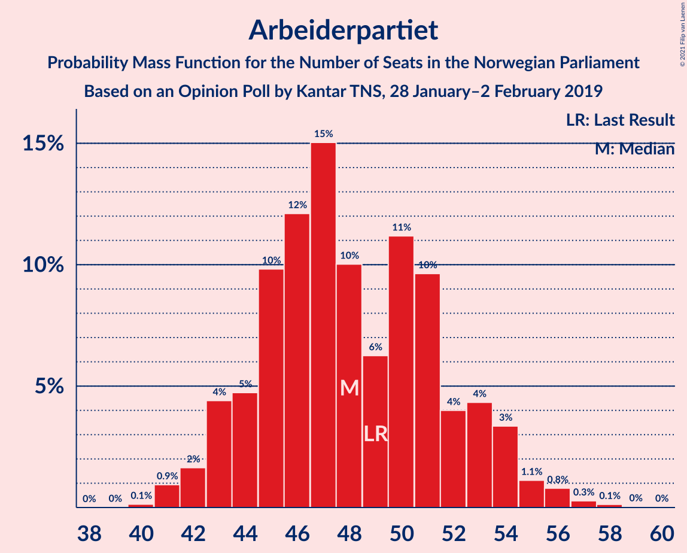
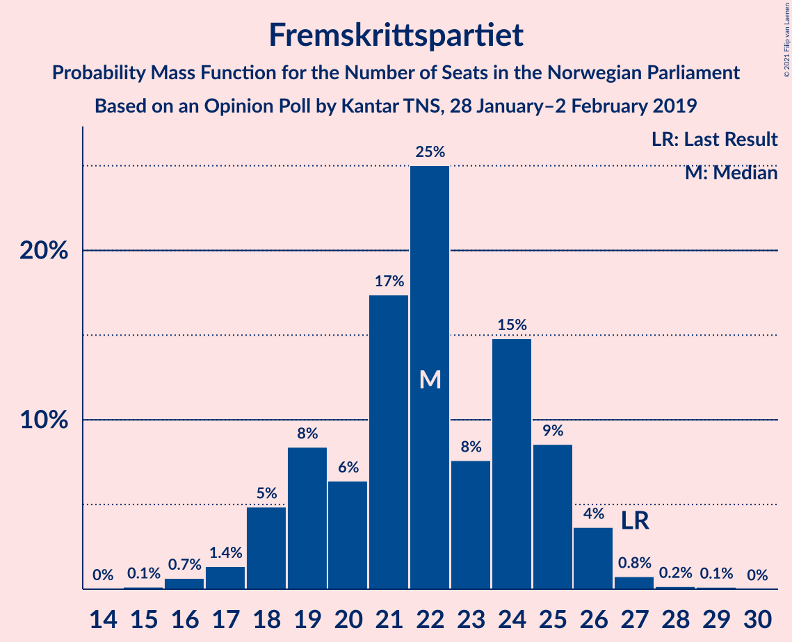
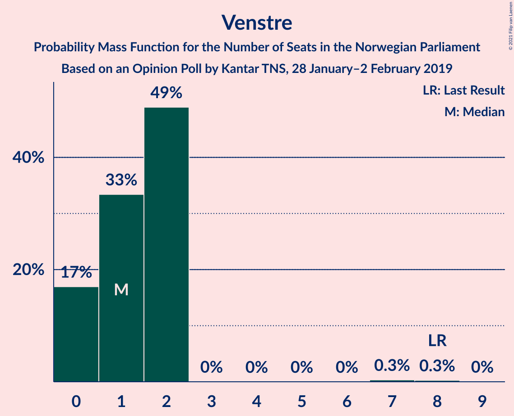
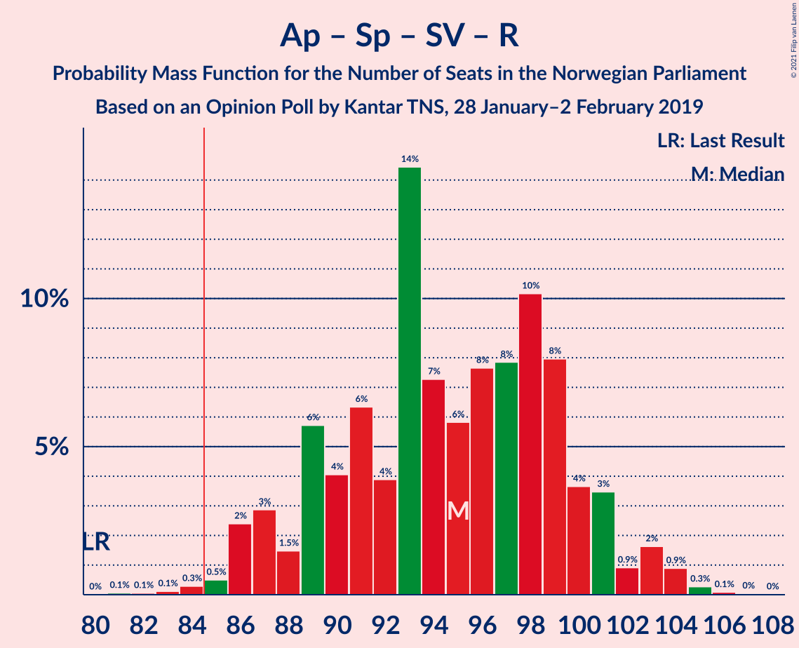
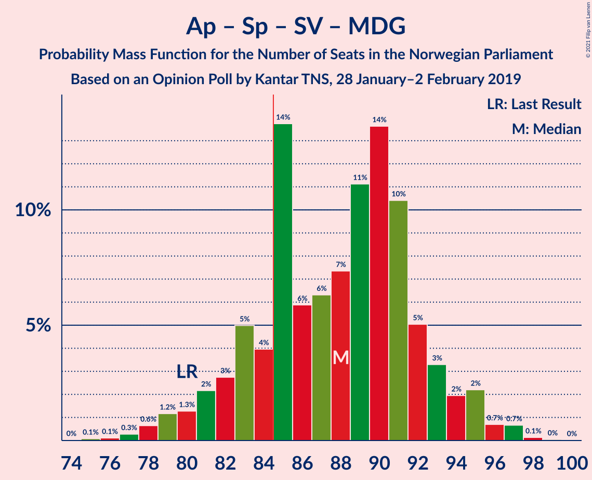
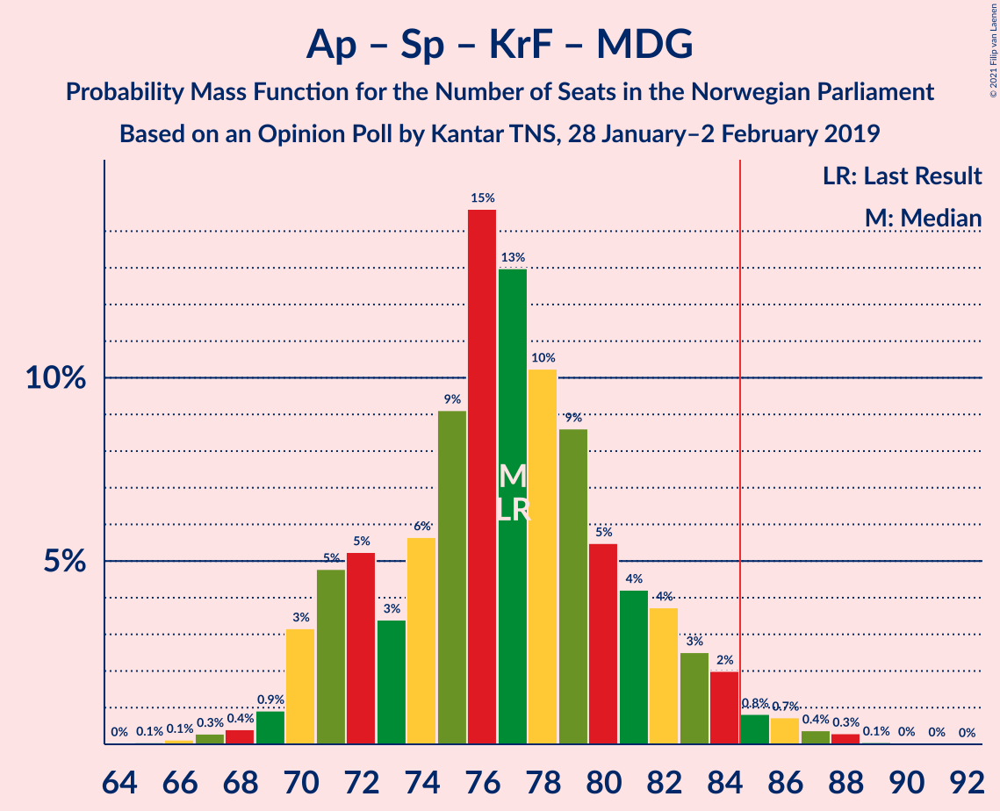
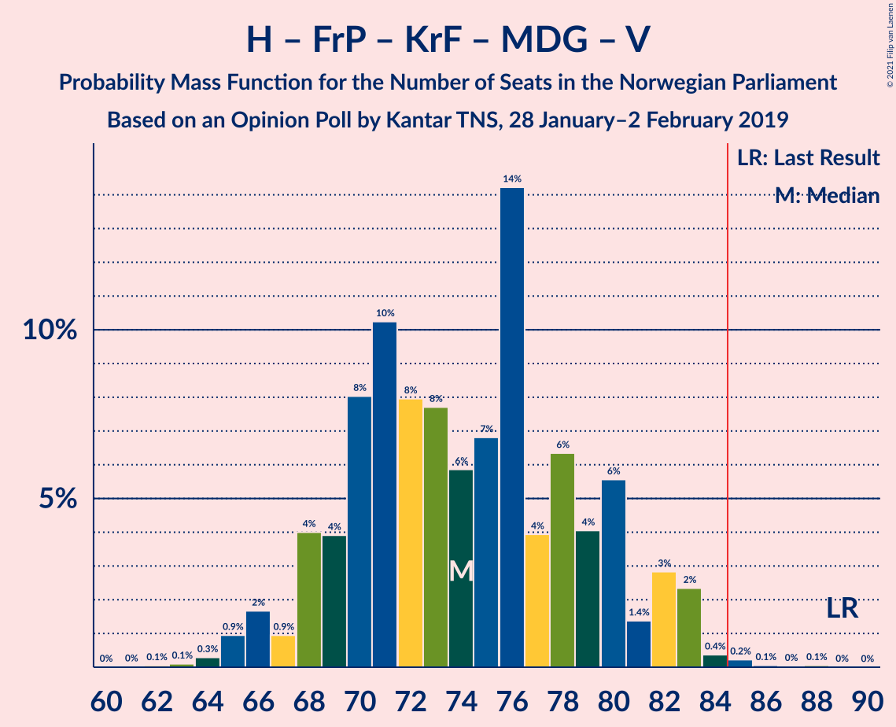

# Opinion Poll by Kantar TNS, 28 January–2 February 2019

<a href="#voting-intentions">Voting Intentions</a> | <a href="#seats">Seats</a> | <a href="#coalitions">Coalitions</a> | <a href="#technical-information">Technical Information</a>

## Voting Intentions

### Confidence Intervals

| Party | Last Result | Poll Result | 80% Confidence Interval | 90% Confidence Interval | 95% Confidence Interval | 99% Confidence Interval |
|:-----:|:-----------:|:-----------:|:-----------------------:|:-----------------------:|:-----------------------:|:-----------------------:|
| Arbeiderpartiet | 27.4% | 26.5% | 24.6–28.6% |24.1–29.1% |23.6–29.6% |22.7–30.7% |
| Høyre | 25.0% | 23.7% | 21.8–25.7% |21.3–26.2% |20.9–26.7% |20.0–27.7% |
| Fremskrittspartiet | 15.2% | 11.7% | 10.3–13.2% |10.0–13.7% |9.6–14.1% |9.0–14.8% |
| Senterpartiet | 10.3% | 10.4% | 9.2–11.9% |8.8–12.3% |8.5–12.7% |7.9–13.5% |
| Sosialistisk Venstreparti | 6.0% | 8.8% | 7.7–10.2% |7.3–10.6% |7.1–11.0% |6.6–11.7% |
| Rødt | 2.4% | 6.3% | 5.3–7.5% |5.0–7.8% |4.8–8.1% |4.4–8.8% |
| Kristelig Folkeparti | 4.2% | 4.0% | 3.3–5.1% |3.1–5.4% |2.9–5.6% |2.6–6.2% |
| Miljøpartiet De Grønne | 3.2% | 3.6% | 2.9–4.5% |2.7–4.8% |2.5–5.1% |2.2–5.6% |
| Venstre | 4.4% | 2.5% | 1.9–3.3% |1.7–3.6% |1.6–3.8% |1.4–4.2% |

*Note:* The poll result column reflects the actual value used in the calculations. Published results may vary slightly, and in addition be rounded to fewer digits.

## Seats

### Confidence Intervals

| Party | Last Result | Median | 80% Confidence Interval | 90% Confidence Interval | 95% Confidence Interval | 99% Confidence Interval |
|:-----:|:-----------:|:------:|:-----------------------:|:-----------------------:|:-----------------------:|:-----------------------:|
| <a href="#arbeiderpartiet">Arbeiderpartiet</a> | 49 | 47 | 44–53 |43–54 |42–54 |41–56 |
| <a href="#høyre">Høyre</a> | 45 | 42 | 38–45 |38–47 |37–48 |36–49 |
| <a href="#fremskrittspartiet">Fremskrittspartiet</a> | 27 | 22 | 19–25 |19–25 |17–26 |16–27 |
| <a href="#senterpartiet">Senterpartiet</a> | 19 | 20 | 17–23 |16–24 |15–24 |14–25 |
| <a href="#sosialistisk-venstreparti">Sosialistisk Venstreparti</a> | 11 | 17 | 13–18 |13–19 |13–19 |11–21 |
| <a href="#rødt">Rødt</a> | 1 | 11 | 9–13 |8–13 |8–14 |8–15 |
| <a href="#kristelig-folkeparti">Kristelig Folkeparti</a> | 8 | 3 | 2–9 |1–9 |1–10 |1–11 |
| <a href="#miljøpartiet-de-grønne">Miljøpartiet De Grønne</a> | 1 | 2 | 1–8 |1–9 |1–9 |1–10 |
| <a href="#venstre">Venstre</a> | 8 | 1 | 1–2 |0–2 |0–2 |0–8 |

### Arbeiderpartiet

*For a full overview of the results for this party, see the [Arbeiderpartiet](party-arbeiderpartiet.html) page.*

| Number of Seats | Probability | Accumulated | Special Marks |
|:---------------:|:-----------:|:-----------:|:-------------:|
| 40 | 0.1% | 100% |  |
| 41 | 1.1% | 99.9% |  |
| 42 | 3% | 98.8% |  |
| 43 | 2% | 96% |  |
| 44 | 5% | 94% |  |
| 45 | 5% | 89% |  |
| 46 | 13% | 84% |  |
| 47 | 36% | 72% | Median |
| 48 | 7% | 36% |  |
| 49 | 6% | 29% | Last Result |
| 50 | 4% | 23% |  |
| 51 | 2% | 19% |  |
| 52 | 7% | 18% |  |
| 53 | 5% | 10% |  |
| 54 | 3% | 6% |  |
| 55 | 1.4% | 2% |  |
| 56 | 0.2% | 0.7% |  |
| 57 | 0.4% | 0.5% |  |
| 58 | 0% | 0.1% |  |
| 59 | 0% | 0.1% |  |
| 60 | 0% | 0% |  |

### Høyre

*For a full overview of the results for this party, see the [Høyre](party-høyre.html) page.*

| Number of Seats | Probability | Accumulated | Special Marks |
|:---------------:|:-----------:|:-----------:|:-------------:|
| 34 | 0.1% | 100% |  |
| 35 | 0.2% | 99.9% |  |
| 36 | 2% | 99.7% |  |
| 37 | 0.9% | 98% |  |
| 38 | 23% | 97% |  |
| 39 | 6% | 73% |  |
| 40 | 11% | 68% |  |
| 41 | 3% | 57% |  |
| 42 | 29% | 53% | Median |
| 43 | 5% | 25% |  |
| 44 | 5% | 19% |  |
| 45 | 5% | 14% | Last Result |
| 46 | 4% | 9% |  |
| 47 | 2% | 5% |  |
| 48 | 2% | 4% |  |
| 49 | 0.7% | 1.1% |  |
| 50 | 0.1% | 0.4% |  |
| 51 | 0.3% | 0.3% |  |
| 52 | 0% | 0.1% |  |
| 53 | 0% | 0% |  |

### Fremskrittspartiet

*For a full overview of the results for this party, see the [Fremskrittspartiet](party-fremskrittspartiet.html) page.*

| Number of Seats | Probability | Accumulated | Special Marks |
|:---------------:|:-----------:|:-----------:|:-------------:|
| 15 | 0.1% | 100% |  |
| 16 | 1.1% | 99.9% |  |
| 17 | 1.4% | 98.8% |  |
| 18 | 2% | 97% |  |
| 19 | 10% | 95% |  |
| 20 | 7% | 86% |  |
| 21 | 15% | 79% |  |
| 22 | 19% | 64% | Median |
| 23 | 6% | 45% |  |
| 24 | 25% | 39% |  |
| 25 | 10% | 14% |  |
| 26 | 3% | 4% |  |
| 27 | 0.4% | 0.6% | Last Result |
| 28 | 0.1% | 0.2% |  |
| 29 | 0.1% | 0.1% |  |
| 30 | 0% | 0% |  |

### Senterpartiet

*For a full overview of the results for this party, see the [Senterpartiet](party-senterpartiet.html) page.*

| Number of Seats | Probability | Accumulated | Special Marks |
|:---------------:|:-----------:|:-----------:|:-------------:|
| 13 | 0.2% | 100% |  |
| 14 | 0.4% | 99.8% |  |
| 15 | 2% | 99.4% |  |
| 16 | 5% | 97% |  |
| 17 | 6% | 92% |  |
| 18 | 29% | 86% |  |
| 19 | 7% | 57% | Last Result |
| 20 | 8% | 51% | Median |
| 21 | 6% | 43% |  |
| 22 | 9% | 37% |  |
| 23 | 21% | 27% |  |
| 24 | 5% | 6% |  |
| 25 | 1.2% | 1.3% |  |
| 26 | 0.1% | 0.1% |  |
| 27 | 0% | 0% |  |

### Sosialistisk Venstreparti

*For a full overview of the results for this party, see the [Sosialistisk Venstreparti](party-sosialistiskvenstreparti.html) page.*

| Number of Seats | Probability | Accumulated | Special Marks |
|:---------------:|:-----------:|:-----------:|:-------------:|
| 10 | 0.1% | 100% |  |
| 11 | 0.5% | 99.9% | Last Result |
| 12 | 2% | 99.4% |  |
| 13 | 10% | 98% |  |
| 14 | 7% | 87% |  |
| 15 | 9% | 80% |  |
| 16 | 18% | 70% |  |
| 17 | 29% | 52% | Median |
| 18 | 16% | 23% |  |
| 19 | 4% | 6% |  |
| 20 | 2% | 2% |  |
| 21 | 0.6% | 0.8% |  |
| 22 | 0.2% | 0.2% |  |
| 23 | 0% | 0% |  |

### Rødt

*For a full overview of the results for this party, see the [Rødt](party-rødt.html) page.*

| Number of Seats | Probability | Accumulated | Special Marks |
|:---------------:|:-----------:|:-----------:|:-------------:|
| 1 | 0% | 100% | Last Result |
| 2 | 0.2% | 100% |  |
| 3 | 0% | 99.8% |  |
| 4 | 0% | 99.8% |  |
| 5 | 0% | 99.8% |  |
| 6 | 0% | 99.8% |  |
| 7 | 0.2% | 99.8% |  |
| 8 | 6% | 99.6% |  |
| 9 | 23% | 93% |  |
| 10 | 16% | 70% |  |
| 11 | 29% | 55% | Median |
| 12 | 7% | 25% |  |
| 13 | 14% | 18% |  |
| 14 | 3% | 4% |  |
| 15 | 0.7% | 1.0% |  |
| 16 | 0.3% | 0.3% |  |
| 17 | 0% | 0.1% |  |
| 18 | 0% | 0% |  |

### Kristelig Folkeparti

*For a full overview of the results for this party, see the [Kristelig Folkeparti](party-kristeligfolkeparti.html) page.*

| Number of Seats | Probability | Accumulated | Special Marks |
|:---------------:|:-----------:|:-----------:|:-------------:|
| 0 | 0.2% | 100% |  |
| 1 | 6% | 99.8% |  |
| 2 | 20% | 94% |  |
| 3 | 25% | 74% | Median |
| 4 | 0% | 48% |  |
| 5 | 0% | 48% |  |
| 6 | 0% | 48% |  |
| 7 | 6% | 48% |  |
| 8 | 32% | 42% | Last Result |
| 9 | 6% | 10% |  |
| 10 | 3% | 4% |  |
| 11 | 0.9% | 1.0% |  |
| 12 | 0.1% | 0.1% |  |
| 13 | 0% | 0% |  |

### Miljøpartiet De Grønne

*For a full overview of the results for this party, see the [Miljøpartiet De Grønne](party-miljøpartietdegrønne.html) page.*

| Number of Seats | Probability | Accumulated | Special Marks |
|:---------------:|:-----------:|:-----------:|:-------------:|
| 0 | 0.1% | 100% |  |
| 1 | 21% | 99.9% | Last Result |
| 2 | 34% | 79% | Median |
| 3 | 1.1% | 45% |  |
| 4 | 0% | 44% |  |
| 5 | 0% | 44% |  |
| 6 | 0% | 44% |  |
| 7 | 28% | 44% |  |
| 8 | 10% | 16% |  |
| 9 | 4% | 6% |  |
| 10 | 2% | 2% |  |
| 11 | 0.2% | 0.2% |  |
| 12 | 0% | 0% |  |

### Venstre

*For a full overview of the results for this party, see the [Venstre](party-venstre.html) page.*

| Number of Seats | Probability | Accumulated | Special Marks |
|:---------------:|:-----------:|:-----------:|:-------------:|
| 0 | 7% | 100% |  |
| 1 | 47% | 93% | Median |
| 2 | 44% | 46% |  |
| 3 | 0% | 2% |  |
| 4 | 0% | 2% |  |
| 5 | 0% | 2% |  |
| 6 | 0% | 2% |  |
| 7 | 1.0% | 2% |  |
| 8 | 0.6% | 0.7% | Last Result |
| 9 | 0.1% | 0.1% |  |
| 10 | 0% | 0% |  |

## Coalitions

### Confidence Intervals

| Coalition | Last Result | Median | Majority? | 80% Confidence Interval | 90% Confidence Interval | 95% Confidence Interval | 99% Confidence Interval |
|:---------:|:-----------:|:------:|:---------:|:-----------------------:|:-----------------------:|:-----------------------:|:-----------------------:|
| Arbeiderpartiet – Senterpartiet – Sosialistisk Venstreparti – Rødt – Miljøpartiet De Grønne | 81 | 98 | 100% | 95–103 | 92–105 | 90–106 | 89–108 |
| Arbeiderpartiet – Senterpartiet – Sosialistisk Venstreparti – Rødt | 80 | 94 | 99.1% | 89–101 | 89–101 | 88–104 | 83–105 |
| Arbeiderpartiet – Senterpartiet – Sosialistisk Venstreparti – Kristelig Folkeparti – Miljøpartiet De Grønne | 88 | 94 | 98% | 88–97 | 87–98 | 85–99 | 84–102 |
| Høyre – Fremskrittspartiet – Senterpartiet – Kristelig Folkeparti – Venstre | 107 | 90 | 91% | 85–95 | 83–97 | 83–98 | 80–99 |
| Arbeiderpartiet – Senterpartiet – Sosialistisk Venstreparti – Miljøpartiet De Grønne | 80 | 89 | 84% | 83–92 | 80–95 | 79–95 | 78–97 |
| Arbeiderpartiet – Senterpartiet – Sosialistisk Venstreparti | 79 | 83 | 41% | 79–90 | 77–91 | 77–93 | 73–94 |
| Arbeiderpartiet – Senterpartiet – Kristelig Folkeparti – Miljøpartiet De Grønne | 77 | 78 | 0.7% | 72–82 | 71–83 | 69–83 | 67–85 |
| Høyre – Fremskrittspartiet – Kristelig Folkeparti – Miljøpartiet De Grønne – Venstre | 89 | 75 | 0.7% | 68–79 | 68–80 | 65–81 | 64–86 |
| Arbeiderpartiet – Senterpartiet – Kristelig Folkeparti | 76 | 73 | 0% | 68–78 | 67–79 | 66–80 | 64–82 |
| Høyre – Fremskrittspartiet – Kristelig Folkeparti – Venstre | 88 | 71 | 0% | 65–74 | 64–77 | 63–79 | 61–80 |
| Arbeiderpartiet – Senterpartiet | 68 | 67 | 0% | 63–75 | 61–75 | 60–76 | 58–77 |
| Høyre – Fremskrittspartiet – Venstre | 80 | 64 | 0% | 61–70 | 60–72 | 59–72 | 57–73 |
| Arbeiderpartiet – Sosialistisk Venstreparti | 60 | 64 | 0% | 60–68 | 58–69 | 57–70 | 56–73 |
| Høyre – Fremskrittspartiet | 72 | 63 | 0% | 60–68 | 59–70 | 57–70 | 55–71 |
| Høyre – Kristelig Folkeparti – Venstre | 61 | 47 | 0% | 44–53 | 43–57 | 43–59 | 41–61 |
| Senterpartiet – Kristelig Folkeparti – Venstre | 35 | 27 | 0% | 22–31 | 21–34 | 20–34 | 18–34 |

### Arbeiderpartiet – Senterpartiet – Sosialistisk Venstreparti – Rødt – Miljøpartiet De Grønne

| Number of Seats | Probability | Accumulated | Special Marks |
|:---------------:|:-----------:|:-----------:|:-------------:|
| 81 | 0% | 100% | Last Result |
| 82 | 0% | 100% |  |
| 83 | 0% | 100% |  |
| 84 | 0% | 100% |  |
| 85 | 0% | 100% | Majority |
| 86 | 0.1% | 100% |  |
| 87 | 0.1% | 99.9% |  |
| 88 | 0.1% | 99.8% |  |
| 89 | 0.6% | 99.8% |  |
| 90 | 2% | 99.1% |  |
| 91 | 1.2% | 97% |  |
| 92 | 2% | 96% |  |
| 93 | 2% | 93% |  |
| 94 | 0.8% | 91% |  |
| 95 | 8% | 91% |  |
| 96 | 6% | 83% |  |
| 97 | 5% | 76% | Median |
| 98 | 25% | 72% |  |
| 99 | 7% | 47% |  |
| 100 | 1.2% | 40% |  |
| 101 | 16% | 38% |  |
| 102 | 11% | 22% |  |
| 103 | 2% | 12% |  |
| 104 | 2% | 10% |  |
| 105 | 4% | 8% |  |
| 106 | 3% | 4% |  |
| 107 | 1.1% | 2% |  |
| 108 | 0.2% | 0.6% |  |
| 109 | 0.1% | 0.4% |  |
| 110 | 0% | 0.2% |  |
| 111 | 0.2% | 0.2% |  |
| 112 | 0% | 0% |  |

### Arbeiderpartiet – Senterpartiet – Sosialistisk Venstreparti – Rødt

| Number of Seats | Probability | Accumulated | Special Marks |
|:---------------:|:-----------:|:-----------:|:-------------:|
| 80 | 0% | 100% | Last Result |
| 81 | 0.4% | 100% |  |
| 82 | 0.1% | 99.6% |  |
| 83 | 0.2% | 99.6% |  |
| 84 | 0.3% | 99.4% |  |
| 85 | 0.1% | 99.1% | Majority |
| 86 | 0.8% | 99.0% |  |
| 87 | 0.6% | 98% |  |
| 88 | 2% | 98% |  |
| 89 | 6% | 96% |  |
| 90 | 4% | 90% |  |
| 91 | 23% | 86% |  |
| 92 | 2% | 63% |  |
| 93 | 5% | 60% |  |
| 94 | 11% | 55% |  |
| 95 | 0.8% | 44% | Median |
| 96 | 6% | 43% |  |
| 97 | 3% | 37% |  |
| 98 | 6% | 34% |  |
| 99 | 16% | 27% |  |
| 100 | 0.4% | 11% |  |
| 101 | 7% | 11% |  |
| 102 | 1.2% | 4% |  |
| 103 | 0.2% | 3% |  |
| 104 | 2% | 3% |  |
| 105 | 0.5% | 0.7% |  |
| 106 | 0.1% | 0.2% |  |
| 107 | 0.1% | 0.1% |  |
| 108 | 0% | 0% |  |

### Arbeiderpartiet – Senterpartiet – Sosialistisk Venstreparti – Kristelig Folkeparti – Miljøpartiet De Grønne

| Number of Seats | Probability | Accumulated | Special Marks |
|:---------------:|:-----------:|:-----------:|:-------------:|
| 81 | 0% | 100% |  |
| 82 | 0.1% | 99.9% |  |
| 83 | 0.3% | 99.9% |  |
| 84 | 2% | 99.6% |  |
| 85 | 0.5% | 98% | Majority |
| 86 | 0.6% | 97% |  |
| 87 | 6% | 97% |  |
| 88 | 5% | 91% | Last Result |
| 89 | 6% | 86% | Median |
| 90 | 3% | 79% |  |
| 91 | 3% | 76% |  |
| 92 | 16% | 74% |  |
| 93 | 1.4% | 58% |  |
| 94 | 11% | 56% |  |
| 95 | 12% | 45% |  |
| 96 | 2% | 33% |  |
| 97 | 24% | 31% |  |
| 98 | 4% | 8% |  |
| 99 | 2% | 3% |  |
| 100 | 0.3% | 1.3% |  |
| 101 | 0.5% | 1.0% |  |
| 102 | 0.4% | 0.5% |  |
| 103 | 0% | 0.2% |  |
| 104 | 0% | 0.1% |  |
| 105 | 0% | 0.1% |  |
| 106 | 0.1% | 0.1% |  |
| 107 | 0% | 0% |  |

### Høyre – Fremskrittspartiet – Senterpartiet – Kristelig Folkeparti – Venstre

| Number of Seats | Probability | Accumulated | Special Marks |
|:---------------:|:-----------:|:-----------:|:-------------:|
| 77 | 0.1% | 100% |  |
| 78 | 0% | 99.9% |  |
| 79 | 0.3% | 99.9% |  |
| 80 | 0.2% | 99.6% |  |
| 81 | 0.3% | 99.3% |  |
| 82 | 1.2% | 99.0% |  |
| 83 | 4% | 98% |  |
| 84 | 3% | 94% |  |
| 85 | 2% | 91% | Majority |
| 86 | 3% | 90% |  |
| 87 | 2% | 86% |  |
| 88 | 3% | 84% | Median |
| 89 | 28% | 81% |  |
| 90 | 11% | 53% |  |
| 91 | 14% | 42% |  |
| 92 | 8% | 28% |  |
| 93 | 4% | 20% |  |
| 94 | 3% | 15% |  |
| 95 | 6% | 13% |  |
| 96 | 0.9% | 7% |  |
| 97 | 2% | 6% |  |
| 98 | 3% | 3% |  |
| 99 | 0.4% | 0.6% |  |
| 100 | 0.1% | 0.2% |  |
| 101 | 0% | 0.1% |  |
| 102 | 0% | 0% |  |
| 103 | 0% | 0% |  |
| 104 | 0% | 0% |  |
| 105 | 0% | 0% |  |
| 106 | 0% | 0% |  |
| 107 | 0% | 0% | Last Result |

### Arbeiderpartiet – Senterpartiet – Sosialistisk Venstreparti – Miljøpartiet De Grønne

| Number of Seats | Probability | Accumulated | Special Marks |
|:---------------:|:-----------:|:-----------:|:-------------:|
| 75 | 0.1% | 100% |  |
| 76 | 0.2% | 99.9% |  |
| 77 | 0.1% | 99.7% |  |
| 78 | 2% | 99.6% |  |
| 79 | 2% | 98% |  |
| 80 | 1.4% | 96% | Last Result |
| 81 | 2% | 95% |  |
| 82 | 1.2% | 93% |  |
| 83 | 4% | 92% |  |
| 84 | 4% | 88% |  |
| 85 | 7% | 84% | Majority |
| 86 | 8% | 77% | Median |
| 87 | 4% | 69% |  |
| 88 | 5% | 65% |  |
| 89 | 23% | 61% |  |
| 90 | 14% | 37% |  |
| 91 | 6% | 23% |  |
| 92 | 10% | 17% |  |
| 93 | 2% | 7% |  |
| 94 | 0.6% | 6% |  |
| 95 | 4% | 5% |  |
| 96 | 1.1% | 2% |  |
| 97 | 0.3% | 0.5% |  |
| 98 | 0.1% | 0.3% |  |
| 99 | 0.1% | 0.2% |  |
| 100 | 0% | 0% |  |

### Arbeiderpartiet – Senterpartiet – Sosialistisk Venstreparti

| Number of Seats | Probability | Accumulated | Special Marks |
|:---------------:|:-----------:|:-----------:|:-------------:|
| 72 | 0.1% | 100% |  |
| 73 | 0.5% | 99.8% |  |
| 74 | 0.3% | 99.4% |  |
| 75 | 0.5% | 99.1% |  |
| 76 | 0.9% | 98.6% |  |
| 77 | 4% | 98% |  |
| 78 | 2% | 93% |  |
| 79 | 4% | 91% | Last Result |
| 80 | 2% | 87% |  |
| 81 | 4% | 85% |  |
| 82 | 27% | 80% |  |
| 83 | 8% | 53% |  |
| 84 | 4% | 45% | Median |
| 85 | 10% | 41% | Majority |
| 86 | 3% | 31% |  |
| 87 | 1.2% | 28% |  |
| 88 | 14% | 27% |  |
| 89 | 3% | 13% |  |
| 90 | 0.9% | 10% |  |
| 91 | 6% | 9% |  |
| 92 | 0.1% | 3% |  |
| 93 | 2% | 3% |  |
| 94 | 0.6% | 0.6% |  |
| 95 | 0% | 0.1% |  |
| 96 | 0% | 0% |  |

### Arbeiderpartiet – Senterpartiet – Kristelig Folkeparti – Miljøpartiet De Grønne

| Number of Seats | Probability | Accumulated | Special Marks |
|:---------------:|:-----------:|:-----------:|:-------------:|
| 66 | 0% | 100% |  |
| 67 | 0.5% | 99.9% |  |
| 68 | 0.5% | 99.5% |  |
| 69 | 2% | 99.0% |  |
| 70 | 2% | 97% |  |
| 71 | 1.3% | 95% |  |
| 72 | 10% | 94% | Median |
| 73 | 4% | 83% |  |
| 74 | 14% | 80% |  |
| 75 | 3% | 65% |  |
| 76 | 9% | 63% |  |
| 77 | 3% | 54% | Last Result |
| 78 | 0.9% | 51% |  |
| 79 | 8% | 50% |  |
| 80 | 23% | 42% |  |
| 81 | 8% | 19% |  |
| 82 | 5% | 12% |  |
| 83 | 4% | 6% |  |
| 84 | 1.4% | 2% |  |
| 85 | 0.3% | 0.7% | Majority |
| 86 | 0.2% | 0.5% |  |
| 87 | 0.1% | 0.3% |  |
| 88 | 0.1% | 0.2% |  |
| 89 | 0% | 0.1% |  |
| 90 | 0% | 0.1% |  |
| 91 | 0% | 0.1% |  |
| 92 | 0.1% | 0.1% |  |
| 93 | 0% | 0% |  |

### Høyre – Fremskrittspartiet – Kristelig Folkeparti – Miljøpartiet De Grønne – Venstre

| Number of Seats | Probability | Accumulated | Special Marks |
|:---------------:|:-----------:|:-----------:|:-------------:|
| 62 | 0.1% | 100% |  |
| 63 | 0.1% | 99.9% |  |
| 64 | 0.5% | 99.8% |  |
| 65 | 2% | 99.3% |  |
| 66 | 0.2% | 97% |  |
| 67 | 1.2% | 97% |  |
| 68 | 7% | 96% |  |
| 69 | 0.5% | 89% |  |
| 70 | 16% | 88% | Median |
| 71 | 6% | 73% |  |
| 72 | 3% | 66% |  |
| 73 | 7% | 63% |  |
| 74 | 0.8% | 56% |  |
| 75 | 11% | 55% |  |
| 76 | 5% | 44% |  |
| 77 | 2% | 39% |  |
| 78 | 23% | 37% |  |
| 79 | 4% | 14% |  |
| 80 | 5% | 10% |  |
| 81 | 2% | 4% |  |
| 82 | 0.5% | 2% |  |
| 83 | 0.8% | 2% |  |
| 84 | 0.1% | 0.8% |  |
| 85 | 0.2% | 0.7% | Majority |
| 86 | 0.2% | 0.6% |  |
| 87 | 0.1% | 0.4% |  |
| 88 | 0.4% | 0.4% |  |
| 89 | 0% | 0% | Last Result |

### Arbeiderpartiet – Senterpartiet – Kristelig Folkeparti

| Number of Seats | Probability | Accumulated | Special Marks |
|:---------------:|:-----------:|:-----------:|:-------------:|
| 61 | 0% | 100% |  |
| 62 | 0.1% | 99.9% |  |
| 63 | 0.1% | 99.9% |  |
| 64 | 0.4% | 99.8% |  |
| 65 | 0.4% | 99.4% |  |
| 66 | 4% | 99.0% |  |
| 67 | 4% | 95% |  |
| 68 | 2% | 91% |  |
| 69 | 4% | 89% |  |
| 70 | 5% | 85% | Median |
| 71 | 8% | 80% |  |
| 72 | 13% | 71% |  |
| 73 | 24% | 58% |  |
| 74 | 11% | 34% |  |
| 75 | 4% | 24% |  |
| 76 | 3% | 20% | Last Result |
| 77 | 0.2% | 16% |  |
| 78 | 7% | 16% |  |
| 79 | 5% | 9% |  |
| 80 | 3% | 4% |  |
| 81 | 0.1% | 1.0% |  |
| 82 | 0.7% | 1.0% |  |
| 83 | 0.2% | 0.3% |  |
| 84 | 0.1% | 0.1% |  |
| 85 | 0% | 0% | Majority |

### Høyre – Fremskrittspartiet – Kristelig Folkeparti – Venstre

| Number of Seats | Probability | Accumulated | Special Marks |
|:---------------:|:-----------:|:-----------:|:-------------:|
| 58 | 0.2% | 100% |  |
| 59 | 0% | 99.8% |  |
| 60 | 0.1% | 99.8% |  |
| 61 | 0.2% | 99.6% |  |
| 62 | 1.1% | 99.4% |  |
| 63 | 3% | 98% |  |
| 64 | 4% | 96% |  |
| 65 | 2% | 92% |  |
| 66 | 2% | 90% |  |
| 67 | 11% | 88% |  |
| 68 | 16% | 77% | Median |
| 69 | 1.2% | 61% |  |
| 70 | 7% | 60% |  |
| 71 | 25% | 53% |  |
| 72 | 5% | 28% |  |
| 73 | 6% | 23% |  |
| 74 | 8% | 17% |  |
| 75 | 0.8% | 9% |  |
| 76 | 1.5% | 8% |  |
| 77 | 2% | 6% |  |
| 78 | 1.1% | 4% |  |
| 79 | 2% | 3% |  |
| 80 | 0.6% | 0.8% |  |
| 81 | 0.1% | 0.2% |  |
| 82 | 0% | 0.1% |  |
| 83 | 0.1% | 0.1% |  |
| 84 | 0% | 0% |  |
| 85 | 0% | 0% | Majority |
| 86 | 0% | 0% |  |
| 87 | 0% | 0% |  |
| 88 | 0% | 0% | Last Result |

### Arbeiderpartiet – Senterpartiet

| Number of Seats | Probability | Accumulated | Special Marks |
|:---------------:|:-----------:|:-----------:|:-------------:|
| 56 | 0.1% | 100% |  |
| 57 | 0% | 99.9% |  |
| 58 | 0.5% | 99.9% |  |
| 59 | 0.2% | 99.3% |  |
| 60 | 2% | 99.1% |  |
| 61 | 2% | 97% |  |
| 62 | 2% | 95% |  |
| 63 | 3% | 92% |  |
| 64 | 5% | 89% |  |
| 65 | 24% | 85% |  |
| 66 | 9% | 61% |  |
| 67 | 4% | 52% | Median |
| 68 | 5% | 47% | Last Result |
| 69 | 6% | 42% |  |
| 70 | 17% | 36% |  |
| 71 | 3% | 20% |  |
| 72 | 4% | 17% |  |
| 73 | 0.5% | 14% |  |
| 74 | 3% | 13% |  |
| 75 | 6% | 10% |  |
| 76 | 1.4% | 4% |  |
| 77 | 2% | 2% |  |
| 78 | 0.1% | 0.2% |  |
| 79 | 0% | 0.1% |  |
| 80 | 0% | 0% |  |

### Høyre – Fremskrittspartiet – Venstre

| Number of Seats | Probability | Accumulated | Special Marks |
|:---------------:|:-----------:|:-----------:|:-------------:|
| 54 | 0.1% | 100% |  |
| 55 | 0% | 99.9% |  |
| 56 | 0.1% | 99.9% |  |
| 57 | 1.2% | 99.8% |  |
| 58 | 0.9% | 98.6% |  |
| 59 | 1.1% | 98% |  |
| 60 | 3% | 97% |  |
| 61 | 4% | 94% |  |
| 62 | 5% | 90% |  |
| 63 | 26% | 85% |  |
| 64 | 14% | 59% |  |
| 65 | 4% | 46% | Median |
| 66 | 16% | 42% |  |
| 67 | 5% | 26% |  |
| 68 | 5% | 20% |  |
| 69 | 3% | 15% |  |
| 70 | 4% | 11% |  |
| 71 | 2% | 7% |  |
| 72 | 4% | 5% |  |
| 73 | 0.4% | 0.7% |  |
| 74 | 0.2% | 0.4% |  |
| 75 | 0% | 0.2% |  |
| 76 | 0.1% | 0.1% |  |
| 77 | 0.1% | 0.1% |  |
| 78 | 0% | 0% |  |
| 79 | 0% | 0% |  |
| 80 | 0% | 0% | Last Result |

### Arbeiderpartiet – Sosialistisk Venstreparti

| Number of Seats | Probability | Accumulated | Special Marks |
|:---------------:|:-----------:|:-----------:|:-------------:|
| 54 | 0.3% | 100% |  |
| 55 | 0.1% | 99.7% |  |
| 56 | 1.4% | 99.6% |  |
| 57 | 1.2% | 98% |  |
| 58 | 4% | 97% |  |
| 59 | 3% | 93% |  |
| 60 | 3% | 90% | Last Result |
| 61 | 7% | 87% |  |
| 62 | 5% | 80% |  |
| 63 | 11% | 75% |  |
| 64 | 24% | 64% | Median |
| 65 | 16% | 40% |  |
| 66 | 7% | 25% |  |
| 67 | 2% | 18% |  |
| 68 | 10% | 16% |  |
| 69 | 2% | 6% |  |
| 70 | 2% | 4% |  |
| 71 | 0.4% | 1.5% |  |
| 72 | 0.3% | 1.0% |  |
| 73 | 0.3% | 0.7% |  |
| 74 | 0.4% | 0.4% |  |
| 75 | 0% | 0.1% |  |
| 76 | 0% | 0% |  |

### Høyre – Fremskrittspartiet

| Number of Seats | Probability | Accumulated | Special Marks |
|:---------------:|:-----------:|:-----------:|:-------------:|
| 53 | 0.1% | 100% |  |
| 54 | 0.1% | 99.9% |  |
| 55 | 0.6% | 99.8% |  |
| 56 | 1.5% | 99.3% |  |
| 57 | 0.8% | 98% |  |
| 58 | 0.6% | 97% |  |
| 59 | 3% | 96% |  |
| 60 | 4% | 94% |  |
| 61 | 7% | 90% |  |
| 62 | 27% | 83% |  |
| 63 | 14% | 56% |  |
| 64 | 17% | 42% | Median |
| 65 | 5% | 24% |  |
| 66 | 2% | 19% |  |
| 67 | 2% | 17% |  |
| 68 | 7% | 15% |  |
| 69 | 3% | 8% |  |
| 70 | 4% | 5% |  |
| 71 | 0.4% | 0.7% |  |
| 72 | 0.2% | 0.3% | Last Result |
| 73 | 0% | 0.1% |  |
| 74 | 0% | 0.1% |  |
| 75 | 0% | 0.1% |  |
| 76 | 0% | 0% |  |

### Høyre – Kristelig Folkeparti – Venstre

| Number of Seats | Probability | Accumulated | Special Marks |
|:---------------:|:-----------:|:-----------:|:-------------:|
| 39 | 0.1% | 100% |  |
| 40 | 0.3% | 99.9% |  |
| 41 | 0.1% | 99.5% |  |
| 42 | 1.3% | 99.4% |  |
| 43 | 4% | 98% |  |
| 44 | 4% | 94% |  |
| 45 | 5% | 90% |  |
| 46 | 25% | 85% | Median |
| 47 | 26% | 60% |  |
| 48 | 7% | 33% |  |
| 49 | 4% | 26% |  |
| 50 | 4% | 22% |  |
| 51 | 3% | 19% |  |
| 52 | 5% | 16% |  |
| 53 | 2% | 11% |  |
| 54 | 1.2% | 9% |  |
| 55 | 2% | 8% |  |
| 56 | 0.4% | 6% |  |
| 57 | 2% | 5% |  |
| 58 | 0.2% | 3% |  |
| 59 | 2% | 3% |  |
| 60 | 0.4% | 1.2% |  |
| 61 | 0.6% | 0.8% | Last Result |
| 62 | 0.1% | 0.1% |  |
| 63 | 0% | 0% |  |

### Senterpartiet – Kristelig Folkeparti – Venstre

| Number of Seats | Probability | Accumulated | Special Marks |
|:---------------:|:-----------:|:-----------:|:-------------:|
| 17 | 0.1% | 100% |  |
| 18 | 0.4% | 99.9% |  |
| 19 | 0.4% | 99.5% |  |
| 20 | 2% | 99.1% |  |
| 21 | 5% | 97% |  |
| 22 | 4% | 92% |  |
| 23 | 4% | 88% |  |
| 24 | 3% | 84% | Median |
| 25 | 7% | 81% |  |
| 26 | 5% | 74% |  |
| 27 | 49% | 69% |  |
| 28 | 4% | 21% |  |
| 29 | 3% | 17% |  |
| 30 | 3% | 14% |  |
| 31 | 4% | 11% |  |
| 32 | 2% | 8% |  |
| 33 | 0.3% | 5% |  |
| 34 | 5% | 5% |  |
| 35 | 0.1% | 0.2% | Last Result |
| 36 | 0.1% | 0.1% |  |
| 37 | 0% | 0% |  |

## Technical Information

### Opinion Poll

+ **Polling firm:** Kantar TNS
+ **Commissioner(s):** —
+ **Fieldwork period:** 28 January–2 February 2019

### Calculations

+ **Sample size:** 815
+ **Simulations done:** 131,072
+ **Error estimate:** 1.84%

