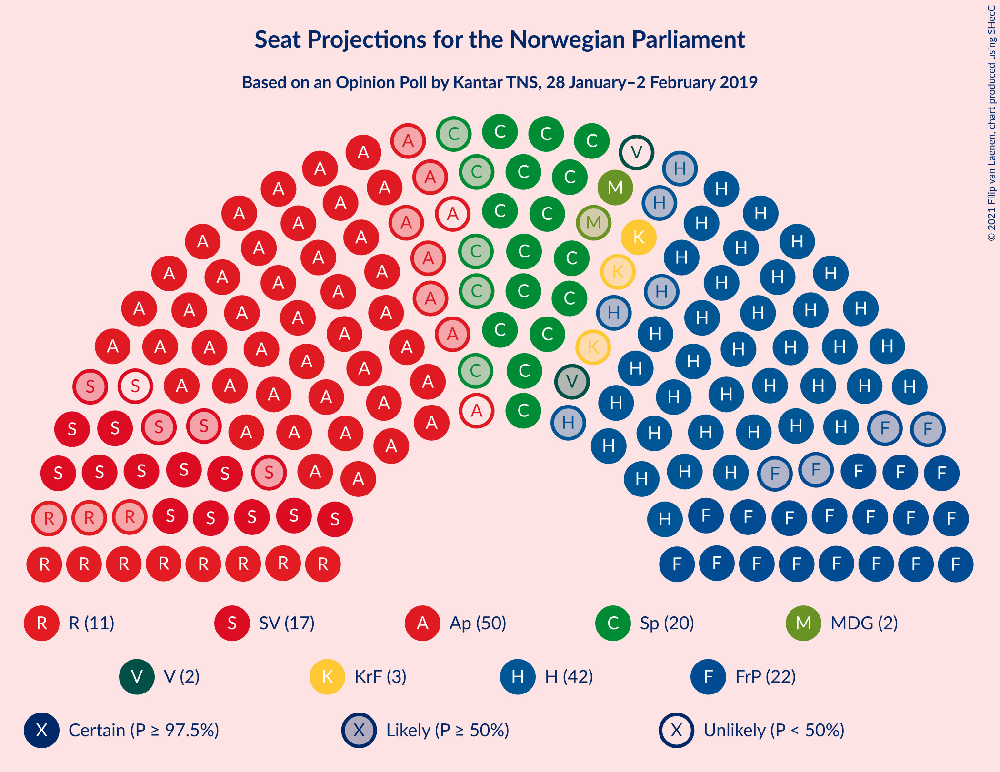
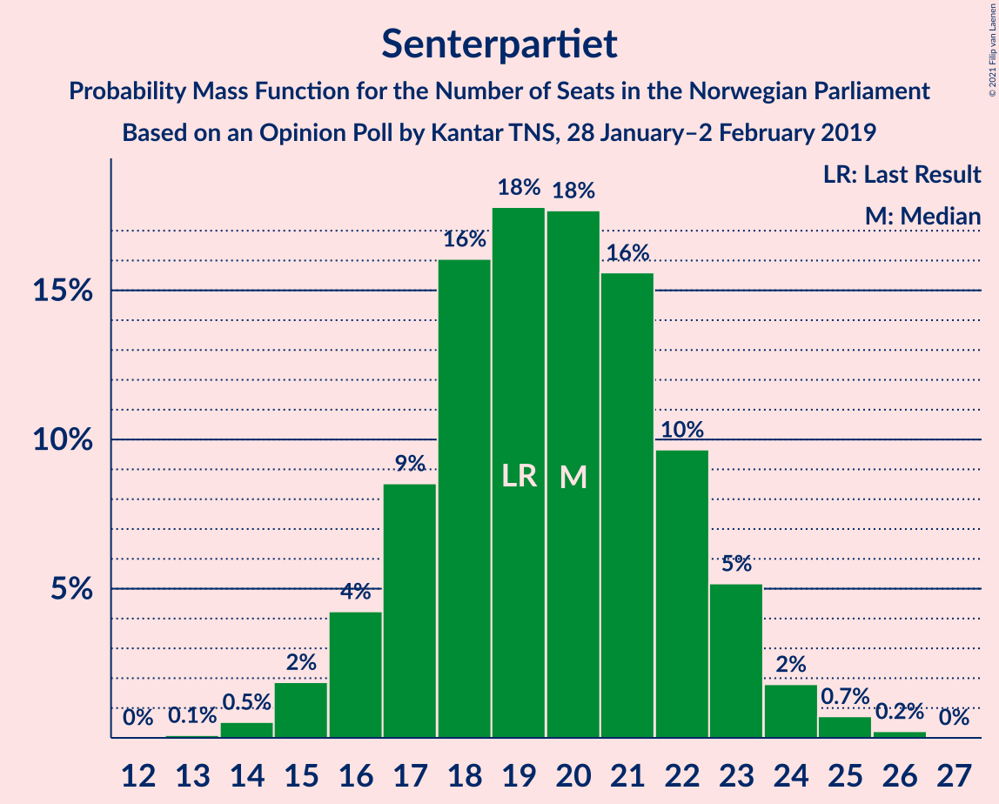
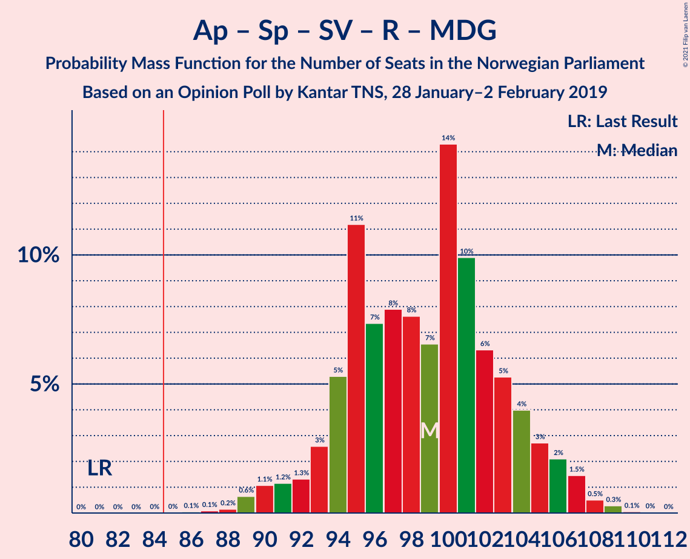
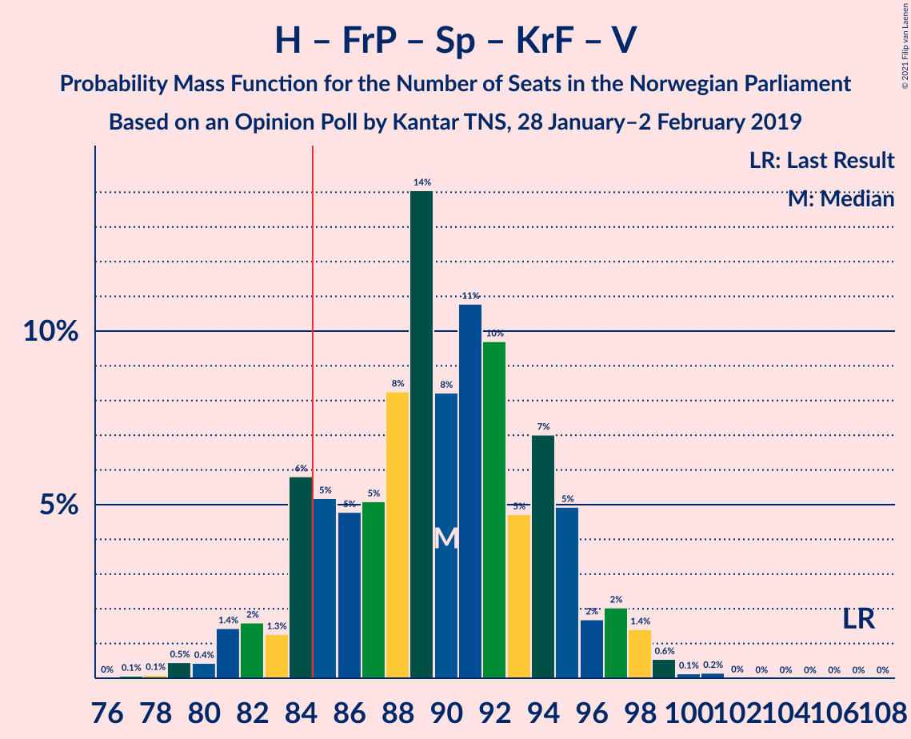
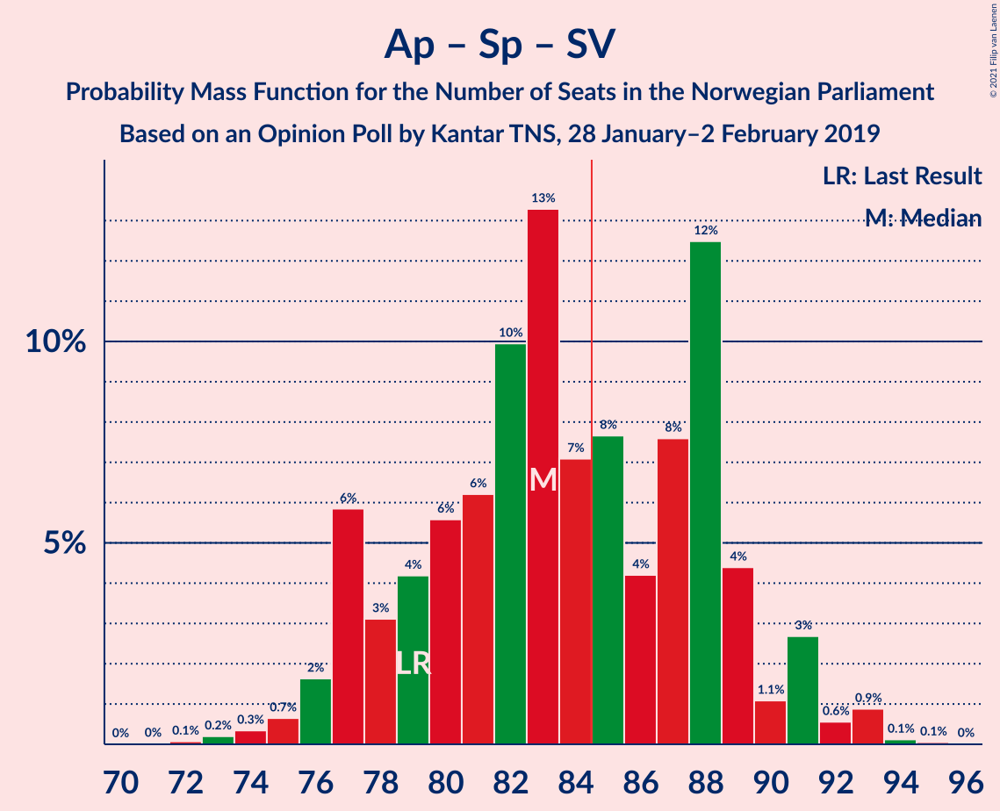
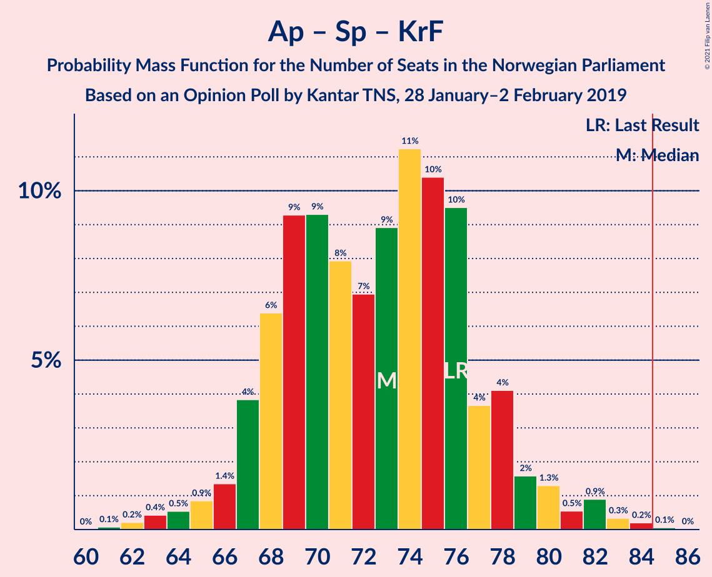
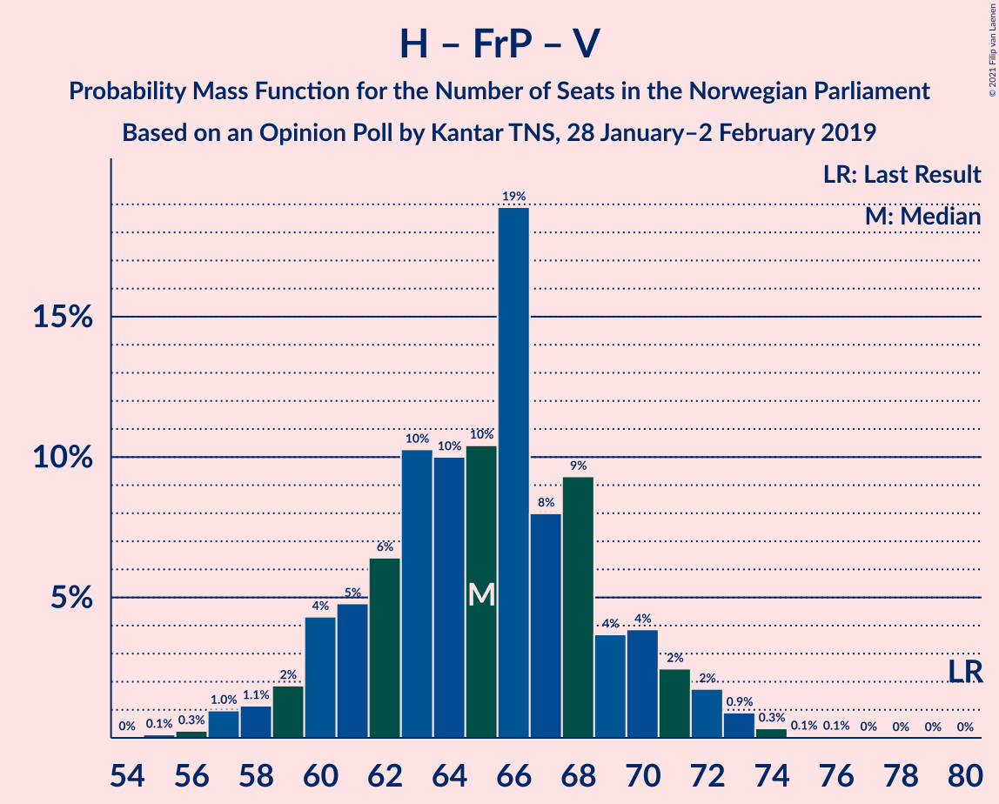
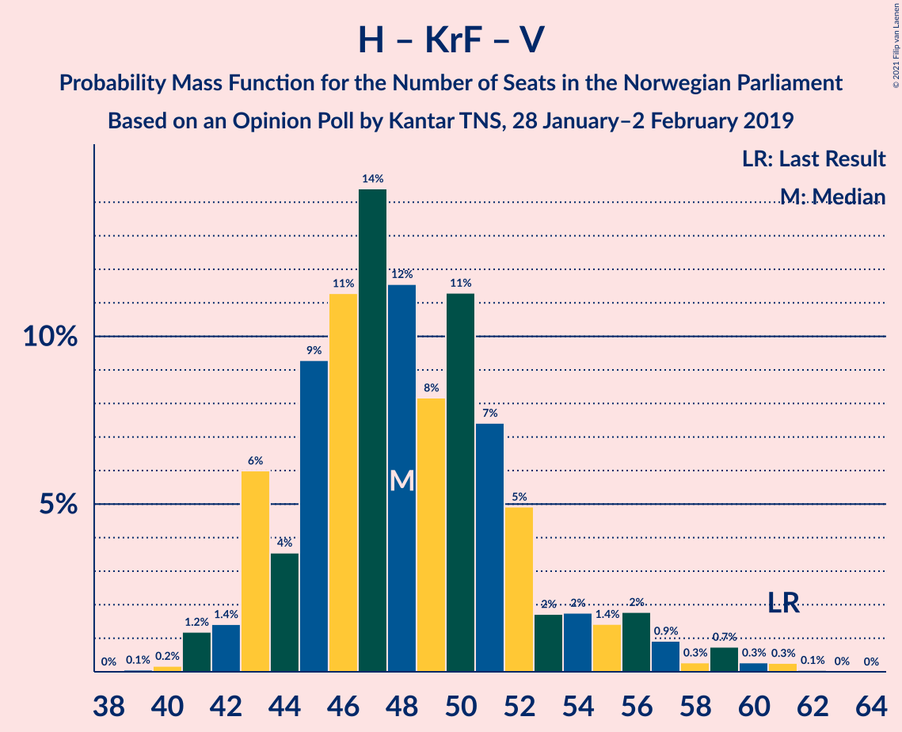
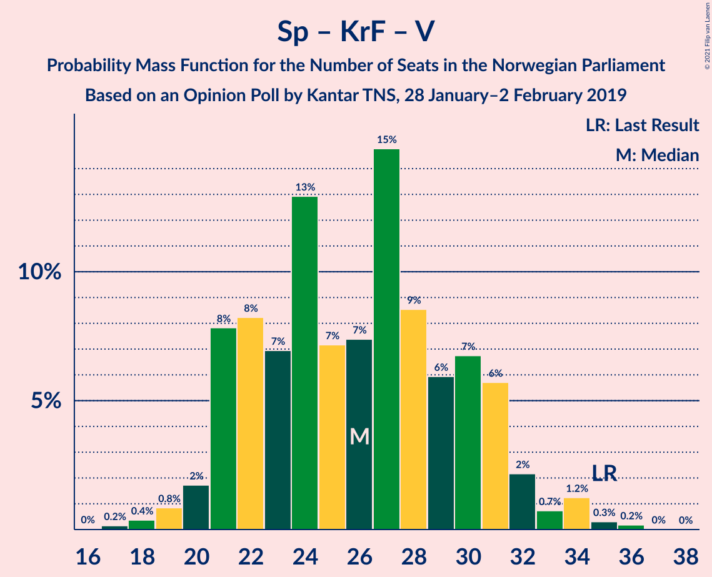

# Opinion Poll by Kantar TNS, 28 January–2 February 2019

<a href="#voting-intentions">Voting Intentions</a> | <a href="#seats">Seats</a> | <a href="#coalitions">Coalitions</a> | <a href="#technical-information">Technical Information</a>

## Voting Intentions

### Confidence Intervals

| Party | Last Result | Poll Result | 80% Confidence Interval | 90% Confidence Interval | 95% Confidence Interval | 99% Confidence Interval |
|:-----:|:-----------:|:-----------:|:-----------------------:|:-----------------------:|:-----------------------:|:-----------------------:|
| Arbeiderpartiet | 27.4% | 26.5% | 24.6–28.6% |24.1–29.1% |23.6–29.6% |22.7–30.7% |
| Høyre | 25.0% | 23.7% | 21.8–25.7% |21.3–26.2% |20.9–26.7% |20.0–27.7% |
| Fremskrittspartiet | 15.2% | 11.7% | 10.3–13.2% |10.0–13.7% |9.6–14.1% |9.0–14.8% |
| Senterpartiet | 10.3% | 10.4% | 9.2–11.9% |8.8–12.3% |8.5–12.7% |7.9–13.5% |
| Sosialistisk Venstreparti | 6.0% | 8.8% | 7.7–10.2% |7.3–10.6% |7.1–11.0% |6.6–11.7% |
| Rødt | 2.4% | 6.3% | 5.3–7.5% |5.0–7.8% |4.8–8.1% |4.4–8.8% |
| Kristelig Folkeparti | 4.2% | 4.0% | 3.3–5.1% |3.1–5.4% |2.9–5.6% |2.6–6.2% |
| Miljøpartiet De Grønne | 3.2% | 3.6% | 2.9–4.5% |2.7–4.8% |2.5–5.1% |2.2–5.6% |
| Venstre | 4.4% | 2.5% | 1.9–3.3% |1.7–3.6% |1.6–3.8% |1.4–4.2% |

*Note:* The poll result column reflects the actual value used in the calculations. Published results may vary slightly, and in addition be rounded to fewer digits.

## Seats

### Confidence Intervals

| Party | Last Result | Median | 80% Confidence Interval | 90% Confidence Interval | 95% Confidence Interval | 99% Confidence Interval |
|:-----:|:-----------:|:------:|:-----------------------:|:-----------------------:|:-----------------------:|:-----------------------:|
| <a href="#arbeiderpartiet">Arbeiderpartiet</a> | 49 | 48 | 44–53 |43–54 |42–54 |41–56 |
| <a href="#høyre">Høyre</a> | 45 | 42 | 38–46 |38–46 |37–47 |36–50 |
| <a href="#fremskrittspartiet">Fremskrittspartiet</a> | 27 | 22 | 19–25 |18–25 |18–26 |16–27 |
| <a href="#senterpartiet">Senterpartiet</a> | 19 | 20 | 17–22 |16–23 |15–24 |14–25 |
| <a href="#sosialistisk-venstreparti">Sosialistisk Venstreparti</a> | 11 | 16 | 14–18 |13–19 |12–20 |11–21 |
| <a href="#rødt">Rødt</a> | 1 | 11 | 9–13 |9–14 |8–14 |7–16 |
| <a href="#kristelig-folkeparti">Kristelig Folkeparti</a> | 8 | 3 | 1–8 |1–9 |1–10 |1–11 |
| <a href="#miljøpartiet-de-grønne">Miljøpartiet De Grønne</a> | 1 | 2 | 1–8 |1–9 |1–9 |1–10 |
| <a href="#venstre">Venstre</a> | 8 | 1 | 0–2 |0–2 |0–2 |0–7 |

### Arbeiderpartiet

*For a full overview of the results for this party, see the [Arbeiderpartiet](party-arbeiderpartiet.html) page.*

| Number of Seats | Probability | Accumulated | Special Marks |
|:---------------:|:-----------:|:-----------:|:-------------:|
| 40 | 0.1% | 100% |  |
| 41 | 0.9% | 99.8% |  |
| 42 | 2% | 98.9% |  |
| 43 | 4% | 97% |  |
| 44 | 5% | 93% |  |
| 45 | 10% | 88% |  |
| 46 | 12% | 78% |  |
| 47 | 15% | 66% |  |
| 48 | 10% | 51% | Median |
| 49 | 6% | 41% | Last Result |
| 50 | 11% | 35% |  |
| 51 | 10% | 24% |  |
| 52 | 4% | 14% |  |
| 53 | 4% | 10% |  |
| 54 | 3% | 6% |  |
| 55 | 1.1% | 2% |  |
| 56 | 0.8% | 1.3% |  |
| 57 | 0.3% | 0.5% |  |
| 58 | 0.1% | 0.2% |  |
| 59 | 0% | 0.1% |  |
| 60 | 0% | 0% |  |

### Høyre

*For a full overview of the results for this party, see the [Høyre](party-høyre.html) page.*

| Number of Seats | Probability | Accumulated | Special Marks |
|:---------------:|:-----------:|:-----------:|:-------------:|
| 34 | 0.1% | 100% |  |
| 35 | 0.4% | 99.9% |  |
| 36 | 1.2% | 99.5% |  |
| 37 | 3% | 98% |  |
| 38 | 8% | 95% |  |
| 39 | 9% | 87% |  |
| 40 | 9% | 78% |  |
| 41 | 14% | 69% |  |
| 42 | 18% | 55% | Median |
| 43 | 15% | 38% |  |
| 44 | 6% | 23% |  |
| 45 | 6% | 17% | Last Result |
| 46 | 6% | 11% |  |
| 47 | 3% | 5% |  |
| 48 | 1.2% | 2% |  |
| 49 | 0.5% | 1.2% |  |
| 50 | 0.4% | 0.7% |  |
| 51 | 0.2% | 0.3% |  |
| 52 | 0.1% | 0.1% |  |
| 53 | 0% | 0% |  |

### Fremskrittspartiet

*For a full overview of the results for this party, see the [Fremskrittspartiet](party-fremskrittspartiet.html) page.*

| Number of Seats | Probability | Accumulated | Special Marks |
|:---------------:|:-----------:|:-----------:|:-------------:|
| 15 | 0.1% | 100% |  |
| 16 | 0.7% | 99.8% |  |
| 17 | 1.4% | 99.2% |  |
| 18 | 5% | 98% |  |
| 19 | 8% | 93% |  |
| 20 | 6% | 85% |  |
| 21 | 17% | 78% |  |
| 22 | 25% | 61% | Median |
| 23 | 8% | 36% |  |
| 24 | 15% | 28% |  |
| 25 | 9% | 13% |  |
| 26 | 4% | 5% |  |
| 27 | 0.8% | 1.1% | Last Result |
| 28 | 0.2% | 0.3% |  |
| 29 | 0.1% | 0.2% |  |
| 30 | 0% | 0% |  |

### Senterpartiet

*For a full overview of the results for this party, see the [Senterpartiet](party-senterpartiet.html) page.*

| Number of Seats | Probability | Accumulated | Special Marks |
|:---------------:|:-----------:|:-----------:|:-------------:|
| 13 | 0.1% | 100% |  |
| 14 | 0.5% | 99.9% |  |
| 15 | 2% | 99.4% |  |
| 16 | 4% | 97% |  |
| 17 | 9% | 93% |  |
| 18 | 16% | 85% |  |
| 19 | 18% | 69% | Last Result |
| 20 | 18% | 51% | Median |
| 21 | 16% | 33% |  |
| 22 | 10% | 18% |  |
| 23 | 5% | 8% |  |
| 24 | 2% | 3% |  |
| 25 | 0.7% | 1.0% |  |
| 26 | 0.2% | 0.2% |  |
| 27 | 0% | 0% |  |

### Sosialistisk Venstreparti

*For a full overview of the results for this party, see the [Sosialistisk Venstreparti](party-sosialistiskvenstreparti.html) page.*

| Number of Seats | Probability | Accumulated | Special Marks |
|:---------------:|:-----------:|:-----------:|:-------------:|
| 10 | 0.1% | 100% |  |
| 11 | 0.5% | 99.9% | Last Result |
| 12 | 2% | 99.4% |  |
| 13 | 7% | 97% |  |
| 14 | 14% | 91% |  |
| 15 | 13% | 77% |  |
| 16 | 22% | 63% | Median |
| 17 | 19% | 42% |  |
| 18 | 13% | 22% |  |
| 19 | 6% | 10% |  |
| 20 | 3% | 4% |  |
| 21 | 0.8% | 1.2% |  |
| 22 | 0.3% | 0.4% |  |
| 23 | 0% | 0.1% |  |
| 24 | 0% | 0% |  |

### Rødt

*For a full overview of the results for this party, see the [Rødt](party-rødt.html) page.*

| Number of Seats | Probability | Accumulated | Special Marks |
|:---------------:|:-----------:|:-----------:|:-------------:|
| 1 | 0% | 100% | Last Result |
| 2 | 0.2% | 100% |  |
| 3 | 0% | 99.8% |  |
| 4 | 0% | 99.8% |  |
| 5 | 0% | 99.8% |  |
| 6 | 0% | 99.8% |  |
| 7 | 0.5% | 99.8% |  |
| 8 | 3% | 99.3% |  |
| 9 | 14% | 96% |  |
| 10 | 24% | 82% |  |
| 11 | 23% | 58% | Median |
| 12 | 19% | 35% |  |
| 13 | 10% | 15% |  |
| 14 | 4% | 5% |  |
| 15 | 1.0% | 2% |  |
| 16 | 0.5% | 0.6% |  |
| 17 | 0.1% | 0.1% |  |
| 18 | 0% | 0% |  |

### Kristelig Folkeparti

*For a full overview of the results for this party, see the [Kristelig Folkeparti](party-kristeligfolkeparti.html) page.*

| Number of Seats | Probability | Accumulated | Special Marks |
|:---------------:|:-----------:|:-----------:|:-------------:|
| 0 | 0.1% | 100% |  |
| 1 | 13% | 99.9% |  |
| 2 | 8% | 87% |  |
| 3 | 33% | 79% | Median |
| 4 | 0% | 46% |  |
| 5 | 0% | 46% |  |
| 6 | 0.1% | 46% |  |
| 7 | 11% | 46% |  |
| 8 | 26% | 35% | Last Result |
| 9 | 6% | 9% |  |
| 10 | 2% | 3% |  |
| 11 | 0.8% | 1.0% |  |
| 12 | 0.1% | 0.2% |  |
| 13 | 0% | 0% |  |

### Miljøpartiet De Grønne

*For a full overview of the results for this party, see the [Miljøpartiet De Grønne](party-miljøpartietdegrønne.html) page.*

| Number of Seats | Probability | Accumulated | Special Marks |
|:---------------:|:-----------:|:-----------:|:-------------:|
| 0 | 0.1% | 100% |  |
| 1 | 15% | 99.9% | Last Result |
| 2 | 42% | 85% | Median |
| 3 | 5% | 43% |  |
| 4 | 0% | 38% |  |
| 5 | 0% | 38% |  |
| 6 | 0.1% | 38% |  |
| 7 | 12% | 38% |  |
| 8 | 19% | 25% |  |
| 9 | 4% | 7% |  |
| 10 | 2% | 2% |  |
| 11 | 0.2% | 0.2% |  |
| 12 | 0% | 0% |  |

### Venstre

*For a full overview of the results for this party, see the [Venstre](party-venstre.html) page.*

| Number of Seats | Probability | Accumulated | Special Marks |
|:---------------:|:-----------:|:-----------:|:-------------:|
| 0 | 17% | 100% |  |
| 1 | 33% | 83% | Median |
| 2 | 49% | 50% |  |
| 3 | 0% | 0.7% |  |
| 4 | 0% | 0.6% |  |
| 5 | 0% | 0.6% |  |
| 6 | 0% | 0.6% |  |
| 7 | 0.3% | 0.6% |  |
| 8 | 0.3% | 0.3% | Last Result |
| 9 | 0% | 0% |  |

## Coalitions

### Confidence Intervals

| Coalition | Last Result | Median | Majority? | 80% Confidence Interval | 90% Confidence Interval | 95% Confidence Interval | 99% Confidence Interval |
|:---------:|:-----------:|:------:|:---------:|:-----------------------:|:-----------------------:|:-----------------------:|:-----------------------:|
| Arbeiderpartiet – Senterpartiet – Sosialistisk Venstreparti – Rødt – Miljøpartiet De Grønne | 81 | 99 | 100% | 94–104 | 93–105 | 91–106 | 89–108 |
| Arbeiderpartiet – Senterpartiet – Sosialistisk Venstreparti – Rødt | 80 | 95 | 99.5% | 89–100 | 87–101 | 86–103 | 84–104 |
| Arbeiderpartiet – Senterpartiet – Sosialistisk Venstreparti – Kristelig Folkeparti – Miljøpartiet De Grønne | 88 | 93 | 98.8% | 88–97 | 87–98 | 86–100 | 83–102 |
| Høyre – Fremskrittspartiet – Senterpartiet – Kristelig Folkeparti – Venstre | 107 | 90 | 89% | 84–95 | 83–96 | 81–97 | 79–99 |
| Arbeiderpartiet – Senterpartiet – Sosialistisk Venstreparti – Miljøpartiet De Grønne | 80 | 88 | 83% | 83–92 | 81–94 | 80–95 | 77–97 |
| Arbeiderpartiet – Senterpartiet – Sosialistisk Venstreparti | 79 | 83 | 42% | 78–88 | 77–90 | 76–91 | 74–93 |
| Arbeiderpartiet – Sosialistisk Venstreparti – Rødt – Miljøpartiet De Grønne | 62 | 79 | 10% | 74–85 | 73–85 | 72–87 | 70–89 |
| Arbeiderpartiet – Senterpartiet – Kristelig Folkeparti – Miljøpartiet De Grønne | 77 | 77 | 2% | 72–82 | 70–83 | 70–84 | 67–87 |
| Høyre – Fremskrittspartiet – Kristelig Folkeparti – Miljøpartiet De Grønne – Venstre | 89 | 74 | 0.4% | 69–80 | 68–82 | 66–83 | 65–84 |
| Arbeiderpartiet – Senterpartiet – Kristelig Folkeparti | 76 | 73 | 0.1% | 68–77 | 67–78 | 66–80 | 63–83 |
| Høyre – Fremskrittspartiet – Kristelig Folkeparti – Venstre | 88 | 70 | 0% | 65–75 | 64–76 | 62–78 | 61–80 |
| Arbeiderpartiet – Senterpartiet | 68 | 67 | 0% | 63–72 | 61–74 | 61–75 | 59–77 |
| Høyre – Fremskrittspartiet – Venstre | 80 | 65 | 0% | 61–69 | 60–71 | 58–72 | 57–73 |
| Arbeiderpartiet – Sosialistisk Venstreparti | 60 | 64 | 0% | 59–68 | 58–70 | 58–71 | 56–72 |
| Høyre – Fremskrittspartiet | 72 | 64 | 0% | 59–68 | 58–70 | 57–70 | 55–72 |
| Høyre – Kristelig Folkeparti – Venstre | 61 | 48 | 0% | 44–52 | 43–55 | 42–57 | 41–60 |
| Senterpartiet – Kristelig Folkeparti – Venstre | 35 | 26 | 0% | 21–31 | 21–31 | 20–32 | 18–35 |

### Arbeiderpartiet – Senterpartiet – Sosialistisk Venstreparti – Rødt – Miljøpartiet De Grønne

| Number of Seats | Probability | Accumulated | Special Marks |
|:---------------:|:-----------:|:-----------:|:-------------:|
| 81 | 0% | 100% | Last Result |
| 82 | 0% | 100% |  |
| 83 | 0% | 100% |  |
| 84 | 0% | 100% |  |
| 85 | 0% | 100% | Majority |
| 86 | 0.1% | 100% |  |
| 87 | 0.1% | 99.9% |  |
| 88 | 0.2% | 99.8% |  |
| 89 | 0.6% | 99.7% |  |
| 90 | 1.1% | 99.0% |  |
| 91 | 1.2% | 98% |  |
| 92 | 1.3% | 97% |  |
| 93 | 3% | 95% |  |
| 94 | 5% | 93% |  |
| 95 | 11% | 88% |  |
| 96 | 7% | 76% |  |
| 97 | 8% | 69% | Median |
| 98 | 8% | 61% |  |
| 99 | 7% | 54% |  |
| 100 | 14% | 47% |  |
| 101 | 10% | 33% |  |
| 102 | 6% | 23% |  |
| 103 | 5% | 16% |  |
| 104 | 4% | 11% |  |
| 105 | 3% | 7% |  |
| 106 | 2% | 4% |  |
| 107 | 1.5% | 2% |  |
| 108 | 0.5% | 0.9% |  |
| 109 | 0.3% | 0.4% |  |
| 110 | 0.1% | 0.1% |  |
| 111 | 0% | 0% |  |

### Arbeiderpartiet – Senterpartiet – Sosialistisk Venstreparti – Rødt

| Number of Seats | Probability | Accumulated | Special Marks |
|:---------------:|:-----------:|:-----------:|:-------------:|
| 80 | 0% | 100% | Last Result |
| 81 | 0.1% | 100% |  |
| 82 | 0.1% | 99.9% |  |
| 83 | 0.1% | 99.9% |  |
| 84 | 0.3% | 99.7% |  |
| 85 | 0.5% | 99.5% | Majority |
| 86 | 2% | 99.0% |  |
| 87 | 3% | 97% |  |
| 88 | 1.5% | 94% |  |
| 89 | 6% | 92% |  |
| 90 | 4% | 86% |  |
| 91 | 6% | 82% |  |
| 92 | 4% | 76% |  |
| 93 | 14% | 72% |  |
| 94 | 7% | 58% |  |
| 95 | 6% | 50% | Median |
| 96 | 8% | 45% |  |
| 97 | 8% | 37% |  |
| 98 | 10% | 29% |  |
| 99 | 8% | 19% |  |
| 100 | 4% | 11% |  |
| 101 | 3% | 7% |  |
| 102 | 0.9% | 4% |  |
| 103 | 2% | 3% |  |
| 104 | 0.9% | 1.3% |  |
| 105 | 0.3% | 0.4% |  |
| 106 | 0.1% | 0.1% |  |
| 107 | 0% | 0.1% |  |
| 108 | 0% | 0% |  |

### Arbeiderpartiet – Senterpartiet – Sosialistisk Venstreparti – Kristelig Folkeparti – Miljøpartiet De Grønne

| Number of Seats | Probability | Accumulated | Special Marks |
|:---------------:|:-----------:|:-----------:|:-------------:|
| 81 | 0% | 100% |  |
| 82 | 0.1% | 99.9% |  |
| 83 | 0.4% | 99.8% |  |
| 84 | 0.6% | 99.3% |  |
| 85 | 1.0% | 98.8% | Majority |
| 86 | 2% | 98% |  |
| 87 | 5% | 96% |  |
| 88 | 3% | 91% | Last Result |
| 89 | 5% | 89% | Median |
| 90 | 9% | 84% |  |
| 91 | 7% | 75% |  |
| 92 | 10% | 68% |  |
| 93 | 19% | 58% |  |
| 94 | 11% | 39% |  |
| 95 | 9% | 28% |  |
| 96 | 3% | 19% |  |
| 97 | 6% | 16% |  |
| 98 | 5% | 10% |  |
| 99 | 2% | 5% |  |
| 100 | 2% | 3% |  |
| 101 | 0.8% | 1.4% |  |
| 102 | 0.3% | 0.6% |  |
| 103 | 0.2% | 0.3% |  |
| 104 | 0% | 0.1% |  |
| 105 | 0% | 0.1% |  |
| 106 | 0% | 0% |  |

### Høyre – Fremskrittspartiet – Senterpartiet – Kristelig Folkeparti – Venstre

| Number of Seats | Probability | Accumulated | Special Marks |
|:---------------:|:-----------:|:-----------:|:-------------:|
| 77 | 0.1% | 100% |  |
| 78 | 0.1% | 99.9% |  |
| 79 | 0.5% | 99.8% |  |
| 80 | 0.4% | 99.3% |  |
| 81 | 1.4% | 98.9% |  |
| 82 | 2% | 97% |  |
| 83 | 1.3% | 96% |  |
| 84 | 6% | 95% |  |
| 85 | 5% | 89% | Majority |
| 86 | 5% | 84% |  |
| 87 | 5% | 79% |  |
| 88 | 8% | 74% | Median |
| 89 | 14% | 65% |  |
| 90 | 8% | 51% |  |
| 91 | 11% | 43% |  |
| 92 | 10% | 32% |  |
| 93 | 5% | 23% |  |
| 94 | 7% | 18% |  |
| 95 | 5% | 11% |  |
| 96 | 2% | 6% |  |
| 97 | 2% | 4% |  |
| 98 | 1.4% | 2% |  |
| 99 | 0.6% | 0.9% |  |
| 100 | 0.1% | 0.3% |  |
| 101 | 0.2% | 0.2% |  |
| 102 | 0% | 0% |  |
| 103 | 0% | 0% |  |
| 104 | 0% | 0% |  |
| 105 | 0% | 0% |  |
| 106 | 0% | 0% |  |
| 107 | 0% | 0% | Last Result |

### Arbeiderpartiet – Senterpartiet – Sosialistisk Venstreparti – Miljøpartiet De Grønne

| Number of Seats | Probability | Accumulated | Special Marks |
|:---------------:|:-----------:|:-----------:|:-------------:|
| 75 | 0.1% | 100% |  |
| 76 | 0.1% | 99.9% |  |
| 77 | 0.3% | 99.8% |  |
| 78 | 0.6% | 99.5% |  |
| 79 | 1.2% | 98.8% |  |
| 80 | 1.3% | 98% | Last Result |
| 81 | 2% | 96% |  |
| 82 | 3% | 94% |  |
| 83 | 5% | 91% |  |
| 84 | 4% | 86% |  |
| 85 | 14% | 83% | Majority |
| 86 | 6% | 69% | Median |
| 87 | 6% | 63% |  |
| 88 | 7% | 57% |  |
| 89 | 11% | 49% |  |
| 90 | 14% | 38% |  |
| 91 | 10% | 24% |  |
| 92 | 5% | 14% |  |
| 93 | 3% | 9% |  |
| 94 | 2% | 6% |  |
| 95 | 2% | 4% |  |
| 96 | 0.7% | 2% |  |
| 97 | 0.7% | 0.9% |  |
| 98 | 0.1% | 0.2% |  |
| 99 | 0% | 0.1% |  |
| 100 | 0% | 0% |  |

### Arbeiderpartiet – Senterpartiet – Sosialistisk Venstreparti

| Number of Seats | Probability | Accumulated | Special Marks |
|:---------------:|:-----------:|:-----------:|:-------------:|
| 72 | 0.1% | 100% |  |
| 73 | 0.2% | 99.9% |  |
| 74 | 0.3% | 99.7% |  |
| 75 | 0.7% | 99.3% |  |
| 76 | 2% | 98.7% |  |
| 77 | 6% | 97% |  |
| 78 | 3% | 91% |  |
| 79 | 4% | 88% | Last Result |
| 80 | 6% | 84% |  |
| 81 | 6% | 78% |  |
| 82 | 10% | 72% |  |
| 83 | 13% | 62% |  |
| 84 | 7% | 49% | Median |
| 85 | 8% | 42% | Majority |
| 86 | 4% | 34% |  |
| 87 | 8% | 30% |  |
| 88 | 12% | 22% |  |
| 89 | 4% | 10% |  |
| 90 | 1.1% | 5% |  |
| 91 | 3% | 4% |  |
| 92 | 0.6% | 2% |  |
| 93 | 0.9% | 1.1% |  |
| 94 | 0.1% | 0.2% |  |
| 95 | 0.1% | 0.1% |  |
| 96 | 0% | 0% |  |

### Arbeiderpartiet – Sosialistisk Venstreparti – Rødt – Miljøpartiet De Grønne

| Number of Seats | Probability | Accumulated | Special Marks |
|:---------------:|:-----------:|:-----------:|:-------------:|
| 62 | 0% | 100% | Last Result |
| 63 | 0% | 100% |  |
| 64 | 0% | 100% |  |
| 65 | 0% | 100% |  |
| 66 | 0% | 100% |  |
| 67 | 0% | 100% |  |
| 68 | 0.2% | 99.9% |  |
| 69 | 0.1% | 99.8% |  |
| 70 | 0.6% | 99.6% |  |
| 71 | 1.5% | 99.0% |  |
| 72 | 2% | 98% |  |
| 73 | 2% | 95% |  |
| 74 | 5% | 94% |  |
| 75 | 7% | 88% |  |
| 76 | 5% | 81% |  |
| 77 | 10% | 76% | Median |
| 78 | 11% | 67% |  |
| 79 | 8% | 56% |  |
| 80 | 14% | 47% |  |
| 81 | 8% | 33% |  |
| 82 | 5% | 25% |  |
| 83 | 5% | 20% |  |
| 84 | 5% | 16% |  |
| 85 | 5% | 10% | Majority |
| 86 | 1.2% | 5% |  |
| 87 | 2% | 4% |  |
| 88 | 1.4% | 2% |  |
| 89 | 0.4% | 0.8% |  |
| 90 | 0.2% | 0.4% |  |
| 91 | 0.1% | 0.2% |  |
| 92 | 0.1% | 0.1% |  |
| 93 | 0% | 0% |  |

### Arbeiderpartiet – Senterpartiet – Kristelig Folkeparti – Miljøpartiet De Grønne

| Number of Seats | Probability | Accumulated | Special Marks |
|:---------------:|:-----------:|:-----------:|:-------------:|
| 65 | 0.1% | 100% |  |
| 66 | 0.1% | 99.9% |  |
| 67 | 0.3% | 99.8% |  |
| 68 | 0.4% | 99.5% |  |
| 69 | 0.9% | 99.1% |  |
| 70 | 3% | 98% |  |
| 71 | 5% | 95% |  |
| 72 | 5% | 90% |  |
| 73 | 3% | 85% | Median |
| 74 | 6% | 82% |  |
| 75 | 9% | 76% |  |
| 76 | 15% | 67% |  |
| 77 | 13% | 52% | Last Result |
| 78 | 10% | 39% |  |
| 79 | 9% | 29% |  |
| 80 | 5% | 20% |  |
| 81 | 4% | 15% |  |
| 82 | 4% | 11% |  |
| 83 | 3% | 7% |  |
| 84 | 2% | 4% |  |
| 85 | 0.8% | 2% | Majority |
| 86 | 0.7% | 2% |  |
| 87 | 0.4% | 0.8% |  |
| 88 | 0.3% | 0.4% |  |
| 89 | 0.1% | 0.1% |  |
| 90 | 0% | 0.1% |  |
| 91 | 0% | 0% |  |

### Høyre – Fremskrittspartiet – Kristelig Folkeparti – Miljøpartiet De Grønne – Venstre

| Number of Seats | Probability | Accumulated | Special Marks |
|:---------------:|:-----------:|:-----------:|:-------------:|
| 62 | 0.1% | 100% |  |
| 63 | 0.1% | 99.9% |  |
| 64 | 0.3% | 99.8% |  |
| 65 | 0.9% | 99.5% |  |
| 66 | 2% | 98.6% |  |
| 67 | 0.9% | 97% |  |
| 68 | 4% | 96% |  |
| 69 | 4% | 92% |  |
| 70 | 8% | 88% | Median |
| 71 | 10% | 80% |  |
| 72 | 8% | 70% |  |
| 73 | 8% | 62% |  |
| 74 | 6% | 54% |  |
| 75 | 7% | 48% |  |
| 76 | 14% | 41% |  |
| 77 | 4% | 27% |  |
| 78 | 6% | 23% |  |
| 79 | 4% | 17% |  |
| 80 | 6% | 13% |  |
| 81 | 1.4% | 7% |  |
| 82 | 3% | 6% |  |
| 83 | 2% | 3% |  |
| 84 | 0.4% | 0.7% |  |
| 85 | 0.2% | 0.4% | Majority |
| 86 | 0.1% | 0.2% |  |
| 87 | 0% | 0.1% |  |
| 88 | 0.1% | 0.1% |  |
| 89 | 0% | 0% | Last Result |

### Arbeiderpartiet – Senterpartiet – Kristelig Folkeparti

| Number of Seats | Probability | Accumulated | Special Marks |
|:---------------:|:-----------:|:-----------:|:-------------:|
| 61 | 0.1% | 100% |  |
| 62 | 0.2% | 99.9% |  |
| 63 | 0.4% | 99.7% |  |
| 64 | 0.5% | 99.3% |  |
| 65 | 0.9% | 98.7% |  |
| 66 | 1.4% | 98% |  |
| 67 | 4% | 97% |  |
| 68 | 6% | 93% |  |
| 69 | 9% | 86% |  |
| 70 | 9% | 77% |  |
| 71 | 8% | 68% | Median |
| 72 | 7% | 60% |  |
| 73 | 9% | 53% |  |
| 74 | 11% | 44% |  |
| 75 | 10% | 33% |  |
| 76 | 10% | 22% | Last Result |
| 77 | 4% | 13% |  |
| 78 | 4% | 9% |  |
| 79 | 2% | 5% |  |
| 80 | 1.3% | 3% |  |
| 81 | 0.5% | 2% |  |
| 82 | 0.9% | 2% |  |
| 83 | 0.3% | 0.6% |  |
| 84 | 0.2% | 0.3% |  |
| 85 | 0.1% | 0.1% | Majority |
| 86 | 0% | 0% |  |

### Høyre – Fremskrittspartiet – Kristelig Folkeparti – Venstre

| Number of Seats | Probability | Accumulated | Special Marks |
|:---------------:|:-----------:|:-----------:|:-------------:|
| 58 | 0% | 100% |  |
| 59 | 0.1% | 99.9% |  |
| 60 | 0.3% | 99.9% |  |
| 61 | 0.6% | 99.6% |  |
| 62 | 2% | 99.0% |  |
| 63 | 2% | 97% |  |
| 64 | 3% | 95% |  |
| 65 | 4% | 92% |  |
| 66 | 6% | 88% |  |
| 67 | 6% | 83% |  |
| 68 | 10% | 76% | Median |
| 69 | 14% | 66% |  |
| 70 | 7% | 52% |  |
| 71 | 8% | 45% |  |
| 72 | 8% | 38% |  |
| 73 | 7% | 30% |  |
| 74 | 11% | 23% |  |
| 75 | 5% | 12% |  |
| 76 | 2% | 6% |  |
| 77 | 1.2% | 4% |  |
| 78 | 1.0% | 3% |  |
| 79 | 0.9% | 2% |  |
| 80 | 0.6% | 0.9% |  |
| 81 | 0.1% | 0.3% |  |
| 82 | 0.1% | 0.1% |  |
| 83 | 0% | 0% |  |
| 84 | 0% | 0% |  |
| 85 | 0% | 0% | Majority |
| 86 | 0% | 0% |  |
| 87 | 0% | 0% |  |
| 88 | 0% | 0% | Last Result |

### Arbeiderpartiet – Senterpartiet

| Number of Seats | Probability | Accumulated | Special Marks |
|:---------------:|:-----------:|:-----------:|:-------------:|
| 57 | 0.1% | 100% |  |
| 58 | 0.2% | 99.9% |  |
| 59 | 0.4% | 99.7% |  |
| 60 | 1.1% | 99.2% |  |
| 61 | 3% | 98% |  |
| 62 | 4% | 95% |  |
| 63 | 5% | 91% |  |
| 64 | 4% | 86% |  |
| 65 | 11% | 82% |  |
| 66 | 10% | 70% |  |
| 67 | 13% | 61% |  |
| 68 | 9% | 48% | Last Result, Median |
| 69 | 7% | 39% |  |
| 70 | 5% | 32% |  |
| 71 | 10% | 27% |  |
| 72 | 7% | 16% |  |
| 73 | 4% | 10% |  |
| 74 | 2% | 6% |  |
| 75 | 3% | 4% |  |
| 76 | 0.5% | 1.2% |  |
| 77 | 0.5% | 0.7% |  |
| 78 | 0.1% | 0.3% |  |
| 79 | 0.1% | 0.1% |  |
| 80 | 0% | 0% |  |

### Høyre – Fremskrittspartiet – Venstre

| Number of Seats | Probability | Accumulated | Special Marks |
|:---------------:|:-----------:|:-----------:|:-------------:|
| 54 | 0% | 100% |  |
| 55 | 0.1% | 99.9% |  |
| 56 | 0.3% | 99.8% |  |
| 57 | 1.0% | 99.6% |  |
| 58 | 1.1% | 98.6% |  |
| 59 | 2% | 97% |  |
| 60 | 4% | 96% |  |
| 61 | 5% | 91% |  |
| 62 | 6% | 86% |  |
| 63 | 10% | 80% |  |
| 64 | 10% | 70% |  |
| 65 | 10% | 60% | Median |
| 66 | 19% | 49% |  |
| 67 | 8% | 30% |  |
| 68 | 9% | 22% |  |
| 69 | 4% | 13% |  |
| 70 | 4% | 9% |  |
| 71 | 2% | 6% |  |
| 72 | 2% | 3% |  |
| 73 | 0.9% | 1.4% |  |
| 74 | 0.3% | 0.5% |  |
| 75 | 0.1% | 0.1% |  |
| 76 | 0.1% | 0.1% |  |
| 77 | 0% | 0% |  |
| 78 | 0% | 0% |  |
| 79 | 0% | 0% |  |
| 80 | 0% | 0% | Last Result |

### Arbeiderpartiet – Sosialistisk Venstreparti

| Number of Seats | Probability | Accumulated | Special Marks |
|:---------------:|:-----------:|:-----------:|:-------------:|
| 54 | 0.1% | 100% |  |
| 55 | 0.1% | 99.9% |  |
| 56 | 0.6% | 99.7% |  |
| 57 | 1.0% | 99.1% |  |
| 58 | 3% | 98% |  |
| 59 | 6% | 95% |  |
| 60 | 7% | 89% | Last Result |
| 61 | 9% | 82% |  |
| 62 | 8% | 73% |  |
| 63 | 7% | 66% |  |
| 64 | 14% | 59% | Median |
| 65 | 9% | 45% |  |
| 66 | 8% | 36% |  |
| 67 | 5% | 28% |  |
| 68 | 14% | 23% |  |
| 69 | 5% | 10% |  |
| 70 | 3% | 5% |  |
| 71 | 1.0% | 3% |  |
| 72 | 1.0% | 1.5% |  |
| 73 | 0.2% | 0.5% |  |
| 74 | 0.2% | 0.3% |  |
| 75 | 0.1% | 0.1% |  |
| 76 | 0% | 0.1% |  |
| 77 | 0% | 0% |  |

### Høyre – Fremskrittspartiet

| Number of Seats | Probability | Accumulated | Special Marks |
|:---------------:|:-----------:|:-----------:|:-------------:|
| 53 | 0.1% | 100% |  |
| 54 | 0.1% | 99.9% |  |
| 55 | 0.3% | 99.8% |  |
| 56 | 1.1% | 99.5% |  |
| 57 | 2% | 98% |  |
| 58 | 4% | 97% |  |
| 59 | 5% | 93% |  |
| 60 | 6% | 88% |  |
| 61 | 4% | 83% |  |
| 62 | 7% | 78% |  |
| 63 | 15% | 71% |  |
| 64 | 12% | 56% | Median |
| 65 | 17% | 43% |  |
| 66 | 9% | 26% |  |
| 67 | 5% | 17% |  |
| 68 | 3% | 12% |  |
| 69 | 4% | 9% |  |
| 70 | 3% | 5% |  |
| 71 | 1.1% | 2% |  |
| 72 | 0.6% | 1.0% | Last Result |
| 73 | 0.3% | 0.4% |  |
| 74 | 0.1% | 0.1% |  |
| 75 | 0% | 0% |  |

### Høyre – Kristelig Folkeparti – Venstre

| Number of Seats | Probability | Accumulated | Special Marks |
|:---------------:|:-----------:|:-----------:|:-------------:|
| 39 | 0.1% | 100% |  |
| 40 | 0.2% | 99.9% |  |
| 41 | 1.2% | 99.8% |  |
| 42 | 1.4% | 98.6% |  |
| 43 | 6% | 97% |  |
| 44 | 4% | 91% |  |
| 45 | 9% | 88% |  |
| 46 | 11% | 78% | Median |
| 47 | 14% | 67% |  |
| 48 | 12% | 53% |  |
| 49 | 8% | 41% |  |
| 50 | 11% | 33% |  |
| 51 | 7% | 22% |  |
| 52 | 5% | 14% |  |
| 53 | 2% | 9% |  |
| 54 | 2% | 8% |  |
| 55 | 1.4% | 6% |  |
| 56 | 2% | 4% |  |
| 57 | 0.9% | 3% |  |
| 58 | 0.3% | 2% |  |
| 59 | 0.7% | 1.4% |  |
| 60 | 0.3% | 0.6% |  |
| 61 | 0.3% | 0.3% | Last Result |
| 62 | 0.1% | 0.1% |  |
| 63 | 0% | 0% |  |

### Senterpartiet – Kristelig Folkeparti – Venstre

| Number of Seats | Probability | Accumulated | Special Marks |
|:---------------:|:-----------:|:-----------:|:-------------:|
| 17 | 0.2% | 100% |  |
| 18 | 0.4% | 99.8% |  |
| 19 | 0.8% | 99.4% |  |
| 20 | 2% | 98.6% |  |
| 21 | 8% | 97% |  |
| 22 | 8% | 89% |  |
| 23 | 7% | 81% |  |
| 24 | 13% | 74% | Median |
| 25 | 7% | 61% |  |
| 26 | 7% | 54% |  |
| 27 | 15% | 46% |  |
| 28 | 9% | 32% |  |
| 29 | 6% | 23% |  |
| 30 | 7% | 17% |  |
| 31 | 6% | 10% |  |
| 32 | 2% | 5% |  |
| 33 | 0.7% | 2% |  |
| 34 | 1.2% | 2% |  |
| 35 | 0.3% | 0.5% | Last Result |
| 36 | 0.2% | 0.2% |  |
| 37 | 0% | 0% |  |

## Technical Information

### Opinion Poll

+ **Polling firm:** Kantar TNS
+ **Commissioner(s):** —
+ **Fieldwork period:** 28 January–2 February 2019

### Calculations

+ **Sample size:** 815
+ **Simulations done:** 1,048,576
+ **Error estimate:** 1.71%

