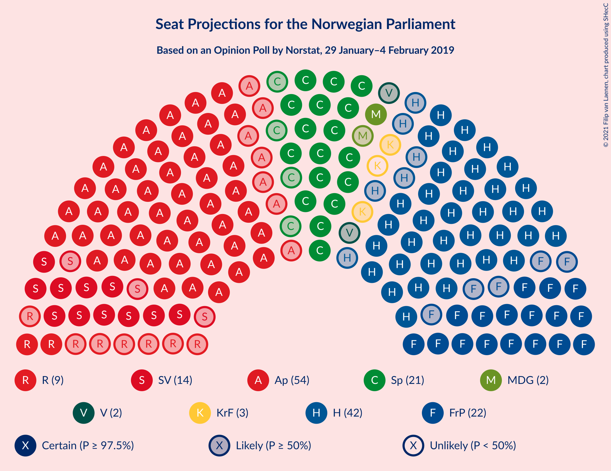
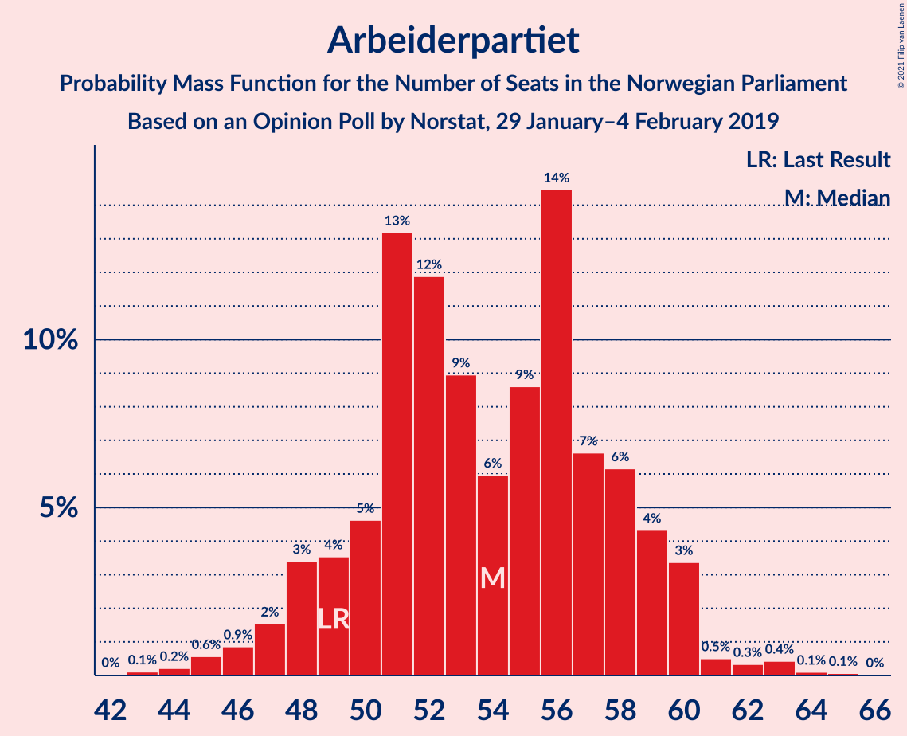
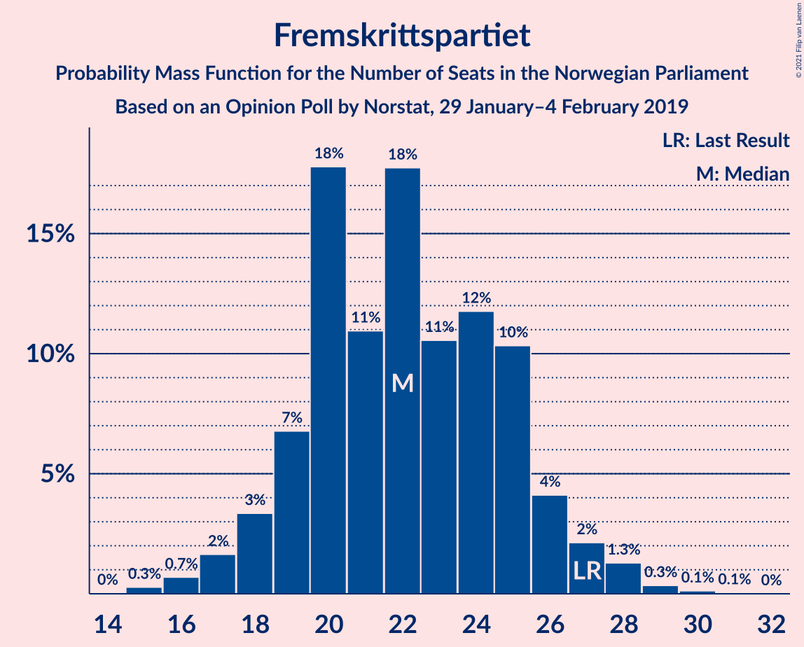
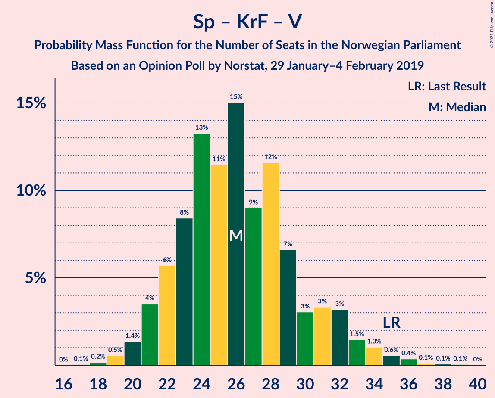

# Opinion Poll by Norstat, 29 January–4 February 2019

<a href="#voting-intentions">Voting Intentions</a> | <a href="#seats">Seats</a> | <a href="#coalitions">Coalitions</a> | <a href="#technical-information">Technical Information</a>

## Voting Intentions

### Confidence Intervals

| Party | Last Result | Poll Result | 80% Confidence Interval | 90% Confidence Interval | 95% Confidence Interval | 99% Confidence Interval |
|:-----:|:-----------:|:-----------:|:-----------------------:|:-----------------------:|:-----------------------:|:-----------------------:|
| Arbeiderpartiet | 27.4% | 29.3% | 27.1–31.6% |26.4–32.3% |25.9–32.9% |24.9–34.0% |
| Høyre | 25.0% | 22.9% | 20.9–25.1% |20.3–25.7% |19.8–26.2% |18.9–27.3% |
| Fremskrittspartiet | 15.2% | 12.0% | 10.5–13.8% |10.1–14.3% |9.8–14.8% |9.1–15.7% |
| Senterpartiet | 10.3% | 11.7% | 10.3–13.5% |9.8–14.0% |9.5–14.4% |8.8–15.3% |
| Sosialistisk Venstreparti | 6.0% | 7.8% | 6.6–9.3% |6.2–9.7% |6.0–10.1% |5.4–10.9% |
| Rødt | 2.4% | 4.9% | 3.9–6.1% |3.7–6.5% |3.5–6.8% |3.1–7.5% |
| Kristelig Folkeparti | 4.2% | 3.4% | 2.6–4.5% |2.4–4.8% |2.2–5.0% |1.9–5.6% |
| Miljøpartiet De Grønne | 3.2% | 3.2% | 2.5–4.3% |2.3–4.6% |2.1–4.8% |1.8–5.4% |
| Venstre | 4.4% | 2.6% | 2.0–3.6% |1.8–3.9% |1.6–4.1% |1.4–4.6% |

*Note:* The poll result column reflects the actual value used in the calculations. Published results may vary slightly, and in addition be rounded to fewer digits.

## Seats

### Confidence Intervals

| Party | Last Result | Median | 80% Confidence Interval | 90% Confidence Interval | 95% Confidence Interval | 99% Confidence Interval |
|:-----:|:-----------:|:------:|:-----------------------:|:-----------------------:|:-----------------------:|:-----------------------:|
| <a href="#arbeiderpartiet">Arbeiderpartiet</a> | 49 | 56 | 49–57 |48–59 |47–60 |44–63 |
| <a href="#høyre">Høyre</a> | 45 | 42 | 38–46 |37–46 |36–49 |34–49 |
| <a href="#fremskrittspartiet">Fremskrittspartiet</a> | 27 | 21 | 19–26 |18–27 |17–28 |15–29 |
| <a href="#senterpartiet">Senterpartiet</a> | 19 | 20 | 18–24 |17–26 |16–26 |16–28 |
| <a href="#sosialistisk-venstreparti">Sosialistisk Venstreparti</a> | 11 | 15 | 12–17 |11–17 |10–18 |9–20 |
| <a href="#rødt">Rødt</a> | 1 | 9 | 8–11 |2–12 |2–12 |2–13 |
| <a href="#kristelig-folkeparti">Kristelig Folkeparti</a> | 8 | 1 | 1–8 |0–9 |0–9 |0–10 |
| <a href="#miljøpartiet-de-grønne">Miljøpartiet De Grønne</a> | 1 | 1 | 1–8 |1–8 |0–9 |0–10 |
| <a href="#venstre">Venstre</a> | 8 | 2 | 1–3 |0–7 |0–7 |0–8 |

### Arbeiderpartiet

*For a full overview of the results for this party, see the [Arbeiderpartiet](party-arbeiderpartiet.html) page.*

| Number of Seats | Probability | Accumulated | Special Marks |
|:---------------:|:-----------:|:-----------:|:-------------:|
| 42 | 0.1% | 100% |  |
| 43 | 0.1% | 99.9% |  |
| 44 | 0.5% | 99.8% |  |
| 45 | 0.6% | 99.3% |  |
| 46 | 0.5% | 98.7% |  |
| 47 | 3% | 98% |  |
| 48 | 4% | 96% |  |
| 49 | 10% | 92% | Last Result |
| 50 | 5% | 81% |  |
| 51 | 3% | 76% |  |
| 52 | 9% | 73% |  |
| 53 | 5% | 63% |  |
| 54 | 6% | 59% |  |
| 55 | 2% | 53% |  |
| 56 | 16% | 51% | Median |
| 57 | 25% | 35% |  |
| 58 | 4% | 10% |  |
| 59 | 3% | 6% |  |
| 60 | 2% | 3% |  |
| 61 | 0.3% | 2% |  |
| 62 | 0.6% | 1.3% |  |
| 63 | 0.3% | 0.8% |  |
| 64 | 0.3% | 0.4% |  |
| 65 | 0% | 0.2% |  |
| 66 | 0.2% | 0.2% |  |
| 67 | 0% | 0% |  |

### Høyre

*For a full overview of the results for this party, see the [Høyre](party-høyre.html) page.*

| Number of Seats | Probability | Accumulated | Special Marks |
|:---------------:|:-----------:|:-----------:|:-------------:|
| 31 | 0% | 100% |  |
| 32 | 0% | 99.9% |  |
| 33 | 0.3% | 99.9% |  |
| 34 | 0.4% | 99.6% |  |
| 35 | 0.9% | 99.3% |  |
| 36 | 1.2% | 98% |  |
| 37 | 6% | 97% |  |
| 38 | 5% | 91% |  |
| 39 | 11% | 86% |  |
| 40 | 13% | 76% |  |
| 41 | 7% | 63% |  |
| 42 | 8% | 56% | Median |
| 43 | 11% | 47% |  |
| 44 | 2% | 36% |  |
| 45 | 24% | 34% | Last Result |
| 46 | 6% | 10% |  |
| 47 | 0.5% | 4% |  |
| 48 | 1.1% | 4% |  |
| 49 | 2% | 3% |  |
| 50 | 0.1% | 0.3% |  |
| 51 | 0% | 0.2% |  |
| 52 | 0% | 0.1% |  |
| 53 | 0.1% | 0.1% |  |
| 54 | 0% | 0% |  |

### Fremskrittspartiet

*For a full overview of the results for this party, see the [Fremskrittspartiet](party-fremskrittspartiet.html) page.*

| Number of Seats | Probability | Accumulated | Special Marks |
|:---------------:|:-----------:|:-----------:|:-------------:|
| 14 | 0.1% | 100% |  |
| 15 | 1.0% | 99.9% |  |
| 16 | 0.2% | 98.9% |  |
| 17 | 2% | 98.7% |  |
| 18 | 3% | 97% |  |
| 19 | 10% | 94% |  |
| 20 | 28% | 85% |  |
| 21 | 17% | 57% | Median |
| 22 | 10% | 40% |  |
| 23 | 10% | 30% |  |
| 24 | 3% | 20% |  |
| 25 | 4% | 17% |  |
| 26 | 7% | 13% |  |
| 27 | 2% | 6% | Last Result |
| 28 | 3% | 4% |  |
| 29 | 0.4% | 0.7% |  |
| 30 | 0.1% | 0.3% |  |
| 31 | 0.2% | 0.2% |  |
| 32 | 0% | 0% |  |

### Senterpartiet

*For a full overview of the results for this party, see the [Senterpartiet](party-senterpartiet.html) page.*

| Number of Seats | Probability | Accumulated | Special Marks |
|:---------------:|:-----------:|:-----------:|:-------------:|
| 14 | 0.1% | 100% |  |
| 15 | 0.3% | 99.9% |  |
| 16 | 3% | 99.6% |  |
| 17 | 2% | 97% |  |
| 18 | 6% | 94% |  |
| 19 | 21% | 89% | Last Result |
| 20 | 22% | 67% | Median |
| 21 | 12% | 45% |  |
| 22 | 11% | 33% |  |
| 23 | 3% | 22% |  |
| 24 | 10% | 20% |  |
| 25 | 4% | 9% |  |
| 26 | 4% | 5% |  |
| 27 | 0.4% | 0.9% |  |
| 28 | 0.2% | 0.5% |  |
| 29 | 0.2% | 0.4% |  |
| 30 | 0.1% | 0.2% |  |
| 31 | 0% | 0.1% |  |
| 32 | 0% | 0% |  |

### Sosialistisk Venstreparti

*For a full overview of the results for this party, see the [Sosialistisk Venstreparti](party-sosialistiskvenstreparti.html) page.*

| Number of Seats | Probability | Accumulated | Special Marks |
|:---------------:|:-----------:|:-----------:|:-------------:|
| 9 | 0.6% | 100% |  |
| 10 | 4% | 99.4% |  |
| 11 | 3% | 96% | Last Result |
| 12 | 6% | 93% |  |
| 13 | 13% | 87% |  |
| 14 | 12% | 74% |  |
| 15 | 25% | 62% | Median |
| 16 | 25% | 37% |  |
| 17 | 8% | 12% |  |
| 18 | 2% | 4% |  |
| 19 | 1.0% | 2% |  |
| 20 | 0.2% | 0.7% |  |
| 21 | 0.3% | 0.5% |  |
| 22 | 0.1% | 0.1% |  |
| 23 | 0% | 0% |  |

### Rødt

*For a full overview of the results for this party, see the [Rødt](party-rødt.html) page.*

| Number of Seats | Probability | Accumulated | Special Marks |
|:---------------:|:-----------:|:-----------:|:-------------:|
| 1 | 0.4% | 100% | Last Result |
| 2 | 7% | 99.6% |  |
| 3 | 0% | 92% |  |
| 4 | 0% | 92% |  |
| 5 | 0% | 92% |  |
| 6 | 0.1% | 92% |  |
| 7 | 2% | 92% |  |
| 8 | 35% | 90% |  |
| 9 | 20% | 56% | Median |
| 10 | 23% | 36% |  |
| 11 | 6% | 13% |  |
| 12 | 5% | 7% |  |
| 13 | 2% | 2% |  |
| 14 | 0.3% | 0.4% |  |
| 15 | 0% | 0.1% |  |
| 16 | 0% | 0% |  |

### Kristelig Folkeparti

*For a full overview of the results for this party, see the [Kristelig Folkeparti](party-kristeligfolkeparti.html) page.*

| Number of Seats | Probability | Accumulated | Special Marks |
|:---------------:|:-----------:|:-----------:|:-------------:|
| 0 | 6% | 100% |  |
| 1 | 48% | 94% | Median |
| 2 | 4% | 46% |  |
| 3 | 22% | 41% |  |
| 4 | 0% | 19% |  |
| 5 | 0% | 19% |  |
| 6 | 0% | 19% |  |
| 7 | 8% | 19% |  |
| 8 | 5% | 10% | Last Result |
| 9 | 4% | 6% |  |
| 10 | 1.0% | 1.4% |  |
| 11 | 0.4% | 0.4% |  |
| 12 | 0% | 0% |  |

### Miljøpartiet De Grønne

*For a full overview of the results for this party, see the [Miljøpartiet De Grønne](party-miljøpartietdegrønne.html) page.*

| Number of Seats | Probability | Accumulated | Special Marks |
|:---------------:|:-----------:|:-----------:|:-------------:|
| 0 | 3% | 100% |  |
| 1 | 51% | 97% | Last Result, Median |
| 2 | 30% | 47% |  |
| 3 | 2% | 17% |  |
| 4 | 0.2% | 15% |  |
| 5 | 0% | 15% |  |
| 6 | 0% | 15% |  |
| 7 | 3% | 15% |  |
| 8 | 8% | 12% |  |
| 9 | 3% | 4% |  |
| 10 | 0.9% | 1.0% |  |
| 11 | 0.1% | 0.2% |  |
| 12 | 0% | 0% |  |

### Venstre

*For a full overview of the results for this party, see the [Venstre](party-venstre.html) page.*

| Number of Seats | Probability | Accumulated | Special Marks |
|:---------------:|:-----------:|:-----------:|:-------------:|
| 0 | 6% | 100% |  |
| 1 | 36% | 94% |  |
| 2 | 46% | 59% | Median |
| 3 | 7% | 12% |  |
| 4 | 0.1% | 5% |  |
| 5 | 0% | 5% |  |
| 6 | 0% | 5% |  |
| 7 | 4% | 5% |  |
| 8 | 1.0% | 1.3% | Last Result |
| 9 | 0.2% | 0.3% |  |
| 10 | 0% | 0% |  |

## Coalitions

### Confidence Intervals

| Coalition | Last Result | Median | Majority? | 80% Confidence Interval | 90% Confidence Interval | 95% Confidence Interval | 99% Confidence Interval |
|:---------:|:-----------:|:------:|:---------:|:-----------------------:|:-----------------------:|:-----------------------:|:-----------------------:|
| Arbeiderpartiet – Senterpartiet – Sosialistisk Venstreparti – Rødt – Miljøpartiet De Grønne | 81 | 101 | 100% | 94–104 | 93–107 | 92–109 | 89–110 |
| Arbeiderpartiet – Senterpartiet – Sosialistisk Venstreparti – Rødt | 80 | 99 | 99.9% | 91–103 | 90–103 | 89–104 | 85–106 |
| Arbeiderpartiet – Senterpartiet – Sosialistisk Venstreparti – Kristelig Folkeparti – Miljøpartiet De Grønne | 88 | 95 | 99.8% | 90–100 | 89–102 | 87–102 | 85–105 |
| Arbeiderpartiet – Senterpartiet – Sosialistisk Venstreparti – Miljøpartiet De Grønne | 80 | 92 | 91% | 86–96 | 83–98 | 83–101 | 81–103 |
| Høyre – Fremskrittspartiet – Senterpartiet – Kristelig Folkeparti – Venstre | 107 | 89 | 85% | 84–94 | 82–97 | 82–97 | 80–100 |
| Arbeiderpartiet – Senterpartiet – Sosialistisk Venstreparti | 79 | 90 | 86% | 82–93 | 81–94 | 81–96 | 78–101 |
| Arbeiderpartiet – Senterpartiet – Kristelig Folkeparti – Miljøpartiet De Grønne | 77 | 79 | 13% | 76–86 | 75–89 | 74–89 | 70–91 |
| Arbeiderpartiet – Senterpartiet – Kristelig Folkeparti | 76 | 78 | 4% | 73–82 | 72–84 | 70–86 | 68–89 |
| Arbeiderpartiet – Senterpartiet | 68 | 75 | 0.8% | 69–78 | 67–81 | 67–81 | 65–86 |
| Høyre – Fremskrittspartiet – Kristelig Folkeparti – Miljøpartiet De Grønne – Venstre | 89 | 70 | 0.1% | 66–77 | 66–78 | 64–80 | 61–84 |
| Høyre – Fremskrittspartiet – Kristelig Folkeparti – Venstre | 88 | 67 | 0% | 64–75 | 62–76 | 60–76 | 59–80 |
| Arbeiderpartiet – Sosialistisk Venstreparti | 60 | 69 | 0% | 62–73 | 61–74 | 60–74 | 57–78 |
| Høyre – Fremskrittspartiet – Venstre | 80 | 66 | 0% | 60–69 | 59–72 | 59–72 | 56–75 |
| Høyre – Fremskrittspartiet | 72 | 65 | 0% | 58–67 | 58–70 | 57–71 | 54–73 |
| Høyre – Kristelig Folkeparti – Venstre | 61 | 47 | 0% | 41–52 | 40–55 | 39–55 | 37–58 |
| Senterpartiet – Kristelig Folkeparti – Venstre | 35 | 25 | 0% | 22–31 | 22–32 | 21–34 | 19–36 |

### Arbeiderpartiet – Senterpartiet – Sosialistisk Venstreparti – Rødt – Miljøpartiet De Grønne

| Number of Seats | Probability | Accumulated | Special Marks |
|:---------------:|:-----------:|:-----------:|:-------------:|
| 81 | 0% | 100% | Last Result |
| 82 | 0% | 100% |  |
| 83 | 0% | 100% |  |
| 84 | 0% | 100% |  |
| 85 | 0% | 100% | Majority |
| 86 | 0.1% | 100% |  |
| 87 | 0% | 99.9% |  |
| 88 | 0.1% | 99.8% |  |
| 89 | 0.9% | 99.7% |  |
| 90 | 0.2% | 98.8% |  |
| 91 | 0.2% | 98.6% |  |
| 92 | 1.3% | 98% |  |
| 93 | 6% | 97% |  |
| 94 | 3% | 92% |  |
| 95 | 2% | 89% |  |
| 96 | 2% | 87% |  |
| 97 | 4% | 85% |  |
| 98 | 4% | 81% |  |
| 99 | 9% | 76% |  |
| 100 | 10% | 67% |  |
| 101 | 8% | 57% | Median |
| 102 | 23% | 49% |  |
| 103 | 8% | 26% |  |
| 104 | 9% | 18% |  |
| 105 | 2% | 9% |  |
| 106 | 2% | 8% |  |
| 107 | 1.4% | 5% |  |
| 108 | 0.6% | 4% |  |
| 109 | 2% | 3% |  |
| 110 | 0.6% | 0.9% |  |
| 111 | 0.2% | 0.3% |  |
| 112 | 0% | 0.1% |  |
| 113 | 0.1% | 0.1% |  |
| 114 | 0% | 0% |  |

### Arbeiderpartiet – Senterpartiet – Sosialistisk Venstreparti – Rødt

| Number of Seats | Probability | Accumulated | Special Marks |
|:---------------:|:-----------:|:-----------:|:-------------:|
| 80 | 0% | 100% | Last Result |
| 81 | 0% | 100% |  |
| 82 | 0% | 100% |  |
| 83 | 0% | 100% |  |
| 84 | 0% | 99.9% |  |
| 85 | 0.5% | 99.9% | Majority |
| 86 | 0.1% | 99.4% |  |
| 87 | 0.9% | 99.3% |  |
| 88 | 0.4% | 98% |  |
| 89 | 0.8% | 98% |  |
| 90 | 3% | 97% |  |
| 91 | 5% | 95% |  |
| 92 | 3% | 90% |  |
| 93 | 2% | 86% |  |
| 94 | 6% | 84% |  |
| 95 | 4% | 78% |  |
| 96 | 5% | 74% |  |
| 97 | 3% | 70% |  |
| 98 | 15% | 66% |  |
| 99 | 5% | 51% |  |
| 100 | 6% | 46% | Median |
| 101 | 19% | 40% |  |
| 102 | 9% | 21% |  |
| 103 | 9% | 12% |  |
| 104 | 0.8% | 3% |  |
| 105 | 0.7% | 2% |  |
| 106 | 1.3% | 2% |  |
| 107 | 0.1% | 0.4% |  |
| 108 | 0.1% | 0.3% |  |
| 109 | 0% | 0.2% |  |
| 110 | 0.1% | 0.2% |  |
| 111 | 0% | 0% |  |

### Arbeiderpartiet – Senterpartiet – Sosialistisk Venstreparti – Kristelig Folkeparti – Miljøpartiet De Grønne

| Number of Seats | Probability | Accumulated | Special Marks |
|:---------------:|:-----------:|:-----------:|:-------------:|
| 82 | 0.1% | 100% |  |
| 83 | 0.1% | 99.9% |  |
| 84 | 0.1% | 99.8% |  |
| 85 | 0.4% | 99.8% | Majority |
| 86 | 0.5% | 99.4% |  |
| 87 | 2% | 98.8% |  |
| 88 | 0.9% | 96% | Last Result |
| 89 | 2% | 96% |  |
| 90 | 5% | 93% |  |
| 91 | 4% | 88% |  |
| 92 | 20% | 84% |  |
| 93 | 3% | 64% | Median |
| 94 | 10% | 61% |  |
| 95 | 19% | 51% |  |
| 96 | 5% | 33% |  |
| 97 | 9% | 28% |  |
| 98 | 3% | 19% |  |
| 99 | 6% | 16% |  |
| 100 | 4% | 11% |  |
| 101 | 1.1% | 7% |  |
| 102 | 3% | 6% |  |
| 103 | 0.8% | 2% |  |
| 104 | 0.5% | 1.4% |  |
| 105 | 0.5% | 0.9% |  |
| 106 | 0.1% | 0.4% |  |
| 107 | 0.1% | 0.3% |  |
| 108 | 0% | 0.1% |  |
| 109 | 0% | 0.1% |  |
| 110 | 0% | 0.1% |  |
| 111 | 0.1% | 0.1% |  |
| 112 | 0% | 0% |  |

### Arbeiderpartiet – Senterpartiet – Sosialistisk Venstreparti – Miljøpartiet De Grønne

| Number of Seats | Probability | Accumulated | Special Marks |
|:---------------:|:-----------:|:-----------:|:-------------:|
| 79 | 0% | 100% |  |
| 80 | 0.1% | 99.9% | Last Result |
| 81 | 0.9% | 99.8% |  |
| 82 | 0.6% | 98.9% |  |
| 83 | 5% | 98% |  |
| 84 | 3% | 94% |  |
| 85 | 0.7% | 91% | Majority |
| 86 | 1.3% | 90% |  |
| 87 | 2% | 89% |  |
| 88 | 4% | 87% |  |
| 89 | 5% | 83% |  |
| 90 | 3% | 78% |  |
| 91 | 23% | 75% |  |
| 92 | 2% | 52% | Median |
| 93 | 7% | 50% |  |
| 94 | 28% | 42% |  |
| 95 | 1.1% | 14% |  |
| 96 | 4% | 13% |  |
| 97 | 3% | 9% |  |
| 98 | 1.2% | 6% |  |
| 99 | 0.4% | 5% |  |
| 100 | 0.4% | 4% |  |
| 101 | 3% | 4% |  |
| 102 | 0.2% | 0.9% |  |
| 103 | 0.4% | 0.6% |  |
| 104 | 0.2% | 0.2% |  |
| 105 | 0.1% | 0.1% |  |
| 106 | 0% | 0% |  |

### Høyre – Fremskrittspartiet – Senterpartiet – Kristelig Folkeparti – Venstre

| Number of Seats | Probability | Accumulated | Special Marks |
|:---------------:|:-----------:|:-----------:|:-------------:|
| 76 | 0.1% | 100% |  |
| 77 | 0% | 99.9% |  |
| 78 | 0% | 99.9% |  |
| 79 | 0.1% | 99.9% |  |
| 80 | 0.9% | 99.8% |  |
| 81 | 1.1% | 98.8% |  |
| 82 | 3% | 98% |  |
| 83 | 1.1% | 95% |  |
| 84 | 9% | 94% |  |
| 85 | 3% | 85% | Majority |
| 86 | 3% | 82% | Median |
| 87 | 22% | 79% |  |
| 88 | 5% | 57% |  |
| 89 | 9% | 52% |  |
| 90 | 12% | 44% |  |
| 91 | 6% | 32% |  |
| 92 | 2% | 26% |  |
| 93 | 6% | 23% |  |
| 94 | 8% | 17% |  |
| 95 | 2% | 10% |  |
| 96 | 2% | 8% |  |
| 97 | 4% | 6% |  |
| 98 | 1.2% | 2% |  |
| 99 | 0.4% | 0.9% |  |
| 100 | 0.1% | 0.5% |  |
| 101 | 0.1% | 0.4% |  |
| 102 | 0.1% | 0.3% |  |
| 103 | 0% | 0.3% |  |
| 104 | 0.1% | 0.2% |  |
| 105 | 0.1% | 0.1% |  |
| 106 | 0% | 0% |  |
| 107 | 0% | 0% | Last Result |

### Arbeiderpartiet – Senterpartiet – Sosialistisk Venstreparti

| Number of Seats | Probability | Accumulated | Special Marks |
|:---------------:|:-----------:|:-----------:|:-------------:|
| 76 | 0% | 100% |  |
| 77 | 0.3% | 99.9% |  |
| 78 | 0.4% | 99.7% |  |
| 79 | 1.0% | 99.3% | Last Result |
| 80 | 0.4% | 98% |  |
| 81 | 5% | 98% |  |
| 82 | 3% | 93% |  |
| 83 | 0.6% | 89% |  |
| 84 | 3% | 89% |  |
| 85 | 6% | 86% | Majority |
| 86 | 2% | 80% |  |
| 87 | 5% | 79% |  |
| 88 | 6% | 73% |  |
| 89 | 11% | 67% |  |
| 90 | 12% | 56% |  |
| 91 | 6% | 44% | Median |
| 92 | 1.1% | 38% |  |
| 93 | 29% | 37% |  |
| 94 | 3% | 8% |  |
| 95 | 1.5% | 5% |  |
| 96 | 2% | 3% |  |
| 97 | 0.4% | 1.4% |  |
| 98 | 0.1% | 1.0% |  |
| 99 | 0.2% | 0.9% |  |
| 100 | 0.1% | 0.6% |  |
| 101 | 0.3% | 0.6% |  |
| 102 | 0.2% | 0.3% |  |
| 103 | 0.1% | 0.1% |  |
| 104 | 0% | 0% |  |

### Arbeiderpartiet – Senterpartiet – Kristelig Folkeparti – Miljøpartiet De Grønne

| Number of Seats | Probability | Accumulated | Special Marks |
|:---------------:|:-----------:|:-----------:|:-------------:|
| 67 | 0.1% | 100% |  |
| 68 | 0.1% | 99.9% |  |
| 69 | 0.2% | 99.9% |  |
| 70 | 0.4% | 99.7% |  |
| 71 | 0.5% | 99.3% |  |
| 72 | 0.2% | 98.8% |  |
| 73 | 0.4% | 98.6% |  |
| 74 | 0.9% | 98% |  |
| 75 | 3% | 97% |  |
| 76 | 5% | 94% |  |
| 77 | 18% | 89% | Last Result |
| 78 | 6% | 72% | Median |
| 79 | 26% | 66% |  |
| 80 | 13% | 40% |  |
| 81 | 4% | 27% |  |
| 82 | 2% | 22% |  |
| 83 | 2% | 20% |  |
| 84 | 5% | 18% |  |
| 85 | 2% | 13% | Majority |
| 86 | 3% | 11% |  |
| 87 | 0.6% | 8% |  |
| 88 | 2% | 8% |  |
| 89 | 4% | 6% |  |
| 90 | 1.2% | 2% |  |
| 91 | 0.8% | 1.2% |  |
| 92 | 0.1% | 0.4% |  |
| 93 | 0.1% | 0.3% |  |
| 94 | 0% | 0.2% |  |
| 95 | 0.1% | 0.2% |  |
| 96 | 0% | 0% |  |

### Arbeiderpartiet – Senterpartiet – Kristelig Folkeparti

| Number of Seats | Probability | Accumulated | Special Marks |
|:---------------:|:-----------:|:-----------:|:-------------:|
| 66 | 0.2% | 100% |  |
| 67 | 0.1% | 99.8% |  |
| 68 | 0.5% | 99.7% |  |
| 69 | 0.8% | 99.2% |  |
| 70 | 2% | 98% |  |
| 71 | 2% | 97% |  |
| 72 | 2% | 95% |  |
| 73 | 4% | 94% |  |
| 74 | 6% | 90% |  |
| 75 | 6% | 84% |  |
| 76 | 13% | 77% | Last Result |
| 77 | 10% | 65% | Median |
| 78 | 25% | 54% |  |
| 79 | 11% | 29% |  |
| 80 | 2% | 18% |  |
| 81 | 2% | 16% |  |
| 82 | 8% | 14% |  |
| 83 | 1.2% | 6% |  |
| 84 | 1.4% | 5% |  |
| 85 | 0.5% | 4% | Majority |
| 86 | 0.8% | 3% |  |
| 87 | 0.2% | 2% |  |
| 88 | 1.3% | 2% |  |
| 89 | 0.6% | 0.8% |  |
| 90 | 0% | 0.2% |  |
| 91 | 0.1% | 0.2% |  |
| 92 | 0% | 0.1% |  |
| 93 | 0% | 0.1% |  |
| 94 | 0.1% | 0.1% |  |
| 95 | 0% | 0% |  |

### Arbeiderpartiet – Senterpartiet

| Number of Seats | Probability | Accumulated | Special Marks |
|:---------------:|:-----------:|:-----------:|:-------------:|
| 62 | 0% | 100% |  |
| 63 | 0.2% | 99.9% |  |
| 64 | 0.1% | 99.8% |  |
| 65 | 0.3% | 99.6% |  |
| 66 | 2% | 99.4% |  |
| 67 | 4% | 98% |  |
| 68 | 2% | 94% | Last Result |
| 69 | 3% | 92% |  |
| 70 | 6% | 89% |  |
| 71 | 2% | 83% |  |
| 72 | 3% | 81% |  |
| 73 | 7% | 78% |  |
| 74 | 8% | 71% |  |
| 75 | 14% | 63% |  |
| 76 | 13% | 49% | Median |
| 77 | 19% | 36% |  |
| 78 | 8% | 17% |  |
| 79 | 1.0% | 9% |  |
| 80 | 2% | 8% |  |
| 81 | 3% | 5% |  |
| 82 | 0.6% | 2% |  |
| 83 | 0.2% | 2% |  |
| 84 | 0.5% | 1.4% |  |
| 85 | 0.1% | 0.8% | Majority |
| 86 | 0.4% | 0.7% |  |
| 87 | 0.2% | 0.3% |  |
| 88 | 0.1% | 0.2% |  |
| 89 | 0% | 0% |  |

### Høyre – Fremskrittspartiet – Kristelig Folkeparti – Miljøpartiet De Grønne – Venstre

| Number of Seats | Probability | Accumulated | Special Marks |
|:---------------:|:-----------:|:-----------:|:-------------:|
| 58 | 0% | 100% |  |
| 59 | 0.1% | 99.9% |  |
| 60 | 0% | 99.8% |  |
| 61 | 0.9% | 99.8% |  |
| 62 | 0.1% | 98.9% |  |
| 63 | 1.3% | 98.8% |  |
| 64 | 0.7% | 98% |  |
| 65 | 1.3% | 97% |  |
| 66 | 10% | 96% |  |
| 67 | 9% | 86% | Median |
| 68 | 18% | 77% |  |
| 69 | 6% | 59% |  |
| 70 | 5% | 52% |  |
| 71 | 15% | 47% |  |
| 72 | 4% | 32% |  |
| 73 | 3% | 28% |  |
| 74 | 4% | 25% |  |
| 75 | 6% | 21% |  |
| 76 | 2% | 15% |  |
| 77 | 3% | 13% |  |
| 78 | 5% | 10% |  |
| 79 | 2% | 5% |  |
| 80 | 0.7% | 3% |  |
| 81 | 0.4% | 2% |  |
| 82 | 0.9% | 2% |  |
| 83 | 0.1% | 0.6% |  |
| 84 | 0.5% | 0.5% |  |
| 85 | 0% | 0.1% | Majority |
| 86 | 0% | 0% |  |
| 87 | 0% | 0% |  |
| 88 | 0% | 0% |  |
| 89 | 0% | 0% | Last Result |

### Høyre – Fremskrittspartiet – Kristelig Folkeparti – Venstre

| Number of Seats | Probability | Accumulated | Special Marks |
|:---------------:|:-----------:|:-----------:|:-------------:|
| 56 | 0.1% | 100% |  |
| 57 | 0% | 99.9% |  |
| 58 | 0.2% | 99.9% |  |
| 59 | 0.6% | 99.7% |  |
| 60 | 3% | 99.0% |  |
| 61 | 0.6% | 96% |  |
| 62 | 1.4% | 95% |  |
| 63 | 2% | 94% |  |
| 64 | 3% | 92% |  |
| 65 | 9% | 88% |  |
| 66 | 8% | 79% | Median |
| 67 | 22% | 71% |  |
| 68 | 8% | 49% |  |
| 69 | 10% | 41% |  |
| 70 | 9% | 31% |  |
| 71 | 3% | 22% |  |
| 72 | 4% | 18% |  |
| 73 | 2% | 15% |  |
| 74 | 2% | 13% |  |
| 75 | 3% | 11% |  |
| 76 | 6% | 8% |  |
| 77 | 0.9% | 2% |  |
| 78 | 0.2% | 1.5% |  |
| 79 | 0.2% | 1.3% |  |
| 80 | 0.9% | 1.2% |  |
| 81 | 0.1% | 0.2% |  |
| 82 | 0% | 0.1% |  |
| 83 | 0.1% | 0.1% |  |
| 84 | 0% | 0% |  |
| 85 | 0% | 0% | Majority |
| 86 | 0% | 0% |  |
| 87 | 0% | 0% |  |
| 88 | 0% | 0% | Last Result |

### Arbeiderpartiet – Sosialistisk Venstreparti

| Number of Seats | Probability | Accumulated | Special Marks |
|:---------------:|:-----------:|:-----------:|:-------------:|
| 56 | 0% | 100% |  |
| 57 | 0.8% | 99.9% |  |
| 58 | 0.2% | 99.2% |  |
| 59 | 0.7% | 99.0% |  |
| 60 | 1.5% | 98% | Last Result |
| 61 | 3% | 97% |  |
| 62 | 4% | 94% |  |
| 63 | 8% | 90% |  |
| 64 | 2% | 82% |  |
| 65 | 7% | 80% |  |
| 66 | 6% | 73% |  |
| 67 | 8% | 67% |  |
| 68 | 4% | 60% |  |
| 69 | 7% | 56% |  |
| 70 | 3% | 49% |  |
| 71 | 11% | 46% | Median |
| 72 | 9% | 35% |  |
| 73 | 17% | 26% |  |
| 74 | 7% | 9% |  |
| 75 | 0.9% | 2% |  |
| 76 | 0.2% | 1.3% |  |
| 77 | 0.2% | 1.1% |  |
| 78 | 0.5% | 0.9% |  |
| 79 | 0.4% | 0.4% |  |
| 80 | 0% | 0% |  |

### Høyre – Fremskrittspartiet – Venstre

| Number of Seats | Probability | Accumulated | Special Marks |
|:---------------:|:-----------:|:-----------:|:-------------:|
| 52 | 0% | 100% |  |
| 53 | 0.1% | 99.9% |  |
| 54 | 0.1% | 99.9% |  |
| 55 | 0.2% | 99.8% |  |
| 56 | 0.3% | 99.6% |  |
| 57 | 0.1% | 99.3% |  |
| 58 | 0.6% | 99.2% |  |
| 59 | 5% | 98.6% |  |
| 60 | 5% | 94% |  |
| 61 | 7% | 89% |  |
| 62 | 9% | 82% |  |
| 63 | 2% | 73% |  |
| 64 | 3% | 71% |  |
| 65 | 3% | 68% | Median |
| 66 | 28% | 65% |  |
| 67 | 8% | 37% |  |
| 68 | 7% | 29% |  |
| 69 | 12% | 22% |  |
| 70 | 3% | 10% |  |
| 71 | 1.2% | 7% |  |
| 72 | 3% | 6% |  |
| 73 | 1.0% | 2% |  |
| 74 | 0.5% | 1.4% |  |
| 75 | 0.7% | 0.8% |  |
| 76 | 0.1% | 0.2% |  |
| 77 | 0% | 0.1% |  |
| 78 | 0.1% | 0.1% |  |
| 79 | 0% | 0% |  |
| 80 | 0% | 0% | Last Result |

### Høyre – Fremskrittspartiet

| Number of Seats | Probability | Accumulated | Special Marks |
|:---------------:|:-----------:|:-----------:|:-------------:|
| 50 | 0.1% | 100% |  |
| 51 | 0.1% | 99.9% |  |
| 52 | 0.1% | 99.9% |  |
| 53 | 0.2% | 99.8% |  |
| 54 | 0.4% | 99.6% |  |
| 55 | 0.1% | 99.2% |  |
| 56 | 0.1% | 99.2% |  |
| 57 | 2% | 99.0% |  |
| 58 | 7% | 97% |  |
| 59 | 7% | 90% |  |
| 60 | 9% | 83% |  |
| 61 | 3% | 74% |  |
| 62 | 6% | 71% |  |
| 63 | 1.1% | 65% | Median |
| 64 | 4% | 64% |  |
| 65 | 33% | 60% |  |
| 66 | 15% | 27% |  |
| 67 | 3% | 12% |  |
| 68 | 3% | 9% |  |
| 69 | 0.5% | 7% |  |
| 70 | 1.4% | 6% |  |
| 71 | 3% | 5% |  |
| 72 | 0.9% | 2% | Last Result |
| 73 | 0.7% | 0.8% |  |
| 74 | 0% | 0.1% |  |
| 75 | 0.1% | 0.1% |  |
| 76 | 0% | 0% |  |

### Høyre – Kristelig Folkeparti – Venstre

| Number of Seats | Probability | Accumulated | Special Marks |
|:---------------:|:-----------:|:-----------:|:-------------:|
| 36 | 0.1% | 100% |  |
| 37 | 0.6% | 99.9% |  |
| 38 | 0.2% | 99.3% |  |
| 39 | 3% | 99.0% |  |
| 40 | 6% | 96% |  |
| 41 | 2% | 90% |  |
| 42 | 5% | 88% |  |
| 43 | 4% | 84% |  |
| 44 | 2% | 79% |  |
| 45 | 16% | 77% | Median |
| 46 | 6% | 60% |  |
| 47 | 20% | 54% |  |
| 48 | 3% | 34% |  |
| 49 | 10% | 31% |  |
| 50 | 5% | 21% |  |
| 51 | 5% | 16% |  |
| 52 | 3% | 11% |  |
| 53 | 0.7% | 8% |  |
| 54 | 1.0% | 7% |  |
| 55 | 5% | 6% |  |
| 56 | 0.3% | 2% |  |
| 57 | 0.3% | 1.4% |  |
| 58 | 1.0% | 1.1% |  |
| 59 | 0.1% | 0.2% |  |
| 60 | 0% | 0.1% |  |
| 61 | 0% | 0% | Last Result |

### Senterpartiet – Kristelig Folkeparti – Venstre

| Number of Seats | Probability | Accumulated | Special Marks |
|:---------------:|:-----------:|:-----------:|:-------------:|
| 17 | 0.2% | 100% |  |
| 18 | 0.3% | 99.8% |  |
| 19 | 0.3% | 99.5% |  |
| 20 | 1.0% | 99.2% |  |
| 21 | 3% | 98% |  |
| 22 | 21% | 95% |  |
| 23 | 11% | 74% | Median |
| 24 | 14% | 64% |  |
| 25 | 16% | 50% |  |
| 26 | 3% | 34% |  |
| 27 | 3% | 31% |  |
| 28 | 9% | 29% |  |
| 29 | 3% | 20% |  |
| 30 | 5% | 17% |  |
| 31 | 3% | 13% |  |
| 32 | 6% | 10% |  |
| 33 | 1.3% | 4% |  |
| 34 | 2% | 3% |  |
| 35 | 0.2% | 1.0% | Last Result |
| 36 | 0.4% | 0.8% |  |
| 37 | 0.1% | 0.4% |  |
| 38 | 0.2% | 0.3% |  |
| 39 | 0% | 0.1% |  |
| 40 | 0% | 0.1% |  |
| 41 | 0.1% | 0.1% |  |
| 42 | 0% | 0% |  |

## Technical Information

### Opinion Poll

+ **Polling firm:** Norstat
+ **Commissioner(s):** —
+ **Fieldwork period:** 29 January–4 February 2019

### Calculations

+ **Sample size:** 656
+ **Simulations done:** 131,072
+ **Error estimate:** 1.80%

