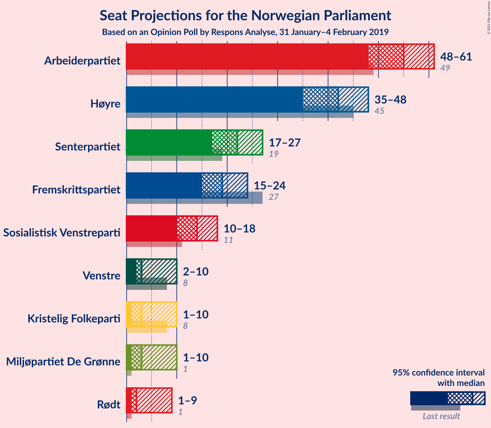
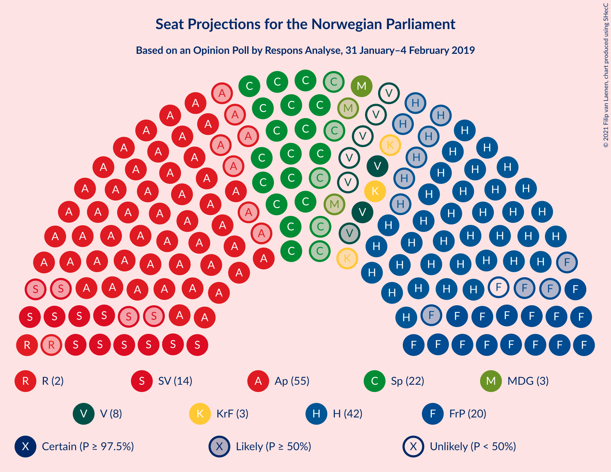
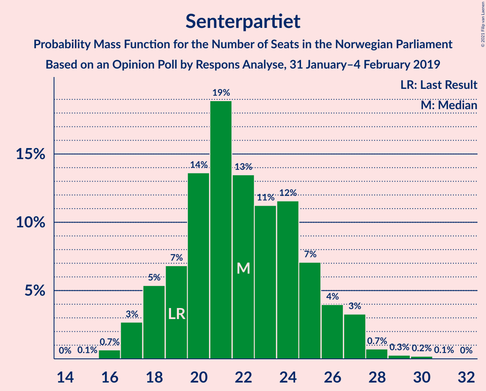
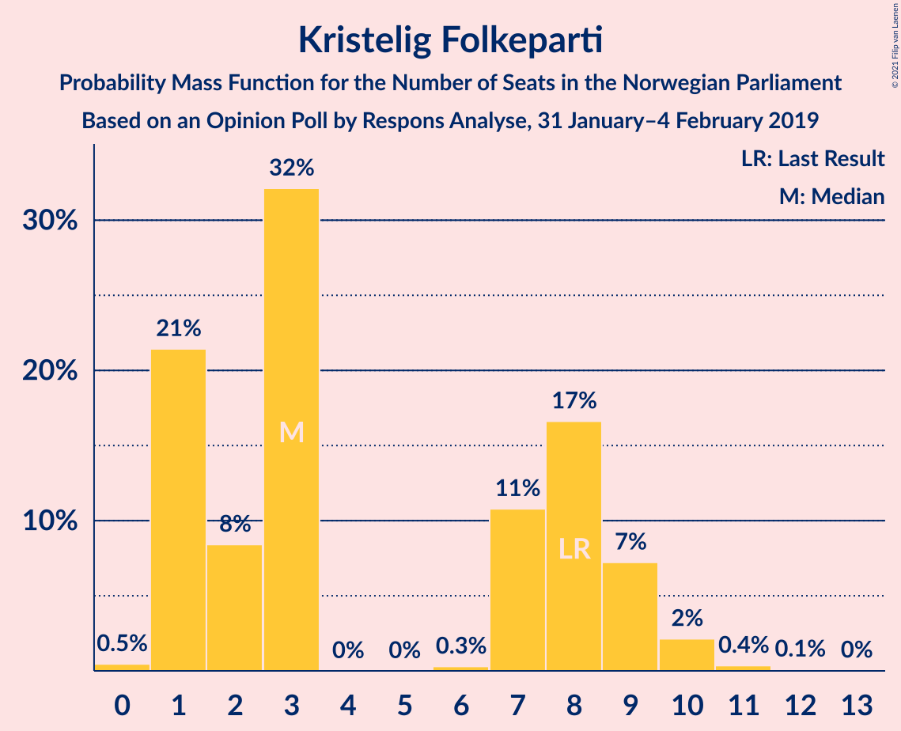
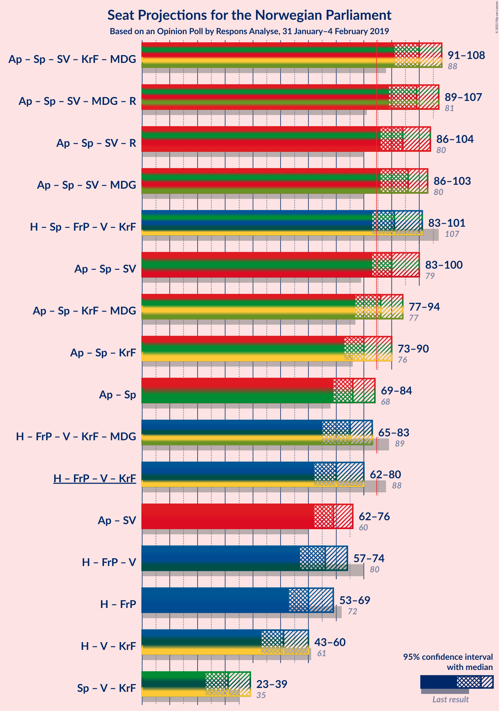
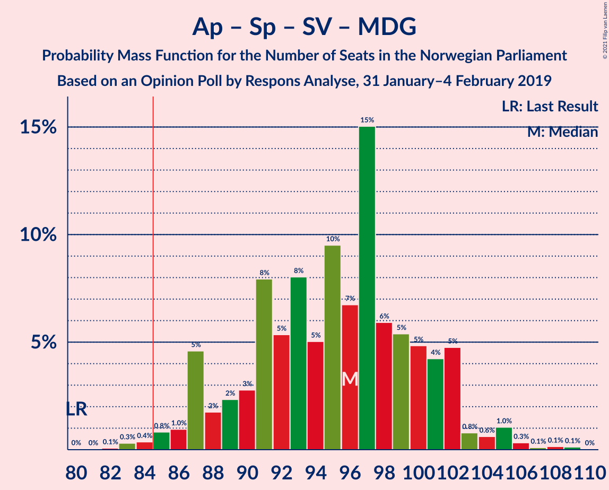
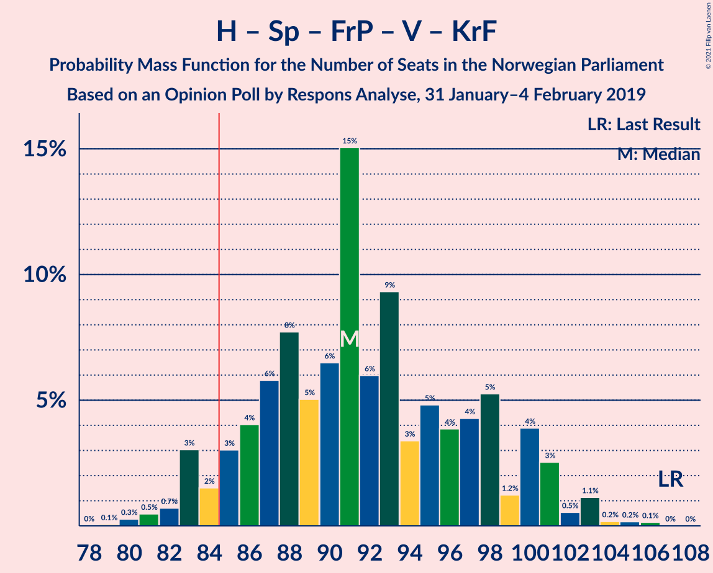
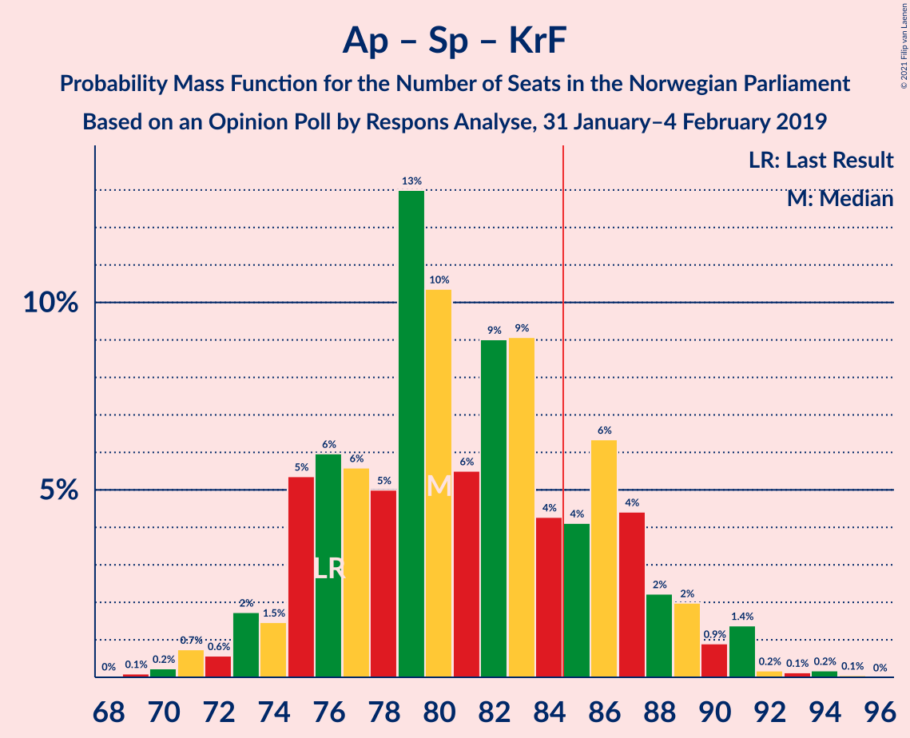
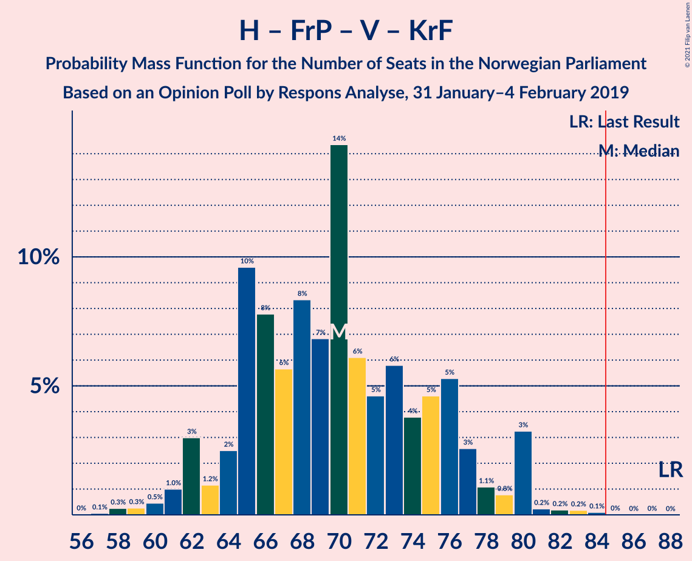
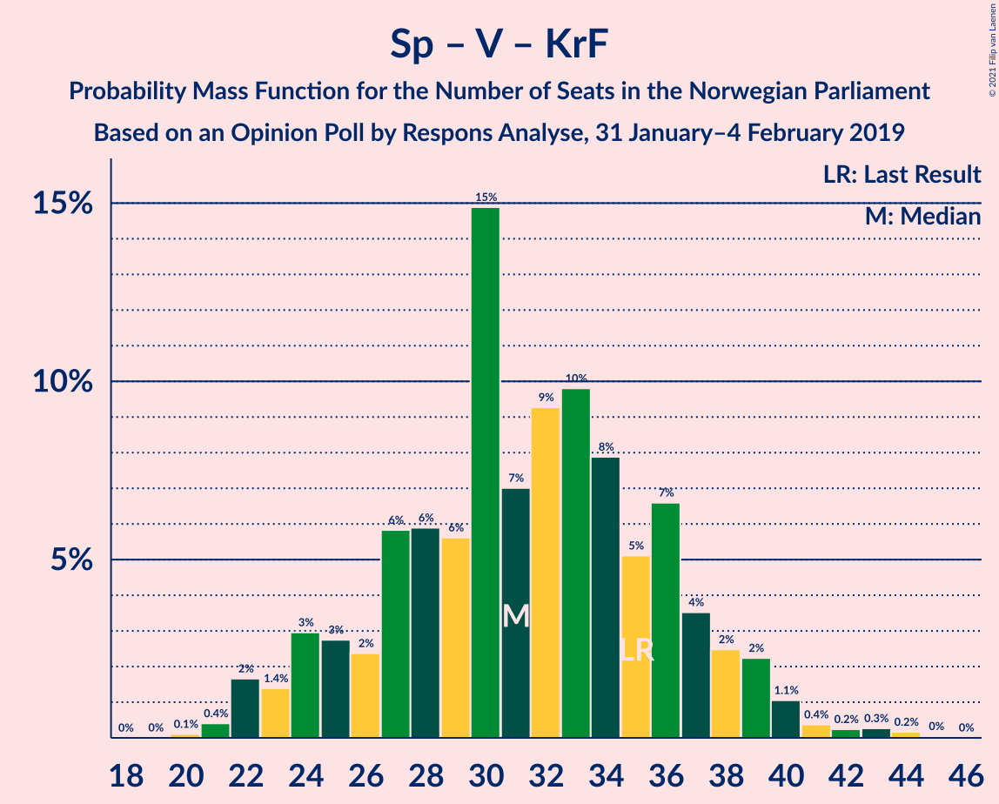

# Opinion Poll by Respons Analyse, 31 January–4 February 2019

<a href="#voting-intentions">Voting Intentions</a> | <a href="#seats">Seats</a> | <a href="#coalitions">Coalitions</a> | <a href="#technical-information">Technical Information</a>

## Voting Intentions

### Confidence Intervals

| Party | Last Result | Poll Result | 80% Confidence Interval | 90% Confidence Interval | 95% Confidence Interval | 99% Confidence Interval |
|:-----:|:-----------:|:-----------:|:-----------------------:|:-----------------------:|:-----------------------:|:-----------------------:|
| Arbeiderpartiet | 27.4% | 29.7% | 27.6–31.9% |27.0–32.6% |26.5–33.1% |25.5–34.2% |
| Høyre | 25.0% | 22.9% | 21.0–25.0% |20.4–25.6% |20.0–26.1% |19.1–27.1% |
| Senterpartiet | 10.3% | 12.2% | 10.8–13.9% |10.3–14.4% |10.0–14.8% |9.4–15.7% |
| Fremskrittspartiet | 15.2% | 10.5% | 9.2–12.1% |8.8–12.6% |8.5–13.0% |7.9–13.8% |
| Sosialistisk Venstreparti | 6.0% | 7.8% | 6.6–9.2% |6.3–9.6% |6.0–10.0% |5.5–10.7% |
| Venstre | 4.4% | 3.9% | 3.1–5.0% |2.9–5.3% |2.7–5.6% |2.4–6.1% |
| Miljøpartiet De Grønne | 3.2% | 3.7% | 3.0–4.8% |2.8–5.1% |2.6–5.4% |2.3–6.0% |
| Kristelig Folkeparti | 4.2% | 3.7% | 3.0–4.8% |2.8–5.1% |2.6–5.4% |2.3–6.0% |
| Rødt | 2.4% | 3.6% | 2.9–4.7% |2.7–5.0% |2.5–5.2% |2.1–5.8% |

*Note:* The poll result column reflects the actual value used in the calculations. Published results may vary slightly, and in addition be rounded to fewer digits.

## Seats

### Confidence Intervals

| Party | Last Result | Median | 80% Confidence Interval | 90% Confidence Interval | 95% Confidence Interval | 99% Confidence Interval |
|:-----:|:-----------:|:------:|:-----------------------:|:-----------------------:|:-----------------------:|:-----------------------:|
| <a href="#arbeiderpartiet">Arbeiderpartiet</a> | 49 | 55 | 51–58 |49–60 |47–60 |45–64 |
| <a href="#høyre">Høyre</a> | 45 | 42 | 37–47 |36–48 |36–49 |34–49 |
| <a href="#senterpartiet">Senterpartiet</a> | 19 | 22 | 18–25 |17–26 |17–27 |17–30 |
| <a href="#fremskrittspartiet">Fremskrittspartiet</a> | 27 | 19 | 16–22 |15–22 |15–23 |14–26 |
| <a href="#sosialistisk-venstreparti">Sosialistisk Venstreparti</a> | 11 | 13 | 11–17 |11–17 |11–17 |10–19 |
| <a href="#venstre">Venstre</a> | 8 | 7 | 2–9 |2–9 |2–10 |2–11 |
| <a href="#miljøpartiet-de-grønne">Miljøpartiet De Grønne</a> | 1 | 2 | 1–8 |1–8 |1–9 |1–10 |
| <a href="#kristelig-folkeparti">Kristelig Folkeparti</a> | 8 | 3 | 1–8 |1–9 |1–9 |0–11 |
| <a href="#rødt">Rødt</a> | 1 | 2 | 1–8 |1–9 |1–9 |1–10 |

### Arbeiderpartiet

*For a full overview of the results for this party, see the [Arbeiderpartiet](party-arbeiderpartiet.html) page.*

| Number of Seats | Probability | Accumulated | Special Marks |
|:---------------:|:-----------:|:-----------:|:-------------:|
| 43 | 0.2% | 100% |  |
| 44 | 0.1% | 99.8% |  |
| 45 | 0.3% | 99.7% |  |
| 46 | 0.8% | 99.5% |  |
| 47 | 2% | 98.7% |  |
| 48 | 1.4% | 97% |  |
| 49 | 1.3% | 96% | Last Result |
| 50 | 4% | 94% |  |
| 51 | 1.4% | 90% |  |
| 52 | 30% | 89% |  |
| 53 | 2% | 59% |  |
| 54 | 7% | 57% |  |
| 55 | 13% | 50% | Median |
| 56 | 8% | 37% |  |
| 57 | 7% | 29% |  |
| 58 | 12% | 22% |  |
| 59 | 2% | 10% |  |
| 60 | 6% | 8% |  |
| 61 | 0.7% | 2% |  |
| 62 | 0.4% | 2% |  |
| 63 | 0.1% | 1.3% |  |
| 64 | 1.0% | 1.2% |  |
| 65 | 0% | 0.2% |  |
| 66 | 0% | 0.1% |  |
| 67 | 0% | 0.1% |  |
| 68 | 0.1% | 0.1% |  |
| 69 | 0% | 0% |  |

### Høyre

*For a full overview of the results for this party, see the [Høyre](party-høyre.html) page.*

| Number of Seats | Probability | Accumulated | Special Marks |
|:---------------:|:-----------:|:-----------:|:-------------:|
| 32 | 0% | 100% |  |
| 33 | 0.3% | 99.9% |  |
| 34 | 0.5% | 99.6% |  |
| 35 | 0.5% | 99.1% |  |
| 36 | 6% | 98.6% |  |
| 37 | 4% | 93% |  |
| 38 | 3% | 89% |  |
| 39 | 2% | 86% |  |
| 40 | 5% | 83% |  |
| 41 | 2% | 78% |  |
| 42 | 28% | 76% | Median |
| 43 | 26% | 48% |  |
| 44 | 4% | 22% |  |
| 45 | 5% | 18% | Last Result |
| 46 | 3% | 13% |  |
| 47 | 1.0% | 10% |  |
| 48 | 6% | 9% |  |
| 49 | 3% | 3% |  |
| 50 | 0% | 0.2% |  |
| 51 | 0.1% | 0.1% |  |
| 52 | 0% | 0% |  |

### Senterpartiet

*For a full overview of the results for this party, see the [Senterpartiet](party-senterpartiet.html) page.*

| Number of Seats | Probability | Accumulated | Special Marks |
|:---------------:|:-----------:|:-----------:|:-------------:|
| 15 | 0% | 100% |  |
| 16 | 0.2% | 99.9% |  |
| 17 | 7% | 99.7% |  |
| 18 | 12% | 93% |  |
| 19 | 5% | 82% | Last Result |
| 20 | 9% | 77% |  |
| 21 | 13% | 68% |  |
| 22 | 8% | 55% | Median |
| 23 | 4% | 47% |  |
| 24 | 27% | 43% |  |
| 25 | 7% | 16% |  |
| 26 | 6% | 9% |  |
| 27 | 2% | 3% |  |
| 28 | 0.1% | 0.7% |  |
| 29 | 0.1% | 0.6% |  |
| 30 | 0.5% | 0.5% |  |
| 31 | 0% | 0% |  |

### Fremskrittspartiet

*For a full overview of the results for this party, see the [Fremskrittspartiet](party-fremskrittspartiet.html) page.*

| Number of Seats | Probability | Accumulated | Special Marks |
|:---------------:|:-----------:|:-----------:|:-------------:|
| 12 | 0.1% | 100% |  |
| 13 | 0.3% | 99.9% |  |
| 14 | 1.3% | 99.7% |  |
| 15 | 4% | 98% |  |
| 16 | 7% | 94% |  |
| 17 | 12% | 87% |  |
| 18 | 14% | 75% |  |
| 19 | 16% | 60% | Median |
| 20 | 11% | 45% |  |
| 21 | 23% | 34% |  |
| 22 | 7% | 11% |  |
| 23 | 2% | 4% |  |
| 24 | 0.6% | 2% |  |
| 25 | 0.2% | 2% |  |
| 26 | 1.3% | 1.5% |  |
| 27 | 0.2% | 0.2% | Last Result |
| 28 | 0% | 0% |  |

### Sosialistisk Venstreparti

*For a full overview of the results for this party, see the [Sosialistisk Venstreparti](party-sosialistiskvenstreparti.html) page.*

| Number of Seats | Probability | Accumulated | Special Marks |
|:---------------:|:-----------:|:-----------:|:-------------:|
| 9 | 0.2% | 100% |  |
| 10 | 1.4% | 99.8% |  |
| 11 | 16% | 98% | Last Result |
| 12 | 8% | 83% |  |
| 13 | 36% | 75% | Median |
| 14 | 5% | 39% |  |
| 15 | 6% | 34% |  |
| 16 | 18% | 29% |  |
| 17 | 8% | 10% |  |
| 18 | 0.9% | 2% |  |
| 19 | 1.3% | 1.5% |  |
| 20 | 0.1% | 0.2% |  |
| 21 | 0% | 0.1% |  |
| 22 | 0.1% | 0.1% |  |
| 23 | 0% | 0% |  |

### Venstre

*For a full overview of the results for this party, see the [Venstre](party-venstre.html) page.*

| Number of Seats | Probability | Accumulated | Special Marks |
|:---------------:|:-----------:|:-----------:|:-------------:|
| 1 | 0.2% | 100% |  |
| 2 | 36% | 99.8% |  |
| 3 | 7% | 64% |  |
| 4 | 0% | 57% |  |
| 5 | 0% | 57% |  |
| 6 | 0% | 57% |  |
| 7 | 17% | 56% | Median |
| 8 | 7% | 39% | Last Result |
| 9 | 30% | 32% |  |
| 10 | 2% | 3% |  |
| 11 | 0.4% | 0.8% |  |
| 12 | 0.4% | 0.5% |  |
| 13 | 0.1% | 0.1% |  |
| 14 | 0% | 0% |  |

### Miljøpartiet De Grønne

*For a full overview of the results for this party, see the [Miljøpartiet De Grønne](party-miljøpartietdegrønne.html) page.*

| Number of Seats | Probability | Accumulated | Special Marks |
|:---------------:|:-----------:|:-----------:|:-------------:|
| 1 | 11% | 100% | Last Result |
| 2 | 47% | 89% | Median |
| 3 | 7% | 42% |  |
| 4 | 0.7% | 35% |  |
| 5 | 0% | 34% |  |
| 6 | 0.1% | 34% |  |
| 7 | 12% | 34% |  |
| 8 | 17% | 22% |  |
| 9 | 3% | 4% |  |
| 10 | 0.8% | 1.2% |  |
| 11 | 0.4% | 0.5% |  |
| 12 | 0% | 0% |  |

### Kristelig Folkeparti

*For a full overview of the results for this party, see the [Kristelig Folkeparti](party-kristeligfolkeparti.html) page.*

| Number of Seats | Probability | Accumulated | Special Marks |
|:---------------:|:-----------:|:-----------:|:-------------:|
| 0 | 0.9% | 100% |  |
| 1 | 11% | 99.1% |  |
| 2 | 21% | 88% |  |
| 3 | 44% | 67% | Median |
| 4 | 0% | 23% |  |
| 5 | 0% | 23% |  |
| 6 | 0.2% | 23% |  |
| 7 | 4% | 23% |  |
| 8 | 9% | 19% | Last Result |
| 9 | 8% | 10% |  |
| 10 | 1.0% | 2% |  |
| 11 | 0.3% | 0.6% |  |
| 12 | 0% | 0.2% |  |
| 13 | 0.2% | 0.2% |  |
| 14 | 0% | 0% |  |

### Rødt

*For a full overview of the results for this party, see the [Rødt](party-rødt.html) page.*

| Number of Seats | Probability | Accumulated | Special Marks |
|:---------------:|:-----------:|:-----------:|:-------------:|
| 1 | 13% | 100% | Last Result |
| 2 | 47% | 87% | Median |
| 3 | 0% | 40% |  |
| 4 | 0% | 40% |  |
| 5 | 0% | 40% |  |
| 6 | 0% | 40% |  |
| 7 | 22% | 40% |  |
| 8 | 12% | 18% |  |
| 9 | 4% | 6% |  |
| 10 | 0.9% | 1.2% |  |
| 11 | 0.3% | 0.3% |  |
| 12 | 0% | 0.1% |  |
| 13 | 0% | 0% |  |

## Coalitions

### Confidence Intervals

| Coalition | Last Result | Median | Majority? | 80% Confidence Interval | 90% Confidence Interval | 95% Confidence Interval | 99% Confidence Interval |
|:---------:|:-----------:|:------:|:---------:|:-----------------------:|:-----------------------:|:-----------------------:|:-----------------------:|
| Arbeiderpartiet – Senterpartiet – Sosialistisk Venstreparti – Miljøpartiet De Grønne – Rødt | 81 | 99 | 100% | 92–104 | 92–105 | 91–108 | 88–108 |
| Arbeiderpartiet – Senterpartiet – Sosialistisk Venstreparti – Kristelig Folkeparti – Miljøpartiet De Grønne | 88 | 98 | 100% | 94–103 | 91–105 | 90–107 | 90–110 |
| Arbeiderpartiet – Senterpartiet – Sosialistisk Venstreparti – Rødt | 80 | 93 | 99.4% | 90–101 | 88–102 | 87–104 | 84–106 |
| Arbeiderpartiet – Senterpartiet – Sosialistisk Venstreparti – Miljøpartiet De Grønne | 80 | 94 | 98.7% | 90–99 | 89–100 | 87–101 | 83–106 |
| Høyre – Senterpartiet – Fremskrittspartiet – Venstre – Kristelig Folkeparti | 107 | 93 | 85% | 83–100 | 83–100 | 83–101 | 82–103 |
| Arbeiderpartiet – Senterpartiet – Sosialistisk Venstreparti | 79 | 89 | 93% | 86–96 | 84–98 | 83–99 | 80–99 |
| Arbeiderpartiet – Senterpartiet – Kristelig Folkeparti – Miljøpartiet De Grønne | 77 | 83 | 40% | 80–90 | 79–92 | 77–93 | 74–97 |
| Arbeiderpartiet – Senterpartiet – Kristelig Folkeparti | 76 | 79 | 18% | 75–86 | 75–87 | 74–89 | 71–91 |
| Arbeiderpartiet – Senterpartiet | 68 | 76 | 2% | 73–81 | 71–83 | 69–83 | 66–88 |
| Høyre – Fremskrittspartiet – Venstre – Kristelig Folkeparti – Miljøpartiet De Grønne | 89 | 76 | 0.6% | 68–79 | 67–81 | 65–82 | 63–85 |
| Høyre – Fremskrittspartiet – Venstre – Kristelig Folkeparti | 88 | 70 | 0% | 65–77 | 64–77 | 61–78 | 61–81 |
| Arbeiderpartiet – Sosialistisk Venstreparti | 60 | 68 | 0% | 64–73 | 63–74 | 61–77 | 59–79 |
| Høyre – Fremskrittspartiet – Venstre | 80 | 67 | 0% | 61–73 | 59–73 | 59–74 | 56–75 |
| Høyre – Fremskrittspartiet | 72 | 61 | 0% | 57–67 | 55–68 | 53–68 | 51–72 |
| Høyre – Venstre – Kristelig Folkeparti | 61 | 52 | 0% | 46–56 | 44–60 | 43–60 | 42–61 |
| Senterpartiet – Venstre – Kristelig Folkeparti | 35 | 31 | 0% | 24–38 | 22–39 | 22–39 | 22–42 |

### Arbeiderpartiet – Senterpartiet – Sosialistisk Venstreparti – Miljøpartiet De Grønne – Rødt

| Number of Seats | Probability | Accumulated | Special Marks |
|:---------------:|:-----------:|:-----------:|:-------------:|
| 81 | 0% | 100% | Last Result |
| 82 | 0% | 100% |  |
| 83 | 0% | 100% |  |
| 84 | 0% | 100% |  |
| 85 | 0% | 100% | Majority |
| 86 | 0.1% | 100% |  |
| 87 | 0.3% | 99.8% |  |
| 88 | 0.2% | 99.6% |  |
| 89 | 0.4% | 99.4% |  |
| 90 | 1.4% | 99.0% |  |
| 91 | 0.3% | 98% |  |
| 92 | 8% | 97% |  |
| 93 | 19% | 90% |  |
| 94 | 3% | 70% | Median |
| 95 | 8% | 68% |  |
| 96 | 2% | 60% |  |
| 97 | 7% | 58% |  |
| 98 | 1.1% | 51% |  |
| 99 | 4% | 50% |  |
| 100 | 9% | 46% |  |
| 101 | 8% | 37% |  |
| 102 | 5% | 29% |  |
| 103 | 4% | 24% |  |
| 104 | 11% | 20% |  |
| 105 | 5% | 9% |  |
| 106 | 0.3% | 4% |  |
| 107 | 0.7% | 3% |  |
| 108 | 2% | 3% |  |
| 109 | 0.2% | 0.4% |  |
| 110 | 0% | 0.2% |  |
| 111 | 0.1% | 0.1% |  |
| 112 | 0% | 0% |  |

### Arbeiderpartiet – Senterpartiet – Sosialistisk Venstreparti – Kristelig Folkeparti – Miljøpartiet De Grønne

| Number of Seats | Probability | Accumulated | Special Marks |
|:---------------:|:-----------:|:-----------:|:-------------:|
| 86 | 0.1% | 100% |  |
| 87 | 0% | 99.9% |  |
| 88 | 0.2% | 99.9% | Last Result |
| 89 | 0.1% | 99.7% |  |
| 90 | 3% | 99.6% |  |
| 91 | 2% | 96% |  |
| 92 | 0.4% | 95% |  |
| 93 | 4% | 94% |  |
| 94 | 20% | 91% |  |
| 95 | 6% | 71% | Median |
| 96 | 2% | 65% |  |
| 97 | 10% | 63% |  |
| 98 | 4% | 53% |  |
| 99 | 20% | 48% |  |
| 100 | 3% | 28% |  |
| 101 | 4% | 25% |  |
| 102 | 9% | 21% |  |
| 103 | 5% | 12% |  |
| 104 | 2% | 7% |  |
| 105 | 2% | 5% |  |
| 106 | 1.1% | 4% |  |
| 107 | 0.4% | 3% |  |
| 108 | 1.1% | 2% |  |
| 109 | 0.5% | 1.1% |  |
| 110 | 0.3% | 0.6% |  |
| 111 | 0.1% | 0.3% |  |
| 112 | 0.1% | 0.1% |  |
| 113 | 0% | 0.1% |  |
| 114 | 0% | 0% |  |

### Arbeiderpartiet – Senterpartiet – Sosialistisk Venstreparti – Rødt

| Number of Seats | Probability | Accumulated | Special Marks |
|:---------------:|:-----------:|:-----------:|:-------------:|
| 80 | 0% | 100% | Last Result |
| 81 | 0% | 99.9% |  |
| 82 | 0% | 99.9% |  |
| 83 | 0.1% | 99.9% |  |
| 84 | 0.4% | 99.8% |  |
| 85 | 1.3% | 99.4% | Majority |
| 86 | 0.3% | 98% |  |
| 87 | 1.0% | 98% |  |
| 88 | 2% | 97% |  |
| 89 | 2% | 95% |  |
| 90 | 8% | 93% |  |
| 91 | 20% | 85% |  |
| 92 | 5% | 65% | Median |
| 93 | 13% | 60% |  |
| 94 | 4% | 47% |  |
| 95 | 7% | 43% |  |
| 96 | 11% | 36% |  |
| 97 | 3% | 26% |  |
| 98 | 9% | 23% |  |
| 99 | 1.2% | 14% |  |
| 100 | 3% | 13% |  |
| 101 | 3% | 10% |  |
| 102 | 4% | 7% |  |
| 103 | 0.6% | 3% |  |
| 104 | 0.4% | 3% |  |
| 105 | 0% | 2% |  |
| 106 | 2% | 2% |  |
| 107 | 0.1% | 0.2% |  |
| 108 | 0% | 0.1% |  |
| 109 | 0% | 0% |  |

### Arbeiderpartiet – Senterpartiet – Sosialistisk Venstreparti – Miljøpartiet De Grønne

| Number of Seats | Probability | Accumulated | Special Marks |
|:---------------:|:-----------:|:-----------:|:-------------:|
| 80 | 0% | 100% | Last Result |
| 81 | 0% | 100% |  |
| 82 | 0.1% | 100% |  |
| 83 | 1.0% | 99.9% |  |
| 84 | 0.2% | 98.9% |  |
| 85 | 0.5% | 98.7% | Majority |
| 86 | 0.6% | 98% |  |
| 87 | 0.9% | 98% |  |
| 88 | 1.2% | 97% |  |
| 89 | 3% | 96% |  |
| 90 | 8% | 92% |  |
| 91 | 20% | 84% |  |
| 92 | 5% | 65% | Median |
| 93 | 7% | 60% |  |
| 94 | 8% | 52% |  |
| 95 | 9% | 44% |  |
| 96 | 4% | 35% |  |
| 97 | 12% | 31% |  |
| 98 | 3% | 19% |  |
| 99 | 7% | 16% |  |
| 100 | 6% | 9% |  |
| 101 | 2% | 4% |  |
| 102 | 0.8% | 2% |  |
| 103 | 0.7% | 1.3% |  |
| 104 | 0.1% | 0.6% |  |
| 105 | 0% | 0.5% |  |
| 106 | 0.4% | 0.5% |  |
| 107 | 0% | 0.1% |  |
| 108 | 0% | 0.1% |  |
| 109 | 0% | 0.1% |  |
| 110 | 0% | 0% |  |

### Høyre – Senterpartiet – Fremskrittspartiet – Venstre – Kristelig Folkeparti

| Number of Seats | Probability | Accumulated | Special Marks |
|:---------------:|:-----------:|:-----------:|:-------------:|
| 80 | 0% | 100% |  |
| 81 | 0.1% | 99.9% |  |
| 82 | 2% | 99.8% |  |
| 83 | 10% | 98% |  |
| 84 | 3% | 87% |  |
| 85 | 1.0% | 85% | Majority |
| 86 | 10% | 84% |  |
| 87 | 0.4% | 74% |  |
| 88 | 3% | 73% |  |
| 89 | 3% | 71% |  |
| 90 | 6% | 68% |  |
| 91 | 2% | 62% |  |
| 92 | 4% | 60% |  |
| 93 | 8% | 56% | Median |
| 94 | 4% | 48% |  |
| 95 | 2% | 45% |  |
| 96 | 3% | 42% |  |
| 97 | 2% | 39% |  |
| 98 | 15% | 37% |  |
| 99 | 0.7% | 22% |  |
| 100 | 19% | 21% |  |
| 101 | 1.5% | 3% |  |
| 102 | 0.6% | 1.1% |  |
| 103 | 0.3% | 0.6% |  |
| 104 | 0.1% | 0.2% |  |
| 105 | 0.1% | 0.2% |  |
| 106 | 0% | 0.1% |  |
| 107 | 0% | 0% | Last Result |

### Arbeiderpartiet – Senterpartiet – Sosialistisk Venstreparti

| Number of Seats | Probability | Accumulated | Special Marks |
|:---------------:|:-----------:|:-----------:|:-------------:|
| 77 | 0% | 100% |  |
| 78 | 0% | 99.9% |  |
| 79 | 0% | 99.9% | Last Result |
| 80 | 0.5% | 99.9% |  |
| 81 | 1.3% | 99.4% |  |
| 82 | 0.6% | 98% |  |
| 83 | 1.4% | 98% |  |
| 84 | 3% | 96% |  |
| 85 | 2% | 93% | Majority |
| 86 | 6% | 92% |  |
| 87 | 4% | 85% |  |
| 88 | 11% | 82% |  |
| 89 | 30% | 70% |  |
| 90 | 3% | 40% | Median |
| 91 | 5% | 38% |  |
| 92 | 9% | 32% |  |
| 93 | 6% | 23% |  |
| 94 | 3% | 17% |  |
| 95 | 1.2% | 14% |  |
| 96 | 5% | 12% |  |
| 97 | 1.1% | 8% |  |
| 98 | 4% | 6% |  |
| 99 | 3% | 3% |  |
| 100 | 0.1% | 0.3% |  |
| 101 | 0% | 0.2% |  |
| 102 | 0% | 0.2% |  |
| 103 | 0% | 0.1% |  |
| 104 | 0.1% | 0.1% |  |
| 105 | 0% | 0.1% |  |
| 106 | 0% | 0% |  |

### Arbeiderpartiet – Senterpartiet – Kristelig Folkeparti – Miljøpartiet De Grønne

| Number of Seats | Probability | Accumulated | Special Marks |
|:---------------:|:-----------:|:-----------:|:-------------:|
| 71 | 0.1% | 100% |  |
| 72 | 0% | 99.9% |  |
| 73 | 0.4% | 99.9% |  |
| 74 | 0% | 99.5% |  |
| 75 | 0.2% | 99.5% |  |
| 76 | 0.3% | 99.3% |  |
| 77 | 3% | 99.0% | Last Result |
| 78 | 1.1% | 96% |  |
| 79 | 4% | 95% |  |
| 80 | 2% | 92% |  |
| 81 | 26% | 90% |  |
| 82 | 3% | 63% | Median |
| 83 | 12% | 60% |  |
| 84 | 9% | 48% |  |
| 85 | 8% | 40% | Majority |
| 86 | 7% | 32% |  |
| 87 | 2% | 25% |  |
| 88 | 7% | 23% |  |
| 89 | 6% | 16% |  |
| 90 | 2% | 11% |  |
| 91 | 3% | 9% |  |
| 92 | 2% | 6% |  |
| 93 | 2% | 4% |  |
| 94 | 0.4% | 2% |  |
| 95 | 1.4% | 2% |  |
| 96 | 0.1% | 0.6% |  |
| 97 | 0.4% | 0.5% |  |
| 98 | 0% | 0.1% |  |
| 99 | 0% | 0.1% |  |
| 100 | 0% | 0% |  |

### Arbeiderpartiet – Senterpartiet – Kristelig Folkeparti

| Number of Seats | Probability | Accumulated | Special Marks |
|:---------------:|:-----------:|:-----------:|:-------------:|
| 69 | 0.2% | 100% |  |
| 70 | 0% | 99.8% |  |
| 71 | 0.8% | 99.7% |  |
| 72 | 0.1% | 98.9% |  |
| 73 | 0.9% | 98.8% |  |
| 74 | 1.0% | 98% |  |
| 75 | 12% | 97% |  |
| 76 | 3% | 85% | Last Result |
| 77 | 10% | 82% |  |
| 78 | 4% | 72% |  |
| 79 | 28% | 68% |  |
| 80 | 2% | 40% | Median |
| 81 | 3% | 38% |  |
| 82 | 2% | 34% |  |
| 83 | 10% | 32% |  |
| 84 | 4% | 22% |  |
| 85 | 3% | 18% | Majority |
| 86 | 10% | 16% |  |
| 87 | 1.0% | 6% |  |
| 88 | 2% | 5% |  |
| 89 | 0.7% | 3% |  |
| 90 | 2% | 2% |  |
| 91 | 0.6% | 0.8% |  |
| 92 | 0% | 0.1% |  |
| 93 | 0% | 0.1% |  |
| 94 | 0.1% | 0.1% |  |
| 95 | 0% | 0% |  |

### Arbeiderpartiet – Senterpartiet

| Number of Seats | Probability | Accumulated | Special Marks |
|:---------------:|:-----------:|:-----------:|:-------------:|
| 65 | 0.1% | 100% |  |
| 66 | 0.8% | 99.9% |  |
| 67 | 0.1% | 99.1% |  |
| 68 | 1.3% | 99.0% | Last Result |
| 69 | 1.3% | 98% |  |
| 70 | 0.7% | 96% |  |
| 71 | 4% | 96% |  |
| 72 | 1.0% | 92% |  |
| 73 | 11% | 91% |  |
| 74 | 5% | 79% |  |
| 75 | 10% | 75% |  |
| 76 | 28% | 65% |  |
| 77 | 10% | 37% | Median |
| 78 | 2% | 26% |  |
| 79 | 1.3% | 24% |  |
| 80 | 10% | 23% |  |
| 81 | 4% | 13% |  |
| 82 | 2% | 9% |  |
| 83 | 5% | 7% |  |
| 84 | 0.2% | 2% |  |
| 85 | 0.2% | 2% | Majority |
| 86 | 0.8% | 2% |  |
| 87 | 0.1% | 0.8% |  |
| 88 | 0.7% | 0.7% |  |
| 89 | 0% | 0% |  |

### Høyre – Fremskrittspartiet – Venstre – Kristelig Folkeparti – Miljøpartiet De Grønne

| Number of Seats | Probability | Accumulated | Special Marks |
|:---------------:|:-----------:|:-----------:|:-------------:|
| 61 | 0% | 100% |  |
| 62 | 0.1% | 99.9% |  |
| 63 | 2% | 99.8% |  |
| 64 | 0% | 98% |  |
| 65 | 0.4% | 98% |  |
| 66 | 0.6% | 97% |  |
| 67 | 4% | 97% |  |
| 68 | 3% | 93% |  |
| 69 | 3% | 90% |  |
| 70 | 1.2% | 87% |  |
| 71 | 9% | 86% |  |
| 72 | 3% | 77% |  |
| 73 | 11% | 74% | Median |
| 74 | 7% | 64% |  |
| 75 | 4% | 57% |  |
| 76 | 13% | 53% |  |
| 77 | 5% | 40% |  |
| 78 | 20% | 35% |  |
| 79 | 8% | 15% |  |
| 80 | 2% | 7% |  |
| 81 | 2% | 5% |  |
| 82 | 0.9% | 3% |  |
| 83 | 0.3% | 2% |  |
| 84 | 1.3% | 2% |  |
| 85 | 0.4% | 0.6% | Majority |
| 86 | 0.1% | 0.2% |  |
| 87 | 0% | 0.1% |  |
| 88 | 0% | 0.1% |  |
| 89 | 0% | 0% | Last Result |

### Høyre – Fremskrittspartiet – Venstre – Kristelig Folkeparti

| Number of Seats | Probability | Accumulated | Special Marks |
|:---------------:|:-----------:|:-----------:|:-------------:|
| 57 | 0% | 100% |  |
| 58 | 0.1% | 99.9% |  |
| 59 | 0% | 99.9% |  |
| 60 | 0.2% | 99.8% |  |
| 61 | 2% | 99.6% |  |
| 62 | 0.7% | 97% |  |
| 63 | 0.3% | 97% |  |
| 64 | 5% | 96% |  |
| 65 | 11% | 91% |  |
| 66 | 4% | 80% |  |
| 67 | 5% | 76% |  |
| 68 | 8% | 71% |  |
| 69 | 9% | 63% |  |
| 70 | 4% | 54% |  |
| 71 | 1.1% | 50% | Median |
| 72 | 7% | 48% |  |
| 73 | 2% | 42% |  |
| 74 | 8% | 40% |  |
| 75 | 3% | 32% |  |
| 76 | 19% | 30% |  |
| 77 | 8% | 10% |  |
| 78 | 0.3% | 3% |  |
| 79 | 1.4% | 2% |  |
| 80 | 0.4% | 1.0% |  |
| 81 | 0.2% | 0.6% |  |
| 82 | 0.3% | 0.4% |  |
| 83 | 0.1% | 0.2% |  |
| 84 | 0% | 0% |  |
| 85 | 0% | 0% | Majority |
| 86 | 0% | 0% |  |
| 87 | 0% | 0% |  |
| 88 | 0% | 0% | Last Result |

### Arbeiderpartiet – Sosialistisk Venstreparti

| Number of Seats | Probability | Accumulated | Special Marks |
|:---------------:|:-----------:|:-----------:|:-------------:|
| 57 | 0% | 100% |  |
| 58 | 0.2% | 99.9% |  |
| 59 | 1.0% | 99.7% |  |
| 60 | 0.5% | 98.7% | Last Result |
| 61 | 1.0% | 98% |  |
| 62 | 0.7% | 97% |  |
| 63 | 5% | 96% |  |
| 64 | 2% | 92% |  |
| 65 | 22% | 90% |  |
| 66 | 1.4% | 67% |  |
| 67 | 11% | 66% |  |
| 68 | 9% | 55% | Median |
| 69 | 12% | 46% |  |
| 70 | 3% | 33% |  |
| 71 | 17% | 31% |  |
| 72 | 2% | 14% |  |
| 73 | 4% | 12% |  |
| 74 | 3% | 7% |  |
| 75 | 1.1% | 4% |  |
| 76 | 0.3% | 3% |  |
| 77 | 2% | 3% |  |
| 78 | 0.1% | 0.6% |  |
| 79 | 0.3% | 0.5% |  |
| 80 | 0.1% | 0.2% |  |
| 81 | 0.1% | 0.1% |  |
| 82 | 0% | 0.1% |  |
| 83 | 0% | 0.1% |  |
| 84 | 0.1% | 0.1% |  |
| 85 | 0% | 0% | Majority |

### Høyre – Fremskrittspartiet – Venstre

| Number of Seats | Probability | Accumulated | Special Marks |
|:---------------:|:-----------:|:-----------:|:-------------:|
| 53 | 0.1% | 100% |  |
| 54 | 0.1% | 99.8% |  |
| 55 | 0.1% | 99.7% |  |
| 56 | 0.3% | 99.7% |  |
| 57 | 0.8% | 99.3% |  |
| 58 | 0.6% | 98.5% |  |
| 59 | 5% | 98% |  |
| 60 | 0.7% | 93% |  |
| 61 | 6% | 93% |  |
| 62 | 4% | 86% |  |
| 63 | 10% | 82% |  |
| 64 | 6% | 72% |  |
| 65 | 8% | 66% |  |
| 66 | 3% | 58% |  |
| 67 | 7% | 55% |  |
| 68 | 8% | 48% | Median |
| 69 | 5% | 40% |  |
| 70 | 2% | 35% |  |
| 71 | 10% | 33% |  |
| 72 | 1.4% | 23% |  |
| 73 | 19% | 22% |  |
| 74 | 2% | 3% |  |
| 75 | 0.2% | 0.5% |  |
| 76 | 0.1% | 0.4% |  |
| 77 | 0.2% | 0.3% |  |
| 78 | 0.1% | 0.1% |  |
| 79 | 0% | 0% |  |
| 80 | 0% | 0% | Last Result |

### Høyre – Fremskrittspartiet

| Number of Seats | Probability | Accumulated | Special Marks |
|:---------------:|:-----------:|:-----------:|:-------------:|
| 49 | 0.1% | 100% |  |
| 50 | 0.4% | 99.9% |  |
| 51 | 0.3% | 99.5% |  |
| 52 | 2% | 99.3% |  |
| 53 | 0.4% | 98% |  |
| 54 | 1.0% | 97% |  |
| 55 | 2% | 96% |  |
| 56 | 4% | 94% |  |
| 57 | 6% | 90% |  |
| 58 | 6% | 84% |  |
| 59 | 11% | 78% |  |
| 60 | 10% | 67% |  |
| 61 | 10% | 57% | Median |
| 62 | 6% | 47% |  |
| 63 | 5% | 42% |  |
| 64 | 22% | 37% |  |
| 65 | 1.1% | 15% |  |
| 66 | 2% | 13% |  |
| 67 | 3% | 12% |  |
| 68 | 7% | 9% |  |
| 69 | 0% | 2% |  |
| 70 | 0.2% | 1.5% |  |
| 71 | 0.1% | 1.3% |  |
| 72 | 1.2% | 1.3% | Last Result |
| 73 | 0% | 0% |  |

### Høyre – Venstre – Kristelig Folkeparti

| Number of Seats | Probability | Accumulated | Special Marks |
|:---------------:|:-----------:|:-----------:|:-------------:|
| 38 | 0.1% | 100% |  |
| 39 | 0.1% | 99.9% |  |
| 40 | 0.2% | 99.8% |  |
| 41 | 0.1% | 99.6% |  |
| 42 | 2% | 99.5% |  |
| 43 | 1.1% | 98% |  |
| 44 | 2% | 97% |  |
| 45 | 0.8% | 95% |  |
| 46 | 15% | 94% |  |
| 47 | 1.3% | 79% |  |
| 48 | 6% | 78% |  |
| 49 | 3% | 72% |  |
| 50 | 4% | 69% |  |
| 51 | 12% | 65% |  |
| 52 | 4% | 53% | Median |
| 53 | 5% | 49% |  |
| 54 | 11% | 44% |  |
| 55 | 19% | 33% |  |
| 56 | 4% | 13% |  |
| 57 | 0.9% | 9% |  |
| 58 | 0.8% | 9% |  |
| 59 | 0.7% | 8% |  |
| 60 | 6% | 7% |  |
| 61 | 0.9% | 1.1% | Last Result |
| 62 | 0.1% | 0.2% |  |
| 63 | 0% | 0.1% |  |
| 64 | 0% | 0.1% |  |
| 65 | 0% | 0% |  |

### Senterpartiet – Venstre – Kristelig Folkeparti

| Number of Seats | Probability | Accumulated | Special Marks |
|:---------------:|:-----------:|:-----------:|:-------------:|
| 21 | 0.1% | 100% |  |
| 22 | 9% | 99.8% |  |
| 23 | 0.6% | 91% |  |
| 24 | 0.5% | 90% |  |
| 25 | 6% | 90% |  |
| 26 | 6% | 84% |  |
| 27 | 3% | 78% |  |
| 28 | 3% | 75% |  |
| 29 | 3% | 72% |  |
| 30 | 16% | 69% |  |
| 31 | 6% | 53% |  |
| 32 | 3% | 47% | Median |
| 33 | 2% | 44% |  |
| 34 | 3% | 42% |  |
| 35 | 6% | 38% | Last Result |
| 36 | 20% | 32% |  |
| 37 | 1.2% | 12% |  |
| 38 | 2% | 11% |  |
| 39 | 7% | 9% |  |
| 40 | 0.9% | 2% |  |
| 41 | 0.4% | 1.0% |  |
| 42 | 0.3% | 0.6% |  |
| 43 | 0.1% | 0.3% |  |
| 44 | 0.1% | 0.1% |  |
| 45 | 0% | 0% |  |

## Technical Information

### Opinion Poll

+ **Polling firm:** Respons Analyse
+ **Commissioner(s):** —
+ **Fieldwork period:** 31 January–4 February 2019

### Calculations

+ **Sample size:** 721
+ **Simulations done:** 131,072
+ **Error estimate:** 3.20%

