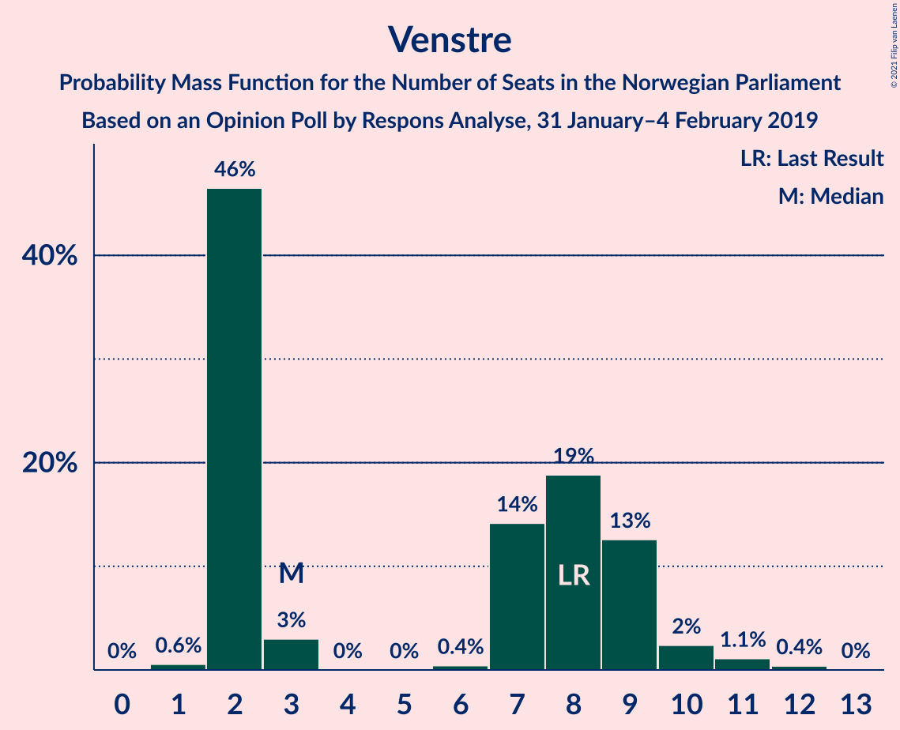
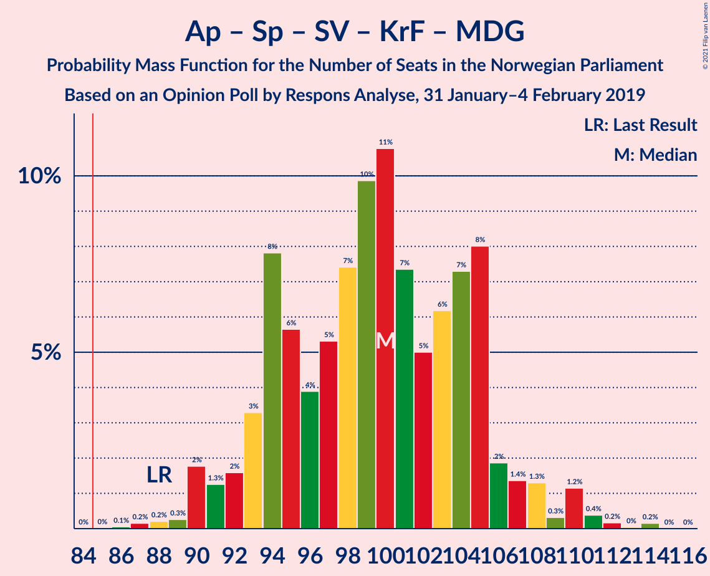
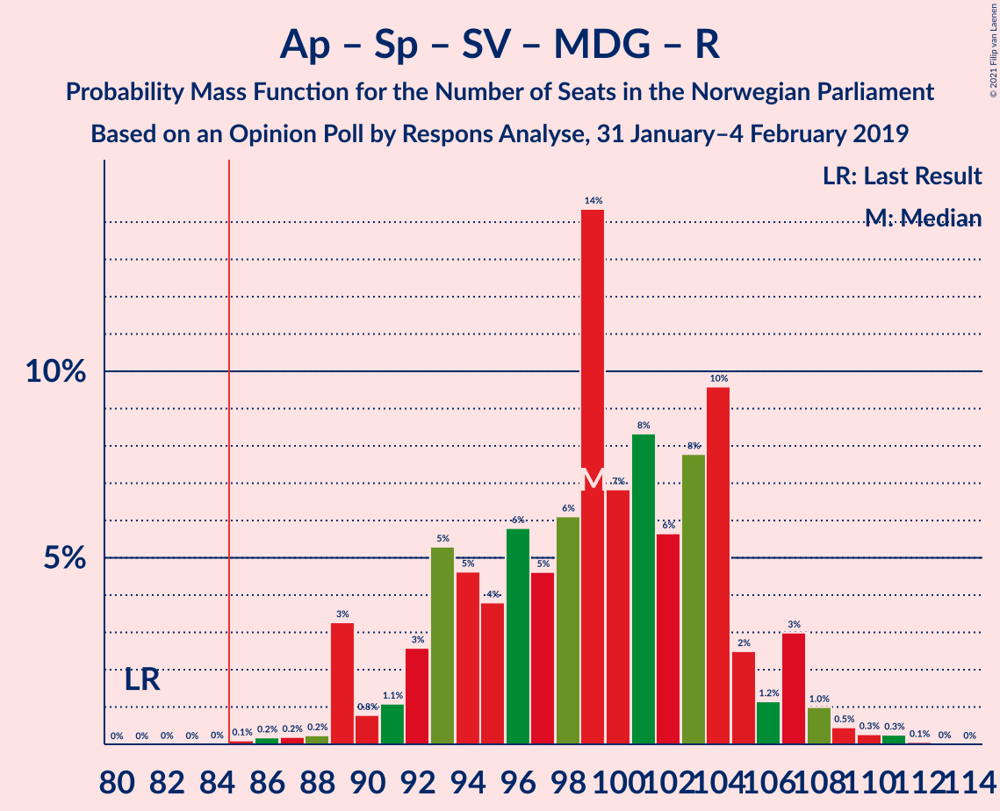
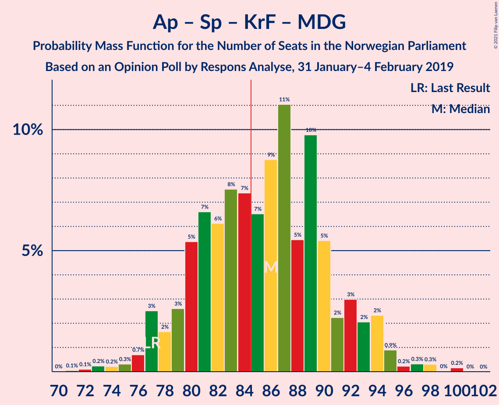
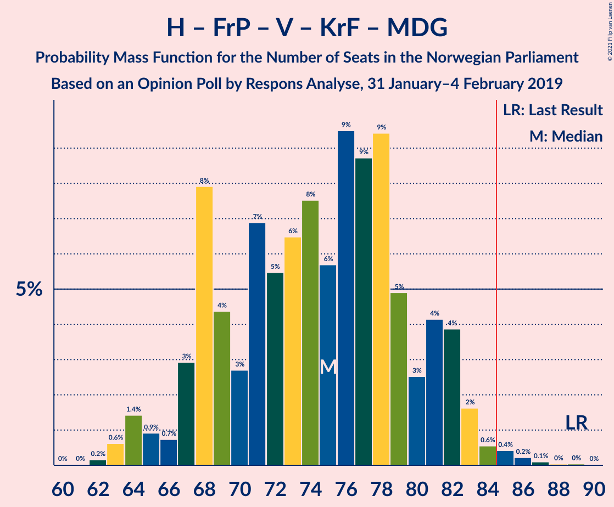
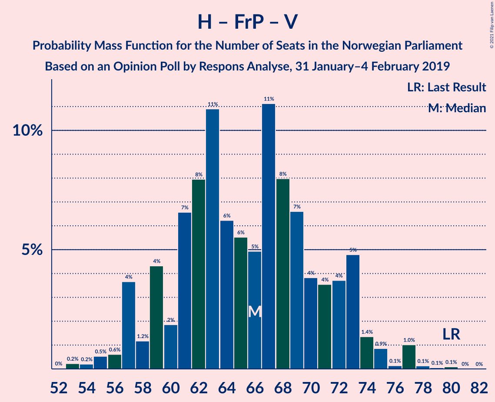

# Opinion Poll by Respons Analyse, 31 January–4 February 2019

<a href="#voting-intentions">Voting Intentions</a> | <a href="#seats">Seats</a> | <a href="#coalitions">Coalitions</a> | <a href="#technical-information">Technical Information</a>

## Voting Intentions

### Confidence Intervals

| Party | Last Result | Poll Result | 80% Confidence Interval | 90% Confidence Interval | 95% Confidence Interval | 99% Confidence Interval |
|:-----:|:-----------:|:-----------:|:-----------------------:|:-----------------------:|:-----------------------:|:-----------------------:|
| Arbeiderpartiet | 27.4% | 29.7% | 27.6–31.9% |27.0–32.6% |26.5–33.1% |25.5–34.2% |
| Høyre | 25.0% | 22.9% | 21.0–25.0% |20.4–25.6% |20.0–26.1% |19.1–27.1% |
| Senterpartiet | 10.3% | 12.2% | 10.8–13.9% |10.3–14.4% |10.0–14.8% |9.4–15.7% |
| Fremskrittspartiet | 15.2% | 10.5% | 9.2–12.1% |8.8–12.6% |8.5–13.0% |7.9–13.8% |
| Sosialistisk Venstreparti | 6.0% | 7.8% | 6.6–9.2% |6.3–9.6% |6.0–10.0% |5.5–10.7% |
| Venstre | 4.4% | 3.9% | 3.1–5.0% |2.9–5.3% |2.7–5.6% |2.4–6.1% |
| Miljøpartiet De Grønne | 3.2% | 3.7% | 3.0–4.8% |2.8–5.1% |2.6–5.4% |2.3–6.0% |
| Kristelig Folkeparti | 4.2% | 3.7% | 3.0–4.8% |2.8–5.1% |2.6–5.4% |2.3–6.0% |
| Rødt | 2.4% | 3.6% | 2.9–4.7% |2.7–5.0% |2.5–5.2% |2.1–5.8% |

*Note:* The poll result column reflects the actual value used in the calculations. Published results may vary slightly, and in addition be rounded to fewer digits.

## Seats

### Confidence Intervals

| Party | Last Result | Median | 80% Confidence Interval | 90% Confidence Interval | 95% Confidence Interval | 99% Confidence Interval |
|:-----:|:-----------:|:------:|:-----------------------:|:-----------------------:|:-----------------------:|:-----------------------:|
| <a href="#arbeiderpartiet">Arbeiderpartiet</a> | 49 | 55 | 50–59 |49–60 |48–61 |46–63 |
| <a href="#høyre">Høyre</a> | 45 | 42 | 37–45 |36–47 |35–48 |33–50 |
| <a href="#senterpartiet">Senterpartiet</a> | 19 | 22 | 19–25 |18–26 |17–27 |16–29 |
| <a href="#fremskrittspartiet">Fremskrittspartiet</a> | 27 | 19 | 16–22 |15–23 |15–24 |13–25 |
| <a href="#sosialistisk-venstreparti">Sosialistisk Venstreparti</a> | 11 | 14 | 11–17 |11–18 |10–18 |10–20 |
| <a href="#venstre">Venstre</a> | 8 | 3 | 2–9 |2–9 |2–10 |1–11 |
| <a href="#miljøpartiet-de-grønne">Miljøpartiet De Grønne</a> | 1 | 3 | 1–8 |1–9 |1–10 |1–10 |
| <a href="#kristelig-folkeparti">Kristelig Folkeparti</a> | 8 | 3 | 1–8 |1–9 |1–10 |1–10 |
| <a href="#rødt">Rødt</a> | 1 | 2 | 1–8 |1–9 |1–9 |1–10 |

### Arbeiderpartiet

*For a full overview of the results for this party, see the [Arbeiderpartiet](party-arbeiderpartiet.html) page.*

| Number of Seats | Probability | Accumulated | Special Marks |
|:---------------:|:-----------:|:-----------:|:-------------:|
| 43 | 0.1% | 100% |  |
| 44 | 0.1% | 99.9% |  |
| 45 | 0.3% | 99.8% |  |
| 46 | 0.5% | 99.6% |  |
| 47 | 1.1% | 99.1% |  |
| 48 | 2% | 98% |  |
| 49 | 4% | 96% | Last Result |
| 50 | 4% | 93% |  |
| 51 | 7% | 88% |  |
| 52 | 7% | 81% |  |
| 53 | 8% | 74% |  |
| 54 | 12% | 66% |  |
| 55 | 14% | 54% | Median |
| 56 | 9% | 40% |  |
| 57 | 8% | 31% |  |
| 58 | 12% | 23% |  |
| 59 | 4% | 12% |  |
| 60 | 3% | 7% |  |
| 61 | 2% | 4% |  |
| 62 | 0.9% | 2% |  |
| 63 | 0.6% | 1.1% |  |
| 64 | 0.3% | 0.5% |  |
| 65 | 0.1% | 0.1% |  |
| 66 | 0% | 0.1% |  |
| 67 | 0% | 0% |  |

### Høyre

*For a full overview of the results for this party, see the [Høyre](party-høyre.html) page.*

| Number of Seats | Probability | Accumulated | Special Marks |
|:---------------:|:-----------:|:-----------:|:-------------:|
| 32 | 0.1% | 100% |  |
| 33 | 0.6% | 99.9% |  |
| 34 | 0.6% | 99.3% |  |
| 35 | 3% | 98.7% |  |
| 36 | 3% | 96% |  |
| 37 | 5% | 93% |  |
| 38 | 6% | 88% |  |
| 39 | 8% | 83% |  |
| 40 | 8% | 74% |  |
| 41 | 11% | 66% |  |
| 42 | 21% | 56% | Median |
| 43 | 14% | 35% |  |
| 44 | 7% | 22% |  |
| 45 | 6% | 15% | Last Result |
| 46 | 3% | 9% |  |
| 47 | 2% | 6% |  |
| 48 | 2% | 4% |  |
| 49 | 0.7% | 1.3% |  |
| 50 | 0.3% | 0.6% |  |
| 51 | 0.2% | 0.3% |  |
| 52 | 0.1% | 0.1% |  |
| 53 | 0% | 0% |  |

### Senterpartiet

*For a full overview of the results for this party, see the [Senterpartiet](party-senterpartiet.html) page.*

| Number of Seats | Probability | Accumulated | Special Marks |
|:---------------:|:-----------:|:-----------:|:-------------:|
| 15 | 0.1% | 100% |  |
| 16 | 0.7% | 99.9% |  |
| 17 | 3% | 99.3% |  |
| 18 | 5% | 97% |  |
| 19 | 7% | 91% | Last Result |
| 20 | 14% | 84% |  |
| 21 | 19% | 71% |  |
| 22 | 13% | 52% | Median |
| 23 | 11% | 38% |  |
| 24 | 12% | 27% |  |
| 25 | 7% | 16% |  |
| 26 | 4% | 9% |  |
| 27 | 3% | 5% |  |
| 28 | 0.7% | 1.3% |  |
| 29 | 0.3% | 0.6% |  |
| 30 | 0.2% | 0.3% |  |
| 31 | 0.1% | 0.1% |  |
| 32 | 0% | 0% |  |

### Fremskrittspartiet

*For a full overview of the results for this party, see the [Fremskrittspartiet](party-fremskrittspartiet.html) page.*

| Number of Seats | Probability | Accumulated | Special Marks |
|:---------------:|:-----------:|:-----------:|:-------------:|
| 12 | 0.1% | 100% |  |
| 13 | 0.7% | 99.9% |  |
| 14 | 1.4% | 99.2% |  |
| 15 | 4% | 98% |  |
| 16 | 7% | 94% |  |
| 17 | 18% | 87% |  |
| 18 | 15% | 69% |  |
| 19 | 13% | 54% | Median |
| 20 | 14% | 41% |  |
| 21 | 13% | 27% |  |
| 22 | 7% | 14% |  |
| 23 | 4% | 8% |  |
| 24 | 2% | 4% |  |
| 25 | 1.3% | 2% |  |
| 26 | 0.3% | 0.4% |  |
| 27 | 0.1% | 0.1% | Last Result |
| 28 | 0% | 0% |  |

### Sosialistisk Venstreparti

*For a full overview of the results for this party, see the [Sosialistisk Venstreparti](party-sosialistiskvenstreparti.html) page.*

| Number of Seats | Probability | Accumulated | Special Marks |
|:---------------:|:-----------:|:-----------:|:-------------:|
| 9 | 0.3% | 100% |  |
| 10 | 3% | 99.7% |  |
| 11 | 7% | 96% | Last Result |
| 12 | 13% | 89% |  |
| 13 | 19% | 76% |  |
| 14 | 17% | 57% | Median |
| 15 | 14% | 40% |  |
| 16 | 15% | 26% |  |
| 17 | 5% | 12% |  |
| 18 | 5% | 6% |  |
| 19 | 1.3% | 2% |  |
| 20 | 0.4% | 0.6% |  |
| 21 | 0.1% | 0.2% |  |
| 22 | 0% | 0% |  |

### Venstre

*For a full overview of the results for this party, see the [Venstre](party-venstre.html) page.*

| Number of Seats | Probability | Accumulated | Special Marks |
|:---------------:|:-----------:|:-----------:|:-------------:|
| 1 | 0.6% | 100% |  |
| 2 | 46% | 99.4% |  |
| 3 | 3% | 53% | Median |
| 4 | 0% | 50% |  |
| 5 | 0% | 50% |  |
| 6 | 0.4% | 50% |  |
| 7 | 14% | 50% |  |
| 8 | 19% | 35% | Last Result |
| 9 | 13% | 17% |  |
| 10 | 2% | 4% |  |
| 11 | 1.1% | 2% |  |
| 12 | 0.4% | 0.4% |  |
| 13 | 0% | 0% |  |

### Miljøpartiet De Grønne

*For a full overview of the results for this party, see the [Miljøpartiet De Grønne](party-miljøpartietdegrønne.html) page.*

| Number of Seats | Probability | Accumulated | Special Marks |
|:---------------:|:-----------:|:-----------:|:-------------:|
| 0 | 0.1% | 100% |  |
| 1 | 17% | 99.9% | Last Result |
| 2 | 29% | 83% |  |
| 3 | 9% | 54% | Median |
| 4 | 0.6% | 45% |  |
| 5 | 0% | 44% |  |
| 6 | 0.1% | 44% |  |
| 7 | 17% | 44% |  |
| 8 | 20% | 27% |  |
| 9 | 4% | 7% |  |
| 10 | 3% | 3% |  |
| 11 | 0.2% | 0.3% |  |
| 12 | 0.1% | 0.1% |  |
| 13 | 0% | 0% |  |

### Kristelig Folkeparti

*For a full overview of the results for this party, see the [Kristelig Folkeparti](party-kristeligfolkeparti.html) page.*

| Number of Seats | Probability | Accumulated | Special Marks |
|:---------------:|:-----------:|:-----------:|:-------------:|
| 0 | 0.5% | 100% |  |
| 1 | 21% | 99.5% |  |
| 2 | 8% | 78% |  |
| 3 | 32% | 70% | Median |
| 4 | 0% | 38% |  |
| 5 | 0% | 38% |  |
| 6 | 0.3% | 38% |  |
| 7 | 11% | 37% |  |
| 8 | 17% | 26% | Last Result |
| 9 | 7% | 10% |  |
| 10 | 2% | 3% |  |
| 11 | 0.4% | 0.5% |  |
| 12 | 0.1% | 0.1% |  |
| 13 | 0% | 0% |  |

### Rødt

*For a full overview of the results for this party, see the [Rødt](party-rødt.html) page.*

| Number of Seats | Probability | Accumulated | Special Marks |
|:---------------:|:-----------:|:-----------:|:-------------:|
| 1 | 17% | 100% | Last Result |
| 2 | 47% | 83% | Median |
| 3 | 0% | 36% |  |
| 4 | 0% | 36% |  |
| 5 | 0% | 36% |  |
| 6 | 0.1% | 36% |  |
| 7 | 17% | 36% |  |
| 8 | 12% | 18% |  |
| 9 | 5% | 6% |  |
| 10 | 1.1% | 2% |  |
| 11 | 0.4% | 0.5% |  |
| 12 | 0% | 0% |  |

## Coalitions

### Confidence Intervals

| Coalition | Last Result | Median | Majority? | 80% Confidence Interval | 90% Confidence Interval | 95% Confidence Interval | 99% Confidence Interval |
|:---------:|:-----------:|:------:|:---------:|:-----------------------:|:-----------------------:|:-----------------------:|:-----------------------:|
| Arbeiderpartiet – Senterpartiet – Sosialistisk Venstreparti – Kristelig Folkeparti – Miljøpartiet De Grønne | 88 | 100 | 100% | 94–105 | 92–106 | 91–108 | 89–111 |
| Arbeiderpartiet – Senterpartiet – Sosialistisk Venstreparti – Miljøpartiet De Grønne – Rødt | 81 | 99 | 100% | 93–104 | 91–107 | 89–107 | 87–110 |
| Arbeiderpartiet – Senterpartiet – Sosialistisk Venstreparti – Rødt | 80 | 94 | 99.1% | 88–101 | 87–102 | 86–104 | 84–106 |
| Arbeiderpartiet – Senterpartiet – Sosialistisk Venstreparti – Miljøpartiet De Grønne | 80 | 96 | 99.2% | 89–101 | 87–102 | 86–103 | 84–106 |
| Høyre – Senterpartiet – Fremskrittspartiet – Venstre – Kristelig Folkeparti | 107 | 91 | 94% | 86–98 | 84–100 | 83–101 | 81–104 |
| Arbeiderpartiet – Senterpartiet – Sosialistisk Venstreparti | 79 | 90 | 93% | 85–96 | 84–98 | 83–100 | 80–102 |
| Arbeiderpartiet – Senterpartiet – Kristelig Folkeparti – Miljøpartiet De Grønne | 77 | 86 | 59% | 80–91 | 78–93 | 77–94 | 74–98 |
| Arbeiderpartiet – Senterpartiet – Kristelig Folkeparti | 76 | 80 | 22% | 75–87 | 75–88 | 73–90 | 71–92 |
| Arbeiderpartiet – Senterpartiet | 68 | 76 | 2% | 72–82 | 70–83 | 69–84 | 66–87 |
| Høyre – Fremskrittspartiet – Venstre – Kristelig Folkeparti – Miljøpartiet De Grønne | 89 | 75 | 0.9% | 68–81 | 67–82 | 65–83 | 63–85 |
| Høyre – Fremskrittspartiet – Venstre – Kristelig Folkeparti | 88 | 70 | 0% | 65–76 | 62–78 | 62–80 | 59–82 |
| Arbeiderpartiet – Sosialistisk Venstreparti | 60 | 69 | 0% | 64–74 | 62–75 | 62–76 | 59–79 |
| Høyre – Fremskrittspartiet – Venstre | 80 | 66 | 0% | 59–72 | 57–73 | 57–74 | 55–77 |
| Høyre – Fremskrittspartiet | 72 | 60 | 0% | 55–66 | 54–68 | 53–69 | 50–71 |
| Høyre – Venstre – Kristelig Folkeparti | 61 | 51 | 0% | 45–56 | 44–59 | 43–60 | 41–61 |
| Senterpartiet – Venstre – Kristelig Folkeparti | 35 | 31 | 0% | 26–37 | 24–38 | 23–39 | 21–42 |

### Arbeiderpartiet – Senterpartiet – Sosialistisk Venstreparti – Kristelig Folkeparti – Miljøpartiet De Grønne

| Number of Seats | Probability | Accumulated | Special Marks |
|:---------------:|:-----------:|:-----------:|:-------------:|
| 86 | 0.1% | 100% |  |
| 87 | 0.2% | 99.9% |  |
| 88 | 0.2% | 99.8% | Last Result |
| 89 | 0.3% | 99.5% |  |
| 90 | 2% | 99.3% |  |
| 91 | 1.3% | 98% |  |
| 92 | 2% | 96% |  |
| 93 | 3% | 95% |  |
| 94 | 8% | 91% |  |
| 95 | 6% | 84% |  |
| 96 | 4% | 78% |  |
| 97 | 5% | 74% | Median |
| 98 | 7% | 69% |  |
| 99 | 10% | 61% |  |
| 100 | 11% | 51% |  |
| 101 | 7% | 41% |  |
| 102 | 5% | 33% |  |
| 103 | 6% | 28% |  |
| 104 | 7% | 22% |  |
| 105 | 8% | 15% |  |
| 106 | 2% | 7% |  |
| 107 | 1.4% | 5% |  |
| 108 | 1.3% | 4% |  |
| 109 | 0.3% | 2% |  |
| 110 | 1.2% | 2% |  |
| 111 | 0.4% | 0.8% |  |
| 112 | 0.2% | 0.4% |  |
| 113 | 0% | 0.2% |  |
| 114 | 0.2% | 0.2% |  |
| 115 | 0% | 0% |  |

### Arbeiderpartiet – Senterpartiet – Sosialistisk Venstreparti – Miljøpartiet De Grønne – Rødt

| Number of Seats | Probability | Accumulated | Special Marks |
|:---------------:|:-----------:|:-----------:|:-------------:|
| 81 | 0% | 100% | Last Result |
| 82 | 0% | 100% |  |
| 83 | 0% | 100% |  |
| 84 | 0% | 100% |  |
| 85 | 0.1% | 100% | Majority |
| 86 | 0.2% | 99.9% |  |
| 87 | 0.2% | 99.7% |  |
| 88 | 0.2% | 99.5% |  |
| 89 | 3% | 99.2% |  |
| 90 | 0.8% | 96% |  |
| 91 | 1.1% | 95% |  |
| 92 | 3% | 94% |  |
| 93 | 5% | 92% |  |
| 94 | 5% | 86% |  |
| 95 | 4% | 82% |  |
| 96 | 6% | 78% | Median |
| 97 | 5% | 72% |  |
| 98 | 6% | 67% |  |
| 99 | 14% | 61% |  |
| 100 | 7% | 47% |  |
| 101 | 8% | 40% |  |
| 102 | 6% | 32% |  |
| 103 | 8% | 26% |  |
| 104 | 10% | 18% |  |
| 105 | 2% | 9% |  |
| 106 | 1.2% | 6% |  |
| 107 | 3% | 5% |  |
| 108 | 1.0% | 2% |  |
| 109 | 0.5% | 1.1% |  |
| 110 | 0.3% | 0.6% |  |
| 111 | 0.3% | 0.4% |  |
| 112 | 0.1% | 0.1% |  |
| 113 | 0% | 0% |  |

### Arbeiderpartiet – Senterpartiet – Sosialistisk Venstreparti – Rødt

| Number of Seats | Probability | Accumulated | Special Marks |
|:---------------:|:-----------:|:-----------:|:-------------:|
| 80 | 0% | 100% | Last Result |
| 81 | 0% | 99.9% |  |
| 82 | 0.1% | 99.9% |  |
| 83 | 0.2% | 99.8% |  |
| 84 | 0.4% | 99.6% |  |
| 85 | 0.6% | 99.1% | Majority |
| 86 | 2% | 98.6% |  |
| 87 | 4% | 97% |  |
| 88 | 4% | 93% |  |
| 89 | 3% | 89% |  |
| 90 | 5% | 86% |  |
| 91 | 9% | 81% |  |
| 92 | 9% | 72% |  |
| 93 | 10% | 63% | Median |
| 94 | 6% | 54% |  |
| 95 | 8% | 48% |  |
| 96 | 6% | 41% |  |
| 97 | 5% | 34% |  |
| 98 | 7% | 29% |  |
| 99 | 3% | 22% |  |
| 100 | 4% | 19% |  |
| 101 | 8% | 15% |  |
| 102 | 3% | 7% |  |
| 103 | 0.7% | 4% |  |
| 104 | 0.9% | 3% |  |
| 105 | 1.4% | 2% |  |
| 106 | 0.6% | 0.8% |  |
| 107 | 0.2% | 0.2% |  |
| 108 | 0% | 0.1% |  |
| 109 | 0% | 0% |  |

### Arbeiderpartiet – Senterpartiet – Sosialistisk Venstreparti – Miljøpartiet De Grønne

| Number of Seats | Probability | Accumulated | Special Marks |
|:---------------:|:-----------:|:-----------:|:-------------:|
| 80 | 0% | 100% | Last Result |
| 81 | 0% | 99.9% |  |
| 82 | 0.1% | 99.9% |  |
| 83 | 0.3% | 99.8% |  |
| 84 | 0.4% | 99.5% |  |
| 85 | 0.8% | 99.2% | Majority |
| 86 | 1.0% | 98% |  |
| 87 | 5% | 97% |  |
| 88 | 2% | 93% |  |
| 89 | 2% | 91% |  |
| 90 | 3% | 89% |  |
| 91 | 8% | 86% |  |
| 92 | 5% | 78% |  |
| 93 | 8% | 73% |  |
| 94 | 5% | 65% | Median |
| 95 | 10% | 60% |  |
| 96 | 7% | 50% |  |
| 97 | 15% | 43% |  |
| 98 | 6% | 28% |  |
| 99 | 5% | 22% |  |
| 100 | 5% | 17% |  |
| 101 | 4% | 12% |  |
| 102 | 5% | 8% |  |
| 103 | 0.8% | 3% |  |
| 104 | 0.6% | 2% |  |
| 105 | 1.0% | 2% |  |
| 106 | 0.3% | 0.7% |  |
| 107 | 0.1% | 0.4% |  |
| 108 | 0.1% | 0.3% |  |
| 109 | 0.1% | 0.2% |  |
| 110 | 0% | 0% |  |

### Høyre – Senterpartiet – Fremskrittspartiet – Venstre – Kristelig Folkeparti

| Number of Seats | Probability | Accumulated | Special Marks |
|:---------------:|:-----------:|:-----------:|:-------------:|
| 79 | 0.1% | 100% |  |
| 80 | 0.3% | 99.9% |  |
| 81 | 0.5% | 99.6% |  |
| 82 | 0.7% | 99.1% |  |
| 83 | 3% | 98% |  |
| 84 | 2% | 95% |  |
| 85 | 3% | 94% | Majority |
| 86 | 4% | 91% |  |
| 87 | 6% | 87% |  |
| 88 | 8% | 81% |  |
| 89 | 5% | 73% | Median |
| 90 | 6% | 68% |  |
| 91 | 15% | 62% |  |
| 92 | 6% | 47% |  |
| 93 | 9% | 41% |  |
| 94 | 3% | 31% |  |
| 95 | 5% | 28% |  |
| 96 | 4% | 23% |  |
| 97 | 4% | 19% |  |
| 98 | 5% | 15% |  |
| 99 | 1.2% | 10% |  |
| 100 | 4% | 9% |  |
| 101 | 3% | 5% |  |
| 102 | 0.5% | 2% |  |
| 103 | 1.1% | 2% |  |
| 104 | 0.2% | 0.5% |  |
| 105 | 0.2% | 0.3% |  |
| 106 | 0.1% | 0.2% |  |
| 107 | 0% | 0% | Last Result |

### Arbeiderpartiet – Senterpartiet – Sosialistisk Venstreparti

| Number of Seats | Probability | Accumulated | Special Marks |
|:---------------:|:-----------:|:-----------:|:-------------:|
| 77 | 0% | 100% |  |
| 78 | 0.1% | 99.9% |  |
| 79 | 0.2% | 99.8% | Last Result |
| 80 | 0.3% | 99.6% |  |
| 81 | 0.6% | 99.3% |  |
| 82 | 0.6% | 98.7% |  |
| 83 | 1.4% | 98% |  |
| 84 | 3% | 97% |  |
| 85 | 6% | 93% | Majority |
| 86 | 5% | 87% |  |
| 87 | 7% | 82% |  |
| 88 | 7% | 75% |  |
| 89 | 10% | 68% |  |
| 90 | 9% | 58% |  |
| 91 | 9% | 49% | Median |
| 92 | 6% | 40% |  |
| 93 | 7% | 34% |  |
| 94 | 10% | 27% |  |
| 95 | 4% | 17% |  |
| 96 | 4% | 13% |  |
| 97 | 1.1% | 9% |  |
| 98 | 4% | 8% |  |
| 99 | 1.2% | 5% |  |
| 100 | 3% | 4% |  |
| 101 | 0.2% | 0.8% |  |
| 102 | 0.3% | 0.6% |  |
| 103 | 0.2% | 0.3% |  |
| 104 | 0.1% | 0.1% |  |
| 105 | 0% | 0.1% |  |
| 106 | 0% | 0% |  |

### Arbeiderpartiet – Senterpartiet – Kristelig Folkeparti – Miljøpartiet De Grønne

| Number of Seats | Probability | Accumulated | Special Marks |
|:---------------:|:-----------:|:-----------:|:-------------:|
| 71 | 0.1% | 100% |  |
| 72 | 0.1% | 99.9% |  |
| 73 | 0.2% | 99.8% |  |
| 74 | 0.2% | 99.6% |  |
| 75 | 0.3% | 99.4% |  |
| 76 | 0.7% | 99.0% |  |
| 77 | 3% | 98% | Last Result |
| 78 | 2% | 96% |  |
| 79 | 3% | 94% |  |
| 80 | 5% | 92% |  |
| 81 | 7% | 86% |  |
| 82 | 6% | 80% |  |
| 83 | 8% | 73% | Median |
| 84 | 7% | 66% |  |
| 85 | 7% | 59% | Majority |
| 86 | 9% | 52% |  |
| 87 | 11% | 43% |  |
| 88 | 5% | 32% |  |
| 89 | 10% | 27% |  |
| 90 | 5% | 17% |  |
| 91 | 2% | 12% |  |
| 92 | 3% | 9% |  |
| 93 | 2% | 6% |  |
| 94 | 2% | 4% |  |
| 95 | 0.9% | 2% |  |
| 96 | 0.2% | 1.1% |  |
| 97 | 0.3% | 0.8% |  |
| 98 | 0.3% | 0.5% |  |
| 99 | 0% | 0.2% |  |
| 100 | 0.2% | 0.2% |  |
| 101 | 0% | 0% |  |

### Arbeiderpartiet – Senterpartiet – Kristelig Folkeparti

| Number of Seats | Probability | Accumulated | Special Marks |
|:---------------:|:-----------:|:-----------:|:-------------:|
| 68 | 0% | 100% |  |
| 69 | 0.1% | 99.9% |  |
| 70 | 0.2% | 99.8% |  |
| 71 | 0.7% | 99.6% |  |
| 72 | 0.6% | 98.8% |  |
| 73 | 2% | 98% |  |
| 74 | 1.5% | 97% |  |
| 75 | 5% | 95% |  |
| 76 | 6% | 90% | Last Result |
| 77 | 6% | 84% |  |
| 78 | 5% | 78% |  |
| 79 | 13% | 73% |  |
| 80 | 10% | 60% | Median |
| 81 | 6% | 50% |  |
| 82 | 9% | 44% |  |
| 83 | 9% | 35% |  |
| 84 | 4% | 26% |  |
| 85 | 4% | 22% | Majority |
| 86 | 6% | 18% |  |
| 87 | 4% | 11% |  |
| 88 | 2% | 7% |  |
| 89 | 2% | 5% |  |
| 90 | 0.9% | 3% |  |
| 91 | 1.4% | 2% |  |
| 92 | 0.2% | 0.6% |  |
| 93 | 0.1% | 0.4% |  |
| 94 | 0.2% | 0.2% |  |
| 95 | 0.1% | 0.1% |  |
| 96 | 0% | 0% |  |

### Arbeiderpartiet – Senterpartiet

| Number of Seats | Probability | Accumulated | Special Marks |
|:---------------:|:-----------:|:-----------:|:-------------:|
| 64 | 0.1% | 100% |  |
| 65 | 0.2% | 99.9% |  |
| 66 | 0.3% | 99.7% |  |
| 67 | 0.4% | 99.4% |  |
| 68 | 0.6% | 99.0% | Last Result |
| 69 | 1.1% | 98% |  |
| 70 | 3% | 97% |  |
| 71 | 3% | 95% |  |
| 72 | 9% | 92% |  |
| 73 | 6% | 83% |  |
| 74 | 7% | 77% |  |
| 75 | 9% | 70% |  |
| 76 | 12% | 61% |  |
| 77 | 9% | 49% | Median |
| 78 | 7% | 40% |  |
| 79 | 8% | 32% |  |
| 80 | 8% | 24% |  |
| 81 | 4% | 16% |  |
| 82 | 6% | 12% |  |
| 83 | 2% | 6% |  |
| 84 | 2% | 4% |  |
| 85 | 0.7% | 2% | Majority |
| 86 | 0.6% | 1.5% |  |
| 87 | 0.4% | 0.8% |  |
| 88 | 0.3% | 0.4% |  |
| 89 | 0% | 0.1% |  |
| 90 | 0% | 0% |  |

### Høyre – Fremskrittspartiet – Venstre – Kristelig Folkeparti – Miljøpartiet De Grønne

| Number of Seats | Probability | Accumulated | Special Marks |
|:---------------:|:-----------:|:-----------:|:-------------:|
| 61 | 0% | 100% |  |
| 62 | 0.2% | 99.9% |  |
| 63 | 0.6% | 99.8% |  |
| 64 | 1.4% | 99.2% |  |
| 65 | 0.9% | 98% |  |
| 66 | 0.7% | 97% |  |
| 67 | 3% | 96% |  |
| 68 | 8% | 93% |  |
| 69 | 4% | 85% |  |
| 70 | 3% | 81% | Median |
| 71 | 7% | 78% |  |
| 72 | 5% | 71% |  |
| 73 | 6% | 66% |  |
| 74 | 8% | 59% |  |
| 75 | 6% | 52% |  |
| 76 | 9% | 46% |  |
| 77 | 9% | 37% |  |
| 78 | 9% | 28% |  |
| 79 | 5% | 18% |  |
| 80 | 3% | 14% |  |
| 81 | 4% | 11% |  |
| 82 | 4% | 7% |  |
| 83 | 2% | 3% |  |
| 84 | 0.6% | 1.4% |  |
| 85 | 0.4% | 0.9% | Majority |
| 86 | 0.2% | 0.4% |  |
| 87 | 0.1% | 0.2% |  |
| 88 | 0% | 0.1% |  |
| 89 | 0% | 0.1% | Last Result |
| 90 | 0% | 0% |  |

### Høyre – Fremskrittspartiet – Venstre – Kristelig Folkeparti

| Number of Seats | Probability | Accumulated | Special Marks |
|:---------------:|:-----------:|:-----------:|:-------------:|
| 57 | 0.1% | 100% |  |
| 58 | 0.3% | 99.9% |  |
| 59 | 0.3% | 99.6% |  |
| 60 | 0.5% | 99.4% |  |
| 61 | 1.0% | 98.9% |  |
| 62 | 3% | 98% |  |
| 63 | 1.2% | 95% |  |
| 64 | 2% | 94% |  |
| 65 | 10% | 91% |  |
| 66 | 8% | 82% |  |
| 67 | 6% | 74% | Median |
| 68 | 8% | 68% |  |
| 69 | 7% | 60% |  |
| 70 | 14% | 53% |  |
| 71 | 6% | 39% |  |
| 72 | 5% | 33% |  |
| 73 | 6% | 28% |  |
| 74 | 4% | 22% |  |
| 75 | 5% | 18% |  |
| 76 | 5% | 14% |  |
| 77 | 3% | 8% |  |
| 78 | 1.1% | 6% |  |
| 79 | 0.8% | 5% |  |
| 80 | 3% | 4% |  |
| 81 | 0.2% | 0.8% |  |
| 82 | 0.2% | 0.5% |  |
| 83 | 0.2% | 0.3% |  |
| 84 | 0.1% | 0.1% |  |
| 85 | 0% | 0% | Majority |
| 86 | 0% | 0% |  |
| 87 | 0% | 0% |  |
| 88 | 0% | 0% | Last Result |

### Arbeiderpartiet – Sosialistisk Venstreparti

| Number of Seats | Probability | Accumulated | Special Marks |
|:---------------:|:-----------:|:-----------:|:-------------:|
| 56 | 0% | 100% |  |
| 57 | 0% | 99.9% |  |
| 58 | 0.2% | 99.9% |  |
| 59 | 0.6% | 99.7% |  |
| 60 | 0.6% | 99.2% | Last Result |
| 61 | 0.8% | 98.5% |  |
| 62 | 3% | 98% |  |
| 63 | 2% | 95% |  |
| 64 | 6% | 92% |  |
| 65 | 8% | 86% |  |
| 66 | 6% | 79% |  |
| 67 | 10% | 73% |  |
| 68 | 9% | 63% |  |
| 69 | 13% | 54% | Median |
| 70 | 9% | 41% |  |
| 71 | 7% | 32% |  |
| 72 | 8% | 24% |  |
| 73 | 5% | 16% |  |
| 74 | 3% | 11% |  |
| 75 | 4% | 8% |  |
| 76 | 2% | 4% |  |
| 77 | 1.1% | 2% |  |
| 78 | 0.4% | 0.9% |  |
| 79 | 0.4% | 0.6% |  |
| 80 | 0.1% | 0.2% |  |
| 81 | 0.1% | 0.1% |  |
| 82 | 0% | 0% |  |

### Høyre – Fremskrittspartiet – Venstre

| Number of Seats | Probability | Accumulated | Special Marks |
|:---------------:|:-----------:|:-----------:|:-------------:|
| 53 | 0.2% | 100% |  |
| 54 | 0.2% | 99.7% |  |
| 55 | 0.5% | 99.5% |  |
| 56 | 0.6% | 99.0% |  |
| 57 | 4% | 98% |  |
| 58 | 1.2% | 95% |  |
| 59 | 4% | 94% |  |
| 60 | 2% | 89% |  |
| 61 | 7% | 87% |  |
| 62 | 8% | 81% |  |
| 63 | 11% | 73% |  |
| 64 | 6% | 62% | Median |
| 65 | 6% | 56% |  |
| 66 | 5% | 50% |  |
| 67 | 11% | 45% |  |
| 68 | 8% | 34% |  |
| 69 | 7% | 26% |  |
| 70 | 4% | 20% |  |
| 71 | 4% | 16% |  |
| 72 | 4% | 12% |  |
| 73 | 5% | 8% |  |
| 74 | 1.4% | 4% |  |
| 75 | 0.9% | 2% |  |
| 76 | 0.1% | 1.4% |  |
| 77 | 1.0% | 1.3% |  |
| 78 | 0.1% | 0.3% |  |
| 79 | 0.1% | 0.2% |  |
| 80 | 0.1% | 0.1% | Last Result |
| 81 | 0% | 0% |  |

### Høyre – Fremskrittspartiet

| Number of Seats | Probability | Accumulated | Special Marks |
|:---------------:|:-----------:|:-----------:|:-------------:|
| 47 | 0.1% | 100% |  |
| 48 | 0% | 99.9% |  |
| 49 | 0.1% | 99.9% |  |
| 50 | 0.4% | 99.8% |  |
| 51 | 0.8% | 99.4% |  |
| 52 | 0.8% | 98.7% |  |
| 53 | 1.1% | 98% |  |
| 54 | 3% | 97% |  |
| 55 | 5% | 94% |  |
| 56 | 3% | 89% |  |
| 57 | 7% | 86% |  |
| 58 | 9% | 79% |  |
| 59 | 9% | 70% |  |
| 60 | 14% | 61% |  |
| 61 | 13% | 47% | Median |
| 62 | 5% | 33% |  |
| 63 | 7% | 28% |  |
| 64 | 7% | 21% |  |
| 65 | 4% | 15% |  |
| 66 | 3% | 10% |  |
| 67 | 2% | 7% |  |
| 68 | 2% | 5% |  |
| 69 | 2% | 3% |  |
| 70 | 0.6% | 2% |  |
| 71 | 0.7% | 1.0% |  |
| 72 | 0.2% | 0.3% | Last Result |
| 73 | 0.1% | 0.1% |  |
| 74 | 0% | 0% |  |

### Høyre – Venstre – Kristelig Folkeparti

| Number of Seats | Probability | Accumulated | Special Marks |
|:---------------:|:-----------:|:-----------:|:-------------:|
| 38 | 0.1% | 100% |  |
| 39 | 0.2% | 99.9% |  |
| 40 | 0.2% | 99.7% |  |
| 41 | 0.5% | 99.5% |  |
| 42 | 1.4% | 99.0% |  |
| 43 | 2% | 98% |  |
| 44 | 4% | 96% |  |
| 45 | 5% | 92% |  |
| 46 | 6% | 87% |  |
| 47 | 4% | 81% |  |
| 48 | 4% | 78% | Median |
| 49 | 8% | 73% |  |
| 50 | 8% | 65% |  |
| 51 | 13% | 58% |  |
| 52 | 10% | 45% |  |
| 53 | 8% | 35% |  |
| 54 | 7% | 27% |  |
| 55 | 6% | 19% |  |
| 56 | 4% | 13% |  |
| 57 | 2% | 9% |  |
| 58 | 2% | 7% |  |
| 59 | 1.1% | 6% |  |
| 60 | 4% | 5% |  |
| 61 | 0.6% | 1.1% | Last Result |
| 62 | 0.2% | 0.5% |  |
| 63 | 0.1% | 0.3% |  |
| 64 | 0.1% | 0.2% |  |
| 65 | 0.1% | 0.1% |  |
| 66 | 0% | 0% |  |

### Senterpartiet – Venstre – Kristelig Folkeparti

| Number of Seats | Probability | Accumulated | Special Marks |
|:---------------:|:-----------:|:-----------:|:-------------:|
| 20 | 0.1% | 100% |  |
| 21 | 0.4% | 99.9% |  |
| 22 | 2% | 99.5% |  |
| 23 | 1.4% | 98% |  |
| 24 | 3% | 96% |  |
| 25 | 3% | 93% |  |
| 26 | 2% | 91% |  |
| 27 | 6% | 88% |  |
| 28 | 6% | 83% | Median |
| 29 | 6% | 77% |  |
| 30 | 15% | 71% |  |
| 31 | 7% | 56% |  |
| 32 | 9% | 49% |  |
| 33 | 10% | 40% |  |
| 34 | 8% | 30% |  |
| 35 | 5% | 22% | Last Result |
| 36 | 7% | 17% |  |
| 37 | 4% | 10% |  |
| 38 | 2% | 7% |  |
| 39 | 2% | 4% |  |
| 40 | 1.1% | 2% |  |
| 41 | 0.4% | 1.1% |  |
| 42 | 0.2% | 0.7% |  |
| 43 | 0.3% | 0.5% |  |
| 44 | 0.2% | 0.2% |  |
| 45 | 0% | 0.1% |  |
| 46 | 0% | 0% |  |

## Technical Information

### Opinion Poll

+ **Polling firm:** Respons Analyse
+ **Commissioner(s):** —
+ **Fieldwork period:** 31 January–4 February 2019

### Calculations

+ **Sample size:** 721
+ **Simulations done:** 1,048,576
+ **Error estimate:** 2.79%

