# Opinion Poll by Norfakta, 5–6 February 2019

<a href="#voting-intentions">Voting Intentions</a> | <a href="#seats">Seats</a> | <a href="#coalitions">Coalitions</a> | <a href="#technical-information">Technical Information</a>

## Voting Intentions

### Confidence Intervals

| Party | Last Result | Poll Result | 80% Confidence Interval | 90% Confidence Interval | 95% Confidence Interval | 99% Confidence Interval |
|:-----:|:-----------:|:-----------:|:-----------------------:|:-----------------------:|:-----------------------:|:-----------------------:|
| Arbeiderpartiet | 27.4% | 29.3% | 27.3–31.5% |26.7–32.1% |26.2–32.6% |25.3–33.7% |
| Høyre | 25.0% | 23.0% | 21.1–25.0% |20.6–25.5% |20.1–26.0% |19.3–27.0% |
| Senterpartiet | 10.3% | 12.8% | 11.3–14.4% |10.9–14.9% |10.6–15.3% |10.0–16.1% |
| Fremskrittspartiet | 15.2% | 10.8% | 9.5–12.4% |9.2–12.8% |8.9–13.2% |8.3–14.0% |
| Sosialistisk Venstreparti | 6.0% | 7.1% | 6.1–8.5% |5.8–8.8% |5.5–9.2% |5.1–9.8% |
| Kristelig Folkeparti | 4.2% | 4.1% | 3.3–5.1% |3.1–5.4% |2.9–5.7% |2.6–6.3% |
| Rødt | 2.4% | 4.0% | 3.2–5.0% |3.0–5.3% |2.8–5.6% |2.5–6.1% |
| Miljøpartiet De Grønne | 3.2% | 3.3% | 2.6–4.3% |2.4–4.6% |2.3–4.8% |2.0–5.3% |
| Venstre | 4.4% | 3.3% | 2.6–4.3% |2.4–4.6% |2.3–4.8% |2.0–5.3% |

*Note:* The poll result column reflects the actual value used in the calculations. Published results may vary slightly, and in addition be rounded to fewer digits.

## Seats

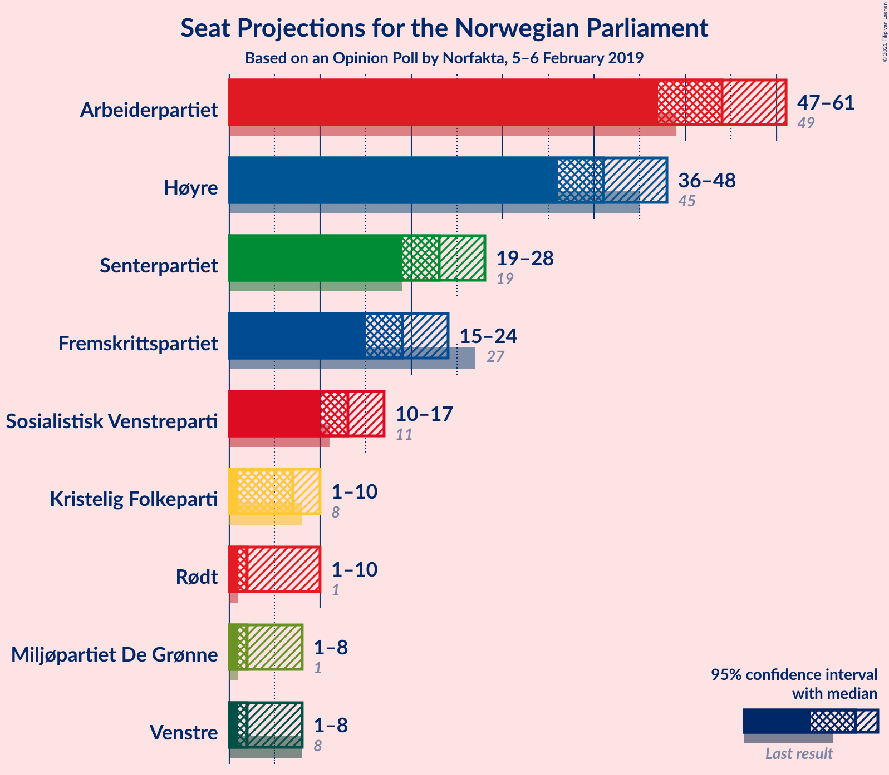

### Confidence Intervals

| Party | Last Result | Median | 80% Confidence Interval | 90% Confidence Interval | 95% Confidence Interval | 99% Confidence Interval |
|:-----:|:-----------:|:------:|:-----------------------:|:-----------------------:|:-----------------------:|:-----------------------:|
| <a href="#arbeiderpartiet">Arbeiderpartiet</a> | 49 | 55 | 52–58 |50–62 |48–62 |46–62 |
| <a href="#høyre">Høyre</a> | 45 | 41 | 38–45 |36–46 |35–47 |35–50 |
| <a href="#senterpartiet">Senterpartiet</a> | 19 | 23 | 20–25 |19–26 |19–26 |18–29 |
| <a href="#fremskrittspartiet">Fremskrittspartiet</a> | 27 | 20 | 17–24 |16–24 |16–24 |14–25 |
| <a href="#sosialistisk-venstreparti">Sosialistisk Venstreparti</a> | 11 | 13 | 11–15 |11–16 |11–16 |9–17 |
| <a href="#kristelig-folkeparti">Kristelig Folkeparti</a> | 8 | 3 | 1–9 |1–10 |1–10 |1–11 |
| <a href="#rødt">Rødt</a> | 1 | 2 | 2–9 |2–9 |1–10 |1–11 |
| <a href="#miljøpartiet-de-grønne">Miljøpartiet De Grønne</a> | 1 | 7 | 1–7 |1–8 |1–8 |1–8 |
| <a href="#venstre">Venstre</a> | 8 | 2 | 2 |2 |1–6 |1–9 |

### Arbeiderpartiet

*For a full overview of the results for this party, see the [Arbeiderpartiet](party-arbeiderpartiet.html) page.*

| Number of Seats | Probability | Accumulated | Special Marks |
|:---------------:|:-----------:|:-----------:|:-------------:|
| 43 | 0% | 100% |  |
| 44 | 0% | 99.9% |  |
| 45 | 0.2% | 99.9% |  |
| 46 | 0.7% | 99.7% |  |
| 47 | 1.1% | 99.0% |  |
| 48 | 0.7% | 98% |  |
| 49 | 2% | 97% | Last Result |
| 50 | 5% | 96% |  |
| 51 | 1.0% | 91% |  |
| 52 | 12% | 90% |  |
| 53 | 7% | 78% |  |
| 54 | 20% | 70% |  |
| 55 | 22% | 51% | Median |
| 56 | 6% | 29% |  |
| 57 | 10% | 23% |  |
| 58 | 3% | 13% |  |
| 59 | 3% | 10% |  |
| 60 | 1.5% | 7% |  |
| 61 | 0.2% | 6% |  |
| 62 | 5% | 6% |  |
| 63 | 0.1% | 0.3% |  |
| 64 | 0.1% | 0.1% |  |
| 65 | 0% | 0.1% |  |
| 66 | 0% | 0% |  |

### Høyre

*For a full overview of the results for this party, see the [Høyre](party-høyre.html) page.*

| Number of Seats | Probability | Accumulated | Special Marks |
|:---------------:|:-----------:|:-----------:|:-------------:|
| 33 | 0.2% | 100% |  |
| 34 | 0.2% | 99.7% |  |
| 35 | 2% | 99.6% |  |
| 36 | 4% | 97% |  |
| 37 | 0.7% | 93% |  |
| 38 | 16% | 93% |  |
| 39 | 10% | 77% |  |
| 40 | 5% | 66% |  |
| 41 | 25% | 62% | Median |
| 42 | 7% | 37% |  |
| 43 | 4% | 30% |  |
| 44 | 8% | 26% |  |
| 45 | 13% | 18% | Last Result |
| 46 | 1.0% | 5% |  |
| 47 | 3% | 4% |  |
| 48 | 0.7% | 2% |  |
| 49 | 0.2% | 1.0% |  |
| 50 | 0.5% | 0.8% |  |
| 51 | 0.2% | 0.3% |  |
| 52 | 0% | 0.1% |  |
| 53 | 0% | 0.1% |  |
| 54 | 0% | 0% |  |

### Senterpartiet

*For a full overview of the results for this party, see the [Senterpartiet](party-senterpartiet.html) page.*

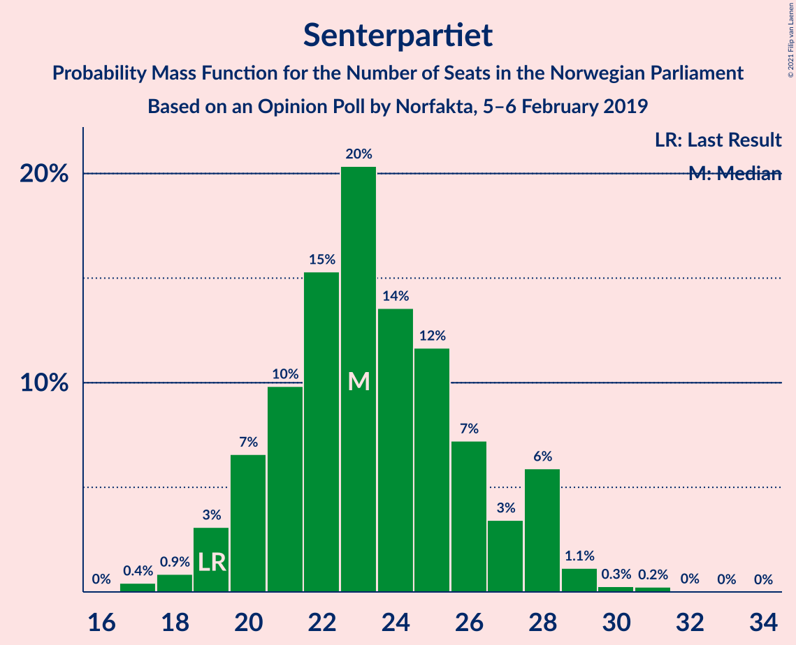

| Number of Seats | Probability | Accumulated | Special Marks |
|:---------------:|:-----------:|:-----------:|:-------------:|
| 17 | 0.4% | 100% |  |
| 18 | 0.5% | 99.6% |  |
| 19 | 8% | 99.1% | Last Result |
| 20 | 2% | 91% |  |
| 21 | 2% | 89% |  |
| 22 | 13% | 87% |  |
| 23 | 36% | 74% | Median |
| 24 | 24% | 38% |  |
| 25 | 8% | 14% |  |
| 26 | 4% | 6% |  |
| 27 | 1.4% | 2% |  |
| 28 | 0.3% | 1.0% |  |
| 29 | 0.5% | 0.7% |  |
| 30 | 0.2% | 0.2% |  |
| 31 | 0% | 0.1% |  |
| 32 | 0% | 0% |  |

### Fremskrittspartiet

*For a full overview of the results for this party, see the [Fremskrittspartiet](party-fremskrittspartiet.html) page.*

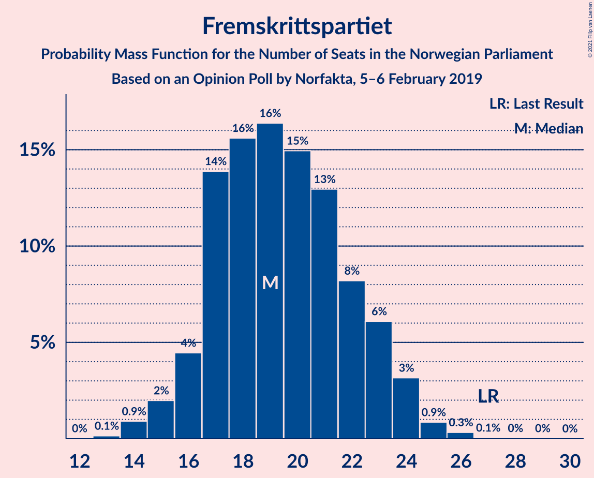

| Number of Seats | Probability | Accumulated | Special Marks |
|:---------------:|:-----------:|:-----------:|:-------------:|
| 13 | 0.1% | 100% |  |
| 14 | 0.4% | 99.8% |  |
| 15 | 2% | 99.4% |  |
| 16 | 4% | 98% |  |
| 17 | 8% | 93% |  |
| 18 | 17% | 85% |  |
| 19 | 14% | 68% |  |
| 20 | 9% | 54% | Median |
| 21 | 18% | 45% |  |
| 22 | 3% | 27% |  |
| 23 | 12% | 24% |  |
| 24 | 12% | 13% |  |
| 25 | 0.3% | 0.7% |  |
| 26 | 0.3% | 0.4% |  |
| 27 | 0% | 0.1% | Last Result |
| 28 | 0% | 0% |  |

### Sosialistisk Venstreparti

*For a full overview of the results for this party, see the [Sosialistisk Venstreparti](party-sosialistiskvenstreparti.html) page.*

| Number of Seats | Probability | Accumulated | Special Marks |
|:---------------:|:-----------:|:-----------:|:-------------:|
| 8 | 0.2% | 100% |  |
| 9 | 0.6% | 99.8% |  |
| 10 | 1.4% | 99.2% |  |
| 11 | 14% | 98% | Last Result |
| 12 | 27% | 84% |  |
| 13 | 15% | 57% | Median |
| 14 | 11% | 42% |  |
| 15 | 26% | 31% |  |
| 16 | 5% | 6% |  |
| 17 | 0.3% | 0.7% |  |
| 18 | 0.2% | 0.4% |  |
| 19 | 0.1% | 0.1% |  |
| 20 | 0% | 0% |  |

### Kristelig Folkeparti

*For a full overview of the results for this party, see the [Kristelig Folkeparti](party-kristeligfolkeparti.html) page.*

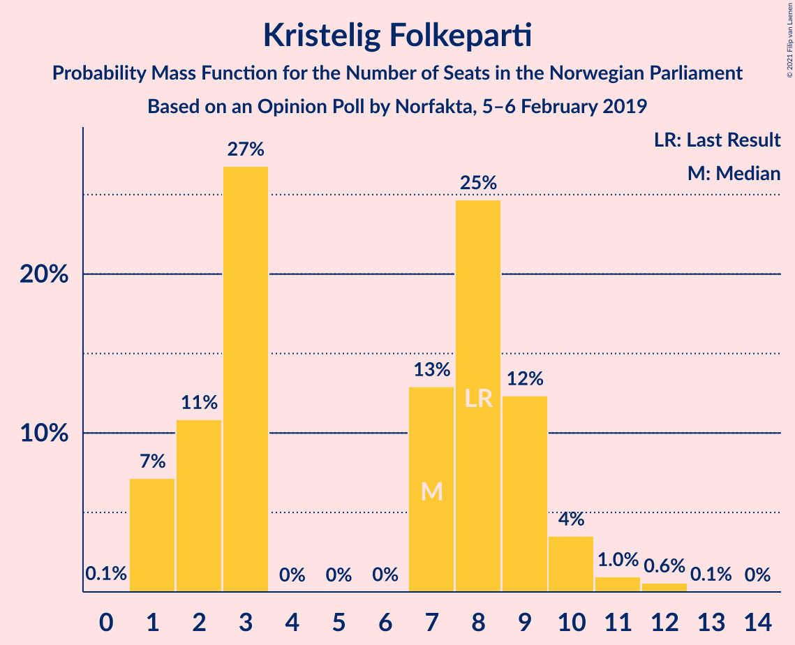

| Number of Seats | Probability | Accumulated | Special Marks |
|:---------------:|:-----------:|:-----------:|:-------------:|
| 1 | 11% | 100% |  |
| 2 | 3% | 89% |  |
| 3 | 40% | 86% | Median |
| 4 | 0% | 46% |  |
| 5 | 0% | 46% |  |
| 6 | 0.1% | 46% |  |
| 7 | 4% | 46% |  |
| 8 | 26% | 42% | Last Result |
| 9 | 10% | 16% |  |
| 10 | 5% | 6% |  |
| 11 | 1.2% | 1.3% |  |
| 12 | 0.1% | 0.1% |  |
| 13 | 0% | 0% |  |

### Rødt

*For a full overview of the results for this party, see the [Rødt](party-rødt.html) page.*

| Number of Seats | Probability | Accumulated | Special Marks |
|:---------------:|:-----------:|:-----------:|:-------------:|
| 1 | 3% | 100% | Last Result |
| 2 | 49% | 97% | Median |
| 3 | 0% | 49% |  |
| 4 | 0% | 49% |  |
| 5 | 0% | 49% |  |
| 6 | 0.1% | 49% |  |
| 7 | 6% | 48% |  |
| 8 | 31% | 42% |  |
| 9 | 9% | 12% |  |
| 10 | 2% | 3% |  |
| 11 | 0.4% | 0.5% |  |
| 12 | 0.1% | 0.1% |  |
| 13 | 0% | 0% |  |

### Miljøpartiet De Grønne

*For a full overview of the results for this party, see the [Miljøpartiet De Grønne](party-miljøpartietdegrønne.html) page.*

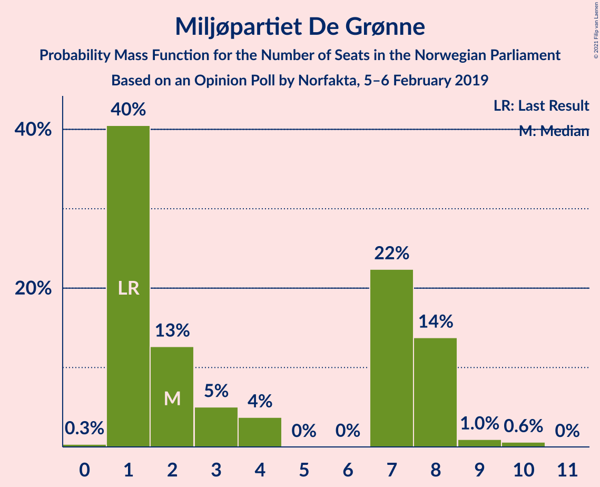

| Number of Seats | Probability | Accumulated | Special Marks |
|:---------------:|:-----------:|:-----------:|:-------------:|
| 0 | 0.2% | 100% |  |
| 1 | 40% | 99.8% | Last Result |
| 2 | 2% | 60% |  |
| 3 | 0.7% | 58% |  |
| 4 | 0.1% | 57% |  |
| 5 | 0% | 57% |  |
| 6 | 0% | 57% |  |
| 7 | 50% | 57% | Median |
| 8 | 6% | 6% |  |
| 9 | 0.1% | 0.4% |  |
| 10 | 0.2% | 0.2% |  |
| 11 | 0% | 0% |  |

### Venstre

*For a full overview of the results for this party, see the [Venstre](party-venstre.html) page.*

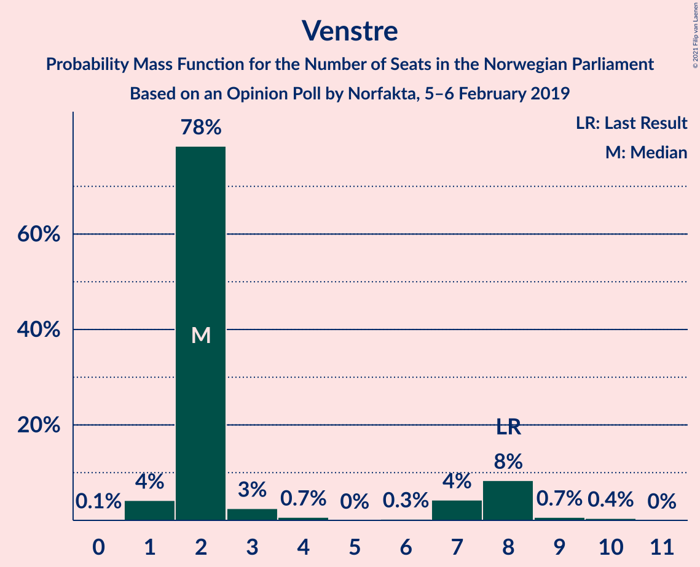

| Number of Seats | Probability | Accumulated | Special Marks |
|:---------------:|:-----------:|:-----------:|:-------------:|
| 1 | 4% | 100% |  |
| 2 | 92% | 96% | Median |
| 3 | 0.9% | 5% |  |
| 4 | 0% | 4% |  |
| 5 | 0% | 4% |  |
| 6 | 1.5% | 4% |  |
| 7 | 0.5% | 2% |  |
| 8 | 1.2% | 2% | Last Result |
| 9 | 0.5% | 0.7% |  |
| 10 | 0.2% | 0.2% |  |
| 11 | 0% | 0% |  |

## Coalitions

### Confidence Intervals

| Coalition | Last Result | Median | Majority? | 80% Confidence Interval | 90% Confidence Interval | 95% Confidence Interval | 99% Confidence Interval |
|:---------:|:-----------:|:------:|:---------:|:-----------------------:|:-----------------------:|:-----------------------:|:-----------------------:|
| Arbeiderpartiet – Senterpartiet – Sosialistisk Venstreparti – Kristelig Folkeparti – Miljøpartiet De Grønne | 88 | 100 | 100% | 97–108 | 94–108 | 92–109 | 90–110 |
| Arbeiderpartiet – Senterpartiet – Sosialistisk Venstreparti – Rødt – Miljøpartiet De Grønne | 81 | 99 | 100% | 94–106 | 94–107 | 93–107 | 89–108 |
| Arbeiderpartiet – Senterpartiet – Sosialistisk Venstreparti – Miljøpartiet De Grønne | 80 | 96 | 99.2% | 89–100 | 89–105 | 88–105 | 84–105 |
| Arbeiderpartiet – Senterpartiet – Sosialistisk Venstreparti – Rødt | 80 | 96 | 99.8% | 91–100 | 89–101 | 88–102 | 85–104 |
| Høyre – Senterpartiet – Fremskrittspartiet – Kristelig Folkeparti – Venstre | 107 | 92 | 91% | 86–99 | 84–99 | 84–99 | 83–103 |
| Arbeiderpartiet – Senterpartiet – Sosialistisk Venstreparti | 79 | 91 | 96% | 87–95 | 86–98 | 83–98 | 80–98 |
| Arbeiderpartiet – Senterpartiet – Kristelig Folkeparti – Miljøpartiet De Grønne | 77 | 88 | 74% | 82–94 | 81–94 | 77–96 | 76–96 |
| Arbeiderpartiet – Senterpartiet – Kristelig Folkeparti | 76 | 81 | 33% | 80–88 | 78–89 | 76–89 | 72–91 |
| Arbeiderpartiet – Senterpartiet | 68 | 78 | 0.4% | 73–81 | 72–84 | 71–84 | 68–84 |
| Høyre – Fremskrittspartiet – Kristelig Folkeparti – Miljøpartiet De Grønne – Venstre | 89 | 73 | 0.1% | 69–78 | 68–80 | 67–80 | 65–84 |
| Arbeiderpartiet – Sosialistisk Venstreparti | 60 | 67 | 0% | 64–71 | 62–76 | 61–76 | 58–76 |
| Høyre – Fremskrittspartiet – Kristelig Folkeparti – Venstre | 88 | 70 | 0% | 63–75 | 62–75 | 62–75 | 61–80 |
| Høyre – Fremskrittspartiet – Venstre | 80 | 62 | 0% | 59–70 | 57–70 | 54–71 | 53–74 |
| Høyre – Fremskrittspartiet | 72 | 60 | 0% | 57–68 | 55–68 | 51–68 | 51–71 |
| Høyre – Kristelig Folkeparti – Venstre | 61 | 50 | 0% | 43–54 | 43–55 | 43–55 | 43–59 |
| Senterpartiet – Kristelig Folkeparti – Venstre | 35 | 29 | 0% | 26–35 | 26–37 | 24–38 | 23–39 |

### Arbeiderpartiet – Senterpartiet – Sosialistisk Venstreparti – Kristelig Folkeparti – Miljøpartiet De Grønne

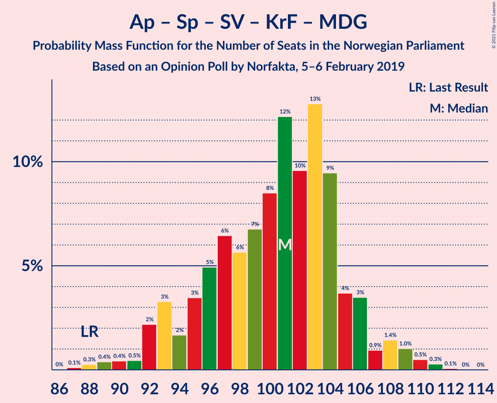

| Number of Seats | Probability | Accumulated | Special Marks |
|:---------------:|:-----------:|:-----------:|:-------------:|
| 85 | 0.1% | 100% | Majority |
| 86 | 0% | 99.9% |  |
| 87 | 0.3% | 99.8% |  |
| 88 | 0% | 99.6% | Last Result |
| 89 | 0.1% | 99.6% |  |
| 90 | 0.1% | 99.5% |  |
| 91 | 0.2% | 99.4% |  |
| 92 | 2% | 99.2% |  |
| 93 | 0.8% | 97% |  |
| 94 | 1.2% | 96% |  |
| 95 | 2% | 95% |  |
| 96 | 3% | 93% |  |
| 97 | 17% | 90% |  |
| 98 | 2% | 74% |  |
| 99 | 12% | 71% |  |
| 100 | 25% | 59% |  |
| 101 | 3% | 35% | Median |
| 102 | 3% | 32% |  |
| 103 | 2% | 29% |  |
| 104 | 5% | 27% |  |
| 105 | 4% | 22% |  |
| 106 | 7% | 18% |  |
| 107 | 0.4% | 11% |  |
| 108 | 6% | 10% |  |
| 109 | 2% | 4% |  |
| 110 | 2% | 2% |  |
| 111 | 0% | 0% |  |

### Arbeiderpartiet – Senterpartiet – Sosialistisk Venstreparti – Rødt – Miljøpartiet De Grønne

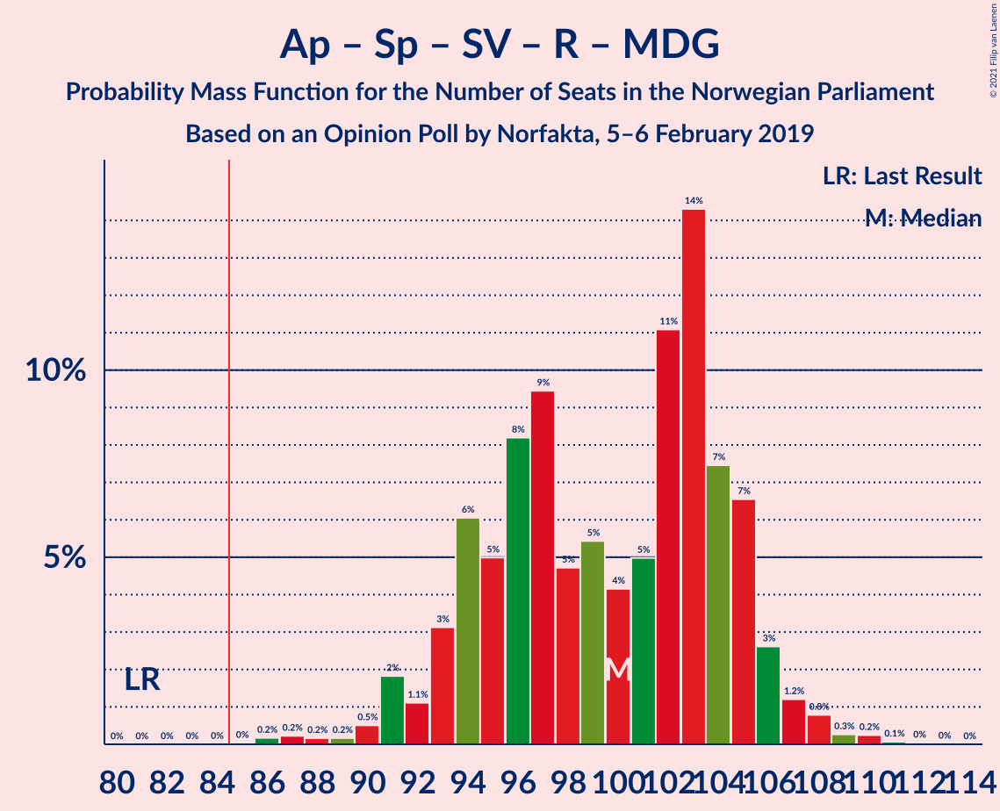

| Number of Seats | Probability | Accumulated | Special Marks |
|:---------------:|:-----------:|:-----------:|:-------------:|
| 81 | 0% | 100% | Last Result |
| 82 | 0% | 100% |  |
| 83 | 0% | 100% |  |
| 84 | 0% | 100% |  |
| 85 | 0% | 100% | Majority |
| 86 | 0.2% | 100% |  |
| 87 | 0.2% | 99.8% |  |
| 88 | 0% | 99.6% |  |
| 89 | 0.2% | 99.6% |  |
| 90 | 0.2% | 99.4% |  |
| 91 | 0.3% | 99.1% |  |
| 92 | 0.3% | 98.8% |  |
| 93 | 1.1% | 98.5% |  |
| 94 | 10% | 97% |  |
| 95 | 1.1% | 88% |  |
| 96 | 12% | 87% |  |
| 97 | 11% | 75% |  |
| 98 | 9% | 64% |  |
| 99 | 8% | 55% |  |
| 100 | 3% | 47% | Median |
| 101 | 2% | 44% |  |
| 102 | 3% | 42% |  |
| 103 | 1.0% | 39% |  |
| 104 | 2% | 38% |  |
| 105 | 20% | 36% |  |
| 106 | 8% | 16% |  |
| 107 | 5% | 8% |  |
| 108 | 2% | 2% |  |
| 109 | 0.1% | 0.2% |  |
| 110 | 0% | 0.1% |  |
| 111 | 0% | 0% |  |

### Arbeiderpartiet – Senterpartiet – Sosialistisk Venstreparti – Miljøpartiet De Grønne

| Number of Seats | Probability | Accumulated | Special Marks |
|:---------------:|:-----------:|:-----------:|:-------------:|
| 80 | 0% | 100% | Last Result |
| 81 | 0% | 100% |  |
| 82 | 0.1% | 99.9% |  |
| 83 | 0.1% | 99.9% |  |
| 84 | 0.6% | 99.8% |  |
| 85 | 0.7% | 99.2% | Majority |
| 86 | 0.3% | 98% |  |
| 87 | 0.4% | 98% |  |
| 88 | 2% | 98% |  |
| 89 | 6% | 96% |  |
| 90 | 0.8% | 90% |  |
| 91 | 3% | 89% |  |
| 92 | 10% | 86% |  |
| 93 | 2% | 75% |  |
| 94 | 15% | 74% |  |
| 95 | 7% | 59% |  |
| 96 | 9% | 52% |  |
| 97 | 21% | 43% |  |
| 98 | 10% | 22% | Median |
| 99 | 0.8% | 12% |  |
| 100 | 2% | 11% |  |
| 101 | 2% | 10% |  |
| 102 | 2% | 7% |  |
| 103 | 0.1% | 6% |  |
| 104 | 0% | 5% |  |
| 105 | 5% | 5% |  |
| 106 | 0.1% | 0.1% |  |
| 107 | 0% | 0% |  |

### Arbeiderpartiet – Senterpartiet – Sosialistisk Venstreparti – Rødt

| Number of Seats | Probability | Accumulated | Special Marks |
|:---------------:|:-----------:|:-----------:|:-------------:|
| 80 | 0% | 100% | Last Result |
| 81 | 0% | 100% |  |
| 82 | 0% | 100% |  |
| 83 | 0.1% | 99.9% |  |
| 84 | 0.1% | 99.9% |  |
| 85 | 0.9% | 99.8% | Majority |
| 86 | 0.6% | 98.9% |  |
| 87 | 0.2% | 98% |  |
| 88 | 0.6% | 98% |  |
| 89 | 3% | 97% |  |
| 90 | 0.8% | 94% |  |
| 91 | 6% | 93% |  |
| 92 | 6% | 88% |  |
| 93 | 11% | 82% | Median |
| 94 | 2% | 71% |  |
| 95 | 14% | 69% |  |
| 96 | 8% | 55% |  |
| 97 | 4% | 47% |  |
| 98 | 21% | 43% |  |
| 99 | 9% | 22% |  |
| 100 | 8% | 13% |  |
| 101 | 3% | 6% |  |
| 102 | 1.0% | 3% |  |
| 103 | 0.3% | 2% |  |
| 104 | 1.2% | 2% |  |
| 105 | 0.3% | 0.4% |  |
| 106 | 0% | 0.1% |  |
| 107 | 0% | 0% |  |

### Høyre – Senterpartiet – Fremskrittspartiet – Kristelig Folkeparti – Venstre

| Number of Seats | Probability | Accumulated | Special Marks |
|:---------------:|:-----------:|:-----------:|:-------------:|
| 79 | 0.1% | 100% |  |
| 80 | 0% | 99.9% |  |
| 81 | 0.1% | 99.9% |  |
| 82 | 0% | 99.8% |  |
| 83 | 1.4% | 99.8% |  |
| 84 | 7% | 98% |  |
| 85 | 0.4% | 91% | Majority |
| 86 | 8% | 91% |  |
| 87 | 17% | 83% |  |
| 88 | 2% | 66% |  |
| 89 | 3% | 64% | Median |
| 90 | 4% | 61% |  |
| 91 | 4% | 57% |  |
| 92 | 5% | 53% |  |
| 93 | 13% | 47% |  |
| 94 | 1.4% | 35% |  |
| 95 | 4% | 33% |  |
| 96 | 3% | 30% |  |
| 97 | 14% | 27% |  |
| 98 | 2% | 13% |  |
| 99 | 9% | 12% |  |
| 100 | 0.4% | 2% |  |
| 101 | 0.9% | 2% |  |
| 102 | 0.4% | 0.9% |  |
| 103 | 0.1% | 0.5% |  |
| 104 | 0.1% | 0.4% |  |
| 105 | 0% | 0.2% |  |
| 106 | 0% | 0.2% |  |
| 107 | 0.1% | 0.2% | Last Result |
| 108 | 0% | 0% |  |

### Arbeiderpartiet – Senterpartiet – Sosialistisk Venstreparti

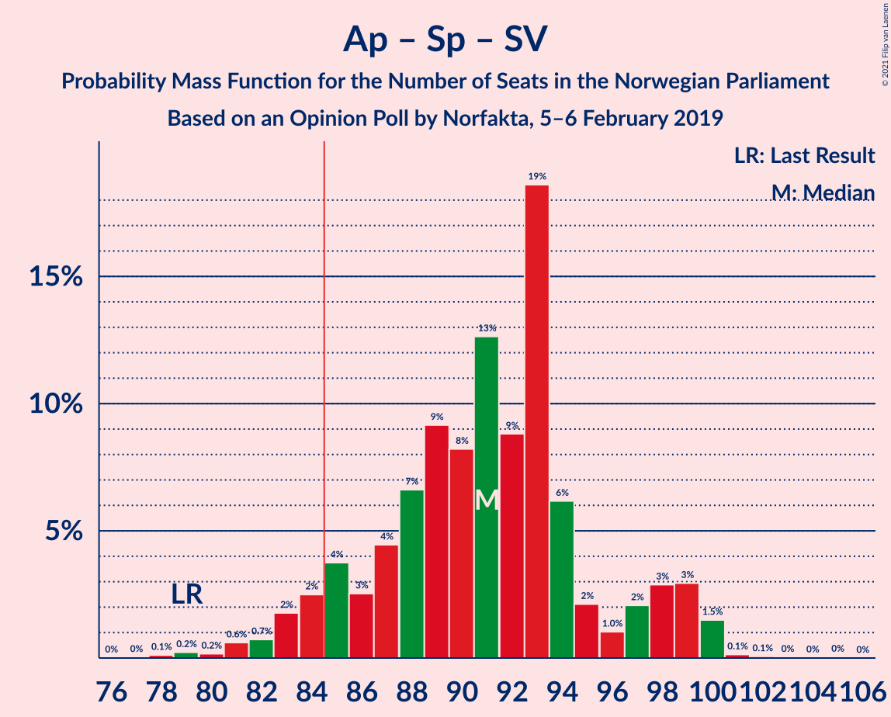

| Number of Seats | Probability | Accumulated | Special Marks |
|:---------------:|:-----------:|:-----------:|:-------------:|
| 77 | 0% | 100% |  |
| 78 | 0.3% | 99.9% |  |
| 79 | 0.1% | 99.7% | Last Result |
| 80 | 0.1% | 99.6% |  |
| 81 | 0.2% | 99.5% |  |
| 82 | 0.4% | 99.3% |  |
| 83 | 1.4% | 98.9% |  |
| 84 | 1.1% | 97% |  |
| 85 | 1.1% | 96% | Majority |
| 86 | 0.7% | 95% |  |
| 87 | 6% | 95% |  |
| 88 | 8% | 89% |  |
| 89 | 8% | 81% |  |
| 90 | 22% | 73% |  |
| 91 | 18% | 50% | Median |
| 92 | 3% | 32% |  |
| 93 | 14% | 30% |  |
| 94 | 5% | 15% |  |
| 95 | 2% | 10% |  |
| 96 | 0.2% | 8% |  |
| 97 | 2% | 8% |  |
| 98 | 6% | 6% |  |
| 99 | 0.2% | 0.4% |  |
| 100 | 0.1% | 0.2% |  |
| 101 | 0.1% | 0.1% |  |
| 102 | 0% | 0.1% |  |
| 103 | 0% | 0.1% |  |
| 104 | 0% | 0% |  |

### Arbeiderpartiet – Senterpartiet – Kristelig Folkeparti – Miljøpartiet De Grønne

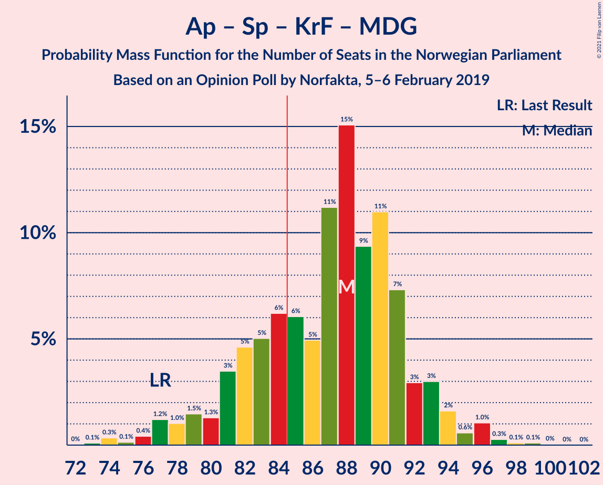

| Number of Seats | Probability | Accumulated | Special Marks |
|:---------------:|:-----------:|:-----------:|:-------------:|
| 72 | 0.1% | 100% |  |
| 73 | 0.3% | 99.9% |  |
| 74 | 0% | 99.6% |  |
| 75 | 0% | 99.6% |  |
| 76 | 0.1% | 99.6% |  |
| 77 | 2% | 99.5% | Last Result |
| 78 | 0.4% | 97% |  |
| 79 | 0.5% | 97% |  |
| 80 | 0.4% | 96% |  |
| 81 | 6% | 96% |  |
| 82 | 14% | 90% |  |
| 83 | 0.8% | 76% |  |
| 84 | 1.2% | 75% |  |
| 85 | 11% | 74% | Majority |
| 86 | 1.4% | 64% |  |
| 87 | 2% | 62% |  |
| 88 | 27% | 60% | Median |
| 89 | 2% | 33% |  |
| 90 | 4% | 31% |  |
| 91 | 0.9% | 27% |  |
| 92 | 6% | 26% |  |
| 93 | 9% | 20% |  |
| 94 | 6% | 11% |  |
| 95 | 0.6% | 5% |  |
| 96 | 4% | 4% |  |
| 97 | 0.1% | 0.3% |  |
| 98 | 0.1% | 0.2% |  |
| 99 | 0% | 0% |  |

### Arbeiderpartiet – Senterpartiet – Kristelig Folkeparti

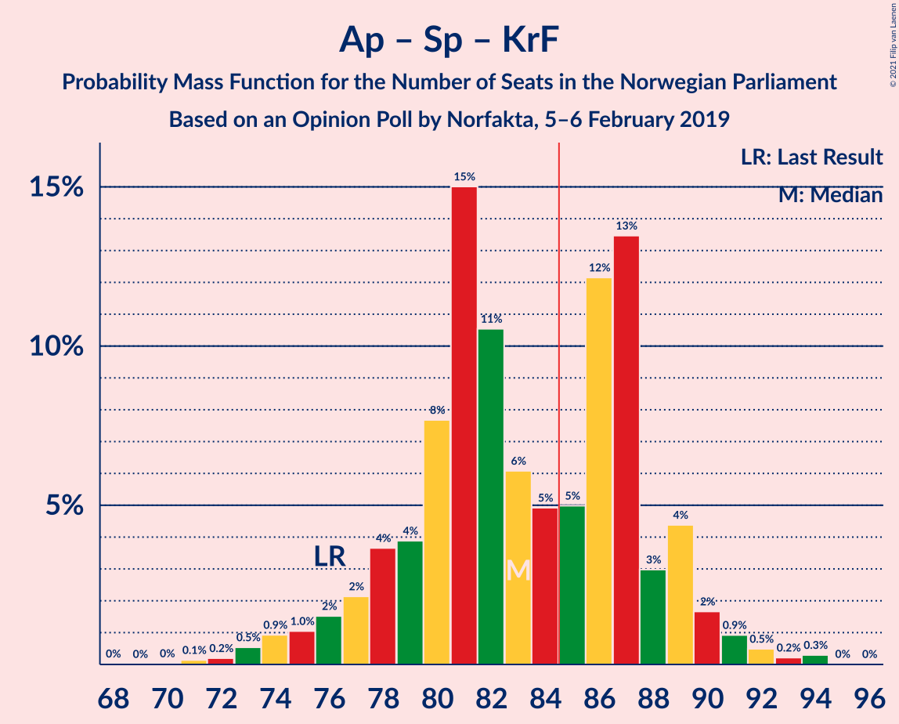

| Number of Seats | Probability | Accumulated | Special Marks |
|:---------------:|:-----------:|:-----------:|:-------------:|
| 70 | 0% | 100% |  |
| 71 | 0.1% | 99.9% |  |
| 72 | 0.3% | 99.8% |  |
| 73 | 0.1% | 99.5% |  |
| 74 | 0.1% | 99.4% |  |
| 75 | 0.7% | 99.2% |  |
| 76 | 2% | 98.6% | Last Result |
| 77 | 0.8% | 96% |  |
| 78 | 2% | 95% |  |
| 79 | 2% | 94% |  |
| 80 | 7% | 91% |  |
| 81 | 40% | 85% | Median |
| 82 | 0.6% | 45% |  |
| 83 | 2% | 44% |  |
| 84 | 9% | 42% |  |
| 85 | 8% | 33% | Majority |
| 86 | 7% | 25% |  |
| 87 | 8% | 19% |  |
| 88 | 2% | 11% |  |
| 89 | 6% | 9% |  |
| 90 | 0.6% | 2% |  |
| 91 | 1.4% | 2% |  |
| 92 | 0.3% | 0.4% |  |
| 93 | 0% | 0.1% |  |
| 94 | 0.1% | 0.1% |  |
| 95 | 0% | 0% |  |

### Arbeiderpartiet – Senterpartiet

| Number of Seats | Probability | Accumulated | Special Marks |
|:---------------:|:-----------:|:-----------:|:-------------:|
| 65 | 0% | 100% |  |
| 66 | 0.2% | 99.9% |  |
| 67 | 0.1% | 99.7% |  |
| 68 | 0.4% | 99.6% | Last Result |
| 69 | 0.4% | 99.2% |  |
| 70 | 0.4% | 98.8% |  |
| 71 | 1.1% | 98% |  |
| 72 | 6% | 97% |  |
| 73 | 3% | 91% |  |
| 74 | 2% | 88% |  |
| 75 | 3% | 86% |  |
| 76 | 11% | 82% |  |
| 77 | 12% | 72% |  |
| 78 | 31% | 60% | Median |
| 79 | 4% | 29% |  |
| 80 | 11% | 25% |  |
| 81 | 6% | 15% |  |
| 82 | 1.2% | 9% |  |
| 83 | 0.6% | 8% |  |
| 84 | 7% | 7% |  |
| 85 | 0% | 0.4% | Majority |
| 86 | 0.2% | 0.3% |  |
| 87 | 0% | 0.1% |  |
| 88 | 0.1% | 0.1% |  |
| 89 | 0% | 0% |  |

### Høyre – Fremskrittspartiet – Kristelig Folkeparti – Miljøpartiet De Grønne – Venstre

| Number of Seats | Probability | Accumulated | Special Marks |
|:---------------:|:-----------:|:-----------:|:-------------:|
| 62 | 0% | 100% |  |
| 63 | 0% | 99.9% |  |
| 64 | 0.3% | 99.9% |  |
| 65 | 1.2% | 99.6% |  |
| 66 | 0.3% | 98% |  |
| 67 | 1.1% | 98% |  |
| 68 | 3% | 97% |  |
| 69 | 8% | 94% |  |
| 70 | 9% | 87% |  |
| 71 | 21% | 78% |  |
| 72 | 4% | 57% |  |
| 73 | 8% | 53% | Median |
| 74 | 14% | 45% |  |
| 75 | 2% | 31% |  |
| 76 | 11% | 29% |  |
| 77 | 6% | 18% |  |
| 78 | 6% | 12% |  |
| 79 | 0.8% | 6% |  |
| 80 | 3% | 6% |  |
| 81 | 0.6% | 2% |  |
| 82 | 0.2% | 2% |  |
| 83 | 0.6% | 2% |  |
| 84 | 0.9% | 1.1% |  |
| 85 | 0% | 0.1% | Majority |
| 86 | 0.1% | 0.1% |  |
| 87 | 0% | 0.1% |  |
| 88 | 0% | 0% |  |
| 89 | 0% | 0% | Last Result |

### Arbeiderpartiet – Sosialistisk Venstreparti

| Number of Seats | Probability | Accumulated | Special Marks |
|:---------------:|:-----------:|:-----------:|:-------------:|
| 56 | 0.1% | 100% |  |
| 57 | 0.3% | 99.9% |  |
| 58 | 1.0% | 99.6% |  |
| 59 | 0.6% | 98.6% |  |
| 60 | 0.2% | 98% | Last Result |
| 61 | 1.4% | 98% |  |
| 62 | 4% | 96% |  |
| 63 | 1.3% | 93% |  |
| 64 | 5% | 91% |  |
| 65 | 3% | 87% |  |
| 66 | 1.5% | 84% |  |
| 67 | 36% | 83% |  |
| 68 | 9% | 47% | Median |
| 69 | 21% | 38% |  |
| 70 | 1.2% | 16% |  |
| 71 | 5% | 15% |  |
| 72 | 0.5% | 10% |  |
| 73 | 3% | 9% |  |
| 74 | 0.2% | 6% |  |
| 75 | 0.9% | 6% |  |
| 76 | 5% | 5% |  |
| 77 | 0.3% | 0.4% |  |
| 78 | 0% | 0.1% |  |
| 79 | 0.1% | 0.1% |  |
| 80 | 0% | 0% |  |

### Høyre – Fremskrittspartiet – Kristelig Folkeparti – Venstre

| Number of Seats | Probability | Accumulated | Special Marks |
|:---------------:|:-----------:|:-----------:|:-------------:|
| 59 | 0% | 100% |  |
| 60 | 0.1% | 99.9% |  |
| 61 | 2% | 99.8% |  |
| 62 | 5% | 98% |  |
| 63 | 8% | 92% |  |
| 64 | 20% | 84% |  |
| 65 | 2% | 64% |  |
| 66 | 1.1% | 62% | Median |
| 67 | 3% | 61% |  |
| 68 | 2% | 58% |  |
| 69 | 3% | 55% |  |
| 70 | 8% | 53% |  |
| 71 | 9% | 44% |  |
| 72 | 11% | 36% |  |
| 73 | 12% | 25% |  |
| 74 | 1.0% | 13% |  |
| 75 | 10% | 12% |  |
| 76 | 1.0% | 2% |  |
| 77 | 0.3% | 1.4% |  |
| 78 | 0.3% | 1.1% |  |
| 79 | 0.2% | 0.8% |  |
| 80 | 0.2% | 0.6% |  |
| 81 | 0% | 0.4% |  |
| 82 | 0.2% | 0.4% |  |
| 83 | 0.2% | 0.2% |  |
| 84 | 0% | 0% |  |
| 85 | 0% | 0% | Majority |
| 86 | 0% | 0% |  |
| 87 | 0% | 0% |  |
| 88 | 0% | 0% | Last Result |

### Høyre – Fremskrittspartiet – Venstre

| Number of Seats | Probability | Accumulated | Special Marks |
|:---------------:|:-----------:|:-----------:|:-------------:|
| 53 | 2% | 100% |  |
| 54 | 0.3% | 98% |  |
| 55 | 0.3% | 97% |  |
| 56 | 0.1% | 97% |  |
| 57 | 3% | 97% |  |
| 58 | 0.3% | 94% |  |
| 59 | 8% | 94% |  |
| 60 | 3% | 85% |  |
| 61 | 27% | 83% |  |
| 62 | 12% | 56% |  |
| 63 | 5% | 45% | Median |
| 64 | 5% | 39% |  |
| 65 | 3% | 34% |  |
| 66 | 2% | 31% |  |
| 67 | 9% | 29% |  |
| 68 | 4% | 20% |  |
| 69 | 0.4% | 16% |  |
| 70 | 13% | 16% |  |
| 71 | 0.7% | 3% |  |
| 72 | 1.3% | 2% |  |
| 73 | 0.4% | 1.0% |  |
| 74 | 0.4% | 0.6% |  |
| 75 | 0.2% | 0.2% |  |
| 76 | 0% | 0.1% |  |
| 77 | 0% | 0% |  |
| 78 | 0% | 0% |  |
| 79 | 0% | 0% |  |
| 80 | 0% | 0% | Last Result |

### Høyre – Fremskrittspartiet

| Number of Seats | Probability | Accumulated | Special Marks |
|:---------------:|:-----------:|:-----------:|:-------------:|
| 50 | 0% | 100% |  |
| 51 | 2% | 99.9% |  |
| 52 | 0.2% | 97% |  |
| 53 | 0.3% | 97% |  |
| 54 | 1.2% | 97% |  |
| 55 | 4% | 96% |  |
| 56 | 0.2% | 92% |  |
| 57 | 8% | 92% |  |
| 58 | 2% | 84% |  |
| 59 | 27% | 82% |  |
| 60 | 11% | 55% |  |
| 61 | 6% | 44% | Median |
| 62 | 5% | 38% |  |
| 63 | 3% | 33% |  |
| 64 | 2% | 30% |  |
| 65 | 9% | 28% |  |
| 66 | 3% | 19% |  |
| 67 | 0.6% | 16% |  |
| 68 | 13% | 15% |  |
| 69 | 0.7% | 2% |  |
| 70 | 1.0% | 2% |  |
| 71 | 0.4% | 0.7% |  |
| 72 | 0.2% | 0.3% | Last Result |
| 73 | 0.1% | 0.1% |  |
| 74 | 0% | 0% |  |

### Høyre – Kristelig Folkeparti – Venstre

| Number of Seats | Probability | Accumulated | Special Marks |
|:---------------:|:-----------:|:-----------:|:-------------:|
| 38 | 0% | 100% |  |
| 39 | 0% | 99.9% |  |
| 40 | 0.1% | 99.9% |  |
| 41 | 0.2% | 99.8% |  |
| 42 | 0.1% | 99.7% |  |
| 43 | 15% | 99.5% |  |
| 44 | 15% | 85% |  |
| 45 | 4% | 69% |  |
| 46 | 3% | 66% | Median |
| 47 | 0.9% | 62% |  |
| 48 | 5% | 62% |  |
| 49 | 4% | 56% |  |
| 50 | 13% | 52% |  |
| 51 | 11% | 39% |  |
| 52 | 13% | 28% |  |
| 53 | 3% | 14% |  |
| 54 | 6% | 11% |  |
| 55 | 3% | 5% |  |
| 56 | 0.6% | 2% |  |
| 57 | 0.4% | 2% |  |
| 58 | 0.5% | 1.2% |  |
| 59 | 0.3% | 0.7% |  |
| 60 | 0.1% | 0.4% |  |
| 61 | 0% | 0.3% | Last Result |
| 62 | 0.2% | 0.3% |  |
| 63 | 0% | 0.1% |  |
| 64 | 0.1% | 0.1% |  |
| 65 | 0% | 0% |  |

### Senterpartiet – Kristelig Folkeparti – Venstre

| Number of Seats | Probability | Accumulated | Special Marks |
|:---------------:|:-----------:|:-----------:|:-------------:|
| 21 | 0.1% | 100% |  |
| 22 | 0.1% | 99.9% |  |
| 23 | 0.4% | 99.9% |  |
| 24 | 3% | 99.4% |  |
| 25 | 0.3% | 96% |  |
| 26 | 9% | 96% |  |
| 27 | 8% | 86% |  |
| 28 | 15% | 79% | Median |
| 29 | 16% | 64% |  |
| 30 | 5% | 48% |  |
| 31 | 2% | 43% |  |
| 32 | 7% | 41% |  |
| 33 | 7% | 34% |  |
| 34 | 16% | 27% |  |
| 35 | 3% | 11% | Last Result |
| 36 | 0.7% | 8% |  |
| 37 | 4% | 7% |  |
| 38 | 2% | 3% |  |
| 39 | 1.1% | 2% |  |
| 40 | 0.1% | 0.5% |  |
| 41 | 0.1% | 0.4% |  |
| 42 | 0.1% | 0.2% |  |
| 43 | 0% | 0.2% |  |
| 44 | 0% | 0.2% |  |
| 45 | 0.1% | 0.1% |  |
| 46 | 0% | 0% |  |

## Technical Information

### Opinion Poll

+ **Polling firm:** Norfakta
+ **Commissioner(s):** —
+ **Fieldwork period:** 5–6 February 2019

### Calculations

+ **Sample size:** 784
+ **Simulations done:** 131,072
+ **Error estimate:** 1.86%

