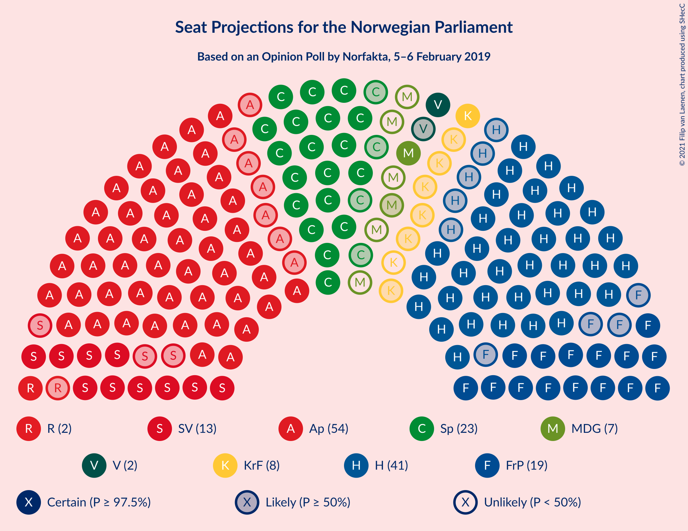
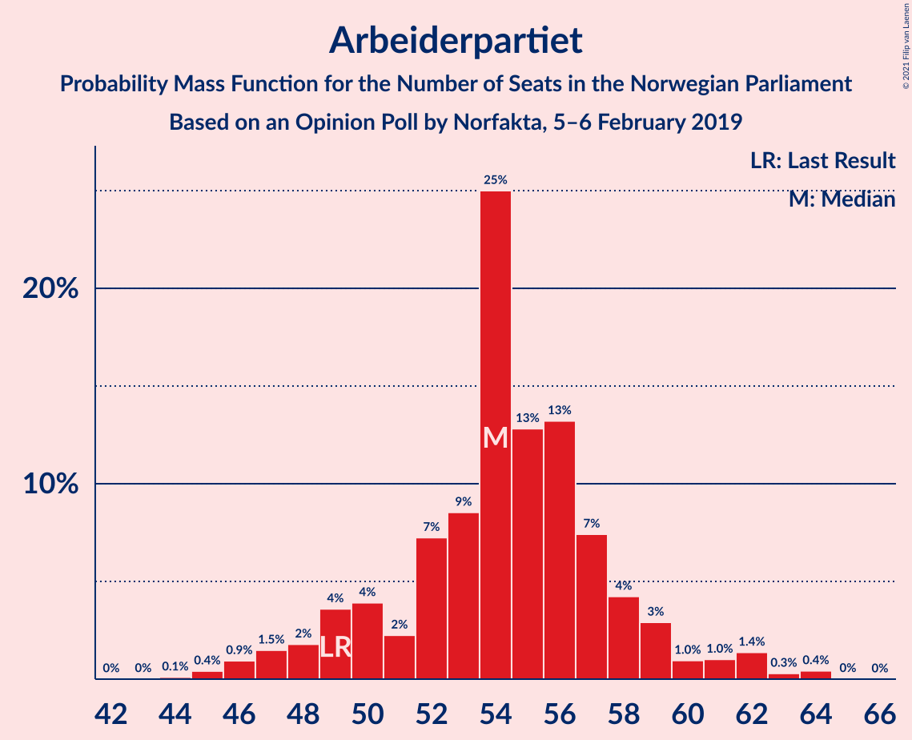
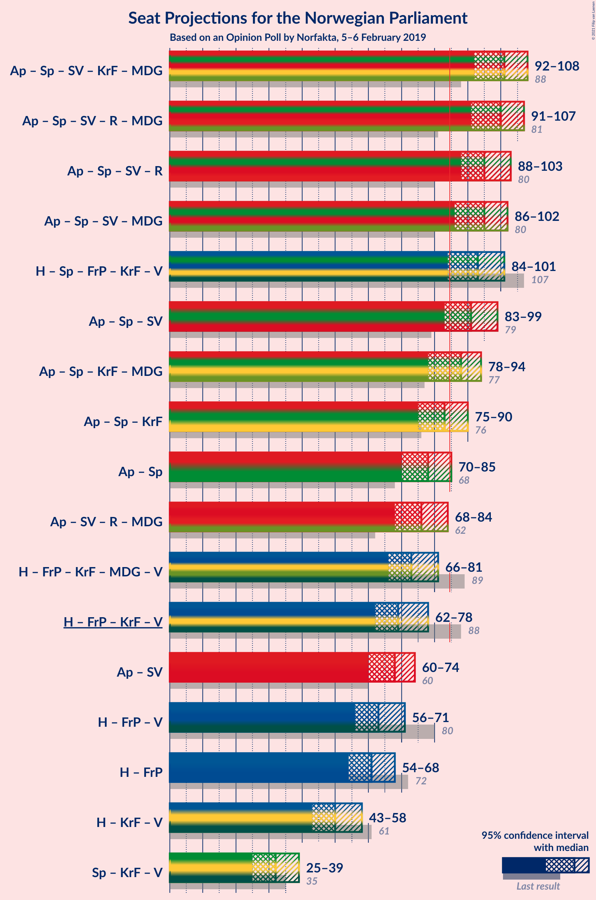
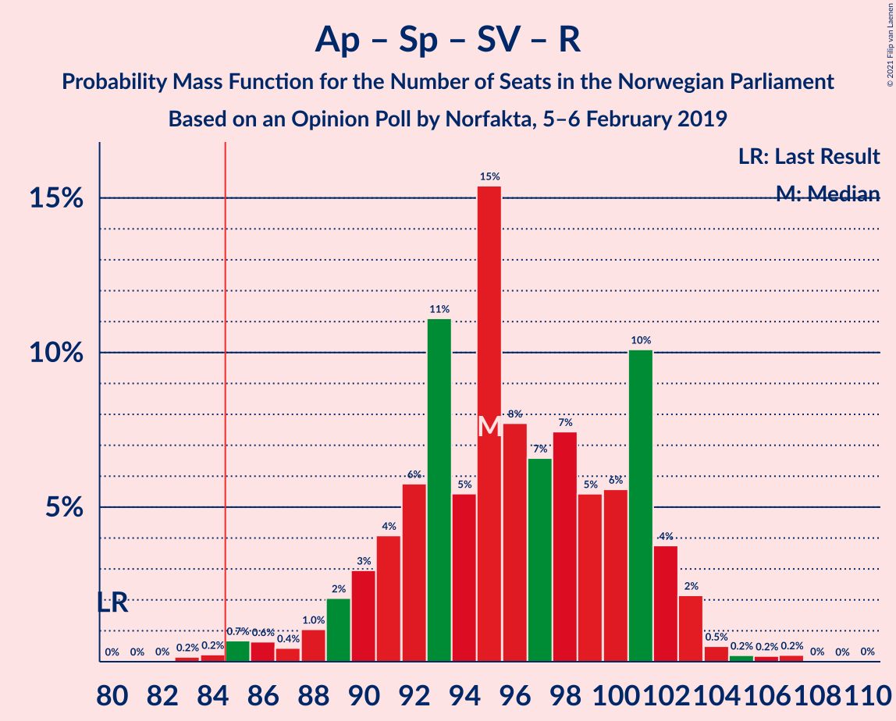
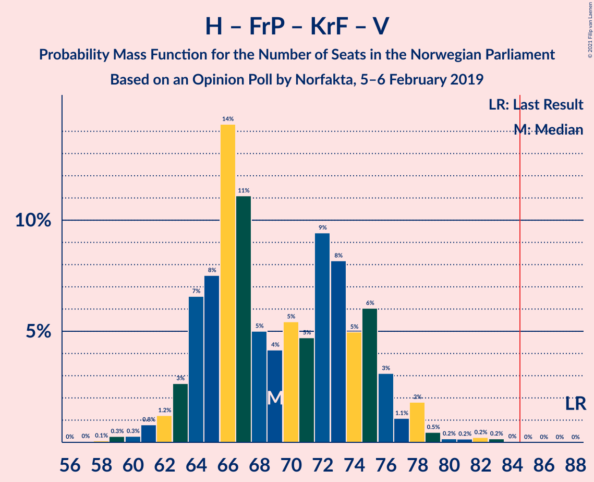
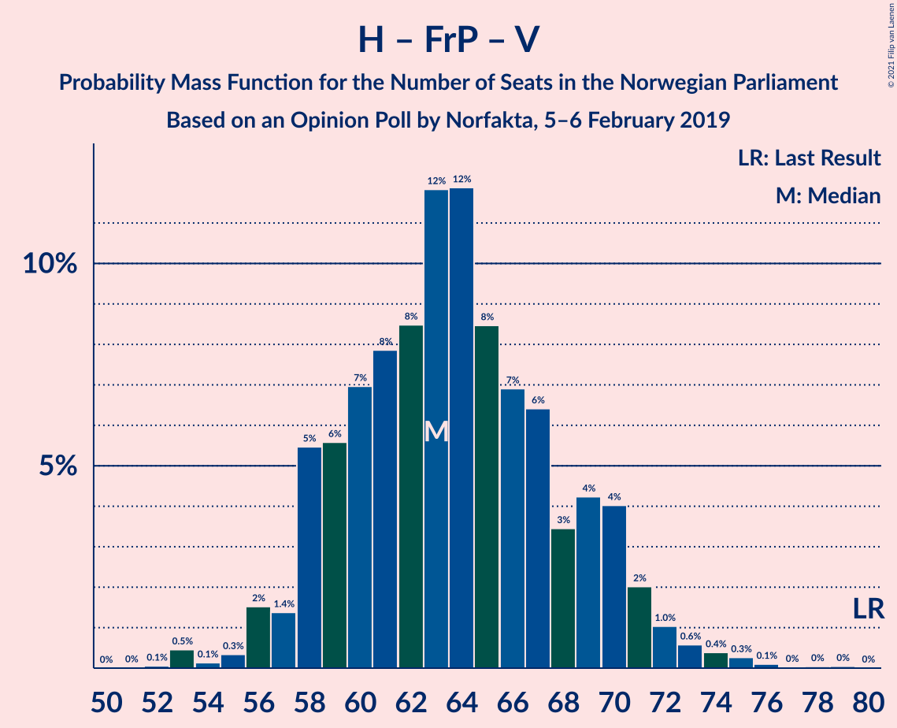
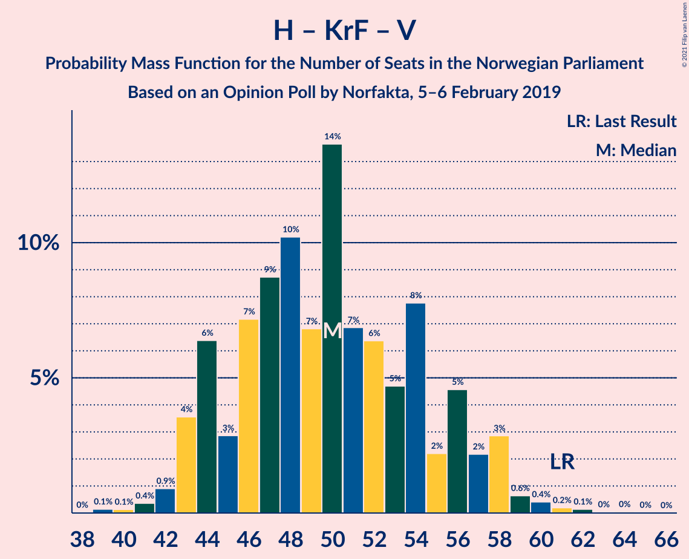
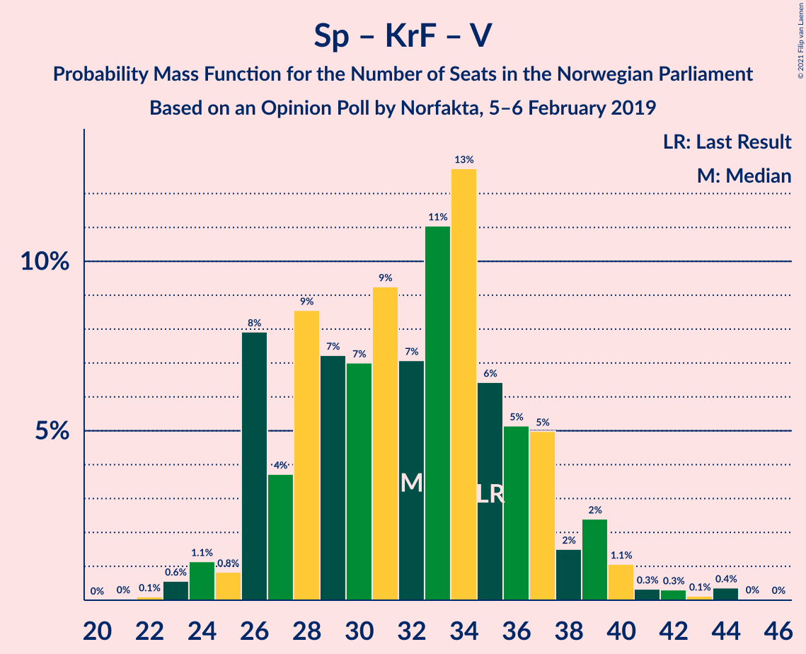

# Opinion Poll by Norfakta, 5–6 February 2019

<a href="#voting-intentions">Voting Intentions</a> | <a href="#seats">Seats</a> | <a href="#coalitions">Coalitions</a> | <a href="#technical-information">Technical Information</a>

## Voting Intentions

### Confidence Intervals

| Party | Last Result | Poll Result | 80% Confidence Interval | 90% Confidence Interval | 95% Confidence Interval | 99% Confidence Interval |
|:-----:|:-----------:|:-----------:|:-----------------------:|:-----------------------:|:-----------------------:|:-----------------------:|
| Arbeiderpartiet | 27.4% | 29.3% | 27.3–31.5% |26.7–32.1% |26.2–32.6% |25.3–33.7% |
| Høyre | 25.0% | 23.0% | 21.1–25.0% |20.6–25.5% |20.1–26.0% |19.3–27.0% |
| Senterpartiet | 10.3% | 12.8% | 11.3–14.4% |10.9–14.9% |10.6–15.3% |10.0–16.1% |
| Fremskrittspartiet | 15.2% | 10.8% | 9.5–12.4% |9.2–12.8% |8.9–13.2% |8.3–14.0% |
| Sosialistisk Venstreparti | 6.0% | 7.1% | 6.1–8.5% |5.8–8.8% |5.5–9.2% |5.1–9.8% |
| Kristelig Folkeparti | 4.2% | 4.1% | 3.3–5.1% |3.1–5.4% |2.9–5.7% |2.6–6.3% |
| Rødt | 2.4% | 4.0% | 3.2–5.0% |3.0–5.3% |2.8–5.6% |2.5–6.1% |
| Miljøpartiet De Grønne | 3.2% | 3.3% | 2.6–4.3% |2.4–4.6% |2.3–4.8% |2.0–5.3% |
| Venstre | 4.4% | 3.3% | 2.6–4.3% |2.4–4.6% |2.3–4.8% |2.0–5.3% |

*Note:* The poll result column reflects the actual value used in the calculations. Published results may vary slightly, and in addition be rounded to fewer digits.

## Seats

### Confidence Intervals

| Party | Last Result | Median | 80% Confidence Interval | 90% Confidence Interval | 95% Confidence Interval | 99% Confidence Interval |
|:-----:|:-----------:|:------:|:-----------------------:|:-----------------------:|:-----------------------:|:-----------------------:|
| <a href="#arbeiderpartiet">Arbeiderpartiet</a> | 49 | 54 | 50–58 |49–59 |47–61 |45–63 |
| <a href="#høyre">Høyre</a> | 45 | 41 | 38–45 |37–46 |36–48 |34–50 |
| <a href="#senterpartiet">Senterpartiet</a> | 19 | 23 | 20–27 |20–28 |19–28 |18–30 |
| <a href="#fremskrittspartiet">Fremskrittspartiet</a> | 27 | 19 | 17–23 |16–23 |15–24 |14–25 |
| <a href="#sosialistisk-venstreparti">Sosialistisk Venstreparti</a> | 11 | 13 | 11–16 |10–16 |10–17 |9–18 |
| <a href="#kristelig-folkeparti">Kristelig Folkeparti</a> | 8 | 7 | 2–9 |1–10 |1–10 |1–12 |
| <a href="#rødt">Rødt</a> | 1 | 2 | 2–9 |2–9 |1–10 |1–11 |
| <a href="#miljøpartiet-de-grønne">Miljøpartiet De Grønne</a> | 1 | 2 | 1–8 |1–8 |1–8 |1–10 |
| <a href="#venstre">Venstre</a> | 8 | 2 | 2–7 |2–8 |1–8 |1–9 |

### Arbeiderpartiet

*For a full overview of the results for this party, see the [Arbeiderpartiet](party-arbeiderpartiet.html) page.*

| Number of Seats | Probability | Accumulated | Special Marks |
|:---------------:|:-----------:|:-----------:|:-------------:|
| 44 | 0.1% | 100% |  |
| 45 | 0.4% | 99.9% |  |
| 46 | 0.9% | 99.4% |  |
| 47 | 1.5% | 98.5% |  |
| 48 | 2% | 97% |  |
| 49 | 4% | 95% | Last Result |
| 50 | 4% | 92% |  |
| 51 | 2% | 88% |  |
| 52 | 7% | 85% |  |
| 53 | 9% | 78% |  |
| 54 | 25% | 70% | Median |
| 55 | 13% | 45% |  |
| 56 | 13% | 32% |  |
| 57 | 7% | 19% |  |
| 58 | 4% | 11% |  |
| 59 | 3% | 7% |  |
| 60 | 1.0% | 4% |  |
| 61 | 1.0% | 3% |  |
| 62 | 1.4% | 2% |  |
| 63 | 0.3% | 0.8% |  |
| 64 | 0.4% | 0.5% |  |
| 65 | 0% | 0% |  |

### Høyre

*For a full overview of the results for this party, see the [Høyre](party-høyre.html) page.*

| Number of Seats | Probability | Accumulated | Special Marks |
|:---------------:|:-----------:|:-----------:|:-------------:|
| 33 | 0.1% | 100% |  |
| 34 | 0.5% | 99.8% |  |
| 35 | 1.2% | 99.3% |  |
| 36 | 3% | 98% |  |
| 37 | 3% | 95% |  |
| 38 | 8% | 92% |  |
| 39 | 10% | 84% |  |
| 40 | 13% | 74% |  |
| 41 | 17% | 61% | Median |
| 42 | 9% | 44% |  |
| 43 | 8% | 35% |  |
| 44 | 13% | 27% |  |
| 45 | 6% | 14% | Last Result |
| 46 | 3% | 8% |  |
| 47 | 2% | 5% |  |
| 48 | 1.2% | 3% |  |
| 49 | 1.0% | 2% |  |
| 50 | 0.4% | 0.6% |  |
| 51 | 0.1% | 0.2% |  |
| 52 | 0.1% | 0.1% |  |
| 53 | 0% | 0% |  |

### Senterpartiet

*For a full overview of the results for this party, see the [Senterpartiet](party-senterpartiet.html) page.*

| Number of Seats | Probability | Accumulated | Special Marks |
|:---------------:|:-----------:|:-----------:|:-------------:|
| 17 | 0.4% | 100% |  |
| 18 | 0.9% | 99.5% |  |
| 19 | 3% | 98.7% | Last Result |
| 20 | 7% | 96% |  |
| 21 | 10% | 89% |  |
| 22 | 15% | 79% |  |
| 23 | 20% | 64% | Median |
| 24 | 14% | 44% |  |
| 25 | 12% | 30% |  |
| 26 | 7% | 18% |  |
| 27 | 3% | 11% |  |
| 28 | 6% | 8% |  |
| 29 | 1.1% | 2% |  |
| 30 | 0.3% | 0.6% |  |
| 31 | 0.2% | 0.3% |  |
| 32 | 0% | 0.1% |  |
| 33 | 0% | 0% |  |

### Fremskrittspartiet

*For a full overview of the results for this party, see the [Fremskrittspartiet](party-fremskrittspartiet.html) page.*

| Number of Seats | Probability | Accumulated | Special Marks |
|:---------------:|:-----------:|:-----------:|:-------------:|
| 13 | 0.1% | 100% |  |
| 14 | 0.9% | 99.8% |  |
| 15 | 2% | 98.9% |  |
| 16 | 4% | 97% |  |
| 17 | 14% | 92% |  |
| 18 | 16% | 79% |  |
| 19 | 16% | 63% | Median |
| 20 | 15% | 47% |  |
| 21 | 13% | 32% |  |
| 22 | 8% | 19% |  |
| 23 | 6% | 11% |  |
| 24 | 3% | 4% |  |
| 25 | 0.9% | 1.3% |  |
| 26 | 0.3% | 0.4% |  |
| 27 | 0.1% | 0.1% | Last Result |
| 28 | 0% | 0.1% |  |
| 29 | 0% | 0% |  |

### Sosialistisk Venstreparti

*For a full overview of the results for this party, see the [Sosialistisk Venstreparti](party-sosialistiskvenstreparti.html) page.*

| Number of Seats | Probability | Accumulated | Special Marks |
|:---------------:|:-----------:|:-----------:|:-------------:|
| 8 | 0.2% | 100% |  |
| 9 | 2% | 99.8% |  |
| 10 | 6% | 98% |  |
| 11 | 8% | 92% | Last Result |
| 12 | 15% | 84% |  |
| 13 | 21% | 68% | Median |
| 14 | 20% | 48% |  |
| 15 | 17% | 28% |  |
| 16 | 7% | 11% |  |
| 17 | 3% | 4% |  |
| 18 | 0.9% | 1.1% |  |
| 19 | 0.1% | 0.2% |  |
| 20 | 0% | 0% |  |

### Kristelig Folkeparti

*For a full overview of the results for this party, see the [Kristelig Folkeparti](party-kristeligfolkeparti.html) page.*

| Number of Seats | Probability | Accumulated | Special Marks |
|:---------------:|:-----------:|:-----------:|:-------------:|
| 0 | 0.1% | 100% |  |
| 1 | 7% | 99.9% |  |
| 2 | 11% | 93% |  |
| 3 | 27% | 82% |  |
| 4 | 0% | 55% |  |
| 5 | 0% | 55% |  |
| 6 | 0% | 55% |  |
| 7 | 13% | 55% | Median |
| 8 | 25% | 42% | Last Result |
| 9 | 12% | 17% |  |
| 10 | 4% | 5% |  |
| 11 | 1.0% | 2% |  |
| 12 | 0.6% | 0.6% |  |
| 13 | 0.1% | 0.1% |  |
| 14 | 0% | 0% |  |

### Rødt

*For a full overview of the results for this party, see the [Rødt](party-rødt.html) page.*

| Number of Seats | Probability | Accumulated | Special Marks |
|:---------------:|:-----------:|:-----------:|:-------------:|
| 1 | 3% | 100% | Last Result |
| 2 | 49% | 97% | Median |
| 3 | 0% | 48% |  |
| 4 | 0% | 48% |  |
| 5 | 0% | 48% |  |
| 6 | 0.2% | 48% |  |
| 7 | 9% | 47% |  |
| 8 | 24% | 38% |  |
| 9 | 10% | 14% |  |
| 10 | 3% | 4% |  |
| 11 | 0.7% | 0.8% |  |
| 12 | 0.1% | 0.1% |  |
| 13 | 0% | 0% |  |

### Miljøpartiet De Grønne

*For a full overview of the results for this party, see the [Miljøpartiet De Grønne](party-miljøpartietdegrønne.html) page.*

| Number of Seats | Probability | Accumulated | Special Marks |
|:---------------:|:-----------:|:-----------:|:-------------:|
| 0 | 0.3% | 100% |  |
| 1 | 40% | 99.7% | Last Result |
| 2 | 13% | 59% | Median |
| 3 | 5% | 47% |  |
| 4 | 4% | 41% |  |
| 5 | 0% | 38% |  |
| 6 | 0% | 38% |  |
| 7 | 22% | 38% |  |
| 8 | 14% | 15% |  |
| 9 | 1.0% | 2% |  |
| 10 | 0.6% | 0.6% |  |
| 11 | 0% | 0% |  |

### Venstre

*For a full overview of the results for this party, see the [Venstre](party-venstre.html) page.*

| Number of Seats | Probability | Accumulated | Special Marks |
|:---------------:|:-----------:|:-----------:|:-------------:|
| 0 | 0.1% | 100% |  |
| 1 | 4% | 99.9% |  |
| 2 | 78% | 96% | Median |
| 3 | 3% | 17% |  |
| 4 | 0.7% | 15% |  |
| 5 | 0% | 14% |  |
| 6 | 0.3% | 14% |  |
| 7 | 4% | 14% |  |
| 8 | 8% | 10% | Last Result |
| 9 | 0.7% | 1.1% |  |
| 10 | 0.4% | 0.5% |  |
| 11 | 0% | 0% |  |

## Coalitions

### Confidence Intervals

| Coalition | Last Result | Median | Majority? | 80% Confidence Interval | 90% Confidence Interval | 95% Confidence Interval | 99% Confidence Interval |
|:---------:|:-----------:|:------:|:---------:|:-----------------------:|:-----------------------:|:-----------------------:|:-----------------------:|
| Arbeiderpartiet – Senterpartiet – Sosialistisk Venstreparti – Kristelig Folkeparti – Miljøpartiet De Grønne | 88 | 101 | 100% | 95–105 | 93–106 | 92–108 | 89–110 |
| Arbeiderpartiet – Senterpartiet – Sosialistisk Venstreparti – Rødt – Miljøpartiet De Grønne | 81 | 100 | 100% | 94–105 | 93–106 | 91–107 | 88–109 |
| Arbeiderpartiet – Senterpartiet – Sosialistisk Venstreparti – Rødt | 80 | 95 | 99.6% | 91–101 | 89–102 | 88–103 | 85–105 |
| Arbeiderpartiet – Senterpartiet – Sosialistisk Venstreparti – Miljøpartiet De Grønne | 80 | 95 | 99.3% | 89–101 | 87–101 | 86–102 | 84–105 |
| Høyre – Senterpartiet – Fremskrittspartiet – Kristelig Folkeparti – Venstre | 107 | 93 | 97% | 87–98 | 86–100 | 84–101 | 83–104 |
| Arbeiderpartiet – Senterpartiet – Sosialistisk Venstreparti | 79 | 91 | 94% | 86–96 | 84–98 | 83–99 | 80–100 |
| Arbeiderpartiet – Senterpartiet – Kristelig Folkeparti – Miljøpartiet De Grønne | 77 | 88 | 75% | 82–91 | 80–93 | 78–94 | 75–97 |
| Arbeiderpartiet – Senterpartiet – Kristelig Folkeparti | 76 | 83 | 42% | 78–88 | 77–89 | 75–90 | 73–93 |
| Arbeiderpartiet – Senterpartiet | 68 | 78 | 4% | 73–82 | 72–84 | 70–85 | 67–87 |
| Arbeiderpartiet – Sosialistisk Venstreparti – Rødt – Miljøpartiet De Grønne | 62 | 76 | 2% | 71–82 | 69–83 | 68–84 | 65–86 |
| Høyre – Fremskrittspartiet – Kristelig Folkeparti – Miljøpartiet De Grønne – Venstre | 89 | 73 | 0.4% | 68–78 | 67–80 | 66–81 | 63–84 |
| Høyre – Fremskrittspartiet – Kristelig Folkeparti – Venstre | 88 | 69 | 0% | 64–75 | 63–76 | 62–78 | 60–81 |
| Arbeiderpartiet – Sosialistisk Venstreparti | 60 | 68 | 0% | 63–72 | 61–73 | 60–74 | 58–76 |
| Høyre – Fremskrittspartiet – Venstre | 80 | 63 | 0% | 59–69 | 58–70 | 56–71 | 53–74 |
| Høyre – Fremskrittspartiet | 72 | 61 | 0% | 56–66 | 55–68 | 54–68 | 51–71 |
| Høyre – Kristelig Folkeparti – Venstre | 61 | 50 | 0% | 44–56 | 43–57 | 43–58 | 41–60 |
| Senterpartiet – Kristelig Folkeparti – Venstre | 35 | 32 | 0% | 26–37 | 26–38 | 25–39 | 23–43 |

### Arbeiderpartiet – Senterpartiet – Sosialistisk Venstreparti – Kristelig Folkeparti – Miljøpartiet De Grønne

| Number of Seats | Probability | Accumulated | Special Marks |
|:---------------:|:-----------:|:-----------:|:-------------:|
| 86 | 0% | 100% |  |
| 87 | 0.1% | 99.9% |  |
| 88 | 0.3% | 99.8% | Last Result |
| 89 | 0.4% | 99.6% |  |
| 90 | 0.4% | 99.2% |  |
| 91 | 0.5% | 98.8% |  |
| 92 | 2% | 98% |  |
| 93 | 3% | 96% |  |
| 94 | 2% | 93% |  |
| 95 | 3% | 91% |  |
| 96 | 5% | 88% |  |
| 97 | 6% | 83% |  |
| 98 | 6% | 76% |  |
| 99 | 7% | 71% | Median |
| 100 | 8% | 64% |  |
| 101 | 12% | 55% |  |
| 102 | 10% | 43% |  |
| 103 | 13% | 34% |  |
| 104 | 9% | 21% |  |
| 105 | 4% | 11% |  |
| 106 | 3% | 8% |  |
| 107 | 0.9% | 4% |  |
| 108 | 1.4% | 3% |  |
| 109 | 1.0% | 2% |  |
| 110 | 0.5% | 0.9% |  |
| 111 | 0.3% | 0.4% |  |
| 112 | 0.1% | 0.1% |  |
| 113 | 0% | 0% |  |

### Arbeiderpartiet – Senterpartiet – Sosialistisk Venstreparti – Rødt – Miljøpartiet De Grønne

| Number of Seats | Probability | Accumulated | Special Marks |
|:---------------:|:-----------:|:-----------:|:-------------:|
| 81 | 0% | 100% | Last Result |
| 82 | 0% | 100% |  |
| 83 | 0% | 100% |  |
| 84 | 0% | 100% |  |
| 85 | 0% | 100% | Majority |
| 86 | 0.2% | 99.9% |  |
| 87 | 0.2% | 99.8% |  |
| 88 | 0.2% | 99.5% |  |
| 89 | 0.2% | 99.4% |  |
| 90 | 0.5% | 99.2% |  |
| 91 | 2% | 98.7% |  |
| 92 | 1.1% | 97% |  |
| 93 | 3% | 96% |  |
| 94 | 6% | 93% | Median |
| 95 | 5% | 87% |  |
| 96 | 8% | 82% |  |
| 97 | 9% | 73% |  |
| 98 | 5% | 64% |  |
| 99 | 5% | 59% |  |
| 100 | 4% | 54% |  |
| 101 | 5% | 50% |  |
| 102 | 11% | 45% |  |
| 103 | 14% | 34% |  |
| 104 | 7% | 19% |  |
| 105 | 7% | 12% |  |
| 106 | 3% | 5% |  |
| 107 | 1.2% | 3% |  |
| 108 | 0.8% | 1.4% |  |
| 109 | 0.3% | 0.6% |  |
| 110 | 0.2% | 0.4% |  |
| 111 | 0.1% | 0.1% |  |
| 112 | 0% | 0.1% |  |
| 113 | 0% | 0% |  |

### Arbeiderpartiet – Senterpartiet – Sosialistisk Venstreparti – Rødt

| Number of Seats | Probability | Accumulated | Special Marks |
|:---------------:|:-----------:|:-----------:|:-------------:|
| 80 | 0% | 100% | Last Result |
| 81 | 0% | 100% |  |
| 82 | 0% | 100% |  |
| 83 | 0.2% | 99.9% |  |
| 84 | 0.2% | 99.8% |  |
| 85 | 0.7% | 99.6% | Majority |
| 86 | 0.6% | 98.9% |  |
| 87 | 0.4% | 98% |  |
| 88 | 1.0% | 98% |  |
| 89 | 2% | 97% |  |
| 90 | 3% | 95% |  |
| 91 | 4% | 92% |  |
| 92 | 6% | 88% | Median |
| 93 | 11% | 82% |  |
| 94 | 5% | 71% |  |
| 95 | 15% | 65% |  |
| 96 | 8% | 50% |  |
| 97 | 7% | 42% |  |
| 98 | 7% | 36% |  |
| 99 | 5% | 28% |  |
| 100 | 6% | 23% |  |
| 101 | 10% | 17% |  |
| 102 | 4% | 7% |  |
| 103 | 2% | 3% |  |
| 104 | 0.5% | 1.2% |  |
| 105 | 0.2% | 0.7% |  |
| 106 | 0.2% | 0.5% |  |
| 107 | 0.2% | 0.3% |  |
| 108 | 0% | 0.1% |  |
| 109 | 0% | 0.1% |  |
| 110 | 0% | 0% |  |

### Arbeiderpartiet – Senterpartiet – Sosialistisk Venstreparti – Miljøpartiet De Grønne

| Number of Seats | Probability | Accumulated | Special Marks |
|:---------------:|:-----------:|:-----------:|:-------------:|
| 80 | 0% | 100% | Last Result |
| 81 | 0% | 99.9% |  |
| 82 | 0.1% | 99.9% |  |
| 83 | 0.2% | 99.8% |  |
| 84 | 0.4% | 99.7% |  |
| 85 | 1.2% | 99.3% | Majority |
| 86 | 2% | 98% |  |
| 87 | 2% | 96% |  |
| 88 | 3% | 94% |  |
| 89 | 5% | 91% |  |
| 90 | 3% | 86% |  |
| 91 | 4% | 83% |  |
| 92 | 5% | 79% | Median |
| 93 | 10% | 74% |  |
| 94 | 13% | 65% |  |
| 95 | 9% | 52% |  |
| 96 | 10% | 42% |  |
| 97 | 7% | 32% |  |
| 98 | 5% | 25% |  |
| 99 | 2% | 20% |  |
| 100 | 3% | 18% |  |
| 101 | 11% | 15% |  |
| 102 | 2% | 4% |  |
| 103 | 0.4% | 2% |  |
| 104 | 0.3% | 2% |  |
| 105 | 1.1% | 1.2% |  |
| 106 | 0.1% | 0.2% |  |
| 107 | 0% | 0.1% |  |
| 108 | 0% | 0% |  |

### Høyre – Senterpartiet – Fremskrittspartiet – Kristelig Folkeparti – Venstre

| Number of Seats | Probability | Accumulated | Special Marks |
|:---------------:|:-----------:|:-----------:|:-------------:|
| 79 | 0% | 100% |  |
| 80 | 0% | 99.9% |  |
| 81 | 0.1% | 99.9% |  |
| 82 | 0.2% | 99.8% |  |
| 83 | 0.4% | 99.6% |  |
| 84 | 2% | 99.2% |  |
| 85 | 2% | 97% | Majority |
| 86 | 5% | 96% |  |
| 87 | 8% | 91% |  |
| 88 | 4% | 83% |  |
| 89 | 6% | 78% |  |
| 90 | 3% | 72% |  |
| 91 | 7% | 69% |  |
| 92 | 10% | 62% | Median |
| 93 | 7% | 51% |  |
| 94 | 5% | 44% |  |
| 95 | 8% | 39% |  |
| 96 | 14% | 31% |  |
| 97 | 6% | 18% |  |
| 98 | 3% | 12% |  |
| 99 | 3% | 9% |  |
| 100 | 2% | 6% |  |
| 101 | 2% | 4% |  |
| 102 | 0.9% | 2% |  |
| 103 | 0.8% | 1.4% |  |
| 104 | 0.3% | 0.6% |  |
| 105 | 0.1% | 0.3% |  |
| 106 | 0.1% | 0.2% |  |
| 107 | 0% | 0.1% | Last Result |
| 108 | 0% | 0% |  |

### Arbeiderpartiet – Senterpartiet – Sosialistisk Venstreparti

| Number of Seats | Probability | Accumulated | Special Marks |
|:---------------:|:-----------:|:-----------:|:-------------:|
| 77 | 0% | 100% |  |
| 78 | 0.1% | 99.9% |  |
| 79 | 0.2% | 99.8% | Last Result |
| 80 | 0.2% | 99.6% |  |
| 81 | 0.6% | 99.4% |  |
| 82 | 0.7% | 98.8% |  |
| 83 | 2% | 98% |  |
| 84 | 2% | 96% |  |
| 85 | 4% | 94% | Majority |
| 86 | 3% | 90% |  |
| 87 | 4% | 88% |  |
| 88 | 7% | 83% |  |
| 89 | 9% | 76% |  |
| 90 | 8% | 67% | Median |
| 91 | 13% | 59% |  |
| 92 | 9% | 46% |  |
| 93 | 19% | 38% |  |
| 94 | 6% | 19% |  |
| 95 | 2% | 13% |  |
| 96 | 1.0% | 11% |  |
| 97 | 2% | 10% |  |
| 98 | 3% | 8% |  |
| 99 | 3% | 5% |  |
| 100 | 1.5% | 2% |  |
| 101 | 0.1% | 0.3% |  |
| 102 | 0.1% | 0.2% |  |
| 103 | 0% | 0.1% |  |
| 104 | 0% | 0.1% |  |
| 105 | 0% | 0% |  |

### Arbeiderpartiet – Senterpartiet – Kristelig Folkeparti – Miljøpartiet De Grønne

| Number of Seats | Probability | Accumulated | Special Marks |
|:---------------:|:-----------:|:-----------:|:-------------:|
| 73 | 0.1% | 100% |  |
| 74 | 0.3% | 99.9% |  |
| 75 | 0.1% | 99.5% |  |
| 76 | 0.4% | 99.4% |  |
| 77 | 1.2% | 99.0% | Last Result |
| 78 | 1.0% | 98% |  |
| 79 | 1.5% | 97% |  |
| 80 | 1.3% | 95% |  |
| 81 | 3% | 94% |  |
| 82 | 5% | 90% |  |
| 83 | 5% | 86% |  |
| 84 | 6% | 81% |  |
| 85 | 6% | 75% | Majority |
| 86 | 5% | 69% | Median |
| 87 | 11% | 64% |  |
| 88 | 15% | 52% |  |
| 89 | 9% | 37% |  |
| 90 | 11% | 28% |  |
| 91 | 7% | 17% |  |
| 92 | 3% | 10% |  |
| 93 | 3% | 7% |  |
| 94 | 2% | 4% |  |
| 95 | 0.6% | 2% |  |
| 96 | 1.0% | 2% |  |
| 97 | 0.3% | 0.5% |  |
| 98 | 0.1% | 0.3% |  |
| 99 | 0.1% | 0.2% |  |
| 100 | 0% | 0.1% |  |
| 101 | 0% | 0% |  |

### Arbeiderpartiet – Senterpartiet – Kristelig Folkeparti

| Number of Seats | Probability | Accumulated | Special Marks |
|:---------------:|:-----------:|:-----------:|:-------------:|
| 69 | 0% | 100% |  |
| 70 | 0% | 99.9% |  |
| 71 | 0.1% | 99.9% |  |
| 72 | 0.2% | 99.8% |  |
| 73 | 0.5% | 99.6% |  |
| 74 | 0.9% | 99.0% |  |
| 75 | 1.0% | 98% |  |
| 76 | 2% | 97% | Last Result |
| 77 | 2% | 96% |  |
| 78 | 4% | 93% |  |
| 79 | 4% | 90% |  |
| 80 | 8% | 86% |  |
| 81 | 15% | 78% |  |
| 82 | 11% | 63% |  |
| 83 | 6% | 53% |  |
| 84 | 5% | 47% | Median |
| 85 | 5% | 42% | Majority |
| 86 | 12% | 37% |  |
| 87 | 13% | 24% |  |
| 88 | 3% | 11% |  |
| 89 | 4% | 8% |  |
| 90 | 2% | 4% |  |
| 91 | 0.9% | 2% |  |
| 92 | 0.5% | 1.1% |  |
| 93 | 0.2% | 0.6% |  |
| 94 | 0.3% | 0.3% |  |
| 95 | 0% | 0% |  |

### Arbeiderpartiet – Senterpartiet

| Number of Seats | Probability | Accumulated | Special Marks |
|:---------------:|:-----------:|:-----------:|:-------------:|
| 65 | 0.1% | 100% |  |
| 66 | 0.1% | 99.9% |  |
| 67 | 0.3% | 99.8% |  |
| 68 | 0.4% | 99.5% | Last Result |
| 69 | 0.9% | 99.1% |  |
| 70 | 1.2% | 98% |  |
| 71 | 1.5% | 97% |  |
| 72 | 4% | 96% |  |
| 73 | 3% | 92% |  |
| 74 | 7% | 89% |  |
| 75 | 9% | 82% |  |
| 76 | 6% | 73% |  |
| 77 | 8% | 66% | Median |
| 78 | 19% | 58% |  |
| 79 | 12% | 39% |  |
| 80 | 9% | 27% |  |
| 81 | 6% | 18% |  |
| 82 | 3% | 12% |  |
| 83 | 2% | 9% |  |
| 84 | 4% | 7% |  |
| 85 | 2% | 4% | Majority |
| 86 | 0.8% | 1.4% |  |
| 87 | 0.4% | 0.6% |  |
| 88 | 0.1% | 0.2% |  |
| 89 | 0% | 0.1% |  |
| 90 | 0% | 0% |  |

### Arbeiderpartiet – Sosialistisk Venstreparti – Rødt – Miljøpartiet De Grønne

| Number of Seats | Probability | Accumulated | Special Marks |
|:---------------:|:-----------:|:-----------:|:-------------:|
| 62 | 0% | 100% | Last Result |
| 63 | 0.1% | 99.9% |  |
| 64 | 0.1% | 99.8% |  |
| 65 | 0.3% | 99.7% |  |
| 66 | 0.8% | 99.4% |  |
| 67 | 1.0% | 98.6% |  |
| 68 | 2% | 98% |  |
| 69 | 2% | 96% |  |
| 70 | 3% | 94% |  |
| 71 | 3% | 91% | Median |
| 72 | 6% | 88% |  |
| 73 | 14% | 82% |  |
| 74 | 8% | 68% |  |
| 75 | 5% | 61% |  |
| 76 | 7% | 55% |  |
| 77 | 10% | 48% |  |
| 78 | 7% | 38% |  |
| 79 | 3% | 31% |  |
| 80 | 6% | 28% |  |
| 81 | 4% | 22% |  |
| 82 | 8% | 17% |  |
| 83 | 5% | 9% |  |
| 84 | 2% | 4% |  |
| 85 | 2% | 2% | Majority |
| 86 | 0.3% | 0.7% |  |
| 87 | 0.2% | 0.3% |  |
| 88 | 0.1% | 0.1% |  |
| 89 | 0% | 0.1% |  |
| 90 | 0% | 0% |  |

### Høyre – Fremskrittspartiet – Kristelig Folkeparti – Miljøpartiet De Grønne – Venstre

| Number of Seats | Probability | Accumulated | Special Marks |
|:---------------:|:-----------:|:-----------:|:-------------:|
| 60 | 0% | 100% |  |
| 61 | 0% | 99.9% |  |
| 62 | 0.2% | 99.9% |  |
| 63 | 0.2% | 99.7% |  |
| 64 | 0.2% | 99.5% |  |
| 65 | 0.5% | 99.2% |  |
| 66 | 2% | 98.7% |  |
| 67 | 4% | 97% |  |
| 68 | 10% | 93% |  |
| 69 | 6% | 83% |  |
| 70 | 5% | 77% |  |
| 71 | 7% | 72% | Median |
| 72 | 7% | 64% |  |
| 73 | 8% | 58% |  |
| 74 | 15% | 50% |  |
| 75 | 5% | 34% |  |
| 76 | 11% | 29% |  |
| 77 | 6% | 18% |  |
| 78 | 4% | 12% |  |
| 79 | 3% | 8% |  |
| 80 | 2% | 5% |  |
| 81 | 1.0% | 3% |  |
| 82 | 0.4% | 2% |  |
| 83 | 0.6% | 2% |  |
| 84 | 0.7% | 1.1% |  |
| 85 | 0.2% | 0.4% | Majority |
| 86 | 0.1% | 0.2% |  |
| 87 | 0% | 0.1% |  |
| 88 | 0% | 0% |  |
| 89 | 0% | 0% | Last Result |

### Høyre – Fremskrittspartiet – Kristelig Folkeparti – Venstre

| Number of Seats | Probability | Accumulated | Special Marks |
|:---------------:|:-----------:|:-----------:|:-------------:|
| 57 | 0% | 100% |  |
| 58 | 0.1% | 99.9% |  |
| 59 | 0.3% | 99.9% |  |
| 60 | 0.3% | 99.6% |  |
| 61 | 0.8% | 99.3% |  |
| 62 | 1.2% | 98.5% |  |
| 63 | 3% | 97% |  |
| 64 | 7% | 95% |  |
| 65 | 8% | 88% |  |
| 66 | 14% | 81% |  |
| 67 | 11% | 66% |  |
| 68 | 5% | 55% |  |
| 69 | 4% | 50% | Median |
| 70 | 5% | 46% |  |
| 71 | 5% | 41% |  |
| 72 | 9% | 36% |  |
| 73 | 8% | 26% |  |
| 74 | 5% | 18% |  |
| 75 | 6% | 13% |  |
| 76 | 3% | 7% |  |
| 77 | 1.1% | 4% |  |
| 78 | 2% | 3% |  |
| 79 | 0.5% | 1.2% |  |
| 80 | 0.2% | 0.7% |  |
| 81 | 0.2% | 0.6% |  |
| 82 | 0.2% | 0.4% |  |
| 83 | 0.2% | 0.2% |  |
| 84 | 0% | 0% |  |
| 85 | 0% | 0% | Majority |
| 86 | 0% | 0% |  |
| 87 | 0% | 0% |  |
| 88 | 0% | 0% | Last Result |

### Arbeiderpartiet – Sosialistisk Venstreparti

| Number of Seats | Probability | Accumulated | Special Marks |
|:---------------:|:-----------:|:-----------:|:-------------:|
| 56 | 0.1% | 100% |  |
| 57 | 0.3% | 99.9% |  |
| 58 | 0.7% | 99.5% |  |
| 59 | 0.6% | 98.8% |  |
| 60 | 1.2% | 98% | Last Result |
| 61 | 2% | 97% |  |
| 62 | 4% | 95% |  |
| 63 | 3% | 91% |  |
| 64 | 5% | 88% |  |
| 65 | 6% | 83% |  |
| 66 | 5% | 77% |  |
| 67 | 19% | 72% | Median |
| 68 | 16% | 53% |  |
| 69 | 9% | 37% |  |
| 70 | 9% | 28% |  |
| 71 | 8% | 18% |  |
| 72 | 4% | 10% |  |
| 73 | 2% | 7% |  |
| 74 | 2% | 5% |  |
| 75 | 0.7% | 2% |  |
| 76 | 1.3% | 2% |  |
| 77 | 0.1% | 0.3% |  |
| 78 | 0.1% | 0.2% |  |
| 79 | 0.1% | 0.1% |  |
| 80 | 0.1% | 0.1% |  |
| 81 | 0% | 0% |  |

### Høyre – Fremskrittspartiet – Venstre

| Number of Seats | Probability | Accumulated | Special Marks |
|:---------------:|:-----------:|:-----------:|:-------------:|
| 52 | 0.1% | 100% |  |
| 53 | 0.5% | 99.9% |  |
| 54 | 0.1% | 99.5% |  |
| 55 | 0.3% | 99.3% |  |
| 56 | 2% | 99.0% |  |
| 57 | 1.4% | 97% |  |
| 58 | 5% | 96% |  |
| 59 | 6% | 91% |  |
| 60 | 7% | 85% |  |
| 61 | 8% | 78% |  |
| 62 | 8% | 70% | Median |
| 63 | 12% | 62% |  |
| 64 | 12% | 50% |  |
| 65 | 8% | 38% |  |
| 66 | 7% | 30% |  |
| 67 | 6% | 23% |  |
| 68 | 3% | 16% |  |
| 69 | 4% | 13% |  |
| 70 | 4% | 9% |  |
| 71 | 2% | 5% |  |
| 72 | 1.0% | 2% |  |
| 73 | 0.6% | 1.5% |  |
| 74 | 0.4% | 0.9% |  |
| 75 | 0.3% | 0.5% |  |
| 76 | 0.1% | 0.2% |  |
| 77 | 0% | 0.1% |  |
| 78 | 0% | 0.1% |  |
| 79 | 0% | 0.1% |  |
| 80 | 0% | 0% | Last Result |

### Høyre – Fremskrittspartiet

| Number of Seats | Probability | Accumulated | Special Marks |
|:---------------:|:-----------:|:-----------:|:-------------:|
| 49 | 0% | 100% |  |
| 50 | 0.1% | 99.9% |  |
| 51 | 0.5% | 99.9% |  |
| 52 | 0.2% | 99.3% |  |
| 53 | 0.5% | 99.1% |  |
| 54 | 2% | 98.6% |  |
| 55 | 2% | 97% |  |
| 56 | 6% | 94% |  |
| 57 | 7% | 88% |  |
| 58 | 7% | 80% |  |
| 59 | 11% | 73% |  |
| 60 | 8% | 63% | Median |
| 61 | 13% | 55% |  |
| 62 | 12% | 42% |  |
| 63 | 8% | 30% |  |
| 64 | 6% | 21% |  |
| 65 | 4% | 15% |  |
| 66 | 3% | 11% |  |
| 67 | 3% | 9% |  |
| 68 | 3% | 5% |  |
| 69 | 0.9% | 2% |  |
| 70 | 0.6% | 1.2% |  |
| 71 | 0.3% | 0.6% |  |
| 72 | 0.2% | 0.3% | Last Result |
| 73 | 0.1% | 0.1% |  |
| 74 | 0% | 0% |  |

### Høyre – Kristelig Folkeparti – Venstre

| Number of Seats | Probability | Accumulated | Special Marks |
|:---------------:|:-----------:|:-----------:|:-------------:|
| 39 | 0.1% | 100% |  |
| 40 | 0.1% | 99.8% |  |
| 41 | 0.4% | 99.7% |  |
| 42 | 0.9% | 99.3% |  |
| 43 | 4% | 98% |  |
| 44 | 6% | 95% |  |
| 45 | 3% | 88% |  |
| 46 | 7% | 86% |  |
| 47 | 9% | 78% |  |
| 48 | 10% | 70% |  |
| 49 | 7% | 59% |  |
| 50 | 14% | 53% | Median |
| 51 | 7% | 39% |  |
| 52 | 6% | 32% |  |
| 53 | 5% | 26% |  |
| 54 | 8% | 21% |  |
| 55 | 2% | 13% |  |
| 56 | 5% | 11% |  |
| 57 | 2% | 7% |  |
| 58 | 3% | 4% |  |
| 59 | 0.6% | 2% |  |
| 60 | 0.4% | 0.9% |  |
| 61 | 0.2% | 0.5% | Last Result |
| 62 | 0.1% | 0.3% |  |
| 63 | 0% | 0.1% |  |
| 64 | 0% | 0.1% |  |
| 65 | 0% | 0% |  |

### Senterpartiet – Kristelig Folkeparti – Venstre

| Number of Seats | Probability | Accumulated | Special Marks |
|:---------------:|:-----------:|:-----------:|:-------------:|
| 21 | 0% | 100% |  |
| 22 | 0.1% | 99.9% |  |
| 23 | 0.6% | 99.8% |  |
| 24 | 1.1% | 99.3% |  |
| 25 | 0.8% | 98% |  |
| 26 | 8% | 97% |  |
| 27 | 4% | 89% |  |
| 28 | 9% | 86% |  |
| 29 | 7% | 77% |  |
| 30 | 7% | 70% |  |
| 31 | 9% | 63% |  |
| 32 | 7% | 54% | Median |
| 33 | 11% | 47% |  |
| 34 | 13% | 35% |  |
| 35 | 6% | 23% | Last Result |
| 36 | 5% | 16% |  |
| 37 | 5% | 11% |  |
| 38 | 2% | 6% |  |
| 39 | 2% | 5% |  |
| 40 | 1.1% | 2% |  |
| 41 | 0.3% | 1.2% |  |
| 42 | 0.3% | 0.9% |  |
| 43 | 0.1% | 0.6% |  |
| 44 | 0.4% | 0.4% |  |
| 45 | 0% | 0.1% |  |
| 46 | 0% | 0% |  |

## Technical Information

### Opinion Poll

+ **Polling firm:** Norfakta
+ **Commissioner(s):** —
+ **Fieldwork period:** 5–6 February 2019

### Calculations

+ **Sample size:** 784
+ **Simulations done:** 1,048,576
+ **Error estimate:** 1.92%

