# Opinion Poll by Opinion Perduco, 5–11 February 2019

<a href="#voting-intentions">Voting Intentions</a> | <a href="#seats">Seats</a> | <a href="#coalitions">Coalitions</a> | <a href="#technical-information">Technical Information</a>

## Voting Intentions

### Confidence Intervals

| Party | Last Result | Poll Result | 80% Confidence Interval | 90% Confidence Interval | 95% Confidence Interval | 99% Confidence Interval |
|:-----:|:-----------:|:-----------:|:-----------------------:|:-----------------------:|:-----------------------:|:-----------------------:|
| Arbeiderpartiet | 27.4% | 28.2% | 26.1–30.5% |25.5–31.1% |25.0–31.7% |24.0–32.8% |
| Høyre | 25.0% | 22.1% | 20.2–24.2% |19.6–24.8% |19.1–25.3% |18.3–26.4% |
| Senterpartiet | 10.3% | 14.0% | 12.4–15.8% |11.9–16.3% |11.6–16.8% |10.9–17.7% |
| Fremskrittspartiet | 15.2% | 11.8% | 10.3–13.5% |9.9–14.0% |9.6–14.4% |8.9–15.3% |
| Sosialistisk Venstreparti | 6.0% | 8.0% | 6.8–9.5% |6.5–9.9% |6.2–10.3% |5.7–11.0% |
| Rødt | 2.4% | 7.6% | 6.4–9.0% |6.1–9.4% |5.8–9.8% |5.3–10.5% |
| Kristelig Folkeparti | 4.2% | 3.2% | 2.5–4.2% |2.3–4.5% |2.1–4.8% |1.8–5.3% |
| Miljøpartiet De Grønne | 3.2% | 2.3% | 1.7–3.2% |1.6–3.5% |1.4–3.7% |1.2–4.2% |
| Venstre | 4.4% | 2.3% | 1.7–3.2% |1.6–3.5% |1.4–3.7% |1.2–4.2% |

*Note:* The poll result column reflects the actual value used in the calculations. Published results may vary slightly, and in addition be rounded to fewer digits.

## Seats

### Confidence Intervals

| Party | Last Result | Median | 80% Confidence Interval | 90% Confidence Interval | 95% Confidence Interval | 99% Confidence Interval |
|:-----:|:-----------:|:------:|:-----------------------:|:-----------------------:|:-----------------------:|:-----------------------:|
| <a href="#arbeiderpartiet">Arbeiderpartiet</a> | 49 | 52 | 47–55 |45–56 |45–56 |43–58 |
| <a href="#høyre">Høyre</a> | 45 | 40 | 36–43 |35–45 |35–45 |32–47 |
| <a href="#senterpartiet">Senterpartiet</a> | 19 | 24 | 22–27 |22–28 |21–29 |19–32 |
| <a href="#fremskrittspartiet">Fremskrittspartiet</a> | 27 | 20 | 18–23 |17–24 |17–25 |16–27 |
| <a href="#sosialistisk-venstreparti">Sosialistisk Venstreparti</a> | 11 | 14 | 12–16 |12–17 |11–18 |10–20 |
| <a href="#rødt">Rødt</a> | 1 | 14 | 11–16 |11–17 |10–17 |10–19 |
| <a href="#kristelig-folkeparti">Kristelig Folkeparti</a> | 8 | 1 | 1–7 |1–8 |0–8 |0–9 |
| <a href="#miljøpartiet-de-grønne">Miljøpartiet De Grønne</a> | 1 | 1 | 1–2 |0–2 |0–2 |0–8 |
| <a href="#venstre">Venstre</a> | 8 | 2 | 0–2 |0–2 |0–2 |0–8 |

### Arbeiderpartiet

*For a full overview of the results for this party, see the [Arbeiderpartiet](party-arbeiderpartiet.html) page.*

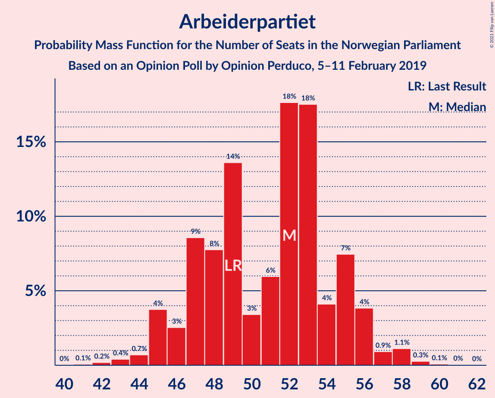

| Number of Seats | Probability | Accumulated | Special Marks |
|:---------------:|:-----------:|:-----------:|:-------------:|
| 41 | 0.1% | 100% |  |
| 42 | 0.2% | 99.9% |  |
| 43 | 0.4% | 99.7% |  |
| 44 | 0.7% | 99.3% |  |
| 45 | 4% | 98.6% |  |
| 46 | 3% | 95% |  |
| 47 | 9% | 92% |  |
| 48 | 8% | 84% |  |
| 49 | 14% | 76% | Last Result |
| 50 | 3% | 62% |  |
| 51 | 6% | 59% |  |
| 52 | 18% | 53% | Median |
| 53 | 18% | 35% |  |
| 54 | 4% | 18% |  |
| 55 | 7% | 14% |  |
| 56 | 4% | 6% |  |
| 57 | 0.9% | 2% |  |
| 58 | 1.1% | 2% |  |
| 59 | 0.3% | 0.4% |  |
| 60 | 0.1% | 0.2% |  |
| 61 | 0% | 0.1% |  |
| 62 | 0% | 0% |  |

### Høyre

*For a full overview of the results for this party, see the [Høyre](party-høyre.html) page.*

| Number of Seats | Probability | Accumulated | Special Marks |
|:---------------:|:-----------:|:-----------:|:-------------:|
| 31 | 0.2% | 100% |  |
| 32 | 0.3% | 99.7% |  |
| 33 | 0.7% | 99.4% |  |
| 34 | 1.1% | 98.7% |  |
| 35 | 3% | 98% |  |
| 36 | 6% | 94% |  |
| 37 | 5% | 88% |  |
| 38 | 9% | 83% |  |
| 39 | 15% | 75% |  |
| 40 | 14% | 59% | Median |
| 41 | 26% | 46% |  |
| 42 | 6% | 20% |  |
| 43 | 6% | 14% |  |
| 44 | 2% | 8% |  |
| 45 | 4% | 6% | Last Result |
| 46 | 0.6% | 1.3% |  |
| 47 | 0.4% | 0.8% |  |
| 48 | 0.2% | 0.4% |  |
| 49 | 0.1% | 0.2% |  |
| 50 | 0.1% | 0.1% |  |
| 51 | 0% | 0% |  |

### Senterpartiet

*For a full overview of the results for this party, see the [Senterpartiet](party-senterpartiet.html) page.*

| Number of Seats | Probability | Accumulated | Special Marks |
|:---------------:|:-----------:|:-----------:|:-------------:|
| 17 | 0% | 100% |  |
| 18 | 0.1% | 99.9% |  |
| 19 | 0.4% | 99.8% | Last Result |
| 20 | 1.4% | 99.4% |  |
| 21 | 2% | 98% |  |
| 22 | 12% | 96% |  |
| 23 | 12% | 84% |  |
| 24 | 27% | 72% | Median |
| 25 | 22% | 45% |  |
| 26 | 10% | 24% |  |
| 27 | 8% | 13% |  |
| 28 | 2% | 5% |  |
| 29 | 1.3% | 3% |  |
| 30 | 0.7% | 2% |  |
| 31 | 0.5% | 1.2% |  |
| 32 | 0.3% | 0.7% |  |
| 33 | 0.1% | 0.4% |  |
| 34 | 0.3% | 0.3% |  |
| 35 | 0% | 0% |  |

### Fremskrittspartiet

*For a full overview of the results for this party, see the [Fremskrittspartiet](party-fremskrittspartiet.html) page.*

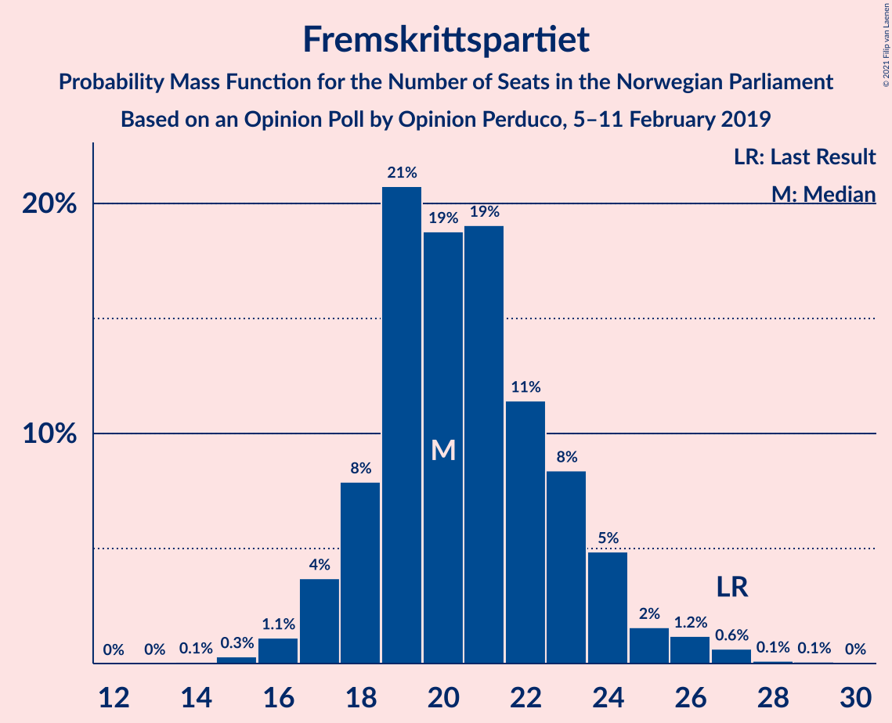

| Number of Seats | Probability | Accumulated | Special Marks |
|:---------------:|:-----------:|:-----------:|:-------------:|
| 14 | 0.1% | 100% |  |
| 15 | 0.3% | 99.9% |  |
| 16 | 1.1% | 99.6% |  |
| 17 | 4% | 98% |  |
| 18 | 8% | 95% |  |
| 19 | 21% | 87% |  |
| 20 | 19% | 66% | Median |
| 21 | 19% | 47% |  |
| 22 | 11% | 28% |  |
| 23 | 8% | 17% |  |
| 24 | 5% | 8% |  |
| 25 | 2% | 4% |  |
| 26 | 1.2% | 2% |  |
| 27 | 0.6% | 0.9% | Last Result |
| 28 | 0.1% | 0.2% |  |
| 29 | 0.1% | 0.1% |  |
| 30 | 0% | 0% |  |

### Sosialistisk Venstreparti

*For a full overview of the results for this party, see the [Sosialistisk Venstreparti](party-sosialistiskvenstreparti.html) page.*

| Number of Seats | Probability | Accumulated | Special Marks |
|:---------------:|:-----------:|:-----------:|:-------------:|
| 9 | 0.1% | 100% |  |
| 10 | 1.2% | 99.9% |  |
| 11 | 3% | 98.7% | Last Result |
| 12 | 12% | 95% |  |
| 13 | 22% | 84% |  |
| 14 | 24% | 62% | Median |
| 15 | 18% | 38% |  |
| 16 | 12% | 21% |  |
| 17 | 5% | 9% |  |
| 18 | 2% | 4% |  |
| 19 | 1.0% | 2% |  |
| 20 | 0.5% | 0.6% |  |
| 21 | 0.1% | 0.1% |  |
| 22 | 0.1% | 0.1% |  |
| 23 | 0% | 0% |  |

### Rødt

*For a full overview of the results for this party, see the [Rødt](party-rødt.html) page.*

| Number of Seats | Probability | Accumulated | Special Marks |
|:---------------:|:-----------:|:-----------:|:-------------:|
| 1 | 0% | 100% | Last Result |
| 2 | 0% | 100% |  |
| 3 | 0% | 100% |  |
| 4 | 0% | 100% |  |
| 5 | 0% | 100% |  |
| 6 | 0% | 100% |  |
| 7 | 0% | 100% |  |
| 8 | 0.1% | 100% |  |
| 9 | 0.3% | 99.9% |  |
| 10 | 3% | 99.6% |  |
| 11 | 9% | 96% |  |
| 12 | 13% | 88% |  |
| 13 | 20% | 75% |  |
| 14 | 25% | 55% | Median |
| 15 | 12% | 30% |  |
| 16 | 11% | 17% |  |
| 17 | 4% | 6% |  |
| 18 | 1.0% | 2% |  |
| 19 | 0.6% | 0.8% |  |
| 20 | 0.1% | 0.1% |  |
| 21 | 0% | 0% |  |

### Kristelig Folkeparti

*For a full overview of the results for this party, see the [Kristelig Folkeparti](party-kristeligfolkeparti.html) page.*

| Number of Seats | Probability | Accumulated | Special Marks |
|:---------------:|:-----------:|:-----------:|:-------------:|
| 0 | 4% | 100% |  |
| 1 | 49% | 96% | Median |
| 2 | 7% | 47% |  |
| 3 | 28% | 40% |  |
| 4 | 0% | 12% |  |
| 5 | 0% | 12% |  |
| 6 | 0% | 12% |  |
| 7 | 6% | 12% |  |
| 8 | 5% | 6% | Last Result |
| 9 | 1.2% | 2% |  |
| 10 | 0.3% | 0.4% |  |
| 11 | 0% | 0% |  |

### Miljøpartiet De Grønne

*For a full overview of the results for this party, see the [Miljøpartiet De Grønne](party-miljøpartietdegrønne.html) page.*

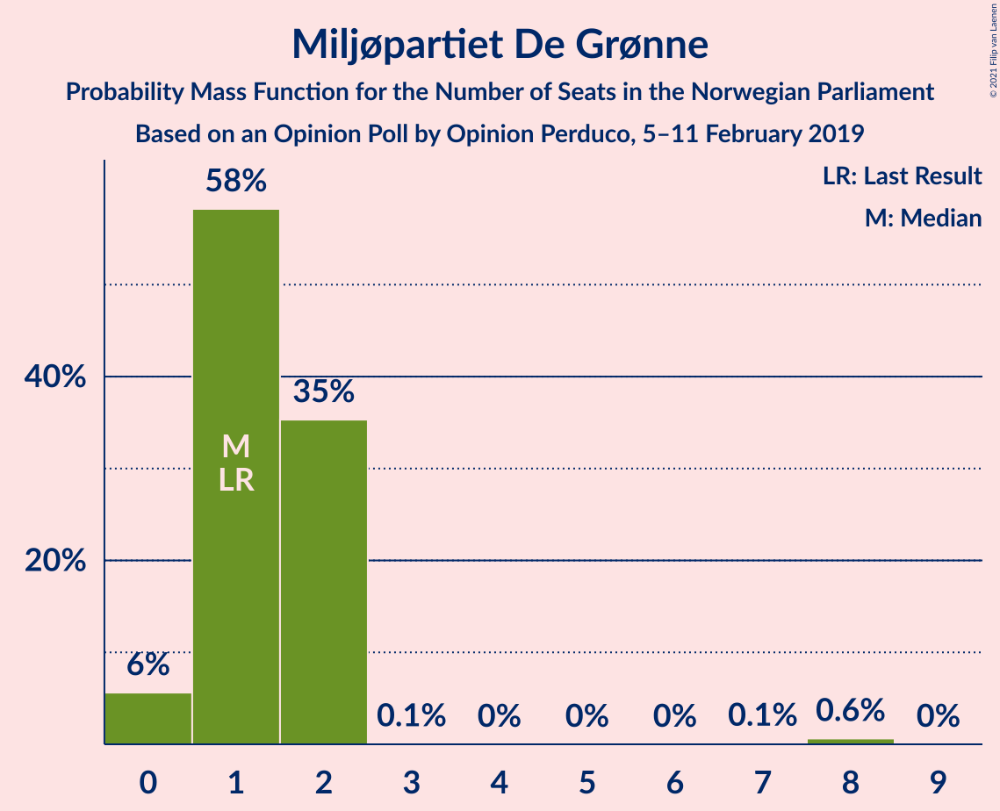

| Number of Seats | Probability | Accumulated | Special Marks |
|:---------------:|:-----------:|:-----------:|:-------------:|
| 0 | 6% | 100% |  |
| 1 | 58% | 94% | Last Result, Median |
| 2 | 35% | 36% |  |
| 3 | 0.1% | 0.8% |  |
| 4 | 0% | 0.8% |  |
| 5 | 0% | 0.8% |  |
| 6 | 0% | 0.8% |  |
| 7 | 0.1% | 0.8% |  |
| 8 | 0.6% | 0.6% |  |
| 9 | 0% | 0% |  |

### Venstre

*For a full overview of the results for this party, see the [Venstre](party-venstre.html) page.*

| Number of Seats | Probability | Accumulated | Special Marks |
|:---------------:|:-----------:|:-----------:|:-------------:|
| 0 | 12% | 100% |  |
| 1 | 27% | 88% |  |
| 2 | 59% | 61% | Median |
| 3 | 0% | 1.3% |  |
| 4 | 0% | 1.2% |  |
| 5 | 0% | 1.2% |  |
| 6 | 0% | 1.2% |  |
| 7 | 0.7% | 1.2% |  |
| 8 | 0.4% | 0.5% | Last Result |
| 9 | 0.1% | 0.1% |  |
| 10 | 0% | 0% |  |

## Coalitions

### Confidence Intervals

| Coalition | Last Result | Median | Majority? | 80% Confidence Interval | 90% Confidence Interval | 95% Confidence Interval | 99% Confidence Interval |
|:---------:|:-----------:|:------:|:---------:|:-----------------------:|:-----------------------:|:-----------------------:|:-----------------------:|
| Arbeiderpartiet – Senterpartiet – Sosialistisk Venstreparti – Rødt – Miljøpartiet De Grønne | 81 | 105 | 100% | 100–109 | 98–110 | 97–112 | 95–113 |
| Arbeiderpartiet – Senterpartiet – Sosialistisk Venstreparti – Rødt | 80 | 103 | 100% | 99–108 | 97–109 | 96–110 | 94–112 |
| Arbeiderpartiet – Senterpartiet – Sosialistisk Venstreparti – Kristelig Folkeparti – Miljøpartiet De Grønne | 88 | 93 | 99.4% | 89–98 | 88–99 | 86–101 | 84–102 |
| Arbeiderpartiet – Senterpartiet – Sosialistisk Venstreparti – Miljøpartiet De Grønne | 80 | 90 | 96% | 86–95 | 85–97 | 83–98 | 82–100 |
| Arbeiderpartiet – Senterpartiet – Sosialistisk Venstreparti | 79 | 89 | 92% | 85–94 | 83–95 | 82–97 | 81–99 |
| Høyre – Senterpartiet – Fremskrittspartiet – Kristelig Folkeparti – Venstre | 107 | 88 | 93% | 85–94 | 84–95 | 82–96 | 81–98 |
| Arbeiderpartiet – Sosialistisk Venstreparti – Rødt – Miljøpartiet De Grønne | 62 | 81 | 7% | 75–84 | 74–85 | 73–87 | 71–88 |
| Arbeiderpartiet – Senterpartiet – Kristelig Folkeparti – Miljøpartiet De Grønne | 77 | 79 | 7% | 75–84 | 73–85 | 73–86 | 70–89 |
| Arbeiderpartiet – Senterpartiet – Kristelig Folkeparti | 76 | 78 | 3% | 73–82 | 72–84 | 71–85 | 69–87 |
| Arbeiderpartiet – Senterpartiet | 68 | 76 | 0.3% | 71–80 | 69–81 | 68–82 | 67–84 |
| Høyre – Fremskrittspartiet – Kristelig Folkeparti – Miljøpartiet De Grønne – Venstre | 89 | 66 | 0% | 61–70 | 60–72 | 59–73 | 57–75 |
| Høyre – Fremskrittspartiet – Kristelig Folkeparti – Venstre | 88 | 64 | 0% | 60–69 | 59–71 | 57–72 | 56–74 |
| Arbeiderpartiet – Sosialistisk Venstreparti | 60 | 65 | 0% | 60–69 | 60–70 | 59–71 | 57–73 |
| Høyre – Fremskrittspartiet – Venstre | 80 | 62 | 0% | 58–66 | 56–68 | 56–69 | 53–70 |
| Høyre – Fremskrittspartiet | 72 | 60 | 0% | 56–65 | 55–66 | 54–67 | 52–69 |
| Høyre – Kristelig Folkeparti – Venstre | 61 | 43 | 0% | 40–48 | 38–50 | 37–52 | 36–54 |
| Senterpartiet – Kristelig Folkeparti – Venstre | 35 | 28 | 0% | 25–32 | 25–34 | 24–36 | 23–38 |

### Arbeiderpartiet – Senterpartiet – Sosialistisk Venstreparti – Rødt – Miljøpartiet De Grønne

| Number of Seats | Probability | Accumulated | Special Marks |
|:---------------:|:-----------:|:-----------:|:-------------:|
| 81 | 0% | 100% | Last Result |
| 82 | 0% | 100% |  |
| 83 | 0% | 100% |  |
| 84 | 0% | 100% |  |
| 85 | 0% | 100% | Majority |
| 86 | 0% | 100% |  |
| 87 | 0% | 100% |  |
| 88 | 0% | 100% |  |
| 89 | 0% | 100% |  |
| 90 | 0% | 100% |  |
| 91 | 0% | 100% |  |
| 92 | 0.1% | 100% |  |
| 93 | 0.1% | 99.9% |  |
| 94 | 0.1% | 99.8% |  |
| 95 | 1.4% | 99.7% |  |
| 96 | 0.4% | 98% |  |
| 97 | 0.7% | 98% |  |
| 98 | 2% | 97% |  |
| 99 | 4% | 95% |  |
| 100 | 3% | 91% |  |
| 101 | 8% | 88% |  |
| 102 | 5% | 80% |  |
| 103 | 7% | 75% |  |
| 104 | 15% | 68% |  |
| 105 | 7% | 53% | Median |
| 106 | 23% | 46% |  |
| 107 | 6% | 23% |  |
| 108 | 5% | 17% |  |
| 109 | 3% | 12% |  |
| 110 | 4% | 9% |  |
| 111 | 0.9% | 4% |  |
| 112 | 2% | 4% |  |
| 113 | 0.7% | 1.1% |  |
| 114 | 0.3% | 0.4% |  |
| 115 | 0.1% | 0.2% |  |
| 116 | 0% | 0.1% |  |
| 117 | 0% | 0% |  |

### Arbeiderpartiet – Senterpartiet – Sosialistisk Venstreparti – Rødt

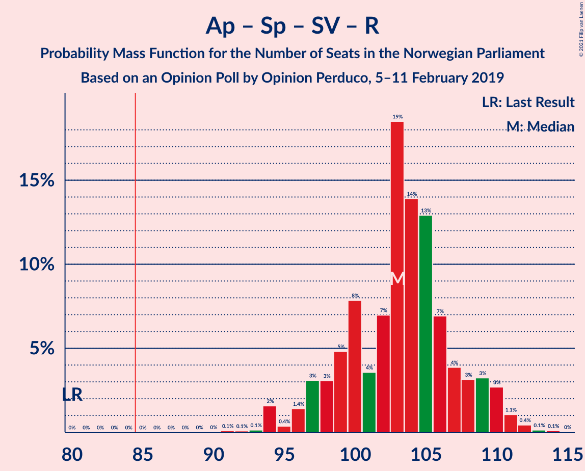

| Number of Seats | Probability | Accumulated | Special Marks |
|:---------------:|:-----------:|:-----------:|:-------------:|
| 80 | 0% | 100% | Last Result |
| 81 | 0% | 100% |  |
| 82 | 0% | 100% |  |
| 83 | 0% | 100% |  |
| 84 | 0% | 100% |  |
| 85 | 0% | 100% | Majority |
| 86 | 0% | 100% |  |
| 87 | 0% | 100% |  |
| 88 | 0% | 100% |  |
| 89 | 0% | 100% |  |
| 90 | 0% | 100% |  |
| 91 | 0.1% | 100% |  |
| 92 | 0.1% | 99.9% |  |
| 93 | 0.1% | 99.8% |  |
| 94 | 2% | 99.7% |  |
| 95 | 0.4% | 98% |  |
| 96 | 1.4% | 98% |  |
| 97 | 3% | 96% |  |
| 98 | 3% | 93% |  |
| 99 | 5% | 90% |  |
| 100 | 8% | 85% |  |
| 101 | 4% | 77% |  |
| 102 | 7% | 74% |  |
| 103 | 19% | 67% |  |
| 104 | 14% | 48% | Median |
| 105 | 13% | 35% |  |
| 106 | 7% | 22% |  |
| 107 | 4% | 15% |  |
| 108 | 3% | 11% |  |
| 109 | 3% | 8% |  |
| 110 | 3% | 4% |  |
| 111 | 1.1% | 2% |  |
| 112 | 0.4% | 0.7% |  |
| 113 | 0.1% | 0.3% |  |
| 114 | 0.1% | 0.1% |  |
| 115 | 0% | 0% |  |

### Arbeiderpartiet – Senterpartiet – Sosialistisk Venstreparti – Kristelig Folkeparti – Miljøpartiet De Grønne

| Number of Seats | Probability | Accumulated | Special Marks |
|:---------------:|:-----------:|:-----------:|:-------------:|
| 82 | 0% | 100% |  |
| 83 | 0.1% | 99.9% |  |
| 84 | 0.4% | 99.8% |  |
| 85 | 0.4% | 99.4% | Majority |
| 86 | 2% | 98.9% |  |
| 87 | 1.2% | 97% |  |
| 88 | 3% | 96% | Last Result |
| 89 | 4% | 93% |  |
| 90 | 8% | 89% |  |
| 91 | 13% | 80% |  |
| 92 | 5% | 67% | Median |
| 93 | 15% | 63% |  |
| 94 | 18% | 48% |  |
| 95 | 4% | 30% |  |
| 96 | 10% | 26% |  |
| 97 | 5% | 16% |  |
| 98 | 4% | 11% |  |
| 99 | 3% | 7% |  |
| 100 | 1.1% | 4% |  |
| 101 | 2% | 3% |  |
| 102 | 0.5% | 0.9% |  |
| 103 | 0.2% | 0.4% |  |
| 104 | 0.1% | 0.2% |  |
| 105 | 0.1% | 0.1% |  |
| 106 | 0% | 0% |  |

### Arbeiderpartiet – Senterpartiet – Sosialistisk Venstreparti – Miljøpartiet De Grønne

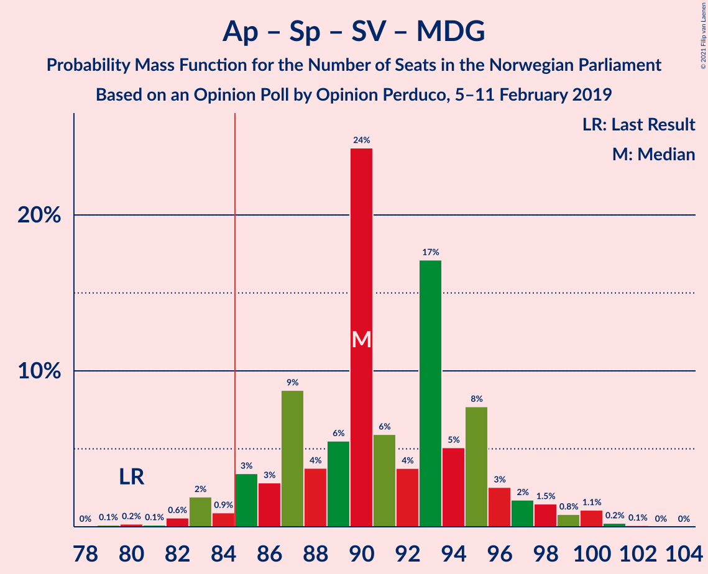

| Number of Seats | Probability | Accumulated | Special Marks |
|:---------------:|:-----------:|:-----------:|:-------------:|
| 79 | 0.1% | 100% |  |
| 80 | 0.2% | 99.9% | Last Result |
| 81 | 0.1% | 99.7% |  |
| 82 | 0.6% | 99.6% |  |
| 83 | 2% | 99.0% |  |
| 84 | 0.9% | 97% |  |
| 85 | 3% | 96% | Majority |
| 86 | 3% | 93% |  |
| 87 | 9% | 90% |  |
| 88 | 4% | 81% |  |
| 89 | 6% | 77% |  |
| 90 | 24% | 72% |  |
| 91 | 6% | 48% | Median |
| 92 | 4% | 42% |  |
| 93 | 17% | 38% |  |
| 94 | 5% | 21% |  |
| 95 | 8% | 16% |  |
| 96 | 3% | 8% |  |
| 97 | 2% | 5% |  |
| 98 | 1.5% | 4% |  |
| 99 | 0.8% | 2% |  |
| 100 | 1.1% | 1.4% |  |
| 101 | 0.2% | 0.4% |  |
| 102 | 0.1% | 0.1% |  |
| 103 | 0% | 0% |  |

### Arbeiderpartiet – Senterpartiet – Sosialistisk Venstreparti

| Number of Seats | Probability | Accumulated | Special Marks |
|:---------------:|:-----------:|:-----------:|:-------------:|
| 78 | 0% | 100% |  |
| 79 | 0.3% | 99.9% | Last Result |
| 80 | 0.1% | 99.7% |  |
| 81 | 0.8% | 99.5% |  |
| 82 | 2% | 98.7% |  |
| 83 | 2% | 97% |  |
| 84 | 3% | 95% |  |
| 85 | 4% | 92% | Majority |
| 86 | 9% | 88% |  |
| 87 | 4% | 80% |  |
| 88 | 13% | 76% |  |
| 89 | 18% | 63% |  |
| 90 | 4% | 44% | Median |
| 91 | 6% | 40% |  |
| 92 | 15% | 35% |  |
| 93 | 8% | 19% |  |
| 94 | 4% | 11% |  |
| 95 | 2% | 7% |  |
| 96 | 2% | 5% |  |
| 97 | 0.7% | 3% |  |
| 98 | 1.3% | 2% |  |
| 99 | 0.3% | 0.5% |  |
| 100 | 0.2% | 0.3% |  |
| 101 | 0.1% | 0.1% |  |
| 102 | 0% | 0% |  |

### Høyre – Senterpartiet – Fremskrittspartiet – Kristelig Folkeparti – Venstre

| Number of Seats | Probability | Accumulated | Special Marks |
|:---------------:|:-----------:|:-----------:|:-------------:|
| 78 | 0.1% | 100% |  |
| 79 | 0.1% | 99.9% |  |
| 80 | 0.1% | 99.8% |  |
| 81 | 1.2% | 99.7% |  |
| 82 | 2% | 98.5% |  |
| 83 | 1.1% | 97% |  |
| 84 | 3% | 95% |  |
| 85 | 9% | 93% | Majority |
| 86 | 6% | 84% |  |
| 87 | 10% | 78% | Median |
| 88 | 20% | 68% |  |
| 89 | 13% | 47% |  |
| 90 | 7% | 34% |  |
| 91 | 4% | 27% |  |
| 92 | 6% | 23% |  |
| 93 | 6% | 17% |  |
| 94 | 3% | 11% |  |
| 95 | 4% | 8% |  |
| 96 | 2% | 4% |  |
| 97 | 0.7% | 1.4% |  |
| 98 | 0.3% | 0.7% |  |
| 99 | 0.2% | 0.4% |  |
| 100 | 0.1% | 0.1% |  |
| 101 | 0% | 0.1% |  |
| 102 | 0% | 0% |  |
| 103 | 0% | 0% |  |
| 104 | 0% | 0% |  |
| 105 | 0% | 0% |  |
| 106 | 0% | 0% |  |
| 107 | 0% | 0% | Last Result |

### Arbeiderpartiet – Sosialistisk Venstreparti – Rødt – Miljøpartiet De Grønne

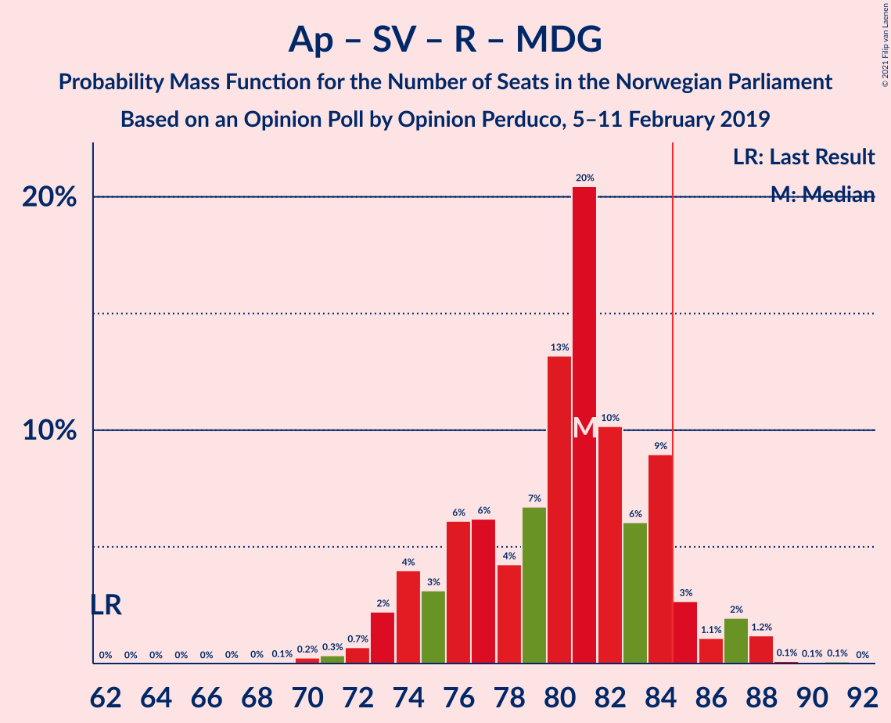

| Number of Seats | Probability | Accumulated | Special Marks |
|:---------------:|:-----------:|:-----------:|:-------------:|
| 62 | 0% | 100% | Last Result |
| 63 | 0% | 100% |  |
| 64 | 0% | 100% |  |
| 65 | 0% | 100% |  |
| 66 | 0% | 100% |  |
| 67 | 0% | 100% |  |
| 68 | 0% | 100% |  |
| 69 | 0.1% | 99.9% |  |
| 70 | 0.2% | 99.9% |  |
| 71 | 0.3% | 99.6% |  |
| 72 | 0.7% | 99.3% |  |
| 73 | 2% | 98.6% |  |
| 74 | 4% | 96% |  |
| 75 | 3% | 92% |  |
| 76 | 6% | 89% |  |
| 77 | 6% | 83% |  |
| 78 | 4% | 77% |  |
| 79 | 7% | 73% |  |
| 80 | 13% | 66% |  |
| 81 | 20% | 53% | Median |
| 82 | 10% | 32% |  |
| 83 | 6% | 22% |  |
| 84 | 9% | 16% |  |
| 85 | 3% | 7% | Majority |
| 86 | 1.1% | 5% |  |
| 87 | 2% | 3% |  |
| 88 | 1.2% | 1.5% |  |
| 89 | 0.1% | 0.3% |  |
| 90 | 0.1% | 0.2% |  |
| 91 | 0.1% | 0.1% |  |
| 92 | 0% | 0% |  |

### Arbeiderpartiet – Senterpartiet – Kristelig Folkeparti – Miljøpartiet De Grønne

| Number of Seats | Probability | Accumulated | Special Marks |
|:---------------:|:-----------:|:-----------:|:-------------:|
| 68 | 0% | 100% |  |
| 69 | 0.1% | 99.9% |  |
| 70 | 0.5% | 99.8% |  |
| 71 | 0.6% | 99.3% |  |
| 72 | 0.9% | 98.7% |  |
| 73 | 3% | 98% |  |
| 74 | 4% | 95% |  |
| 75 | 5% | 91% |  |
| 76 | 7% | 86% |  |
| 77 | 14% | 79% | Last Result |
| 78 | 3% | 65% | Median |
| 79 | 12% | 62% |  |
| 80 | 21% | 50% |  |
| 81 | 6% | 28% |  |
| 82 | 5% | 22% |  |
| 83 | 7% | 17% |  |
| 84 | 4% | 10% |  |
| 85 | 3% | 7% | Majority |
| 86 | 2% | 4% |  |
| 87 | 1.2% | 2% |  |
| 88 | 0.5% | 1.1% |  |
| 89 | 0.2% | 0.5% |  |
| 90 | 0.2% | 0.4% |  |
| 91 | 0.1% | 0.1% |  |
| 92 | 0.1% | 0.1% |  |
| 93 | 0% | 0% |  |

### Arbeiderpartiet – Senterpartiet – Kristelig Folkeparti

| Number of Seats | Probability | Accumulated | Special Marks |
|:---------------:|:-----------:|:-----------:|:-------------:|
| 67 | 0% | 100% |  |
| 68 | 0.1% | 99.9% |  |
| 69 | 0.8% | 99.8% |  |
| 70 | 0.4% | 99.0% |  |
| 71 | 2% | 98.5% |  |
| 72 | 4% | 97% |  |
| 73 | 6% | 93% |  |
| 74 | 2% | 87% |  |
| 75 | 13% | 85% |  |
| 76 | 7% | 72% | Last Result |
| 77 | 5% | 65% | Median |
| 78 | 15% | 60% |  |
| 79 | 19% | 45% |  |
| 80 | 7% | 26% |  |
| 81 | 4% | 19% |  |
| 82 | 6% | 15% |  |
| 83 | 4% | 9% |  |
| 84 | 2% | 5% |  |
| 85 | 1.4% | 3% | Majority |
| 86 | 0.7% | 2% |  |
| 87 | 0.4% | 0.8% |  |
| 88 | 0.1% | 0.5% |  |
| 89 | 0.2% | 0.3% |  |
| 90 | 0.1% | 0.1% |  |
| 91 | 0% | 0% |  |

### Arbeiderpartiet – Senterpartiet

| Number of Seats | Probability | Accumulated | Special Marks |
|:---------------:|:-----------:|:-----------:|:-------------:|
| 64 | 0.1% | 100% |  |
| 65 | 0.1% | 99.9% |  |
| 66 | 0.2% | 99.8% |  |
| 67 | 0.7% | 99.6% |  |
| 68 | 2% | 98.9% | Last Result |
| 69 | 2% | 97% |  |
| 70 | 3% | 95% |  |
| 71 | 4% | 92% |  |
| 72 | 11% | 88% |  |
| 73 | 4% | 77% |  |
| 74 | 10% | 72% |  |
| 75 | 7% | 62% |  |
| 76 | 16% | 55% | Median |
| 77 | 13% | 38% |  |
| 78 | 8% | 25% |  |
| 79 | 6% | 17% |  |
| 80 | 3% | 10% |  |
| 81 | 4% | 7% |  |
| 82 | 1.5% | 4% |  |
| 83 | 1.3% | 2% |  |
| 84 | 0.7% | 1.0% |  |
| 85 | 0.1% | 0.3% | Majority |
| 86 | 0.2% | 0.2% |  |
| 87 | 0% | 0% |  |

### Høyre – Fremskrittspartiet – Kristelig Folkeparti – Miljøpartiet De Grønne – Venstre

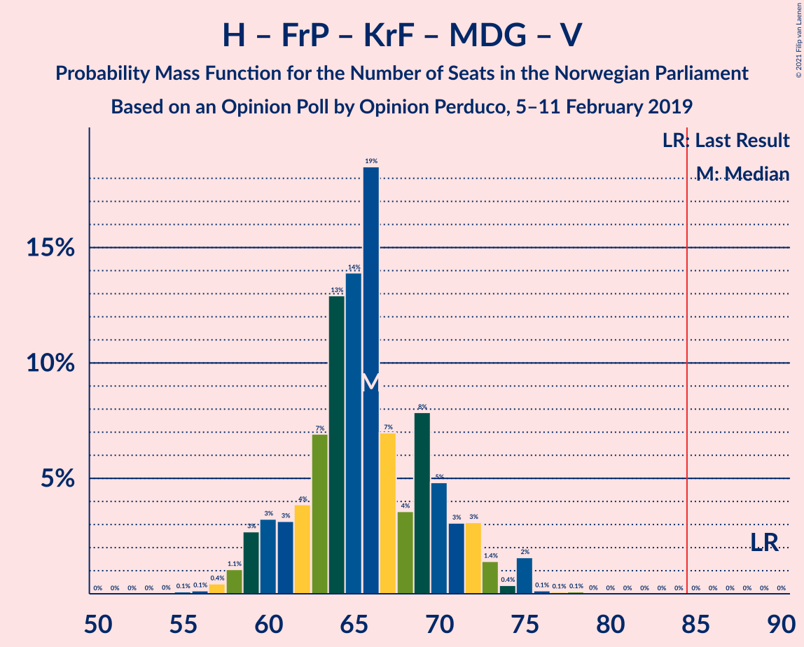

| Number of Seats | Probability | Accumulated | Special Marks |
|:---------------:|:-----------:|:-----------:|:-------------:|
| 55 | 0.1% | 100% |  |
| 56 | 0.1% | 99.9% |  |
| 57 | 0.4% | 99.7% |  |
| 58 | 1.1% | 99.3% |  |
| 59 | 3% | 98% |  |
| 60 | 3% | 96% |  |
| 61 | 3% | 92% |  |
| 62 | 4% | 89% |  |
| 63 | 7% | 85% |  |
| 64 | 13% | 78% | Median |
| 65 | 14% | 65% |  |
| 66 | 19% | 52% |  |
| 67 | 7% | 33% |  |
| 68 | 4% | 26% |  |
| 69 | 8% | 23% |  |
| 70 | 5% | 15% |  |
| 71 | 3% | 10% |  |
| 72 | 3% | 7% |  |
| 73 | 1.4% | 4% |  |
| 74 | 0.4% | 2% |  |
| 75 | 2% | 2% |  |
| 76 | 0.1% | 0.3% |  |
| 77 | 0.1% | 0.2% |  |
| 78 | 0.1% | 0.1% |  |
| 79 | 0% | 0% |  |
| 80 | 0% | 0% |  |
| 81 | 0% | 0% |  |
| 82 | 0% | 0% |  |
| 83 | 0% | 0% |  |
| 84 | 0% | 0% |  |
| 85 | 0% | 0% | Majority |
| 86 | 0% | 0% |  |
| 87 | 0% | 0% |  |
| 88 | 0% | 0% |  |
| 89 | 0% | 0% | Last Result |

### Høyre – Fremskrittspartiet – Kristelig Folkeparti – Venstre

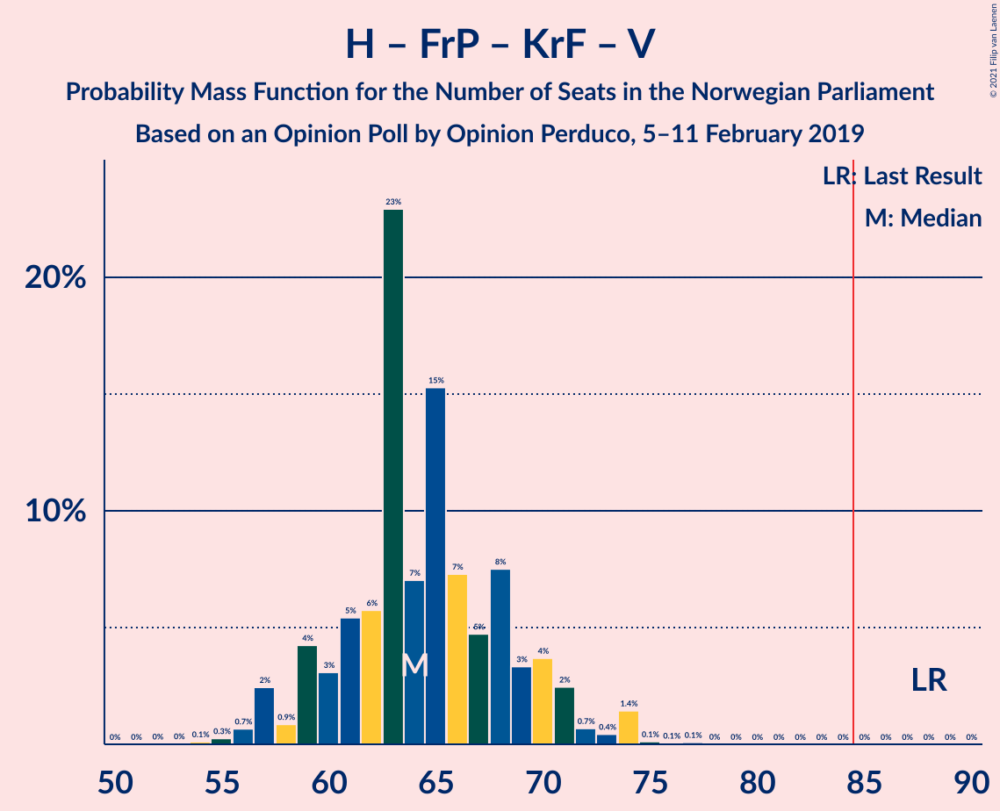

| Number of Seats | Probability | Accumulated | Special Marks |
|:---------------:|:-----------:|:-----------:|:-------------:|
| 53 | 0% | 100% |  |
| 54 | 0.1% | 99.9% |  |
| 55 | 0.3% | 99.8% |  |
| 56 | 0.7% | 99.6% |  |
| 57 | 2% | 98.9% |  |
| 58 | 0.9% | 96% |  |
| 59 | 4% | 96% |  |
| 60 | 3% | 91% |  |
| 61 | 5% | 88% |  |
| 62 | 6% | 83% |  |
| 63 | 23% | 77% | Median |
| 64 | 7% | 54% |  |
| 65 | 15% | 47% |  |
| 66 | 7% | 32% |  |
| 67 | 5% | 25% |  |
| 68 | 8% | 20% |  |
| 69 | 3% | 12% |  |
| 70 | 4% | 9% |  |
| 71 | 2% | 5% |  |
| 72 | 0.7% | 3% |  |
| 73 | 0.4% | 2% |  |
| 74 | 1.4% | 2% |  |
| 75 | 0.1% | 0.3% |  |
| 76 | 0.1% | 0.2% |  |
| 77 | 0.1% | 0.1% |  |
| 78 | 0% | 0% |  |
| 79 | 0% | 0% |  |
| 80 | 0% | 0% |  |
| 81 | 0% | 0% |  |
| 82 | 0% | 0% |  |
| 83 | 0% | 0% |  |
| 84 | 0% | 0% |  |
| 85 | 0% | 0% | Majority |
| 86 | 0% | 0% |  |
| 87 | 0% | 0% |  |
| 88 | 0% | 0% | Last Result |

### Arbeiderpartiet – Sosialistisk Venstreparti

| Number of Seats | Probability | Accumulated | Special Marks |
|:---------------:|:-----------:|:-----------:|:-------------:|
| 54 | 0% | 100% |  |
| 55 | 0.1% | 99.9% |  |
| 56 | 0.2% | 99.8% |  |
| 57 | 0.5% | 99.6% |  |
| 58 | 1.1% | 99.1% |  |
| 59 | 2% | 98% |  |
| 60 | 7% | 96% | Last Result |
| 61 | 7% | 89% |  |
| 62 | 4% | 82% |  |
| 63 | 9% | 78% |  |
| 64 | 8% | 69% |  |
| 65 | 17% | 61% |  |
| 66 | 7% | 44% | Median |
| 67 | 7% | 37% |  |
| 68 | 16% | 29% |  |
| 69 | 6% | 13% |  |
| 70 | 3% | 7% |  |
| 71 | 3% | 5% |  |
| 72 | 1.1% | 2% |  |
| 73 | 0.6% | 0.9% |  |
| 74 | 0.2% | 0.3% |  |
| 75 | 0.1% | 0.1% |  |
| 76 | 0% | 0% |  |

### Høyre – Fremskrittspartiet – Venstre

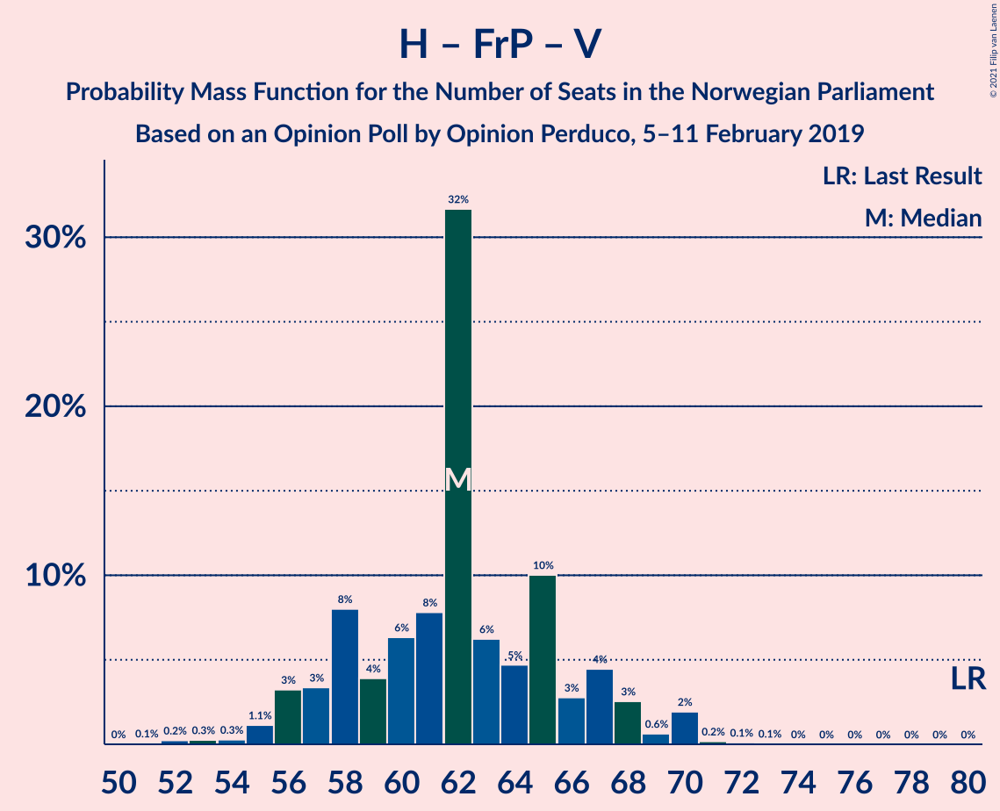

| Number of Seats | Probability | Accumulated | Special Marks |
|:---------------:|:-----------:|:-----------:|:-------------:|
| 51 | 0.1% | 100% |  |
| 52 | 0.2% | 99.9% |  |
| 53 | 0.3% | 99.7% |  |
| 54 | 0.3% | 99.4% |  |
| 55 | 1.1% | 99.1% |  |
| 56 | 3% | 98% |  |
| 57 | 3% | 95% |  |
| 58 | 8% | 91% |  |
| 59 | 4% | 83% |  |
| 60 | 6% | 79% |  |
| 61 | 8% | 73% |  |
| 62 | 32% | 65% | Median |
| 63 | 6% | 34% |  |
| 64 | 5% | 27% |  |
| 65 | 10% | 23% |  |
| 66 | 3% | 13% |  |
| 67 | 4% | 10% |  |
| 68 | 3% | 5% |  |
| 69 | 0.6% | 3% |  |
| 70 | 2% | 2% |  |
| 71 | 0.2% | 0.4% |  |
| 72 | 0.1% | 0.2% |  |
| 73 | 0.1% | 0.1% |  |
| 74 | 0% | 0% |  |
| 75 | 0% | 0% |  |
| 76 | 0% | 0% |  |
| 77 | 0% | 0% |  |
| 78 | 0% | 0% |  |
| 79 | 0% | 0% |  |
| 80 | 0% | 0% | Last Result |

### Høyre – Fremskrittspartiet

| Number of Seats | Probability | Accumulated | Special Marks |
|:---------------:|:-----------:|:-----------:|:-------------:|
| 50 | 0.1% | 100% |  |
| 51 | 0.2% | 99.9% |  |
| 52 | 0.3% | 99.7% |  |
| 53 | 0.5% | 99.4% |  |
| 54 | 1.4% | 98.9% |  |
| 55 | 4% | 97% |  |
| 56 | 5% | 93% |  |
| 57 | 4% | 88% |  |
| 58 | 9% | 84% |  |
| 59 | 8% | 75% |  |
| 60 | 23% | 67% | Median |
| 61 | 14% | 44% |  |
| 62 | 4% | 31% |  |
| 63 | 12% | 27% |  |
| 64 | 4% | 15% |  |
| 65 | 2% | 11% |  |
| 66 | 5% | 8% |  |
| 67 | 1.1% | 4% |  |
| 68 | 2% | 2% |  |
| 69 | 0.5% | 0.7% |  |
| 70 | 0.1% | 0.2% |  |
| 71 | 0.1% | 0.1% |  |
| 72 | 0% | 0% | Last Result |

### Høyre – Kristelig Folkeparti – Venstre

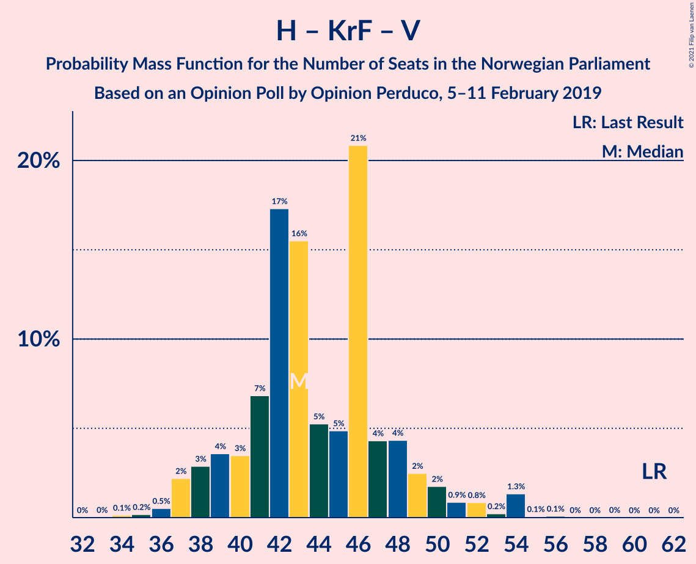

| Number of Seats | Probability | Accumulated | Special Marks |
|:---------------:|:-----------:|:-----------:|:-------------:|
| 34 | 0.1% | 100% |  |
| 35 | 0.2% | 99.8% |  |
| 36 | 0.5% | 99.7% |  |
| 37 | 2% | 99.1% |  |
| 38 | 3% | 97% |  |
| 39 | 4% | 94% |  |
| 40 | 3% | 90% |  |
| 41 | 7% | 87% |  |
| 42 | 17% | 80% |  |
| 43 | 16% | 63% | Median |
| 44 | 5% | 47% |  |
| 45 | 5% | 42% |  |
| 46 | 21% | 37% |  |
| 47 | 4% | 16% |  |
| 48 | 4% | 12% |  |
| 49 | 2% | 8% |  |
| 50 | 2% | 5% |  |
| 51 | 0.9% | 3% |  |
| 52 | 0.8% | 3% |  |
| 53 | 0.2% | 2% |  |
| 54 | 1.3% | 2% |  |
| 55 | 0.1% | 0.2% |  |
| 56 | 0.1% | 0.1% |  |
| 57 | 0% | 0% |  |
| 58 | 0% | 0% |  |
| 59 | 0% | 0% |  |
| 60 | 0% | 0% |  |
| 61 | 0% | 0% | Last Result |

### Senterpartiet – Kristelig Folkeparti – Venstre

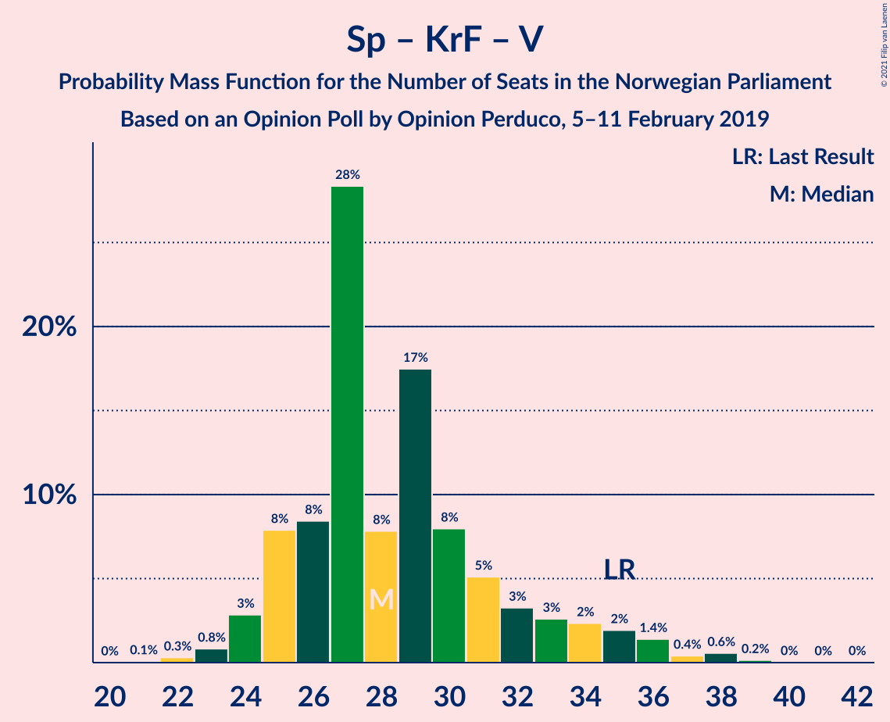

| Number of Seats | Probability | Accumulated | Special Marks |
|:---------------:|:-----------:|:-----------:|:-------------:|
| 21 | 0.1% | 100% |  |
| 22 | 0.3% | 99.9% |  |
| 23 | 0.8% | 99.6% |  |
| 24 | 3% | 98.8% |  |
| 25 | 8% | 96% |  |
| 26 | 8% | 88% |  |
| 27 | 28% | 80% | Median |
| 28 | 8% | 51% |  |
| 29 | 17% | 43% |  |
| 30 | 8% | 26% |  |
| 31 | 5% | 18% |  |
| 32 | 3% | 13% |  |
| 33 | 3% | 10% |  |
| 34 | 2% | 7% |  |
| 35 | 2% | 5% | Last Result |
| 36 | 1.4% | 3% |  |
| 37 | 0.4% | 1.2% |  |
| 38 | 0.6% | 0.8% |  |
| 39 | 0.2% | 0.3% |  |
| 40 | 0% | 0.1% |  |
| 41 | 0% | 0.1% |  |
| 42 | 0% | 0% |  |

## Technical Information

### Opinion Poll

+ **Polling firm:** Opinion Perduco
+ **Commissioner(s):** —
+ **Fieldwork period:** 5–11 February 2019

### Calculations

+ **Sample size:** 688
+ **Simulations done:** 1,048,576
+ **Error estimate:** 1.72%

