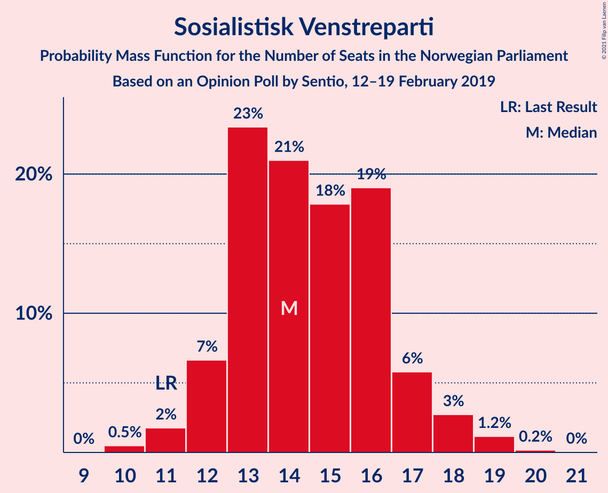
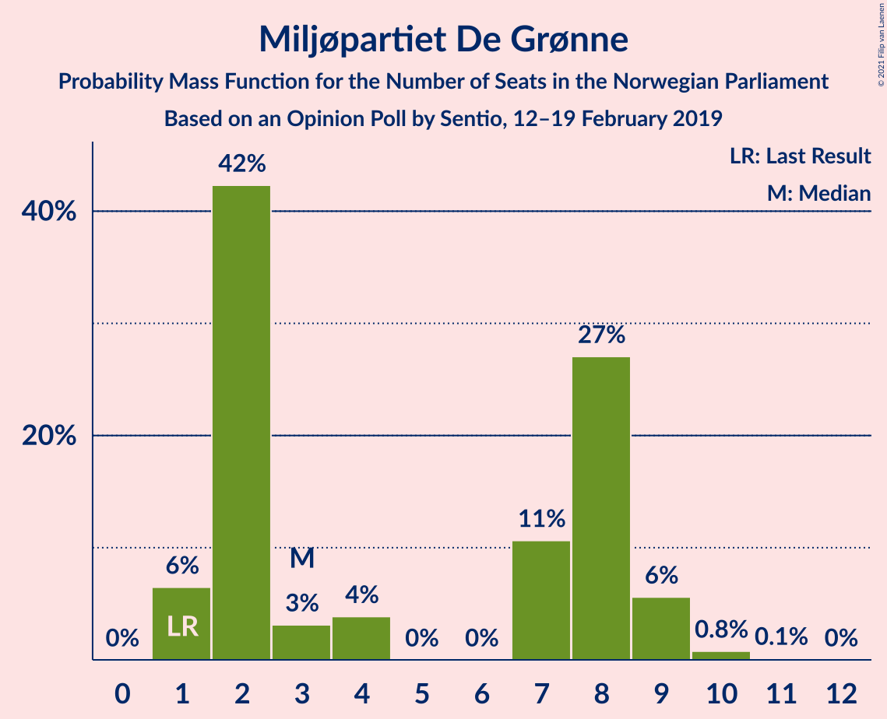
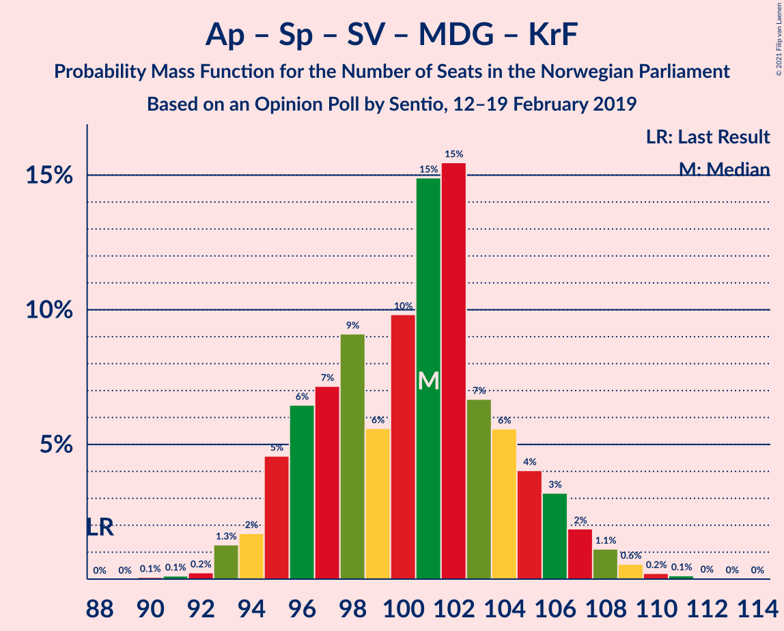
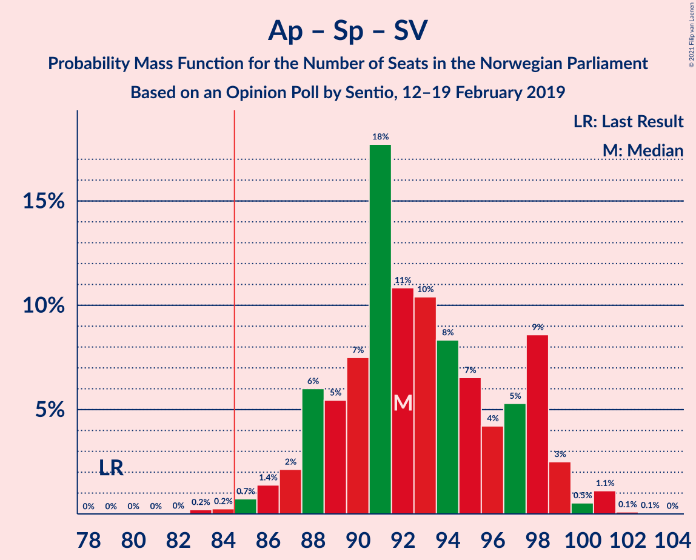
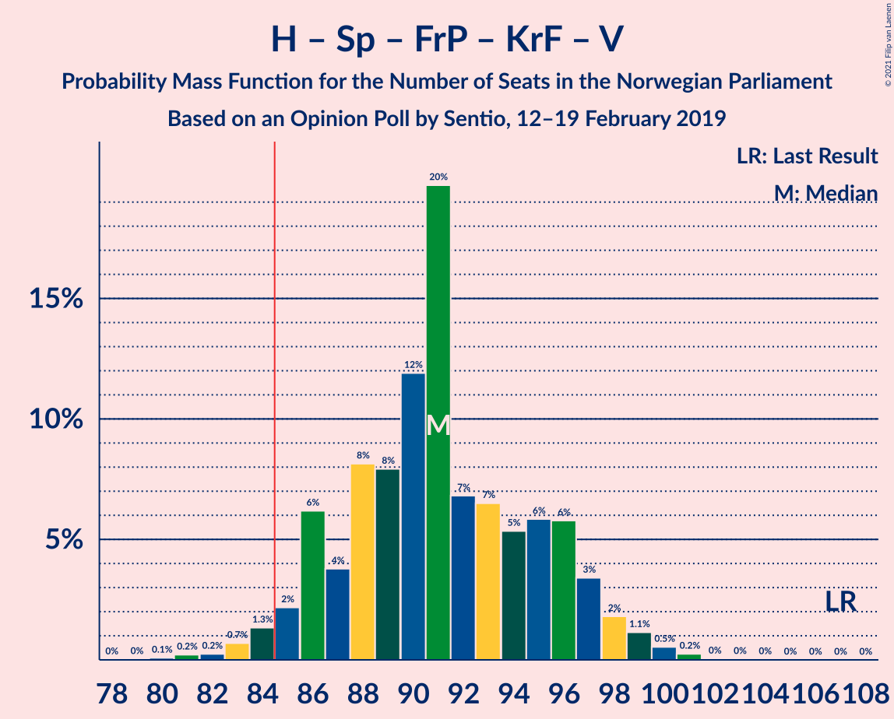
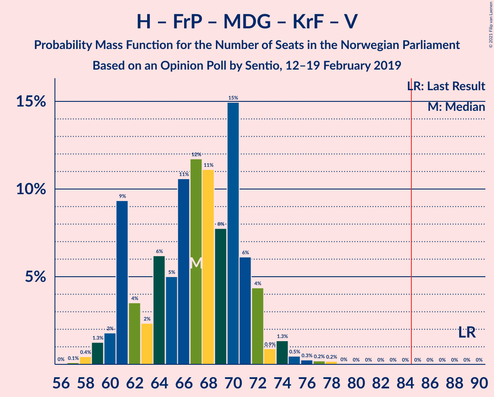

# Opinion Poll by Sentio, 12–19 February 2019

<a href="#voting-intentions">Voting Intentions</a> | <a href="#seats">Seats</a> | <a href="#coalitions">Coalitions</a> | <a href="#technical-information">Technical Information</a>

## Voting Intentions

### Confidence Intervals

| Party | Last Result | Poll Result | 80% Confidence Interval | 90% Confidence Interval | 95% Confidence Interval | 99% Confidence Interval |
|:-----:|:-----------:|:-----------:|:-----------------------:|:-----------------------:|:-----------------------:|:-----------------------:|
| Arbeiderpartiet | 27.4% | 27.4% | 25.6–29.3% |25.1–29.8% |24.7–30.3% |23.9–31.2% |
| Høyre | 25.0% | 21.1% | 19.5–22.8% |19.1–23.3% |18.7–23.7% |17.9–24.6% |
| Senterpartiet | 10.3% | 15.6% | 14.2–17.2% |13.8–17.6% |13.5–18.0% |12.8–18.8% |
| Fremskrittspartiet | 15.2% | 10.8% | 9.6–12.2% |9.3–12.5% |9.0–12.9% |8.5–13.6% |
| Sosialistisk Venstreparti | 6.0% | 8.0% | 7.0–9.2% |6.7–9.6% |6.5–9.9% |6.0–10.5% |
| Rødt | 2.4% | 5.1% | 4.3–6.1% |4.1–6.4% |3.9–6.6% |3.6–7.2% |
| Miljøpartiet De Grønne | 3.2% | 3.9% | 3.2–4.8% |3.0–5.1% |2.9–5.3% |2.6–5.8% |
| Kristelig Folkeparti | 4.2% | 3.4% | 2.8–4.3% |2.6–4.5% |2.4–4.7% |2.2–5.2% |
| Venstre | 4.4% | 2.3% | 1.8–3.0% |1.6–3.2% |1.5–3.4% |1.3–3.8% |

*Note:* The poll result column reflects the actual value used in the calculations. Published results may vary slightly, and in addition be rounded to fewer digits.

## Seats

### Confidence Intervals

| Party | Last Result | Median | 80% Confidence Interval | 90% Confidence Interval | 95% Confidence Interval | 99% Confidence Interval |
|:-----:|:-----------:|:------:|:-----------------------:|:-----------------------:|:-----------------------:|:-----------------------:|
| <a href="#arbeiderpartiet">Arbeiderpartiet</a> | 49 | 50 | 46–53 |45–54 |44–55 |43–57 |
| <a href="#høyre">Høyre</a> | 45 | 39 | 35–42 |34–43 |33–43 |33–45 |
| <a href="#senterpartiet">Senterpartiet</a> | 19 | 29 | 26–32 |25–33 |24–34 |23–35 |
| <a href="#fremskrittspartiet">Fremskrittspartiet</a> | 27 | 19 | 17–21 |16–22 |16–23 |15–24 |
| <a href="#sosialistisk-venstreparti">Sosialistisk Venstreparti</a> | 11 | 14 | 13–16 |12–17 |12–18 |11–19 |
| <a href="#rødt">Rødt</a> | 1 | 9 | 8–11 |8–12 |7–12 |2–13 |
| <a href="#miljøpartiet-de-grønne">Miljøpartiet De Grønne</a> | 1 | 3 | 2–8 |1–9 |1–9 |1–10 |
| <a href="#kristelig-folkeparti">Kristelig Folkeparti</a> | 8 | 3 | 1–7 |1–8 |1–8 |1–9 |
| <a href="#venstre">Venstre</a> | 8 | 1 | 1–2 |0–2 |0–2 |0–2 |

### Arbeiderpartiet

*For a full overview of the results for this party, see the [Arbeiderpartiet](party-arbeiderpartiet.html) page.*

| Number of Seats | Probability | Accumulated | Special Marks |
|:---------------:|:-----------:|:-----------:|:-------------:|
| 42 | 0.1% | 100% |  |
| 43 | 0.6% | 99.9% |  |
| 44 | 4% | 99.3% |  |
| 45 | 5% | 96% |  |
| 46 | 6% | 91% |  |
| 47 | 9% | 84% |  |
| 48 | 14% | 76% |  |
| 49 | 7% | 62% | Last Result |
| 50 | 23% | 55% | Median |
| 51 | 8% | 31% |  |
| 52 | 9% | 24% |  |
| 53 | 8% | 15% |  |
| 54 | 4% | 7% |  |
| 55 | 1.1% | 3% |  |
| 56 | 1.2% | 2% |  |
| 57 | 0.6% | 0.8% |  |
| 58 | 0.2% | 0.2% |  |
| 59 | 0% | 0.1% |  |
| 60 | 0% | 0% |  |

### Høyre

*For a full overview of the results for this party, see the [Høyre](party-høyre.html) page.*

| Number of Seats | Probability | Accumulated | Special Marks |
|:---------------:|:-----------:|:-----------:|:-------------:|
| 30 | 0% | 100% |  |
| 31 | 0.1% | 99.9% |  |
| 32 | 0.3% | 99.8% |  |
| 33 | 3% | 99.5% |  |
| 34 | 2% | 97% |  |
| 35 | 4% | 94% |  |
| 36 | 12% | 90% |  |
| 37 | 12% | 78% |  |
| 38 | 12% | 66% |  |
| 39 | 25% | 54% | Median |
| 40 | 7% | 28% |  |
| 41 | 5% | 21% |  |
| 42 | 8% | 16% |  |
| 43 | 7% | 8% |  |
| 44 | 0.9% | 2% |  |
| 45 | 0.5% | 0.7% | Last Result |
| 46 | 0.2% | 0.2% |  |
| 47 | 0% | 0% |  |

### Senterpartiet

*For a full overview of the results for this party, see the [Senterpartiet](party-senterpartiet.html) page.*

| Number of Seats | Probability | Accumulated | Special Marks |
|:---------------:|:-----------:|:-----------:|:-------------:|
| 19 | 0% | 100% | Last Result |
| 20 | 0% | 100% |  |
| 21 | 0% | 100% |  |
| 22 | 0.3% | 99.9% |  |
| 23 | 0.9% | 99.7% |  |
| 24 | 2% | 98.8% |  |
| 25 | 5% | 97% |  |
| 26 | 13% | 92% |  |
| 27 | 15% | 79% |  |
| 28 | 13% | 64% |  |
| 29 | 12% | 51% | Median |
| 30 | 11% | 39% |  |
| 31 | 8% | 28% |  |
| 32 | 12% | 20% |  |
| 33 | 4% | 8% |  |
| 34 | 2% | 4% |  |
| 35 | 1.1% | 1.4% |  |
| 36 | 0.3% | 0.3% |  |
| 37 | 0% | 0% |  |

### Fremskrittspartiet

*For a full overview of the results for this party, see the [Fremskrittspartiet](party-fremskrittspartiet.html) page.*

| Number of Seats | Probability | Accumulated | Special Marks |
|:---------------:|:-----------:|:-----------:|:-------------:|
| 14 | 0.2% | 100% |  |
| 15 | 0.9% | 99.8% |  |
| 16 | 5% | 98.8% |  |
| 17 | 6% | 94% |  |
| 18 | 23% | 88% |  |
| 19 | 25% | 65% | Median |
| 20 | 9% | 40% |  |
| 21 | 22% | 31% |  |
| 22 | 5% | 9% |  |
| 23 | 2% | 4% |  |
| 24 | 2% | 2% |  |
| 25 | 0.2% | 0.2% |  |
| 26 | 0.1% | 0.1% |  |
| 27 | 0% | 0% | Last Result |

### Sosialistisk Venstreparti

*For a full overview of the results for this party, see the [Sosialistisk Venstreparti](party-sosialistiskvenstreparti.html) page.*

| Number of Seats | Probability | Accumulated | Special Marks |
|:---------------:|:-----------:|:-----------:|:-------------:|
| 10 | 0.5% | 100% |  |
| 11 | 2% | 99.5% | Last Result |
| 12 | 7% | 98% |  |
| 13 | 23% | 91% |  |
| 14 | 21% | 68% | Median |
| 15 | 18% | 47% |  |
| 16 | 19% | 29% |  |
| 17 | 6% | 10% |  |
| 18 | 3% | 4% |  |
| 19 | 1.2% | 1.4% |  |
| 20 | 0.2% | 0.2% |  |
| 21 | 0% | 0% |  |

### Rødt

*For a full overview of the results for this party, see the [Rødt](party-rødt.html) page.*

| Number of Seats | Probability | Accumulated | Special Marks |
|:---------------:|:-----------:|:-----------:|:-------------:|
| 1 | 0% | 100% | Last Result |
| 2 | 2% | 100% |  |
| 3 | 0% | 98% |  |
| 4 | 0% | 98% |  |
| 5 | 0% | 98% |  |
| 6 | 0% | 98% |  |
| 7 | 2% | 98% |  |
| 8 | 23% | 96% |  |
| 9 | 28% | 73% | Median |
| 10 | 25% | 45% |  |
| 11 | 14% | 20% |  |
| 12 | 5% | 6% |  |
| 13 | 0.6% | 0.8% |  |
| 14 | 0.1% | 0.1% |  |
| 15 | 0% | 0% |  |

### Miljøpartiet De Grønne

*For a full overview of the results for this party, see the [Miljøpartiet De Grønne](party-miljøpartietdegrønne.html) page.*

| Number of Seats | Probability | Accumulated | Special Marks |
|:---------------:|:-----------:|:-----------:|:-------------:|
| 1 | 6% | 100% | Last Result |
| 2 | 42% | 94% |  |
| 3 | 3% | 51% | Median |
| 4 | 4% | 48% |  |
| 5 | 0% | 44% |  |
| 6 | 0% | 44% |  |
| 7 | 11% | 44% |  |
| 8 | 27% | 34% |  |
| 9 | 6% | 7% |  |
| 10 | 0.8% | 0.9% |  |
| 11 | 0.1% | 0.1% |  |
| 12 | 0% | 0% |  |

### Kristelig Folkeparti

*For a full overview of the results for this party, see the [Kristelig Folkeparti](party-kristeligfolkeparti.html) page.*

| Number of Seats | Probability | Accumulated | Special Marks |
|:---------------:|:-----------:|:-----------:|:-------------:|
| 0 | 0.4% | 100% |  |
| 1 | 34% | 99.6% |  |
| 2 | 7% | 66% |  |
| 3 | 42% | 59% | Median |
| 4 | 0% | 17% |  |
| 5 | 0% | 17% |  |
| 6 | 0% | 17% |  |
| 7 | 7% | 17% |  |
| 8 | 9% | 10% | Last Result |
| 9 | 1.1% | 1.2% |  |
| 10 | 0.1% | 0.1% |  |
| 11 | 0% | 0% |  |

### Venstre

*For a full overview of the results for this party, see the [Venstre](party-venstre.html) page.*

| Number of Seats | Probability | Accumulated | Special Marks |
|:---------------:|:-----------:|:-----------:|:-------------:|
| 0 | 9% | 100% |  |
| 1 | 43% | 91% | Median |
| 2 | 47% | 47% |  |
| 3 | 0.1% | 0.2% |  |
| 4 | 0% | 0.1% |  |
| 5 | 0% | 0.1% |  |
| 6 | 0% | 0.1% |  |
| 7 | 0.1% | 0.1% |  |
| 8 | 0% | 0% | Last Result |

## Coalitions

### Confidence Intervals

| Coalition | Last Result | Median | Majority? | 80% Confidence Interval | 90% Confidence Interval | 95% Confidence Interval | 99% Confidence Interval |
|:---------:|:-----------:|:------:|:---------:|:-----------------------:|:-----------------------:|:-----------------------:|:-----------------------:|
| Arbeiderpartiet – Senterpartiet – Sosialistisk Venstreparti – Rødt – Miljøpartiet De Grønne | 81 | 107 | 100% | 103–110 | 101–112 | 100–112 | 98–114 |
| Arbeiderpartiet – Senterpartiet – Sosialistisk Venstreparti – Rødt | 80 | 102 | 100% | 98–108 | 97–108 | 96–109 | 93–111 |
| Arbeiderpartiet – Senterpartiet – Sosialistisk Venstreparti – Miljøpartiet De Grønne – Kristelig Folkeparti | 88 | 101 | 100% | 96–105 | 95–106 | 94–107 | 93–109 |
| Arbeiderpartiet – Senterpartiet – Sosialistisk Venstreparti – Miljøpartiet De Grønne | 80 | 98 | 100% | 93–101 | 92–102 | 90–103 | 89–105 |
| Arbeiderpartiet – Senterpartiet – Sosialistisk Venstreparti | 79 | 92 | 99.5% | 88–98 | 88–98 | 86–99 | 84–101 |
| Høyre – Senterpartiet – Fremskrittspartiet – Kristelig Folkeparti – Venstre | 107 | 91 | 97% | 86–96 | 86–97 | 84–98 | 82–100 |
| Arbeiderpartiet – Senterpartiet – Miljøpartiet De Grønne – Kristelig Folkeparti | 77 | 86 | 69% | 81–90 | 80–92 | 79–94 | 77–96 |
| Arbeiderpartiet – Senterpartiet – Kristelig Folkeparti | 76 | 81 | 18% | 77–86 | 76–87 | 74–88 | 73–91 |
| Arbeiderpartiet – Senterpartiet | 68 | 78 | 2% | 74–82 | 73–83 | 72–84 | 70–86 |
| Høyre – Fremskrittspartiet – Miljøpartiet De Grønne – Kristelig Folkeparti – Venstre | 89 | 67 | 0% | 61–71 | 61–72 | 60–73 | 58–76 |
| Arbeiderpartiet – Sosialistisk Venstreparti | 60 | 64 | 0% | 60–68 | 59–69 | 58–70 | 57–72 |
| Høyre – Fremskrittspartiet – Kristelig Folkeparti – Venstre | 88 | 62 | 0% | 59–66 | 57–68 | 57–69 | 55–71 |
| Høyre – Fremskrittspartiet – Venstre | 80 | 59 | 0% | 55–64 | 54–64 | 53–65 | 51–67 |
| Høyre – Fremskrittspartiet | 72 | 57 | 0% | 54–62 | 53–63 | 52–64 | 50–66 |
| Høyre – Kristelig Folkeparti – Venstre | 61 | 43 | 0% | 40–47 | 38–48 | 38–49 | 36–51 |
| Senterpartiet – Kristelig Folkeparti – Venstre | 35 | 33 | 0% | 29–37 | 29–39 | 27–41 | 26–43 |

### Arbeiderpartiet – Senterpartiet – Sosialistisk Venstreparti – Rødt – Miljøpartiet De Grønne

| Number of Seats | Probability | Accumulated | Special Marks |
|:---------------:|:-----------:|:-----------:|:-------------:|
| 81 | 0% | 100% | Last Result |
| 82 | 0% | 100% |  |
| 83 | 0% | 100% |  |
| 84 | 0% | 100% |  |
| 85 | 0% | 100% | Majority |
| 86 | 0% | 100% |  |
| 87 | 0% | 100% |  |
| 88 | 0% | 100% |  |
| 89 | 0% | 100% |  |
| 90 | 0% | 100% |  |
| 91 | 0% | 100% |  |
| 92 | 0% | 100% |  |
| 93 | 0% | 100% |  |
| 94 | 0% | 100% |  |
| 95 | 0% | 99.9% |  |
| 96 | 0.1% | 99.9% |  |
| 97 | 0.3% | 99.9% |  |
| 98 | 0.2% | 99.5% |  |
| 99 | 2% | 99.3% |  |
| 100 | 2% | 98% |  |
| 101 | 3% | 95% |  |
| 102 | 2% | 93% |  |
| 103 | 8% | 91% |  |
| 104 | 9% | 83% |  |
| 105 | 6% | 74% | Median |
| 106 | 9% | 68% |  |
| 107 | 19% | 59% |  |
| 108 | 8% | 40% |  |
| 109 | 7% | 31% |  |
| 110 | 16% | 25% |  |
| 111 | 4% | 9% |  |
| 112 | 3% | 5% |  |
| 113 | 1.1% | 2% |  |
| 114 | 0.9% | 1.3% |  |
| 115 | 0.2% | 0.4% |  |
| 116 | 0.1% | 0.2% |  |
| 117 | 0.1% | 0.1% |  |
| 118 | 0% | 0% |  |

### Arbeiderpartiet – Senterpartiet – Sosialistisk Venstreparti – Rødt

| Number of Seats | Probability | Accumulated | Special Marks |
|:---------------:|:-----------:|:-----------:|:-------------:|
| 80 | 0% | 100% | Last Result |
| 81 | 0% | 100% |  |
| 82 | 0% | 100% |  |
| 83 | 0% | 100% |  |
| 84 | 0% | 100% |  |
| 85 | 0% | 100% | Majority |
| 86 | 0% | 100% |  |
| 87 | 0% | 100% |  |
| 88 | 0% | 100% |  |
| 89 | 0% | 100% |  |
| 90 | 0% | 100% |  |
| 91 | 0.2% | 100% |  |
| 92 | 0.2% | 99.8% |  |
| 93 | 0.3% | 99.6% |  |
| 94 | 0.5% | 99.3% |  |
| 95 | 1.4% | 98.9% |  |
| 96 | 0.9% | 98% |  |
| 97 | 4% | 97% |  |
| 98 | 6% | 92% |  |
| 99 | 15% | 86% |  |
| 100 | 8% | 71% |  |
| 101 | 11% | 63% |  |
| 102 | 12% | 52% | Median |
| 103 | 11% | 40% |  |
| 104 | 5% | 30% |  |
| 105 | 6% | 25% |  |
| 106 | 2% | 19% |  |
| 107 | 3% | 16% |  |
| 108 | 9% | 13% |  |
| 109 | 2% | 4% |  |
| 110 | 1.3% | 2% |  |
| 111 | 0.4% | 0.6% |  |
| 112 | 0.1% | 0.1% |  |
| 113 | 0% | 0% |  |

### Arbeiderpartiet – Senterpartiet – Sosialistisk Venstreparti – Miljøpartiet De Grønne – Kristelig Folkeparti

| Number of Seats | Probability | Accumulated | Special Marks |
|:---------------:|:-----------:|:-----------:|:-------------:|
| 88 | 0% | 100% | Last Result |
| 89 | 0% | 100% |  |
| 90 | 0.1% | 100% |  |
| 91 | 0.1% | 99.9% |  |
| 92 | 0.2% | 99.8% |  |
| 93 | 1.3% | 99.6% |  |
| 94 | 2% | 98% |  |
| 95 | 5% | 97% |  |
| 96 | 6% | 92% |  |
| 97 | 7% | 86% |  |
| 98 | 9% | 78% |  |
| 99 | 6% | 69% | Median |
| 100 | 10% | 64% |  |
| 101 | 15% | 54% |  |
| 102 | 15% | 39% |  |
| 103 | 7% | 23% |  |
| 104 | 6% | 17% |  |
| 105 | 4% | 11% |  |
| 106 | 3% | 7% |  |
| 107 | 2% | 4% |  |
| 108 | 1.1% | 2% |  |
| 109 | 0.6% | 1.0% |  |
| 110 | 0.2% | 0.4% |  |
| 111 | 0.1% | 0.2% |  |
| 112 | 0% | 0.1% |  |
| 113 | 0% | 0% |  |

### Arbeiderpartiet – Senterpartiet – Sosialistisk Venstreparti – Miljøpartiet De Grønne

| Number of Seats | Probability | Accumulated | Special Marks |
|:---------------:|:-----------:|:-----------:|:-------------:|
| 80 | 0% | 100% | Last Result |
| 81 | 0% | 100% |  |
| 82 | 0% | 100% |  |
| 83 | 0% | 100% |  |
| 84 | 0% | 100% |  |
| 85 | 0% | 100% | Majority |
| 86 | 0% | 100% |  |
| 87 | 0.1% | 100% |  |
| 88 | 0.1% | 99.9% |  |
| 89 | 0.4% | 99.8% |  |
| 90 | 2% | 99.4% |  |
| 91 | 1.0% | 97% |  |
| 92 | 3% | 96% |  |
| 93 | 5% | 94% |  |
| 94 | 8% | 89% |  |
| 95 | 12% | 81% |  |
| 96 | 7% | 70% | Median |
| 97 | 9% | 62% |  |
| 98 | 10% | 54% |  |
| 99 | 20% | 44% |  |
| 100 | 12% | 24% |  |
| 101 | 4% | 13% |  |
| 102 | 4% | 9% |  |
| 103 | 2% | 4% |  |
| 104 | 1.2% | 2% |  |
| 105 | 0.6% | 0.9% |  |
| 106 | 0.2% | 0.4% |  |
| 107 | 0.1% | 0.2% |  |
| 108 | 0.1% | 0.1% |  |
| 109 | 0% | 0% |  |

### Arbeiderpartiet – Senterpartiet – Sosialistisk Venstreparti

| Number of Seats | Probability | Accumulated | Special Marks |
|:---------------:|:-----------:|:-----------:|:-------------:|
| 79 | 0% | 100% | Last Result |
| 80 | 0% | 100% |  |
| 81 | 0% | 100% |  |
| 82 | 0% | 100% |  |
| 83 | 0.2% | 100% |  |
| 84 | 0.2% | 99.7% |  |
| 85 | 0.7% | 99.5% | Majority |
| 86 | 1.4% | 98.8% |  |
| 87 | 2% | 97% |  |
| 88 | 6% | 95% |  |
| 89 | 5% | 89% |  |
| 90 | 7% | 84% |  |
| 91 | 18% | 76% |  |
| 92 | 11% | 59% |  |
| 93 | 10% | 48% | Median |
| 94 | 8% | 37% |  |
| 95 | 7% | 29% |  |
| 96 | 4% | 22% |  |
| 97 | 5% | 18% |  |
| 98 | 9% | 13% |  |
| 99 | 3% | 4% |  |
| 100 | 0.5% | 2% |  |
| 101 | 1.1% | 1.3% |  |
| 102 | 0.1% | 0.2% |  |
| 103 | 0.1% | 0.1% |  |
| 104 | 0% | 0% |  |

### Høyre – Senterpartiet – Fremskrittspartiet – Kristelig Folkeparti – Venstre

| Number of Seats | Probability | Accumulated | Special Marks |
|:---------------:|:-----------:|:-----------:|:-------------:|
| 79 | 0% | 100% |  |
| 80 | 0.1% | 99.9% |  |
| 81 | 0.2% | 99.9% |  |
| 82 | 0.2% | 99.6% |  |
| 83 | 0.7% | 99.4% |  |
| 84 | 1.3% | 98.7% |  |
| 85 | 2% | 97% | Majority |
| 86 | 6% | 95% |  |
| 87 | 4% | 89% |  |
| 88 | 8% | 85% |  |
| 89 | 8% | 77% |  |
| 90 | 12% | 69% |  |
| 91 | 20% | 57% | Median |
| 92 | 7% | 38% |  |
| 93 | 7% | 31% |  |
| 94 | 5% | 24% |  |
| 95 | 6% | 19% |  |
| 96 | 6% | 13% |  |
| 97 | 3% | 7% |  |
| 98 | 2% | 4% |  |
| 99 | 1.1% | 2% |  |
| 100 | 0.5% | 0.9% |  |
| 101 | 0.2% | 0.4% |  |
| 102 | 0% | 0.1% |  |
| 103 | 0% | 0.1% |  |
| 104 | 0% | 0% |  |
| 105 | 0% | 0% |  |
| 106 | 0% | 0% |  |
| 107 | 0% | 0% | Last Result |

### Arbeiderpartiet – Senterpartiet – Miljøpartiet De Grønne – Kristelig Folkeparti

| Number of Seats | Probability | Accumulated | Special Marks |
|:---------------:|:-----------:|:-----------:|:-------------:|
| 75 | 0% | 100% |  |
| 76 | 0.1% | 99.9% |  |
| 77 | 0.5% | 99.8% | Last Result |
| 78 | 1.4% | 99.3% |  |
| 79 | 1.3% | 98% |  |
| 80 | 4% | 97% |  |
| 81 | 3% | 92% |  |
| 82 | 10% | 89% |  |
| 83 | 4% | 79% |  |
| 84 | 6% | 75% |  |
| 85 | 14% | 69% | Median, Majority |
| 86 | 12% | 55% |  |
| 87 | 10% | 43% |  |
| 88 | 6% | 33% |  |
| 89 | 11% | 26% |  |
| 90 | 6% | 15% |  |
| 91 | 3% | 10% |  |
| 92 | 2% | 7% |  |
| 93 | 2% | 5% |  |
| 94 | 2% | 3% |  |
| 95 | 0.5% | 1.3% |  |
| 96 | 0.6% | 0.8% |  |
| 97 | 0.1% | 0.2% |  |
| 98 | 0.1% | 0.1% |  |
| 99 | 0% | 0.1% |  |
| 100 | 0% | 0% |  |

### Arbeiderpartiet – Senterpartiet – Kristelig Folkeparti

| Number of Seats | Probability | Accumulated | Special Marks |
|:---------------:|:-----------:|:-----------:|:-------------:|
| 70 | 0% | 100% |  |
| 71 | 0% | 99.9% |  |
| 72 | 0.1% | 99.9% |  |
| 73 | 0.4% | 99.8% |  |
| 74 | 2% | 99.3% |  |
| 75 | 2% | 97% |  |
| 76 | 3% | 96% | Last Result |
| 77 | 7% | 93% |  |
| 78 | 10% | 86% |  |
| 79 | 6% | 76% |  |
| 80 | 14% | 70% |  |
| 81 | 10% | 56% |  |
| 82 | 8% | 46% | Median |
| 83 | 11% | 38% |  |
| 84 | 9% | 27% |  |
| 85 | 7% | 18% | Majority |
| 86 | 5% | 11% |  |
| 87 | 3% | 6% |  |
| 88 | 2% | 3% |  |
| 89 | 0.6% | 2% |  |
| 90 | 0.4% | 1.0% |  |
| 91 | 0.1% | 0.5% |  |
| 92 | 0.2% | 0.4% |  |
| 93 | 0.1% | 0.1% |  |
| 94 | 0.1% | 0.1% |  |
| 95 | 0% | 0% |  |

### Arbeiderpartiet – Senterpartiet

| Number of Seats | Probability | Accumulated | Special Marks |
|:---------------:|:-----------:|:-----------:|:-------------:|
| 68 | 0.1% | 100% | Last Result |
| 69 | 0.2% | 99.9% |  |
| 70 | 0.4% | 99.7% |  |
| 71 | 0.6% | 99.3% |  |
| 72 | 2% | 98.7% |  |
| 73 | 5% | 97% |  |
| 74 | 4% | 92% |  |
| 75 | 9% | 88% |  |
| 76 | 10% | 79% |  |
| 77 | 8% | 69% |  |
| 78 | 12% | 61% |  |
| 79 | 17% | 49% | Median |
| 80 | 5% | 32% |  |
| 81 | 7% | 27% |  |
| 82 | 12% | 20% |  |
| 83 | 4% | 8% |  |
| 84 | 2% | 4% |  |
| 85 | 2% | 2% | Majority |
| 86 | 0.3% | 0.7% |  |
| 87 | 0.3% | 0.4% |  |
| 88 | 0.1% | 0.1% |  |
| 89 | 0% | 0% |  |

### Høyre – Fremskrittspartiet – Miljøpartiet De Grønne – Kristelig Folkeparti – Venstre

| Number of Seats | Probability | Accumulated | Special Marks |
|:---------------:|:-----------:|:-----------:|:-------------:|
| 57 | 0.1% | 100% |  |
| 58 | 0.4% | 99.9% |  |
| 59 | 1.3% | 99.4% |  |
| 60 | 2% | 98% |  |
| 61 | 9% | 96% |  |
| 62 | 4% | 87% |  |
| 63 | 2% | 84% |  |
| 64 | 6% | 81% |  |
| 65 | 5% | 75% | Median |
| 66 | 11% | 70% |  |
| 67 | 12% | 59% |  |
| 68 | 11% | 48% |  |
| 69 | 8% | 37% |  |
| 70 | 15% | 29% |  |
| 71 | 6% | 14% |  |
| 72 | 4% | 8% |  |
| 73 | 0.9% | 3% |  |
| 74 | 1.3% | 2% |  |
| 75 | 0.5% | 1.1% |  |
| 76 | 0.3% | 0.7% |  |
| 77 | 0.2% | 0.4% |  |
| 78 | 0.2% | 0.2% |  |
| 79 | 0% | 0% |  |
| 80 | 0% | 0% |  |
| 81 | 0% | 0% |  |
| 82 | 0% | 0% |  |
| 83 | 0% | 0% |  |
| 84 | 0% | 0% |  |
| 85 | 0% | 0% | Majority |
| 86 | 0% | 0% |  |
| 87 | 0% | 0% |  |
| 88 | 0% | 0% |  |
| 89 | 0% | 0% | Last Result |

### Arbeiderpartiet – Sosialistisk Venstreparti

| Number of Seats | Probability | Accumulated | Special Marks |
|:---------------:|:-----------:|:-----------:|:-------------:|
| 55 | 0.1% | 100% |  |
| 56 | 0.2% | 99.9% |  |
| 57 | 0.8% | 99.7% |  |
| 58 | 3% | 98.9% |  |
| 59 | 4% | 96% |  |
| 60 | 3% | 92% | Last Result |
| 61 | 13% | 89% |  |
| 62 | 9% | 76% |  |
| 63 | 12% | 67% |  |
| 64 | 11% | 55% | Median |
| 65 | 12% | 44% |  |
| 66 | 15% | 33% |  |
| 67 | 6% | 17% |  |
| 68 | 5% | 12% |  |
| 69 | 3% | 7% |  |
| 70 | 2% | 4% |  |
| 71 | 1.1% | 2% |  |
| 72 | 0.6% | 0.8% |  |
| 73 | 0.1% | 0.2% |  |
| 74 | 0% | 0.1% |  |
| 75 | 0% | 0% |  |

### Høyre – Fremskrittspartiet – Kristelig Folkeparti – Venstre

| Number of Seats | Probability | Accumulated | Special Marks |
|:---------------:|:-----------:|:-----------:|:-------------:|
| 52 | 0.1% | 100% |  |
| 53 | 0.1% | 99.9% |  |
| 54 | 0.2% | 99.8% |  |
| 55 | 0.9% | 99.6% |  |
| 56 | 1.1% | 98.7% |  |
| 57 | 3% | 98% |  |
| 58 | 4% | 95% |  |
| 59 | 16% | 91% |  |
| 60 | 7% | 75% |  |
| 61 | 8% | 69% |  |
| 62 | 19% | 60% | Median |
| 63 | 9% | 41% |  |
| 64 | 6% | 32% |  |
| 65 | 9% | 26% |  |
| 66 | 8% | 17% |  |
| 67 | 2% | 9% |  |
| 68 | 3% | 7% |  |
| 69 | 2% | 4% |  |
| 70 | 2% | 2% |  |
| 71 | 0.2% | 0.6% |  |
| 72 | 0.3% | 0.5% |  |
| 73 | 0.1% | 0.1% |  |
| 74 | 0% | 0.1% |  |
| 75 | 0% | 0.1% |  |
| 76 | 0% | 0% |  |
| 77 | 0% | 0% |  |
| 78 | 0% | 0% |  |
| 79 | 0% | 0% |  |
| 80 | 0% | 0% |  |
| 81 | 0% | 0% |  |
| 82 | 0% | 0% |  |
| 83 | 0% | 0% |  |
| 84 | 0% | 0% |  |
| 85 | 0% | 0% | Majority |
| 86 | 0% | 0% |  |
| 87 | 0% | 0% |  |
| 88 | 0% | 0% | Last Result |

### Høyre – Fremskrittspartiet – Venstre

| Number of Seats | Probability | Accumulated | Special Marks |
|:---------------:|:-----------:|:-----------:|:-------------:|
| 49 | 0.1% | 100% |  |
| 50 | 0.2% | 99.9% |  |
| 51 | 0.5% | 99.8% |  |
| 52 | 1.3% | 99.3% |  |
| 53 | 1.4% | 98% |  |
| 54 | 3% | 97% |  |
| 55 | 4% | 93% |  |
| 56 | 7% | 90% |  |
| 57 | 9% | 82% |  |
| 58 | 17% | 74% |  |
| 59 | 18% | 57% | Median |
| 60 | 8% | 39% |  |
| 61 | 6% | 31% |  |
| 62 | 6% | 25% |  |
| 63 | 7% | 19% |  |
| 64 | 7% | 12% |  |
| 65 | 2% | 5% |  |
| 66 | 1.4% | 2% |  |
| 67 | 0.6% | 0.9% |  |
| 68 | 0.2% | 0.3% |  |
| 69 | 0.1% | 0.1% |  |
| 70 | 0% | 0% |  |
| 71 | 0% | 0% |  |
| 72 | 0% | 0% |  |
| 73 | 0% | 0% |  |
| 74 | 0% | 0% |  |
| 75 | 0% | 0% |  |
| 76 | 0% | 0% |  |
| 77 | 0% | 0% |  |
| 78 | 0% | 0% |  |
| 79 | 0% | 0% |  |
| 80 | 0% | 0% | Last Result |

### Høyre – Fremskrittspartiet

| Number of Seats | Probability | Accumulated | Special Marks |
|:---------------:|:-----------:|:-----------:|:-------------:|
| 48 | 0.1% | 100% |  |
| 49 | 0.1% | 99.9% |  |
| 50 | 1.1% | 99.8% |  |
| 51 | 0.7% | 98.6% |  |
| 52 | 2% | 98% |  |
| 53 | 3% | 96% |  |
| 54 | 3% | 92% |  |
| 55 | 11% | 89% |  |
| 56 | 6% | 78% |  |
| 57 | 25% | 72% |  |
| 58 | 11% | 47% | Median |
| 59 | 7% | 36% |  |
| 60 | 7% | 29% |  |
| 61 | 7% | 22% |  |
| 62 | 8% | 15% |  |
| 63 | 4% | 7% |  |
| 64 | 2% | 3% |  |
| 65 | 0.7% | 1.3% |  |
| 66 | 0.3% | 0.6% |  |
| 67 | 0.2% | 0.3% |  |
| 68 | 0.1% | 0.1% |  |
| 69 | 0% | 0% |  |
| 70 | 0% | 0% |  |
| 71 | 0% | 0% |  |
| 72 | 0% | 0% | Last Result |

### Høyre – Kristelig Folkeparti – Venstre

| Number of Seats | Probability | Accumulated | Special Marks |
|:---------------:|:-----------:|:-----------:|:-------------:|
| 35 | 0.3% | 100% |  |
| 36 | 0.3% | 99.7% |  |
| 37 | 1.1% | 99.4% |  |
| 38 | 4% | 98% |  |
| 39 | 3% | 94% |  |
| 40 | 9% | 91% |  |
| 41 | 20% | 82% |  |
| 42 | 7% | 62% |  |
| 43 | 14% | 56% | Median |
| 44 | 12% | 41% |  |
| 45 | 10% | 29% |  |
| 46 | 9% | 19% |  |
| 47 | 4% | 10% |  |
| 48 | 2% | 6% |  |
| 49 | 2% | 4% |  |
| 50 | 0.5% | 1.1% |  |
| 51 | 0.2% | 0.6% |  |
| 52 | 0.3% | 0.4% |  |
| 53 | 0.1% | 0.1% |  |
| 54 | 0.1% | 0.1% |  |
| 55 | 0% | 0% |  |
| 56 | 0% | 0% |  |
| 57 | 0% | 0% |  |
| 58 | 0% | 0% |  |
| 59 | 0% | 0% |  |
| 60 | 0% | 0% |  |
| 61 | 0% | 0% | Last Result |

### Senterpartiet – Kristelig Folkeparti – Venstre

| Number of Seats | Probability | Accumulated | Special Marks |
|:---------------:|:-----------:|:-----------:|:-------------:|
| 23 | 0.1% | 100% |  |
| 24 | 0.1% | 99.9% |  |
| 25 | 0.1% | 99.8% |  |
| 26 | 0.7% | 99.7% |  |
| 27 | 2% | 99.0% |  |
| 28 | 2% | 97% |  |
| 29 | 7% | 95% |  |
| 30 | 8% | 88% |  |
| 31 | 9% | 80% |  |
| 32 | 10% | 71% |  |
| 33 | 15% | 61% | Median |
| 34 | 18% | 46% |  |
| 35 | 8% | 28% | Last Result |
| 36 | 6% | 20% |  |
| 37 | 4% | 13% |  |
| 38 | 3% | 9% |  |
| 39 | 2% | 6% |  |
| 40 | 2% | 4% |  |
| 41 | 1.1% | 3% |  |
| 42 | 0.7% | 1.5% |  |
| 43 | 0.5% | 0.8% |  |
| 44 | 0.1% | 0.2% |  |
| 45 | 0.1% | 0.1% |  |
| 46 | 0% | 0% |  |

## Technical Information

### Opinion Poll

+ **Polling firm:** Sentio
+ **Commissioner(s):** —
+ **Fieldwork period:** 12–19 February 2019

### Calculations

+ **Sample size:** 1000
+ **Simulations done:** 1,048,576
+ **Error estimate:** 2.29%

