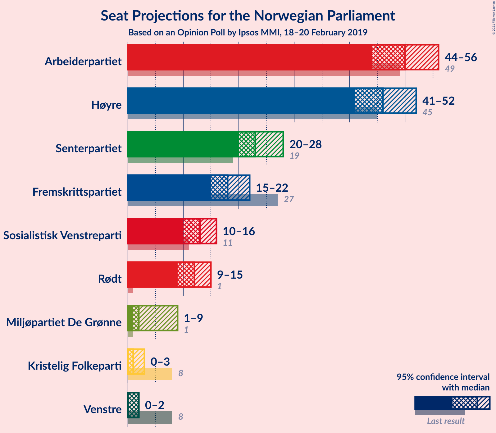
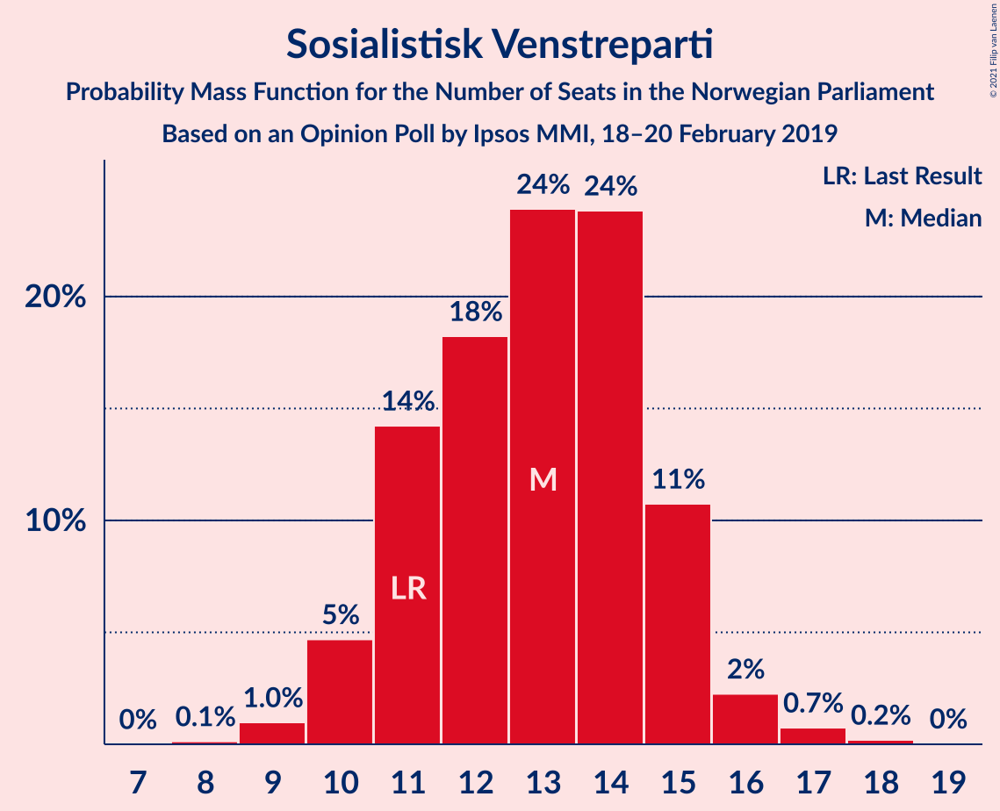
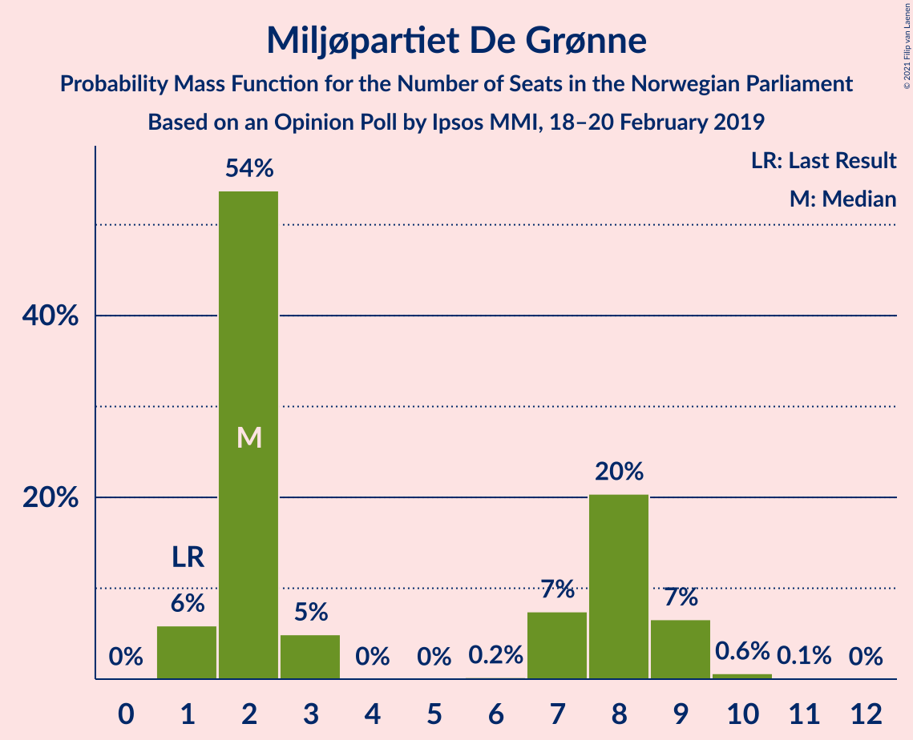
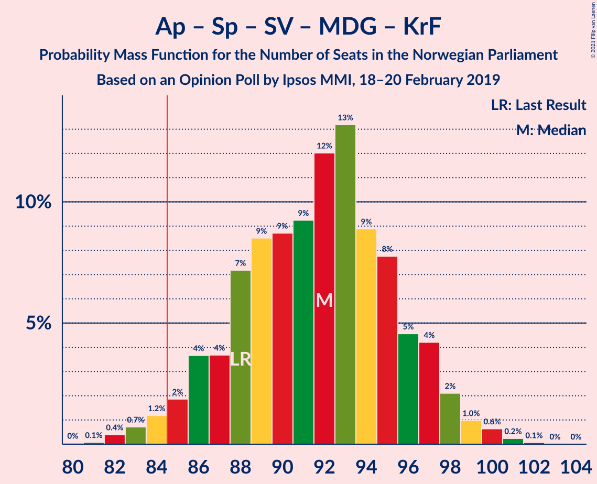
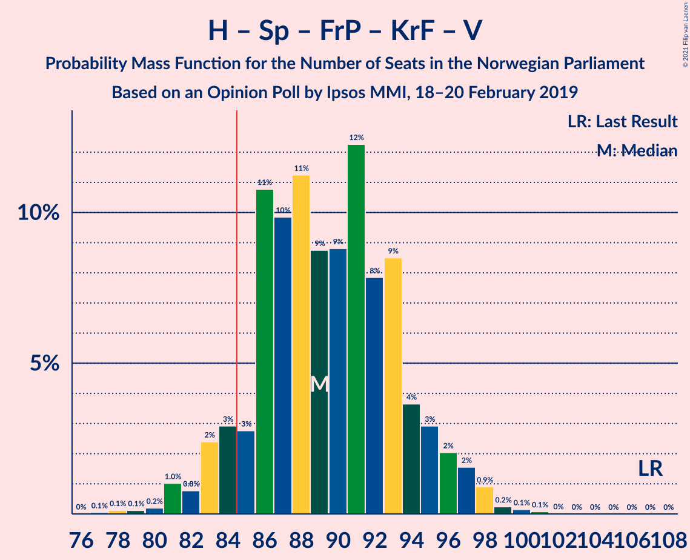
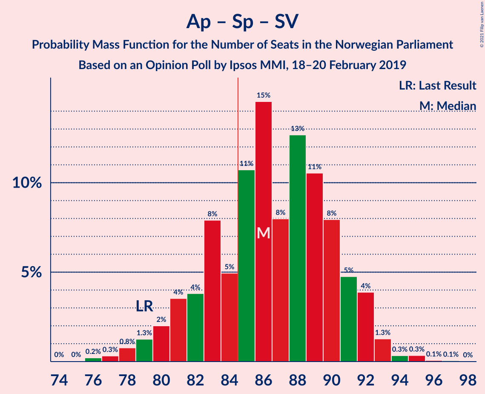
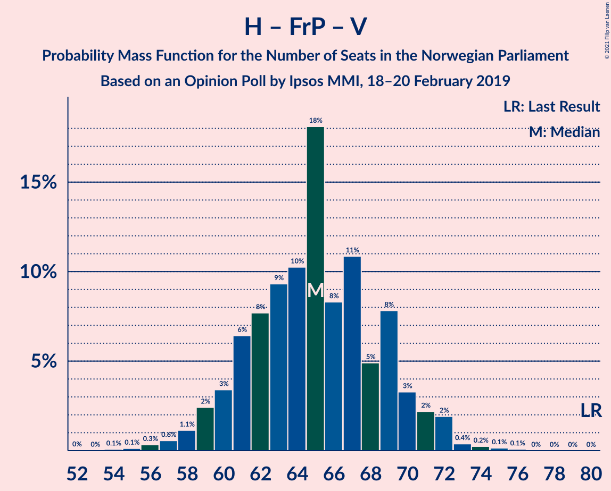

# Opinion Poll by Ipsos MMI, 18–20 February 2019

<a href="#voting-intentions">Voting Intentions</a> | <a href="#seats">Seats</a> | <a href="#coalitions">Coalitions</a> | <a href="#technical-information">Technical Information</a>

## Voting Intentions

### Confidence Intervals

| Party | Last Result | Poll Result | 80% Confidence Interval | 90% Confidence Interval | 95% Confidence Interval | 99% Confidence Interval |
|:-----:|:-----------:|:-----------:|:-----------------------:|:-----------------------:|:-----------------------:|:-----------------------:|
| Arbeiderpartiet | 27.4% | 26.9% | 25.1–28.9% |24.6–29.4% |24.2–29.9% |23.3–30.8% |
| Høyre | 25.0% | 25.1% | 23.4–27.0% |22.8–27.5% |22.4–28.0% |21.6–28.9% |
| Senterpartiet | 10.3% | 13.0% | 11.7–14.5% |11.3–14.9% |11.0–15.3% |10.4–16.0% |
| Fremskrittspartiet | 15.2% | 10.0% | 8.8–11.4% |8.5–11.7% |8.2–12.1% |7.7–12.8% |
| Sosialistisk Venstreparti | 6.0% | 7.0% | 6.0–8.2% |5.7–8.5% |5.5–8.8% |5.1–9.4% |
| Rødt | 2.4% | 6.7% | 5.7–7.8% |5.4–8.2% |5.2–8.4% |4.8–9.0% |
| Miljøpartiet De Grønne | 3.2% | 3.8% | 3.1–4.7% |2.9–5.0% |2.7–5.2% |2.4–5.7% |
| Kristelig Folkeparti | 4.2% | 2.5% | 1.9–3.3% |1.8–3.5% |1.6–3.7% |1.4–4.1% |
| Venstre | 4.4% | 2.3% | 1.7–3.0% |1.6–3.2% |1.5–3.4% |1.3–3.8% |

*Note:* The poll result column reflects the actual value used in the calculations. Published results may vary slightly, and in addition be rounded to fewer digits.

## Seats

### Confidence Intervals

| Party | Last Result | Median | 80% Confidence Interval | 90% Confidence Interval | 95% Confidence Interval | 99% Confidence Interval |
|:-----:|:-----------:|:------:|:-----------------------:|:-----------------------:|:-----------------------:|:-----------------------:|
| <a href="#arbeiderpartiet">Arbeiderpartiet</a> | 49 | 50 | 46–53 |45–54 |44–55 |43–56 |
| <a href="#høyre">Høyre</a> | 45 | 45 | 42–49 |42–49 |41–50 |39–52 |
| <a href="#senterpartiet">Senterpartiet</a> | 19 | 23 | 22–25 |21–26 |21–27 |19–30 |
| <a href="#fremskrittspartiet">Fremskrittspartiet</a> | 27 | 19 | 16–20 |16–21 |15–22 |14–24 |
| <a href="#sosialistisk-venstreparti">Sosialistisk Venstreparti</a> | 11 | 14 | 12–14 |11–15 |11–16 |9–16 |
| <a href="#rødt">Rødt</a> | 1 | 13 | 11–14 |10–14 |9–15 |9–16 |
| <a href="#miljøpartiet-de-grønne">Miljøpartiet De Grønne</a> | 1 | 2 | 2–8 |2–8 |1–9 |1–10 |
| <a href="#kristelig-folkeparti">Kristelig Folkeparti</a> | 8 | 1 | 0–1 |0–2 |0–3 |0–3 |
| <a href="#venstre">Venstre</a> | 8 | 2 | 1–2 |0–2 |0–2 |0–2 |

### Arbeiderpartiet

*For a full overview of the results for this party, see the [Arbeiderpartiet](party-arbeiderpartiet.html) page.*

| Number of Seats | Probability | Accumulated | Special Marks |
|:---------------:|:-----------:|:-----------:|:-------------:|
| 41 | 0.3% | 100% |  |
| 42 | 0.1% | 99.7% |  |
| 43 | 0.1% | 99.6% |  |
| 44 | 3% | 99.4% |  |
| 45 | 6% | 96% |  |
| 46 | 2% | 90% |  |
| 47 | 2% | 88% |  |
| 48 | 16% | 86% |  |
| 49 | 12% | 70% | Last Result |
| 50 | 25% | 58% | Median |
| 51 | 5% | 33% |  |
| 52 | 2% | 28% |  |
| 53 | 19% | 26% |  |
| 54 | 4% | 7% |  |
| 55 | 1.4% | 3% |  |
| 56 | 1.4% | 2% |  |
| 57 | 0.2% | 0.3% |  |
| 58 | 0.1% | 0.1% |  |
| 59 | 0% | 0% |  |

### Høyre

*For a full overview of the results for this party, see the [Høyre](party-høyre.html) page.*

| Number of Seats | Probability | Accumulated | Special Marks |
|:---------------:|:-----------:|:-----------:|:-------------:|
| 37 | 0% | 100% |  |
| 38 | 0.2% | 99.9% |  |
| 39 | 1.2% | 99.7% |  |
| 40 | 0.7% | 98% |  |
| 41 | 0.6% | 98% |  |
| 42 | 17% | 97% |  |
| 43 | 9% | 81% |  |
| 44 | 17% | 71% |  |
| 45 | 9% | 54% | Last Result, Median |
| 46 | 27% | 46% |  |
| 47 | 5% | 19% |  |
| 48 | 1.5% | 14% |  |
| 49 | 10% | 12% |  |
| 50 | 1.1% | 3% |  |
| 51 | 0.7% | 1.4% |  |
| 52 | 0.4% | 0.7% |  |
| 53 | 0.2% | 0.3% |  |
| 54 | 0.1% | 0.1% |  |
| 55 | 0% | 0% |  |

### Senterpartiet

*For a full overview of the results for this party, see the [Senterpartiet](party-senterpartiet.html) page.*

| Number of Seats | Probability | Accumulated | Special Marks |
|:---------------:|:-----------:|:-----------:|:-------------:|
| 18 | 0.2% | 100% |  |
| 19 | 0.4% | 99.8% | Last Result |
| 20 | 1.4% | 99.4% |  |
| 21 | 5% | 98% |  |
| 22 | 29% | 93% |  |
| 23 | 21% | 64% | Median |
| 24 | 16% | 43% |  |
| 25 | 22% | 27% |  |
| 26 | 2% | 5% |  |
| 27 | 0.8% | 3% |  |
| 28 | 1.0% | 2% |  |
| 29 | 0.4% | 1.0% |  |
| 30 | 0.1% | 0.6% |  |
| 31 | 0.4% | 0.5% |  |
| 32 | 0.1% | 0.1% |  |
| 33 | 0% | 0% |  |

### Fremskrittspartiet

*For a full overview of the results for this party, see the [Fremskrittspartiet](party-fremskrittspartiet.html) page.*

| Number of Seats | Probability | Accumulated | Special Marks |
|:---------------:|:-----------:|:-----------:|:-------------:|
| 12 | 0.1% | 100% |  |
| 13 | 0.1% | 99.9% |  |
| 14 | 0.4% | 99.8% |  |
| 15 | 4% | 99.3% |  |
| 16 | 9% | 95% |  |
| 17 | 11% | 86% |  |
| 18 | 24% | 76% |  |
| 19 | 41% | 51% | Median |
| 20 | 4% | 10% |  |
| 21 | 2% | 6% |  |
| 22 | 3% | 4% |  |
| 23 | 0.5% | 1.2% |  |
| 24 | 0.7% | 0.8% |  |
| 25 | 0% | 0% |  |
| 26 | 0% | 0% |  |
| 27 | 0% | 0% | Last Result |

### Sosialistisk Venstreparti

*For a full overview of the results for this party, see the [Sosialistisk Venstreparti](party-sosialistiskvenstreparti.html) page.*

| Number of Seats | Probability | Accumulated | Special Marks |
|:---------------:|:-----------:|:-----------:|:-------------:|
| 9 | 0.5% | 100% |  |
| 10 | 2% | 99.5% |  |
| 11 | 7% | 98% | Last Result |
| 12 | 4% | 91% |  |
| 13 | 30% | 87% |  |
| 14 | 49% | 57% | Median |
| 15 | 5% | 8% |  |
| 16 | 3% | 4% |  |
| 17 | 0.1% | 0.4% |  |
| 18 | 0.3% | 0.3% |  |
| 19 | 0% | 0% |  |

### Rødt

*For a full overview of the results for this party, see the [Rødt](party-rødt.html) page.*

| Number of Seats | Probability | Accumulated | Special Marks |
|:---------------:|:-----------:|:-----------:|:-------------:|
| 1 | 0% | 100% | Last Result |
| 2 | 0% | 100% |  |
| 3 | 0% | 100% |  |
| 4 | 0% | 100% |  |
| 5 | 0% | 100% |  |
| 6 | 0% | 100% |  |
| 7 | 0% | 100% |  |
| 8 | 0.4% | 100% |  |
| 9 | 4% | 99.6% |  |
| 10 | 3% | 95% |  |
| 11 | 17% | 92% |  |
| 12 | 22% | 75% |  |
| 13 | 42% | 54% | Median |
| 14 | 8% | 11% |  |
| 15 | 1.5% | 3% |  |
| 16 | 1.1% | 1.3% |  |
| 17 | 0.2% | 0.3% |  |
| 18 | 0% | 0% |  |

### Miljøpartiet De Grønne

*For a full overview of the results for this party, see the [Miljøpartiet De Grønne](party-miljøpartietdegrønne.html) page.*

| Number of Seats | Probability | Accumulated | Special Marks |
|:---------------:|:-----------:|:-----------:|:-------------:|
| 1 | 4% | 100% | Last Result |
| 2 | 57% | 96% | Median |
| 3 | 1.2% | 39% |  |
| 4 | 0% | 38% |  |
| 5 | 0% | 38% |  |
| 6 | 0.1% | 38% |  |
| 7 | 3% | 38% |  |
| 8 | 32% | 35% |  |
| 9 | 3% | 3% |  |
| 10 | 0.5% | 0.5% |  |
| 11 | 0% | 0% |  |

### Kristelig Folkeparti

*For a full overview of the results for this party, see the [Kristelig Folkeparti](party-kristeligfolkeparti.html) page.*

| Number of Seats | Probability | Accumulated | Special Marks |
|:---------------:|:-----------:|:-----------:|:-------------:|
| 0 | 30% | 100% |  |
| 1 | 60% | 70% | Median |
| 2 | 6% | 10% |  |
| 3 | 4% | 4% |  |
| 4 | 0% | 0.3% |  |
| 5 | 0% | 0.3% |  |
| 6 | 0% | 0.3% |  |
| 7 | 0.1% | 0.3% |  |
| 8 | 0.2% | 0.2% | Last Result |
| 9 | 0% | 0% |  |

### Venstre

*For a full overview of the results for this party, see the [Venstre](party-venstre.html) page.*

| Number of Seats | Probability | Accumulated | Special Marks |
|:---------------:|:-----------:|:-----------:|:-------------:|
| 0 | 7% | 100% |  |
| 1 | 31% | 93% |  |
| 2 | 61% | 61% | Median |
| 3 | 0% | 0.1% |  |
| 4 | 0% | 0.1% |  |
| 5 | 0% | 0.1% |  |
| 6 | 0% | 0.1% |  |
| 7 | 0.1% | 0.1% |  |
| 8 | 0% | 0% | Last Result |

## Coalitions

### Confidence Intervals

| Coalition | Last Result | Median | Majority? | 80% Confidence Interval | 90% Confidence Interval | 95% Confidence Interval | 99% Confidence Interval |
|:---------:|:-----------:|:------:|:---------:|:-----------------------:|:-----------------------:|:-----------------------:|:-----------------------:|
| Arbeiderpartiet – Senterpartiet – Sosialistisk Venstreparti – Rødt – Miljøpartiet De Grønne | 81 | 104 | 100% | 100–107 | 99–108 | 97–108 | 95–111 |
| Arbeiderpartiet – Senterpartiet – Sosialistisk Venstreparti – Rødt | 80 | 99 | 100% | 96–102 | 94–102 | 92–105 | 89–105 |
| Arbeiderpartiet – Senterpartiet – Sosialistisk Venstreparti – Miljøpartiet De Grønne – Kristelig Folkeparti | 88 | 92 | 99.4% | 89–95 | 88–97 | 86–98 | 84–99 |
| Arbeiderpartiet – Senterpartiet – Sosialistisk Venstreparti – Miljøpartiet De Grønne | 80 | 91 | 98.7% | 88–95 | 86–97 | 85–98 | 82–98 |
| Høyre – Senterpartiet – Fremskrittspartiet – Kristelig Folkeparti – Venstre | 107 | 89 | 93% | 86–93 | 83–94 | 83–95 | 81–97 |
| Arbeiderpartiet – Senterpartiet – Sosialistisk Venstreparti | 79 | 86 | 86% | 83–90 | 83–90 | 80–91 | 77–93 |
| Arbeiderpartiet – Senterpartiet – Miljøpartiet De Grønne – Kristelig Folkeparti | 77 | 78 | 5% | 75–82 | 74–84 | 72–85 | 70–87 |
| Arbeiderpartiet – Senterpartiet – Kristelig Folkeparti | 76 | 74 | 0% | 72–77 | 70–78 | 69–80 | 67–81 |
| Arbeiderpartiet – Senterpartiet | 68 | 73 | 0% | 70–76 | 69–77 | 68–79 | 66–80 |
| Høyre – Fremskrittspartiet – Miljøpartiet De Grønne – Kristelig Folkeparti – Venstre | 89 | 70 | 0% | 67–73 | 67–75 | 64–77 | 62–78 |
| Høyre – Fremskrittspartiet – Kristelig Folkeparti – Venstre | 88 | 65 | 0% | 62–69 | 61–69 | 61–71 | 58–73 |
| Høyre – Fremskrittspartiet – Venstre | 80 | 65 | 0% | 61–68 | 61–68 | 61–70 | 57–72 |
| Høyre – Fremskrittspartiet | 72 | 63 | 0% | 60–66 | 60–66 | 59–68 | 55–70 |
| Arbeiderpartiet – Sosialistisk Venstreparti | 60 | 64 | 0% | 59–67 | 58–67 | 57–67 | 55–69 |
| Høyre – Kristelig Folkeparti – Venstre | 61 | 47 | 0% | 44–52 | 43–52 | 43–52 | 40–55 |
| Senterpartiet – Kristelig Folkeparti – Venstre | 35 | 25 | 0% | 24–28 | 22–29 | 22–30 | 21–32 |

### Arbeiderpartiet – Senterpartiet – Sosialistisk Venstreparti – Rødt – Miljøpartiet De Grønne

| Number of Seats | Probability | Accumulated | Special Marks |
|:---------------:|:-----------:|:-----------:|:-------------:|
| 81 | 0% | 100% | Last Result |
| 82 | 0% | 100% |  |
| 83 | 0% | 100% |  |
| 84 | 0% | 100% |  |
| 85 | 0% | 100% | Majority |
| 86 | 0% | 100% |  |
| 87 | 0% | 100% |  |
| 88 | 0% | 100% |  |
| 89 | 0% | 100% |  |
| 90 | 0% | 100% |  |
| 91 | 0% | 99.9% |  |
| 92 | 0% | 99.9% |  |
| 93 | 0.1% | 99.9% |  |
| 94 | 0.1% | 99.8% |  |
| 95 | 0.6% | 99.7% |  |
| 96 | 0.9% | 99.1% |  |
| 97 | 1.0% | 98% |  |
| 98 | 0.6% | 97% |  |
| 99 | 2% | 97% |  |
| 100 | 9% | 95% |  |
| 101 | 29% | 86% |  |
| 102 | 3% | 57% | Median |
| 103 | 3% | 54% |  |
| 104 | 20% | 52% |  |
| 105 | 4% | 32% |  |
| 106 | 2% | 28% |  |
| 107 | 21% | 26% |  |
| 108 | 4% | 5% |  |
| 109 | 0.7% | 1.4% |  |
| 110 | 0.1% | 0.7% |  |
| 111 | 0.4% | 0.6% |  |
| 112 | 0.1% | 0.2% |  |
| 113 | 0.1% | 0.1% |  |
| 114 | 0% | 0% |  |

### Arbeiderpartiet – Senterpartiet – Sosialistisk Venstreparti – Rødt

| Number of Seats | Probability | Accumulated | Special Marks |
|:---------------:|:-----------:|:-----------:|:-------------:|
| 80 | 0% | 100% | Last Result |
| 81 | 0% | 100% |  |
| 82 | 0% | 100% |  |
| 83 | 0% | 100% |  |
| 84 | 0% | 100% |  |
| 85 | 0% | 100% | Majority |
| 86 | 0.1% | 99.9% |  |
| 87 | 0% | 99.9% |  |
| 88 | 0.4% | 99.9% |  |
| 89 | 0.1% | 99.5% |  |
| 90 | 0.3% | 99.4% |  |
| 91 | 0.6% | 99.1% |  |
| 92 | 2% | 98% |  |
| 93 | 1.3% | 97% |  |
| 94 | 2% | 95% |  |
| 95 | 2% | 94% |  |
| 96 | 4% | 91% |  |
| 97 | 7% | 88% |  |
| 98 | 9% | 81% |  |
| 99 | 44% | 73% |  |
| 100 | 5% | 28% | Median |
| 101 | 2% | 23% |  |
| 102 | 17% | 21% |  |
| 103 | 1.2% | 5% |  |
| 104 | 0.7% | 3% |  |
| 105 | 2% | 3% |  |
| 106 | 0.2% | 0.4% |  |
| 107 | 0.1% | 0.2% |  |
| 108 | 0% | 0.1% |  |
| 109 | 0% | 0% |  |

### Arbeiderpartiet – Senterpartiet – Sosialistisk Venstreparti – Miljøpartiet De Grønne – Kristelig Folkeparti

| Number of Seats | Probability | Accumulated | Special Marks |
|:---------------:|:-----------:|:-----------:|:-------------:|
| 80 | 0% | 100% |  |
| 81 | 0.1% | 99.9% |  |
| 82 | 0.2% | 99.8% |  |
| 83 | 0.1% | 99.6% |  |
| 84 | 0.1% | 99.5% |  |
| 85 | 0.5% | 99.4% | Majority |
| 86 | 2% | 98.9% |  |
| 87 | 0.7% | 97% |  |
| 88 | 4% | 97% | Last Result |
| 89 | 26% | 93% |  |
| 90 | 9% | 67% | Median |
| 91 | 2% | 57% |  |
| 92 | 18% | 55% |  |
| 93 | 5% | 37% |  |
| 94 | 6% | 32% |  |
| 95 | 16% | 25% |  |
| 96 | 1.4% | 9% |  |
| 97 | 4% | 8% |  |
| 98 | 3% | 4% |  |
| 99 | 0.4% | 0.7% |  |
| 100 | 0.1% | 0.3% |  |
| 101 | 0.1% | 0.2% |  |
| 102 | 0% | 0.1% |  |
| 103 | 0% | 0% |  |

### Arbeiderpartiet – Senterpartiet – Sosialistisk Venstreparti – Miljøpartiet De Grønne

| Number of Seats | Probability | Accumulated | Special Marks |
|:---------------:|:-----------:|:-----------:|:-------------:|
| 79 | 0% | 100% |  |
| 80 | 0.1% | 99.9% | Last Result |
| 81 | 0.2% | 99.8% |  |
| 82 | 0.2% | 99.6% |  |
| 83 | 0.2% | 99.4% |  |
| 84 | 0.4% | 99.2% |  |
| 85 | 3% | 98.7% | Majority |
| 86 | 0.9% | 96% |  |
| 87 | 2% | 95% |  |
| 88 | 25% | 93% |  |
| 89 | 9% | 67% | Median |
| 90 | 4% | 58% |  |
| 91 | 6% | 54% |  |
| 92 | 17% | 48% |  |
| 93 | 4% | 31% |  |
| 94 | 17% | 27% |  |
| 95 | 3% | 11% |  |
| 96 | 0.9% | 8% |  |
| 97 | 4% | 7% |  |
| 98 | 3% | 3% |  |
| 99 | 0.2% | 0.4% |  |
| 100 | 0.1% | 0.2% |  |
| 101 | 0% | 0.1% |  |
| 102 | 0% | 0.1% |  |
| 103 | 0% | 0% |  |

### Høyre – Senterpartiet – Fremskrittspartiet – Kristelig Folkeparti – Venstre

| Number of Seats | Probability | Accumulated | Special Marks |
|:---------------:|:-----------:|:-----------:|:-------------:|
| 77 | 0% | 100% |  |
| 78 | 0% | 99.9% |  |
| 79 | 0.1% | 99.9% |  |
| 80 | 0.1% | 99.8% |  |
| 81 | 0.4% | 99.7% |  |
| 82 | 0.2% | 99.3% |  |
| 83 | 5% | 99.1% |  |
| 84 | 1.3% | 94% |  |
| 85 | 0.5% | 93% | Majority |
| 86 | 5% | 92% |  |
| 87 | 15% | 87% |  |
| 88 | 20% | 71% |  |
| 89 | 5% | 51% |  |
| 90 | 24% | 46% | Median |
| 91 | 1.3% | 21% |  |
| 92 | 6% | 20% |  |
| 93 | 9% | 14% |  |
| 94 | 0.8% | 5% |  |
| 95 | 3% | 4% |  |
| 96 | 0.8% | 2% |  |
| 97 | 0.6% | 0.9% |  |
| 98 | 0.1% | 0.3% |  |
| 99 | 0.1% | 0.2% |  |
| 100 | 0% | 0.1% |  |
| 101 | 0.1% | 0.1% |  |
| 102 | 0% | 0% |  |
| 103 | 0% | 0% |  |
| 104 | 0% | 0% |  |
| 105 | 0% | 0% |  |
| 106 | 0% | 0% |  |
| 107 | 0% | 0% | Last Result |

### Arbeiderpartiet – Senterpartiet – Sosialistisk Venstreparti

| Number of Seats | Probability | Accumulated | Special Marks |
|:---------------:|:-----------:|:-----------:|:-------------:|
| 74 | 0.1% | 100% |  |
| 75 | 0% | 99.9% |  |
| 76 | 0.1% | 99.9% |  |
| 77 | 0.6% | 99.8% |  |
| 78 | 0.7% | 99.2% |  |
| 79 | 0.5% | 98.5% | Last Result |
| 80 | 0.6% | 98% |  |
| 81 | 0.9% | 97% |  |
| 82 | 0.7% | 96% |  |
| 83 | 9% | 96% |  |
| 84 | 1.5% | 87% |  |
| 85 | 4% | 86% | Majority |
| 86 | 39% | 81% |  |
| 87 | 13% | 42% | Median |
| 88 | 3% | 30% |  |
| 89 | 5% | 27% |  |
| 90 | 18% | 22% |  |
| 91 | 2% | 4% |  |
| 92 | 2% | 2% |  |
| 93 | 0.4% | 0.6% |  |
| 94 | 0% | 0.2% |  |
| 95 | 0% | 0.2% |  |
| 96 | 0.1% | 0.1% |  |
| 97 | 0% | 0.1% |  |
| 98 | 0% | 0% |  |

### Arbeiderpartiet – Senterpartiet – Miljøpartiet De Grønne – Kristelig Folkeparti

| Number of Seats | Probability | Accumulated | Special Marks |
|:---------------:|:-----------:|:-----------:|:-------------:|
| 68 | 0.1% | 100% |  |
| 69 | 0.1% | 99.9% |  |
| 70 | 0.7% | 99.8% |  |
| 71 | 0.3% | 99.1% |  |
| 72 | 1.4% | 98.9% |  |
| 73 | 0.8% | 97% |  |
| 74 | 2% | 97% |  |
| 75 | 25% | 94% |  |
| 76 | 9% | 70% | Median |
| 77 | 3% | 61% | Last Result |
| 78 | 19% | 58% |  |
| 79 | 2% | 39% |  |
| 80 | 8% | 37% |  |
| 81 | 5% | 29% |  |
| 82 | 15% | 25% |  |
| 83 | 0.4% | 10% |  |
| 84 | 5% | 9% |  |
| 85 | 3% | 5% | Majority |
| 86 | 0.2% | 2% |  |
| 87 | 1.2% | 2% |  |
| 88 | 0% | 0.4% |  |
| 89 | 0.2% | 0.3% |  |
| 90 | 0.1% | 0.2% |  |
| 91 | 0% | 0.1% |  |
| 92 | 0% | 0% |  |

### Arbeiderpartiet – Senterpartiet – Kristelig Folkeparti

| Number of Seats | Probability | Accumulated | Special Marks |
|:---------------:|:-----------:|:-----------:|:-------------:|
| 64 | 0% | 100% |  |
| 65 | 0% | 99.9% |  |
| 66 | 0.4% | 99.9% |  |
| 67 | 0.7% | 99.5% |  |
| 68 | 0.5% | 98.8% |  |
| 69 | 2% | 98% |  |
| 70 | 3% | 96% |  |
| 71 | 2% | 93% |  |
| 72 | 8% | 91% |  |
| 73 | 29% | 83% |  |
| 74 | 21% | 54% | Median |
| 75 | 1.0% | 33% |  |
| 76 | 22% | 32% | Last Result |
| 77 | 4% | 11% |  |
| 78 | 3% | 7% |  |
| 79 | 1.0% | 4% |  |
| 80 | 2% | 3% |  |
| 81 | 1.1% | 1.4% |  |
| 82 | 0.2% | 0.3% |  |
| 83 | 0% | 0.1% |  |
| 84 | 0% | 0% |  |

### Arbeiderpartiet – Senterpartiet

| Number of Seats | Probability | Accumulated | Special Marks |
|:---------------:|:-----------:|:-----------:|:-------------:|
| 63 | 0.1% | 100% |  |
| 64 | 0.3% | 99.9% |  |
| 65 | 0.1% | 99.6% |  |
| 66 | 0.8% | 99.5% |  |
| 67 | 0.4% | 98.7% |  |
| 68 | 3% | 98% | Last Result |
| 69 | 3% | 96% |  |
| 70 | 7% | 93% |  |
| 71 | 1.5% | 85% |  |
| 72 | 30% | 84% |  |
| 73 | 21% | 54% | Median |
| 74 | 1.4% | 33% |  |
| 75 | 3% | 32% |  |
| 76 | 20% | 29% |  |
| 77 | 5% | 9% |  |
| 78 | 2% | 4% |  |
| 79 | 0.3% | 3% |  |
| 80 | 2% | 2% |  |
| 81 | 0.1% | 0.3% |  |
| 82 | 0.1% | 0.1% |  |
| 83 | 0% | 0% |  |

### Høyre – Fremskrittspartiet – Miljøpartiet De Grønne – Kristelig Folkeparti – Venstre

| Number of Seats | Probability | Accumulated | Special Marks |
|:---------------:|:-----------:|:-----------:|:-------------:|
| 59 | 0.1% | 100% |  |
| 60 | 0.2% | 99.9% |  |
| 61 | 0.1% | 99.7% |  |
| 62 | 0.1% | 99.5% |  |
| 63 | 0.3% | 99.4% |  |
| 64 | 2% | 99.2% |  |
| 65 | 0.8% | 97% |  |
| 66 | 1.2% | 96% |  |
| 67 | 16% | 95% |  |
| 68 | 2% | 79% |  |
| 69 | 5% | 76% | Median |
| 70 | 44% | 71% |  |
| 71 | 9% | 27% |  |
| 72 | 7% | 18% |  |
| 73 | 3% | 12% |  |
| 74 | 2% | 8% |  |
| 75 | 2% | 6% |  |
| 76 | 1.3% | 4% |  |
| 77 | 2% | 3% |  |
| 78 | 0.6% | 1.0% |  |
| 79 | 0.1% | 0.4% |  |
| 80 | 0.1% | 0.3% |  |
| 81 | 0.1% | 0.2% |  |
| 82 | 0% | 0.1% |  |
| 83 | 0% | 0.1% |  |
| 84 | 0% | 0% |  |
| 85 | 0% | 0% | Majority |
| 86 | 0% | 0% |  |
| 87 | 0% | 0% |  |
| 88 | 0% | 0% |  |
| 89 | 0% | 0% | Last Result |

### Høyre – Fremskrittspartiet – Kristelig Folkeparti – Venstre

| Number of Seats | Probability | Accumulated | Special Marks |
|:---------------:|:-----------:|:-----------:|:-------------:|
| 55 | 0% | 100% |  |
| 56 | 0.1% | 99.9% |  |
| 57 | 0.1% | 99.8% |  |
| 58 | 0.7% | 99.7% |  |
| 59 | 0.2% | 99.0% |  |
| 60 | 0.7% | 98.8% |  |
| 61 | 4% | 98% |  |
| 62 | 21% | 94% |  |
| 63 | 2% | 73% |  |
| 64 | 4% | 72% |  |
| 65 | 20% | 68% |  |
| 66 | 3% | 48% |  |
| 67 | 3% | 45% | Median |
| 68 | 29% | 42% |  |
| 69 | 9% | 14% |  |
| 70 | 2% | 5% |  |
| 71 | 0.6% | 3% |  |
| 72 | 1.0% | 2% |  |
| 73 | 0.8% | 1.2% |  |
| 74 | 0.3% | 0.4% |  |
| 75 | 0.1% | 0.1% |  |
| 76 | 0% | 0.1% |  |
| 77 | 0% | 0% |  |
| 78 | 0% | 0% |  |
| 79 | 0% | 0% |  |
| 80 | 0% | 0% |  |
| 81 | 0% | 0% |  |
| 82 | 0% | 0% |  |
| 83 | 0% | 0% |  |
| 84 | 0% | 0% |  |
| 85 | 0% | 0% | Majority |
| 86 | 0% | 0% |  |
| 87 | 0% | 0% |  |
| 88 | 0% | 0% | Last Result |

### Høyre – Fremskrittspartiet – Venstre

| Number of Seats | Probability | Accumulated | Special Marks |
|:---------------:|:-----------:|:-----------:|:-------------:|
| 55 | 0.1% | 100% |  |
| 56 | 0.2% | 99.9% |  |
| 57 | 0.7% | 99.7% |  |
| 58 | 0.2% | 99.0% |  |
| 59 | 0.7% | 98.8% |  |
| 60 | 0.3% | 98% |  |
| 61 | 19% | 98% |  |
| 62 | 11% | 79% |  |
| 63 | 2% | 68% |  |
| 64 | 3% | 67% |  |
| 65 | 18% | 63% |  |
| 66 | 4% | 46% | Median |
| 67 | 29% | 41% |  |
| 68 | 9% | 12% |  |
| 69 | 0.5% | 3% |  |
| 70 | 0.6% | 3% |  |
| 71 | 1.1% | 2% |  |
| 72 | 0.6% | 0.9% |  |
| 73 | 0.2% | 0.3% |  |
| 74 | 0.1% | 0.1% |  |
| 75 | 0% | 0% |  |
| 76 | 0% | 0% |  |
| 77 | 0% | 0% |  |
| 78 | 0% | 0% |  |
| 79 | 0% | 0% |  |
| 80 | 0% | 0% | Last Result |

### Høyre – Fremskrittspartiet

| Number of Seats | Probability | Accumulated | Special Marks |
|:---------------:|:-----------:|:-----------:|:-------------:|
| 54 | 0% | 100% |  |
| 55 | 0.7% | 99.9% |  |
| 56 | 0.2% | 99.2% |  |
| 57 | 0.3% | 99.0% |  |
| 58 | 0.3% | 98.7% |  |
| 59 | 1.1% | 98% |  |
| 60 | 18% | 97% |  |
| 61 | 13% | 80% |  |
| 62 | 1.0% | 67% |  |
| 63 | 19% | 66% |  |
| 64 | 3% | 47% | Median |
| 65 | 30% | 45% |  |
| 66 | 9% | 14% |  |
| 67 | 2% | 5% |  |
| 68 | 0.6% | 3% |  |
| 69 | 0.9% | 2% |  |
| 70 | 0.9% | 1.4% |  |
| 71 | 0.4% | 0.5% |  |
| 72 | 0.1% | 0.1% | Last Result |
| 73 | 0% | 0% |  |

### Arbeiderpartiet – Sosialistisk Venstreparti

| Number of Seats | Probability | Accumulated | Special Marks |
|:---------------:|:-----------:|:-----------:|:-------------:|
| 53 | 0.1% | 100% |  |
| 54 | 0.2% | 99.9% |  |
| 55 | 0.5% | 99.7% |  |
| 56 | 1.2% | 99.3% |  |
| 57 | 1.3% | 98% |  |
| 58 | 7% | 97% |  |
| 59 | 3% | 90% |  |
| 60 | 1.4% | 87% | Last Result |
| 61 | 15% | 86% |  |
| 62 | 8% | 71% |  |
| 63 | 8% | 63% |  |
| 64 | 24% | 55% | Median |
| 65 | 1.0% | 30% |  |
| 66 | 7% | 29% |  |
| 67 | 20% | 22% |  |
| 68 | 2% | 2% |  |
| 69 | 0.4% | 0.8% |  |
| 70 | 0.4% | 0.5% |  |
| 71 | 0% | 0.1% |  |
| 72 | 0% | 0.1% |  |
| 73 | 0% | 0% |  |

### Høyre – Kristelig Folkeparti – Venstre

| Number of Seats | Probability | Accumulated | Special Marks |
|:---------------:|:-----------:|:-----------:|:-------------:|
| 39 | 0.1% | 100% |  |
| 40 | 0.5% | 99.9% |  |
| 41 | 0.7% | 99.3% |  |
| 42 | 0.6% | 98.7% |  |
| 43 | 4% | 98% |  |
| 44 | 16% | 94% |  |
| 45 | 2% | 78% |  |
| 46 | 26% | 76% |  |
| 47 | 2% | 50% |  |
| 48 | 4% | 49% | Median |
| 49 | 27% | 45% |  |
| 50 | 3% | 18% |  |
| 51 | 3% | 15% |  |
| 52 | 10% | 12% |  |
| 53 | 0.2% | 1.3% |  |
| 54 | 0.4% | 1.0% |  |
| 55 | 0.4% | 0.7% |  |
| 56 | 0.1% | 0.2% |  |
| 57 | 0.1% | 0.2% |  |
| 58 | 0% | 0% |  |
| 59 | 0% | 0% |  |
| 60 | 0% | 0% |  |
| 61 | 0% | 0% | Last Result |

### Senterpartiet – Kristelig Folkeparti – Venstre

| Number of Seats | Probability | Accumulated | Special Marks |
|:---------------:|:-----------:|:-----------:|:-------------:|
| 19 | 0% | 100% |  |
| 20 | 0.2% | 99.9% |  |
| 21 | 1.2% | 99.8% |  |
| 22 | 6% | 98.5% |  |
| 23 | 1.3% | 92% |  |
| 24 | 4% | 91% |  |
| 25 | 46% | 87% |  |
| 26 | 4% | 42% | Median |
| 27 | 26% | 38% |  |
| 28 | 5% | 12% |  |
| 29 | 2% | 7% |  |
| 30 | 2% | 5% |  |
| 31 | 1.5% | 2% |  |
| 32 | 0.5% | 0.8% |  |
| 33 | 0.1% | 0.3% |  |
| 34 | 0.1% | 0.2% |  |
| 35 | 0.1% | 0.1% | Last Result |
| 36 | 0% | 0% |  |

## Technical Information

### Opinion Poll

+ **Polling firm:** Ipsos MMI
+ **Commissioner(s):** —
+ **Fieldwork period:** 18–20 February 2019

### Calculations

+ **Sample size:** 932
+ **Simulations done:** 131,072
+ **Error estimate:** 1.83%

