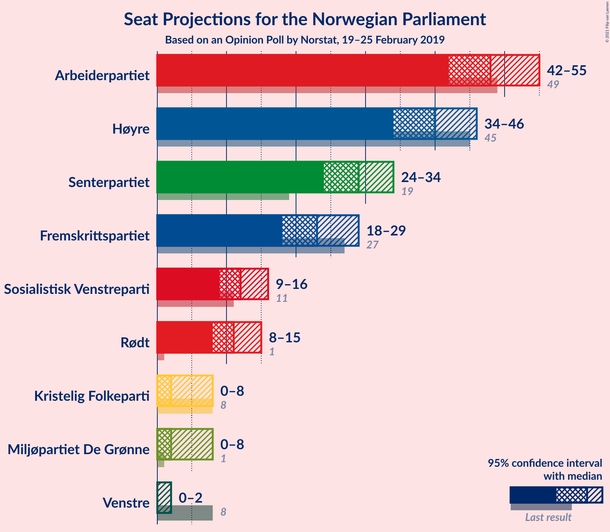
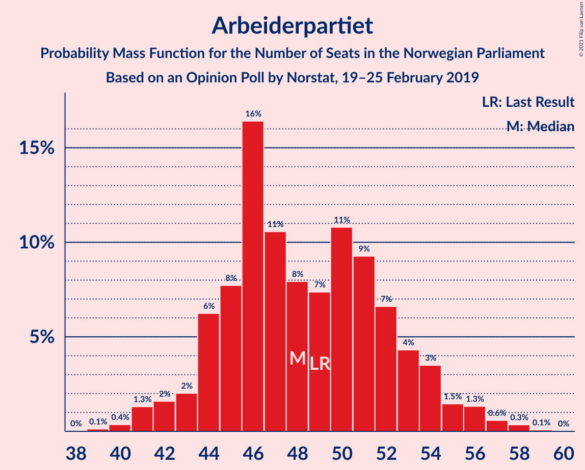
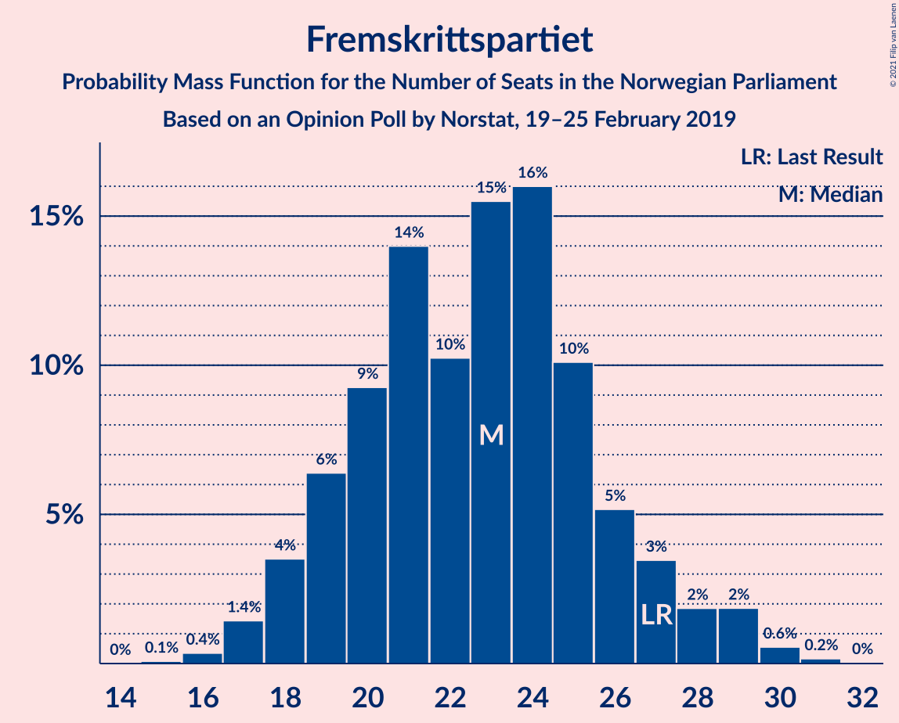
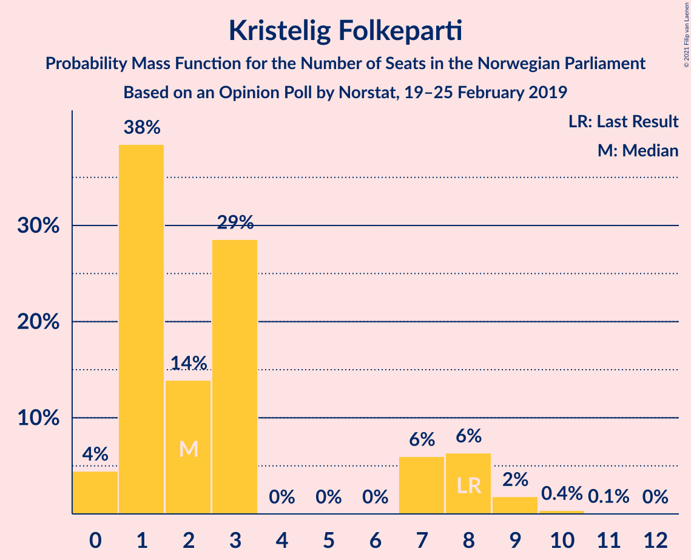
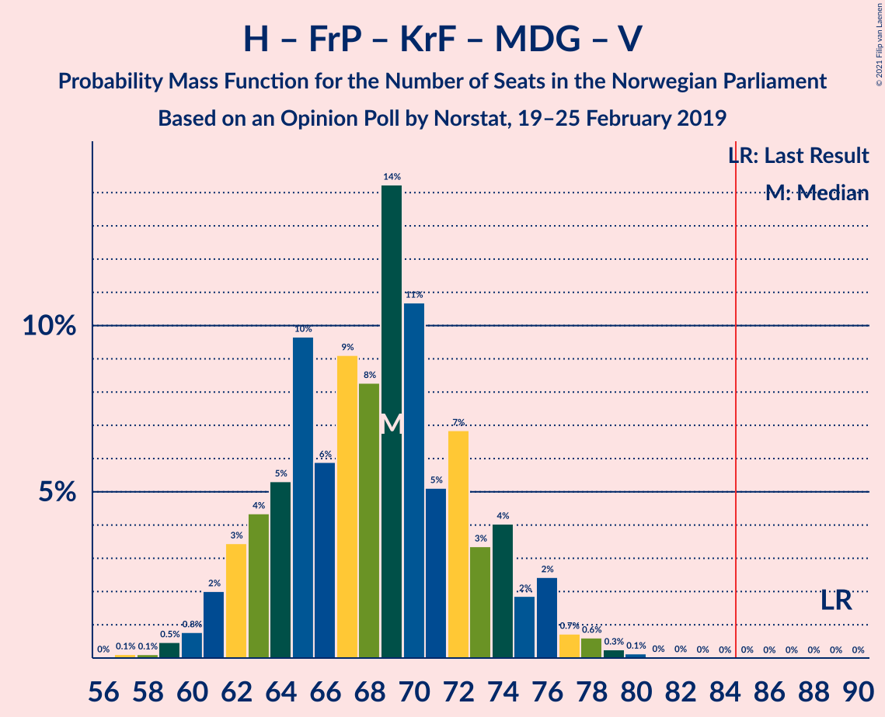
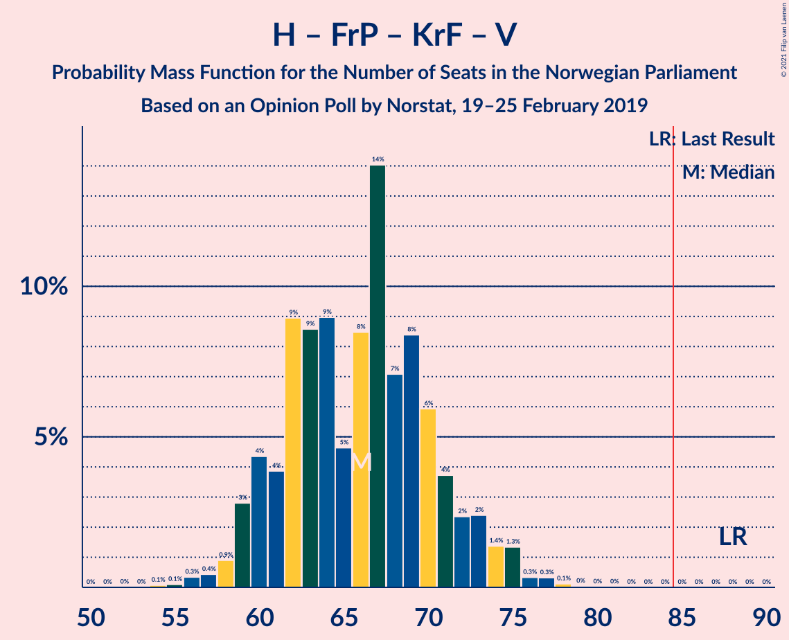
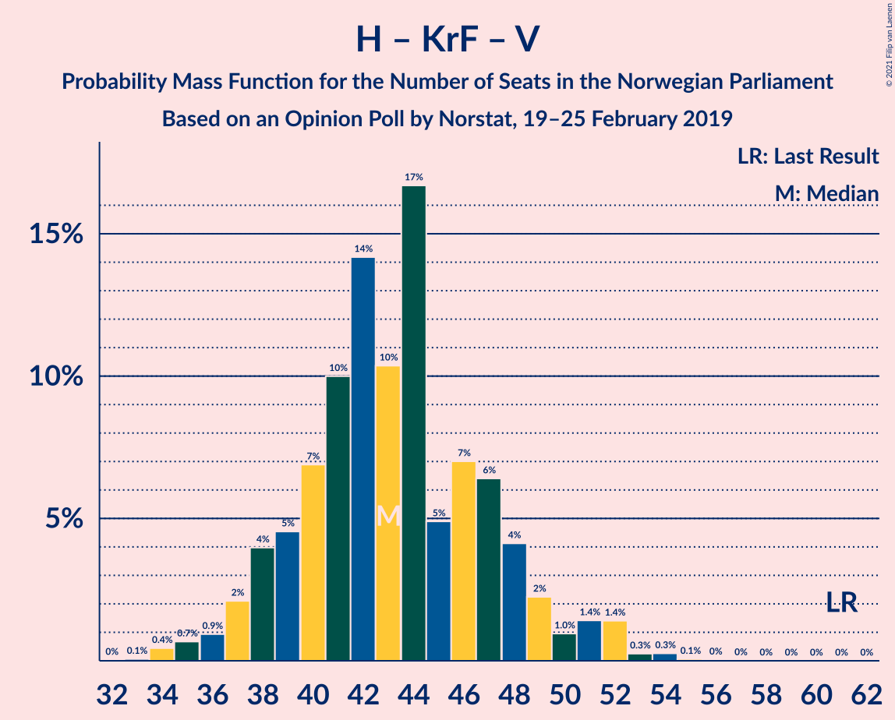

# Opinion Poll by Norstat, 19–25 February 2019

<a href="#voting-intentions">Voting Intentions</a> | <a href="#seats">Seats</a> | <a href="#coalitions">Coalitions</a> | <a href="#technical-information">Technical Information</a>

## Voting Intentions

### Confidence Intervals

| Party | Last Result | Poll Result | 80% Confidence Interval | 90% Confidence Interval | 95% Confidence Interval | 99% Confidence Interval |
|:-----:|:-----------:|:-----------:|:-----------------------:|:-----------------------:|:-----------------------:|:-----------------------:|
| Arbeiderpartiet | 27.4% | 26.9% | 24.7–29.3% |24.1–29.9% |23.6–30.5% |22.6–31.7% |
| Høyre | 25.0% | 22.3% | 20.3–24.5% |19.7–25.2% |19.2–25.7% |18.3–26.8% |
| Senterpartiet | 10.3% | 15.9% | 14.2–17.9% |13.7–18.5% |13.3–19.0% |12.5–20.0% |
| Fremskrittspartiet | 15.2% | 12.6% | 11.0–14.4% |10.6–15.0% |10.2–15.4% |9.5–16.3% |
| Sosialistisk Venstreparti | 6.0% | 6.5% | 5.4–8.0% |5.1–8.4% |4.8–8.7% |4.4–9.5% |
| Rødt | 2.4% | 6.2% | 5.1–7.6% |4.8–8.0% |4.6–8.4% |4.1–9.1% |
| Kristelig Folkeparti | 4.2% | 3.2% | 2.5–4.3% |2.2–4.6% |2.1–4.9% |1.8–5.5% |
| Miljøpartiet De Grønne | 3.2% | 3.0% | 2.3–4.1% |2.1–4.4% |2.0–4.7% |1.6–5.3% |
| Venstre | 4.4% | 1.8% | 1.2–2.6% |1.1–2.9% |1.0–3.1% |0.8–3.6% |

*Note:* The poll result column reflects the actual value used in the calculations. Published results may vary slightly, and in addition be rounded to fewer digits.

## Seats

### Confidence Intervals

| Party | Last Result | Median | 80% Confidence Interval | 90% Confidence Interval | 95% Confidence Interval | 99% Confidence Interval |
|:-----:|:-----------:|:------:|:-----------------------:|:-----------------------:|:-----------------------:|:-----------------------:|
| <a href="#arbeiderpartiet">Arbeiderpartiet</a> | 49 | 48 | 44–53 |42–54 |42–54 |41–57 |
| <a href="#høyre">Høyre</a> | 45 | 40 | 36–44 |34–45 |33–46 |32–48 |
| <a href="#senterpartiet">Senterpartiet</a> | 19 | 29 | 25–34 |24–35 |23–35 |21–38 |
| <a href="#fremskrittspartiet">Fremskrittspartiet</a> | 27 | 24 | 20–27 |19–27 |19–27 |17–29 |
| <a href="#sosialistisk-venstreparti">Sosialistisk Venstreparti</a> | 11 | 11 | 9–14 |9–15 |9–16 |8–17 |
| <a href="#rødt">Rødt</a> | 1 | 11 | 9–13 |8–14 |8–15 |2–16 |
| <a href="#kristelig-folkeparti">Kristelig Folkeparti</a> | 8 | 2 | 1–7 |1–8 |1–8 |0–10 |
| <a href="#miljøpartiet-de-grønne">Miljøpartiet De Grønne</a> | 1 | 2 | 1–7 |1–8 |0–8 |0–9 |
| <a href="#venstre">Venstre</a> | 8 | 0 | 0–2 |0–2 |0–2 |0–2 |

### Arbeiderpartiet

*For a full overview of the results for this party, see the [Arbeiderpartiet](party-arbeiderpartiet.html) page.*

| Number of Seats | Probability | Accumulated | Special Marks |
|:---------------:|:-----------:|:-----------:|:-------------:|
| 37 | 0.1% | 100% |  |
| 38 | 0% | 99.9% |  |
| 39 | 0.1% | 99.9% |  |
| 40 | 0.2% | 99.8% |  |
| 41 | 2% | 99.6% |  |
| 42 | 3% | 98% |  |
| 43 | 3% | 95% |  |
| 44 | 10% | 92% |  |
| 45 | 1.5% | 83% |  |
| 46 | 11% | 81% |  |
| 47 | 18% | 70% |  |
| 48 | 4% | 52% | Median |
| 49 | 10% | 48% | Last Result |
| 50 | 8% | 39% |  |
| 51 | 2% | 30% |  |
| 52 | 4% | 28% |  |
| 53 | 17% | 25% |  |
| 54 | 6% | 8% |  |
| 55 | 1.2% | 2% |  |
| 56 | 0.2% | 0.8% |  |
| 57 | 0.3% | 0.6% |  |
| 58 | 0.2% | 0.3% |  |
| 59 | 0.1% | 0.1% |  |
| 60 | 0% | 0% |  |

### Høyre

*For a full overview of the results for this party, see the [Høyre](party-høyre.html) page.*

| Number of Seats | Probability | Accumulated | Special Marks |
|:---------------:|:-----------:|:-----------:|:-------------:|
| 31 | 0.1% | 100% |  |
| 32 | 0.5% | 99.8% |  |
| 33 | 3% | 99.3% |  |
| 34 | 2% | 96% |  |
| 35 | 4% | 94% |  |
| 36 | 9% | 90% |  |
| 37 | 10% | 81% |  |
| 38 | 13% | 71% |  |
| 39 | 8% | 58% |  |
| 40 | 11% | 50% | Median |
| 41 | 8% | 39% |  |
| 42 | 11% | 31% |  |
| 43 | 10% | 20% |  |
| 44 | 4% | 10% |  |
| 45 | 3% | 7% | Last Result |
| 46 | 2% | 4% |  |
| 47 | 0.2% | 1.4% |  |
| 48 | 1.1% | 1.2% |  |
| 49 | 0% | 0.1% |  |
| 50 | 0% | 0.1% |  |
| 51 | 0% | 0.1% |  |
| 52 | 0% | 0% |  |

### Senterpartiet

*For a full overview of the results for this party, see the [Senterpartiet](party-senterpartiet.html) page.*

| Number of Seats | Probability | Accumulated | Special Marks |
|:---------------:|:-----------:|:-----------:|:-------------:|
| 19 | 0% | 100% | Last Result |
| 20 | 0% | 100% |  |
| 21 | 0.6% | 100% |  |
| 22 | 0.8% | 99.4% |  |
| 23 | 2% | 98.5% |  |
| 24 | 7% | 97% |  |
| 25 | 5% | 90% |  |
| 26 | 14% | 85% |  |
| 27 | 4% | 71% |  |
| 28 | 13% | 67% |  |
| 29 | 13% | 54% | Median |
| 30 | 4% | 42% |  |
| 31 | 8% | 37% |  |
| 32 | 6% | 29% |  |
| 33 | 10% | 23% |  |
| 34 | 7% | 13% |  |
| 35 | 5% | 6% |  |
| 36 | 0.4% | 2% |  |
| 37 | 0.9% | 2% |  |
| 38 | 0.6% | 0.6% |  |
| 39 | 0% | 0% |  |

### Fremskrittspartiet

*For a full overview of the results for this party, see the [Fremskrittspartiet](party-fremskrittspartiet.html) page.*

| Number of Seats | Probability | Accumulated | Special Marks |
|:---------------:|:-----------:|:-----------:|:-------------:|
| 15 | 0.1% | 100% |  |
| 16 | 0.2% | 99.9% |  |
| 17 | 0.9% | 99.7% |  |
| 18 | 1.0% | 98.8% |  |
| 19 | 3% | 98% |  |
| 20 | 5% | 95% |  |
| 21 | 4% | 90% |  |
| 22 | 18% | 85% |  |
| 23 | 18% | 68% |  |
| 24 | 21% | 50% | Median |
| 25 | 11% | 29% |  |
| 26 | 6% | 18% |  |
| 27 | 11% | 12% | Last Result |
| 28 | 0.9% | 1.4% |  |
| 29 | 0.1% | 0.5% |  |
| 30 | 0.1% | 0.5% |  |
| 31 | 0.2% | 0.3% |  |
| 32 | 0% | 0.1% |  |
| 33 | 0% | 0% |  |

### Sosialistisk Venstreparti

*For a full overview of the results for this party, see the [Sosialistisk Venstreparti](party-sosialistiskvenstreparti.html) page.*

| Number of Seats | Probability | Accumulated | Special Marks |
|:---------------:|:-----------:|:-----------:|:-------------:|
| 2 | 0.3% | 100% |  |
| 3 | 0% | 99.7% |  |
| 4 | 0% | 99.7% |  |
| 5 | 0% | 99.7% |  |
| 6 | 0% | 99.7% |  |
| 7 | 0.1% | 99.7% |  |
| 8 | 0.9% | 99.5% |  |
| 9 | 16% | 98.6% |  |
| 10 | 8% | 83% |  |
| 11 | 28% | 75% | Last Result, Median |
| 12 | 16% | 47% |  |
| 13 | 6% | 31% |  |
| 14 | 15% | 24% |  |
| 15 | 4% | 9% |  |
| 16 | 4% | 5% |  |
| 17 | 0.3% | 0.6% |  |
| 18 | 0.2% | 0.3% |  |
| 19 | 0.1% | 0.1% |  |
| 20 | 0% | 0% |  |

### Rødt

*For a full overview of the results for this party, see the [Rødt](party-rødt.html) page.*

| Number of Seats | Probability | Accumulated | Special Marks |
|:---------------:|:-----------:|:-----------:|:-------------:|
| 1 | 0% | 100% | Last Result |
| 2 | 0.8% | 100% |  |
| 3 | 0% | 99.2% |  |
| 4 | 0% | 99.1% |  |
| 5 | 0% | 99.1% |  |
| 6 | 0% | 99.1% |  |
| 7 | 0.2% | 99.1% |  |
| 8 | 5% | 98.9% |  |
| 9 | 15% | 93% |  |
| 10 | 25% | 78% |  |
| 11 | 19% | 53% | Median |
| 12 | 16% | 34% |  |
| 13 | 10% | 18% |  |
| 14 | 4% | 8% |  |
| 15 | 3% | 4% |  |
| 16 | 0.5% | 0.8% |  |
| 17 | 0.2% | 0.2% |  |
| 18 | 0% | 0.1% |  |
| 19 | 0% | 0% |  |

### Kristelig Folkeparti

*For a full overview of the results for this party, see the [Kristelig Folkeparti](party-kristeligfolkeparti.html) page.*

| Number of Seats | Probability | Accumulated | Special Marks |
|:---------------:|:-----------:|:-----------:|:-------------:|
| 0 | 2% | 100% |  |
| 1 | 48% | 98% |  |
| 2 | 5% | 50% | Median |
| 3 | 25% | 45% |  |
| 4 | 0% | 20% |  |
| 5 | 0% | 20% |  |
| 6 | 0% | 20% |  |
| 7 | 13% | 20% |  |
| 8 | 5% | 6% | Last Result |
| 9 | 1.1% | 2% |  |
| 10 | 0.6% | 0.8% |  |
| 11 | 0.1% | 0.1% |  |
| 12 | 0% | 0% |  |

### Miljøpartiet De Grønne

*For a full overview of the results for this party, see the [Miljøpartiet De Grønne](party-miljøpartietdegrønne.html) page.*

| Number of Seats | Probability | Accumulated | Special Marks |
|:---------------:|:-----------:|:-----------:|:-------------:|
| 0 | 3% | 100% |  |
| 1 | 43% | 97% | Last Result |
| 2 | 39% | 54% | Median |
| 3 | 1.0% | 14% |  |
| 4 | 0% | 13% |  |
| 5 | 0% | 13% |  |
| 6 | 0% | 13% |  |
| 7 | 6% | 13% |  |
| 8 | 6% | 7% |  |
| 9 | 1.3% | 2% |  |
| 10 | 0.2% | 0.2% |  |
| 11 | 0% | 0% |  |

### Venstre

*For a full overview of the results for this party, see the [Venstre](party-venstre.html) page.*

| Number of Seats | Probability | Accumulated | Special Marks |
|:---------------:|:-----------:|:-----------:|:-------------:|
| 0 | 52% | 100% | Median |
| 1 | 31% | 48% |  |
| 2 | 17% | 17% |  |
| 3 | 0% | 0.1% |  |
| 4 | 0% | 0% |  |
| 5 | 0% | 0% |  |
| 6 | 0% | 0% |  |
| 7 | 0% | 0% |  |
| 8 | 0% | 0% | Last Result |

## Coalitions

### Confidence Intervals

| Coalition | Last Result | Median | Majority? | 80% Confidence Interval | 90% Confidence Interval | 95% Confidence Interval | 99% Confidence Interval |
|:---------:|:-----------:|:------:|:---------:|:-----------------------:|:-----------------------:|:-----------------------:|:-----------------------:|
| Arbeiderpartiet – Senterpartiet – Sosialistisk Venstreparti – Rødt – Miljøpartiet De Grønne | 81 | 102 | 100% | 96–109 | 95–110 | 94–110 | 92–113 |
| Arbeiderpartiet – Senterpartiet – Sosialistisk Venstreparti – Rødt | 80 | 100 | 100% | 94–107 | 94–108 | 92–108 | 90–108 |
| Høyre – Senterpartiet – Fremskrittspartiet – Kristelig Folkeparti – Venstre | 107 | 95 | 99.2% | 88–101 | 87–103 | 87–103 | 84–105 |
| Arbeiderpartiet – Senterpartiet – Sosialistisk Venstreparti – Kristelig Folkeparti – Miljøpartiet De Grønne | 88 | 94 | 99.4% | 90–100 | 88–100 | 87–102 | 84–105 |
| Arbeiderpartiet – Senterpartiet – Sosialistisk Venstreparti – Miljøpartiet De Grønne | 80 | 92 | 94% | 86–97 | 83–99 | 83–99 | 81–102 |
| Arbeiderpartiet – Senterpartiet – Sosialistisk Venstreparti | 79 | 90 | 83% | 84–95 | 82–96 | 81–98 | 79–99 |
| Arbeiderpartiet – Senterpartiet – Kristelig Folkeparti – Miljøpartiet De Grønne | 77 | 83 | 30% | 77–88 | 77–90 | 75–90 | 73–94 |
| Arbeiderpartiet – Senterpartiet – Kristelig Folkeparti | 76 | 82 | 18% | 75–86 | 74–88 | 72–88 | 70–90 |
| Arbeiderpartiet – Senterpartiet | 68 | 78 | 7% | 73–84 | 70–85 | 69–87 | 68–87 |
| Høyre – Fremskrittspartiet – Kristelig Folkeparti – Miljøpartiet De Grønne – Venstre | 89 | 69 | 0% | 62–75 | 61–75 | 61–77 | 61–79 |
| Høyre – Fremskrittspartiet – Kristelig Folkeparti – Venstre | 88 | 67 | 0% | 60–73 | 59–74 | 59–75 | 56–77 |
| Høyre – Fremskrittspartiet – Venstre | 80 | 65 | 0% | 58–67 | 57–69 | 57–71 | 53–74 |
| Høyre – Fremskrittspartiet | 72 | 64 | 0% | 58–67 | 57–69 | 56–70 | 53–72 |
| Arbeiderpartiet – Sosialistisk Venstreparti | 60 | 60 | 0% | 56–65 | 54–67 | 53–67 | 51–69 |
| Høyre – Kristelig Folkeparti – Venstre | 61 | 42 | 0% | 37–48 | 37–49 | 36–49 | 35–54 |
| Senterpartiet – Kristelig Folkeparti – Venstre | 35 | 33 | 0% | 27–37 | 26–40 | 25–41 | 23–42 |

### Arbeiderpartiet – Senterpartiet – Sosialistisk Venstreparti – Rødt – Miljøpartiet De Grønne

| Number of Seats | Probability | Accumulated | Special Marks |
|:---------------:|:-----------:|:-----------:|:-------------:|
| 81 | 0% | 100% | Last Result |
| 82 | 0% | 100% |  |
| 83 | 0% | 100% |  |
| 84 | 0% | 100% |  |
| 85 | 0% | 100% | Majority |
| 86 | 0% | 100% |  |
| 87 | 0% | 100% |  |
| 88 | 0% | 100% |  |
| 89 | 0% | 100% |  |
| 90 | 0.1% | 100% |  |
| 91 | 0.2% | 99.9% |  |
| 92 | 0.6% | 99.7% |  |
| 93 | 0.4% | 99.1% |  |
| 94 | 2% | 98.7% |  |
| 95 | 2% | 97% |  |
| 96 | 6% | 95% |  |
| 97 | 5% | 89% |  |
| 98 | 2% | 84% |  |
| 99 | 7% | 83% |  |
| 100 | 1.3% | 76% |  |
| 101 | 15% | 75% | Median |
| 102 | 15% | 60% |  |
| 103 | 11% | 45% |  |
| 104 | 4% | 33% |  |
| 105 | 5% | 30% |  |
| 106 | 2% | 25% |  |
| 107 | 3% | 23% |  |
| 108 | 9% | 20% |  |
| 109 | 4% | 11% |  |
| 110 | 6% | 7% |  |
| 111 | 0.7% | 1.3% |  |
| 112 | 0.1% | 0.6% |  |
| 113 | 0.1% | 0.5% |  |
| 114 | 0% | 0.4% |  |
| 115 | 0.3% | 0.3% |  |
| 116 | 0% | 0.1% |  |
| 117 | 0.1% | 0.1% |  |
| 118 | 0% | 0% |  |

### Arbeiderpartiet – Senterpartiet – Sosialistisk Venstreparti – Rødt

| Number of Seats | Probability | Accumulated | Special Marks |
|:---------------:|:-----------:|:-----------:|:-------------:|
| 80 | 0% | 100% | Last Result |
| 81 | 0% | 100% |  |
| 82 | 0% | 100% |  |
| 83 | 0% | 100% |  |
| 84 | 0% | 100% |  |
| 85 | 0% | 100% | Majority |
| 86 | 0.1% | 100% |  |
| 87 | 0% | 99.9% |  |
| 88 | 0% | 99.9% |  |
| 89 | 0.1% | 99.9% |  |
| 90 | 0.3% | 99.7% |  |
| 91 | 0.8% | 99.5% |  |
| 92 | 1.2% | 98.7% |  |
| 93 | 2% | 97% |  |
| 94 | 8% | 96% |  |
| 95 | 4% | 88% |  |
| 96 | 4% | 84% |  |
| 97 | 5% | 80% |  |
| 98 | 3% | 75% |  |
| 99 | 9% | 72% | Median |
| 100 | 17% | 63% |  |
| 101 | 10% | 46% |  |
| 102 | 12% | 35% |  |
| 103 | 5% | 23% |  |
| 104 | 1.3% | 19% |  |
| 105 | 4% | 18% |  |
| 106 | 0.6% | 14% |  |
| 107 | 8% | 13% |  |
| 108 | 5% | 6% |  |
| 109 | 0.2% | 0.4% |  |
| 110 | 0.1% | 0.2% |  |
| 111 | 0% | 0.1% |  |
| 112 | 0% | 0.1% |  |
| 113 | 0% | 0% |  |

### Høyre – Senterpartiet – Fremskrittspartiet – Kristelig Folkeparti – Venstre

| Number of Seats | Probability | Accumulated | Special Marks |
|:---------------:|:-----------:|:-----------:|:-------------:|
| 82 | 0% | 100% |  |
| 83 | 0% | 99.9% |  |
| 84 | 0.7% | 99.9% |  |
| 85 | 0.3% | 99.2% | Majority |
| 86 | 0.6% | 98.9% |  |
| 87 | 5% | 98% |  |
| 88 | 5% | 94% |  |
| 89 | 0.5% | 89% |  |
| 90 | 2% | 89% |  |
| 91 | 9% | 87% |  |
| 92 | 4% | 78% |  |
| 93 | 3% | 74% |  |
| 94 | 10% | 71% |  |
| 95 | 11% | 60% | Median |
| 96 | 6% | 50% |  |
| 97 | 5% | 44% |  |
| 98 | 7% | 39% |  |
| 99 | 6% | 32% |  |
| 100 | 5% | 26% |  |
| 101 | 13% | 21% |  |
| 102 | 2% | 8% |  |
| 103 | 4% | 5% |  |
| 104 | 0.6% | 2% |  |
| 105 | 0.6% | 1.1% |  |
| 106 | 0.4% | 0.5% |  |
| 107 | 0.1% | 0.1% | Last Result |
| 108 | 0% | 0% |  |

### Arbeiderpartiet – Senterpartiet – Sosialistisk Venstreparti – Kristelig Folkeparti – Miljøpartiet De Grønne

| Number of Seats | Probability | Accumulated | Special Marks |
|:---------------:|:-----------:|:-----------:|:-------------:|
| 83 | 0.4% | 100% |  |
| 84 | 0.1% | 99.6% |  |
| 85 | 0.6% | 99.4% | Majority |
| 86 | 0.6% | 98.9% |  |
| 87 | 3% | 98% |  |
| 88 | 1.2% | 95% | Last Result |
| 89 | 2% | 94% |  |
| 90 | 6% | 93% |  |
| 91 | 7% | 86% |  |
| 92 | 5% | 79% | Median |
| 93 | 11% | 74% |  |
| 94 | 19% | 63% |  |
| 95 | 10% | 44% |  |
| 96 | 6% | 34% |  |
| 97 | 5% | 28% |  |
| 98 | 8% | 23% |  |
| 99 | 4% | 15% |  |
| 100 | 6% | 11% |  |
| 101 | 1.1% | 5% |  |
| 102 | 2% | 4% |  |
| 103 | 0.3% | 2% |  |
| 104 | 0.5% | 1.2% |  |
| 105 | 0.4% | 0.7% |  |
| 106 | 0.2% | 0.3% |  |
| 107 | 0.1% | 0.2% |  |
| 108 | 0% | 0.1% |  |
| 109 | 0.1% | 0.1% |  |
| 110 | 0% | 0% |  |

### Arbeiderpartiet – Senterpartiet – Sosialistisk Venstreparti – Miljøpartiet De Grønne

| Number of Seats | Probability | Accumulated | Special Marks |
|:---------------:|:-----------:|:-----------:|:-------------:|
| 79 | 0.1% | 100% |  |
| 80 | 0.3% | 99.8% | Last Result |
| 81 | 0.5% | 99.6% |  |
| 82 | 0.7% | 99.1% |  |
| 83 | 4% | 98% |  |
| 84 | 0.9% | 95% |  |
| 85 | 0.3% | 94% | Majority |
| 86 | 10% | 94% |  |
| 87 | 2% | 84% |  |
| 88 | 2% | 81% |  |
| 89 | 5% | 80% |  |
| 90 | 7% | 74% | Median |
| 91 | 16% | 67% |  |
| 92 | 11% | 51% |  |
| 93 | 9% | 40% |  |
| 94 | 3% | 31% |  |
| 95 | 8% | 27% |  |
| 96 | 2% | 19% |  |
| 97 | 9% | 17% |  |
| 98 | 3% | 8% |  |
| 99 | 4% | 6% |  |
| 100 | 0.4% | 1.3% |  |
| 101 | 0.4% | 1.0% |  |
| 102 | 0.1% | 0.6% |  |
| 103 | 0.1% | 0.5% |  |
| 104 | 0.3% | 0.4% |  |
| 105 | 0% | 0.1% |  |
| 106 | 0.1% | 0.1% |  |
| 107 | 0% | 0.1% |  |
| 108 | 0.1% | 0.1% |  |
| 109 | 0% | 0% |  |

### Arbeiderpartiet – Senterpartiet – Sosialistisk Venstreparti

| Number of Seats | Probability | Accumulated | Special Marks |
|:---------------:|:-----------:|:-----------:|:-------------:|
| 75 | 0.1% | 100% |  |
| 76 | 0.1% | 99.9% |  |
| 77 | 0.1% | 99.9% |  |
| 78 | 0.2% | 99.8% |  |
| 79 | 0.5% | 99.6% | Last Result |
| 80 | 1.4% | 99.2% |  |
| 81 | 0.9% | 98% |  |
| 82 | 4% | 97% |  |
| 83 | 0.6% | 93% |  |
| 84 | 9% | 92% |  |
| 85 | 4% | 83% | Majority |
| 86 | 3% | 79% |  |
| 87 | 4% | 76% |  |
| 88 | 10% | 72% | Median |
| 89 | 7% | 62% |  |
| 90 | 19% | 55% |  |
| 91 | 7% | 36% |  |
| 92 | 7% | 29% |  |
| 93 | 7% | 22% |  |
| 94 | 1.5% | 15% |  |
| 95 | 5% | 14% |  |
| 96 | 4% | 9% |  |
| 97 | 0.2% | 5% |  |
| 98 | 4% | 5% |  |
| 99 | 0.3% | 0.6% |  |
| 100 | 0.3% | 0.4% |  |
| 101 | 0% | 0.1% |  |
| 102 | 0% | 0.1% |  |
| 103 | 0% | 0.1% |  |
| 104 | 0% | 0% |  |

### Arbeiderpartiet – Senterpartiet – Kristelig Folkeparti – Miljøpartiet De Grønne

| Number of Seats | Probability | Accumulated | Special Marks |
|:---------------:|:-----------:|:-----------:|:-------------:|
| 70 | 0.1% | 100% |  |
| 71 | 0.1% | 99.8% |  |
| 72 | 0% | 99.8% |  |
| 73 | 0.4% | 99.8% |  |
| 74 | 0.6% | 99.3% |  |
| 75 | 2% | 98.7% |  |
| 76 | 0.6% | 97% |  |
| 77 | 8% | 96% | Last Result |
| 78 | 10% | 88% |  |
| 79 | 5% | 79% |  |
| 80 | 4% | 74% |  |
| 81 | 5% | 70% | Median |
| 82 | 2% | 65% |  |
| 83 | 13% | 63% |  |
| 84 | 20% | 50% |  |
| 85 | 8% | 30% | Majority |
| 86 | 7% | 22% |  |
| 87 | 3% | 15% |  |
| 88 | 2% | 12% |  |
| 89 | 4% | 10% |  |
| 90 | 3% | 5% |  |
| 91 | 0.4% | 2% |  |
| 92 | 0.7% | 2% |  |
| 93 | 0.3% | 0.8% |  |
| 94 | 0.5% | 0.6% |  |
| 95 | 0% | 0.1% |  |
| 96 | 0.1% | 0.1% |  |
| 97 | 0% | 0% |  |

### Arbeiderpartiet – Senterpartiet – Kristelig Folkeparti

| Number of Seats | Probability | Accumulated | Special Marks |
|:---------------:|:-----------:|:-----------:|:-------------:|
| 68 | 0.1% | 100% |  |
| 69 | 0.1% | 99.9% |  |
| 70 | 1.1% | 99.7% |  |
| 71 | 0.2% | 98.6% |  |
| 72 | 1.2% | 98% |  |
| 73 | 0.4% | 97% |  |
| 74 | 4% | 97% |  |
| 75 | 7% | 93% |  |
| 76 | 6% | 86% | Last Result |
| 77 | 12% | 80% |  |
| 78 | 3% | 68% |  |
| 79 | 7% | 65% | Median |
| 80 | 3% | 58% |  |
| 81 | 4% | 55% |  |
| 82 | 25% | 51% |  |
| 83 | 3% | 27% |  |
| 84 | 6% | 24% |  |
| 85 | 6% | 18% | Majority |
| 86 | 3% | 12% |  |
| 87 | 0.8% | 9% |  |
| 88 | 7% | 9% |  |
| 89 | 0.5% | 2% |  |
| 90 | 0.7% | 1.0% |  |
| 91 | 0.1% | 0.3% |  |
| 92 | 0.1% | 0.3% |  |
| 93 | 0.1% | 0.1% |  |
| 94 | 0% | 0% |  |

### Arbeiderpartiet – Senterpartiet

| Number of Seats | Probability | Accumulated | Special Marks |
|:---------------:|:-----------:|:-----------:|:-------------:|
| 63 | 0% | 100% |  |
| 64 | 0% | 99.9% |  |
| 65 | 0% | 99.9% |  |
| 66 | 0.1% | 99.9% |  |
| 67 | 0.1% | 99.8% |  |
| 68 | 2% | 99.7% | Last Result |
| 69 | 0.9% | 98% |  |
| 70 | 4% | 97% |  |
| 71 | 3% | 93% |  |
| 72 | 0.6% | 91% |  |
| 73 | 5% | 90% |  |
| 74 | 8% | 85% |  |
| 75 | 15% | 76% |  |
| 76 | 5% | 61% |  |
| 77 | 3% | 56% | Median |
| 78 | 8% | 53% |  |
| 79 | 16% | 46% |  |
| 80 | 4% | 30% |  |
| 81 | 6% | 26% |  |
| 82 | 2% | 20% |  |
| 83 | 5% | 18% |  |
| 84 | 6% | 13% |  |
| 85 | 2% | 7% | Majority |
| 86 | 0.4% | 5% |  |
| 87 | 4% | 4% |  |
| 88 | 0.1% | 0.2% |  |
| 89 | 0.1% | 0.1% |  |
| 90 | 0% | 0.1% |  |
| 91 | 0% | 0.1% |  |
| 92 | 0% | 0% |  |

### Høyre – Fremskrittspartiet – Kristelig Folkeparti – Miljøpartiet De Grønne – Venstre

| Number of Seats | Probability | Accumulated | Special Marks |
|:---------------:|:-----------:|:-----------:|:-------------:|
| 57 | 0% | 100% |  |
| 58 | 0% | 99.9% |  |
| 59 | 0.1% | 99.9% |  |
| 60 | 0.2% | 99.8% |  |
| 61 | 5% | 99.6% |  |
| 62 | 8% | 94% |  |
| 63 | 0.6% | 87% |  |
| 64 | 4% | 86% |  |
| 65 | 1.3% | 82% |  |
| 66 | 5% | 81% |  |
| 67 | 12% | 77% |  |
| 68 | 10% | 65% | Median |
| 69 | 17% | 54% |  |
| 70 | 9% | 37% |  |
| 71 | 3% | 28% |  |
| 72 | 5% | 25% |  |
| 73 | 4% | 20% |  |
| 74 | 4% | 16% |  |
| 75 | 8% | 12% |  |
| 76 | 2% | 4% |  |
| 77 | 1.2% | 3% |  |
| 78 | 0.8% | 1.3% |  |
| 79 | 0.3% | 0.5% |  |
| 80 | 0.1% | 0.3% |  |
| 81 | 0% | 0.1% |  |
| 82 | 0% | 0.1% |  |
| 83 | 0.1% | 0.1% |  |
| 84 | 0% | 0% |  |
| 85 | 0% | 0% | Majority |
| 86 | 0% | 0% |  |
| 87 | 0% | 0% |  |
| 88 | 0% | 0% |  |
| 89 | 0% | 0% | Last Result |

### Høyre – Fremskrittspartiet – Kristelig Folkeparti – Venstre

| Number of Seats | Probability | Accumulated | Special Marks |
|:---------------:|:-----------:|:-----------:|:-------------:|
| 52 | 0.1% | 100% |  |
| 53 | 0% | 99.9% |  |
| 54 | 0.3% | 99.9% |  |
| 55 | 0% | 99.7% |  |
| 56 | 0.1% | 99.6% |  |
| 57 | 0.1% | 99.5% |  |
| 58 | 0.7% | 99.4% |  |
| 59 | 6% | 98.7% |  |
| 60 | 4% | 93% |  |
| 61 | 9% | 89% |  |
| 62 | 3% | 80% |  |
| 63 | 2% | 77% |  |
| 64 | 5% | 75% |  |
| 65 | 4% | 70% |  |
| 66 | 11% | 67% | Median |
| 67 | 15% | 55% |  |
| 68 | 15% | 40% |  |
| 69 | 1.3% | 25% |  |
| 70 | 7% | 24% |  |
| 71 | 2% | 17% |  |
| 72 | 5% | 16% |  |
| 73 | 6% | 11% |  |
| 74 | 2% | 5% |  |
| 75 | 2% | 3% |  |
| 76 | 0.4% | 1.3% |  |
| 77 | 0.6% | 0.8% |  |
| 78 | 0.2% | 0.3% |  |
| 79 | 0.1% | 0.1% |  |
| 80 | 0% | 0% |  |
| 81 | 0% | 0% |  |
| 82 | 0% | 0% |  |
| 83 | 0% | 0% |  |
| 84 | 0% | 0% |  |
| 85 | 0% | 0% | Majority |
| 86 | 0% | 0% |  |
| 87 | 0% | 0% |  |
| 88 | 0% | 0% | Last Result |

### Høyre – Fremskrittspartiet – Venstre

| Number of Seats | Probability | Accumulated | Special Marks |
|:---------------:|:-----------:|:-----------:|:-------------:|
| 51 | 0.2% | 100% |  |
| 52 | 0.1% | 99.8% |  |
| 53 | 0.4% | 99.8% |  |
| 54 | 0.1% | 99.4% |  |
| 55 | 0.7% | 99.3% |  |
| 56 | 0.3% | 98.6% |  |
| 57 | 4% | 98% |  |
| 58 | 7% | 94% |  |
| 59 | 4% | 87% |  |
| 60 | 9% | 83% |  |
| 61 | 3% | 73% |  |
| 62 | 3% | 70% |  |
| 63 | 4% | 68% |  |
| 64 | 6% | 64% | Median |
| 65 | 27% | 59% |  |
| 66 | 15% | 32% |  |
| 67 | 8% | 16% |  |
| 68 | 2% | 9% |  |
| 69 | 3% | 7% |  |
| 70 | 0.7% | 4% |  |
| 71 | 2% | 3% |  |
| 72 | 0.6% | 1.2% |  |
| 73 | 0.1% | 0.6% |  |
| 74 | 0.4% | 0.5% |  |
| 75 | 0% | 0.1% |  |
| 76 | 0% | 0.1% |  |
| 77 | 0% | 0% |  |
| 78 | 0% | 0% |  |
| 79 | 0% | 0% |  |
| 80 | 0% | 0% | Last Result |

### Høyre – Fremskrittspartiet

| Number of Seats | Probability | Accumulated | Special Marks |
|:---------------:|:-----------:|:-----------:|:-------------:|
| 51 | 0.2% | 100% |  |
| 52 | 0.1% | 99.7% |  |
| 53 | 0.5% | 99.7% |  |
| 54 | 0.4% | 99.2% |  |
| 55 | 0.5% | 98.8% |  |
| 56 | 3% | 98% |  |
| 57 | 3% | 95% |  |
| 58 | 7% | 93% |  |
| 59 | 5% | 86% |  |
| 60 | 10% | 81% |  |
| 61 | 3% | 71% |  |
| 62 | 3% | 68% |  |
| 63 | 9% | 65% |  |
| 64 | 8% | 56% | Median |
| 65 | 35% | 48% |  |
| 66 | 3% | 14% |  |
| 67 | 5% | 11% |  |
| 68 | 0.7% | 6% |  |
| 69 | 3% | 6% |  |
| 70 | 2% | 3% |  |
| 71 | 1.0% | 2% |  |
| 72 | 0.4% | 0.5% | Last Result |
| 73 | 0% | 0.1% |  |
| 74 | 0% | 0.1% |  |
| 75 | 0% | 0.1% |  |
| 76 | 0% | 0% |  |

### Arbeiderpartiet – Sosialistisk Venstreparti

| Number of Seats | Probability | Accumulated | Special Marks |
|:---------------:|:-----------:|:-----------:|:-------------:|
| 49 | 0.1% | 100% |  |
| 50 | 0.4% | 99.9% |  |
| 51 | 0.3% | 99.6% |  |
| 52 | 0.2% | 99.2% |  |
| 53 | 4% | 99.0% |  |
| 54 | 4% | 95% |  |
| 55 | 1.0% | 91% |  |
| 56 | 10% | 90% |  |
| 57 | 14% | 80% |  |
| 58 | 2% | 66% |  |
| 59 | 9% | 63% | Median |
| 60 | 4% | 54% | Last Result |
| 61 | 9% | 49% |  |
| 62 | 3% | 41% |  |
| 63 | 8% | 38% |  |
| 64 | 19% | 30% |  |
| 65 | 1.1% | 10% |  |
| 66 | 3% | 9% |  |
| 67 | 5% | 6% |  |
| 68 | 0.2% | 0.8% |  |
| 69 | 0.3% | 0.5% |  |
| 70 | 0.2% | 0.3% |  |
| 71 | 0.1% | 0.1% |  |
| 72 | 0% | 0% |  |

### Høyre – Kristelig Folkeparti – Venstre

| Number of Seats | Probability | Accumulated | Special Marks |
|:---------------:|:-----------:|:-----------:|:-------------:|
| 34 | 0.1% | 100% |  |
| 35 | 1.2% | 99.9% |  |
| 36 | 2% | 98.7% |  |
| 37 | 7% | 97% |  |
| 38 | 8% | 90% |  |
| 39 | 0.9% | 81% |  |
| 40 | 4% | 80% |  |
| 41 | 17% | 77% |  |
| 42 | 13% | 59% | Median |
| 43 | 1.4% | 47% |  |
| 44 | 7% | 45% |  |
| 45 | 3% | 38% |  |
| 46 | 15% | 36% |  |
| 47 | 3% | 21% |  |
| 48 | 11% | 18% |  |
| 49 | 5% | 7% |  |
| 50 | 0.5% | 2% |  |
| 51 | 0.2% | 2% |  |
| 52 | 0.1% | 1.5% |  |
| 53 | 0.8% | 1.3% |  |
| 54 | 0.5% | 0.5% |  |
| 55 | 0% | 0.1% |  |
| 56 | 0% | 0% |  |
| 57 | 0% | 0% |  |
| 58 | 0% | 0% |  |
| 59 | 0% | 0% |  |
| 60 | 0% | 0% |  |
| 61 | 0% | 0% | Last Result |

### Senterpartiet – Kristelig Folkeparti – Venstre

| Number of Seats | Probability | Accumulated | Special Marks |
|:---------------:|:-----------:|:-----------:|:-------------:|
| 22 | 0.3% | 100% |  |
| 23 | 0.7% | 99.7% |  |
| 24 | 0.1% | 99.0% |  |
| 25 | 1.4% | 98.9% |  |
| 26 | 5% | 97% |  |
| 27 | 4% | 92% |  |
| 28 | 2% | 88% |  |
| 29 | 14% | 86% |  |
| 30 | 6% | 72% |  |
| 31 | 7% | 65% | Median |
| 32 | 3% | 58% |  |
| 33 | 10% | 55% |  |
| 34 | 7% | 45% |  |
| 35 | 9% | 38% | Last Result |
| 36 | 18% | 29% |  |
| 37 | 1.2% | 11% |  |
| 38 | 3% | 10% |  |
| 39 | 1.3% | 7% |  |
| 40 | 2% | 5% |  |
| 41 | 1.4% | 3% |  |
| 42 | 2% | 2% |  |
| 43 | 0.2% | 0.4% |  |
| 44 | 0.1% | 0.2% |  |
| 45 | 0% | 0.1% |  |
| 46 | 0% | 0% |  |

## Technical Information

### Opinion Poll

+ **Polling firm:** Norstat
+ **Commissioner(s):** —
+ **Fieldwork period:** 19–25 February 2019

### Calculations

+ **Sample size:** 628
+ **Simulations done:** 131,072
+ **Error estimate:** 2.38%

