# Opinion Poll by Kantar TNS, 25 February–1 March 2019

<a href="#voting-intentions">Voting Intentions</a> | <a href="#seats">Seats</a> | <a href="#coalitions">Coalitions</a> | <a href="#technical-information">Technical Information</a>

## Voting Intentions

### Confidence Intervals

| Party | Last Result | Poll Result | 80% Confidence Interval | 90% Confidence Interval | 95% Confidence Interval | 99% Confidence Interval |
|:-----:|:-----------:|:-----------:|:-----------------------:|:-----------------------:|:-----------------------:|:-----------------------:|
| Arbeiderpartiet | 27.4% | 27.4% | 25.3–29.6% |24.7–30.2% |24.2–30.8% |23.3–31.8% |
| Høyre | 25.0% | 24.7% | 22.7–26.9% |22.2–27.5% |21.7–28.0% |20.8–29.1% |
| Senterpartiet | 10.3% | 12.7% | 11.2–14.4% |10.8–14.9% |10.5–15.4% |9.8–16.2% |
| Fremskrittspartiet | 15.2% | 10.2% | 8.9–11.8% |8.5–12.2% |8.2–12.6% |7.6–13.4% |
| Sosialistisk Venstreparti | 6.0% | 8.0% | 6.8–9.4% |6.5–9.8% |6.2–10.2% |5.7–10.9% |
| Rødt | 2.4% | 4.7% | 3.9–5.9% |3.6–6.3% |3.4–6.6% |3.0–7.2% |
| Miljøpartiet De Grønne | 3.2% | 3.6% | 2.9–4.7% |2.7–5.0% |2.5–5.3% |2.2–5.8% |
| Kristelig Folkeparti | 4.2% | 3.6% | 2.9–4.7% |2.7–5.0% |2.5–5.3% |2.2–5.8% |
| Venstre | 4.4% | 2.2% | 1.7–3.1% |1.5–3.4% |1.4–3.6% |1.1–4.1% |

*Note:* The poll result column reflects the actual value used in the calculations. Published results may vary slightly, and in addition be rounded to fewer digits.

## Seats

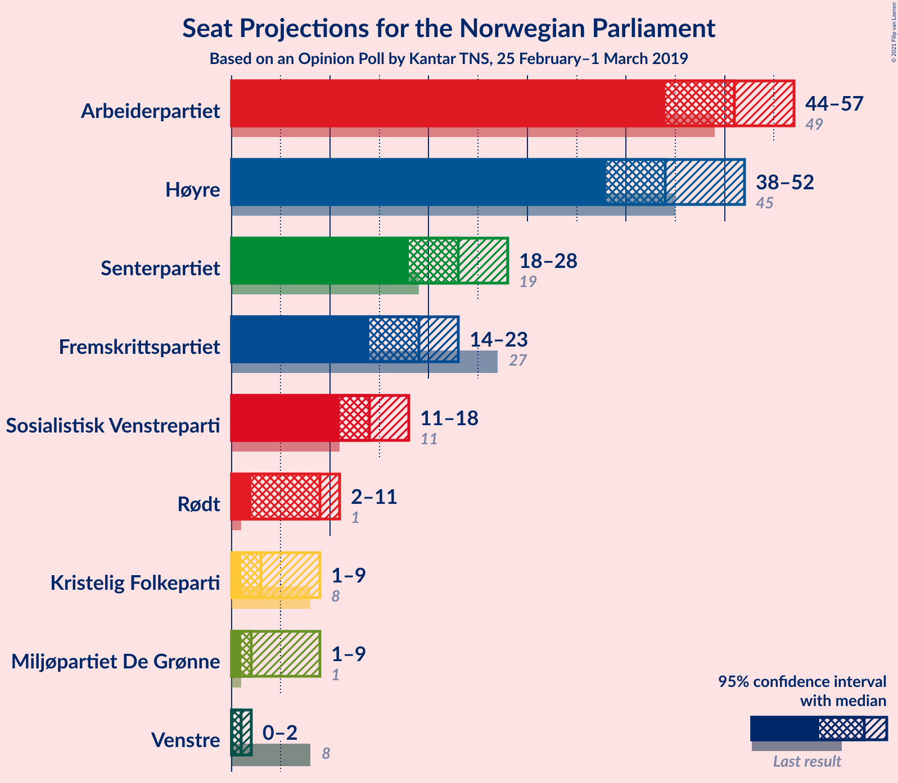

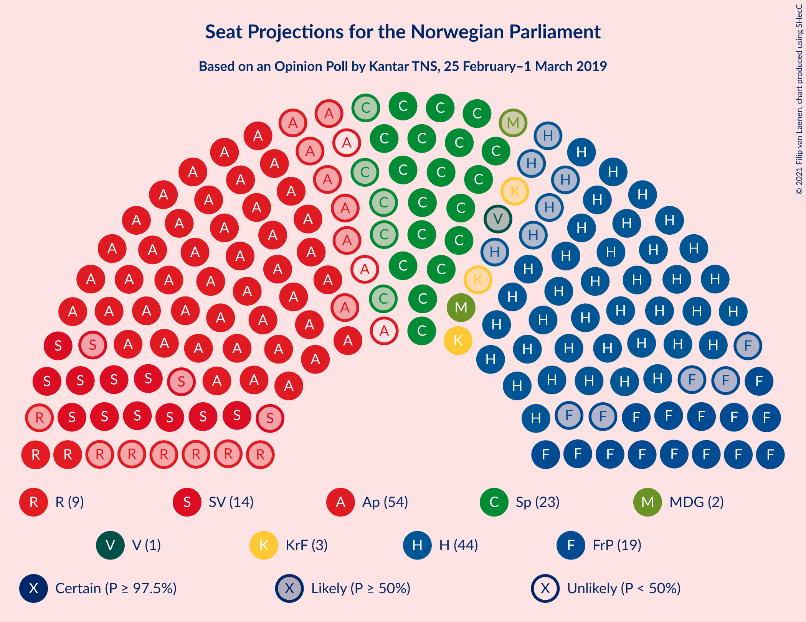

### Confidence Intervals

| Party | Last Result | Median | 80% Confidence Interval | 90% Confidence Interval | 95% Confidence Interval | 99% Confidence Interval |
|:-----:|:-----------:|:------:|:-----------------------:|:-----------------------:|:-----------------------:|:-----------------------:|
| <a href="#arbeiderpartiet">Arbeiderpartiet</a> | 49 | 51 | 46–55 |45–56 |44–57 |42–59 |
| <a href="#høyre">Høyre</a> | 45 | 44 | 41–50 |40–51 |38–52 |37–53 |
| <a href="#senterpartiet">Senterpartiet</a> | 19 | 23 | 20–26 |19–27 |18–28 |17–30 |
| <a href="#fremskrittspartiet">Fremskrittspartiet</a> | 27 | 19 | 16–21 |15–22 |14–23 |13–24 |
| <a href="#sosialistisk-venstreparti">Sosialistisk Venstreparti</a> | 11 | 14 | 12–17 |11–18 |11–18 |10–20 |
| <a href="#rødt">Rødt</a> | 1 | 9 | 2–11 |2–11 |2–11 |2–13 |
| <a href="#miljøpartiet-de-grønne">Miljøpartiet De Grønne</a> | 1 | 2 | 1–8 |1–9 |1–9 |1–10 |
| <a href="#kristelig-folkeparti">Kristelig Folkeparti</a> | 8 | 3 | 1–8 |1–9 |1–9 |0–10 |
| <a href="#venstre">Venstre</a> | 8 | 1 | 0–2 |0–2 |0–2 |0–7 |

### Arbeiderpartiet

*For a full overview of the results for this party, see the [Arbeiderpartiet](party-arbeiderpartiet.html) page.*

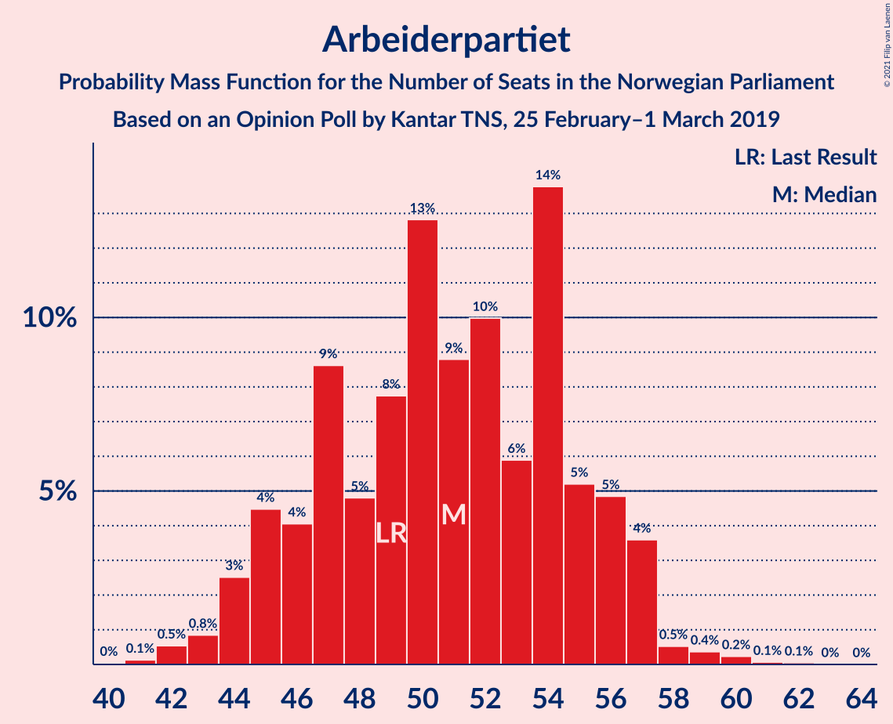

| Number of Seats | Probability | Accumulated | Special Marks |
|:---------------:|:-----------:|:-----------:|:-------------:|
| 40 | 0% | 100% |  |
| 41 | 0.1% | 99.9% |  |
| 42 | 0.5% | 99.8% |  |
| 43 | 0.8% | 99.3% |  |
| 44 | 3% | 98% |  |
| 45 | 4% | 96% |  |
| 46 | 4% | 91% |  |
| 47 | 9% | 87% |  |
| 48 | 5% | 79% |  |
| 49 | 8% | 74% | Last Result |
| 50 | 13% | 66% |  |
| 51 | 9% | 53% | Median |
| 52 | 10% | 45% |  |
| 53 | 6% | 35% |  |
| 54 | 14% | 29% |  |
| 55 | 5% | 15% |  |
| 56 | 5% | 10% |  |
| 57 | 4% | 5% |  |
| 58 | 0.5% | 1.3% |  |
| 59 | 0.4% | 0.7% |  |
| 60 | 0.2% | 0.4% |  |
| 61 | 0.1% | 0.1% |  |
| 62 | 0.1% | 0.1% |  |
| 63 | 0% | 0% |  |

### Høyre

*For a full overview of the results for this party, see the [Høyre](party-høyre.html) page.*

| Number of Seats | Probability | Accumulated | Special Marks |
|:---------------:|:-----------:|:-----------:|:-------------:|
| 35 | 0.1% | 100% |  |
| 36 | 0.2% | 99.8% |  |
| 37 | 0.5% | 99.6% |  |
| 38 | 2% | 99.1% |  |
| 39 | 2% | 97% |  |
| 40 | 3% | 95% |  |
| 41 | 8% | 92% |  |
| 42 | 7% | 84% |  |
| 43 | 16% | 77% |  |
| 44 | 15% | 61% | Median |
| 45 | 6% | 47% | Last Result |
| 46 | 9% | 40% |  |
| 47 | 11% | 31% |  |
| 48 | 7% | 21% |  |
| 49 | 3% | 13% |  |
| 50 | 5% | 11% |  |
| 51 | 3% | 6% |  |
| 52 | 1.2% | 3% |  |
| 53 | 1.0% | 1.3% |  |
| 54 | 0.2% | 0.3% |  |
| 55 | 0.1% | 0.1% |  |
| 56 | 0% | 0% |  |

### Senterpartiet

*For a full overview of the results for this party, see the [Senterpartiet](party-senterpartiet.html) page.*

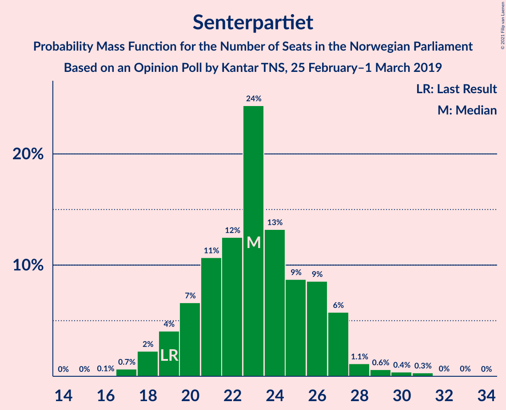

| Number of Seats | Probability | Accumulated | Special Marks |
|:---------------:|:-----------:|:-----------:|:-------------:|
| 16 | 0.1% | 100% |  |
| 17 | 0.7% | 99.9% |  |
| 18 | 2% | 99.3% |  |
| 19 | 4% | 97% | Last Result |
| 20 | 7% | 93% |  |
| 21 | 11% | 86% |  |
| 22 | 12% | 76% |  |
| 23 | 24% | 63% | Median |
| 24 | 13% | 39% |  |
| 25 | 9% | 26% |  |
| 26 | 9% | 17% |  |
| 27 | 6% | 8% |  |
| 28 | 1.1% | 3% |  |
| 29 | 0.6% | 1.4% |  |
| 30 | 0.4% | 0.8% |  |
| 31 | 0.3% | 0.4% |  |
| 32 | 0% | 0.1% |  |
| 33 | 0% | 0.1% |  |
| 34 | 0% | 0% |  |

### Fremskrittspartiet

*For a full overview of the results for this party, see the [Fremskrittspartiet](party-fremskrittspartiet.html) page.*

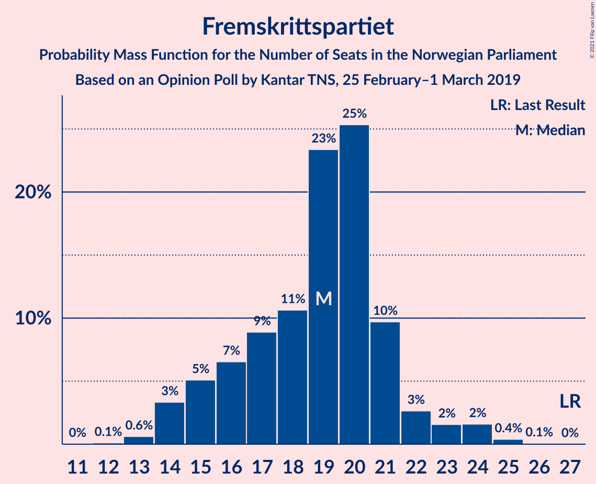

| Number of Seats | Probability | Accumulated | Special Marks |
|:---------------:|:-----------:|:-----------:|:-------------:|
| 12 | 0.1% | 100% |  |
| 13 | 0.6% | 99.9% |  |
| 14 | 3% | 99.2% |  |
| 15 | 5% | 96% |  |
| 16 | 7% | 91% |  |
| 17 | 9% | 84% |  |
| 18 | 11% | 75% |  |
| 19 | 23% | 65% | Median |
| 20 | 25% | 41% |  |
| 21 | 10% | 16% |  |
| 22 | 3% | 6% |  |
| 23 | 2% | 4% |  |
| 24 | 2% | 2% |  |
| 25 | 0.4% | 0.5% |  |
| 26 | 0.1% | 0.1% |  |
| 27 | 0% | 0% | Last Result |

### Sosialistisk Venstreparti

*For a full overview of the results for this party, see the [Sosialistisk Venstreparti](party-sosialistiskvenstreparti.html) page.*

| Number of Seats | Probability | Accumulated | Special Marks |
|:---------------:|:-----------:|:-----------:|:-------------:|
| 9 | 0.1% | 100% |  |
| 10 | 1.1% | 99.8% |  |
| 11 | 4% | 98.7% | Last Result |
| 12 | 7% | 94% |  |
| 13 | 11% | 87% |  |
| 14 | 30% | 76% | Median |
| 15 | 18% | 46% |  |
| 16 | 14% | 28% |  |
| 17 | 8% | 14% |  |
| 18 | 3% | 6% |  |
| 19 | 2% | 2% |  |
| 20 | 0.3% | 0.5% |  |
| 21 | 0.1% | 0.2% |  |
| 22 | 0.1% | 0.1% |  |
| 23 | 0% | 0% |  |

### Rødt

*For a full overview of the results for this party, see the [Rødt](party-rødt.html) page.*

| Number of Seats | Probability | Accumulated | Special Marks |
|:---------------:|:-----------:|:-----------:|:-------------:|
| 1 | 0.1% | 100% | Last Result |
| 2 | 14% | 99.9% |  |
| 3 | 0% | 86% |  |
| 4 | 0% | 86% |  |
| 5 | 0% | 86% |  |
| 6 | 0.4% | 86% |  |
| 7 | 4% | 86% |  |
| 8 | 22% | 82% |  |
| 9 | 30% | 59% | Median |
| 10 | 16% | 29% |  |
| 11 | 11% | 13% |  |
| 12 | 2% | 2% |  |
| 13 | 0.7% | 0.9% |  |
| 14 | 0.2% | 0.2% |  |
| 15 | 0% | 0% |  |

### Miljøpartiet De Grønne

*For a full overview of the results for this party, see the [Miljøpartiet De Grønne](party-miljøpartietdegrønne.html) page.*

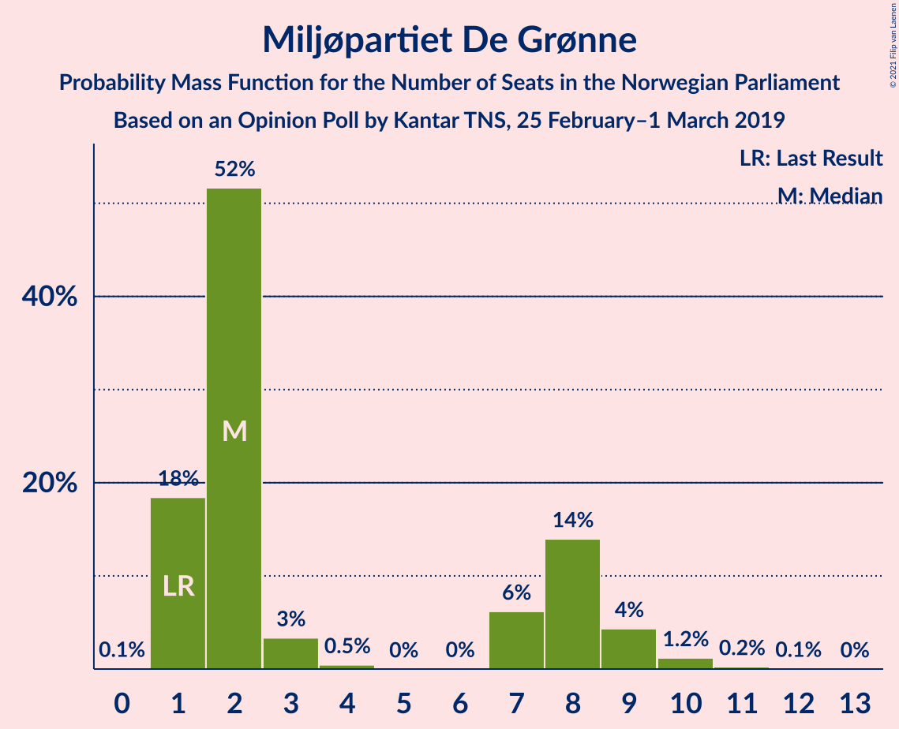

| Number of Seats | Probability | Accumulated | Special Marks |
|:---------------:|:-----------:|:-----------:|:-------------:|
| 0 | 0.1% | 100% |  |
| 1 | 18% | 99.9% | Last Result |
| 2 | 52% | 82% | Median |
| 3 | 3% | 30% |  |
| 4 | 0.5% | 26% |  |
| 5 | 0% | 26% |  |
| 6 | 0% | 26% |  |
| 7 | 6% | 26% |  |
| 8 | 14% | 20% |  |
| 9 | 4% | 6% |  |
| 10 | 1.2% | 2% |  |
| 11 | 0.2% | 0.3% |  |
| 12 | 0.1% | 0.1% |  |
| 13 | 0% | 0% |  |

### Kristelig Folkeparti

*For a full overview of the results for this party, see the [Kristelig Folkeparti](party-kristeligfolkeparti.html) page.*

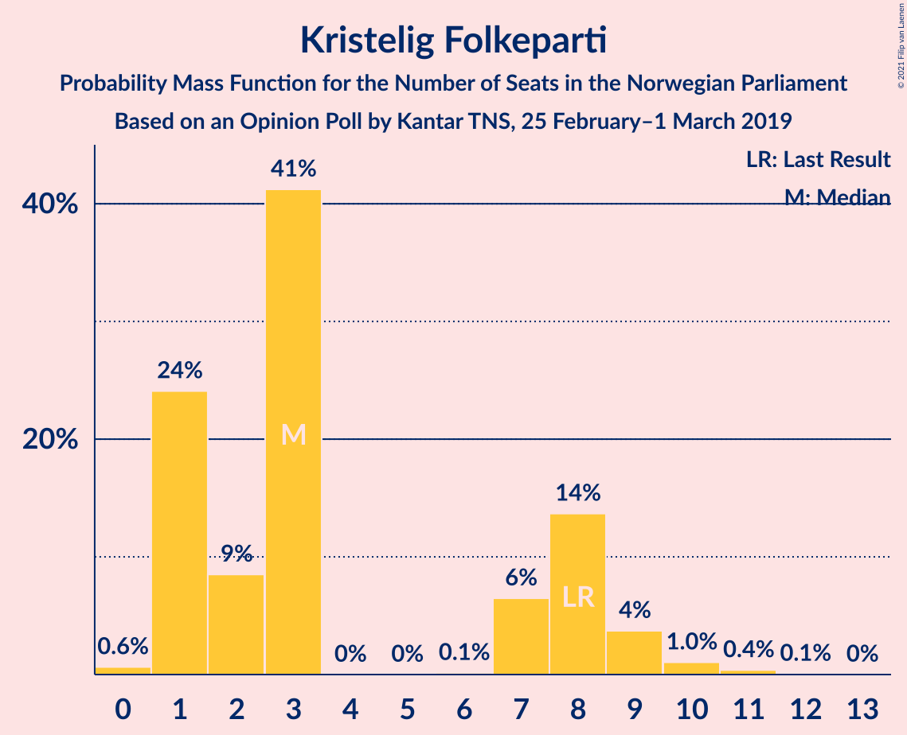

| Number of Seats | Probability | Accumulated | Special Marks |
|:---------------:|:-----------:|:-----------:|:-------------:|
| 0 | 0.6% | 100% |  |
| 1 | 24% | 99.4% |  |
| 2 | 9% | 75% |  |
| 3 | 41% | 67% | Median |
| 4 | 0% | 26% |  |
| 5 | 0% | 26% |  |
| 6 | 0.1% | 26% |  |
| 7 | 6% | 25% |  |
| 8 | 14% | 19% | Last Result |
| 9 | 4% | 5% |  |
| 10 | 1.0% | 2% |  |
| 11 | 0.4% | 0.5% |  |
| 12 | 0.1% | 0.1% |  |
| 13 | 0% | 0% |  |

### Venstre

*For a full overview of the results for this party, see the [Venstre](party-venstre.html) page.*

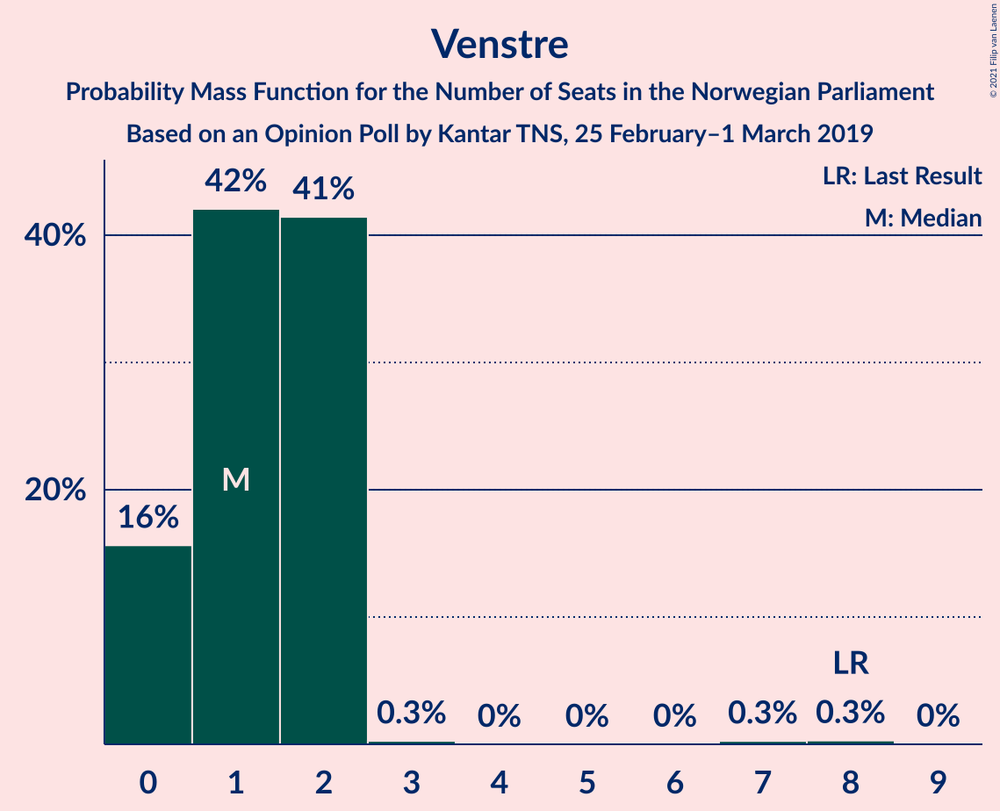

| Number of Seats | Probability | Accumulated | Special Marks |
|:---------------:|:-----------:|:-----------:|:-------------:|
| 0 | 16% | 100% |  |
| 1 | 42% | 84% | Median |
| 2 | 41% | 42% |  |
| 3 | 0.3% | 0.9% |  |
| 4 | 0% | 0.6% |  |
| 5 | 0% | 0.6% |  |
| 6 | 0% | 0.6% |  |
| 7 | 0.3% | 0.6% |  |
| 8 | 0.3% | 0.3% | Last Result |
| 9 | 0% | 0% |  |

## Coalitions

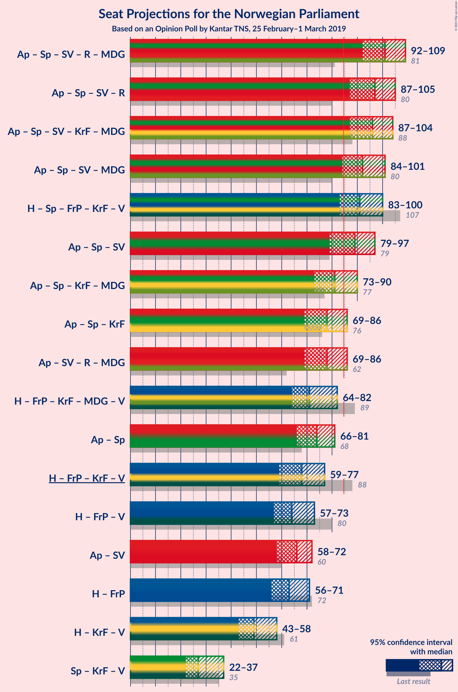

### Confidence Intervals

| Coalition | Last Result | Median | Majority? | 80% Confidence Interval | 90% Confidence Interval | 95% Confidence Interval | 99% Confidence Interval |
|:---------:|:-----------:|:------:|:---------:|:-----------------------:|:-----------------------:|:-----------------------:|:-----------------------:|
| Arbeiderpartiet – Senterpartiet – Sosialistisk Venstreparti – Rødt – Miljøpartiet De Grønne | 81 | 101 | 100% | 94–104 | 93–107 | 92–109 | 89–110 |
| Arbeiderpartiet – Senterpartiet – Sosialistisk Venstreparti – Rødt | 80 | 97 | 99.5% | 90–102 | 88–103 | 87–105 | 85–107 |
| Arbeiderpartiet – Senterpartiet – Sosialistisk Venstreparti – Kristelig Folkeparti – Miljøpartiet De Grønne | 88 | 96 | 99.8% | 90–101 | 88–103 | 87–104 | 85–107 |
| Arbeiderpartiet – Senterpartiet – Sosialistisk Venstreparti – Miljøpartiet De Grønne | 80 | 92 | 97% | 86–98 | 85–99 | 84–101 | 81–102 |
| Høyre – Senterpartiet – Fremskrittspartiet – Kristelig Folkeparti – Venstre | 107 | 91 | 95% | 87–97 | 84–99 | 83–100 | 81–103 |
| Arbeiderpartiet – Senterpartiet – Sosialistisk Venstreparti | 79 | 89 | 81% | 83–94 | 81–95 | 79–97 | 78–98 |
| Arbeiderpartiet – Senterpartiet – Kristelig Folkeparti – Miljøpartiet De Grønne | 77 | 81 | 21% | 75–87 | 74–89 | 73–90 | 71–93 |
| Arbeiderpartiet – Senterpartiet – Kristelig Folkeparti | 76 | 78 | 5% | 72–83 | 70–85 | 69–86 | 67–89 |
| Arbeiderpartiet – Sosialistisk Venstreparti – Rødt – Miljøpartiet De Grønne | 62 | 78 | 5% | 72–82 | 70–84 | 69–86 | 65–88 |
| Høyre – Fremskrittspartiet – Kristelig Folkeparti – Miljøpartiet De Grønne – Venstre | 89 | 71 | 0.3% | 67–78 | 66–80 | 64–82 | 61–84 |
| Arbeiderpartiet – Senterpartiet | 68 | 74 | 0.2% | 69–79 | 67–80 | 66–81 | 64–83 |
| Høyre – Fremskrittspartiet – Kristelig Folkeparti – Venstre | 88 | 68 | 0% | 64–74 | 62–76 | 59–77 | 59–79 |
| Høyre – Fremskrittspartiet – Venstre | 80 | 64 | 0% | 60–70 | 58–72 | 57–73 | 55–76 |
| Arbeiderpartiet – Sosialistisk Venstreparti | 60 | 66 | 0% | 60–70 | 59–71 | 58–72 | 56–75 |
| Høyre – Fremskrittspartiet | 72 | 63 | 0% | 58–68 | 57–70 | 56–71 | 54–74 |
| Høyre – Kristelig Folkeparti – Venstre | 61 | 49 | 0% | 46–55 | 44–56 | 43–58 | 41–61 |
| Senterpartiet – Kristelig Folkeparti – Venstre | 35 | 27 | 0% | 24–33 | 23–35 | 22–37 | 21–39 |

### Arbeiderpartiet – Senterpartiet – Sosialistisk Venstreparti – Rødt – Miljøpartiet De Grønne

| Number of Seats | Probability | Accumulated | Special Marks |
|:---------------:|:-----------:|:-----------:|:-------------:|
| 81 | 0% | 100% | Last Result |
| 82 | 0% | 100% |  |
| 83 | 0% | 100% |  |
| 84 | 0% | 100% |  |
| 85 | 0% | 100% | Majority |
| 86 | 0.1% | 100% |  |
| 87 | 0.1% | 99.9% |  |
| 88 | 0.2% | 99.8% |  |
| 89 | 0.4% | 99.7% |  |
| 90 | 0.9% | 99.3% |  |
| 91 | 0.8% | 98% |  |
| 92 | 2% | 98% |  |
| 93 | 3% | 96% |  |
| 94 | 3% | 93% |  |
| 95 | 4% | 90% |  |
| 96 | 8% | 86% |  |
| 97 | 5% | 78% |  |
| 98 | 7% | 73% |  |
| 99 | 6% | 65% | Median |
| 100 | 6% | 59% |  |
| 101 | 11% | 53% |  |
| 102 | 18% | 42% |  |
| 103 | 8% | 24% |  |
| 104 | 6% | 16% |  |
| 105 | 2% | 10% |  |
| 106 | 2% | 8% |  |
| 107 | 2% | 7% |  |
| 108 | 1.5% | 4% |  |
| 109 | 0.8% | 3% |  |
| 110 | 2% | 2% |  |
| 111 | 0.2% | 0.3% |  |
| 112 | 0% | 0.1% |  |
| 113 | 0.1% | 0.1% |  |
| 114 | 0% | 0% |  |

### Arbeiderpartiet – Senterpartiet – Sosialistisk Venstreparti – Rødt

| Number of Seats | Probability | Accumulated | Special Marks |
|:---------------:|:-----------:|:-----------:|:-------------:|
| 80 | 0% | 100% | Last Result |
| 81 | 0% | 100% |  |
| 82 | 0.1% | 99.9% |  |
| 83 | 0.1% | 99.9% |  |
| 84 | 0.2% | 99.8% |  |
| 85 | 0.7% | 99.5% | Majority |
| 86 | 0.5% | 98.9% |  |
| 87 | 2% | 98% |  |
| 88 | 2% | 96% |  |
| 89 | 2% | 94% |  |
| 90 | 3% | 93% |  |
| 91 | 5% | 90% |  |
| 92 | 3% | 84% |  |
| 93 | 5% | 82% |  |
| 94 | 8% | 77% |  |
| 95 | 9% | 68% |  |
| 96 | 5% | 60% |  |
| 97 | 5% | 55% | Median |
| 98 | 7% | 49% |  |
| 99 | 10% | 42% |  |
| 100 | 17% | 32% |  |
| 101 | 2% | 16% |  |
| 102 | 7% | 13% |  |
| 103 | 3% | 7% |  |
| 104 | 0.9% | 3% |  |
| 105 | 1.4% | 3% |  |
| 106 | 0.2% | 1.1% |  |
| 107 | 0.5% | 0.9% |  |
| 108 | 0.3% | 0.4% |  |
| 109 | 0.1% | 0.1% |  |
| 110 | 0% | 0% |  |

### Arbeiderpartiet – Senterpartiet – Sosialistisk Venstreparti – Kristelig Folkeparti – Miljøpartiet De Grønne

| Number of Seats | Probability | Accumulated | Special Marks |
|:---------------:|:-----------:|:-----------:|:-------------:|
| 83 | 0.1% | 100% |  |
| 84 | 0.1% | 99.9% |  |
| 85 | 0.4% | 99.8% | Majority |
| 86 | 0.5% | 99.4% |  |
| 87 | 2% | 98.9% |  |
| 88 | 2% | 97% | Last Result |
| 89 | 3% | 95% |  |
| 90 | 2% | 92% |  |
| 91 | 7% | 90% |  |
| 92 | 7% | 83% |  |
| 93 | 5% | 76% | Median |
| 94 | 11% | 70% |  |
| 95 | 9% | 60% |  |
| 96 | 16% | 51% |  |
| 97 | 4% | 35% |  |
| 98 | 9% | 31% |  |
| 99 | 4% | 22% |  |
| 100 | 3% | 18% |  |
| 101 | 6% | 16% |  |
| 102 | 3% | 10% |  |
| 103 | 2% | 7% |  |
| 104 | 2% | 5% |  |
| 105 | 1.3% | 2% |  |
| 106 | 0.4% | 1.1% |  |
| 107 | 0.4% | 0.7% |  |
| 108 | 0.1% | 0.3% |  |
| 109 | 0.1% | 0.1% |  |
| 110 | 0% | 0.1% |  |
| 111 | 0% | 0% |  |

### Arbeiderpartiet – Senterpartiet – Sosialistisk Venstreparti – Miljøpartiet De Grønne

| Number of Seats | Probability | Accumulated | Special Marks |
|:---------------:|:-----------:|:-----------:|:-------------:|
| 78 | 0% | 100% |  |
| 79 | 0.1% | 99.9% |  |
| 80 | 0.1% | 99.9% | Last Result |
| 81 | 0.5% | 99.7% |  |
| 82 | 0.6% | 99.2% |  |
| 83 | 0.9% | 98.7% |  |
| 84 | 0.7% | 98% |  |
| 85 | 5% | 97% | Majority |
| 86 | 2% | 92% |  |
| 87 | 5% | 89% |  |
| 88 | 8% | 85% |  |
| 89 | 5% | 76% |  |
| 90 | 5% | 71% | Median |
| 91 | 9% | 65% |  |
| 92 | 8% | 56% |  |
| 93 | 18% | 48% |  |
| 94 | 4% | 29% |  |
| 95 | 8% | 26% |  |
| 96 | 4% | 18% |  |
| 97 | 3% | 14% |  |
| 98 | 3% | 11% |  |
| 99 | 4% | 8% |  |
| 100 | 1.2% | 4% |  |
| 101 | 2% | 3% |  |
| 102 | 1.1% | 2% |  |
| 103 | 0.2% | 0.4% |  |
| 104 | 0.1% | 0.2% |  |
| 105 | 0.1% | 0.1% |  |
| 106 | 0% | 0.1% |  |
| 107 | 0% | 0.1% |  |
| 108 | 0% | 0% |  |

### Høyre – Senterpartiet – Fremskrittspartiet – Kristelig Folkeparti – Venstre

| Number of Seats | Probability | Accumulated | Special Marks |
|:---------------:|:-----------:|:-----------:|:-------------:|
| 77 | 0% | 100% |  |
| 78 | 0.1% | 99.9% |  |
| 79 | 0.1% | 99.9% |  |
| 80 | 0.1% | 99.8% |  |
| 81 | 0.4% | 99.7% |  |
| 82 | 0.8% | 99.2% |  |
| 83 | 3% | 98% |  |
| 84 | 0.9% | 96% |  |
| 85 | 1.5% | 95% | Majority |
| 86 | 3% | 93% |  |
| 87 | 4% | 91% |  |
| 88 | 6% | 86% |  |
| 89 | 10% | 80% |  |
| 90 | 16% | 70% | Median |
| 91 | 7% | 53% |  |
| 92 | 4% | 46% |  |
| 93 | 6% | 42% |  |
| 94 | 11% | 36% |  |
| 95 | 6% | 25% |  |
| 96 | 4% | 19% |  |
| 97 | 7% | 16% |  |
| 98 | 4% | 9% |  |
| 99 | 1.4% | 5% |  |
| 100 | 2% | 4% |  |
| 101 | 0.5% | 2% |  |
| 102 | 0.8% | 1.4% |  |
| 103 | 0.2% | 0.6% |  |
| 104 | 0.2% | 0.4% |  |
| 105 | 0.1% | 0.2% |  |
| 106 | 0% | 0.1% |  |
| 107 | 0% | 0% | Last Result |

### Arbeiderpartiet – Senterpartiet – Sosialistisk Venstreparti

| Number of Seats | Probability | Accumulated | Special Marks |
|:---------------:|:-----------:|:-----------:|:-------------:|
| 75 | 0.1% | 100% |  |
| 76 | 0.1% | 99.9% |  |
| 77 | 0.2% | 99.7% |  |
| 78 | 0.7% | 99.5% |  |
| 79 | 2% | 98.8% | Last Result |
| 80 | 1.0% | 97% |  |
| 81 | 2% | 96% |  |
| 82 | 4% | 94% |  |
| 83 | 4% | 90% |  |
| 84 | 6% | 86% |  |
| 85 | 7% | 81% | Majority |
| 86 | 8% | 73% |  |
| 87 | 5% | 66% |  |
| 88 | 5% | 61% | Median |
| 89 | 11% | 55% |  |
| 90 | 7% | 45% |  |
| 91 | 16% | 38% |  |
| 92 | 4% | 21% |  |
| 93 | 2% | 17% |  |
| 94 | 8% | 15% |  |
| 95 | 2% | 6% |  |
| 96 | 1.5% | 4% |  |
| 97 | 2% | 3% |  |
| 98 | 0.4% | 0.8% |  |
| 99 | 0.1% | 0.5% |  |
| 100 | 0.2% | 0.3% |  |
| 101 | 0.1% | 0.1% |  |
| 102 | 0% | 0% |  |

### Arbeiderpartiet – Senterpartiet – Kristelig Folkeparti – Miljøpartiet De Grønne

| Number of Seats | Probability | Accumulated | Special Marks |
|:---------------:|:-----------:|:-----------:|:-------------:|
| 68 | 0.1% | 100% |  |
| 69 | 0.1% | 99.9% |  |
| 70 | 0.2% | 99.8% |  |
| 71 | 0.3% | 99.7% |  |
| 72 | 1.0% | 99.3% |  |
| 73 | 1.3% | 98% |  |
| 74 | 4% | 97% |  |
| 75 | 5% | 93% |  |
| 76 | 2% | 88% |  |
| 77 | 7% | 85% | Last Result |
| 78 | 5% | 79% |  |
| 79 | 10% | 74% | Median |
| 80 | 13% | 64% |  |
| 81 | 5% | 51% |  |
| 82 | 15% | 46% |  |
| 83 | 6% | 31% |  |
| 84 | 4% | 26% |  |
| 85 | 4% | 21% | Majority |
| 86 | 4% | 17% |  |
| 87 | 5% | 13% |  |
| 88 | 1.0% | 8% |  |
| 89 | 3% | 7% |  |
| 90 | 2% | 4% |  |
| 91 | 1.0% | 2% |  |
| 92 | 0.4% | 1.2% |  |
| 93 | 0.5% | 0.9% |  |
| 94 | 0.2% | 0.3% |  |
| 95 | 0% | 0.2% |  |
| 96 | 0.1% | 0.1% |  |
| 97 | 0% | 0% |  |

### Arbeiderpartiet – Senterpartiet – Kristelig Folkeparti

| Number of Seats | Probability | Accumulated | Special Marks |
|:---------------:|:-----------:|:-----------:|:-------------:|
| 65 | 0.1% | 100% |  |
| 66 | 0.1% | 99.9% |  |
| 67 | 0.4% | 99.7% |  |
| 68 | 0.3% | 99.3% |  |
| 69 | 2% | 99.1% |  |
| 70 | 3% | 97% |  |
| 71 | 2% | 95% |  |
| 72 | 6% | 93% |  |
| 73 | 5% | 87% |  |
| 74 | 6% | 81% |  |
| 75 | 7% | 75% |  |
| 76 | 5% | 69% | Last Result |
| 77 | 10% | 63% | Median |
| 78 | 9% | 53% |  |
| 79 | 8% | 44% |  |
| 80 | 13% | 36% |  |
| 81 | 5% | 22% |  |
| 82 | 6% | 17% |  |
| 83 | 3% | 11% |  |
| 84 | 3% | 8% |  |
| 85 | 2% | 5% | Majority |
| 86 | 1.0% | 3% |  |
| 87 | 0.8% | 2% |  |
| 88 | 0.8% | 1.5% |  |
| 89 | 0.4% | 0.6% |  |
| 90 | 0.1% | 0.2% |  |
| 91 | 0.1% | 0.1% |  |
| 92 | 0% | 0.1% |  |
| 93 | 0% | 0% |  |

### Arbeiderpartiet – Sosialistisk Venstreparti – Rødt – Miljøpartiet De Grønne

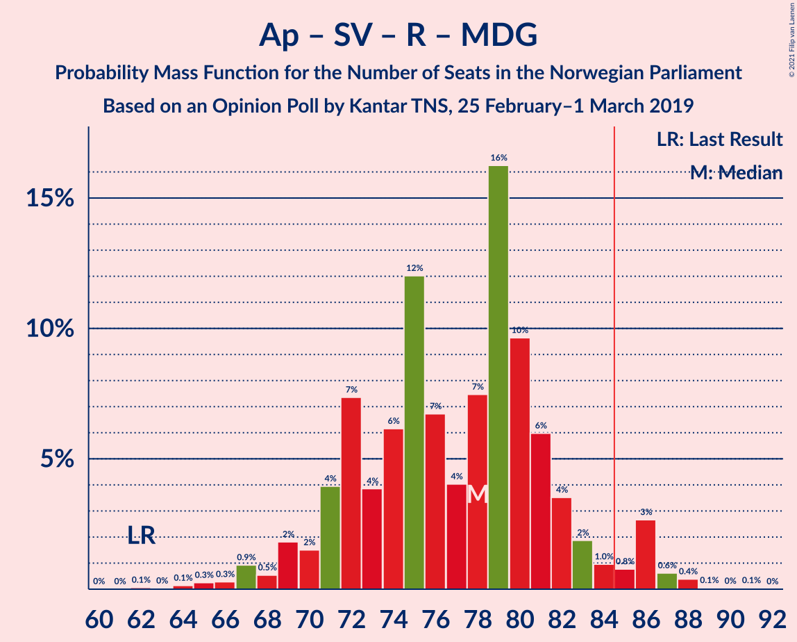

| Number of Seats | Probability | Accumulated | Special Marks |
|:---------------:|:-----------:|:-----------:|:-------------:|
| 62 | 0.1% | 100% | Last Result |
| 63 | 0% | 99.9% |  |
| 64 | 0.1% | 99.9% |  |
| 65 | 0.3% | 99.7% |  |
| 66 | 0.3% | 99.5% |  |
| 67 | 0.9% | 99.2% |  |
| 68 | 0.5% | 98% |  |
| 69 | 2% | 98% |  |
| 70 | 2% | 96% |  |
| 71 | 4% | 94% |  |
| 72 | 7% | 90% |  |
| 73 | 4% | 83% |  |
| 74 | 6% | 79% |  |
| 75 | 12% | 73% |  |
| 76 | 7% | 61% | Median |
| 77 | 4% | 54% |  |
| 78 | 7% | 50% |  |
| 79 | 16% | 43% |  |
| 80 | 10% | 27% |  |
| 81 | 6% | 17% |  |
| 82 | 4% | 11% |  |
| 83 | 2% | 7% |  |
| 84 | 1.0% | 6% |  |
| 85 | 0.8% | 5% | Majority |
| 86 | 3% | 4% |  |
| 87 | 0.6% | 1.2% |  |
| 88 | 0.4% | 0.5% |  |
| 89 | 0.1% | 0.1% |  |
| 90 | 0% | 0.1% |  |
| 91 | 0.1% | 0.1% |  |
| 92 | 0% | 0% |  |

### Høyre – Fremskrittspartiet – Kristelig Folkeparti – Miljøpartiet De Grønne – Venstre

| Number of Seats | Probability | Accumulated | Special Marks |
|:---------------:|:-----------:|:-----------:|:-------------:|
| 60 | 0.1% | 100% |  |
| 61 | 0.5% | 99.8% |  |
| 62 | 0.5% | 99.4% |  |
| 63 | 0.3% | 98.8% |  |
| 64 | 2% | 98.6% |  |
| 65 | 1.2% | 97% |  |
| 66 | 3% | 96% |  |
| 67 | 7% | 92% |  |
| 68 | 2% | 85% |  |
| 69 | 17% | 83% | Median |
| 70 | 10% | 66% |  |
| 71 | 8% | 56% |  |
| 72 | 5% | 48% |  |
| 73 | 5% | 43% |  |
| 74 | 9% | 38% |  |
| 75 | 8% | 29% |  |
| 76 | 4% | 20% |  |
| 77 | 3% | 16% |  |
| 78 | 5% | 13% |  |
| 79 | 3% | 9% |  |
| 80 | 1.4% | 6% |  |
| 81 | 1.3% | 4% |  |
| 82 | 2% | 3% |  |
| 83 | 0.3% | 1.0% |  |
| 84 | 0.3% | 0.6% |  |
| 85 | 0.2% | 0.3% | Majority |
| 86 | 0.1% | 0.1% |  |
| 87 | 0% | 0.1% |  |
| 88 | 0% | 0% |  |
| 89 | 0% | 0% | Last Result |

### Arbeiderpartiet – Senterpartiet

| Number of Seats | Probability | Accumulated | Special Marks |
|:---------------:|:-----------:|:-----------:|:-------------:|
| 61 | 0% | 100% |  |
| 62 | 0.1% | 99.9% |  |
| 63 | 0.2% | 99.9% |  |
| 64 | 0.6% | 99.7% |  |
| 65 | 1.0% | 99.0% |  |
| 66 | 2% | 98% |  |
| 67 | 3% | 96% |  |
| 68 | 3% | 93% | Last Result |
| 69 | 7% | 90% |  |
| 70 | 5% | 83% |  |
| 71 | 6% | 78% |  |
| 72 | 9% | 72% |  |
| 73 | 8% | 63% |  |
| 74 | 6% | 55% | Median |
| 75 | 8% | 49% |  |
| 76 | 10% | 41% |  |
| 77 | 13% | 30% |  |
| 78 | 5% | 18% |  |
| 79 | 4% | 13% |  |
| 80 | 5% | 8% |  |
| 81 | 2% | 4% |  |
| 82 | 0.5% | 2% |  |
| 83 | 1.0% | 1.4% |  |
| 84 | 0.1% | 0.4% |  |
| 85 | 0.1% | 0.2% | Majority |
| 86 | 0.1% | 0.1% |  |
| 87 | 0% | 0% |  |

### Høyre – Fremskrittspartiet – Kristelig Folkeparti – Venstre

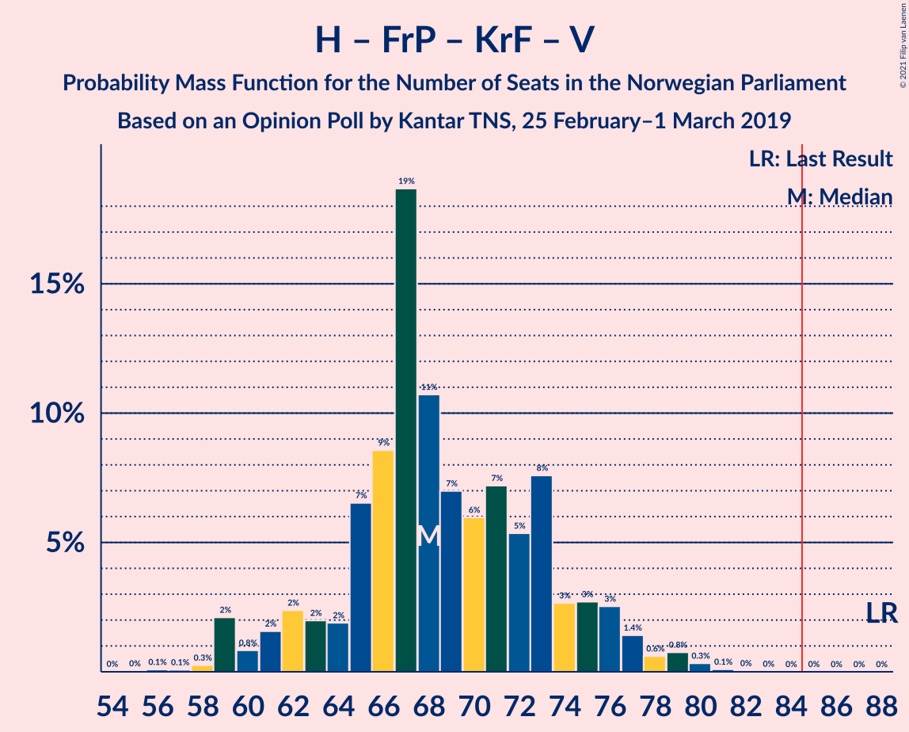

| Number of Seats | Probability | Accumulated | Special Marks |
|:---------------:|:-----------:|:-----------:|:-------------:|
| 56 | 0.1% | 100% |  |
| 57 | 0.1% | 99.9% |  |
| 58 | 0.3% | 99.8% |  |
| 59 | 2% | 99.5% |  |
| 60 | 0.8% | 97% |  |
| 61 | 2% | 97% |  |
| 62 | 2% | 95% |  |
| 63 | 2% | 93% |  |
| 64 | 2% | 91% |  |
| 65 | 7% | 89% |  |
| 66 | 9% | 82% |  |
| 67 | 19% | 74% | Median |
| 68 | 11% | 55% |  |
| 69 | 7% | 44% |  |
| 70 | 6% | 37% |  |
| 71 | 7% | 31% |  |
| 72 | 5% | 24% |  |
| 73 | 8% | 19% |  |
| 74 | 3% | 11% |  |
| 75 | 3% | 9% |  |
| 76 | 3% | 6% |  |
| 77 | 1.4% | 3% |  |
| 78 | 0.6% | 2% |  |
| 79 | 0.8% | 1.2% |  |
| 80 | 0.3% | 0.5% |  |
| 81 | 0.1% | 0.2% |  |
| 82 | 0% | 0.1% |  |
| 83 | 0% | 0% |  |
| 84 | 0% | 0% |  |
| 85 | 0% | 0% | Majority |
| 86 | 0% | 0% |  |
| 87 | 0% | 0% |  |
| 88 | 0% | 0% | Last Result |

### Høyre – Fremskrittspartiet – Venstre

| Number of Seats | Probability | Accumulated | Special Marks |
|:---------------:|:-----------:|:-----------:|:-------------:|
| 52 | 0.1% | 100% |  |
| 53 | 0.1% | 99.9% |  |
| 54 | 0.2% | 99.8% |  |
| 55 | 0.4% | 99.6% |  |
| 56 | 1.4% | 99.2% |  |
| 57 | 2% | 98% |  |
| 58 | 3% | 96% |  |
| 59 | 2% | 93% |  |
| 60 | 4% | 91% |  |
| 61 | 3% | 87% |  |
| 62 | 7% | 84% |  |
| 63 | 8% | 77% |  |
| 64 | 20% | 69% | Median |
| 65 | 10% | 50% |  |
| 66 | 5% | 40% |  |
| 67 | 11% | 35% |  |
| 68 | 7% | 24% |  |
| 69 | 7% | 18% |  |
| 70 | 3% | 11% |  |
| 71 | 2% | 8% |  |
| 72 | 3% | 5% |  |
| 73 | 0.9% | 3% |  |
| 74 | 0.8% | 2% |  |
| 75 | 0.4% | 1.0% |  |
| 76 | 0.5% | 0.6% |  |
| 77 | 0.1% | 0.1% |  |
| 78 | 0% | 0% |  |
| 79 | 0% | 0% |  |
| 80 | 0% | 0% | Last Result |

### Arbeiderpartiet – Sosialistisk Venstreparti

| Number of Seats | Probability | Accumulated | Special Marks |
|:---------------:|:-----------:|:-----------:|:-------------:|
| 54 | 0.1% | 100% |  |
| 55 | 0.3% | 99.8% |  |
| 56 | 0.6% | 99.5% |  |
| 57 | 1.0% | 98.9% |  |
| 58 | 2% | 98% |  |
| 59 | 4% | 96% |  |
| 60 | 4% | 92% | Last Result |
| 61 | 6% | 89% |  |
| 62 | 9% | 82% |  |
| 63 | 8% | 74% |  |
| 64 | 8% | 66% |  |
| 65 | 8% | 58% | Median |
| 66 | 7% | 50% |  |
| 67 | 5% | 43% |  |
| 68 | 18% | 38% |  |
| 69 | 6% | 20% |  |
| 70 | 4% | 14% |  |
| 71 | 5% | 9% |  |
| 72 | 2% | 4% |  |
| 73 | 1.2% | 2% |  |
| 74 | 0.4% | 0.9% |  |
| 75 | 0.2% | 0.5% |  |
| 76 | 0.2% | 0.3% |  |
| 77 | 0% | 0% |  |

### Høyre – Fremskrittspartiet

| Number of Seats | Probability | Accumulated | Special Marks |
|:---------------:|:-----------:|:-----------:|:-------------:|
| 51 | 0.1% | 100% |  |
| 52 | 0.1% | 99.9% |  |
| 53 | 0.2% | 99.8% |  |
| 54 | 0.7% | 99.5% |  |
| 55 | 0.6% | 98.8% |  |
| 56 | 3% | 98% |  |
| 57 | 3% | 96% |  |
| 58 | 4% | 93% |  |
| 59 | 3% | 89% |  |
| 60 | 5% | 86% |  |
| 61 | 9% | 81% |  |
| 62 | 7% | 72% |  |
| 63 | 17% | 66% | Median |
| 64 | 10% | 48% |  |
| 65 | 5% | 38% |  |
| 66 | 11% | 33% |  |
| 67 | 8% | 22% |  |
| 68 | 5% | 14% |  |
| 69 | 2% | 9% |  |
| 70 | 4% | 7% |  |
| 71 | 1.4% | 3% |  |
| 72 | 0.3% | 2% | Last Result |
| 73 | 0.7% | 2% |  |
| 74 | 0.4% | 0.9% |  |
| 75 | 0.4% | 0.5% |  |
| 76 | 0% | 0.1% |  |
| 77 | 0% | 0% |  |

### Høyre – Kristelig Folkeparti – Venstre

| Number of Seats | Probability | Accumulated | Special Marks |
|:---------------:|:-----------:|:-----------:|:-------------:|
| 39 | 0.1% | 100% |  |
| 40 | 0.2% | 99.9% |  |
| 41 | 0.3% | 99.7% |  |
| 42 | 0.5% | 99.4% |  |
| 43 | 2% | 98.9% |  |
| 44 | 3% | 97% |  |
| 45 | 2% | 93% |  |
| 46 | 9% | 91% |  |
| 47 | 18% | 82% |  |
| 48 | 13% | 64% | Median |
| 49 | 5% | 51% |  |
| 50 | 4% | 46% |  |
| 51 | 6% | 41% |  |
| 52 | 5% | 35% |  |
| 53 | 11% | 30% |  |
| 54 | 7% | 19% |  |
| 55 | 3% | 12% |  |
| 56 | 3% | 8% |  |
| 57 | 2% | 5% |  |
| 58 | 1.5% | 3% |  |
| 59 | 0.3% | 2% |  |
| 60 | 0.4% | 1.3% |  |
| 61 | 0.4% | 0.9% | Last Result |
| 62 | 0.3% | 0.4% |  |
| 63 | 0.1% | 0.1% |  |
| 64 | 0% | 0% |  |

### Senterpartiet – Kristelig Folkeparti – Venstre

| Number of Seats | Probability | Accumulated | Special Marks |
|:---------------:|:-----------:|:-----------:|:-------------:|
| 19 | 0% | 100% |  |
| 20 | 0.2% | 99.9% |  |
| 21 | 0.7% | 99.7% |  |
| 22 | 3% | 99.0% |  |
| 23 | 3% | 96% |  |
| 24 | 4% | 94% |  |
| 25 | 8% | 89% |  |
| 26 | 7% | 82% |  |
| 27 | 32% | 75% | Median |
| 28 | 9% | 43% |  |
| 29 | 7% | 34% |  |
| 30 | 5% | 27% |  |
| 31 | 7% | 22% |  |
| 32 | 4% | 15% |  |
| 33 | 4% | 11% |  |
| 34 | 1.4% | 7% |  |
| 35 | 2% | 6% | Last Result |
| 36 | 0.8% | 4% |  |
| 37 | 1.4% | 3% |  |
| 38 | 0.8% | 1.4% |  |
| 39 | 0.3% | 0.6% |  |
| 40 | 0.1% | 0.3% |  |
| 41 | 0.1% | 0.1% |  |
| 42 | 0% | 0.1% |  |
| 43 | 0% | 0% |  |

## Technical Information

### Opinion Poll

+ **Polling firm:** Kantar TNS
+ **Commissioner(s):** —
+ **Fieldwork period:** 25 February–1 March 2019

### Calculations

+ **Sample size:** 716
+ **Simulations done:** 1,048,576
+ **Error estimate:** 2.58%

