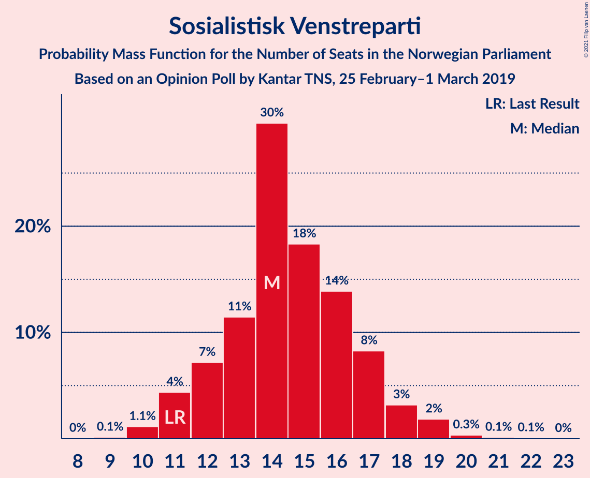
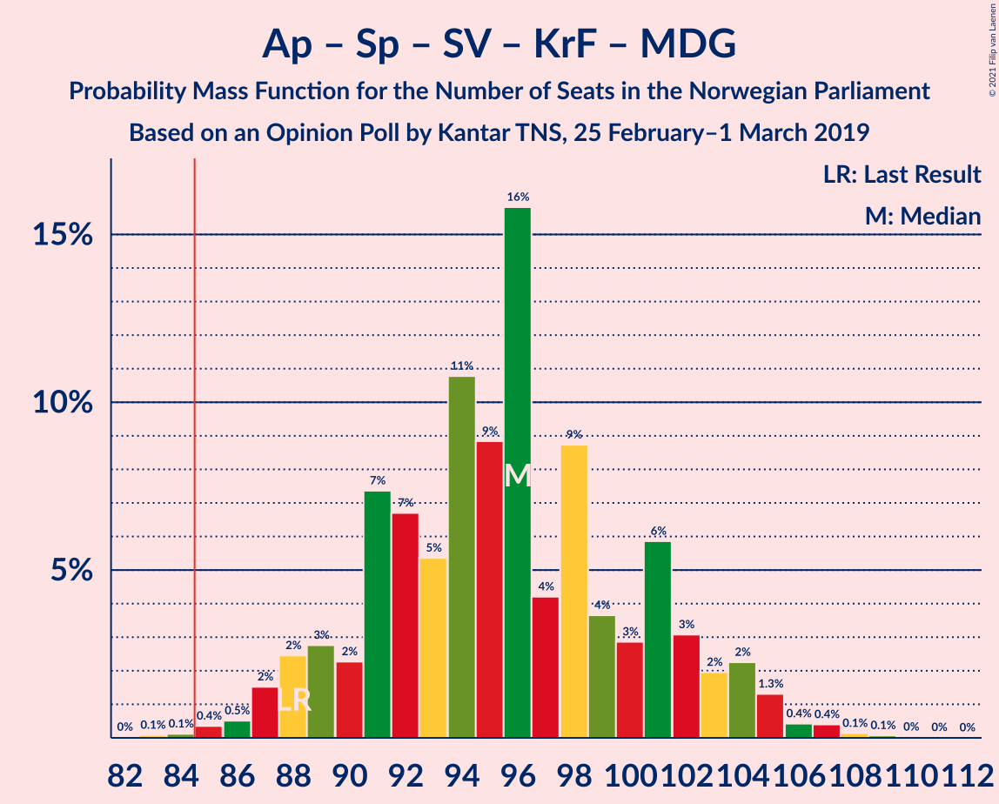
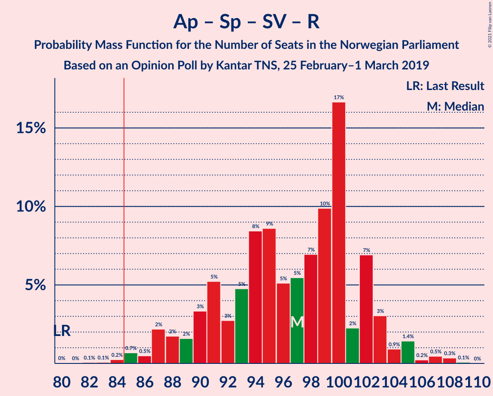
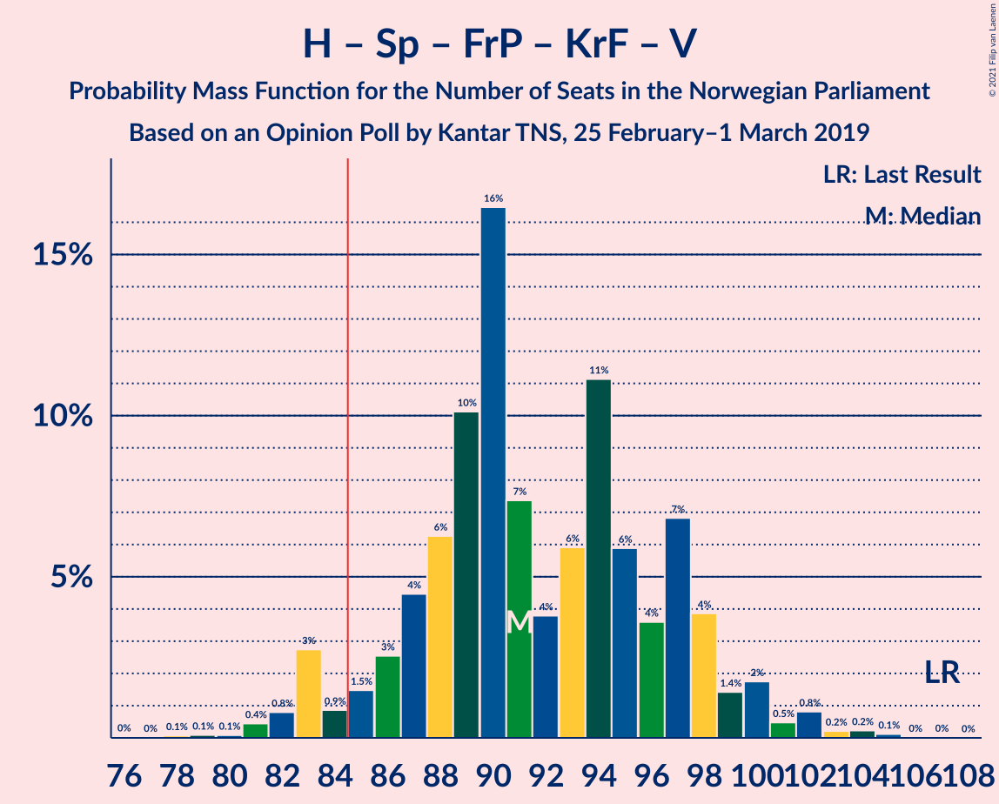
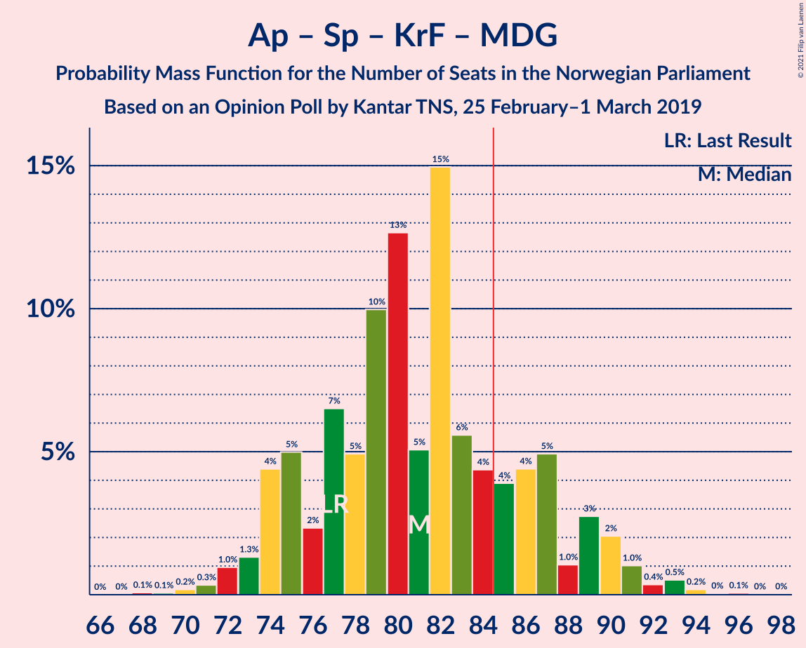
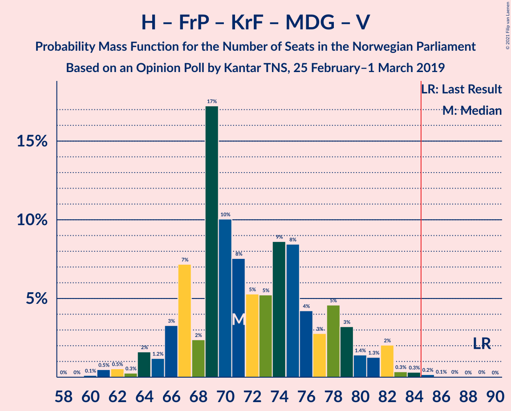
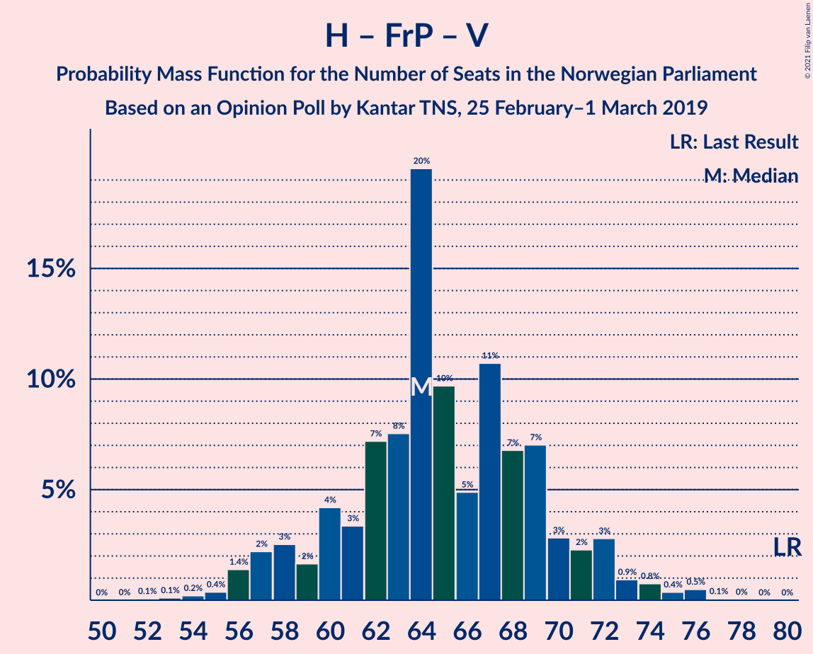
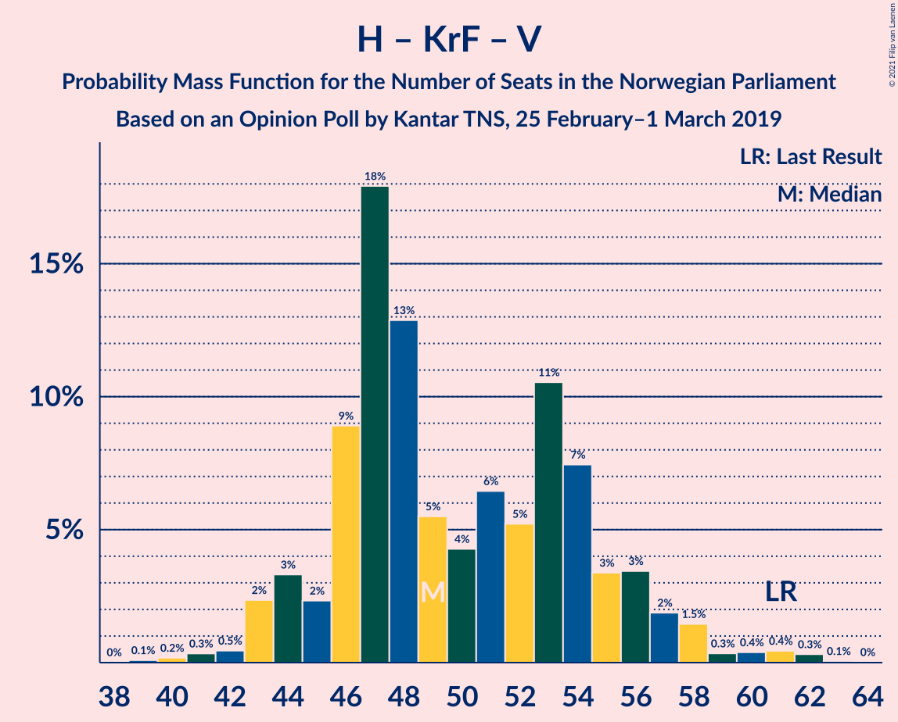
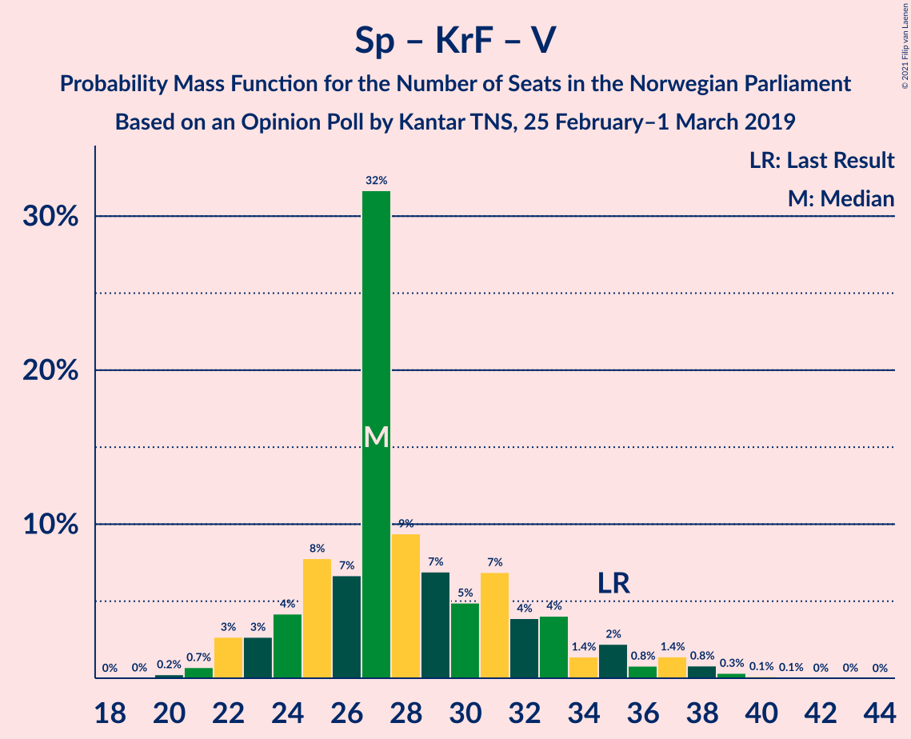

# Opinion Poll by Kantar TNS, 25 February–1 March 2019

<a href="#voting-intentions">Voting Intentions</a> | <a href="#seats">Seats</a> | <a href="#coalitions">Coalitions</a> | <a href="#technical-information">Technical Information</a>

## Voting Intentions

### Confidence Intervals

| Party | Last Result | Poll Result | 80% Confidence Interval | 90% Confidence Interval | 95% Confidence Interval | 99% Confidence Interval |
|:-----:|:-----------:|:-----------:|:-----------------------:|:-----------------------:|:-----------------------:|:-----------------------:|
| Arbeiderpartiet | 27.4% | 27.4% | 25.3–29.6% |24.7–30.2% |24.2–30.8% |23.3–31.8% |
| Høyre | 25.0% | 24.7% | 22.7–26.9% |22.2–27.5% |21.7–28.0% |20.8–29.1% |
| Senterpartiet | 10.3% | 12.7% | 11.2–14.4% |10.8–14.9% |10.5–15.4% |9.8–16.2% |
| Fremskrittspartiet | 15.2% | 10.2% | 8.9–11.8% |8.5–12.2% |8.2–12.6% |7.6–13.4% |
| Sosialistisk Venstreparti | 6.0% | 8.0% | 6.8–9.4% |6.5–9.8% |6.2–10.2% |5.7–10.9% |
| Rødt | 2.4% | 4.7% | 3.9–5.9% |3.6–6.3% |3.4–6.6% |3.0–7.2% |
| Miljøpartiet De Grønne | 3.2% | 3.6% | 2.9–4.7% |2.7–5.0% |2.5–5.3% |2.2–5.8% |
| Kristelig Folkeparti | 4.2% | 3.6% | 2.9–4.7% |2.7–5.0% |2.5–5.3% |2.2–5.8% |
| Venstre | 4.4% | 2.2% | 1.7–3.1% |1.5–3.4% |1.4–3.6% |1.1–4.1% |

*Note:* The poll result column reflects the actual value used in the calculations. Published results may vary slightly, and in addition be rounded to fewer digits.

## Seats

### Confidence Intervals

| Party | Last Result | Median | 80% Confidence Interval | 90% Confidence Interval | 95% Confidence Interval | 99% Confidence Interval |
|:-----:|:-----------:|:------:|:-----------------------:|:-----------------------:|:-----------------------:|:-----------------------:|
| <a href="#arbeiderpartiet">Arbeiderpartiet</a> | 49 | 48 | 45–54 |44–56 |44–57 |43–60 |
| <a href="#høyre">Høyre</a> | 45 | 47 | 41–51 |39–51 |38–51 |36–53 |
| <a href="#senterpartiet">Senterpartiet</a> | 19 | 24 | 20–27 |19–27 |18–28 |18–30 |
| <a href="#fremskrittspartiet">Fremskrittspartiet</a> | 27 | 19 | 15–21 |15–21 |14–22 |13–25 |
| <a href="#sosialistisk-venstreparti">Sosialistisk Venstreparti</a> | 11 | 15 | 12–17 |12–18 |11–18 |10–20 |
| <a href="#rødt">Rødt</a> | 1 | 8 | 2–11 |2–11 |2–12 |2–13 |
| <a href="#miljøpartiet-de-grønne">Miljøpartiet De Grønne</a> | 1 | 2 | 1–8 |1–9 |1–9 |1–10 |
| <a href="#kristelig-folkeparti">Kristelig Folkeparti</a> | 8 | 3 | 1–8 |1–8 |1–9 |0–10 |
| <a href="#venstre">Venstre</a> | 8 | 2 | 0–2 |0–2 |0–2 |0–8 |

### Arbeiderpartiet

*For a full overview of the results for this party, see the [Arbeiderpartiet](party-arbeiderpartiet.html) page.*

| Number of Seats | Probability | Accumulated | Special Marks |
|:---------------:|:-----------:|:-----------:|:-------------:|
| 40 | 0.1% | 100% |  |
| 41 | 0.2% | 99.9% |  |
| 42 | 0.2% | 99.8% |  |
| 43 | 1.4% | 99.5% |  |
| 44 | 8% | 98% |  |
| 45 | 3% | 90% |  |
| 46 | 10% | 87% |  |
| 47 | 25% | 77% |  |
| 48 | 9% | 52% | Median |
| 49 | 11% | 43% | Last Result |
| 50 | 5% | 32% |  |
| 51 | 4% | 27% |  |
| 52 | 7% | 22% |  |
| 53 | 4% | 15% |  |
| 54 | 3% | 11% |  |
| 55 | 3% | 8% |  |
| 56 | 0.4% | 5% |  |
| 57 | 3% | 5% |  |
| 58 | 0.8% | 2% |  |
| 59 | 0.5% | 2% |  |
| 60 | 0.8% | 1.0% |  |
| 61 | 0.1% | 0.2% |  |
| 62 | 0.1% | 0.1% |  |
| 63 | 0% | 0% |  |

### Høyre

*For a full overview of the results for this party, see the [Høyre](party-høyre.html) page.*

| Number of Seats | Probability | Accumulated | Special Marks |
|:---------------:|:-----------:|:-----------:|:-------------:|
| 34 | 0.2% | 100% |  |
| 35 | 0.2% | 99.8% |  |
| 36 | 0.3% | 99.5% |  |
| 37 | 0.3% | 99.2% |  |
| 38 | 3% | 99.0% |  |
| 39 | 3% | 96% |  |
| 40 | 2% | 93% |  |
| 41 | 2% | 91% |  |
| 42 | 4% | 89% |  |
| 43 | 8% | 85% |  |
| 44 | 8% | 77% |  |
| 45 | 4% | 68% | Last Result |
| 46 | 6% | 64% |  |
| 47 | 15% | 58% | Median |
| 48 | 13% | 43% |  |
| 49 | 5% | 30% |  |
| 50 | 7% | 25% |  |
| 51 | 17% | 18% |  |
| 52 | 0.6% | 1.4% |  |
| 53 | 0.5% | 0.8% |  |
| 54 | 0.1% | 0.3% |  |
| 55 | 0.2% | 0.2% |  |
| 56 | 0% | 0% |  |

### Senterpartiet

*For a full overview of the results for this party, see the [Senterpartiet](party-senterpartiet.html) page.*

| Number of Seats | Probability | Accumulated | Special Marks |
|:---------------:|:-----------:|:-----------:|:-------------:|
| 16 | 0.2% | 100% |  |
| 17 | 0.2% | 99.8% |  |
| 18 | 2% | 99.5% |  |
| 19 | 4% | 97% | Last Result |
| 20 | 12% | 94% |  |
| 21 | 12% | 82% |  |
| 22 | 7% | 70% |  |
| 23 | 10% | 63% |  |
| 24 | 24% | 53% | Median |
| 25 | 7% | 29% |  |
| 26 | 5% | 22% |  |
| 27 | 15% | 17% |  |
| 28 | 0.8% | 3% |  |
| 29 | 0.8% | 2% |  |
| 30 | 0.9% | 1.1% |  |
| 31 | 0.1% | 0.2% |  |
| 32 | 0.1% | 0.1% |  |
| 33 | 0% | 0.1% |  |
| 34 | 0% | 0% |  |

### Fremskrittspartiet

*For a full overview of the results for this party, see the [Fremskrittspartiet](party-fremskrittspartiet.html) page.*

| Number of Seats | Probability | Accumulated | Special Marks |
|:---------------:|:-----------:|:-----------:|:-------------:|
| 11 | 0% | 100% |  |
| 12 | 0.2% | 99.9% |  |
| 13 | 1.1% | 99.7% |  |
| 14 | 2% | 98.7% |  |
| 15 | 9% | 97% |  |
| 16 | 7% | 88% |  |
| 17 | 9% | 80% |  |
| 18 | 14% | 71% |  |
| 19 | 34% | 57% | Median |
| 20 | 7% | 23% |  |
| 21 | 12% | 16% |  |
| 22 | 3% | 4% |  |
| 23 | 0.3% | 2% |  |
| 24 | 0.3% | 1.2% |  |
| 25 | 0.8% | 0.9% |  |
| 26 | 0.1% | 0.1% |  |
| 27 | 0% | 0% | Last Result |

### Sosialistisk Venstreparti

*For a full overview of the results for this party, see the [Sosialistisk Venstreparti](party-sosialistiskvenstreparti.html) page.*

| Number of Seats | Probability | Accumulated | Special Marks |
|:---------------:|:-----------:|:-----------:|:-------------:|
| 9 | 0.2% | 100% |  |
| 10 | 0.3% | 99.8% |  |
| 11 | 3% | 99.4% | Last Result |
| 12 | 10% | 96% |  |
| 13 | 12% | 87% |  |
| 14 | 22% | 75% |  |
| 15 | 30% | 53% | Median |
| 16 | 8% | 22% |  |
| 17 | 8% | 14% |  |
| 18 | 4% | 6% |  |
| 19 | 0.5% | 2% |  |
| 20 | 0.7% | 1.1% |  |
| 21 | 0.3% | 0.4% |  |
| 22 | 0% | 0% |  |

### Rødt

*For a full overview of the results for this party, see the [Rødt](party-rødt.html) page.*

| Number of Seats | Probability | Accumulated | Special Marks |
|:---------------:|:-----------:|:-----------:|:-------------:|
| 1 | 0.1% | 100% | Last Result |
| 2 | 13% | 99.9% |  |
| 3 | 0% | 87% |  |
| 4 | 0% | 87% |  |
| 5 | 0% | 87% |  |
| 6 | 0.1% | 87% |  |
| 7 | 13% | 87% |  |
| 8 | 32% | 74% | Median |
| 9 | 17% | 42% |  |
| 10 | 10% | 25% |  |
| 11 | 12% | 15% |  |
| 12 | 2% | 3% |  |
| 13 | 0.6% | 0.8% |  |
| 14 | 0.1% | 0.2% |  |
| 15 | 0% | 0% |  |

### Miljøpartiet De Grønne

*For a full overview of the results for this party, see the [Miljøpartiet De Grønne](party-miljøpartietdegrønne.html) page.*

| Number of Seats | Probability | Accumulated | Special Marks |
|:---------------:|:-----------:|:-----------:|:-------------:|
| 0 | 0.1% | 100% |  |
| 1 | 13% | 99.9% | Last Result |
| 2 | 48% | 87% | Median |
| 3 | 5% | 39% |  |
| 4 | 0.2% | 34% |  |
| 5 | 0% | 34% |  |
| 6 | 0% | 34% |  |
| 7 | 11% | 34% |  |
| 8 | 15% | 23% |  |
| 9 | 7% | 8% |  |
| 10 | 1.2% | 1.4% |  |
| 11 | 0.2% | 0.3% |  |
| 12 | 0% | 0% |  |

### Kristelig Folkeparti

*For a full overview of the results for this party, see the [Kristelig Folkeparti](party-kristeligfolkeparti.html) page.*

| Number of Seats | Probability | Accumulated | Special Marks |
|:---------------:|:-----------:|:-----------:|:-------------:|
| 0 | 0.8% | 100% |  |
| 1 | 27% | 99.2% |  |
| 2 | 11% | 72% |  |
| 3 | 36% | 62% | Median |
| 4 | 0% | 26% |  |
| 5 | 0% | 26% |  |
| 6 | 0.3% | 26% |  |
| 7 | 7% | 26% |  |
| 8 | 14% | 18% | Last Result |
| 9 | 3% | 4% |  |
| 10 | 0.5% | 1.0% |  |
| 11 | 0.4% | 0.5% |  |
| 12 | 0.1% | 0.1% |  |
| 13 | 0% | 0% |  |

### Venstre

*For a full overview of the results for this party, see the [Venstre](party-venstre.html) page.*

| Number of Seats | Probability | Accumulated | Special Marks |
|:---------------:|:-----------:|:-----------:|:-------------:|
| 0 | 23% | 100% |  |
| 1 | 14% | 77% |  |
| 2 | 62% | 64% | Median |
| 3 | 0% | 2% |  |
| 4 | 0% | 2% |  |
| 5 | 0% | 2% |  |
| 6 | 0% | 2% |  |
| 7 | 0.5% | 2% |  |
| 8 | 1.0% | 1.1% | Last Result |
| 9 | 0% | 0% |  |

## Coalitions

### Confidence Intervals

| Coalition | Last Result | Median | Majority? | 80% Confidence Interval | 90% Confidence Interval | 95% Confidence Interval | 99% Confidence Interval |
|:---------:|:-----------:|:------:|:---------:|:-----------------------:|:-----------------------:|:-----------------------:|:-----------------------:|
| Arbeiderpartiet – Senterpartiet – Sosialistisk Venstreparti – Rødt – Miljøpartiet De Grønne | 81 | 98 | 99.9% | 95–104 | 93–106 | 93–108 | 88–110 |
| Arbeiderpartiet – Senterpartiet – Sosialistisk Venstreparti – Kristelig Folkeparti – Miljøpartiet De Grønne | 88 | 94 | 99.8% | 88–101 | 88–103 | 87–105 | 86–107 |
| Arbeiderpartiet – Senterpartiet – Sosialistisk Venstreparti – Rødt | 80 | 94 | 99.3% | 91–101 | 89–102 | 88–103 | 82–104 |
| Arbeiderpartiet – Senterpartiet – Sosialistisk Venstreparti – Miljøpartiet De Grønne | 80 | 90 | 98% | 85–96 | 85–99 | 85–100 | 82–103 |
| Høyre – Senterpartiet – Fremskrittspartiet – Kristelig Folkeparti – Venstre | 107 | 94 | 97% | 87–98 | 86–98 | 84–99 | 81–102 |
| Arbeiderpartiet – Senterpartiet – Sosialistisk Venstreparti | 79 | 86 | 66% | 82–93 | 81–94 | 79–97 | 78–100 |
| Arbeiderpartiet – Senterpartiet – Kristelig Folkeparti – Miljøpartiet De Grønne | 77 | 80 | 19% | 74–87 | 73–89 | 72–90 | 71–92 |
| Arbeiderpartiet – Senterpartiet – Kristelig Folkeparti | 76 | 74 | 7% | 70–83 | 70–86 | 70–87 | 67–89 |
| Arbeiderpartiet – Senterpartiet | 68 | 71 | 0.8% | 67–78 | 67–80 | 65–81 | 64–86 |
| Høyre – Fremskrittspartiet – Kristelig Folkeparti – Miljøpartiet De Grønne – Venstre | 89 | 75 | 0.6% | 68–78 | 66–79 | 65–81 | 63–86 |
| Høyre – Fremskrittspartiet – Kristelig Folkeparti – Venstre | 88 | 71 | 0% | 64–73 | 62–75 | 61–76 | 58–81 |
| Arbeiderpartiet – Sosialistisk Venstreparti | 60 | 62 | 0% | 59–69 | 58–71 | 57–72 | 55–73 |
| Høyre – Fremskrittspartiet – Venstre | 80 | 68 | 0% | 59–72 | 58–72 | 57–72 | 54–73 |
| Høyre – Fremskrittspartiet | 72 | 66 | 0% | 58–70 | 57–70 | 57–70 | 53–72 |
| Høyre – Kristelig Folkeparti – Venstre | 61 | 53 | 0% | 47–54 | 44–57 | 44–57 | 41–61 |
| Senterpartiet – Kristelig Folkeparti – Venstre | 35 | 27 | 0% | 25–33 | 24–35 | 23–35 | 20–37 |

### Arbeiderpartiet – Senterpartiet – Sosialistisk Venstreparti – Rødt – Miljøpartiet De Grønne

| Number of Seats | Probability | Accumulated | Special Marks |
|:---------------:|:-----------:|:-----------:|:-------------:|
| 81 | 0% | 100% | Last Result |
| 82 | 0% | 100% |  |
| 83 | 0% | 100% |  |
| 84 | 0% | 100% |  |
| 85 | 0% | 99.9% | Majority |
| 86 | 0% | 99.9% |  |
| 87 | 0.1% | 99.9% |  |
| 88 | 0.6% | 99.8% |  |
| 89 | 0.2% | 99.2% |  |
| 90 | 0.3% | 99.1% |  |
| 91 | 0.2% | 98.8% |  |
| 92 | 0.4% | 98.5% |  |
| 93 | 5% | 98% |  |
| 94 | 2% | 93% |  |
| 95 | 3% | 91% |  |
| 96 | 27% | 88% |  |
| 97 | 6% | 62% | Median |
| 98 | 19% | 56% |  |
| 99 | 2% | 37% |  |
| 100 | 9% | 35% |  |
| 101 | 4% | 26% |  |
| 102 | 5% | 22% |  |
| 103 | 5% | 17% |  |
| 104 | 3% | 12% |  |
| 105 | 2% | 9% |  |
| 106 | 3% | 7% |  |
| 107 | 0.6% | 4% |  |
| 108 | 2% | 3% |  |
| 109 | 0.2% | 0.8% |  |
| 110 | 0.4% | 0.6% |  |
| 111 | 0.1% | 0.2% |  |
| 112 | 0% | 0.1% |  |
| 113 | 0% | 0% |  |

### Arbeiderpartiet – Senterpartiet – Sosialistisk Venstreparti – Kristelig Folkeparti – Miljøpartiet De Grønne

| Number of Seats | Probability | Accumulated | Special Marks |
|:---------------:|:-----------:|:-----------:|:-------------:|
| 83 | 0.1% | 100% |  |
| 84 | 0% | 99.9% |  |
| 85 | 0.1% | 99.8% | Majority |
| 86 | 0.3% | 99.8% |  |
| 87 | 4% | 99.5% |  |
| 88 | 6% | 95% | Last Result |
| 89 | 17% | 90% |  |
| 90 | 4% | 72% |  |
| 91 | 2% | 68% |  |
| 92 | 8% | 67% | Median |
| 93 | 3% | 58% |  |
| 94 | 13% | 55% |  |
| 95 | 3% | 42% |  |
| 96 | 8% | 39% |  |
| 97 | 6% | 31% |  |
| 98 | 2% | 25% |  |
| 99 | 9% | 24% |  |
| 100 | 3% | 14% |  |
| 101 | 2% | 12% |  |
| 102 | 2% | 9% |  |
| 103 | 3% | 7% |  |
| 104 | 0.9% | 4% |  |
| 105 | 0.6% | 3% |  |
| 106 | 0.3% | 2% |  |
| 107 | 2% | 2% |  |
| 108 | 0% | 0.3% |  |
| 109 | 0.1% | 0.3% |  |
| 110 | 0.1% | 0.2% |  |
| 111 | 0% | 0.1% |  |
| 112 | 0% | 0% |  |

### Arbeiderpartiet – Senterpartiet – Sosialistisk Venstreparti – Rødt

| Number of Seats | Probability | Accumulated | Special Marks |
|:---------------:|:-----------:|:-----------:|:-------------:|
| 80 | 0.3% | 100% | Last Result |
| 81 | 0% | 99.7% |  |
| 82 | 0.2% | 99.6% |  |
| 83 | 0.1% | 99.5% |  |
| 84 | 0.1% | 99.4% |  |
| 85 | 0.1% | 99.3% | Majority |
| 86 | 0.3% | 99.2% |  |
| 87 | 0.3% | 98.9% |  |
| 88 | 3% | 98.6% |  |
| 89 | 1.3% | 96% |  |
| 90 | 4% | 95% |  |
| 91 | 14% | 91% |  |
| 92 | 7% | 76% |  |
| 93 | 7% | 69% |  |
| 94 | 23% | 62% |  |
| 95 | 4% | 38% | Median |
| 96 | 11% | 34% |  |
| 97 | 2% | 23% |  |
| 98 | 0.4% | 21% |  |
| 99 | 6% | 21% |  |
| 100 | 5% | 16% |  |
| 101 | 5% | 11% |  |
| 102 | 2% | 6% |  |
| 103 | 2% | 4% |  |
| 104 | 0.9% | 1.2% |  |
| 105 | 0.1% | 0.3% |  |
| 106 | 0% | 0.2% |  |
| 107 | 0% | 0.2% |  |
| 108 | 0.1% | 0.2% |  |
| 109 | 0.1% | 0.1% |  |
| 110 | 0% | 0% |  |

### Arbeiderpartiet – Senterpartiet – Sosialistisk Venstreparti – Miljøpartiet De Grønne

| Number of Seats | Probability | Accumulated | Special Marks |
|:---------------:|:-----------:|:-----------:|:-------------:|
| 78 | 0.1% | 100% |  |
| 79 | 0.1% | 99.9% |  |
| 80 | 0.1% | 99.8% | Last Result |
| 81 | 0.1% | 99.6% |  |
| 82 | 0.2% | 99.5% |  |
| 83 | 1.2% | 99.3% |  |
| 84 | 0.5% | 98% |  |
| 85 | 11% | 98% | Majority |
| 86 | 2% | 86% |  |
| 87 | 3% | 84% |  |
| 88 | 21% | 81% |  |
| 89 | 9% | 60% | Median |
| 90 | 3% | 50% |  |
| 91 | 10% | 48% |  |
| 92 | 7% | 38% |  |
| 93 | 5% | 31% |  |
| 94 | 6% | 26% |  |
| 95 | 7% | 20% |  |
| 96 | 4% | 13% |  |
| 97 | 0.5% | 9% |  |
| 98 | 3% | 9% |  |
| 99 | 3% | 5% |  |
| 100 | 0.7% | 3% |  |
| 101 | 0.8% | 2% |  |
| 102 | 0.5% | 1.2% |  |
| 103 | 0.4% | 0.7% |  |
| 104 | 0% | 0.3% |  |
| 105 | 0.3% | 0.3% |  |
| 106 | 0% | 0% |  |

### Høyre – Senterpartiet – Fremskrittspartiet – Kristelig Folkeparti – Venstre

| Number of Seats | Probability | Accumulated | Special Marks |
|:---------------:|:-----------:|:-----------:|:-------------:|
| 76 | 0% | 100% |  |
| 77 | 0% | 99.9% |  |
| 78 | 0.2% | 99.9% |  |
| 79 | 0.1% | 99.8% |  |
| 80 | 0.1% | 99.7% |  |
| 81 | 0.2% | 99.6% |  |
| 82 | 1.2% | 99.4% |  |
| 83 | 0.4% | 98% |  |
| 84 | 0.8% | 98% |  |
| 85 | 2% | 97% | Majority |
| 86 | 2% | 96% |  |
| 87 | 7% | 94% |  |
| 88 | 2% | 87% |  |
| 89 | 9% | 84% |  |
| 90 | 4% | 75% |  |
| 91 | 6% | 72% |  |
| 92 | 4% | 65% |  |
| 93 | 8% | 62% |  |
| 94 | 11% | 53% |  |
| 95 | 5% | 42% | Median |
| 96 | 1.2% | 37% |  |
| 97 | 20% | 36% |  |
| 98 | 13% | 17% |  |
| 99 | 2% | 4% |  |
| 100 | 0.3% | 2% |  |
| 101 | 0.2% | 1.4% |  |
| 102 | 0.7% | 1.2% |  |
| 103 | 0.2% | 0.5% |  |
| 104 | 0.1% | 0.2% |  |
| 105 | 0.1% | 0.1% |  |
| 106 | 0% | 0% |  |
| 107 | 0% | 0% | Last Result |

### Arbeiderpartiet – Senterpartiet – Sosialistisk Venstreparti

| Number of Seats | Probability | Accumulated | Special Marks |
|:---------------:|:-----------:|:-----------:|:-------------:|
| 74 | 0% | 100% |  |
| 75 | 0.1% | 99.9% |  |
| 76 | 0.1% | 99.9% |  |
| 77 | 0.2% | 99.7% |  |
| 78 | 0.6% | 99.5% |  |
| 79 | 3% | 99.0% | Last Result |
| 80 | 0.4% | 96% |  |
| 81 | 1.5% | 95% |  |
| 82 | 12% | 94% |  |
| 83 | 8% | 82% |  |
| 84 | 8% | 74% |  |
| 85 | 5% | 66% | Majority |
| 86 | 20% | 61% |  |
| 87 | 2% | 41% | Median |
| 88 | 8% | 39% |  |
| 89 | 9% | 32% |  |
| 90 | 4% | 22% |  |
| 91 | 3% | 18% |  |
| 92 | 5% | 15% |  |
| 93 | 5% | 11% |  |
| 94 | 1.1% | 5% |  |
| 95 | 0.6% | 4% |  |
| 96 | 0.9% | 4% |  |
| 97 | 2% | 3% |  |
| 98 | 0% | 1.1% |  |
| 99 | 0% | 1.0% |  |
| 100 | 0.7% | 1.0% |  |
| 101 | 0.3% | 0.3% |  |
| 102 | 0% | 0% |  |

### Arbeiderpartiet – Senterpartiet – Kristelig Folkeparti – Miljøpartiet De Grønne

| Number of Seats | Probability | Accumulated | Special Marks |
|:---------------:|:-----------:|:-----------:|:-------------:|
| 68 | 0% | 100% |  |
| 69 | 0.2% | 99.9% |  |
| 70 | 0% | 99.8% |  |
| 71 | 0.9% | 99.7% |  |
| 72 | 3% | 98.8% |  |
| 73 | 5% | 95% |  |
| 74 | 17% | 90% |  |
| 75 | 1.2% | 73% |  |
| 76 | 2% | 72% |  |
| 77 | 9% | 70% | Last Result, Median |
| 78 | 4% | 61% |  |
| 79 | 6% | 57% |  |
| 80 | 5% | 50% |  |
| 81 | 12% | 45% |  |
| 82 | 6% | 33% |  |
| 83 | 2% | 26% |  |
| 84 | 5% | 25% |  |
| 85 | 6% | 19% | Majority |
| 86 | 3% | 14% |  |
| 87 | 2% | 11% |  |
| 88 | 1.1% | 9% |  |
| 89 | 3% | 8% |  |
| 90 | 3% | 5% |  |
| 91 | 1.3% | 2% |  |
| 92 | 0.6% | 1.0% |  |
| 93 | 0.1% | 0.5% |  |
| 94 | 0.1% | 0.4% |  |
| 95 | 0% | 0.3% |  |
| 96 | 0.1% | 0.2% |  |
| 97 | 0% | 0.1% |  |
| 98 | 0.1% | 0.1% |  |
| 99 | 0% | 0% |  |

### Arbeiderpartiet – Senterpartiet – Kristelig Folkeparti

| Number of Seats | Probability | Accumulated | Special Marks |
|:---------------:|:-----------:|:-----------:|:-------------:|
| 66 | 0.1% | 100% |  |
| 67 | 0.7% | 99.8% |  |
| 68 | 0.3% | 99.1% |  |
| 69 | 0.4% | 98.9% |  |
| 70 | 15% | 98% |  |
| 71 | 3% | 83% |  |
| 72 | 22% | 80% |  |
| 73 | 5% | 58% |  |
| 74 | 4% | 54% |  |
| 75 | 5% | 49% | Median |
| 76 | 3% | 44% | Last Result |
| 77 | 8% | 41% |  |
| 78 | 1.5% | 33% |  |
| 79 | 12% | 32% |  |
| 80 | 0.4% | 20% |  |
| 81 | 3% | 19% |  |
| 82 | 4% | 16% |  |
| 83 | 3% | 12% |  |
| 84 | 3% | 10% |  |
| 85 | 0.5% | 7% | Majority |
| 86 | 1.4% | 6% |  |
| 87 | 2% | 5% |  |
| 88 | 1.4% | 2% |  |
| 89 | 0.9% | 1.0% |  |
| 90 | 0.1% | 0.1% |  |
| 91 | 0% | 0.1% |  |
| 92 | 0% | 0.1% |  |
| 93 | 0% | 0.1% |  |
| 94 | 0.1% | 0.1% |  |
| 95 | 0% | 0% |  |

### Arbeiderpartiet – Senterpartiet

| Number of Seats | Probability | Accumulated | Special Marks |
|:---------------:|:-----------:|:-----------:|:-------------:|
| 62 | 0.1% | 100% |  |
| 63 | 0.2% | 99.9% |  |
| 64 | 0.9% | 99.6% |  |
| 65 | 2% | 98.7% |  |
| 66 | 0.8% | 96% |  |
| 67 | 12% | 96% |  |
| 68 | 6% | 83% | Last Result |
| 69 | 4% | 77% |  |
| 70 | 9% | 72% |  |
| 71 | 20% | 63% |  |
| 72 | 2% | 44% | Median |
| 73 | 7% | 41% |  |
| 74 | 4% | 34% |  |
| 75 | 3% | 30% |  |
| 76 | 12% | 27% |  |
| 77 | 4% | 15% |  |
| 78 | 0.9% | 11% |  |
| 79 | 4% | 10% |  |
| 80 | 2% | 5% |  |
| 81 | 1.5% | 3% |  |
| 82 | 0.3% | 2% |  |
| 83 | 0.5% | 1.4% |  |
| 84 | 0.1% | 0.9% |  |
| 85 | 0.1% | 0.8% | Majority |
| 86 | 0.7% | 0.7% |  |
| 87 | 0% | 0% |  |

### Høyre – Fremskrittspartiet – Kristelig Folkeparti – Miljøpartiet De Grønne – Venstre

| Number of Seats | Probability | Accumulated | Special Marks |
|:---------------:|:-----------:|:-----------:|:-------------:|
| 60 | 0.2% | 100% |  |
| 61 | 0.1% | 99.7% |  |
| 62 | 0.1% | 99.6% |  |
| 63 | 0.1% | 99.6% |  |
| 64 | 1.1% | 99.4% |  |
| 65 | 1.1% | 98% |  |
| 66 | 3% | 97% |  |
| 67 | 3% | 95% |  |
| 68 | 5% | 92% |  |
| 69 | 8% | 87% |  |
| 70 | 6% | 80% |  |
| 71 | 2% | 74% |  |
| 72 | 0.8% | 72% |  |
| 73 | 11% | 71% | Median |
| 74 | 4% | 60% |  |
| 75 | 24% | 56% |  |
| 76 | 4% | 32% |  |
| 77 | 7% | 28% |  |
| 78 | 13% | 21% |  |
| 79 | 4% | 8% |  |
| 80 | 1.0% | 5% |  |
| 81 | 3% | 4% |  |
| 82 | 0.1% | 1.0% |  |
| 83 | 0.2% | 0.9% |  |
| 84 | 0.1% | 0.7% |  |
| 85 | 0.1% | 0.6% | Majority |
| 86 | 0.1% | 0.5% |  |
| 87 | 0.1% | 0.5% |  |
| 88 | 0% | 0.3% |  |
| 89 | 0.3% | 0.3% | Last Result |
| 90 | 0% | 0% |  |

### Høyre – Fremskrittspartiet – Kristelig Folkeparti – Venstre

| Number of Seats | Probability | Accumulated | Special Marks |
|:---------------:|:-----------:|:-----------:|:-------------:|
| 56 | 0.1% | 100% |  |
| 57 | 0.1% | 99.9% |  |
| 58 | 0.4% | 99.9% |  |
| 59 | 0.6% | 99.5% |  |
| 60 | 0.4% | 98.9% |  |
| 61 | 3% | 98% |  |
| 62 | 1.5% | 96% |  |
| 63 | 3% | 94% |  |
| 64 | 2% | 91% |  |
| 65 | 3% | 89% |  |
| 66 | 8% | 86% |  |
| 67 | 5% | 79% |  |
| 68 | 4% | 74% |  |
| 69 | 11% | 70% |  |
| 70 | 1.3% | 59% |  |
| 71 | 18% | 57% | Median |
| 72 | 6% | 39% |  |
| 73 | 24% | 33% |  |
| 74 | 3% | 9% |  |
| 75 | 1.5% | 6% |  |
| 76 | 3% | 4% |  |
| 77 | 0.4% | 1.3% |  |
| 78 | 0.1% | 0.9% |  |
| 79 | 0.2% | 0.8% |  |
| 80 | 0.1% | 0.6% |  |
| 81 | 0.4% | 0.5% |  |
| 82 | 0% | 0.1% |  |
| 83 | 0% | 0.1% |  |
| 84 | 0% | 0% |  |
| 85 | 0% | 0% | Majority |
| 86 | 0% | 0% |  |
| 87 | 0% | 0% |  |
| 88 | 0% | 0% | Last Result |

### Arbeiderpartiet – Sosialistisk Venstreparti

| Number of Seats | Probability | Accumulated | Special Marks |
|:---------------:|:-----------:|:-----------:|:-------------:|
| 54 | 0.1% | 100% |  |
| 55 | 1.1% | 99.9% |  |
| 56 | 1.1% | 98.7% |  |
| 57 | 0.6% | 98% |  |
| 58 | 3% | 97% |  |
| 59 | 9% | 94% |  |
| 60 | 2% | 86% | Last Result |
| 61 | 7% | 83% |  |
| 62 | 32% | 77% |  |
| 63 | 8% | 44% | Median |
| 64 | 8% | 37% |  |
| 65 | 1.1% | 29% |  |
| 66 | 11% | 28% |  |
| 67 | 2% | 17% |  |
| 68 | 4% | 14% |  |
| 69 | 3% | 10% |  |
| 70 | 2% | 8% |  |
| 71 | 2% | 6% |  |
| 72 | 3% | 4% |  |
| 73 | 0.6% | 1.1% |  |
| 74 | 0.1% | 0.4% |  |
| 75 | 0.1% | 0.3% |  |
| 76 | 0.1% | 0.2% |  |
| 77 | 0% | 0.1% |  |
| 78 | 0% | 0.1% |  |
| 79 | 0.1% | 0.1% |  |
| 80 | 0% | 0% |  |

### Høyre – Fremskrittspartiet – Venstre

| Number of Seats | Probability | Accumulated | Special Marks |
|:---------------:|:-----------:|:-----------:|:-------------:|
| 52 | 0.2% | 100% |  |
| 53 | 0% | 99.8% |  |
| 54 | 0.5% | 99.8% |  |
| 55 | 0.5% | 99.3% |  |
| 56 | 0.5% | 98.8% |  |
| 57 | 1.1% | 98% |  |
| 58 | 3% | 97% |  |
| 59 | 5% | 95% |  |
| 60 | 4% | 90% |  |
| 61 | 2% | 86% |  |
| 62 | 8% | 83% |  |
| 63 | 2% | 76% |  |
| 64 | 9% | 74% |  |
| 65 | 6% | 66% |  |
| 66 | 6% | 60% |  |
| 67 | 4% | 54% |  |
| 68 | 21% | 50% | Median |
| 69 | 0.6% | 29% |  |
| 70 | 5% | 28% |  |
| 71 | 4% | 23% |  |
| 72 | 18% | 19% |  |
| 73 | 0.9% | 1.2% |  |
| 74 | 0.1% | 0.3% |  |
| 75 | 0% | 0.2% |  |
| 76 | 0% | 0.2% |  |
| 77 | 0% | 0.2% |  |
| 78 | 0.2% | 0.2% |  |
| 79 | 0% | 0% |  |
| 80 | 0% | 0% | Last Result |

### Høyre – Fremskrittspartiet

| Number of Seats | Probability | Accumulated | Special Marks |
|:---------------:|:-----------:|:-----------:|:-------------:|
| 50 | 0.1% | 100% |  |
| 51 | 0% | 99.9% |  |
| 52 | 0.2% | 99.9% |  |
| 53 | 0.5% | 99.7% |  |
| 54 | 0.4% | 99.2% |  |
| 55 | 0.4% | 98.8% |  |
| 56 | 0.5% | 98% |  |
| 57 | 5% | 98% |  |
| 58 | 3% | 93% |  |
| 59 | 2% | 89% |  |
| 60 | 10% | 88% |  |
| 61 | 2% | 77% |  |
| 62 | 5% | 75% |  |
| 63 | 7% | 70% |  |
| 64 | 7% | 63% |  |
| 65 | 5% | 56% |  |
| 66 | 12% | 51% | Median |
| 67 | 3% | 40% |  |
| 68 | 14% | 36% |  |
| 69 | 3% | 22% |  |
| 70 | 18% | 20% |  |
| 71 | 1.1% | 2% |  |
| 72 | 0.2% | 0.7% | Last Result |
| 73 | 0.2% | 0.5% |  |
| 74 | 0% | 0.2% |  |
| 75 | 0% | 0.2% |  |
| 76 | 0.1% | 0.2% |  |
| 77 | 0.1% | 0.1% |  |
| 78 | 0% | 0% |  |

### Høyre – Kristelig Folkeparti – Venstre

| Number of Seats | Probability | Accumulated | Special Marks |
|:---------------:|:-----------:|:-----------:|:-------------:|
| 39 | 0.1% | 100% |  |
| 40 | 0.2% | 99.9% |  |
| 41 | 0.3% | 99.6% |  |
| 42 | 0.5% | 99.3% |  |
| 43 | 0.7% | 98.8% |  |
| 44 | 3% | 98% |  |
| 45 | 2% | 95% |  |
| 46 | 3% | 93% |  |
| 47 | 4% | 90% |  |
| 48 | 7% | 86% |  |
| 49 | 4% | 79% |  |
| 50 | 11% | 74% |  |
| 51 | 6% | 64% |  |
| 52 | 6% | 58% | Median |
| 53 | 18% | 52% |  |
| 54 | 25% | 34% |  |
| 55 | 0.6% | 9% |  |
| 56 | 3% | 9% |  |
| 57 | 4% | 6% |  |
| 58 | 0.2% | 2% |  |
| 59 | 0.4% | 1.3% |  |
| 60 | 0.2% | 0.9% |  |
| 61 | 0.3% | 0.7% | Last Result |
| 62 | 0.3% | 0.4% |  |
| 63 | 0% | 0.1% |  |
| 64 | 0% | 0.1% |  |
| 65 | 0% | 0% |  |

### Senterpartiet – Kristelig Folkeparti – Venstre

| Number of Seats | Probability | Accumulated | Special Marks |
|:---------------:|:-----------:|:-----------:|:-------------:|
| 19 | 0% | 100% |  |
| 20 | 0.6% | 99.9% |  |
| 21 | 0.5% | 99.3% |  |
| 22 | 0.7% | 98.9% |  |
| 23 | 2% | 98% |  |
| 24 | 5% | 96% |  |
| 25 | 5% | 91% |  |
| 26 | 15% | 86% |  |
| 27 | 21% | 71% |  |
| 28 | 4% | 50% |  |
| 29 | 14% | 45% | Median |
| 30 | 3% | 31% |  |
| 31 | 6% | 28% |  |
| 32 | 10% | 22% |  |
| 33 | 3% | 11% |  |
| 34 | 3% | 8% |  |
| 35 | 3% | 5% | Last Result |
| 36 | 1.1% | 2% |  |
| 37 | 0.1% | 0.6% |  |
| 38 | 0.2% | 0.5% |  |
| 39 | 0.1% | 0.3% |  |
| 40 | 0% | 0.1% |  |
| 41 | 0% | 0.1% |  |
| 42 | 0.1% | 0.1% |  |
| 43 | 0% | 0% |  |

## Technical Information

### Opinion Poll

+ **Polling firm:** Kantar TNS
+ **Commissioner(s):** —
+ **Fieldwork period:** 25 February–1 March 2019

### Calculations

+ **Sample size:** 716
+ **Simulations done:** 131,072
+ **Error estimate:** 1.52%

