# Opinion Poll by Norstat, 26 February–4 March 2019

<a href="#voting-intentions">Voting Intentions</a> | <a href="#seats">Seats</a> | <a href="#coalitions">Coalitions</a> | <a href="#technical-information">Technical Information</a>

## Voting Intentions

### Confidence Intervals

| Party | Last Result | Poll Result | 80% Confidence Interval | 90% Confidence Interval | 95% Confidence Interval | 99% Confidence Interval |
|:-----:|:-----------:|:-----------:|:-----------------------:|:-----------------------:|:-----------------------:|:-----------------------:|
| Arbeiderpartiet | 27.4% | 26.5% | 24.4–28.8% |23.8–29.4% |23.2–30.0% |22.3–31.1% |
| Høyre | 25.0% | 24.3% | 22.3–26.6% |21.7–27.2% |21.2–27.8% |20.3–28.9% |
| Senterpartiet | 10.3% | 12.4% | 10.9–14.2% |10.5–14.7% |10.1–15.2% |9.4–16.1% |
| Fremskrittspartiet | 15.2% | 12.1% | 10.6–13.9% |10.2–14.4% |9.8–14.8% |9.1–15.7% |
| Sosialistisk Venstreparti | 6.0% | 8.0% | 6.8–9.5% |6.4–9.9% |6.1–10.3% |5.6–11.1% |
| Rødt | 2.4% | 4.7% | 3.8–6.0% |3.6–6.4% |3.4–6.7% |3.0–7.3% |
| Miljøpartiet De Grønne | 3.2% | 4.4% | 3.6–5.7% |3.3–6.0% |3.1–6.3% |2.7–7.0% |
| Kristelig Folkeparti | 4.2% | 4.0% | 3.2–5.2% |2.9–5.5% |2.7–5.8% |2.4–6.4% |
| Venstre | 4.4% | 1.8% | 1.3–2.7% |1.2–3.0% |1.1–3.2% |0.9–3.7% |

*Note:* The poll result column reflects the actual value used in the calculations. Published results may vary slightly, and in addition be rounded to fewer digits.

## Seats

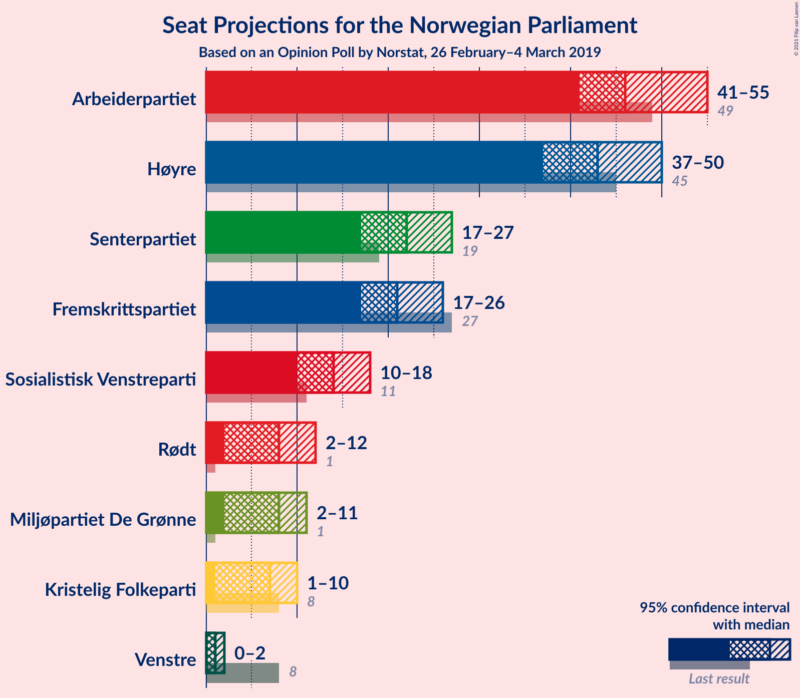

### Confidence Intervals

| Party | Last Result | Median | 80% Confidence Interval | 90% Confidence Interval | 95% Confidence Interval | 99% Confidence Interval |
|:-----:|:-----------:|:------:|:-----------------------:|:-----------------------:|:-----------------------:|:-----------------------:|
| <a href="#arbeiderpartiet">Arbeiderpartiet</a> | 49 | 44 | 43–50 |42–51 |40–53 |40–57 |
| <a href="#høyre">Høyre</a> | 45 | 44 | 41–48 |40–48 |39–49 |36–52 |
| <a href="#senterpartiet">Senterpartiet</a> | 19 | 20 | 19–24 |18–25 |18–26 |17–28 |
| <a href="#fremskrittspartiet">Fremskrittspartiet</a> | 27 | 23 | 20–25 |19–26 |18–26 |16–28 |
| <a href="#sosialistisk-venstreparti">Sosialistisk Venstreparti</a> | 11 | 14 | 11–16 |11–17 |10–17 |10–19 |
| <a href="#rødt">Rødt</a> | 1 | 8 | 7–10 |2–11 |2–11 |2–13 |
| <a href="#miljøpartiet-de-grønne">Miljøpartiet De Grønne</a> | 1 | 7 | 2–9 |1–10 |1–11 |1–12 |
| <a href="#kristelig-folkeparti">Kristelig Folkeparti</a> | 8 | 8 | 2–9 |1–9 |1–10 |1–11 |
| <a href="#venstre">Venstre</a> | 8 | 0 | 0–2 |0–2 |0–2 |0–2 |

### Arbeiderpartiet

*For a full overview of the results for this party, see the [Arbeiderpartiet](party-arbeiderpartiet.html) page.*

| Number of Seats | Probability | Accumulated | Special Marks |
|:---------------:|:-----------:|:-----------:|:-------------:|
| 38 | 0% | 100% |  |
| 39 | 0.1% | 99.9% |  |
| 40 | 3% | 99.8% |  |
| 41 | 2% | 97% |  |
| 42 | 1.0% | 95% |  |
| 43 | 10% | 94% |  |
| 44 | 47% | 84% | Median |
| 45 | 4% | 37% |  |
| 46 | 2% | 33% |  |
| 47 | 4% | 31% |  |
| 48 | 12% | 27% |  |
| 49 | 3% | 15% | Last Result |
| 50 | 4% | 11% |  |
| 51 | 3% | 8% |  |
| 52 | 2% | 5% |  |
| 53 | 0.9% | 3% |  |
| 54 | 0.6% | 2% |  |
| 55 | 0.1% | 1.1% |  |
| 56 | 0.2% | 0.9% |  |
| 57 | 0.2% | 0.7% |  |
| 58 | 0.4% | 0.5% |  |
| 59 | 0% | 0.1% |  |
| 60 | 0% | 0% |  |

### Høyre

*For a full overview of the results for this party, see the [Høyre](party-høyre.html) page.*

| Number of Seats | Probability | Accumulated | Special Marks |
|:---------------:|:-----------:|:-----------:|:-------------:|
| 33 | 0.1% | 100% |  |
| 34 | 0% | 99.9% |  |
| 35 | 0.2% | 99.8% |  |
| 36 | 0.3% | 99.7% |  |
| 37 | 0.5% | 99.4% |  |
| 38 | 0.7% | 98.9% |  |
| 39 | 0.9% | 98% |  |
| 40 | 5% | 97% |  |
| 41 | 4% | 92% |  |
| 42 | 4% | 88% |  |
| 43 | 7% | 84% |  |
| 44 | 39% | 76% | Median |
| 45 | 15% | 38% | Last Result |
| 46 | 5% | 22% |  |
| 47 | 3% | 17% |  |
| 48 | 10% | 14% |  |
| 49 | 2% | 4% |  |
| 50 | 0.7% | 2% |  |
| 51 | 1.0% | 2% |  |
| 52 | 0.3% | 0.6% |  |
| 53 | 0% | 0.2% |  |
| 54 | 0.1% | 0.2% |  |
| 55 | 0.1% | 0.1% |  |
| 56 | 0% | 0% |  |

### Senterpartiet

*For a full overview of the results for this party, see the [Senterpartiet](party-senterpartiet.html) page.*

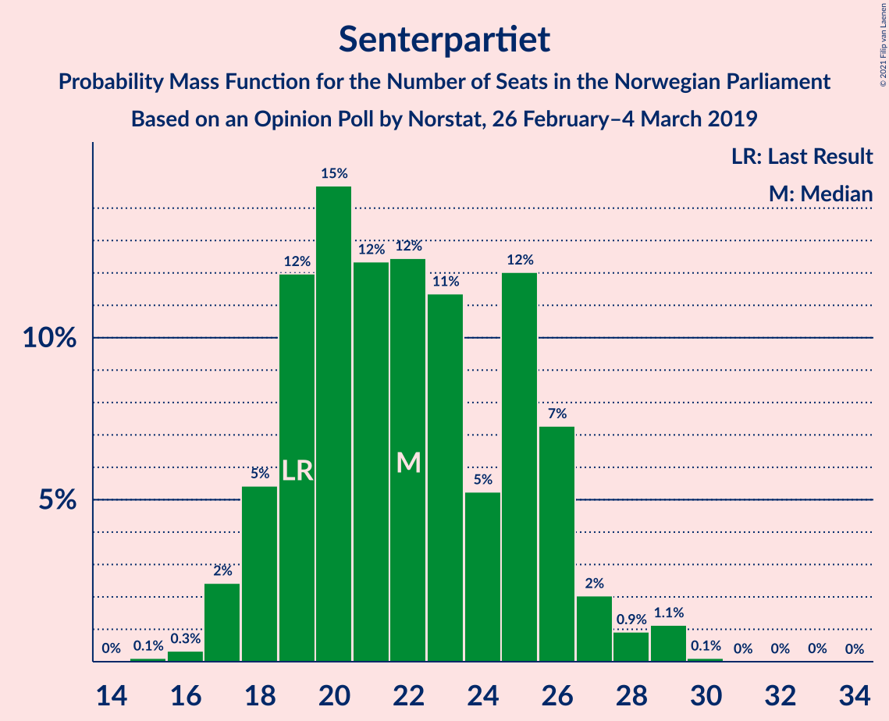

| Number of Seats | Probability | Accumulated | Special Marks |
|:---------------:|:-----------:|:-----------:|:-------------:|
| 15 | 0.1% | 100% |  |
| 16 | 0.2% | 99.9% |  |
| 17 | 1.2% | 99.7% |  |
| 18 | 8% | 98% |  |
| 19 | 8% | 91% | Last Result |
| 20 | 41% | 83% | Median |
| 21 | 9% | 42% |  |
| 22 | 6% | 33% |  |
| 23 | 15% | 27% |  |
| 24 | 3% | 12% |  |
| 25 | 5% | 9% |  |
| 26 | 3% | 4% |  |
| 27 | 0.4% | 1.0% |  |
| 28 | 0.2% | 0.6% |  |
| 29 | 0.2% | 0.4% |  |
| 30 | 0% | 0.1% |  |
| 31 | 0% | 0.1% |  |
| 32 | 0% | 0% |  |

### Fremskrittspartiet

*For a full overview of the results for this party, see the [Fremskrittspartiet](party-fremskrittspartiet.html) page.*

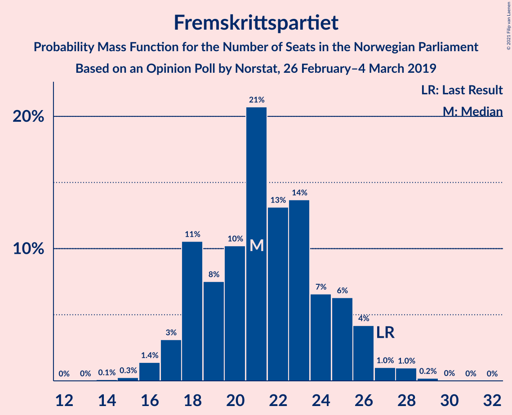

| Number of Seats | Probability | Accumulated | Special Marks |
|:---------------:|:-----------:|:-----------:|:-------------:|
| 15 | 0.2% | 100% |  |
| 16 | 0.5% | 99.7% |  |
| 17 | 0.7% | 99.2% |  |
| 18 | 3% | 98.5% |  |
| 19 | 3% | 95% |  |
| 20 | 4% | 92% |  |
| 21 | 19% | 87% |  |
| 22 | 8% | 68% |  |
| 23 | 42% | 60% | Median |
| 24 | 4% | 18% |  |
| 25 | 4% | 14% |  |
| 26 | 7% | 9% |  |
| 27 | 0.6% | 2% | Last Result |
| 28 | 1.3% | 1.5% |  |
| 29 | 0.1% | 0.2% |  |
| 30 | 0% | 0.1% |  |
| 31 | 0% | 0% |  |

### Sosialistisk Venstreparti

*For a full overview of the results for this party, see the [Sosialistisk Venstreparti](party-sosialistiskvenstreparti.html) page.*

| Number of Seats | Probability | Accumulated | Special Marks |
|:---------------:|:-----------:|:-----------:|:-------------:|
| 9 | 0.2% | 100% |  |
| 10 | 4% | 99.8% |  |
| 11 | 9% | 96% | Last Result |
| 12 | 9% | 87% |  |
| 13 | 4% | 78% |  |
| 14 | 37% | 74% | Median |
| 15 | 15% | 37% |  |
| 16 | 15% | 22% |  |
| 17 | 5% | 8% |  |
| 18 | 2% | 2% |  |
| 19 | 0.3% | 0.6% |  |
| 20 | 0.2% | 0.3% |  |
| 21 | 0.1% | 0.2% |  |
| 22 | 0% | 0.1% |  |
| 23 | 0% | 0% |  |

### Rødt

*For a full overview of the results for this party, see the [Rødt](party-rødt.html) page.*

| Number of Seats | Probability | Accumulated | Special Marks |
|:---------------:|:-----------:|:-----------:|:-------------:|
| 1 | 0.1% | 100% | Last Result |
| 2 | 7% | 99.9% |  |
| 3 | 0% | 92% |  |
| 4 | 0% | 92% |  |
| 5 | 0% | 92% |  |
| 6 | 0% | 92% |  |
| 7 | 7% | 92% |  |
| 8 | 50% | 86% | Median |
| 9 | 4% | 36% |  |
| 10 | 22% | 32% |  |
| 11 | 7% | 9% |  |
| 12 | 1.0% | 2% |  |
| 13 | 1.0% | 1.3% |  |
| 14 | 0.3% | 0.3% |  |
| 15 | 0% | 0% |  |

### Miljøpartiet De Grønne

*For a full overview of the results for this party, see the [Miljøpartiet De Grønne](party-miljøpartietdegrønne.html) page.*

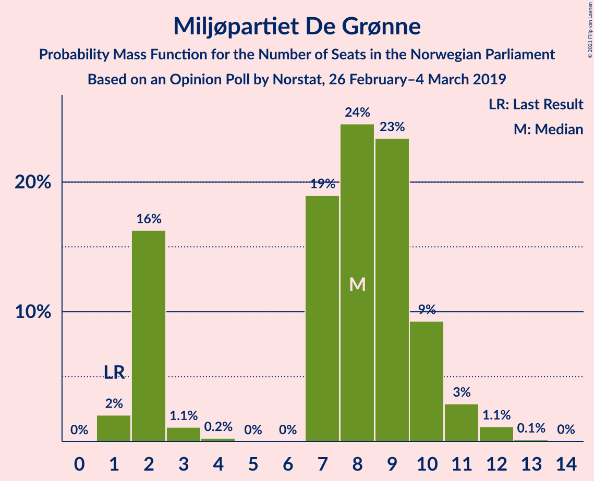

| Number of Seats | Probability | Accumulated | Special Marks |
|:---------------:|:-----------:|:-----------:|:-------------:|
| 1 | 6% | 100% | Last Result |
| 2 | 13% | 94% |  |
| 3 | 0.4% | 82% |  |
| 4 | 0% | 81% |  |
| 5 | 0% | 81% |  |
| 6 | 0% | 81% |  |
| 7 | 37% | 81% | Median |
| 8 | 24% | 44% |  |
| 9 | 13% | 20% |  |
| 10 | 3% | 7% |  |
| 11 | 2% | 3% |  |
| 12 | 0.5% | 0.7% |  |
| 13 | 0.2% | 0.2% |  |
| 14 | 0% | 0% |  |

### Kristelig Folkeparti

*For a full overview of the results for this party, see the [Kristelig Folkeparti](party-kristeligfolkeparti.html) page.*

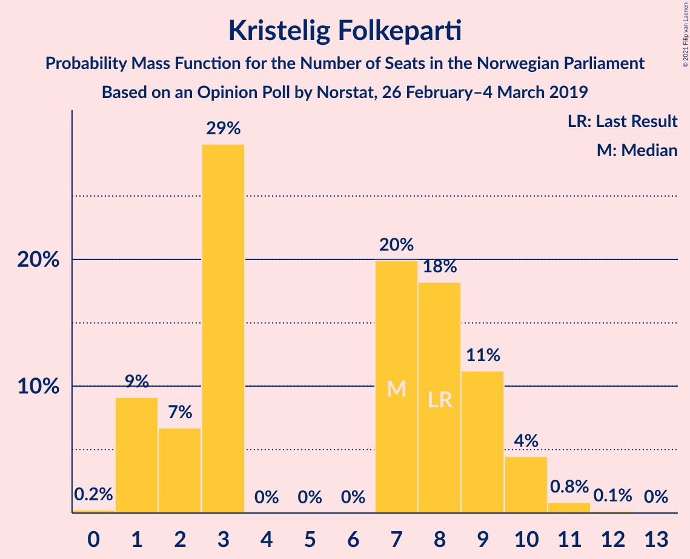

| Number of Seats | Probability | Accumulated | Special Marks |
|:---------------:|:-----------:|:-----------:|:-------------:|
| 0 | 0.4% | 100% |  |
| 1 | 6% | 99.6% |  |
| 2 | 12% | 93% |  |
| 3 | 16% | 81% |  |
| 4 | 0% | 65% |  |
| 5 | 0% | 65% |  |
| 6 | 0% | 65% |  |
| 7 | 15% | 65% |  |
| 8 | 8% | 50% | Last Result, Median |
| 9 | 39% | 42% |  |
| 10 | 2% | 3% |  |
| 11 | 1.0% | 1.1% |  |
| 12 | 0.1% | 0.1% |  |
| 13 | 0% | 0% |  |

### Venstre

*For a full overview of the results for this party, see the [Venstre](party-venstre.html) page.*

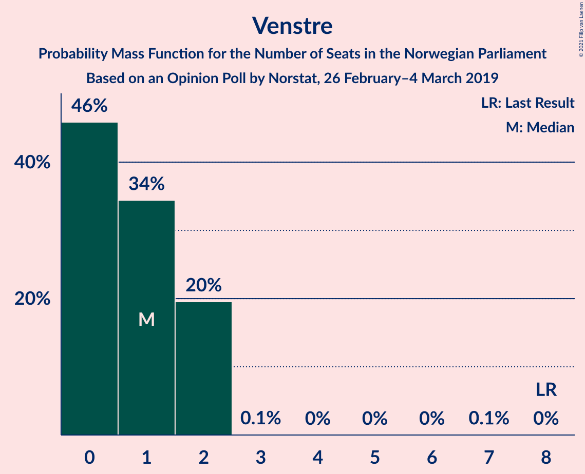

| Number of Seats | Probability | Accumulated | Special Marks |
|:---------------:|:-----------:|:-----------:|:-------------:|
| 0 | 71% | 100% | Median |
| 1 | 19% | 29% |  |
| 2 | 10% | 10% |  |
| 3 | 0% | 0.1% |  |
| 4 | 0% | 0.1% |  |
| 5 | 0% | 0.1% |  |
| 6 | 0% | 0.1% |  |
| 7 | 0.1% | 0.1% |  |
| 8 | 0% | 0% | Last Result |

## Coalitions

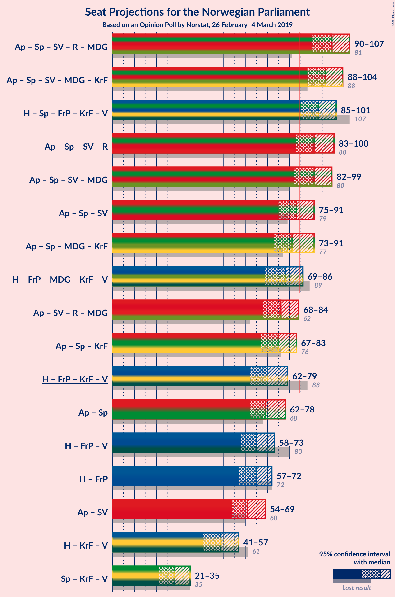

### Confidence Intervals

| Coalition | Last Result | Median | Majority? | 80% Confidence Interval | 90% Confidence Interval | 95% Confidence Interval | 99% Confidence Interval |
|:---------:|:-----------:|:------:|:---------:|:-----------------------:|:-----------------------:|:-----------------------:|:-----------------------:|
| Arbeiderpartiet – Senterpartiet – Sosialistisk Venstreparti – Rødt – Miljøpartiet De Grønne | 81 | 93 | 100% | 92–101 | 91–103 | 91–103 | 90–109 |
| Arbeiderpartiet – Senterpartiet – Sosialistisk Venstreparti – Miljøpartiet De Grønne – Kristelig Folkeparti | 88 | 94 | 100% | 91–96 | 89–97 | 89–101 | 87–107 |
| Høyre – Senterpartiet – Fremskrittspartiet – Kristelig Folkeparti – Venstre | 107 | 96 | 98% | 90–98 | 88–98 | 85–99 | 83–102 |
| Arbeiderpartiet – Senterpartiet – Sosialistisk Venstreparti – Rødt | 80 | 87 | 86% | 83–95 | 83–96 | 83–98 | 81–102 |
| Arbeiderpartiet – Senterpartiet – Sosialistisk Venstreparti – Miljøpartiet De Grønne | 80 | 86 | 85% | 84–91 | 83–93 | 82–96 | 82–102 |
| Arbeiderpartiet – Senterpartiet – Sosialistisk Venstreparti | 79 | 79 | 13% | 77–86 | 75–88 | 75–89 | 74–93 |
| Arbeiderpartiet – Senterpartiet – Miljøpartiet De Grønne – Kristelig Folkeparti | 77 | 80 | 4% | 77–82 | 76–84 | 74–87 | 73–93 |
| Høyre – Fremskrittspartiet – Miljøpartiet De Grønne – Kristelig Folkeparti – Venstre | 89 | 82 | 14% | 74–86 | 73–86 | 71–86 | 67–88 |
| Arbeiderpartiet – Senterpartiet – Kristelig Folkeparti | 76 | 73 | 0.6% | 69–77 | 68–77 | 67–80 | 64–85 |
| Høyre – Fremskrittspartiet – Kristelig Folkeparti – Venstre | 88 | 76 | 0% | 68–77 | 66–78 | 66–78 | 60–79 |
| Arbeiderpartiet – Senterpartiet | 68 | 66 | 0% | 64–71 | 64–74 | 62–75 | 60–79 |
| Høyre – Fremskrittspartiet – Venstre | 80 | 67 | 0% | 64–70 | 63–71 | 60–73 | 56–75 |
| Høyre – Fremskrittspartiet | 72 | 67 | 0% | 64–70 | 63–70 | 59–72 | 55–73 |
| Arbeiderpartiet – Sosialistisk Venstreparti | 60 | 58 | 0% | 55–64 | 54–66 | 54–67 | 54–70 |
| Høyre – Kristelig Folkeparti – Venstre | 61 | 53 | 0% | 46–55 | 44–56 | 43–57 | 41–59 |
| Senterpartiet – Kristelig Folkeparti – Venstre | 35 | 28 | 0% | 25–31 | 23–32 | 22–34 | 20–36 |

### Arbeiderpartiet – Senterpartiet – Sosialistisk Venstreparti – Rødt – Miljøpartiet De Grønne

| Number of Seats | Probability | Accumulated | Special Marks |
|:---------------:|:-----------:|:-----------:|:-------------:|
| 81 | 0% | 100% | Last Result |
| 82 | 0% | 100% |  |
| 83 | 0% | 100% |  |
| 84 | 0% | 100% |  |
| 85 | 0.1% | 100% | Majority |
| 86 | 0.1% | 99.9% |  |
| 87 | 0% | 99.8% |  |
| 88 | 0.1% | 99.8% |  |
| 89 | 0.1% | 99.7% |  |
| 90 | 0.7% | 99.6% |  |
| 91 | 5% | 98.8% |  |
| 92 | 14% | 94% |  |
| 93 | 34% | 80% | Median |
| 94 | 5% | 46% |  |
| 95 | 1.3% | 41% |  |
| 96 | 3% | 40% |  |
| 97 | 9% | 37% |  |
| 98 | 4% | 28% |  |
| 99 | 3% | 25% |  |
| 100 | 3% | 22% |  |
| 101 | 10% | 19% |  |
| 102 | 1.1% | 8% |  |
| 103 | 5% | 7% |  |
| 104 | 0.3% | 2% |  |
| 105 | 0.6% | 2% |  |
| 106 | 0.4% | 1.4% |  |
| 107 | 0.2% | 1.1% |  |
| 108 | 0.2% | 0.8% |  |
| 109 | 0.2% | 0.7% |  |
| 110 | 0.2% | 0.4% |  |
| 111 | 0.1% | 0.2% |  |
| 112 | 0.1% | 0.1% |  |
| 113 | 0% | 0% |  |

### Arbeiderpartiet – Senterpartiet – Sosialistisk Venstreparti – Miljøpartiet De Grønne – Kristelig Folkeparti

| Number of Seats | Probability | Accumulated | Special Marks |
|:---------------:|:-----------:|:-----------:|:-------------:|
| 85 | 0.2% | 100% | Majority |
| 86 | 0.1% | 99.7% |  |
| 87 | 0.2% | 99.6% |  |
| 88 | 1.1% | 99.5% | Last Result |
| 89 | 3% | 98% |  |
| 90 | 3% | 95% |  |
| 91 | 14% | 92% |  |
| 92 | 7% | 78% |  |
| 93 | 13% | 71% | Median |
| 94 | 40% | 58% |  |
| 95 | 2% | 18% |  |
| 96 | 6% | 15% |  |
| 97 | 6% | 9% |  |
| 98 | 0.5% | 4% |  |
| 99 | 0.6% | 3% |  |
| 100 | 0.2% | 3% |  |
| 101 | 0.4% | 3% |  |
| 102 | 0.4% | 2% |  |
| 103 | 0.5% | 2% |  |
| 104 | 0.1% | 1.2% |  |
| 105 | 0.2% | 1.1% |  |
| 106 | 0.3% | 0.9% |  |
| 107 | 0.1% | 0.6% |  |
| 108 | 0.1% | 0.4% |  |
| 109 | 0.3% | 0.4% |  |
| 110 | 0.1% | 0.1% |  |
| 111 | 0% | 0% |  |

### Høyre – Senterpartiet – Fremskrittspartiet – Kristelig Folkeparti – Venstre

| Number of Seats | Probability | Accumulated | Special Marks |
|:---------------:|:-----------:|:-----------:|:-------------:|
| 81 | 0.1% | 100% |  |
| 82 | 0.2% | 99.9% |  |
| 83 | 0.6% | 99.7% |  |
| 84 | 0.9% | 99.1% |  |
| 85 | 1.0% | 98% | Majority |
| 86 | 0.8% | 97% |  |
| 87 | 0.7% | 96% |  |
| 88 | 1.2% | 96% |  |
| 89 | 3% | 95% |  |
| 90 | 2% | 91% |  |
| 91 | 15% | 89% |  |
| 92 | 0.7% | 75% |  |
| 93 | 3% | 74% |  |
| 94 | 6% | 71% |  |
| 95 | 2% | 64% | Median |
| 96 | 43% | 63% |  |
| 97 | 8% | 20% |  |
| 98 | 8% | 12% |  |
| 99 | 1.0% | 3% |  |
| 100 | 1.4% | 2% |  |
| 101 | 0.2% | 0.8% |  |
| 102 | 0.2% | 0.5% |  |
| 103 | 0.1% | 0.3% |  |
| 104 | 0.1% | 0.3% |  |
| 105 | 0.1% | 0.2% |  |
| 106 | 0% | 0.1% |  |
| 107 | 0% | 0.1% | Last Result |
| 108 | 0% | 0% |  |

### Arbeiderpartiet – Senterpartiet – Sosialistisk Venstreparti – Rødt

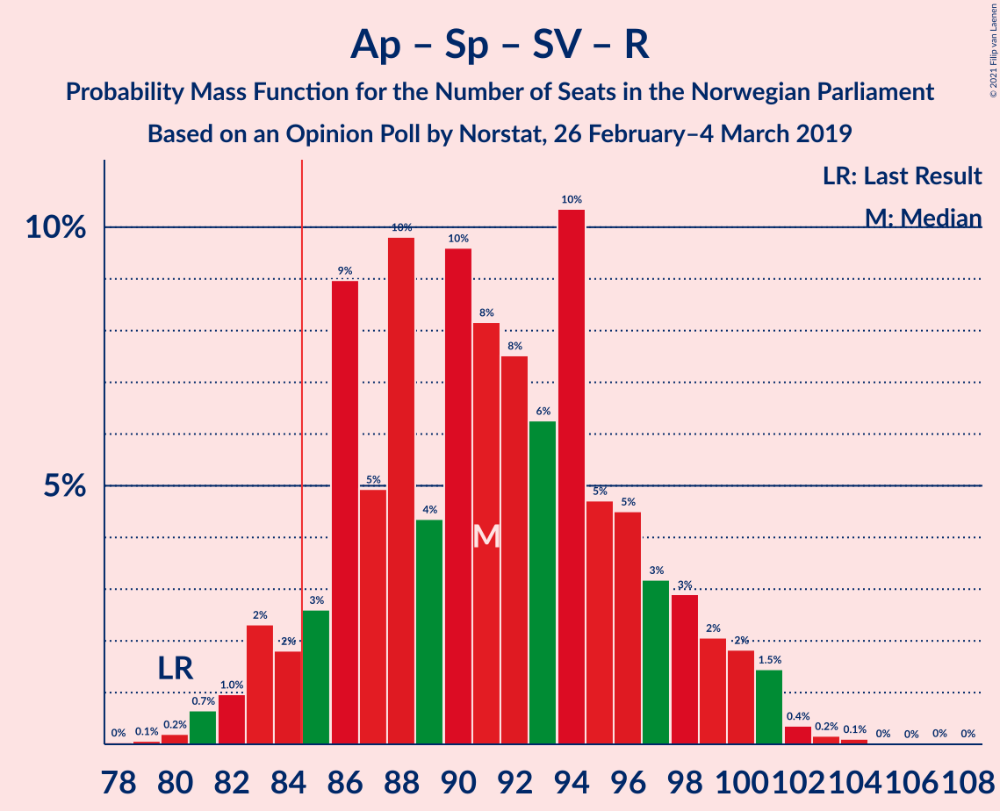

| Number of Seats | Probability | Accumulated | Special Marks |
|:---------------:|:-----------:|:-----------:|:-------------:|
| 79 | 0.1% | 100% |  |
| 80 | 0.1% | 99.9% | Last Result |
| 81 | 2% | 99.8% |  |
| 82 | 0.3% | 98% |  |
| 83 | 11% | 98% |  |
| 84 | 1.0% | 87% |  |
| 85 | 2% | 86% | Majority |
| 86 | 33% | 85% | Median |
| 87 | 3% | 51% |  |
| 88 | 3% | 49% |  |
| 89 | 4% | 46% |  |
| 90 | 6% | 42% |  |
| 91 | 6% | 36% |  |
| 92 | 4% | 30% |  |
| 93 | 11% | 26% |  |
| 94 | 4% | 15% |  |
| 95 | 4% | 11% |  |
| 96 | 3% | 8% |  |
| 97 | 1.4% | 4% |  |
| 98 | 1.0% | 3% |  |
| 99 | 0.5% | 2% |  |
| 100 | 0.6% | 1.3% |  |
| 101 | 0.2% | 0.7% |  |
| 102 | 0.1% | 0.6% |  |
| 103 | 0.2% | 0.4% |  |
| 104 | 0.2% | 0.2% |  |
| 105 | 0% | 0.1% |  |
| 106 | 0% | 0% |  |

### Arbeiderpartiet – Senterpartiet – Sosialistisk Venstreparti – Miljøpartiet De Grønne

| Number of Seats | Probability | Accumulated | Special Marks |
|:---------------:|:-----------:|:-----------:|:-------------:|
| 79 | 0.1% | 100% |  |
| 80 | 0.2% | 99.9% | Last Result |
| 81 | 0.1% | 99.7% |  |
| 82 | 4% | 99.6% |  |
| 83 | 1.4% | 95% |  |
| 84 | 9% | 94% |  |
| 85 | 34% | 85% | Median, Majority |
| 86 | 4% | 51% |  |
| 87 | 10% | 47% |  |
| 88 | 3% | 38% |  |
| 89 | 8% | 34% |  |
| 90 | 5% | 26% |  |
| 91 | 13% | 21% |  |
| 92 | 0.8% | 8% |  |
| 93 | 3% | 7% |  |
| 94 | 0.8% | 4% |  |
| 95 | 0.6% | 3% |  |
| 96 | 0.3% | 3% |  |
| 97 | 0.1% | 2% |  |
| 98 | 0.5% | 2% |  |
| 99 | 0.7% | 2% |  |
| 100 | 0.4% | 1.2% |  |
| 101 | 0.1% | 0.8% |  |
| 102 | 0.4% | 0.7% |  |
| 103 | 0.1% | 0.3% |  |
| 104 | 0.2% | 0.2% |  |
| 105 | 0% | 0.1% |  |
| 106 | 0% | 0% |  |

### Arbeiderpartiet – Senterpartiet – Sosialistisk Venstreparti

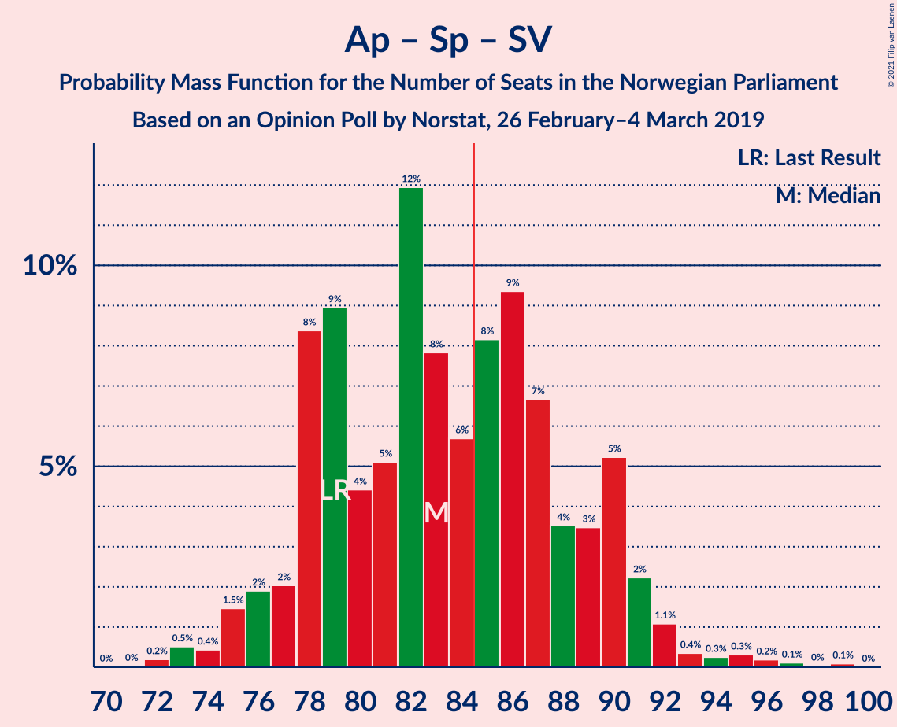

| Number of Seats | Probability | Accumulated | Special Marks |
|:---------------:|:-----------:|:-----------:|:-------------:|
| 72 | 0.1% | 100% |  |
| 73 | 0.4% | 99.9% |  |
| 74 | 0.5% | 99.5% |  |
| 75 | 7% | 99.0% |  |
| 76 | 2% | 92% |  |
| 77 | 1.2% | 90% |  |
| 78 | 35% | 89% | Median |
| 79 | 6% | 55% | Last Result |
| 80 | 8% | 49% |  |
| 81 | 6% | 41% |  |
| 82 | 1.2% | 35% |  |
| 83 | 14% | 34% |  |
| 84 | 6% | 20% |  |
| 85 | 3% | 13% | Majority |
| 86 | 2% | 11% |  |
| 87 | 1.1% | 9% |  |
| 88 | 5% | 7% |  |
| 89 | 0.7% | 3% |  |
| 90 | 0.9% | 2% |  |
| 91 | 0.3% | 1.3% |  |
| 92 | 0.3% | 0.9% |  |
| 93 | 0.1% | 0.6% |  |
| 94 | 0.3% | 0.5% |  |
| 95 | 0.1% | 0.2% |  |
| 96 | 0% | 0.1% |  |
| 97 | 0.1% | 0.1% |  |
| 98 | 0% | 0% |  |

### Arbeiderpartiet – Senterpartiet – Miljøpartiet De Grønne – Kristelig Folkeparti

| Number of Seats | Probability | Accumulated | Special Marks |
|:---------------:|:-----------:|:-----------:|:-------------:|
| 70 | 0% | 100% |  |
| 71 | 0.1% | 99.9% |  |
| 72 | 0.1% | 99.9% |  |
| 73 | 2% | 99.8% |  |
| 74 | 1.4% | 98% |  |
| 75 | 1.1% | 96% |  |
| 76 | 5% | 95% |  |
| 77 | 13% | 90% | Last Result |
| 78 | 3% | 77% |  |
| 79 | 15% | 74% | Median |
| 80 | 44% | 59% |  |
| 81 | 2% | 15% |  |
| 82 | 6% | 13% |  |
| 83 | 1.2% | 7% |  |
| 84 | 1.4% | 6% |  |
| 85 | 1.5% | 4% | Majority |
| 86 | 0.4% | 3% |  |
| 87 | 0.2% | 3% |  |
| 88 | 0.1% | 2% |  |
| 89 | 0.6% | 2% |  |
| 90 | 0.5% | 2% |  |
| 91 | 0.4% | 1.1% |  |
| 92 | 0.2% | 0.7% |  |
| 93 | 0.1% | 0.6% |  |
| 94 | 0.1% | 0.4% |  |
| 95 | 0% | 0.3% |  |
| 96 | 0.3% | 0.3% |  |
| 97 | 0% | 0% |  |

### Høyre – Fremskrittspartiet – Miljøpartiet De Grønne – Kristelig Folkeparti – Venstre

| Number of Seats | Probability | Accumulated | Special Marks |
|:---------------:|:-----------:|:-----------:|:-------------:|
| 64 | 0% | 100% |  |
| 65 | 0.2% | 99.9% |  |
| 66 | 0.2% | 99.8% |  |
| 67 | 0.1% | 99.6% |  |
| 68 | 0.2% | 99.4% |  |
| 69 | 0.6% | 99.3% |  |
| 70 | 0.5% | 98.7% |  |
| 71 | 1.1% | 98% |  |
| 72 | 1.4% | 97% |  |
| 73 | 3% | 96% |  |
| 74 | 4% | 92% |  |
| 75 | 4% | 89% |  |
| 76 | 11% | 85% |  |
| 77 | 4% | 74% |  |
| 78 | 6% | 70% |  |
| 79 | 6% | 64% |  |
| 80 | 4% | 58% |  |
| 81 | 3% | 54% |  |
| 82 | 3% | 51% | Median |
| 83 | 33% | 49% |  |
| 84 | 2% | 15% |  |
| 85 | 1.0% | 14% | Majority |
| 86 | 11% | 13% |  |
| 87 | 0.3% | 2% |  |
| 88 | 2% | 2% |  |
| 89 | 0.1% | 0.2% | Last Result |
| 90 | 0.1% | 0.1% |  |
| 91 | 0% | 0% |  |

### Arbeiderpartiet – Senterpartiet – Kristelig Folkeparti

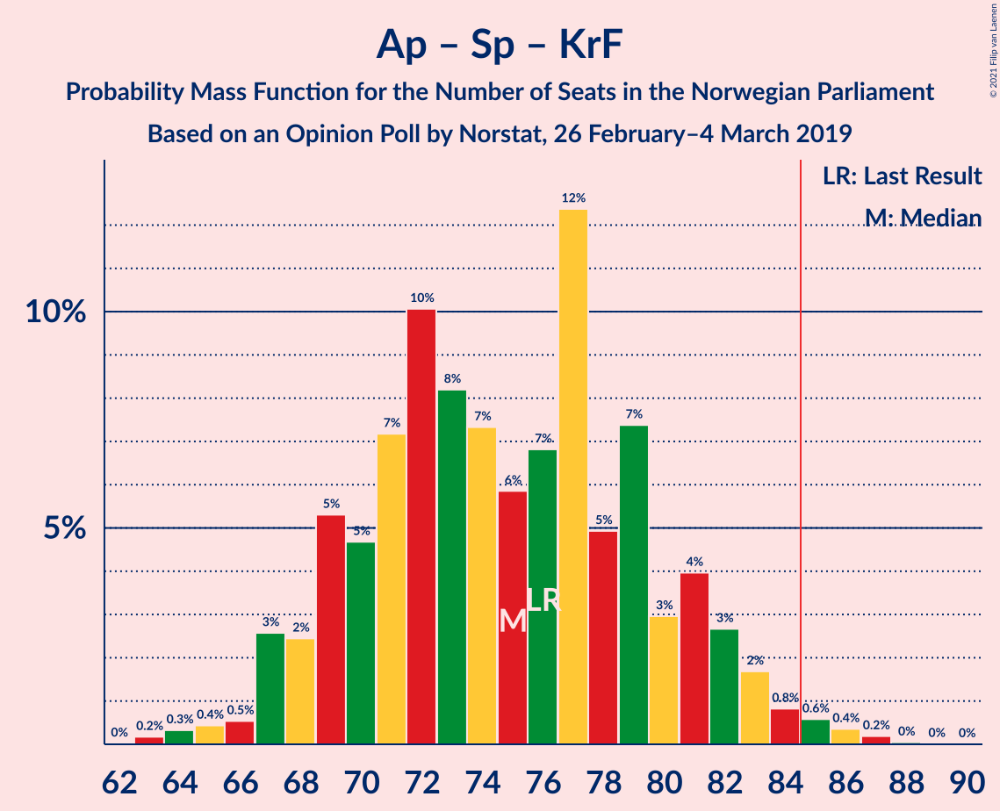

| Number of Seats | Probability | Accumulated | Special Marks |
|:---------------:|:-----------:|:-----------:|:-------------:|
| 63 | 0.1% | 100% |  |
| 64 | 0.5% | 99.9% |  |
| 65 | 0.7% | 99.4% |  |
| 66 | 0.7% | 98.7% |  |
| 67 | 3% | 98% |  |
| 68 | 0.7% | 95% |  |
| 69 | 13% | 95% |  |
| 70 | 4% | 81% |  |
| 71 | 12% | 78% |  |
| 72 | 4% | 66% | Median |
| 73 | 33% | 62% |  |
| 74 | 8% | 29% |  |
| 75 | 1.3% | 21% |  |
| 76 | 4% | 20% | Last Result |
| 77 | 10% | 15% |  |
| 78 | 1.5% | 5% |  |
| 79 | 0.8% | 3% |  |
| 80 | 0.9% | 3% |  |
| 81 | 0.4% | 2% |  |
| 82 | 0.2% | 1.3% |  |
| 83 | 0.2% | 1.0% |  |
| 84 | 0.2% | 0.8% |  |
| 85 | 0.2% | 0.6% | Majority |
| 86 | 0.2% | 0.4% |  |
| 87 | 0.1% | 0.2% |  |
| 88 | 0% | 0.1% |  |
| 89 | 0% | 0% |  |

### Høyre – Fremskrittspartiet – Kristelig Folkeparti – Venstre

| Number of Seats | Probability | Accumulated | Special Marks |
|:---------------:|:-----------:|:-----------:|:-------------:|
| 57 | 0.1% | 100% |  |
| 58 | 0.1% | 99.9% |  |
| 59 | 0.2% | 99.8% |  |
| 60 | 0.2% | 99.6% |  |
| 61 | 0.2% | 99.3% |  |
| 62 | 0.2% | 99.2% |  |
| 63 | 0.4% | 98.9% |  |
| 64 | 0.6% | 98.6% |  |
| 65 | 0.3% | 98% |  |
| 66 | 5% | 98% |  |
| 67 | 1.1% | 93% |  |
| 68 | 10% | 92% |  |
| 69 | 3% | 81% |  |
| 70 | 3% | 78% |  |
| 71 | 4% | 75% |  |
| 72 | 9% | 72% |  |
| 73 | 3% | 63% |  |
| 74 | 1.3% | 60% |  |
| 75 | 5% | 59% | Median |
| 76 | 34% | 54% |  |
| 77 | 14% | 20% |  |
| 78 | 5% | 6% |  |
| 79 | 0.7% | 1.1% |  |
| 80 | 0.1% | 0.4% |  |
| 81 | 0.1% | 0.3% |  |
| 82 | 0% | 0.2% |  |
| 83 | 0.1% | 0.2% |  |
| 84 | 0.1% | 0.1% |  |
| 85 | 0% | 0% | Majority |
| 86 | 0% | 0% |  |
| 87 | 0% | 0% |  |
| 88 | 0% | 0% | Last Result |

### Arbeiderpartiet – Senterpartiet

| Number of Seats | Probability | Accumulated | Special Marks |
|:---------------:|:-----------:|:-----------:|:-------------:|
| 58 | 0.1% | 100% |  |
| 59 | 0% | 99.9% |  |
| 60 | 0.6% | 99.9% |  |
| 61 | 0.7% | 99.3% |  |
| 62 | 2% | 98.6% |  |
| 63 | 2% | 97% |  |
| 64 | 41% | 95% | Median |
| 65 | 3% | 54% |  |
| 66 | 8% | 50% |  |
| 67 | 15% | 42% |  |
| 68 | 8% | 28% | Last Result |
| 69 | 4% | 20% |  |
| 70 | 3% | 16% |  |
| 71 | 4% | 13% |  |
| 72 | 1.0% | 10% |  |
| 73 | 4% | 9% |  |
| 74 | 2% | 5% |  |
| 75 | 0.6% | 3% |  |
| 76 | 0.3% | 2% |  |
| 77 | 0.6% | 2% |  |
| 78 | 0.3% | 1.1% |  |
| 79 | 0.3% | 0.8% |  |
| 80 | 0.2% | 0.5% |  |
| 81 | 0.2% | 0.3% |  |
| 82 | 0.1% | 0.1% |  |
| 83 | 0% | 0% |  |

### Høyre – Fremskrittspartiet – Venstre

| Number of Seats | Probability | Accumulated | Special Marks |
|:---------------:|:-----------:|:-----------:|:-------------:|
| 52 | 0% | 100% |  |
| 53 | 0% | 99.9% |  |
| 54 | 0.1% | 99.9% |  |
| 55 | 0.1% | 99.8% |  |
| 56 | 0.2% | 99.7% |  |
| 57 | 0.2% | 99.5% |  |
| 58 | 0.6% | 99.3% |  |
| 59 | 1.0% | 98.6% |  |
| 60 | 0.2% | 98% |  |
| 61 | 1.0% | 97% |  |
| 62 | 0.8% | 96% |  |
| 63 | 4% | 96% |  |
| 64 | 2% | 92% |  |
| 65 | 6% | 89% |  |
| 66 | 12% | 84% |  |
| 67 | 37% | 72% | Median |
| 68 | 9% | 35% |  |
| 69 | 8% | 26% |  |
| 70 | 13% | 18% |  |
| 71 | 2% | 6% |  |
| 72 | 0.4% | 4% |  |
| 73 | 1.3% | 4% |  |
| 74 | 2% | 2% |  |
| 75 | 0.4% | 0.7% |  |
| 76 | 0.3% | 0.4% |  |
| 77 | 0% | 0.1% |  |
| 78 | 0% | 0.1% |  |
| 79 | 0% | 0% |  |
| 80 | 0% | 0% | Last Result |

### Høyre – Fremskrittspartiet

| Number of Seats | Probability | Accumulated | Special Marks |
|:---------------:|:-----------:|:-----------:|:-------------:|
| 52 | 0.1% | 100% |  |
| 53 | 0% | 99.8% |  |
| 54 | 0.2% | 99.8% |  |
| 55 | 0.2% | 99.6% |  |
| 56 | 0.3% | 99.5% |  |
| 57 | 0.7% | 99.1% |  |
| 58 | 0.2% | 98% |  |
| 59 | 1.1% | 98% |  |
| 60 | 0.6% | 97% |  |
| 61 | 0.4% | 96% |  |
| 62 | 1.0% | 96% |  |
| 63 | 4% | 95% |  |
| 64 | 4% | 91% |  |
| 65 | 4% | 87% |  |
| 66 | 18% | 83% |  |
| 67 | 38% | 65% | Median |
| 68 | 3% | 27% |  |
| 69 | 12% | 23% |  |
| 70 | 7% | 12% |  |
| 71 | 2% | 5% |  |
| 72 | 0.8% | 3% | Last Result |
| 73 | 2% | 2% |  |
| 74 | 0% | 0.4% |  |
| 75 | 0.3% | 0.4% |  |
| 76 | 0% | 0.1% |  |
| 77 | 0% | 0% |  |

### Arbeiderpartiet – Sosialistisk Venstreparti

| Number of Seats | Probability | Accumulated | Special Marks |
|:---------------:|:-----------:|:-----------:|:-------------:|
| 50 | 0.1% | 100% |  |
| 51 | 0.2% | 99.9% |  |
| 52 | 0.1% | 99.7% |  |
| 53 | 0.2% | 99.7% |  |
| 54 | 7% | 99.5% |  |
| 55 | 4% | 92% |  |
| 56 | 1.3% | 89% |  |
| 57 | 4% | 87% |  |
| 58 | 34% | 83% | Median |
| 59 | 4% | 50% |  |
| 60 | 18% | 46% | Last Result |
| 61 | 6% | 28% |  |
| 62 | 3% | 22% |  |
| 63 | 8% | 19% |  |
| 64 | 2% | 11% |  |
| 65 | 1.3% | 9% |  |
| 66 | 4% | 7% |  |
| 67 | 1.1% | 3% |  |
| 68 | 0.6% | 2% |  |
| 69 | 0.8% | 2% |  |
| 70 | 0.4% | 0.8% |  |
| 71 | 0.2% | 0.4% |  |
| 72 | 0.1% | 0.2% |  |
| 73 | 0.1% | 0.1% |  |
| 74 | 0% | 0% |  |

### Høyre – Kristelig Folkeparti – Venstre

| Number of Seats | Probability | Accumulated | Special Marks |
|:---------------:|:-----------:|:-----------:|:-------------:|
| 39 | 0.2% | 100% |  |
| 40 | 0.1% | 99.8% |  |
| 41 | 0.4% | 99.7% |  |
| 42 | 1.5% | 99.3% |  |
| 43 | 2% | 98% |  |
| 44 | 2% | 96% |  |
| 45 | 4% | 94% |  |
| 46 | 1.0% | 90% |  |
| 47 | 15% | 89% |  |
| 48 | 5% | 74% |  |
| 49 | 4% | 69% |  |
| 50 | 2% | 65% |  |
| 51 | 3% | 63% |  |
| 52 | 6% | 60% | Median |
| 53 | 33% | 54% |  |
| 54 | 4% | 21% |  |
| 55 | 9% | 17% |  |
| 56 | 5% | 7% |  |
| 57 | 0.8% | 3% |  |
| 58 | 0.7% | 2% |  |
| 59 | 0.9% | 1.3% |  |
| 60 | 0.3% | 0.4% |  |
| 61 | 0% | 0.1% | Last Result |
| 62 | 0% | 0.1% |  |
| 63 | 0% | 0.1% |  |
| 64 | 0% | 0% |  |

### Senterpartiet – Kristelig Folkeparti – Venstre

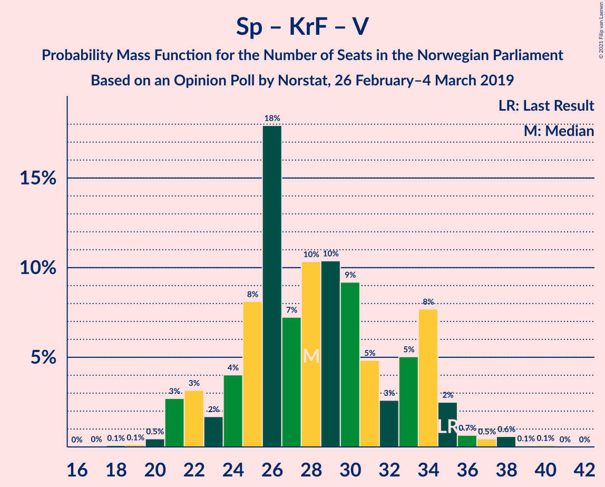

| Number of Seats | Probability | Accumulated | Special Marks |
|:---------------:|:-----------:|:-----------:|:-------------:|
| 18 | 0% | 100% |  |
| 19 | 0.1% | 99.9% |  |
| 20 | 1.1% | 99.9% |  |
| 21 | 1.2% | 98.8% |  |
| 22 | 2% | 98% |  |
| 23 | 3% | 96% |  |
| 24 | 0.3% | 93% |  |
| 25 | 15% | 92% |  |
| 26 | 9% | 78% |  |
| 27 | 7% | 69% |  |
| 28 | 12% | 61% | Median |
| 29 | 36% | 49% |  |
| 30 | 2% | 13% |  |
| 31 | 5% | 10% |  |
| 32 | 2% | 6% |  |
| 33 | 1.0% | 3% |  |
| 34 | 2% | 3% |  |
| 35 | 0.4% | 0.9% | Last Result |
| 36 | 0.2% | 0.6% |  |
| 37 | 0.1% | 0.4% |  |
| 38 | 0.2% | 0.3% |  |
| 39 | 0% | 0.1% |  |
| 40 | 0% | 0.1% |  |
| 41 | 0% | 0% |  |

## Technical Information

### Opinion Poll

+ **Polling firm:** Norstat
+ **Commissioner(s):** —
+ **Fieldwork period:** 26 February–4 March 2019

### Calculations

+ **Sample size:** 653
+ **Simulations done:** 131,072
+ **Error estimate:** 1.80%

