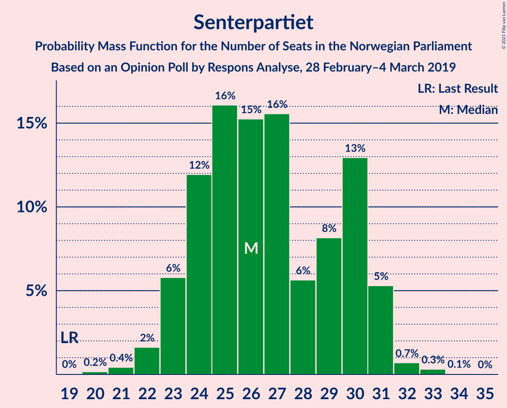
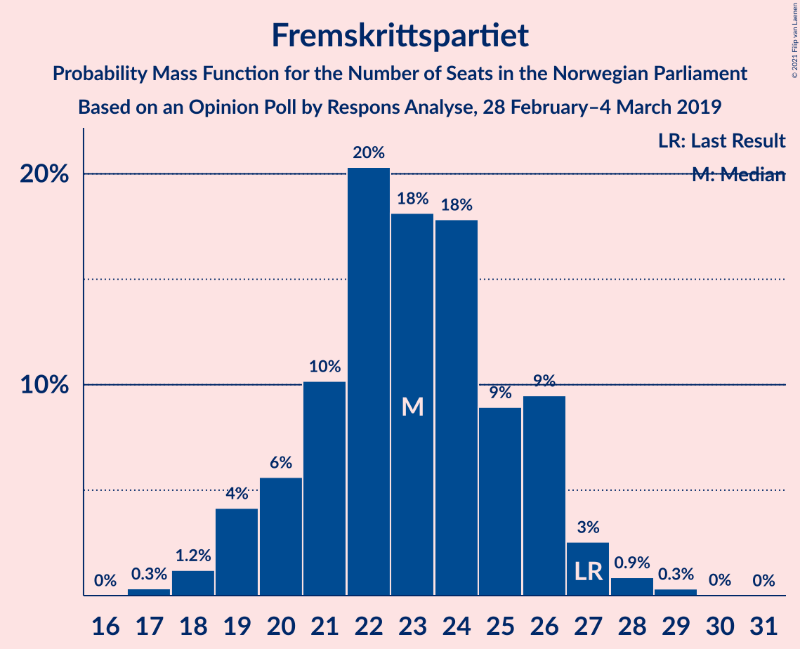
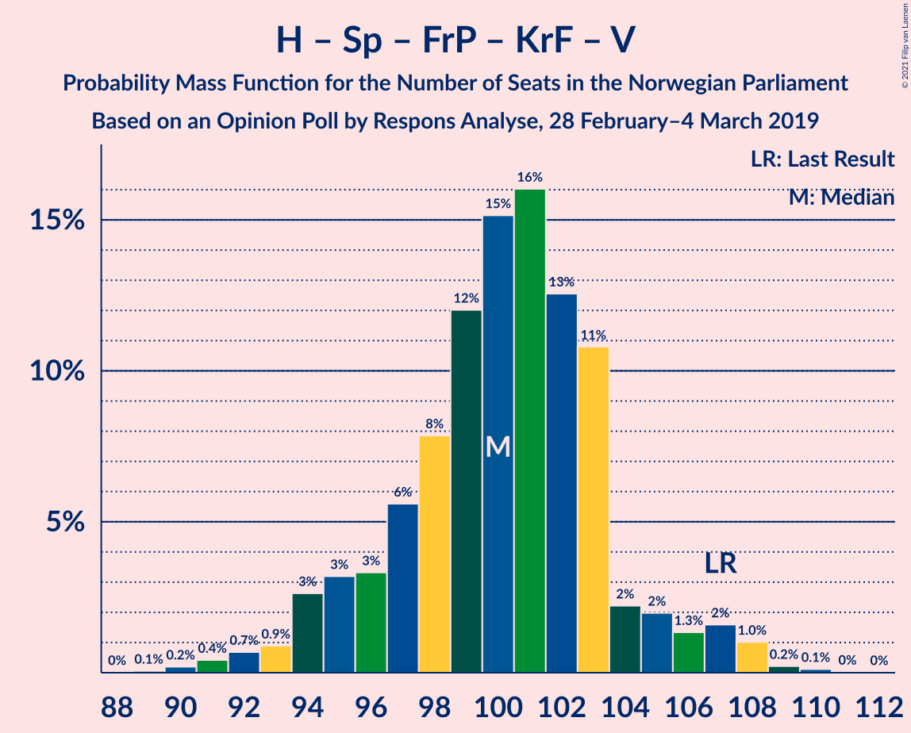
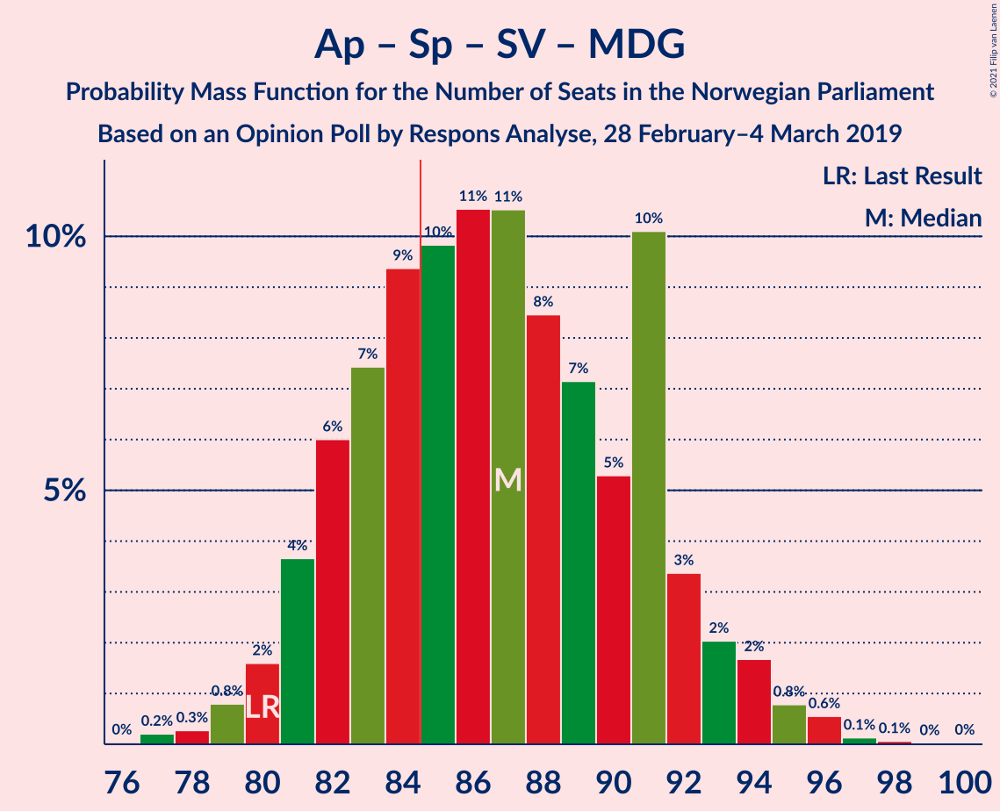
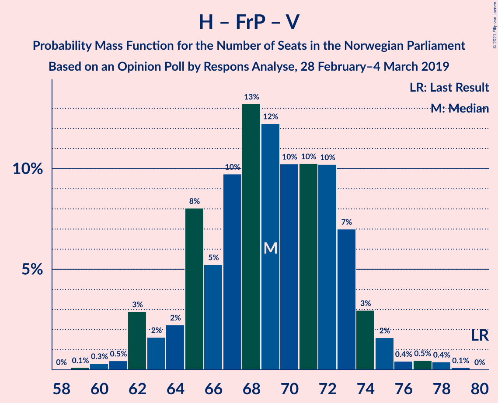
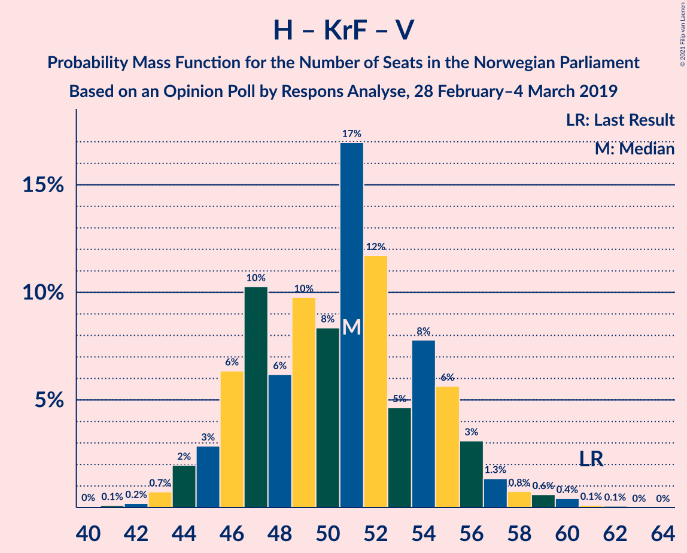

# Opinion Poll by Respons Analyse, 28 February–4 March 2019

<a href="#voting-intentions">Voting Intentions</a> | <a href="#seats">Seats</a> | <a href="#coalitions">Coalitions</a> | <a href="#technical-information">Technical Information</a>

## Voting Intentions

### Confidence Intervals

| Party | Last Result | Poll Result | 80% Confidence Interval | 90% Confidence Interval | 95% Confidence Interval | 99% Confidence Interval |
|:-----:|:-----------:|:-----------:|:-----------------------:|:-----------------------:|:-----------------------:|:-----------------------:|
| Arbeiderpartiet | 27.4% | 24.3% | 22.6–26.1% |22.1–26.6% |21.7–27.1% |21.0–27.9% |
| Høyre | 25.0% | 24.3% | 22.6–26.1% |22.1–26.6% |21.7–27.1% |21.0–27.9% |
| Senterpartiet | 10.3% | 14.6% | 13.2–16.1% |12.9–16.6% |12.5–16.9% |11.9–17.7% |
| Fremskrittspartiet | 15.2% | 12.6% | 11.3–14.0% |11.0–14.4% |10.7–14.8% |10.1–15.5% |
| Sosialistisk Venstreparti | 6.0% | 7.6% | 6.6–8.8% |6.3–9.1% |6.1–9.4% |5.7–10.0% |
| Rødt | 2.4% | 5.0% | 4.2–6.0% |4.0–6.3% |3.8–6.5% |3.5–7.1% |
| Kristelig Folkeparti | 4.2% | 3.8% | 3.1–4.7% |2.9–5.0% |2.8–5.2% |2.5–5.6% |
| Miljøpartiet De Grønne | 3.2% | 3.3% | 2.7–4.1% |2.5–4.4% |2.4–4.6% |2.1–5.0% |
| Venstre | 4.4% | 2.8% | 2.2–3.6% |2.1–3.8% |1.9–4.0% |1.7–4.4% |

*Note:* The poll result column reflects the actual value used in the calculations. Published results may vary slightly, and in addition be rounded to fewer digits.

## Seats

### Confidence Intervals

| Party | Last Result | Median | 80% Confidence Interval | 90% Confidence Interval | 95% Confidence Interval | 99% Confidence Interval |
|:-----:|:-----------:|:------:|:-----------------------:|:-----------------------:|:-----------------------:|:-----------------------:|
| <a href="#arbeiderpartiet">Arbeiderpartiet</a> | 49 | 44 | 41–47 |40–47 |39–48 |38–52 |
| <a href="#høyre">Høyre</a> | 45 | 43 | 41–48 |39–48 |38–49 |37–51 |
| <a href="#senterpartiet">Senterpartiet</a> | 19 | 25 | 23–30 |23–30 |23–30 |21–33 |
| <a href="#fremskrittspartiet">Fremskrittspartiet</a> | 27 | 23 | 19–26 |19–26 |19–26 |18–28 |
| <a href="#sosialistisk-venstreparti">Sosialistisk Venstreparti</a> | 11 | 13 | 12–16 |11–17 |11–17 |10–18 |
| <a href="#rødt">Rødt</a> | 1 | 9 | 7–11 |2–11 |2–13 |2–13 |
| <a href="#kristelig-folkeparti">Kristelig Folkeparti</a> | 8 | 7 | 3–8 |1–9 |1–9 |1–10 |
| <a href="#miljøpartiet-de-grønne">Miljøpartiet De Grønne</a> | 1 | 2 | 1–7 |1–7 |1–8 |1–9 |
| <a href="#venstre">Venstre</a> | 8 | 2 | 1–2 |1–2 |1–8 |0–9 |

### Arbeiderpartiet

*For a full overview of the results for this party, see the [Arbeiderpartiet](party-arbeiderpartiet.html) page.*

| Number of Seats | Probability | Accumulated | Special Marks |
|:---------------:|:-----------:|:-----------:|:-------------:|
| 37 | 0.1% | 100% |  |
| 38 | 2% | 99.8% |  |
| 39 | 3% | 98% |  |
| 40 | 4% | 95% |  |
| 41 | 6% | 91% |  |
| 42 | 7% | 85% |  |
| 43 | 6% | 78% |  |
| 44 | 32% | 72% | Median |
| 45 | 12% | 40% |  |
| 46 | 15% | 28% |  |
| 47 | 9% | 13% |  |
| 48 | 2% | 4% |  |
| 49 | 0.4% | 2% | Last Result |
| 50 | 0.6% | 1.3% |  |
| 51 | 0.1% | 0.7% |  |
| 52 | 0.3% | 0.6% |  |
| 53 | 0.2% | 0.3% |  |
| 54 | 0.1% | 0.1% |  |
| 55 | 0% | 0% |  |

### Høyre

*For a full overview of the results for this party, see the [Høyre](party-høyre.html) page.*

| Number of Seats | Probability | Accumulated | Special Marks |
|:---------------:|:-----------:|:-----------:|:-------------:|
| 35 | 0.1% | 100% |  |
| 36 | 0.1% | 99.9% |  |
| 37 | 0.3% | 99.8% |  |
| 38 | 4% | 99.5% |  |
| 39 | 1.1% | 96% |  |
| 40 | 2% | 95% |  |
| 41 | 16% | 93% |  |
| 42 | 9% | 77% |  |
| 43 | 32% | 68% | Median |
| 44 | 6% | 36% |  |
| 45 | 7% | 30% | Last Result |
| 46 | 5% | 23% |  |
| 47 | 9% | 19% |  |
| 48 | 6% | 10% |  |
| 49 | 3% | 5% |  |
| 50 | 0.8% | 1.5% |  |
| 51 | 0.5% | 0.6% |  |
| 52 | 0.1% | 0.2% |  |
| 53 | 0% | 0.1% |  |
| 54 | 0% | 0.1% |  |
| 55 | 0% | 0% |  |

### Senterpartiet

*For a full overview of the results for this party, see the [Senterpartiet](party-senterpartiet.html) page.*

| Number of Seats | Probability | Accumulated | Special Marks |
|:---------------:|:-----------:|:-----------:|:-------------:|
| 19 | 0% | 100% | Last Result |
| 20 | 0.4% | 99.9% |  |
| 21 | 0.3% | 99.6% |  |
| 22 | 1.4% | 99.2% |  |
| 23 | 9% | 98% |  |
| 24 | 28% | 88% |  |
| 25 | 15% | 60% | Median |
| 26 | 10% | 45% |  |
| 27 | 10% | 35% |  |
| 28 | 4% | 25% |  |
| 29 | 7% | 20% |  |
| 30 | 12% | 14% |  |
| 31 | 1.1% | 2% |  |
| 32 | 0.4% | 1.2% |  |
| 33 | 0.7% | 0.8% |  |
| 34 | 0.1% | 0.1% |  |
| 35 | 0% | 0% |  |

### Fremskrittspartiet

*For a full overview of the results for this party, see the [Fremskrittspartiet](party-fremskrittspartiet.html) page.*

| Number of Seats | Probability | Accumulated | Special Marks |
|:---------------:|:-----------:|:-----------:|:-------------:|
| 17 | 0.1% | 100% |  |
| 18 | 2% | 99.9% |  |
| 19 | 13% | 98% |  |
| 20 | 5% | 85% |  |
| 21 | 11% | 80% |  |
| 22 | 5% | 69% |  |
| 23 | 16% | 64% | Median |
| 24 | 28% | 47% |  |
| 25 | 7% | 19% |  |
| 26 | 9% | 12% |  |
| 27 | 1.2% | 2% | Last Result |
| 28 | 1.0% | 1.2% |  |
| 29 | 0.1% | 0.2% |  |
| 30 | 0.1% | 0.1% |  |
| 31 | 0% | 0% |  |

### Sosialistisk Venstreparti

*For a full overview of the results for this party, see the [Sosialistisk Venstreparti](party-sosialistiskvenstreparti.html) page.*

| Number of Seats | Probability | Accumulated | Special Marks |
|:---------------:|:-----------:|:-----------:|:-------------:|
| 10 | 2% | 100% |  |
| 11 | 5% | 98% | Last Result |
| 12 | 5% | 93% |  |
| 13 | 51% | 88% | Median |
| 14 | 11% | 37% |  |
| 15 | 9% | 26% |  |
| 16 | 12% | 17% |  |
| 17 | 4% | 5% |  |
| 18 | 1.0% | 1.2% |  |
| 19 | 0.1% | 0.2% |  |
| 20 | 0% | 0% |  |

### Rødt

*For a full overview of the results for this party, see the [Rødt](party-rødt.html) page.*

| Number of Seats | Probability | Accumulated | Special Marks |
|:---------------:|:-----------:|:-----------:|:-------------:|
| 1 | 0% | 100% | Last Result |
| 2 | 6% | 100% |  |
| 3 | 0% | 94% |  |
| 4 | 0% | 94% |  |
| 5 | 0% | 94% |  |
| 6 | 0% | 94% |  |
| 7 | 4% | 94% |  |
| 8 | 26% | 89% |  |
| 9 | 17% | 63% | Median |
| 10 | 34% | 47% |  |
| 11 | 8% | 13% |  |
| 12 | 2% | 5% |  |
| 13 | 3% | 3% |  |
| 14 | 0.1% | 0.1% |  |
| 15 | 0% | 0% |  |

### Kristelig Folkeparti

*For a full overview of the results for this party, see the [Kristelig Folkeparti](party-kristeligfolkeparti.html) page.*

| Number of Seats | Probability | Accumulated | Special Marks |
|:---------------:|:-----------:|:-----------:|:-------------:|
| 0 | 0.2% | 100% |  |
| 1 | 7% | 99.8% |  |
| 2 | 2% | 93% |  |
| 3 | 27% | 91% |  |
| 4 | 0% | 64% |  |
| 5 | 0% | 64% |  |
| 6 | 0% | 64% |  |
| 7 | 34% | 64% | Median |
| 8 | 22% | 30% | Last Result |
| 9 | 6% | 8% |  |
| 10 | 2% | 2% |  |
| 11 | 0.1% | 0.1% |  |
| 12 | 0% | 0% |  |

### Miljøpartiet De Grønne

*For a full overview of the results for this party, see the [Miljøpartiet De Grønne](party-miljøpartietdegrønne.html) page.*

| Number of Seats | Probability | Accumulated | Special Marks |
|:---------------:|:-----------:|:-----------:|:-------------:|
| 0 | 0.2% | 100% |  |
| 1 | 27% | 99.8% | Last Result |
| 2 | 62% | 73% | Median |
| 3 | 0.3% | 11% |  |
| 4 | 0.1% | 10% |  |
| 5 | 0% | 10% |  |
| 6 | 0% | 10% |  |
| 7 | 6% | 10% |  |
| 8 | 3% | 4% |  |
| 9 | 0.7% | 0.8% |  |
| 10 | 0.1% | 0.1% |  |
| 11 | 0% | 0% |  |

### Venstre

*For a full overview of the results for this party, see the [Venstre](party-venstre.html) page.*

| Number of Seats | Probability | Accumulated | Special Marks |
|:---------------:|:-----------:|:-----------:|:-------------:|
| 0 | 0.6% | 100% |  |
| 1 | 15% | 99.4% |  |
| 2 | 79% | 84% | Median |
| 3 | 0.7% | 5% |  |
| 4 | 0% | 4% |  |
| 5 | 0% | 4% |  |
| 6 | 0% | 4% |  |
| 7 | 0.8% | 4% |  |
| 8 | 3% | 3% | Last Result |
| 9 | 0.5% | 0.5% |  |
| 10 | 0% | 0% |  |

## Coalitions

### Confidence Intervals

| Coalition | Last Result | Median | Majority? | 80% Confidence Interval | 90% Confidence Interval | 95% Confidence Interval | 99% Confidence Interval |
|:---------:|:-----------:|:------:|:---------:|:-----------------------:|:-----------------------:|:-----------------------:|:-----------------------:|
| Høyre – Senterpartiet – Fremskrittspartiet – Kristelig Folkeparti – Venstre | 107 | 100 | 100% | 96–104 | 94–107 | 94–107 | 90–108 |
| Arbeiderpartiet – Senterpartiet – Sosialistisk Venstreparti – Rødt – Miljøpartiet De Grønne | 81 | 94 | 100% | 90–99 | 89–101 | 89–101 | 86–105 |
| Arbeiderpartiet – Senterpartiet – Sosialistisk Venstreparti – Rødt | 80 | 91 | 99.1% | 88–97 | 87–99 | 86–99 | 84–102 |
| Arbeiderpartiet – Senterpartiet – Sosialistisk Venstreparti – Kristelig Folkeparti – Miljøpartiet De Grønne | 88 | 90 | 98% | 87–99 | 86–99 | 85–99 | 84–100 |
| Arbeiderpartiet – Senterpartiet – Sosialistisk Venstreparti – Miljøpartiet De Grønne | 80 | 86 | 55% | 82–91 | 80–92 | 79–94 | 77–96 |
| Arbeiderpartiet – Senterpartiet – Sosialistisk Venstreparti | 79 | 83 | 42% | 80–89 | 78–89 | 78–91 | 75–94 |
| Arbeiderpartiet – Senterpartiet – Kristelig Folkeparti – Miljøpartiet De Grønne | 77 | 77 | 12% | 73–86 | 71–86 | 71–86 | 70–89 |
| Arbeiderpartiet – Senterpartiet – Kristelig Folkeparti | 76 | 75 | 0.3% | 71–84 | 70–84 | 69–84 | 66–84 |
| Høyre – Fremskrittspartiet – Kristelig Folkeparti – Miljøpartiet De Grønne – Venstre | 89 | 78 | 0.9% | 72–81 | 70–82 | 70–83 | 67–85 |
| Høyre – Fremskrittspartiet – Kristelig Folkeparti – Venstre | 88 | 75 | 0% | 70–79 | 68–80 | 68–80 | 64–83 |
| Arbeiderpartiet – Senterpartiet | 68 | 69 | 0% | 66–76 | 65–76 | 64–76 | 63–78 |
| Høyre – Fremskrittspartiet – Venstre | 80 | 69 | 0% | 62–73 | 62–75 | 62–76 | 61–77 |
| Høyre – Fremskrittspartiet | 72 | 67 | 0% | 60–70 | 60–72 | 60–74 | 58–75 |
| Arbeiderpartiet – Sosialistisk Venstreparti | 60 | 57 | 0% | 54–62 | 54–63 | 53–63 | 50–65 |
| Høyre – Kristelig Folkeparti – Venstre | 61 | 52 | 0% | 47–56 | 45–56 | 45–57 | 43–60 |
| Senterpartiet – Kristelig Folkeparti – Venstre | 35 | 33 | 0% | 29–40 | 28–40 | 28–40 | 27–42 |

### Høyre – Senterpartiet – Fremskrittspartiet – Kristelig Folkeparti – Venstre

| Number of Seats | Probability | Accumulated | Special Marks |
|:---------------:|:-----------:|:-----------:|:-------------:|
| 88 | 0% | 100% |  |
| 89 | 0% | 99.9% |  |
| 90 | 0.4% | 99.9% |  |
| 91 | 0.6% | 99.5% |  |
| 92 | 0.3% | 98.9% |  |
| 93 | 0.5% | 98.6% |  |
| 94 | 4% | 98% |  |
| 95 | 2% | 94% |  |
| 96 | 6% | 92% |  |
| 97 | 3% | 86% |  |
| 98 | 6% | 83% |  |
| 99 | 6% | 77% |  |
| 100 | 38% | 70% | Median |
| 101 | 7% | 33% |  |
| 102 | 10% | 26% |  |
| 103 | 5% | 16% |  |
| 104 | 1.2% | 11% |  |
| 105 | 2% | 10% |  |
| 106 | 2% | 8% |  |
| 107 | 5% | 6% | Last Result |
| 108 | 0.5% | 0.8% |  |
| 109 | 0.2% | 0.2% |  |
| 110 | 0.1% | 0.1% |  |
| 111 | 0% | 0% |  |

### Arbeiderpartiet – Senterpartiet – Sosialistisk Venstreparti – Rødt – Miljøpartiet De Grønne

| Number of Seats | Probability | Accumulated | Special Marks |
|:---------------:|:-----------:|:-----------:|:-------------:|
| 81 | 0% | 100% | Last Result |
| 82 | 0% | 100% |  |
| 83 | 0% | 100% |  |
| 84 | 0% | 100% |  |
| 85 | 0.1% | 100% | Majority |
| 86 | 0.5% | 99.9% |  |
| 87 | 0.2% | 99.4% |  |
| 88 | 0.3% | 99.2% |  |
| 89 | 7% | 98.9% |  |
| 90 | 4% | 92% |  |
| 91 | 4% | 88% |  |
| 92 | 3% | 84% |  |
| 93 | 30% | 81% | Median |
| 94 | 2% | 51% |  |
| 95 | 9% | 49% |  |
| 96 | 9% | 40% |  |
| 97 | 3% | 31% |  |
| 98 | 9% | 28% |  |
| 99 | 12% | 19% |  |
| 100 | 0.7% | 7% |  |
| 101 | 5% | 7% |  |
| 102 | 0.4% | 2% |  |
| 103 | 0.7% | 2% |  |
| 104 | 0.4% | 1.1% |  |
| 105 | 0.5% | 0.7% |  |
| 106 | 0.1% | 0.2% |  |
| 107 | 0% | 0% |  |

### Arbeiderpartiet – Senterpartiet – Sosialistisk Venstreparti – Rødt

| Number of Seats | Probability | Accumulated | Special Marks |
|:---------------:|:-----------:|:-----------:|:-------------:|
| 80 | 0% | 100% | Last Result |
| 81 | 0.2% | 100% |  |
| 82 | 0% | 99.7% |  |
| 83 | 0.1% | 99.7% |  |
| 84 | 0.6% | 99.7% |  |
| 85 | 0.9% | 99.1% | Majority |
| 86 | 1.3% | 98% |  |
| 87 | 4% | 97% |  |
| 88 | 4% | 93% |  |
| 89 | 9% | 89% |  |
| 90 | 3% | 79% |  |
| 91 | 29% | 77% | Median |
| 92 | 4% | 48% |  |
| 93 | 2% | 43% |  |
| 94 | 11% | 41% |  |
| 95 | 5% | 30% |  |
| 96 | 7% | 25% |  |
| 97 | 11% | 17% |  |
| 98 | 1.4% | 7% |  |
| 99 | 4% | 5% |  |
| 100 | 0.5% | 1.2% |  |
| 101 | 0.1% | 0.7% |  |
| 102 | 0.2% | 0.6% |  |
| 103 | 0.3% | 0.4% |  |
| 104 | 0.1% | 0.1% |  |
| 105 | 0% | 0% |  |

### Arbeiderpartiet – Senterpartiet – Sosialistisk Venstreparti – Kristelig Folkeparti – Miljøpartiet De Grønne

| Number of Seats | Probability | Accumulated | Special Marks |
|:---------------:|:-----------:|:-----------:|:-------------:|
| 81 | 0.1% | 100% |  |
| 82 | 0% | 99.9% |  |
| 83 | 0.2% | 99.8% |  |
| 84 | 2% | 99.7% |  |
| 85 | 3% | 98% | Majority |
| 86 | 4% | 95% |  |
| 87 | 4% | 91% |  |
| 88 | 5% | 87% | Last Result |
| 89 | 6% | 82% |  |
| 90 | 30% | 76% |  |
| 91 | 5% | 46% | Median |
| 92 | 3% | 41% |  |
| 93 | 10% | 39% |  |
| 94 | 4% | 29% |  |
| 95 | 6% | 24% |  |
| 96 | 3% | 19% |  |
| 97 | 2% | 16% |  |
| 98 | 1.3% | 14% |  |
| 99 | 11% | 12% |  |
| 100 | 0.6% | 1.0% |  |
| 101 | 0.1% | 0.4% |  |
| 102 | 0.1% | 0.3% |  |
| 103 | 0% | 0.2% |  |
| 104 | 0% | 0.2% |  |
| 105 | 0.2% | 0.2% |  |
| 106 | 0% | 0% |  |

### Arbeiderpartiet – Senterpartiet – Sosialistisk Venstreparti – Miljøpartiet De Grønne

| Number of Seats | Probability | Accumulated | Special Marks |
|:---------------:|:-----------:|:-----------:|:-------------:|
| 76 | 0.1% | 100% |  |
| 77 | 0.5% | 99.9% |  |
| 78 | 0.1% | 99.4% |  |
| 79 | 3% | 99.3% |  |
| 80 | 2% | 96% | Last Result |
| 81 | 3% | 94% |  |
| 82 | 3% | 91% |  |
| 83 | 27% | 88% |  |
| 84 | 6% | 61% | Median |
| 85 | 4% | 55% | Majority |
| 86 | 8% | 51% |  |
| 87 | 11% | 43% |  |
| 88 | 3% | 31% |  |
| 89 | 4% | 28% |  |
| 90 | 8% | 25% |  |
| 91 | 11% | 17% |  |
| 92 | 2% | 5% |  |
| 93 | 1.0% | 4% |  |
| 94 | 1.0% | 3% |  |
| 95 | 0.4% | 2% |  |
| 96 | 0.9% | 1.3% |  |
| 97 | 0.3% | 0.4% |  |
| 98 | 0% | 0% |  |

### Arbeiderpartiet – Senterpartiet – Sosialistisk Venstreparti

| Number of Seats | Probability | Accumulated | Special Marks |
|:---------------:|:-----------:|:-----------:|:-------------:|
| 73 | 0.2% | 100% |  |
| 74 | 0% | 99.7% |  |
| 75 | 0.2% | 99.7% |  |
| 76 | 0.6% | 99.5% |  |
| 77 | 0.8% | 98.9% |  |
| 78 | 5% | 98% |  |
| 79 | 3% | 93% | Last Result |
| 80 | 3% | 91% |  |
| 81 | 30% | 87% |  |
| 82 | 4% | 57% | Median |
| 83 | 8% | 53% |  |
| 84 | 3% | 45% |  |
| 85 | 13% | 42% | Majority |
| 86 | 6% | 29% |  |
| 87 | 3% | 23% |  |
| 88 | 6% | 20% |  |
| 89 | 10% | 14% |  |
| 90 | 1.2% | 4% |  |
| 91 | 0.9% | 3% |  |
| 92 | 0.6% | 2% |  |
| 93 | 0.3% | 1.1% |  |
| 94 | 0.8% | 0.9% |  |
| 95 | 0.1% | 0.1% |  |
| 96 | 0% | 0% |  |

### Arbeiderpartiet – Senterpartiet – Kristelig Folkeparti – Miljøpartiet De Grønne

| Number of Seats | Probability | Accumulated | Special Marks |
|:---------------:|:-----------:|:-----------:|:-------------:|
| 67 | 0% | 100% |  |
| 68 | 0.1% | 99.9% |  |
| 69 | 0.4% | 99.9% |  |
| 70 | 0.6% | 99.5% |  |
| 71 | 5% | 98.9% |  |
| 72 | 2% | 94% |  |
| 73 | 9% | 93% |  |
| 74 | 2% | 84% |  |
| 75 | 3% | 82% |  |
| 76 | 9% | 79% |  |
| 77 | 30% | 69% | Last Result |
| 78 | 7% | 39% | Median |
| 79 | 2% | 32% |  |
| 80 | 4% | 30% |  |
| 81 | 4% | 26% |  |
| 82 | 5% | 22% |  |
| 83 | 4% | 17% |  |
| 84 | 0.6% | 13% |  |
| 85 | 2% | 12% | Majority |
| 86 | 10% | 11% |  |
| 87 | 0.4% | 1.0% |  |
| 88 | 0% | 0.6% |  |
| 89 | 0.4% | 0.6% |  |
| 90 | 0% | 0.2% |  |
| 91 | 0% | 0.2% |  |
| 92 | 0.2% | 0.2% |  |
| 93 | 0% | 0% |  |

### Arbeiderpartiet – Senterpartiet – Kristelig Folkeparti

| Number of Seats | Probability | Accumulated | Special Marks |
|:---------------:|:-----------:|:-----------:|:-------------:|
| 65 | 0.3% | 100% |  |
| 66 | 0.4% | 99.6% |  |
| 67 | 0.5% | 99.3% |  |
| 68 | 0.8% | 98.8% |  |
| 69 | 1.2% | 98% |  |
| 70 | 5% | 97% |  |
| 71 | 4% | 92% |  |
| 72 | 8% | 88% |  |
| 73 | 5% | 80% |  |
| 74 | 3% | 75% |  |
| 75 | 38% | 72% |  |
| 76 | 7% | 34% | Last Result, Median |
| 77 | 2% | 27% |  |
| 78 | 3% | 25% |  |
| 79 | 1.2% | 22% |  |
| 80 | 6% | 21% |  |
| 81 | 4% | 15% |  |
| 82 | 0.3% | 11% |  |
| 83 | 0.4% | 11% |  |
| 84 | 10% | 10% |  |
| 85 | 0.3% | 0.3% | Majority |
| 86 | 0% | 0.1% |  |
| 87 | 0% | 0% |  |

### Høyre – Fremskrittspartiet – Kristelig Folkeparti – Miljøpartiet De Grønne – Venstre

| Number of Seats | Probability | Accumulated | Special Marks |
|:---------------:|:-----------:|:-----------:|:-------------:|
| 65 | 0.1% | 100% |  |
| 66 | 0.3% | 99.9% |  |
| 67 | 0.2% | 99.6% |  |
| 68 | 0.1% | 99.4% |  |
| 69 | 0.5% | 99.3% |  |
| 70 | 4% | 98.8% |  |
| 71 | 1.4% | 95% |  |
| 72 | 11% | 93% |  |
| 73 | 7% | 83% |  |
| 74 | 5% | 75% |  |
| 75 | 11% | 70% |  |
| 76 | 2% | 59% |  |
| 77 | 4% | 57% | Median |
| 78 | 29% | 52% |  |
| 79 | 3% | 23% |  |
| 80 | 9% | 21% |  |
| 81 | 4% | 11% |  |
| 82 | 4% | 7% |  |
| 83 | 1.3% | 3% |  |
| 84 | 0.9% | 2% |  |
| 85 | 0.6% | 0.9% | Majority |
| 86 | 0.1% | 0.3% |  |
| 87 | 0% | 0.3% |  |
| 88 | 0.2% | 0.3% |  |
| 89 | 0% | 0% | Last Result |

### Høyre – Fremskrittspartiet – Kristelig Folkeparti – Venstre

| Number of Seats | Probability | Accumulated | Special Marks |
|:---------------:|:-----------:|:-----------:|:-------------:|
| 63 | 0.1% | 100% |  |
| 64 | 0.5% | 99.8% |  |
| 65 | 0.4% | 99.3% |  |
| 66 | 0.7% | 98.9% |  |
| 67 | 0.4% | 98% |  |
| 68 | 5% | 98% |  |
| 69 | 0.7% | 93% |  |
| 70 | 12% | 93% |  |
| 71 | 9% | 81% |  |
| 72 | 3% | 72% |  |
| 73 | 9% | 69% |  |
| 74 | 9% | 60% |  |
| 75 | 2% | 51% | Median |
| 76 | 30% | 49% |  |
| 77 | 3% | 19% |  |
| 78 | 4% | 16% |  |
| 79 | 4% | 12% |  |
| 80 | 7% | 8% |  |
| 81 | 0.3% | 1.1% |  |
| 82 | 0.2% | 0.8% |  |
| 83 | 0.5% | 0.6% |  |
| 84 | 0.1% | 0.1% |  |
| 85 | 0% | 0% | Majority |
| 86 | 0% | 0% |  |
| 87 | 0% | 0% |  |
| 88 | 0% | 0% | Last Result |

### Arbeiderpartiet – Senterpartiet

| Number of Seats | Probability | Accumulated | Special Marks |
|:---------------:|:-----------:|:-----------:|:-------------:|
| 61 | 0.3% | 100% |  |
| 62 | 0.2% | 99.7% |  |
| 63 | 0.9% | 99.6% |  |
| 64 | 3% | 98.7% |  |
| 65 | 5% | 96% |  |
| 66 | 2% | 91% |  |
| 67 | 5% | 89% |  |
| 68 | 33% | 84% | Last Result |
| 69 | 7% | 51% | Median |
| 70 | 5% | 44% |  |
| 71 | 4% | 39% |  |
| 72 | 15% | 36% |  |
| 73 | 5% | 21% |  |
| 74 | 1.4% | 16% |  |
| 75 | 1.4% | 15% |  |
| 76 | 11% | 13% |  |
| 77 | 1.0% | 2% |  |
| 78 | 1.1% | 1.3% |  |
| 79 | 0.1% | 0.2% |  |
| 80 | 0.1% | 0.2% |  |
| 81 | 0.1% | 0.1% |  |
| 82 | 0% | 0% |  |

### Høyre – Fremskrittspartiet – Venstre

| Number of Seats | Probability | Accumulated | Special Marks |
|:---------------:|:-----------:|:-----------:|:-------------:|
| 58 | 0.1% | 100% |  |
| 59 | 0.1% | 99.9% |  |
| 60 | 0.2% | 99.8% |  |
| 61 | 0.5% | 99.6% |  |
| 62 | 11% | 99.2% |  |
| 63 | 2% | 88% |  |
| 64 | 1.3% | 87% |  |
| 65 | 9% | 85% |  |
| 66 | 3% | 76% |  |
| 67 | 4% | 73% |  |
| 68 | 10% | 70% | Median |
| 69 | 26% | 59% |  |
| 70 | 10% | 33% |  |
| 71 | 5% | 23% |  |
| 72 | 7% | 18% |  |
| 73 | 6% | 12% |  |
| 74 | 0.7% | 6% |  |
| 75 | 2% | 5% |  |
| 76 | 0.4% | 3% |  |
| 77 | 2% | 2% |  |
| 78 | 0.1% | 0.2% |  |
| 79 | 0.1% | 0.1% |  |
| 80 | 0% | 0% | Last Result |

### Høyre – Fremskrittspartiet

| Number of Seats | Probability | Accumulated | Special Marks |
|:---------------:|:-----------:|:-----------:|:-------------:|
| 56 | 0.1% | 100% |  |
| 57 | 0.1% | 99.9% |  |
| 58 | 0.3% | 99.8% |  |
| 59 | 0.4% | 99.5% |  |
| 60 | 11% | 99.1% |  |
| 61 | 2% | 88% |  |
| 62 | 1.4% | 86% |  |
| 63 | 4% | 84% |  |
| 64 | 8% | 81% |  |
| 65 | 5% | 73% |  |
| 66 | 9% | 68% | Median |
| 67 | 27% | 58% |  |
| 68 | 9% | 31% |  |
| 69 | 7% | 23% |  |
| 70 | 6% | 16% |  |
| 71 | 4% | 10% |  |
| 72 | 0.5% | 5% | Last Result |
| 73 | 2% | 5% |  |
| 74 | 1.0% | 3% |  |
| 75 | 2% | 2% |  |
| 76 | 0% | 0.1% |  |
| 77 | 0.1% | 0.1% |  |
| 78 | 0% | 0% |  |

### Arbeiderpartiet – Sosialistisk Venstreparti

| Number of Seats | Probability | Accumulated | Special Marks |
|:---------------:|:-----------:|:-----------:|:-------------:|
| 50 | 0.5% | 100% |  |
| 51 | 0.7% | 99.4% |  |
| 52 | 1.1% | 98.8% |  |
| 53 | 2% | 98% |  |
| 54 | 7% | 96% |  |
| 55 | 5% | 89% |  |
| 56 | 10% | 84% |  |
| 57 | 29% | 74% | Median |
| 58 | 10% | 46% |  |
| 59 | 15% | 36% |  |
| 60 | 8% | 21% | Last Result |
| 61 | 3% | 13% |  |
| 62 | 5% | 10% |  |
| 63 | 3% | 5% |  |
| 64 | 2% | 2% |  |
| 65 | 0.4% | 0.8% |  |
| 66 | 0.2% | 0.4% |  |
| 67 | 0.1% | 0.2% |  |
| 68 | 0% | 0.1% |  |
| 69 | 0.1% | 0.1% |  |
| 70 | 0% | 0% |  |

### Høyre – Kristelig Folkeparti – Venstre

| Number of Seats | Probability | Accumulated | Special Marks |
|:---------------:|:-----------:|:-----------:|:-------------:|
| 40 | 0% | 100% |  |
| 41 | 0% | 99.9% |  |
| 42 | 0.1% | 99.9% |  |
| 43 | 0.5% | 99.8% |  |
| 44 | 0.5% | 99.3% |  |
| 45 | 4% | 98.8% |  |
| 46 | 3% | 95% |  |
| 47 | 9% | 92% |  |
| 48 | 2% | 83% |  |
| 49 | 3% | 80% |  |
| 50 | 5% | 77% |  |
| 51 | 14% | 73% |  |
| 52 | 32% | 59% | Median |
| 53 | 6% | 27% |  |
| 54 | 5% | 21% |  |
| 55 | 4% | 16% |  |
| 56 | 7% | 12% |  |
| 57 | 3% | 5% |  |
| 58 | 0.6% | 2% |  |
| 59 | 0.8% | 2% |  |
| 60 | 0.3% | 0.7% |  |
| 61 | 0.1% | 0.5% | Last Result |
| 62 | 0.3% | 0.3% |  |
| 63 | 0% | 0% |  |

### Senterpartiet – Kristelig Folkeparti – Venstre

| Number of Seats | Probability | Accumulated | Special Marks |
|:---------------:|:-----------:|:-----------:|:-------------:|
| 24 | 0.1% | 100% |  |
| 25 | 0% | 99.9% |  |
| 26 | 0.1% | 99.8% |  |
| 27 | 2% | 99.7% |  |
| 28 | 5% | 98% |  |
| 29 | 3% | 93% |  |
| 30 | 10% | 90% |  |
| 31 | 1.0% | 80% |  |
| 32 | 13% | 79% |  |
| 33 | 30% | 67% |  |
| 34 | 4% | 37% | Median |
| 35 | 3% | 33% | Last Result |
| 36 | 4% | 29% |  |
| 37 | 5% | 25% |  |
| 38 | 7% | 20% |  |
| 39 | 0.8% | 12% |  |
| 40 | 11% | 12% |  |
| 41 | 0.1% | 0.7% |  |
| 42 | 0.3% | 0.6% |  |
| 43 | 0.2% | 0.3% |  |
| 44 | 0.1% | 0.1% |  |
| 45 | 0% | 0% |  |

## Technical Information

### Opinion Poll

+ **Polling firm:** Respons Analyse
+ **Commissioner(s):** —
+ **Fieldwork period:** 28 February–4 March 2019

### Calculations

+ **Sample size:** 1000
+ **Simulations done:** 131,072
+ **Error estimate:** 2.79%

