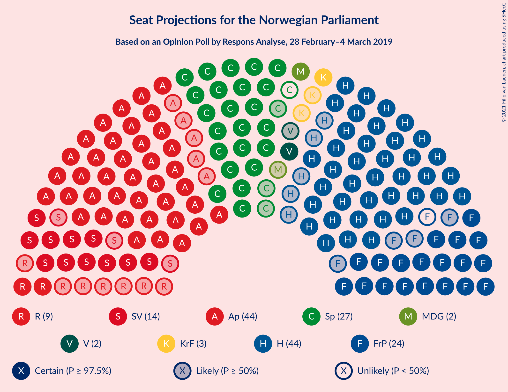
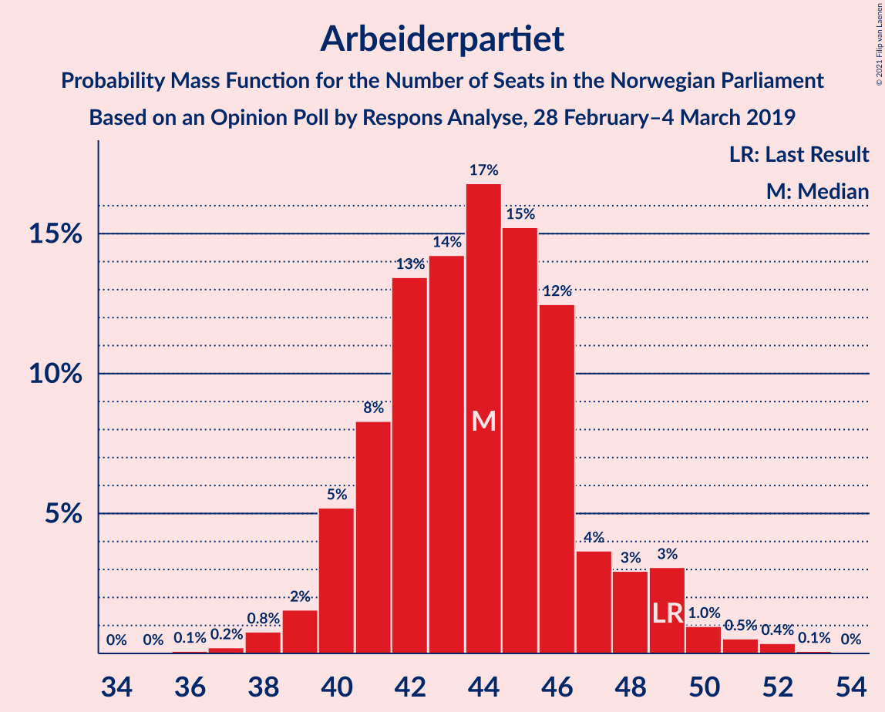
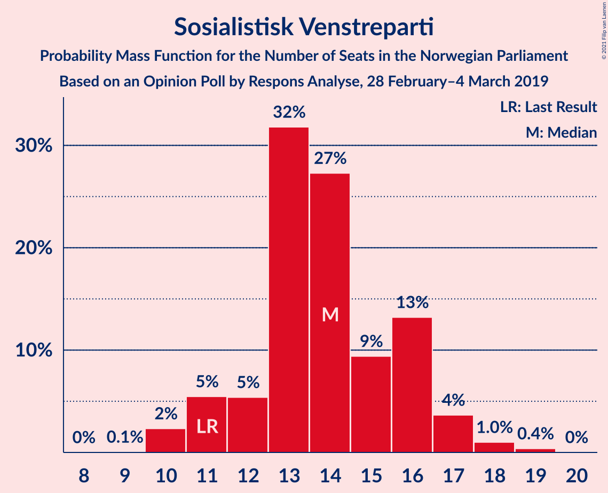
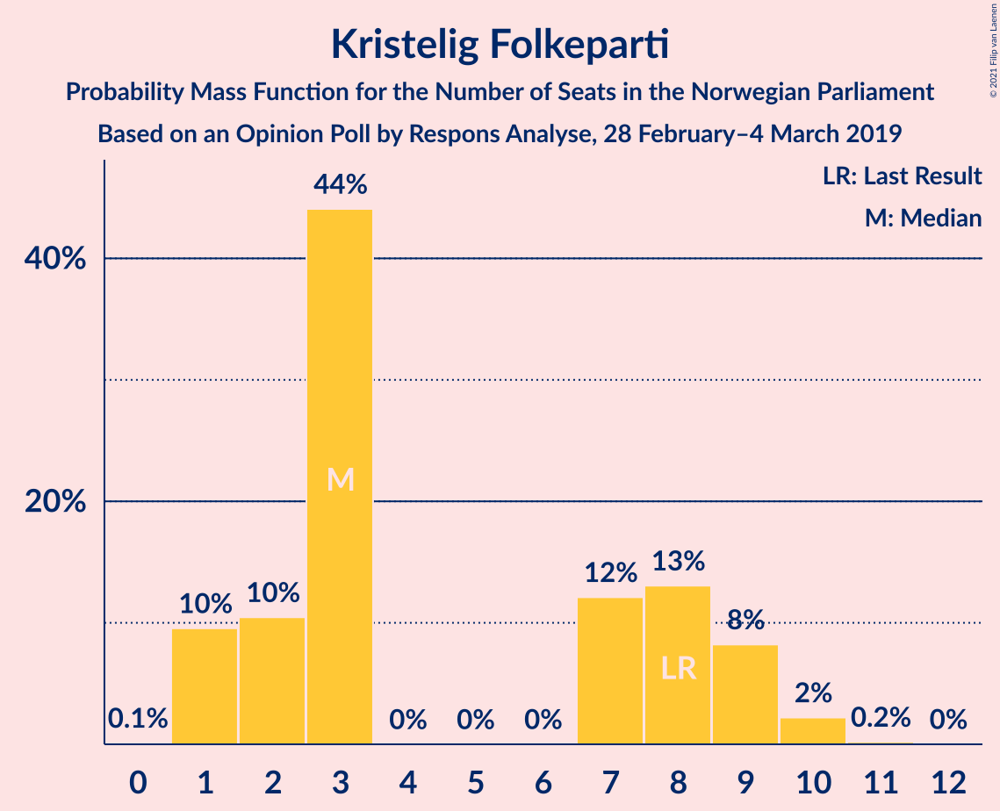
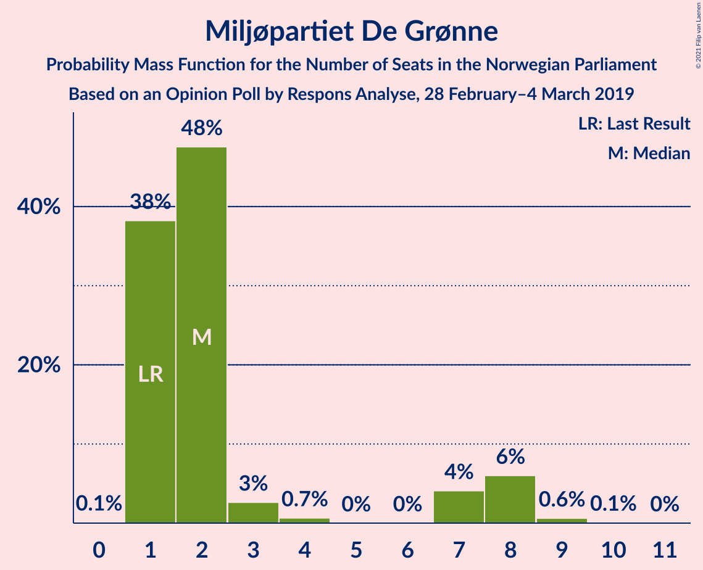
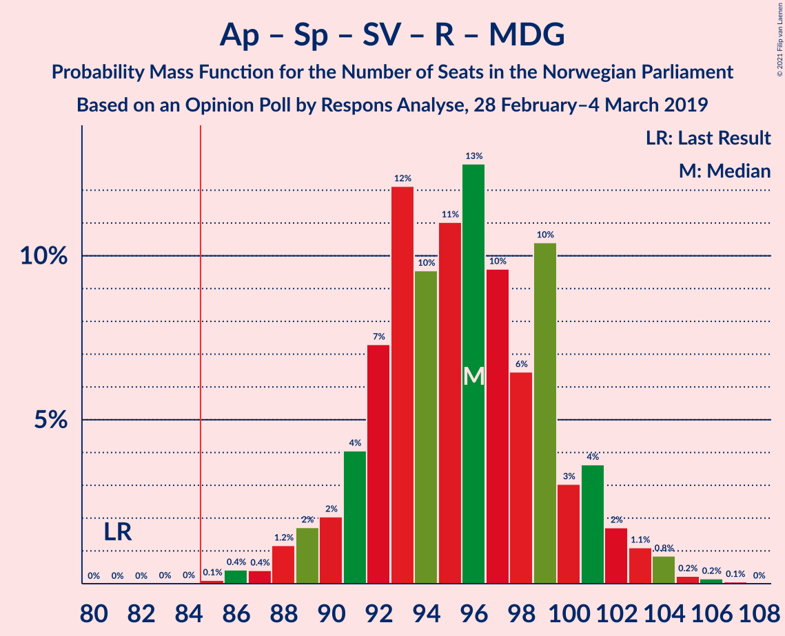
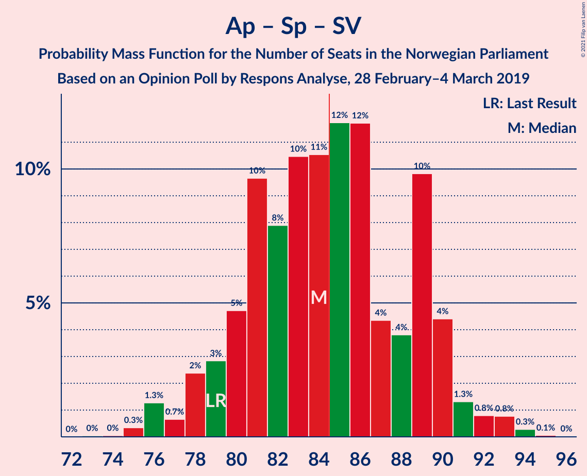
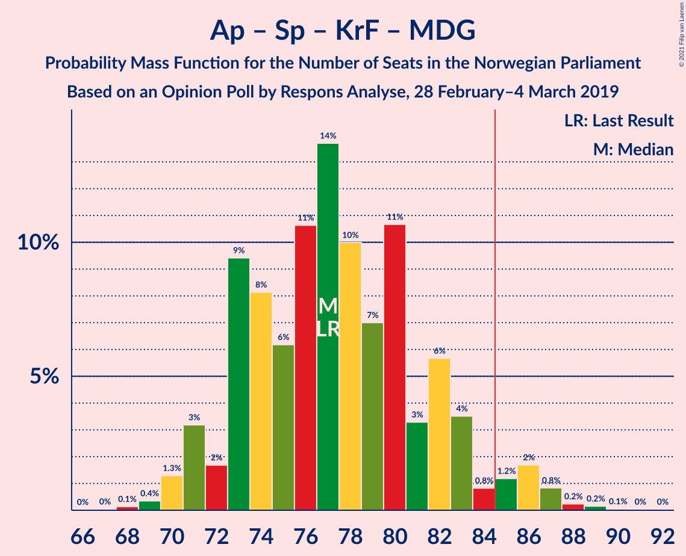
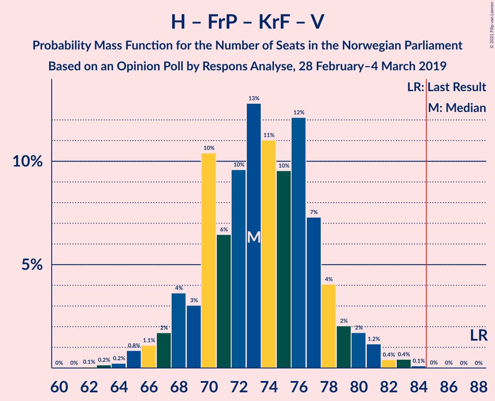

# Opinion Poll by Respons Analyse, 28 February–4 March 2019

<a href="#voting-intentions">Voting Intentions</a> | <a href="#seats">Seats</a> | <a href="#coalitions">Coalitions</a> | <a href="#technical-information">Technical Information</a>

## Voting Intentions

### Confidence Intervals

| Party | Last Result | Poll Result | 80% Confidence Interval | 90% Confidence Interval | 95% Confidence Interval | 99% Confidence Interval |
|:-----:|:-----------:|:-----------:|:-----------------------:|:-----------------------:|:-----------------------:|:-----------------------:|
| Arbeiderpartiet | 27.4% | 24.3% | 22.6–26.1% |22.1–26.6% |21.7–27.1% |21.0–27.9% |
| Høyre | 25.0% | 24.3% | 22.6–26.1% |22.1–26.6% |21.7–27.1% |21.0–27.9% |
| Senterpartiet | 10.3% | 14.6% | 13.2–16.1% |12.9–16.6% |12.5–16.9% |11.9–17.7% |
| Fremskrittspartiet | 15.2% | 12.6% | 11.3–14.0% |11.0–14.4% |10.7–14.8% |10.1–15.5% |
| Sosialistisk Venstreparti | 6.0% | 7.6% | 6.6–8.8% |6.3–9.1% |6.1–9.4% |5.7–10.0% |
| Rødt | 2.4% | 5.0% | 4.2–6.0% |4.0–6.3% |3.8–6.5% |3.5–7.1% |
| Kristelig Folkeparti | 4.2% | 3.8% | 3.1–4.7% |2.9–5.0% |2.8–5.2% |2.5–5.6% |
| Miljøpartiet De Grønne | 3.2% | 3.3% | 2.7–4.1% |2.5–4.4% |2.4–4.6% |2.1–5.0% |
| Venstre | 4.4% | 2.8% | 2.2–3.6% |2.1–3.8% |1.9–4.0% |1.7–4.4% |

*Note:* The poll result column reflects the actual value used in the calculations. Published results may vary slightly, and in addition be rounded to fewer digits.

## Seats

### Confidence Intervals

| Party | Last Result | Median | 80% Confidence Interval | 90% Confidence Interval | 95% Confidence Interval | 99% Confidence Interval |
|:-----:|:-----------:|:------:|:-----------------------:|:-----------------------:|:-----------------------:|:-----------------------:|
| <a href="#arbeiderpartiet">Arbeiderpartiet</a> | 49 | 44 | 41–47 |40–49 |39–49 |38–51 |
| <a href="#høyre">Høyre</a> | 45 | 44 | 41–47 |40–49 |39–49 |37–51 |
| <a href="#senterpartiet">Senterpartiet</a> | 19 | 26 | 24–30 |23–31 |23–31 |21–32 |
| <a href="#fremskrittspartiet">Fremskrittspartiet</a> | 27 | 23 | 20–26 |19–26 |19–27 |18–28 |
| <a href="#sosialistisk-venstreparti">Sosialistisk Venstreparti</a> | 11 | 14 | 12–16 |11–17 |11–17 |10–18 |
| <a href="#rødt">Rødt</a> | 1 | 9 | 8–11 |2–11 |2–12 |2–13 |
| <a href="#kristelig-folkeparti">Kristelig Folkeparti</a> | 8 | 3 | 2–9 |1–9 |1–9 |1–10 |
| <a href="#miljøpartiet-de-grønne">Miljøpartiet De Grønne</a> | 1 | 2 | 1–7 |1–8 |1–8 |1–9 |
| <a href="#venstre">Venstre</a> | 8 | 2 | 1–2 |1–2 |1–7 |0–8 |

### Arbeiderpartiet

*For a full overview of the results for this party, see the [Arbeiderpartiet](party-arbeiderpartiet.html) page.*

| Number of Seats | Probability | Accumulated | Special Marks |
|:---------------:|:-----------:|:-----------:|:-------------:|
| 36 | 0.1% | 100% |  |
| 37 | 0.2% | 99.9% |  |
| 38 | 0.8% | 99.7% |  |
| 39 | 2% | 98.9% |  |
| 40 | 5% | 97% |  |
| 41 | 8% | 92% |  |
| 42 | 13% | 84% |  |
| 43 | 14% | 70% |  |
| 44 | 17% | 56% | Median |
| 45 | 15% | 39% |  |
| 46 | 12% | 24% |  |
| 47 | 4% | 12% |  |
| 48 | 3% | 8% |  |
| 49 | 3% | 5% | Last Result |
| 50 | 1.0% | 2% |  |
| 51 | 0.5% | 1.0% |  |
| 52 | 0.4% | 0.5% |  |
| 53 | 0.1% | 0.1% |  |
| 54 | 0% | 0% |  |

### Høyre

*For a full overview of the results for this party, see the [Høyre](party-høyre.html) page.*

| Number of Seats | Probability | Accumulated | Special Marks |
|:---------------:|:-----------:|:-----------:|:-------------:|
| 36 | 0.2% | 100% |  |
| 37 | 0.5% | 99.8% |  |
| 38 | 1.5% | 99.3% |  |
| 39 | 3% | 98% |  |
| 40 | 5% | 95% |  |
| 41 | 11% | 90% |  |
| 42 | 10% | 79% |  |
| 43 | 14% | 69% |  |
| 44 | 14% | 55% | Median |
| 45 | 13% | 42% | Last Result |
| 46 | 12% | 29% |  |
| 47 | 8% | 17% |  |
| 48 | 3% | 9% |  |
| 49 | 4% | 6% |  |
| 50 | 2% | 2% |  |
| 51 | 0.2% | 0.6% |  |
| 52 | 0.3% | 0.3% |  |
| 53 | 0% | 0.1% |  |
| 54 | 0% | 0% |  |

### Senterpartiet

*For a full overview of the results for this party, see the [Senterpartiet](party-senterpartiet.html) page.*

| Number of Seats | Probability | Accumulated | Special Marks |
|:---------------:|:-----------:|:-----------:|:-------------:|
| 19 | 0% | 100% | Last Result |
| 20 | 0.2% | 99.9% |  |
| 21 | 0.4% | 99.8% |  |
| 22 | 2% | 99.4% |  |
| 23 | 6% | 98% |  |
| 24 | 12% | 92% |  |
| 25 | 16% | 80% |  |
| 26 | 15% | 64% | Median |
| 27 | 16% | 49% |  |
| 28 | 6% | 33% |  |
| 29 | 8% | 27% |  |
| 30 | 13% | 19% |  |
| 31 | 5% | 6% |  |
| 32 | 0.7% | 1.1% |  |
| 33 | 0.3% | 0.4% |  |
| 34 | 0.1% | 0.1% |  |
| 35 | 0% | 0% |  |

### Fremskrittspartiet

*For a full overview of the results for this party, see the [Fremskrittspartiet](party-fremskrittspartiet.html) page.*

| Number of Seats | Probability | Accumulated | Special Marks |
|:---------------:|:-----------:|:-----------:|:-------------:|
| 17 | 0.3% | 100% |  |
| 18 | 1.2% | 99.6% |  |
| 19 | 4% | 98% |  |
| 20 | 6% | 94% |  |
| 21 | 10% | 89% |  |
| 22 | 20% | 79% |  |
| 23 | 18% | 58% | Median |
| 24 | 18% | 40% |  |
| 25 | 9% | 22% |  |
| 26 | 9% | 13% |  |
| 27 | 3% | 4% | Last Result |
| 28 | 0.9% | 1.3% |  |
| 29 | 0.3% | 0.4% |  |
| 30 | 0% | 0.1% |  |
| 31 | 0% | 0% |  |

### Sosialistisk Venstreparti

*For a full overview of the results for this party, see the [Sosialistisk Venstreparti](party-sosialistiskvenstreparti.html) page.*

| Number of Seats | Probability | Accumulated | Special Marks |
|:---------------:|:-----------:|:-----------:|:-------------:|
| 9 | 0.1% | 100% |  |
| 10 | 2% | 99.9% |  |
| 11 | 5% | 98% | Last Result |
| 12 | 5% | 92% |  |
| 13 | 32% | 87% |  |
| 14 | 27% | 55% | Median |
| 15 | 9% | 28% |  |
| 16 | 13% | 18% |  |
| 17 | 4% | 5% |  |
| 18 | 1.0% | 1.4% |  |
| 19 | 0.4% | 0.4% |  |
| 20 | 0% | 0% |  |

### Rødt

*For a full overview of the results for this party, see the [Rødt](party-rødt.html) page.*

| Number of Seats | Probability | Accumulated | Special Marks |
|:---------------:|:-----------:|:-----------:|:-------------:|
| 1 | 0% | 100% | Last Result |
| 2 | 6% | 100% |  |
| 3 | 0% | 94% |  |
| 4 | 0% | 94% |  |
| 5 | 0% | 94% |  |
| 6 | 0% | 94% |  |
| 7 | 3% | 94% |  |
| 8 | 24% | 91% |  |
| 9 | 29% | 67% | Median |
| 10 | 24% | 37% |  |
| 11 | 9% | 13% |  |
| 12 | 3% | 4% |  |
| 13 | 0.9% | 1.0% |  |
| 14 | 0.1% | 0.1% |  |
| 15 | 0% | 0% |  |

### Kristelig Folkeparti

*For a full overview of the results for this party, see the [Kristelig Folkeparti](party-kristeligfolkeparti.html) page.*

| Number of Seats | Probability | Accumulated | Special Marks |
|:---------------:|:-----------:|:-----------:|:-------------:|
| 0 | 0.1% | 100% |  |
| 1 | 10% | 99.9% |  |
| 2 | 10% | 90% |  |
| 3 | 44% | 80% | Median |
| 4 | 0% | 36% |  |
| 5 | 0% | 36% |  |
| 6 | 0% | 36% |  |
| 7 | 12% | 36% |  |
| 8 | 13% | 24% | Last Result |
| 9 | 8% | 11% |  |
| 10 | 2% | 2% |  |
| 11 | 0.2% | 0.2% |  |
| 12 | 0% | 0% |  |

### Miljøpartiet De Grønne

*For a full overview of the results for this party, see the [Miljøpartiet De Grønne](party-miljøpartietdegrønne.html) page.*

| Number of Seats | Probability | Accumulated | Special Marks |
|:---------------:|:-----------:|:-----------:|:-------------:|
| 0 | 0.1% | 100% |  |
| 1 | 38% | 99.9% | Last Result |
| 2 | 48% | 62% | Median |
| 3 | 3% | 14% |  |
| 4 | 0.7% | 11% |  |
| 5 | 0% | 11% |  |
| 6 | 0% | 11% |  |
| 7 | 4% | 11% |  |
| 8 | 6% | 7% |  |
| 9 | 0.6% | 0.7% |  |
| 10 | 0.1% | 0.1% |  |
| 11 | 0% | 0% |  |

### Venstre

*For a full overview of the results for this party, see the [Venstre](party-venstre.html) page.*

| Number of Seats | Probability | Accumulated | Special Marks |
|:---------------:|:-----------:|:-----------:|:-------------:|
| 0 | 1.2% | 100% |  |
| 1 | 12% | 98.8% |  |
| 2 | 82% | 86% | Median |
| 3 | 0.9% | 4% |  |
| 4 | 0% | 3% |  |
| 5 | 0% | 3% |  |
| 6 | 0% | 3% |  |
| 7 | 2% | 3% |  |
| 8 | 1.2% | 1.4% | Last Result |
| 9 | 0.1% | 0.1% |  |
| 10 | 0% | 0% |  |

## Coalitions

### Confidence Intervals

| Coalition | Last Result | Median | Majority? | 80% Confidence Interval | 90% Confidence Interval | 95% Confidence Interval | 99% Confidence Interval |
|:---------:|:-----------:|:------:|:---------:|:-----------------------:|:-----------------------:|:-----------------------:|:-----------------------:|
| Høyre – Senterpartiet – Fremskrittspartiet – Kristelig Folkeparti – Venstre | 107 | 100 | 100% | 96–103 | 95–105 | 94–107 | 91–108 |
| Arbeiderpartiet – Senterpartiet – Sosialistisk Venstreparti – Rødt – Miljøpartiet De Grønne | 81 | 96 | 100% | 92–100 | 90–101 | 89–102 | 86–104 |
| Arbeiderpartiet – Senterpartiet – Sosialistisk Venstreparti – Rødt | 80 | 93 | 99.4% | 89–97 | 87–99 | 86–100 | 84–103 |
| Arbeiderpartiet – Senterpartiet – Sosialistisk Venstreparti – Kristelig Folkeparti – Miljøpartiet De Grønne | 88 | 91 | 98% | 87–96 | 86–97 | 85–99 | 83–100 |
| Arbeiderpartiet – Senterpartiet – Sosialistisk Venstreparti – Miljøpartiet De Grønne | 80 | 87 | 71% | 82–91 | 81–93 | 80–94 | 78–96 |
| Arbeiderpartiet – Senterpartiet – Sosialistisk Venstreparti | 79 | 84 | 49% | 80–89 | 79–90 | 78–91 | 76–93 |
| Arbeiderpartiet – Senterpartiet – Kristelig Folkeparti – Miljøpartiet De Grønne | 77 | 77 | 4% | 73–82 | 71–84 | 71–86 | 69–88 |
| Arbeiderpartiet – Senterpartiet – Kristelig Folkeparti | 76 | 75 | 0.9% | 71–80 | 69–81 | 69–83 | 67–85 |
| Høyre – Fremskrittspartiet – Kristelig Folkeparti – Miljøpartiet De Grønne – Venstre | 89 | 76 | 0.6% | 72–80 | 70–82 | 69–83 | 66–85 |
| Høyre – Fremskrittspartiet – Kristelig Folkeparti – Venstre | 88 | 73 | 0% | 69–77 | 68–79 | 67–80 | 65–83 |
| Arbeiderpartiet – Senterpartiet | 68 | 71 | 0% | 66–75 | 65–76 | 65–77 | 63–79 |
| Høyre – Fremskrittspartiet – Venstre | 80 | 69 | 0% | 65–73 | 63–74 | 62–75 | 60–78 |
| Høyre – Fremskrittspartiet | 72 | 67 | 0% | 63–71 | 61–72 | 60–73 | 59–76 |
| Arbeiderpartiet – Sosialistisk Venstreparti | 60 | 58 | 0% | 54–62 | 53–63 | 52–64 | 51–66 |
| Høyre – Kristelig Folkeparti – Venstre | 61 | 51 | 0% | 46–55 | 45–56 | 44–57 | 43–60 |
| Senterpartiet – Kristelig Folkeparti – Venstre | 35 | 33 | 0% | 29–37 | 28–39 | 27–40 | 26–42 |

### Høyre – Senterpartiet – Fremskrittspartiet – Kristelig Folkeparti – Venstre

| Number of Seats | Probability | Accumulated | Special Marks |
|:---------------:|:-----------:|:-----------:|:-------------:|
| 89 | 0.1% | 100% |  |
| 90 | 0.2% | 99.9% |  |
| 91 | 0.4% | 99.7% |  |
| 92 | 0.7% | 99.3% |  |
| 93 | 0.9% | 98.6% |  |
| 94 | 3% | 98% |  |
| 95 | 3% | 95% |  |
| 96 | 3% | 92% |  |
| 97 | 6% | 89% |  |
| 98 | 8% | 83% | Median |
| 99 | 12% | 75% |  |
| 100 | 15% | 63% |  |
| 101 | 16% | 48% |  |
| 102 | 13% | 32% |  |
| 103 | 11% | 19% |  |
| 104 | 2% | 9% |  |
| 105 | 2% | 6% |  |
| 106 | 1.3% | 4% |  |
| 107 | 2% | 3% | Last Result |
| 108 | 1.0% | 1.4% |  |
| 109 | 0.2% | 0.4% |  |
| 110 | 0.1% | 0.2% |  |
| 111 | 0% | 0.1% |  |
| 112 | 0% | 0% |  |

### Arbeiderpartiet – Senterpartiet – Sosialistisk Venstreparti – Rødt – Miljøpartiet De Grønne

| Number of Seats | Probability | Accumulated | Special Marks |
|:---------------:|:-----------:|:-----------:|:-------------:|
| 81 | 0% | 100% | Last Result |
| 82 | 0% | 100% |  |
| 83 | 0% | 100% |  |
| 84 | 0% | 100% |  |
| 85 | 0.1% | 100% | Majority |
| 86 | 0.4% | 99.9% |  |
| 87 | 0.4% | 99.4% |  |
| 88 | 1.2% | 99.0% |  |
| 89 | 2% | 98% |  |
| 90 | 2% | 96% |  |
| 91 | 4% | 94% |  |
| 92 | 7% | 90% |  |
| 93 | 12% | 83% |  |
| 94 | 10% | 71% |  |
| 95 | 11% | 61% | Median |
| 96 | 13% | 50% |  |
| 97 | 10% | 37% |  |
| 98 | 6% | 28% |  |
| 99 | 10% | 21% |  |
| 100 | 3% | 11% |  |
| 101 | 4% | 8% |  |
| 102 | 2% | 4% |  |
| 103 | 1.1% | 2% |  |
| 104 | 0.8% | 1.3% |  |
| 105 | 0.2% | 0.5% |  |
| 106 | 0.2% | 0.2% |  |
| 107 | 0.1% | 0.1% |  |
| 108 | 0% | 0% |  |

### Arbeiderpartiet – Senterpartiet – Sosialistisk Venstreparti – Rødt

| Number of Seats | Probability | Accumulated | Special Marks |
|:---------------:|:-----------:|:-----------:|:-------------:|
| 80 | 0.1% | 100% | Last Result |
| 81 | 0% | 99.9% |  |
| 82 | 0% | 99.9% |  |
| 83 | 0.2% | 99.8% |  |
| 84 | 0.3% | 99.7% |  |
| 85 | 2% | 99.4% | Majority |
| 86 | 2% | 98% |  |
| 87 | 2% | 96% |  |
| 88 | 2% | 94% |  |
| 89 | 6% | 92% |  |
| 90 | 5% | 86% |  |
| 91 | 13% | 81% |  |
| 92 | 7% | 68% |  |
| 93 | 13% | 61% | Median |
| 94 | 11% | 48% |  |
| 95 | 12% | 37% |  |
| 96 | 4% | 25% |  |
| 97 | 11% | 21% |  |
| 98 | 2% | 9% |  |
| 99 | 4% | 7% |  |
| 100 | 0.9% | 3% |  |
| 101 | 1.4% | 2% |  |
| 102 | 0.3% | 0.8% |  |
| 103 | 0.5% | 0.5% |  |
| 104 | 0% | 0.1% |  |
| 105 | 0% | 0% |  |

### Arbeiderpartiet – Senterpartiet – Sosialistisk Venstreparti – Kristelig Folkeparti – Miljøpartiet De Grønne

| Number of Seats | Probability | Accumulated | Special Marks |
|:---------------:|:-----------:|:-----------:|:-------------:|
| 81 | 0% | 100% |  |
| 82 | 0.1% | 99.9% |  |
| 83 | 0.5% | 99.8% |  |
| 84 | 1.0% | 99.3% |  |
| 85 | 3% | 98% | Majority |
| 86 | 3% | 96% |  |
| 87 | 7% | 93% |  |
| 88 | 11% | 86% | Last Result |
| 89 | 7% | 75% | Median |
| 90 | 12% | 68% |  |
| 91 | 11% | 56% |  |
| 92 | 10% | 45% |  |
| 93 | 9% | 34% |  |
| 94 | 8% | 25% |  |
| 95 | 7% | 18% |  |
| 96 | 4% | 11% |  |
| 97 | 2% | 6% |  |
| 98 | 1.0% | 5% |  |
| 99 | 2% | 4% |  |
| 100 | 1.0% | 1.5% |  |
| 101 | 0.2% | 0.4% |  |
| 102 | 0.1% | 0.3% |  |
| 103 | 0% | 0.1% |  |
| 104 | 0% | 0.1% |  |
| 105 | 0% | 0% |  |

### Arbeiderpartiet – Senterpartiet – Sosialistisk Venstreparti – Miljøpartiet De Grønne

| Number of Seats | Probability | Accumulated | Special Marks |
|:---------------:|:-----------:|:-----------:|:-------------:|
| 76 | 0% | 100% |  |
| 77 | 0.2% | 99.9% |  |
| 78 | 0.3% | 99.7% |  |
| 79 | 0.8% | 99.5% |  |
| 80 | 2% | 98.7% | Last Result |
| 81 | 4% | 97% |  |
| 82 | 6% | 93% |  |
| 83 | 7% | 87% |  |
| 84 | 9% | 80% |  |
| 85 | 10% | 71% | Majority |
| 86 | 11% | 61% | Median |
| 87 | 11% | 50% |  |
| 88 | 8% | 40% |  |
| 89 | 7% | 31% |  |
| 90 | 5% | 24% |  |
| 91 | 10% | 19% |  |
| 92 | 3% | 9% |  |
| 93 | 2% | 5% |  |
| 94 | 2% | 3% |  |
| 95 | 0.8% | 2% |  |
| 96 | 0.6% | 0.8% |  |
| 97 | 0.1% | 0.3% |  |
| 98 | 0.1% | 0.1% |  |
| 99 | 0% | 0.1% |  |
| 100 | 0% | 0% |  |

### Arbeiderpartiet – Senterpartiet – Sosialistisk Venstreparti

| Number of Seats | Probability | Accumulated | Special Marks |
|:---------------:|:-----------:|:-----------:|:-------------:|
| 73 | 0% | 100% |  |
| 74 | 0% | 99.9% |  |
| 75 | 0.3% | 99.9% |  |
| 76 | 1.3% | 99.6% |  |
| 77 | 0.7% | 98% |  |
| 78 | 2% | 98% |  |
| 79 | 3% | 95% | Last Result |
| 80 | 5% | 92% |  |
| 81 | 10% | 88% |  |
| 82 | 8% | 78% |  |
| 83 | 10% | 70% |  |
| 84 | 11% | 60% | Median |
| 85 | 12% | 49% | Majority |
| 86 | 12% | 37% |  |
| 87 | 4% | 26% |  |
| 88 | 4% | 21% |  |
| 89 | 10% | 18% |  |
| 90 | 4% | 8% |  |
| 91 | 1.3% | 3% |  |
| 92 | 0.8% | 2% |  |
| 93 | 0.8% | 1.2% |  |
| 94 | 0.3% | 0.4% |  |
| 95 | 0.1% | 0.1% |  |
| 96 | 0% | 0% |  |

### Arbeiderpartiet – Senterpartiet – Kristelig Folkeparti – Miljøpartiet De Grønne

| Number of Seats | Probability | Accumulated | Special Marks |
|:---------------:|:-----------:|:-----------:|:-------------:|
| 67 | 0% | 100% |  |
| 68 | 0.1% | 99.9% |  |
| 69 | 0.4% | 99.8% |  |
| 70 | 1.3% | 99.4% |  |
| 71 | 3% | 98% |  |
| 72 | 2% | 95% |  |
| 73 | 9% | 93% |  |
| 74 | 8% | 84% |  |
| 75 | 6% | 76% | Median |
| 76 | 11% | 70% |  |
| 77 | 14% | 59% | Last Result |
| 78 | 10% | 45% |  |
| 79 | 7% | 35% |  |
| 80 | 11% | 28% |  |
| 81 | 3% | 18% |  |
| 82 | 6% | 14% |  |
| 83 | 4% | 9% |  |
| 84 | 0.8% | 5% |  |
| 85 | 1.2% | 4% | Majority |
| 86 | 2% | 3% |  |
| 87 | 0.8% | 1.4% |  |
| 88 | 0.2% | 0.5% |  |
| 89 | 0.2% | 0.3% |  |
| 90 | 0.1% | 0.1% |  |
| 91 | 0% | 0.1% |  |
| 92 | 0% | 0% |  |

### Arbeiderpartiet – Senterpartiet – Kristelig Folkeparti

| Number of Seats | Probability | Accumulated | Special Marks |
|:---------------:|:-----------:|:-----------:|:-------------:|
| 65 | 0.1% | 100% |  |
| 66 | 0.3% | 99.8% |  |
| 67 | 0.6% | 99.6% |  |
| 68 | 1.1% | 99.0% |  |
| 69 | 3% | 98% |  |
| 70 | 3% | 95% |  |
| 71 | 5% | 92% |  |
| 72 | 13% | 87% |  |
| 73 | 9% | 74% | Median |
| 74 | 7% | 65% |  |
| 75 | 14% | 58% |  |
| 76 | 13% | 44% | Last Result |
| 77 | 6% | 31% |  |
| 78 | 10% | 25% |  |
| 79 | 4% | 15% |  |
| 80 | 5% | 11% |  |
| 81 | 2% | 6% |  |
| 82 | 1.4% | 4% |  |
| 83 | 0.5% | 3% |  |
| 84 | 1.3% | 2% |  |
| 85 | 0.7% | 0.9% | Majority |
| 86 | 0.1% | 0.2% |  |
| 87 | 0% | 0% |  |

### Høyre – Fremskrittspartiet – Kristelig Folkeparti – Miljøpartiet De Grønne – Venstre

| Number of Seats | Probability | Accumulated | Special Marks |
|:---------------:|:-----------:|:-----------:|:-------------:|
| 65 | 0% | 100% |  |
| 66 | 0.5% | 99.9% |  |
| 67 | 0.3% | 99.5% |  |
| 68 | 1.4% | 99.2% |  |
| 69 | 0.9% | 98% |  |
| 70 | 4% | 97% |  |
| 71 | 2% | 93% |  |
| 72 | 11% | 91% |  |
| 73 | 4% | 79% |  |
| 74 | 12% | 75% | Median |
| 75 | 11% | 63% |  |
| 76 | 13% | 52% |  |
| 77 | 7% | 39% |  |
| 78 | 13% | 32% |  |
| 79 | 5% | 19% |  |
| 80 | 6% | 14% |  |
| 81 | 2% | 8% |  |
| 82 | 2% | 6% |  |
| 83 | 2% | 4% |  |
| 84 | 2% | 2% |  |
| 85 | 0.3% | 0.6% | Majority |
| 86 | 0.2% | 0.3% |  |
| 87 | 0% | 0.2% |  |
| 88 | 0% | 0.1% |  |
| 89 | 0.1% | 0.1% | Last Result |
| 90 | 0% | 0% |  |

### Høyre – Fremskrittspartiet – Kristelig Folkeparti – Venstre

| Number of Seats | Probability | Accumulated | Special Marks |
|:---------------:|:-----------:|:-----------:|:-------------:|
| 62 | 0.1% | 100% |  |
| 63 | 0.2% | 99.9% |  |
| 64 | 0.2% | 99.8% |  |
| 65 | 0.8% | 99.5% |  |
| 66 | 1.1% | 98.7% |  |
| 67 | 2% | 98% |  |
| 68 | 4% | 96% |  |
| 69 | 3% | 92% |  |
| 70 | 10% | 89% |  |
| 71 | 6% | 79% |  |
| 72 | 10% | 72% | Median |
| 73 | 13% | 63% |  |
| 74 | 11% | 50% |  |
| 75 | 10% | 39% |  |
| 76 | 12% | 29% |  |
| 77 | 7% | 17% |  |
| 78 | 4% | 10% |  |
| 79 | 2% | 6% |  |
| 80 | 2% | 4% |  |
| 81 | 1.2% | 2% |  |
| 82 | 0.4% | 1.0% |  |
| 83 | 0.4% | 0.6% |  |
| 84 | 0.1% | 0.1% |  |
| 85 | 0% | 0% | Majority |
| 86 | 0% | 0% |  |
| 87 | 0% | 0% |  |
| 88 | 0% | 0% | Last Result |

### Arbeiderpartiet – Senterpartiet

| Number of Seats | Probability | Accumulated | Special Marks |
|:---------------:|:-----------:|:-----------:|:-------------:|
| 61 | 0.1% | 100% |  |
| 62 | 0.2% | 99.9% |  |
| 63 | 0.4% | 99.7% |  |
| 64 | 2% | 99.3% |  |
| 65 | 4% | 98% |  |
| 66 | 5% | 93% |  |
| 67 | 3% | 88% |  |
| 68 | 14% | 85% | Last Result |
| 69 | 14% | 71% |  |
| 70 | 7% | 57% | Median |
| 71 | 10% | 50% |  |
| 72 | 12% | 40% |  |
| 73 | 9% | 28% |  |
| 74 | 3% | 19% |  |
| 75 | 6% | 16% |  |
| 76 | 7% | 10% |  |
| 77 | 1.3% | 3% |  |
| 78 | 1.0% | 2% |  |
| 79 | 0.6% | 0.7% |  |
| 80 | 0.1% | 0.2% |  |
| 81 | 0.1% | 0.1% |  |
| 82 | 0% | 0% |  |

### Høyre – Fremskrittspartiet – Venstre

| Number of Seats | Probability | Accumulated | Special Marks |
|:---------------:|:-----------:|:-----------:|:-------------:|
| 58 | 0% | 100% |  |
| 59 | 0.1% | 99.9% |  |
| 60 | 0.3% | 99.8% |  |
| 61 | 0.5% | 99.5% |  |
| 62 | 3% | 99.0% |  |
| 63 | 2% | 96% |  |
| 64 | 2% | 95% |  |
| 65 | 8% | 92% |  |
| 66 | 5% | 84% |  |
| 67 | 10% | 79% |  |
| 68 | 13% | 69% |  |
| 69 | 12% | 56% | Median |
| 70 | 10% | 44% |  |
| 71 | 10% | 34% |  |
| 72 | 10% | 23% |  |
| 73 | 7% | 13% |  |
| 74 | 3% | 6% |  |
| 75 | 2% | 3% |  |
| 76 | 0.4% | 1.5% |  |
| 77 | 0.5% | 1.0% |  |
| 78 | 0.4% | 0.6% |  |
| 79 | 0.1% | 0.2% |  |
| 80 | 0% | 0% | Last Result |

### Høyre – Fremskrittspartiet

| Number of Seats | Probability | Accumulated | Special Marks |
|:---------------:|:-----------:|:-----------:|:-------------:|
| 56 | 0% | 100% |  |
| 57 | 0.1% | 99.9% |  |
| 58 | 0.2% | 99.8% |  |
| 59 | 0.6% | 99.6% |  |
| 60 | 3% | 99.0% |  |
| 61 | 2% | 96% |  |
| 62 | 2% | 94% |  |
| 63 | 7% | 92% |  |
| 64 | 6% | 85% |  |
| 65 | 10% | 79% |  |
| 66 | 13% | 69% |  |
| 67 | 12% | 55% | Median |
| 68 | 11% | 43% |  |
| 69 | 10% | 32% |  |
| 70 | 10% | 23% |  |
| 71 | 8% | 13% |  |
| 72 | 2% | 5% | Last Result |
| 73 | 1.4% | 3% |  |
| 74 | 0.4% | 1.4% |  |
| 75 | 0.5% | 1.0% |  |
| 76 | 0.1% | 0.5% |  |
| 77 | 0.4% | 0.4% |  |
| 78 | 0% | 0% |  |

### Arbeiderpartiet – Sosialistisk Venstreparti

| Number of Seats | Probability | Accumulated | Special Marks |
|:---------------:|:-----------:|:-----------:|:-------------:|
| 49 | 0.1% | 100% |  |
| 50 | 0.2% | 99.9% |  |
| 51 | 0.5% | 99.7% |  |
| 52 | 2% | 99.2% |  |
| 53 | 2% | 97% |  |
| 54 | 6% | 94% |  |
| 55 | 9% | 88% |  |
| 56 | 14% | 79% |  |
| 57 | 13% | 66% |  |
| 58 | 16% | 53% | Median |
| 59 | 15% | 37% |  |
| 60 | 5% | 22% | Last Result |
| 61 | 5% | 16% |  |
| 62 | 4% | 11% |  |
| 63 | 5% | 8% |  |
| 64 | 2% | 3% |  |
| 65 | 0.5% | 1.3% |  |
| 66 | 0.6% | 0.8% |  |
| 67 | 0.1% | 0.2% |  |
| 68 | 0.1% | 0.1% |  |
| 69 | 0% | 0% |  |

### Høyre – Kristelig Folkeparti – Venstre

| Number of Seats | Probability | Accumulated | Special Marks |
|:---------------:|:-----------:|:-----------:|:-------------:|
| 40 | 0% | 100% |  |
| 41 | 0.1% | 99.9% |  |
| 42 | 0.2% | 99.8% |  |
| 43 | 0.7% | 99.7% |  |
| 44 | 2% | 98.9% |  |
| 45 | 3% | 97% |  |
| 46 | 6% | 94% |  |
| 47 | 10% | 88% |  |
| 48 | 6% | 77% |  |
| 49 | 10% | 71% | Median |
| 50 | 8% | 62% |  |
| 51 | 17% | 53% |  |
| 52 | 12% | 36% |  |
| 53 | 5% | 24% |  |
| 54 | 8% | 20% |  |
| 55 | 6% | 12% |  |
| 56 | 3% | 6% |  |
| 57 | 1.3% | 3% |  |
| 58 | 0.8% | 2% |  |
| 59 | 0.6% | 1.2% |  |
| 60 | 0.4% | 0.6% |  |
| 61 | 0.1% | 0.2% | Last Result |
| 62 | 0.1% | 0.1% |  |
| 63 | 0% | 0% |  |

### Senterpartiet – Kristelig Folkeparti – Venstre

| Number of Seats | Probability | Accumulated | Special Marks |
|:---------------:|:-----------:|:-----------:|:-------------:|
| 25 | 0.1% | 100% |  |
| 26 | 0.5% | 99.8% |  |
| 27 | 2% | 99.3% |  |
| 28 | 4% | 97% |  |
| 29 | 3% | 93% |  |
| 30 | 9% | 89% |  |
| 31 | 9% | 81% | Median |
| 32 | 14% | 71% |  |
| 33 | 12% | 57% |  |
| 34 | 7% | 45% |  |
| 35 | 17% | 38% | Last Result |
| 36 | 9% | 21% |  |
| 37 | 4% | 13% |  |
| 38 | 2% | 8% |  |
| 39 | 2% | 6% |  |
| 40 | 2% | 4% |  |
| 41 | 1.2% | 2% |  |
| 42 | 0.3% | 0.6% |  |
| 43 | 0.2% | 0.3% |  |
| 44 | 0.1% | 0.1% |  |
| 45 | 0% | 0% |  |

## Technical Information

### Opinion Poll

+ **Polling firm:** Respons Analyse
+ **Commissioner(s):** —
+ **Fieldwork period:** 28 February–4 March 2019

### Calculations

+ **Sample size:** 1000
+ **Simulations done:** 1,048,576
+ **Error estimate:** 3.20%

