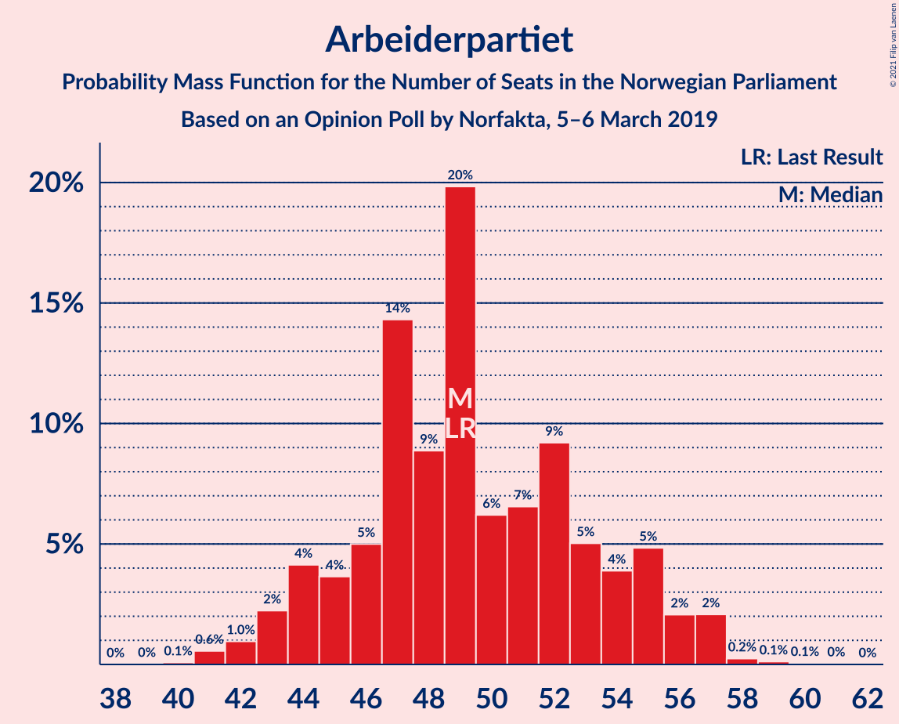
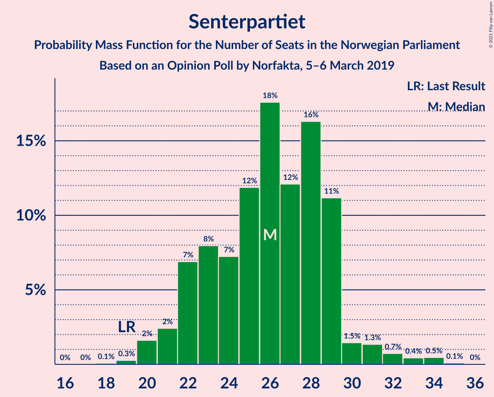
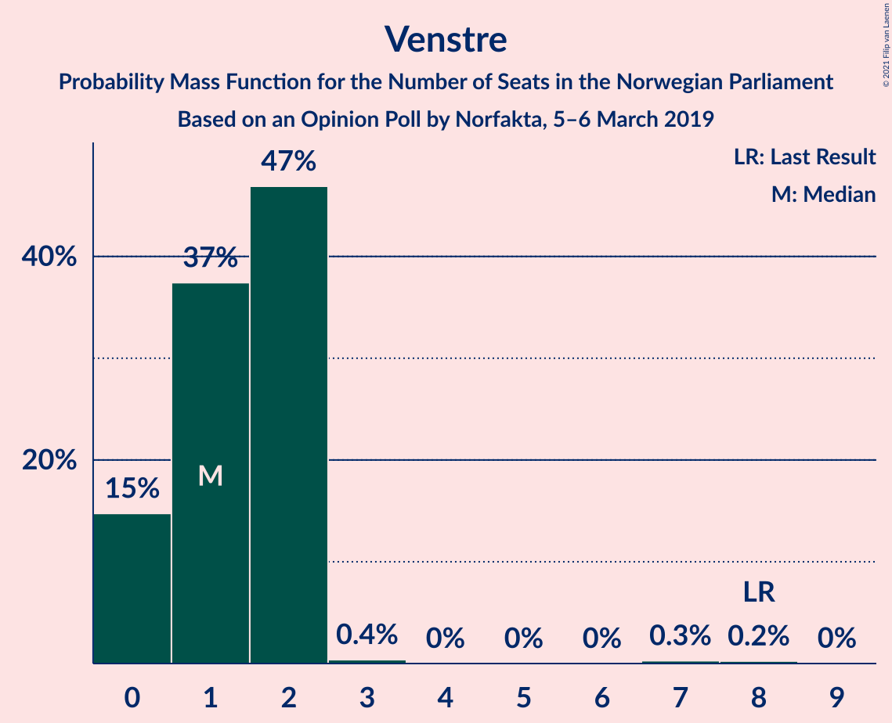
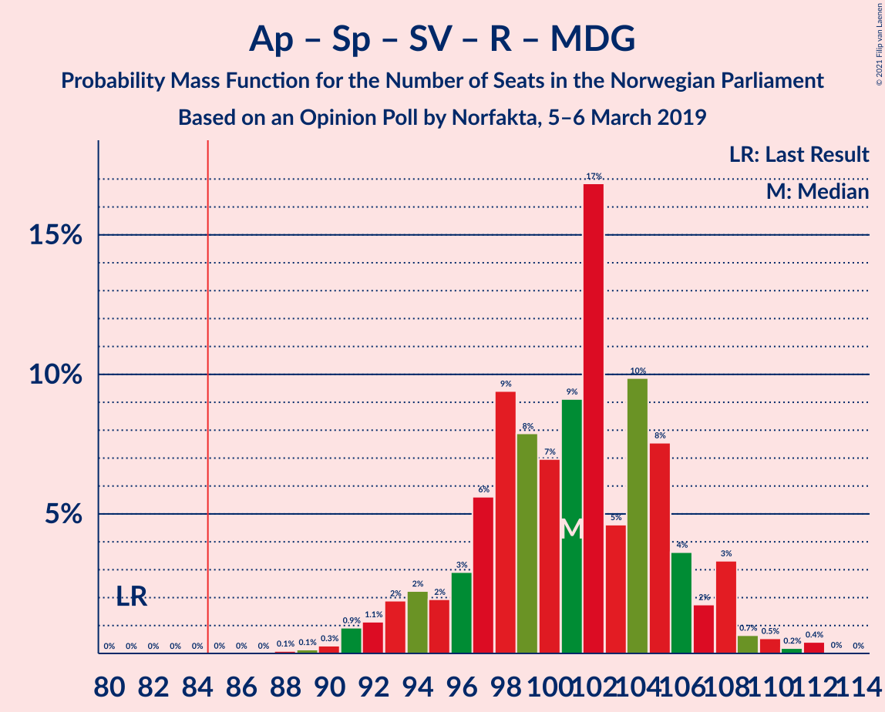
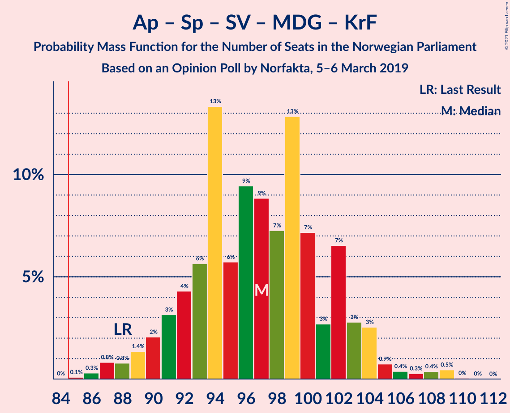
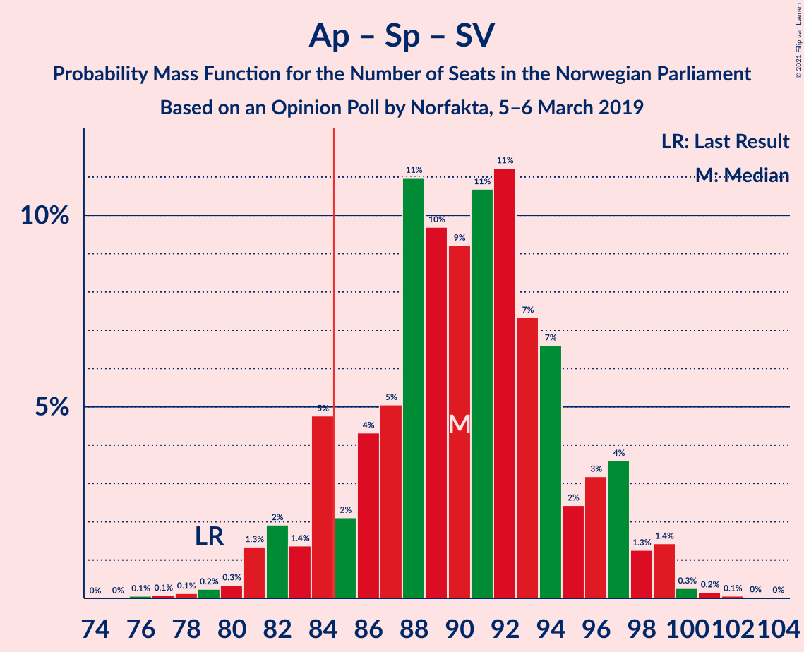
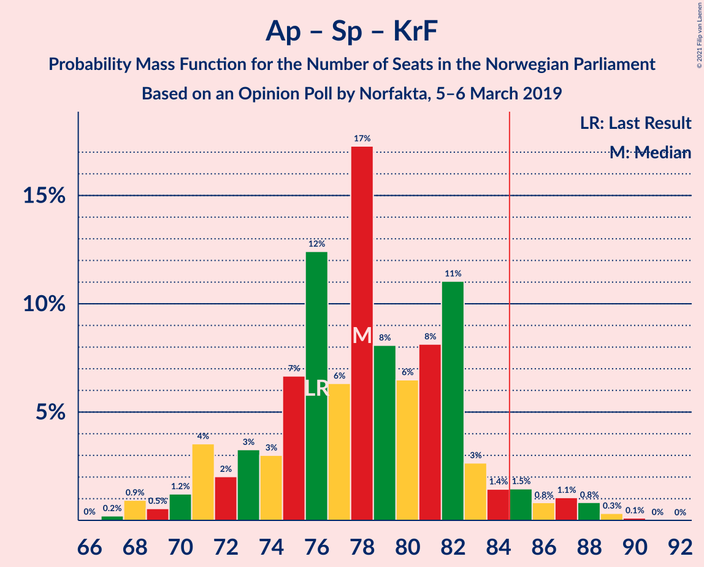

# Opinion Poll by Norfakta, 5–6 March 2019

<a href="#voting-intentions">Voting Intentions</a> | <a href="#seats">Seats</a> | <a href="#coalitions">Coalitions</a> | <a href="#technical-information">Technical Information</a>

## Voting Intentions

### Confidence Intervals

| Party | Last Result | Poll Result | 80% Confidence Interval | 90% Confidence Interval | 95% Confidence Interval | 99% Confidence Interval |
|:-----:|:-----------:|:-----------:|:-----------------------:|:-----------------------:|:-----------------------:|:-----------------------:|
| Arbeiderpartiet | 27.4% | 27.0% | 25.0–29.2% |24.4–29.8% |23.9–30.3% |23.0–31.4% |
| Høyre | 25.0% | 24.6% | 22.6–26.7% |22.1–27.3% |21.6–27.8% |20.7–28.8% |
| Senterpartiet | 10.3% | 14.0% | 12.5–15.8% |12.1–16.3% |11.7–16.7% |11.0–17.6% |
| Fremskrittspartiet | 15.2% | 10.7% | 9.3–12.3% |8.9–12.7% |8.6–13.1% |8.0–13.9% |
| Sosialistisk Venstreparti | 6.0% | 8.1% | 6.9–9.5% |6.6–9.9% |6.3–10.3% |5.8–11.0% |
| Rødt | 2.4% | 4.5% | 3.6–5.6% |3.4–5.9% |3.2–6.2% |2.8–6.8% |
| Miljøpartiet De Grønne | 3.2% | 3.6% | 2.9–4.7% |2.7–5.0% |2.5–5.3% |2.2–5.8% |
| Kristelig Folkeparti | 4.2% | 3.2% | 2.5–4.2% |2.3–4.5% |2.2–4.8% |1.9–5.3% |
| Venstre | 4.4% | 2.3% | 1.7–3.2% |1.6–3.4% |1.4–3.7% |1.2–4.1% |

*Note:* The poll result column reflects the actual value used in the calculations. Published results may vary slightly, and in addition be rounded to fewer digits.

## Seats

### Confidence Intervals

| Party | Last Result | Median | 80% Confidence Interval | 90% Confidence Interval | 95% Confidence Interval | 99% Confidence Interval |
|:-----:|:-----------:|:------:|:-----------------------:|:-----------------------:|:-----------------------:|:-----------------------:|
| <a href="#arbeiderpartiet">Arbeiderpartiet</a> | 49 | 49 | 45–54 |44–55 |43–57 |41–57 |
| <a href="#høyre">Høyre</a> | 45 | 44 | 41–49 |40–50 |38–51 |37–53 |
| <a href="#senterpartiet">Senterpartiet</a> | 19 | 26 | 22–29 |22–29 |21–31 |20–34 |
| <a href="#fremskrittspartiet">Fremskrittspartiet</a> | 27 | 19 | 17–23 |16–23 |15–24 |14–25 |
| <a href="#sosialistisk-venstreparti">Sosialistisk Venstreparti</a> | 11 | 15 | 12–17 |12–18 |11–19 |10–20 |
| <a href="#rødt">Rødt</a> | 1 | 8 | 2–10 |2–10 |2–11 |2–12 |
| <a href="#miljøpartiet-de-grønne">Miljøpartiet De Grønne</a> | 1 | 2 | 1–8 |1–9 |1–9 |1–10 |
| <a href="#kristelig-folkeparti">Kristelig Folkeparti</a> | 8 | 2 | 1–7 |1–8 |0–8 |0–9 |
| <a href="#venstre">Venstre</a> | 8 | 1 | 0–2 |0–2 |0–2 |0–7 |

### Arbeiderpartiet

*For a full overview of the results for this party, see the [Arbeiderpartiet](party-arbeiderpartiet.html) page.*

| Number of Seats | Probability | Accumulated | Special Marks |
|:---------------:|:-----------:|:-----------:|:-------------:|
| 40 | 0.1% | 100% |  |
| 41 | 0.6% | 99.9% |  |
| 42 | 1.0% | 99.3% |  |
| 43 | 2% | 98% |  |
| 44 | 4% | 96% |  |
| 45 | 4% | 92% |  |
| 46 | 5% | 88% |  |
| 47 | 14% | 83% |  |
| 48 | 9% | 69% |  |
| 49 | 20% | 60% | Last Result, Median |
| 50 | 6% | 40% |  |
| 51 | 7% | 34% |  |
| 52 | 9% | 28% |  |
| 53 | 5% | 18% |  |
| 54 | 4% | 13% |  |
| 55 | 5% | 9% |  |
| 56 | 2% | 5% |  |
| 57 | 2% | 3% |  |
| 58 | 0.2% | 0.5% |  |
| 59 | 0.1% | 0.2% |  |
| 60 | 0.1% | 0.1% |  |
| 61 | 0% | 0.1% |  |
| 62 | 0% | 0% |  |

### Høyre

*For a full overview of the results for this party, see the [Høyre](party-høyre.html) page.*

| Number of Seats | Probability | Accumulated | Special Marks |
|:---------------:|:-----------:|:-----------:|:-------------:|
| 35 | 0.1% | 100% |  |
| 36 | 0.4% | 99.9% |  |
| 37 | 0.7% | 99.5% |  |
| 38 | 2% | 98.9% |  |
| 39 | 2% | 97% |  |
| 40 | 3% | 95% |  |
| 41 | 5% | 92% |  |
| 42 | 10% | 87% |  |
| 43 | 12% | 77% |  |
| 44 | 17% | 65% | Median |
| 45 | 19% | 48% | Last Result |
| 46 | 10% | 29% |  |
| 47 | 4% | 19% |  |
| 48 | 4% | 15% |  |
| 49 | 3% | 10% |  |
| 50 | 3% | 7% |  |
| 51 | 2% | 4% |  |
| 52 | 0.7% | 1.5% |  |
| 53 | 0.6% | 0.8% |  |
| 54 | 0.1% | 0.2% |  |
| 55 | 0.1% | 0.1% |  |
| 56 | 0% | 0% |  |

### Senterpartiet

*For a full overview of the results for this party, see the [Senterpartiet](party-senterpartiet.html) page.*

| Number of Seats | Probability | Accumulated | Special Marks |
|:---------------:|:-----------:|:-----------:|:-------------:|
| 18 | 0.1% | 100% |  |
| 19 | 0.3% | 99.9% | Last Result |
| 20 | 2% | 99.7% |  |
| 21 | 2% | 98% |  |
| 22 | 7% | 96% |  |
| 23 | 8% | 89% |  |
| 24 | 7% | 81% |  |
| 25 | 12% | 74% |  |
| 26 | 18% | 62% | Median |
| 27 | 12% | 44% |  |
| 28 | 16% | 32% |  |
| 29 | 11% | 16% |  |
| 30 | 1.5% | 5% |  |
| 31 | 1.3% | 3% |  |
| 32 | 0.7% | 2% |  |
| 33 | 0.4% | 1.0% |  |
| 34 | 0.5% | 0.6% |  |
| 35 | 0.1% | 0.1% |  |
| 36 | 0% | 0% |  |

### Fremskrittspartiet

*For a full overview of the results for this party, see the [Fremskrittspartiet](party-fremskrittspartiet.html) page.*

| Number of Seats | Probability | Accumulated | Special Marks |
|:---------------:|:-----------:|:-----------:|:-------------:|
| 13 | 0.2% | 100% |  |
| 14 | 0.6% | 99.8% |  |
| 15 | 2% | 99.2% |  |
| 16 | 6% | 97% |  |
| 17 | 8% | 91% |  |
| 18 | 13% | 83% |  |
| 19 | 24% | 70% | Median |
| 20 | 18% | 46% |  |
| 21 | 9% | 28% |  |
| 22 | 7% | 18% |  |
| 23 | 7% | 11% |  |
| 24 | 3% | 4% |  |
| 25 | 1.0% | 1.4% |  |
| 26 | 0.3% | 0.4% |  |
| 27 | 0.1% | 0.1% | Last Result |
| 28 | 0% | 0% |  |

### Sosialistisk Venstreparti

*For a full overview of the results for this party, see the [Sosialistisk Venstreparti](party-sosialistiskvenstreparti.html) page.*

| Number of Seats | Probability | Accumulated | Special Marks |
|:---------------:|:-----------:|:-----------:|:-------------:|
| 9 | 0.1% | 100% |  |
| 10 | 0.5% | 99.9% |  |
| 11 | 3% | 99.4% | Last Result |
| 12 | 7% | 97% |  |
| 13 | 16% | 89% |  |
| 14 | 18% | 74% |  |
| 15 | 22% | 56% | Median |
| 16 | 17% | 34% |  |
| 17 | 7% | 16% |  |
| 18 | 6% | 9% |  |
| 19 | 2% | 3% |  |
| 20 | 0.6% | 1.0% |  |
| 21 | 0.3% | 0.4% |  |
| 22 | 0% | 0% |  |

### Rødt

*For a full overview of the results for this party, see the [Rødt](party-rødt.html) page.*

| Number of Seats | Probability | Accumulated | Special Marks |
|:---------------:|:-----------:|:-----------:|:-------------:|
| 1 | 0.3% | 100% | Last Result |
| 2 | 28% | 99.7% |  |
| 3 | 0% | 72% |  |
| 4 | 0% | 72% |  |
| 5 | 0% | 72% |  |
| 6 | 0% | 72% |  |
| 7 | 8% | 72% |  |
| 8 | 23% | 63% | Median |
| 9 | 25% | 41% |  |
| 10 | 12% | 15% |  |
| 11 | 3% | 4% |  |
| 12 | 0.8% | 1.1% |  |
| 13 | 0.3% | 0.3% |  |
| 14 | 0% | 0% |  |

### Miljøpartiet De Grønne

*For a full overview of the results for this party, see the [Miljøpartiet De Grønne](party-miljøpartietdegrønne.html) page.*

| Number of Seats | Probability | Accumulated | Special Marks |
|:---------------:|:-----------:|:-----------:|:-------------:|
| 1 | 21% | 100% | Last Result |
| 2 | 38% | 79% | Median |
| 3 | 3% | 40% |  |
| 4 | 0.5% | 37% |  |
| 5 | 0% | 37% |  |
| 6 | 0% | 37% |  |
| 7 | 12% | 37% |  |
| 8 | 19% | 25% |  |
| 9 | 4% | 6% |  |
| 10 | 1.1% | 2% |  |
| 11 | 0.4% | 0.4% |  |
| 12 | 0% | 0% |  |

### Kristelig Folkeparti

*For a full overview of the results for this party, see the [Kristelig Folkeparti](party-kristeligfolkeparti.html) page.*

| Number of Seats | Probability | Accumulated | Special Marks |
|:---------------:|:-----------:|:-----------:|:-------------:|
| 0 | 4% | 100% |  |
| 1 | 41% | 96% |  |
| 2 | 11% | 56% | Median |
| 3 | 30% | 45% |  |
| 4 | 0% | 15% |  |
| 5 | 0% | 15% |  |
| 6 | 0% | 15% |  |
| 7 | 6% | 15% |  |
| 8 | 7% | 9% | Last Result |
| 9 | 2% | 2% |  |
| 10 | 0.4% | 0.4% |  |
| 11 | 0.1% | 0.1% |  |
| 12 | 0% | 0% |  |

### Venstre

*For a full overview of the results for this party, see the [Venstre](party-venstre.html) page.*

| Number of Seats | Probability | Accumulated | Special Marks |
|:---------------:|:-----------:|:-----------:|:-------------:|
| 0 | 15% | 100% |  |
| 1 | 37% | 85% | Median |
| 2 | 47% | 48% |  |
| 3 | 0.4% | 0.9% |  |
| 4 | 0% | 0.5% |  |
| 5 | 0% | 0.5% |  |
| 6 | 0% | 0.5% |  |
| 7 | 0.3% | 0.5% |  |
| 8 | 0.2% | 0.3% | Last Result |
| 9 | 0% | 0% |  |

## Coalitions

### Confidence Intervals

| Coalition | Last Result | Median | Majority? | 80% Confidence Interval | 90% Confidence Interval | 95% Confidence Interval | 99% Confidence Interval |
|:---------:|:-----------:|:------:|:---------:|:-----------------------:|:-----------------------:|:-----------------------:|:-----------------------:|
| Arbeiderpartiet – Senterpartiet – Sosialistisk Venstreparti – Rødt – Miljøpartiet De Grønne | 81 | 101 | 100% | 96–106 | 94–108 | 92–108 | 90–111 |
| Arbeiderpartiet – Senterpartiet – Sosialistisk Venstreparti – Rødt | 80 | 97 | 99.8% | 91–102 | 90–104 | 89–105 | 86–107 |
| Arbeiderpartiet – Senterpartiet – Sosialistisk Venstreparti – Miljøpartiet De Grønne – Kristelig Folkeparti | 88 | 97 | 100% | 92–102 | 90–103 | 89–104 | 87–109 |
| Høyre – Senterpartiet – Fremskrittspartiet – Kristelig Folkeparti – Venstre | 107 | 94 | 98% | 89–99 | 86–101 | 85–103 | 83–105 |
| Arbeiderpartiet – Senterpartiet – Sosialistisk Venstreparti – Miljøpartiet De Grønne | 80 | 94 | 98% | 89–99 | 88–101 | 85–102 | 83–105 |
| Arbeiderpartiet – Senterpartiet – Sosialistisk Venstreparti | 79 | 90 | 90% | 84–96 | 83–97 | 82–98 | 79–100 |
| Arbeiderpartiet – Senterpartiet – Miljøpartiet De Grønne – Kristelig Folkeparti | 77 | 83 | 25% | 77–87 | 76–89 | 74–90 | 72–95 |
| Arbeiderpartiet – Senterpartiet – Kristelig Folkeparti | 76 | 78 | 5% | 73–82 | 71–84 | 70–86 | 68–88 |
| Arbeiderpartiet – Senterpartiet | 68 | 75 | 0.3% | 70–80 | 69–81 | 67–82 | 65–84 |
| Høyre – Fremskrittspartiet – Miljøpartiet De Grønne – Kristelig Folkeparti – Venstre | 89 | 72 | 0.2% | 67–78 | 65–79 | 64–80 | 62–83 |
| Høyre – Fremskrittspartiet – Kristelig Folkeparti – Venstre | 88 | 68 | 0% | 63–73 | 61–75 | 61–77 | 58–79 |
| Høyre – Fremskrittspartiet – Venstre | 80 | 65 | 0% | 61–70 | 59–71 | 58–72 | 56–75 |
| Arbeiderpartiet – Sosialistisk Venstreparti | 60 | 64 | 0% | 59–69 | 58–71 | 57–72 | 55–73 |
| Høyre – Fremskrittspartiet | 72 | 64 | 0% | 59–69 | 58–70 | 57–71 | 55–74 |
| Høyre – Kristelig Folkeparti – Venstre | 61 | 48 | 0% | 45–54 | 43–55 | 42–56 | 40–59 |
| Senterpartiet – Kristelig Folkeparti – Venstre | 35 | 30 | 0% | 26–35 | 25–36 | 24–37 | 23–40 |

### Arbeiderpartiet – Senterpartiet – Sosialistisk Venstreparti – Rødt – Miljøpartiet De Grønne

| Number of Seats | Probability | Accumulated | Special Marks |
|:---------------:|:-----------:|:-----------:|:-------------:|
| 81 | 0% | 100% | Last Result |
| 82 | 0% | 100% |  |
| 83 | 0% | 100% |  |
| 84 | 0% | 100% |  |
| 85 | 0% | 100% | Majority |
| 86 | 0% | 100% |  |
| 87 | 0% | 100% |  |
| 88 | 0.1% | 100% |  |
| 89 | 0.1% | 99.9% |  |
| 90 | 0.3% | 99.7% |  |
| 91 | 0.9% | 99.5% |  |
| 92 | 1.1% | 98.5% |  |
| 93 | 2% | 97% |  |
| 94 | 2% | 96% |  |
| 95 | 2% | 93% |  |
| 96 | 3% | 91% |  |
| 97 | 6% | 88% |  |
| 98 | 9% | 83% |  |
| 99 | 8% | 73% |  |
| 100 | 7% | 66% | Median |
| 101 | 9% | 59% |  |
| 102 | 17% | 49% |  |
| 103 | 5% | 33% |  |
| 104 | 10% | 28% |  |
| 105 | 8% | 18% |  |
| 106 | 4% | 11% |  |
| 107 | 2% | 7% |  |
| 108 | 3% | 5% |  |
| 109 | 0.7% | 2% |  |
| 110 | 0.5% | 1.2% |  |
| 111 | 0.2% | 0.7% |  |
| 112 | 0.4% | 0.5% |  |
| 113 | 0% | 0.1% |  |
| 114 | 0% | 0% |  |

### Arbeiderpartiet – Senterpartiet – Sosialistisk Venstreparti – Rødt

| Number of Seats | Probability | Accumulated | Special Marks |
|:---------------:|:-----------:|:-----------:|:-------------:|
| 80 | 0% | 100% | Last Result |
| 81 | 0% | 100% |  |
| 82 | 0% | 100% |  |
| 83 | 0.1% | 99.9% |  |
| 84 | 0.1% | 99.9% |  |
| 85 | 0.1% | 99.8% | Majority |
| 86 | 0.2% | 99.7% |  |
| 87 | 0.7% | 99.4% |  |
| 88 | 1.0% | 98.8% |  |
| 89 | 2% | 98% |  |
| 90 | 4% | 96% |  |
| 91 | 3% | 92% |  |
| 92 | 4% | 89% |  |
| 93 | 4% | 85% |  |
| 94 | 8% | 81% |  |
| 95 | 7% | 73% |  |
| 96 | 10% | 66% |  |
| 97 | 11% | 57% |  |
| 98 | 9% | 46% | Median |
| 99 | 6% | 37% |  |
| 100 | 11% | 31% |  |
| 101 | 8% | 20% |  |
| 102 | 4% | 12% |  |
| 103 | 3% | 8% |  |
| 104 | 3% | 5% |  |
| 105 | 0.7% | 3% |  |
| 106 | 2% | 2% |  |
| 107 | 0.3% | 0.5% |  |
| 108 | 0.2% | 0.2% |  |
| 109 | 0.1% | 0.1% |  |
| 110 | 0% | 0% |  |

### Arbeiderpartiet – Senterpartiet – Sosialistisk Venstreparti – Miljøpartiet De Grønne – Kristelig Folkeparti

| Number of Seats | Probability | Accumulated | Special Marks |
|:---------------:|:-----------:|:-----------:|:-------------:|
| 85 | 0.1% | 100% | Majority |
| 86 | 0.3% | 99.9% |  |
| 87 | 0.8% | 99.6% |  |
| 88 | 0.8% | 98.7% | Last Result |
| 89 | 1.4% | 98% |  |
| 90 | 2% | 97% |  |
| 91 | 3% | 95% |  |
| 92 | 4% | 91% |  |
| 93 | 6% | 87% |  |
| 94 | 13% | 81% | Median |
| 95 | 6% | 68% |  |
| 96 | 9% | 62% |  |
| 97 | 9% | 53% |  |
| 98 | 7% | 44% |  |
| 99 | 13% | 37% |  |
| 100 | 7% | 24% |  |
| 101 | 3% | 17% |  |
| 102 | 7% | 14% |  |
| 103 | 3% | 8% |  |
| 104 | 3% | 5% |  |
| 105 | 0.7% | 2% |  |
| 106 | 0.4% | 2% |  |
| 107 | 0.3% | 1.2% |  |
| 108 | 0.4% | 0.9% |  |
| 109 | 0.5% | 0.5% |  |
| 110 | 0% | 0.1% |  |
| 111 | 0% | 0% |  |

### Høyre – Senterpartiet – Fremskrittspartiet – Kristelig Folkeparti – Venstre

| Number of Seats | Probability | Accumulated | Special Marks |
|:---------------:|:-----------:|:-----------:|:-------------:|
| 81 | 0.1% | 100% |  |
| 82 | 0.1% | 99.9% |  |
| 83 | 0.4% | 99.7% |  |
| 84 | 1.0% | 99.3% |  |
| 85 | 2% | 98% | Majority |
| 86 | 2% | 96% |  |
| 87 | 1.3% | 95% |  |
| 88 | 2% | 93% |  |
| 89 | 5% | 91% |  |
| 90 | 6% | 86% |  |
| 91 | 7% | 80% |  |
| 92 | 10% | 73% | Median |
| 93 | 7% | 63% |  |
| 94 | 8% | 56% |  |
| 95 | 9% | 48% |  |
| 96 | 9% | 39% |  |
| 97 | 14% | 31% |  |
| 98 | 5% | 17% |  |
| 99 | 4% | 12% |  |
| 100 | 2% | 8% |  |
| 101 | 2% | 6% |  |
| 102 | 1.1% | 4% |  |
| 103 | 2% | 3% |  |
| 104 | 0.5% | 1.4% |  |
| 105 | 0.4% | 0.8% |  |
| 106 | 0.3% | 0.4% |  |
| 107 | 0.1% | 0.1% | Last Result |
| 108 | 0% | 0.1% |  |
| 109 | 0% | 0.1% |  |
| 110 | 0% | 0% |  |

### Arbeiderpartiet – Senterpartiet – Sosialistisk Venstreparti – Miljøpartiet De Grønne

| Number of Seats | Probability | Accumulated | Special Marks |
|:---------------:|:-----------:|:-----------:|:-------------:|
| 80 | 0% | 100% | Last Result |
| 81 | 0% | 100% |  |
| 82 | 0.1% | 99.9% |  |
| 83 | 0.4% | 99.9% |  |
| 84 | 1.2% | 99.4% |  |
| 85 | 1.0% | 98% | Majority |
| 86 | 1.2% | 97% |  |
| 87 | 1.0% | 96% |  |
| 88 | 3% | 95% |  |
| 89 | 4% | 92% |  |
| 90 | 6% | 88% |  |
| 91 | 8% | 82% |  |
| 92 | 8% | 74% | Median |
| 93 | 13% | 67% |  |
| 94 | 7% | 53% |  |
| 95 | 7% | 47% |  |
| 96 | 13% | 40% |  |
| 97 | 5% | 27% |  |
| 98 | 6% | 22% |  |
| 99 | 7% | 16% |  |
| 100 | 3% | 9% |  |
| 101 | 3% | 6% |  |
| 102 | 2% | 3% |  |
| 103 | 0.8% | 1.5% |  |
| 104 | 0.2% | 0.7% |  |
| 105 | 0.3% | 0.5% |  |
| 106 | 0.1% | 0.2% |  |
| 107 | 0.1% | 0.1% |  |
| 108 | 0% | 0% |  |

### Arbeiderpartiet – Senterpartiet – Sosialistisk Venstreparti

| Number of Seats | Probability | Accumulated | Special Marks |
|:---------------:|:-----------:|:-----------:|:-------------:|
| 76 | 0.1% | 100% |  |
| 77 | 0.1% | 99.9% |  |
| 78 | 0.1% | 99.8% |  |
| 79 | 0.2% | 99.7% | Last Result |
| 80 | 0.3% | 99.5% |  |
| 81 | 1.3% | 99.1% |  |
| 82 | 2% | 98% |  |
| 83 | 1.4% | 96% |  |
| 84 | 5% | 94% |  |
| 85 | 2% | 90% | Majority |
| 86 | 4% | 88% |  |
| 87 | 5% | 83% |  |
| 88 | 11% | 78% |  |
| 89 | 10% | 67% |  |
| 90 | 9% | 58% | Median |
| 91 | 11% | 48% |  |
| 92 | 11% | 38% |  |
| 93 | 7% | 26% |  |
| 94 | 7% | 19% |  |
| 95 | 2% | 12% |  |
| 96 | 3% | 10% |  |
| 97 | 4% | 7% |  |
| 98 | 1.3% | 3% |  |
| 99 | 1.4% | 2% |  |
| 100 | 0.3% | 0.6% |  |
| 101 | 0.2% | 0.3% |  |
| 102 | 0.1% | 0.1% |  |
| 103 | 0% | 0.1% |  |
| 104 | 0% | 0% |  |

### Arbeiderpartiet – Senterpartiet – Miljøpartiet De Grønne – Kristelig Folkeparti

| Number of Seats | Probability | Accumulated | Special Marks |
|:---------------:|:-----------:|:-----------:|:-------------:|
| 70 | 0.1% | 100% |  |
| 71 | 0.2% | 99.9% |  |
| 72 | 0.6% | 99.7% |  |
| 73 | 0.9% | 99.1% |  |
| 74 | 1.1% | 98% |  |
| 75 | 2% | 97% |  |
| 76 | 3% | 95% |  |
| 77 | 2% | 92% | Last Result |
| 78 | 7% | 89% |  |
| 79 | 13% | 82% | Median |
| 80 | 8% | 69% |  |
| 81 | 5% | 62% |  |
| 82 | 7% | 57% |  |
| 83 | 15% | 50% |  |
| 84 | 10% | 35% |  |
| 85 | 5% | 25% | Majority |
| 86 | 8% | 20% |  |
| 87 | 3% | 12% |  |
| 88 | 2% | 9% |  |
| 89 | 3% | 6% |  |
| 90 | 0.8% | 3% |  |
| 91 | 0.8% | 2% |  |
| 92 | 0.5% | 1.5% |  |
| 93 | 0.2% | 1.0% |  |
| 94 | 0.1% | 0.8% |  |
| 95 | 0.6% | 0.7% |  |
| 96 | 0.1% | 0.1% |  |
| 97 | 0% | 0% |  |

### Arbeiderpartiet – Senterpartiet – Kristelig Folkeparti

| Number of Seats | Probability | Accumulated | Special Marks |
|:---------------:|:-----------:|:-----------:|:-------------:|
| 66 | 0% | 100% |  |
| 67 | 0.2% | 99.9% |  |
| 68 | 0.9% | 99.7% |  |
| 69 | 0.5% | 98.8% |  |
| 70 | 1.2% | 98% |  |
| 71 | 4% | 97% |  |
| 72 | 2% | 93% |  |
| 73 | 3% | 91% |  |
| 74 | 3% | 88% |  |
| 75 | 7% | 85% |  |
| 76 | 12% | 79% | Last Result |
| 77 | 6% | 66% | Median |
| 78 | 17% | 60% |  |
| 79 | 8% | 42% |  |
| 80 | 6% | 34% |  |
| 81 | 8% | 28% |  |
| 82 | 11% | 20% |  |
| 83 | 3% | 9% |  |
| 84 | 1.4% | 6% |  |
| 85 | 1.5% | 5% | Majority |
| 86 | 0.8% | 3% |  |
| 87 | 1.1% | 2% |  |
| 88 | 0.8% | 1.3% |  |
| 89 | 0.3% | 0.5% |  |
| 90 | 0.1% | 0.2% |  |
| 91 | 0% | 0.1% |  |
| 92 | 0% | 0% |  |

### Arbeiderpartiet – Senterpartiet

| Number of Seats | Probability | Accumulated | Special Marks |
|:---------------:|:-----------:|:-----------:|:-------------:|
| 63 | 0.1% | 100% |  |
| 64 | 0.2% | 99.9% |  |
| 65 | 0.5% | 99.7% |  |
| 66 | 0.7% | 99.2% |  |
| 67 | 2% | 98.5% |  |
| 68 | 1.2% | 97% | Last Result |
| 69 | 4% | 95% |  |
| 70 | 3% | 91% |  |
| 71 | 2% | 88% |  |
| 72 | 5% | 86% |  |
| 73 | 8% | 81% |  |
| 74 | 9% | 73% |  |
| 75 | 16% | 64% | Median |
| 76 | 11% | 49% |  |
| 77 | 10% | 38% |  |
| 78 | 8% | 28% |  |
| 79 | 6% | 20% |  |
| 80 | 5% | 15% |  |
| 81 | 5% | 9% |  |
| 82 | 2% | 4% |  |
| 83 | 1.0% | 2% |  |
| 84 | 0.3% | 0.6% |  |
| 85 | 0.2% | 0.3% | Majority |
| 86 | 0.1% | 0.1% |  |
| 87 | 0% | 0.1% |  |
| 88 | 0% | 0.1% |  |
| 89 | 0% | 0% |  |

### Høyre – Fremskrittspartiet – Miljøpartiet De Grønne – Kristelig Folkeparti – Venstre

| Number of Seats | Probability | Accumulated | Special Marks |
|:---------------:|:-----------:|:-----------:|:-------------:|
| 60 | 0.1% | 100% |  |
| 61 | 0.2% | 99.9% |  |
| 62 | 0.3% | 99.7% |  |
| 63 | 2% | 99.5% |  |
| 64 | 0.7% | 98% |  |
| 65 | 3% | 97% |  |
| 66 | 3% | 95% |  |
| 67 | 4% | 92% |  |
| 68 | 8% | 88% | Median |
| 69 | 11% | 80% |  |
| 70 | 6% | 69% |  |
| 71 | 9% | 63% |  |
| 72 | 11% | 54% |  |
| 73 | 10% | 43% |  |
| 74 | 7% | 34% |  |
| 75 | 8% | 27% |  |
| 76 | 4% | 19% |  |
| 77 | 4% | 15% |  |
| 78 | 3% | 11% |  |
| 79 | 4% | 8% |  |
| 80 | 2% | 4% |  |
| 81 | 1.0% | 2% |  |
| 82 | 0.7% | 1.2% |  |
| 83 | 0.2% | 0.6% |  |
| 84 | 0.1% | 0.3% |  |
| 85 | 0.1% | 0.2% | Majority |
| 86 | 0.1% | 0.1% |  |
| 87 | 0% | 0.1% |  |
| 88 | 0% | 0% |  |
| 89 | 0% | 0% | Last Result |

### Høyre – Fremskrittspartiet – Kristelig Folkeparti – Venstre

| Number of Seats | Probability | Accumulated | Special Marks |
|:---------------:|:-----------:|:-----------:|:-------------:|
| 56 | 0% | 100% |  |
| 57 | 0.4% | 99.9% |  |
| 58 | 0.2% | 99.5% |  |
| 59 | 0.6% | 99.3% |  |
| 60 | 0.7% | 98.8% |  |
| 61 | 3% | 98% |  |
| 62 | 2% | 95% |  |
| 63 | 4% | 93% |  |
| 64 | 8% | 89% |  |
| 65 | 10% | 82% |  |
| 66 | 5% | 72% | Median |
| 67 | 17% | 67% |  |
| 68 | 9% | 50% |  |
| 69 | 7% | 41% |  |
| 70 | 8% | 34% |  |
| 71 | 9% | 27% |  |
| 72 | 6% | 17% |  |
| 73 | 3% | 12% |  |
| 74 | 2% | 9% |  |
| 75 | 2% | 7% |  |
| 76 | 2% | 4% |  |
| 77 | 1.1% | 3% |  |
| 78 | 0.9% | 1.4% |  |
| 79 | 0.3% | 0.5% |  |
| 80 | 0.1% | 0.3% |  |
| 81 | 0.1% | 0.1% |  |
| 82 | 0% | 0% |  |
| 83 | 0% | 0% |  |
| 84 | 0% | 0% |  |
| 85 | 0% | 0% | Majority |
| 86 | 0% | 0% |  |
| 87 | 0% | 0% |  |
| 88 | 0% | 0% | Last Result |

### Høyre – Fremskrittspartiet – Venstre

| Number of Seats | Probability | Accumulated | Special Marks |
|:---------------:|:-----------:|:-----------:|:-------------:|
| 54 | 0.1% | 100% |  |
| 55 | 0.1% | 99.8% |  |
| 56 | 0.7% | 99.7% |  |
| 57 | 0.8% | 99.0% |  |
| 58 | 2% | 98% |  |
| 59 | 2% | 96% |  |
| 60 | 4% | 95% |  |
| 61 | 4% | 91% |  |
| 62 | 5% | 86% |  |
| 63 | 11% | 82% |  |
| 64 | 12% | 70% | Median |
| 65 | 10% | 59% |  |
| 66 | 13% | 48% |  |
| 67 | 10% | 36% |  |
| 68 | 10% | 26% |  |
| 69 | 4% | 16% |  |
| 70 | 4% | 12% |  |
| 71 | 4% | 8% |  |
| 72 | 2% | 4% |  |
| 73 | 1.0% | 2% |  |
| 74 | 0.5% | 1.4% |  |
| 75 | 0.4% | 0.9% |  |
| 76 | 0.3% | 0.5% |  |
| 77 | 0.1% | 0.2% |  |
| 78 | 0% | 0% |  |
| 79 | 0% | 0% |  |
| 80 | 0% | 0% | Last Result |

### Arbeiderpartiet – Sosialistisk Venstreparti

| Number of Seats | Probability | Accumulated | Special Marks |
|:---------------:|:-----------:|:-----------:|:-------------:|
| 53 | 0.1% | 100% |  |
| 54 | 0.1% | 99.9% |  |
| 55 | 0.4% | 99.8% |  |
| 56 | 1.1% | 99.4% |  |
| 57 | 1.3% | 98% |  |
| 58 | 2% | 97% |  |
| 59 | 6% | 95% |  |
| 60 | 5% | 89% | Last Result |
| 61 | 4% | 84% |  |
| 62 | 15% | 80% |  |
| 63 | 12% | 65% |  |
| 64 | 14% | 53% | Median |
| 65 | 5% | 40% |  |
| 66 | 9% | 34% |  |
| 67 | 5% | 26% |  |
| 68 | 5% | 21% |  |
| 69 | 6% | 16% |  |
| 70 | 4% | 9% |  |
| 71 | 2% | 5% |  |
| 72 | 2% | 3% |  |
| 73 | 1.1% | 2% |  |
| 74 | 0.2% | 0.4% |  |
| 75 | 0.2% | 0.2% |  |
| 76 | 0% | 0.1% |  |
| 77 | 0% | 0% |  |

### Høyre – Fremskrittspartiet

| Number of Seats | Probability | Accumulated | Special Marks |
|:---------------:|:-----------:|:-----------:|:-------------:|
| 52 | 0.1% | 100% |  |
| 53 | 0.1% | 99.9% |  |
| 54 | 0.2% | 99.8% |  |
| 55 | 0.8% | 99.6% |  |
| 56 | 1.1% | 98.8% |  |
| 57 | 2% | 98% |  |
| 58 | 2% | 96% |  |
| 59 | 5% | 94% |  |
| 60 | 4% | 89% |  |
| 61 | 11% | 85% |  |
| 62 | 6% | 74% |  |
| 63 | 8% | 68% | Median |
| 64 | 18% | 60% |  |
| 65 | 12% | 42% |  |
| 66 | 7% | 30% |  |
| 67 | 9% | 23% |  |
| 68 | 4% | 14% |  |
| 69 | 4% | 10% |  |
| 70 | 3% | 6% |  |
| 71 | 1.5% | 3% |  |
| 72 | 0.6% | 2% | Last Result |
| 73 | 0.6% | 1.2% |  |
| 74 | 0.2% | 0.6% |  |
| 75 | 0.3% | 0.4% |  |
| 76 | 0% | 0.1% |  |
| 77 | 0% | 0% |  |

### Høyre – Kristelig Folkeparti – Venstre

| Number of Seats | Probability | Accumulated | Special Marks |
|:---------------:|:-----------:|:-----------:|:-------------:|
| 38 | 0.1% | 100% |  |
| 39 | 0.3% | 99.9% |  |
| 40 | 0.5% | 99.5% |  |
| 41 | 0.7% | 99.0% |  |
| 42 | 2% | 98% |  |
| 43 | 2% | 96% |  |
| 44 | 4% | 94% |  |
| 45 | 13% | 90% |  |
| 46 | 5% | 78% |  |
| 47 | 14% | 72% | Median |
| 48 | 13% | 58% |  |
| 49 | 11% | 45% |  |
| 50 | 7% | 34% |  |
| 51 | 8% | 27% |  |
| 52 | 4% | 19% |  |
| 53 | 5% | 15% |  |
| 54 | 3% | 10% |  |
| 55 | 3% | 7% |  |
| 56 | 2% | 4% |  |
| 57 | 0.5% | 2% |  |
| 58 | 0.6% | 2% |  |
| 59 | 0.6% | 1.0% |  |
| 60 | 0.1% | 0.4% |  |
| 61 | 0.2% | 0.3% | Last Result |
| 62 | 0% | 0.1% |  |
| 63 | 0% | 0% |  |

### Senterpartiet – Kristelig Folkeparti – Venstre

| Number of Seats | Probability | Accumulated | Special Marks |
|:---------------:|:-----------:|:-----------:|:-------------:|
| 21 | 0.2% | 100% |  |
| 22 | 0.2% | 99.8% |  |
| 23 | 0.8% | 99.6% |  |
| 24 | 3% | 98.8% |  |
| 25 | 3% | 96% |  |
| 26 | 9% | 93% |  |
| 27 | 9% | 84% |  |
| 28 | 8% | 75% |  |
| 29 | 11% | 67% | Median |
| 30 | 9% | 56% |  |
| 31 | 14% | 46% |  |
| 32 | 10% | 32% |  |
| 33 | 9% | 22% |  |
| 34 | 3% | 13% |  |
| 35 | 3% | 10% | Last Result |
| 36 | 2% | 7% |  |
| 37 | 3% | 4% |  |
| 38 | 0.6% | 2% |  |
| 39 | 0.4% | 1.0% |  |
| 40 | 0.1% | 0.5% |  |
| 41 | 0.2% | 0.4% |  |
| 42 | 0.1% | 0.2% |  |
| 43 | 0% | 0.1% |  |
| 44 | 0.1% | 0.1% |  |
| 45 | 0% | 0% |  |

## Technical Information

### Opinion Poll

+ **Polling firm:** Norfakta
+ **Commissioner(s):** —
+ **Fieldwork period:** 5–6 March 2019

### Calculations

+ **Sample size:** 741
+ **Simulations done:** 1,048,576
+ **Error estimate:** 1.22%

