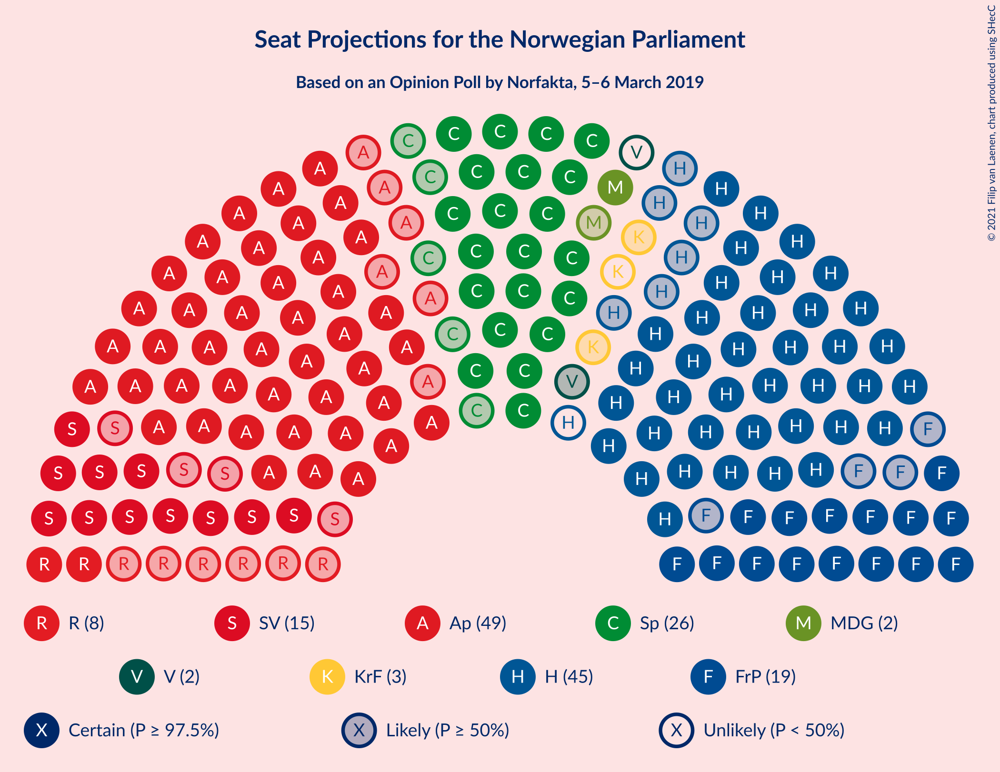
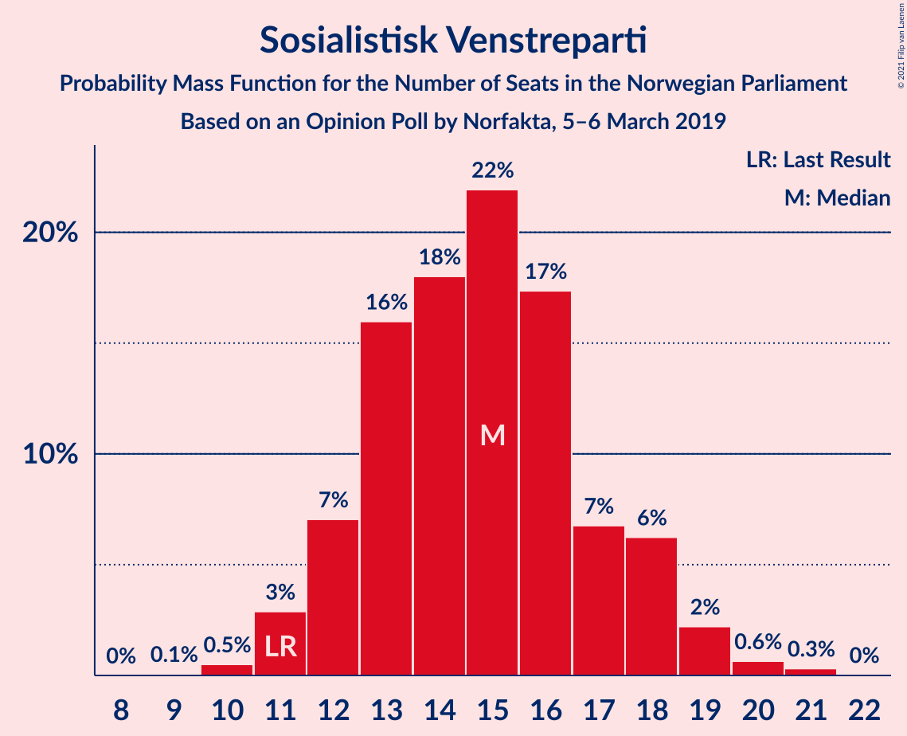
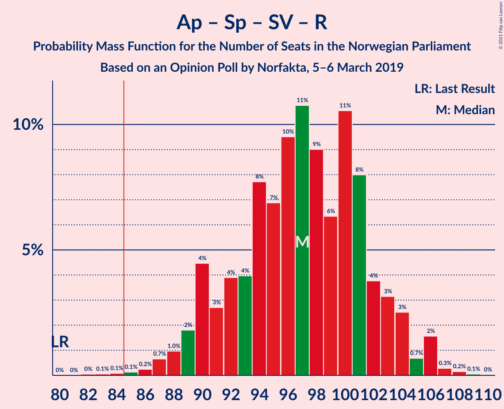
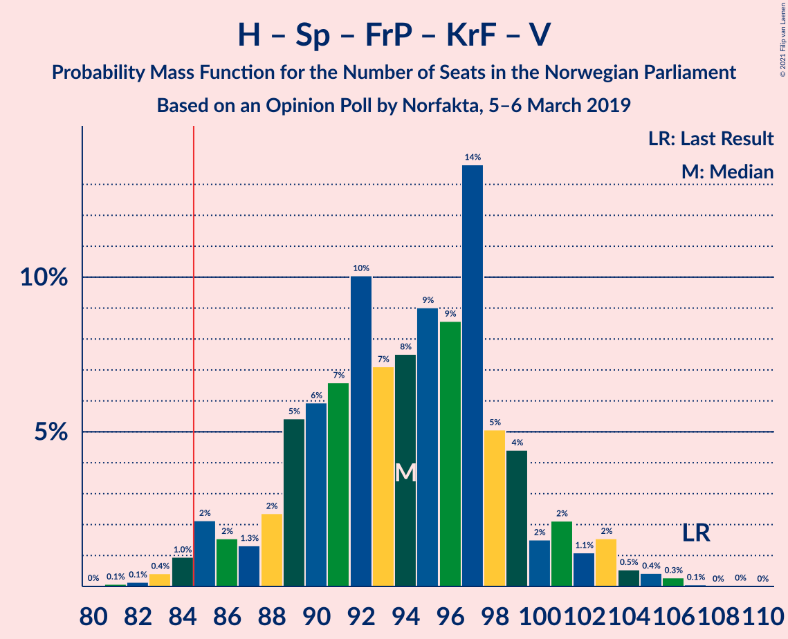
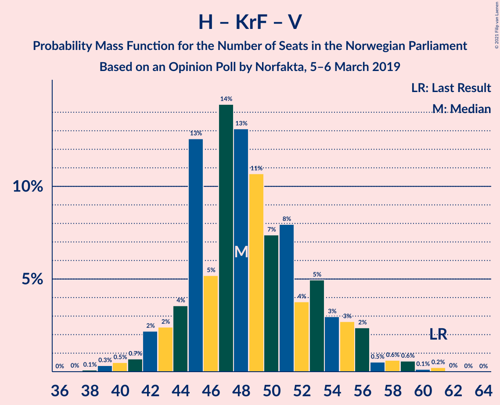

# Opinion Poll by Norfakta, 5–6 March 2019

<a href="#voting-intentions">Voting Intentions</a> | <a href="#seats">Seats</a> | <a href="#coalitions">Coalitions</a> | <a href="#technical-information">Technical Information</a>

## Voting Intentions

### Confidence Intervals

| Party | Last Result | Poll Result | 80% Confidence Interval | 90% Confidence Interval | 95% Confidence Interval | 99% Confidence Interval |
|:-----:|:-----------:|:-----------:|:-----------------------:|:-----------------------:|:-----------------------:|:-----------------------:|
| Arbeiderpartiet | 27.4% | 27.0% | 25.0–29.2% |24.4–29.8% |23.9–30.3% |23.0–31.4% |
| Høyre | 25.0% | 24.6% | 22.6–26.7% |22.1–27.3% |21.6–27.8% |20.7–28.8% |
| Senterpartiet | 10.3% | 14.0% | 12.5–15.8% |12.1–16.3% |11.7–16.7% |11.0–17.6% |
| Fremskrittspartiet | 15.2% | 10.7% | 9.3–12.3% |8.9–12.7% |8.6–13.1% |8.0–13.9% |
| Sosialistisk Venstreparti | 6.0% | 8.1% | 6.9–9.5% |6.6–9.9% |6.3–10.3% |5.8–11.0% |
| Rødt | 2.4% | 4.5% | 3.6–5.6% |3.4–5.9% |3.2–6.2% |2.8–6.8% |
| Miljøpartiet De Grønne | 3.2% | 3.6% | 2.9–4.7% |2.7–5.0% |2.5–5.3% |2.2–5.8% |
| Kristelig Folkeparti | 4.2% | 3.2% | 2.5–4.2% |2.3–4.5% |2.2–4.8% |1.9–5.3% |
| Venstre | 4.4% | 2.3% | 1.7–3.2% |1.6–3.4% |1.4–3.7% |1.2–4.1% |

*Note:* The poll result column reflects the actual value used in the calculations. Published results may vary slightly, and in addition be rounded to fewer digits.

## Seats

### Confidence Intervals

| Party | Last Result | Median | 80% Confidence Interval | 90% Confidence Interval | 95% Confidence Interval | 99% Confidence Interval |
|:-----:|:-----------:|:------:|:-----------------------:|:-----------------------:|:-----------------------:|:-----------------------:|
| <a href="#arbeiderpartiet">Arbeiderpartiet</a> | 49 | 49 | 45–54 |45–56 |44–57 |42–57 |
| <a href="#høyre">Høyre</a> | 45 | 43 | 41–48 |40–48 |38–50 |36–52 |
| <a href="#senterpartiet">Senterpartiet</a> | 19 | 28 | 23–29 |22–29 |21–31 |20–34 |
| <a href="#fremskrittspartiet">Fremskrittspartiet</a> | 27 | 19 | 17–23 |17–24 |15–24 |15–25 |
| <a href="#sosialistisk-venstreparti">Sosialistisk Venstreparti</a> | 11 | 14 | 13–17 |12–19 |12–19 |10–21 |
| <a href="#rødt">Rødt</a> | 1 | 7 | 2–10 |2–10 |2–11 |1–12 |
| <a href="#miljøpartiet-de-grønne">Miljøpartiet De Grønne</a> | 1 | 2 | 1–8 |1–9 |1–9 |1–11 |
| <a href="#kristelig-folkeparti">Kristelig Folkeparti</a> | 8 | 2 | 1–8 |1–9 |0–9 |0–10 |
| <a href="#venstre">Venstre</a> | 8 | 2 | 1–2 |0–2 |0–2 |0–7 |

### Arbeiderpartiet

*For a full overview of the results for this party, see the [Arbeiderpartiet](party-arbeiderpartiet.html) page.*

| Number of Seats | Probability | Accumulated | Special Marks |
|:---------------:|:-----------:|:-----------:|:-------------:|
| 40 | 0.1% | 100% |  |
| 41 | 0.2% | 99.9% |  |
| 42 | 1.1% | 99.7% |  |
| 43 | 0.9% | 98.5% |  |
| 44 | 2% | 98% |  |
| 45 | 9% | 96% |  |
| 46 | 2% | 87% |  |
| 47 | 9% | 85% |  |
| 48 | 12% | 76% |  |
| 49 | 34% | 64% | Last Result, Median |
| 50 | 4% | 30% |  |
| 51 | 2% | 26% |  |
| 52 | 5% | 24% |  |
| 53 | 4% | 19% |  |
| 54 | 8% | 15% |  |
| 55 | 2% | 7% |  |
| 56 | 1.1% | 5% |  |
| 57 | 4% | 4% |  |
| 58 | 0.4% | 0.4% |  |
| 59 | 0% | 0.1% |  |
| 60 | 0% | 0.1% |  |
| 61 | 0% | 0% |  |

### Høyre

*For a full overview of the results for this party, see the [Høyre](party-høyre.html) page.*

| Number of Seats | Probability | Accumulated | Special Marks |
|:---------------:|:-----------:|:-----------:|:-------------:|
| 35 | 0.1% | 100% |  |
| 36 | 0.9% | 99.9% |  |
| 37 | 0.2% | 99.0% |  |
| 38 | 2% | 98.9% |  |
| 39 | 1.3% | 96% |  |
| 40 | 3% | 95% |  |
| 41 | 4% | 92% |  |
| 42 | 30% | 88% |  |
| 43 | 20% | 57% | Median |
| 44 | 8% | 37% |  |
| 45 | 9% | 30% | Last Result |
| 46 | 8% | 21% |  |
| 47 | 3% | 13% |  |
| 48 | 6% | 11% |  |
| 49 | 0.6% | 5% |  |
| 50 | 2% | 4% |  |
| 51 | 0.8% | 2% |  |
| 52 | 0.9% | 1.4% |  |
| 53 | 0.2% | 0.4% |  |
| 54 | 0.2% | 0.2% |  |
| 55 | 0% | 0.1% |  |
| 56 | 0% | 0% |  |

### Senterpartiet

*For a full overview of the results for this party, see the [Senterpartiet](party-senterpartiet.html) page.*

| Number of Seats | Probability | Accumulated | Special Marks |
|:---------------:|:-----------:|:-----------:|:-------------:|
| 19 | 0.2% | 100% | Last Result |
| 20 | 1.0% | 99.8% |  |
| 21 | 1.3% | 98.8% |  |
| 22 | 3% | 97% |  |
| 23 | 7% | 94% |  |
| 24 | 4% | 87% |  |
| 25 | 12% | 83% |  |
| 26 | 14% | 71% |  |
| 27 | 6% | 56% |  |
| 28 | 40% | 50% | Median |
| 29 | 7% | 11% |  |
| 30 | 0.9% | 4% |  |
| 31 | 1.0% | 3% |  |
| 32 | 0.3% | 2% |  |
| 33 | 0.7% | 2% |  |
| 34 | 0.7% | 1.1% |  |
| 35 | 0.3% | 0.3% |  |
| 36 | 0% | 0% |  |

### Fremskrittspartiet

*For a full overview of the results for this party, see the [Fremskrittspartiet](party-fremskrittspartiet.html) page.*

| Number of Seats | Probability | Accumulated | Special Marks |
|:---------------:|:-----------:|:-----------:|:-------------:|
| 13 | 0.1% | 100% |  |
| 14 | 0.4% | 99.9% |  |
| 15 | 3% | 99.6% |  |
| 16 | 1.5% | 97% |  |
| 17 | 8% | 95% |  |
| 18 | 9% | 88% |  |
| 19 | 43% | 78% | Median |
| 20 | 11% | 35% |  |
| 21 | 6% | 24% |  |
| 22 | 5% | 18% |  |
| 23 | 7% | 13% |  |
| 24 | 5% | 6% |  |
| 25 | 1.1% | 1.5% |  |
| 26 | 0.3% | 0.4% |  |
| 27 | 0% | 0.1% | Last Result |
| 28 | 0% | 0% |  |

### Sosialistisk Venstreparti

*For a full overview of the results for this party, see the [Sosialistisk Venstreparti](party-sosialistiskvenstreparti.html) page.*

| Number of Seats | Probability | Accumulated | Special Marks |
|:---------------:|:-----------:|:-----------:|:-------------:|
| 9 | 0.1% | 100% |  |
| 10 | 0.5% | 99.9% |  |
| 11 | 2% | 99.4% | Last Result |
| 12 | 6% | 98% |  |
| 13 | 33% | 91% |  |
| 14 | 11% | 58% | Median |
| 15 | 16% | 47% |  |
| 16 | 18% | 31% |  |
| 17 | 6% | 13% |  |
| 18 | 2% | 7% |  |
| 19 | 4% | 6% |  |
| 20 | 0.3% | 2% |  |
| 21 | 1.4% | 1.4% |  |
| 22 | 0% | 0.1% |  |
| 23 | 0% | 0% |  |

### Rødt

*For a full overview of the results for this party, see the [Rødt](party-rødt.html) page.*

| Number of Seats | Probability | Accumulated | Special Marks |
|:---------------:|:-----------:|:-----------:|:-------------:|
| 1 | 0.6% | 100% | Last Result |
| 2 | 25% | 99.4% |  |
| 3 | 0% | 74% |  |
| 4 | 0% | 74% |  |
| 5 | 0% | 74% |  |
| 6 | 0% | 74% |  |
| 7 | 27% | 74% | Median |
| 8 | 16% | 47% |  |
| 9 | 14% | 31% |  |
| 10 | 13% | 16% |  |
| 11 | 2% | 3% |  |
| 12 | 0.4% | 0.6% |  |
| 13 | 0.2% | 0.3% |  |
| 14 | 0% | 0% |  |

### Miljøpartiet De Grønne

*For a full overview of the results for this party, see the [Miljøpartiet De Grønne](party-miljøpartietdegrønne.html) page.*

| Number of Seats | Probability | Accumulated | Special Marks |
|:---------------:|:-----------:|:-----------:|:-------------:|
| 1 | 13% | 100% | Last Result |
| 2 | 43% | 87% | Median |
| 3 | 0.7% | 43% |  |
| 4 | 4% | 43% |  |
| 5 | 0% | 39% |  |
| 6 | 0% | 39% |  |
| 7 | 2% | 39% |  |
| 8 | 31% | 37% |  |
| 9 | 5% | 6% |  |
| 10 | 0.8% | 1.4% |  |
| 11 | 0.6% | 0.6% |  |
| 12 | 0.1% | 0.1% |  |
| 13 | 0% | 0% |  |

### Kristelig Folkeparti

*For a full overview of the results for this party, see the [Kristelig Folkeparti](party-kristeligfolkeparti.html) page.*

| Number of Seats | Probability | Accumulated | Special Marks |
|:---------------:|:-----------:|:-----------:|:-------------:|
| 0 | 4% | 100% |  |
| 1 | 44% | 96% |  |
| 2 | 12% | 53% | Median |
| 3 | 20% | 40% |  |
| 4 | 0% | 20% |  |
| 5 | 0% | 20% |  |
| 6 | 0% | 20% |  |
| 7 | 2% | 20% |  |
| 8 | 12% | 18% | Last Result |
| 9 | 5% | 6% |  |
| 10 | 0.6% | 0.7% |  |
| 11 | 0.1% | 0.1% |  |
| 12 | 0% | 0% |  |

### Venstre

*For a full overview of the results for this party, see the [Venstre](party-venstre.html) page.*

| Number of Seats | Probability | Accumulated | Special Marks |
|:---------------:|:-----------:|:-----------:|:-------------:|
| 0 | 9% | 100% |  |
| 1 | 36% | 91% |  |
| 2 | 54% | 55% | Median |
| 3 | 0.7% | 1.3% |  |
| 4 | 0% | 0.6% |  |
| 5 | 0% | 0.6% |  |
| 6 | 0% | 0.6% |  |
| 7 | 0.4% | 0.6% |  |
| 8 | 0.2% | 0.2% | Last Result |
| 9 | 0% | 0% |  |

## Coalitions

### Confidence Intervals

| Coalition | Last Result | Median | Majority? | 80% Confidence Interval | 90% Confidence Interval | 95% Confidence Interval | 99% Confidence Interval |
|:---------:|:-----------:|:------:|:---------:|:-----------------------:|:-----------------------:|:-----------------------:|:-----------------------:|
| Arbeiderpartiet – Senterpartiet – Sosialistisk Venstreparti – Rødt – Miljøpartiet De Grønne | 81 | 102 | 100% | 95–105 | 93–107 | 91–109 | 91–112 |
| Arbeiderpartiet – Senterpartiet – Sosialistisk Venstreparti – Rødt | 80 | 97 | 99.9% | 91–102 | 89–104 | 89–106 | 86–107 |
| Arbeiderpartiet – Senterpartiet – Sosialistisk Venstreparti – Miljøpartiet De Grønne – Kristelig Folkeparti | 88 | 99 | 100% | 92–103 | 91–104 | 89–105 | 86–108 |
| Arbeiderpartiet – Senterpartiet – Sosialistisk Venstreparti – Miljøpartiet De Grønne | 80 | 95 | 99.0% | 89–99 | 89–100 | 87–103 | 83–105 |
| Høyre – Senterpartiet – Fremskrittspartiet – Kristelig Folkeparti – Venstre | 107 | 93 | 99.4% | 90–100 | 88–102 | 87–103 | 83–104 |
| Arbeiderpartiet – Senterpartiet – Sosialistisk Venstreparti | 79 | 90 | 95% | 87–95 | 85–97 | 83–97 | 80–101 |
| Arbeiderpartiet – Senterpartiet – Miljøpartiet De Grønne – Kristelig Folkeparti | 77 | 84 | 48% | 78–88 | 75–89 | 75–90 | 71–94 |
| Arbeiderpartiet – Senterpartiet – Kristelig Folkeparti | 76 | 78 | 13% | 75–86 | 73–87 | 71–87 | 69–90 |
| Arbeiderpartiet – Senterpartiet | 68 | 77 | 0.4% | 72–80 | 70–81 | 68–83 | 65–84 |
| Høyre – Fremskrittspartiet – Miljøpartiet De Grønne – Kristelig Folkeparti – Venstre | 89 | 72 | 0.1% | 67–78 | 65–80 | 63–80 | 62–83 |
| Høyre – Fremskrittspartiet – Kristelig Folkeparti – Venstre | 88 | 67 | 0% | 64–74 | 62–76 | 60–78 | 57–78 |
| Arbeiderpartiet – Sosialistisk Venstreparti | 60 | 63 | 0% | 60–69 | 59–71 | 57–72 | 56–75 |
| Høyre – Fremskrittspartiet – Venstre | 80 | 63 | 0% | 61–69 | 58–70 | 57–72 | 56–74 |
| Høyre – Fremskrittspartiet | 72 | 62 | 0% | 60–68 | 58–69 | 56–71 | 54–72 |
| Høyre – Kristelig Folkeparti – Venstre | 61 | 47 | 0% | 45–54 | 43–55 | 42–58 | 40–59 |
| Senterpartiet – Kristelig Folkeparti – Venstre | 35 | 31 | 0% | 26–36 | 25–36 | 24–38 | 23–41 |

### Arbeiderpartiet – Senterpartiet – Sosialistisk Venstreparti – Rødt – Miljøpartiet De Grønne

| Number of Seats | Probability | Accumulated | Special Marks |
|:---------------:|:-----------:|:-----------:|:-------------:|
| 81 | 0% | 100% | Last Result |
| 82 | 0% | 100% |  |
| 83 | 0% | 100% |  |
| 84 | 0% | 100% |  |
| 85 | 0% | 100% | Majority |
| 86 | 0% | 100% |  |
| 87 | 0% | 100% |  |
| 88 | 0.2% | 100% |  |
| 89 | 0% | 99.8% |  |
| 90 | 0.1% | 99.8% |  |
| 91 | 4% | 99.7% |  |
| 92 | 0.5% | 96% |  |
| 93 | 3% | 95% |  |
| 94 | 0.9% | 92% |  |
| 95 | 2% | 91% |  |
| 96 | 1.4% | 89% |  |
| 97 | 9% | 88% |  |
| 98 | 8% | 79% |  |
| 99 | 3% | 71% |  |
| 100 | 6% | 68% | Median |
| 101 | 2% | 61% |  |
| 102 | 10% | 60% |  |
| 103 | 3% | 50% |  |
| 104 | 10% | 46% |  |
| 105 | 28% | 37% |  |
| 106 | 2% | 9% |  |
| 107 | 2% | 7% |  |
| 108 | 2% | 5% |  |
| 109 | 2% | 3% |  |
| 110 | 0.1% | 1.1% |  |
| 111 | 0.3% | 1.0% |  |
| 112 | 0.6% | 0.7% |  |
| 113 | 0% | 0% |  |

### Arbeiderpartiet – Senterpartiet – Sosialistisk Venstreparti – Rødt

| Number of Seats | Probability | Accumulated | Special Marks |
|:---------------:|:-----------:|:-----------:|:-------------:|
| 80 | 0% | 100% | Last Result |
| 81 | 0% | 100% |  |
| 82 | 0% | 100% |  |
| 83 | 0% | 100% |  |
| 84 | 0% | 99.9% |  |
| 85 | 0.2% | 99.9% | Majority |
| 86 | 0.5% | 99.7% |  |
| 87 | 0.3% | 99.2% |  |
| 88 | 0.2% | 98.9% |  |
| 89 | 5% | 98.7% |  |
| 90 | 1.0% | 94% |  |
| 91 | 4% | 93% |  |
| 92 | 1.3% | 89% |  |
| 93 | 4% | 88% |  |
| 94 | 3% | 84% |  |
| 95 | 5% | 81% |  |
| 96 | 16% | 75% |  |
| 97 | 27% | 59% |  |
| 98 | 4% | 33% | Median |
| 99 | 1.4% | 29% |  |
| 100 | 5% | 28% |  |
| 101 | 4% | 23% |  |
| 102 | 11% | 19% |  |
| 103 | 2% | 8% |  |
| 104 | 2% | 6% |  |
| 105 | 0.2% | 4% |  |
| 106 | 3% | 4% |  |
| 107 | 1.4% | 1.5% |  |
| 108 | 0% | 0.1% |  |
| 109 | 0% | 0% |  |

### Arbeiderpartiet – Senterpartiet – Sosialistisk Venstreparti – Miljøpartiet De Grønne – Kristelig Folkeparti

| Number of Seats | Probability | Accumulated | Special Marks |
|:---------------:|:-----------:|:-----------:|:-------------:|
| 85 | 0.1% | 100% | Majority |
| 86 | 0.7% | 99.9% |  |
| 87 | 0.4% | 99.2% |  |
| 88 | 0.5% | 98.8% | Last Result |
| 89 | 1.1% | 98% |  |
| 90 | 1.2% | 97% |  |
| 91 | 1.4% | 96% |  |
| 92 | 6% | 95% |  |
| 93 | 5% | 89% |  |
| 94 | 5% | 84% |  |
| 95 | 4% | 79% | Median |
| 96 | 10% | 75% |  |
| 97 | 7% | 65% |  |
| 98 | 4% | 58% |  |
| 99 | 33% | 54% |  |
| 100 | 2% | 21% |  |
| 101 | 0.5% | 19% |  |
| 102 | 4% | 19% |  |
| 103 | 5% | 14% |  |
| 104 | 6% | 9% |  |
| 105 | 1.4% | 3% |  |
| 106 | 0.2% | 1.4% |  |
| 107 | 0.7% | 1.2% |  |
| 108 | 0.1% | 0.5% |  |
| 109 | 0.3% | 0.4% |  |
| 110 | 0% | 0% |  |

### Arbeiderpartiet – Senterpartiet – Sosialistisk Venstreparti – Miljøpartiet De Grønne

| Number of Seats | Probability | Accumulated | Special Marks |
|:---------------:|:-----------:|:-----------:|:-------------:|
| 80 | 0% | 100% | Last Result |
| 81 | 0% | 100% |  |
| 82 | 0% | 100% |  |
| 83 | 0.5% | 99.9% |  |
| 84 | 0.4% | 99.5% |  |
| 85 | 1.1% | 99.0% | Majority |
| 86 | 0.4% | 98% |  |
| 87 | 0.4% | 98% |  |
| 88 | 1.2% | 97% |  |
| 89 | 12% | 96% |  |
| 90 | 1.1% | 84% |  |
| 91 | 5% | 83% |  |
| 92 | 6% | 78% |  |
| 93 | 4% | 72% | Median |
| 94 | 16% | 68% |  |
| 95 | 9% | 53% |  |
| 96 | 3% | 44% |  |
| 97 | 3% | 41% |  |
| 98 | 28% | 39% |  |
| 99 | 3% | 11% |  |
| 100 | 3% | 8% |  |
| 101 | 1.4% | 5% |  |
| 102 | 0.3% | 3% |  |
| 103 | 1.1% | 3% |  |
| 104 | 1.2% | 2% |  |
| 105 | 0.6% | 0.7% |  |
| 106 | 0.1% | 0.1% |  |
| 107 | 0% | 0.1% |  |
| 108 | 0% | 0% |  |

### Høyre – Senterpartiet – Fremskrittspartiet – Kristelig Folkeparti – Venstre

| Number of Seats | Probability | Accumulated | Special Marks |
|:---------------:|:-----------:|:-----------:|:-------------:|
| 81 | 0% | 100% |  |
| 82 | 0.1% | 99.9% |  |
| 83 | 0.4% | 99.9% |  |
| 84 | 0.1% | 99.5% |  |
| 85 | 0.6% | 99.4% | Majority |
| 86 | 1.0% | 98.8% |  |
| 87 | 2% | 98% |  |
| 88 | 3% | 96% |  |
| 89 | 3% | 94% |  |
| 90 | 6% | 91% |  |
| 91 | 3% | 85% |  |
| 92 | 27% | 82% |  |
| 93 | 11% | 55% |  |
| 94 | 4% | 44% | Median |
| 95 | 6% | 40% |  |
| 96 | 3% | 34% |  |
| 97 | 12% | 31% |  |
| 98 | 5% | 19% |  |
| 99 | 3% | 14% |  |
| 100 | 2% | 10% |  |
| 101 | 0.3% | 9% |  |
| 102 | 4% | 8% |  |
| 103 | 4% | 5% |  |
| 104 | 0.5% | 0.9% |  |
| 105 | 0.3% | 0.4% |  |
| 106 | 0% | 0.1% |  |
| 107 | 0% | 0% | Last Result |

### Arbeiderpartiet – Senterpartiet – Sosialistisk Venstreparti

| Number of Seats | Probability | Accumulated | Special Marks |
|:---------------:|:-----------:|:-----------:|:-------------:|
| 76 | 0% | 100% |  |
| 77 | 0% | 99.9% |  |
| 78 | 0.2% | 99.9% |  |
| 79 | 0.2% | 99.8% | Last Result |
| 80 | 0.1% | 99.6% |  |
| 81 | 0.6% | 99.5% |  |
| 82 | 1.0% | 98.9% |  |
| 83 | 1.5% | 98% |  |
| 84 | 1.4% | 96% |  |
| 85 | 2% | 95% | Majority |
| 86 | 2% | 93% |  |
| 87 | 11% | 91% |  |
| 88 | 6% | 80% |  |
| 89 | 4% | 74% |  |
| 90 | 28% | 70% |  |
| 91 | 5% | 43% | Median |
| 92 | 14% | 38% |  |
| 93 | 7% | 24% |  |
| 94 | 6% | 17% |  |
| 95 | 2% | 10% |  |
| 96 | 1.2% | 8% |  |
| 97 | 5% | 7% |  |
| 98 | 0.3% | 2% |  |
| 99 | 0.2% | 2% |  |
| 100 | 0.1% | 1.4% |  |
| 101 | 0.9% | 1.3% |  |
| 102 | 0.3% | 0.4% |  |
| 103 | 0% | 0.1% |  |
| 104 | 0.1% | 0.1% |  |
| 105 | 0% | 0% |  |

### Arbeiderpartiet – Senterpartiet – Miljøpartiet De Grønne – Kristelig Folkeparti

| Number of Seats | Probability | Accumulated | Special Marks |
|:---------------:|:-----------:|:-----------:|:-------------:|
| 70 | 0.1% | 100% |  |
| 71 | 0.4% | 99.9% |  |
| 72 | 0.1% | 99.5% |  |
| 73 | 2% | 99.4% |  |
| 74 | 0.2% | 98% |  |
| 75 | 3% | 98% |  |
| 76 | 1.2% | 95% |  |
| 77 | 1.2% | 93% | Last Result |
| 78 | 5% | 92% |  |
| 79 | 6% | 87% |  |
| 80 | 14% | 81% |  |
| 81 | 0.7% | 67% | Median |
| 82 | 10% | 66% |  |
| 83 | 5% | 55% |  |
| 84 | 2% | 50% |  |
| 85 | 2% | 48% | Majority |
| 86 | 28% | 45% |  |
| 87 | 4% | 17% |  |
| 88 | 5% | 13% |  |
| 89 | 5% | 9% |  |
| 90 | 0.9% | 3% |  |
| 91 | 0.6% | 2% |  |
| 92 | 1.0% | 2% |  |
| 93 | 0.3% | 0.8% |  |
| 94 | 0.1% | 0.5% |  |
| 95 | 0.4% | 0.5% |  |
| 96 | 0% | 0% |  |

### Arbeiderpartiet – Senterpartiet – Kristelig Folkeparti

| Number of Seats | Probability | Accumulated | Special Marks |
|:---------------:|:-----------:|:-----------:|:-------------:|
| 66 | 0% | 100% |  |
| 67 | 0% | 99.9% |  |
| 68 | 0.3% | 99.9% |  |
| 69 | 0.3% | 99.6% |  |
| 70 | 0.5% | 99.4% |  |
| 71 | 2% | 98.9% |  |
| 72 | 1.3% | 97% |  |
| 73 | 3% | 96% |  |
| 74 | 2% | 93% |  |
| 75 | 6% | 91% |  |
| 76 | 6% | 85% | Last Result |
| 77 | 3% | 79% |  |
| 78 | 40% | 76% |  |
| 79 | 2% | 36% | Median |
| 80 | 8% | 34% |  |
| 81 | 8% | 25% |  |
| 82 | 1.2% | 17% |  |
| 83 | 2% | 16% |  |
| 84 | 1.0% | 14% |  |
| 85 | 2% | 13% | Majority |
| 86 | 2% | 10% |  |
| 87 | 7% | 8% |  |
| 88 | 0.3% | 1.1% |  |
| 89 | 0.2% | 0.8% |  |
| 90 | 0.5% | 0.5% |  |
| 91 | 0% | 0.1% |  |
| 92 | 0.1% | 0.1% |  |
| 93 | 0% | 0% |  |

### Arbeiderpartiet – Senterpartiet

| Number of Seats | Probability | Accumulated | Special Marks |
|:---------------:|:-----------:|:-----------:|:-------------:|
| 64 | 0.3% | 100% |  |
| 65 | 0.2% | 99.6% |  |
| 66 | 0.2% | 99.5% |  |
| 67 | 0.8% | 99.3% |  |
| 68 | 1.1% | 98% | Last Result |
| 69 | 1.3% | 97% |  |
| 70 | 2% | 96% |  |
| 71 | 1.4% | 94% |  |
| 72 | 7% | 93% |  |
| 73 | 8% | 85% |  |
| 74 | 7% | 78% |  |
| 75 | 7% | 70% |  |
| 76 | 12% | 63% |  |
| 77 | 28% | 51% | Median |
| 78 | 6% | 24% |  |
| 79 | 5% | 18% |  |
| 80 | 7% | 13% |  |
| 81 | 2% | 6% |  |
| 82 | 1.5% | 5% |  |
| 83 | 2% | 3% |  |
| 84 | 0.7% | 1.1% |  |
| 85 | 0.3% | 0.4% | Majority |
| 86 | 0.1% | 0.1% |  |
| 87 | 0% | 0.1% |  |
| 88 | 0% | 0% |  |

### Høyre – Fremskrittspartiet – Miljøpartiet De Grønne – Kristelig Folkeparti – Venstre

| Number of Seats | Probability | Accumulated | Special Marks |
|:---------------:|:-----------:|:-----------:|:-------------:|
| 61 | 0% | 100% |  |
| 62 | 1.4% | 99.9% |  |
| 63 | 3% | 98.5% |  |
| 64 | 0.2% | 96% |  |
| 65 | 2% | 96% |  |
| 66 | 2% | 94% |  |
| 67 | 11% | 92% |  |
| 68 | 4% | 81% | Median |
| 69 | 5% | 77% |  |
| 70 | 1.4% | 72% |  |
| 71 | 4% | 71% |  |
| 72 | 27% | 67% |  |
| 73 | 16% | 40% |  |
| 74 | 5% | 25% |  |
| 75 | 3% | 19% |  |
| 76 | 4% | 16% |  |
| 77 | 1.3% | 12% |  |
| 78 | 4% | 11% |  |
| 79 | 1.0% | 7% |  |
| 80 | 5% | 6% |  |
| 81 | 0.2% | 1.3% |  |
| 82 | 0.3% | 1.1% |  |
| 83 | 0.5% | 0.8% |  |
| 84 | 0.2% | 0.3% |  |
| 85 | 0% | 0.1% | Majority |
| 86 | 0% | 0.1% |  |
| 87 | 0% | 0% |  |
| 88 | 0% | 0% |  |
| 89 | 0% | 0% | Last Result |

### Høyre – Fremskrittspartiet – Kristelig Folkeparti – Venstre

| Number of Seats | Probability | Accumulated | Special Marks |
|:---------------:|:-----------:|:-----------:|:-------------:|
| 56 | 0% | 100% |  |
| 57 | 0.6% | 99.9% |  |
| 58 | 0.3% | 99.3% |  |
| 59 | 0.1% | 99.0% |  |
| 60 | 2% | 98.9% |  |
| 61 | 2% | 97% |  |
| 62 | 2% | 95% |  |
| 63 | 2% | 93% |  |
| 64 | 28% | 91% |  |
| 65 | 10% | 63% |  |
| 66 | 3% | 53% | Median |
| 67 | 10% | 50% |  |
| 68 | 2% | 40% |  |
| 69 | 6% | 39% |  |
| 70 | 3% | 32% |  |
| 71 | 8% | 29% |  |
| 72 | 9% | 21% |  |
| 73 | 1.4% | 12% |  |
| 74 | 2% | 11% |  |
| 75 | 0.9% | 9% |  |
| 76 | 3% | 8% |  |
| 77 | 0.5% | 5% |  |
| 78 | 4% | 4% |  |
| 79 | 0.1% | 0.3% |  |
| 80 | 0% | 0.2% |  |
| 81 | 0.2% | 0.2% |  |
| 82 | 0% | 0% |  |
| 83 | 0% | 0% |  |
| 84 | 0% | 0% |  |
| 85 | 0% | 0% | Majority |
| 86 | 0% | 0% |  |
| 87 | 0% | 0% |  |
| 88 | 0% | 0% | Last Result |

### Arbeiderpartiet – Sosialistisk Venstreparti

| Number of Seats | Probability | Accumulated | Special Marks |
|:---------------:|:-----------:|:-----------:|:-------------:|
| 53 | 0.2% | 100% |  |
| 54 | 0.2% | 99.8% |  |
| 55 | 0% | 99.6% |  |
| 56 | 0.9% | 99.6% |  |
| 57 | 1.2% | 98.7% |  |
| 58 | 1.2% | 97% |  |
| 59 | 6% | 96% |  |
| 60 | 1.4% | 91% | Last Result |
| 61 | 7% | 89% |  |
| 62 | 32% | 82% |  |
| 63 | 6% | 50% | Median |
| 64 | 14% | 44% |  |
| 65 | 3% | 30% |  |
| 66 | 3% | 28% |  |
| 67 | 4% | 25% |  |
| 68 | 8% | 21% |  |
| 69 | 4% | 13% |  |
| 70 | 3% | 9% |  |
| 71 | 3% | 6% |  |
| 72 | 1.4% | 3% |  |
| 73 | 0.2% | 1.3% |  |
| 74 | 0.1% | 1.1% |  |
| 75 | 0.9% | 1.0% |  |
| 76 | 0% | 0.1% |  |
| 77 | 0% | 0.1% |  |
| 78 | 0% | 0.1% |  |
| 79 | 0% | 0% |  |

### Høyre – Fremskrittspartiet – Venstre

| Number of Seats | Probability | Accumulated | Special Marks |
|:---------------:|:-----------:|:-----------:|:-------------:|
| 54 | 0.3% | 100% |  |
| 55 | 0.1% | 99.7% |  |
| 56 | 0.8% | 99.6% |  |
| 57 | 2% | 98.9% |  |
| 58 | 2% | 97% |  |
| 59 | 1.1% | 94% |  |
| 60 | 1.3% | 93% |  |
| 61 | 2% | 92% |  |
| 62 | 3% | 90% |  |
| 63 | 41% | 87% |  |
| 64 | 8% | 46% | Median |
| 65 | 2% | 37% |  |
| 66 | 5% | 35% |  |
| 67 | 5% | 30% |  |
| 68 | 15% | 25% |  |
| 69 | 1.3% | 11% |  |
| 70 | 5% | 10% |  |
| 71 | 1.4% | 5% |  |
| 72 | 2% | 3% |  |
| 73 | 0.9% | 1.5% |  |
| 74 | 0.2% | 0.5% |  |
| 75 | 0.1% | 0.3% |  |
| 76 | 0% | 0.3% |  |
| 77 | 0.2% | 0.2% |  |
| 78 | 0% | 0.1% |  |
| 79 | 0% | 0% |  |
| 80 | 0% | 0% | Last Result |

### Høyre – Fremskrittspartiet

| Number of Seats | Probability | Accumulated | Special Marks |
|:---------------:|:-----------:|:-----------:|:-------------:|
| 52 | 0.1% | 100% |  |
| 53 | 0.2% | 99.9% |  |
| 54 | 0.2% | 99.7% |  |
| 55 | 2% | 99.5% |  |
| 56 | 1.4% | 98% |  |
| 57 | 1.0% | 97% |  |
| 58 | 3% | 96% |  |
| 59 | 2% | 92% |  |
| 60 | 2% | 91% |  |
| 61 | 29% | 89% |  |
| 62 | 17% | 60% | Median |
| 63 | 6% | 43% |  |
| 64 | 5% | 37% |  |
| 65 | 3% | 32% |  |
| 66 | 13% | 29% |  |
| 67 | 6% | 16% |  |
| 68 | 1.1% | 10% |  |
| 69 | 5% | 9% |  |
| 70 | 1.1% | 4% |  |
| 71 | 2% | 3% |  |
| 72 | 0.9% | 1.3% | Last Result |
| 73 | 0.1% | 0.4% |  |
| 74 | 0.1% | 0.3% |  |
| 75 | 0.2% | 0.2% |  |
| 76 | 0% | 0% |  |

### Høyre – Kristelig Folkeparti – Venstre

| Number of Seats | Probability | Accumulated | Special Marks |
|:---------------:|:-----------:|:-----------:|:-------------:|
| 37 | 0.1% | 100% |  |
| 38 | 0.1% | 99.9% |  |
| 39 | 0.1% | 99.8% |  |
| 40 | 0.9% | 99.7% |  |
| 41 | 0.9% | 98.8% |  |
| 42 | 2% | 98% |  |
| 43 | 2% | 96% |  |
| 44 | 1.3% | 94% |  |
| 45 | 30% | 93% |  |
| 46 | 12% | 62% |  |
| 47 | 9% | 51% | Median |
| 48 | 9% | 42% |  |
| 49 | 7% | 33% |  |
| 50 | 2% | 26% |  |
| 51 | 3% | 24% |  |
| 52 | 3% | 22% |  |
| 53 | 5% | 18% |  |
| 54 | 4% | 14% |  |
| 55 | 5% | 10% |  |
| 56 | 0.8% | 5% |  |
| 57 | 0.3% | 4% |  |
| 58 | 3% | 4% |  |
| 59 | 0.4% | 0.6% |  |
| 60 | 0.2% | 0.2% |  |
| 61 | 0% | 0% | Last Result |

### Senterpartiet – Kristelig Folkeparti – Venstre

| Number of Seats | Probability | Accumulated | Special Marks |
|:---------------:|:-----------:|:-----------:|:-------------:|
| 22 | 0% | 100% |  |
| 23 | 2% | 99.9% |  |
| 24 | 2% | 98% |  |
| 25 | 3% | 96% |  |
| 26 | 3% | 93% |  |
| 27 | 4% | 90% |  |
| 28 | 6% | 86% |  |
| 29 | 2% | 80% |  |
| 30 | 7% | 78% |  |
| 31 | 36% | 70% |  |
| 32 | 12% | 34% | Median |
| 33 | 1.2% | 22% |  |
| 34 | 4% | 20% |  |
| 35 | 6% | 16% | Last Result |
| 36 | 6% | 10% |  |
| 37 | 2% | 4% |  |
| 38 | 1.1% | 3% |  |
| 39 | 0.6% | 2% |  |
| 40 | 0.3% | 1.0% |  |
| 41 | 0.4% | 0.7% |  |
| 42 | 0.2% | 0.3% |  |
| 43 | 0% | 0% |  |

## Technical Information

### Opinion Poll

+ **Polling firm:** Norfakta
+ **Commissioner(s):** —
+ **Fieldwork period:** 5–6 March 2019

### Calculations

+ **Sample size:** 741
+ **Simulations done:** 131,072
+ **Error estimate:** 3.08%

