# Opinion Poll by Opinion Perduco, 5–11 March 2019

<a href="#voting-intentions">Voting Intentions</a> | <a href="#seats">Seats</a> | <a href="#coalitions">Coalitions</a> | <a href="#technical-information">Technical Information</a>

## Voting Intentions

### Confidence Intervals

| Party | Last Result | Poll Result | 80% Confidence Interval | 90% Confidence Interval | 95% Confidence Interval | 99% Confidence Interval |
|:-----:|:-----------:|:-----------:|:-----------------------:|:-----------------------:|:-----------------------:|:-----------------------:|
| Høyre | 25.0% | 26.1% | 24.4–28.0% |23.9–28.5% |23.4–29.0% |22.6–29.9% |
| Arbeiderpartiet | 27.4% | 25.1% | 23.3–26.9% |22.8–27.5% |22.4–27.9% |21.6–28.8% |
| Senterpartiet | 10.3% | 12.6% | 11.4–14.1% |11.0–14.5% |10.7–14.9% |10.1–15.6% |
| Fremskrittspartiet | 15.2% | 10.6% | 9.4–11.9% |9.0–12.3% |8.8–12.7% |8.2–13.4% |
| Sosialistisk Venstreparti | 6.0% | 7.1% | 6.1–8.3% |5.9–8.6% |5.6–8.9% |5.2–9.5% |
| Miljøpartiet De Grønne | 3.2% | 6.0% | 5.1–7.1% |4.8–7.4% |4.6–7.7% |4.2–8.2% |
| Rødt | 2.4% | 4.9% | 4.1–5.9% |3.9–6.2% |3.7–6.5% |3.4–7.0% |
| Kristelig Folkeparti | 4.2% | 4.8% | 4.0–5.8% |3.8–6.1% |3.6–6.4% |3.3–6.9% |
| Venstre | 4.4% | 2.0% | 1.5–2.7% |1.4–2.9% |1.3–3.1% |1.1–3.5% |

*Note:* The poll result column reflects the actual value used in the calculations. Published results may vary slightly, and in addition be rounded to fewer digits.

## Seats

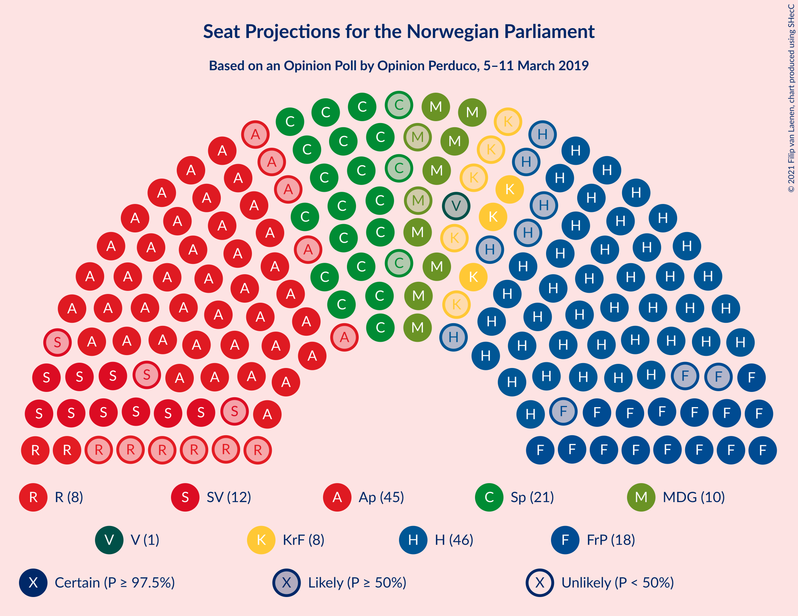

### Confidence Intervals

| Party | Last Result | Median | 80% Confidence Interval | 90% Confidence Interval | 95% Confidence Interval | 99% Confidence Interval |
|:-----:|:-----------:|:------:|:-----------------------:|:-----------------------:|:-----------------------:|:-----------------------:|
| <a href="#høyre">Høyre</a> | 45 | 46 | 43–49 |42–50 |40–51 |39–53 |
| <a href="#arbeiderpartiet">Arbeiderpartiet</a> | 49 | 45 | 42–48 |41–49 |40–51 |40–53 |
| <a href="#senterpartiet">Senterpartiet</a> | 19 | 21 | 19–24 |18–25 |18–26 |18–29 |
| <a href="#fremskrittspartiet">Fremskrittspartiet</a> | 27 | 18 | 16–20 |16–20 |15–22 |13–23 |
| <a href="#sosialistisk-venstreparti">Sosialistisk Venstreparti</a> | 11 | 12 | 11–14 |10–14 |9–15 |9–16 |
| <a href="#miljøpartiet-de-grønne">Miljøpartiet De Grønne</a> | 1 | 10 | 8–12 |8–12 |8–13 |7–13 |
| <a href="#rødt">Rødt</a> | 1 | 8 | 7–9 |2–10 |2–11 |2–11 |
| <a href="#kristelig-folkeparti">Kristelig Folkeparti</a> | 8 | 8 | 7–10 |3–10 |3–11 |3–11 |
| <a href="#venstre">Venstre</a> | 8 | 1 | 0–2 |0–2 |0–2 |0–2 |

### Høyre

*For a full overview of the results for this party, see the [Høyre](party-høyre.html) page.*

| Number of Seats | Probability | Accumulated | Special Marks |
|:---------------:|:-----------:|:-----------:|:-------------:|
| 37 | 0.1% | 100% |  |
| 38 | 0.2% | 99.9% |  |
| 39 | 2% | 99.7% |  |
| 40 | 0.8% | 98% |  |
| 41 | 2% | 97% |  |
| 42 | 4% | 96% |  |
| 43 | 3% | 91% |  |
| 44 | 13% | 88% |  |
| 45 | 13% | 75% | Last Result |
| 46 | 19% | 63% | Median |
| 47 | 17% | 44% |  |
| 48 | 7% | 27% |  |
| 49 | 13% | 20% |  |
| 50 | 4% | 7% |  |
| 51 | 1.2% | 3% |  |
| 52 | 0.6% | 1.5% |  |
| 53 | 0.5% | 0.8% |  |
| 54 | 0.2% | 0.3% |  |
| 55 | 0.1% | 0.1% |  |
| 56 | 0% | 0% |  |

### Arbeiderpartiet

*For a full overview of the results for this party, see the [Arbeiderpartiet](party-arbeiderpartiet.html) page.*

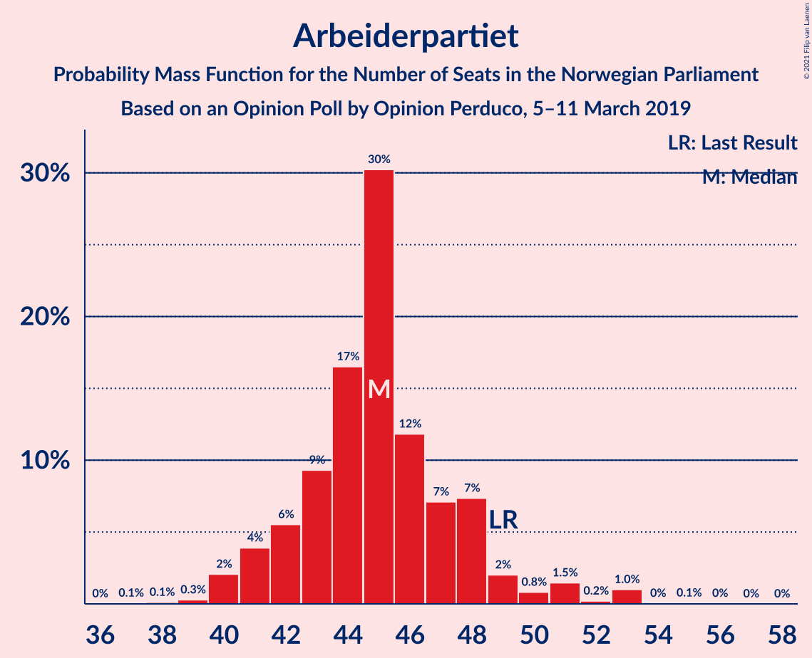

| Number of Seats | Probability | Accumulated | Special Marks |
|:---------------:|:-----------:|:-----------:|:-------------:|
| 37 | 0.1% | 100% |  |
| 38 | 0.1% | 99.9% |  |
| 39 | 0.3% | 99.8% |  |
| 40 | 2% | 99.5% |  |
| 41 | 4% | 97% |  |
| 42 | 6% | 94% |  |
| 43 | 9% | 88% |  |
| 44 | 17% | 79% |  |
| 45 | 30% | 62% | Median |
| 46 | 12% | 32% |  |
| 47 | 7% | 20% |  |
| 48 | 7% | 13% |  |
| 49 | 2% | 6% | Last Result |
| 50 | 0.8% | 4% |  |
| 51 | 1.5% | 3% |  |
| 52 | 0.2% | 1.4% |  |
| 53 | 1.0% | 1.2% |  |
| 54 | 0% | 0.2% |  |
| 55 | 0.1% | 0.1% |  |
| 56 | 0% | 0.1% |  |
| 57 | 0% | 0% |  |

### Senterpartiet

*For a full overview of the results for this party, see the [Senterpartiet](party-senterpartiet.html) page.*

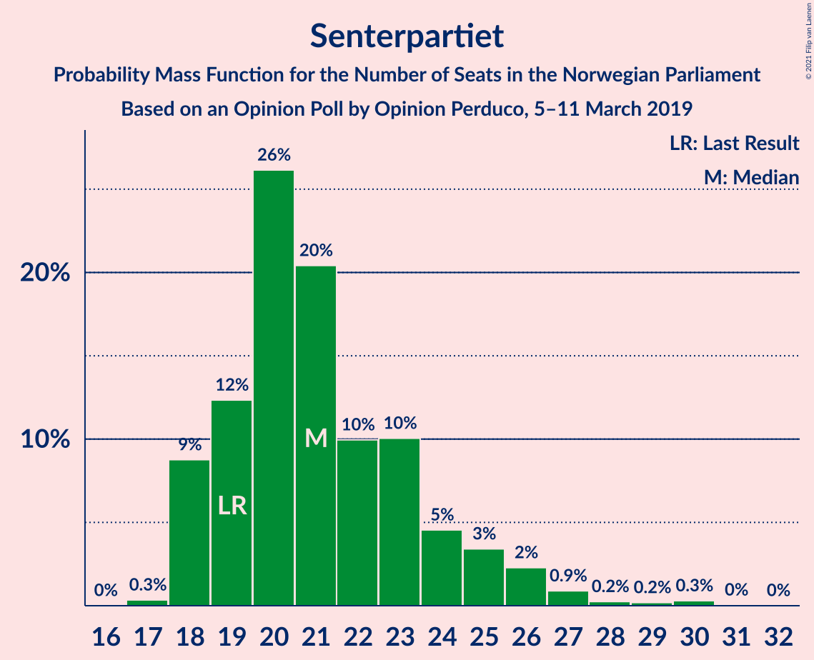

| Number of Seats | Probability | Accumulated | Special Marks |
|:---------------:|:-----------:|:-----------:|:-------------:|
| 17 | 0.3% | 100% |  |
| 18 | 9% | 99.6% |  |
| 19 | 12% | 91% | Last Result |
| 20 | 26% | 79% |  |
| 21 | 20% | 52% | Median |
| 22 | 10% | 32% |  |
| 23 | 10% | 22% |  |
| 24 | 5% | 12% |  |
| 25 | 3% | 7% |  |
| 26 | 2% | 4% |  |
| 27 | 0.9% | 2% |  |
| 28 | 0.2% | 0.8% |  |
| 29 | 0.2% | 0.6% |  |
| 30 | 0.3% | 0.4% |  |
| 31 | 0% | 0.1% |  |
| 32 | 0% | 0% |  |

### Fremskrittspartiet

*For a full overview of the results for this party, see the [Fremskrittspartiet](party-fremskrittspartiet.html) page.*

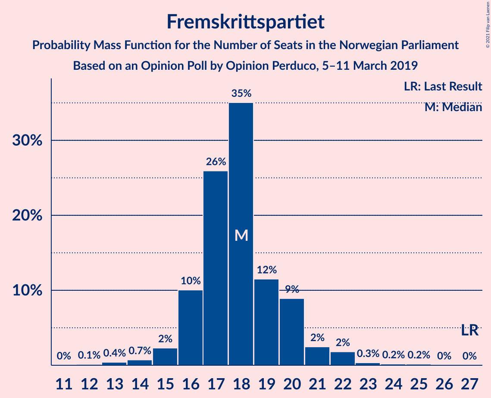

| Number of Seats | Probability | Accumulated | Special Marks |
|:---------------:|:-----------:|:-----------:|:-------------:|
| 12 | 0.1% | 100% |  |
| 13 | 0.4% | 99.9% |  |
| 14 | 0.7% | 99.4% |  |
| 15 | 2% | 98.7% |  |
| 16 | 10% | 96% |  |
| 17 | 26% | 86% |  |
| 18 | 35% | 60% | Median |
| 19 | 12% | 25% |  |
| 20 | 9% | 14% |  |
| 21 | 2% | 5% |  |
| 22 | 2% | 3% |  |
| 23 | 0.3% | 0.7% |  |
| 24 | 0.2% | 0.4% |  |
| 25 | 0.2% | 0.2% |  |
| 26 | 0% | 0% |  |
| 27 | 0% | 0% | Last Result |

### Sosialistisk Venstreparti

*For a full overview of the results for this party, see the [Sosialistisk Venstreparti](party-sosialistiskvenstreparti.html) page.*

| Number of Seats | Probability | Accumulated | Special Marks |
|:---------------:|:-----------:|:-----------:|:-------------:|
| 8 | 0.3% | 100% |  |
| 9 | 4% | 99.7% |  |
| 10 | 5% | 96% |  |
| 11 | 20% | 90% | Last Result |
| 12 | 28% | 71% | Median |
| 13 | 27% | 43% |  |
| 14 | 12% | 16% |  |
| 15 | 3% | 4% |  |
| 16 | 0.7% | 1.0% |  |
| 17 | 0.2% | 0.3% |  |
| 18 | 0% | 0.1% |  |
| 19 | 0% | 0% |  |

### Miljøpartiet De Grønne

*For a full overview of the results for this party, see the [Miljøpartiet De Grønne](party-miljøpartietdegrønne.html) page.*

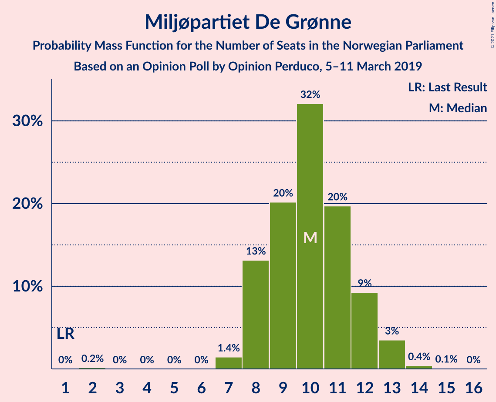

| Number of Seats | Probability | Accumulated | Special Marks |
|:---------------:|:-----------:|:-----------:|:-------------:|
| 1 | 0% | 100% | Last Result |
| 2 | 0.2% | 100% |  |
| 3 | 0% | 99.8% |  |
| 4 | 0% | 99.8% |  |
| 5 | 0% | 99.8% |  |
| 6 | 0% | 99.8% |  |
| 7 | 1.4% | 99.8% |  |
| 8 | 13% | 98% |  |
| 9 | 20% | 85% |  |
| 10 | 32% | 65% | Median |
| 11 | 20% | 33% |  |
| 12 | 9% | 13% |  |
| 13 | 3% | 4% |  |
| 14 | 0.4% | 0.5% |  |
| 15 | 0.1% | 0.1% |  |
| 16 | 0% | 0% |  |

### Rødt

*For a full overview of the results for this party, see the [Rødt](party-rødt.html) page.*

| Number of Seats | Probability | Accumulated | Special Marks |
|:---------------:|:-----------:|:-----------:|:-------------:|
| 1 | 0% | 100% | Last Result |
| 2 | 6% | 100% |  |
| 3 | 0% | 94% |  |
| 4 | 0% | 94% |  |
| 5 | 0% | 94% |  |
| 6 | 0.1% | 94% |  |
| 7 | 24% | 94% |  |
| 8 | 34% | 70% | Median |
| 9 | 26% | 36% |  |
| 10 | 6% | 10% |  |
| 11 | 3% | 4% |  |
| 12 | 0.4% | 0.5% |  |
| 13 | 0% | 0% |  |

### Kristelig Folkeparti

*For a full overview of the results for this party, see the [Kristelig Folkeparti](party-kristeligfolkeparti.html) page.*

| Number of Seats | Probability | Accumulated | Special Marks |
|:---------------:|:-----------:|:-----------:|:-------------:|
| 1 | 0.1% | 100% |  |
| 2 | 0.3% | 99.9% |  |
| 3 | 6% | 99.6% |  |
| 4 | 0% | 94% |  |
| 5 | 0% | 94% |  |
| 6 | 0% | 94% |  |
| 7 | 25% | 94% |  |
| 8 | 28% | 69% | Last Result, Median |
| 9 | 28% | 42% |  |
| 10 | 11% | 14% |  |
| 11 | 2% | 3% |  |
| 12 | 0.4% | 0.4% |  |
| 13 | 0% | 0% |  |

### Venstre

*For a full overview of the results for this party, see the [Venstre](party-venstre.html) page.*

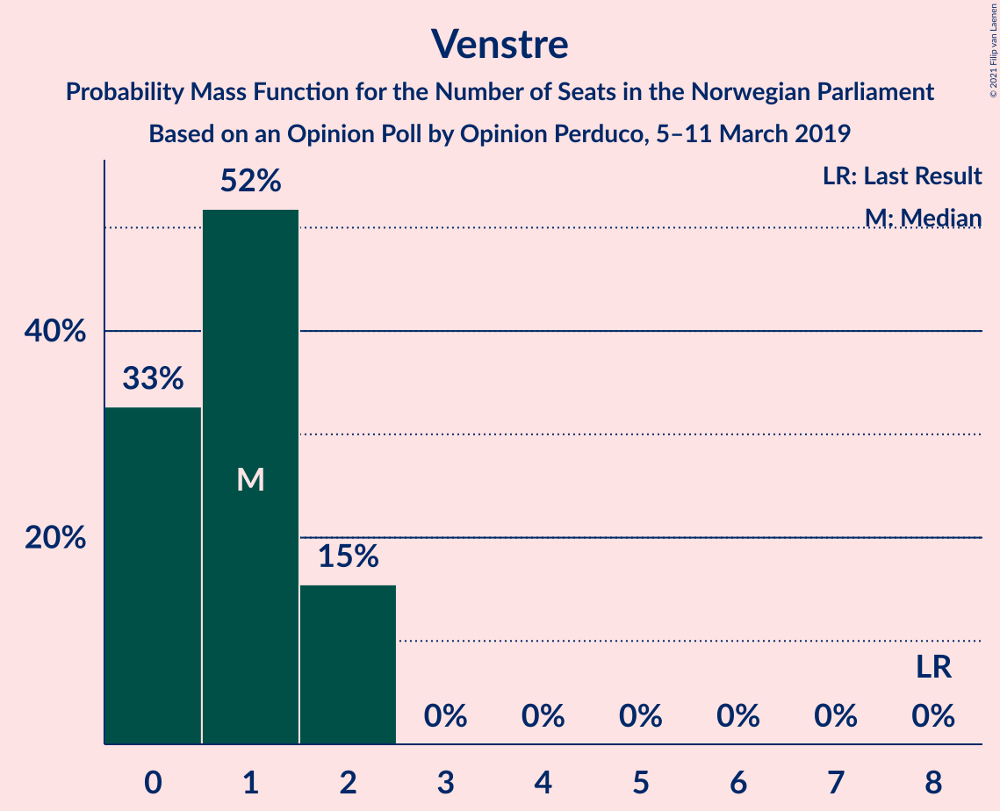

| Number of Seats | Probability | Accumulated | Special Marks |
|:---------------:|:-----------:|:-----------:|:-------------:|
| 0 | 33% | 100% |  |
| 1 | 52% | 67% | Median |
| 2 | 15% | 16% |  |
| 3 | 0% | 0% |  |
| 4 | 0% | 0% |  |
| 5 | 0% | 0% |  |
| 6 | 0% | 0% |  |
| 7 | 0% | 0% |  |
| 8 | 0% | 0% | Last Result |

## Coalitions

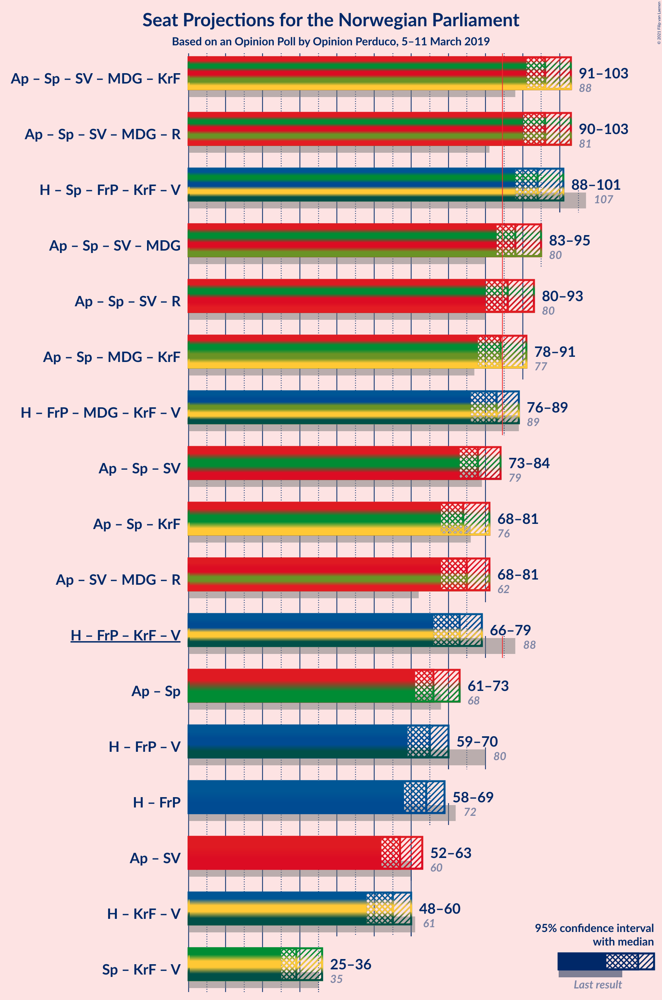

### Confidence Intervals

| Coalition | Last Result | Median | Majority? | 80% Confidence Interval | 90% Confidence Interval | 95% Confidence Interval | 99% Confidence Interval |
|:---------:|:-----------:|:------:|:---------:|:-----------------------:|:-----------------------:|:-----------------------:|:-----------------------:|
| Arbeiderpartiet – Senterpartiet – Sosialistisk Venstreparti – Miljøpartiet De Grønne – Kristelig Folkeparti | 88 | 96 | 100% | 92–100 | 91–101 | 91–103 | 89–105 |
| Arbeiderpartiet – Senterpartiet – Sosialistisk Venstreparti – Miljøpartiet De Grønne – Rødt | 81 | 96 | 100% | 92–100 | 92–101 | 90–103 | 89–105 |
| Høyre – Senterpartiet – Fremskrittspartiet – Kristelig Folkeparti – Venstre | 107 | 94 | 99.8% | 90–97 | 89–99 | 88–101 | 87–102 |
| Arbeiderpartiet – Senterpartiet – Sosialistisk Venstreparti – Miljøpartiet De Grønne | 80 | 88 | 88% | 84–92 | 84–93 | 83–95 | 81–97 |
| Arbeiderpartiet – Senterpartiet – Sosialistisk Venstreparti – Rødt | 80 | 86 | 72% | 83–90 | 82–91 | 80–93 | 79–95 |
| Arbeiderpartiet – Senterpartiet – Miljøpartiet De Grønne – Kristelig Folkeparti | 77 | 84 | 41% | 80–88 | 79–89 | 78–91 | 77–93 |
| Høyre – Fremskrittspartiet – Miljøpartiet De Grønne – Kristelig Folkeparti – Venstre | 89 | 83 | 28% | 79–86 | 78–87 | 76–89 | 74–90 |
| Arbeiderpartiet – Senterpartiet – Sosialistisk Venstreparti | 79 | 78 | 2% | 75–82 | 74–83 | 73–84 | 72–87 |
| Arbeiderpartiet – Senterpartiet – Kristelig Folkeparti | 76 | 74 | 0.2% | 71–77 | 69–79 | 68–81 | 66–83 |
| Arbeiderpartiet – Sosialistisk Venstreparti – Miljøpartiet De Grønne – Rødt | 62 | 75 | 0.2% | 72–79 | 70–80 | 68–81 | 67–82 |
| Høyre – Fremskrittspartiet – Kristelig Folkeparti – Venstre | 88 | 73 | 0% | 69–77 | 68–77 | 66–79 | 64–80 |
| Arbeiderpartiet – Senterpartiet | 68 | 66 | 0% | 63–69 | 62–71 | 61–73 | 60–75 |
| Høyre – Fremskrittspartiet – Venstre | 80 | 65 | 0% | 61–69 | 60–70 | 59–70 | 57–72 |
| Høyre – Fremskrittspartiet | 72 | 64 | 0% | 60–68 | 59–69 | 58–69 | 56–71 |
| Arbeiderpartiet – Sosialistisk Venstreparti | 60 | 57 | 0% | 54–60 | 53–61 | 52–63 | 50–64 |
| Høyre – Kristelig Folkeparti – Venstre | 61 | 55 | 0% | 51–58 | 49–59 | 48–60 | 45–62 |
| Senterpartiet – Kristelig Folkeparti – Venstre | 35 | 29 | 0% | 27–33 | 26–34 | 25–36 | 24–39 |

### Arbeiderpartiet – Senterpartiet – Sosialistisk Venstreparti – Miljøpartiet De Grønne – Kristelig Folkeparti

| Number of Seats | Probability | Accumulated | Special Marks |
|:---------------:|:-----------:|:-----------:|:-------------:|
| 87 | 0.1% | 100% |  |
| 88 | 0.3% | 99.9% | Last Result |
| 89 | 0.7% | 99.6% |  |
| 90 | 1.1% | 99.0% |  |
| 91 | 6% | 98% |  |
| 92 | 5% | 92% |  |
| 93 | 9% | 87% |  |
| 94 | 4% | 78% |  |
| 95 | 15% | 74% |  |
| 96 | 12% | 59% | Median |
| 97 | 9% | 47% |  |
| 98 | 15% | 38% |  |
| 99 | 10% | 23% |  |
| 100 | 5% | 13% |  |
| 101 | 2% | 7% |  |
| 102 | 2% | 5% |  |
| 103 | 1.1% | 3% |  |
| 104 | 0.7% | 1.4% |  |
| 105 | 0.4% | 0.7% |  |
| 106 | 0.2% | 0.3% |  |
| 107 | 0% | 0.2% |  |
| 108 | 0.1% | 0.1% |  |
| 109 | 0% | 0% |  |

### Arbeiderpartiet – Senterpartiet – Sosialistisk Venstreparti – Miljøpartiet De Grønne – Rødt

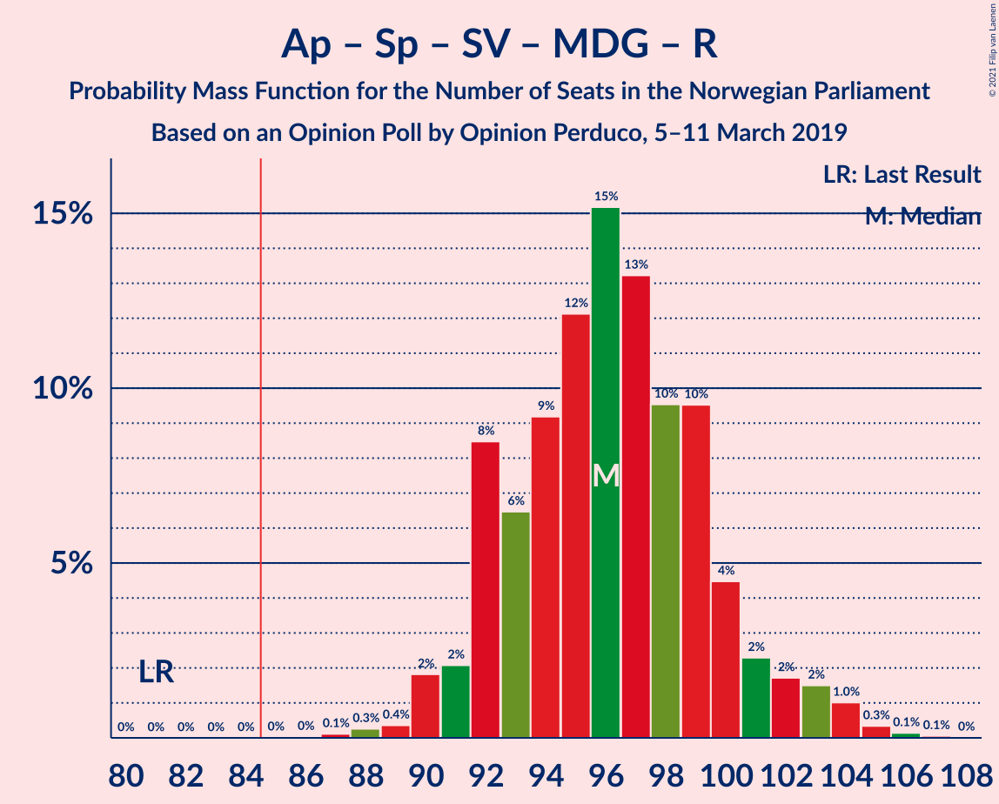

| Number of Seats | Probability | Accumulated | Special Marks |
|:---------------:|:-----------:|:-----------:|:-------------:|
| 81 | 0% | 100% | Last Result |
| 82 | 0% | 100% |  |
| 83 | 0% | 100% |  |
| 84 | 0% | 100% |  |
| 85 | 0% | 100% | Majority |
| 86 | 0% | 100% |  |
| 87 | 0.1% | 99.9% |  |
| 88 | 0.3% | 99.8% |  |
| 89 | 0.4% | 99.6% |  |
| 90 | 2% | 99.2% |  |
| 91 | 2% | 97% |  |
| 92 | 8% | 95% |  |
| 93 | 6% | 87% |  |
| 94 | 9% | 80% |  |
| 95 | 12% | 71% |  |
| 96 | 15% | 59% | Median |
| 97 | 13% | 44% |  |
| 98 | 10% | 31% |  |
| 99 | 10% | 21% |  |
| 100 | 4% | 12% |  |
| 101 | 2% | 7% |  |
| 102 | 2% | 5% |  |
| 103 | 2% | 3% |  |
| 104 | 1.0% | 2% |  |
| 105 | 0.3% | 0.6% |  |
| 106 | 0.1% | 0.2% |  |
| 107 | 0.1% | 0.1% |  |
| 108 | 0% | 0% |  |

### Høyre – Senterpartiet – Fremskrittspartiet – Kristelig Folkeparti – Venstre

| Number of Seats | Probability | Accumulated | Special Marks |
|:---------------:|:-----------:|:-----------:|:-------------:|
| 84 | 0.1% | 100% |  |
| 85 | 0.1% | 99.8% | Majority |
| 86 | 0.1% | 99.7% |  |
| 87 | 0.4% | 99.6% |  |
| 88 | 3% | 99.2% |  |
| 89 | 2% | 96% |  |
| 90 | 4% | 93% |  |
| 91 | 13% | 90% |  |
| 92 | 12% | 77% |  |
| 93 | 10% | 65% |  |
| 94 | 9% | 55% | Median |
| 95 | 18% | 46% |  |
| 96 | 12% | 28% |  |
| 97 | 7% | 16% |  |
| 98 | 3% | 9% |  |
| 99 | 2% | 6% |  |
| 100 | 0.9% | 4% |  |
| 101 | 2% | 3% |  |
| 102 | 1.1% | 1.4% |  |
| 103 | 0.1% | 0.2% |  |
| 104 | 0.1% | 0.1% |  |
| 105 | 0% | 0.1% |  |
| 106 | 0% | 0% |  |
| 107 | 0% | 0% | Last Result |

### Arbeiderpartiet – Senterpartiet – Sosialistisk Venstreparti – Miljøpartiet De Grønne

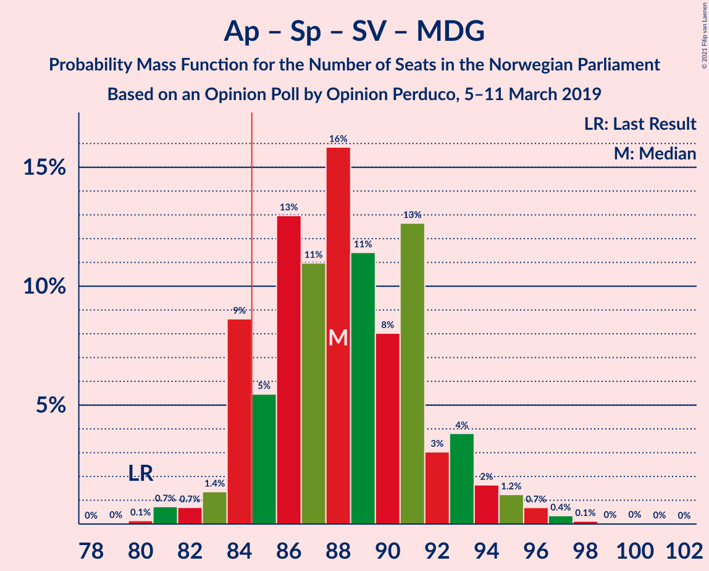

| Number of Seats | Probability | Accumulated | Special Marks |
|:---------------:|:-----------:|:-----------:|:-------------:|
| 79 | 0% | 100% |  |
| 80 | 0.1% | 99.9% | Last Result |
| 81 | 0.7% | 99.8% |  |
| 82 | 0.7% | 99.1% |  |
| 83 | 1.4% | 98% |  |
| 84 | 9% | 97% |  |
| 85 | 5% | 88% | Majority |
| 86 | 13% | 83% |  |
| 87 | 11% | 70% |  |
| 88 | 16% | 59% | Median |
| 89 | 11% | 43% |  |
| 90 | 8% | 32% |  |
| 91 | 13% | 24% |  |
| 92 | 3% | 11% |  |
| 93 | 4% | 8% |  |
| 94 | 2% | 4% |  |
| 95 | 1.2% | 3% |  |
| 96 | 0.7% | 1.3% |  |
| 97 | 0.4% | 0.6% |  |
| 98 | 0.1% | 0.2% |  |
| 99 | 0% | 0.1% |  |
| 100 | 0% | 0.1% |  |
| 101 | 0% | 0% |  |

### Arbeiderpartiet – Senterpartiet – Sosialistisk Venstreparti – Rødt

| Number of Seats | Probability | Accumulated | Special Marks |
|:---------------:|:-----------:|:-----------:|:-------------:|
| 76 | 0.1% | 100% |  |
| 77 | 0.1% | 99.9% |  |
| 78 | 0.2% | 99.8% |  |
| 79 | 0.8% | 99.6% |  |
| 80 | 2% | 98.8% | Last Result |
| 81 | 2% | 97% |  |
| 82 | 5% | 95% |  |
| 83 | 6% | 91% |  |
| 84 | 14% | 85% |  |
| 85 | 15% | 72% | Majority |
| 86 | 10% | 56% | Median |
| 87 | 22% | 46% |  |
| 88 | 4% | 24% |  |
| 89 | 7% | 20% |  |
| 90 | 4% | 13% |  |
| 91 | 4% | 8% |  |
| 92 | 2% | 5% |  |
| 93 | 1.1% | 3% |  |
| 94 | 0.9% | 2% |  |
| 95 | 0.6% | 0.9% |  |
| 96 | 0.1% | 0.2% |  |
| 97 | 0.1% | 0.1% |  |
| 98 | 0% | 0% |  |

### Arbeiderpartiet – Senterpartiet – Miljøpartiet De Grønne – Kristelig Folkeparti

| Number of Seats | Probability | Accumulated | Special Marks |
|:---------------:|:-----------:|:-----------:|:-------------:|
| 74 | 0% | 100% |  |
| 75 | 0.1% | 99.9% |  |
| 76 | 0.3% | 99.9% |  |
| 77 | 0.6% | 99.6% | Last Result |
| 78 | 2% | 99.0% |  |
| 79 | 6% | 97% |  |
| 80 | 3% | 91% |  |
| 81 | 6% | 88% |  |
| 82 | 15% | 82% |  |
| 83 | 9% | 67% |  |
| 84 | 18% | 59% | Median |
| 85 | 12% | 41% | Majority |
| 86 | 6% | 29% |  |
| 87 | 11% | 23% |  |
| 88 | 5% | 12% |  |
| 89 | 2% | 7% |  |
| 90 | 2% | 5% |  |
| 91 | 0.8% | 3% |  |
| 92 | 1.2% | 2% |  |
| 93 | 0.2% | 0.6% |  |
| 94 | 0.2% | 0.4% |  |
| 95 | 0.1% | 0.2% |  |
| 96 | 0% | 0.1% |  |
| 97 | 0% | 0% |  |

### Høyre – Fremskrittspartiet – Miljøpartiet De Grønne – Kristelig Folkeparti – Venstre

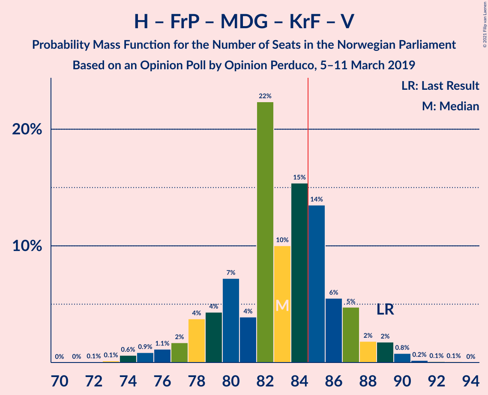

| Number of Seats | Probability | Accumulated | Special Marks |
|:---------------:|:-----------:|:-----------:|:-------------:|
| 72 | 0.1% | 100% |  |
| 73 | 0.1% | 99.9% |  |
| 74 | 0.6% | 99.8% |  |
| 75 | 0.9% | 99.1% |  |
| 76 | 1.1% | 98% |  |
| 77 | 2% | 97% |  |
| 78 | 4% | 95% |  |
| 79 | 4% | 92% |  |
| 80 | 7% | 87% |  |
| 81 | 4% | 80% |  |
| 82 | 22% | 76% |  |
| 83 | 10% | 54% | Median |
| 84 | 15% | 44% |  |
| 85 | 14% | 28% | Majority |
| 86 | 6% | 15% |  |
| 87 | 5% | 9% |  |
| 88 | 2% | 5% |  |
| 89 | 2% | 3% | Last Result |
| 90 | 0.8% | 1.2% |  |
| 91 | 0.2% | 0.4% |  |
| 92 | 0.1% | 0.2% |  |
| 93 | 0.1% | 0.1% |  |
| 94 | 0% | 0% |  |

### Arbeiderpartiet – Senterpartiet – Sosialistisk Venstreparti

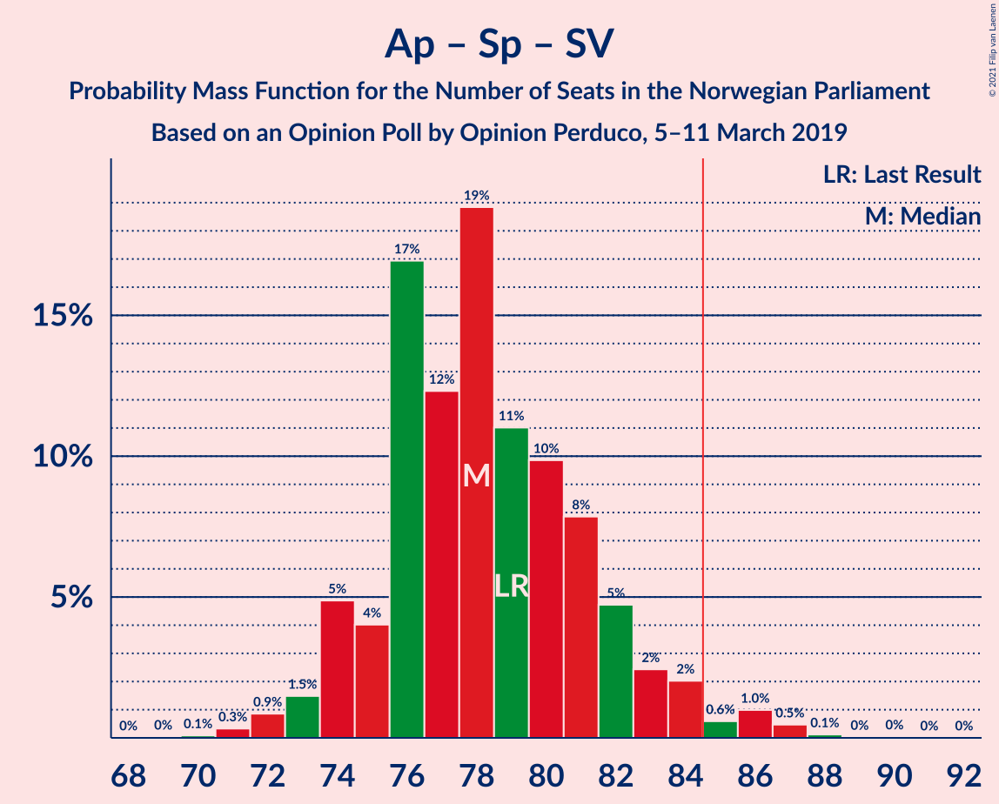

| Number of Seats | Probability | Accumulated | Special Marks |
|:---------------:|:-----------:|:-----------:|:-------------:|
| 69 | 0% | 100% |  |
| 70 | 0.1% | 99.9% |  |
| 71 | 0.3% | 99.9% |  |
| 72 | 0.9% | 99.5% |  |
| 73 | 1.5% | 98.7% |  |
| 74 | 5% | 97% |  |
| 75 | 4% | 92% |  |
| 76 | 17% | 88% |  |
| 77 | 12% | 71% |  |
| 78 | 19% | 59% | Median |
| 79 | 11% | 40% | Last Result |
| 80 | 10% | 29% |  |
| 81 | 8% | 19% |  |
| 82 | 5% | 11% |  |
| 83 | 2% | 7% |  |
| 84 | 2% | 4% |  |
| 85 | 0.6% | 2% | Majority |
| 86 | 1.0% | 2% |  |
| 87 | 0.5% | 0.7% |  |
| 88 | 0.1% | 0.2% |  |
| 89 | 0% | 0.1% |  |
| 90 | 0% | 0.1% |  |
| 91 | 0% | 0% |  |

### Arbeiderpartiet – Senterpartiet – Kristelig Folkeparti

| Number of Seats | Probability | Accumulated | Special Marks |
|:---------------:|:-----------:|:-----------:|:-------------:|
| 64 | 0% | 100% |  |
| 65 | 0.1% | 99.9% |  |
| 66 | 0.4% | 99.9% |  |
| 67 | 0.8% | 99.5% |  |
| 68 | 2% | 98.7% |  |
| 69 | 2% | 96% |  |
| 70 | 4% | 94% |  |
| 71 | 10% | 90% |  |
| 72 | 9% | 81% |  |
| 73 | 15% | 72% |  |
| 74 | 16% | 57% | Median |
| 75 | 11% | 41% |  |
| 76 | 13% | 30% | Last Result |
| 77 | 7% | 17% |  |
| 78 | 2% | 10% |  |
| 79 | 3% | 8% |  |
| 80 | 1.3% | 5% |  |
| 81 | 2% | 4% |  |
| 82 | 0.5% | 2% |  |
| 83 | 0.7% | 1.1% |  |
| 84 | 0.3% | 0.5% |  |
| 85 | 0.1% | 0.2% | Majority |
| 86 | 0% | 0.1% |  |
| 87 | 0% | 0% |  |

### Arbeiderpartiet – Sosialistisk Venstreparti – Miljøpartiet De Grønne – Rødt

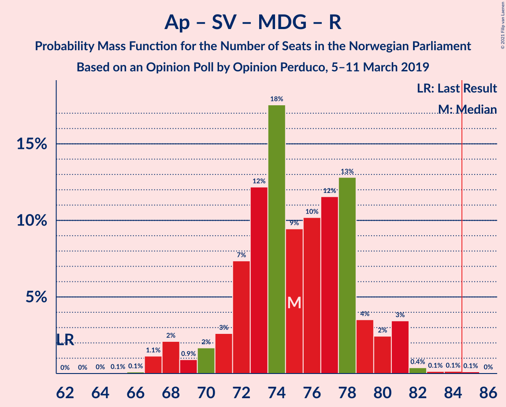

| Number of Seats | Probability | Accumulated | Special Marks |
|:---------------:|:-----------:|:-----------:|:-------------:|
| 62 | 0% | 100% | Last Result |
| 63 | 0% | 100% |  |
| 64 | 0% | 100% |  |
| 65 | 0.1% | 99.9% |  |
| 66 | 0.1% | 99.9% |  |
| 67 | 1.1% | 99.8% |  |
| 68 | 2% | 98.6% |  |
| 69 | 0.9% | 97% |  |
| 70 | 2% | 96% |  |
| 71 | 3% | 94% |  |
| 72 | 7% | 91% |  |
| 73 | 12% | 84% |  |
| 74 | 18% | 72% |  |
| 75 | 9% | 54% | Median |
| 76 | 10% | 45% |  |
| 77 | 12% | 35% |  |
| 78 | 13% | 23% |  |
| 79 | 4% | 10% |  |
| 80 | 2% | 7% |  |
| 81 | 3% | 4% |  |
| 82 | 0.4% | 0.8% |  |
| 83 | 0.1% | 0.4% |  |
| 84 | 0.1% | 0.3% |  |
| 85 | 0.1% | 0.2% | Majority |
| 86 | 0% | 0% |  |

### Høyre – Fremskrittspartiet – Kristelig Folkeparti – Venstre

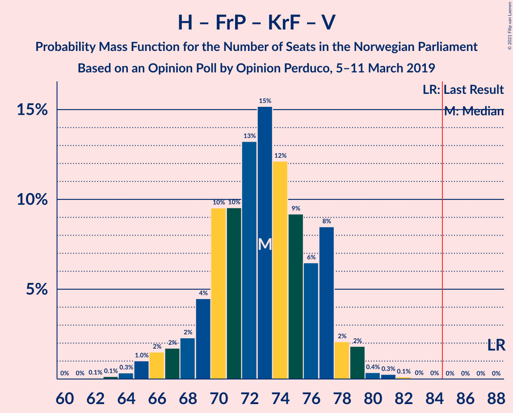

| Number of Seats | Probability | Accumulated | Special Marks |
|:---------------:|:-----------:|:-----------:|:-------------:|
| 62 | 0.1% | 100% |  |
| 63 | 0.1% | 99.9% |  |
| 64 | 0.3% | 99.8% |  |
| 65 | 1.0% | 99.4% |  |
| 66 | 2% | 98% |  |
| 67 | 2% | 97% |  |
| 68 | 2% | 95% |  |
| 69 | 4% | 93% |  |
| 70 | 10% | 88% |  |
| 71 | 10% | 79% |  |
| 72 | 13% | 69% |  |
| 73 | 15% | 56% | Median |
| 74 | 12% | 41% |  |
| 75 | 9% | 29% |  |
| 76 | 6% | 20% |  |
| 77 | 8% | 13% |  |
| 78 | 2% | 5% |  |
| 79 | 2% | 3% |  |
| 80 | 0.4% | 0.8% |  |
| 81 | 0.3% | 0.4% |  |
| 82 | 0.1% | 0.2% |  |
| 83 | 0% | 0.1% |  |
| 84 | 0% | 0% |  |
| 85 | 0% | 0% | Majority |
| 86 | 0% | 0% |  |
| 87 | 0% | 0% |  |
| 88 | 0% | 0% | Last Result |

### Arbeiderpartiet – Senterpartiet

| Number of Seats | Probability | Accumulated | Special Marks |
|:---------------:|:-----------:|:-----------:|:-------------:|
| 58 | 0.1% | 100% |  |
| 59 | 0.2% | 99.9% |  |
| 60 | 0.7% | 99.8% |  |
| 61 | 2% | 99.1% |  |
| 62 | 2% | 97% |  |
| 63 | 8% | 95% |  |
| 64 | 13% | 87% |  |
| 65 | 20% | 73% |  |
| 66 | 19% | 53% | Median |
| 67 | 11% | 35% |  |
| 68 | 9% | 23% | Last Result |
| 69 | 5% | 14% |  |
| 70 | 3% | 9% |  |
| 71 | 1.3% | 6% |  |
| 72 | 1.3% | 5% |  |
| 73 | 2% | 3% |  |
| 74 | 0.5% | 1.4% |  |
| 75 | 0.7% | 0.9% |  |
| 76 | 0.1% | 0.2% |  |
| 77 | 0% | 0.1% |  |
| 78 | 0% | 0.1% |  |
| 79 | 0% | 0% |  |

### Høyre – Fremskrittspartiet – Venstre

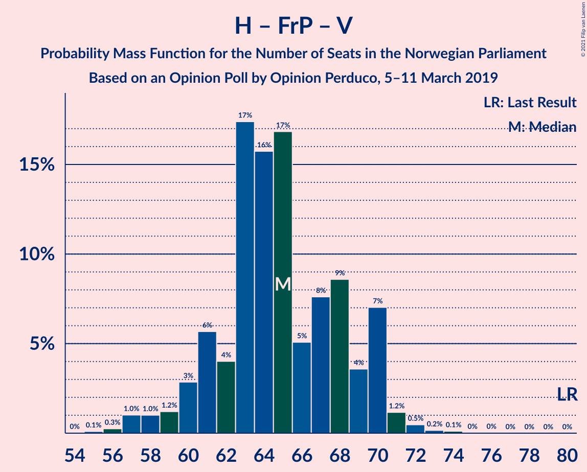

| Number of Seats | Probability | Accumulated | Special Marks |
|:---------------:|:-----------:|:-----------:|:-------------:|
| 55 | 0.1% | 100% |  |
| 56 | 0.3% | 99.9% |  |
| 57 | 1.0% | 99.6% |  |
| 58 | 1.0% | 98.6% |  |
| 59 | 1.2% | 98% |  |
| 60 | 3% | 96% |  |
| 61 | 6% | 94% |  |
| 62 | 4% | 88% |  |
| 63 | 17% | 84% |  |
| 64 | 16% | 66% |  |
| 65 | 17% | 51% | Median |
| 66 | 5% | 34% |  |
| 67 | 8% | 29% |  |
| 68 | 9% | 21% |  |
| 69 | 4% | 13% |  |
| 70 | 7% | 9% |  |
| 71 | 1.2% | 2% |  |
| 72 | 0.5% | 0.8% |  |
| 73 | 0.2% | 0.3% |  |
| 74 | 0.1% | 0.2% |  |
| 75 | 0% | 0.1% |  |
| 76 | 0% | 0% |  |
| 77 | 0% | 0% |  |
| 78 | 0% | 0% |  |
| 79 | 0% | 0% |  |
| 80 | 0% | 0% | Last Result |

### Høyre – Fremskrittspartiet

| Number of Seats | Probability | Accumulated | Special Marks |
|:---------------:|:-----------:|:-----------:|:-------------:|
| 54 | 0.1% | 100% |  |
| 55 | 0.2% | 99.9% |  |
| 56 | 0.7% | 99.7% |  |
| 57 | 1.1% | 99.0% |  |
| 58 | 1.4% | 98% |  |
| 59 | 2% | 97% |  |
| 60 | 4% | 94% |  |
| 61 | 5% | 90% |  |
| 62 | 15% | 85% |  |
| 63 | 18% | 70% |  |
| 64 | 16% | 52% | Median |
| 65 | 7% | 36% |  |
| 66 | 6% | 29% |  |
| 67 | 7% | 23% |  |
| 68 | 7% | 16% |  |
| 69 | 7% | 8% |  |
| 70 | 0.6% | 2% |  |
| 71 | 0.7% | 1.1% |  |
| 72 | 0.3% | 0.4% | Last Result |
| 73 | 0.1% | 0.2% |  |
| 74 | 0% | 0.1% |  |
| 75 | 0% | 0% |  |

### Arbeiderpartiet – Sosialistisk Venstreparti

| Number of Seats | Probability | Accumulated | Special Marks |
|:---------------:|:-----------:|:-----------:|:-------------:|
| 49 | 0.2% | 100% |  |
| 50 | 0.5% | 99.8% |  |
| 51 | 1.1% | 99.3% |  |
| 52 | 2% | 98% |  |
| 53 | 2% | 96% |  |
| 54 | 6% | 94% |  |
| 55 | 7% | 87% |  |
| 56 | 20% | 80% |  |
| 57 | 15% | 60% | Median |
| 58 | 18% | 44% |  |
| 59 | 6% | 26% |  |
| 60 | 13% | 20% | Last Result |
| 61 | 2% | 7% |  |
| 62 | 2% | 4% |  |
| 63 | 1.4% | 3% |  |
| 64 | 1.1% | 1.4% |  |
| 65 | 0.2% | 0.3% |  |
| 66 | 0.1% | 0.2% |  |
| 67 | 0% | 0.1% |  |
| 68 | 0% | 0% |  |

### Høyre – Kristelig Folkeparti – Venstre

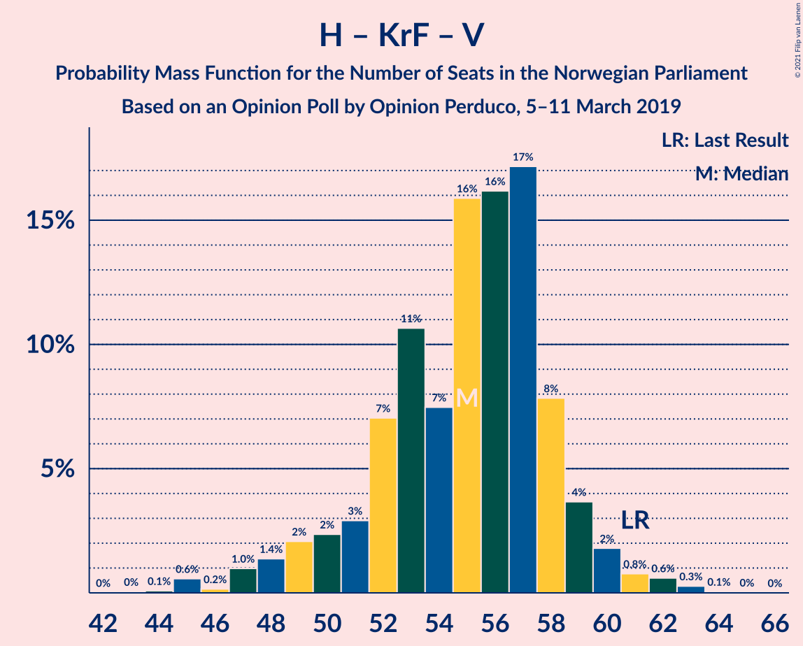

| Number of Seats | Probability | Accumulated | Special Marks |
|:---------------:|:-----------:|:-----------:|:-------------:|
| 43 | 0% | 100% |  |
| 44 | 0.1% | 99.9% |  |
| 45 | 0.6% | 99.9% |  |
| 46 | 0.2% | 99.3% |  |
| 47 | 1.0% | 99.1% |  |
| 48 | 1.4% | 98% |  |
| 49 | 2% | 97% |  |
| 50 | 2% | 95% |  |
| 51 | 3% | 92% |  |
| 52 | 7% | 89% |  |
| 53 | 11% | 82% |  |
| 54 | 7% | 72% |  |
| 55 | 16% | 64% | Median |
| 56 | 16% | 48% |  |
| 57 | 17% | 32% |  |
| 58 | 8% | 15% |  |
| 59 | 4% | 7% |  |
| 60 | 2% | 4% |  |
| 61 | 0.8% | 2% | Last Result |
| 62 | 0.6% | 0.9% |  |
| 63 | 0.3% | 0.4% |  |
| 64 | 0.1% | 0.1% |  |
| 65 | 0% | 0% |  |

### Senterpartiet – Kristelig Folkeparti – Venstre

| Number of Seats | Probability | Accumulated | Special Marks |
|:---------------:|:-----------:|:-----------:|:-------------:|
| 21 | 0.1% | 100% |  |
| 22 | 0.1% | 99.9% |  |
| 23 | 0.3% | 99.8% |  |
| 24 | 0.6% | 99.5% |  |
| 25 | 1.5% | 98.9% |  |
| 26 | 5% | 97% |  |
| 27 | 5% | 92% |  |
| 28 | 17% | 88% |  |
| 29 | 21% | 70% |  |
| 30 | 14% | 49% | Median |
| 31 | 10% | 35% |  |
| 32 | 10% | 25% |  |
| 33 | 7% | 15% |  |
| 34 | 3% | 8% |  |
| 35 | 2% | 5% | Last Result |
| 36 | 1.2% | 3% |  |
| 37 | 0.5% | 1.4% |  |
| 38 | 0.4% | 0.9% |  |
| 39 | 0.4% | 0.5% |  |
| 40 | 0.1% | 0.2% |  |
| 41 | 0% | 0.1% |  |
| 42 | 0% | 0% |  |

## Technical Information

### Opinion Poll

+ **Polling firm:** Opinion Perduco
+ **Commissioner(s):** —
+ **Fieldwork period:** 5–11 March 2019

### Calculations

+ **Sample size:** 957
+ **Simulations done:** 1,048,576
+ **Error estimate:** 1.36%

