# Opinion Poll by Sentio, 12–18 March 2019

<a href="#voting-intentions">Voting Intentions</a> | <a href="#seats">Seats</a> | <a href="#coalitions">Coalitions</a> | <a href="#technical-information">Technical Information</a>

## Voting Intentions

### Confidence Intervals

| Party | Last Result | Poll Result | 80% Confidence Interval | 90% Confidence Interval | 95% Confidence Interval | 99% Confidence Interval |
|:-----:|:-----------:|:-----------:|:-----------------------:|:-----------------------:|:-----------------------:|:-----------------------:|
| Arbeiderpartiet | 27.4% | 27.7% | 25.9–29.6% |25.4–30.1% |25.0–30.6% |24.2–31.5% |
| Høyre | 25.0% | 24.7% | 23.0–26.5% |22.5–27.0% |22.1–27.5% |21.3–28.4% |
| Senterpartiet | 10.3% | 14.5% | 13.2–16.0% |12.8–16.4% |12.5–16.8% |11.8–17.6% |
| Fremskrittspartiet | 15.2% | 10.6% | 9.4–11.9% |9.1–12.3% |8.8–12.7% |8.3–13.3% |
| Sosialistisk Venstreparti | 6.0% | 7.3% | 6.3–8.5% |6.1–8.8% |5.8–9.1% |5.4–9.7% |
| Rødt | 2.4% | 5.4% | 4.6–6.4% |4.3–6.7% |4.2–7.0% |3.8–7.5% |
| Miljøpartiet De Grønne | 3.2% | 3.2% | 2.6–4.0% |2.4–4.3% |2.3–4.5% |2.0–4.9% |
| Kristelig Folkeparti | 4.2% | 3.0% | 2.4–3.8% |2.2–4.1% |2.1–4.3% |1.9–4.7% |
| Venstre | 4.4% | 2.3% | 1.8–3.0% |1.6–3.2% |1.5–3.4% |1.3–3.8% |

*Note:* The poll result column reflects the actual value used in the calculations. Published results may vary slightly, and in addition be rounded to fewer digits.

## Seats

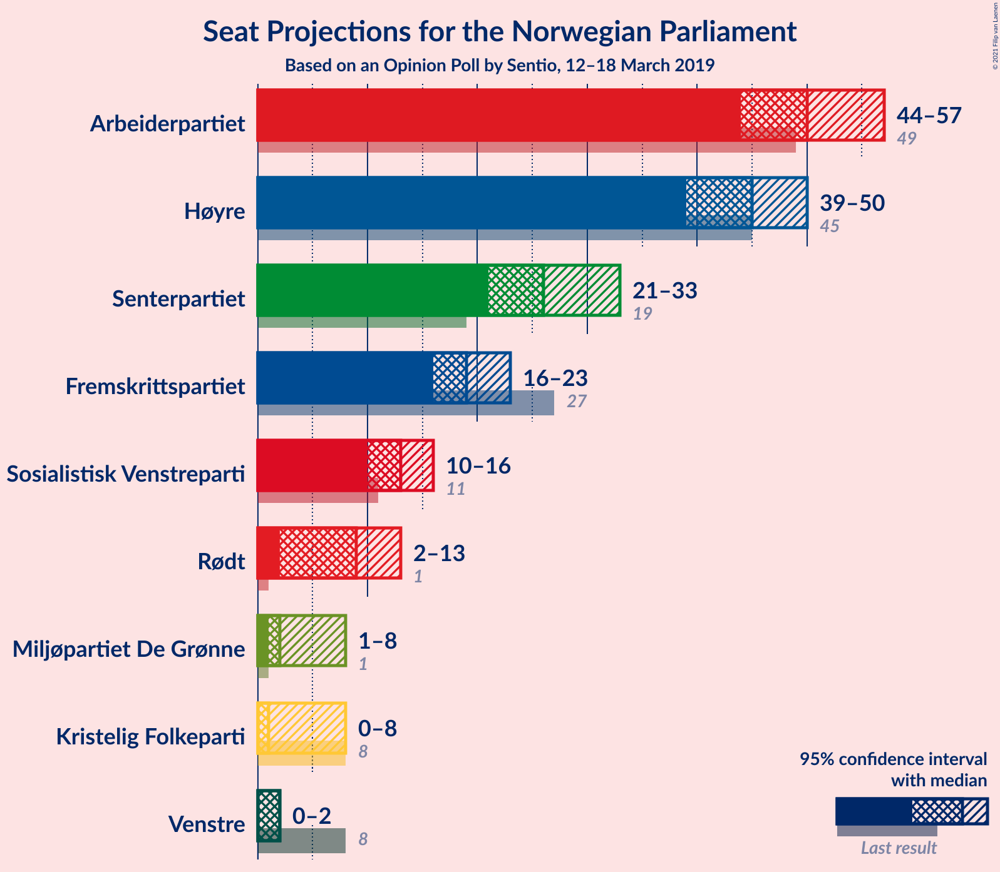

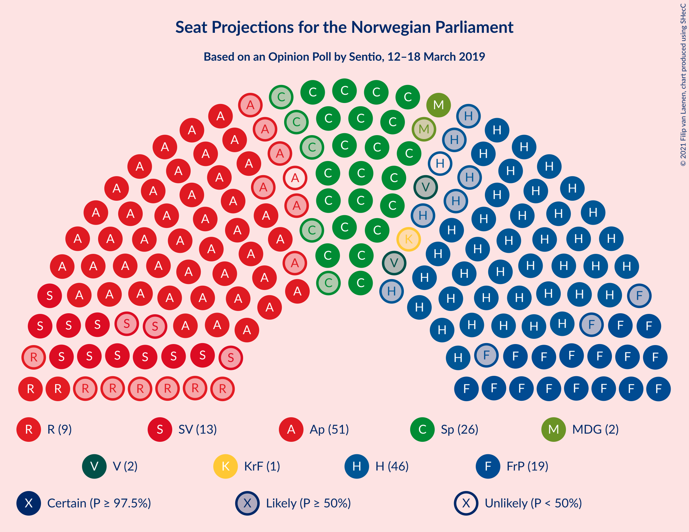

### Confidence Intervals

| Party | Last Result | Median | 80% Confidence Interval | 90% Confidence Interval | 95% Confidence Interval | 99% Confidence Interval |
|:-----:|:-----------:|:------:|:-----------------------:|:-----------------------:|:-----------------------:|:-----------------------:|
| <a href="#arbeiderpartiet">Arbeiderpartiet</a> | 49 | 50 | 46–55 |45–55 |44–57 |43–58 |
| <a href="#høyre">Høyre</a> | 45 | 45 | 41–48 |40–49 |39–50 |38–52 |
| <a href="#senterpartiet">Senterpartiet</a> | 19 | 26 | 23–29 |23–31 |21–33 |21–34 |
| <a href="#fremskrittspartiet">Fremskrittspartiet</a> | 27 | 19 | 17–22 |16–22 |16–23 |15–24 |
| <a href="#sosialistisk-venstreparti">Sosialistisk Venstreparti</a> | 11 | 13 | 11–15 |11–16 |10–16 |9–18 |
| <a href="#rødt">Rødt</a> | 1 | 9 | 8–11 |7–12 |2–13 |2–14 |
| <a href="#miljøpartiet-de-grønne">Miljøpartiet De Grønne</a> | 1 | 2 | 1–7 |1–8 |1–8 |1–9 |
| <a href="#kristelig-folkeparti">Kristelig Folkeparti</a> | 8 | 1 | 1–7 |0–7 |0–8 |0–8 |
| <a href="#venstre">Venstre</a> | 8 | 2 | 0–2 |0–2 |0–2 |0–3 |

### Arbeiderpartiet

*For a full overview of the results for this party, see the [Arbeiderpartiet](party-arbeiderpartiet.html) page.*

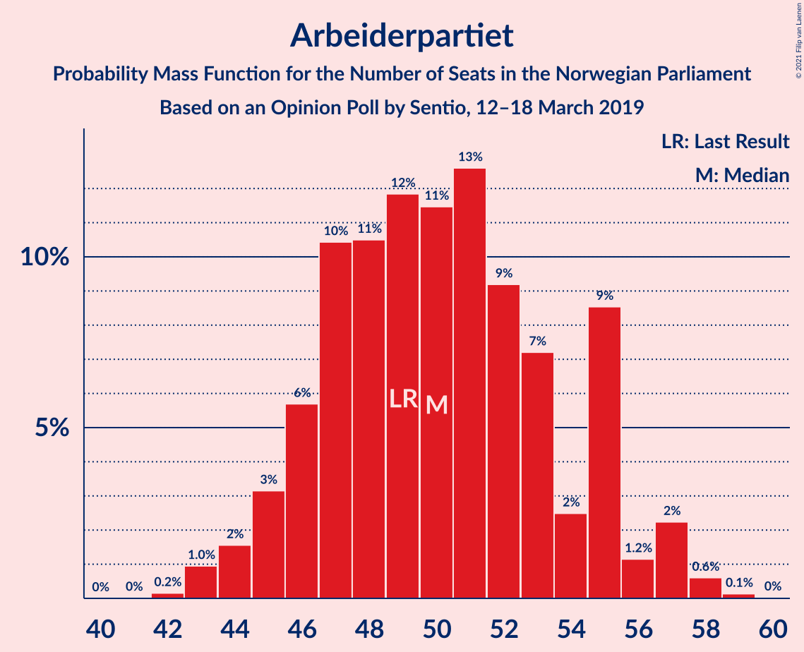

| Number of Seats | Probability | Accumulated | Special Marks |
|:---------------:|:-----------:|:-----------:|:-------------:|
| 42 | 0.2% | 100% |  |
| 43 | 1.0% | 99.8% |  |
| 44 | 2% | 98.9% |  |
| 45 | 3% | 97% |  |
| 46 | 6% | 94% |  |
| 47 | 10% | 88% |  |
| 48 | 11% | 78% |  |
| 49 | 12% | 68% | Last Result |
| 50 | 11% | 56% | Median |
| 51 | 13% | 44% |  |
| 52 | 9% | 32% |  |
| 53 | 7% | 22% |  |
| 54 | 2% | 15% |  |
| 55 | 9% | 13% |  |
| 56 | 1.2% | 4% |  |
| 57 | 2% | 3% |  |
| 58 | 0.6% | 0.8% |  |
| 59 | 0.1% | 0.2% |  |
| 60 | 0% | 0% |  |

### Høyre

*For a full overview of the results for this party, see the [Høyre](party-høyre.html) page.*

| Number of Seats | Probability | Accumulated | Special Marks |
|:---------------:|:-----------:|:-----------:|:-------------:|
| 37 | 0.2% | 100% |  |
| 38 | 1.4% | 99.8% |  |
| 39 | 1.5% | 98% |  |
| 40 | 6% | 97% |  |
| 41 | 6% | 91% |  |
| 42 | 8% | 85% |  |
| 43 | 5% | 77% |  |
| 44 | 15% | 72% |  |
| 45 | 12% | 57% | Last Result, Median |
| 46 | 17% | 45% |  |
| 47 | 10% | 28% |  |
| 48 | 9% | 18% |  |
| 49 | 5% | 9% |  |
| 50 | 1.0% | 3% |  |
| 51 | 1.4% | 2% |  |
| 52 | 0.5% | 0.8% |  |
| 53 | 0.2% | 0.3% |  |
| 54 | 0.1% | 0.1% |  |
| 55 | 0% | 0.1% |  |
| 56 | 0% | 0% |  |

### Senterpartiet

*For a full overview of the results for this party, see the [Senterpartiet](party-senterpartiet.html) page.*

| Number of Seats | Probability | Accumulated | Special Marks |
|:---------------:|:-----------:|:-----------:|:-------------:|
| 19 | 0% | 100% | Last Result |
| 20 | 0.3% | 100% |  |
| 21 | 3% | 99.7% |  |
| 22 | 2% | 97% |  |
| 23 | 8% | 95% |  |
| 24 | 7% | 87% |  |
| 25 | 15% | 80% |  |
| 26 | 20% | 65% | Median |
| 27 | 17% | 45% |  |
| 28 | 7% | 28% |  |
| 29 | 11% | 21% |  |
| 30 | 3% | 9% |  |
| 31 | 2% | 6% |  |
| 32 | 2% | 4% |  |
| 33 | 2% | 3% |  |
| 34 | 0.8% | 1.0% |  |
| 35 | 0.2% | 0.2% |  |
| 36 | 0% | 0% |  |

### Fremskrittspartiet

*For a full overview of the results for this party, see the [Fremskrittspartiet](party-fremskrittspartiet.html) page.*

| Number of Seats | Probability | Accumulated | Special Marks |
|:---------------:|:-----------:|:-----------:|:-------------:|
| 14 | 0.4% | 100% |  |
| 15 | 1.5% | 99.5% |  |
| 16 | 7% | 98% |  |
| 17 | 17% | 91% |  |
| 18 | 11% | 74% |  |
| 19 | 18% | 63% | Median |
| 20 | 18% | 45% |  |
| 21 | 13% | 26% |  |
| 22 | 9% | 13% |  |
| 23 | 3% | 5% |  |
| 24 | 1.1% | 1.3% |  |
| 25 | 0.1% | 0.2% |  |
| 26 | 0.1% | 0.1% |  |
| 27 | 0% | 0% | Last Result |

### Sosialistisk Venstreparti

*For a full overview of the results for this party, see the [Sosialistisk Venstreparti](party-sosialistiskvenstreparti.html) page.*

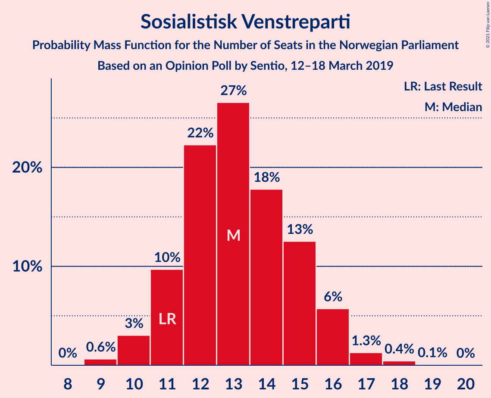

| Number of Seats | Probability | Accumulated | Special Marks |
|:---------------:|:-----------:|:-----------:|:-------------:|
| 9 | 0.6% | 100% |  |
| 10 | 3% | 99.3% |  |
| 11 | 10% | 96% | Last Result |
| 12 | 22% | 87% |  |
| 13 | 27% | 64% | Median |
| 14 | 18% | 38% |  |
| 15 | 13% | 20% |  |
| 16 | 6% | 7% |  |
| 17 | 1.3% | 2% |  |
| 18 | 0.4% | 0.5% |  |
| 19 | 0.1% | 0.1% |  |
| 20 | 0% | 0% |  |

### Rødt

*For a full overview of the results for this party, see the [Rødt](party-rødt.html) page.*

| Number of Seats | Probability | Accumulated | Special Marks |
|:---------------:|:-----------:|:-----------:|:-------------:|
| 1 | 0% | 100% | Last Result |
| 2 | 3% | 100% |  |
| 3 | 0% | 97% |  |
| 4 | 0% | 97% |  |
| 5 | 0% | 97% |  |
| 6 | 0% | 97% |  |
| 7 | 6% | 97% |  |
| 8 | 15% | 91% |  |
| 9 | 27% | 77% | Median |
| 10 | 24% | 49% |  |
| 11 | 16% | 25% |  |
| 12 | 6% | 9% |  |
| 13 | 2% | 3% |  |
| 14 | 0.7% | 0.9% |  |
| 15 | 0.1% | 0.1% |  |
| 16 | 0% | 0% |  |

### Miljøpartiet De Grønne

*For a full overview of the results for this party, see the [Miljøpartiet De Grønne](party-miljøpartietdegrønne.html) page.*

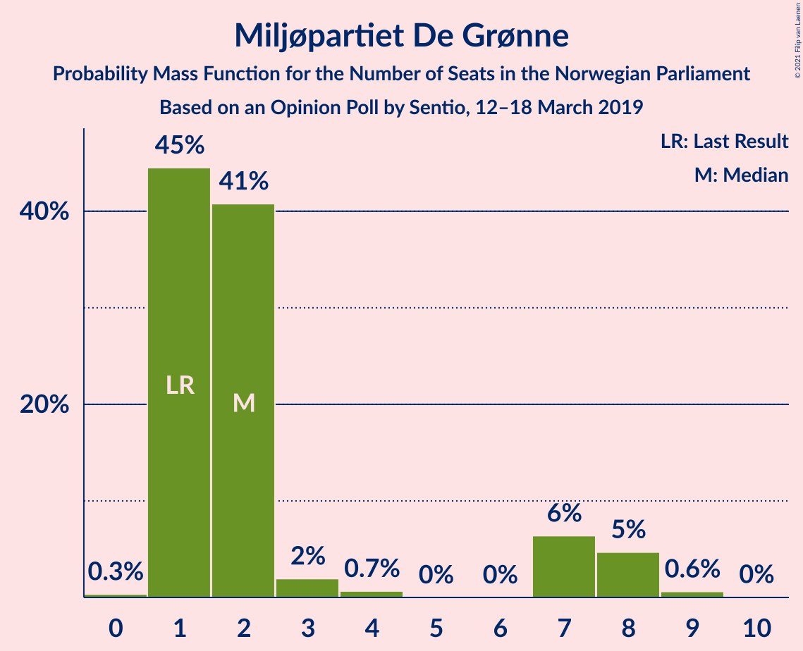

| Number of Seats | Probability | Accumulated | Special Marks |
|:---------------:|:-----------:|:-----------:|:-------------:|
| 0 | 0.3% | 100% |  |
| 1 | 45% | 99.7% | Last Result |
| 2 | 41% | 55% | Median |
| 3 | 2% | 14% |  |
| 4 | 0.7% | 12% |  |
| 5 | 0% | 12% |  |
| 6 | 0% | 12% |  |
| 7 | 6% | 12% |  |
| 8 | 5% | 5% |  |
| 9 | 0.6% | 0.7% |  |
| 10 | 0% | 0% |  |

### Kristelig Folkeparti

*For a full overview of the results for this party, see the [Kristelig Folkeparti](party-kristeligfolkeparti.html) page.*

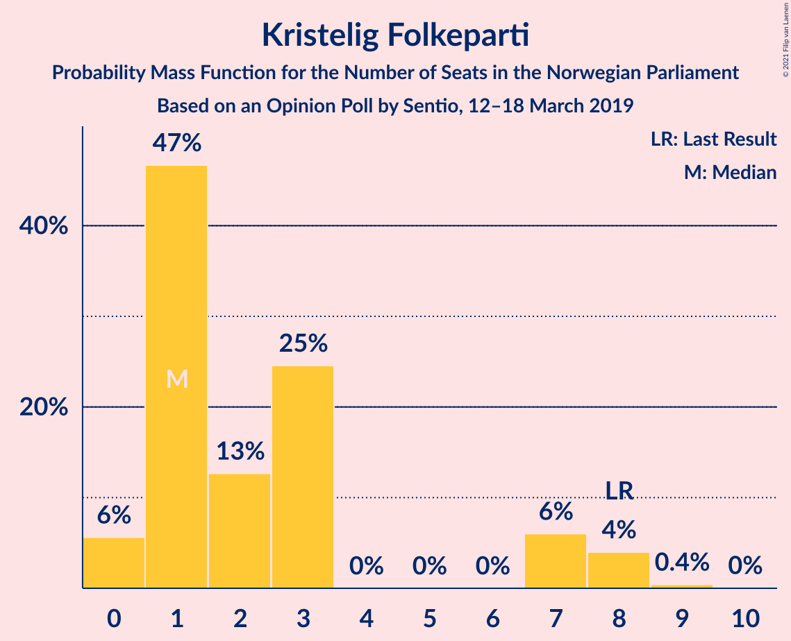

| Number of Seats | Probability | Accumulated | Special Marks |
|:---------------:|:-----------:|:-----------:|:-------------:|
| 0 | 6% | 100% |  |
| 1 | 47% | 94% | Median |
| 2 | 13% | 48% |  |
| 3 | 25% | 35% |  |
| 4 | 0% | 10% |  |
| 5 | 0% | 10% |  |
| 6 | 0% | 10% |  |
| 7 | 6% | 10% |  |
| 8 | 4% | 4% | Last Result |
| 9 | 0.4% | 0.5% |  |
| 10 | 0% | 0% |  |

### Venstre

*For a full overview of the results for this party, see the [Venstre](party-venstre.html) page.*

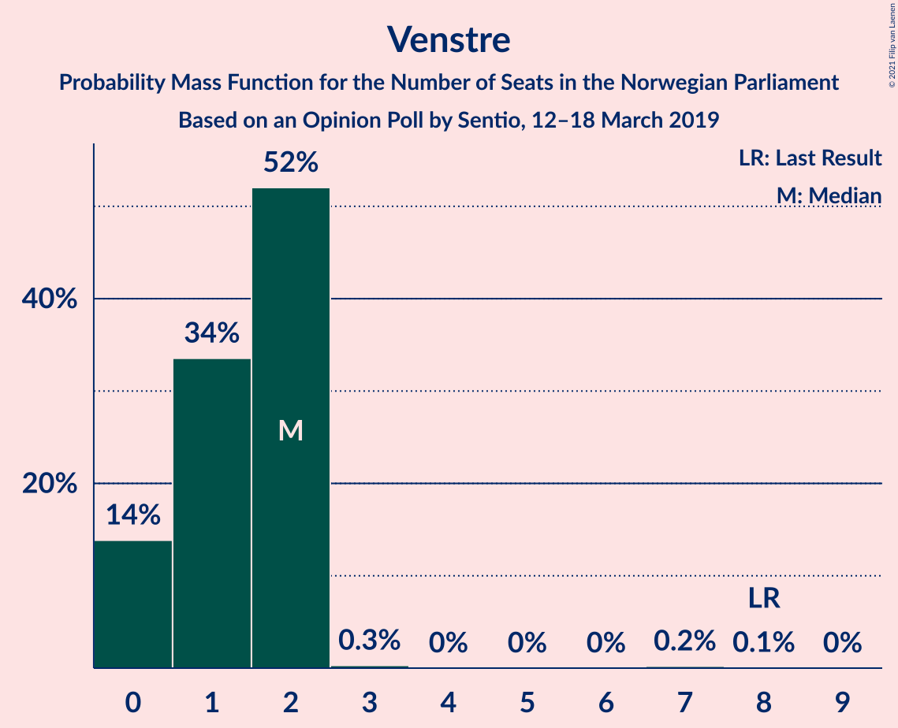

| Number of Seats | Probability | Accumulated | Special Marks |
|:---------------:|:-----------:|:-----------:|:-------------:|
| 0 | 14% | 100% |  |
| 1 | 34% | 86% |  |
| 2 | 52% | 53% | Median |
| 3 | 0.3% | 0.6% |  |
| 4 | 0% | 0.3% |  |
| 5 | 0% | 0.3% |  |
| 6 | 0% | 0.3% |  |
| 7 | 0.2% | 0.3% |  |
| 8 | 0.1% | 0.1% | Last Result |
| 9 | 0% | 0% |  |

## Coalitions

### Confidence Intervals

| Coalition | Last Result | Median | Majority? | 80% Confidence Interval | 90% Confidence Interval | 95% Confidence Interval | 99% Confidence Interval |
|:---------:|:-----------:|:------:|:---------:|:-----------------------:|:-----------------------:|:-----------------------:|:-----------------------:|
| Arbeiderpartiet – Senterpartiet – Sosialistisk Venstreparti – Rødt – Miljøpartiet De Grønne | 81 | 101 | 100% | 97–106 | 96–108 | 95–108 | 93–110 |
| Arbeiderpartiet – Senterpartiet – Sosialistisk Venstreparti – Rødt | 80 | 99 | 100% | 95–103 | 93–105 | 92–106 | 91–107 |
| Arbeiderpartiet – Senterpartiet – Sosialistisk Venstreparti – Miljøpartiet De Grønne – Kristelig Folkeparti | 88 | 94 | 99.9% | 90–99 | 89–100 | 89–101 | 87–103 |
| Høyre – Senterpartiet – Fremskrittspartiet – Kristelig Folkeparti – Venstre | 107 | 94 | 98.9% | 89–99 | 87–99 | 86–101 | 83–103 |
| Arbeiderpartiet – Senterpartiet – Sosialistisk Venstreparti – Miljøpartiet De Grønne | 80 | 92 | 99.1% | 88–96 | 86–98 | 85–99 | 83–101 |
| Arbeiderpartiet – Senterpartiet – Sosialistisk Venstreparti | 79 | 90 | 93% | 85–94 | 84–95 | 83–96 | 81–98 |
| Arbeiderpartiet – Senterpartiet – Miljøpartiet De Grønne – Kristelig Folkeparti | 77 | 81 | 17% | 77–85 | 76–87 | 76–88 | 73–91 |
| Arbeiderpartiet – Senterpartiet – Kristelig Folkeparti | 76 | 78 | 6% | 75–83 | 74–85 | 73–86 | 70–88 |
| Arbeiderpartiet – Senterpartiet | 68 | 76 | 0.9% | 72–81 | 71–82 | 70–83 | 68–85 |
| Arbeiderpartiet – Sosialistisk Venstreparti – Rødt – Miljøpartiet De Grønne | 62 | 75 | 1.1% | 70–80 | 70–82 | 68–83 | 66–86 |
| Høyre – Fremskrittspartiet – Miljøpartiet De Grønne – Kristelig Folkeparti – Venstre | 89 | 70 | 0% | 66–74 | 64–76 | 63–77 | 62–78 |
| Høyre – Fremskrittspartiet – Kristelig Folkeparti – Venstre | 88 | 68 | 0% | 63–72 | 61–73 | 61–74 | 59–76 |
| Høyre – Fremskrittspartiet – Venstre | 80 | 66 | 0% | 61–69 | 60–70 | 59–71 | 57–73 |
| Høyre – Fremskrittspartiet | 72 | 64 | 0% | 60–68 | 59–69 | 58–70 | 56–72 |
| Arbeiderpartiet – Sosialistisk Venstreparti | 60 | 63 | 0% | 59–67 | 58–69 | 57–70 | 55–71 |
| Høyre – Kristelig Folkeparti – Venstre | 61 | 49 | 0% | 44–52 | 43–54 | 42–55 | 41–57 |
| Senterpartiet – Kristelig Folkeparti – Venstre | 35 | 30 | 0% | 26–35 | 25–36 | 24–36 | 23–38 |

### Arbeiderpartiet – Senterpartiet – Sosialistisk Venstreparti – Rødt – Miljøpartiet De Grønne

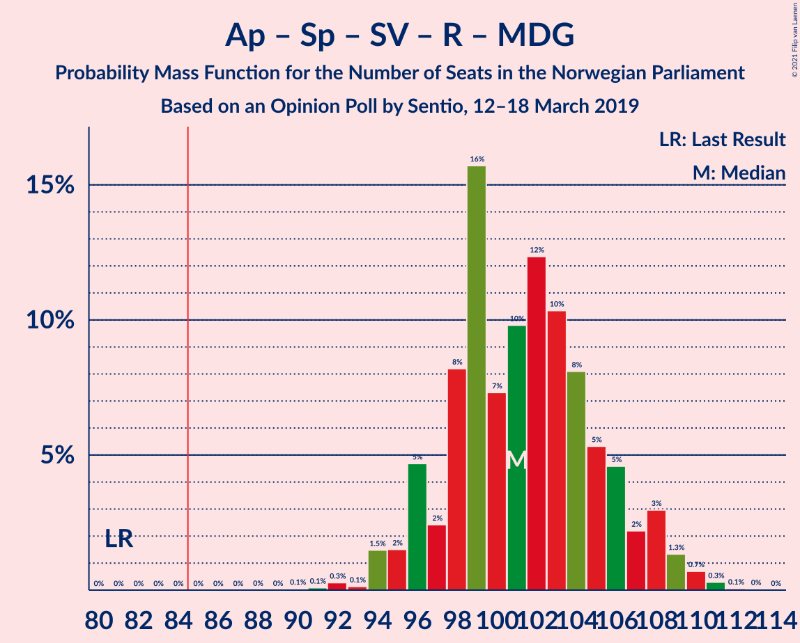

| Number of Seats | Probability | Accumulated | Special Marks |
|:---------------:|:-----------:|:-----------:|:-------------:|
| 81 | 0% | 100% | Last Result |
| 82 | 0% | 100% |  |
| 83 | 0% | 100% |  |
| 84 | 0% | 100% |  |
| 85 | 0% | 100% | Majority |
| 86 | 0% | 100% |  |
| 87 | 0% | 100% |  |
| 88 | 0% | 100% |  |
| 89 | 0% | 100% |  |
| 90 | 0.1% | 100% |  |
| 91 | 0.1% | 99.9% |  |
| 92 | 0.3% | 99.8% |  |
| 93 | 0.1% | 99.6% |  |
| 94 | 1.5% | 99.4% |  |
| 95 | 2% | 98% |  |
| 96 | 5% | 96% |  |
| 97 | 2% | 92% |  |
| 98 | 8% | 89% |  |
| 99 | 16% | 81% |  |
| 100 | 7% | 65% | Median |
| 101 | 10% | 58% |  |
| 102 | 12% | 48% |  |
| 103 | 10% | 36% |  |
| 104 | 8% | 26% |  |
| 105 | 5% | 18% |  |
| 106 | 5% | 12% |  |
| 107 | 2% | 8% |  |
| 108 | 3% | 5% |  |
| 109 | 1.3% | 2% |  |
| 110 | 0.7% | 1.1% |  |
| 111 | 0.3% | 0.4% |  |
| 112 | 0.1% | 0.1% |  |
| 113 | 0% | 0% |  |

### Arbeiderpartiet – Senterpartiet – Sosialistisk Venstreparti – Rødt

| Number of Seats | Probability | Accumulated | Special Marks |
|:---------------:|:-----------:|:-----------:|:-------------:|
| 80 | 0% | 100% | Last Result |
| 81 | 0% | 100% |  |
| 82 | 0% | 100% |  |
| 83 | 0% | 100% |  |
| 84 | 0% | 100% |  |
| 85 | 0% | 100% | Majority |
| 86 | 0% | 100% |  |
| 87 | 0% | 100% |  |
| 88 | 0% | 100% |  |
| 89 | 0.1% | 99.9% |  |
| 90 | 0.3% | 99.8% |  |
| 91 | 0.8% | 99.5% |  |
| 92 | 3% | 98.7% |  |
| 93 | 2% | 96% |  |
| 94 | 4% | 94% |  |
| 95 | 4% | 90% |  |
| 96 | 7% | 86% |  |
| 97 | 11% | 80% |  |
| 98 | 13% | 69% | Median |
| 99 | 9% | 56% |  |
| 100 | 13% | 47% |  |
| 101 | 9% | 34% |  |
| 102 | 8% | 25% |  |
| 103 | 9% | 17% |  |
| 104 | 3% | 9% |  |
| 105 | 3% | 6% |  |
| 106 | 2% | 3% |  |
| 107 | 0.5% | 0.9% |  |
| 108 | 0.2% | 0.4% |  |
| 109 | 0.1% | 0.1% |  |
| 110 | 0% | 0% |  |

### Arbeiderpartiet – Senterpartiet – Sosialistisk Venstreparti – Miljøpartiet De Grønne – Kristelig Folkeparti

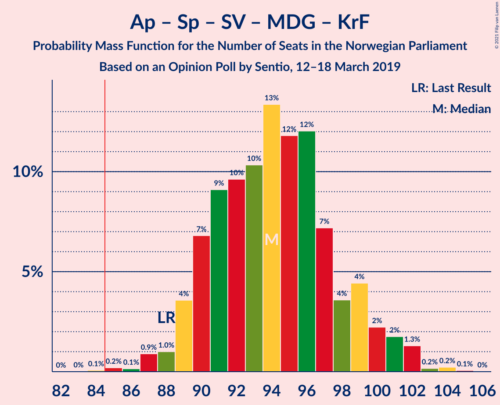

| Number of Seats | Probability | Accumulated | Special Marks |
|:---------------:|:-----------:|:-----------:|:-------------:|
| 84 | 0.1% | 100% |  |
| 85 | 0.2% | 99.9% | Majority |
| 86 | 0.1% | 99.7% |  |
| 87 | 0.9% | 99.6% |  |
| 88 | 1.0% | 98.7% | Last Result |
| 89 | 4% | 98% |  |
| 90 | 7% | 94% |  |
| 91 | 9% | 87% |  |
| 92 | 10% | 78% | Median |
| 93 | 10% | 69% |  |
| 94 | 13% | 58% |  |
| 95 | 12% | 45% |  |
| 96 | 12% | 33% |  |
| 97 | 7% | 21% |  |
| 98 | 4% | 14% |  |
| 99 | 4% | 10% |  |
| 100 | 2% | 6% |  |
| 101 | 2% | 4% |  |
| 102 | 1.3% | 2% |  |
| 103 | 0.2% | 0.5% |  |
| 104 | 0.2% | 0.3% |  |
| 105 | 0.1% | 0.1% |  |
| 106 | 0% | 0% |  |

### Høyre – Senterpartiet – Fremskrittspartiet – Kristelig Folkeparti – Venstre

| Number of Seats | Probability | Accumulated | Special Marks |
|:---------------:|:-----------:|:-----------:|:-------------:|
| 80 | 0.1% | 100% |  |
| 81 | 0% | 99.9% |  |
| 82 | 0.3% | 99.9% |  |
| 83 | 0.2% | 99.6% |  |
| 84 | 0.5% | 99.4% |  |
| 85 | 0.5% | 98.9% | Majority |
| 86 | 2% | 98% |  |
| 87 | 2% | 96% |  |
| 88 | 4% | 95% |  |
| 89 | 3% | 91% |  |
| 90 | 5% | 88% |  |
| 91 | 6% | 83% |  |
| 92 | 10% | 78% |  |
| 93 | 8% | 68% | Median |
| 94 | 10% | 60% |  |
| 95 | 13% | 50% |  |
| 96 | 11% | 37% |  |
| 97 | 8% | 26% |  |
| 98 | 6% | 18% |  |
| 99 | 7% | 12% |  |
| 100 | 2% | 4% |  |
| 101 | 0.8% | 3% |  |
| 102 | 0.7% | 2% |  |
| 103 | 0.7% | 1.0% |  |
| 104 | 0.2% | 0.3% |  |
| 105 | 0.1% | 0.1% |  |
| 106 | 0% | 0% |  |
| 107 | 0% | 0% | Last Result |

### Arbeiderpartiet – Senterpartiet – Sosialistisk Venstreparti – Miljøpartiet De Grønne

| Number of Seats | Probability | Accumulated | Special Marks |
|:---------------:|:-----------:|:-----------:|:-------------:|
| 80 | 0% | 100% | Last Result |
| 81 | 0.1% | 100% |  |
| 82 | 0.1% | 99.9% |  |
| 83 | 0.3% | 99.7% |  |
| 84 | 0.4% | 99.5% |  |
| 85 | 2% | 99.1% | Majority |
| 86 | 3% | 97% |  |
| 87 | 3% | 94% |  |
| 88 | 8% | 92% |  |
| 89 | 7% | 84% |  |
| 90 | 9% | 76% |  |
| 91 | 12% | 67% | Median |
| 92 | 12% | 55% |  |
| 93 | 11% | 43% |  |
| 94 | 11% | 32% |  |
| 95 | 8% | 21% |  |
| 96 | 5% | 13% |  |
| 97 | 2% | 8% |  |
| 98 | 2% | 6% |  |
| 99 | 2% | 4% |  |
| 100 | 0.6% | 1.5% |  |
| 101 | 0.6% | 0.9% |  |
| 102 | 0.2% | 0.3% |  |
| 103 | 0.1% | 0.1% |  |
| 104 | 0% | 0% |  |

### Arbeiderpartiet – Senterpartiet – Sosialistisk Venstreparti

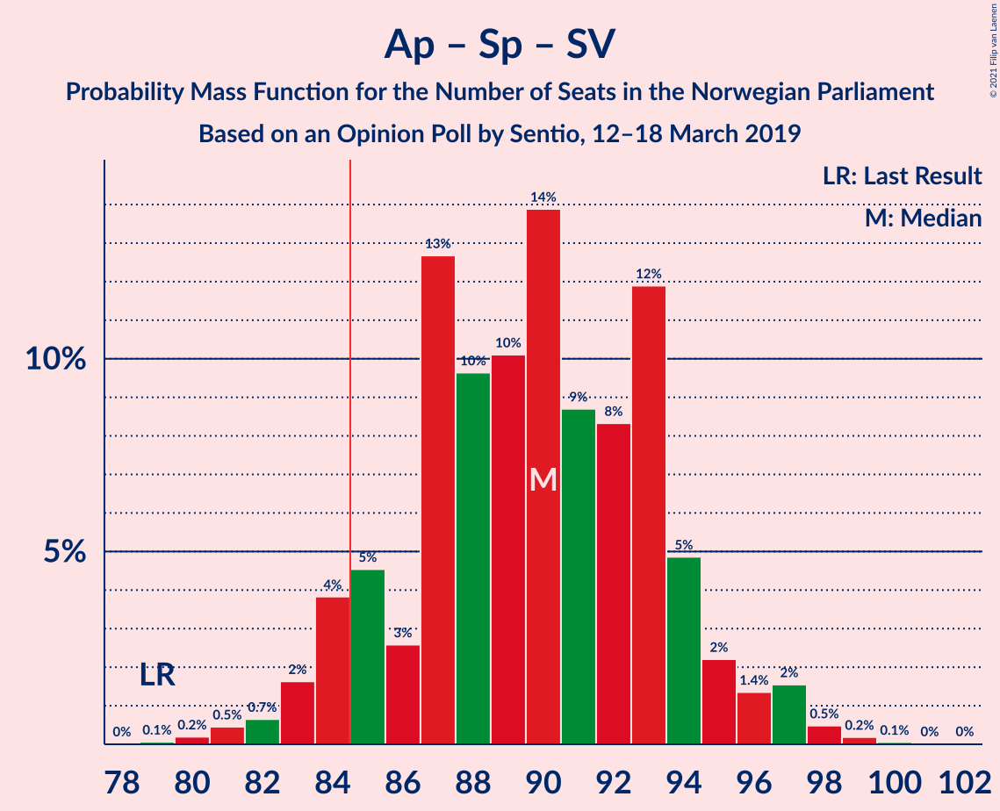

| Number of Seats | Probability | Accumulated | Special Marks |
|:---------------:|:-----------:|:-----------:|:-------------:|
| 79 | 0.1% | 100% | Last Result |
| 80 | 0.2% | 99.9% |  |
| 81 | 0.5% | 99.7% |  |
| 82 | 0.7% | 99.2% |  |
| 83 | 2% | 98.6% |  |
| 84 | 4% | 97% |  |
| 85 | 5% | 93% | Majority |
| 86 | 3% | 89% |  |
| 87 | 13% | 86% |  |
| 88 | 10% | 73% |  |
| 89 | 10% | 64% | Median |
| 90 | 14% | 54% |  |
| 91 | 9% | 40% |  |
| 92 | 8% | 31% |  |
| 93 | 12% | 23% |  |
| 94 | 5% | 11% |  |
| 95 | 2% | 6% |  |
| 96 | 1.4% | 4% |  |
| 97 | 2% | 2% |  |
| 98 | 0.5% | 0.8% |  |
| 99 | 0.2% | 0.3% |  |
| 100 | 0.1% | 0.1% |  |
| 101 | 0% | 0.1% |  |
| 102 | 0% | 0% |  |

### Arbeiderpartiet – Senterpartiet – Miljøpartiet De Grønne – Kristelig Folkeparti

| Number of Seats | Probability | Accumulated | Special Marks |
|:---------------:|:-----------:|:-----------:|:-------------:|
| 71 | 0.1% | 100% |  |
| 72 | 0.3% | 99.9% |  |
| 73 | 0.9% | 99.6% |  |
| 74 | 0.5% | 98.8% |  |
| 75 | 0.6% | 98% |  |
| 76 | 3% | 98% |  |
| 77 | 10% | 95% | Last Result |
| 78 | 9% | 85% |  |
| 79 | 11% | 76% | Median |
| 80 | 15% | 65% |  |
| 81 | 10% | 50% |  |
| 82 | 7% | 40% |  |
| 83 | 11% | 33% |  |
| 84 | 6% | 23% |  |
| 85 | 7% | 17% | Majority |
| 86 | 2% | 9% |  |
| 87 | 3% | 7% |  |
| 88 | 2% | 4% |  |
| 89 | 0.8% | 2% |  |
| 90 | 0.5% | 1.0% |  |
| 91 | 0.3% | 0.5% |  |
| 92 | 0.1% | 0.2% |  |
| 93 | 0% | 0.1% |  |
| 94 | 0% | 0% |  |

### Arbeiderpartiet – Senterpartiet – Kristelig Folkeparti

| Number of Seats | Probability | Accumulated | Special Marks |
|:---------------:|:-----------:|:-----------:|:-------------:|
| 68 | 0.1% | 100% |  |
| 69 | 0.2% | 99.9% |  |
| 70 | 0.5% | 99.7% |  |
| 71 | 0.8% | 99.2% |  |
| 72 | 0.7% | 98% |  |
| 73 | 1.3% | 98% |  |
| 74 | 2% | 96% |  |
| 75 | 8% | 95% |  |
| 76 | 13% | 87% | Last Result |
| 77 | 14% | 74% | Median |
| 78 | 13% | 60% |  |
| 79 | 14% | 47% |  |
| 80 | 5% | 34% |  |
| 81 | 5% | 29% |  |
| 82 | 7% | 24% |  |
| 83 | 9% | 18% |  |
| 84 | 3% | 9% |  |
| 85 | 2% | 6% | Majority |
| 86 | 2% | 3% |  |
| 87 | 0.6% | 1.2% |  |
| 88 | 0.3% | 0.6% |  |
| 89 | 0.2% | 0.3% |  |
| 90 | 0.1% | 0.1% |  |
| 91 | 0% | 0% |  |

### Arbeiderpartiet – Senterpartiet

| Number of Seats | Probability | Accumulated | Special Marks |
|:---------------:|:-----------:|:-----------:|:-------------:|
| 66 | 0% | 100% |  |
| 67 | 0.2% | 99.9% |  |
| 68 | 0.5% | 99.8% | Last Result |
| 69 | 0.6% | 99.3% |  |
| 70 | 2% | 98.7% |  |
| 71 | 3% | 97% |  |
| 72 | 6% | 94% |  |
| 73 | 5% | 88% |  |
| 74 | 12% | 83% |  |
| 75 | 10% | 71% |  |
| 76 | 12% | 61% | Median |
| 77 | 9% | 49% |  |
| 78 | 14% | 40% |  |
| 79 | 6% | 26% |  |
| 80 | 5% | 20% |  |
| 81 | 6% | 15% |  |
| 82 | 5% | 9% |  |
| 83 | 1.3% | 3% |  |
| 84 | 1.0% | 2% |  |
| 85 | 0.7% | 0.9% | Majority |
| 86 | 0.2% | 0.2% |  |
| 87 | 0% | 0.1% |  |
| 88 | 0% | 0% |  |

### Arbeiderpartiet – Sosialistisk Venstreparti – Rødt – Miljøpartiet De Grønne

| Number of Seats | Probability | Accumulated | Special Marks |
|:---------------:|:-----------:|:-----------:|:-------------:|
| 62 | 0% | 100% | Last Result |
| 63 | 0% | 100% |  |
| 64 | 0.1% | 100% |  |
| 65 | 0.2% | 99.9% |  |
| 66 | 0.7% | 99.7% |  |
| 67 | 0.7% | 99.0% |  |
| 68 | 0.8% | 98% |  |
| 69 | 2% | 97% |  |
| 70 | 7% | 96% |  |
| 71 | 6% | 88% |  |
| 72 | 8% | 82% |  |
| 73 | 11% | 74% |  |
| 74 | 13% | 63% | Median |
| 75 | 10% | 50% |  |
| 76 | 8% | 40% |  |
| 77 | 10% | 32% |  |
| 78 | 6% | 22% |  |
| 79 | 5% | 17% |  |
| 80 | 3% | 12% |  |
| 81 | 4% | 9% |  |
| 82 | 2% | 5% |  |
| 83 | 2% | 4% |  |
| 84 | 0.5% | 2% |  |
| 85 | 0.5% | 1.1% | Majority |
| 86 | 0.2% | 0.6% |  |
| 87 | 0.3% | 0.4% |  |
| 88 | 0% | 0.1% |  |
| 89 | 0.1% | 0.1% |  |
| 90 | 0% | 0% |  |

### Høyre – Fremskrittspartiet – Miljøpartiet De Grønne – Kristelig Folkeparti – Venstre

| Number of Seats | Probability | Accumulated | Special Marks |
|:---------------:|:-----------:|:-----------:|:-------------:|
| 60 | 0.1% | 100% |  |
| 61 | 0.2% | 99.9% |  |
| 62 | 0.5% | 99.6% |  |
| 63 | 2% | 99.1% |  |
| 64 | 3% | 97% |  |
| 65 | 3% | 94% |  |
| 66 | 9% | 91% |  |
| 67 | 8% | 83% |  |
| 68 | 9% | 75% |  |
| 69 | 13% | 66% | Median |
| 70 | 9% | 53% |  |
| 71 | 13% | 44% |  |
| 72 | 11% | 31% |  |
| 73 | 7% | 20% |  |
| 74 | 4% | 14% |  |
| 75 | 4% | 10% |  |
| 76 | 2% | 6% |  |
| 77 | 3% | 4% |  |
| 78 | 0.8% | 1.3% |  |
| 79 | 0.3% | 0.5% |  |
| 80 | 0.1% | 0.2% |  |
| 81 | 0% | 0.1% |  |
| 82 | 0% | 0% |  |
| 83 | 0% | 0% |  |
| 84 | 0% | 0% |  |
| 85 | 0% | 0% | Majority |
| 86 | 0% | 0% |  |
| 87 | 0% | 0% |  |
| 88 | 0% | 0% |  |
| 89 | 0% | 0% | Last Result |

### Høyre – Fremskrittspartiet – Kristelig Folkeparti – Venstre

| Number of Seats | Probability | Accumulated | Special Marks |
|:---------------:|:-----------:|:-----------:|:-------------:|
| 57 | 0.1% | 100% |  |
| 58 | 0.3% | 99.9% |  |
| 59 | 0.7% | 99.6% |  |
| 60 | 1.3% | 98.9% |  |
| 61 | 3% | 98% |  |
| 62 | 2% | 95% |  |
| 63 | 5% | 92% |  |
| 64 | 5% | 88% |  |
| 65 | 8% | 82% |  |
| 66 | 10% | 74% |  |
| 67 | 12% | 64% | Median |
| 68 | 10% | 52% |  |
| 69 | 7% | 42% |  |
| 70 | 16% | 35% |  |
| 71 | 8% | 19% |  |
| 72 | 2% | 11% |  |
| 73 | 5% | 8% |  |
| 74 | 2% | 4% |  |
| 75 | 1.5% | 2% |  |
| 76 | 0.1% | 0.6% |  |
| 77 | 0.3% | 0.4% |  |
| 78 | 0.1% | 0.2% |  |
| 79 | 0.1% | 0.1% |  |
| 80 | 0% | 0% |  |
| 81 | 0% | 0% |  |
| 82 | 0% | 0% |  |
| 83 | 0% | 0% |  |
| 84 | 0% | 0% |  |
| 85 | 0% | 0% | Majority |
| 86 | 0% | 0% |  |
| 87 | 0% | 0% |  |
| 88 | 0% | 0% | Last Result |

### Høyre – Fremskrittspartiet – Venstre

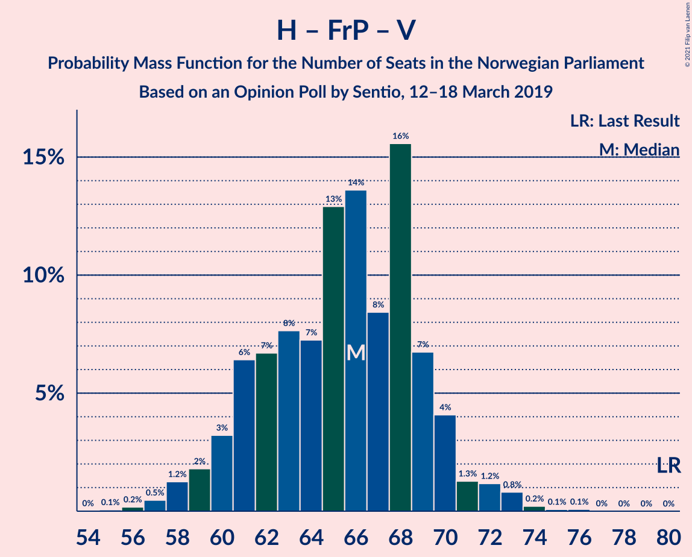

| Number of Seats | Probability | Accumulated | Special Marks |
|:---------------:|:-----------:|:-----------:|:-------------:|
| 55 | 0.1% | 100% |  |
| 56 | 0.2% | 99.9% |  |
| 57 | 0.5% | 99.7% |  |
| 58 | 1.2% | 99.3% |  |
| 59 | 2% | 98% |  |
| 60 | 3% | 96% |  |
| 61 | 6% | 93% |  |
| 62 | 7% | 87% |  |
| 63 | 8% | 80% |  |
| 64 | 7% | 72% |  |
| 65 | 13% | 65% |  |
| 66 | 14% | 52% | Median |
| 67 | 8% | 38% |  |
| 68 | 16% | 30% |  |
| 69 | 7% | 14% |  |
| 70 | 4% | 8% |  |
| 71 | 1.3% | 4% |  |
| 72 | 1.2% | 2% |  |
| 73 | 0.8% | 1.2% |  |
| 74 | 0.2% | 0.4% |  |
| 75 | 0.1% | 0.2% |  |
| 76 | 0.1% | 0.1% |  |
| 77 | 0% | 0% |  |
| 78 | 0% | 0% |  |
| 79 | 0% | 0% |  |
| 80 | 0% | 0% | Last Result |

### Høyre – Fremskrittspartiet

| Number of Seats | Probability | Accumulated | Special Marks |
|:---------------:|:-----------:|:-----------:|:-------------:|
| 54 | 0.1% | 100% |  |
| 55 | 0.2% | 99.8% |  |
| 56 | 0.5% | 99.6% |  |
| 57 | 2% | 99.2% |  |
| 58 | 3% | 98% |  |
| 59 | 4% | 95% |  |
| 60 | 6% | 91% |  |
| 61 | 9% | 85% |  |
| 62 | 8% | 77% |  |
| 63 | 11% | 69% |  |
| 64 | 10% | 58% | Median |
| 65 | 13% | 48% |  |
| 66 | 14% | 35% |  |
| 67 | 9% | 21% |  |
| 68 | 6% | 12% |  |
| 69 | 2% | 6% |  |
| 70 | 3% | 4% |  |
| 71 | 0.3% | 1.3% |  |
| 72 | 0.7% | 1.0% | Last Result |
| 73 | 0.2% | 0.3% |  |
| 74 | 0.1% | 0.1% |  |
| 75 | 0% | 0% |  |

### Arbeiderpartiet – Sosialistisk Venstreparti

| Number of Seats | Probability | Accumulated | Special Marks |
|:---------------:|:-----------:|:-----------:|:-------------:|
| 54 | 0.3% | 100% |  |
| 55 | 0.3% | 99.7% |  |
| 56 | 1.2% | 99.4% |  |
| 57 | 1.4% | 98% |  |
| 58 | 2% | 97% |  |
| 59 | 6% | 95% |  |
| 60 | 10% | 88% | Last Result |
| 61 | 12% | 79% |  |
| 62 | 7% | 66% |  |
| 63 | 10% | 60% | Median |
| 64 | 16% | 50% |  |
| 65 | 9% | 34% |  |
| 66 | 6% | 25% |  |
| 67 | 9% | 19% |  |
| 68 | 4% | 9% |  |
| 69 | 3% | 6% |  |
| 70 | 1.3% | 3% |  |
| 71 | 0.8% | 1.2% |  |
| 72 | 0.3% | 0.4% |  |
| 73 | 0% | 0.1% |  |
| 74 | 0% | 0% |  |

### Høyre – Kristelig Folkeparti – Venstre

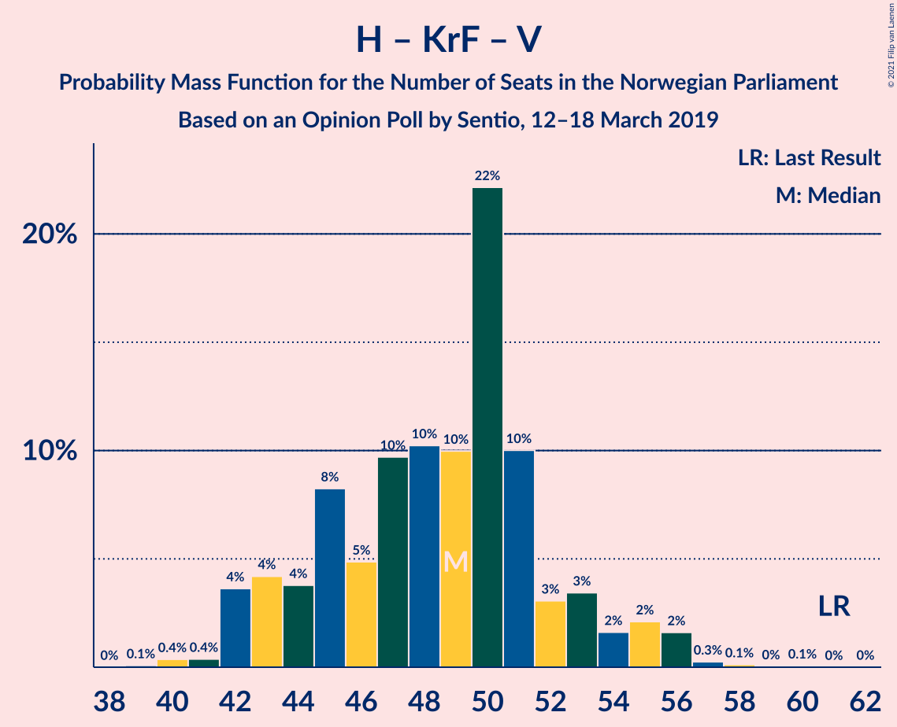

| Number of Seats | Probability | Accumulated | Special Marks |
|:---------------:|:-----------:|:-----------:|:-------------:|
| 39 | 0.1% | 100% |  |
| 40 | 0.4% | 99.9% |  |
| 41 | 0.4% | 99.5% |  |
| 42 | 4% | 99.2% |  |
| 43 | 4% | 96% |  |
| 44 | 4% | 91% |  |
| 45 | 8% | 88% |  |
| 46 | 5% | 79% |  |
| 47 | 10% | 74% |  |
| 48 | 10% | 65% | Median |
| 49 | 10% | 54% |  |
| 50 | 22% | 45% |  |
| 51 | 10% | 22% |  |
| 52 | 3% | 12% |  |
| 53 | 3% | 9% |  |
| 54 | 2% | 6% |  |
| 55 | 2% | 4% |  |
| 56 | 2% | 2% |  |
| 57 | 0.3% | 0.5% |  |
| 58 | 0.1% | 0.2% |  |
| 59 | 0% | 0.1% |  |
| 60 | 0.1% | 0.1% |  |
| 61 | 0% | 0% | Last Result |

### Senterpartiet – Kristelig Folkeparti – Venstre

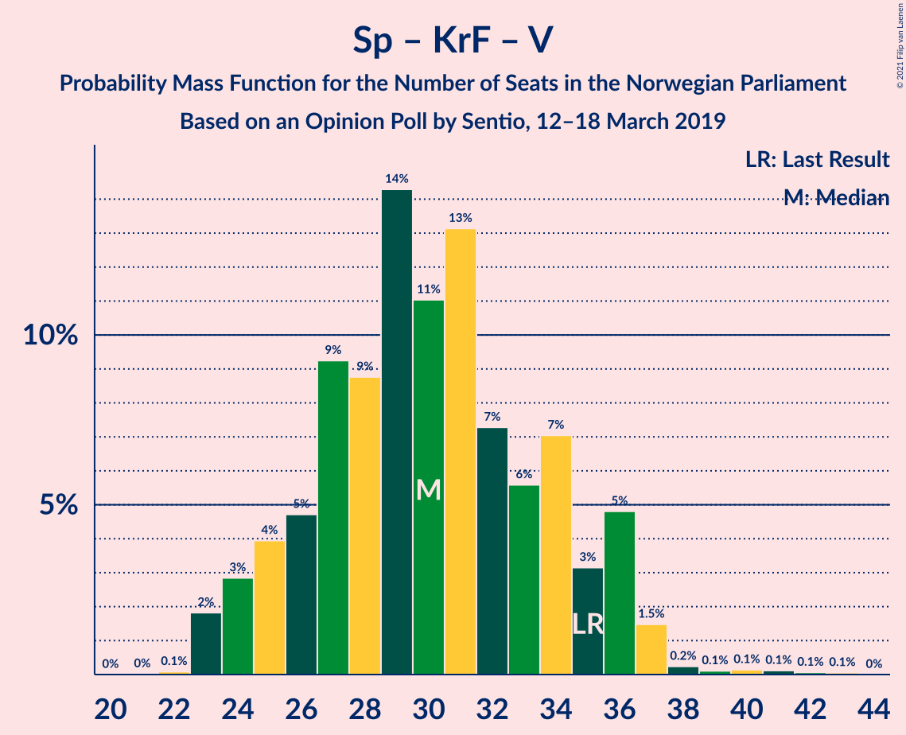

| Number of Seats | Probability | Accumulated | Special Marks |
|:---------------:|:-----------:|:-----------:|:-------------:|
| 22 | 0.1% | 100% |  |
| 23 | 2% | 99.9% |  |
| 24 | 3% | 98% |  |
| 25 | 4% | 95% |  |
| 26 | 5% | 91% |  |
| 27 | 9% | 87% |  |
| 28 | 9% | 77% |  |
| 29 | 14% | 69% | Median |
| 30 | 11% | 54% |  |
| 31 | 13% | 43% |  |
| 32 | 7% | 30% |  |
| 33 | 6% | 23% |  |
| 34 | 7% | 17% |  |
| 35 | 3% | 10% | Last Result |
| 36 | 5% | 7% |  |
| 37 | 1.5% | 2% |  |
| 38 | 0.2% | 0.7% |  |
| 39 | 0.1% | 0.5% |  |
| 40 | 0.1% | 0.4% |  |
| 41 | 0.1% | 0.2% |  |
| 42 | 0.1% | 0.1% |  |
| 43 | 0.1% | 0.1% |  |
| 44 | 0% | 0% |  |

## Technical Information

### Opinion Poll

+ **Polling firm:** Sentio
+ **Commissioner(s):** —
+ **Fieldwork period:** 12–18 March 2019

### Calculations

+ **Sample size:** 1000
+ **Simulations done:** 524,288
+ **Error estimate:** 3.61%

