# Opinion Poll by Ipsos MMI, 18–20 March 2019

<a href="#voting-intentions">Voting Intentions</a> | <a href="#seats">Seats</a> | <a href="#coalitions">Coalitions</a> | <a href="#technical-information">Technical Information</a>

## Voting Intentions

### Confidence Intervals

| Party | Last Result | Poll Result | 80% Confidence Interval | 90% Confidence Interval | 95% Confidence Interval | 99% Confidence Interval |
|:-----:|:-----------:|:-----------:|:-----------------------:|:-----------------------:|:-----------------------:|:-----------------------:|
| Arbeiderpartiet | 27.4% | 28.8% | 26.9–30.7% |26.4–31.3% |26.0–31.7% |25.1–32.7% |
| Høyre | 25.0% | 21.3% | 19.7–23.1% |19.2–23.6% |18.8–24.1% |18.1–25.0% |
| Senterpartiet | 10.3% | 14.4% | 13.0–16.0% |12.7–16.4% |12.3–16.8% |11.7–17.6% |
| Fremskrittspartiet | 15.2% | 11.7% | 10.4–13.1% |10.1–13.5% |9.8–13.9% |9.2–14.6% |
| Sosialistisk Venstreparti | 6.0% | 7.0% | 6.0–8.2% |5.8–8.5% |5.5–8.8% |5.1–9.4% |
| Rødt | 2.4% | 5.6% | 4.8–6.7% |4.5–7.0% |4.3–7.3% |3.9–7.8% |
| Miljøpartiet De Grønne | 3.2% | 3.6% | 2.9–4.5% |2.7–4.8% |2.6–5.0% |2.3–5.5% |
| Kristelig Folkeparti | 4.2% | 2.5% | 2.0–3.3% |1.8–3.6% |1.7–3.8% |1.5–4.2% |
| Venstre | 4.4% | 2.0% | 1.5–2.7% |1.4–3.0% |1.3–3.1% |1.1–3.5% |

*Note:* The poll result column reflects the actual value used in the calculations. Published results may vary slightly, and in addition be rounded to fewer digits.

## Seats

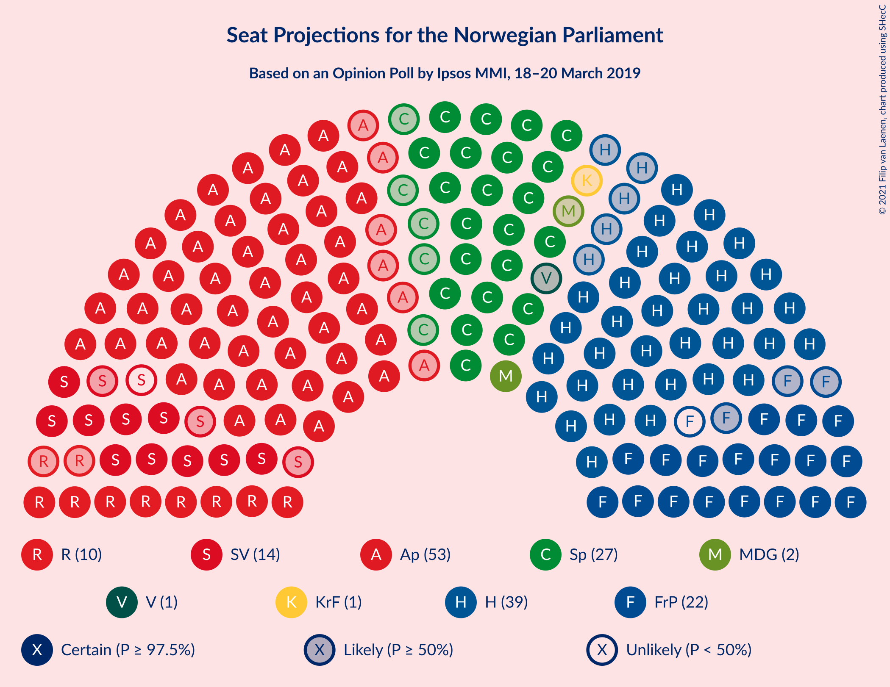

### Confidence Intervals

| Party | Last Result | Median | 80% Confidence Interval | 90% Confidence Interval | 95% Confidence Interval | 99% Confidence Interval |
|:-----:|:-----------:|:------:|:-----------------------:|:-----------------------:|:-----------------------:|:-----------------------:|
| <a href="#arbeiderpartiet">Arbeiderpartiet</a> | 49 | 54 | 49–58 |48–58 |47–58 |45–60 |
| <a href="#høyre">Høyre</a> | 45 | 39 | 35–42 |34–44 |34–44 |33–47 |
| <a href="#senterpartiet">Senterpartiet</a> | 19 | 26 | 23–29 |23–31 |23–33 |21–34 |
| <a href="#fremskrittspartiet">Fremskrittspartiet</a> | 27 | 21 | 18–24 |18–25 |17–26 |17–27 |
| <a href="#sosialistisk-venstreparti">Sosialistisk Venstreparti</a> | 11 | 13 | 10–15 |10–16 |10–16 |9–17 |
| <a href="#rødt">Rødt</a> | 1 | 11 | 8–13 |8–13 |7–13 |2–15 |
| <a href="#miljøpartiet-de-grønne">Miljøpartiet De Grønne</a> | 1 | 2 | 1–8 |1–9 |1–9 |1–10 |
| <a href="#kristelig-folkeparti">Kristelig Folkeparti</a> | 8 | 1 | 0–2 |0–3 |0–3 |0–8 |
| <a href="#venstre">Venstre</a> | 8 | 1 | 0–2 |0–2 |0–2 |0–2 |

### Arbeiderpartiet

*For a full overview of the results for this party, see the [Arbeiderpartiet](party-arbeiderpartiet.html) page.*

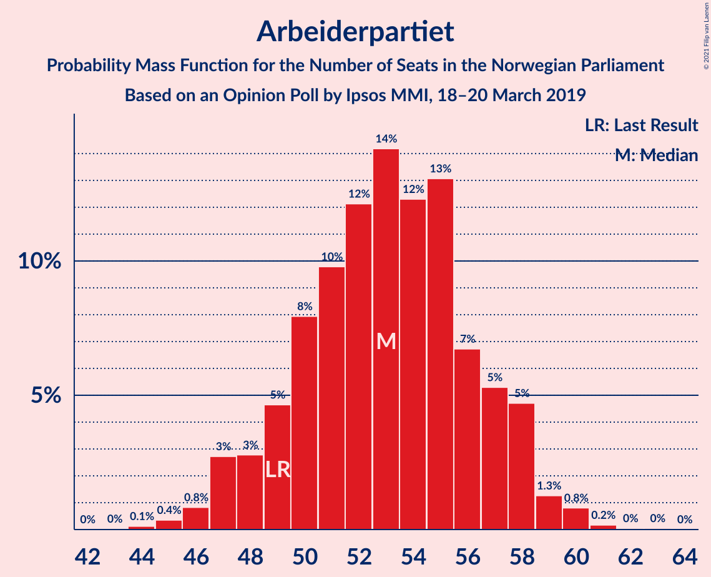

| Number of Seats | Probability | Accumulated | Special Marks |
|:---------------:|:-----------:|:-----------:|:-------------:|
| 44 | 0.2% | 100% |  |
| 45 | 0.4% | 99.8% |  |
| 46 | 2% | 99.3% |  |
| 47 | 1.2% | 98% |  |
| 48 | 3% | 96% |  |
| 49 | 4% | 93% | Last Result |
| 50 | 7% | 88% |  |
| 51 | 10% | 82% |  |
| 52 | 17% | 72% |  |
| 53 | 5% | 55% |  |
| 54 | 25% | 50% | Median |
| 55 | 9% | 25% |  |
| 56 | 2% | 16% |  |
| 57 | 3% | 14% |  |
| 58 | 9% | 10% |  |
| 59 | 0.1% | 2% |  |
| 60 | 1.1% | 1.4% |  |
| 61 | 0.1% | 0.3% |  |
| 62 | 0% | 0.1% |  |
| 63 | 0.1% | 0.1% |  |
| 64 | 0% | 0% |  |

### Høyre

*For a full overview of the results for this party, see the [Høyre](party-høyre.html) page.*

| Number of Seats | Probability | Accumulated | Special Marks |
|:---------------:|:-----------:|:-----------:|:-------------:|
| 31 | 0.1% | 100% |  |
| 32 | 0.2% | 99.9% |  |
| 33 | 2% | 99.7% |  |
| 34 | 4% | 98% |  |
| 35 | 5% | 94% |  |
| 36 | 9% | 89% |  |
| 37 | 6% | 80% |  |
| 38 | 7% | 74% |  |
| 39 | 27% | 67% | Median |
| 40 | 15% | 41% |  |
| 41 | 10% | 26% |  |
| 42 | 6% | 16% |  |
| 43 | 2% | 9% |  |
| 44 | 6% | 7% |  |
| 45 | 1.0% | 2% | Last Result |
| 46 | 0.2% | 0.7% |  |
| 47 | 0.4% | 0.5% |  |
| 48 | 0.1% | 0.1% |  |
| 49 | 0% | 0% |  |

### Senterpartiet

*For a full overview of the results for this party, see the [Senterpartiet](party-senterpartiet.html) page.*

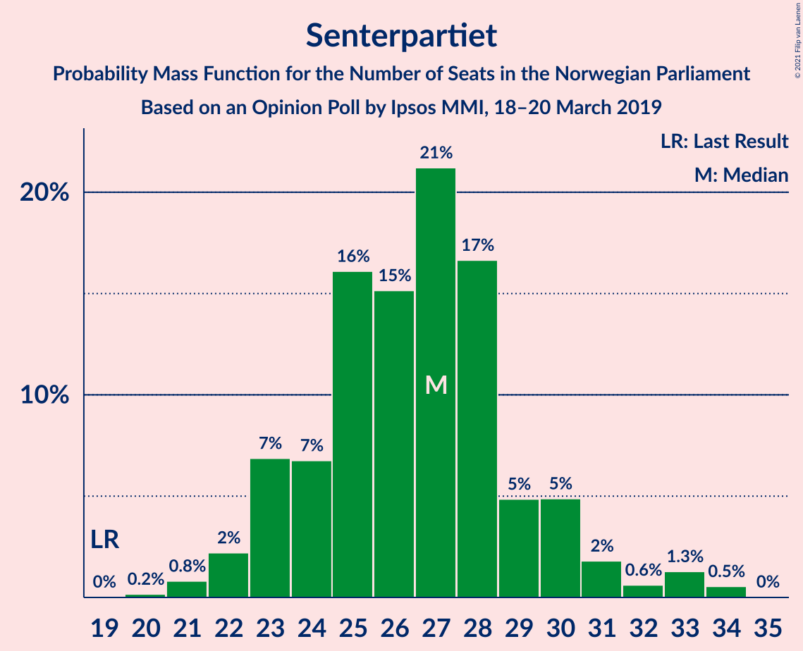

| Number of Seats | Probability | Accumulated | Special Marks |
|:---------------:|:-----------:|:-----------:|:-------------:|
| 19 | 0% | 100% | Last Result |
| 20 | 0.2% | 99.9% |  |
| 21 | 0.9% | 99.8% |  |
| 22 | 0.8% | 98.8% |  |
| 23 | 13% | 98% |  |
| 24 | 4% | 85% |  |
| 25 | 29% | 82% |  |
| 26 | 8% | 53% | Median |
| 27 | 14% | 45% |  |
| 28 | 17% | 31% |  |
| 29 | 5% | 14% |  |
| 30 | 2% | 9% |  |
| 31 | 2% | 7% |  |
| 32 | 2% | 5% |  |
| 33 | 0.4% | 3% |  |
| 34 | 2% | 2% |  |
| 35 | 0% | 0% |  |

### Fremskrittspartiet

*For a full overview of the results for this party, see the [Fremskrittspartiet](party-fremskrittspartiet.html) page.*

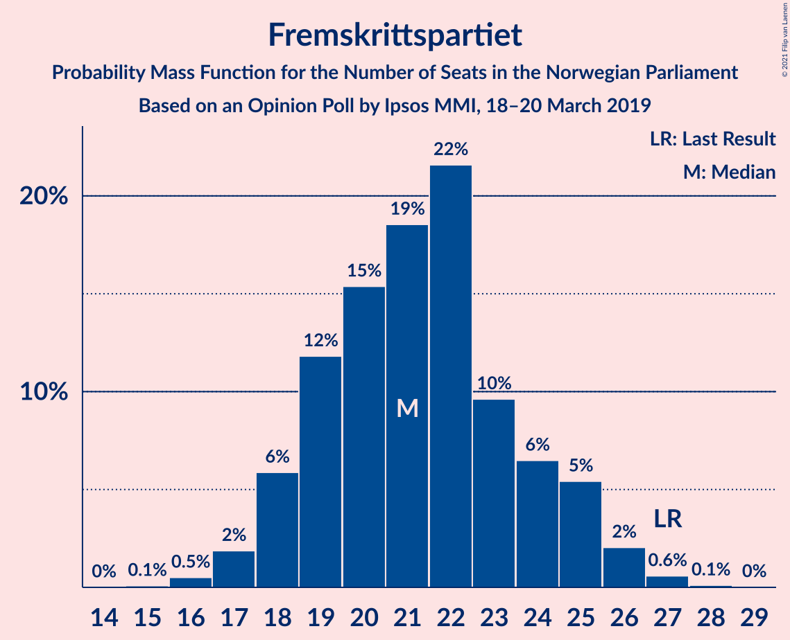

| Number of Seats | Probability | Accumulated | Special Marks |
|:---------------:|:-----------:|:-----------:|:-------------:|
| 15 | 0.1% | 100% |  |
| 16 | 0.3% | 99.9% |  |
| 17 | 2% | 99.6% |  |
| 18 | 7% | 97% |  |
| 19 | 12% | 90% |  |
| 20 | 20% | 78% |  |
| 21 | 28% | 58% | Median |
| 22 | 11% | 31% |  |
| 23 | 5% | 19% |  |
| 24 | 5% | 14% |  |
| 25 | 5% | 9% |  |
| 26 | 2% | 4% |  |
| 27 | 1.3% | 1.5% | Last Result |
| 28 | 0.2% | 0.2% |  |
| 29 | 0% | 0% |  |

### Sosialistisk Venstreparti

*For a full overview of the results for this party, see the [Sosialistisk Venstreparti](party-sosialistiskvenstreparti.html) page.*

| Number of Seats | Probability | Accumulated | Special Marks |
|:---------------:|:-----------:|:-----------:|:-------------:|
| 8 | 0.1% | 100% |  |
| 9 | 1.5% | 99.9% |  |
| 10 | 8% | 98% |  |
| 11 | 18% | 90% | Last Result |
| 12 | 14% | 72% |  |
| 13 | 9% | 58% | Median |
| 14 | 36% | 50% |  |
| 15 | 7% | 14% |  |
| 16 | 6% | 7% |  |
| 17 | 0.5% | 0.9% |  |
| 18 | 0.2% | 0.4% |  |
| 19 | 0.2% | 0.2% |  |
| 20 | 0% | 0% |  |

### Rødt

*For a full overview of the results for this party, see the [Rødt](party-rødt.html) page.*

| Number of Seats | Probability | Accumulated | Special Marks |
|:---------------:|:-----------:|:-----------:|:-------------:|
| 1 | 0% | 100% | Last Result |
| 2 | 0.7% | 100% |  |
| 3 | 0% | 99.3% |  |
| 4 | 0% | 99.3% |  |
| 5 | 0% | 99.3% |  |
| 6 | 0% | 99.3% |  |
| 7 | 3% | 99.3% |  |
| 8 | 8% | 96% |  |
| 9 | 21% | 88% |  |
| 10 | 9% | 67% |  |
| 11 | 17% | 57% | Median |
| 12 | 26% | 40% |  |
| 13 | 12% | 14% |  |
| 14 | 2% | 2% |  |
| 15 | 0.5% | 0.5% |  |
| 16 | 0% | 0% |  |

### Miljøpartiet De Grønne

*For a full overview of the results for this party, see the [Miljøpartiet De Grønne](party-miljøpartietdegrønne.html) page.*

| Number of Seats | Probability | Accumulated | Special Marks |
|:---------------:|:-----------:|:-----------:|:-------------:|
| 1 | 11% | 100% | Last Result |
| 2 | 55% | 89% | Median |
| 3 | 7% | 34% |  |
| 4 | 0.2% | 27% |  |
| 5 | 0% | 27% |  |
| 6 | 0% | 27% |  |
| 7 | 6% | 26% |  |
| 8 | 12% | 21% |  |
| 9 | 8% | 8% |  |
| 10 | 0.5% | 0.6% |  |
| 11 | 0% | 0% |  |

### Kristelig Folkeparti

*For a full overview of the results for this party, see the [Kristelig Folkeparti](party-kristeligfolkeparti.html) page.*

| Number of Seats | Probability | Accumulated | Special Marks |
|:---------------:|:-----------:|:-----------:|:-------------:|
| 0 | 25% | 100% |  |
| 1 | 56% | 75% | Median |
| 2 | 10% | 19% |  |
| 3 | 7% | 8% |  |
| 4 | 0% | 1.0% |  |
| 5 | 0% | 1.0% |  |
| 6 | 0% | 1.0% |  |
| 7 | 0.3% | 1.0% |  |
| 8 | 0.7% | 0.7% | Last Result |
| 9 | 0% | 0% |  |

### Venstre

*For a full overview of the results for this party, see the [Venstre](party-venstre.html) page.*

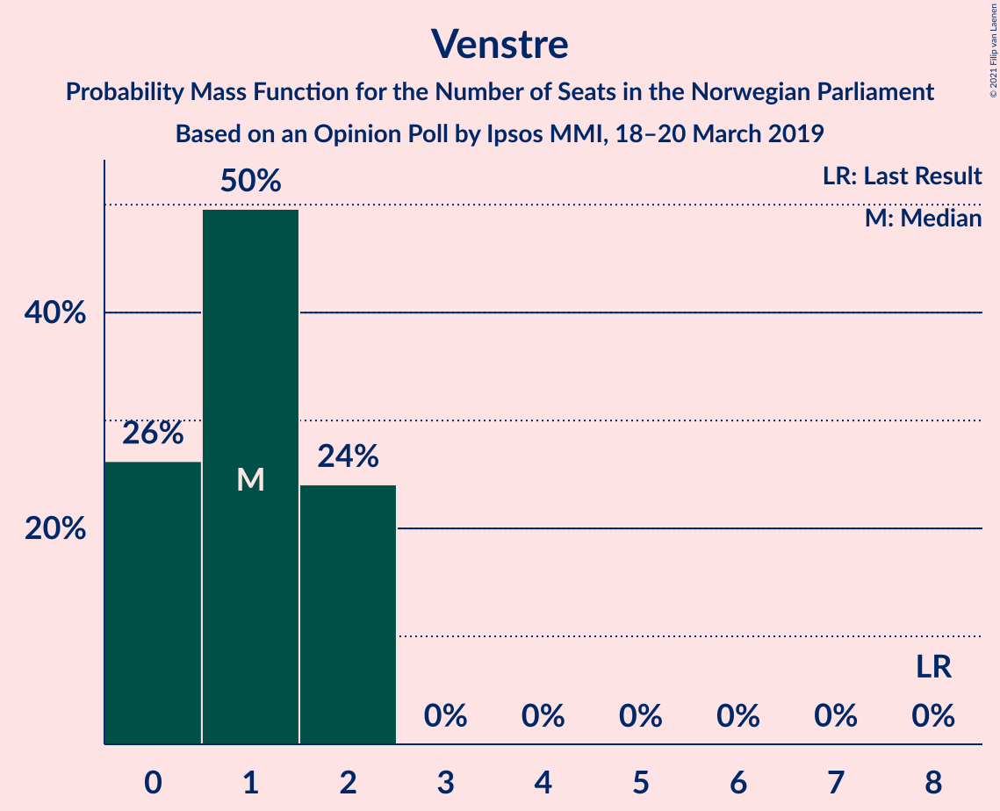

| Number of Seats | Probability | Accumulated | Special Marks |
|:---------------:|:-----------:|:-----------:|:-------------:|
| 0 | 26% | 100% |  |
| 1 | 51% | 74% | Median |
| 2 | 23% | 23% |  |
| 3 | 0% | 0.1% |  |
| 4 | 0% | 0.1% |  |
| 5 | 0% | 0.1% |  |
| 6 | 0% | 0.1% |  |
| 7 | 0% | 0.1% |  |
| 8 | 0% | 0% | Last Result |

## Coalitions

### Confidence Intervals

| Coalition | Last Result | Median | Majority? | 80% Confidence Interval | 90% Confidence Interval | 95% Confidence Interval | 99% Confidence Interval |
|:---------:|:-----------:|:------:|:---------:|:-----------------------:|:-----------------------:|:-----------------------:|:-----------------------:|
| Arbeiderpartiet – Senterpartiet – Sosialistisk Venstreparti – Rødt – Miljøpartiet De Grønne | 81 | 107 | 100% | 101–110 | 100–112 | 99–114 | 98–115 |
| Arbeiderpartiet – Senterpartiet – Sosialistisk Venstreparti – Rødt | 80 | 104 | 100% | 98–107 | 97–108 | 94–109 | 94–111 |
| Arbeiderpartiet – Senterpartiet – Sosialistisk Venstreparti – Miljøpartiet De Grønne – Kristelig Folkeparti | 88 | 96 | 100% | 92–102 | 91–103 | 89–105 | 88–107 |
| Arbeiderpartiet – Senterpartiet – Sosialistisk Venstreparti – Miljøpartiet De Grønne | 80 | 95 | 99.9% | 91–101 | 89–102 | 88–105 | 87–106 |
| Arbeiderpartiet – Senterpartiet – Sosialistisk Venstreparti | 79 | 93 | 99.4% | 87–97 | 86–98 | 85–98 | 84–101 |
| Høyre – Senterpartiet – Fremskrittspartiet – Kristelig Folkeparti – Venstre | 107 | 88 | 87% | 84–94 | 82–94 | 81–97 | 80–97 |
| Arbeiderpartiet – Senterpartiet – Miljøpartiet De Grønne – Kristelig Folkeparti | 77 | 83 | 37% | 79–90 | 77–92 | 77–92 | 76–93 |
| Arbeiderpartiet – Senterpartiet – Kristelig Folkeparti | 76 | 80 | 10% | 76–84 | 75–87 | 75–88 | 72–89 |
| Arbeiderpartiet – Senterpartiet | 68 | 79 | 7% | 75–83 | 74–85 | 74–86 | 71–88 |
| Høyre – Fremskrittspartiet – Miljøpartiet De Grønne – Kristelig Folkeparti – Venstre | 89 | 65 | 0% | 62–71 | 61–72 | 60–75 | 57–75 |
| Arbeiderpartiet – Sosialistisk Venstreparti | 60 | 66 | 0% | 62–70 | 60–72 | 59–72 | 58–73 |
| Høyre – Fremskrittspartiet – Kristelig Folkeparti – Venstre | 88 | 62 | 0% | 58–67 | 56–68 | 55–69 | 54–70 |
| Høyre – Fremskrittspartiet – Venstre | 80 | 61 | 0% | 57–66 | 55–67 | 55–68 | 53–69 |
| Høyre – Fremskrittspartiet | 72 | 60 | 0% | 56–65 | 55–66 | 53–67 | 52–68 |
| Høyre – Kristelig Folkeparti – Venstre | 61 | 41 | 0% | 37–45 | 36–47 | 35–47 | 34–50 |
| Senterpartiet – Kristelig Folkeparti – Venstre | 35 | 28 | 0% | 25–32 | 24–34 | 24–36 | 22–36 |

### Arbeiderpartiet – Senterpartiet – Sosialistisk Venstreparti – Rødt – Miljøpartiet De Grønne

| Number of Seats | Probability | Accumulated | Special Marks |
|:---------------:|:-----------:|:-----------:|:-------------:|
| 81 | 0% | 100% | Last Result |
| 82 | 0% | 100% |  |
| 83 | 0% | 100% |  |
| 84 | 0% | 100% |  |
| 85 | 0% | 100% | Majority |
| 86 | 0% | 100% |  |
| 87 | 0% | 100% |  |
| 88 | 0% | 100% |  |
| 89 | 0% | 100% |  |
| 90 | 0% | 100% |  |
| 91 | 0% | 100% |  |
| 92 | 0% | 100% |  |
| 93 | 0% | 100% |  |
| 94 | 0% | 100% |  |
| 95 | 0% | 99.9% |  |
| 96 | 0.1% | 99.9% |  |
| 97 | 0.3% | 99.8% |  |
| 98 | 1.1% | 99.5% |  |
| 99 | 2% | 98% |  |
| 100 | 3% | 97% |  |
| 101 | 4% | 94% |  |
| 102 | 9% | 90% |  |
| 103 | 5% | 81% |  |
| 104 | 4% | 76% |  |
| 105 | 3% | 72% |  |
| 106 | 6% | 69% | Median |
| 107 | 25% | 63% |  |
| 108 | 10% | 39% |  |
| 109 | 14% | 29% |  |
| 110 | 5% | 15% |  |
| 111 | 3% | 9% |  |
| 112 | 1.1% | 6% |  |
| 113 | 2% | 5% |  |
| 114 | 2% | 3% |  |
| 115 | 1.4% | 2% |  |
| 116 | 0.1% | 0.1% |  |
| 117 | 0% | 0% |  |

### Arbeiderpartiet – Senterpartiet – Sosialistisk Venstreparti – Rødt

| Number of Seats | Probability | Accumulated | Special Marks |
|:---------------:|:-----------:|:-----------:|:-------------:|
| 80 | 0% | 100% | Last Result |
| 81 | 0% | 100% |  |
| 82 | 0% | 100% |  |
| 83 | 0% | 100% |  |
| 84 | 0% | 100% |  |
| 85 | 0% | 100% | Majority |
| 86 | 0% | 100% |  |
| 87 | 0% | 100% |  |
| 88 | 0% | 100% |  |
| 89 | 0% | 100% |  |
| 90 | 0% | 100% |  |
| 91 | 0.1% | 99.9% |  |
| 92 | 0% | 99.9% |  |
| 93 | 0.1% | 99.8% |  |
| 94 | 3% | 99.7% |  |
| 95 | 0.5% | 97% |  |
| 96 | 1.2% | 96% |  |
| 97 | 3% | 95% |  |
| 98 | 6% | 92% |  |
| 99 | 6% | 86% |  |
| 100 | 12% | 80% |  |
| 101 | 4% | 68% |  |
| 102 | 6% | 64% |  |
| 103 | 7% | 57% |  |
| 104 | 4% | 51% | Median |
| 105 | 21% | 47% |  |
| 106 | 8% | 26% |  |
| 107 | 13% | 18% |  |
| 108 | 2% | 5% |  |
| 109 | 2% | 3% |  |
| 110 | 0.5% | 1.0% |  |
| 111 | 0.3% | 0.6% |  |
| 112 | 0.1% | 0.3% |  |
| 113 | 0.2% | 0.2% |  |
| 114 | 0% | 0% |  |

### Arbeiderpartiet – Senterpartiet – Sosialistisk Venstreparti – Miljøpartiet De Grønne – Kristelig Folkeparti

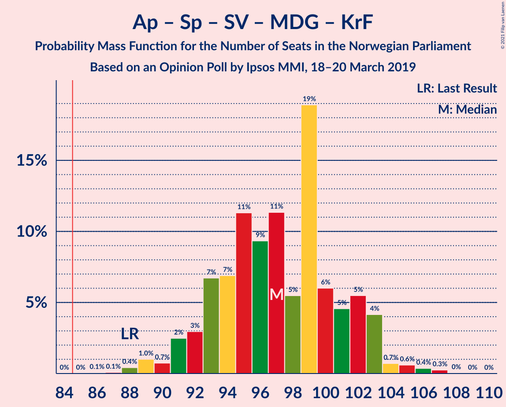

| Number of Seats | Probability | Accumulated | Special Marks |
|:---------------:|:-----------:|:-----------:|:-------------:|
| 86 | 0.1% | 100% |  |
| 87 | 0.1% | 99.8% |  |
| 88 | 0.8% | 99.8% | Last Result |
| 89 | 3% | 98.9% |  |
| 90 | 1.0% | 96% |  |
| 91 | 3% | 95% |  |
| 92 | 3% | 93% |  |
| 93 | 7% | 89% |  |
| 94 | 6% | 82% |  |
| 95 | 4% | 77% |  |
| 96 | 31% | 73% | Median |
| 97 | 5% | 42% |  |
| 98 | 4% | 36% |  |
| 99 | 7% | 32% |  |
| 100 | 5% | 25% |  |
| 101 | 5% | 20% |  |
| 102 | 5% | 14% |  |
| 103 | 5% | 9% |  |
| 104 | 0.5% | 4% |  |
| 105 | 1.3% | 3% |  |
| 106 | 0.3% | 2% |  |
| 107 | 1.4% | 1.5% |  |
| 108 | 0% | 0.1% |  |
| 109 | 0% | 0% |  |

### Arbeiderpartiet – Senterpartiet – Sosialistisk Venstreparti – Miljøpartiet De Grønne

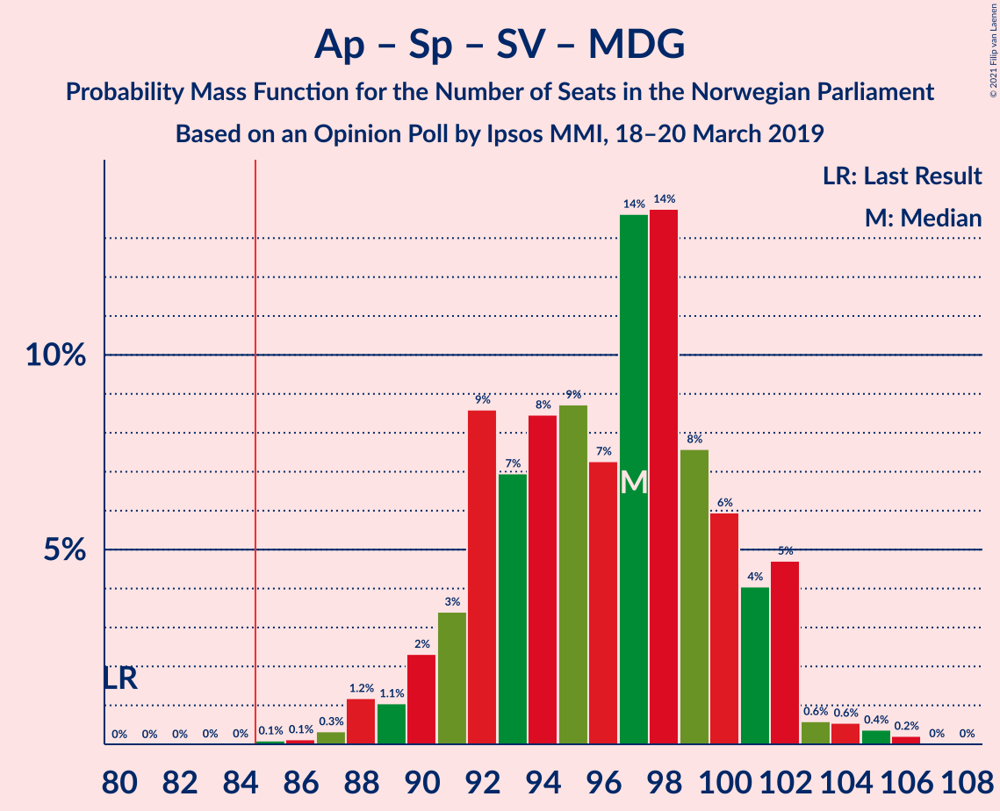

| Number of Seats | Probability | Accumulated | Special Marks |
|:---------------:|:-----------:|:-----------:|:-------------:|
| 80 | 0% | 100% | Last Result |
| 81 | 0% | 100% |  |
| 82 | 0% | 100% |  |
| 83 | 0% | 100% |  |
| 84 | 0% | 100% |  |
| 85 | 0.1% | 99.9% | Majority |
| 86 | 0.1% | 99.8% |  |
| 87 | 0.8% | 99.7% |  |
| 88 | 2% | 98.9% |  |
| 89 | 2% | 97% |  |
| 90 | 3% | 95% |  |
| 91 | 5% | 92% |  |
| 92 | 5% | 87% |  |
| 93 | 7% | 83% |  |
| 94 | 6% | 76% |  |
| 95 | 22% | 70% | Median |
| 96 | 12% | 48% |  |
| 97 | 8% | 37% |  |
| 98 | 5% | 29% |  |
| 99 | 7% | 23% |  |
| 100 | 5% | 17% |  |
| 101 | 3% | 12% |  |
| 102 | 6% | 9% |  |
| 103 | 0.5% | 4% |  |
| 104 | 0.3% | 3% |  |
| 105 | 1.5% | 3% |  |
| 106 | 1.3% | 1.3% |  |
| 107 | 0% | 0% |  |

### Arbeiderpartiet – Senterpartiet – Sosialistisk Venstreparti

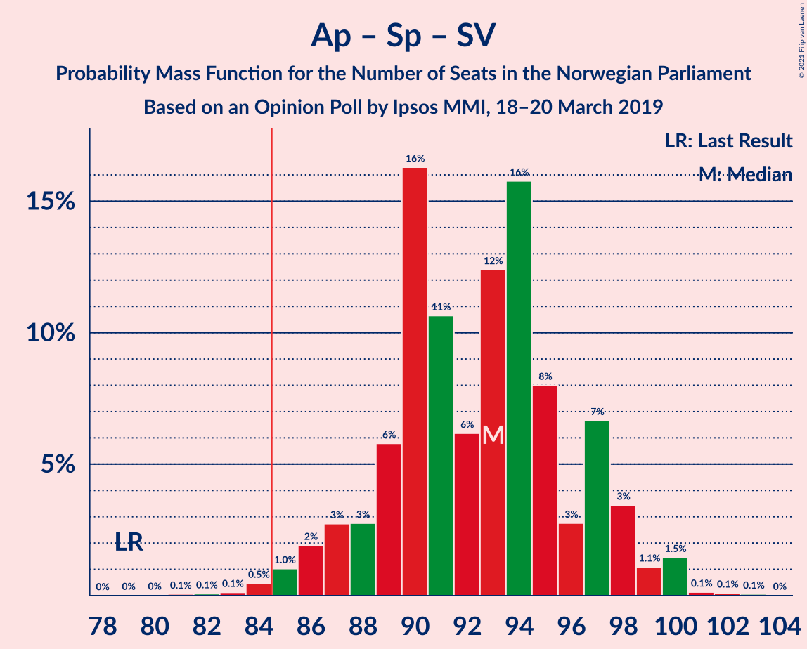

| Number of Seats | Probability | Accumulated | Special Marks |
|:---------------:|:-----------:|:-----------:|:-------------:|
| 79 | 0% | 100% | Last Result |
| 80 | 0.1% | 100% |  |
| 81 | 0.1% | 99.9% |  |
| 82 | 0.1% | 99.9% |  |
| 83 | 0.1% | 99.7% |  |
| 84 | 0.2% | 99.6% |  |
| 85 | 3% | 99.4% | Majority |
| 86 | 2% | 96% |  |
| 87 | 4% | 94% |  |
| 88 | 3% | 89% |  |
| 89 | 8% | 86% |  |
| 90 | 4% | 79% |  |
| 91 | 12% | 75% |  |
| 92 | 4% | 63% |  |
| 93 | 25% | 58% | Median |
| 94 | 14% | 34% |  |
| 95 | 8% | 20% |  |
| 96 | 1.3% | 11% |  |
| 97 | 4% | 10% |  |
| 98 | 4% | 7% |  |
| 99 | 0.8% | 2% |  |
| 100 | 0.7% | 1.3% |  |
| 101 | 0.3% | 0.6% |  |
| 102 | 0% | 0.3% |  |
| 103 | 0.2% | 0.3% |  |
| 104 | 0% | 0% |  |

### Høyre – Senterpartiet – Fremskrittspartiet – Kristelig Folkeparti – Venstre

| Number of Seats | Probability | Accumulated | Special Marks |
|:---------------:|:-----------:|:-----------:|:-------------:|
| 77 | 0.1% | 100% |  |
| 78 | 0.1% | 99.9% |  |
| 79 | 0.1% | 99.7% |  |
| 80 | 2% | 99.6% |  |
| 81 | 1.0% | 98% |  |
| 82 | 4% | 97% |  |
| 83 | 1.0% | 93% |  |
| 84 | 5% | 92% |  |
| 85 | 4% | 87% | Majority |
| 86 | 7% | 82% |  |
| 87 | 23% | 75% |  |
| 88 | 14% | 53% | Median |
| 89 | 5% | 39% |  |
| 90 | 4% | 34% |  |
| 91 | 5% | 30% |  |
| 92 | 10% | 25% |  |
| 93 | 5% | 15% |  |
| 94 | 6% | 11% |  |
| 95 | 2% | 5% |  |
| 96 | 0.2% | 3% |  |
| 97 | 3% | 3% |  |
| 98 | 0% | 0.1% |  |
| 99 | 0% | 0.1% |  |
| 100 | 0% | 0% |  |
| 101 | 0% | 0% |  |
| 102 | 0% | 0% |  |
| 103 | 0% | 0% |  |
| 104 | 0% | 0% |  |
| 105 | 0% | 0% |  |
| 106 | 0% | 0% |  |
| 107 | 0% | 0% | Last Result |

### Arbeiderpartiet – Senterpartiet – Miljøpartiet De Grønne – Kristelig Folkeparti

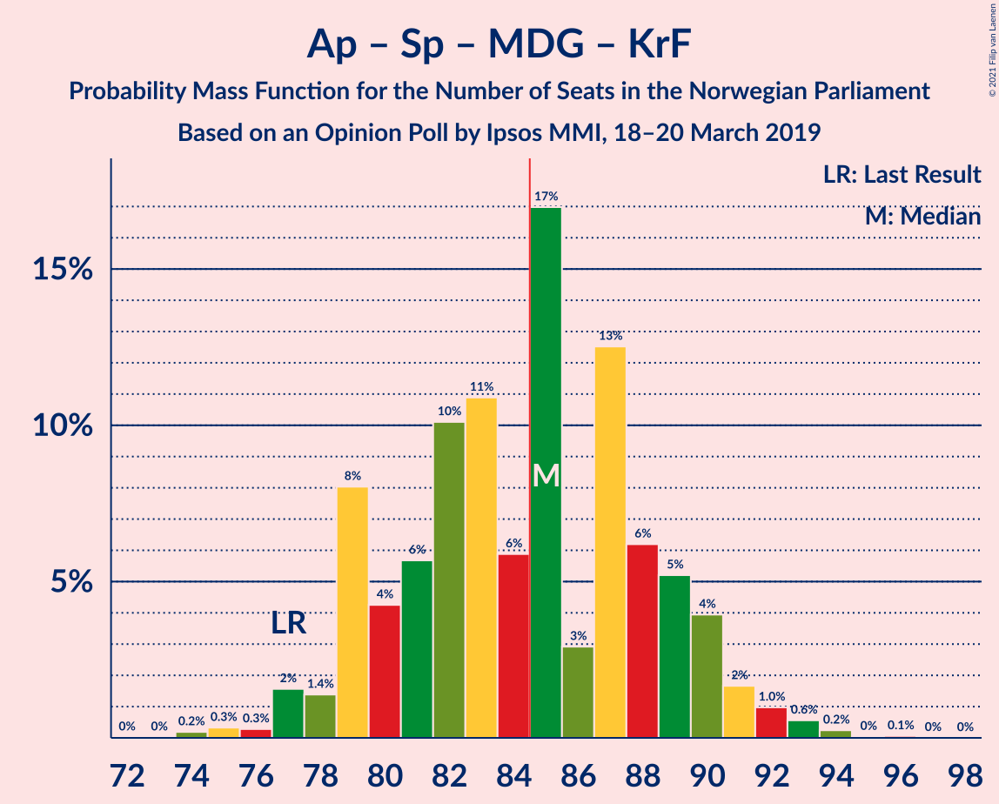

| Number of Seats | Probability | Accumulated | Special Marks |
|:---------------:|:-----------:|:-----------:|:-------------:|
| 72 | 0.1% | 100% |  |
| 73 | 0% | 99.9% |  |
| 74 | 0.1% | 99.9% |  |
| 75 | 0.1% | 99.8% |  |
| 76 | 0.2% | 99.7% |  |
| 77 | 7% | 99.5% | Last Result |
| 78 | 2% | 93% |  |
| 79 | 3% | 91% |  |
| 80 | 2% | 88% |  |
| 81 | 3% | 86% |  |
| 82 | 31% | 82% |  |
| 83 | 6% | 51% | Median |
| 84 | 8% | 45% |  |
| 85 | 6% | 37% | Majority |
| 86 | 4% | 31% |  |
| 87 | 3% | 27% |  |
| 88 | 7% | 24% |  |
| 89 | 2% | 17% |  |
| 90 | 8% | 15% |  |
| 91 | 2% | 7% |  |
| 92 | 4% | 5% |  |
| 93 | 0.6% | 0.8% |  |
| 94 | 0.1% | 0.2% |  |
| 95 | 0.1% | 0.1% |  |
| 96 | 0% | 0% |  |

### Arbeiderpartiet – Senterpartiet – Kristelig Folkeparti

| Number of Seats | Probability | Accumulated | Special Marks |
|:---------------:|:-----------:|:-----------:|:-------------:|
| 69 | 0.1% | 100% |  |
| 70 | 0.1% | 99.9% |  |
| 71 | 0.1% | 99.8% |  |
| 72 | 0.2% | 99.7% |  |
| 73 | 0.6% | 99.5% |  |
| 74 | 0.7% | 98.9% |  |
| 75 | 7% | 98% |  |
| 76 | 5% | 91% | Last Result |
| 77 | 3% | 86% |  |
| 78 | 6% | 84% |  |
| 79 | 8% | 78% |  |
| 80 | 30% | 70% |  |
| 81 | 10% | 40% | Median |
| 82 | 9% | 30% |  |
| 83 | 5% | 21% |  |
| 84 | 7% | 17% |  |
| 85 | 3% | 10% | Majority |
| 86 | 1.2% | 7% |  |
| 87 | 2% | 6% |  |
| 88 | 3% | 4% |  |
| 89 | 1.0% | 1.0% |  |
| 90 | 0% | 0.1% |  |
| 91 | 0% | 0% |  |

### Arbeiderpartiet – Senterpartiet

| Number of Seats | Probability | Accumulated | Special Marks |
|:---------------:|:-----------:|:-----------:|:-------------:|
| 68 | 0.1% | 100% | Last Result |
| 69 | 0.1% | 99.9% |  |
| 70 | 0.1% | 99.8% |  |
| 71 | 0.7% | 99.7% |  |
| 72 | 0.3% | 99.0% |  |
| 73 | 0.5% | 98.8% |  |
| 74 | 5% | 98% |  |
| 75 | 9% | 93% |  |
| 76 | 3% | 85% |  |
| 77 | 4% | 82% |  |
| 78 | 8% | 78% |  |
| 79 | 22% | 70% |  |
| 80 | 19% | 47% | Median |
| 81 | 11% | 29% |  |
| 82 | 2% | 17% |  |
| 83 | 7% | 16% |  |
| 84 | 2% | 9% |  |
| 85 | 2% | 7% | Majority |
| 86 | 3% | 5% |  |
| 87 | 0.3% | 1.2% |  |
| 88 | 0.9% | 1.0% |  |
| 89 | 0% | 0.1% |  |
| 90 | 0% | 0% |  |

### Høyre – Fremskrittspartiet – Miljøpartiet De Grønne – Kristelig Folkeparti – Venstre

| Number of Seats | Probability | Accumulated | Special Marks |
|:---------------:|:-----------:|:-----------:|:-------------:|
| 54 | 0.1% | 100% |  |
| 55 | 0.1% | 99.9% |  |
| 56 | 0.2% | 99.8% |  |
| 57 | 0.2% | 99.6% |  |
| 58 | 0.6% | 99.4% |  |
| 59 | 0.6% | 98.8% |  |
| 60 | 3% | 98% |  |
| 61 | 2% | 96% |  |
| 62 | 14% | 93% |  |
| 63 | 8% | 79% |  |
| 64 | 21% | 71% | Median |
| 65 | 5% | 50% |  |
| 66 | 7% | 45% |  |
| 67 | 6% | 37% |  |
| 68 | 4% | 31% |  |
| 69 | 10% | 27% |  |
| 70 | 6% | 17% |  |
| 71 | 6% | 11% |  |
| 72 | 2% | 5% |  |
| 73 | 0.2% | 3% |  |
| 74 | 0.3% | 3% |  |
| 75 | 2% | 3% |  |
| 76 | 0.1% | 0.2% |  |
| 77 | 0% | 0.1% |  |
| 78 | 0% | 0% |  |
| 79 | 0% | 0% |  |
| 80 | 0% | 0% |  |
| 81 | 0% | 0% |  |
| 82 | 0% | 0% |  |
| 83 | 0% | 0% |  |
| 84 | 0% | 0% |  |
| 85 | 0% | 0% | Majority |
| 86 | 0% | 0% |  |
| 87 | 0% | 0% |  |
| 88 | 0% | 0% |  |
| 89 | 0% | 0% | Last Result |

### Arbeiderpartiet – Sosialistisk Venstreparti

| Number of Seats | Probability | Accumulated | Special Marks |
|:---------------:|:-----------:|:-----------:|:-------------:|
| 55 | 0% | 100% |  |
| 56 | 0.2% | 99.9% |  |
| 57 | 0.2% | 99.8% |  |
| 58 | 0.8% | 99.6% |  |
| 59 | 2% | 98.8% |  |
| 60 | 5% | 97% | Last Result |
| 61 | 2% | 92% |  |
| 62 | 10% | 90% |  |
| 63 | 5% | 80% |  |
| 64 | 6% | 75% |  |
| 65 | 6% | 69% |  |
| 66 | 21% | 63% |  |
| 67 | 4% | 42% | Median |
| 68 | 21% | 38% |  |
| 69 | 2% | 17% |  |
| 70 | 7% | 15% |  |
| 71 | 1.0% | 8% |  |
| 72 | 6% | 7% |  |
| 73 | 0.4% | 0.9% |  |
| 74 | 0.3% | 0.5% |  |
| 75 | 0% | 0.2% |  |
| 76 | 0.1% | 0.1% |  |
| 77 | 0% | 0% |  |

### Høyre – Fremskrittspartiet – Kristelig Folkeparti – Venstre

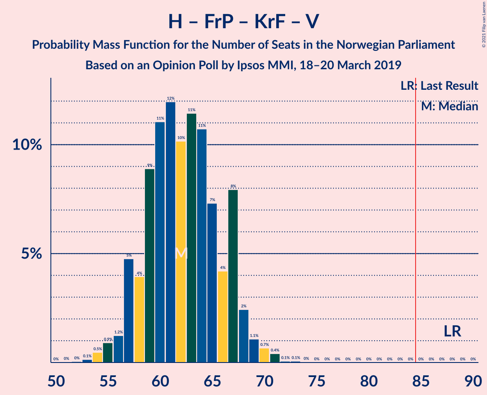

| Number of Seats | Probability | Accumulated | Special Marks |
|:---------------:|:-----------:|:-----------:|:-------------:|
| 51 | 0.1% | 100% |  |
| 52 | 0.2% | 99.9% |  |
| 53 | 0.1% | 99.7% |  |
| 54 | 2% | 99.6% |  |
| 55 | 2% | 98% |  |
| 56 | 2% | 96% |  |
| 57 | 2% | 94% |  |
| 58 | 3% | 93% |  |
| 59 | 7% | 89% |  |
| 60 | 15% | 82% |  |
| 61 | 10% | 68% |  |
| 62 | 25% | 57% | Median |
| 63 | 6% | 33% |  |
| 64 | 4% | 27% |  |
| 65 | 4% | 23% |  |
| 66 | 3% | 19% |  |
| 67 | 8% | 16% |  |
| 68 | 4% | 8% |  |
| 69 | 3% | 4% |  |
| 70 | 1.2% | 1.4% |  |
| 71 | 0% | 0.2% |  |
| 72 | 0.1% | 0.1% |  |
| 73 | 0% | 0.1% |  |
| 74 | 0% | 0% |  |
| 75 | 0% | 0% |  |
| 76 | 0% | 0% |  |
| 77 | 0% | 0% |  |
| 78 | 0% | 0% |  |
| 79 | 0% | 0% |  |
| 80 | 0% | 0% |  |
| 81 | 0% | 0% |  |
| 82 | 0% | 0% |  |
| 83 | 0% | 0% |  |
| 84 | 0% | 0% |  |
| 85 | 0% | 0% | Majority |
| 86 | 0% | 0% |  |
| 87 | 0% | 0% |  |
| 88 | 0% | 0% | Last Result |

### Høyre – Fremskrittspartiet – Venstre

| Number of Seats | Probability | Accumulated | Special Marks |
|:---------------:|:-----------:|:-----------:|:-------------:|
| 50 | 0.1% | 100% |  |
| 51 | 0.1% | 99.9% |  |
| 52 | 0.3% | 99.9% |  |
| 53 | 2% | 99.6% |  |
| 54 | 0.3% | 98% |  |
| 55 | 4% | 98% |  |
| 56 | 3% | 94% |  |
| 57 | 3% | 91% |  |
| 58 | 6% | 89% |  |
| 59 | 11% | 83% |  |
| 60 | 18% | 72% |  |
| 61 | 23% | 54% | Median |
| 62 | 6% | 31% |  |
| 63 | 3% | 25% |  |
| 64 | 5% | 22% |  |
| 65 | 2% | 17% |  |
| 66 | 5% | 15% |  |
| 67 | 7% | 10% |  |
| 68 | 1.2% | 3% |  |
| 69 | 1.0% | 1.3% |  |
| 70 | 0.2% | 0.4% |  |
| 71 | 0.1% | 0.1% |  |
| 72 | 0% | 0% |  |
| 73 | 0% | 0% |  |
| 74 | 0% | 0% |  |
| 75 | 0% | 0% |  |
| 76 | 0% | 0% |  |
| 77 | 0% | 0% |  |
| 78 | 0% | 0% |  |
| 79 | 0% | 0% |  |
| 80 | 0% | 0% | Last Result |

### Høyre – Fremskrittspartiet

| Number of Seats | Probability | Accumulated | Special Marks |
|:---------------:|:-----------:|:-----------:|:-------------:|
| 49 | 0.1% | 100% |  |
| 50 | 0.1% | 99.9% |  |
| 51 | 0.2% | 99.9% |  |
| 52 | 0.4% | 99.7% |  |
| 53 | 2% | 99.2% |  |
| 54 | 2% | 97% |  |
| 55 | 4% | 95% |  |
| 56 | 4% | 91% |  |
| 57 | 7% | 88% |  |
| 58 | 10% | 81% |  |
| 59 | 7% | 70% |  |
| 60 | 33% | 63% | Median |
| 61 | 4% | 29% |  |
| 62 | 6% | 26% |  |
| 63 | 4% | 20% |  |
| 64 | 2% | 16% |  |
| 65 | 5% | 14% |  |
| 66 | 7% | 10% |  |
| 67 | 1.2% | 3% |  |
| 68 | 1.0% | 1.4% |  |
| 69 | 0.3% | 0.4% |  |
| 70 | 0.1% | 0.1% |  |
| 71 | 0% | 0% |  |
| 72 | 0% | 0% | Last Result |

### Høyre – Kristelig Folkeparti – Venstre

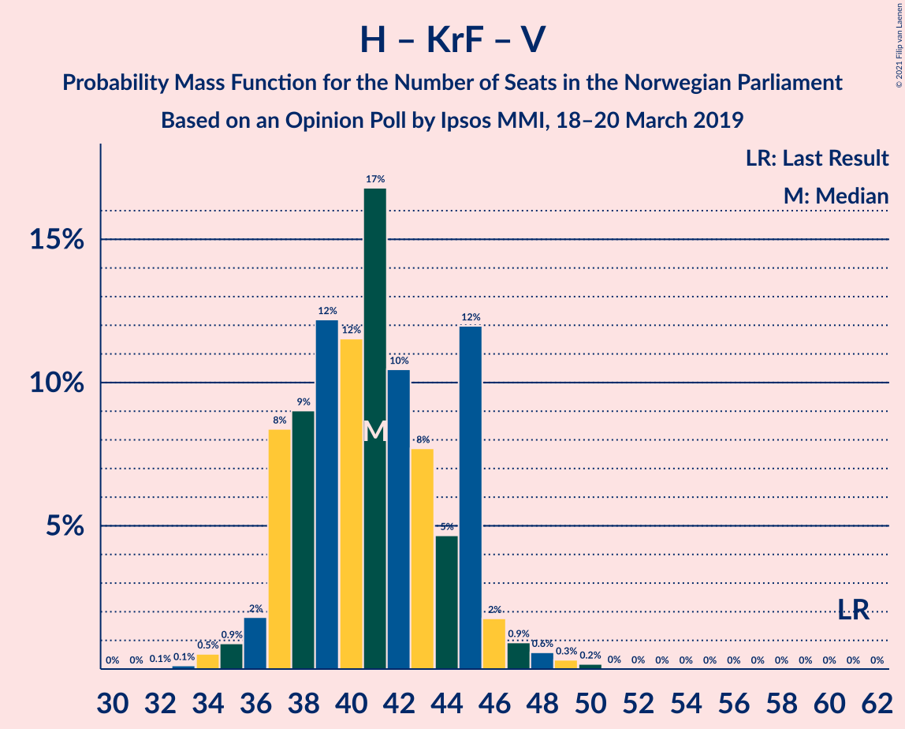

| Number of Seats | Probability | Accumulated | Special Marks |
|:---------------:|:-----------:|:-----------:|:-------------:|
| 33 | 0.1% | 100% |  |
| 34 | 2% | 99.9% |  |
| 35 | 0.7% | 98% |  |
| 36 | 2% | 97% |  |
| 37 | 7% | 95% |  |
| 38 | 5% | 88% |  |
| 39 | 6% | 83% |  |
| 40 | 13% | 78% |  |
| 41 | 27% | 64% | Median |
| 42 | 12% | 37% |  |
| 43 | 10% | 25% |  |
| 44 | 3% | 15% |  |
| 45 | 4% | 12% |  |
| 46 | 2% | 8% |  |
| 47 | 4% | 6% |  |
| 48 | 0.6% | 2% |  |
| 49 | 0.4% | 1.3% |  |
| 50 | 0.9% | 0.9% |  |
| 51 | 0% | 0% |  |
| 52 | 0% | 0% |  |
| 53 | 0% | 0% |  |
| 54 | 0% | 0% |  |
| 55 | 0% | 0% |  |
| 56 | 0% | 0% |  |
| 57 | 0% | 0% |  |
| 58 | 0% | 0% |  |
| 59 | 0% | 0% |  |
| 60 | 0% | 0% |  |
| 61 | 0% | 0% | Last Result |

### Senterpartiet – Kristelig Folkeparti – Venstre

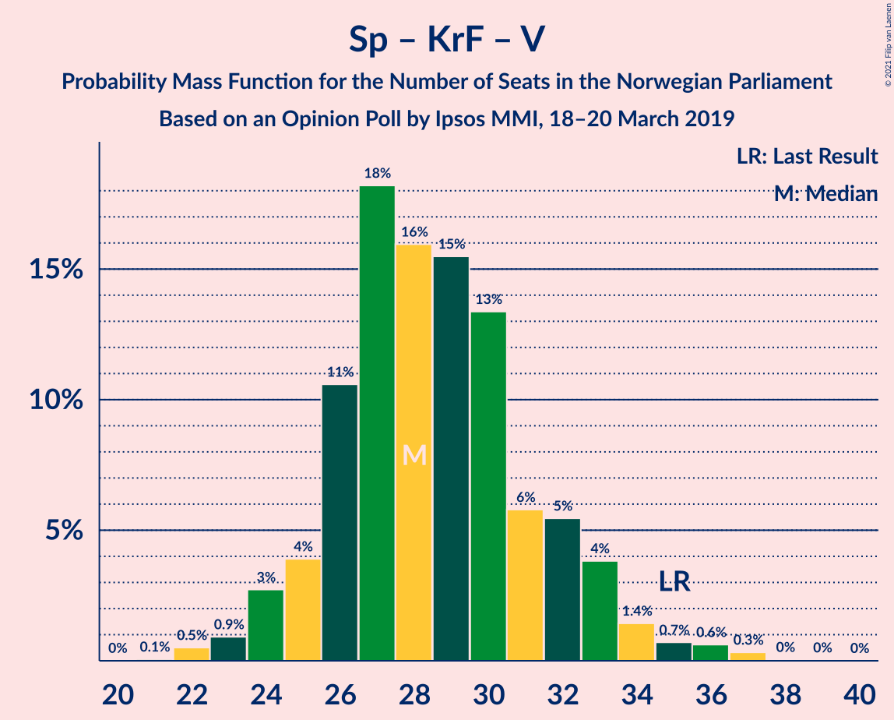

| Number of Seats | Probability | Accumulated | Special Marks |
|:---------------:|:-----------:|:-----------:|:-------------:|
| 21 | 0.1% | 100% |  |
| 22 | 0.6% | 99.9% |  |
| 23 | 0.5% | 99.4% |  |
| 24 | 5% | 98.9% |  |
| 25 | 4% | 94% |  |
| 26 | 11% | 90% |  |
| 27 | 26% | 79% |  |
| 28 | 17% | 53% | Median |
| 29 | 3% | 36% |  |
| 30 | 13% | 33% |  |
| 31 | 7% | 20% |  |
| 32 | 6% | 13% |  |
| 33 | 2% | 7% |  |
| 34 | 0.8% | 5% |  |
| 35 | 2% | 5% | Last Result |
| 36 | 2% | 3% |  |
| 37 | 0.4% | 0.5% |  |
| 38 | 0% | 0.1% |  |
| 39 | 0% | 0% |  |

## Technical Information

### Opinion Poll

+ **Polling firm:** Ipsos MMI
+ **Commissioner(s):** —
+ **Fieldwork period:** 18–20 March 2019

### Calculations

+ **Sample size:** 942
+ **Simulations done:** 131,072
+ **Error estimate:** 2.55%

