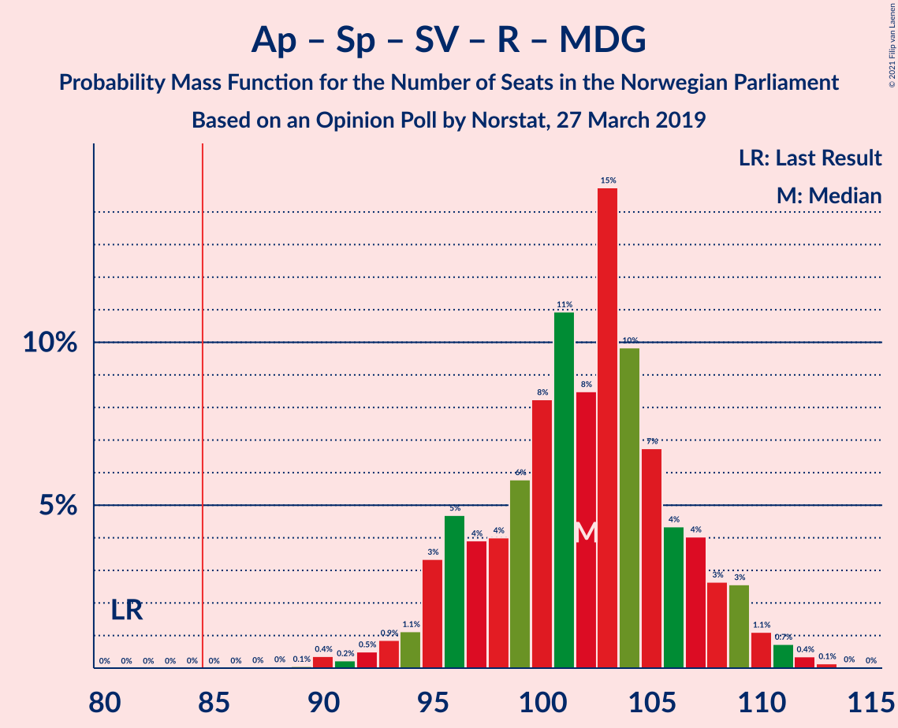
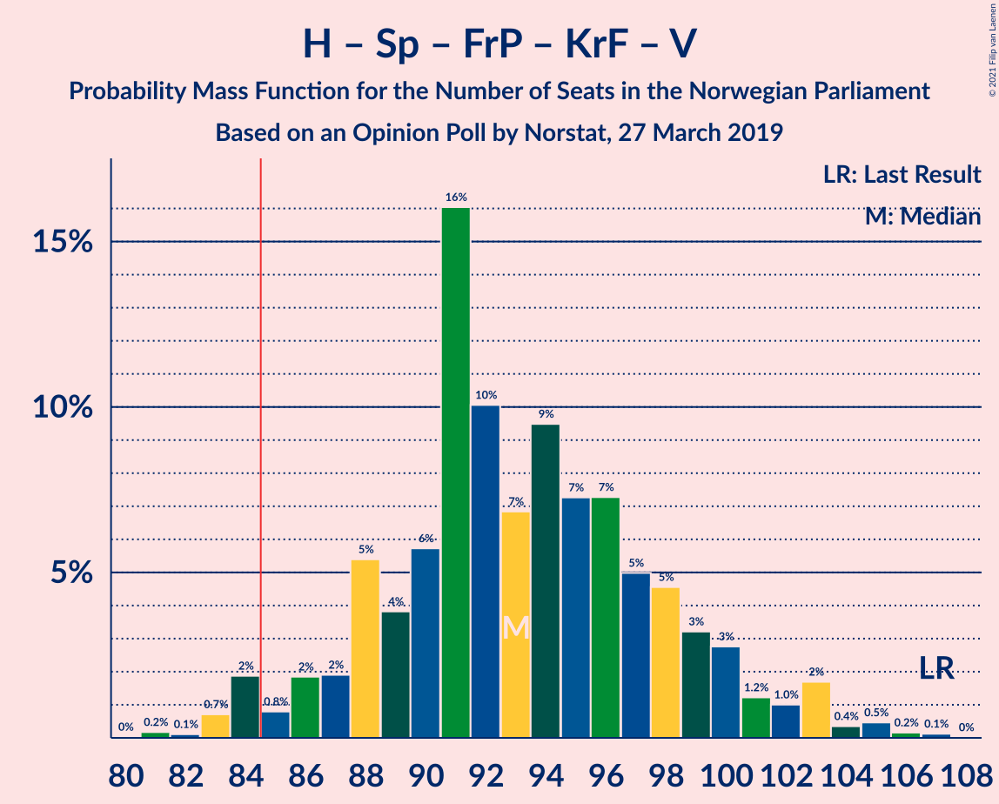
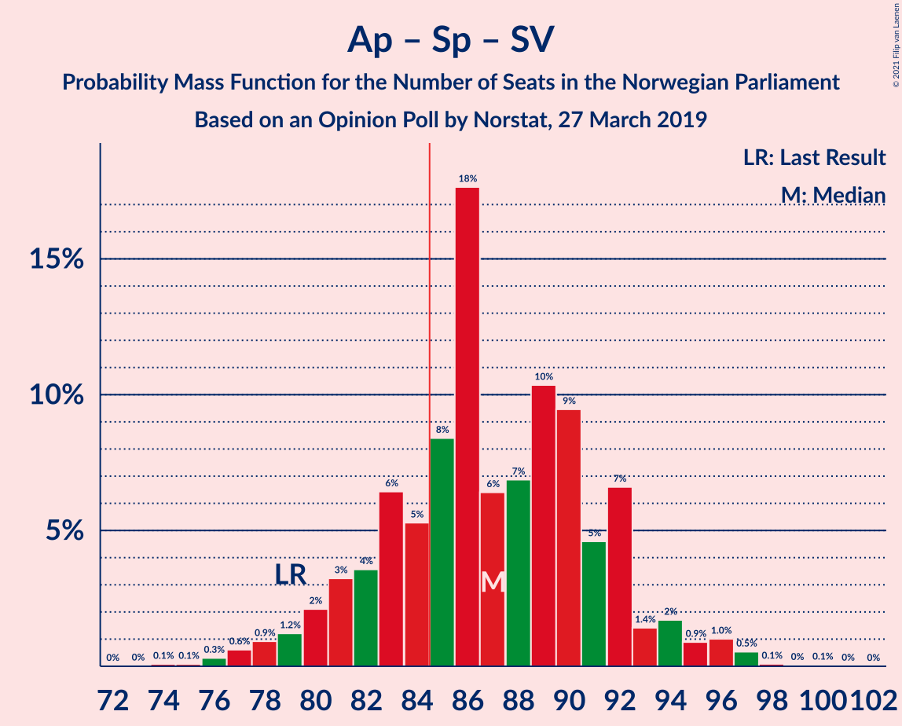
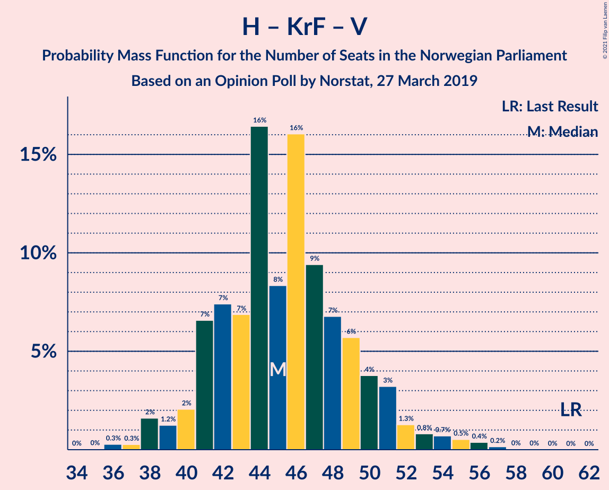

# Opinion Poll by Norstat, 27 March 2019

<a href="#voting-intentions">Voting Intentions</a> | <a href="#seats">Seats</a> | <a href="#coalitions">Coalitions</a> | <a href="#technical-information">Technical Information</a>

## Voting Intentions

### Confidence Intervals

| Party | Last Result | Poll Result | 80% Confidence Interval | 90% Confidence Interval | 95% Confidence Interval | 99% Confidence Interval |
|:-----:|:-----------:|:-----------:|:-----------------------:|:-----------------------:|:-----------------------:|:-----------------------:|
| Arbeiderpartiet | 27.4% | 26.6% | 24.4–28.9% |23.8–29.6% |23.3–30.2% |22.3–31.3% |
| Høyre | 25.0% | 24.5% | 22.4–26.8% |21.8–27.5% |21.3–28.0% |20.3–29.2% |
| Senterpartiet | 10.3% | 14.3% | 12.7–16.3% |12.2–16.8% |11.8–17.3% |11.1–18.3% |
| Fremskrittspartiet | 15.2% | 12.1% | 10.6–13.9% |10.1–14.4% |9.8–14.9% |9.1–15.8% |
| Sosialistisk Venstreparti | 6.0% | 6.8% | 5.7–8.3% |5.4–8.7% |5.1–9.1% |4.6–9.9% |
| Rødt | 2.4% | 4.9% | 4.0–6.2% |3.7–6.6% |3.5–6.9% |3.1–7.6% |
| Miljøpartiet De Grønne | 3.2% | 4.3% | 3.4–5.5% |3.2–5.9% |3.0–6.2% |2.6–6.8% |
| Kristelig Folkeparti | 4.2% | 2.4% | 1.8–3.4% |1.6–3.7% |1.4–3.9% |1.2–4.4% |
| Venstre | 4.4% | 1.8% | 1.2–2.6% |1.1–2.9% |1.0–3.1% |0.8–3.6% |

*Note:* The poll result column reflects the actual value used in the calculations. Published results may vary slightly, and in addition be rounded to fewer digits.

## Seats

### Confidence Intervals

| Party | Last Result | Median | 80% Confidence Interval | 90% Confidence Interval | 95% Confidence Interval | 99% Confidence Interval |
|:-----:|:-----------:|:------:|:-----------------------:|:-----------------------:|:-----------------------:|:-----------------------:|
| <a href="#arbeiderpartiet">Arbeiderpartiet</a> | 49 | 49 | 44–53 |43–55 |42–56 |40–57 |
| <a href="#høyre">Høyre</a> | 45 | 43 | 40–48 |39–49 |38–50 |36–54 |
| <a href="#senterpartiet">Senterpartiet</a> | 19 | 25 | 23–30 |22–32 |21–33 |20–34 |
| <a href="#fremskrittspartiet">Fremskrittspartiet</a> | 27 | 22 | 18–25 |18–26 |17–27 |16–28 |
| <a href="#sosialistisk-venstreparti">Sosialistisk Venstreparti</a> | 11 | 12 | 10–15 |10–15 |9–16 |8–18 |
| <a href="#rødt">Rødt</a> | 1 | 9 | 2–11 |2–12 |2–12 |2–14 |
| <a href="#miljøpartiet-de-grønne">Miljøpartiet De Grønne</a> | 1 | 8 | 2–10 |2–10 |1–11 |1–12 |
| <a href="#kristelig-folkeparti">Kristelig Folkeparti</a> | 8 | 1 | 0–3 |0–3 |0–3 |0–8 |
| <a href="#venstre">Venstre</a> | 8 | 1 | 0–2 |0–2 |0–2 |0–2 |

### Arbeiderpartiet

*For a full overview of the results for this party, see the [Arbeiderpartiet](party-arbeiderpartiet.html) page.*

| Number of Seats | Probability | Accumulated | Special Marks |
|:---------------:|:-----------:|:-----------:|:-------------:|
| 38 | 0.1% | 100% |  |
| 39 | 0.2% | 99.9% |  |
| 40 | 0.6% | 99.6% |  |
| 41 | 1.3% | 99.0% |  |
| 42 | 2% | 98% |  |
| 43 | 3% | 95% |  |
| 44 | 7% | 92% |  |
| 45 | 7% | 84% |  |
| 46 | 6% | 78% |  |
| 47 | 12% | 71% |  |
| 48 | 7% | 60% |  |
| 49 | 12% | 53% | Last Result, Median |
| 50 | 8% | 41% |  |
| 51 | 15% | 32% |  |
| 52 | 5% | 17% |  |
| 53 | 5% | 12% |  |
| 54 | 3% | 8% |  |
| 55 | 3% | 5% |  |
| 56 | 1.3% | 3% |  |
| 57 | 0.8% | 1.3% |  |
| 58 | 0.3% | 0.5% |  |
| 59 | 0.1% | 0.2% |  |
| 60 | 0% | 0% |  |

### Høyre

*For a full overview of the results for this party, see the [Høyre](party-høyre.html) page.*

| Number of Seats | Probability | Accumulated | Special Marks |
|:---------------:|:-----------:|:-----------:|:-------------:|
| 34 | 0.1% | 100% |  |
| 35 | 0.2% | 99.9% |  |
| 36 | 0.6% | 99.7% |  |
| 37 | 2% | 99.1% |  |
| 38 | 2% | 98% |  |
| 39 | 5% | 96% |  |
| 40 | 6% | 90% |  |
| 41 | 10% | 85% |  |
| 42 | 10% | 75% |  |
| 43 | 16% | 66% | Median |
| 44 | 13% | 49% |  |
| 45 | 7% | 36% | Last Result |
| 46 | 12% | 30% |  |
| 47 | 6% | 18% |  |
| 48 | 4% | 11% |  |
| 49 | 3% | 7% |  |
| 50 | 2% | 4% |  |
| 51 | 1.0% | 2% |  |
| 52 | 0.7% | 1.5% |  |
| 53 | 0.2% | 0.8% |  |
| 54 | 0.4% | 0.5% |  |
| 55 | 0.1% | 0.1% |  |
| 56 | 0% | 0% |  |

### Senterpartiet

*For a full overview of the results for this party, see the [Senterpartiet](party-senterpartiet.html) page.*

| Number of Seats | Probability | Accumulated | Special Marks |
|:---------------:|:-----------:|:-----------:|:-------------:|
| 18 | 0.1% | 100% |  |
| 19 | 0.4% | 99.9% | Last Result |
| 20 | 1.2% | 99.5% |  |
| 21 | 3% | 98% |  |
| 22 | 5% | 95% |  |
| 23 | 8% | 90% |  |
| 24 | 11% | 83% |  |
| 25 | 22% | 71% | Median |
| 26 | 7% | 50% |  |
| 27 | 16% | 43% |  |
| 28 | 8% | 27% |  |
| 29 | 8% | 19% |  |
| 30 | 3% | 11% |  |
| 31 | 1.1% | 8% |  |
| 32 | 4% | 7% |  |
| 33 | 1.4% | 3% |  |
| 34 | 2% | 2% |  |
| 35 | 0.1% | 0.1% |  |
| 36 | 0% | 0.1% |  |
| 37 | 0% | 0% |  |

### Fremskrittspartiet

*For a full overview of the results for this party, see the [Fremskrittspartiet](party-fremskrittspartiet.html) page.*

| Number of Seats | Probability | Accumulated | Special Marks |
|:---------------:|:-----------:|:-----------:|:-------------:|
| 15 | 0.2% | 100% |  |
| 16 | 1.0% | 99.8% |  |
| 17 | 1.3% | 98.8% |  |
| 18 | 8% | 97% |  |
| 19 | 9% | 89% |  |
| 20 | 12% | 81% |  |
| 21 | 17% | 69% |  |
| 22 | 17% | 52% | Median |
| 23 | 12% | 36% |  |
| 24 | 11% | 23% |  |
| 25 | 5% | 12% |  |
| 26 | 3% | 7% |  |
| 27 | 3% | 4% | Last Result |
| 28 | 0.8% | 1.2% |  |
| 29 | 0.3% | 0.4% |  |
| 30 | 0.1% | 0.1% |  |
| 31 | 0% | 0% |  |

### Sosialistisk Venstreparti

*For a full overview of the results for this party, see the [Sosialistisk Venstreparti](party-sosialistiskvenstreparti.html) page.*

| Number of Seats | Probability | Accumulated | Special Marks |
|:---------------:|:-----------:|:-----------:|:-------------:|
| 2 | 0.1% | 100% |  |
| 3 | 0% | 99.9% |  |
| 4 | 0% | 99.9% |  |
| 5 | 0% | 99.9% |  |
| 6 | 0% | 99.9% |  |
| 7 | 0% | 99.9% |  |
| 8 | 0.8% | 99.9% |  |
| 9 | 3% | 99.1% |  |
| 10 | 15% | 96% |  |
| 11 | 14% | 82% | Last Result |
| 12 | 19% | 67% | Median |
| 13 | 20% | 48% |  |
| 14 | 18% | 28% |  |
| 15 | 7% | 11% |  |
| 16 | 3% | 4% |  |
| 17 | 0.7% | 1.4% |  |
| 18 | 0.5% | 0.6% |  |
| 19 | 0.1% | 0.2% |  |
| 20 | 0.1% | 0.1% |  |
| 21 | 0% | 0% |  |

### Rødt

*For a full overview of the results for this party, see the [Rødt](party-rødt.html) page.*

| Number of Seats | Probability | Accumulated | Special Marks |
|:---------------:|:-----------:|:-----------:|:-------------:|
| 1 | 0.1% | 100% | Last Result |
| 2 | 10% | 99.9% |  |
| 3 | 0% | 90% |  |
| 4 | 0% | 90% |  |
| 5 | 0% | 90% |  |
| 6 | 0% | 90% |  |
| 7 | 7% | 90% |  |
| 8 | 19% | 83% |  |
| 9 | 30% | 64% | Median |
| 10 | 18% | 34% |  |
| 11 | 9% | 16% |  |
| 12 | 5% | 7% |  |
| 13 | 1.3% | 2% |  |
| 14 | 0.5% | 0.6% |  |
| 15 | 0.1% | 0.1% |  |
| 16 | 0% | 0% |  |

### Miljøpartiet De Grønne

*For a full overview of the results for this party, see the [Miljøpartiet De Grønne](party-miljøpartietdegrønne.html) page.*

| Number of Seats | Probability | Accumulated | Special Marks |
|:---------------:|:-----------:|:-----------:|:-------------:|
| 1 | 4% | 100% | Last Result |
| 2 | 20% | 96% |  |
| 3 | 10% | 76% |  |
| 4 | 0.8% | 66% |  |
| 5 | 0% | 65% |  |
| 6 | 0% | 65% |  |
| 7 | 9% | 65% |  |
| 8 | 25% | 56% | Median |
| 9 | 19% | 31% |  |
| 10 | 7% | 12% |  |
| 11 | 3% | 4% |  |
| 12 | 1.0% | 1.2% |  |
| 13 | 0.2% | 0.2% |  |
| 14 | 0% | 0% |  |

### Kristelig Folkeparti

*For a full overview of the results for this party, see the [Kristelig Folkeparti](party-kristeligfolkeparti.html) page.*

| Number of Seats | Probability | Accumulated | Special Marks |
|:---------------:|:-----------:|:-----------:|:-------------:|
| 0 | 34% | 100% |  |
| 1 | 51% | 66% | Median |
| 2 | 5% | 15% |  |
| 3 | 9% | 11% |  |
| 4 | 0% | 2% |  |
| 5 | 0% | 2% |  |
| 6 | 0% | 2% |  |
| 7 | 0.8% | 2% |  |
| 8 | 0.6% | 0.7% | Last Result |
| 9 | 0.1% | 0.1% |  |
| 10 | 0% | 0% |  |

### Venstre

*For a full overview of the results for this party, see the [Venstre](party-venstre.html) page.*

| Number of Seats | Probability | Accumulated | Special Marks |
|:---------------:|:-----------:|:-----------:|:-------------:|
| 0 | 49% | 100% |  |
| 1 | 33% | 51% | Median |
| 2 | 18% | 18% |  |
| 3 | 0% | 0.1% |  |
| 4 | 0% | 0.1% |  |
| 5 | 0% | 0.1% |  |
| 6 | 0% | 0.1% |  |
| 7 | 0.1% | 0.1% |  |
| 8 | 0% | 0% | Last Result |

## Coalitions

### Confidence Intervals

| Coalition | Last Result | Median | Majority? | 80% Confidence Interval | 90% Confidence Interval | 95% Confidence Interval | 99% Confidence Interval |
|:---------:|:-----------:|:------:|:---------:|:-----------------------:|:-----------------------:|:-----------------------:|:-----------------------:|
| Arbeiderpartiet – Senterpartiet – Sosialistisk Venstreparti – Rødt – Miljøpartiet De Grønne | 81 | 102 | 100% | 96–107 | 95–108 | 94–109 | 90–112 |
| Høyre – Senterpartiet – Fremskrittspartiet – Kristelig Folkeparti – Venstre | 107 | 93 | 97% | 88–99 | 86–101 | 84–103 | 83–105 |
| Arbeiderpartiet – Senterpartiet – Sosialistisk Venstreparti – Miljøpartiet De Grønne – Kristelig Folkeparti | 88 | 95 | 99.2% | 89–99 | 88–101 | 87–102 | 83–105 |
| Arbeiderpartiet – Senterpartiet – Sosialistisk Venstreparti – Rødt | 80 | 95 | 99.4% | 91–101 | 88–102 | 87–102 | 84–105 |
| Arbeiderpartiet – Senterpartiet – Sosialistisk Venstreparti – Miljøpartiet De Grønne | 80 | 94 | 98% | 88–99 | 87–100 | 85–101 | 82–105 |
| Arbeiderpartiet – Senterpartiet – Sosialistisk Venstreparti | 79 | 87 | 76% | 82–92 | 80–93 | 79–95 | 76–97 |
| Arbeiderpartiet – Senterpartiet – Miljøpartiet De Grønne – Kristelig Folkeparti | 77 | 82 | 34% | 76–88 | 75–89 | 74–91 | 71–92 |
| Arbeiderpartiet – Sosialistisk Venstreparti – Rødt – Miljøpartiet De Grønne | 62 | 76 | 3% | 70–81 | 68–83 | 66–85 | 64–86 |
| Arbeiderpartiet – Senterpartiet – Kristelig Folkeparti | 76 | 76 | 0.7% | 70–80 | 69–82 | 67–83 | 65–85 |
| Arbeiderpartiet – Senterpartiet | 68 | 75 | 0.3% | 69–79 | 68–81 | 66–82 | 64–84 |
| Høyre – Fremskrittspartiet – Miljøpartiet De Grønne – Kristelig Folkeparti – Venstre | 89 | 74 | 0.6% | 68–78 | 67–81 | 66–82 | 64–85 |
| Høyre – Fremskrittspartiet – Kristelig Folkeparti – Venstre | 88 | 67 | 0% | 62–73 | 60–74 | 59–75 | 57–78 |
| Høyre – Fremskrittspartiet – Venstre | 80 | 66 | 0% | 61–71 | 59–73 | 58–74 | 56–76 |
| Høyre – Fremskrittspartiet | 72 | 65 | 0% | 60–71 | 59–73 | 58–73 | 56–76 |
| Arbeiderpartiet – Sosialistisk Venstreparti | 60 | 61 | 0% | 56–65 | 55–67 | 53–68 | 51–70 |
| Høyre – Kristelig Folkeparti – Venstre | 61 | 45 | 0% | 41–50 | 40–51 | 39–53 | 37–56 |
| Senterpartiet – Kristelig Folkeparti – Venstre | 35 | 27 | 0% | 24–32 | 23–34 | 22–35 | 21–37 |

### Arbeiderpartiet – Senterpartiet – Sosialistisk Venstreparti – Rødt – Miljøpartiet De Grønne

| Number of Seats | Probability | Accumulated | Special Marks |
|:---------------:|:-----------:|:-----------:|:-------------:|
| 81 | 0% | 100% | Last Result |
| 82 | 0% | 100% |  |
| 83 | 0% | 100% |  |
| 84 | 0% | 100% |  |
| 85 | 0% | 100% | Majority |
| 86 | 0% | 100% |  |
| 87 | 0% | 100% |  |
| 88 | 0% | 100% |  |
| 89 | 0.1% | 99.9% |  |
| 90 | 0.4% | 99.8% |  |
| 91 | 0.2% | 99.5% |  |
| 92 | 0.5% | 99.3% |  |
| 93 | 0.9% | 98.7% |  |
| 94 | 1.1% | 98% |  |
| 95 | 3% | 97% |  |
| 96 | 5% | 93% |  |
| 97 | 4% | 89% |  |
| 98 | 4% | 85% |  |
| 99 | 6% | 81% |  |
| 100 | 8% | 75% |  |
| 101 | 11% | 67% |  |
| 102 | 8% | 56% |  |
| 103 | 15% | 47% | Median |
| 104 | 10% | 33% |  |
| 105 | 7% | 23% |  |
| 106 | 4% | 16% |  |
| 107 | 4% | 12% |  |
| 108 | 3% | 8% |  |
| 109 | 3% | 5% |  |
| 110 | 1.1% | 2% |  |
| 111 | 0.7% | 1.3% |  |
| 112 | 0.4% | 0.6% |  |
| 113 | 0.1% | 0.2% |  |
| 114 | 0% | 0.1% |  |
| 115 | 0% | 0% |  |

### Høyre – Senterpartiet – Fremskrittspartiet – Kristelig Folkeparti – Venstre

| Number of Seats | Probability | Accumulated | Special Marks |
|:---------------:|:-----------:|:-----------:|:-------------:|
| 80 | 0% | 100% |  |
| 81 | 0.2% | 99.9% |  |
| 82 | 0.1% | 99.8% |  |
| 83 | 0.7% | 99.7% |  |
| 84 | 2% | 98.9% |  |
| 85 | 0.8% | 97% | Majority |
| 86 | 2% | 96% |  |
| 87 | 2% | 94% |  |
| 88 | 5% | 93% |  |
| 89 | 4% | 87% |  |
| 90 | 6% | 83% |  |
| 91 | 16% | 78% |  |
| 92 | 10% | 62% | Median |
| 93 | 7% | 51% |  |
| 94 | 9% | 45% |  |
| 95 | 7% | 35% |  |
| 96 | 7% | 28% |  |
| 97 | 5% | 21% |  |
| 98 | 5% | 16% |  |
| 99 | 3% | 11% |  |
| 100 | 3% | 8% |  |
| 101 | 1.2% | 5% |  |
| 102 | 1.0% | 4% |  |
| 103 | 2% | 3% |  |
| 104 | 0.4% | 1.1% |  |
| 105 | 0.5% | 0.8% |  |
| 106 | 0.2% | 0.3% |  |
| 107 | 0.1% | 0.2% | Last Result |
| 108 | 0% | 0% |  |

### Arbeiderpartiet – Senterpartiet – Sosialistisk Venstreparti – Miljøpartiet De Grønne – Kristelig Folkeparti

| Number of Seats | Probability | Accumulated | Special Marks |
|:---------------:|:-----------:|:-----------:|:-------------:|
| 80 | 0% | 100% |  |
| 81 | 0% | 99.9% |  |
| 82 | 0.2% | 99.9% |  |
| 83 | 0.2% | 99.7% |  |
| 84 | 0.3% | 99.5% |  |
| 85 | 0.7% | 99.2% | Majority |
| 86 | 0.9% | 98% |  |
| 87 | 2% | 98% |  |
| 88 | 4% | 96% | Last Result |
| 89 | 4% | 92% |  |
| 90 | 5% | 88% |  |
| 91 | 8% | 83% |  |
| 92 | 6% | 75% |  |
| 93 | 8% | 69% |  |
| 94 | 10% | 60% |  |
| 95 | 18% | 51% | Median |
| 96 | 6% | 33% |  |
| 97 | 7% | 27% |  |
| 98 | 4% | 21% |  |
| 99 | 7% | 17% |  |
| 100 | 4% | 10% |  |
| 101 | 3% | 6% |  |
| 102 | 1.2% | 3% |  |
| 103 | 0.4% | 2% |  |
| 104 | 0.9% | 2% |  |
| 105 | 0.8% | 0.9% |  |
| 106 | 0.1% | 0.2% |  |
| 107 | 0.1% | 0.1% |  |
| 108 | 0% | 0% |  |

### Arbeiderpartiet – Senterpartiet – Sosialistisk Venstreparti – Rødt

| Number of Seats | Probability | Accumulated | Special Marks |
|:---------------:|:-----------:|:-----------:|:-------------:|
| 80 | 0% | 100% | Last Result |
| 81 | 0% | 100% |  |
| 82 | 0% | 99.9% |  |
| 83 | 0.1% | 99.9% |  |
| 84 | 0.3% | 99.7% |  |
| 85 | 0.4% | 99.4% | Majority |
| 86 | 1.0% | 99.0% |  |
| 87 | 1.4% | 98% |  |
| 88 | 2% | 97% |  |
| 89 | 2% | 94% |  |
| 90 | 2% | 92% |  |
| 91 | 5% | 90% |  |
| 92 | 8% | 85% |  |
| 93 | 6% | 77% |  |
| 94 | 8% | 71% |  |
| 95 | 16% | 64% | Median |
| 96 | 8% | 48% |  |
| 97 | 8% | 40% |  |
| 98 | 9% | 32% |  |
| 99 | 8% | 24% |  |
| 100 | 3% | 15% |  |
| 101 | 7% | 12% |  |
| 102 | 3% | 6% |  |
| 103 | 0.8% | 2% |  |
| 104 | 0.7% | 2% |  |
| 105 | 0.6% | 0.9% |  |
| 106 | 0.2% | 0.3% |  |
| 107 | 0.1% | 0.1% |  |
| 108 | 0% | 0.1% |  |
| 109 | 0% | 0% |  |

### Arbeiderpartiet – Senterpartiet – Sosialistisk Venstreparti – Miljøpartiet De Grønne

| Number of Seats | Probability | Accumulated | Special Marks |
|:---------------:|:-----------:|:-----------:|:-------------:|
| 80 | 0.2% | 100% | Last Result |
| 81 | 0.1% | 99.8% |  |
| 82 | 0.3% | 99.7% |  |
| 83 | 0.2% | 99.4% |  |
| 84 | 0.8% | 99.2% |  |
| 85 | 2% | 98% | Majority |
| 86 | 2% | 97% |  |
| 87 | 3% | 95% |  |
| 88 | 3% | 92% |  |
| 89 | 7% | 89% |  |
| 90 | 6% | 82% |  |
| 91 | 7% | 76% |  |
| 92 | 8% | 69% |  |
| 93 | 8% | 61% |  |
| 94 | 19% | 53% | Median |
| 95 | 9% | 34% |  |
| 96 | 3% | 25% |  |
| 97 | 5% | 22% |  |
| 98 | 6% | 16% |  |
| 99 | 4% | 10% |  |
| 100 | 3% | 6% |  |
| 101 | 1.4% | 4% |  |
| 102 | 0.4% | 2% |  |
| 103 | 0.8% | 2% |  |
| 104 | 0.1% | 0.9% |  |
| 105 | 0.7% | 0.8% |  |
| 106 | 0.1% | 0.1% |  |
| 107 | 0% | 0.1% |  |
| 108 | 0% | 0% |  |

### Arbeiderpartiet – Senterpartiet – Sosialistisk Venstreparti

| Number of Seats | Probability | Accumulated | Special Marks |
|:---------------:|:-----------:|:-----------:|:-------------:|
| 74 | 0.1% | 100% |  |
| 75 | 0.1% | 99.9% |  |
| 76 | 0.3% | 99.8% |  |
| 77 | 0.6% | 99.5% |  |
| 78 | 0.9% | 98.9% |  |
| 79 | 1.2% | 98% | Last Result |
| 80 | 2% | 97% |  |
| 81 | 3% | 95% |  |
| 82 | 4% | 91% |  |
| 83 | 6% | 88% |  |
| 84 | 5% | 81% |  |
| 85 | 8% | 76% | Majority |
| 86 | 18% | 68% | Median |
| 87 | 6% | 50% |  |
| 88 | 7% | 44% |  |
| 89 | 10% | 37% |  |
| 90 | 9% | 26% |  |
| 91 | 5% | 17% |  |
| 92 | 7% | 12% |  |
| 93 | 1.4% | 6% |  |
| 94 | 2% | 4% |  |
| 95 | 0.9% | 3% |  |
| 96 | 1.0% | 2% |  |
| 97 | 0.5% | 0.7% |  |
| 98 | 0.1% | 0.2% |  |
| 99 | 0% | 0.1% |  |
| 100 | 0.1% | 0.1% |  |
| 101 | 0% | 0% |  |

### Arbeiderpartiet – Senterpartiet – Miljøpartiet De Grønne – Kristelig Folkeparti

| Number of Seats | Probability | Accumulated | Special Marks |
|:---------------:|:-----------:|:-----------:|:-------------:|
| 67 | 0% | 100% |  |
| 68 | 0% | 99.9% |  |
| 69 | 0.2% | 99.9% |  |
| 70 | 0.1% | 99.7% |  |
| 71 | 0.5% | 99.6% |  |
| 72 | 0.4% | 99.1% |  |
| 73 | 1.1% | 98.6% |  |
| 74 | 2% | 98% |  |
| 75 | 2% | 95% |  |
| 76 | 3% | 93% |  |
| 77 | 6% | 90% | Last Result |
| 78 | 7% | 84% |  |
| 79 | 5% | 77% |  |
| 80 | 11% | 72% |  |
| 81 | 10% | 61% |  |
| 82 | 8% | 50% |  |
| 83 | 4% | 43% | Median |
| 84 | 4% | 39% |  |
| 85 | 12% | 34% | Majority |
| 86 | 8% | 22% |  |
| 87 | 4% | 14% |  |
| 88 | 3% | 10% |  |
| 89 | 3% | 7% |  |
| 90 | 0.9% | 4% |  |
| 91 | 2% | 3% |  |
| 92 | 0.9% | 1.2% |  |
| 93 | 0.2% | 0.3% |  |
| 94 | 0.1% | 0.2% |  |
| 95 | 0.1% | 0.1% |  |
| 96 | 0% | 0% |  |

### Arbeiderpartiet – Sosialistisk Venstreparti – Rødt – Miljøpartiet De Grønne

| Number of Seats | Probability | Accumulated | Special Marks |
|:---------------:|:-----------:|:-----------:|:-------------:|
| 62 | 0.1% | 100% | Last Result |
| 63 | 0.2% | 99.8% |  |
| 64 | 0.5% | 99.7% |  |
| 65 | 0.4% | 99.2% |  |
| 66 | 2% | 98.8% |  |
| 67 | 1.1% | 97% |  |
| 68 | 1.3% | 96% |  |
| 69 | 3% | 95% |  |
| 70 | 3% | 92% |  |
| 71 | 5% | 89% |  |
| 72 | 5% | 84% |  |
| 73 | 7% | 79% |  |
| 74 | 7% | 72% |  |
| 75 | 9% | 64% |  |
| 76 | 7% | 55% |  |
| 77 | 10% | 48% |  |
| 78 | 16% | 38% | Median |
| 79 | 6% | 22% |  |
| 80 | 4% | 16% |  |
| 81 | 5% | 13% |  |
| 82 | 2% | 7% |  |
| 83 | 2% | 5% |  |
| 84 | 0.8% | 4% |  |
| 85 | 2% | 3% | Majority |
| 86 | 0.7% | 1.0% |  |
| 87 | 0.1% | 0.3% |  |
| 88 | 0.2% | 0.2% |  |
| 89 | 0% | 0% |  |

### Arbeiderpartiet – Senterpartiet – Kristelig Folkeparti

| Number of Seats | Probability | Accumulated | Special Marks |
|:---------------:|:-----------:|:-----------:|:-------------:|
| 63 | 0% | 100% |  |
| 64 | 0.2% | 99.9% |  |
| 65 | 0.3% | 99.8% |  |
| 66 | 0.6% | 99.5% |  |
| 67 | 2% | 98.9% |  |
| 68 | 2% | 97% |  |
| 69 | 3% | 96% |  |
| 70 | 3% | 92% |  |
| 71 | 4% | 89% |  |
| 72 | 7% | 84% |  |
| 73 | 8% | 77% |  |
| 74 | 7% | 70% |  |
| 75 | 7% | 63% | Median |
| 76 | 8% | 56% | Last Result |
| 77 | 18% | 48% |  |
| 78 | 11% | 30% |  |
| 79 | 5% | 20% |  |
| 80 | 6% | 14% |  |
| 81 | 2% | 8% |  |
| 82 | 3% | 6% |  |
| 83 | 2% | 3% |  |
| 84 | 0.9% | 2% |  |
| 85 | 0.3% | 0.7% | Majority |
| 86 | 0.2% | 0.4% |  |
| 87 | 0.1% | 0.2% |  |
| 88 | 0% | 0.1% |  |
| 89 | 0% | 0% |  |

### Arbeiderpartiet – Senterpartiet

| Number of Seats | Probability | Accumulated | Special Marks |
|:---------------:|:-----------:|:-----------:|:-------------:|
| 62 | 0% | 100% |  |
| 63 | 0.1% | 99.9% |  |
| 64 | 0.4% | 99.8% |  |
| 65 | 0.7% | 99.4% |  |
| 66 | 2% | 98.7% |  |
| 67 | 2% | 97% |  |
| 68 | 2% | 96% | Last Result |
| 69 | 4% | 93% |  |
| 70 | 5% | 89% |  |
| 71 | 6% | 84% |  |
| 72 | 10% | 78% |  |
| 73 | 6% | 68% |  |
| 74 | 6% | 62% | Median |
| 75 | 10% | 56% |  |
| 76 | 16% | 46% |  |
| 77 | 8% | 31% |  |
| 78 | 9% | 23% |  |
| 79 | 5% | 14% |  |
| 80 | 3% | 9% |  |
| 81 | 2% | 6% |  |
| 82 | 2% | 4% |  |
| 83 | 1.0% | 2% |  |
| 84 | 0.3% | 0.6% |  |
| 85 | 0.1% | 0.3% | Majority |
| 86 | 0.1% | 0.1% |  |
| 87 | 0% | 0.1% |  |
| 88 | 0% | 0% |  |

### Høyre – Fremskrittspartiet – Miljøpartiet De Grønne – Kristelig Folkeparti – Venstre

| Number of Seats | Probability | Accumulated | Special Marks |
|:---------------:|:-----------:|:-----------:|:-------------:|
| 61 | 0% | 100% |  |
| 62 | 0.1% | 99.9% |  |
| 63 | 0.2% | 99.8% |  |
| 64 | 0.6% | 99.6% |  |
| 65 | 0.7% | 99.0% |  |
| 66 | 0.8% | 98% |  |
| 67 | 3% | 97% |  |
| 68 | 7% | 94% |  |
| 69 | 3% | 87% |  |
| 70 | 8% | 84% |  |
| 71 | 9% | 76% |  |
| 72 | 8% | 67% |  |
| 73 | 8% | 60% |  |
| 74 | 16% | 52% |  |
| 75 | 8% | 36% | Median |
| 76 | 6% | 28% |  |
| 77 | 8% | 22% |  |
| 78 | 5% | 14% |  |
| 79 | 2% | 10% |  |
| 80 | 2% | 7% |  |
| 81 | 2% | 5% |  |
| 82 | 1.4% | 3% |  |
| 83 | 1.0% | 2% |  |
| 84 | 0.3% | 0.9% |  |
| 85 | 0.3% | 0.6% | Majority |
| 86 | 0.1% | 0.2% |  |
| 87 | 0% | 0.1% |  |
| 88 | 0% | 0.1% |  |
| 89 | 0% | 0% | Last Result |

### Høyre – Fremskrittspartiet – Kristelig Folkeparti – Venstre

| Number of Seats | Probability | Accumulated | Special Marks |
|:---------------:|:-----------:|:-----------:|:-------------:|
| 55 | 0.1% | 100% |  |
| 56 | 0.2% | 99.9% |  |
| 57 | 0.4% | 99.8% |  |
| 58 | 0.8% | 99.4% |  |
| 59 | 1.1% | 98.6% |  |
| 60 | 3% | 97% |  |
| 61 | 3% | 95% |  |
| 62 | 4% | 92% |  |
| 63 | 4% | 88% |  |
| 64 | 7% | 84% |  |
| 65 | 10% | 77% |  |
| 66 | 15% | 67% |  |
| 67 | 9% | 52% | Median |
| 68 | 11% | 44% |  |
| 69 | 8% | 33% |  |
| 70 | 6% | 25% |  |
| 71 | 4% | 19% |  |
| 72 | 4% | 15% |  |
| 73 | 5% | 11% |  |
| 74 | 3% | 6% |  |
| 75 | 1.1% | 3% |  |
| 76 | 0.8% | 2% |  |
| 77 | 0.4% | 1.1% |  |
| 78 | 0.2% | 0.7% |  |
| 79 | 0.3% | 0.5% |  |
| 80 | 0% | 0.1% |  |
| 81 | 0% | 0.1% |  |
| 82 | 0% | 0% |  |
| 83 | 0% | 0% |  |
| 84 | 0% | 0% |  |
| 85 | 0% | 0% | Majority |
| 86 | 0% | 0% |  |
| 87 | 0% | 0% |  |
| 88 | 0% | 0% | Last Result |

### Høyre – Fremskrittspartiet – Venstre

| Number of Seats | Probability | Accumulated | Special Marks |
|:---------------:|:-----------:|:-----------:|:-------------:|
| 54 | 0% | 100% |  |
| 55 | 0.1% | 99.9% |  |
| 56 | 0.4% | 99.8% |  |
| 57 | 0.9% | 99.4% |  |
| 58 | 1.1% | 98.5% |  |
| 59 | 3% | 97% |  |
| 60 | 2% | 95% |  |
| 61 | 3% | 92% |  |
| 62 | 5% | 89% |  |
| 63 | 7% | 84% |  |
| 64 | 7% | 77% |  |
| 65 | 20% | 70% |  |
| 66 | 6% | 50% | Median |
| 67 | 11% | 45% |  |
| 68 | 9% | 34% |  |
| 69 | 6% | 25% |  |
| 70 | 6% | 19% |  |
| 71 | 4% | 13% |  |
| 72 | 2% | 9% |  |
| 73 | 3% | 7% |  |
| 74 | 2% | 4% |  |
| 75 | 0.8% | 2% |  |
| 76 | 0.4% | 0.9% |  |
| 77 | 0.2% | 0.5% |  |
| 78 | 0.1% | 0.3% |  |
| 79 | 0.1% | 0.1% |  |
| 80 | 0% | 0% | Last Result |

### Høyre – Fremskrittspartiet

| Number of Seats | Probability | Accumulated | Special Marks |
|:---------------:|:-----------:|:-----------:|:-------------:|
| 54 | 0.1% | 100% |  |
| 55 | 0.1% | 99.9% |  |
| 56 | 0.6% | 99.8% |  |
| 57 | 1.3% | 99.2% |  |
| 58 | 3% | 98% |  |
| 59 | 2% | 95% |  |
| 60 | 4% | 93% |  |
| 61 | 7% | 90% |  |
| 62 | 6% | 83% |  |
| 63 | 5% | 77% |  |
| 64 | 11% | 72% |  |
| 65 | 18% | 60% | Median |
| 66 | 5% | 42% |  |
| 67 | 8% | 38% |  |
| 68 | 9% | 30% |  |
| 69 | 6% | 21% |  |
| 70 | 3% | 15% |  |
| 71 | 4% | 11% |  |
| 72 | 2% | 7% | Last Result |
| 73 | 3% | 5% |  |
| 74 | 1.0% | 2% |  |
| 75 | 0.3% | 0.9% |  |
| 76 | 0.3% | 0.5% |  |
| 77 | 0.1% | 0.3% |  |
| 78 | 0.1% | 0.2% |  |
| 79 | 0% | 0% |  |

### Arbeiderpartiet – Sosialistisk Venstreparti

| Number of Seats | Probability | Accumulated | Special Marks |
|:---------------:|:-----------:|:-----------:|:-------------:|
| 49 | 0% | 100% |  |
| 50 | 0.1% | 99.9% |  |
| 51 | 0.4% | 99.8% |  |
| 52 | 0.7% | 99.4% |  |
| 53 | 1.4% | 98.8% |  |
| 54 | 1.4% | 97% |  |
| 55 | 3% | 96% |  |
| 56 | 4% | 93% |  |
| 57 | 8% | 89% |  |
| 58 | 8% | 81% |  |
| 59 | 5% | 73% |  |
| 60 | 10% | 68% | Last Result |
| 61 | 18% | 58% | Median |
| 62 | 10% | 40% |  |
| 63 | 7% | 30% |  |
| 64 | 6% | 24% |  |
| 65 | 9% | 17% |  |
| 66 | 2% | 8% |  |
| 67 | 3% | 6% |  |
| 68 | 0.8% | 3% |  |
| 69 | 1.3% | 2% |  |
| 70 | 0.4% | 0.8% |  |
| 71 | 0.2% | 0.4% |  |
| 72 | 0.1% | 0.2% |  |
| 73 | 0% | 0.1% |  |
| 74 | 0% | 0% |  |

### Høyre – Kristelig Folkeparti – Venstre

| Number of Seats | Probability | Accumulated | Special Marks |
|:---------------:|:-----------:|:-----------:|:-------------:|
| 35 | 0% | 100% |  |
| 36 | 0.3% | 99.9% |  |
| 37 | 0.3% | 99.7% |  |
| 38 | 2% | 99.4% |  |
| 39 | 1.2% | 98% |  |
| 40 | 2% | 97% |  |
| 41 | 7% | 94% |  |
| 42 | 7% | 88% |  |
| 43 | 7% | 80% |  |
| 44 | 16% | 74% |  |
| 45 | 8% | 57% | Median |
| 46 | 16% | 49% |  |
| 47 | 9% | 33% |  |
| 48 | 7% | 23% |  |
| 49 | 6% | 17% |  |
| 50 | 4% | 11% |  |
| 51 | 3% | 7% |  |
| 52 | 1.3% | 4% |  |
| 53 | 0.8% | 3% |  |
| 54 | 0.7% | 2% |  |
| 55 | 0.5% | 1.1% |  |
| 56 | 0.4% | 0.6% |  |
| 57 | 0.2% | 0.2% |  |
| 58 | 0% | 0.1% |  |
| 59 | 0% | 0% |  |
| 60 | 0% | 0% |  |
| 61 | 0% | 0% | Last Result |

### Senterpartiet – Kristelig Folkeparti – Venstre

| Number of Seats | Probability | Accumulated | Special Marks |
|:---------------:|:-----------:|:-----------:|:-------------:|
| 19 | 0.1% | 100% |  |
| 20 | 0.2% | 99.9% |  |
| 21 | 0.9% | 99.7% |  |
| 22 | 2% | 98.7% |  |
| 23 | 3% | 96% |  |
| 24 | 8% | 93% |  |
| 25 | 10% | 86% |  |
| 26 | 17% | 76% |  |
| 27 | 11% | 59% | Median |
| 28 | 10% | 48% |  |
| 29 | 9% | 38% |  |
| 30 | 11% | 29% |  |
| 31 | 4% | 18% |  |
| 32 | 5% | 14% |  |
| 33 | 3% | 9% |  |
| 34 | 3% | 6% |  |
| 35 | 2% | 3% | Last Result |
| 36 | 0.6% | 1.2% |  |
| 37 | 0.4% | 0.6% |  |
| 38 | 0.1% | 0.2% |  |
| 39 | 0.1% | 0.1% |  |
| 40 | 0% | 0.1% |  |
| 41 | 0% | 0% |  |

## Technical Information

### Opinion Poll

+ **Polling firm:** Norstat
+ **Commissioner(s):** —
+ **Fieldwork period:** 27 March 2019

### Calculations

+ **Sample size:** 628
+ **Simulations done:** 1,048,576
+ **Error estimate:** 2.39%

