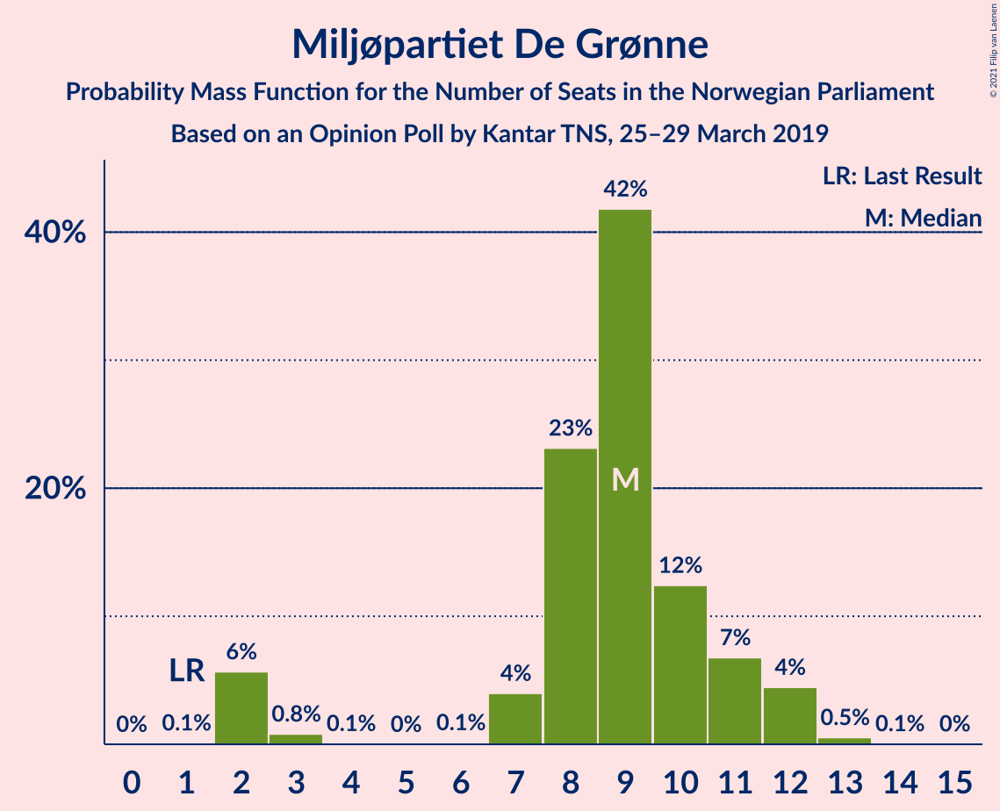
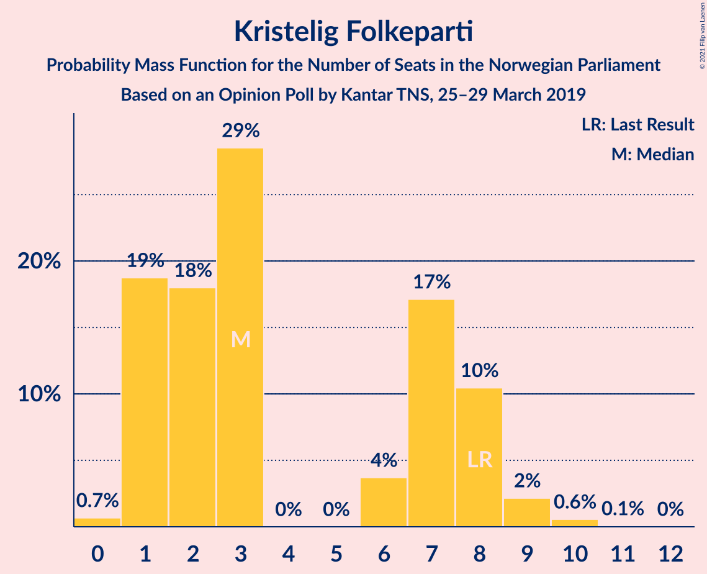
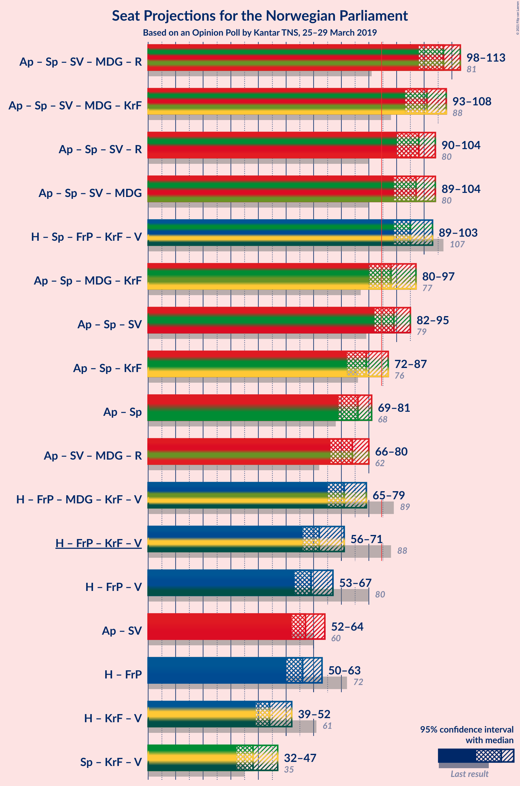
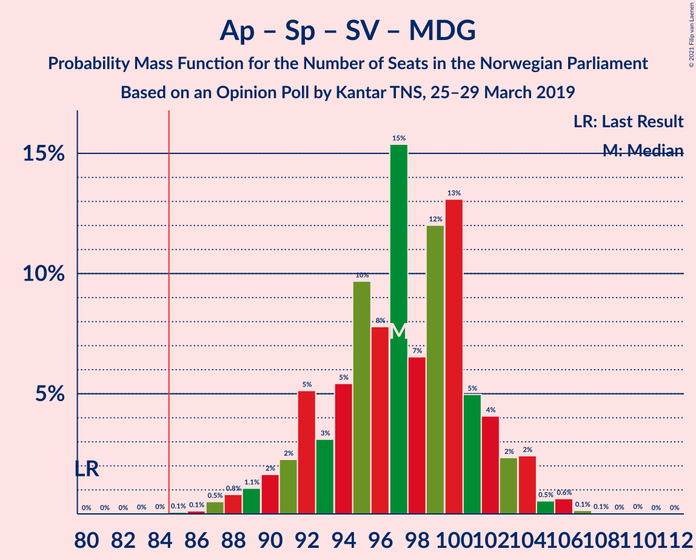
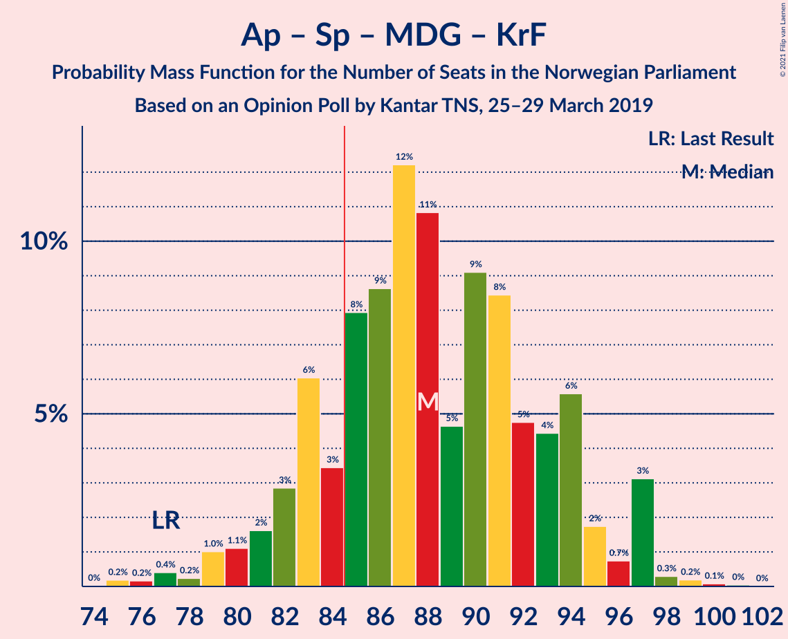

# Opinion Poll by Kantar TNS, 25–29 March 2019

<a href="#voting-intentions">Voting Intentions</a> | <a href="#seats">Seats</a> | <a href="#coalitions">Coalitions</a> | <a href="#technical-information">Technical Information</a>

## Voting Intentions

### Confidence Intervals

| Party | Last Result | Poll Result | 80% Confidence Interval | 90% Confidence Interval | 95% Confidence Interval | 99% Confidence Interval |
|:-----:|:-----------:|:-----------:|:-----------------------:|:-----------------------:|:-----------------------:|:-----------------------:|
| Arbeiderpartiet | 27.4% | 24.3% | 22.4–26.3% |21.9–26.9% |21.4–27.4% |20.5–28.4% |
| Høyre | 25.0% | 21.6% | 19.8–23.6% |19.3–24.1% |18.9–24.6% |18.0–25.6% |
| Senterpartiet | 10.3% | 16.9% | 15.3–18.8% |14.9–19.3% |14.5–19.7% |13.7–20.6% |
| Fremskrittspartiet | 15.2% | 10.4% | 9.1–11.9% |8.7–12.3% |8.4–12.7% |7.8–13.5% |
| Sosialistisk Venstreparti | 6.0% | 7.5% | 6.4–8.8% |6.1–9.2% |5.8–9.5% |5.3–10.2% |
| Rødt | 2.4% | 5.1% | 4.2–6.2% |3.9–6.5% |3.7–6.8% |3.4–7.4% |
| Miljøpartiet De Grønne | 3.2% | 5.1% | 4.2–6.2% |3.9–6.5% |3.7–6.8% |3.4–7.4% |
| Kristelig Folkeparti | 4.2% | 3.7% | 2.9–4.7% |2.7–5.0% |2.6–5.2% |2.3–5.7% |
| Venstre | 4.4% | 3.4% | 2.7–4.4% |2.5–4.7% |2.3–4.9% |2.1–5.4% |

*Note:* The poll result column reflects the actual value used in the calculations. Published results may vary slightly, and in addition be rounded to fewer digits.

## Seats

### Confidence Intervals

| Party | Last Result | Median | 80% Confidence Interval | 90% Confidence Interval | 95% Confidence Interval | 99% Confidence Interval |
|:-----:|:-----------:|:------:|:-----------------------:|:-----------------------:|:-----------------------:|:-----------------------:|
| <a href="#arbeiderpartiet">Arbeiderpartiet</a> | 49 | 43 | 41–45 |40–45 |40–47 |38–52 |
| <a href="#høyre">Høyre</a> | 45 | 40 | 34–42 |34–42 |32–44 |32–45 |
| <a href="#senterpartiet">Senterpartiet</a> | 19 | 33 | 29–35 |28–36 |26–36 |25–37 |
| <a href="#fremskrittspartiet">Fremskrittspartiet</a> | 27 | 18 | 16–19 |15–20 |14–21 |14–24 |
| <a href="#sosialistisk-venstreparti">Sosialistisk Venstreparti</a> | 11 | 12 | 11–15 |10–16 |10–16 |9–19 |
| <a href="#rødt">Rødt</a> | 1 | 10 | 7–11 |2–12 |2–12 |2–13 |
| <a href="#miljøpartiet-de-grønne">Miljøpartiet De Grønne</a> | 1 | 9 | 8–11 |8–12 |3–12 |2–12 |
| <a href="#kristelig-folkeparti">Kristelig Folkeparti</a> | 8 | 3 | 2–7 |1–7 |1–8 |1–9 |
| <a href="#venstre">Venstre</a> | 8 | 2 | 2–7 |2–8 |1–8 |1–9 |

### Arbeiderpartiet

*For a full overview of the results for this party, see the [Arbeiderpartiet](party-arbeiderpartiet.html) page.*

| Number of Seats | Probability | Accumulated | Special Marks |
|:---------------:|:-----------:|:-----------:|:-------------:|
| 36 | 0% | 100% |  |
| 37 | 0.1% | 99.9% |  |
| 38 | 0.8% | 99.9% |  |
| 39 | 0.2% | 99.1% |  |
| 40 | 8% | 98.8% |  |
| 41 | 2% | 91% |  |
| 42 | 5% | 89% |  |
| 43 | 59% | 84% | Median |
| 44 | 12% | 25% |  |
| 45 | 9% | 13% |  |
| 46 | 1.1% | 4% |  |
| 47 | 0.9% | 3% |  |
| 48 | 1.1% | 2% |  |
| 49 | 0.3% | 1.4% | Last Result |
| 50 | 0.4% | 1.1% |  |
| 51 | 0% | 0.7% |  |
| 52 | 0.3% | 0.6% |  |
| 53 | 0.2% | 0.4% |  |
| 54 | 0.1% | 0.1% |  |
| 55 | 0% | 0% |  |

### Høyre

*For a full overview of the results for this party, see the [Høyre](party-høyre.html) page.*

| Number of Seats | Probability | Accumulated | Special Marks |
|:---------------:|:-----------:|:-----------:|:-------------:|
| 30 | 0.1% | 100% |  |
| 31 | 0% | 99.9% |  |
| 32 | 2% | 99.8% |  |
| 33 | 0.7% | 97% |  |
| 34 | 8% | 97% |  |
| 35 | 4% | 88% |  |
| 36 | 7% | 84% |  |
| 37 | 7% | 77% |  |
| 38 | 6% | 70% |  |
| 39 | 6% | 64% |  |
| 40 | 34% | 58% | Median |
| 41 | 12% | 24% |  |
| 42 | 8% | 12% |  |
| 43 | 2% | 4% |  |
| 44 | 2% | 3% |  |
| 45 | 0.3% | 0.5% | Last Result |
| 46 | 0.1% | 0.2% |  |
| 47 | 0.1% | 0.1% |  |
| 48 | 0% | 0.1% |  |
| 49 | 0% | 0% |  |

### Senterpartiet

*For a full overview of the results for this party, see the [Senterpartiet](party-senterpartiet.html) page.*

| Number of Seats | Probability | Accumulated | Special Marks |
|:---------------:|:-----------:|:-----------:|:-------------:|
| 19 | 0% | 100% | Last Result |
| 20 | 0% | 100% |  |
| 21 | 0% | 100% |  |
| 22 | 0% | 100% |  |
| 23 | 0.1% | 100% |  |
| 24 | 0.2% | 99.9% |  |
| 25 | 0.4% | 99.7% |  |
| 26 | 2% | 99.3% |  |
| 27 | 2% | 97% |  |
| 28 | 3% | 96% |  |
| 29 | 10% | 93% |  |
| 30 | 7% | 83% |  |
| 31 | 4% | 76% |  |
| 32 | 5% | 72% |  |
| 33 | 44% | 67% | Median |
| 34 | 13% | 23% |  |
| 35 | 3% | 11% |  |
| 36 | 5% | 8% |  |
| 37 | 2% | 2% |  |
| 38 | 0.1% | 0.2% |  |
| 39 | 0.1% | 0.1% |  |
| 40 | 0% | 0.1% |  |
| 41 | 0% | 0% |  |

### Fremskrittspartiet

*For a full overview of the results for this party, see the [Fremskrittspartiet](party-fremskrittspartiet.html) page.*

| Number of Seats | Probability | Accumulated | Special Marks |
|:---------------:|:-----------:|:-----------:|:-------------:|
| 12 | 0.1% | 100% |  |
| 13 | 0.3% | 99.9% |  |
| 14 | 4% | 99.6% |  |
| 15 | 5% | 96% |  |
| 16 | 17% | 91% |  |
| 17 | 12% | 73% |  |
| 18 | 47% | 62% | Median |
| 19 | 8% | 15% |  |
| 20 | 3% | 7% |  |
| 21 | 2% | 4% |  |
| 22 | 1.0% | 2% |  |
| 23 | 0.5% | 1.2% |  |
| 24 | 0.3% | 0.7% |  |
| 25 | 0.3% | 0.4% |  |
| 26 | 0% | 0% |  |
| 27 | 0% | 0% | Last Result |

### Sosialistisk Venstreparti

*For a full overview of the results for this party, see the [Sosialistisk Venstreparti](party-sosialistiskvenstreparti.html) page.*

| Number of Seats | Probability | Accumulated | Special Marks |
|:---------------:|:-----------:|:-----------:|:-------------:|
| 8 | 0.1% | 100% |  |
| 9 | 1.1% | 99.9% |  |
| 10 | 8% | 98.8% |  |
| 11 | 5% | 91% | Last Result |
| 12 | 38% | 85% | Median |
| 13 | 15% | 47% |  |
| 14 | 19% | 32% |  |
| 15 | 3% | 13% |  |
| 16 | 8% | 10% |  |
| 17 | 0.4% | 2% |  |
| 18 | 0.7% | 2% |  |
| 19 | 0.9% | 0.9% |  |
| 20 | 0% | 0% |  |

### Rødt

*For a full overview of the results for this party, see the [Rødt](party-rødt.html) page.*

| Number of Seats | Probability | Accumulated | Special Marks |
|:---------------:|:-----------:|:-----------:|:-------------:|
| 1 | 0% | 100% | Last Result |
| 2 | 8% | 100% |  |
| 3 | 0% | 92% |  |
| 4 | 0% | 92% |  |
| 5 | 0% | 92% |  |
| 6 | 0% | 92% |  |
| 7 | 5% | 92% |  |
| 8 | 25% | 87% |  |
| 9 | 12% | 63% |  |
| 10 | 39% | 51% | Median |
| 11 | 5% | 12% |  |
| 12 | 6% | 7% |  |
| 13 | 0.7% | 0.9% |  |
| 14 | 0.1% | 0.1% |  |
| 15 | 0% | 0% |  |

### Miljøpartiet De Grønne

*For a full overview of the results for this party, see the [Miljøpartiet De Grønne](party-miljøpartietdegrønne.html) page.*

| Number of Seats | Probability | Accumulated | Special Marks |
|:---------------:|:-----------:|:-----------:|:-------------:|
| 1 | 0% | 100% | Last Result |
| 2 | 2% | 100% |  |
| 3 | 0.5% | 98% |  |
| 4 | 0% | 97% |  |
| 5 | 0% | 97% |  |
| 6 | 0% | 97% |  |
| 7 | 1.0% | 97% |  |
| 8 | 16% | 96% |  |
| 9 | 56% | 80% | Median |
| 10 | 2% | 24% |  |
| 11 | 14% | 22% |  |
| 12 | 8% | 8% |  |
| 13 | 0.1% | 0.2% |  |
| 14 | 0% | 0.1% |  |
| 15 | 0% | 0% |  |

### Kristelig Folkeparti

*For a full overview of the results for this party, see the [Kristelig Folkeparti](party-kristeligfolkeparti.html) page.*

| Number of Seats | Probability | Accumulated | Special Marks |
|:---------------:|:-----------:|:-----------:|:-------------:|
| 0 | 0.1% | 100% |  |
| 1 | 5% | 99.9% |  |
| 2 | 37% | 95% |  |
| 3 | 38% | 58% | Median |
| 4 | 0% | 20% |  |
| 5 | 0% | 20% |  |
| 6 | 0.6% | 20% |  |
| 7 | 16% | 19% |  |
| 8 | 2% | 3% | Last Result |
| 9 | 0.9% | 1.1% |  |
| 10 | 0.2% | 0.3% |  |
| 11 | 0.1% | 0.1% |  |
| 12 | 0% | 0% |  |

### Venstre

*For a full overview of the results for this party, see the [Venstre](party-venstre.html) page.*

| Number of Seats | Probability | Accumulated | Special Marks |
|:---------------:|:-----------:|:-----------:|:-------------:|
| 0 | 0.1% | 100% |  |
| 1 | 3% | 99.9% |  |
| 2 | 73% | 97% | Median |
| 3 | 4% | 25% |  |
| 4 | 0% | 20% |  |
| 5 | 0% | 20% |  |
| 6 | 0% | 20% |  |
| 7 | 14% | 20% |  |
| 8 | 4% | 6% | Last Result |
| 9 | 2% | 2% |  |
| 10 | 0.2% | 0.2% |  |
| 11 | 0% | 0% |  |

## Coalitions

### Confidence Intervals

| Coalition | Last Result | Median | Majority? | 80% Confidence Interval | 90% Confidence Interval | 95% Confidence Interval | 99% Confidence Interval |
|:---------:|:-----------:|:------:|:---------:|:-----------------------:|:-----------------------:|:-----------------------:|:-----------------------:|
| Arbeiderpartiet – Senterpartiet – Sosialistisk Venstreparti – Miljøpartiet De Grønne – Rødt | 81 | 107 | 100% | 101–110 | 101–113 | 100–113 | 95–115 |
| Arbeiderpartiet – Senterpartiet – Sosialistisk Venstreparti – Miljøpartiet De Grønne – Kristelig Folkeparti | 88 | 99 | 100% | 97–107 | 97–107 | 95–107 | 93–108 |
| Arbeiderpartiet – Senterpartiet – Sosialistisk Venstreparti – Miljøpartiet De Grønne | 80 | 97 | 99.9% | 94–101 | 93–104 | 92–104 | 87–104 |
| Arbeiderpartiet – Senterpartiet – Sosialistisk Venstreparti – Rødt | 80 | 98 | 100% | 93–101 | 92–102 | 92–102 | 88–104 |
| Høyre – Senterpartiet – Fremskrittspartiet – Kristelig Folkeparti – Venstre | 107 | 95 | 99.9% | 90–100 | 90–101 | 88–102 | 85–105 |
| Arbeiderpartiet – Senterpartiet – Miljøpartiet De Grønne – Kristelig Folkeparti | 77 | 87 | 84% | 83–93 | 82–94 | 81–94 | 79–96 |
| Arbeiderpartiet – Senterpartiet – Sosialistisk Venstreparti | 79 | 88 | 95% | 86–91 | 85–93 | 84–93 | 82–96 |
| Arbeiderpartiet – Senterpartiet – Kristelig Folkeparti | 76 | 78 | 1.4% | 75–83 | 75–84 | 74–84 | 68–87 |
| Arbeiderpartiet – Senterpartiet | 68 | 76 | 0.3% | 72–78 | 72–79 | 71–80 | 67–83 |
| Høyre – Fremskrittspartiet – Miljøpartiet De Grønne – Kristelig Folkeparti – Venstre | 89 | 71 | 0% | 68–76 | 67–77 | 67–77 | 65–81 |
| Høyre – Fremskrittspartiet – Kristelig Folkeparti – Venstre | 88 | 62 | 0% | 59–68 | 56–68 | 56–69 | 54–74 |
| Høyre – Fremskrittspartiet – Venstre | 80 | 60 | 0% | 54–64 | 53–64 | 53–65 | 53–68 |
| Arbeiderpartiet – Sosialistisk Venstreparti | 60 | 55 | 0% | 53–59 | 53–60 | 52–62 | 50–64 |
| Høyre – Fremskrittspartiet | 72 | 57 | 0% | 51–59 | 51–61 | 50–62 | 49–65 |
| Høyre – Kristelig Folkeparti – Venstre | 61 | 44 | 0% | 41–51 | 41–51 | 39–52 | 38–55 |
| Senterpartiet – Kristelig Folkeparti – Venstre | 35 | 39 | 0% | 36–43 | 33–46 | 32–46 | 30–48 |

### Arbeiderpartiet – Senterpartiet – Sosialistisk Venstreparti – Miljøpartiet De Grønne – Rødt

| Number of Seats | Probability | Accumulated | Special Marks |
|:---------------:|:-----------:|:-----------:|:-------------:|
| 81 | 0% | 100% | Last Result |
| 82 | 0% | 100% |  |
| 83 | 0% | 100% |  |
| 84 | 0% | 100% |  |
| 85 | 0% | 100% | Majority |
| 86 | 0% | 100% |  |
| 87 | 0% | 100% |  |
| 88 | 0% | 100% |  |
| 89 | 0% | 100% |  |
| 90 | 0.1% | 100% |  |
| 91 | 0.1% | 99.9% |  |
| 92 | 0% | 99.9% |  |
| 93 | 0.1% | 99.9% |  |
| 94 | 0% | 99.8% |  |
| 95 | 0.4% | 99.8% |  |
| 96 | 0.1% | 99.4% |  |
| 97 | 1.1% | 99.3% |  |
| 98 | 0.2% | 98% |  |
| 99 | 0.2% | 98% |  |
| 100 | 1.1% | 98% |  |
| 101 | 7% | 97% |  |
| 102 | 10% | 90% |  |
| 103 | 6% | 80% |  |
| 104 | 1.2% | 73% |  |
| 105 | 2% | 72% |  |
| 106 | 4% | 70% |  |
| 107 | 41% | 66% | Median |
| 108 | 9% | 25% |  |
| 109 | 5% | 17% |  |
| 110 | 2% | 12% |  |
| 111 | 2% | 10% |  |
| 112 | 2% | 8% |  |
| 113 | 4% | 6% |  |
| 114 | 0.1% | 1.4% |  |
| 115 | 1.2% | 1.3% |  |
| 116 | 0% | 0% |  |

### Arbeiderpartiet – Senterpartiet – Sosialistisk Venstreparti – Miljøpartiet De Grønne – Kristelig Folkeparti

| Number of Seats | Probability | Accumulated | Special Marks |
|:---------------:|:-----------:|:-----------:|:-------------:|
| 88 | 0% | 100% | Last Result |
| 89 | 0% | 99.9% |  |
| 90 | 0% | 99.9% |  |
| 91 | 0.1% | 99.9% |  |
| 92 | 0.2% | 99.8% |  |
| 93 | 0.2% | 99.6% |  |
| 94 | 1.0% | 99.4% |  |
| 95 | 2% | 98% |  |
| 96 | 0.5% | 96% |  |
| 97 | 10% | 96% |  |
| 98 | 7% | 85% |  |
| 99 | 35% | 78% |  |
| 100 | 6% | 43% | Median |
| 101 | 2% | 37% |  |
| 102 | 4% | 35% |  |
| 103 | 7% | 31% |  |
| 104 | 6% | 25% |  |
| 105 | 2% | 19% |  |
| 106 | 5% | 17% |  |
| 107 | 11% | 12% |  |
| 108 | 0.2% | 0.7% |  |
| 109 | 0.1% | 0.4% |  |
| 110 | 0.1% | 0.3% |  |
| 111 | 0% | 0.2% |  |
| 112 | 0.1% | 0.2% |  |
| 113 | 0% | 0.1% |  |
| 114 | 0% | 0% |  |

### Arbeiderpartiet – Senterpartiet – Sosialistisk Venstreparti – Miljøpartiet De Grønne

| Number of Seats | Probability | Accumulated | Special Marks |
|:---------------:|:-----------:|:-----------:|:-------------:|
| 80 | 0% | 100% | Last Result |
| 81 | 0% | 100% |  |
| 82 | 0% | 100% |  |
| 83 | 0% | 100% |  |
| 84 | 0.1% | 100% |  |
| 85 | 0.1% | 99.9% | Majority |
| 86 | 0.1% | 99.9% |  |
| 87 | 0.4% | 99.8% |  |
| 88 | 0.1% | 99.4% |  |
| 89 | 0.2% | 99.2% |  |
| 90 | 0.7% | 99.0% |  |
| 91 | 0.5% | 98% |  |
| 92 | 2% | 98% |  |
| 93 | 3% | 96% |  |
| 94 | 11% | 93% |  |
| 95 | 7% | 83% |  |
| 96 | 4% | 76% |  |
| 97 | 39% | 72% | Median |
| 98 | 2% | 33% |  |
| 99 | 9% | 32% |  |
| 100 | 9% | 23% |  |
| 101 | 7% | 14% |  |
| 102 | 0.2% | 8% |  |
| 103 | 0.7% | 8% |  |
| 104 | 7% | 7% |  |
| 105 | 0.2% | 0.4% |  |
| 106 | 0.1% | 0.2% |  |
| 107 | 0% | 0.1% |  |
| 108 | 0% | 0% |  |

### Arbeiderpartiet – Senterpartiet – Sosialistisk Venstreparti – Rødt

| Number of Seats | Probability | Accumulated | Special Marks |
|:---------------:|:-----------:|:-----------:|:-------------:|
| 80 | 0% | 100% | Last Result |
| 81 | 0% | 100% |  |
| 82 | 0% | 100% |  |
| 83 | 0% | 100% |  |
| 84 | 0% | 100% |  |
| 85 | 0% | 100% | Majority |
| 86 | 0% | 99.9% |  |
| 87 | 0.2% | 99.9% |  |
| 88 | 0.3% | 99.7% |  |
| 89 | 0.4% | 99.4% |  |
| 90 | 0.4% | 99.0% |  |
| 91 | 0.3% | 98.5% |  |
| 92 | 8% | 98% |  |
| 93 | 3% | 90% |  |
| 94 | 13% | 87% |  |
| 95 | 1.3% | 74% |  |
| 96 | 5% | 73% |  |
| 97 | 6% | 68% |  |
| 98 | 43% | 62% | Median |
| 99 | 5% | 19% |  |
| 100 | 3% | 14% |  |
| 101 | 4% | 11% |  |
| 102 | 5% | 7% |  |
| 103 | 0.3% | 2% |  |
| 104 | 1.4% | 2% |  |
| 105 | 0.1% | 0.3% |  |
| 106 | 0.1% | 0.2% |  |
| 107 | 0% | 0.2% |  |
| 108 | 0.1% | 0.1% |  |
| 109 | 0% | 0% |  |

### Høyre – Senterpartiet – Fremskrittspartiet – Kristelig Folkeparti – Venstre

| Number of Seats | Probability | Accumulated | Special Marks |
|:---------------:|:-----------:|:-----------:|:-------------:|
| 83 | 0% | 100% |  |
| 84 | 0% | 99.9% |  |
| 85 | 1.0% | 99.9% | Majority |
| 86 | 0.4% | 98.9% |  |
| 87 | 0.7% | 98% |  |
| 88 | 0.5% | 98% |  |
| 89 | 1.5% | 97% |  |
| 90 | 6% | 96% |  |
| 91 | 8% | 90% |  |
| 92 | 1.1% | 81% |  |
| 93 | 3% | 80% |  |
| 94 | 5% | 78% |  |
| 95 | 41% | 72% |  |
| 96 | 9% | 31% | Median |
| 97 | 4% | 23% |  |
| 98 | 4% | 19% |  |
| 99 | 3% | 15% |  |
| 100 | 3% | 12% |  |
| 101 | 6% | 9% |  |
| 102 | 2% | 4% |  |
| 103 | 0.5% | 1.4% |  |
| 104 | 0.4% | 0.9% |  |
| 105 | 0.1% | 0.5% |  |
| 106 | 0.3% | 0.4% |  |
| 107 | 0.1% | 0.1% | Last Result |
| 108 | 0% | 0% |  |

### Arbeiderpartiet – Senterpartiet – Miljøpartiet De Grønne – Kristelig Folkeparti

| Number of Seats | Probability | Accumulated | Special Marks |
|:---------------:|:-----------:|:-----------:|:-------------:|
| 76 | 0% | 100% |  |
| 77 | 0.2% | 99.9% | Last Result |
| 78 | 0.1% | 99.7% |  |
| 79 | 1.0% | 99.6% |  |
| 80 | 0.8% | 98.6% |  |
| 81 | 0.6% | 98% |  |
| 82 | 2% | 97% |  |
| 83 | 9% | 95% |  |
| 84 | 2% | 86% |  |
| 85 | 6% | 84% | Majority |
| 86 | 2% | 78% |  |
| 87 | 35% | 76% |  |
| 88 | 5% | 41% | Median |
| 89 | 2% | 36% |  |
| 90 | 7% | 34% |  |
| 91 | 6% | 27% |  |
| 92 | 7% | 21% |  |
| 93 | 8% | 14% |  |
| 94 | 5% | 6% |  |
| 95 | 0.4% | 1.0% |  |
| 96 | 0.2% | 0.5% |  |
| 97 | 0.2% | 0.3% |  |
| 98 | 0.1% | 0.2% |  |
| 99 | 0% | 0.1% |  |
| 100 | 0.1% | 0.1% |  |
| 101 | 0% | 0% |  |

### Arbeiderpartiet – Senterpartiet – Sosialistisk Venstreparti

| Number of Seats | Probability | Accumulated | Special Marks |
|:---------------:|:-----------:|:-----------:|:-------------:|
| 77 | 0% | 100% |  |
| 78 | 0.1% | 99.9% |  |
| 79 | 0.1% | 99.9% | Last Result |
| 80 | 0.1% | 99.8% |  |
| 81 | 0.1% | 99.7% |  |
| 82 | 0.8% | 99.6% |  |
| 83 | 1.2% | 98.8% |  |
| 84 | 2% | 98% |  |
| 85 | 3% | 95% | Majority |
| 86 | 14% | 92% |  |
| 87 | 5% | 78% |  |
| 88 | 44% | 73% | Median |
| 89 | 4% | 29% |  |
| 90 | 12% | 25% |  |
| 91 | 5% | 14% |  |
| 92 | 0.5% | 9% |  |
| 93 | 7% | 8% |  |
| 94 | 0.2% | 1.0% |  |
| 95 | 0.3% | 0.8% |  |
| 96 | 0.2% | 0.5% |  |
| 97 | 0.2% | 0.3% |  |
| 98 | 0% | 0.1% |  |
| 99 | 0% | 0.1% |  |
| 100 | 0% | 0% |  |

### Arbeiderpartiet – Senterpartiet – Kristelig Folkeparti

| Number of Seats | Probability | Accumulated | Special Marks |
|:---------------:|:-----------:|:-----------:|:-------------:|
| 67 | 0% | 100% |  |
| 68 | 0.5% | 99.9% |  |
| 69 | 0.1% | 99.4% |  |
| 70 | 0% | 99.3% |  |
| 71 | 0.2% | 99.3% |  |
| 72 | 0.1% | 99.1% |  |
| 73 | 1.1% | 99.1% |  |
| 74 | 2% | 98% |  |
| 75 | 10% | 96% |  |
| 76 | 7% | 86% | Last Result |
| 77 | 3% | 79% |  |
| 78 | 35% | 76% |  |
| 79 | 5% | 41% | Median |
| 80 | 8% | 36% |  |
| 81 | 8% | 28% |  |
| 82 | 10% | 20% |  |
| 83 | 5% | 10% |  |
| 84 | 4% | 5% |  |
| 85 | 0.3% | 1.4% | Majority |
| 86 | 0.2% | 1.1% |  |
| 87 | 0.4% | 0.9% |  |
| 88 | 0.2% | 0.5% |  |
| 89 | 0.1% | 0.3% |  |
| 90 | 0.1% | 0.2% |  |
| 91 | 0% | 0.1% |  |
| 92 | 0.1% | 0.1% |  |
| 93 | 0% | 0% |  |

### Arbeiderpartiet – Senterpartiet

| Number of Seats | Probability | Accumulated | Special Marks |
|:---------------:|:-----------:|:-----------:|:-------------:|
| 64 | 0% | 100% |  |
| 65 | 0% | 99.9% |  |
| 66 | 0.1% | 99.9% |  |
| 67 | 0.5% | 99.8% |  |
| 68 | 0.1% | 99.3% | Last Result |
| 69 | 0.2% | 99.2% |  |
| 70 | 1.2% | 98.9% |  |
| 71 | 2% | 98% |  |
| 72 | 11% | 96% |  |
| 73 | 7% | 85% |  |
| 74 | 7% | 78% |  |
| 75 | 6% | 72% |  |
| 76 | 42% | 65% | Median |
| 77 | 11% | 24% |  |
| 78 | 4% | 12% |  |
| 79 | 5% | 8% |  |
| 80 | 2% | 3% |  |
| 81 | 0.8% | 1.4% |  |
| 82 | 0.1% | 0.6% |  |
| 83 | 0.2% | 0.5% |  |
| 84 | 0.1% | 0.3% |  |
| 85 | 0.1% | 0.3% | Majority |
| 86 | 0.1% | 0.2% |  |
| 87 | 0% | 0% |  |

### Høyre – Fremskrittspartiet – Miljøpartiet De Grønne – Kristelig Folkeparti – Venstre

| Number of Seats | Probability | Accumulated | Special Marks |
|:---------------:|:-----------:|:-----------:|:-------------:|
| 61 | 0.1% | 100% |  |
| 62 | 0% | 99.8% |  |
| 63 | 0.1% | 99.8% |  |
| 64 | 0.1% | 99.7% |  |
| 65 | 1.4% | 99.7% |  |
| 66 | 0.3% | 98% |  |
| 67 | 5% | 98% |  |
| 68 | 4% | 93% |  |
| 69 | 3% | 89% |  |
| 70 | 5% | 86% |  |
| 71 | 43% | 81% |  |
| 72 | 6% | 38% | Median |
| 73 | 5% | 32% |  |
| 74 | 1.3% | 27% |  |
| 75 | 13% | 26% |  |
| 76 | 3% | 13% |  |
| 77 | 8% | 10% |  |
| 78 | 0.3% | 2% |  |
| 79 | 0.4% | 1.4% |  |
| 80 | 0.4% | 1.0% |  |
| 81 | 0.3% | 0.6% |  |
| 82 | 0.2% | 0.3% |  |
| 83 | 0% | 0.1% |  |
| 84 | 0% | 0.1% |  |
| 85 | 0% | 0% | Majority |
| 86 | 0% | 0% |  |
| 87 | 0% | 0% |  |
| 88 | 0% | 0% |  |
| 89 | 0% | 0% | Last Result |

### Høyre – Fremskrittspartiet – Kristelig Folkeparti – Venstre

| Number of Seats | Probability | Accumulated | Special Marks |
|:---------------:|:-----------:|:-----------:|:-------------:|
| 54 | 1.2% | 100% |  |
| 55 | 0.1% | 98.7% |  |
| 56 | 4% | 98.6% |  |
| 57 | 2% | 94% |  |
| 58 | 2% | 92% |  |
| 59 | 2% | 90% |  |
| 60 | 5% | 88% |  |
| 61 | 9% | 83% |  |
| 62 | 41% | 74% |  |
| 63 | 4% | 34% | Median |
| 64 | 2% | 30% |  |
| 65 | 1.2% | 28% |  |
| 66 | 6% | 27% |  |
| 67 | 10% | 20% |  |
| 68 | 7% | 10% |  |
| 69 | 1.1% | 3% |  |
| 70 | 0.2% | 2% |  |
| 71 | 0.2% | 2% |  |
| 72 | 1.1% | 2% |  |
| 73 | 0.1% | 0.7% |  |
| 74 | 0.4% | 0.6% |  |
| 75 | 0% | 0.2% |  |
| 76 | 0.1% | 0.2% |  |
| 77 | 0% | 0.1% |  |
| 78 | 0.1% | 0.1% |  |
| 79 | 0.1% | 0.1% |  |
| 80 | 0% | 0% |  |
| 81 | 0% | 0% |  |
| 82 | 0% | 0% |  |
| 83 | 0% | 0% |  |
| 84 | 0% | 0% |  |
| 85 | 0% | 0% | Majority |
| 86 | 0% | 0% |  |
| 87 | 0% | 0% |  |
| 88 | 0% | 0% | Last Result |

### Høyre – Fremskrittspartiet – Venstre

| Number of Seats | Probability | Accumulated | Special Marks |
|:---------------:|:-----------:|:-----------:|:-------------:|
| 49 | 0.1% | 100% |  |
| 50 | 0% | 99.9% |  |
| 51 | 0.2% | 99.9% |  |
| 52 | 0.1% | 99.7% |  |
| 53 | 6% | 99.5% |  |
| 54 | 7% | 93% |  |
| 55 | 0.5% | 86% |  |
| 56 | 3% | 86% |  |
| 57 | 5% | 83% |  |
| 58 | 4% | 78% |  |
| 59 | 10% | 74% |  |
| 60 | 37% | 64% | Median |
| 61 | 9% | 27% |  |
| 62 | 1.1% | 18% |  |
| 63 | 4% | 17% |  |
| 64 | 10% | 13% |  |
| 65 | 1.2% | 3% |  |
| 66 | 1.0% | 2% |  |
| 67 | 0.2% | 0.8% |  |
| 68 | 0.1% | 0.6% |  |
| 69 | 0.2% | 0.5% |  |
| 70 | 0.1% | 0.3% |  |
| 71 | 0.1% | 0.1% |  |
| 72 | 0% | 0% |  |
| 73 | 0% | 0% |  |
| 74 | 0% | 0% |  |
| 75 | 0% | 0% |  |
| 76 | 0% | 0% |  |
| 77 | 0% | 0% |  |
| 78 | 0% | 0% |  |
| 79 | 0% | 0% |  |
| 80 | 0% | 0% | Last Result |

### Arbeiderpartiet – Sosialistisk Venstreparti

| Number of Seats | Probability | Accumulated | Special Marks |
|:---------------:|:-----------:|:-----------:|:-------------:|
| 48 | 0.3% | 100% |  |
| 49 | 0.1% | 99.7% |  |
| 50 | 0.2% | 99.6% |  |
| 51 | 0.8% | 99.5% |  |
| 52 | 1.3% | 98.7% |  |
| 53 | 11% | 97% |  |
| 54 | 5% | 86% |  |
| 55 | 40% | 81% | Median |
| 56 | 2% | 42% |  |
| 57 | 18% | 39% |  |
| 58 | 8% | 21% |  |
| 59 | 7% | 13% |  |
| 60 | 2% | 6% | Last Result |
| 61 | 1.0% | 4% |  |
| 62 | 2% | 3% |  |
| 63 | 0.4% | 1.1% |  |
| 64 | 0.3% | 0.7% |  |
| 65 | 0.1% | 0.4% |  |
| 66 | 0% | 0.3% |  |
| 67 | 0.2% | 0.2% |  |
| 68 | 0% | 0.1% |  |
| 69 | 0% | 0% |  |

### Høyre – Fremskrittspartiet

| Number of Seats | Probability | Accumulated | Special Marks |
|:---------------:|:-----------:|:-----------:|:-------------:|
| 47 | 0.1% | 100% |  |
| 48 | 0.2% | 99.9% |  |
| 49 | 0.4% | 99.6% |  |
| 50 | 3% | 99.2% |  |
| 51 | 6% | 96% |  |
| 52 | 9% | 89% |  |
| 53 | 4% | 81% |  |
| 54 | 3% | 77% |  |
| 55 | 3% | 74% |  |
| 56 | 8% | 71% |  |
| 57 | 14% | 63% |  |
| 58 | 37% | 49% | Median |
| 59 | 6% | 13% |  |
| 60 | 0.3% | 7% |  |
| 61 | 3% | 7% |  |
| 62 | 1.5% | 3% |  |
| 63 | 0.5% | 2% |  |
| 64 | 0.5% | 1.1% |  |
| 65 | 0.4% | 0.6% |  |
| 66 | 0% | 0.2% |  |
| 67 | 0.1% | 0.2% |  |
| 68 | 0% | 0% |  |
| 69 | 0% | 0% |  |
| 70 | 0% | 0% |  |
| 71 | 0% | 0% |  |
| 72 | 0% | 0% | Last Result |

### Høyre – Kristelig Folkeparti – Venstre

| Number of Seats | Probability | Accumulated | Special Marks |
|:---------------:|:-----------:|:-----------:|:-------------:|
| 36 | 0.1% | 100% |  |
| 37 | 0.1% | 99.9% |  |
| 38 | 1.3% | 99.8% |  |
| 39 | 1.4% | 98% |  |
| 40 | 2% | 97% |  |
| 41 | 6% | 95% |  |
| 42 | 3% | 90% |  |
| 43 | 13% | 86% |  |
| 44 | 38% | 73% |  |
| 45 | 2% | 35% | Median |
| 46 | 3% | 32% |  |
| 47 | 3% | 29% |  |
| 48 | 5% | 27% |  |
| 49 | 2% | 21% |  |
| 50 | 2% | 19% |  |
| 51 | 15% | 17% |  |
| 52 | 0.8% | 3% |  |
| 53 | 0.8% | 2% |  |
| 54 | 0.5% | 1.1% |  |
| 55 | 0.4% | 0.6% |  |
| 56 | 0% | 0.2% |  |
| 57 | 0.1% | 0.2% |  |
| 58 | 0.1% | 0.1% |  |
| 59 | 0% | 0.1% |  |
| 60 | 0% | 0.1% |  |
| 61 | 0% | 0% | Last Result |

### Senterpartiet – Kristelig Folkeparti – Venstre

| Number of Seats | Probability | Accumulated | Special Marks |
|:---------------:|:-----------:|:-----------:|:-------------:|
| 27 | 0% | 100% |  |
| 28 | 0.1% | 99.9% |  |
| 29 | 0.2% | 99.8% |  |
| 30 | 0.6% | 99.6% |  |
| 31 | 1.2% | 99.0% |  |
| 32 | 2% | 98% |  |
| 33 | 2% | 96% |  |
| 34 | 2% | 95% |  |
| 35 | 1.2% | 93% | Last Result |
| 36 | 5% | 92% |  |
| 37 | 34% | 87% |  |
| 38 | 0.6% | 53% | Median |
| 39 | 26% | 52% |  |
| 40 | 3% | 26% |  |
| 41 | 2% | 23% |  |
| 42 | 8% | 21% |  |
| 43 | 4% | 13% |  |
| 44 | 0.4% | 9% |  |
| 45 | 3% | 9% |  |
| 46 | 5% | 5% |  |
| 47 | 0.3% | 0.9% |  |
| 48 | 0.3% | 0.6% |  |
| 49 | 0.1% | 0.3% |  |
| 50 | 0.1% | 0.3% |  |
| 51 | 0.1% | 0.1% |  |
| 52 | 0% | 0.1% |  |
| 53 | 0% | 0% |  |

## Technical Information

### Opinion Poll

+ **Polling firm:** Kantar TNS
+ **Commissioner(s):** —
+ **Fieldwork period:** 25–29 March 2019

### Calculations

+ **Sample size:** 791
+ **Simulations done:** 131,072
+ **Error estimate:** 2.41%

