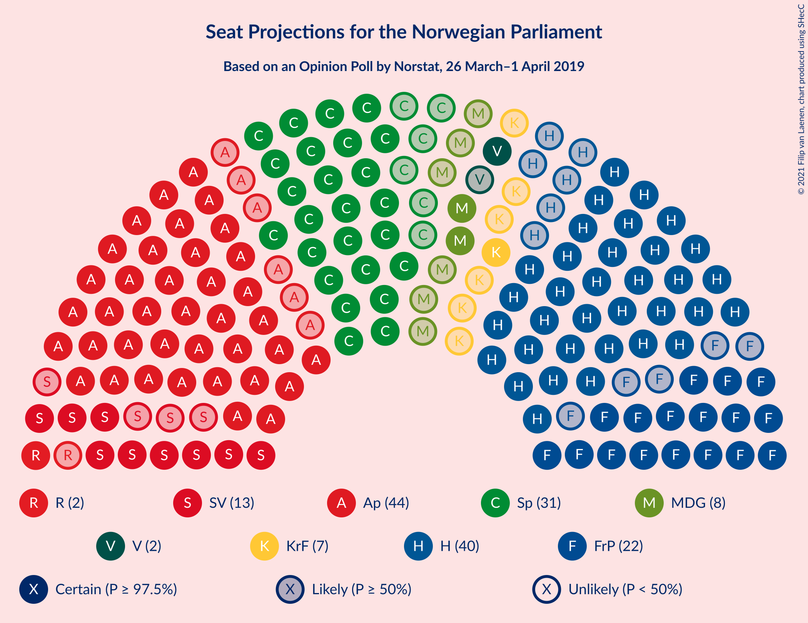
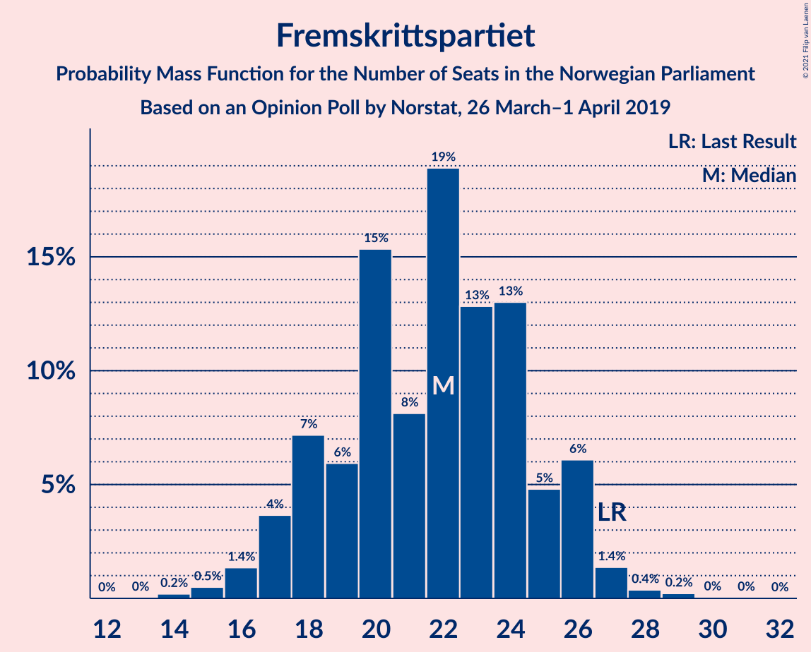
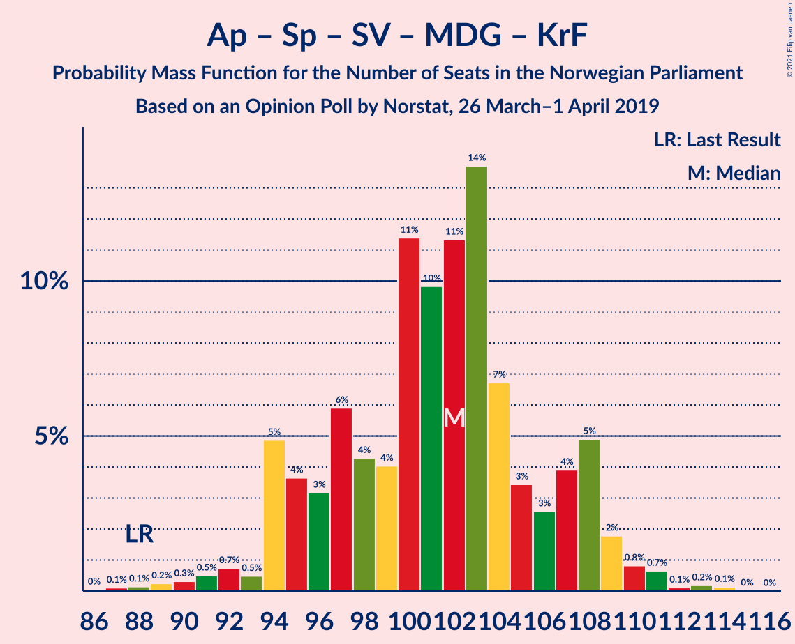
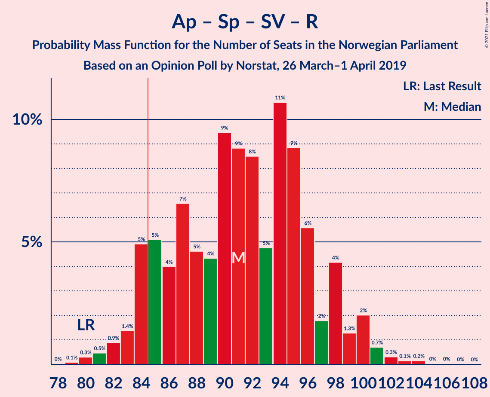
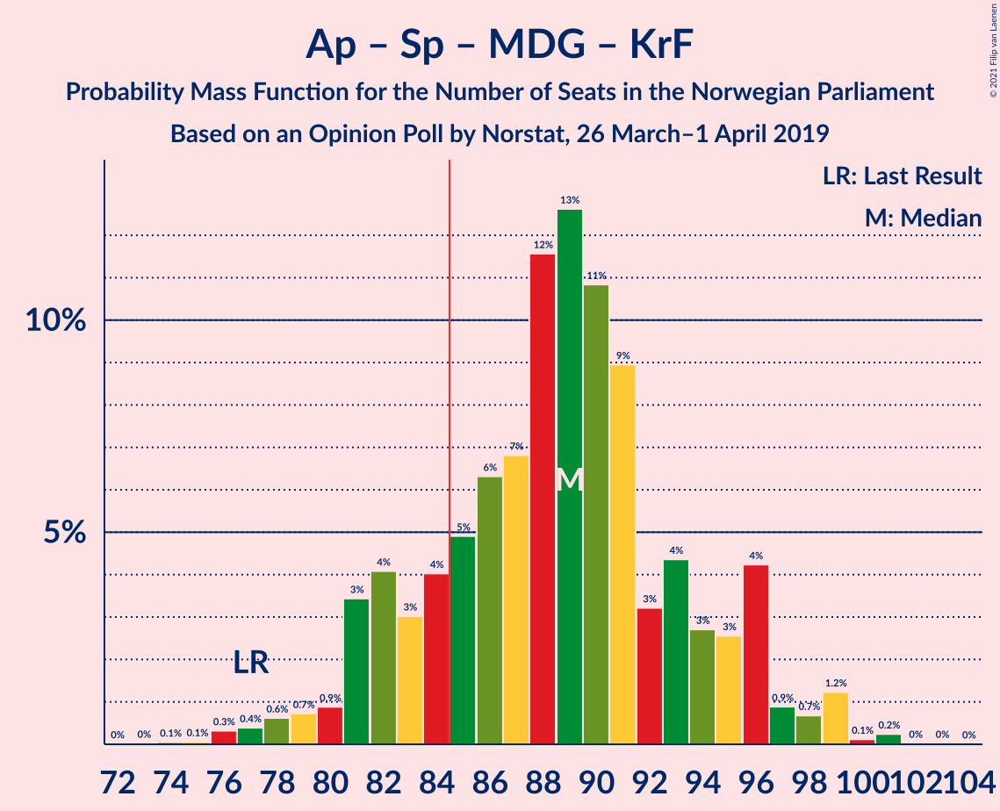
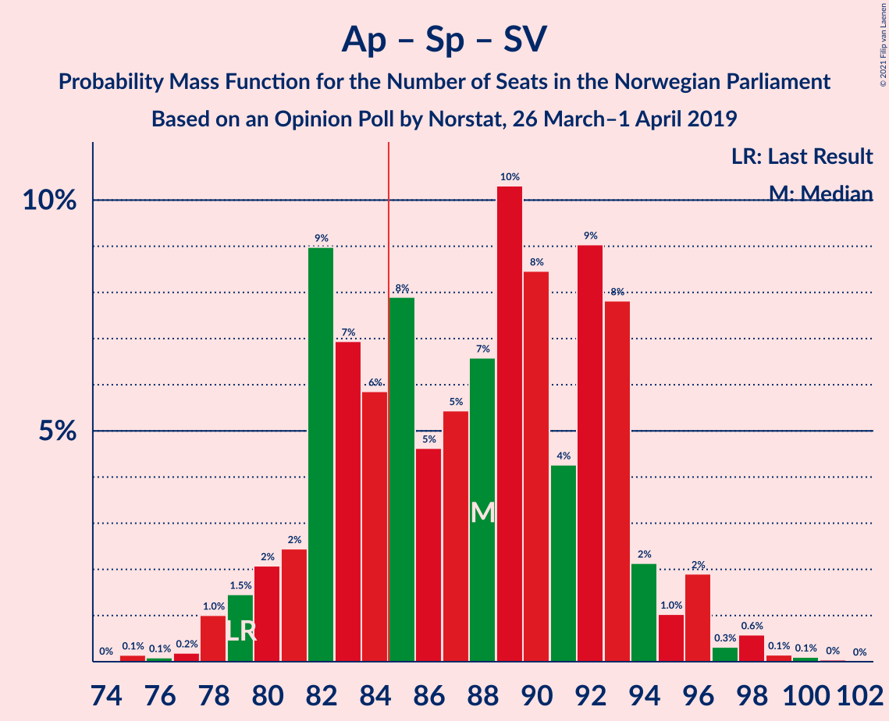
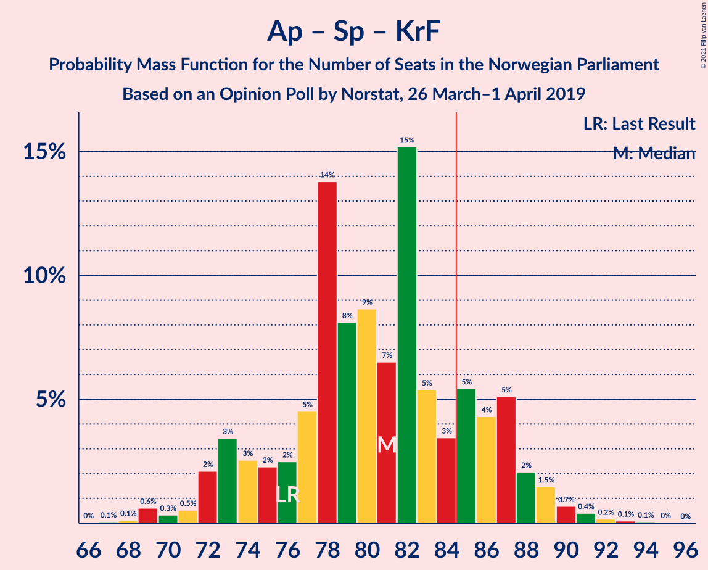
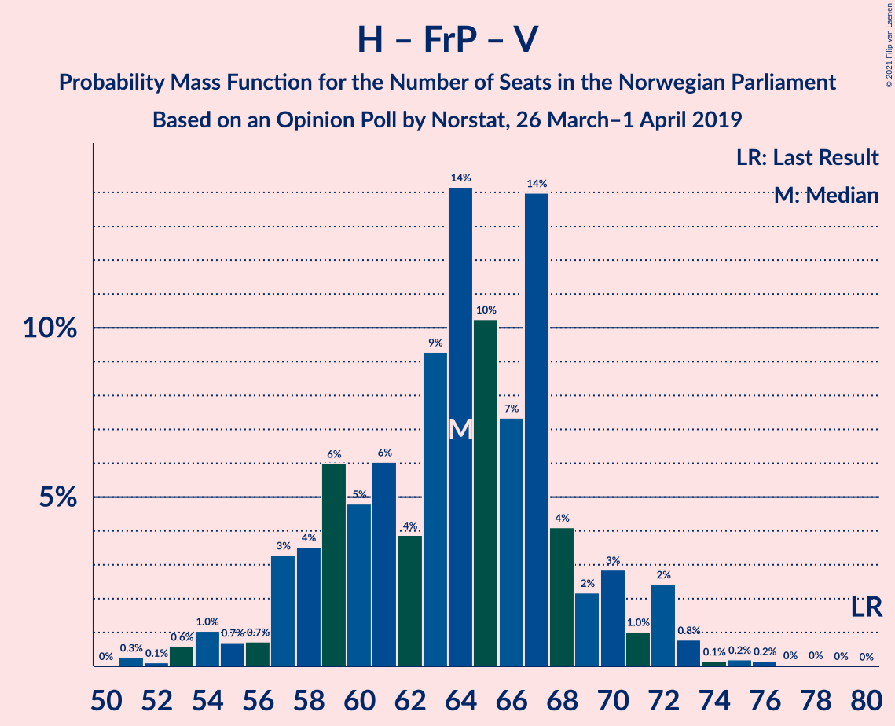
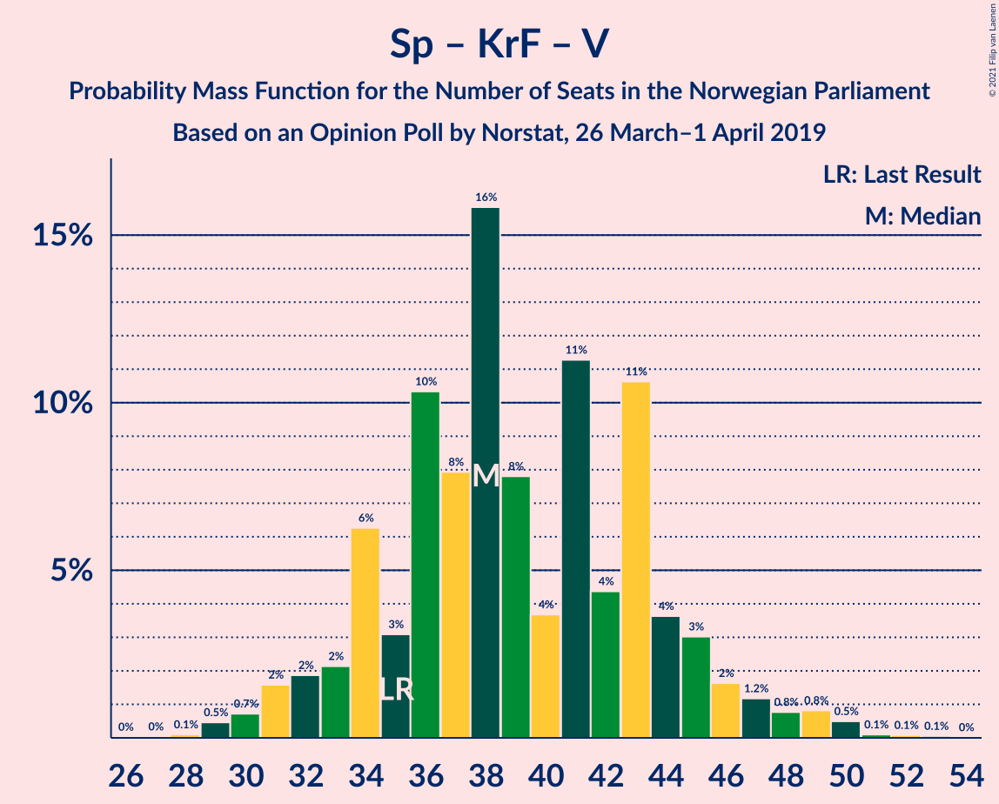

# Opinion Poll by Norstat, 26 March–1 April 2019

<a href="#voting-intentions">Voting Intentions</a> | <a href="#seats">Seats</a> | <a href="#coalitions">Coalitions</a> | <a href="#technical-information">Technical Information</a>

## Voting Intentions

### Confidence Intervals

| Party | Last Result | Poll Result | 80% Confidence Interval | 90% Confidence Interval | 95% Confidence Interval | 99% Confidence Interval |
|:-----:|:-----------:|:-----------:|:-----------------------:|:-----------------------:|:-----------------------:|:-----------------------:|
| Arbeiderpartiet | 27.4% | 24.0% | 21.9–26.3% |21.4–27.0% |20.9–27.5% |19.9–28.7% |
| Høyre | 25.0% | 22.3% | 20.3–24.5% |19.7–25.2% |19.2–25.7% |18.3–26.8% |
| Senterpartiet | 10.3% | 16.9% | 15.1–18.9% |14.6–19.5% |14.1–20.0% |13.3–21.0% |
| Fremskrittspartiet | 15.2% | 11.9% | 10.4–13.8% |10.0–14.3% |9.6–14.7% |8.9–15.6% |
| Sosialistisk Venstreparti | 6.0% | 7.0% | 5.9–8.5% |5.5–8.9% |5.3–9.3% |4.8–10.0% |
| Miljøpartiet De Grønne | 3.2% | 4.8% | 3.8–6.1% |3.6–6.4% |3.4–6.8% |3.0–7.4% |
| Kristelig Folkeparti | 4.2% | 4.1% | 3.3–5.3% |3.0–5.7% |2.8–6.0% |2.5–6.6% |
| Rødt | 2.4% | 3.7% | 2.9–4.8% |2.6–5.2% |2.5–5.4% |2.1–6.1% |
| Venstre | 4.4% | 2.9% | 2.2–3.9% |2.0–4.2% |1.8–4.5% |1.5–5.0% |

*Note:* The poll result column reflects the actual value used in the calculations. Published results may vary slightly, and in addition be rounded to fewer digits.

## Seats

### Confidence Intervals

| Party | Last Result | Median | 80% Confidence Interval | 90% Confidence Interval | 95% Confidence Interval | 99% Confidence Interval |
|:-----:|:-----------:|:------:|:-----------------------:|:-----------------------:|:-----------------------:|:-----------------------:|
| <a href="#arbeiderpartiet">Arbeiderpartiet</a> | 49 | 44 | 40–48 |39–50 |39–50 |37–52 |
| <a href="#høyre">Høyre</a> | 45 | 39 | 37–44 |34–45 |33–47 |33–48 |
| <a href="#senterpartiet">Senterpartiet</a> | 19 | 31 | 27–34 |25–35 |25–36 |24–39 |
| <a href="#fremskrittspartiet">Fremskrittspartiet</a> | 27 | 22 | 19–25 |17–27 |16–27 |15–28 |
| <a href="#sosialistisk-venstreparti">Sosialistisk Venstreparti</a> | 11 | 13 | 11–15 |10–15 |9–16 |8–18 |
| <a href="#miljøpartiet-de-grønne">Miljøpartiet De Grønne</a> | 1 | 9 | 7–11 |2–11 |2–12 |1–13 |
| <a href="#kristelig-folkeparti">Kristelig Folkeparti</a> | 8 | 7 | 3–10 |2–10 |1–10 |1–11 |
| <a href="#rødt">Rødt</a> | 1 | 2 | 2–8 |1–9 |1–10 |1–10 |
| <a href="#venstre">Venstre</a> | 8 | 2 | 1–2 |0–3 |0–7 |0–9 |

### Arbeiderpartiet

*For a full overview of the results for this party, see the [Arbeiderpartiet](party-arbeiderpartiet.html) page.*

| Number of Seats | Probability | Accumulated | Special Marks |
|:---------------:|:-----------:|:-----------:|:-------------:|
| 34 | 0.1% | 100% |  |
| 35 | 0% | 99.9% |  |
| 36 | 0.2% | 99.8% |  |
| 37 | 1.1% | 99.6% |  |
| 38 | 0.9% | 98.5% |  |
| 39 | 6% | 98% |  |
| 40 | 6% | 92% |  |
| 41 | 20% | 86% |  |
| 42 | 5% | 66% |  |
| 43 | 5% | 61% |  |
| 44 | 6% | 56% | Median |
| 45 | 11% | 49% |  |
| 46 | 4% | 38% |  |
| 47 | 3% | 35% |  |
| 48 | 25% | 31% |  |
| 49 | 0.9% | 7% | Last Result |
| 50 | 4% | 6% |  |
| 51 | 0.6% | 1.5% |  |
| 52 | 0.7% | 0.8% |  |
| 53 | 0.1% | 0.2% |  |
| 54 | 0% | 0.1% |  |
| 55 | 0% | 0% |  |

### Høyre

*For a full overview of the results for this party, see the [Høyre](party-høyre.html) page.*

| Number of Seats | Probability | Accumulated | Special Marks |
|:---------------:|:-----------:|:-----------:|:-------------:|
| 31 | 0.1% | 100% |  |
| 32 | 0.3% | 99.8% |  |
| 33 | 2% | 99.5% |  |
| 34 | 3% | 97% |  |
| 35 | 3% | 94% |  |
| 36 | 1.4% | 92% |  |
| 37 | 9% | 90% |  |
| 38 | 7% | 81% |  |
| 39 | 28% | 74% | Median |
| 40 | 8% | 46% |  |
| 41 | 8% | 38% |  |
| 42 | 17% | 30% |  |
| 43 | 2% | 12% |  |
| 44 | 3% | 10% |  |
| 45 | 3% | 7% | Last Result |
| 46 | 0.6% | 4% |  |
| 47 | 0.7% | 3% |  |
| 48 | 2% | 2% |  |
| 49 | 0.1% | 0.4% |  |
| 50 | 0% | 0.3% |  |
| 51 | 0.2% | 0.2% |  |
| 52 | 0.1% | 0.1% |  |
| 53 | 0% | 0% |  |

### Senterpartiet

*For a full overview of the results for this party, see the [Senterpartiet](party-senterpartiet.html) page.*

| Number of Seats | Probability | Accumulated | Special Marks |
|:---------------:|:-----------:|:-----------:|:-------------:|
| 19 | 0% | 100% | Last Result |
| 20 | 0% | 100% |  |
| 21 | 0.1% | 100% |  |
| 22 | 0% | 99.9% |  |
| 23 | 0.1% | 99.9% |  |
| 24 | 0.7% | 99.8% |  |
| 25 | 5% | 99.0% |  |
| 26 | 3% | 94% |  |
| 27 | 4% | 91% |  |
| 28 | 4% | 87% |  |
| 29 | 25% | 83% |  |
| 30 | 4% | 57% |  |
| 31 | 27% | 54% | Median |
| 32 | 8% | 27% |  |
| 33 | 5% | 18% |  |
| 34 | 4% | 13% |  |
| 35 | 5% | 9% |  |
| 36 | 2% | 5% |  |
| 37 | 0.9% | 2% |  |
| 38 | 0.3% | 2% |  |
| 39 | 1.0% | 1.3% |  |
| 40 | 0.3% | 0.3% |  |
| 41 | 0% | 0.1% |  |
| 42 | 0% | 0% |  |

### Fremskrittspartiet

*For a full overview of the results for this party, see the [Fremskrittspartiet](party-fremskrittspartiet.html) page.*

| Number of Seats | Probability | Accumulated | Special Marks |
|:---------------:|:-----------:|:-----------:|:-------------:|
| 14 | 0.2% | 100% |  |
| 15 | 0.9% | 99.8% |  |
| 16 | 2% | 98.9% |  |
| 17 | 3% | 97% |  |
| 18 | 4% | 94% |  |
| 19 | 3% | 90% |  |
| 20 | 10% | 87% |  |
| 21 | 9% | 78% |  |
| 22 | 48% | 69% | Median |
| 23 | 3% | 21% |  |
| 24 | 6% | 18% |  |
| 25 | 5% | 12% |  |
| 26 | 2% | 7% |  |
| 27 | 4% | 5% | Last Result |
| 28 | 1.1% | 1.3% |  |
| 29 | 0.1% | 0.2% |  |
| 30 | 0.1% | 0.1% |  |
| 31 | 0% | 0% |  |

### Sosialistisk Venstreparti

*For a full overview of the results for this party, see the [Sosialistisk Venstreparti](party-sosialistiskvenstreparti.html) page.*

| Number of Seats | Probability | Accumulated | Special Marks |
|:---------------:|:-----------:|:-----------:|:-------------:|
| 7 | 0% | 100% |  |
| 8 | 0.5% | 99.9% |  |
| 9 | 3% | 99.4% |  |
| 10 | 3% | 96% |  |
| 11 | 7% | 93% | Last Result |
| 12 | 17% | 86% |  |
| 13 | 49% | 69% | Median |
| 14 | 7% | 20% |  |
| 15 | 10% | 13% |  |
| 16 | 1.4% | 3% |  |
| 17 | 0.8% | 2% |  |
| 18 | 0.8% | 1.0% |  |
| 19 | 0.2% | 0.2% |  |
| 20 | 0% | 0% |  |

### Miljøpartiet De Grønne

*For a full overview of the results for this party, see the [Miljøpartiet De Grønne](party-miljøpartietdegrønne.html) page.*

| Number of Seats | Probability | Accumulated | Special Marks |
|:---------------:|:-----------:|:-----------:|:-------------:|
| 1 | 0.9% | 100% | Last Result |
| 2 | 6% | 99.1% |  |
| 3 | 1.4% | 93% |  |
| 4 | 0.3% | 92% |  |
| 5 | 0% | 92% |  |
| 6 | 0.6% | 92% |  |
| 7 | 4% | 91% |  |
| 8 | 30% | 88% |  |
| 9 | 34% | 57% | Median |
| 10 | 12% | 23% |  |
| 11 | 8% | 11% |  |
| 12 | 3% | 4% |  |
| 13 | 1.0% | 1.1% |  |
| 14 | 0.1% | 0.1% |  |
| 15 | 0% | 0% |  |

### Kristelig Folkeparti

*For a full overview of the results for this party, see the [Kristelig Folkeparti](party-kristeligfolkeparti.html) page.*

| Number of Seats | Probability | Accumulated | Special Marks |
|:---------------:|:-----------:|:-----------:|:-------------:|
| 0 | 0.2% | 100% |  |
| 1 | 4% | 99.8% |  |
| 2 | 4% | 96% |  |
| 3 | 41% | 92% |  |
| 4 | 0% | 51% |  |
| 5 | 0% | 51% |  |
| 6 | 0% | 51% |  |
| 7 | 9% | 51% | Median |
| 8 | 17% | 42% | Last Result |
| 9 | 5% | 26% |  |
| 10 | 19% | 20% |  |
| 11 | 0.8% | 1.2% |  |
| 12 | 0.3% | 0.4% |  |
| 13 | 0% | 0.1% |  |
| 14 | 0% | 0% |  |

### Rødt

*For a full overview of the results for this party, see the [Rødt](party-rødt.html) page.*

| Number of Seats | Probability | Accumulated | Special Marks |
|:---------------:|:-----------:|:-----------:|:-------------:|
| 1 | 7% | 100% | Last Result |
| 2 | 66% | 93% | Median |
| 3 | 0% | 27% |  |
| 4 | 0% | 27% |  |
| 5 | 0% | 27% |  |
| 6 | 0.6% | 27% |  |
| 7 | 9% | 26% |  |
| 8 | 11% | 17% |  |
| 9 | 3% | 6% |  |
| 10 | 3% | 4% |  |
| 11 | 0.3% | 0.4% |  |
| 12 | 0% | 0.1% |  |
| 13 | 0% | 0% |  |

### Venstre

*For a full overview of the results for this party, see the [Venstre](party-venstre.html) page.*

| Number of Seats | Probability | Accumulated | Special Marks |
|:---------------:|:-----------:|:-----------:|:-------------:|
| 0 | 6% | 100% |  |
| 1 | 11% | 94% |  |
| 2 | 78% | 84% | Median |
| 3 | 1.3% | 6% |  |
| 4 | 0% | 4% |  |
| 5 | 0% | 4% |  |
| 6 | 0.2% | 4% |  |
| 7 | 2% | 4% |  |
| 8 | 1.4% | 2% | Last Result |
| 9 | 0.2% | 0.5% |  |
| 10 | 0.3% | 0.4% |  |
| 11 | 0% | 0% |  |

## Coalitions

### Confidence Intervals

| Coalition | Last Result | Median | Majority? | 80% Confidence Interval | 90% Confidence Interval | 95% Confidence Interval | 99% Confidence Interval |
|:---------:|:-----------:|:------:|:---------:|:-----------------------:|:-----------------------:|:-----------------------:|:-----------------------:|
| Høyre – Senterpartiet – Fremskrittspartiet – Kristelig Folkeparti – Venstre | 107 | 98 | 100% | 96–105 | 94–108 | 92–109 | 90–112 |
| Arbeiderpartiet – Senterpartiet – Sosialistisk Venstreparti – Miljøpartiet De Grønne – Kristelig Folkeparti | 88 | 103 | 100% | 95–106 | 94–107 | 94–108 | 90–111 |
| Arbeiderpartiet – Senterpartiet – Sosialistisk Venstreparti – Miljøpartiet De Grønne – Rødt | 81 | 100 | 99.9% | 93–105 | 93–106 | 91–108 | 88–112 |
| Arbeiderpartiet – Senterpartiet – Sosialistisk Venstreparti – Miljøpartiet De Grønne | 80 | 97 | 99.4% | 90–101 | 87–103 | 87–104 | 84–106 |
| Arbeiderpartiet – Senterpartiet – Sosialistisk Venstreparti – Rødt | 80 | 92 | 95% | 85–96 | 84–98 | 83–100 | 80–102 |
| Arbeiderpartiet – Senterpartiet – Miljøpartiet De Grønne – Kristelig Folkeparti | 77 | 90 | 83% | 83–93 | 81–95 | 81–96 | 77–98 |
| Arbeiderpartiet – Senterpartiet – Sosialistisk Venstreparti | 79 | 88 | 65% | 81–92 | 78–94 | 78–95 | 78–97 |
| Arbeiderpartiet – Senterpartiet – Kristelig Folkeparti | 76 | 82 | 14% | 75–85 | 72–86 | 72–88 | 70–92 |
| Høyre – Fremskrittspartiet – Miljøpartiet De Grønne – Kristelig Folkeparti – Venstre | 89 | 76 | 5% | 73–84 | 71–85 | 69–86 | 67–89 |
| Arbeiderpartiet – Senterpartiet | 68 | 76 | 0.4% | 69–79 | 66–80 | 65–82 | 65–84 |
| Høyre – Fremskrittspartiet – Kristelig Folkeparti – Venstre | 88 | 69 | 0.1% | 64–76 | 63–76 | 61–77 | 57–81 |
| Høyre – Fremskrittspartiet – Venstre | 80 | 63 | 0% | 57–68 | 57–70 | 55–72 | 53–75 |
| Høyre – Fremskrittspartiet | 72 | 61 | 0% | 57–66 | 55–67 | 53–70 | 51–72 |
| Arbeiderpartiet – Sosialistisk Venstreparti | 60 | 57 | 0% | 52–61 | 51–62 | 50–65 | 48–66 |
| Høyre – Kristelig Folkeparti – Venstre | 61 | 47 | 0% | 43–54 | 42–54 | 40–55 | 39–58 |
| Senterpartiet – Kristelig Folkeparti – Venstre | 35 | 37 | 0% | 34–44 | 33–45 | 31–46 | 29–49 |

### Høyre – Senterpartiet – Fremskrittspartiet – Kristelig Folkeparti – Venstre

| Number of Seats | Probability | Accumulated | Special Marks |
|:---------------:|:-----------:|:-----------:|:-------------:|
| 85 | 0.1% | 100% | Majority |
| 86 | 0% | 99.9% |  |
| 87 | 0.1% | 99.9% |  |
| 88 | 0% | 99.8% |  |
| 89 | 0.2% | 99.8% |  |
| 90 | 0.2% | 99.6% |  |
| 91 | 1.1% | 99.4% |  |
| 92 | 2% | 98% |  |
| 93 | 0.3% | 96% |  |
| 94 | 0.9% | 96% |  |
| 95 | 1.2% | 95% |  |
| 96 | 5% | 94% |  |
| 97 | 32% | 88% |  |
| 98 | 6% | 56% |  |
| 99 | 10% | 50% |  |
| 100 | 6% | 40% |  |
| 101 | 3% | 34% | Median |
| 102 | 1.1% | 31% |  |
| 103 | 2% | 30% |  |
| 104 | 1.2% | 28% |  |
| 105 | 18% | 27% |  |
| 106 | 0.8% | 8% |  |
| 107 | 2% | 7% | Last Result |
| 108 | 1.5% | 5% |  |
| 109 | 2% | 4% |  |
| 110 | 0.7% | 2% |  |
| 111 | 0.3% | 1.0% |  |
| 112 | 0.5% | 0.6% |  |
| 113 | 0% | 0.1% |  |
| 114 | 0% | 0.1% |  |
| 115 | 0% | 0.1% |  |
| 116 | 0% | 0% |  |

### Arbeiderpartiet – Senterpartiet – Sosialistisk Venstreparti – Miljøpartiet De Grønne – Kristelig Folkeparti

| Number of Seats | Probability | Accumulated | Special Marks |
|:---------------:|:-----------:|:-----------:|:-------------:|
| 85 | 0.1% | 100% | Majority |
| 86 | 0.1% | 99.9% |  |
| 87 | 0% | 99.8% |  |
| 88 | 0% | 99.7% | Last Result |
| 89 | 0.1% | 99.7% |  |
| 90 | 0.1% | 99.6% |  |
| 91 | 0.2% | 99.5% |  |
| 92 | 0.7% | 99.3% |  |
| 93 | 0.9% | 98.6% |  |
| 94 | 7% | 98% |  |
| 95 | 5% | 91% |  |
| 96 | 1.0% | 86% |  |
| 97 | 1.2% | 85% |  |
| 98 | 3% | 84% |  |
| 99 | 5% | 81% |  |
| 100 | 2% | 76% |  |
| 101 | 19% | 74% |  |
| 102 | 4% | 55% |  |
| 103 | 4% | 51% |  |
| 104 | 25% | 47% | Median |
| 105 | 9% | 22% |  |
| 106 | 5% | 13% |  |
| 107 | 4% | 8% |  |
| 108 | 2% | 4% |  |
| 109 | 0.8% | 2% |  |
| 110 | 0.4% | 1.3% |  |
| 111 | 0.7% | 0.9% |  |
| 112 | 0.1% | 0.3% |  |
| 113 | 0.1% | 0.2% |  |
| 114 | 0.1% | 0.1% |  |
| 115 | 0% | 0% |  |

### Arbeiderpartiet – Senterpartiet – Sosialistisk Venstreparti – Miljøpartiet De Grønne – Rødt

| Number of Seats | Probability | Accumulated | Special Marks |
|:---------------:|:-----------:|:-----------:|:-------------:|
| 81 | 0% | 100% | Last Result |
| 82 | 0% | 100% |  |
| 83 | 0% | 100% |  |
| 84 | 0% | 100% |  |
| 85 | 0% | 99.9% | Majority |
| 86 | 0.1% | 99.9% |  |
| 87 | 0% | 99.8% |  |
| 88 | 0.8% | 99.8% |  |
| 89 | 0.1% | 99.0% |  |
| 90 | 0.2% | 98.8% |  |
| 91 | 1.1% | 98.6% |  |
| 92 | 2% | 97% |  |
| 93 | 17% | 96% |  |
| 94 | 3% | 79% |  |
| 95 | 5% | 76% |  |
| 96 | 5% | 71% |  |
| 97 | 3% | 66% |  |
| 98 | 3% | 63% |  |
| 99 | 5% | 60% | Median |
| 100 | 6% | 54% |  |
| 101 | 2% | 48% |  |
| 102 | 3% | 47% |  |
| 103 | 27% | 44% |  |
| 104 | 7% | 17% |  |
| 105 | 1.3% | 10% |  |
| 106 | 5% | 9% |  |
| 107 | 1.1% | 4% |  |
| 108 | 1.5% | 3% |  |
| 109 | 0.4% | 1.1% |  |
| 110 | 0.1% | 0.8% |  |
| 111 | 0.1% | 0.7% |  |
| 112 | 0.5% | 0.6% |  |
| 113 | 0.1% | 0.1% |  |
| 114 | 0% | 0% |  |

### Arbeiderpartiet – Senterpartiet – Sosialistisk Venstreparti – Miljøpartiet De Grønne

| Number of Seats | Probability | Accumulated | Special Marks |
|:---------------:|:-----------:|:-----------:|:-------------:|
| 80 | 0% | 100% | Last Result |
| 81 | 0.1% | 100% |  |
| 82 | 0.1% | 99.9% |  |
| 83 | 0.1% | 99.8% |  |
| 84 | 0.4% | 99.7% |  |
| 85 | 0.4% | 99.4% | Majority |
| 86 | 1.0% | 99.0% |  |
| 87 | 5% | 98% |  |
| 88 | 1.3% | 93% |  |
| 89 | 1.5% | 92% |  |
| 90 | 2% | 91% |  |
| 91 | 19% | 89% |  |
| 92 | 5% | 70% |  |
| 93 | 1.4% | 65% |  |
| 94 | 4% | 64% |  |
| 95 | 5% | 60% |  |
| 96 | 4% | 55% |  |
| 97 | 7% | 51% | Median |
| 98 | 9% | 43% |  |
| 99 | 1.2% | 35% |  |
| 100 | 0.2% | 33% |  |
| 101 | 26% | 33% |  |
| 102 | 2% | 7% |  |
| 103 | 0.5% | 6% |  |
| 104 | 3% | 5% |  |
| 105 | 0.8% | 2% |  |
| 106 | 0.8% | 0.9% |  |
| 107 | 0% | 0.1% |  |
| 108 | 0% | 0.1% |  |
| 109 | 0.1% | 0.1% |  |
| 110 | 0% | 0% |  |

### Arbeiderpartiet – Senterpartiet – Sosialistisk Venstreparti – Rødt

| Number of Seats | Probability | Accumulated | Special Marks |
|:---------------:|:-----------:|:-----------:|:-------------:|
| 79 | 0.1% | 100% |  |
| 80 | 0.5% | 99.8% | Last Result |
| 81 | 0.1% | 99.4% |  |
| 82 | 0.6% | 99.2% |  |
| 83 | 3% | 98.7% |  |
| 84 | 0.8% | 95% |  |
| 85 | 15% | 95% | Majority |
| 86 | 9% | 80% |  |
| 87 | 1.4% | 71% |  |
| 88 | 4% | 69% |  |
| 89 | 3% | 65% |  |
| 90 | 6% | 62% | Median |
| 91 | 3% | 57% |  |
| 92 | 5% | 54% |  |
| 93 | 3% | 49% |  |
| 94 | 27% | 46% |  |
| 95 | 2% | 19% |  |
| 96 | 10% | 18% |  |
| 97 | 1.3% | 8% |  |
| 98 | 4% | 7% |  |
| 99 | 0.7% | 3% |  |
| 100 | 1.2% | 3% |  |
| 101 | 0.8% | 1.4% |  |
| 102 | 0.2% | 0.5% |  |
| 103 | 0.2% | 0.4% |  |
| 104 | 0.1% | 0.2% |  |
| 105 | 0% | 0% |  |

### Arbeiderpartiet – Senterpartiet – Miljøpartiet De Grønne – Kristelig Folkeparti

| Number of Seats | Probability | Accumulated | Special Marks |
|:---------------:|:-----------:|:-----------:|:-------------:|
| 74 | 0.1% | 100% |  |
| 75 | 0% | 99.9% |  |
| 76 | 0.2% | 99.8% |  |
| 77 | 0.4% | 99.6% | Last Result |
| 78 | 0.3% | 99.2% |  |
| 79 | 0.2% | 98.9% |  |
| 80 | 0.3% | 98.7% |  |
| 81 | 5% | 98% |  |
| 82 | 2% | 93% |  |
| 83 | 3% | 91% |  |
| 84 | 5% | 87% |  |
| 85 | 2% | 83% | Majority |
| 86 | 3% | 80% |  |
| 87 | 5% | 77% |  |
| 88 | 19% | 73% |  |
| 89 | 2% | 54% |  |
| 90 | 4% | 52% |  |
| 91 | 27% | 48% | Median |
| 92 | 3% | 20% |  |
| 93 | 8% | 18% |  |
| 94 | 3% | 9% |  |
| 95 | 3% | 6% |  |
| 96 | 2% | 3% |  |
| 97 | 0.5% | 2% |  |
| 98 | 0.8% | 1.1% |  |
| 99 | 0.1% | 0.3% |  |
| 100 | 0.1% | 0.3% |  |
| 101 | 0.1% | 0.2% |  |
| 102 | 0% | 0% |  |

### Arbeiderpartiet – Senterpartiet – Sosialistisk Venstreparti

| Number of Seats | Probability | Accumulated | Special Marks |
|:---------------:|:-----------:|:-----------:|:-------------:|
| 74 | 0% | 100% |  |
| 75 | 0% | 99.9% |  |
| 76 | 0.2% | 99.9% |  |
| 77 | 0.2% | 99.8% |  |
| 78 | 5% | 99.5% |  |
| 79 | 0.8% | 95% | Last Result |
| 80 | 2% | 94% |  |
| 81 | 3% | 93% |  |
| 82 | 1.3% | 89% |  |
| 83 | 16% | 88% |  |
| 84 | 8% | 73% |  |
| 85 | 4% | 65% | Majority |
| 86 | 3% | 61% |  |
| 87 | 5% | 58% |  |
| 88 | 7% | 53% | Median |
| 89 | 7% | 47% |  |
| 90 | 2% | 39% |  |
| 91 | 3% | 37% |  |
| 92 | 25% | 34% |  |
| 93 | 2% | 8% |  |
| 94 | 4% | 7% |  |
| 95 | 0.8% | 3% |  |
| 96 | 2% | 2% |  |
| 97 | 0.4% | 0.7% |  |
| 98 | 0.2% | 0.4% |  |
| 99 | 0% | 0.2% |  |
| 100 | 0.1% | 0.2% |  |
| 101 | 0% | 0.1% |  |
| 102 | 0% | 0% |  |

### Arbeiderpartiet – Senterpartiet – Kristelig Folkeparti

| Number of Seats | Probability | Accumulated | Special Marks |
|:---------------:|:-----------:|:-----------:|:-------------:|
| 67 | 0.1% | 100% |  |
| 68 | 0.1% | 99.9% |  |
| 69 | 0.2% | 99.7% |  |
| 70 | 0.1% | 99.5% |  |
| 71 | 0.1% | 99.4% |  |
| 72 | 7% | 99.3% |  |
| 73 | 0.7% | 92% |  |
| 74 | 1.2% | 92% |  |
| 75 | 2% | 90% |  |
| 76 | 3% | 88% | Last Result |
| 77 | 6% | 85% |  |
| 78 | 6% | 80% |  |
| 79 | 2% | 74% |  |
| 80 | 19% | 71% |  |
| 81 | 2% | 53% |  |
| 82 | 29% | 51% | Median |
| 83 | 5% | 21% |  |
| 84 | 2% | 16% |  |
| 85 | 7% | 14% | Majority |
| 86 | 2% | 7% |  |
| 87 | 1.5% | 5% |  |
| 88 | 1.1% | 3% |  |
| 89 | 0.6% | 2% |  |
| 90 | 0.4% | 2% |  |
| 91 | 0.8% | 1.3% |  |
| 92 | 0.1% | 0.5% |  |
| 93 | 0.4% | 0.4% |  |
| 94 | 0.1% | 0.1% |  |
| 95 | 0% | 0% |  |

### Høyre – Fremskrittspartiet – Miljøpartiet De Grønne – Kristelig Folkeparti – Venstre

| Number of Seats | Probability | Accumulated | Special Marks |
|:---------------:|:-----------:|:-----------:|:-------------:|
| 64 | 0% | 100% |  |
| 65 | 0.1% | 99.9% |  |
| 66 | 0.2% | 99.8% |  |
| 67 | 0.2% | 99.6% |  |
| 68 | 0.8% | 99.4% |  |
| 69 | 1.3% | 98.6% |  |
| 70 | 0.7% | 97% |  |
| 71 | 4% | 97% |  |
| 72 | 2% | 93% |  |
| 73 | 10% | 91% |  |
| 74 | 2% | 81% |  |
| 75 | 27% | 80% |  |
| 76 | 3% | 53% |  |
| 77 | 5% | 50% |  |
| 78 | 3% | 45% |  |
| 79 | 5% | 42% | Median |
| 80 | 3% | 37% |  |
| 81 | 4% | 34% |  |
| 82 | 1.4% | 30% |  |
| 83 | 9% | 29% |  |
| 84 | 15% | 20% |  |
| 85 | 0.7% | 5% | Majority |
| 86 | 3% | 5% |  |
| 87 | 0.5% | 1.3% |  |
| 88 | 0.1% | 0.7% |  |
| 89 | 0.5% | 0.6% | Last Result |
| 90 | 0.1% | 0.1% |  |
| 91 | 0% | 0% |  |

### Arbeiderpartiet – Senterpartiet

| Number of Seats | Probability | Accumulated | Special Marks |
|:---------------:|:-----------:|:-----------:|:-------------:|
| 62 | 0% | 100% |  |
| 63 | 0% | 99.9% |  |
| 64 | 0.2% | 99.9% |  |
| 65 | 4% | 99.7% |  |
| 66 | 1.3% | 95% |  |
| 67 | 0.7% | 94% |  |
| 68 | 0.5% | 93% | Last Result |
| 69 | 3% | 93% |  |
| 70 | 18% | 90% |  |
| 71 | 3% | 72% |  |
| 72 | 5% | 69% |  |
| 73 | 4% | 64% |  |
| 74 | 5% | 59% |  |
| 75 | 4% | 54% | Median |
| 76 | 6% | 50% |  |
| 77 | 9% | 44% |  |
| 78 | 2% | 36% |  |
| 79 | 28% | 34% |  |
| 80 | 2% | 7% |  |
| 81 | 1.0% | 5% |  |
| 82 | 2% | 4% |  |
| 83 | 0.8% | 2% |  |
| 84 | 0.4% | 0.8% |  |
| 85 | 0.2% | 0.4% | Majority |
| 86 | 0.2% | 0.2% |  |
| 87 | 0% | 0% |  |

### Høyre – Fremskrittspartiet – Kristelig Folkeparti – Venstre

| Number of Seats | Probability | Accumulated | Special Marks |
|:---------------:|:-----------:|:-----------:|:-------------:|
| 56 | 0.1% | 100% |  |
| 57 | 0.5% | 99.9% |  |
| 58 | 0.1% | 99.4% |  |
| 59 | 0.1% | 99.3% |  |
| 60 | 0.4% | 99.1% |  |
| 61 | 1.5% | 98.7% |  |
| 62 | 1.2% | 97% |  |
| 63 | 6% | 96% |  |
| 64 | 1.3% | 91% |  |
| 65 | 7% | 89% |  |
| 66 | 27% | 82% |  |
| 67 | 3% | 55% |  |
| 68 | 2% | 52% |  |
| 69 | 6% | 51% |  |
| 70 | 5% | 45% | Median |
| 71 | 3% | 39% |  |
| 72 | 3% | 36% |  |
| 73 | 4% | 33% |  |
| 74 | 5% | 29% |  |
| 75 | 3% | 24% |  |
| 76 | 16% | 21% |  |
| 77 | 2% | 4% |  |
| 78 | 1.1% | 2% |  |
| 79 | 0.2% | 1.3% |  |
| 80 | 0.1% | 1.1% |  |
| 81 | 0.8% | 1.0% |  |
| 82 | 0% | 0.2% |  |
| 83 | 0.1% | 0.2% |  |
| 84 | 0% | 0.1% |  |
| 85 | 0% | 0.1% | Majority |
| 86 | 0% | 0% |  |
| 87 | 0% | 0% |  |
| 88 | 0% | 0% | Last Result |

### Høyre – Fremskrittspartiet – Venstre

| Number of Seats | Probability | Accumulated | Special Marks |
|:---------------:|:-----------:|:-----------:|:-------------:|
| 51 | 0.3% | 100% |  |
| 52 | 0.1% | 99.7% |  |
| 53 | 0.3% | 99.6% |  |
| 54 | 0.9% | 99.3% |  |
| 55 | 1.1% | 98% |  |
| 56 | 1.5% | 97% |  |
| 57 | 6% | 96% |  |
| 58 | 2% | 90% |  |
| 59 | 3% | 88% |  |
| 60 | 6% | 85% |  |
| 61 | 2% | 79% |  |
| 62 | 5% | 77% |  |
| 63 | 26% | 72% | Median |
| 64 | 4% | 46% |  |
| 65 | 6% | 42% |  |
| 66 | 18% | 37% |  |
| 67 | 7% | 19% |  |
| 68 | 4% | 12% |  |
| 69 | 2% | 8% |  |
| 70 | 0.5% | 5% |  |
| 71 | 1.0% | 5% |  |
| 72 | 2% | 4% |  |
| 73 | 0.9% | 2% |  |
| 74 | 0% | 0.8% |  |
| 75 | 0.5% | 0.8% |  |
| 76 | 0.1% | 0.3% |  |
| 77 | 0% | 0.2% |  |
| 78 | 0% | 0.1% |  |
| 79 | 0% | 0.1% |  |
| 80 | 0% | 0.1% | Last Result |
| 81 | 0.1% | 0.1% |  |
| 82 | 0% | 0% |  |

### Høyre – Fremskrittspartiet

| Number of Seats | Probability | Accumulated | Special Marks |
|:---------------:|:-----------:|:-----------:|:-------------:|
| 49 | 0.3% | 100% |  |
| 50 | 0.1% | 99.6% |  |
| 51 | 0.4% | 99.5% |  |
| 52 | 1.1% | 99.1% |  |
| 53 | 1.4% | 98% |  |
| 54 | 1.4% | 97% |  |
| 55 | 1.0% | 95% |  |
| 56 | 2% | 94% |  |
| 57 | 9% | 92% |  |
| 58 | 4% | 83% |  |
| 59 | 3% | 79% |  |
| 60 | 4% | 76% |  |
| 61 | 27% | 72% | Median |
| 62 | 4% | 45% |  |
| 63 | 5% | 41% |  |
| 64 | 19% | 36% |  |
| 65 | 6% | 18% |  |
| 66 | 2% | 11% |  |
| 67 | 4% | 9% |  |
| 68 | 0.7% | 5% |  |
| 69 | 0.6% | 4% |  |
| 70 | 2% | 3% |  |
| 71 | 0.4% | 1.4% |  |
| 72 | 0.5% | 0.9% | Last Result |
| 73 | 0.3% | 0.4% |  |
| 74 | 0% | 0.1% |  |
| 75 | 0.1% | 0.1% |  |
| 76 | 0% | 0% |  |

### Arbeiderpartiet – Sosialistisk Venstreparti

| Number of Seats | Probability | Accumulated | Special Marks |
|:---------------:|:-----------:|:-----------:|:-------------:|
| 46 | 0.1% | 100% |  |
| 47 | 0.2% | 99.9% |  |
| 48 | 0.4% | 99.7% |  |
| 49 | 1.3% | 99.3% |  |
| 50 | 0.8% | 98% |  |
| 51 | 5% | 97% |  |
| 52 | 5% | 93% |  |
| 53 | 7% | 88% |  |
| 54 | 17% | 81% |  |
| 55 | 4% | 64% |  |
| 56 | 5% | 60% |  |
| 57 | 9% | 55% | Median |
| 58 | 6% | 46% |  |
| 59 | 5% | 40% |  |
| 60 | 2% | 35% | Last Result |
| 61 | 27% | 33% |  |
| 62 | 2% | 6% |  |
| 63 | 0.3% | 4% |  |
| 64 | 0.8% | 4% |  |
| 65 | 2% | 3% |  |
| 66 | 0.5% | 0.6% |  |
| 67 | 0.1% | 0.2% |  |
| 68 | 0% | 0% |  |

### Høyre – Kristelig Folkeparti – Venstre

| Number of Seats | Probability | Accumulated | Special Marks |
|:---------------:|:-----------:|:-----------:|:-------------:|
| 37 | 0.1% | 100% |  |
| 38 | 0.2% | 99.9% |  |
| 39 | 2% | 99.7% |  |
| 40 | 1.5% | 98% |  |
| 41 | 0.8% | 97% |  |
| 42 | 5% | 96% |  |
| 43 | 4% | 90% |  |
| 44 | 26% | 86% |  |
| 45 | 7% | 60% |  |
| 46 | 2% | 54% |  |
| 47 | 2% | 51% |  |
| 48 | 3% | 49% | Median |
| 49 | 12% | 46% |  |
| 50 | 2% | 34% |  |
| 51 | 6% | 32% |  |
| 52 | 2% | 26% |  |
| 53 | 5% | 24% |  |
| 54 | 15% | 19% |  |
| 55 | 1.3% | 3% |  |
| 56 | 1.1% | 2% |  |
| 57 | 0.3% | 1.1% |  |
| 58 | 0.3% | 0.8% |  |
| 59 | 0.3% | 0.4% |  |
| 60 | 0% | 0.1% |  |
| 61 | 0% | 0.1% | Last Result |
| 62 | 0% | 0.1% |  |
| 63 | 0% | 0% |  |

### Senterpartiet – Kristelig Folkeparti – Venstre

| Number of Seats | Probability | Accumulated | Special Marks |
|:---------------:|:-----------:|:-----------:|:-------------:|
| 28 | 0% | 100% |  |
| 29 | 0.5% | 99.9% |  |
| 30 | 2% | 99.4% |  |
| 31 | 0.3% | 98% |  |
| 32 | 1.0% | 97% |  |
| 33 | 3% | 96% |  |
| 34 | 9% | 94% |  |
| 35 | 4% | 85% | Last Result |
| 36 | 26% | 81% |  |
| 37 | 5% | 55% |  |
| 38 | 4% | 50% |  |
| 39 | 5% | 46% |  |
| 40 | 7% | 40% | Median |
| 41 | 18% | 33% |  |
| 42 | 2% | 15% |  |
| 43 | 2% | 13% |  |
| 44 | 4% | 11% |  |
| 45 | 3% | 6% |  |
| 46 | 1.1% | 4% |  |
| 47 | 1.4% | 2% |  |
| 48 | 0.2% | 1.1% |  |
| 49 | 0.4% | 0.9% |  |
| 50 | 0.1% | 0.5% |  |
| 51 | 0.2% | 0.3% |  |
| 52 | 0% | 0.1% |  |
| 53 | 0% | 0% |  |

## Technical Information

### Opinion Poll

+ **Polling firm:** Norstat
+ **Commissioner(s):** —
+ **Fieldwork period:** 26 March–1 April 2019

### Calculations

+ **Sample size:** 628
+ **Simulations done:** 131,072
+ **Error estimate:** 3.44%

