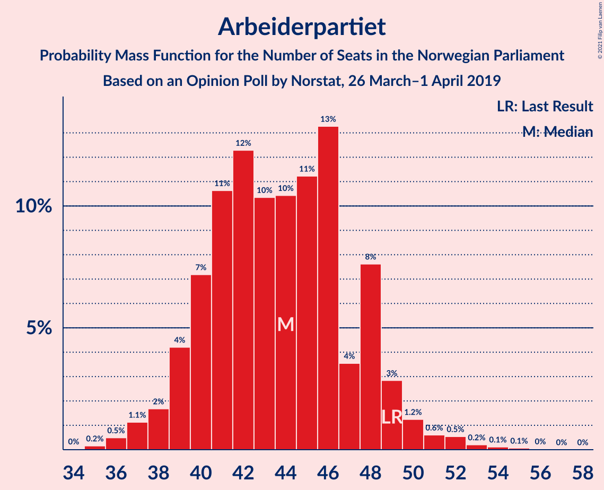
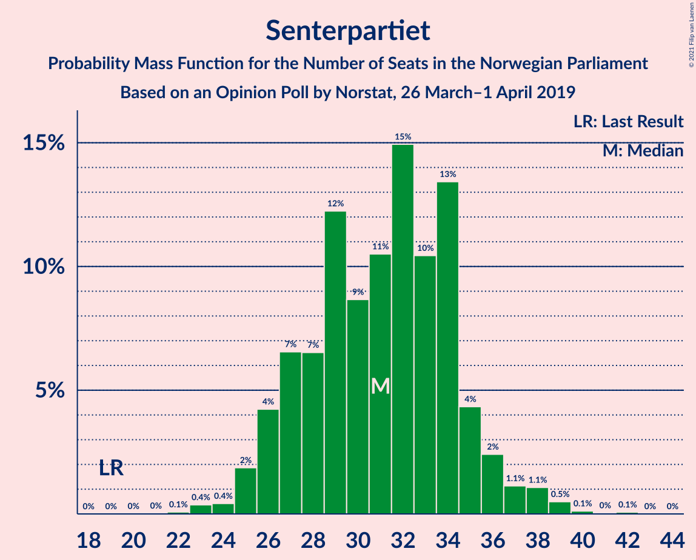
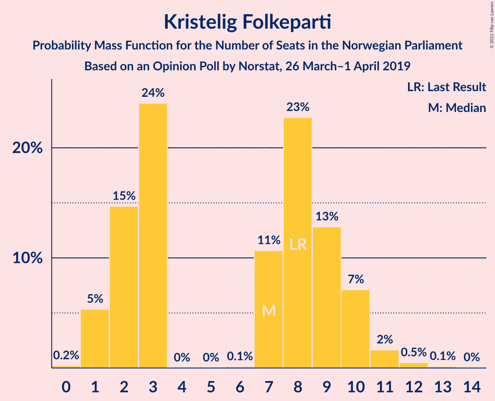
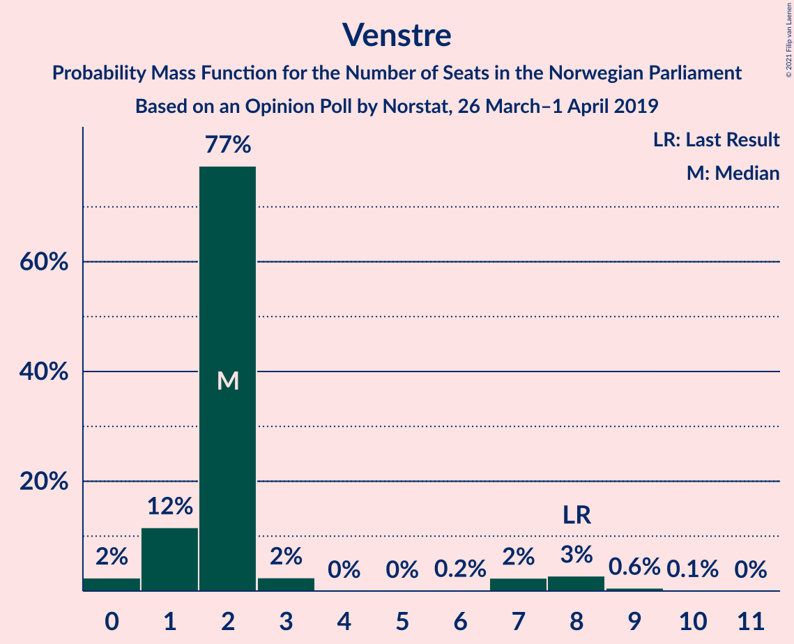
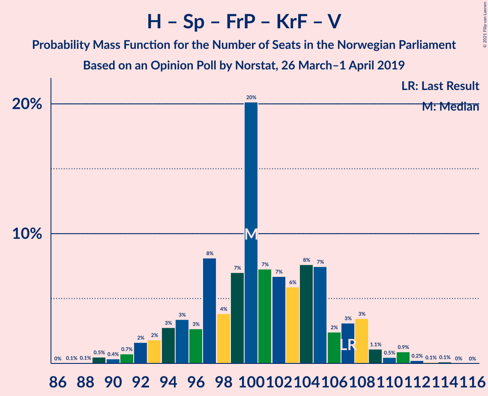
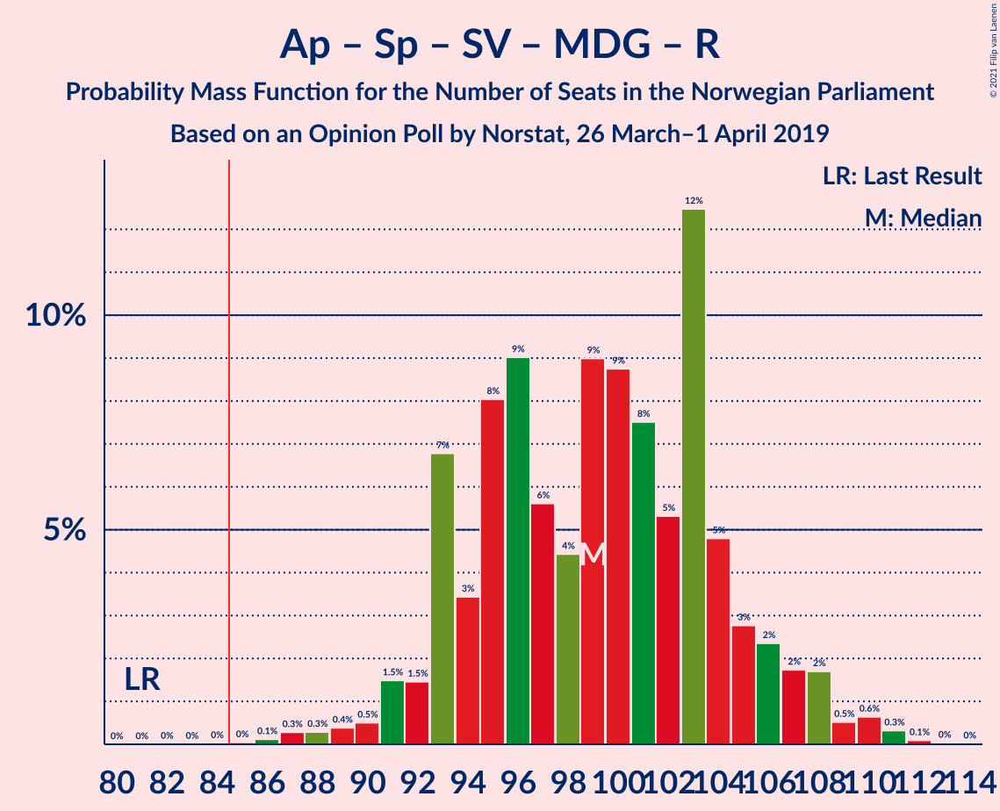
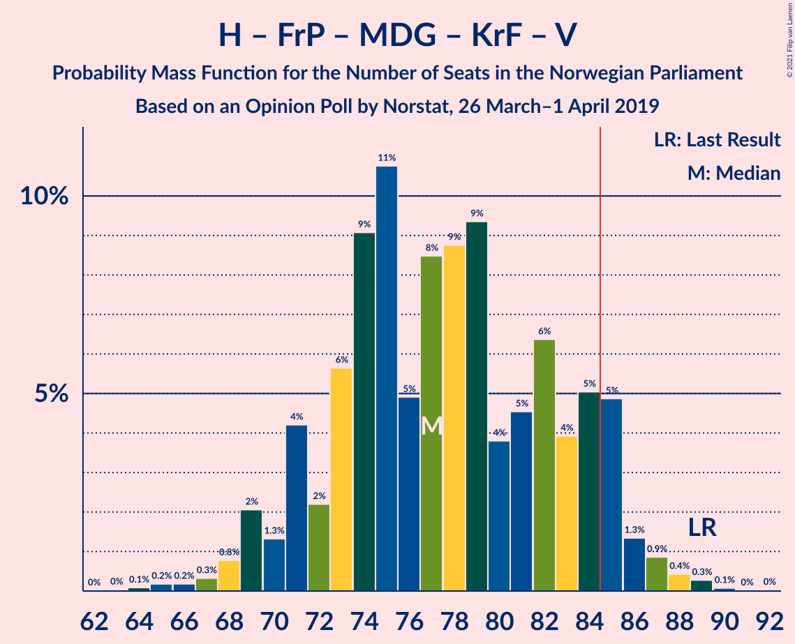

# Opinion Poll by Norstat, 26 March–1 April 2019

<a href="#voting-intentions">Voting Intentions</a> | <a href="#seats">Seats</a> | <a href="#coalitions">Coalitions</a> | <a href="#technical-information">Technical Information</a>

## Voting Intentions

### Confidence Intervals

| Party | Last Result | Poll Result | 80% Confidence Interval | 90% Confidence Interval | 95% Confidence Interval | 99% Confidence Interval |
|:-----:|:-----------:|:-----------:|:-----------------------:|:-----------------------:|:-----------------------:|:-----------------------:|
| Arbeiderpartiet | 27.4% | 24.0% | 21.9–26.3% |21.4–27.0% |20.9–27.5% |19.9–28.7% |
| Høyre | 25.0% | 22.3% | 20.3–24.5% |19.7–25.2% |19.2–25.7% |18.3–26.8% |
| Senterpartiet | 10.3% | 16.9% | 15.1–18.9% |14.6–19.5% |14.1–20.0% |13.3–21.0% |
| Fremskrittspartiet | 15.2% | 11.9% | 10.4–13.8% |10.0–14.3% |9.6–14.7% |8.9–15.6% |
| Sosialistisk Venstreparti | 6.0% | 7.0% | 5.9–8.5% |5.5–8.9% |5.3–9.3% |4.8–10.0% |
| Miljøpartiet De Grønne | 3.2% | 4.8% | 3.8–6.1% |3.6–6.4% |3.4–6.8% |3.0–7.4% |
| Kristelig Folkeparti | 4.2% | 4.1% | 3.3–5.3% |3.0–5.7% |2.8–6.0% |2.5–6.6% |
| Rødt | 2.4% | 3.7% | 2.9–4.8% |2.6–5.2% |2.5–5.4% |2.1–6.1% |
| Venstre | 4.4% | 2.9% | 2.2–3.9% |2.0–4.2% |1.8–4.5% |1.5–5.0% |

*Note:* The poll result column reflects the actual value used in the calculations. Published results may vary slightly, and in addition be rounded to fewer digits.

## Seats

### Confidence Intervals

| Party | Last Result | Median | 80% Confidence Interval | 90% Confidence Interval | 95% Confidence Interval | 99% Confidence Interval |
|:-----:|:-----------:|:------:|:-----------------------:|:-----------------------:|:-----------------------:|:-----------------------:|
| <a href="#arbeiderpartiet">Arbeiderpartiet</a> | 49 | 44 | 40–48 |39–49 |38–50 |36–52 |
| <a href="#høyre">Høyre</a> | 45 | 40 | 36–44 |35–45 |34–46 |32–48 |
| <a href="#senterpartiet">Senterpartiet</a> | 19 | 31 | 27–34 |26–36 |25–37 |24–39 |
| <a href="#fremskrittspartiet">Fremskrittspartiet</a> | 27 | 22 | 18–25 |17–26 |17–26 |15–28 |
| <a href="#sosialistisk-venstreparti">Sosialistisk Venstreparti</a> | 11 | 13 | 10–15 |10–16 |9–16 |8–19 |
| <a href="#miljøpartiet-de-grønne">Miljøpartiet De Grønne</a> | 1 | 9 | 3–11 |2–11 |2–12 |1–13 |
| <a href="#kristelig-folkeparti">Kristelig Folkeparti</a> | 8 | 7 | 2–9 |1–10 |1–10 |1–12 |
| <a href="#rødt">Rødt</a> | 1 | 2 | 2–8 |1–9 |1–9 |1–10 |
| <a href="#venstre">Venstre</a> | 8 | 2 | 1–2 |1–7 |1–8 |0–9 |

### Arbeiderpartiet

*For a full overview of the results for this party, see the [Arbeiderpartiet](party-arbeiderpartiet.html) page.*

| Number of Seats | Probability | Accumulated | Special Marks |
|:---------------:|:-----------:|:-----------:|:-------------:|
| 34 | 0% | 100% |  |
| 35 | 0.2% | 99.9% |  |
| 36 | 0.5% | 99.8% |  |
| 37 | 1.1% | 99.3% |  |
| 38 | 2% | 98% |  |
| 39 | 4% | 96% |  |
| 40 | 7% | 92% |  |
| 41 | 11% | 85% |  |
| 42 | 12% | 74% |  |
| 43 | 10% | 62% |  |
| 44 | 10% | 52% | Median |
| 45 | 11% | 41% |  |
| 46 | 13% | 30% |  |
| 47 | 4% | 17% |  |
| 48 | 8% | 13% |  |
| 49 | 3% | 6% | Last Result |
| 50 | 1.2% | 3% |  |
| 51 | 0.6% | 2% |  |
| 52 | 0.5% | 1.0% |  |
| 53 | 0.2% | 0.4% |  |
| 54 | 0.1% | 0.2% |  |
| 55 | 0.1% | 0.1% |  |
| 56 | 0% | 0.1% |  |
| 57 | 0% | 0% |  |

### Høyre

*For a full overview of the results for this party, see the [Høyre](party-høyre.html) page.*

| Number of Seats | Probability | Accumulated | Special Marks |
|:---------------:|:-----------:|:-----------:|:-------------:|
| 30 | 0% | 100% |  |
| 31 | 0.1% | 99.9% |  |
| 32 | 0.6% | 99.8% |  |
| 33 | 2% | 99.2% |  |
| 34 | 2% | 98% |  |
| 35 | 4% | 95% |  |
| 36 | 5% | 92% |  |
| 37 | 6% | 87% |  |
| 38 | 9% | 81% |  |
| 39 | 16% | 72% |  |
| 40 | 15% | 56% | Median |
| 41 | 12% | 41% |  |
| 42 | 9% | 29% |  |
| 43 | 7% | 19% |  |
| 44 | 4% | 12% |  |
| 45 | 4% | 8% | Last Result |
| 46 | 2% | 4% |  |
| 47 | 0.9% | 2% |  |
| 48 | 0.8% | 1.3% |  |
| 49 | 0.3% | 0.5% |  |
| 50 | 0.1% | 0.2% |  |
| 51 | 0.1% | 0.1% |  |
| 52 | 0% | 0.1% |  |
| 53 | 0% | 0% |  |

### Senterpartiet

*For a full overview of the results for this party, see the [Senterpartiet](party-senterpartiet.html) page.*

| Number of Seats | Probability | Accumulated | Special Marks |
|:---------------:|:-----------:|:-----------:|:-------------:|
| 19 | 0% | 100% | Last Result |
| 20 | 0% | 100% |  |
| 21 | 0% | 100% |  |
| 22 | 0.1% | 100% |  |
| 23 | 0.4% | 99.9% |  |
| 24 | 0.4% | 99.5% |  |
| 25 | 2% | 99.1% |  |
| 26 | 4% | 97% |  |
| 27 | 7% | 93% |  |
| 28 | 7% | 86% |  |
| 29 | 12% | 80% |  |
| 30 | 9% | 68% |  |
| 31 | 11% | 59% | Median |
| 32 | 15% | 48% |  |
| 33 | 10% | 34% |  |
| 34 | 13% | 23% |  |
| 35 | 4% | 10% |  |
| 36 | 2% | 5% |  |
| 37 | 1.1% | 3% |  |
| 38 | 1.1% | 2% |  |
| 39 | 0.5% | 0.7% |  |
| 40 | 0.1% | 0.2% |  |
| 41 | 0% | 0.1% |  |
| 42 | 0.1% | 0.1% |  |
| 43 | 0% | 0% |  |

### Fremskrittspartiet

*For a full overview of the results for this party, see the [Fremskrittspartiet](party-fremskrittspartiet.html) page.*

| Number of Seats | Probability | Accumulated | Special Marks |
|:---------------:|:-----------:|:-----------:|:-------------:|
| 14 | 0.2% | 100% |  |
| 15 | 0.5% | 99.8% |  |
| 16 | 1.4% | 99.3% |  |
| 17 | 4% | 98% |  |
| 18 | 7% | 94% |  |
| 19 | 6% | 87% |  |
| 20 | 15% | 81% |  |
| 21 | 8% | 66% |  |
| 22 | 19% | 58% | Median |
| 23 | 13% | 39% |  |
| 24 | 13% | 26% |  |
| 25 | 5% | 13% |  |
| 26 | 6% | 8% |  |
| 27 | 1.4% | 2% | Last Result |
| 28 | 0.4% | 0.7% |  |
| 29 | 0.2% | 0.3% |  |
| 30 | 0% | 0.1% |  |
| 31 | 0% | 0% |  |

### Sosialistisk Venstreparti

*For a full overview of the results for this party, see the [Sosialistisk Venstreparti](party-sosialistiskvenstreparti.html) page.*

| Number of Seats | Probability | Accumulated | Special Marks |
|:---------------:|:-----------:|:-----------:|:-------------:|
| 7 | 0.1% | 100% |  |
| 8 | 0.7% | 99.9% |  |
| 9 | 4% | 99.2% |  |
| 10 | 8% | 96% |  |
| 11 | 15% | 88% | Last Result |
| 12 | 16% | 73% |  |
| 13 | 28% | 57% | Median |
| 14 | 13% | 29% |  |
| 15 | 9% | 16% |  |
| 16 | 5% | 8% |  |
| 17 | 1.2% | 2% |  |
| 18 | 0.5% | 1.0% |  |
| 19 | 0.5% | 0.6% |  |
| 20 | 0% | 0.1% |  |
| 21 | 0% | 0% |  |

### Miljøpartiet De Grønne

*For a full overview of the results for this party, see the [Miljøpartiet De Grønne](party-miljøpartietdegrønne.html) page.*

| Number of Seats | Probability | Accumulated | Special Marks |
|:---------------:|:-----------:|:-----------:|:-------------:|
| 1 | 0.6% | 100% | Last Result |
| 2 | 9% | 99.4% |  |
| 3 | 6% | 91% |  |
| 4 | 2% | 85% |  |
| 5 | 0% | 84% |  |
| 6 | 0.2% | 84% |  |
| 7 | 3% | 83% |  |
| 8 | 30% | 81% |  |
| 9 | 27% | 50% | Median |
| 10 | 12% | 24% |  |
| 11 | 8% | 12% |  |
| 12 | 2% | 3% |  |
| 13 | 0.9% | 1.2% |  |
| 14 | 0.2% | 0.3% |  |
| 15 | 0.1% | 0.1% |  |
| 16 | 0% | 0% |  |

### Kristelig Folkeparti

*For a full overview of the results for this party, see the [Kristelig Folkeparti](party-kristeligfolkeparti.html) page.*

| Number of Seats | Probability | Accumulated | Special Marks |
|:---------------:|:-----------:|:-----------:|:-------------:|
| 0 | 0.2% | 100% |  |
| 1 | 5% | 99.8% |  |
| 2 | 15% | 94% |  |
| 3 | 24% | 80% |  |
| 4 | 0% | 56% |  |
| 5 | 0% | 56% |  |
| 6 | 0.1% | 56% |  |
| 7 | 11% | 56% | Median |
| 8 | 23% | 45% | Last Result |
| 9 | 13% | 22% |  |
| 10 | 7% | 9% |  |
| 11 | 2% | 2% |  |
| 12 | 0.5% | 0.6% |  |
| 13 | 0.1% | 0.2% |  |
| 14 | 0% | 0% |  |

### Rødt

*For a full overview of the results for this party, see the [Rødt](party-rødt.html) page.*

| Number of Seats | Probability | Accumulated | Special Marks |
|:---------------:|:-----------:|:-----------:|:-------------:|
| 1 | 9% | 100% | Last Result |
| 2 | 61% | 91% | Median |
| 3 | 0% | 30% |  |
| 4 | 0% | 30% |  |
| 5 | 0% | 30% |  |
| 6 | 0.3% | 30% |  |
| 7 | 8% | 30% |  |
| 8 | 12% | 22% |  |
| 9 | 7% | 9% |  |
| 10 | 2% | 2% |  |
| 11 | 0.3% | 0.4% |  |
| 12 | 0.1% | 0.1% |  |
| 13 | 0% | 0% |  |

### Venstre

*For a full overview of the results for this party, see the [Venstre](party-venstre.html) page.*

| Number of Seats | Probability | Accumulated | Special Marks |
|:---------------:|:-----------:|:-----------:|:-------------:|
| 0 | 2% | 100% |  |
| 1 | 12% | 98% |  |
| 2 | 77% | 86% | Median |
| 3 | 2% | 9% |  |
| 4 | 0% | 6% |  |
| 5 | 0% | 6% |  |
| 6 | 0.2% | 6% |  |
| 7 | 2% | 6% |  |
| 8 | 3% | 3% | Last Result |
| 9 | 0.6% | 0.7% |  |
| 10 | 0.1% | 0.2% |  |
| 11 | 0% | 0% |  |

## Coalitions

### Confidence Intervals

| Coalition | Last Result | Median | Majority? | 80% Confidence Interval | 90% Confidence Interval | 95% Confidence Interval | 99% Confidence Interval |
|:---------:|:-----------:|:------:|:---------:|:-----------------------:|:-----------------------:|:-----------------------:|:-----------------------:|
| Arbeiderpartiet – Senterpartiet – Sosialistisk Venstreparti – Miljøpartiet De Grønne – Kristelig Folkeparti | 88 | 102 | 100% | 95–107 | 94–108 | 93–109 | 89–111 |
| Høyre – Senterpartiet – Fremskrittspartiet – Kristelig Folkeparti – Venstre | 107 | 100 | 100% | 95–106 | 93–108 | 92–109 | 89–111 |
| Arbeiderpartiet – Senterpartiet – Sosialistisk Venstreparti – Miljøpartiet De Grønne – Rødt | 81 | 99 | 100% | 93–105 | 93–107 | 91–108 | 88–110 |
| Arbeiderpartiet – Senterpartiet – Sosialistisk Venstreparti – Miljøpartiet De Grønne | 80 | 95 | 99.4% | 90–101 | 88–102 | 87–104 | 84–106 |
| Arbeiderpartiet – Senterpartiet – Sosialistisk Venstreparti – Rødt | 80 | 91 | 92% | 85–97 | 84–98 | 83–100 | 81–102 |
| Arbeiderpartiet – Senterpartiet – Miljøpartiet De Grønne – Kristelig Folkeparti | 77 | 89 | 82% | 82–95 | 81–96 | 80–97 | 77–99 |
| Arbeiderpartiet – Senterpartiet – Sosialistisk Venstreparti | 79 | 88 | 71% | 82–93 | 80–94 | 79–96 | 78–98 |
| Arbeiderpartiet – Senterpartiet – Kristelig Folkeparti | 76 | 81 | 20% | 75–87 | 73–87 | 72–89 | 69–91 |
| Høyre – Fremskrittspartiet – Miljøpartiet De Grønne – Kristelig Folkeparti – Venstre | 89 | 77 | 8% | 72–84 | 71–85 | 69–86 | 66–88 |
| Arbeiderpartiet – Senterpartiet | 68 | 75 | 0.8% | 70–80 | 68–81 | 67–83 | 64–85 |
| Høyre – Fremskrittspartiet – Kristelig Folkeparti – Venstre | 88 | 69 | 0% | 64–76 | 62–76 | 61–78 | 58–81 |
| Høyre – Fremskrittspartiet – Venstre | 80 | 64 | 0% | 58–68 | 57–70 | 55–72 | 53–74 |
| Høyre – Fremskrittspartiet | 72 | 62 | 0% | 57–66 | 55–68 | 53–70 | 51–72 |
| Arbeiderpartiet – Sosialistisk Venstreparti | 60 | 57 | 0% | 51–61 | 51–62 | 50–64 | 48–66 |
| Høyre – Kristelig Folkeparti – Venstre | 61 | 48 | 0% | 43–53 | 42–54 | 40–56 | 38–58 |
| Senterpartiet – Kristelig Folkeparti – Venstre | 35 | 38 | 0% | 34–44 | 33–46 | 31–47 | 29–50 |

### Arbeiderpartiet – Senterpartiet – Sosialistisk Venstreparti – Miljøpartiet De Grønne – Kristelig Folkeparti

| Number of Seats | Probability | Accumulated | Special Marks |
|:---------------:|:-----------:|:-----------:|:-------------:|
| 86 | 0% | 100% |  |
| 87 | 0.1% | 99.9% |  |
| 88 | 0.1% | 99.8% | Last Result |
| 89 | 0.2% | 99.7% |  |
| 90 | 0.3% | 99.4% |  |
| 91 | 0.5% | 99.1% |  |
| 92 | 0.7% | 98.6% |  |
| 93 | 0.5% | 98% |  |
| 94 | 5% | 97% |  |
| 95 | 4% | 93% |  |
| 96 | 3% | 89% |  |
| 97 | 6% | 86% |  |
| 98 | 4% | 80% |  |
| 99 | 4% | 76% |  |
| 100 | 11% | 71% |  |
| 101 | 10% | 60% |  |
| 102 | 11% | 50% |  |
| 103 | 14% | 39% |  |
| 104 | 7% | 25% | Median |
| 105 | 3% | 19% |  |
| 106 | 3% | 15% |  |
| 107 | 4% | 13% |  |
| 108 | 5% | 9% |  |
| 109 | 2% | 4% |  |
| 110 | 0.8% | 2% |  |
| 111 | 0.7% | 1.1% |  |
| 112 | 0.1% | 0.4% |  |
| 113 | 0.2% | 0.3% |  |
| 114 | 0.1% | 0.1% |  |
| 115 | 0% | 0% |  |

### Høyre – Senterpartiet – Fremskrittspartiet – Kristelig Folkeparti – Venstre

| Number of Seats | Probability | Accumulated | Special Marks |
|:---------------:|:-----------:|:-----------:|:-------------:|
| 86 | 0% | 100% |  |
| 87 | 0.1% | 99.9% |  |
| 88 | 0.1% | 99.9% |  |
| 89 | 0.5% | 99.8% |  |
| 90 | 0.4% | 99.3% |  |
| 91 | 0.7% | 99.0% |  |
| 92 | 2% | 98% |  |
| 93 | 2% | 97% |  |
| 94 | 3% | 95% |  |
| 95 | 3% | 92% |  |
| 96 | 3% | 89% |  |
| 97 | 8% | 86% |  |
| 98 | 4% | 78% |  |
| 99 | 7% | 74% |  |
| 100 | 20% | 67% |  |
| 101 | 7% | 47% |  |
| 102 | 7% | 40% | Median |
| 103 | 6% | 33% |  |
| 104 | 8% | 27% |  |
| 105 | 7% | 19% |  |
| 106 | 2% | 12% |  |
| 107 | 3% | 10% | Last Result |
| 108 | 3% | 6% |  |
| 109 | 1.1% | 3% |  |
| 110 | 0.5% | 2% |  |
| 111 | 0.9% | 1.4% |  |
| 112 | 0.2% | 0.5% |  |
| 113 | 0.1% | 0.2% |  |
| 114 | 0.1% | 0.2% |  |
| 115 | 0% | 0% |  |

### Arbeiderpartiet – Senterpartiet – Sosialistisk Venstreparti – Miljøpartiet De Grønne – Rødt

| Number of Seats | Probability | Accumulated | Special Marks |
|:---------------:|:-----------:|:-----------:|:-------------:|
| 81 | 0% | 100% | Last Result |
| 82 | 0% | 100% |  |
| 83 | 0% | 100% |  |
| 84 | 0% | 100% |  |
| 85 | 0% | 100% | Majority |
| 86 | 0.1% | 99.9% |  |
| 87 | 0.3% | 99.8% |  |
| 88 | 0.3% | 99.5% |  |
| 89 | 0.4% | 99.2% |  |
| 90 | 0.5% | 98.8% |  |
| 91 | 1.5% | 98% |  |
| 92 | 1.5% | 97% |  |
| 93 | 7% | 95% |  |
| 94 | 3% | 89% |  |
| 95 | 8% | 85% |  |
| 96 | 9% | 77% |  |
| 97 | 6% | 68% |  |
| 98 | 4% | 62% |  |
| 99 | 9% | 58% | Median |
| 100 | 9% | 49% |  |
| 101 | 8% | 40% |  |
| 102 | 5% | 33% |  |
| 103 | 12% | 27% |  |
| 104 | 5% | 15% |  |
| 105 | 3% | 10% |  |
| 106 | 2% | 7% |  |
| 107 | 2% | 5% |  |
| 108 | 2% | 3% |  |
| 109 | 0.5% | 2% |  |
| 110 | 0.6% | 1.1% |  |
| 111 | 0.3% | 0.5% |  |
| 112 | 0.1% | 0.2% |  |
| 113 | 0% | 0.1% |  |
| 114 | 0% | 0% |  |

### Arbeiderpartiet – Senterpartiet – Sosialistisk Venstreparti – Miljøpartiet De Grønne

| Number of Seats | Probability | Accumulated | Special Marks |
|:---------------:|:-----------:|:-----------:|:-------------:|
| 80 | 0% | 100% | Last Result |
| 81 | 0% | 100% |  |
| 82 | 0.1% | 99.9% |  |
| 83 | 0.2% | 99.9% |  |
| 84 | 0.3% | 99.7% |  |
| 85 | 0.9% | 99.4% | Majority |
| 86 | 0.9% | 98% |  |
| 87 | 2% | 98% |  |
| 88 | 1.1% | 96% |  |
| 89 | 3% | 94% |  |
| 90 | 4% | 91% |  |
| 91 | 10% | 87% |  |
| 92 | 5% | 78% |  |
| 93 | 10% | 73% |  |
| 94 | 9% | 63% |  |
| 95 | 7% | 54% |  |
| 96 | 4% | 48% |  |
| 97 | 5% | 43% | Median |
| 98 | 9% | 39% |  |
| 99 | 9% | 30% |  |
| 100 | 3% | 21% |  |
| 101 | 12% | 18% |  |
| 102 | 3% | 6% |  |
| 103 | 1.0% | 4% |  |
| 104 | 1.3% | 3% |  |
| 105 | 0.7% | 1.4% |  |
| 106 | 0.3% | 0.7% |  |
| 107 | 0.2% | 0.4% |  |
| 108 | 0.2% | 0.2% |  |
| 109 | 0% | 0.1% |  |
| 110 | 0% | 0% |  |

### Arbeiderpartiet – Senterpartiet – Sosialistisk Venstreparti – Rødt

| Number of Seats | Probability | Accumulated | Special Marks |
|:---------------:|:-----------:|:-----------:|:-------------:|
| 78 | 0% | 100% |  |
| 79 | 0.1% | 99.9% |  |
| 80 | 0.3% | 99.8% | Last Result |
| 81 | 0.5% | 99.5% |  |
| 82 | 0.9% | 99.1% |  |
| 83 | 1.4% | 98% |  |
| 84 | 5% | 97% |  |
| 85 | 5% | 92% | Majority |
| 86 | 4% | 87% |  |
| 87 | 7% | 83% |  |
| 88 | 5% | 76% |  |
| 89 | 4% | 72% |  |
| 90 | 9% | 67% | Median |
| 91 | 9% | 58% |  |
| 92 | 8% | 49% |  |
| 93 | 5% | 41% |  |
| 94 | 11% | 36% |  |
| 95 | 9% | 25% |  |
| 96 | 6% | 16% |  |
| 97 | 2% | 11% |  |
| 98 | 4% | 9% |  |
| 99 | 1.3% | 5% |  |
| 100 | 2% | 3% |  |
| 101 | 0.7% | 1.4% |  |
| 102 | 0.3% | 0.7% |  |
| 103 | 0.1% | 0.4% |  |
| 104 | 0.2% | 0.2% |  |
| 105 | 0% | 0.1% |  |
| 106 | 0% | 0.1% |  |
| 107 | 0% | 0% |  |

### Arbeiderpartiet – Senterpartiet – Miljøpartiet De Grønne – Kristelig Folkeparti

| Number of Seats | Probability | Accumulated | Special Marks |
|:---------------:|:-----------:|:-----------:|:-------------:|
| 74 | 0.1% | 100% |  |
| 75 | 0.1% | 99.9% |  |
| 76 | 0.3% | 99.8% |  |
| 77 | 0.4% | 99.5% | Last Result |
| 78 | 0.6% | 99.1% |  |
| 79 | 0.7% | 98.5% |  |
| 80 | 0.9% | 98% |  |
| 81 | 3% | 97% |  |
| 82 | 4% | 93% |  |
| 83 | 3% | 89% |  |
| 84 | 4% | 86% |  |
| 85 | 5% | 82% | Majority |
| 86 | 6% | 77% |  |
| 87 | 7% | 71% |  |
| 88 | 12% | 64% |  |
| 89 | 13% | 53% |  |
| 90 | 11% | 40% |  |
| 91 | 9% | 29% | Median |
| 92 | 3% | 20% |  |
| 93 | 4% | 17% |  |
| 94 | 3% | 13% |  |
| 95 | 3% | 10% |  |
| 96 | 4% | 7% |  |
| 97 | 0.9% | 3% |  |
| 98 | 0.7% | 2% |  |
| 99 | 1.2% | 2% |  |
| 100 | 0.1% | 0.4% |  |
| 101 | 0.2% | 0.3% |  |
| 102 | 0% | 0.1% |  |
| 103 | 0% | 0% |  |

### Arbeiderpartiet – Senterpartiet – Sosialistisk Venstreparti

| Number of Seats | Probability | Accumulated | Special Marks |
|:---------------:|:-----------:|:-----------:|:-------------:|
| 74 | 0% | 100% |  |
| 75 | 0.1% | 99.9% |  |
| 76 | 0.1% | 99.8% |  |
| 77 | 0.2% | 99.7% |  |
| 78 | 1.0% | 99.5% |  |
| 79 | 1.5% | 98.5% | Last Result |
| 80 | 2% | 97% |  |
| 81 | 2% | 95% |  |
| 82 | 9% | 93% |  |
| 83 | 7% | 84% |  |
| 84 | 6% | 77% |  |
| 85 | 8% | 71% | Majority |
| 86 | 5% | 63% |  |
| 87 | 5% | 58% |  |
| 88 | 7% | 53% | Median |
| 89 | 10% | 46% |  |
| 90 | 8% | 36% |  |
| 91 | 4% | 27% |  |
| 92 | 9% | 23% |  |
| 93 | 8% | 14% |  |
| 94 | 2% | 6% |  |
| 95 | 1.0% | 4% |  |
| 96 | 2% | 3% |  |
| 97 | 0.3% | 1.2% |  |
| 98 | 0.6% | 0.9% |  |
| 99 | 0.1% | 0.3% |  |
| 100 | 0.1% | 0.2% |  |
| 101 | 0% | 0.1% |  |
| 102 | 0% | 0% |  |

### Arbeiderpartiet – Senterpartiet – Kristelig Folkeparti

| Number of Seats | Probability | Accumulated | Special Marks |
|:---------------:|:-----------:|:-----------:|:-------------:|
| 66 | 0% | 100% |  |
| 67 | 0.1% | 99.9% |  |
| 68 | 0.1% | 99.9% |  |
| 69 | 0.6% | 99.8% |  |
| 70 | 0.3% | 99.2% |  |
| 71 | 0.5% | 98.8% |  |
| 72 | 2% | 98% |  |
| 73 | 3% | 96% |  |
| 74 | 3% | 93% |  |
| 75 | 2% | 90% |  |
| 76 | 2% | 88% | Last Result |
| 77 | 5% | 85% |  |
| 78 | 14% | 81% |  |
| 79 | 8% | 67% |  |
| 80 | 9% | 59% |  |
| 81 | 7% | 50% |  |
| 82 | 15% | 44% | Median |
| 83 | 5% | 29% |  |
| 84 | 3% | 23% |  |
| 85 | 5% | 20% | Majority |
| 86 | 4% | 14% |  |
| 87 | 5% | 10% |  |
| 88 | 2% | 5% |  |
| 89 | 1.5% | 3% |  |
| 90 | 0.7% | 1.5% |  |
| 91 | 0.4% | 0.8% |  |
| 92 | 0.2% | 0.4% |  |
| 93 | 0.1% | 0.2% |  |
| 94 | 0.1% | 0.1% |  |
| 95 | 0% | 0% |  |

### Høyre – Fremskrittspartiet – Miljøpartiet De Grønne – Kristelig Folkeparti – Venstre

| Number of Seats | Probability | Accumulated | Special Marks |
|:---------------:|:-----------:|:-----------:|:-------------:|
| 63 | 0% | 100% |  |
| 64 | 0.1% | 99.9% |  |
| 65 | 0.2% | 99.9% |  |
| 66 | 0.2% | 99.7% |  |
| 67 | 0.3% | 99.5% |  |
| 68 | 0.8% | 99.2% |  |
| 69 | 2% | 98% |  |
| 70 | 1.3% | 96% |  |
| 71 | 4% | 95% |  |
| 72 | 2% | 91% |  |
| 73 | 6% | 89% |  |
| 74 | 9% | 83% |  |
| 75 | 11% | 74% |  |
| 76 | 5% | 63% |  |
| 77 | 8% | 58% |  |
| 78 | 9% | 50% |  |
| 79 | 9% | 41% |  |
| 80 | 4% | 32% | Median |
| 81 | 5% | 28% |  |
| 82 | 6% | 23% |  |
| 83 | 4% | 17% |  |
| 84 | 5% | 13% |  |
| 85 | 5% | 8% | Majority |
| 86 | 1.3% | 3% |  |
| 87 | 0.9% | 2% |  |
| 88 | 0.4% | 0.8% |  |
| 89 | 0.3% | 0.4% | Last Result |
| 90 | 0.1% | 0.1% |  |
| 91 | 0% | 0.1% |  |
| 92 | 0% | 0% |  |

### Arbeiderpartiet – Senterpartiet

| Number of Seats | Probability | Accumulated | Special Marks |
|:---------------:|:-----------:|:-----------:|:-------------:|
| 62 | 0% | 100% |  |
| 63 | 0.1% | 99.9% |  |
| 64 | 0.4% | 99.9% |  |
| 65 | 0.7% | 99.5% |  |
| 66 | 1.3% | 98.8% |  |
| 67 | 1.3% | 98% |  |
| 68 | 2% | 96% | Last Result |
| 69 | 3% | 94% |  |
| 70 | 9% | 91% |  |
| 71 | 8% | 82% |  |
| 72 | 8% | 74% |  |
| 73 | 7% | 66% |  |
| 74 | 4% | 59% |  |
| 75 | 9% | 55% | Median |
| 76 | 8% | 46% |  |
| 77 | 7% | 38% |  |
| 78 | 9% | 31% |  |
| 79 | 6% | 22% |  |
| 80 | 10% | 16% |  |
| 81 | 2% | 6% |  |
| 82 | 1.0% | 4% |  |
| 83 | 1.4% | 3% |  |
| 84 | 0.5% | 1.3% |  |
| 85 | 0.5% | 0.8% | Majority |
| 86 | 0.3% | 0.4% |  |
| 87 | 0.1% | 0.1% |  |
| 88 | 0% | 0% |  |

### Høyre – Fremskrittspartiet – Kristelig Folkeparti – Venstre

| Number of Seats | Probability | Accumulated | Special Marks |
|:---------------:|:-----------:|:-----------:|:-------------:|
| 56 | 0% | 100% |  |
| 57 | 0.1% | 99.9% |  |
| 58 | 0.3% | 99.8% |  |
| 59 | 0.7% | 99.5% |  |
| 60 | 0.6% | 98.8% |  |
| 61 | 2% | 98% |  |
| 62 | 2% | 96% |  |
| 63 | 2% | 95% |  |
| 64 | 3% | 92% |  |
| 65 | 5% | 89% |  |
| 66 | 13% | 84% |  |
| 67 | 5% | 71% |  |
| 68 | 8% | 66% |  |
| 69 | 9% | 58% |  |
| 70 | 9% | 50% |  |
| 71 | 4% | 41% | Median |
| 72 | 5% | 36% |  |
| 73 | 9% | 31% |  |
| 74 | 8% | 22% |  |
| 75 | 3% | 15% |  |
| 76 | 7% | 11% |  |
| 77 | 1.4% | 4% |  |
| 78 | 1.4% | 3% |  |
| 79 | 0.5% | 2% |  |
| 80 | 0.4% | 1.1% |  |
| 81 | 0.3% | 0.7% |  |
| 82 | 0.3% | 0.4% |  |
| 83 | 0.1% | 0.2% |  |
| 84 | 0% | 0.1% |  |
| 85 | 0% | 0% | Majority |
| 86 | 0% | 0% |  |
| 87 | 0% | 0% |  |
| 88 | 0% | 0% | Last Result |

### Høyre – Fremskrittspartiet – Venstre

| Number of Seats | Probability | Accumulated | Special Marks |
|:---------------:|:-----------:|:-----------:|:-------------:|
| 51 | 0.3% | 100% |  |
| 52 | 0.1% | 99.7% |  |
| 53 | 0.6% | 99.6% |  |
| 54 | 1.0% | 99.0% |  |
| 55 | 0.7% | 98% |  |
| 56 | 0.7% | 97% |  |
| 57 | 3% | 97% |  |
| 58 | 4% | 93% |  |
| 59 | 6% | 90% |  |
| 60 | 5% | 84% |  |
| 61 | 6% | 79% |  |
| 62 | 4% | 73% |  |
| 63 | 9% | 69% |  |
| 64 | 14% | 60% | Median |
| 65 | 10% | 46% |  |
| 66 | 7% | 35% |  |
| 67 | 14% | 28% |  |
| 68 | 4% | 14% |  |
| 69 | 2% | 10% |  |
| 70 | 3% | 8% |  |
| 71 | 1.0% | 5% |  |
| 72 | 2% | 4% |  |
| 73 | 0.8% | 1.4% |  |
| 74 | 0.1% | 0.6% |  |
| 75 | 0.2% | 0.5% |  |
| 76 | 0.2% | 0.3% |  |
| 77 | 0% | 0.1% |  |
| 78 | 0% | 0.1% |  |
| 79 | 0% | 0% |  |
| 80 | 0% | 0% | Last Result |

### Høyre – Fremskrittspartiet

| Number of Seats | Probability | Accumulated | Special Marks |
|:---------------:|:-----------:|:-----------:|:-------------:|
| 49 | 0.3% | 100% |  |
| 50 | 0.2% | 99.7% |  |
| 51 | 0.5% | 99.5% |  |
| 52 | 1.1% | 99.0% |  |
| 53 | 1.2% | 98% |  |
| 54 | 1.0% | 97% |  |
| 55 | 3% | 96% |  |
| 56 | 3% | 93% |  |
| 57 | 7% | 90% |  |
| 58 | 5% | 83% |  |
| 59 | 6% | 77% |  |
| 60 | 5% | 72% |  |
| 61 | 10% | 67% |  |
| 62 | 14% | 57% | Median |
| 63 | 8% | 43% |  |
| 64 | 9% | 35% |  |
| 65 | 13% | 26% |  |
| 66 | 4% | 13% |  |
| 67 | 2% | 9% |  |
| 68 | 2% | 6% |  |
| 69 | 2% | 5% |  |
| 70 | 2% | 3% |  |
| 71 | 0.5% | 1.0% |  |
| 72 | 0.2% | 0.5% | Last Result |
| 73 | 0.1% | 0.3% |  |
| 74 | 0.1% | 0.2% |  |
| 75 | 0% | 0.1% |  |
| 76 | 0% | 0% |  |

### Arbeiderpartiet – Sosialistisk Venstreparti

| Number of Seats | Probability | Accumulated | Special Marks |
|:---------------:|:-----------:|:-----------:|:-------------:|
| 45 | 0% | 100% |  |
| 46 | 0.1% | 99.9% |  |
| 47 | 0.1% | 99.9% |  |
| 48 | 0.3% | 99.7% |  |
| 49 | 1.4% | 99.4% |  |
| 50 | 2% | 98% |  |
| 51 | 7% | 96% |  |
| 52 | 6% | 89% |  |
| 53 | 8% | 84% |  |
| 54 | 8% | 76% |  |
| 55 | 7% | 68% |  |
| 56 | 6% | 61% |  |
| 57 | 13% | 55% | Median |
| 58 | 11% | 42% |  |
| 59 | 14% | 30% |  |
| 60 | 2% | 16% | Last Result |
| 61 | 9% | 15% |  |
| 62 | 1.3% | 5% |  |
| 63 | 1.2% | 4% |  |
| 64 | 1.1% | 3% |  |
| 65 | 1.0% | 2% |  |
| 66 | 0.4% | 0.6% |  |
| 67 | 0.1% | 0.3% |  |
| 68 | 0.1% | 0.2% |  |
| 69 | 0% | 0.1% |  |
| 70 | 0.1% | 0.1% |  |
| 71 | 0% | 0% |  |

### Høyre – Kristelig Folkeparti – Venstre

| Number of Seats | Probability | Accumulated | Special Marks |
|:---------------:|:-----------:|:-----------:|:-------------:|
| 36 | 0.1% | 100% |  |
| 37 | 0.2% | 99.9% |  |
| 38 | 0.6% | 99.8% |  |
| 39 | 0.7% | 99.2% |  |
| 40 | 1.0% | 98% |  |
| 41 | 2% | 97% |  |
| 42 | 3% | 95% |  |
| 43 | 5% | 92% |  |
| 44 | 15% | 88% |  |
| 45 | 6% | 73% |  |
| 46 | 6% | 67% |  |
| 47 | 9% | 61% |  |
| 48 | 5% | 53% |  |
| 49 | 11% | 47% | Median |
| 50 | 9% | 37% |  |
| 51 | 6% | 28% |  |
| 52 | 7% | 22% |  |
| 53 | 5% | 15% |  |
| 54 | 5% | 10% |  |
| 55 | 1.3% | 5% |  |
| 56 | 2% | 3% |  |
| 57 | 0.7% | 2% |  |
| 58 | 0.4% | 0.8% |  |
| 59 | 0.2% | 0.4% |  |
| 60 | 0.1% | 0.2% |  |
| 61 | 0% | 0.1% | Last Result |
| 62 | 0% | 0.1% |  |
| 63 | 0% | 0% |  |

### Senterpartiet – Kristelig Folkeparti – Venstre

| Number of Seats | Probability | Accumulated | Special Marks |
|:---------------:|:-----------:|:-----------:|:-------------:|
| 27 | 0% | 100% |  |
| 28 | 0.1% | 99.9% |  |
| 29 | 0.5% | 99.8% |  |
| 30 | 0.7% | 99.4% |  |
| 31 | 2% | 98.6% |  |
| 32 | 2% | 97% |  |
| 33 | 2% | 95% |  |
| 34 | 6% | 93% |  |
| 35 | 3% | 87% | Last Result |
| 36 | 10% | 84% |  |
| 37 | 8% | 73% |  |
| 38 | 16% | 65% |  |
| 39 | 8% | 50% |  |
| 40 | 4% | 42% | Median |
| 41 | 11% | 38% |  |
| 42 | 4% | 27% |  |
| 43 | 11% | 22% |  |
| 44 | 4% | 12% |  |
| 45 | 3% | 8% |  |
| 46 | 2% | 5% |  |
| 47 | 1.2% | 4% |  |
| 48 | 0.8% | 2% |  |
| 49 | 0.8% | 2% |  |
| 50 | 0.5% | 0.8% |  |
| 51 | 0.1% | 0.3% |  |
| 52 | 0.1% | 0.2% |  |
| 53 | 0.1% | 0.1% |  |
| 54 | 0% | 0% |  |

## Technical Information

### Opinion Poll

+ **Polling firm:** Norstat
+ **Commissioner(s):** —
+ **Fieldwork period:** 26 March–1 April 2019

### Calculations

+ **Sample size:** 628
+ **Simulations done:** 1,048,576
+ **Error estimate:** 2.21%

