# Opinion Poll by Norfakta, 2–3 April 2019

<a href="#voting-intentions">Voting Intentions</a> | <a href="#seats">Seats</a> | <a href="#coalitions">Coalitions</a> | <a href="#technical-information">Technical Information</a>

## Voting Intentions

### Confidence Intervals

| Party | Last Result | Poll Result | 80% Confidence Interval | 90% Confidence Interval | 95% Confidence Interval | 99% Confidence Interval |
|:-----:|:-----------:|:-----------:|:-----------------------:|:-----------------------:|:-----------------------:|:-----------------------:|
| Arbeiderpartiet | 27.4% | 26.1% | 24.4–27.9% |23.9–28.4% |23.5–28.8% |22.7–29.7% |
| Høyre | 25.0% | 22.5% | 20.9–24.2% |20.4–24.7% |20.0–25.1% |19.3–26.0% |
| Senterpartiet | 10.3% | 15.2% | 13.9–16.7% |13.5–17.2% |13.2–17.5% |12.5–18.3% |
| Fremskrittspartiet | 15.2% | 11.2% | 10.1–12.6% |9.7–13.0% |9.4–13.3% |8.9–14.0% |
| Sosialistisk Venstreparti | 6.0% | 8.4% | 7.4–9.6% |7.1–10.0% |6.9–10.3% |6.4–10.9% |
| Rødt | 2.4% | 4.3% | 3.6–5.2% |3.4–5.5% |3.2–5.7% |2.9–6.2% |
| Kristelig Folkeparti | 4.2% | 3.8% | 3.1–4.7% |2.9–4.9% |2.8–5.1% |2.5–5.6% |
| Miljøpartiet De Grønne | 3.2% | 3.0% | 2.4–3.8% |2.3–4.0% |2.1–4.2% |1.9–4.7% |
| Venstre | 4.4% | 3.0% | 2.4–3.8% |2.3–4.0% |2.1–4.2% |1.9–4.7% |

*Note:* The poll result column reflects the actual value used in the calculations. Published results may vary slightly, and in addition be rounded to fewer digits.

## Seats

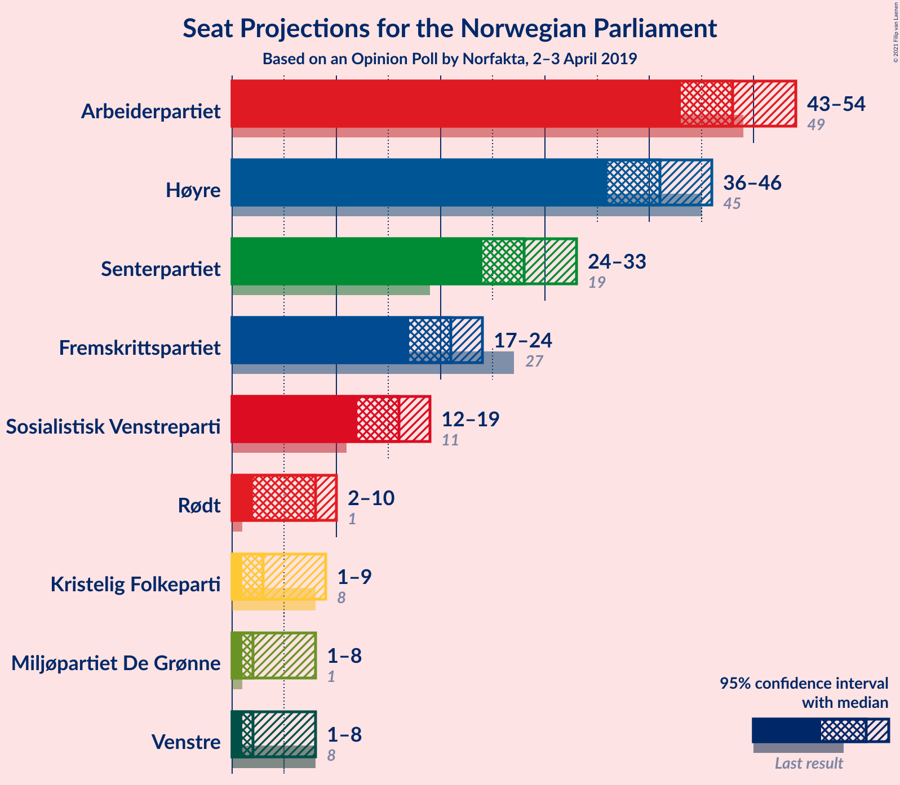

### Confidence Intervals

| Party | Last Result | Median | 80% Confidence Interval | 90% Confidence Interval | 95% Confidence Interval | 99% Confidence Interval |
|:-----:|:-----------:|:------:|:-----------------------:|:-----------------------:|:-----------------------:|:-----------------------:|
| <a href="#arbeiderpartiet">Arbeiderpartiet</a> | 49 | 49 | 45–51 |44–53 |42–53 |42–55 |
| <a href="#høyre">Høyre</a> | 45 | 43 | 38–44 |37–45 |36–45 |35–48 |
| <a href="#senterpartiet">Senterpartiet</a> | 19 | 28 | 25–31 |24–31 |23–32 |23–34 |
| <a href="#fremskrittspartiet">Fremskrittspartiet</a> | 27 | 21 | 18–23 |18–23 |18–24 |16–26 |
| <a href="#sosialistisk-venstreparti">Sosialistisk Venstreparti</a> | 11 | 16 | 13–18 |13–18 |12–19 |12–20 |
| <a href="#rødt">Rødt</a> | 1 | 8 | 2–10 |2–10 |2–11 |1–11 |
| <a href="#kristelig-folkeparti">Kristelig Folkeparti</a> | 8 | 3 | 1–8 |1–8 |1–9 |1–10 |
| <a href="#miljøpartiet-de-grønne">Miljøpartiet De Grønne</a> | 1 | 2 | 1–2 |1–2 |1–7 |0–8 |
| <a href="#venstre">Venstre</a> | 8 | 2 | 2 |2–3 |1–8 |1–8 |

### Arbeiderpartiet

*For a full overview of the results for this party, see the [Arbeiderpartiet](party-arbeiderpartiet.html) page.*

| Number of Seats | Probability | Accumulated | Special Marks |
|:---------------:|:-----------:|:-----------:|:-------------:|
| 40 | 0.1% | 100% |  |
| 41 | 0.2% | 99.9% |  |
| 42 | 3% | 99.8% |  |
| 43 | 2% | 97% |  |
| 44 | 3% | 95% |  |
| 45 | 3% | 92% |  |
| 46 | 9% | 90% |  |
| 47 | 13% | 81% |  |
| 48 | 11% | 68% |  |
| 49 | 11% | 57% | Last Result, Median |
| 50 | 27% | 46% |  |
| 51 | 12% | 19% |  |
| 52 | 2% | 7% |  |
| 53 | 3% | 5% |  |
| 54 | 1.4% | 2% |  |
| 55 | 0.7% | 1.1% |  |
| 56 | 0.2% | 0.4% |  |
| 57 | 0% | 0.2% |  |
| 58 | 0.2% | 0.2% |  |
| 59 | 0% | 0% |  |

### Høyre

*For a full overview of the results for this party, see the [Høyre](party-høyre.html) page.*

| Number of Seats | Probability | Accumulated | Special Marks |
|:---------------:|:-----------:|:-----------:|:-------------:|
| 33 | 0.1% | 100% |  |
| 34 | 0.3% | 99.9% |  |
| 35 | 1.2% | 99.6% |  |
| 36 | 1.1% | 98% |  |
| 37 | 4% | 97% |  |
| 38 | 5% | 94% |  |
| 39 | 6% | 88% |  |
| 40 | 6% | 82% |  |
| 41 | 5% | 77% |  |
| 42 | 14% | 71% |  |
| 43 | 17% | 57% | Median |
| 44 | 32% | 40% |  |
| 45 | 7% | 9% | Last Result |
| 46 | 0.4% | 2% |  |
| 47 | 0.6% | 1.3% |  |
| 48 | 0.3% | 0.6% |  |
| 49 | 0.2% | 0.3% |  |
| 50 | 0% | 0.1% |  |
| 51 | 0% | 0% |  |

### Senterpartiet

*For a full overview of the results for this party, see the [Senterpartiet](party-senterpartiet.html) page.*

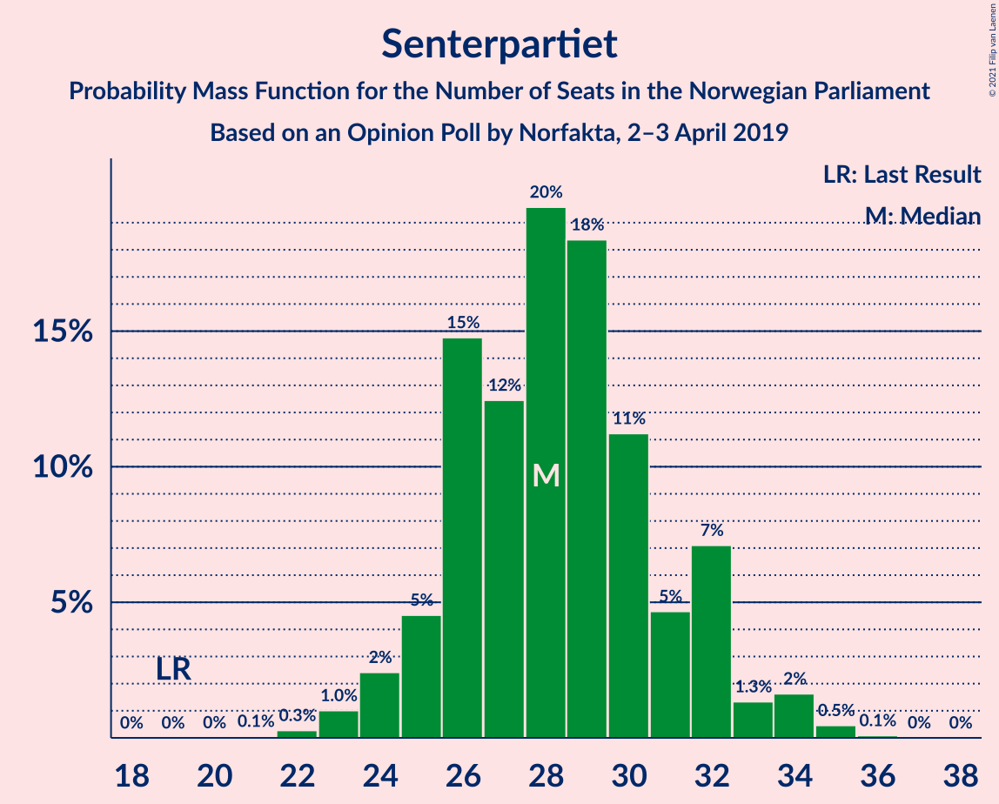

| Number of Seats | Probability | Accumulated | Special Marks |
|:---------------:|:-----------:|:-----------:|:-------------:|
| 19 | 0% | 100% | Last Result |
| 20 | 0% | 100% |  |
| 21 | 0% | 100% |  |
| 22 | 0.1% | 99.9% |  |
| 23 | 4% | 99.8% |  |
| 24 | 3% | 96% |  |
| 25 | 6% | 93% |  |
| 26 | 12% | 88% |  |
| 27 | 14% | 76% |  |
| 28 | 12% | 61% | Median |
| 29 | 7% | 49% |  |
| 30 | 31% | 42% |  |
| 31 | 7% | 11% |  |
| 32 | 2% | 4% |  |
| 33 | 1.2% | 2% |  |
| 34 | 0.5% | 0.8% |  |
| 35 | 0.2% | 0.3% |  |
| 36 | 0.1% | 0.1% |  |
| 37 | 0% | 0% |  |

### Fremskrittspartiet

*For a full overview of the results for this party, see the [Fremskrittspartiet](party-fremskrittspartiet.html) page.*

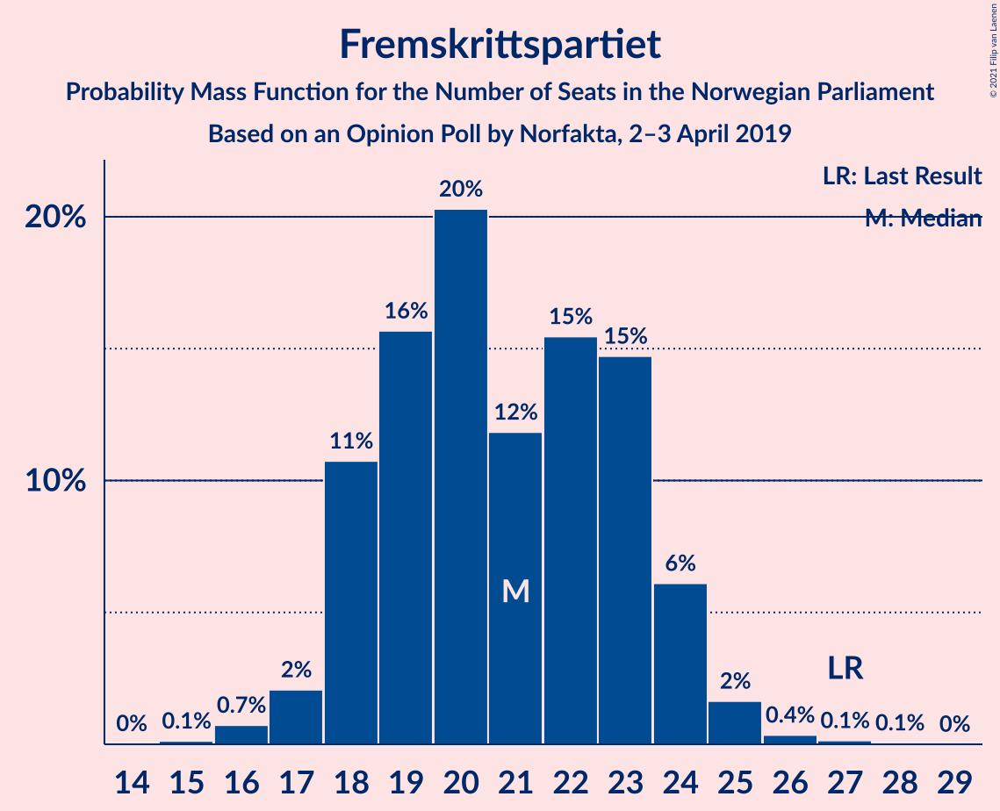

| Number of Seats | Probability | Accumulated | Special Marks |
|:---------------:|:-----------:|:-----------:|:-------------:|
| 14 | 0.1% | 100% |  |
| 15 | 0% | 99.9% |  |
| 16 | 0.9% | 99.9% |  |
| 17 | 0.9% | 99.0% |  |
| 18 | 13% | 98% |  |
| 19 | 5% | 85% |  |
| 20 | 21% | 80% |  |
| 21 | 10% | 59% | Median |
| 22 | 35% | 49% |  |
| 23 | 10% | 14% |  |
| 24 | 3% | 5% |  |
| 25 | 1.3% | 2% |  |
| 26 | 0.3% | 0.6% |  |
| 27 | 0.2% | 0.3% | Last Result |
| 28 | 0% | 0% |  |

### Sosialistisk Venstreparti

*For a full overview of the results for this party, see the [Sosialistisk Venstreparti](party-sosialistiskvenstreparti.html) page.*

| Number of Seats | Probability | Accumulated | Special Marks |
|:---------------:|:-----------:|:-----------:|:-------------:|
| 11 | 0.3% | 100% | Last Result |
| 12 | 2% | 99.6% |  |
| 13 | 12% | 97% |  |
| 14 | 6% | 85% |  |
| 15 | 15% | 79% |  |
| 16 | 39% | 65% | Median |
| 17 | 15% | 25% |  |
| 18 | 6% | 10% |  |
| 19 | 3% | 5% |  |
| 20 | 1.5% | 2% |  |
| 21 | 0.1% | 0.1% |  |
| 22 | 0% | 0% |  |

### Rødt

*For a full overview of the results for this party, see the [Rødt](party-rødt.html) page.*

| Number of Seats | Probability | Accumulated | Special Marks |
|:---------------:|:-----------:|:-----------:|:-------------:|
| 1 | 0.5% | 100% | Last Result |
| 2 | 42% | 99.5% |  |
| 3 | 0% | 57% |  |
| 4 | 0% | 57% |  |
| 5 | 0% | 57% |  |
| 6 | 0% | 57% |  |
| 7 | 4% | 57% |  |
| 8 | 26% | 53% | Median |
| 9 | 16% | 27% |  |
| 10 | 8% | 11% |  |
| 11 | 3% | 3% |  |
| 12 | 0.2% | 0.2% |  |
| 13 | 0% | 0% |  |

### Kristelig Folkeparti

*For a full overview of the results for this party, see the [Kristelig Folkeparti](party-kristeligfolkeparti.html) page.*

| Number of Seats | Probability | Accumulated | Special Marks |
|:---------------:|:-----------:|:-----------:|:-------------:|
| 1 | 34% | 100% |  |
| 2 | 6% | 66% |  |
| 3 | 36% | 60% | Median |
| 4 | 0% | 24% |  |
| 5 | 0% | 24% |  |
| 6 | 0% | 24% |  |
| 7 | 1.3% | 24% |  |
| 8 | 18% | 23% | Last Result |
| 9 | 3% | 5% |  |
| 10 | 1.3% | 2% |  |
| 11 | 0.2% | 0.3% |  |
| 12 | 0% | 0% |  |

### Miljøpartiet De Grønne

*For a full overview of the results for this party, see the [Miljøpartiet De Grønne](party-miljøpartietdegrønne.html) page.*

| Number of Seats | Probability | Accumulated | Special Marks |
|:---------------:|:-----------:|:-----------:|:-------------:|
| 0 | 0.6% | 100% |  |
| 1 | 43% | 99.4% | Last Result |
| 2 | 52% | 56% | Median |
| 3 | 1.0% | 4% |  |
| 4 | 0% | 3% |  |
| 5 | 0% | 3% |  |
| 6 | 0% | 3% |  |
| 7 | 1.4% | 3% |  |
| 8 | 2% | 2% |  |
| 9 | 0.3% | 0.3% |  |
| 10 | 0% | 0% |  |

### Venstre

*For a full overview of the results for this party, see the [Venstre](party-venstre.html) page.*

| Number of Seats | Probability | Accumulated | Special Marks |
|:---------------:|:-----------:|:-----------:|:-------------:|
| 0 | 0.1% | 100% |  |
| 1 | 3% | 99.9% |  |
| 2 | 87% | 96% | Median |
| 3 | 5% | 10% |  |
| 4 | 0.5% | 4% |  |
| 5 | 0% | 4% |  |
| 6 | 0% | 4% |  |
| 7 | 1.0% | 4% |  |
| 8 | 3% | 3% | Last Result |
| 9 | 0.2% | 0.2% |  |
| 10 | 0% | 0% |  |

## Coalitions

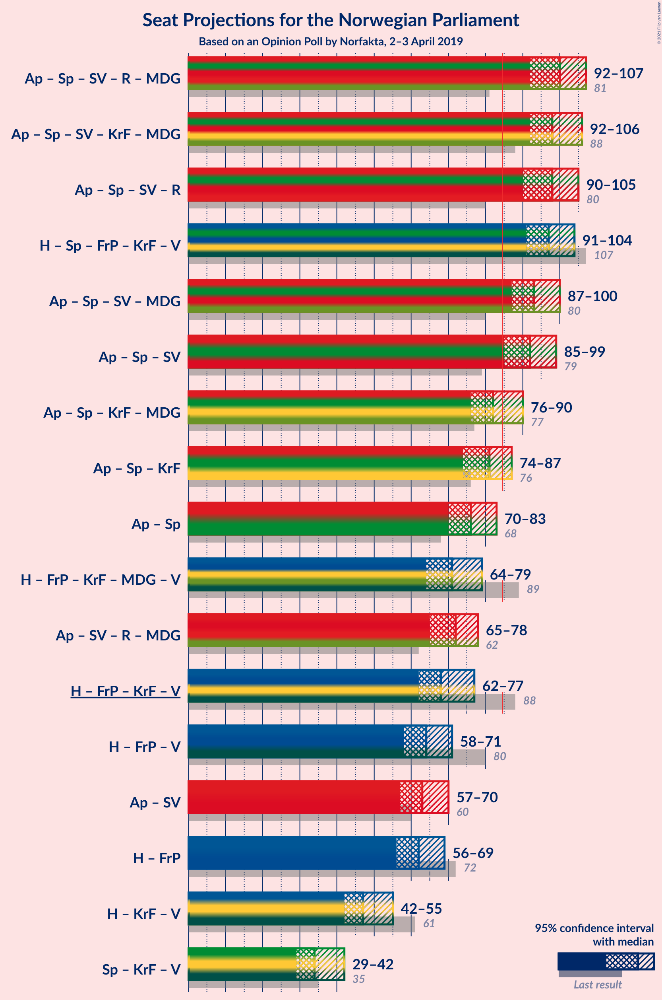

### Confidence Intervals

| Coalition | Last Result | Median | Majority? | 80% Confidence Interval | 90% Confidence Interval | 95% Confidence Interval | 99% Confidence Interval |
|:---------:|:-----------:|:------:|:---------:|:-----------------------:|:-----------------------:|:-----------------------:|:-----------------------:|
| Arbeiderpartiet – Senterpartiet – Sosialistisk Venstreparti – Rødt – Miljøpartiet De Grønne | 81 | 100 | 100% | 96–105 | 95–105 | 94–107 | 91–109 |
| Arbeiderpartiet – Senterpartiet – Sosialistisk Venstreparti – Kristelig Folkeparti – Miljøpartiet De Grønne | 88 | 98 | 100% | 94–102 | 92–102 | 92–105 | 89–106 |
| Arbeiderpartiet – Senterpartiet – Sosialistisk Venstreparti – Rødt | 80 | 98 | 100% | 95–103 | 93–104 | 92–105 | 89–107 |
| Høyre – Senterpartiet – Fremskrittspartiet – Kristelig Folkeparti – Venstre | 107 | 98 | 100% | 93–101 | 92–102 | 89–104 | 88–105 |
| Arbeiderpartiet – Senterpartiet – Sosialistisk Venstreparti – Miljøpartiet De Grønne | 80 | 94 | 99.6% | 89–98 | 88–99 | 87–99 | 85–103 |
| Arbeiderpartiet – Senterpartiet – Sosialistisk Venstreparti | 79 | 93 | 98% | 87–96 | 86–97 | 85–98 | 83–100 |
| Arbeiderpartiet – Senterpartiet – Kristelig Folkeparti – Miljøpartiet De Grønne | 77 | 83 | 19% | 77–86 | 76–87 | 76–89 | 74–91 |
| Arbeiderpartiet – Senterpartiet – Kristelig Folkeparti | 76 | 81 | 13% | 76–85 | 74–86 | 74–87 | 72–90 |
| Arbeiderpartiet – Senterpartiet | 68 | 78 | 0.4% | 72–80 | 71–82 | 69–83 | 68–84 |
| Høyre – Fremskrittspartiet – Kristelig Folkeparti – Miljøpartiet De Grønne – Venstre | 89 | 71 | 0% | 66–74 | 65–76 | 64–77 | 62–80 |
| Høyre – Fremskrittspartiet – Kristelig Folkeparti – Venstre | 88 | 69 | 0% | 64–73 | 64–74 | 62–75 | 60–78 |
| Arbeiderpartiet – Sosialistisk Venstreparti | 60 | 65 | 0% | 60–66 | 58–68 | 57–71 | 55–72 |
| Høyre – Fremskrittspartiet – Venstre | 80 | 65 | 0% | 61–68 | 59–69 | 58–70 | 56–73 |
| Høyre – Fremskrittspartiet | 72 | 63 | 0% | 59–66 | 57–67 | 56–67 | 54–70 |
| Høyre – Kristelig Folkeparti – Venstre | 61 | 47 | 0% | 44–52 | 43–54 | 42–54 | 41–58 |
| Senterpartiet – Kristelig Folkeparti – Venstre | 35 | 33 | 0% | 30–39 | 29–40 | 28–42 | 28–46 |

### Arbeiderpartiet – Senterpartiet – Sosialistisk Venstreparti – Rødt – Miljøpartiet De Grønne

| Number of Seats | Probability | Accumulated | Special Marks |
|:---------------:|:-----------:|:-----------:|:-------------:|
| 81 | 0% | 100% | Last Result |
| 82 | 0% | 100% |  |
| 83 | 0% | 100% |  |
| 84 | 0% | 100% |  |
| 85 | 0% | 100% | Majority |
| 86 | 0% | 100% |  |
| 87 | 0% | 100% |  |
| 88 | 0% | 99.9% |  |
| 89 | 0.2% | 99.9% |  |
| 90 | 0.1% | 99.7% |  |
| 91 | 0.5% | 99.6% |  |
| 92 | 0.5% | 99.1% |  |
| 93 | 0.4% | 98.6% |  |
| 94 | 2% | 98% |  |
| 95 | 3% | 96% |  |
| 96 | 7% | 93% |  |
| 97 | 11% | 87% |  |
| 98 | 2% | 76% |  |
| 99 | 3% | 73% |  |
| 100 | 27% | 70% |  |
| 101 | 25% | 43% |  |
| 102 | 2% | 19% |  |
| 103 | 2% | 17% | Median |
| 104 | 2% | 15% |  |
| 105 | 9% | 13% |  |
| 106 | 1.2% | 4% |  |
| 107 | 1.0% | 3% |  |
| 108 | 1.4% | 2% |  |
| 109 | 0.4% | 0.8% |  |
| 110 | 0.3% | 0.4% |  |
| 111 | 0% | 0.1% |  |
| 112 | 0% | 0% |  |

### Arbeiderpartiet – Senterpartiet – Sosialistisk Venstreparti – Kristelig Folkeparti – Miljøpartiet De Grønne

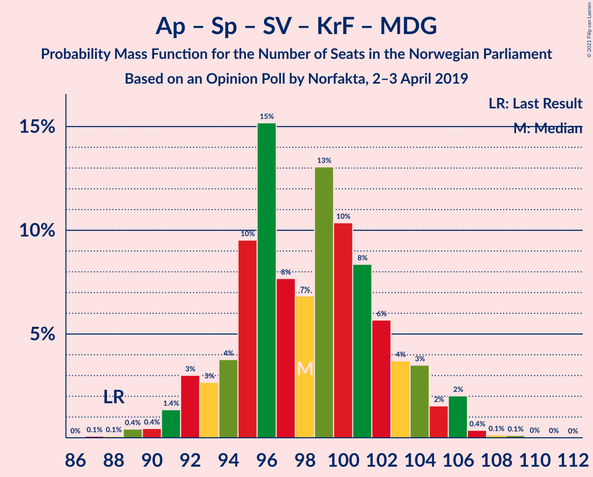

| Number of Seats | Probability | Accumulated | Special Marks |
|:---------------:|:-----------:|:-----------:|:-------------:|
| 87 | 0.1% | 100% |  |
| 88 | 0% | 99.9% | Last Result |
| 89 | 0.4% | 99.9% |  |
| 90 | 0.2% | 99.5% |  |
| 91 | 0.9% | 99.3% |  |
| 92 | 4% | 98% |  |
| 93 | 4% | 94% |  |
| 94 | 7% | 91% |  |
| 95 | 9% | 84% |  |
| 96 | 9% | 74% |  |
| 97 | 10% | 65% |  |
| 98 | 6% | 56% | Median |
| 99 | 29% | 50% |  |
| 100 | 4% | 21% |  |
| 101 | 3% | 18% |  |
| 102 | 10% | 14% |  |
| 103 | 0.7% | 4% |  |
| 104 | 1.3% | 4% |  |
| 105 | 1.4% | 3% |  |
| 106 | 0.6% | 1.1% |  |
| 107 | 0.1% | 0.5% |  |
| 108 | 0.1% | 0.4% |  |
| 109 | 0.2% | 0.2% |  |
| 110 | 0% | 0.1% |  |
| 111 | 0% | 0% |  |

### Arbeiderpartiet – Senterpartiet – Sosialistisk Venstreparti – Rødt

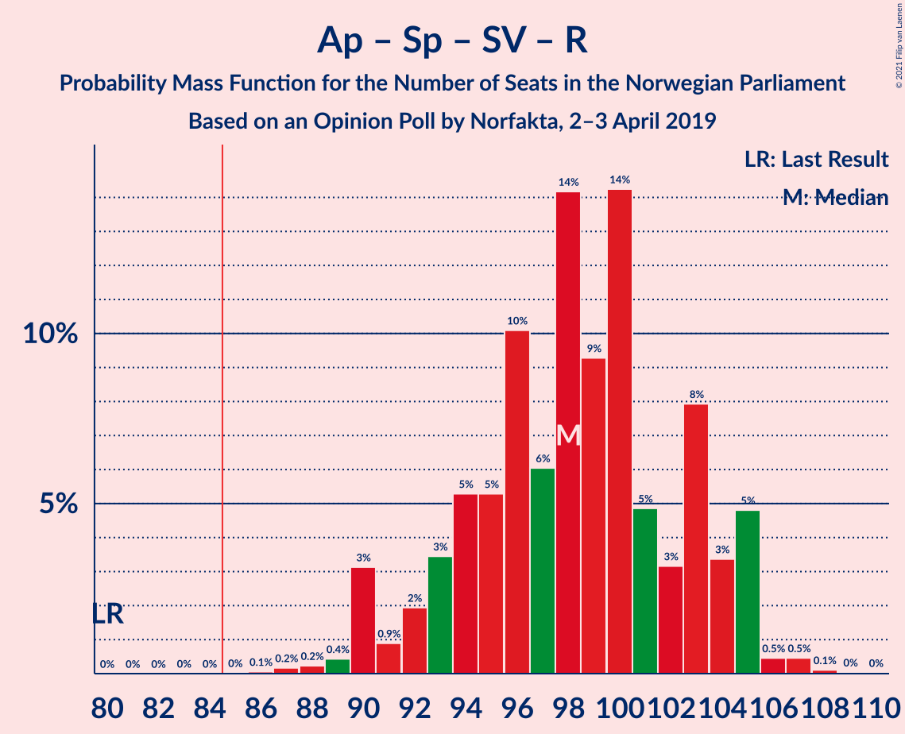

| Number of Seats | Probability | Accumulated | Special Marks |
|:---------------:|:-----------:|:-----------:|:-------------:|
| 80 | 0% | 100% | Last Result |
| 81 | 0% | 100% |  |
| 82 | 0% | 100% |  |
| 83 | 0% | 100% |  |
| 84 | 0% | 100% |  |
| 85 | 0% | 100% | Majority |
| 86 | 0% | 100% |  |
| 87 | 0.3% | 99.9% |  |
| 88 | 0.1% | 99.6% |  |
| 89 | 0.3% | 99.5% |  |
| 90 | 0.6% | 99.2% |  |
| 91 | 0.6% | 98.6% |  |
| 92 | 2% | 98% |  |
| 93 | 1.3% | 96% |  |
| 94 | 4% | 95% |  |
| 95 | 10% | 91% |  |
| 96 | 8% | 81% |  |
| 97 | 4% | 73% |  |
| 98 | 27% | 69% |  |
| 99 | 10% | 43% |  |
| 100 | 16% | 32% |  |
| 101 | 1.4% | 16% | Median |
| 102 | 2% | 15% |  |
| 103 | 5% | 12% |  |
| 104 | 5% | 8% |  |
| 105 | 1.2% | 3% |  |
| 106 | 0.2% | 2% |  |
| 107 | 1.2% | 2% |  |
| 108 | 0.3% | 0.3% |  |
| 109 | 0% | 0% |  |

### Høyre – Senterpartiet – Fremskrittspartiet – Kristelig Folkeparti – Venstre

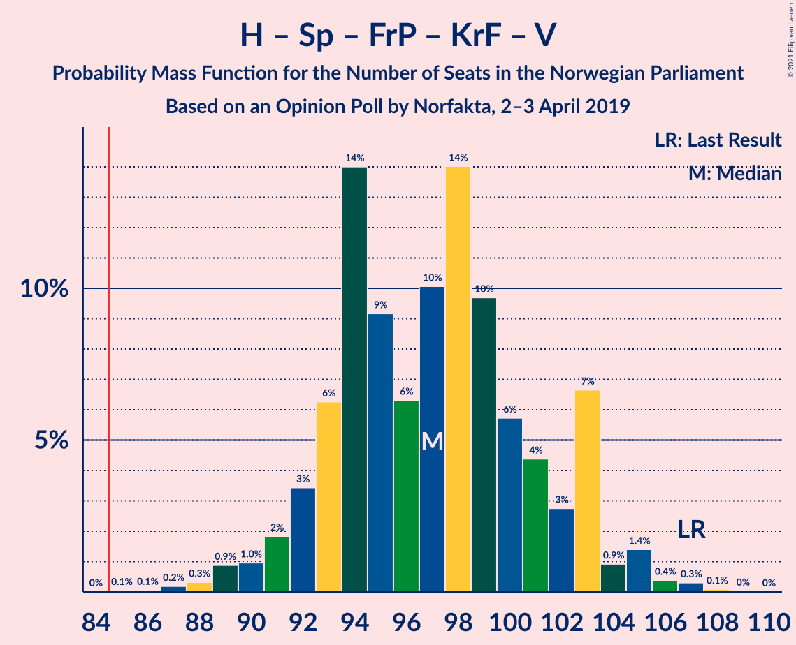

| Number of Seats | Probability | Accumulated | Special Marks |
|:---------------:|:-----------:|:-----------:|:-------------:|
| 86 | 0% | 100% |  |
| 87 | 0.3% | 99.9% |  |
| 88 | 0.3% | 99.6% |  |
| 89 | 2% | 99.3% |  |
| 90 | 0.5% | 97% |  |
| 91 | 0.9% | 96% |  |
| 92 | 3% | 96% |  |
| 93 | 7% | 93% |  |
| 94 | 5% | 86% |  |
| 95 | 17% | 81% |  |
| 96 | 7% | 65% |  |
| 97 | 5% | 58% | Median |
| 98 | 10% | 53% |  |
| 99 | 28% | 43% |  |
| 100 | 2% | 15% |  |
| 101 | 8% | 13% |  |
| 102 | 1.2% | 5% |  |
| 103 | 0.9% | 4% |  |
| 104 | 3% | 3% |  |
| 105 | 0.2% | 0.6% |  |
| 106 | 0.2% | 0.5% |  |
| 107 | 0.2% | 0.3% | Last Result |
| 108 | 0.1% | 0.1% |  |
| 109 | 0% | 0% |  |

### Arbeiderpartiet – Senterpartiet – Sosialistisk Venstreparti – Miljøpartiet De Grønne

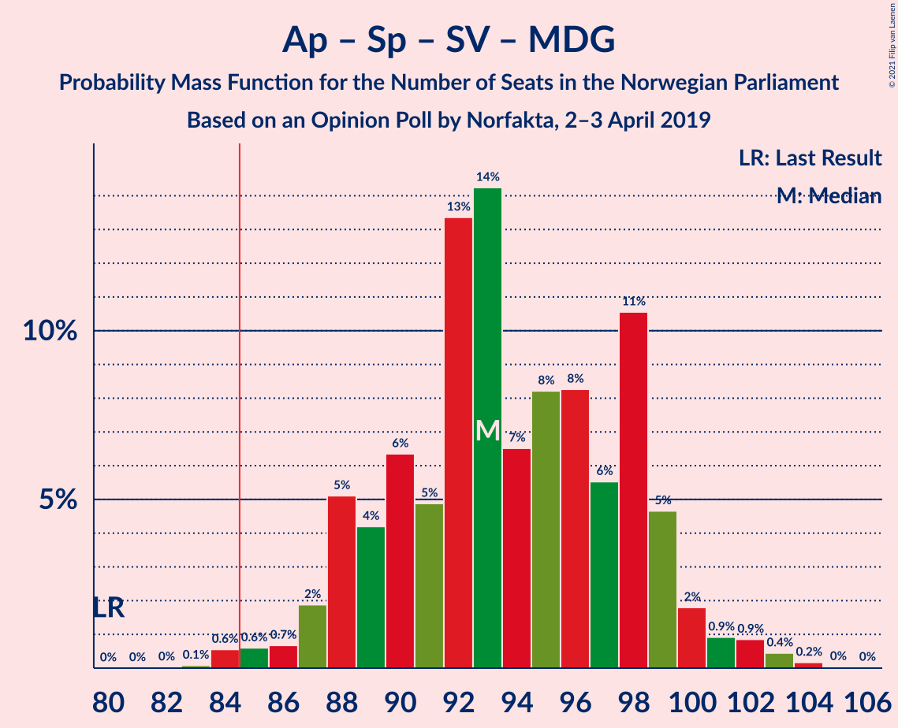

| Number of Seats | Probability | Accumulated | Special Marks |
|:---------------:|:-----------:|:-----------:|:-------------:|
| 80 | 0% | 100% | Last Result |
| 81 | 0% | 100% |  |
| 82 | 0% | 100% |  |
| 83 | 0.2% | 100% |  |
| 84 | 0.2% | 99.8% |  |
| 85 | 2% | 99.6% | Majority |
| 86 | 0.2% | 98% |  |
| 87 | 1.1% | 98% |  |
| 88 | 3% | 96% |  |
| 89 | 11% | 94% |  |
| 90 | 0.9% | 83% |  |
| 91 | 6% | 82% |  |
| 92 | 13% | 75% |  |
| 93 | 8% | 63% |  |
| 94 | 6% | 54% |  |
| 95 | 3% | 49% | Median |
| 96 | 4% | 46% |  |
| 97 | 7% | 42% |  |
| 98 | 28% | 35% |  |
| 99 | 5% | 7% |  |
| 100 | 1.3% | 2% |  |
| 101 | 0.2% | 1.1% |  |
| 102 | 0.4% | 0.9% |  |
| 103 | 0.5% | 0.6% |  |
| 104 | 0.1% | 0.1% |  |
| 105 | 0% | 0% |  |

### Arbeiderpartiet – Senterpartiet – Sosialistisk Venstreparti

| Number of Seats | Probability | Accumulated | Special Marks |
|:---------------:|:-----------:|:-----------:|:-------------:|
| 79 | 0% | 100% | Last Result |
| 80 | 0% | 100% |  |
| 81 | 0.2% | 100% |  |
| 82 | 0% | 99.7% |  |
| 83 | 0.3% | 99.7% |  |
| 84 | 2% | 99.4% |  |
| 85 | 2% | 98% | Majority |
| 86 | 2% | 96% |  |
| 87 | 5% | 94% |  |
| 88 | 8% | 89% |  |
| 89 | 4% | 81% |  |
| 90 | 4% | 76% |  |
| 91 | 18% | 72% |  |
| 92 | 2% | 54% |  |
| 93 | 6% | 52% | Median |
| 94 | 5% | 46% |  |
| 95 | 2% | 41% |  |
| 96 | 32% | 40% |  |
| 97 | 3% | 7% |  |
| 98 | 3% | 5% |  |
| 99 | 1.0% | 2% |  |
| 100 | 0.2% | 0.6% |  |
| 101 | 0.2% | 0.4% |  |
| 102 | 0.2% | 0.2% |  |
| 103 | 0% | 0% |  |

### Arbeiderpartiet – Senterpartiet – Kristelig Folkeparti – Miljøpartiet De Grønne

| Number of Seats | Probability | Accumulated | Special Marks |
|:---------------:|:-----------:|:-----------:|:-------------:|
| 72 | 0.1% | 100% |  |
| 73 | 0.2% | 99.9% |  |
| 74 | 0.4% | 99.7% |  |
| 75 | 0.3% | 99.3% |  |
| 76 | 6% | 99.0% |  |
| 77 | 6% | 93% | Last Result |
| 78 | 3% | 87% |  |
| 79 | 6% | 85% |  |
| 80 | 4% | 79% |  |
| 81 | 7% | 75% |  |
| 82 | 17% | 68% | Median |
| 83 | 29% | 51% |  |
| 84 | 2% | 21% |  |
| 85 | 5% | 19% | Majority |
| 86 | 6% | 15% |  |
| 87 | 4% | 9% |  |
| 88 | 2% | 5% |  |
| 89 | 2% | 3% |  |
| 90 | 0.2% | 1.2% |  |
| 91 | 0.6% | 1.0% |  |
| 92 | 0.3% | 0.4% |  |
| 93 | 0% | 0.1% |  |
| 94 | 0% | 0.1% |  |
| 95 | 0% | 0.1% |  |
| 96 | 0% | 0% |  |

### Arbeiderpartiet – Senterpartiet – Kristelig Folkeparti

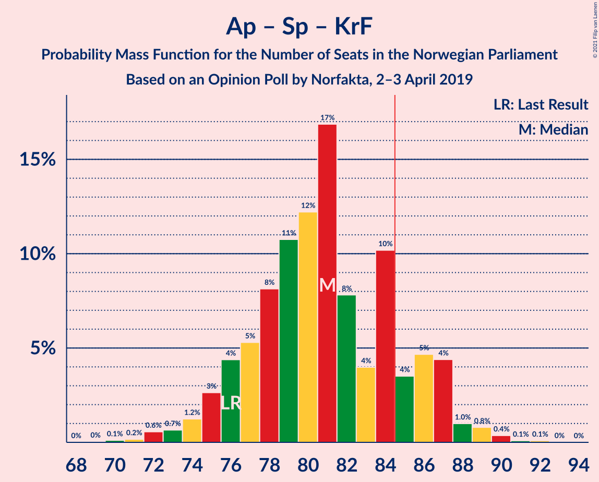

| Number of Seats | Probability | Accumulated | Special Marks |
|:---------------:|:-----------:|:-----------:|:-------------:|
| 70 | 0% | 100% |  |
| 71 | 0.3% | 99.9% |  |
| 72 | 0.4% | 99.6% |  |
| 73 | 0.5% | 99.3% |  |
| 74 | 4% | 98.8% |  |
| 75 | 4% | 94% |  |
| 76 | 5% | 91% | Last Result |
| 77 | 9% | 86% |  |
| 78 | 3% | 77% |  |
| 79 | 3% | 74% |  |
| 80 | 8% | 72% | Median |
| 81 | 43% | 63% |  |
| 82 | 2% | 20% |  |
| 83 | 4% | 19% |  |
| 84 | 2% | 15% |  |
| 85 | 6% | 13% | Majority |
| 86 | 4% | 6% |  |
| 87 | 2% | 3% |  |
| 88 | 0.2% | 1.1% |  |
| 89 | 0.2% | 0.9% |  |
| 90 | 0.6% | 0.7% |  |
| 91 | 0.1% | 0.1% |  |
| 92 | 0% | 0% |  |

### Arbeiderpartiet – Senterpartiet

| Number of Seats | Probability | Accumulated | Special Marks |
|:---------------:|:-----------:|:-----------:|:-------------:|
| 66 | 0.1% | 100% |  |
| 67 | 0.1% | 99.9% |  |
| 68 | 0.6% | 99.9% | Last Result |
| 69 | 2% | 99.3% |  |
| 70 | 1.1% | 97% |  |
| 71 | 5% | 96% |  |
| 72 | 4% | 91% |  |
| 73 | 10% | 87% |  |
| 74 | 10% | 77% |  |
| 75 | 4% | 67% |  |
| 76 | 3% | 63% |  |
| 77 | 8% | 59% | Median |
| 78 | 11% | 52% |  |
| 79 | 5% | 41% |  |
| 80 | 30% | 36% |  |
| 81 | 0.9% | 6% |  |
| 82 | 0.8% | 5% |  |
| 83 | 4% | 4% |  |
| 84 | 0.3% | 0.8% |  |
| 85 | 0.2% | 0.4% | Majority |
| 86 | 0% | 0.2% |  |
| 87 | 0.2% | 0.2% |  |
| 88 | 0% | 0% |  |

### Høyre – Fremskrittspartiet – Kristelig Folkeparti – Miljøpartiet De Grønne – Venstre

| Number of Seats | Probability | Accumulated | Special Marks |
|:---------------:|:-----------:|:-----------:|:-------------:|
| 61 | 0.3% | 100% |  |
| 62 | 1.2% | 99.7% |  |
| 63 | 0.2% | 98% |  |
| 64 | 2% | 98% |  |
| 65 | 5% | 97% |  |
| 66 | 5% | 92% |  |
| 67 | 2% | 87% |  |
| 68 | 1.5% | 85% |  |
| 69 | 16% | 83% |  |
| 70 | 10% | 67% |  |
| 71 | 27% | 57% | Median |
| 72 | 4% | 30% |  |
| 73 | 7% | 26% |  |
| 74 | 10% | 19% |  |
| 75 | 4% | 9% |  |
| 76 | 1.3% | 5% |  |
| 77 | 2% | 4% |  |
| 78 | 0.6% | 2% |  |
| 79 | 0.6% | 1.4% |  |
| 80 | 0.3% | 0.8% |  |
| 81 | 0.1% | 0.4% |  |
| 82 | 0.3% | 0.4% |  |
| 83 | 0% | 0.1% |  |
| 84 | 0% | 0% |  |
| 85 | 0% | 0% | Majority |
| 86 | 0% | 0% |  |
| 87 | 0% | 0% |  |
| 88 | 0% | 0% |  |
| 89 | 0% | 0% | Last Result |

### Høyre – Fremskrittspartiet – Kristelig Folkeparti – Venstre

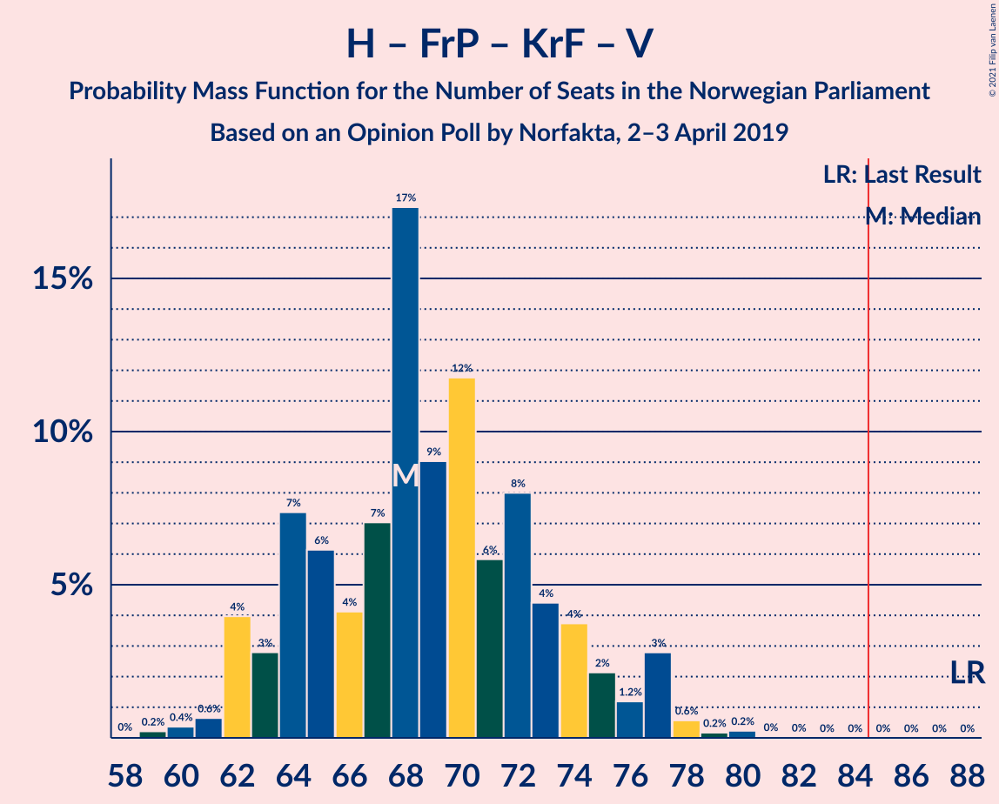

| Number of Seats | Probability | Accumulated | Special Marks |
|:---------------:|:-----------:|:-----------:|:-------------:|
| 58 | 0% | 100% |  |
| 59 | 0.3% | 99.9% |  |
| 60 | 0.4% | 99.6% |  |
| 61 | 1.4% | 99.2% |  |
| 62 | 1.4% | 98% |  |
| 63 | 1.3% | 96% |  |
| 64 | 9% | 95% |  |
| 65 | 2% | 86% |  |
| 66 | 2% | 85% |  |
| 67 | 2% | 83% |  |
| 68 | 25% | 81% |  |
| 69 | 27% | 56% | Median |
| 70 | 3% | 29% |  |
| 71 | 2% | 26% |  |
| 72 | 11% | 24% |  |
| 73 | 7% | 13% |  |
| 74 | 3% | 6% |  |
| 75 | 2% | 4% |  |
| 76 | 0.3% | 2% |  |
| 77 | 0.5% | 1.4% |  |
| 78 | 0.5% | 0.9% |  |
| 79 | 0.1% | 0.4% |  |
| 80 | 0.2% | 0.3% |  |
| 81 | 0% | 0.1% |  |
| 82 | 0% | 0% |  |
| 83 | 0% | 0% |  |
| 84 | 0% | 0% |  |
| 85 | 0% | 0% | Majority |
| 86 | 0% | 0% |  |
| 87 | 0% | 0% |  |
| 88 | 0% | 0% | Last Result |

### Arbeiderpartiet – Sosialistisk Venstreparti

| Number of Seats | Probability | Accumulated | Special Marks |
|:---------------:|:-----------:|:-----------:|:-------------:|
| 54 | 0% | 100% |  |
| 55 | 0.7% | 99.9% |  |
| 56 | 0.4% | 99.2% |  |
| 57 | 3% | 98.8% |  |
| 58 | 1.3% | 96% |  |
| 59 | 1.2% | 95% |  |
| 60 | 5% | 94% | Last Result |
| 61 | 3% | 89% |  |
| 62 | 8% | 86% |  |
| 63 | 9% | 77% |  |
| 64 | 13% | 68% |  |
| 65 | 15% | 55% | Median |
| 66 | 31% | 41% |  |
| 67 | 2% | 10% |  |
| 68 | 4% | 8% |  |
| 69 | 0.4% | 4% |  |
| 70 | 1.1% | 4% |  |
| 71 | 2% | 3% |  |
| 72 | 0.7% | 0.9% |  |
| 73 | 0.2% | 0.2% |  |
| 74 | 0% | 0% |  |

### Høyre – Fremskrittspartiet – Venstre

| Number of Seats | Probability | Accumulated | Special Marks |
|:---------------:|:-----------:|:-----------:|:-------------:|
| 54 | 0.2% | 100% |  |
| 55 | 0.1% | 99.7% |  |
| 56 | 0.6% | 99.6% |  |
| 57 | 0.6% | 99.0% |  |
| 58 | 2% | 98% |  |
| 59 | 2% | 97% |  |
| 60 | 1.1% | 95% |  |
| 61 | 6% | 93% |  |
| 62 | 4% | 88% |  |
| 63 | 6% | 84% |  |
| 64 | 7% | 78% |  |
| 65 | 27% | 71% |  |
| 66 | 6% | 43% | Median |
| 67 | 1.3% | 37% |  |
| 68 | 28% | 36% |  |
| 69 | 4% | 8% |  |
| 70 | 1.4% | 4% |  |
| 71 | 0.5% | 2% |  |
| 72 | 1.2% | 2% |  |
| 73 | 0% | 0.5% |  |
| 74 | 0.4% | 0.5% |  |
| 75 | 0.1% | 0.1% |  |
| 76 | 0% | 0% |  |
| 77 | 0% | 0% |  |
| 78 | 0% | 0% |  |
| 79 | 0% | 0% |  |
| 80 | 0% | 0% | Last Result |

### Høyre – Fremskrittspartiet

| Number of Seats | Probability | Accumulated | Special Marks |
|:---------------:|:-----------:|:-----------:|:-------------:|
| 52 | 0.2% | 100% |  |
| 53 | 0.1% | 99.7% |  |
| 54 | 0.2% | 99.6% |  |
| 55 | 1.3% | 99.3% |  |
| 56 | 2% | 98% |  |
| 57 | 2% | 96% |  |
| 58 | 3% | 94% |  |
| 59 | 5% | 91% |  |
| 60 | 3% | 86% |  |
| 61 | 7% | 83% |  |
| 62 | 12% | 76% |  |
| 63 | 21% | 64% |  |
| 64 | 7% | 43% | Median |
| 65 | 1.0% | 35% |  |
| 66 | 28% | 34% |  |
| 67 | 4% | 6% |  |
| 68 | 1.1% | 2% |  |
| 69 | 0.3% | 1.2% |  |
| 70 | 0.9% | 1.0% |  |
| 71 | 0% | 0.1% |  |
| 72 | 0% | 0.1% | Last Result |
| 73 | 0% | 0% |  |

### Høyre – Kristelig Folkeparti – Venstre

| Number of Seats | Probability | Accumulated | Special Marks |
|:---------------:|:-----------:|:-----------:|:-------------:|
| 39 | 0.1% | 100% |  |
| 40 | 0.1% | 99.9% |  |
| 41 | 2% | 99.7% |  |
| 42 | 3% | 98% |  |
| 43 | 3% | 95% |  |
| 44 | 5% | 92% |  |
| 45 | 4% | 87% |  |
| 46 | 5% | 83% |  |
| 47 | 34% | 79% |  |
| 48 | 11% | 45% | Median |
| 49 | 5% | 34% |  |
| 50 | 7% | 28% |  |
| 51 | 5% | 21% |  |
| 52 | 10% | 16% |  |
| 53 | 0.8% | 6% |  |
| 54 | 3% | 5% |  |
| 55 | 1.5% | 2% |  |
| 56 | 0.2% | 1.0% |  |
| 57 | 0.2% | 0.8% |  |
| 58 | 0.5% | 0.6% |  |
| 59 | 0% | 0.1% |  |
| 60 | 0.1% | 0.1% |  |
| 61 | 0% | 0% | Last Result |

### Senterpartiet – Kristelig Folkeparti – Venstre

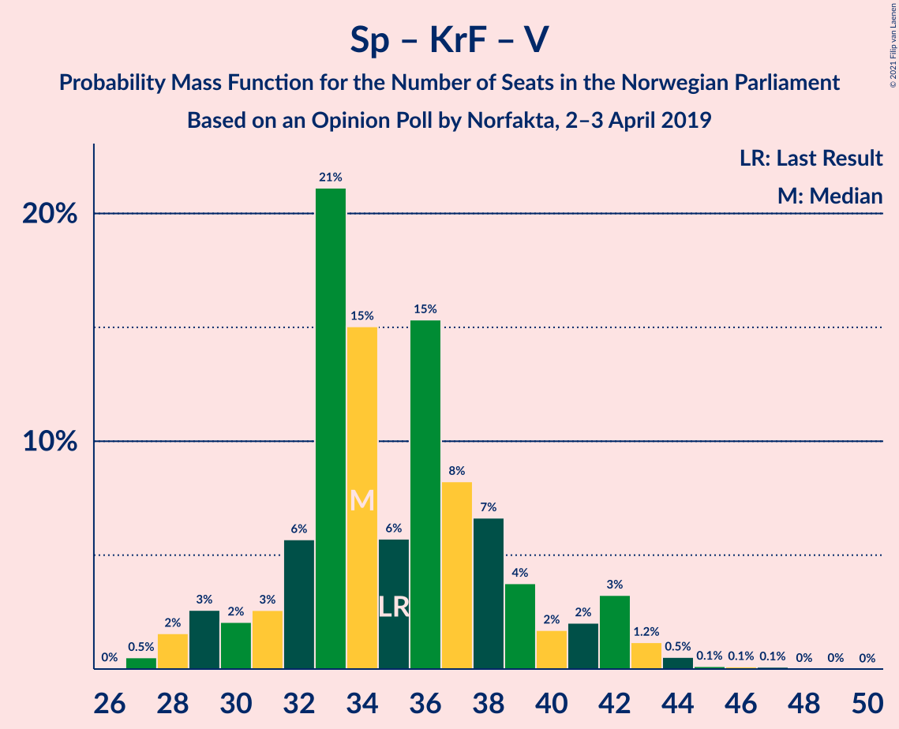

| Number of Seats | Probability | Accumulated | Special Marks |
|:---------------:|:-----------:|:-----------:|:-------------:|
| 26 | 0.1% | 100% |  |
| 27 | 0.1% | 99.8% |  |
| 28 | 4% | 99.7% |  |
| 29 | 4% | 96% |  |
| 30 | 3% | 92% |  |
| 31 | 3% | 89% |  |
| 32 | 9% | 86% |  |
| 33 | 34% | 77% | Median |
| 34 | 10% | 43% |  |
| 35 | 6% | 33% | Last Result |
| 36 | 10% | 26% |  |
| 37 | 4% | 17% |  |
| 38 | 2% | 12% |  |
| 39 | 5% | 11% |  |
| 40 | 2% | 6% |  |
| 41 | 0.6% | 4% |  |
| 42 | 1.0% | 3% |  |
| 43 | 0.6% | 2% |  |
| 44 | 0.9% | 2% |  |
| 45 | 0% | 0.9% |  |
| 46 | 0.6% | 0.8% |  |
| 47 | 0.1% | 0.2% |  |
| 48 | 0% | 0.1% |  |
| 49 | 0.1% | 0.1% |  |
| 50 | 0% | 0% |  |

## Technical Information

### Opinion Poll

+ **Polling firm:** Norfakta
+ **Commissioner(s):** —
+ **Fieldwork period:** 2–3 April 2019

### Calculations

+ **Sample size:** 1032
+ **Simulations done:** 131,072
+ **Error estimate:** 1.72%

