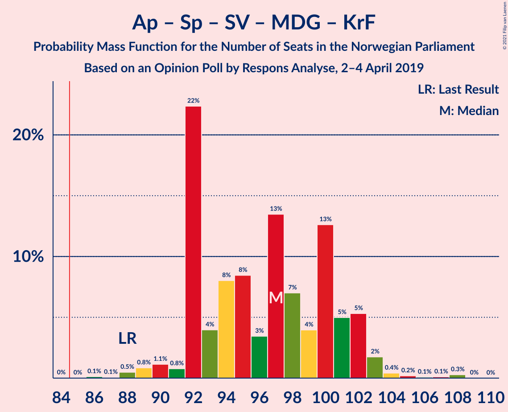
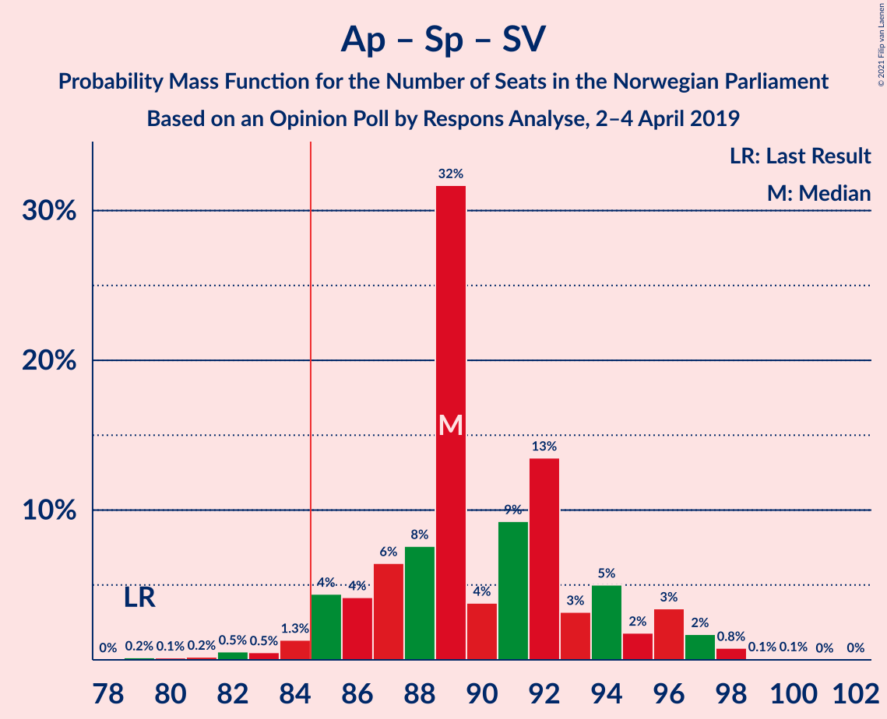
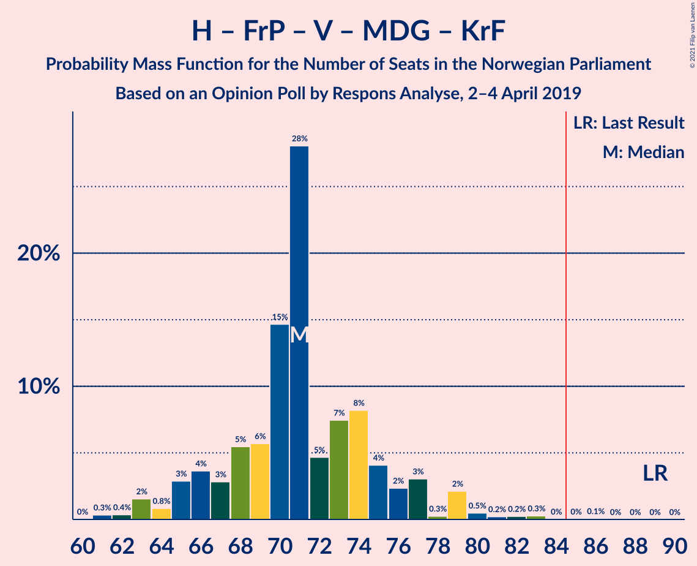
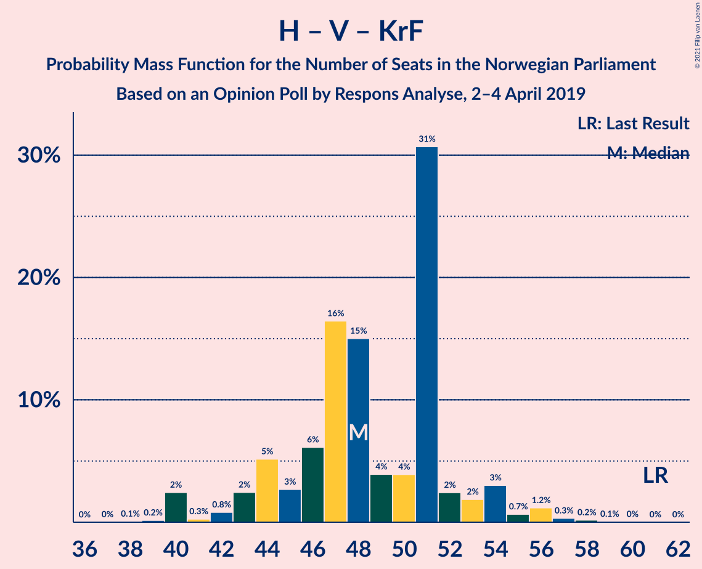
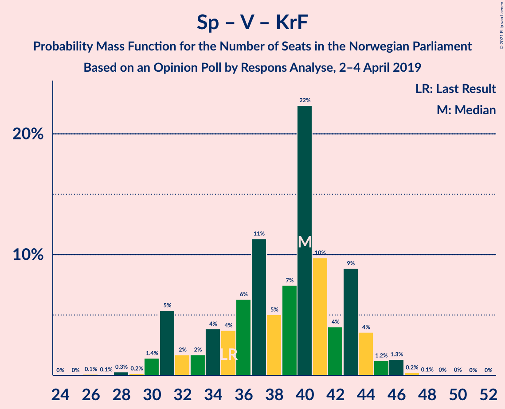

# Opinion Poll by Respons Analyse, 2–4 April 2019

<a href="#voting-intentions">Voting Intentions</a> | <a href="#seats">Seats</a> | <a href="#coalitions">Coalitions</a> | <a href="#technical-information">Technical Information</a>

## Voting Intentions

### Confidence Intervals

| Party | Last Result | Poll Result | 80% Confidence Interval | 90% Confidence Interval | 95% Confidence Interval | 99% Confidence Interval |
|:-----:|:-----------:|:-----------:|:-----------------------:|:-----------------------:|:-----------------------:|:-----------------------:|
| Arbeiderpartiet | 27.4% | 25.6% | 23.9–27.4% |23.4–27.9% |23.0–28.4% |22.2–29.3% |
| Høyre | 25.0% | 22.4% | 20.7–24.1% |20.3–24.6% |19.9–25.1% |19.1–25.9% |
| Senterpartiet | 10.3% | 15.6% | 14.2–17.1% |13.8–17.6% |13.5–18.0% |12.8–18.7% |
| Fremskrittspartiet | 15.2% | 10.1% | 9.0–11.4% |8.6–11.8% |8.4–12.1% |7.8–12.8% |
| Sosialistisk Venstreparti | 6.0% | 7.6% | 6.6–8.8% |6.3–9.1% |6.1–9.4% |5.7–10.0% |
| Rødt | 2.4% | 4.7% | 3.9–5.7% |3.7–5.9% |3.6–6.2% |3.2–6.7% |
| Venstre | 4.4% | 4.3% | 3.6–5.2% |3.4–5.5% |3.2–5.7% |2.9–6.2% |
| Miljøpartiet De Grønne | 3.2% | 3.9% | 3.2–4.8% |3.0–5.1% |2.9–5.3% |2.6–5.8% |
| Kristelig Folkeparti | 4.2% | 3.0% | 2.4–3.8% |2.2–4.0% |2.1–4.3% |1.9–4.7% |

*Note:* The poll result column reflects the actual value used in the calculations. Published results may vary slightly, and in addition be rounded to fewer digits.

## Seats

### Confidence Intervals

| Party | Last Result | Median | 80% Confidence Interval | 90% Confidence Interval | 95% Confidence Interval | 99% Confidence Interval |
|:-----:|:-----------:|:------:|:-----------------------:|:-----------------------:|:-----------------------:|:-----------------------:|
| <a href="#arbeiderpartiet">Arbeiderpartiet</a> | 49 | 44 | 44–52 |42–53 |41–53 |41–54 |
| <a href="#høyre">Høyre</a> | 45 | 42 | 37–42 |35–44 |35–46 |34–49 |
| <a href="#senterpartiet">Senterpartiet</a> | 19 | 31 | 27–33 |26–34 |25–34 |23–35 |
| <a href="#fremskrittspartiet">Fremskrittspartiet</a> | 27 | 18 | 16–20 |15–20 |14–22 |13–23 |
| <a href="#sosialistisk-venstreparti">Sosialistisk Venstreparti</a> | 11 | 14 | 11–15 |11–16 |10–18 |10–18 |
| <a href="#rødt">Rødt</a> | 1 | 9 | 2–9 |2–10 |2–11 |2–11 |
| <a href="#venstre">Venstre</a> | 8 | 8 | 2–9 |2–9 |2–10 |2–10 |
| <a href="#miljøpartiet-de-grønne">Miljøpartiet De Grønne</a> | 1 | 2 | 2–8 |2–9 |1–9 |1–10 |
| <a href="#kristelig-folkeparti">Kristelig Folkeparti</a> | 8 | 1 | 1–3 |1–7 |1–7 |0–8 |

### Arbeiderpartiet

*For a full overview of the results for this party, see the [Arbeiderpartiet](party-arbeiderpartiet.html) page.*

| Number of Seats | Probability | Accumulated | Special Marks |
|:---------------:|:-----------:|:-----------:|:-------------:|
| 40 | 0.1% | 100% |  |
| 41 | 4% | 99.8% |  |
| 42 | 1.3% | 96% |  |
| 43 | 2% | 94% |  |
| 44 | 45% | 92% | Median |
| 45 | 3% | 47% |  |
| 46 | 12% | 44% |  |
| 47 | 4% | 32% |  |
| 48 | 2% | 29% |  |
| 49 | 4% | 27% | Last Result |
| 50 | 6% | 23% |  |
| 51 | 3% | 17% |  |
| 52 | 7% | 14% |  |
| 53 | 5% | 7% |  |
| 54 | 1.4% | 2% |  |
| 55 | 0.2% | 0.5% |  |
| 56 | 0.2% | 0.3% |  |
| 57 | 0% | 0.1% |  |
| 58 | 0% | 0% |  |

### Høyre

*For a full overview of the results for this party, see the [Høyre](party-høyre.html) page.*

| Number of Seats | Probability | Accumulated | Special Marks |
|:---------------:|:-----------:|:-----------:|:-------------:|
| 33 | 0.2% | 100% |  |
| 34 | 2% | 99.8% |  |
| 35 | 4% | 98% |  |
| 36 | 3% | 94% |  |
| 37 | 10% | 91% |  |
| 38 | 14% | 81% |  |
| 39 | 2% | 67% |  |
| 40 | 9% | 65% |  |
| 41 | 6% | 56% |  |
| 42 | 43% | 50% | Median |
| 43 | 2% | 7% |  |
| 44 | 1.2% | 6% |  |
| 45 | 1.3% | 4% | Last Result |
| 46 | 2% | 3% |  |
| 47 | 0.5% | 1.3% |  |
| 48 | 0.2% | 0.8% |  |
| 49 | 0.6% | 0.6% |  |
| 50 | 0% | 0% |  |

### Senterpartiet

*For a full overview of the results for this party, see the [Senterpartiet](party-senterpartiet.html) page.*

| Number of Seats | Probability | Accumulated | Special Marks |
|:---------------:|:-----------:|:-----------:|:-------------:|
| 19 | 0% | 100% | Last Result |
| 20 | 0% | 100% |  |
| 21 | 0.2% | 100% |  |
| 22 | 0.2% | 99.8% |  |
| 23 | 0.9% | 99.6% |  |
| 24 | 0.5% | 98.6% |  |
| 25 | 0.7% | 98% |  |
| 26 | 6% | 97% |  |
| 27 | 7% | 91% |  |
| 28 | 17% | 84% |  |
| 29 | 6% | 67% |  |
| 30 | 3% | 61% |  |
| 31 | 41% | 58% | Median |
| 32 | 4% | 17% |  |
| 33 | 8% | 14% |  |
| 34 | 4% | 6% |  |
| 35 | 1.5% | 2% |  |
| 36 | 0.3% | 0.3% |  |
| 37 | 0% | 0% |  |

### Fremskrittspartiet

*For a full overview of the results for this party, see the [Fremskrittspartiet](party-fremskrittspartiet.html) page.*

| Number of Seats | Probability | Accumulated | Special Marks |
|:---------------:|:-----------:|:-----------:|:-------------:|
| 12 | 0.1% | 100% |  |
| 13 | 2% | 99.9% |  |
| 14 | 1.1% | 98% |  |
| 15 | 6% | 97% |  |
| 16 | 6% | 91% |  |
| 17 | 9% | 85% |  |
| 18 | 45% | 77% | Median |
| 19 | 16% | 31% |  |
| 20 | 11% | 16% |  |
| 21 | 2% | 5% |  |
| 22 | 2% | 3% |  |
| 23 | 0.6% | 0.9% |  |
| 24 | 0.2% | 0.2% |  |
| 25 | 0% | 0.1% |  |
| 26 | 0% | 0% |  |
| 27 | 0% | 0% | Last Result |

### Sosialistisk Venstreparti

*For a full overview of the results for this party, see the [Sosialistisk Venstreparti](party-sosialistiskvenstreparti.html) page.*

| Number of Seats | Probability | Accumulated | Special Marks |
|:---------------:|:-----------:|:-----------:|:-------------:|
| 9 | 0.1% | 100% |  |
| 10 | 2% | 99.8% |  |
| 11 | 8% | 97% | Last Result |
| 12 | 9% | 89% |  |
| 13 | 14% | 81% |  |
| 14 | 49% | 66% | Median |
| 15 | 11% | 17% |  |
| 16 | 2% | 6% |  |
| 17 | 1.4% | 5% |  |
| 18 | 3% | 3% |  |
| 19 | 0% | 0.1% |  |
| 20 | 0% | 0% |  |

### Rødt

*For a full overview of the results for this party, see the [Rødt](party-rødt.html) page.*

| Number of Seats | Probability | Accumulated | Special Marks |
|:---------------:|:-----------:|:-----------:|:-------------:|
| 1 | 0% | 100% | Last Result |
| 2 | 11% | 100% |  |
| 3 | 0% | 89% |  |
| 4 | 0% | 89% |  |
| 5 | 0% | 89% |  |
| 6 | 0.1% | 89% |  |
| 7 | 12% | 89% |  |
| 8 | 14% | 77% |  |
| 9 | 55% | 63% | Median |
| 10 | 6% | 9% |  |
| 11 | 3% | 3% |  |
| 12 | 0.4% | 0.5% |  |
| 13 | 0.1% | 0.1% |  |
| 14 | 0% | 0% |  |

### Venstre

*For a full overview of the results for this party, see the [Venstre](party-venstre.html) page.*

| Number of Seats | Probability | Accumulated | Special Marks |
|:---------------:|:-----------:|:-----------:|:-------------:|
| 2 | 12% | 100% |  |
| 3 | 5% | 88% |  |
| 4 | 0.1% | 83% |  |
| 5 | 0% | 83% |  |
| 6 | 0% | 83% |  |
| 7 | 10% | 83% |  |
| 8 | 57% | 73% | Last Result, Median |
| 9 | 12% | 16% |  |
| 10 | 3% | 3% |  |
| 11 | 0.2% | 0.4% |  |
| 12 | 0.2% | 0.2% |  |
| 13 | 0% | 0% |  |

### Miljøpartiet De Grønne

*For a full overview of the results for this party, see the [Miljøpartiet De Grønne](party-miljøpartietdegrønne.html) page.*

| Number of Seats | Probability | Accumulated | Special Marks |
|:---------------:|:-----------:|:-----------:|:-------------:|
| 1 | 4% | 100% | Last Result |
| 2 | 57% | 96% | Median |
| 3 | 3% | 39% |  |
| 4 | 0.2% | 36% |  |
| 5 | 0% | 36% |  |
| 6 | 0.4% | 36% |  |
| 7 | 25% | 35% |  |
| 8 | 6% | 11% |  |
| 9 | 4% | 5% |  |
| 10 | 0.9% | 1.1% |  |
| 11 | 0.2% | 0.2% |  |
| 12 | 0.1% | 0.1% |  |
| 13 | 0% | 0% |  |

### Kristelig Folkeparti

*For a full overview of the results for this party, see the [Kristelig Folkeparti](party-kristeligfolkeparti.html) page.*

| Number of Seats | Probability | Accumulated | Special Marks |
|:---------------:|:-----------:|:-----------:|:-------------:|
| 0 | 2% | 100% |  |
| 1 | 72% | 98% | Median |
| 2 | 7% | 26% |  |
| 3 | 12% | 18% |  |
| 4 | 0% | 6% |  |
| 5 | 0% | 6% |  |
| 6 | 0.1% | 6% |  |
| 7 | 5% | 6% |  |
| 8 | 1.1% | 1.2% | Last Result |
| 9 | 0% | 0.1% |  |
| 10 | 0% | 0% |  |

## Coalitions

### Confidence Intervals

| Coalition | Last Result | Median | Majority? | 80% Confidence Interval | 90% Confidence Interval | 95% Confidence Interval | 99% Confidence Interval |
|:---------:|:-----------:|:------:|:---------:|:-----------------------:|:-----------------------:|:-----------------------:|:-----------------------:|
| Arbeiderpartiet – Senterpartiet – Sosialistisk Venstreparti – Rødt – Miljøpartiet De Grønne | 81 | 100 | 100% | 99–106 | 97–108 | 96–110 | 94–110 |
| Arbeiderpartiet – Senterpartiet – Sosialistisk Venstreparti – Rødt | 80 | 98 | 99.9% | 94–102 | 92–104 | 92–104 | 86–107 |
| Arbeiderpartiet – Senterpartiet – Sosialistisk Venstreparti – Miljøpartiet De Grønne – Kristelig Folkeparti | 88 | 94 | 99.9% | 92–101 | 92–102 | 90–103 | 88–104 |
| Høyre – Senterpartiet – Fremskrittspartiet – Venstre – Kristelig Folkeparti | 107 | 98 | 99.8% | 92–100 | 89–101 | 89–102 | 87–104 |
| Arbeiderpartiet – Senterpartiet – Sosialistisk Venstreparti – Miljøpartiet De Grønne | 80 | 93 | 99.9% | 91–99 | 91–99 | 89–101 | 86–102 |
| Arbeiderpartiet – Senterpartiet – Sosialistisk Venstreparti | 79 | 89 | 97% | 86–94 | 85–96 | 84–97 | 81–98 |
| Arbeiderpartiet – Senterpartiet – Miljøpartiet De Grønne – Kristelig Folkeparti | 77 | 82 | 24% | 78–88 | 78–89 | 78–91 | 74–91 |
| Arbeiderpartiet – Senterpartiet – Kristelig Folkeparti | 76 | 76 | 2% | 74–83 | 73–84 | 72–84 | 70–87 |
| Arbeiderpartiet – Senterpartiet | 68 | 75 | 0.1% | 72–80 | 72–82 | 71–82 | 68–84 |
| Høyre – Fremskrittspartiet – Venstre – Miljøpartiet De Grønne – Kristelig Folkeparti | 89 | 71 | 0.1% | 66–74 | 65–77 | 64–77 | 62–83 |
| Høyre – Fremskrittspartiet – Venstre – Kristelig Folkeparti | 88 | 69 | 0% | 62–70 | 61–71 | 59–72 | 59–75 |
| Høyre – Fremskrittspartiet – Venstre | 80 | 67 | 0% | 60–69 | 59–70 | 58–71 | 57–74 |
| Arbeiderpartiet – Sosialistisk Venstreparti | 60 | 58 | 0% | 57–65 | 55–67 | 54–68 | 53–68 |
| Høyre – Fremskrittspartiet | 72 | 60 | 0% | 53–61 | 51–63 | 50–65 | 49–68 |
| Høyre – Venstre – Kristelig Folkeparti | 61 | 51 | 0% | 44–51 | 44–53 | 43–54 | 41–57 |
| Senterpartiet – Venstre – Kristelig Folkeparti | 35 | 40 | 0% | 35–42 | 32–44 | 30–45 | 29–46 |

### Arbeiderpartiet – Senterpartiet – Sosialistisk Venstreparti – Rødt – Miljøpartiet De Grønne

| Number of Seats | Probability | Accumulated | Special Marks |
|:---------------:|:-----------:|:-----------:|:-------------:|
| 81 | 0% | 100% | Last Result |
| 82 | 0% | 100% |  |
| 83 | 0% | 100% |  |
| 84 | 0% | 100% |  |
| 85 | 0% | 100% | Majority |
| 86 | 0% | 100% |  |
| 87 | 0% | 100% |  |
| 88 | 0% | 100% |  |
| 89 | 0% | 100% |  |
| 90 | 0% | 100% |  |
| 91 | 0.2% | 100% |  |
| 92 | 0.1% | 99.8% |  |
| 93 | 0.1% | 99.7% |  |
| 94 | 1.2% | 99.6% |  |
| 95 | 0.6% | 98% |  |
| 96 | 0.5% | 98% |  |
| 97 | 2% | 97% |  |
| 98 | 4% | 95% |  |
| 99 | 4% | 91% |  |
| 100 | 38% | 86% | Median |
| 101 | 4% | 48% |  |
| 102 | 12% | 44% |  |
| 103 | 7% | 32% |  |
| 104 | 4% | 26% |  |
| 105 | 2% | 22% |  |
| 106 | 10% | 20% |  |
| 107 | 3% | 9% |  |
| 108 | 2% | 6% |  |
| 109 | 0.5% | 4% |  |
| 110 | 3% | 4% |  |
| 111 | 0.1% | 0.3% |  |
| 112 | 0.2% | 0.2% |  |
| 113 | 0% | 0% |  |

### Arbeiderpartiet – Senterpartiet – Sosialistisk Venstreparti – Rødt

| Number of Seats | Probability | Accumulated | Special Marks |
|:---------------:|:-----------:|:-----------:|:-------------:|
| 80 | 0% | 100% | Last Result |
| 81 | 0% | 100% |  |
| 82 | 0% | 100% |  |
| 83 | 0.1% | 100% |  |
| 84 | 0% | 99.9% |  |
| 85 | 0% | 99.9% | Majority |
| 86 | 0.5% | 99.8% |  |
| 87 | 0.1% | 99.4% |  |
| 88 | 0.3% | 99.2% |  |
| 89 | 0.6% | 98.9% |  |
| 90 | 0.3% | 98% |  |
| 91 | 0.2% | 98% |  |
| 92 | 5% | 98% |  |
| 93 | 1.4% | 93% |  |
| 94 | 3% | 92% |  |
| 95 | 8% | 89% |  |
| 96 | 10% | 81% |  |
| 97 | 1.4% | 71% |  |
| 98 | 39% | 70% | Median |
| 99 | 9% | 30% |  |
| 100 | 9% | 21% |  |
| 101 | 1.4% | 13% |  |
| 102 | 1.4% | 11% |  |
| 103 | 4% | 10% |  |
| 104 | 4% | 6% |  |
| 105 | 0.8% | 2% |  |
| 106 | 1.1% | 2% |  |
| 107 | 0.4% | 0.5% |  |
| 108 | 0.1% | 0.1% |  |
| 109 | 0% | 0% |  |

### Arbeiderpartiet – Senterpartiet – Sosialistisk Venstreparti – Miljøpartiet De Grønne – Kristelig Folkeparti

| Number of Seats | Probability | Accumulated | Special Marks |
|:---------------:|:-----------:|:-----------:|:-------------:|
| 84 | 0% | 100% |  |
| 85 | 0% | 99.9% | Majority |
| 86 | 0.2% | 99.9% |  |
| 87 | 0.1% | 99.8% |  |
| 88 | 0.7% | 99.7% | Last Result |
| 89 | 1.2% | 99.0% |  |
| 90 | 0.6% | 98% |  |
| 91 | 0.3% | 97% |  |
| 92 | 38% | 97% | Median |
| 93 | 5% | 59% |  |
| 94 | 7% | 54% |  |
| 95 | 2% | 47% |  |
| 96 | 2% | 45% |  |
| 97 | 12% | 43% |  |
| 98 | 3% | 31% |  |
| 99 | 4% | 28% |  |
| 100 | 8% | 23% |  |
| 101 | 7% | 16% |  |
| 102 | 6% | 8% |  |
| 103 | 2% | 3% |  |
| 104 | 0.2% | 0.6% |  |
| 105 | 0.2% | 0.4% |  |
| 106 | 0% | 0.2% |  |
| 107 | 0% | 0.2% |  |
| 108 | 0.2% | 0.2% |  |
| 109 | 0% | 0% |  |

### Høyre – Senterpartiet – Fremskrittspartiet – Venstre – Kristelig Folkeparti

| Number of Seats | Probability | Accumulated | Special Marks |
|:---------------:|:-----------:|:-----------:|:-------------:|
| 84 | 0.2% | 100% |  |
| 85 | 0.1% | 99.8% | Majority |
| 86 | 0% | 99.7% |  |
| 87 | 0.2% | 99.7% |  |
| 88 | 1.1% | 99.5% |  |
| 89 | 5% | 98% |  |
| 90 | 2% | 93% |  |
| 91 | 1.1% | 92% |  |
| 92 | 7% | 91% |  |
| 93 | 4% | 84% |  |
| 94 | 3% | 80% |  |
| 95 | 13% | 77% |  |
| 96 | 7% | 64% |  |
| 97 | 2% | 58% |  |
| 98 | 8% | 56% |  |
| 99 | 2% | 48% |  |
| 100 | 37% | 46% | Median |
| 101 | 5% | 8% |  |
| 102 | 2% | 4% |  |
| 103 | 1.0% | 2% |  |
| 104 | 0.5% | 0.9% |  |
| 105 | 0.2% | 0.4% |  |
| 106 | 0.1% | 0.3% |  |
| 107 | 0.1% | 0.1% | Last Result |
| 108 | 0.1% | 0.1% |  |
| 109 | 0% | 0% |  |

### Arbeiderpartiet – Senterpartiet – Sosialistisk Venstreparti – Miljøpartiet De Grønne

| Number of Seats | Probability | Accumulated | Special Marks |
|:---------------:|:-----------:|:-----------:|:-------------:|
| 80 | 0% | 100% | Last Result |
| 81 | 0% | 100% |  |
| 82 | 0% | 100% |  |
| 83 | 0% | 99.9% |  |
| 84 | 0% | 99.9% |  |
| 85 | 0.3% | 99.9% | Majority |
| 86 | 0.4% | 99.6% |  |
| 87 | 0.6% | 99.2% |  |
| 88 | 0.9% | 98.6% |  |
| 89 | 1.2% | 98% |  |
| 90 | 0.6% | 97% |  |
| 91 | 37% | 96% | Median |
| 92 | 6% | 59% |  |
| 93 | 8% | 52% |  |
| 94 | 7% | 45% |  |
| 95 | 4% | 38% |  |
| 96 | 10% | 34% |  |
| 97 | 4% | 24% |  |
| 98 | 9% | 19% |  |
| 99 | 6% | 10% |  |
| 100 | 0.5% | 5% |  |
| 101 | 4% | 4% |  |
| 102 | 0.2% | 0.6% |  |
| 103 | 0.1% | 0.3% |  |
| 104 | 0% | 0.2% |  |
| 105 | 0% | 0.2% |  |
| 106 | 0% | 0.1% |  |
| 107 | 0.1% | 0.1% |  |
| 108 | 0% | 0% |  |

### Arbeiderpartiet – Senterpartiet – Sosialistisk Venstreparti

| Number of Seats | Probability | Accumulated | Special Marks |
|:---------------:|:-----------:|:-----------:|:-------------:|
| 79 | 0.3% | 100% | Last Result |
| 80 | 0.1% | 99.7% |  |
| 81 | 0.2% | 99.6% |  |
| 82 | 0.2% | 99.4% |  |
| 83 | 0.7% | 99.1% |  |
| 84 | 2% | 98% |  |
| 85 | 5% | 97% | Majority |
| 86 | 3% | 92% |  |
| 87 | 7% | 89% |  |
| 88 | 3% | 81% |  |
| 89 | 41% | 79% | Median |
| 90 | 4% | 38% |  |
| 91 | 12% | 34% |  |
| 92 | 4% | 22% |  |
| 93 | 2% | 19% |  |
| 94 | 8% | 17% |  |
| 95 | 1.4% | 9% |  |
| 96 | 5% | 8% |  |
| 97 | 2% | 3% |  |
| 98 | 0.6% | 0.9% |  |
| 99 | 0.1% | 0.3% |  |
| 100 | 0.1% | 0.1% |  |
| 101 | 0% | 0% |  |

### Arbeiderpartiet – Senterpartiet – Miljøpartiet De Grønne – Kristelig Folkeparti

| Number of Seats | Probability | Accumulated | Special Marks |
|:---------------:|:-----------:|:-----------:|:-------------:|
| 70 | 0.1% | 100% |  |
| 71 | 0.3% | 99.9% |  |
| 72 | 0.1% | 99.7% |  |
| 73 | 0% | 99.6% |  |
| 74 | 0.3% | 99.5% |  |
| 75 | 0.3% | 99.3% |  |
| 76 | 0.2% | 99.0% |  |
| 77 | 0.5% | 98.7% | Last Result |
| 78 | 37% | 98% | Median |
| 79 | 3% | 61% |  |
| 80 | 5% | 59% |  |
| 81 | 1.2% | 54% |  |
| 82 | 5% | 52% |  |
| 83 | 16% | 47% |  |
| 84 | 7% | 31% |  |
| 85 | 2% | 24% | Majority |
| 86 | 5% | 22% |  |
| 87 | 6% | 17% |  |
| 88 | 5% | 10% |  |
| 89 | 0.7% | 5% |  |
| 90 | 2% | 5% |  |
| 91 | 2% | 3% |  |
| 92 | 0.1% | 0.5% |  |
| 93 | 0.3% | 0.3% |  |
| 94 | 0% | 0.1% |  |
| 95 | 0% | 0.1% |  |
| 96 | 0% | 0.1% |  |
| 97 | 0.1% | 0.1% |  |
| 98 | 0% | 0% |  |

### Arbeiderpartiet – Senterpartiet – Kristelig Folkeparti

| Number of Seats | Probability | Accumulated | Special Marks |
|:---------------:|:-----------:|:-----------:|:-------------:|
| 68 | 0.2% | 100% |  |
| 69 | 0.2% | 99.8% |  |
| 70 | 0.5% | 99.6% |  |
| 71 | 0.4% | 99.1% |  |
| 72 | 2% | 98.7% |  |
| 73 | 4% | 97% |  |
| 74 | 5% | 93% |  |
| 75 | 0.3% | 88% |  |
| 76 | 40% | 88% | Last Result, Median |
| 77 | 7% | 48% |  |
| 78 | 2% | 41% |  |
| 79 | 4% | 39% |  |
| 80 | 9% | 35% |  |
| 81 | 15% | 26% |  |
| 82 | 1.3% | 12% |  |
| 83 | 4% | 10% |  |
| 84 | 5% | 7% |  |
| 85 | 0.4% | 2% | Majority |
| 86 | 0.2% | 1.4% |  |
| 87 | 1.0% | 1.2% |  |
| 88 | 0.1% | 0.1% |  |
| 89 | 0.1% | 0.1% |  |
| 90 | 0% | 0% |  |

### Arbeiderpartiet – Senterpartiet

| Number of Seats | Probability | Accumulated | Special Marks |
|:---------------:|:-----------:|:-----------:|:-------------:|
| 66 | 0.1% | 100% |  |
| 67 | 0.1% | 99.9% |  |
| 68 | 0.6% | 99.8% | Last Result |
| 69 | 0.3% | 99.1% |  |
| 70 | 0.7% | 98.8% |  |
| 71 | 1.2% | 98% |  |
| 72 | 8% | 97% |  |
| 73 | 3% | 89% |  |
| 74 | 4% | 86% |  |
| 75 | 40% | 82% | Median |
| 76 | 6% | 42% |  |
| 77 | 6% | 36% |  |
| 78 | 4% | 30% |  |
| 79 | 6% | 26% |  |
| 80 | 13% | 20% |  |
| 81 | 2% | 7% |  |
| 82 | 4% | 5% |  |
| 83 | 0.6% | 2% |  |
| 84 | 1.0% | 1.2% |  |
| 85 | 0.1% | 0.1% | Majority |
| 86 | 0% | 0.1% |  |
| 87 | 0% | 0% |  |

### Høyre – Fremskrittspartiet – Venstre – Miljøpartiet De Grønne – Kristelig Folkeparti

| Number of Seats | Probability | Accumulated | Special Marks |
|:---------------:|:-----------:|:-----------:|:-------------:|
| 59 | 0% | 100% |  |
| 60 | 0% | 99.9% |  |
| 61 | 0.4% | 99.9% |  |
| 62 | 0.5% | 99.5% |  |
| 63 | 1.2% | 99.0% |  |
| 64 | 0.9% | 98% |  |
| 65 | 4% | 97% |  |
| 66 | 4% | 93% |  |
| 67 | 1.4% | 89% |  |
| 68 | 2% | 88% |  |
| 69 | 9% | 86% |  |
| 70 | 9% | 78% |  |
| 71 | 39% | 68% | Median |
| 72 | 1.5% | 29% |  |
| 73 | 10% | 27% |  |
| 74 | 8% | 18% |  |
| 75 | 2% | 10% |  |
| 76 | 1.2% | 8% |  |
| 77 | 4% | 6% |  |
| 78 | 0.2% | 2% |  |
| 79 | 0.3% | 2% |  |
| 80 | 0.6% | 2% |  |
| 81 | 0.3% | 1.0% |  |
| 82 | 0% | 0.6% |  |
| 83 | 0.4% | 0.6% |  |
| 84 | 0% | 0.2% |  |
| 85 | 0% | 0.1% | Majority |
| 86 | 0.1% | 0.1% |  |
| 87 | 0% | 0% |  |
| 88 | 0% | 0% |  |
| 89 | 0% | 0% | Last Result |

### Høyre – Fremskrittspartiet – Venstre – Kristelig Folkeparti

| Number of Seats | Probability | Accumulated | Special Marks |
|:---------------:|:-----------:|:-----------:|:-------------:|
| 57 | 0.2% | 100% |  |
| 58 | 0.1% | 99.7% |  |
| 59 | 4% | 99.6% |  |
| 60 | 0.5% | 96% |  |
| 61 | 2% | 95% |  |
| 62 | 4% | 94% |  |
| 63 | 11% | 90% |  |
| 64 | 2% | 79% |  |
| 65 | 4% | 77% |  |
| 66 | 7% | 73% |  |
| 67 | 12% | 66% |  |
| 68 | 4% | 54% |  |
| 69 | 38% | 51% | Median |
| 70 | 4% | 13% |  |
| 71 | 4% | 9% |  |
| 72 | 2% | 5% |  |
| 73 | 0.3% | 2% |  |
| 74 | 0.5% | 2% |  |
| 75 | 1.0% | 1.4% |  |
| 76 | 0.1% | 0.4% |  |
| 77 | 0.1% | 0.3% |  |
| 78 | 0.2% | 0.2% |  |
| 79 | 0% | 0% |  |
| 80 | 0% | 0% |  |
| 81 | 0% | 0% |  |
| 82 | 0% | 0% |  |
| 83 | 0% | 0% |  |
| 84 | 0% | 0% |  |
| 85 | 0% | 0% | Majority |
| 86 | 0% | 0% |  |
| 87 | 0% | 0% |  |
| 88 | 0% | 0% | Last Result |

### Høyre – Fremskrittspartiet – Venstre

| Number of Seats | Probability | Accumulated | Special Marks |
|:---------------:|:-----------:|:-----------:|:-------------:|
| 54 | 0.1% | 100% |  |
| 55 | 0.1% | 99.9% |  |
| 56 | 0.2% | 99.8% |  |
| 57 | 0.2% | 99.6% |  |
| 58 | 4% | 99.4% |  |
| 59 | 3% | 95% |  |
| 60 | 9% | 92% |  |
| 61 | 6% | 83% |  |
| 62 | 5% | 77% |  |
| 63 | 5% | 72% |  |
| 64 | 3% | 67% |  |
| 65 | 4% | 65% |  |
| 66 | 7% | 61% |  |
| 67 | 5% | 53% |  |
| 68 | 37% | 48% | Median |
| 69 | 5% | 11% |  |
| 70 | 4% | 7% |  |
| 71 | 1.3% | 3% |  |
| 72 | 0.7% | 2% |  |
| 73 | 0.2% | 0.9% |  |
| 74 | 0.5% | 0.8% |  |
| 75 | 0.1% | 0.3% |  |
| 76 | 0% | 0.2% |  |
| 77 | 0.2% | 0.2% |  |
| 78 | 0% | 0% |  |
| 79 | 0% | 0% |  |
| 80 | 0% | 0% | Last Result |

### Arbeiderpartiet – Sosialistisk Venstreparti

| Number of Seats | Probability | Accumulated | Special Marks |
|:---------------:|:-----------:|:-----------:|:-------------:|
| 52 | 0.1% | 100% |  |
| 53 | 0.8% | 99.8% |  |
| 54 | 4% | 99.0% |  |
| 55 | 2% | 95% |  |
| 56 | 2% | 93% |  |
| 57 | 5% | 91% |  |
| 58 | 42% | 86% | Median |
| 59 | 6% | 44% |  |
| 60 | 4% | 38% | Last Result |
| 61 | 4% | 34% |  |
| 62 | 4% | 30% |  |
| 63 | 11% | 26% |  |
| 64 | 1.1% | 15% |  |
| 65 | 4% | 14% |  |
| 66 | 0.3% | 10% |  |
| 67 | 5% | 9% |  |
| 68 | 4% | 4% |  |
| 69 | 0.1% | 0.4% |  |
| 70 | 0.2% | 0.3% |  |
| 71 | 0.1% | 0.1% |  |
| 72 | 0% | 0.1% |  |
| 73 | 0.1% | 0.1% |  |
| 74 | 0% | 0% |  |

### Høyre – Fremskrittspartiet

| Number of Seats | Probability | Accumulated | Special Marks |
|:---------------:|:-----------:|:-----------:|:-------------:|
| 49 | 0.5% | 100% |  |
| 50 | 3% | 99.5% |  |
| 51 | 2% | 96% |  |
| 52 | 3% | 94% |  |
| 53 | 3% | 91% |  |
| 54 | 4% | 88% |  |
| 55 | 3% | 84% |  |
| 56 | 5% | 81% |  |
| 57 | 7% | 76% |  |
| 58 | 11% | 69% |  |
| 59 | 5% | 58% |  |
| 60 | 41% | 53% | Median |
| 61 | 5% | 12% |  |
| 62 | 2% | 7% |  |
| 63 | 1.2% | 5% |  |
| 64 | 1.5% | 4% |  |
| 65 | 0.2% | 3% |  |
| 66 | 1.1% | 2% |  |
| 67 | 0.5% | 1.4% |  |
| 68 | 0.8% | 0.9% |  |
| 69 | 0% | 0.1% |  |
| 70 | 0% | 0.1% |  |
| 71 | 0% | 0% |  |
| 72 | 0% | 0% | Last Result |

### Høyre – Venstre – Kristelig Folkeparti

| Number of Seats | Probability | Accumulated | Special Marks |
|:---------------:|:-----------:|:-----------:|:-------------:|
| 39 | 0.1% | 100% |  |
| 40 | 0.2% | 99.8% |  |
| 41 | 0.3% | 99.6% |  |
| 42 | 1.1% | 99.3% |  |
| 43 | 2% | 98% |  |
| 44 | 7% | 96% |  |
| 45 | 3% | 90% |  |
| 46 | 9% | 87% |  |
| 47 | 12% | 78% |  |
| 48 | 6% | 66% |  |
| 49 | 3% | 60% |  |
| 50 | 5% | 56% |  |
| 51 | 42% | 51% | Median |
| 52 | 4% | 9% |  |
| 53 | 2% | 5% |  |
| 54 | 1.3% | 4% |  |
| 55 | 0.7% | 2% |  |
| 56 | 1.1% | 2% |  |
| 57 | 0.4% | 0.6% |  |
| 58 | 0.1% | 0.2% |  |
| 59 | 0% | 0.1% |  |
| 60 | 0% | 0% |  |
| 61 | 0% | 0% | Last Result |

### Senterpartiet – Venstre – Kristelig Folkeparti

| Number of Seats | Probability | Accumulated | Special Marks |
|:---------------:|:-----------:|:-----------:|:-------------:|
| 27 | 0.1% | 100% |  |
| 28 | 0.4% | 99.9% |  |
| 29 | 0.2% | 99.5% |  |
| 30 | 2% | 99.4% |  |
| 31 | 2% | 97% |  |
| 32 | 2% | 96% |  |
| 33 | 2% | 94% |  |
| 34 | 2% | 92% |  |
| 35 | 5% | 90% | Last Result |
| 36 | 1.0% | 85% |  |
| 37 | 17% | 84% |  |
| 38 | 5% | 67% |  |
| 39 | 4% | 61% |  |
| 40 | 37% | 57% | Median |
| 41 | 8% | 20% |  |
| 42 | 4% | 12% |  |
| 43 | 2% | 8% |  |
| 44 | 2% | 6% |  |
| 45 | 2% | 4% |  |
| 46 | 2% | 2% |  |
| 47 | 0.2% | 0.4% |  |
| 48 | 0% | 0.1% |  |
| 49 | 0% | 0.1% |  |
| 50 | 0.1% | 0.1% |  |
| 51 | 0% | 0% |  |

## Technical Information

### Opinion Poll

+ **Polling firm:** Respons Analyse
+ **Commissioner(s):** —
+ **Fieldwork period:** 2–4 April 2019

### Calculations

+ **Sample size:** 1001
+ **Simulations done:** 131,072
+ **Error estimate:** 2.70%

