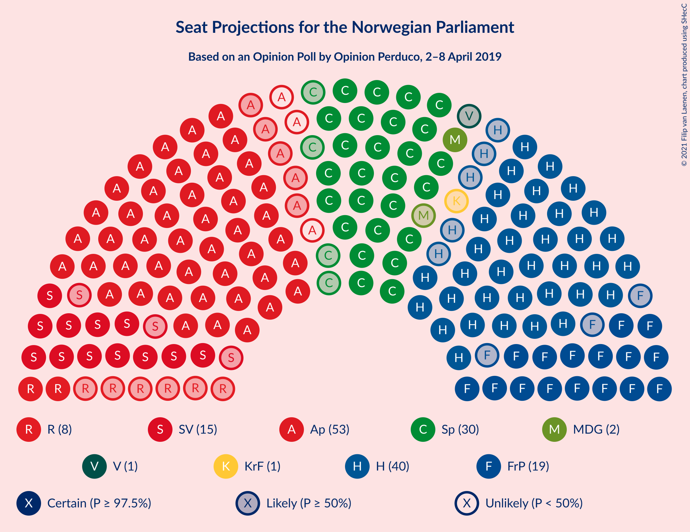
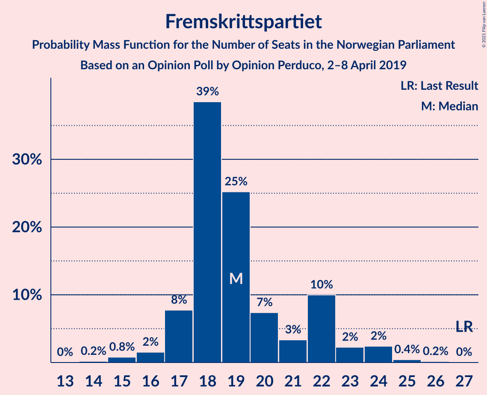
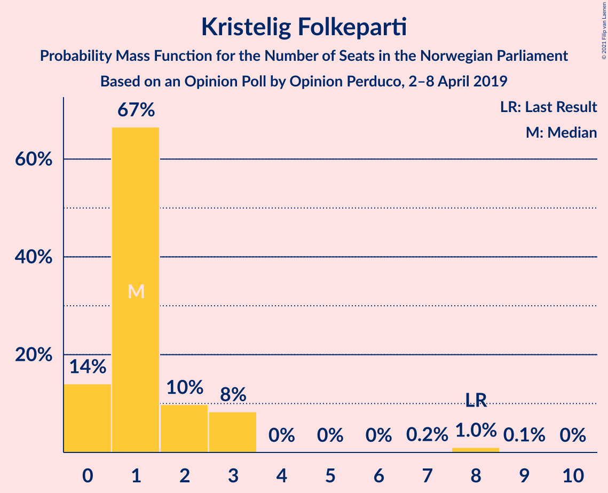
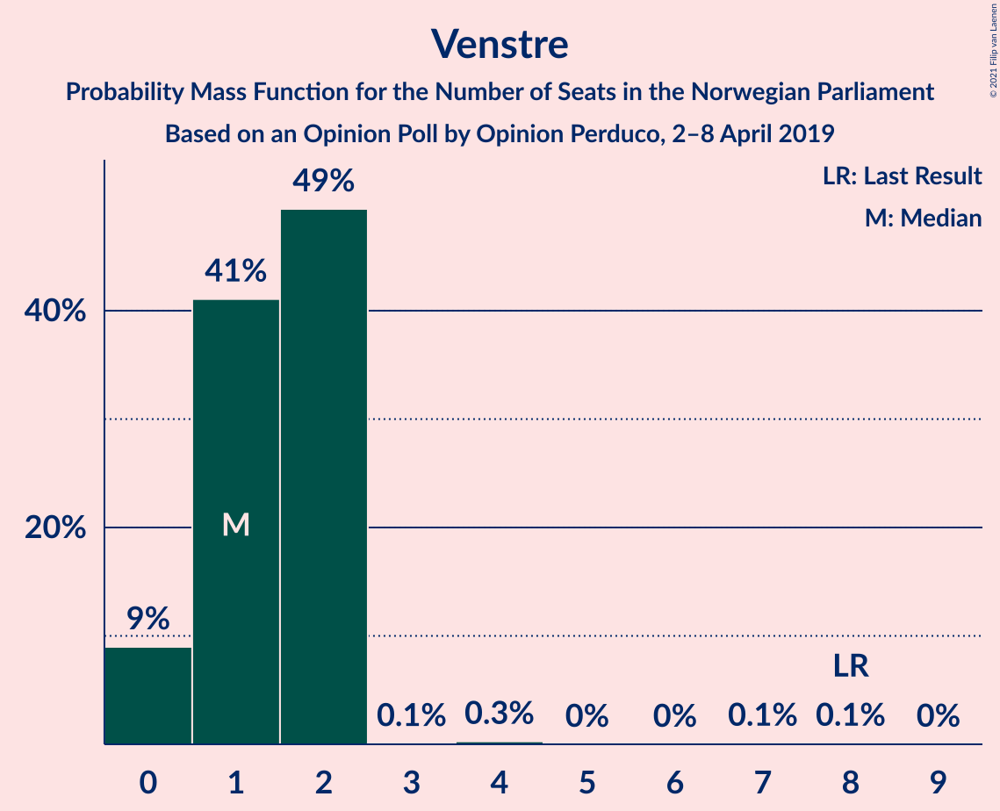
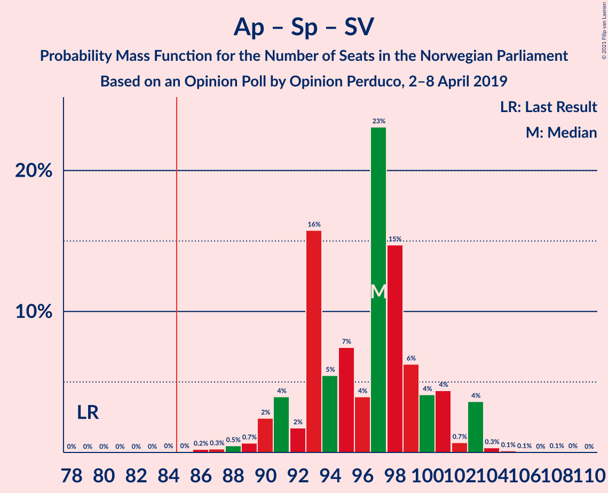
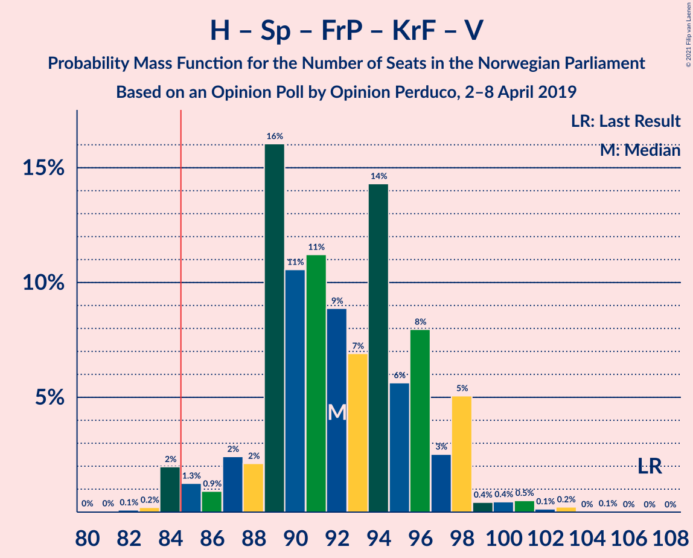
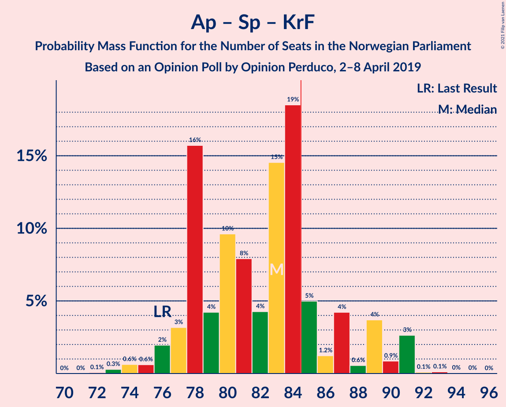
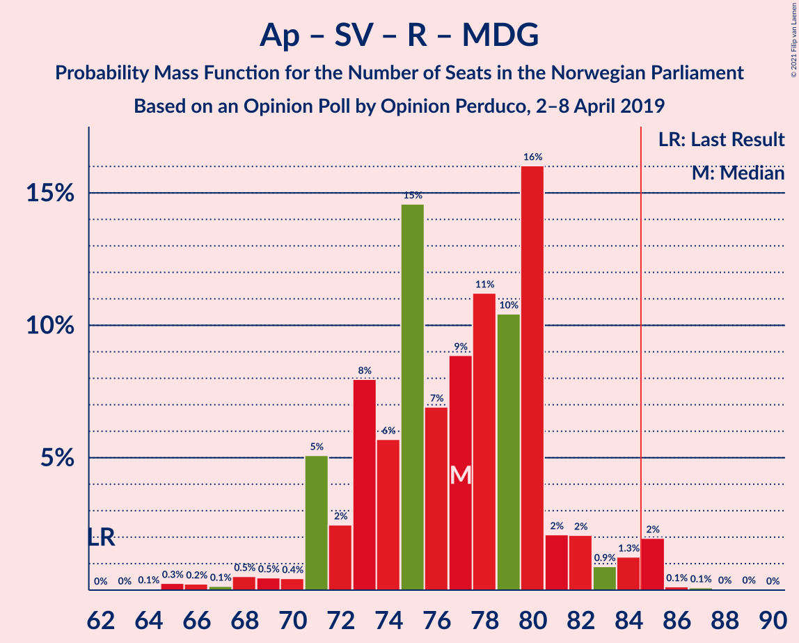
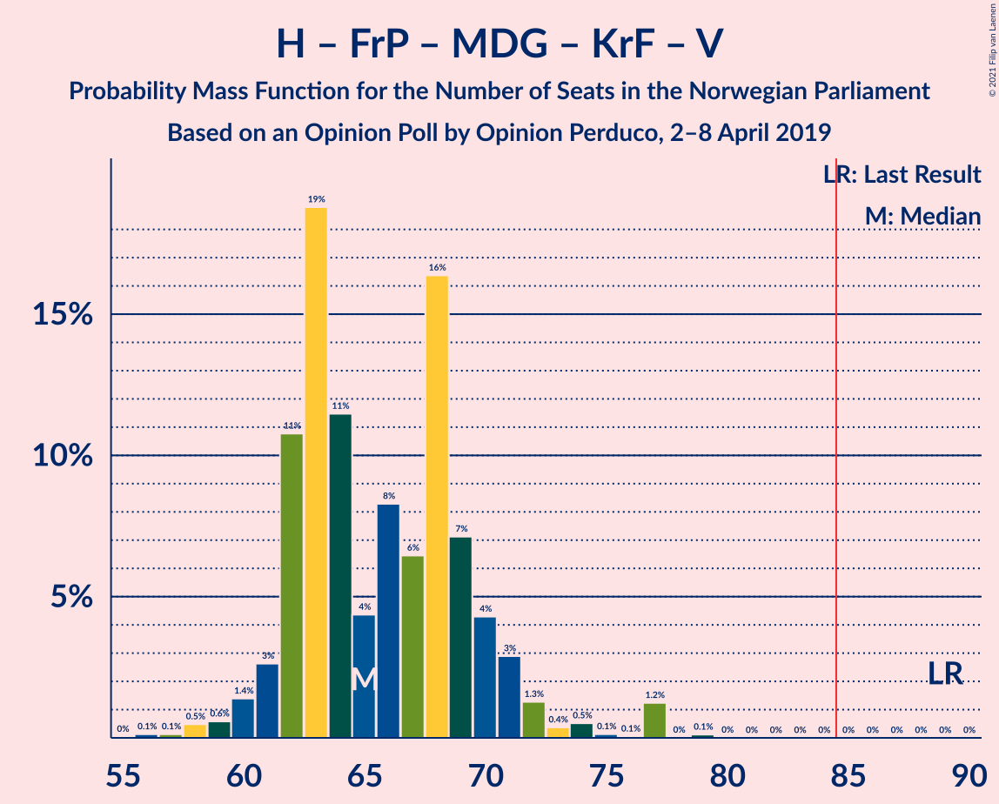
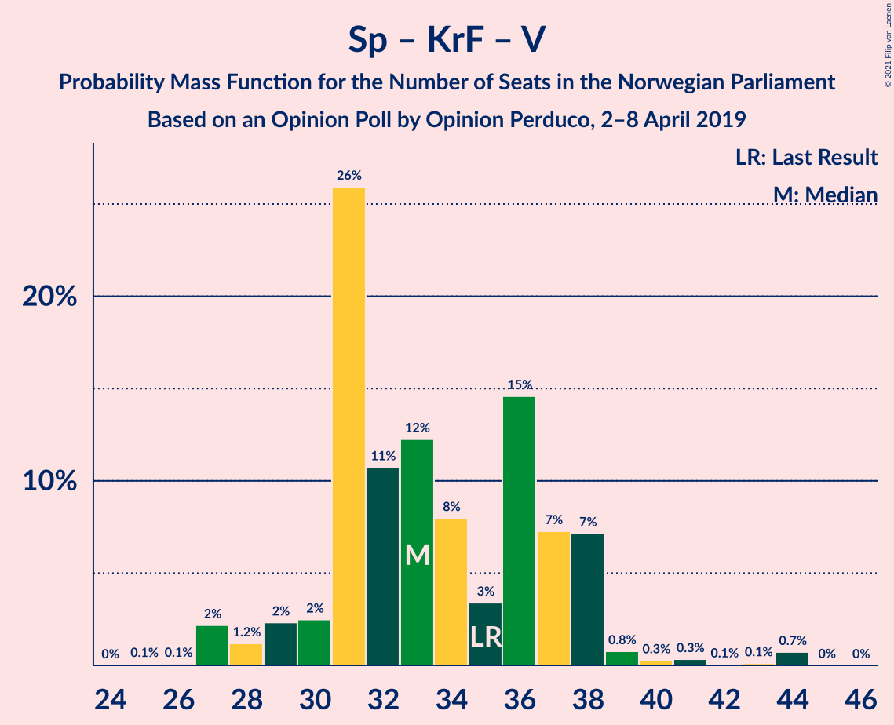

# Opinion Poll by Opinion Perduco, 2–8 April 2019

<a href="#voting-intentions">Voting Intentions</a> | <a href="#seats">Seats</a> | <a href="#coalitions">Coalitions</a> | <a href="#technical-information">Technical Information</a>

## Voting Intentions

### Confidence Intervals

| Party | Last Result | Poll Result | 80% Confidence Interval | 90% Confidence Interval | 95% Confidence Interval | 99% Confidence Interval |
|:-----:|:-----------:|:-----------:|:-----------------------:|:-----------------------:|:-----------------------:|:-----------------------:|
| Arbeiderpartiet | 27.4% | 27.5% | 25.7–29.4% |25.1–29.9% |24.7–30.4% |23.9–31.3% |
| Høyre | 25.0% | 21.5% | 19.8–23.3% |19.4–23.8% |19.0–24.2% |18.2–25.1% |
| Senterpartiet | 10.3% | 16.7% | 15.2–18.3% |14.8–18.8% |14.4–19.2% |13.7–20.0% |
| Fremskrittspartiet | 15.2% | 10.6% | 9.4–12.0% |9.1–12.4% |8.8–12.7% |8.2–13.4% |
| Sosialistisk Venstreparti | 6.0% | 8.2% | 7.1–9.4% |6.8–9.8% |6.6–10.1% |6.1–10.7% |
| Rødt | 2.4% | 4.5% | 3.7–5.5% |3.5–5.8% |3.4–6.0% |3.0–6.5% |
| Miljøpartiet De Grønne | 3.2% | 3.7% | 3.0–4.6% |2.8–4.8% |2.7–5.1% |2.4–5.5% |
| Kristelig Folkeparti | 4.2% | 2.6% | 2.1–3.4% |1.9–3.6% |1.8–3.8% |1.5–4.3% |
| Venstre | 4.4% | 2.3% | 1.8–3.1% |1.6–3.3% |1.5–3.5% |1.3–3.9% |

*Note:* The poll result column reflects the actual value used in the calculations. Published results may vary slightly, and in addition be rounded to fewer digits.

## Seats

### Confidence Intervals

| Party | Last Result | Median | 80% Confidence Interval | 90% Confidence Interval | 95% Confidence Interval | 99% Confidence Interval |
|:-----:|:-----------:|:------:|:-----------------------:|:-----------------------:|:-----------------------:|:-----------------------:|
| <a href="#arbeiderpartiet">Arbeiderpartiet</a> | 49 | 50 | 47–53 |45–55 |45–58 |43–58 |
| <a href="#høyre">Høyre</a> | 45 | 40 | 37–42 |36–44 |35–44 |33–46 |
| <a href="#senterpartiet">Senterpartiet</a> | 19 | 30 | 28–34 |27–35 |26–35 |25–37 |
| <a href="#fremskrittspartiet">Fremskrittspartiet</a> | 27 | 19 | 17–22 |17–23 |16–24 |15–25 |
| <a href="#sosialistisk-venstreparti">Sosialistisk Venstreparti</a> | 11 | 15 | 14–18 |13–18 |12–18 |11–20 |
| <a href="#rødt">Rødt</a> | 1 | 8 | 2–10 |2–11 |2–11 |2–12 |
| <a href="#miljøpartiet-de-grønne">Miljøpartiet De Grønne</a> | 1 | 2 | 2–8 |1–8 |1–9 |1–10 |
| <a href="#kristelig-folkeparti">Kristelig Folkeparti</a> | 8 | 1 | 0–2 |0–3 |0–3 |0–8 |
| <a href="#venstre">Venstre</a> | 8 | 1 | 1–2 |0–2 |0–2 |0–3 |

### Arbeiderpartiet

*For a full overview of the results for this party, see the [Arbeiderpartiet](party-arbeiderpartiet.html) page.*

| Number of Seats | Probability | Accumulated | Special Marks |
|:---------------:|:-----------:|:-----------:|:-------------:|
| 41 | 0.1% | 100% |  |
| 42 | 0.1% | 99.9% |  |
| 43 | 0.6% | 99.8% |  |
| 44 | 0.5% | 99.2% |  |
| 45 | 5% | 98.7% |  |
| 46 | 2% | 94% |  |
| 47 | 4% | 92% |  |
| 48 | 17% | 88% |  |
| 49 | 19% | 70% | Last Result |
| 50 | 17% | 52% | Median |
| 51 | 3% | 35% |  |
| 52 | 5% | 32% |  |
| 53 | 19% | 27% |  |
| 54 | 3% | 9% |  |
| 55 | 2% | 6% |  |
| 56 | 0.5% | 4% |  |
| 57 | 0.5% | 3% |  |
| 58 | 3% | 3% |  |
| 59 | 0.2% | 0.2% |  |
| 60 | 0% | 0% |  |

### Høyre

*For a full overview of the results for this party, see the [Høyre](party-høyre.html) page.*

| Number of Seats | Probability | Accumulated | Special Marks |
|:---------------:|:-----------:|:-----------:|:-------------:|
| 31 | 0.1% | 100% |  |
| 32 | 0.2% | 99.9% |  |
| 33 | 0.4% | 99.6% |  |
| 34 | 1.0% | 99.2% |  |
| 35 | 2% | 98% |  |
| 36 | 2% | 96% |  |
| 37 | 5% | 94% |  |
| 38 | 16% | 89% |  |
| 39 | 23% | 73% |  |
| 40 | 25% | 50% | Median |
| 41 | 9% | 25% |  |
| 42 | 7% | 16% |  |
| 43 | 3% | 9% |  |
| 44 | 4% | 6% |  |
| 45 | 1.4% | 2% | Last Result |
| 46 | 0.3% | 0.6% |  |
| 47 | 0.1% | 0.2% |  |
| 48 | 0.1% | 0.1% |  |
| 49 | 0% | 0% |  |

### Senterpartiet

*For a full overview of the results for this party, see the [Senterpartiet](party-senterpartiet.html) page.*

| Number of Seats | Probability | Accumulated | Special Marks |
|:---------------:|:-----------:|:-----------:|:-------------:|
| 19 | 0% | 100% | Last Result |
| 20 | 0% | 100% |  |
| 21 | 0% | 100% |  |
| 22 | 0% | 100% |  |
| 23 | 0% | 100% |  |
| 24 | 0.2% | 99.9% |  |
| 25 | 0.9% | 99.8% |  |
| 26 | 3% | 98.9% |  |
| 27 | 4% | 96% |  |
| 28 | 6% | 92% |  |
| 29 | 25% | 87% |  |
| 30 | 15% | 62% | Median |
| 31 | 11% | 47% |  |
| 32 | 3% | 36% |  |
| 33 | 16% | 33% |  |
| 34 | 9% | 17% |  |
| 35 | 7% | 8% |  |
| 36 | 0.8% | 1.3% |  |
| 37 | 0.2% | 0.6% |  |
| 38 | 0.3% | 0.4% |  |
| 39 | 0% | 0% |  |

### Fremskrittspartiet

*For a full overview of the results for this party, see the [Fremskrittspartiet](party-fremskrittspartiet.html) page.*

| Number of Seats | Probability | Accumulated | Special Marks |
|:---------------:|:-----------:|:-----------:|:-------------:|
| 14 | 0.2% | 100% |  |
| 15 | 0.8% | 99.8% |  |
| 16 | 2% | 99.0% |  |
| 17 | 8% | 97% |  |
| 18 | 39% | 90% |  |
| 19 | 25% | 51% | Median |
| 20 | 7% | 26% |  |
| 21 | 3% | 19% |  |
| 22 | 10% | 15% |  |
| 23 | 2% | 5% |  |
| 24 | 2% | 3% |  |
| 25 | 0.4% | 0.6% |  |
| 26 | 0.2% | 0.2% |  |
| 27 | 0% | 0% | Last Result |

### Sosialistisk Venstreparti

*For a full overview of the results for this party, see the [Sosialistisk Venstreparti](party-sosialistiskvenstreparti.html) page.*

| Number of Seats | Probability | Accumulated | Special Marks |
|:---------------:|:-----------:|:-----------:|:-------------:|
| 10 | 0.3% | 100% |  |
| 11 | 2% | 99.7% | Last Result |
| 12 | 2% | 98% |  |
| 13 | 5% | 96% |  |
| 14 | 17% | 90% |  |
| 15 | 31% | 73% | Median |
| 16 | 24% | 43% |  |
| 17 | 8% | 19% |  |
| 18 | 9% | 11% |  |
| 19 | 2% | 2% |  |
| 20 | 0.5% | 0.6% |  |
| 21 | 0.1% | 0.1% |  |
| 22 | 0% | 0% |  |

### Rødt

*For a full overview of the results for this party, see the [Rødt](party-rødt.html) page.*

| Number of Seats | Probability | Accumulated | Special Marks |
|:---------------:|:-----------:|:-----------:|:-------------:|
| 1 | 0.2% | 100% | Last Result |
| 2 | 24% | 99.8% |  |
| 3 | 0% | 76% |  |
| 4 | 0% | 76% |  |
| 5 | 0% | 76% |  |
| 6 | 0% | 76% |  |
| 7 | 5% | 76% |  |
| 8 | 31% | 70% | Median |
| 9 | 29% | 40% |  |
| 10 | 5% | 11% |  |
| 11 | 4% | 5% |  |
| 12 | 0.6% | 0.8% |  |
| 13 | 0.2% | 0.2% |  |
| 14 | 0% | 0% |  |

### Miljøpartiet De Grønne

*For a full overview of the results for this party, see the [Miljøpartiet De Grønne](party-miljøpartietdegrønne.html) page.*

| Number of Seats | Probability | Accumulated | Special Marks |
|:---------------:|:-----------:|:-----------:|:-------------:|
| 1 | 8% | 100% | Last Result |
| 2 | 45% | 92% | Median |
| 3 | 5% | 47% |  |
| 4 | 4% | 42% |  |
| 5 | 0% | 38% |  |
| 6 | 0% | 38% |  |
| 7 | 4% | 38% |  |
| 8 | 29% | 34% |  |
| 9 | 4% | 5% |  |
| 10 | 0.7% | 0.8% |  |
| 11 | 0.1% | 0.1% |  |
| 12 | 0% | 0% |  |

### Kristelig Folkeparti

*For a full overview of the results for this party, see the [Kristelig Folkeparti](party-kristeligfolkeparti.html) page.*

| Number of Seats | Probability | Accumulated | Special Marks |
|:---------------:|:-----------:|:-----------:|:-------------:|
| 0 | 14% | 100% |  |
| 1 | 67% | 86% | Median |
| 2 | 10% | 19% |  |
| 3 | 8% | 10% |  |
| 4 | 0% | 1.3% |  |
| 5 | 0% | 1.3% |  |
| 6 | 0% | 1.3% |  |
| 7 | 0.2% | 1.3% |  |
| 8 | 1.0% | 1.1% | Last Result |
| 9 | 0.1% | 0.1% |  |
| 10 | 0% | 0% |  |

### Venstre

*For a full overview of the results for this party, see the [Venstre](party-venstre.html) page.*

| Number of Seats | Probability | Accumulated | Special Marks |
|:---------------:|:-----------:|:-----------:|:-------------:|
| 0 | 9% | 100% |  |
| 1 | 41% | 91% | Median |
| 2 | 49% | 50% |  |
| 3 | 0.1% | 0.5% |  |
| 4 | 0.3% | 0.5% |  |
| 5 | 0% | 0.2% |  |
| 6 | 0% | 0.2% |  |
| 7 | 0.1% | 0.2% |  |
| 8 | 0.1% | 0.1% | Last Result |
| 9 | 0% | 0% |  |

## Coalitions

### Confidence Intervals

| Coalition | Last Result | Median | Majority? | 80% Confidence Interval | 90% Confidence Interval | 95% Confidence Interval | 99% Confidence Interval |
|:---------:|:-----------:|:------:|:---------:|:-----------------------:|:-----------------------:|:-----------------------:|:-----------------------:|
| Arbeiderpartiet – Senterpartiet – Sosialistisk Venstreparti – Rødt – Miljøpartiet De Grønne | 81 | 108 | 100% | 104–110 | 102–111 | 101–112 | 98–116 |
| Arbeiderpartiet – Senterpartiet – Sosialistisk Venstreparti – Rødt | 80 | 104 | 100% | 99–107 | 98–108 | 96–109 | 92–111 |
| Arbeiderpartiet – Senterpartiet – Sosialistisk Venstreparti – Miljøpartiet De Grønne – Kristelig Folkeparti | 88 | 102 | 100% | 99–106 | 97–107 | 94–107 | 92–110 |
| Arbeiderpartiet – Senterpartiet – Sosialistisk Venstreparti – Miljøpartiet De Grønne | 80 | 101 | 100% | 98–105 | 96–106 | 93–106 | 91–109 |
| Arbeiderpartiet – Senterpartiet – Sosialistisk Venstreparti | 79 | 97 | 100% | 93–100 | 91–101 | 90–103 | 87–104 |
| Høyre – Senterpartiet – Fremskrittspartiet – Kristelig Folkeparti – Venstre | 107 | 92 | 98% | 89–96 | 87–98 | 85–98 | 84–101 |
| Arbeiderpartiet – Senterpartiet – Miljøpartiet De Grønne – Kristelig Folkeparti | 77 | 86 | 83% | 82–91 | 82–92 | 80–93 | 77–95 |
| Arbeiderpartiet – Senterpartiet – Kristelig Folkeparti | 76 | 83 | 18% | 78–87 | 77–89 | 76–91 | 74–91 |
| Arbeiderpartiet – Senterpartiet | 68 | 81 | 10% | 77–84 | 76–87 | 75–89 | 72–89 |
| Arbeiderpartiet – Sosialistisk Venstreparti – Rødt – Miljøpartiet De Grønne | 62 | 77 | 2% | 73–80 | 71–82 | 71–84 | 66–85 |
| Arbeiderpartiet – Sosialistisk Venstreparti | 60 | 64 | 0% | 61–69 | 60–71 | 60–72 | 57–73 |
| Høyre – Fremskrittspartiet – Miljøpartiet De Grønne – Kristelig Folkeparti – Venstre | 89 | 65 | 0% | 62–70 | 61–71 | 60–72 | 58–77 |
| Høyre – Fremskrittspartiet – Kristelig Folkeparti – Venstre | 88 | 61 | 0% | 59–65 | 58–66 | 56–68 | 52–70 |
| Høyre – Fremskrittspartiet – Venstre | 80 | 60 | 0% | 57–63 | 56–65 | 55–66 | 51–69 |
| Høyre – Fremskrittspartiet | 72 | 58 | 0% | 56–62 | 54–64 | 54–65 | 50–67 |
| Høyre – Kristelig Folkeparti – Venstre | 61 | 42 | 0% | 40–45 | 39–46 | 38–47 | 35–48 |
| Senterpartiet – Kristelig Folkeparti – Venstre | 35 | 33 | 0% | 31–37 | 29–38 | 28–38 | 27–44 |

### Arbeiderpartiet – Senterpartiet – Sosialistisk Venstreparti – Rødt – Miljøpartiet De Grønne

| Number of Seats | Probability | Accumulated | Special Marks |
|:---------------:|:-----------:|:-----------:|:-------------:|
| 81 | 0% | 100% | Last Result |
| 82 | 0% | 100% |  |
| 83 | 0% | 100% |  |
| 84 | 0% | 100% |  |
| 85 | 0% | 100% | Majority |
| 86 | 0% | 100% |  |
| 87 | 0% | 100% |  |
| 88 | 0% | 100% |  |
| 89 | 0% | 100% |  |
| 90 | 0% | 100% |  |
| 91 | 0% | 100% |  |
| 92 | 0% | 100% |  |
| 93 | 0% | 100% |  |
| 94 | 0% | 100% |  |
| 95 | 0% | 100% |  |
| 96 | 0.1% | 100% |  |
| 97 | 0% | 99.9% |  |
| 98 | 0.5% | 99.8% |  |
| 99 | 0.2% | 99.3% |  |
| 100 | 2% | 99.1% |  |
| 101 | 0.9% | 98% |  |
| 102 | 2% | 97% |  |
| 103 | 4% | 95% |  |
| 104 | 3% | 90% |  |
| 105 | 6% | 87% | Median |
| 106 | 4% | 82% |  |
| 107 | 14% | 78% |  |
| 108 | 19% | 63% |  |
| 109 | 29% | 44% |  |
| 110 | 6% | 14% |  |
| 111 | 4% | 8% |  |
| 112 | 1.4% | 4% |  |
| 113 | 1.0% | 2% |  |
| 114 | 0.4% | 1.4% |  |
| 115 | 0.2% | 1.0% |  |
| 116 | 0.3% | 0.8% |  |
| 117 | 0.4% | 0.5% |  |
| 118 | 0% | 0% |  |

### Arbeiderpartiet – Senterpartiet – Sosialistisk Venstreparti – Rødt

| Number of Seats | Probability | Accumulated | Special Marks |
|:---------------:|:-----------:|:-----------:|:-------------:|
| 80 | 0% | 100% | Last Result |
| 81 | 0% | 100% |  |
| 82 | 0% | 100% |  |
| 83 | 0% | 100% |  |
| 84 | 0% | 100% |  |
| 85 | 0% | 100% | Majority |
| 86 | 0% | 100% |  |
| 87 | 0% | 100% |  |
| 88 | 0% | 100% |  |
| 89 | 0% | 100% |  |
| 90 | 0.1% | 100% |  |
| 91 | 0% | 99.9% |  |
| 92 | 1.2% | 99.9% |  |
| 93 | 0.1% | 98.6% |  |
| 94 | 0.1% | 98.6% |  |
| 95 | 0.8% | 98% |  |
| 96 | 0.4% | 98% |  |
| 97 | 2% | 97% |  |
| 98 | 3% | 96% |  |
| 99 | 4% | 93% |  |
| 100 | 7% | 88% |  |
| 101 | 17% | 81% |  |
| 102 | 6% | 65% |  |
| 103 | 8% | 58% | Median |
| 104 | 4% | 50% |  |
| 105 | 11% | 46% |  |
| 106 | 19% | 35% |  |
| 107 | 11% | 16% |  |
| 108 | 2% | 5% |  |
| 109 | 1.4% | 3% |  |
| 110 | 0.5% | 1.3% |  |
| 111 | 0.5% | 0.8% |  |
| 112 | 0.1% | 0.3% |  |
| 113 | 0.1% | 0.2% |  |
| 114 | 0% | 0.1% |  |
| 115 | 0% | 0% |  |

### Arbeiderpartiet – Senterpartiet – Sosialistisk Venstreparti – Miljøpartiet De Grønne – Kristelig Folkeparti

| Number of Seats | Probability | Accumulated | Special Marks |
|:---------------:|:-----------:|:-----------:|:-------------:|
| 88 | 0% | 100% | Last Result |
| 89 | 0% | 100% |  |
| 90 | 0.1% | 100% |  |
| 91 | 0.2% | 99.9% |  |
| 92 | 0.3% | 99.7% |  |
| 93 | 0.3% | 99.4% |  |
| 94 | 2% | 99.1% |  |
| 95 | 0.4% | 97% |  |
| 96 | 0.4% | 97% |  |
| 97 | 2% | 96% |  |
| 98 | 2% | 95% | Median |
| 99 | 4% | 93% |  |
| 100 | 23% | 89% |  |
| 101 | 12% | 66% |  |
| 102 | 23% | 54% |  |
| 103 | 7% | 31% |  |
| 104 | 3% | 24% |  |
| 105 | 10% | 21% |  |
| 106 | 6% | 11% |  |
| 107 | 4% | 5% |  |
| 108 | 1.0% | 2% |  |
| 109 | 0.2% | 0.9% |  |
| 110 | 0.2% | 0.6% |  |
| 111 | 0.2% | 0.5% |  |
| 112 | 0.1% | 0.3% |  |
| 113 | 0.1% | 0.2% |  |
| 114 | 0% | 0.1% |  |
| 115 | 0% | 0% |  |

### Arbeiderpartiet – Senterpartiet – Sosialistisk Venstreparti – Miljøpartiet De Grønne

| Number of Seats | Probability | Accumulated | Special Marks |
|:---------------:|:-----------:|:-----------:|:-------------:|
| 80 | 0% | 100% | Last Result |
| 81 | 0% | 100% |  |
| 82 | 0% | 100% |  |
| 83 | 0% | 100% |  |
| 84 | 0% | 100% |  |
| 85 | 0% | 100% | Majority |
| 86 | 0% | 100% |  |
| 87 | 0% | 100% |  |
| 88 | 0% | 100% |  |
| 89 | 0% | 100% |  |
| 90 | 0.3% | 100% |  |
| 91 | 0.4% | 99.6% |  |
| 92 | 0.4% | 99.3% |  |
| 93 | 2% | 98.9% |  |
| 94 | 0.5% | 97% |  |
| 95 | 0.6% | 96% |  |
| 96 | 1.0% | 96% |  |
| 97 | 3% | 95% | Median |
| 98 | 6% | 92% |  |
| 99 | 22% | 86% |  |
| 100 | 13% | 64% |  |
| 101 | 21% | 51% |  |
| 102 | 11% | 30% |  |
| 103 | 6% | 20% |  |
| 104 | 3% | 13% |  |
| 105 | 4% | 10% |  |
| 106 | 5% | 7% |  |
| 107 | 0.8% | 2% |  |
| 108 | 0.3% | 0.8% |  |
| 109 | 0.1% | 0.5% |  |
| 110 | 0.2% | 0.5% |  |
| 111 | 0.1% | 0.2% |  |
| 112 | 0.1% | 0.2% |  |
| 113 | 0% | 0% |  |

### Arbeiderpartiet – Senterpartiet – Sosialistisk Venstreparti

| Number of Seats | Probability | Accumulated | Special Marks |
|:---------------:|:-----------:|:-----------:|:-------------:|
| 79 | 0% | 100% | Last Result |
| 80 | 0% | 100% |  |
| 81 | 0% | 100% |  |
| 82 | 0% | 100% |  |
| 83 | 0% | 100% |  |
| 84 | 0% | 100% |  |
| 85 | 0% | 100% | Majority |
| 86 | 0.2% | 99.9% |  |
| 87 | 0.3% | 99.7% |  |
| 88 | 0.5% | 99.4% |  |
| 89 | 0.7% | 98.9% |  |
| 90 | 2% | 98% |  |
| 91 | 4% | 96% |  |
| 92 | 2% | 92% |  |
| 93 | 16% | 90% |  |
| 94 | 5% | 74% |  |
| 95 | 7% | 69% | Median |
| 96 | 4% | 61% |  |
| 97 | 23% | 58% |  |
| 98 | 15% | 34% |  |
| 99 | 6% | 20% |  |
| 100 | 4% | 13% |  |
| 101 | 4% | 9% |  |
| 102 | 0.7% | 5% |  |
| 103 | 4% | 4% |  |
| 104 | 0.3% | 0.6% |  |
| 105 | 0.1% | 0.3% |  |
| 106 | 0.1% | 0.2% |  |
| 107 | 0% | 0.1% |  |
| 108 | 0.1% | 0.1% |  |
| 109 | 0% | 0.1% |  |
| 110 | 0% | 0% |  |

### Høyre – Senterpartiet – Fremskrittspartiet – Kristelig Folkeparti – Venstre

| Number of Seats | Probability | Accumulated | Special Marks |
|:---------------:|:-----------:|:-----------:|:-------------:|
| 80 | 0% | 100% |  |
| 81 | 0% | 99.9% |  |
| 82 | 0.1% | 99.9% |  |
| 83 | 0.2% | 99.8% |  |
| 84 | 2% | 99.6% |  |
| 85 | 1.3% | 98% | Majority |
| 86 | 0.9% | 96% |  |
| 87 | 2% | 95% |  |
| 88 | 2% | 93% |  |
| 89 | 16% | 91% |  |
| 90 | 11% | 75% |  |
| 91 | 11% | 64% | Median |
| 92 | 9% | 53% |  |
| 93 | 7% | 44% |  |
| 94 | 14% | 37% |  |
| 95 | 6% | 23% |  |
| 96 | 8% | 17% |  |
| 97 | 3% | 9% |  |
| 98 | 5% | 7% |  |
| 99 | 0.4% | 2% |  |
| 100 | 0.4% | 1.4% |  |
| 101 | 0.5% | 0.9% |  |
| 102 | 0.1% | 0.4% |  |
| 103 | 0.2% | 0.3% |  |
| 104 | 0% | 0.1% |  |
| 105 | 0.1% | 0.1% |  |
| 106 | 0% | 0% |  |
| 107 | 0% | 0% | Last Result |

### Arbeiderpartiet – Senterpartiet – Miljøpartiet De Grønne – Kristelig Folkeparti

| Number of Seats | Probability | Accumulated | Special Marks |
|:---------------:|:-----------:|:-----------:|:-------------:|
| 75 | 0.2% | 100% |  |
| 76 | 0.2% | 99.7% |  |
| 77 | 0.2% | 99.5% | Last Result |
| 78 | 1.0% | 99.4% |  |
| 79 | 0.4% | 98% |  |
| 80 | 2% | 98% |  |
| 81 | 1.3% | 96% |  |
| 82 | 8% | 95% |  |
| 83 | 2% | 87% | Median |
| 84 | 3% | 86% |  |
| 85 | 17% | 83% | Majority |
| 86 | 27% | 67% |  |
| 87 | 8% | 39% |  |
| 88 | 8% | 31% |  |
| 89 | 7% | 23% |  |
| 90 | 2% | 16% |  |
| 91 | 6% | 14% |  |
| 92 | 3% | 8% |  |
| 93 | 3% | 5% |  |
| 94 | 0.7% | 2% |  |
| 95 | 0.3% | 0.8% |  |
| 96 | 0.2% | 0.5% |  |
| 97 | 0.1% | 0.3% |  |
| 98 | 0.1% | 0.2% |  |
| 99 | 0% | 0% |  |

### Arbeiderpartiet – Senterpartiet – Kristelig Folkeparti

| Number of Seats | Probability | Accumulated | Special Marks |
|:---------------:|:-----------:|:-----------:|:-------------:|
| 72 | 0.1% | 100% |  |
| 73 | 0.3% | 99.9% |  |
| 74 | 0.6% | 99.6% |  |
| 75 | 0.6% | 99.0% |  |
| 76 | 2% | 98% | Last Result |
| 77 | 3% | 96% |  |
| 78 | 16% | 93% |  |
| 79 | 4% | 78% |  |
| 80 | 10% | 73% |  |
| 81 | 8% | 64% | Median |
| 82 | 4% | 56% |  |
| 83 | 15% | 52% |  |
| 84 | 19% | 37% |  |
| 85 | 5% | 18% | Majority |
| 86 | 1.2% | 13% |  |
| 87 | 4% | 12% |  |
| 88 | 0.6% | 8% |  |
| 89 | 4% | 7% |  |
| 90 | 0.9% | 4% |  |
| 91 | 3% | 3% |  |
| 92 | 0.1% | 0.3% |  |
| 93 | 0.1% | 0.2% |  |
| 94 | 0% | 0.1% |  |
| 95 | 0% | 0% |  |

### Arbeiderpartiet – Senterpartiet

| Number of Seats | Probability | Accumulated | Special Marks |
|:---------------:|:-----------:|:-----------:|:-------------:|
| 68 | 0% | 100% | Last Result |
| 69 | 0% | 100% |  |
| 70 | 0% | 100% |  |
| 71 | 0.1% | 100% |  |
| 72 | 0.5% | 99.9% |  |
| 73 | 0.4% | 99.4% |  |
| 74 | 0.7% | 99.0% |  |
| 75 | 2% | 98% |  |
| 76 | 3% | 96% |  |
| 77 | 17% | 93% |  |
| 78 | 3% | 76% |  |
| 79 | 11% | 73% |  |
| 80 | 5% | 63% | Median |
| 81 | 8% | 57% |  |
| 82 | 15% | 49% |  |
| 83 | 14% | 35% |  |
| 84 | 10% | 20% |  |
| 85 | 2% | 10% | Majority |
| 86 | 0.7% | 8% |  |
| 87 | 4% | 7% |  |
| 88 | 0.4% | 3% |  |
| 89 | 3% | 3% |  |
| 90 | 0.1% | 0.3% |  |
| 91 | 0% | 0.1% |  |
| 92 | 0.1% | 0.1% |  |
| 93 | 0% | 0% |  |

### Arbeiderpartiet – Sosialistisk Venstreparti – Rødt – Miljøpartiet De Grønne

| Number of Seats | Probability | Accumulated | Special Marks |
|:---------------:|:-----------:|:-----------:|:-------------:|
| 62 | 0% | 100% | Last Result |
| 63 | 0% | 100% |  |
| 64 | 0.1% | 100% |  |
| 65 | 0.3% | 99.9% |  |
| 66 | 0.2% | 99.7% |  |
| 67 | 0.1% | 99.4% |  |
| 68 | 0.5% | 99.3% |  |
| 69 | 0.5% | 98.8% |  |
| 70 | 0.4% | 98% |  |
| 71 | 5% | 98% |  |
| 72 | 2% | 93% |  |
| 73 | 8% | 90% |  |
| 74 | 6% | 82% |  |
| 75 | 15% | 77% | Median |
| 76 | 7% | 62% |  |
| 77 | 9% | 55% |  |
| 78 | 11% | 46% |  |
| 79 | 10% | 35% |  |
| 80 | 16% | 25% |  |
| 81 | 2% | 9% |  |
| 82 | 2% | 7% |  |
| 83 | 0.9% | 4% |  |
| 84 | 1.3% | 4% |  |
| 85 | 2% | 2% | Majority |
| 86 | 0.1% | 0.3% |  |
| 87 | 0.1% | 0.2% |  |
| 88 | 0% | 0.1% |  |
| 89 | 0% | 0.1% |  |
| 90 | 0% | 0% |  |

### Arbeiderpartiet – Sosialistisk Venstreparti

| Number of Seats | Probability | Accumulated | Special Marks |
|:---------------:|:-----------:|:-----------:|:-------------:|
| 55 | 0.1% | 100% |  |
| 56 | 0.1% | 99.9% |  |
| 57 | 0.5% | 99.9% |  |
| 58 | 0.6% | 99.3% |  |
| 59 | 1.0% | 98.8% |  |
| 60 | 3% | 98% | Last Result |
| 61 | 5% | 94% |  |
| 62 | 3% | 89% |  |
| 63 | 5% | 86% |  |
| 64 | 31% | 81% |  |
| 65 | 3% | 50% | Median |
| 66 | 4% | 47% |  |
| 67 | 14% | 43% |  |
| 68 | 18% | 29% |  |
| 69 | 3% | 11% |  |
| 70 | 2% | 8% |  |
| 71 | 1.5% | 6% |  |
| 72 | 4% | 4% |  |
| 73 | 0.5% | 0.7% |  |
| 74 | 0.1% | 0.2% |  |
| 75 | 0% | 0.1% |  |
| 76 | 0% | 0.1% |  |
| 77 | 0% | 0% |  |

### Høyre – Fremskrittspartiet – Miljøpartiet De Grønne – Kristelig Folkeparti – Venstre

| Number of Seats | Probability | Accumulated | Special Marks |
|:---------------:|:-----------:|:-----------:|:-------------:|
| 55 | 0% | 100% |  |
| 56 | 0.1% | 99.9% |  |
| 57 | 0.1% | 99.8% |  |
| 58 | 0.5% | 99.7% |  |
| 59 | 0.6% | 99.2% |  |
| 60 | 1.4% | 98.6% |  |
| 61 | 3% | 97% |  |
| 62 | 11% | 95% |  |
| 63 | 19% | 84% | Median |
| 64 | 11% | 65% |  |
| 65 | 4% | 54% |  |
| 66 | 8% | 49% |  |
| 67 | 6% | 41% |  |
| 68 | 16% | 34% |  |
| 69 | 7% | 18% |  |
| 70 | 4% | 11% |  |
| 71 | 3% | 7% |  |
| 72 | 1.3% | 4% |  |
| 73 | 0.4% | 2% |  |
| 74 | 0.5% | 2% |  |
| 75 | 0.1% | 2% |  |
| 76 | 0.1% | 1.4% |  |
| 77 | 1.2% | 1.4% |  |
| 78 | 0% | 0.1% |  |
| 79 | 0.1% | 0.1% |  |
| 80 | 0% | 0% |  |
| 81 | 0% | 0% |  |
| 82 | 0% | 0% |  |
| 83 | 0% | 0% |  |
| 84 | 0% | 0% |  |
| 85 | 0% | 0% | Majority |
| 86 | 0% | 0% |  |
| 87 | 0% | 0% |  |
| 88 | 0% | 0% |  |
| 89 | 0% | 0% | Last Result |

### Høyre – Fremskrittspartiet – Kristelig Folkeparti – Venstre

| Number of Seats | Probability | Accumulated | Special Marks |
|:---------------:|:-----------:|:-----------:|:-------------:|
| 51 | 0% | 100% |  |
| 52 | 0.5% | 99.9% |  |
| 53 | 0.4% | 99.5% |  |
| 54 | 0.2% | 99.1% |  |
| 55 | 0.4% | 98.9% |  |
| 56 | 1.0% | 98.5% |  |
| 57 | 1.4% | 97% |  |
| 58 | 4% | 96% |  |
| 59 | 6% | 92% |  |
| 60 | 30% | 85% |  |
| 61 | 20% | 56% | Median |
| 62 | 14% | 36% |  |
| 63 | 4% | 22% |  |
| 64 | 6% | 18% |  |
| 65 | 3% | 12% |  |
| 66 | 4% | 9% |  |
| 67 | 2% | 4% |  |
| 68 | 0.5% | 3% |  |
| 69 | 2% | 2% |  |
| 70 | 0.2% | 0.6% |  |
| 71 | 0.2% | 0.4% |  |
| 72 | 0% | 0.2% |  |
| 73 | 0.1% | 0.1% |  |
| 74 | 0% | 0% |  |
| 75 | 0% | 0% |  |
| 76 | 0% | 0% |  |
| 77 | 0% | 0% |  |
| 78 | 0% | 0% |  |
| 79 | 0% | 0% |  |
| 80 | 0% | 0% |  |
| 81 | 0% | 0% |  |
| 82 | 0% | 0% |  |
| 83 | 0% | 0% |  |
| 84 | 0% | 0% |  |
| 85 | 0% | 0% | Majority |
| 86 | 0% | 0% |  |
| 87 | 0% | 0% |  |
| 88 | 0% | 0% | Last Result |

### Høyre – Fremskrittspartiet – Venstre

| Number of Seats | Probability | Accumulated | Special Marks |
|:---------------:|:-----------:|:-----------:|:-------------:|
| 50 | 0.1% | 100% |  |
| 51 | 0.5% | 99.9% |  |
| 52 | 0.3% | 99.4% |  |
| 53 | 0.2% | 99.1% |  |
| 54 | 0.5% | 98.9% |  |
| 55 | 2% | 98% |  |
| 56 | 4% | 97% |  |
| 57 | 3% | 92% |  |
| 58 | 6% | 90% |  |
| 59 | 28% | 84% |  |
| 60 | 21% | 56% | Median |
| 61 | 15% | 35% |  |
| 62 | 8% | 20% |  |
| 63 | 2% | 12% |  |
| 64 | 1.5% | 10% |  |
| 65 | 4% | 8% |  |
| 66 | 2% | 4% |  |
| 67 | 0.4% | 2% |  |
| 68 | 1.5% | 2% |  |
| 69 | 0.3% | 0.6% |  |
| 70 | 0.2% | 0.3% |  |
| 71 | 0% | 0.1% |  |
| 72 | 0% | 0.1% |  |
| 73 | 0% | 0% |  |
| 74 | 0% | 0% |  |
| 75 | 0% | 0% |  |
| 76 | 0% | 0% |  |
| 77 | 0% | 0% |  |
| 78 | 0% | 0% |  |
| 79 | 0% | 0% |  |
| 80 | 0% | 0% | Last Result |

### Høyre – Fremskrittspartiet

| Number of Seats | Probability | Accumulated | Special Marks |
|:---------------:|:-----------:|:-----------:|:-------------:|
| 48 | 0.1% | 100% |  |
| 49 | 0.1% | 99.9% |  |
| 50 | 0.4% | 99.8% |  |
| 51 | 0.3% | 99.4% |  |
| 52 | 0.5% | 99.1% |  |
| 53 | 0.5% | 98.6% |  |
| 54 | 4% | 98% |  |
| 55 | 1.4% | 94% |  |
| 56 | 5% | 93% |  |
| 57 | 15% | 87% |  |
| 58 | 34% | 72% |  |
| 59 | 6% | 39% | Median |
| 60 | 17% | 33% |  |
| 61 | 4% | 16% |  |
| 62 | 3% | 12% |  |
| 63 | 1.1% | 9% |  |
| 64 | 4% | 8% |  |
| 65 | 1.0% | 3% |  |
| 66 | 2% | 2% |  |
| 67 | 0.2% | 0.6% |  |
| 68 | 0.2% | 0.4% |  |
| 69 | 0.1% | 0.2% |  |
| 70 | 0% | 0.1% |  |
| 71 | 0% | 0% |  |
| 72 | 0% | 0% | Last Result |

### Høyre – Kristelig Folkeparti – Venstre

| Number of Seats | Probability | Accumulated | Special Marks |
|:---------------:|:-----------:|:-----------:|:-------------:|
| 33 | 0.2% | 100% |  |
| 34 | 0.1% | 99.8% |  |
| 35 | 0.3% | 99.6% |  |
| 36 | 0.5% | 99.3% |  |
| 37 | 1.3% | 98.8% |  |
| 38 | 2% | 98% |  |
| 39 | 2% | 95% |  |
| 40 | 10% | 93% |  |
| 41 | 10% | 83% |  |
| 42 | 41% | 73% | Median |
| 43 | 10% | 31% |  |
| 44 | 5% | 21% |  |
| 45 | 7% | 16% |  |
| 46 | 6% | 10% |  |
| 47 | 3% | 4% |  |
| 48 | 0.6% | 1.0% |  |
| 49 | 0.2% | 0.5% |  |
| 50 | 0.2% | 0.3% |  |
| 51 | 0% | 0.1% |  |
| 52 | 0% | 0% |  |
| 53 | 0% | 0% |  |
| 54 | 0% | 0% |  |
| 55 | 0% | 0% |  |
| 56 | 0% | 0% |  |
| 57 | 0% | 0% |  |
| 58 | 0% | 0% |  |
| 59 | 0% | 0% |  |
| 60 | 0% | 0% |  |
| 61 | 0% | 0% | Last Result |

### Senterpartiet – Kristelig Folkeparti – Venstre

| Number of Seats | Probability | Accumulated | Special Marks |
|:---------------:|:-----------:|:-----------:|:-------------:|
| 25 | 0.1% | 100% |  |
| 26 | 0.1% | 99.9% |  |
| 27 | 2% | 99.8% |  |
| 28 | 1.2% | 98% |  |
| 29 | 2% | 96% |  |
| 30 | 2% | 94% |  |
| 31 | 26% | 92% |  |
| 32 | 11% | 66% | Median |
| 33 | 12% | 55% |  |
| 34 | 8% | 43% |  |
| 35 | 3% | 35% | Last Result |
| 36 | 15% | 31% |  |
| 37 | 7% | 17% |  |
| 38 | 7% | 9% |  |
| 39 | 0.8% | 2% |  |
| 40 | 0.3% | 2% |  |
| 41 | 0.3% | 1.3% |  |
| 42 | 0.1% | 0.9% |  |
| 43 | 0.1% | 0.9% |  |
| 44 | 0.7% | 0.8% |  |
| 45 | 0% | 0% |  |

## Technical Information

### Opinion Poll

+ **Polling firm:** Opinion Perduco
+ **Commissioner(s):** —
+ **Fieldwork period:** 2–8 April 2019

### Calculations

+ **Sample size:** 954
+ **Simulations done:** 262,144
+ **Error estimate:** 2.71%

