# Opinion Poll by Sentio, 16 April 2019

<a href="#voting-intentions">Voting Intentions</a> | <a href="#seats">Seats</a> | <a href="#coalitions">Coalitions</a> | <a href="#technical-information">Technical Information</a>

## Voting Intentions

### Confidence Intervals

| Party | Last Result | Poll Result | 80% Confidence Interval | 90% Confidence Interval | 95% Confidence Interval | 99% Confidence Interval |
|:-----:|:-----------:|:-----------:|:-----------------------:|:-----------------------:|:-----------------------:|:-----------------------:|
| Arbeiderpartiet | 27.4% | 27.5% | 25.7–29.4% |25.2–29.9% |24.8–30.4% |24.0–31.3% |
| Høyre | 25.0% | 23.2% | 21.6–25.0% |21.1–25.5% |20.7–25.9% |19.9–26.8% |
| Senterpartiet | 10.3% | 15.4% | 14.0–16.9% |13.6–17.4% |13.3–17.8% |12.7–18.5% |
| Fremskrittspartiet | 15.2% | 10.0% | 8.9–11.3% |8.6–11.7% |8.3–12.0% |7.8–12.7% |
| Sosialistisk Venstreparti | 6.0% | 7.0% | 6.1–8.2% |5.8–8.5% |5.6–8.8% |5.2–9.3% |
| Rødt | 2.4% | 4.6% | 3.9–5.6% |3.6–5.9% |3.5–6.1% |3.1–6.6% |
| Miljøpartiet De Grønne | 3.2% | 4.1% | 3.4–5.0% |3.2–5.3% |3.0–5.5% |2.7–6.0% |
| Kristelig Folkeparti | 4.2% | 3.4% | 2.8–4.3% |2.6–4.5% |2.4–4.7% |2.2–5.2% |
| Venstre | 4.4% | 2.4% | 1.9–3.2% |1.7–3.4% |1.6–3.6% |1.4–3.9% |

*Note:* The poll result column reflects the actual value used in the calculations. Published results may vary slightly, and in addition be rounded to fewer digits.

## Seats

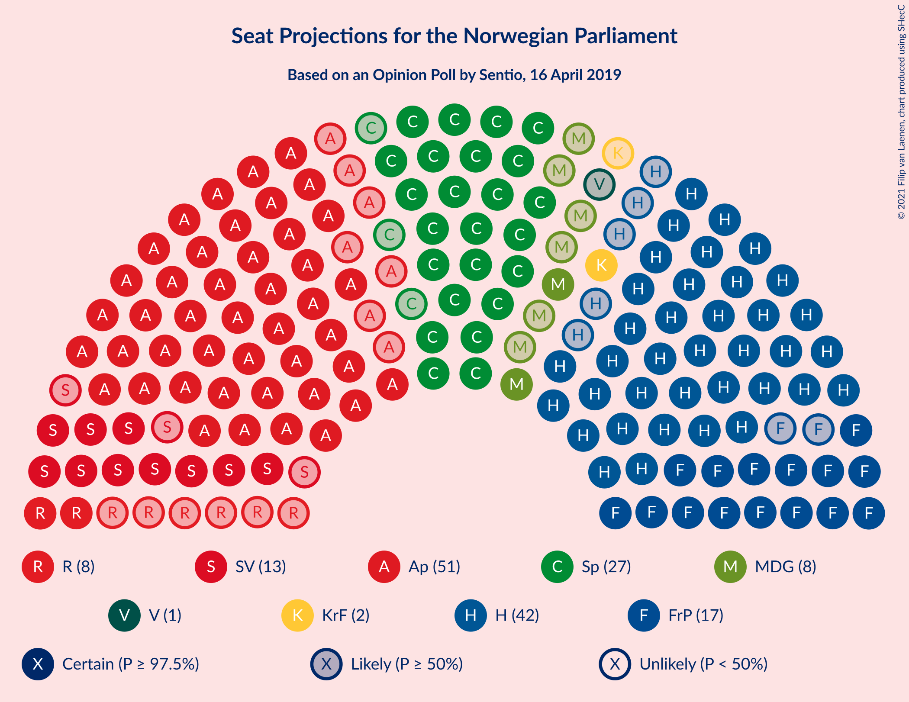

### Confidence Intervals

| Party | Last Result | Median | 80% Confidence Interval | 90% Confidence Interval | 95% Confidence Interval | 99% Confidence Interval |
|:-----:|:-----------:|:------:|:-----------------------:|:-----------------------:|:-----------------------:|:-----------------------:|
| <a href="#arbeiderpartiet">Arbeiderpartiet</a> | 49 | 50 | 46–52 |45–54 |44–55 |42–57 |
| <a href="#høyre">Høyre</a> | 45 | 40 | 38–45 |38–46 |37–46 |35–48 |
| <a href="#senterpartiet">Senterpartiet</a> | 19 | 27 | 26–31 |24–33 |24–34 |23–35 |
| <a href="#fremskrittspartiet">Fremskrittspartiet</a> | 27 | 18 | 16–21 |16–21 |15–22 |14–24 |
| <a href="#sosialistisk-venstreparti">Sosialistisk Venstreparti</a> | 11 | 12 | 11–15 |10–15 |10–16 |9–17 |
| <a href="#rødt">Rødt</a> | 1 | 8 | 7–10 |2–10 |2–11 |2–12 |
| <a href="#miljøpartiet-de-grønne">Miljøpartiet De Grønne</a> | 1 | 7 | 2–8 |2–9 |2–9 |1–10 |
| <a href="#kristelig-folkeparti">Kristelig Folkeparti</a> | 8 | 7 | 1–7 |1–8 |1–8 |0–9 |
| <a href="#venstre">Venstre</a> | 8 | 1 | 1–2 |1–2 |0–2 |0–2 |

### Arbeiderpartiet

*For a full overview of the results for this party, see the [Arbeiderpartiet](party-arbeiderpartiet.html) page.*

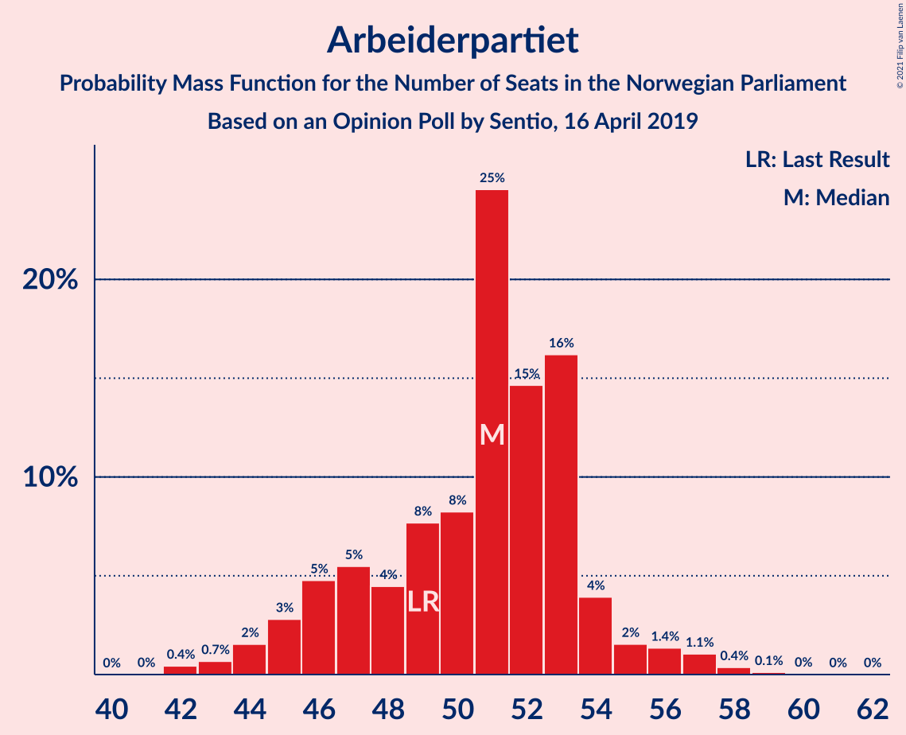

| Number of Seats | Probability | Accumulated | Special Marks |
|:---------------:|:-----------:|:-----------:|:-------------:|
| 42 | 0.6% | 100% |  |
| 43 | 0.2% | 99.4% |  |
| 44 | 2% | 99.1% |  |
| 45 | 3% | 97% |  |
| 46 | 6% | 94% |  |
| 47 | 9% | 88% |  |
| 48 | 2% | 80% |  |
| 49 | 16% | 78% | Last Result |
| 50 | 30% | 61% | Median |
| 51 | 13% | 31% |  |
| 52 | 10% | 18% |  |
| 53 | 3% | 9% |  |
| 54 | 2% | 6% |  |
| 55 | 1.4% | 4% |  |
| 56 | 0.7% | 2% |  |
| 57 | 1.0% | 1.5% |  |
| 58 | 0.2% | 0.4% |  |
| 59 | 0.2% | 0.2% |  |
| 60 | 0% | 0.1% |  |
| 61 | 0% | 0% |  |

### Høyre

*For a full overview of the results for this party, see the [Høyre](party-høyre.html) page.*

| Number of Seats | Probability | Accumulated | Special Marks |
|:---------------:|:-----------:|:-----------:|:-------------:|
| 34 | 0.1% | 100% |  |
| 35 | 0.7% | 99.9% |  |
| 36 | 0.6% | 99.2% |  |
| 37 | 2% | 98.6% |  |
| 38 | 19% | 97% |  |
| 39 | 5% | 78% |  |
| 40 | 34% | 73% | Median |
| 41 | 10% | 39% |  |
| 42 | 5% | 29% |  |
| 43 | 6% | 24% |  |
| 44 | 3% | 18% |  |
| 45 | 8% | 15% | Last Result |
| 46 | 5% | 7% |  |
| 47 | 0.8% | 2% |  |
| 48 | 0.9% | 1.2% |  |
| 49 | 0.1% | 0.3% |  |
| 50 | 0% | 0.2% |  |
| 51 | 0.1% | 0.1% |  |
| 52 | 0% | 0% |  |

### Senterpartiet

*For a full overview of the results for this party, see the [Senterpartiet](party-senterpartiet.html) page.*

| Number of Seats | Probability | Accumulated | Special Marks |
|:---------------:|:-----------:|:-----------:|:-------------:|
| 19 | 0% | 100% | Last Result |
| 20 | 0% | 100% |  |
| 21 | 0.1% | 100% |  |
| 22 | 0.4% | 99.9% |  |
| 23 | 2% | 99.5% |  |
| 24 | 4% | 98% |  |
| 25 | 2% | 93% |  |
| 26 | 11% | 91% |  |
| 27 | 47% | 81% | Median |
| 28 | 12% | 34% |  |
| 29 | 4% | 21% |  |
| 30 | 4% | 17% |  |
| 31 | 5% | 13% |  |
| 32 | 2% | 8% |  |
| 33 | 2% | 6% |  |
| 34 | 2% | 4% |  |
| 35 | 2% | 2% |  |
| 36 | 0.1% | 0.1% |  |
| 37 | 0% | 0% |  |

### Fremskrittspartiet

*For a full overview of the results for this party, see the [Fremskrittspartiet](party-fremskrittspartiet.html) page.*

| Number of Seats | Probability | Accumulated | Special Marks |
|:---------------:|:-----------:|:-----------:|:-------------:|
| 13 | 0.3% | 100% |  |
| 14 | 2% | 99.6% |  |
| 15 | 0.9% | 98% |  |
| 16 | 7% | 97% |  |
| 17 | 28% | 89% |  |
| 18 | 35% | 61% | Median |
| 19 | 7% | 26% |  |
| 20 | 7% | 19% |  |
| 21 | 7% | 12% |  |
| 22 | 3% | 5% |  |
| 23 | 0.7% | 2% |  |
| 24 | 0.8% | 0.8% |  |
| 25 | 0% | 0% |  |
| 26 | 0% | 0% |  |
| 27 | 0% | 0% | Last Result |

### Sosialistisk Venstreparti

*For a full overview of the results for this party, see the [Sosialistisk Venstreparti](party-sosialistiskvenstreparti.html) page.*

| Number of Seats | Probability | Accumulated | Special Marks |
|:---------------:|:-----------:|:-----------:|:-------------:|
| 8 | 0.1% | 100% |  |
| 9 | 0.7% | 99.9% |  |
| 10 | 4% | 99.2% |  |
| 11 | 29% | 95% | Last Result |
| 12 | 16% | 66% | Median |
| 13 | 25% | 50% |  |
| 14 | 5% | 25% |  |
| 15 | 18% | 21% |  |
| 16 | 1.4% | 3% |  |
| 17 | 0.8% | 1.1% |  |
| 18 | 0.3% | 0.3% |  |
| 19 | 0% | 0% |  |

### Rødt

*For a full overview of the results for this party, see the [Rødt](party-rødt.html) page.*

| Number of Seats | Probability | Accumulated | Special Marks |
|:---------------:|:-----------:|:-----------:|:-------------:|
| 1 | 0.1% | 100% | Last Result |
| 2 | 8% | 99.9% |  |
| 3 | 0% | 92% |  |
| 4 | 0% | 92% |  |
| 5 | 0% | 92% |  |
| 6 | 0.1% | 92% |  |
| 7 | 28% | 92% |  |
| 8 | 18% | 64% | Median |
| 9 | 33% | 46% |  |
| 10 | 11% | 14% |  |
| 11 | 2% | 3% |  |
| 12 | 0.7% | 0.8% |  |
| 13 | 0.1% | 0.1% |  |
| 14 | 0% | 0% |  |

### Miljøpartiet De Grønne

*For a full overview of the results for this party, see the [Miljøpartiet De Grønne](party-miljøpartietdegrønne.html) page.*

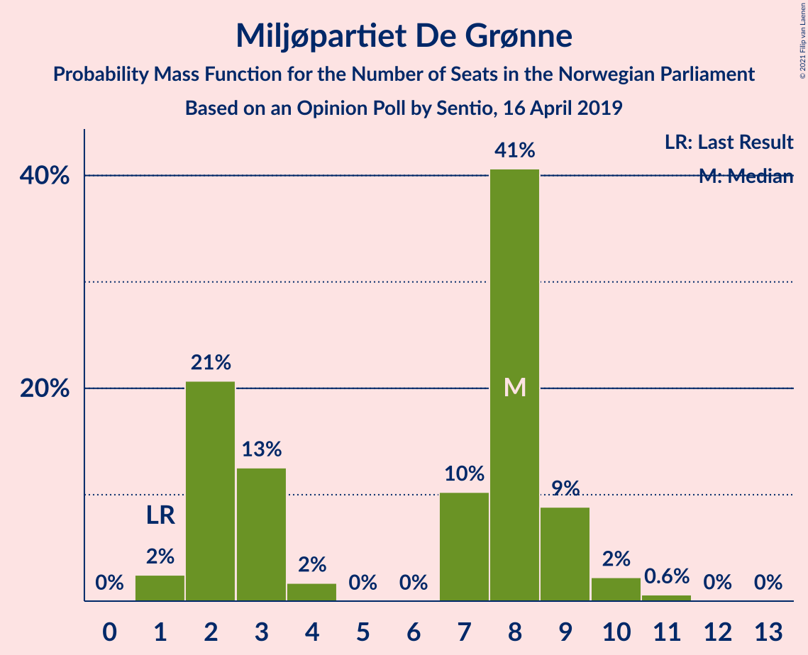

| Number of Seats | Probability | Accumulated | Special Marks |
|:---------------:|:-----------:|:-----------:|:-------------:|
| 1 | 2% | 100% | Last Result |
| 2 | 24% | 98% |  |
| 3 | 2% | 74% |  |
| 4 | 0.1% | 72% |  |
| 5 | 0% | 72% |  |
| 6 | 0% | 72% |  |
| 7 | 30% | 72% | Median |
| 8 | 34% | 41% |  |
| 9 | 5% | 7% |  |
| 10 | 2% | 2% |  |
| 11 | 0.4% | 0.5% |  |
| 12 | 0% | 0% |  |

### Kristelig Folkeparti

*For a full overview of the results for this party, see the [Kristelig Folkeparti](party-kristeligfolkeparti.html) page.*

| Number of Seats | Probability | Accumulated | Special Marks |
|:---------------:|:-----------:|:-----------:|:-------------:|
| 0 | 0.7% | 100% |  |
| 1 | 25% | 99.3% |  |
| 2 | 3% | 74% |  |
| 3 | 17% | 71% |  |
| 4 | 0% | 54% |  |
| 5 | 0% | 54% |  |
| 6 | 0% | 54% |  |
| 7 | 48% | 54% | Median |
| 8 | 6% | 7% | Last Result |
| 9 | 0.5% | 0.8% |  |
| 10 | 0.3% | 0.3% |  |
| 11 | 0% | 0% |  |

### Venstre

*For a full overview of the results for this party, see the [Venstre](party-venstre.html) page.*

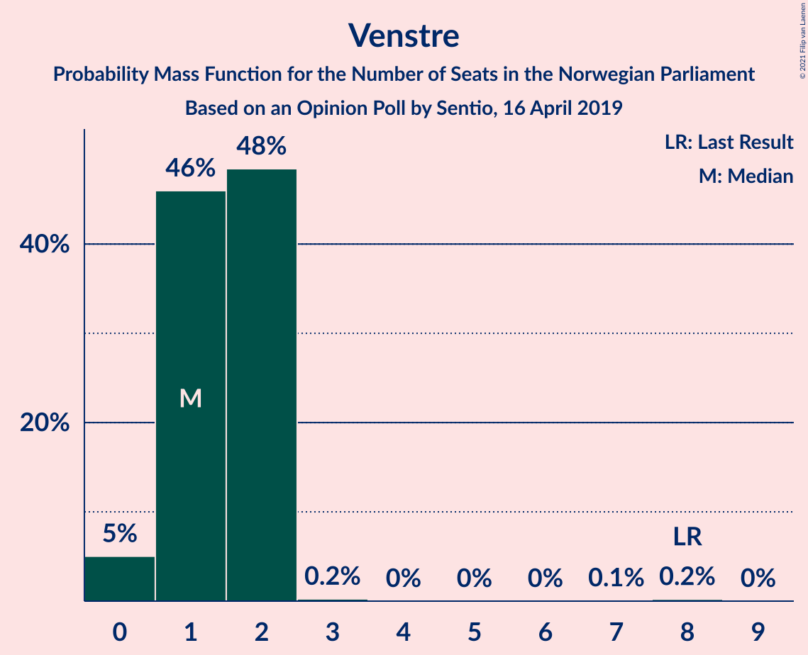

| Number of Seats | Probability | Accumulated | Special Marks |
|:---------------:|:-----------:|:-----------:|:-------------:|
| 0 | 3% | 100% |  |
| 1 | 52% | 97% | Median |
| 2 | 44% | 45% |  |
| 3 | 0.1% | 0.4% |  |
| 4 | 0% | 0.3% |  |
| 5 | 0% | 0.3% |  |
| 6 | 0% | 0.3% |  |
| 7 | 0.1% | 0.3% |  |
| 8 | 0.2% | 0.2% | Last Result |
| 9 | 0% | 0% |  |

## Coalitions

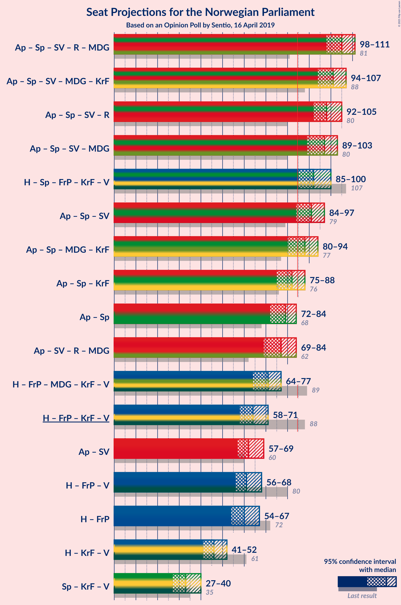

### Confidence Intervals

| Coalition | Last Result | Median | Majority? | 80% Confidence Interval | 90% Confidence Interval | 95% Confidence Interval | 99% Confidence Interval |
|:---------:|:-----------:|:------:|:---------:|:-----------------------:|:-----------------------:|:-----------------------:|:-----------------------:|
| Arbeiderpartiet – Senterpartiet – Sosialistisk Venstreparti – Rødt – Miljøpartiet De Grønne | 81 | 104 | 100% | 100–109 | 100–109 | 98–111 | 96–112 |
| Arbeiderpartiet – Senterpartiet – Sosialistisk Venstreparti – Miljøpartiet De Grønne – Kristelig Folkeparti | 88 | 102 | 100% | 95–104 | 94–105 | 93–110 | 91–110 |
| Arbeiderpartiet – Senterpartiet – Sosialistisk Venstreparti – Rødt | 80 | 98 | 100% | 95–103 | 93–105 | 92–105 | 89–107 |
| Arbeiderpartiet – Senterpartiet – Sosialistisk Venstreparti – Miljøpartiet De Grønne | 80 | 96 | 100% | 92–100 | 91–102 | 90–102 | 88–104 |
| Høyre – Senterpartiet – Fremskrittspartiet – Kristelig Folkeparti – Venstre | 107 | 94 | 99.6% | 88–95 | 86–98 | 86–100 | 85–104 |
| Arbeiderpartiet – Senterpartiet – Sosialistisk Venstreparti | 79 | 89 | 96% | 88–95 | 86–96 | 83–97 | 82–99 |
| Arbeiderpartiet – Senterpartiet – Miljøpartiet De Grønne – Kristelig Folkeparti | 77 | 91 | 79% | 82–91 | 80–93 | 80–96 | 77–97 |
| Arbeiderpartiet – Senterpartiet – Kristelig Folkeparti | 76 | 83 | 11% | 78–85 | 76–87 | 75–88 | 71–91 |
| Arbeiderpartiet – Senterpartiet | 68 | 77 | 1.1% | 73–82 | 72–83 | 71–83 | 70–86 |
| Høyre – Fremskrittspartiet – Miljøpartiet De Grønne – Kristelig Folkeparti – Venstre | 89 | 71 | 0% | 66–74 | 64–76 | 64–77 | 62–80 |
| Høyre – Fremskrittspartiet – Kristelig Folkeparti – Venstre | 88 | 65 | 0% | 60–69 | 60–69 | 58–71 | 57–73 |
| Arbeiderpartiet – Sosialistisk Venstreparti | 60 | 62 | 0% | 59–66 | 58–67 | 57–68 | 54–70 |
| Høyre – Fremskrittspartiet – Venstre | 80 | 60 | 0% | 56–65 | 56–66 | 56–68 | 51–69 |
| Høyre – Fremskrittspartiet | 72 | 58 | 0% | 55–64 | 55–65 | 55–67 | 49–68 |
| Høyre – Kristelig Folkeparti – Venstre | 61 | 47 | 0% | 43–50 | 42–52 | 40–52 | 39–54 |
| Senterpartiet – Kristelig Folkeparti – Venstre | 35 | 35 | 0% | 29–37 | 28–38 | 28–40 | 25–43 |

### Arbeiderpartiet – Senterpartiet – Sosialistisk Venstreparti – Rødt – Miljøpartiet De Grønne

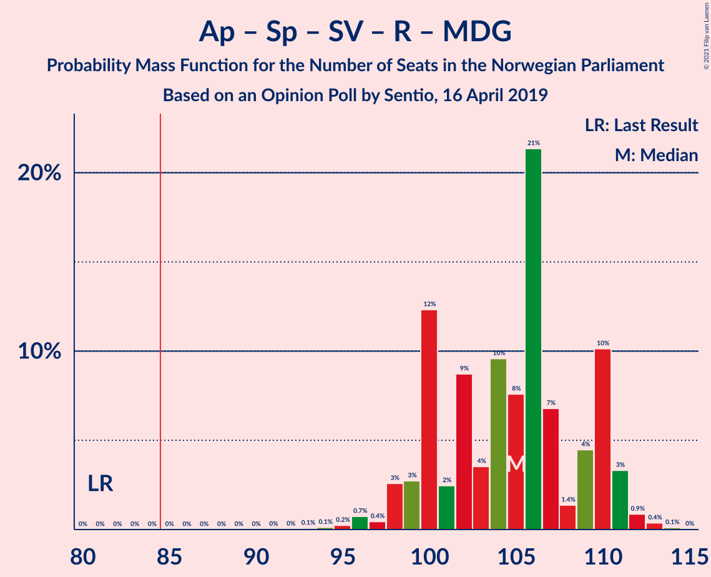

| Number of Seats | Probability | Accumulated | Special Marks |
|:---------------:|:-----------:|:-----------:|:-------------:|
| 81 | 0% | 100% | Last Result |
| 82 | 0% | 100% |  |
| 83 | 0% | 100% |  |
| 84 | 0% | 100% |  |
| 85 | 0% | 100% | Majority |
| 86 | 0% | 100% |  |
| 87 | 0% | 100% |  |
| 88 | 0% | 100% |  |
| 89 | 0% | 100% |  |
| 90 | 0% | 100% |  |
| 91 | 0.1% | 100% |  |
| 92 | 0% | 99.9% |  |
| 93 | 0.1% | 99.9% |  |
| 94 | 0.1% | 99.9% |  |
| 95 | 0.1% | 99.8% |  |
| 96 | 0.6% | 99.6% |  |
| 97 | 0.6% | 99.0% |  |
| 98 | 3% | 98% |  |
| 99 | 0.5% | 96% |  |
| 100 | 6% | 95% |  |
| 101 | 3% | 89% |  |
| 102 | 32% | 86% |  |
| 103 | 2% | 54% |  |
| 104 | 13% | 52% | Median |
| 105 | 5% | 40% |  |
| 106 | 17% | 35% |  |
| 107 | 6% | 18% |  |
| 108 | 2% | 12% |  |
| 109 | 6% | 11% |  |
| 110 | 1.5% | 5% |  |
| 111 | 1.4% | 3% |  |
| 112 | 1.5% | 2% |  |
| 113 | 0.1% | 0.2% |  |
| 114 | 0.1% | 0.2% |  |
| 115 | 0% | 0.1% |  |
| 116 | 0% | 0% |  |

### Arbeiderpartiet – Senterpartiet – Sosialistisk Venstreparti – Miljøpartiet De Grønne – Kristelig Folkeparti

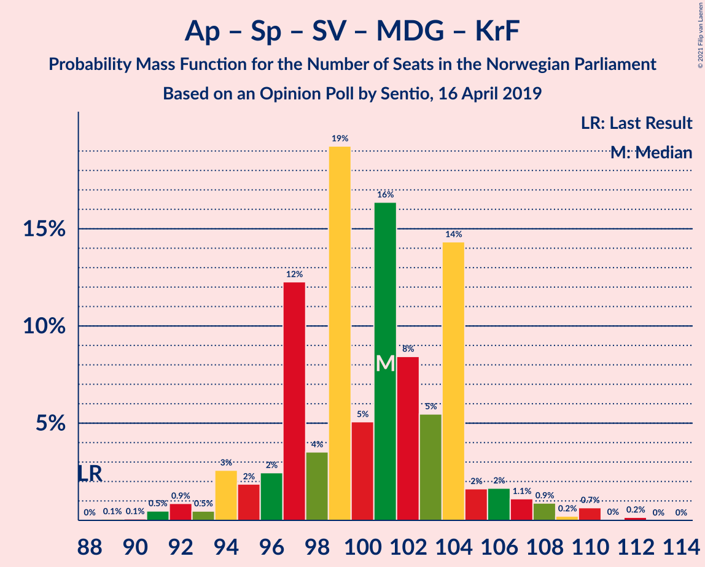

| Number of Seats | Probability | Accumulated | Special Marks |
|:---------------:|:-----------:|:-----------:|:-------------:|
| 88 | 0% | 100% | Last Result |
| 89 | 0.1% | 99.9% |  |
| 90 | 0.1% | 99.8% |  |
| 91 | 0.7% | 99.8% |  |
| 92 | 1.4% | 99.1% |  |
| 93 | 0.3% | 98% |  |
| 94 | 5% | 97% |  |
| 95 | 4% | 93% |  |
| 96 | 2% | 89% |  |
| 97 | 3% | 87% |  |
| 98 | 7% | 84% |  |
| 99 | 10% | 77% |  |
| 100 | 4% | 67% |  |
| 101 | 9% | 63% |  |
| 102 | 28% | 54% |  |
| 103 | 5% | 26% | Median |
| 104 | 15% | 21% |  |
| 105 | 0.8% | 6% |  |
| 106 | 1.0% | 5% |  |
| 107 | 0.2% | 4% |  |
| 108 | 0.5% | 4% |  |
| 109 | 0.2% | 3% |  |
| 110 | 3% | 3% |  |
| 111 | 0% | 0.1% |  |
| 112 | 0% | 0% |  |

### Arbeiderpartiet – Senterpartiet – Sosialistisk Venstreparti – Rødt

| Number of Seats | Probability | Accumulated | Special Marks |
|:---------------:|:-----------:|:-----------:|:-------------:|
| 80 | 0% | 100% | Last Result |
| 81 | 0% | 100% |  |
| 82 | 0% | 100% |  |
| 83 | 0% | 100% |  |
| 84 | 0% | 100% |  |
| 85 | 0% | 100% | Majority |
| 86 | 0% | 100% |  |
| 87 | 0.1% | 99.9% |  |
| 88 | 0% | 99.9% |  |
| 89 | 0.4% | 99.8% |  |
| 90 | 1.3% | 99.4% |  |
| 91 | 0.5% | 98% |  |
| 92 | 2% | 98% |  |
| 93 | 2% | 95% |  |
| 94 | 1.4% | 94% |  |
| 95 | 26% | 92% |  |
| 96 | 11% | 67% |  |
| 97 | 4% | 56% | Median |
| 98 | 18% | 52% |  |
| 99 | 3% | 34% |  |
| 100 | 8% | 31% |  |
| 101 | 7% | 23% |  |
| 102 | 3% | 16% |  |
| 103 | 5% | 13% |  |
| 104 | 2% | 8% |  |
| 105 | 5% | 6% |  |
| 106 | 0.7% | 1.2% |  |
| 107 | 0.3% | 0.5% |  |
| 108 | 0.2% | 0.2% |  |
| 109 | 0% | 0% |  |

### Arbeiderpartiet – Senterpartiet – Sosialistisk Venstreparti – Miljøpartiet De Grønne

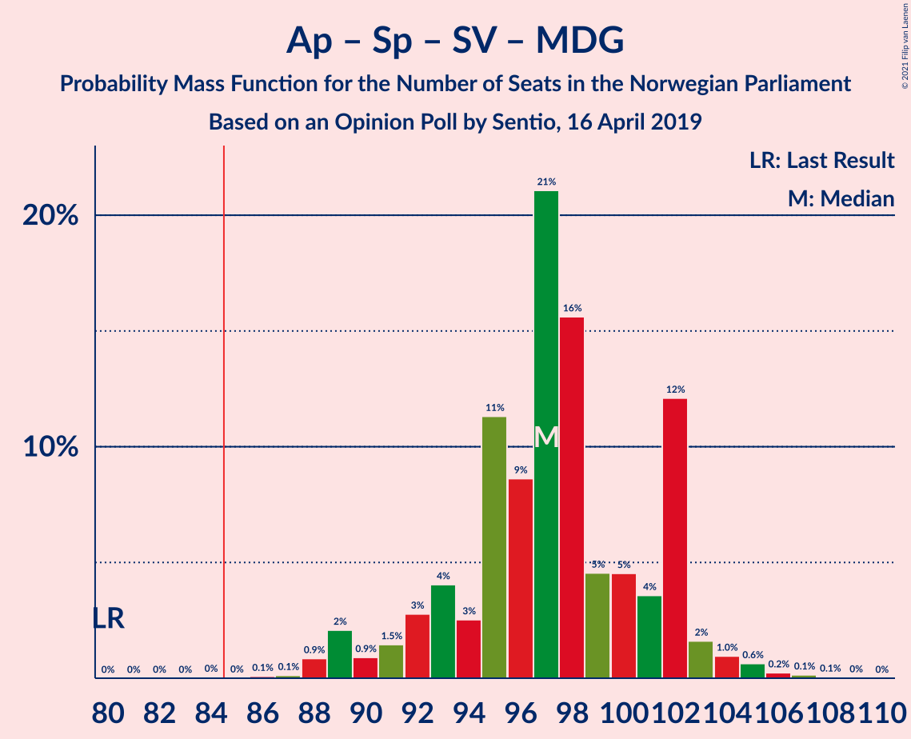

| Number of Seats | Probability | Accumulated | Special Marks |
|:---------------:|:-----------:|:-----------:|:-------------:|
| 80 | 0% | 100% | Last Result |
| 81 | 0% | 100% |  |
| 82 | 0% | 100% |  |
| 83 | 0% | 100% |  |
| 84 | 0% | 100% |  |
| 85 | 0.1% | 100% | Majority |
| 86 | 0.1% | 99.9% |  |
| 87 | 0.3% | 99.8% |  |
| 88 | 0.2% | 99.5% |  |
| 89 | 2% | 99.3% |  |
| 90 | 1.4% | 98% |  |
| 91 | 2% | 96% |  |
| 92 | 6% | 94% |  |
| 93 | 6% | 88% |  |
| 94 | 2% | 82% |  |
| 95 | 29% | 80% |  |
| 96 | 11% | 52% | Median |
| 97 | 20% | 41% |  |
| 98 | 2% | 21% |  |
| 99 | 4% | 19% |  |
| 100 | 7% | 15% |  |
| 101 | 1.2% | 9% |  |
| 102 | 5% | 7% |  |
| 103 | 1.2% | 2% |  |
| 104 | 0.7% | 1.2% |  |
| 105 | 0.1% | 0.5% |  |
| 106 | 0.1% | 0.4% |  |
| 107 | 0.3% | 0.3% |  |
| 108 | 0% | 0% |  |

### Høyre – Senterpartiet – Fremskrittspartiet – Kristelig Folkeparti – Venstre

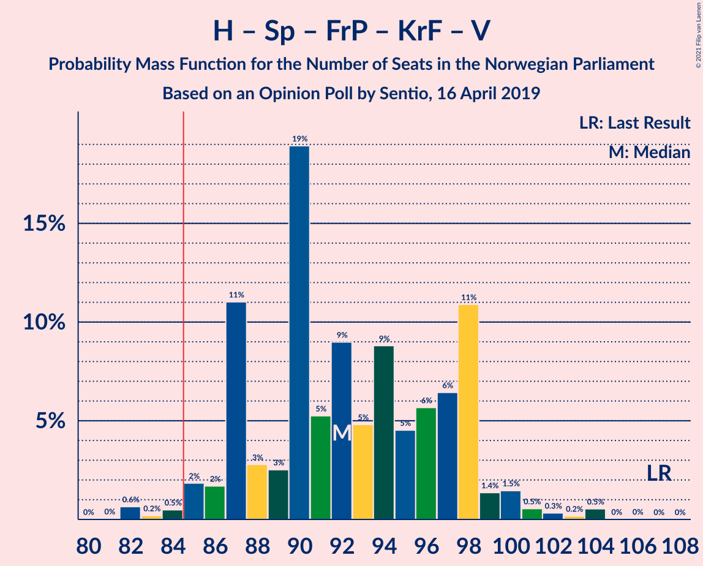

| Number of Seats | Probability | Accumulated | Special Marks |
|:---------------:|:-----------:|:-----------:|:-------------:|
| 81 | 0.1% | 100% |  |
| 82 | 0.1% | 99.9% |  |
| 83 | 0.1% | 99.9% |  |
| 84 | 0.2% | 99.8% |  |
| 85 | 1.3% | 99.6% | Majority |
| 86 | 6% | 98% |  |
| 87 | 0.7% | 93% |  |
| 88 | 2% | 92% |  |
| 89 | 2% | 90% |  |
| 90 | 18% | 87% |  |
| 91 | 2% | 70% |  |
| 92 | 10% | 68% |  |
| 93 | 5% | 58% | Median |
| 94 | 30% | 54% |  |
| 95 | 14% | 24% |  |
| 96 | 2% | 10% |  |
| 97 | 2% | 8% |  |
| 98 | 2% | 6% |  |
| 99 | 0.8% | 4% |  |
| 100 | 1.4% | 3% |  |
| 101 | 0.5% | 2% |  |
| 102 | 0.8% | 1.4% |  |
| 103 | 0.1% | 0.6% |  |
| 104 | 0.5% | 0.6% |  |
| 105 | 0% | 0.1% |  |
| 106 | 0% | 0.1% |  |
| 107 | 0% | 0% | Last Result |

### Arbeiderpartiet – Senterpartiet – Sosialistisk Venstreparti

| Number of Seats | Probability | Accumulated | Special Marks |
|:---------------:|:-----------:|:-----------:|:-------------:|
| 79 | 0% | 100% | Last Result |
| 80 | 0% | 100% |  |
| 81 | 0.3% | 99.9% |  |
| 82 | 0.6% | 99.6% |  |
| 83 | 2% | 99.0% |  |
| 84 | 2% | 97% |  |
| 85 | 0.6% | 96% | Majority |
| 86 | 0.8% | 95% |  |
| 87 | 3% | 94% |  |
| 88 | 35% | 91% |  |
| 89 | 16% | 56% | Median |
| 90 | 5% | 40% |  |
| 91 | 6% | 35% |  |
| 92 | 6% | 28% |  |
| 93 | 4% | 22% |  |
| 94 | 7% | 18% |  |
| 95 | 5% | 11% |  |
| 96 | 2% | 6% |  |
| 97 | 3% | 4% |  |
| 98 | 0.4% | 1.2% |  |
| 99 | 0.5% | 0.9% |  |
| 100 | 0.2% | 0.3% |  |
| 101 | 0.1% | 0.1% |  |
| 102 | 0% | 0.1% |  |
| 103 | 0% | 0% |  |

### Arbeiderpartiet – Senterpartiet – Miljøpartiet De Grønne – Kristelig Folkeparti

| Number of Seats | Probability | Accumulated | Special Marks |
|:---------------:|:-----------:|:-----------:|:-------------:|
| 75 | 0.1% | 100% |  |
| 76 | 0.1% | 99.9% |  |
| 77 | 0.9% | 99.8% | Last Result |
| 78 | 0.2% | 98.9% |  |
| 79 | 0.9% | 98.7% |  |
| 80 | 4% | 98% |  |
| 81 | 1.3% | 94% |  |
| 82 | 4% | 93% |  |
| 83 | 3% | 88% |  |
| 84 | 6% | 86% |  |
| 85 | 5% | 79% | Majority |
| 86 | 12% | 74% |  |
| 87 | 3% | 62% |  |
| 88 | 4% | 59% |  |
| 89 | 2% | 56% |  |
| 90 | 4% | 54% |  |
| 91 | 42% | 50% | Median |
| 92 | 3% | 9% |  |
| 93 | 2% | 6% |  |
| 94 | 0.8% | 4% |  |
| 95 | 0.2% | 3% |  |
| 96 | 2% | 3% |  |
| 97 | 0.6% | 0.7% |  |
| 98 | 0.1% | 0.1% |  |
| 99 | 0% | 0.1% |  |
| 100 | 0% | 0% |  |

### Arbeiderpartiet – Senterpartiet – Kristelig Folkeparti

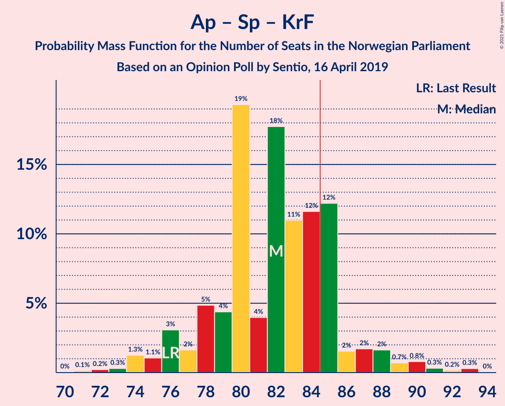

| Number of Seats | Probability | Accumulated | Special Marks |
|:---------------:|:-----------:|:-----------:|:-------------:|
| 71 | 0.5% | 100% |  |
| 72 | 0.8% | 99.4% |  |
| 73 | 0.6% | 98.6% |  |
| 74 | 0.3% | 98% |  |
| 75 | 1.4% | 98% |  |
| 76 | 4% | 96% | Last Result |
| 77 | 0.8% | 92% |  |
| 78 | 11% | 91% |  |
| 79 | 2% | 80% |  |
| 80 | 7% | 77% |  |
| 81 | 4% | 70% |  |
| 82 | 3% | 67% |  |
| 83 | 21% | 63% |  |
| 84 | 31% | 42% | Median |
| 85 | 4% | 11% | Majority |
| 86 | 1.4% | 7% |  |
| 87 | 0.8% | 6% |  |
| 88 | 3% | 5% |  |
| 89 | 0.9% | 2% |  |
| 90 | 0.6% | 1.3% |  |
| 91 | 0.5% | 0.7% |  |
| 92 | 0.2% | 0.3% |  |
| 93 | 0% | 0.1% |  |
| 94 | 0% | 0% |  |

### Arbeiderpartiet – Senterpartiet

| Number of Seats | Probability | Accumulated | Special Marks |
|:---------------:|:-----------:|:-----------:|:-------------:|
| 68 | 0% | 100% | Last Result |
| 69 | 0.4% | 99.9% |  |
| 70 | 1.1% | 99.5% |  |
| 71 | 2% | 98% |  |
| 72 | 2% | 97% |  |
| 73 | 6% | 95% |  |
| 74 | 2% | 89% |  |
| 75 | 5% | 87% |  |
| 76 | 18% | 82% |  |
| 77 | 32% | 65% | Median |
| 78 | 4% | 32% |  |
| 79 | 7% | 28% |  |
| 80 | 5% | 21% |  |
| 81 | 2% | 15% |  |
| 82 | 6% | 13% |  |
| 83 | 6% | 8% |  |
| 84 | 0.9% | 2% |  |
| 85 | 0.3% | 1.1% | Majority |
| 86 | 0.4% | 0.8% |  |
| 87 | 0.3% | 0.5% |  |
| 88 | 0.1% | 0.1% |  |
| 89 | 0% | 0.1% |  |
| 90 | 0% | 0.1% |  |
| 91 | 0% | 0% |  |

### Høyre – Fremskrittspartiet – Miljøpartiet De Grønne – Kristelig Folkeparti – Venstre

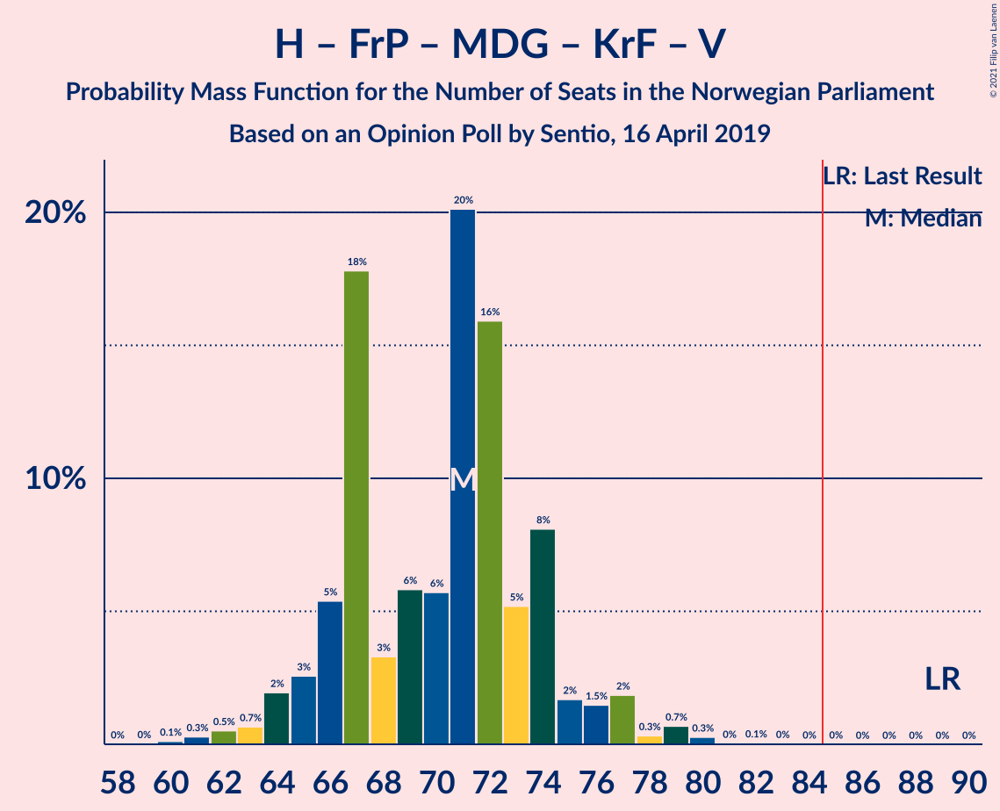

| Number of Seats | Probability | Accumulated | Special Marks |
|:---------------:|:-----------:|:-----------:|:-------------:|
| 60 | 0% | 100% |  |
| 61 | 0.2% | 99.9% |  |
| 62 | 0.3% | 99.7% |  |
| 63 | 0.7% | 99.4% |  |
| 64 | 5% | 98.7% |  |
| 65 | 2% | 94% |  |
| 66 | 5% | 92% |  |
| 67 | 3% | 87% |  |
| 68 | 8% | 84% |  |
| 69 | 8% | 76% |  |
| 70 | 3% | 69% |  |
| 71 | 18% | 66% |  |
| 72 | 4% | 48% |  |
| 73 | 10% | 44% | Median |
| 74 | 26% | 33% |  |
| 75 | 1.3% | 7% |  |
| 76 | 2% | 6% |  |
| 77 | 2% | 5% |  |
| 78 | 0.5% | 2% |  |
| 79 | 1.3% | 2% |  |
| 80 | 0.4% | 0.6% |  |
| 81 | 0% | 0.1% |  |
| 82 | 0.1% | 0.1% |  |
| 83 | 0% | 0.1% |  |
| 84 | 0% | 0% |  |
| 85 | 0% | 0% | Majority |
| 86 | 0% | 0% |  |
| 87 | 0% | 0% |  |
| 88 | 0% | 0% |  |
| 89 | 0% | 0% | Last Result |

### Høyre – Fremskrittspartiet – Kristelig Folkeparti – Venstre

| Number of Seats | Probability | Accumulated | Special Marks |
|:---------------:|:-----------:|:-----------:|:-------------:|
| 54 | 0% | 100% |  |
| 55 | 0.1% | 99.9% |  |
| 56 | 0.1% | 99.8% |  |
| 57 | 2% | 99.7% |  |
| 58 | 1.4% | 98% |  |
| 59 | 2% | 97% |  |
| 60 | 6% | 95% |  |
| 61 | 2% | 89% |  |
| 62 | 6% | 87% |  |
| 63 | 17% | 82% |  |
| 64 | 5% | 65% |  |
| 65 | 13% | 60% |  |
| 66 | 2% | 48% | Median |
| 67 | 32% | 46% |  |
| 68 | 3% | 13% |  |
| 69 | 6% | 11% |  |
| 70 | 0.5% | 5% |  |
| 71 | 3% | 4% |  |
| 72 | 0.6% | 2% |  |
| 73 | 0.6% | 0.9% |  |
| 74 | 0.1% | 0.3% |  |
| 75 | 0.1% | 0.2% |  |
| 76 | 0.1% | 0.1% |  |
| 77 | 0% | 0.1% |  |
| 78 | 0.1% | 0.1% |  |
| 79 | 0% | 0% |  |
| 80 | 0% | 0% |  |
| 81 | 0% | 0% |  |
| 82 | 0% | 0% |  |
| 83 | 0% | 0% |  |
| 84 | 0% | 0% |  |
| 85 | 0% | 0% | Majority |
| 86 | 0% | 0% |  |
| 87 | 0% | 0% |  |
| 88 | 0% | 0% | Last Result |

### Arbeiderpartiet – Sosialistisk Venstreparti

| Number of Seats | Probability | Accumulated | Special Marks |
|:---------------:|:-----------:|:-----------:|:-------------:|
| 53 | 0% | 100% |  |
| 54 | 0.5% | 99.9% |  |
| 55 | 0.1% | 99.4% |  |
| 56 | 1.4% | 99.3% |  |
| 57 | 3% | 98% |  |
| 58 | 3% | 95% |  |
| 59 | 3% | 92% |  |
| 60 | 4% | 89% | Last Result |
| 61 | 31% | 86% |  |
| 62 | 20% | 54% | Median |
| 63 | 6% | 34% |  |
| 64 | 7% | 28% |  |
| 65 | 4% | 21% |  |
| 66 | 10% | 17% |  |
| 67 | 4% | 7% |  |
| 68 | 2% | 3% |  |
| 69 | 0.5% | 2% |  |
| 70 | 0.7% | 1.2% |  |
| 71 | 0.3% | 0.5% |  |
| 72 | 0.1% | 0.2% |  |
| 73 | 0.1% | 0.1% |  |
| 74 | 0.1% | 0.1% |  |
| 75 | 0% | 0% |  |

### Høyre – Fremskrittspartiet – Venstre

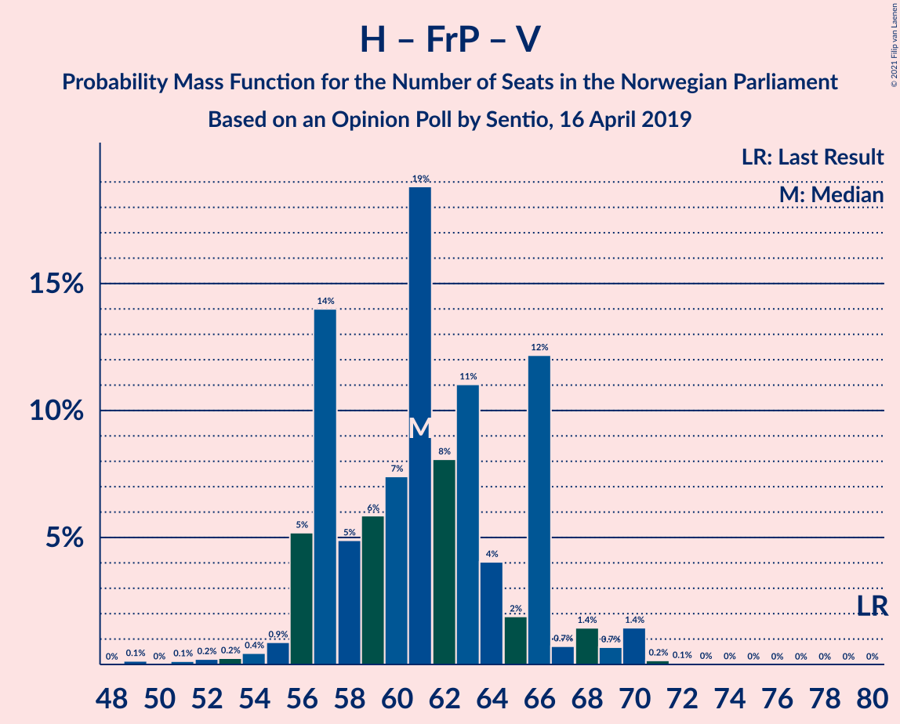

| Number of Seats | Probability | Accumulated | Special Marks |
|:---------------:|:-----------:|:-----------:|:-------------:|
| 51 | 0.5% | 100% |  |
| 52 | 0.1% | 99.5% |  |
| 53 | 0.1% | 99.3% |  |
| 54 | 0.3% | 99.2% |  |
| 55 | 0.4% | 98.9% |  |
| 56 | 17% | 98.6% |  |
| 57 | 4% | 81% |  |
| 58 | 5% | 78% |  |
| 59 | 7% | 73% | Median |
| 60 | 27% | 66% |  |
| 61 | 7% | 39% |  |
| 62 | 10% | 32% |  |
| 63 | 5% | 21% |  |
| 64 | 6% | 16% |  |
| 65 | 1.0% | 10% |  |
| 66 | 5% | 9% |  |
| 67 | 0.7% | 4% |  |
| 68 | 2% | 4% |  |
| 69 | 1.3% | 2% |  |
| 70 | 0.4% | 0.5% |  |
| 71 | 0% | 0.1% |  |
| 72 | 0% | 0.1% |  |
| 73 | 0% | 0% |  |
| 74 | 0% | 0% |  |
| 75 | 0% | 0% |  |
| 76 | 0% | 0% |  |
| 77 | 0% | 0% |  |
| 78 | 0% | 0% |  |
| 79 | 0% | 0% |  |
| 80 | 0% | 0% | Last Result |

### Høyre – Fremskrittspartiet

| Number of Seats | Probability | Accumulated | Special Marks |
|:---------------:|:-----------:|:-----------:|:-------------:|
| 49 | 0.5% | 100% |  |
| 50 | 0.1% | 99.5% |  |
| 51 | 0.2% | 99.4% |  |
| 52 | 0.2% | 99.2% |  |
| 53 | 0.3% | 99.1% |  |
| 54 | 0.9% | 98.8% |  |
| 55 | 18% | 98% |  |
| 56 | 6% | 80% |  |
| 57 | 2% | 74% |  |
| 58 | 32% | 73% | Median |
| 59 | 3% | 40% |  |
| 60 | 7% | 38% |  |
| 61 | 12% | 30% |  |
| 62 | 4% | 18% |  |
| 63 | 4% | 14% |  |
| 64 | 2% | 10% |  |
| 65 | 4% | 8% |  |
| 66 | 1.2% | 4% |  |
| 67 | 2% | 3% |  |
| 68 | 0.6% | 0.8% |  |
| 69 | 0.1% | 0.2% |  |
| 70 | 0% | 0.1% |  |
| 71 | 0% | 0% |  |
| 72 | 0% | 0% | Last Result |

### Høyre – Kristelig Folkeparti – Venstre

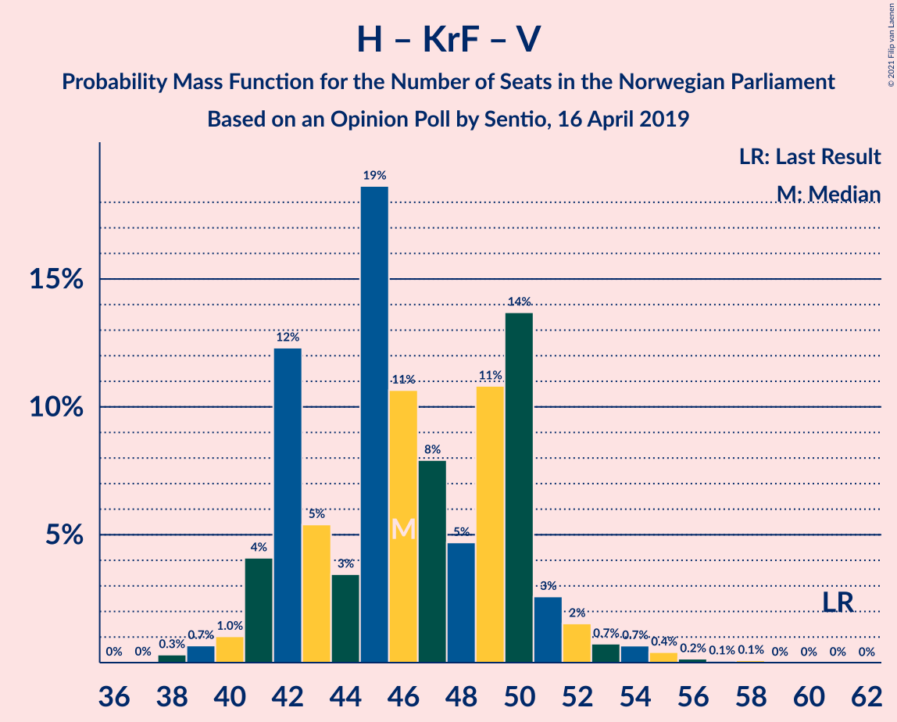

| Number of Seats | Probability | Accumulated | Special Marks |
|:---------------:|:-----------:|:-----------:|:-------------:|
| 37 | 0% | 100% |  |
| 38 | 0.1% | 99.9% |  |
| 39 | 2% | 99.8% |  |
| 40 | 1.0% | 98% |  |
| 41 | 2% | 97% |  |
| 42 | 1.1% | 96% |  |
| 43 | 11% | 94% |  |
| 44 | 6% | 83% |  |
| 45 | 3% | 77% |  |
| 46 | 19% | 75% |  |
| 47 | 9% | 56% |  |
| 48 | 5% | 46% | Median |
| 49 | 28% | 42% |  |
| 50 | 8% | 14% |  |
| 51 | 1.2% | 6% |  |
| 52 | 3% | 5% |  |
| 53 | 2% | 2% |  |
| 54 | 0.2% | 0.6% |  |
| 55 | 0.2% | 0.4% |  |
| 56 | 0.1% | 0.3% |  |
| 57 | 0.1% | 0.2% |  |
| 58 | 0% | 0.1% |  |
| 59 | 0% | 0.1% |  |
| 60 | 0% | 0% |  |
| 61 | 0% | 0% | Last Result |

### Senterpartiet – Kristelig Folkeparti – Venstre

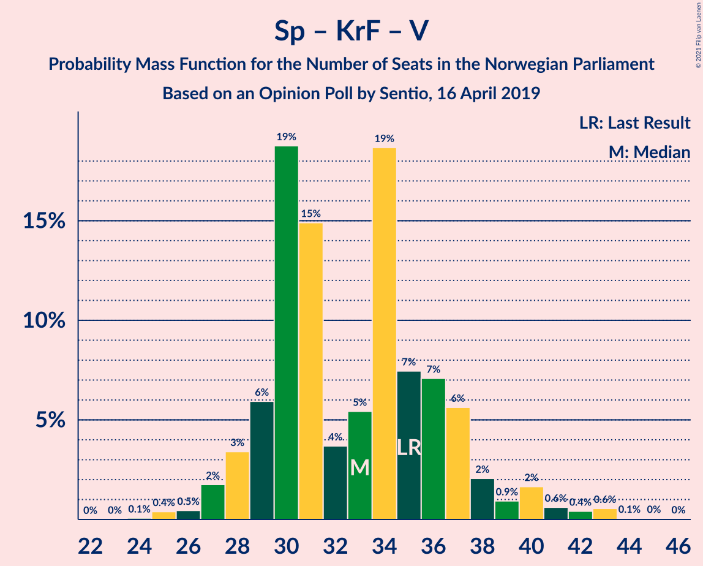

| Number of Seats | Probability | Accumulated | Special Marks |
|:---------------:|:-----------:|:-----------:|:-------------:|
| 24 | 0.1% | 100% |  |
| 25 | 0.6% | 99.9% |  |
| 26 | 0.8% | 99.3% |  |
| 27 | 0.5% | 98.5% |  |
| 28 | 8% | 98% |  |
| 29 | 2% | 90% |  |
| 30 | 8% | 88% |  |
| 31 | 6% | 81% |  |
| 32 | 8% | 75% |  |
| 33 | 5% | 67% |  |
| 34 | 7% | 62% |  |
| 35 | 17% | 55% | Last Result, Median |
| 36 | 27% | 39% |  |
| 37 | 4% | 11% |  |
| 38 | 3% | 7% |  |
| 39 | 0.7% | 4% |  |
| 40 | 2% | 3% |  |
| 41 | 0.4% | 2% |  |
| 42 | 0.6% | 1.1% |  |
| 43 | 0.4% | 0.5% |  |
| 44 | 0.1% | 0.2% |  |
| 45 | 0% | 0.1% |  |
| 46 | 0% | 0.1% |  |
| 47 | 0% | 0% |  |

## Technical Information

### Opinion Poll

+ **Polling firm:** Sentio
+ **Commissioner(s):** —
+ **Fieldwork period:** 16 April 2019

### Calculations

+ **Sample size:** 1000
+ **Simulations done:** 131,072
+ **Error estimate:** 2.18%

