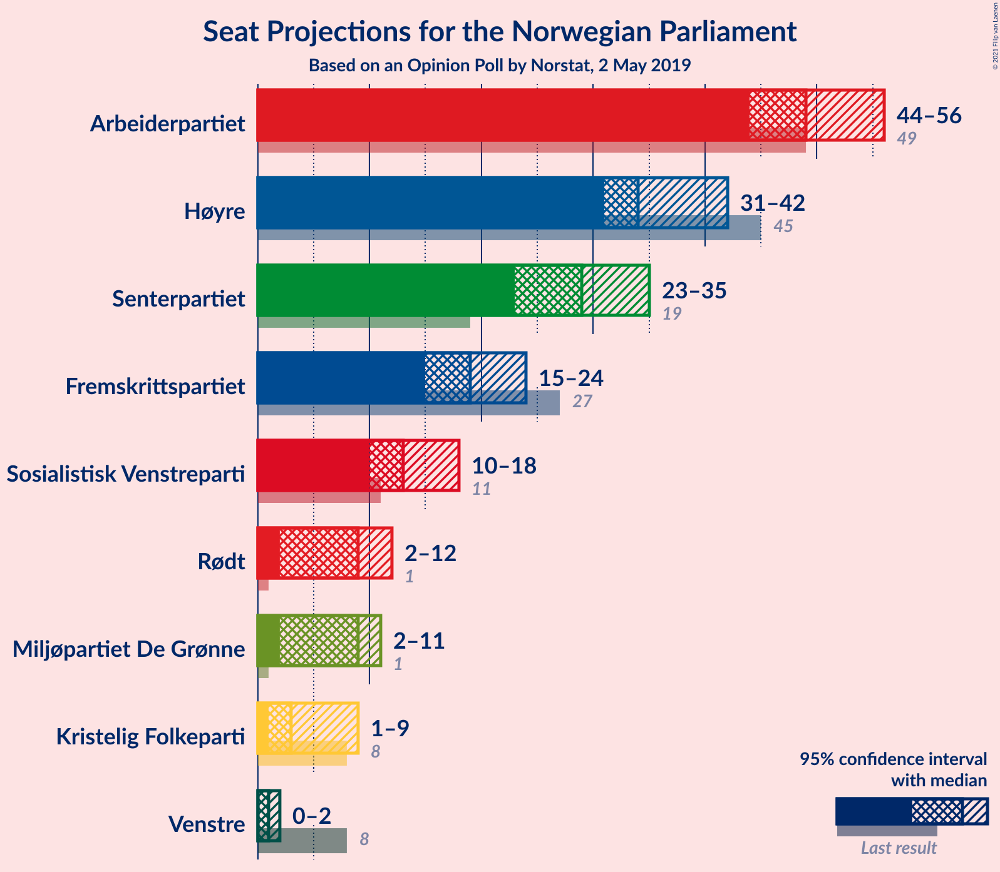
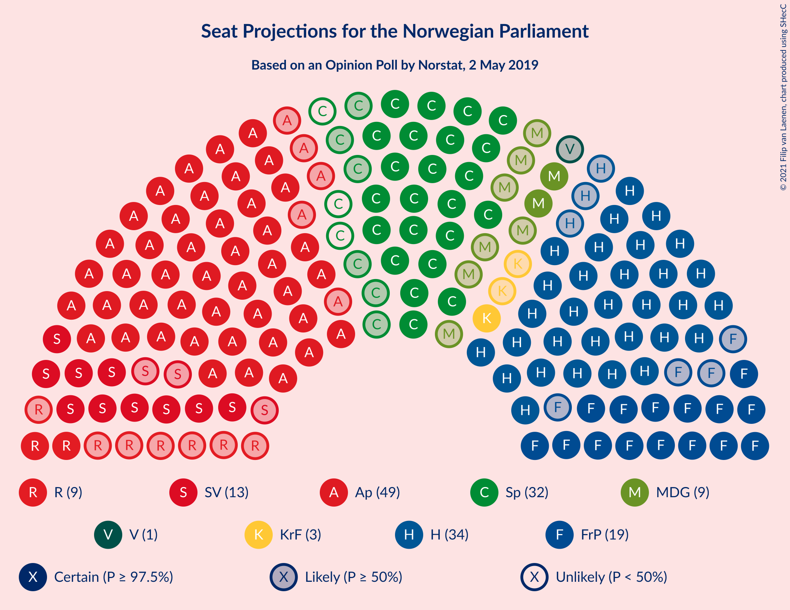
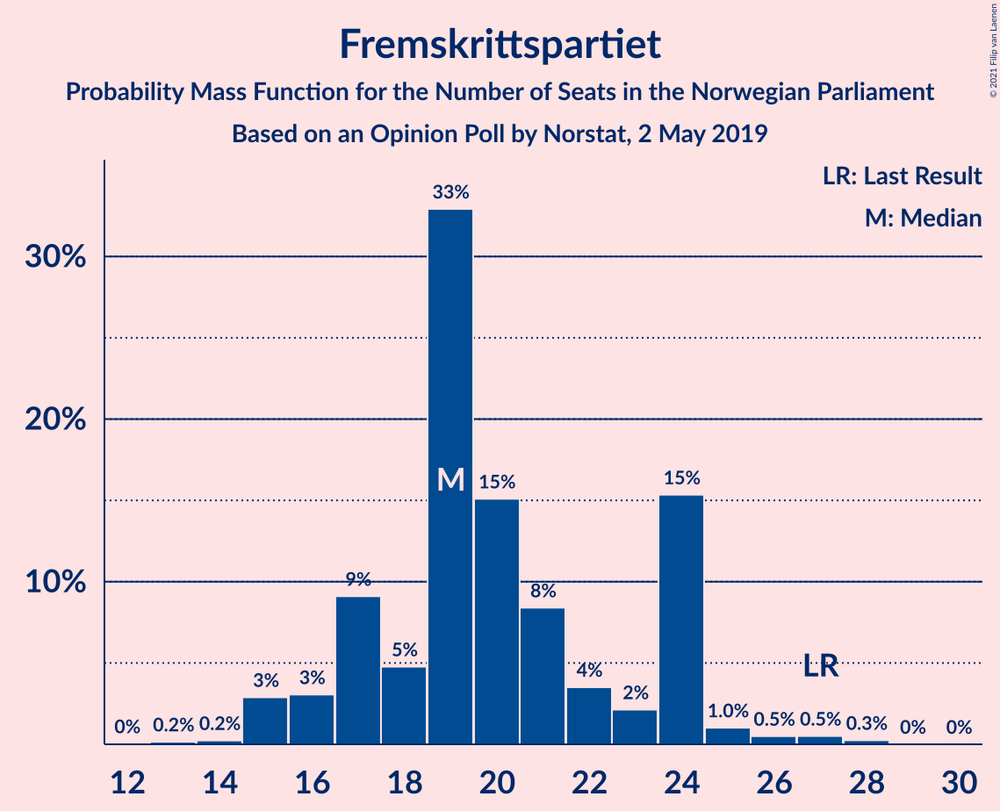
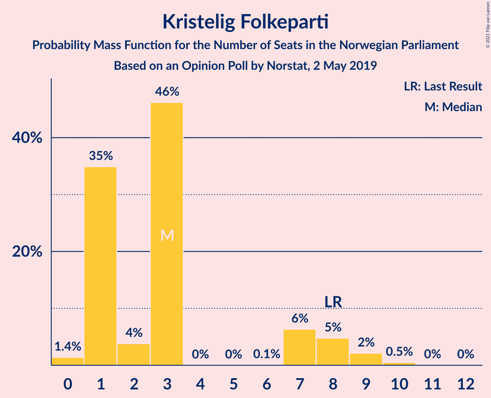
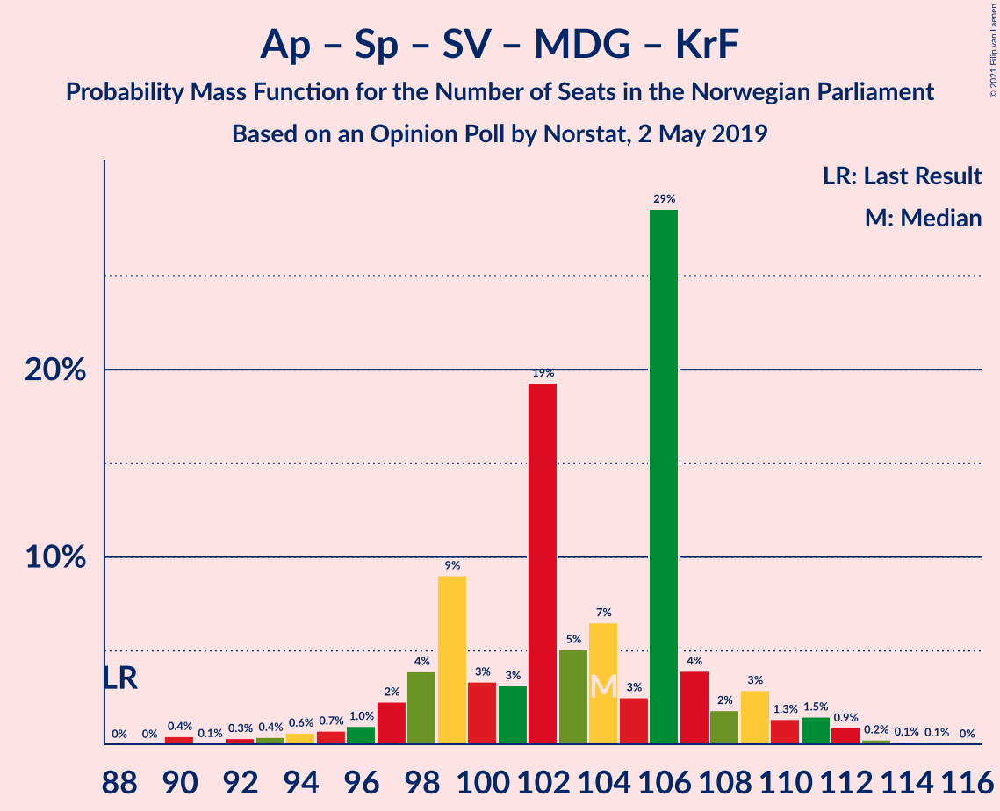
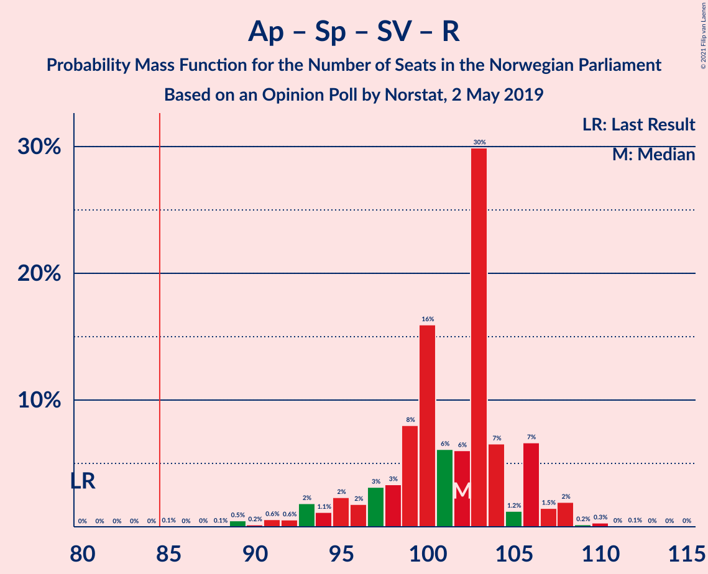
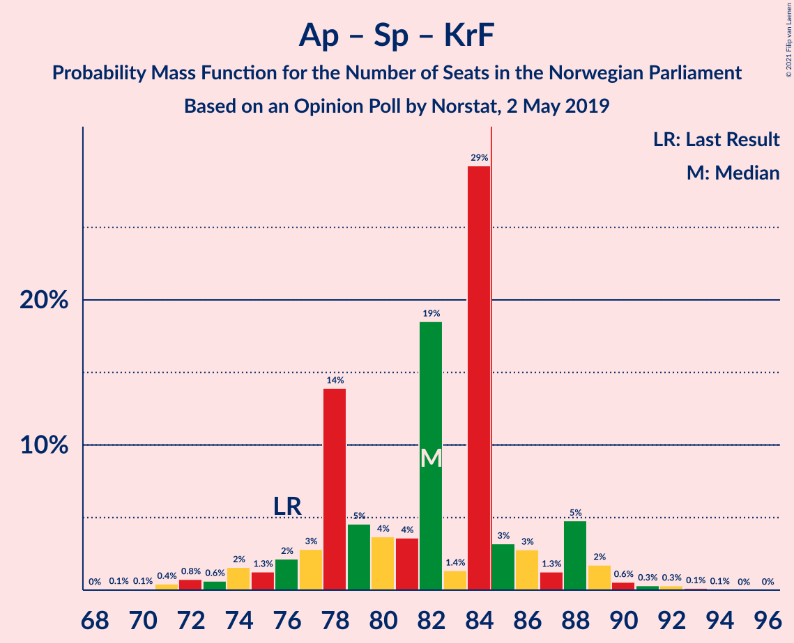

# Opinion Poll by Norstat, 2 May 2019

<a href="#voting-intentions">Voting Intentions</a> | <a href="#seats">Seats</a> | <a href="#coalitions">Coalitions</a> | <a href="#technical-information">Technical Information</a>

## Voting Intentions

### Confidence Intervals

| Party | Last Result | Poll Result | 80% Confidence Interval | 90% Confidence Interval | 95% Confidence Interval | 99% Confidence Interval |
|:-----:|:-----------:|:-----------:|:-----------------------:|:-----------------------:|:-----------------------:|:-----------------------:|
| Arbeiderpartiet | 27.4% | 27.5% | 25.3–29.9% |24.7–30.6% |24.2–31.2% |23.2–32.3% |
| Høyre | 25.0% | 20.4% | 18.4–22.6% |17.9–23.2% |17.4–23.7% |16.5–24.8% |
| Senterpartiet | 10.3% | 15.6% | 13.9–17.6% |13.4–18.2% |13.0–18.7% |12.2–19.6% |
| Fremskrittspartiet | 15.2% | 11.1% | 9.7–12.9% |9.3–13.4% |8.9–13.9% |8.3–14.7% |
| Sosialistisk Venstreparti | 6.0% | 7.5% | 6.3–9.0% |6.0–9.4% |5.7–9.8% |5.2–10.6% |
| Rødt | 2.4% | 5.1% | 4.1–6.4% |3.9–6.8% |3.6–7.1% |3.2–7.8% |
| Miljøpartiet De Grønne | 3.2% | 4.8% | 3.8–6.1% |3.6–6.4% |3.4–6.8% |3.0–7.4% |
| Kristelig Folkeparti | 4.2% | 3.3% | 2.6–4.5% |2.4–4.8% |2.2–5.1% |1.9–5.7% |
| Venstre | 4.4% | 2.2% | 1.6–3.2% |1.5–3.5% |1.3–3.7% |1.1–4.2% |

*Note:* The poll result column reflects the actual value used in the calculations. Published results may vary slightly, and in addition be rounded to fewer digits.

## Seats

### Confidence Intervals

| Party | Last Result | Median | 80% Confidence Interval | 90% Confidence Interval | 95% Confidence Interval | 99% Confidence Interval |
|:-----:|:-----------:|:------:|:-----------------------:|:-----------------------:|:-----------------------:|:-----------------------:|
| <a href="#arbeiderpartiet">Arbeiderpartiet</a> | 49 | 50 | 45–55 |44–55 |44–56 |42–58 |
| <a href="#høyre">Høyre</a> | 45 | 36 | 32–39 |31–41 |31–41 |29–43 |
| <a href="#senterpartiet">Senterpartiet</a> | 19 | 28 | 24–32 |23–34 |23–35 |21–36 |
| <a href="#fremskrittspartiet">Fremskrittspartiet</a> | 27 | 20 | 17–24 |16–24 |15–25 |15–28 |
| <a href="#sosialistisk-venstreparti">Sosialistisk Venstreparti</a> | 11 | 14 | 11–15 |10–16 |10–17 |9–19 |
| <a href="#rødt">Rødt</a> | 1 | 9 | 7–11 |7–11 |2–12 |2–13 |
| <a href="#miljøpartiet-de-grønne">Miljøpartiet De Grønne</a> | 1 | 9 | 2–10 |2–11 |2–12 |2–13 |
| <a href="#kristelig-folkeparti">Kristelig Folkeparti</a> | 8 | 1 | 1–7 |1–8 |1–8 |0–10 |
| <a href="#venstre">Venstre</a> | 8 | 1 | 0–2 |0–2 |0–2 |0–7 |

### Arbeiderpartiet

*For a full overview of the results for this party, see the [Arbeiderpartiet](party-arbeiderpartiet.html) page.*

| Number of Seats | Probability | Accumulated | Special Marks |
|:---------------:|:-----------:|:-----------:|:-------------:|
| 39 | 0% | 100% |  |
| 40 | 0.1% | 99.9% |  |
| 41 | 0.2% | 99.9% |  |
| 42 | 0.9% | 99.7% |  |
| 43 | 1.0% | 98.8% |  |
| 44 | 6% | 98% |  |
| 45 | 3% | 92% |  |
| 46 | 4% | 89% |  |
| 47 | 3% | 86% |  |
| 48 | 4% | 83% |  |
| 49 | 28% | 79% | Last Result |
| 50 | 6% | 51% | Median |
| 51 | 1.2% | 45% |  |
| 52 | 10% | 44% |  |
| 53 | 7% | 34% |  |
| 54 | 9% | 26% |  |
| 55 | 14% | 17% |  |
| 56 | 1.2% | 3% |  |
| 57 | 0.4% | 2% |  |
| 58 | 1.0% | 1.4% |  |
| 59 | 0.2% | 0.4% |  |
| 60 | 0.1% | 0.1% |  |
| 61 | 0% | 0% |  |

### Høyre

*For a full overview of the results for this party, see the [Høyre](party-høyre.html) page.*

| Number of Seats | Probability | Accumulated | Special Marks |
|:---------------:|:-----------:|:-----------:|:-------------:|
| 27 | 0.1% | 100% |  |
| 28 | 0.1% | 99.9% |  |
| 29 | 0.3% | 99.8% |  |
| 30 | 1.4% | 99.5% |  |
| 31 | 8% | 98% |  |
| 32 | 3% | 90% |  |
| 33 | 4% | 88% |  |
| 34 | 28% | 84% |  |
| 35 | 5% | 56% |  |
| 36 | 5% | 52% | Median |
| 37 | 6% | 47% |  |
| 38 | 17% | 41% |  |
| 39 | 17% | 25% |  |
| 40 | 2% | 8% |  |
| 41 | 4% | 6% |  |
| 42 | 1.1% | 2% |  |
| 43 | 0.4% | 0.8% |  |
| 44 | 0.1% | 0.4% |  |
| 45 | 0.1% | 0.3% | Last Result |
| 46 | 0.2% | 0.3% |  |
| 47 | 0% | 0.1% |  |
| 48 | 0% | 0% |  |

### Senterpartiet

*For a full overview of the results for this party, see the [Senterpartiet](party-senterpartiet.html) page.*

| Number of Seats | Probability | Accumulated | Special Marks |
|:---------------:|:-----------:|:-----------:|:-------------:|
| 19 | 0% | 100% | Last Result |
| 20 | 0.2% | 100% |  |
| 21 | 1.1% | 99.8% |  |
| 22 | 1.0% | 98.7% |  |
| 23 | 3% | 98% |  |
| 24 | 13% | 95% |  |
| 25 | 14% | 82% |  |
| 26 | 6% | 67% |  |
| 27 | 4% | 61% |  |
| 28 | 27% | 58% | Median |
| 29 | 16% | 31% |  |
| 30 | 3% | 15% |  |
| 31 | 1.5% | 12% |  |
| 32 | 1.5% | 11% |  |
| 33 | 2% | 9% |  |
| 34 | 2% | 7% |  |
| 35 | 3% | 5% |  |
| 36 | 0.9% | 1.2% |  |
| 37 | 0.3% | 0.3% |  |
| 38 | 0% | 0% |  |

### Fremskrittspartiet

*For a full overview of the results for this party, see the [Fremskrittspartiet](party-fremskrittspartiet.html) page.*

| Number of Seats | Probability | Accumulated | Special Marks |
|:---------------:|:-----------:|:-----------:|:-------------:|
| 13 | 0.1% | 100% |  |
| 14 | 0.3% | 99.9% |  |
| 15 | 4% | 99.6% |  |
| 16 | 2% | 96% |  |
| 17 | 7% | 93% |  |
| 18 | 6% | 87% |  |
| 19 | 5% | 81% |  |
| 20 | 29% | 76% | Median |
| 21 | 9% | 47% |  |
| 22 | 5% | 37% |  |
| 23 | 3% | 33% |  |
| 24 | 27% | 30% |  |
| 25 | 1.2% | 3% |  |
| 26 | 0.4% | 1.4% |  |
| 27 | 0.5% | 1.0% | Last Result |
| 28 | 0.5% | 0.5% |  |
| 29 | 0% | 0% |  |

### Sosialistisk Venstreparti

*For a full overview of the results for this party, see the [Sosialistisk Venstreparti](party-sosialistiskvenstreparti.html) page.*

| Number of Seats | Probability | Accumulated | Special Marks |
|:---------------:|:-----------:|:-----------:|:-------------:|
| 8 | 0.2% | 100% |  |
| 9 | 0.5% | 99.8% |  |
| 10 | 4% | 99.3% |  |
| 11 | 6% | 95% | Last Result |
| 12 | 24% | 89% |  |
| 13 | 7% | 66% |  |
| 14 | 37% | 59% | Median |
| 15 | 15% | 22% |  |
| 16 | 4% | 7% |  |
| 17 | 2% | 3% |  |
| 18 | 0.8% | 1.5% |  |
| 19 | 0.4% | 0.6% |  |
| 20 | 0.1% | 0.2% |  |
| 21 | 0.1% | 0.1% |  |
| 22 | 0% | 0% |  |

### Rødt

*For a full overview of the results for this party, see the [Rødt](party-rødt.html) page.*

| Number of Seats | Probability | Accumulated | Special Marks |
|:---------------:|:-----------:|:-----------:|:-------------:|
| 1 | 0.1% | 100% | Last Result |
| 2 | 4% | 99.9% |  |
| 3 | 0% | 95% |  |
| 4 | 0% | 95% |  |
| 5 | 0% | 95% |  |
| 6 | 0% | 95% |  |
| 7 | 6% | 95% |  |
| 8 | 17% | 90% |  |
| 9 | 36% | 73% | Median |
| 10 | 18% | 37% |  |
| 11 | 14% | 19% |  |
| 12 | 2% | 5% |  |
| 13 | 2% | 2% |  |
| 14 | 0.2% | 0.3% |  |
| 15 | 0.1% | 0.1% |  |
| 16 | 0% | 0% |  |

### Miljøpartiet De Grønne

*For a full overview of the results for this party, see the [Miljøpartiet De Grønne](party-miljøpartietdegrønne.html) page.*

| Number of Seats | Probability | Accumulated | Special Marks |
|:---------------:|:-----------:|:-----------:|:-------------:|
| 1 | 0.3% | 100% | Last Result |
| 2 | 13% | 99.7% |  |
| 3 | 0.6% | 87% |  |
| 4 | 0.1% | 86% |  |
| 5 | 0% | 86% |  |
| 6 | 0% | 86% |  |
| 7 | 3% | 86% |  |
| 8 | 31% | 83% |  |
| 9 | 8% | 52% | Median |
| 10 | 36% | 44% |  |
| 11 | 4% | 7% |  |
| 12 | 3% | 4% |  |
| 13 | 0.7% | 1.0% |  |
| 14 | 0.2% | 0.2% |  |
| 15 | 0% | 0% |  |

### Kristelig Folkeparti

*For a full overview of the results for this party, see the [Kristelig Folkeparti](party-kristeligfolkeparti.html) page.*

| Number of Seats | Probability | Accumulated | Special Marks |
|:---------------:|:-----------:|:-----------:|:-------------:|
| 0 | 1.3% | 100% |  |
| 1 | 53% | 98.7% | Median |
| 2 | 6% | 46% |  |
| 3 | 28% | 40% |  |
| 4 | 0% | 12% |  |
| 5 | 0% | 12% |  |
| 6 | 0% | 12% |  |
| 7 | 2% | 12% |  |
| 8 | 8% | 10% | Last Result |
| 9 | 1.5% | 2% |  |
| 10 | 0.6% | 0.7% |  |
| 11 | 0% | 0.1% |  |
| 12 | 0% | 0% |  |

### Venstre

*For a full overview of the results for this party, see the [Venstre](party-venstre.html) page.*

| Number of Seats | Probability | Accumulated | Special Marks |
|:---------------:|:-----------:|:-----------:|:-------------:|
| 0 | 45% | 100% |  |
| 1 | 14% | 55% | Median |
| 2 | 39% | 41% |  |
| 3 | 0.1% | 1.2% |  |
| 4 | 0% | 1.1% |  |
| 5 | 0% | 1.1% |  |
| 6 | 0% | 1.1% |  |
| 7 | 0.9% | 1.1% |  |
| 8 | 0.2% | 0.2% | Last Result |
| 9 | 0% | 0% |  |

## Coalitions

### Confidence Intervals

| Coalition | Last Result | Median | Majority? | 80% Confidence Interval | 90% Confidence Interval | 95% Confidence Interval | 99% Confidence Interval |
|:---------:|:-----------:|:------:|:---------:|:-----------------------:|:-----------------------:|:-----------------------:|:-----------------------:|
| Arbeiderpartiet – Senterpartiet – Sosialistisk Venstreparti – Rødt – Miljøpartiet De Grønne | 81 | 110 | 100% | 105–112 | 102–112 | 101–114 | 97–117 |
| Arbeiderpartiet – Senterpartiet – Sosialistisk Venstreparti – Miljøpartiet De Grønne – Kristelig Folkeparti | 88 | 102 | 100% | 99–107 | 97–110 | 95–111 | 92–114 |
| Arbeiderpartiet – Senterpartiet – Sosialistisk Venstreparti – Miljøpartiet De Grønne | 80 | 100 | 100% | 95–103 | 93–105 | 92–108 | 90–110 |
| Arbeiderpartiet – Senterpartiet – Sosialistisk Venstreparti – Rødt | 80 | 100 | 100% | 97–106 | 93–106 | 93–106 | 89–108 |
| Arbeiderpartiet – Senterpartiet – Sosialistisk Venstreparti | 79 | 91 | 95% | 87–96 | 84–97 | 83–100 | 81–102 |
| Arbeiderpartiet – Senterpartiet – Miljøpartiet De Grønne – Kristelig Folkeparti | 77 | 88 | 84% | 84–93 | 84–96 | 82–98 | 79–100 |
| Høyre – Senterpartiet – Fremskrittspartiet – Kristelig Folkeparti – Venstre | 107 | 87 | 88% | 83–93 | 82–96 | 82–96 | 78–99 |
| Arbeiderpartiet – Senterpartiet – Kristelig Folkeparti | 76 | 80 | 14% | 77–85 | 74–88 | 73–88 | 71–92 |
| Arbeiderpartiet – Senterpartiet | 68 | 78 | 3% | 73–81 | 71–84 | 69–86 | 68–88 |
| Høyre – Fremskrittspartiet – Miljøpartiet De Grønne – Kristelig Folkeparti – Venstre | 89 | 69 | 0% | 63–72 | 63–76 | 63–76 | 60–80 |
| Arbeiderpartiet – Sosialistisk Venstreparti | 60 | 63 | 0% | 58–68 | 57–68 | 56–70 | 54–72 |
| Høyre – Fremskrittspartiet – Kristelig Folkeparti – Venstre | 88 | 59 | 0% | 57–64 | 57–67 | 55–68 | 52–71 |
| Høyre – Fremskrittspartiet – Venstre | 80 | 58 | 0% | 54–60 | 53–62 | 51–65 | 49–68 |
| Høyre – Fremskrittspartiet | 72 | 58 | 0% | 52–59 | 52–60 | 50–63 | 48–66 |
| Høyre – Kristelig Folkeparti – Venstre | 61 | 41 | 0% | 35–44 | 35–46 | 35–48 | 34–51 |
| Senterpartiet – Kristelig Folkeparti – Venstre | 35 | 30 | 0% | 27–37 | 27–39 | 27–41 | 23–43 |

### Arbeiderpartiet – Senterpartiet – Sosialistisk Venstreparti – Rødt – Miljøpartiet De Grønne

| Number of Seats | Probability | Accumulated | Special Marks |
|:---------------:|:-----------:|:-----------:|:-------------:|
| 81 | 0% | 100% | Last Result |
| 82 | 0% | 100% |  |
| 83 | 0% | 100% |  |
| 84 | 0% | 100% |  |
| 85 | 0% | 100% | Majority |
| 86 | 0% | 100% |  |
| 87 | 0% | 100% |  |
| 88 | 0% | 100% |  |
| 89 | 0% | 100% |  |
| 90 | 0% | 100% |  |
| 91 | 0% | 100% |  |
| 92 | 0% | 100% |  |
| 93 | 0% | 100% |  |
| 94 | 0.2% | 100% |  |
| 95 | 0% | 99.7% |  |
| 96 | 0.1% | 99.7% |  |
| 97 | 0.2% | 99.6% |  |
| 98 | 0.1% | 99.4% |  |
| 99 | 0.3% | 99.4% |  |
| 100 | 1.3% | 99.1% |  |
| 101 | 1.2% | 98% |  |
| 102 | 2% | 97% |  |
| 103 | 2% | 94% |  |
| 104 | 2% | 92% |  |
| 105 | 2% | 91% |  |
| 106 | 3% | 89% |  |
| 107 | 13% | 86% |  |
| 108 | 17% | 72% |  |
| 109 | 4% | 55% |  |
| 110 | 32% | 51% | Median |
| 111 | 7% | 20% |  |
| 112 | 8% | 13% |  |
| 113 | 0.9% | 4% |  |
| 114 | 2% | 3% |  |
| 115 | 0.5% | 2% |  |
| 116 | 0.7% | 1.3% |  |
| 117 | 0.2% | 0.6% |  |
| 118 | 0.2% | 0.4% |  |
| 119 | 0.1% | 0.2% |  |
| 120 | 0% | 0.1% |  |
| 121 | 0% | 0.1% |  |
| 122 | 0% | 0% |  |

### Arbeiderpartiet – Senterpartiet – Sosialistisk Venstreparti – Miljøpartiet De Grønne – Kristelig Folkeparti

| Number of Seats | Probability | Accumulated | Special Marks |
|:---------------:|:-----------:|:-----------:|:-------------:|
| 88 | 0% | 100% | Last Result |
| 89 | 0% | 100% |  |
| 90 | 0% | 100% |  |
| 91 | 0.1% | 100% |  |
| 92 | 0.6% | 99.9% |  |
| 93 | 0.3% | 99.3% |  |
| 94 | 1.0% | 98.9% |  |
| 95 | 1.0% | 98% |  |
| 96 | 1.0% | 97% |  |
| 97 | 3% | 96% |  |
| 98 | 3% | 93% |  |
| 99 | 15% | 90% |  |
| 100 | 4% | 76% |  |
| 101 | 3% | 72% |  |
| 102 | 39% | 68% | Median |
| 103 | 6% | 29% |  |
| 104 | 8% | 23% |  |
| 105 | 2% | 15% |  |
| 106 | 2% | 14% |  |
| 107 | 4% | 12% |  |
| 108 | 1.5% | 8% |  |
| 109 | 0.6% | 6% |  |
| 110 | 2% | 6% |  |
| 111 | 2% | 3% |  |
| 112 | 0.2% | 1.1% |  |
| 113 | 0.4% | 0.9% |  |
| 114 | 0.3% | 0.5% |  |
| 115 | 0.2% | 0.3% |  |
| 116 | 0% | 0.1% |  |
| 117 | 0% | 0% |  |

### Arbeiderpartiet – Senterpartiet – Sosialistisk Venstreparti – Miljøpartiet De Grønne

| Number of Seats | Probability | Accumulated | Special Marks |
|:---------------:|:-----------:|:-----------:|:-------------:|
| 80 | 0% | 100% | Last Result |
| 81 | 0% | 100% |  |
| 82 | 0% | 100% |  |
| 83 | 0% | 100% |  |
| 84 | 0% | 100% |  |
| 85 | 0% | 100% | Majority |
| 86 | 0.2% | 100% |  |
| 87 | 0% | 99.8% |  |
| 88 | 0% | 99.8% |  |
| 89 | 0.2% | 99.7% |  |
| 90 | 0.5% | 99.6% |  |
| 91 | 1.2% | 99.1% |  |
| 92 | 2% | 98% |  |
| 93 | 2% | 96% |  |
| 94 | 3% | 94% |  |
| 95 | 3% | 92% |  |
| 96 | 4% | 89% |  |
| 97 | 1.3% | 85% |  |
| 98 | 16% | 84% |  |
| 99 | 15% | 68% |  |
| 100 | 3% | 53% |  |
| 101 | 34% | 49% | Median |
| 102 | 4% | 16% |  |
| 103 | 2% | 11% |  |
| 104 | 4% | 10% |  |
| 105 | 1.1% | 6% |  |
| 106 | 1.3% | 4% |  |
| 107 | 0.3% | 3% |  |
| 108 | 0.8% | 3% |  |
| 109 | 0.4% | 2% |  |
| 110 | 1.2% | 2% |  |
| 111 | 0.1% | 0.5% |  |
| 112 | 0.2% | 0.3% |  |
| 113 | 0% | 0.1% |  |
| 114 | 0% | 0.1% |  |
| 115 | 0% | 0% |  |

### Arbeiderpartiet – Senterpartiet – Sosialistisk Venstreparti – Rødt

| Number of Seats | Probability | Accumulated | Special Marks |
|:---------------:|:-----------:|:-----------:|:-------------:|
| 80 | 0% | 100% | Last Result |
| 81 | 0% | 100% |  |
| 82 | 0% | 100% |  |
| 83 | 0% | 100% |  |
| 84 | 0% | 100% |  |
| 85 | 0.1% | 100% | Majority |
| 86 | 0% | 99.8% |  |
| 87 | 0% | 99.8% |  |
| 88 | 0% | 99.8% |  |
| 89 | 0.5% | 99.7% |  |
| 90 | 0.2% | 99.3% |  |
| 91 | 0.8% | 99.0% |  |
| 92 | 0.2% | 98% |  |
| 93 | 3% | 98% |  |
| 94 | 2% | 95% |  |
| 95 | 0.3% | 93% |  |
| 96 | 2% | 93% |  |
| 97 | 5% | 91% |  |
| 98 | 3% | 86% |  |
| 99 | 13% | 83% |  |
| 100 | 32% | 70% |  |
| 101 | 8% | 37% | Median |
| 102 | 5% | 29% |  |
| 103 | 4% | 24% |  |
| 104 | 7% | 20% |  |
| 105 | 0.8% | 13% |  |
| 106 | 10% | 12% |  |
| 107 | 0.4% | 2% |  |
| 108 | 1.1% | 2% |  |
| 109 | 0.1% | 0.5% |  |
| 110 | 0.1% | 0.3% |  |
| 111 | 0% | 0.2% |  |
| 112 | 0.1% | 0.2% |  |
| 113 | 0% | 0.1% |  |
| 114 | 0% | 0.1% |  |
| 115 | 0% | 0% |  |

### Arbeiderpartiet – Senterpartiet – Sosialistisk Venstreparti

| Number of Seats | Probability | Accumulated | Special Marks |
|:---------------:|:-----------:|:-----------:|:-------------:|
| 77 | 0.1% | 100% |  |
| 78 | 0% | 99.9% |  |
| 79 | 0% | 99.8% | Last Result |
| 80 | 0.1% | 99.8% |  |
| 81 | 0.4% | 99.7% |  |
| 82 | 1.2% | 99.3% |  |
| 83 | 1.0% | 98% |  |
| 84 | 2% | 97% |  |
| 85 | 2% | 95% | Majority |
| 86 | 3% | 93% |  |
| 87 | 3% | 90% |  |
| 88 | 1.1% | 87% |  |
| 89 | 4% | 86% |  |
| 90 | 7% | 82% |  |
| 91 | 41% | 76% |  |
| 92 | 4% | 34% | Median |
| 93 | 7% | 30% |  |
| 94 | 6% | 23% |  |
| 95 | 3% | 17% |  |
| 96 | 9% | 15% |  |
| 97 | 2% | 6% |  |
| 98 | 0.6% | 4% |  |
| 99 | 0.3% | 3% |  |
| 100 | 0.9% | 3% |  |
| 101 | 1.2% | 2% |  |
| 102 | 0.2% | 0.6% |  |
| 103 | 0.2% | 0.4% |  |
| 104 | 0.2% | 0.2% |  |
| 105 | 0% | 0% |  |

### Arbeiderpartiet – Senterpartiet – Miljøpartiet De Grønne – Kristelig Folkeparti

| Number of Seats | Probability | Accumulated | Special Marks |
|:---------------:|:-----------:|:-----------:|:-------------:|
| 77 | 0.1% | 100% | Last Result |
| 78 | 0% | 99.9% |  |
| 79 | 0.7% | 99.8% |  |
| 80 | 0.9% | 99.1% |  |
| 81 | 0.7% | 98% |  |
| 82 | 1.1% | 98% |  |
| 83 | 1.0% | 96% |  |
| 84 | 12% | 95% |  |
| 85 | 2% | 84% | Majority |
| 86 | 2% | 82% |  |
| 87 | 10% | 79% |  |
| 88 | 26% | 70% | Median |
| 89 | 2% | 43% |  |
| 90 | 21% | 41% |  |
| 91 | 4% | 20% |  |
| 92 | 6% | 17% |  |
| 93 | 0.8% | 10% |  |
| 94 | 2% | 9% |  |
| 95 | 1.3% | 7% |  |
| 96 | 1.1% | 6% |  |
| 97 | 2% | 4% |  |
| 98 | 1.3% | 3% |  |
| 99 | 0.1% | 2% |  |
| 100 | 1.2% | 2% |  |
| 101 | 0.2% | 0.3% |  |
| 102 | 0% | 0.1% |  |
| 103 | 0% | 0.1% |  |
| 104 | 0% | 0.1% |  |
| 105 | 0% | 0% |  |

### Høyre – Senterpartiet – Fremskrittspartiet – Kristelig Folkeparti – Venstre

| Number of Seats | Probability | Accumulated | Special Marks |
|:---------------:|:-----------:|:-----------:|:-------------:|
| 77 | 0.2% | 100% |  |
| 78 | 0.5% | 99.8% |  |
| 79 | 0.4% | 99.3% |  |
| 80 | 0.5% | 98.8% |  |
| 81 | 0.6% | 98% |  |
| 82 | 7% | 98% |  |
| 83 | 1.1% | 91% |  |
| 84 | 2% | 90% |  |
| 85 | 3% | 88% | Majority |
| 86 | 17% | 85% | Median |
| 87 | 32% | 68% |  |
| 88 | 3% | 35% |  |
| 89 | 4% | 32% |  |
| 90 | 10% | 28% |  |
| 91 | 6% | 18% |  |
| 92 | 0.9% | 13% |  |
| 93 | 4% | 12% |  |
| 94 | 2% | 8% |  |
| 95 | 0.9% | 6% |  |
| 96 | 3% | 5% |  |
| 97 | 0.8% | 2% |  |
| 98 | 0.5% | 1.1% |  |
| 99 | 0.2% | 0.6% |  |
| 100 | 0.3% | 0.4% |  |
| 101 | 0.1% | 0.1% |  |
| 102 | 0% | 0.1% |  |
| 103 | 0% | 0.1% |  |
| 104 | 0% | 0% |  |
| 105 | 0% | 0% |  |
| 106 | 0% | 0% |  |
| 107 | 0% | 0% | Last Result |

### Arbeiderpartiet – Senterpartiet – Kristelig Folkeparti

| Number of Seats | Probability | Accumulated | Special Marks |
|:---------------:|:-----------:|:-----------:|:-------------:|
| 68 | 0% | 100% |  |
| 69 | 0.1% | 99.9% |  |
| 70 | 0.1% | 99.8% |  |
| 71 | 0.8% | 99.7% |  |
| 72 | 0.6% | 98.9% |  |
| 73 | 0.8% | 98% |  |
| 74 | 3% | 97% |  |
| 75 | 2% | 95% |  |
| 76 | 1.4% | 92% | Last Result |
| 77 | 2% | 91% |  |
| 78 | 29% | 89% |  |
| 79 | 8% | 60% | Median |
| 80 | 2% | 52% |  |
| 81 | 2% | 50% |  |
| 82 | 31% | 48% |  |
| 83 | 2% | 16% |  |
| 84 | 1.2% | 15% |  |
| 85 | 4% | 14% | Majority |
| 86 | 2% | 9% |  |
| 87 | 1.2% | 7% |  |
| 88 | 3% | 6% |  |
| 89 | 0.5% | 2% |  |
| 90 | 0.9% | 2% |  |
| 91 | 0.1% | 0.8% |  |
| 92 | 0.5% | 0.7% |  |
| 93 | 0.1% | 0.2% |  |
| 94 | 0.1% | 0.1% |  |
| 95 | 0% | 0.1% |  |
| 96 | 0% | 0.1% |  |
| 97 | 0% | 0% |  |

### Arbeiderpartiet – Senterpartiet

| Number of Seats | Probability | Accumulated | Special Marks |
|:---------------:|:-----------:|:-----------:|:-------------:|
| 65 | 0.1% | 100% |  |
| 66 | 0.1% | 99.8% |  |
| 67 | 0.2% | 99.7% |  |
| 68 | 0.4% | 99.5% | Last Result |
| 69 | 2% | 99.1% |  |
| 70 | 1.4% | 97% |  |
| 71 | 1.0% | 96% |  |
| 72 | 2% | 95% |  |
| 73 | 3% | 93% |  |
| 74 | 2% | 90% |  |
| 75 | 2% | 88% |  |
| 76 | 4% | 86% |  |
| 77 | 27% | 82% |  |
| 78 | 9% | 55% | Median |
| 79 | 23% | 46% |  |
| 80 | 4% | 23% |  |
| 81 | 11% | 19% |  |
| 82 | 1.1% | 8% |  |
| 83 | 2% | 7% |  |
| 84 | 2% | 5% |  |
| 85 | 0.4% | 3% | Majority |
| 86 | 0.5% | 3% |  |
| 87 | 1.4% | 2% |  |
| 88 | 0.6% | 1.0% |  |
| 89 | 0.1% | 0.3% |  |
| 90 | 0.2% | 0.2% |  |
| 91 | 0% | 0.1% |  |
| 92 | 0% | 0% |  |

### Høyre – Fremskrittspartiet – Miljøpartiet De Grønne – Kristelig Folkeparti – Venstre

| Number of Seats | Probability | Accumulated | Special Marks |
|:---------------:|:-----------:|:-----------:|:-------------:|
| 55 | 0.1% | 100% |  |
| 56 | 0.1% | 99.9% |  |
| 57 | 0.1% | 99.8% |  |
| 58 | 0% | 99.7% |  |
| 59 | 0.1% | 99.7% |  |
| 60 | 0.2% | 99.5% |  |
| 61 | 1.1% | 99.4% |  |
| 62 | 0.4% | 98% |  |
| 63 | 10% | 98% |  |
| 64 | 0.9% | 88% |  |
| 65 | 7% | 87% |  |
| 66 | 4% | 80% |  |
| 67 | 5% | 76% | Median |
| 68 | 9% | 71% |  |
| 69 | 32% | 62% |  |
| 70 | 13% | 30% |  |
| 71 | 3% | 17% |  |
| 72 | 5% | 13% |  |
| 73 | 2% | 9% |  |
| 74 | 0.2% | 7% |  |
| 75 | 1.5% | 7% |  |
| 76 | 3% | 5% |  |
| 77 | 0.2% | 2% |  |
| 78 | 0.7% | 2% |  |
| 79 | 0.2% | 0.9% |  |
| 80 | 0.5% | 0.7% |  |
| 81 | 0% | 0.2% |  |
| 82 | 0% | 0.2% |  |
| 83 | 0% | 0.2% |  |
| 84 | 0.1% | 0.2% |  |
| 85 | 0% | 0% | Majority |
| 86 | 0% | 0% |  |
| 87 | 0% | 0% |  |
| 88 | 0% | 0% |  |
| 89 | 0% | 0% | Last Result |

### Arbeiderpartiet – Sosialistisk Venstreparti

| Number of Seats | Probability | Accumulated | Special Marks |
|:---------------:|:-----------:|:-----------:|:-------------:|
| 52 | 0% | 100% |  |
| 53 | 0.2% | 99.9% |  |
| 54 | 0.6% | 99.8% |  |
| 55 | 2% | 99.2% |  |
| 56 | 1.0% | 98% |  |
| 57 | 4% | 97% |  |
| 58 | 3% | 92% |  |
| 59 | 3% | 89% |  |
| 60 | 1.2% | 86% | Last Result |
| 61 | 3% | 85% |  |
| 62 | 7% | 82% |  |
| 63 | 27% | 75% |  |
| 64 | 1.2% | 48% | Median |
| 65 | 13% | 47% |  |
| 66 | 2% | 35% |  |
| 67 | 20% | 33% |  |
| 68 | 8% | 13% |  |
| 69 | 0.6% | 5% |  |
| 70 | 2% | 4% |  |
| 71 | 2% | 2% |  |
| 72 | 0.5% | 0.9% |  |
| 73 | 0.3% | 0.4% |  |
| 74 | 0.1% | 0.1% |  |
| 75 | 0% | 0.1% |  |
| 76 | 0% | 0% |  |

### Høyre – Fremskrittspartiet – Kristelig Folkeparti – Venstre

| Number of Seats | Probability | Accumulated | Special Marks |
|:---------------:|:-----------:|:-----------:|:-------------:|
| 48 | 0% | 100% |  |
| 49 | 0% | 99.9% |  |
| 50 | 0.1% | 99.9% |  |
| 51 | 0.2% | 99.8% |  |
| 52 | 0.3% | 99.6% |  |
| 53 | 0.7% | 99.3% |  |
| 54 | 0.5% | 98.6% |  |
| 55 | 2% | 98% |  |
| 56 | 0.9% | 97% |  |
| 57 | 9% | 96% |  |
| 58 | 7% | 87% | Median |
| 59 | 32% | 80% |  |
| 60 | 4% | 48% |  |
| 61 | 17% | 44% |  |
| 62 | 13% | 27% |  |
| 63 | 3% | 14% |  |
| 64 | 2% | 11% |  |
| 65 | 2% | 9% |  |
| 66 | 2% | 8% |  |
| 67 | 2% | 6% |  |
| 68 | 1.2% | 3% |  |
| 69 | 1.3% | 2% |  |
| 70 | 0.3% | 0.8% |  |
| 71 | 0.1% | 0.5% |  |
| 72 | 0.1% | 0.5% |  |
| 73 | 0.1% | 0.3% |  |
| 74 | 0% | 0.2% |  |
| 75 | 0.2% | 0.2% |  |
| 76 | 0% | 0% |  |
| 77 | 0% | 0% |  |
| 78 | 0% | 0% |  |
| 79 | 0% | 0% |  |
| 80 | 0% | 0% |  |
| 81 | 0% | 0% |  |
| 82 | 0% | 0% |  |
| 83 | 0% | 0% |  |
| 84 | 0% | 0% |  |
| 85 | 0% | 0% | Majority |
| 86 | 0% | 0% |  |
| 87 | 0% | 0% |  |
| 88 | 0% | 0% | Last Result |

### Høyre – Fremskrittspartiet – Venstre

| Number of Seats | Probability | Accumulated | Special Marks |
|:---------------:|:-----------:|:-----------:|:-------------:|
| 44 | 0% | 100% |  |
| 45 | 0% | 99.9% |  |
| 46 | 0% | 99.9% |  |
| 47 | 0.1% | 99.9% |  |
| 48 | 0.1% | 99.8% |  |
| 49 | 0.4% | 99.7% |  |
| 50 | 1.4% | 99.4% |  |
| 51 | 0.9% | 98% |  |
| 52 | 2% | 97% |  |
| 53 | 2% | 96% |  |
| 54 | 9% | 94% |  |
| 55 | 6% | 85% |  |
| 56 | 2% | 78% |  |
| 57 | 4% | 76% | Median |
| 58 | 34% | 72% |  |
| 59 | 13% | 38% |  |
| 60 | 15% | 25% |  |
| 61 | 4% | 9% |  |
| 62 | 2% | 6% |  |
| 63 | 0.6% | 4% |  |
| 64 | 0.9% | 3% |  |
| 65 | 0.7% | 3% |  |
| 66 | 1.0% | 2% |  |
| 67 | 0.1% | 0.8% |  |
| 68 | 0.6% | 0.7% |  |
| 69 | 0.1% | 0.2% |  |
| 70 | 0.1% | 0.1% |  |
| 71 | 0% | 0.1% |  |
| 72 | 0% | 0% |  |
| 73 | 0% | 0% |  |
| 74 | 0% | 0% |  |
| 75 | 0% | 0% |  |
| 76 | 0% | 0% |  |
| 77 | 0% | 0% |  |
| 78 | 0% | 0% |  |
| 79 | 0% | 0% |  |
| 80 | 0% | 0% | Last Result |

### Høyre – Fremskrittspartiet

| Number of Seats | Probability | Accumulated | Special Marks |
|:---------------:|:-----------:|:-----------:|:-------------:|
| 43 | 0% | 100% |  |
| 44 | 0% | 99.9% |  |
| 45 | 0% | 99.9% |  |
| 46 | 0.1% | 99.9% |  |
| 47 | 0.2% | 99.8% |  |
| 48 | 1.1% | 99.6% |  |
| 49 | 0.6% | 98.5% |  |
| 50 | 1.2% | 98% |  |
| 51 | 1.0% | 97% |  |
| 52 | 9% | 96% |  |
| 53 | 7% | 86% |  |
| 54 | 3% | 80% |  |
| 55 | 5% | 76% |  |
| 56 | 6% | 72% | Median |
| 57 | 4% | 66% |  |
| 58 | 35% | 62% |  |
| 59 | 19% | 27% |  |
| 60 | 3% | 8% |  |
| 61 | 0.4% | 5% |  |
| 62 | 2% | 4% |  |
| 63 | 0.9% | 3% |  |
| 64 | 0.4% | 2% |  |
| 65 | 0.8% | 2% |  |
| 66 | 0.6% | 0.8% |  |
| 67 | 0% | 0.2% |  |
| 68 | 0% | 0.1% |  |
| 69 | 0% | 0.1% |  |
| 70 | 0% | 0% |  |
| 71 | 0% | 0% |  |
| 72 | 0% | 0% | Last Result |

### Høyre – Kristelig Folkeparti – Venstre

| Number of Seats | Probability | Accumulated | Special Marks |
|:---------------:|:-----------:|:-----------:|:-------------:|
| 30 | 0% | 100% |  |
| 31 | 0% | 99.9% |  |
| 32 | 0.1% | 99.9% |  |
| 33 | 0.2% | 99.8% |  |
| 34 | 0.1% | 99.6% |  |
| 35 | 28% | 99.4% |  |
| 36 | 9% | 71% |  |
| 37 | 1.4% | 62% |  |
| 38 | 3% | 61% | Median |
| 39 | 5% | 58% |  |
| 40 | 3% | 53% |  |
| 41 | 19% | 50% |  |
| 42 | 13% | 32% |  |
| 43 | 8% | 19% |  |
| 44 | 2% | 11% |  |
| 45 | 3% | 9% |  |
| 46 | 2% | 7% |  |
| 47 | 1.5% | 5% |  |
| 48 | 1.0% | 3% |  |
| 49 | 1.4% | 2% |  |
| 50 | 0.4% | 1.0% |  |
| 51 | 0.1% | 0.6% |  |
| 52 | 0.4% | 0.5% |  |
| 53 | 0.1% | 0.1% |  |
| 54 | 0% | 0.1% |  |
| 55 | 0% | 0% |  |
| 56 | 0% | 0% |  |
| 57 | 0% | 0% |  |
| 58 | 0% | 0% |  |
| 59 | 0% | 0% |  |
| 60 | 0% | 0% |  |
| 61 | 0% | 0% | Last Result |

### Senterpartiet – Kristelig Folkeparti – Venstre

| Number of Seats | Probability | Accumulated | Special Marks |
|:---------------:|:-----------:|:-----------:|:-------------:|
| 23 | 0.9% | 100% |  |
| 24 | 0.2% | 99.1% |  |
| 25 | 0.4% | 98.9% |  |
| 26 | 0.5% | 98% |  |
| 27 | 17% | 98% |  |
| 28 | 2% | 81% |  |
| 29 | 28% | 78% |  |
| 30 | 9% | 50% | Median |
| 31 | 5% | 41% |  |
| 32 | 11% | 37% |  |
| 33 | 3% | 25% |  |
| 34 | 6% | 22% |  |
| 35 | 2% | 16% | Last Result |
| 36 | 2% | 14% |  |
| 37 | 4% | 11% |  |
| 38 | 3% | 8% |  |
| 39 | 1.1% | 5% |  |
| 40 | 0.5% | 4% |  |
| 41 | 1.1% | 3% |  |
| 42 | 0.3% | 2% |  |
| 43 | 2% | 2% |  |
| 44 | 0% | 0.5% |  |
| 45 | 0.2% | 0.5% |  |
| 46 | 0.2% | 0.2% |  |
| 47 | 0% | 0.1% |  |
| 48 | 0% | 0% |  |

## Technical Information

### Opinion Poll

+ **Polling firm:** Norstat
+ **Commissioner(s):** —
+ **Fieldwork period:** 2 May 2019

### Calculations

+ **Sample size:** 628
+ **Simulations done:** 131,072
+ **Error estimate:** 1.83%

