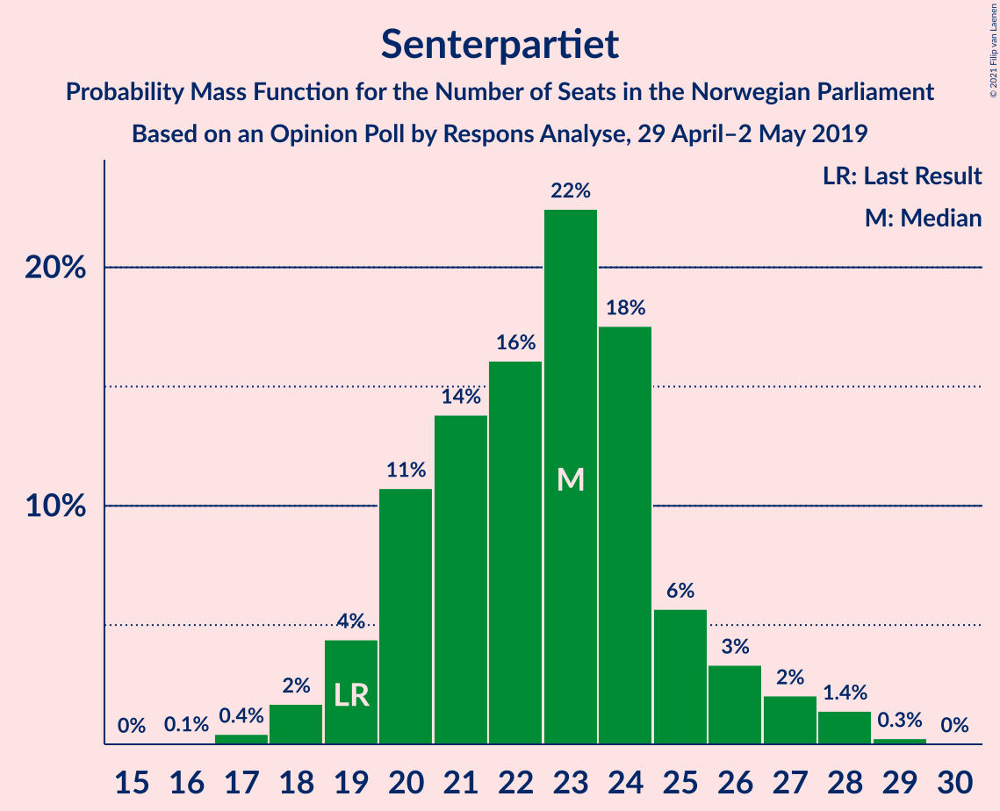
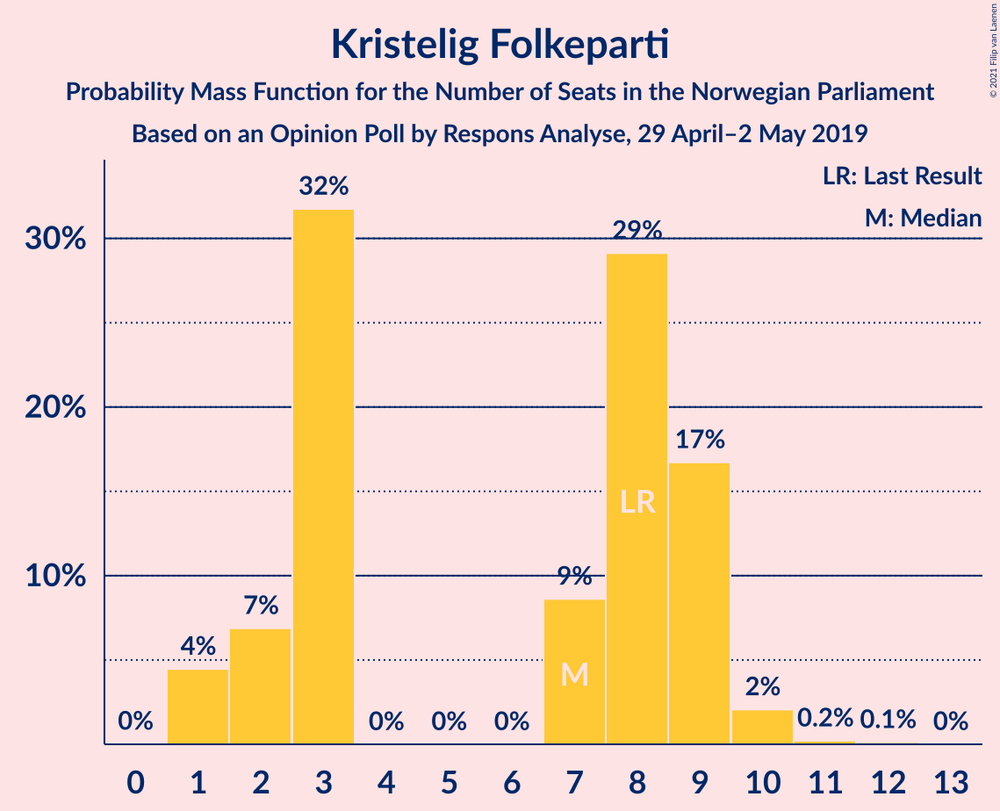
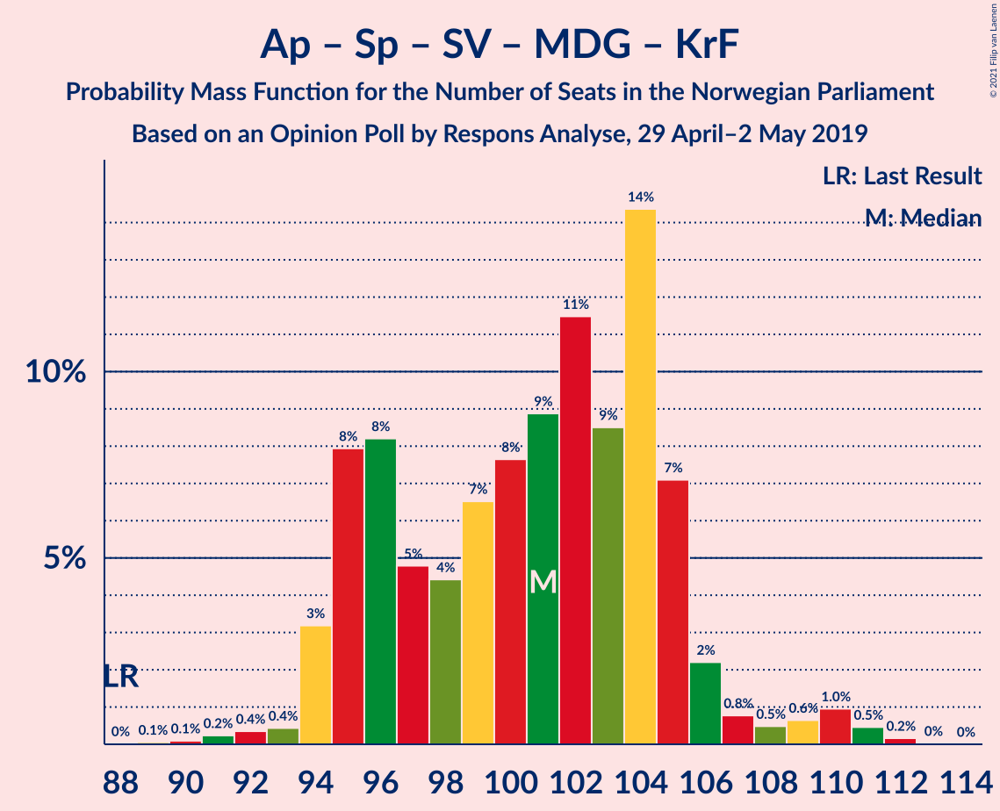
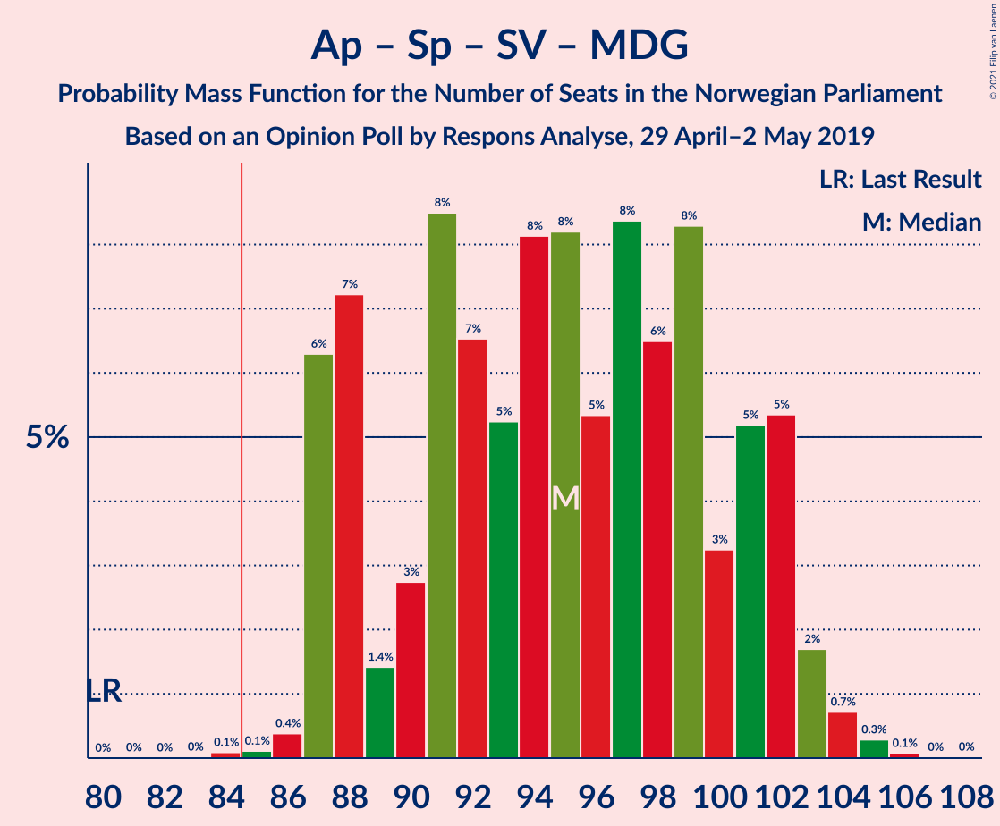
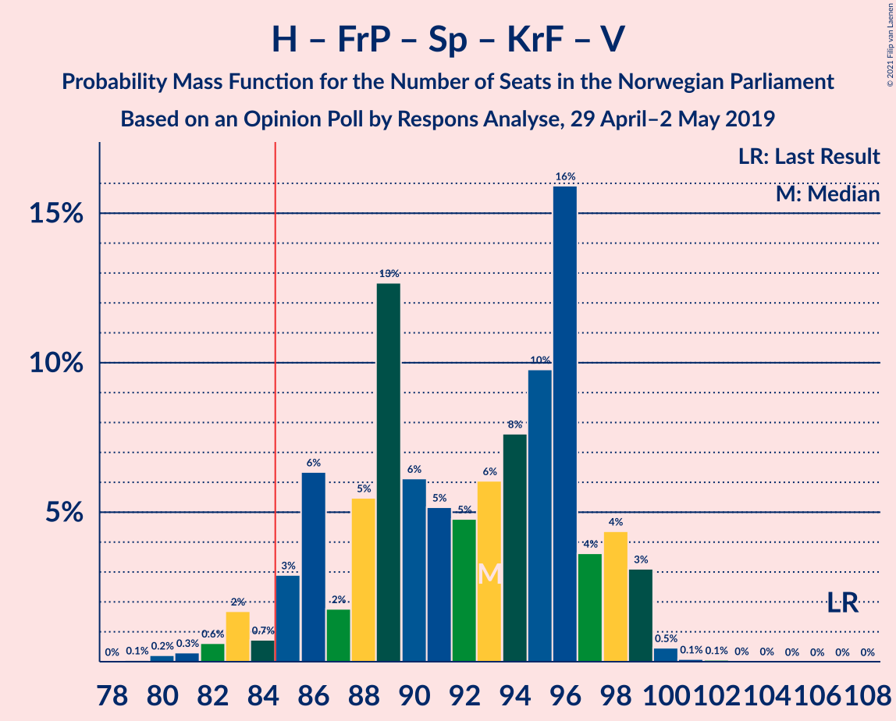
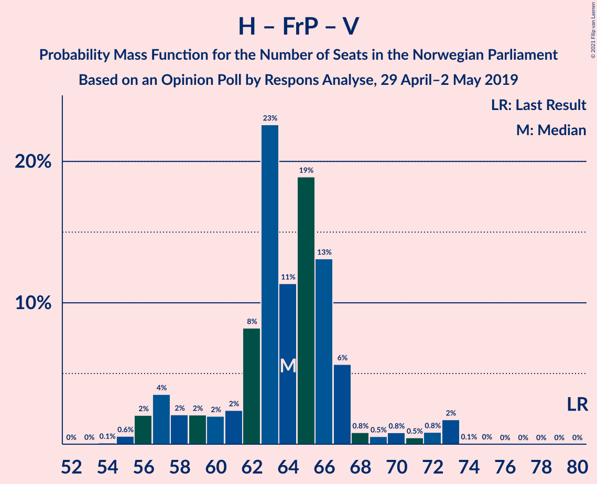

# Opinion Poll by Respons Analyse, 29 April–2 May 2019

<a href="#voting-intentions">Voting Intentions</a> | <a href="#seats">Seats</a> | <a href="#coalitions">Coalitions</a> | <a href="#technical-information">Technical Information</a>

## Voting Intentions

### Confidence Intervals

| Party | Last Result | Poll Result | 80% Confidence Interval | 90% Confidence Interval | 95% Confidence Interval | 99% Confidence Interval |
|:-----:|:-----------:|:-----------:|:-----------------------:|:-----------------------:|:-----------------------:|:-----------------------:|
| Arbeiderpartiet | 27.4% | 28.2% | 26.4–30.1% |25.9–30.6% |25.5–31.1% |24.7–32.0% |
| Høyre | 25.0% | 21.6% | 20.0–23.4% |19.5–23.8% |19.2–24.3% |18.4–25.1% |
| Fremskrittspartiet | 15.2% | 13.0% | 11.7–14.5% |11.4–14.9% |11.1–15.2% |10.5–16.0% |
| Senterpartiet | 10.3% | 12.5% | 11.2–13.9% |10.9–14.3% |10.6–14.7% |10.0–15.4% |
| Sosialistisk Venstreparti | 6.0% | 8.4% | 7.4–9.6% |7.1–10.0% |6.8–10.3% |6.4–10.9% |
| Miljøpartiet De Grønne | 3.2% | 4.4% | 3.7–5.3% |3.5–5.6% |3.3–5.9% |3.0–6.4% |
| Kristelig Folkeparti | 4.2% | 4.1% | 3.4–5.0% |3.2–5.3% |3.0–5.5% |2.7–6.0% |
| Rødt | 2.4% | 3.9% | 3.2–4.8% |3.0–5.1% |2.9–5.3% |2.6–5.8% |
| Venstre | 4.4% | 1.9% | 1.4–2.6% |1.3–2.8% |1.2–3.0% |1.0–3.3% |

*Note:* The poll result column reflects the actual value used in the calculations. Published results may vary slightly, and in addition be rounded to fewer digits.

## Seats

### Confidence Intervals

| Party | Last Result | Median | 80% Confidence Interval | 90% Confidence Interval | 95% Confidence Interval | 99% Confidence Interval |
|:-----:|:-----------:|:------:|:-----------------------:|:-----------------------:|:-----------------------:|:-----------------------:|
| <a href="#arbeiderpartiet">Arbeiderpartiet</a> | 49 | 50 | 46–54 |46–55 |46–57 |44–57 |
| <a href="#høyre">Høyre</a> | 45 | 39 | 36–42 |35–42 |34–44 |33–45 |
| <a href="#fremskrittspartiet">Fremskrittspartiet</a> | 27 | 25 | 20–27 |19–27 |19–27 |19–28 |
| <a href="#senterpartiet">Senterpartiet</a> | 19 | 23 | 20–24 |19–26 |18–26 |17–27 |
| <a href="#sosialistisk-venstreparti">Sosialistisk Venstreparti</a> | 11 | 14 | 14–17 |13–17 |12–18 |11–19 |
| <a href="#miljøpartiet-de-grønne">Miljøpartiet De Grønne</a> | 1 | 8 | 2–10 |2–10 |2–10 |2–11 |
| <a href="#kristelig-folkeparti">Kristelig Folkeparti</a> | 8 | 7 | 3–9 |3–9 |1–9 |1–10 |
| <a href="#rødt">Rødt</a> | 1 | 7 | 2–8 |2–9 |1–9 |1–10 |
| <a href="#venstre">Venstre</a> | 8 | 1 | 0–2 |0–2 |0–2 |0–2 |

### Arbeiderpartiet

*For a full overview of the results for this party, see the [Arbeiderpartiet](party-arbeiderpartiet.html) page.*

| Number of Seats | Probability | Accumulated | Special Marks |
|:---------------:|:-----------:|:-----------:|:-------------:|
| 43 | 0.4% | 100% |  |
| 44 | 0.7% | 99.5% |  |
| 45 | 0.5% | 98.8% |  |
| 46 | 13% | 98% |  |
| 47 | 4% | 86% |  |
| 48 | 10% | 82% |  |
| 49 | 6% | 72% | Last Result |
| 50 | 36% | 66% | Median |
| 51 | 2% | 30% |  |
| 52 | 2% | 28% |  |
| 53 | 10% | 25% |  |
| 54 | 8% | 16% |  |
| 55 | 3% | 8% |  |
| 56 | 2% | 4% |  |
| 57 | 2% | 3% |  |
| 58 | 0.1% | 0.3% |  |
| 59 | 0.1% | 0.1% |  |
| 60 | 0% | 0.1% |  |
| 61 | 0% | 0% |  |

### Høyre

*For a full overview of the results for this party, see the [Høyre](party-høyre.html) page.*

| Number of Seats | Probability | Accumulated | Special Marks |
|:---------------:|:-----------:|:-----------:|:-------------:|
| 31 | 0.1% | 100% |  |
| 32 | 0.1% | 99.9% |  |
| 33 | 0.8% | 99.8% |  |
| 34 | 3% | 99.0% |  |
| 35 | 2% | 96% |  |
| 36 | 21% | 94% |  |
| 37 | 3% | 73% |  |
| 38 | 8% | 70% |  |
| 39 | 23% | 62% | Median |
| 40 | 21% | 39% |  |
| 41 | 1.1% | 18% |  |
| 42 | 13% | 17% |  |
| 43 | 1.0% | 4% |  |
| 44 | 2% | 3% |  |
| 45 | 0.5% | 0.8% | Last Result |
| 46 | 0.1% | 0.3% |  |
| 47 | 0.2% | 0.3% |  |
| 48 | 0.1% | 0.1% |  |
| 49 | 0.1% | 0.1% |  |
| 50 | 0% | 0% |  |

### Fremskrittspartiet

*For a full overview of the results for this party, see the [Fremskrittspartiet](party-fremskrittspartiet.html) page.*

| Number of Seats | Probability | Accumulated | Special Marks |
|:---------------:|:-----------:|:-----------:|:-------------:|
| 18 | 0% | 100% |  |
| 19 | 6% | 99.9% |  |
| 20 | 5% | 94% |  |
| 21 | 5% | 89% |  |
| 22 | 5% | 84% |  |
| 23 | 6% | 79% |  |
| 24 | 21% | 73% |  |
| 25 | 15% | 52% | Median |
| 26 | 1.0% | 37% |  |
| 27 | 35% | 36% | Last Result |
| 28 | 0.7% | 1.1% |  |
| 29 | 0.2% | 0.4% |  |
| 30 | 0.2% | 0.2% |  |
| 31 | 0% | 0% |  |

### Senterpartiet

*For a full overview of the results for this party, see the [Senterpartiet](party-senterpartiet.html) page.*

| Number of Seats | Probability | Accumulated | Special Marks |
|:---------------:|:-----------:|:-----------:|:-------------:|
| 16 | 0.1% | 100% |  |
| 17 | 0.5% | 99.9% |  |
| 18 | 4% | 99.4% |  |
| 19 | 5% | 96% | Last Result |
| 20 | 14% | 90% |  |
| 21 | 10% | 77% |  |
| 22 | 14% | 67% |  |
| 23 | 17% | 52% | Median |
| 24 | 26% | 35% |  |
| 25 | 2% | 8% |  |
| 26 | 5% | 6% |  |
| 27 | 0.8% | 1.2% |  |
| 28 | 0.3% | 0.4% |  |
| 29 | 0% | 0.1% |  |
| 30 | 0% | 0% |  |

### Sosialistisk Venstreparti

*For a full overview of the results for this party, see the [Sosialistisk Venstreparti](party-sosialistiskvenstreparti.html) page.*

| Number of Seats | Probability | Accumulated | Special Marks |
|:---------------:|:-----------:|:-----------:|:-------------:|
| 10 | 0.1% | 100% |  |
| 11 | 0.8% | 99.9% | Last Result |
| 12 | 3% | 99.2% |  |
| 13 | 4% | 96% |  |
| 14 | 51% | 92% | Median |
| 15 | 12% | 41% |  |
| 16 | 15% | 29% |  |
| 17 | 10% | 14% |  |
| 18 | 3% | 4% |  |
| 19 | 0.8% | 1.2% |  |
| 20 | 0.3% | 0.4% |  |
| 21 | 0.1% | 0.1% |  |
| 22 | 0% | 0% |  |

### Miljøpartiet De Grønne

*For a full overview of the results for this party, see the [Miljøpartiet De Grønne](party-miljøpartietdegrønne.html) page.*

| Number of Seats | Probability | Accumulated | Special Marks |
|:---------------:|:-----------:|:-----------:|:-------------:|
| 1 | 0.3% | 100% | Last Result |
| 2 | 21% | 99.7% |  |
| 3 | 0.7% | 79% |  |
| 4 | 0.1% | 78% |  |
| 5 | 0% | 78% |  |
| 6 | 0% | 78% |  |
| 7 | 15% | 78% |  |
| 8 | 31% | 63% | Median |
| 9 | 8% | 32% |  |
| 10 | 23% | 25% |  |
| 11 | 0.7% | 1.0% |  |
| 12 | 0.3% | 0.3% |  |
| 13 | 0% | 0% |  |

### Kristelig Folkeparti

*For a full overview of the results for this party, see the [Kristelig Folkeparti](party-kristeligfolkeparti.html) page.*

| Number of Seats | Probability | Accumulated | Special Marks |
|:---------------:|:-----------:|:-----------:|:-------------:|
| 1 | 3% | 100% |  |
| 2 | 2% | 97% |  |
| 3 | 44% | 96% |  |
| 4 | 0% | 51% |  |
| 5 | 0% | 51% |  |
| 6 | 0% | 51% |  |
| 7 | 4% | 51% | Median |
| 8 | 32% | 47% | Last Result |
| 9 | 13% | 15% |  |
| 10 | 2% | 2% |  |
| 11 | 0.2% | 0.3% |  |
| 12 | 0.1% | 0.1% |  |
| 13 | 0% | 0% |  |

### Rødt

*For a full overview of the results for this party, see the [Rødt](party-rødt.html) page.*

| Number of Seats | Probability | Accumulated | Special Marks |
|:---------------:|:-----------:|:-----------:|:-------------:|
| 1 | 4% | 100% | Last Result |
| 2 | 43% | 96% |  |
| 3 | 0% | 53% |  |
| 4 | 0% | 53% |  |
| 5 | 0% | 53% |  |
| 6 | 0.1% | 53% |  |
| 7 | 20% | 53% | Median |
| 8 | 26% | 33% |  |
| 9 | 5% | 7% |  |
| 10 | 2% | 2% |  |
| 11 | 0.3% | 0.3% |  |
| 12 | 0% | 0% |  |

### Venstre

*For a full overview of the results for this party, see the [Venstre](party-venstre.html) page.*

| Number of Seats | Probability | Accumulated | Special Marks |
|:---------------:|:-----------:|:-----------:|:-------------:|
| 0 | 45% | 100% |  |
| 1 | 38% | 55% | Median |
| 2 | 18% | 18% |  |
| 3 | 0% | 0% |  |
| 4 | 0% | 0% |  |
| 5 | 0% | 0% |  |
| 6 | 0% | 0% |  |
| 7 | 0% | 0% |  |
| 8 | 0% | 0% | Last Result |

## Coalitions

### Confidence Intervals

| Coalition | Last Result | Median | Majority? | 80% Confidence Interval | 90% Confidence Interval | 95% Confidence Interval | 99% Confidence Interval |
|:---------:|:-----------:|:------:|:---------:|:-----------------------:|:-----------------------:|:-----------------------:|:-----------------------:|
| Arbeiderpartiet – Senterpartiet – Sosialistisk Venstreparti – Miljøpartiet De Grønne – Kristelig Folkeparti | 88 | 100 | 100% | 95–105 | 95–106 | 94–108 | 93–111 |
| Arbeiderpartiet – Senterpartiet – Sosialistisk Venstreparti – Miljøpartiet De Grønne – Rødt | 81 | 100 | 100% | 94–105 | 93–106 | 93–107 | 92–109 |
| Arbeiderpartiet – Senterpartiet – Sosialistisk Venstreparti – Miljøpartiet De Grønne | 80 | 95 | 99.9% | 87–99 | 87–101 | 87–102 | 86–105 |
| Arbeiderpartiet – Senterpartiet – Sosialistisk Venstreparti – Rødt | 80 | 92 | 99.5% | 87–97 | 87–99 | 86–99 | 85–102 |
| Høyre – Fremskrittspartiet – Senterpartiet – Kristelig Folkeparti – Venstre | 107 | 93 | 93% | 87–97 | 83–97 | 83–98 | 80–99 |
| Arbeiderpartiet – Senterpartiet – Sosialistisk Venstreparti | 79 | 88 | 83% | 80–92 | 80–93 | 80–94 | 79–97 |
| Arbeiderpartiet – Senterpartiet – Miljøpartiet De Grønne – Kristelig Folkeparti | 77 | 85 | 59% | 80–89 | 80–91 | 78–94 | 77–96 |
| Arbeiderpartiet – Senterpartiet – Kristelig Folkeparti | 76 | 77 | 5% | 74–83 | 74–85 | 70–86 | 70–88 |
| Høyre – Fremskrittspartiet – Miljøpartiet De Grønne – Kristelig Folkeparti – Venstre | 89 | 77 | 0.5% | 72–82 | 70–82 | 70–83 | 67–84 |
| Arbeiderpartiet – Senterpartiet | 68 | 73 | 0% | 66–76 | 66–78 | 66–79 | 64–81 |
| Høyre – Fremskrittspartiet – Kristelig Folkeparti – Venstre | 88 | 69 | 0% | 64–75 | 63–76 | 62–76 | 60–77 |
| Arbeiderpartiet – Sosialistisk Venstreparti | 60 | 64 | 0% | 60–70 | 60–71 | 60–72 | 59–74 |
| Høyre – Fremskrittspartiet – Venstre | 80 | 65 | 0% | 58–67 | 56–67 | 56–67 | 55–71 |
| Høyre – Fremskrittspartiet | 72 | 64 | 0% | 57–66 | 55–66 | 55–67 | 54–70 |
| Høyre – Kristelig Folkeparti – Venstre | 61 | 45 | 0% | 39–51 | 39–51 | 39–52 | 38–54 |
| Senterpartiet – Kristelig Folkeparti – Venstre | 35 | 28 | 0% | 26–33 | 24–35 | 22–35 | 22–36 |

### Arbeiderpartiet – Senterpartiet – Sosialistisk Venstreparti – Miljøpartiet De Grønne – Kristelig Folkeparti

| Number of Seats | Probability | Accumulated | Special Marks |
|:---------------:|:-----------:|:-----------:|:-------------:|
| 88 | 0% | 100% | Last Result |
| 89 | 0.2% | 100% |  |
| 90 | 0.1% | 99.8% |  |
| 91 | 0% | 99.7% |  |
| 92 | 0% | 99.7% |  |
| 93 | 0.4% | 99.6% |  |
| 94 | 3% | 99.3% |  |
| 95 | 13% | 97% |  |
| 96 | 8% | 84% |  |
| 97 | 0.4% | 76% |  |
| 98 | 14% | 75% |  |
| 99 | 2% | 61% |  |
| 100 | 11% | 59% |  |
| 101 | 22% | 48% |  |
| 102 | 5% | 26% | Median |
| 103 | 3% | 21% |  |
| 104 | 3% | 19% |  |
| 105 | 6% | 15% |  |
| 106 | 5% | 10% |  |
| 107 | 1.3% | 4% |  |
| 108 | 0.8% | 3% |  |
| 109 | 1.4% | 2% |  |
| 110 | 0.1% | 0.9% |  |
| 111 | 0.6% | 0.8% |  |
| 112 | 0.2% | 0.2% |  |
| 113 | 0% | 0% |  |

### Arbeiderpartiet – Senterpartiet – Sosialistisk Venstreparti – Miljøpartiet De Grønne – Rødt

| Number of Seats | Probability | Accumulated | Special Marks |
|:---------------:|:-----------:|:-----------:|:-------------:|
| 81 | 0% | 100% | Last Result |
| 82 | 0% | 100% |  |
| 83 | 0% | 100% |  |
| 84 | 0% | 100% |  |
| 85 | 0% | 100% | Majority |
| 86 | 0% | 100% |  |
| 87 | 0% | 100% |  |
| 88 | 0% | 100% |  |
| 89 | 0% | 100% |  |
| 90 | 0.1% | 99.9% |  |
| 91 | 0.1% | 99.8% |  |
| 92 | 0.8% | 99.8% |  |
| 93 | 8% | 99.0% |  |
| 94 | 11% | 91% |  |
| 95 | 3% | 80% |  |
| 96 | 9% | 77% |  |
| 97 | 1.3% | 68% |  |
| 98 | 1.0% | 66% |  |
| 99 | 4% | 65% |  |
| 100 | 25% | 61% |  |
| 101 | 3% | 36% |  |
| 102 | 2% | 33% | Median |
| 103 | 18% | 31% |  |
| 104 | 2% | 12% |  |
| 105 | 5% | 10% |  |
| 106 | 2% | 6% |  |
| 107 | 2% | 4% |  |
| 108 | 0.5% | 2% |  |
| 109 | 0.7% | 1.0% |  |
| 110 | 0.2% | 0.3% |  |
| 111 | 0% | 0% |  |

### Arbeiderpartiet – Senterpartiet – Sosialistisk Venstreparti – Miljøpartiet De Grønne

| Number of Seats | Probability | Accumulated | Special Marks |
|:---------------:|:-----------:|:-----------:|:-------------:|
| 80 | 0% | 100% | Last Result |
| 81 | 0% | 100% |  |
| 82 | 0% | 100% |  |
| 83 | 0% | 100% |  |
| 84 | 0% | 100% |  |
| 85 | 0.2% | 99.9% | Majority |
| 86 | 0.3% | 99.7% |  |
| 87 | 11% | 99.4% |  |
| 88 | 9% | 89% |  |
| 89 | 0.3% | 79% |  |
| 90 | 0.9% | 79% |  |
| 91 | 10% | 78% |  |
| 92 | 3% | 68% |  |
| 93 | 2% | 65% |  |
| 94 | 2% | 63% |  |
| 95 | 17% | 61% | Median |
| 96 | 1.0% | 44% |  |
| 97 | 6% | 43% |  |
| 98 | 27% | 37% |  |
| 99 | 3% | 10% |  |
| 100 | 1.1% | 8% |  |
| 101 | 2% | 7% |  |
| 102 | 3% | 5% |  |
| 103 | 0.4% | 1.4% |  |
| 104 | 0.3% | 1.0% |  |
| 105 | 0.7% | 0.7% |  |
| 106 | 0% | 0% |  |

### Arbeiderpartiet – Senterpartiet – Sosialistisk Venstreparti – Rødt

| Number of Seats | Probability | Accumulated | Special Marks |
|:---------------:|:-----------:|:-----------:|:-------------:|
| 80 | 0% | 100% | Last Result |
| 81 | 0.1% | 100% |  |
| 82 | 0% | 99.9% |  |
| 83 | 0.3% | 99.9% |  |
| 84 | 0.1% | 99.6% |  |
| 85 | 1.2% | 99.5% | Majority |
| 86 | 2% | 98% |  |
| 87 | 12% | 97% |  |
| 88 | 0.7% | 85% |  |
| 89 | 2% | 84% |  |
| 90 | 22% | 83% |  |
| 91 | 8% | 61% |  |
| 92 | 7% | 53% |  |
| 93 | 2% | 46% |  |
| 94 | 12% | 43% | Median |
| 95 | 17% | 32% |  |
| 96 | 1.3% | 15% |  |
| 97 | 6% | 13% |  |
| 98 | 2% | 7% |  |
| 99 | 3% | 6% |  |
| 100 | 1.0% | 2% |  |
| 101 | 0.4% | 1.4% |  |
| 102 | 0.8% | 1.0% |  |
| 103 | 0.1% | 0.2% |  |
| 104 | 0.1% | 0.2% |  |
| 105 | 0% | 0% |  |

### Høyre – Fremskrittspartiet – Senterpartiet – Kristelig Folkeparti – Venstre

| Number of Seats | Probability | Accumulated | Special Marks |
|:---------------:|:-----------:|:-----------:|:-------------:|
| 79 | 0.1% | 100% |  |
| 80 | 0.6% | 99.9% |  |
| 81 | 0% | 99.3% |  |
| 82 | 0.2% | 99.3% |  |
| 83 | 4% | 99.0% |  |
| 84 | 2% | 95% |  |
| 85 | 2% | 93% | Majority |
| 86 | 0.6% | 91% |  |
| 87 | 5% | 91% |  |
| 88 | 4% | 86% |  |
| 89 | 15% | 81% |  |
| 90 | 2% | 66% |  |
| 91 | 2% | 65% |  |
| 92 | 3% | 63% |  |
| 93 | 23% | 60% |  |
| 94 | 3% | 37% |  |
| 95 | 19% | 35% | Median |
| 96 | 4% | 16% |  |
| 97 | 9% | 12% |  |
| 98 | 2% | 3% |  |
| 99 | 0.7% | 0.9% |  |
| 100 | 0.1% | 0.2% |  |
| 101 | 0% | 0.1% |  |
| 102 | 0% | 0.1% |  |
| 103 | 0% | 0.1% |  |
| 104 | 0% | 0% |  |
| 105 | 0% | 0% |  |
| 106 | 0% | 0% |  |
| 107 | 0% | 0% | Last Result |

### Arbeiderpartiet – Senterpartiet – Sosialistisk Venstreparti

| Number of Seats | Probability | Accumulated | Special Marks |
|:---------------:|:-----------:|:-----------:|:-------------:|
| 77 | 0% | 100% |  |
| 78 | 0% | 99.9% |  |
| 79 | 2% | 99.9% | Last Result |
| 80 | 10% | 98% |  |
| 81 | 0.5% | 88% |  |
| 82 | 0.3% | 87% |  |
| 83 | 3% | 87% |  |
| 84 | 2% | 84% |  |
| 85 | 3% | 83% | Majority |
| 86 | 9% | 80% |  |
| 87 | 16% | 71% | Median |
| 88 | 23% | 55% |  |
| 89 | 10% | 32% |  |
| 90 | 11% | 22% |  |
| 91 | 0.8% | 11% |  |
| 92 | 4% | 11% |  |
| 93 | 2% | 7% |  |
| 94 | 3% | 5% |  |
| 95 | 0.4% | 2% |  |
| 96 | 0.5% | 2% |  |
| 97 | 0.9% | 1.1% |  |
| 98 | 0.1% | 0.2% |  |
| 99 | 0.1% | 0.1% |  |
| 100 | 0% | 0% |  |

### Arbeiderpartiet – Senterpartiet – Miljøpartiet De Grønne – Kristelig Folkeparti

| Number of Seats | Probability | Accumulated | Special Marks |
|:---------------:|:-----------:|:-----------:|:-------------:|
| 75 | 0.3% | 100% |  |
| 76 | 0.2% | 99.7% |  |
| 77 | 0.3% | 99.5% | Last Result |
| 78 | 3% | 99.2% |  |
| 79 | 0.3% | 97% |  |
| 80 | 10% | 96% |  |
| 81 | 11% | 87% |  |
| 82 | 2% | 75% |  |
| 83 | 0.5% | 74% |  |
| 84 | 14% | 73% |  |
| 85 | 10% | 59% | Majority |
| 86 | 3% | 49% |  |
| 87 | 25% | 47% |  |
| 88 | 5% | 21% | Median |
| 89 | 7% | 17% |  |
| 90 | 3% | 9% |  |
| 91 | 2% | 6% |  |
| 92 | 0.7% | 4% |  |
| 93 | 0.5% | 4% |  |
| 94 | 2% | 3% |  |
| 95 | 0.7% | 2% |  |
| 96 | 0.8% | 0.8% |  |
| 97 | 0% | 0% |  |

### Arbeiderpartiet – Senterpartiet – Kristelig Folkeparti

| Number of Seats | Probability | Accumulated | Special Marks |
|:---------------:|:-----------:|:-----------:|:-------------:|
| 69 | 0% | 100% |  |
| 70 | 3% | 99.9% |  |
| 71 | 1.5% | 97% |  |
| 72 | 0.2% | 96% |  |
| 73 | 0.5% | 96% |  |
| 74 | 12% | 95% |  |
| 75 | 0.9% | 84% |  |
| 76 | 15% | 83% | Last Result |
| 77 | 21% | 68% |  |
| 78 | 11% | 46% |  |
| 79 | 3% | 35% |  |
| 80 | 4% | 32% | Median |
| 81 | 10% | 27% |  |
| 82 | 2% | 17% |  |
| 83 | 9% | 16% |  |
| 84 | 1.2% | 7% |  |
| 85 | 2% | 5% | Majority |
| 86 | 0.8% | 3% |  |
| 87 | 2% | 2% |  |
| 88 | 0.3% | 0.7% |  |
| 89 | 0.3% | 0.4% |  |
| 90 | 0% | 0.1% |  |
| 91 | 0% | 0% |  |

### Høyre – Fremskrittspartiet – Miljøpartiet De Grønne – Kristelig Folkeparti – Venstre

| Number of Seats | Probability | Accumulated | Special Marks |
|:---------------:|:-----------:|:-----------:|:-------------:|
| 65 | 0.1% | 100% |  |
| 66 | 0.1% | 99.8% |  |
| 67 | 0.8% | 99.8% |  |
| 68 | 0.4% | 99.0% |  |
| 69 | 1.0% | 98.6% |  |
| 70 | 3% | 98% |  |
| 71 | 2% | 94% |  |
| 72 | 6% | 93% |  |
| 73 | 1.3% | 87% |  |
| 74 | 17% | 85% |  |
| 75 | 12% | 68% |  |
| 76 | 2% | 57% |  |
| 77 | 7% | 54% |  |
| 78 | 8% | 47% |  |
| 79 | 22% | 39% |  |
| 80 | 2% | 17% | Median |
| 81 | 0.7% | 16% |  |
| 82 | 12% | 15% |  |
| 83 | 2% | 3% |  |
| 84 | 1.2% | 2% |  |
| 85 | 0.1% | 0.5% | Majority |
| 86 | 0.3% | 0.4% |  |
| 87 | 0% | 0.1% |  |
| 88 | 0.1% | 0.1% |  |
| 89 | 0% | 0% | Last Result |

### Arbeiderpartiet – Senterpartiet

| Number of Seats | Probability | Accumulated | Special Marks |
|:---------------:|:-----------:|:-----------:|:-------------:|
| 63 | 0.1% | 100% |  |
| 64 | 1.3% | 99.9% |  |
| 65 | 0.2% | 98.6% |  |
| 66 | 11% | 98% |  |
| 67 | 3% | 87% |  |
| 68 | 0.5% | 84% | Last Result |
| 69 | 0.7% | 84% |  |
| 70 | 10% | 83% |  |
| 71 | 2% | 73% |  |
| 72 | 4% | 72% |  |
| 73 | 22% | 68% | Median |
| 74 | 29% | 46% |  |
| 75 | 4% | 17% |  |
| 76 | 4% | 13% |  |
| 77 | 5% | 10% |  |
| 78 | 2% | 5% |  |
| 79 | 0.9% | 3% |  |
| 80 | 2% | 2% |  |
| 81 | 0.7% | 0.8% |  |
| 82 | 0% | 0.2% |  |
| 83 | 0% | 0.1% |  |
| 84 | 0.1% | 0.1% |  |
| 85 | 0% | 0% | Majority |

### Høyre – Fremskrittspartiet – Kristelig Folkeparti – Venstre

| Number of Seats | Probability | Accumulated | Special Marks |
|:---------------:|:-----------:|:-----------:|:-------------:|
| 59 | 0.2% | 100% |  |
| 60 | 0.7% | 99.7% |  |
| 61 | 0.5% | 99.0% |  |
| 62 | 2% | 98% |  |
| 63 | 2% | 96% |  |
| 64 | 5% | 94% |  |
| 65 | 2% | 90% |  |
| 66 | 18% | 88% |  |
| 67 | 2% | 69% |  |
| 68 | 3% | 67% |  |
| 69 | 25% | 64% |  |
| 70 | 4% | 39% |  |
| 71 | 1.0% | 35% |  |
| 72 | 1.3% | 34% | Median |
| 73 | 9% | 32% |  |
| 74 | 3% | 23% |  |
| 75 | 11% | 20% |  |
| 76 | 8% | 9% |  |
| 77 | 0.8% | 1.0% |  |
| 78 | 0.1% | 0.2% |  |
| 79 | 0.1% | 0.2% |  |
| 80 | 0% | 0.1% |  |
| 81 | 0% | 0% |  |
| 82 | 0% | 0% |  |
| 83 | 0% | 0% |  |
| 84 | 0% | 0% |  |
| 85 | 0% | 0% | Majority |
| 86 | 0% | 0% |  |
| 87 | 0% | 0% |  |
| 88 | 0% | 0% | Last Result |

### Arbeiderpartiet – Sosialistisk Venstreparti

| Number of Seats | Probability | Accumulated | Special Marks |
|:---------------:|:-----------:|:-----------:|:-------------:|
| 56 | 0% | 100% |  |
| 57 | 0.1% | 99.9% |  |
| 58 | 0.3% | 99.9% |  |
| 59 | 0.6% | 99.5% |  |
| 60 | 11% | 98.9% | Last Result |
| 61 | 3% | 88% |  |
| 62 | 2% | 84% |  |
| 63 | 2% | 83% |  |
| 64 | 47% | 80% | Median |
| 65 | 4% | 34% |  |
| 66 | 2% | 30% |  |
| 67 | 4% | 28% |  |
| 68 | 9% | 24% |  |
| 69 | 2% | 15% |  |
| 70 | 4% | 13% |  |
| 71 | 5% | 9% |  |
| 72 | 2% | 4% |  |
| 73 | 0.9% | 2% |  |
| 74 | 0.7% | 0.8% |  |
| 75 | 0% | 0.1% |  |
| 76 | 0.1% | 0.1% |  |
| 77 | 0% | 0% |  |

### Høyre – Fremskrittspartiet – Venstre

| Number of Seats | Probability | Accumulated | Special Marks |
|:---------------:|:-----------:|:-----------:|:-------------:|
| 54 | 0% | 100% |  |
| 55 | 0.7% | 99.9% |  |
| 56 | 5% | 99.2% |  |
| 57 | 2% | 94% |  |
| 58 | 3% | 92% |  |
| 59 | 3% | 89% |  |
| 60 | 1.5% | 86% |  |
| 61 | 1.3% | 84% |  |
| 62 | 5% | 83% |  |
| 63 | 18% | 78% |  |
| 64 | 2% | 60% |  |
| 65 | 12% | 58% | Median |
| 66 | 25% | 47% |  |
| 67 | 20% | 22% |  |
| 68 | 0.7% | 2% |  |
| 69 | 0.3% | 1.0% |  |
| 70 | 0.1% | 0.7% |  |
| 71 | 0.2% | 0.6% |  |
| 72 | 0.2% | 0.4% |  |
| 73 | 0.1% | 0.2% |  |
| 74 | 0.1% | 0.1% |  |
| 75 | 0% | 0% |  |
| 76 | 0% | 0% |  |
| 77 | 0% | 0% |  |
| 78 | 0% | 0% |  |
| 79 | 0% | 0% |  |
| 80 | 0% | 0% | Last Result |

### Høyre – Fremskrittspartiet

| Number of Seats | Probability | Accumulated | Special Marks |
|:---------------:|:-----------:|:-----------:|:-------------:|
| 53 | 0% | 100% |  |
| 54 | 0.6% | 99.9% |  |
| 55 | 5% | 99.3% |  |
| 56 | 3% | 94% |  |
| 57 | 2% | 91% |  |
| 58 | 2% | 89% |  |
| 59 | 3% | 88% |  |
| 60 | 1.4% | 84% |  |
| 61 | 6% | 83% |  |
| 62 | 3% | 77% |  |
| 63 | 17% | 74% |  |
| 64 | 11% | 57% | Median |
| 65 | 10% | 46% |  |
| 66 | 32% | 36% |  |
| 67 | 2% | 3% |  |
| 68 | 0.6% | 1.3% |  |
| 69 | 0.1% | 0.7% |  |
| 70 | 0.2% | 0.6% |  |
| 71 | 0.2% | 0.4% |  |
| 72 | 0.1% | 0.2% | Last Result |
| 73 | 0.1% | 0.1% |  |
| 74 | 0% | 0% |  |

### Høyre – Kristelig Folkeparti – Venstre

| Number of Seats | Probability | Accumulated | Special Marks |
|:---------------:|:-----------:|:-----------:|:-------------:|
| 36 | 0% | 100% |  |
| 37 | 0.3% | 99.9% |  |
| 38 | 0.8% | 99.6% |  |
| 39 | 14% | 98.8% |  |
| 40 | 2% | 85% |  |
| 41 | 3% | 83% |  |
| 42 | 22% | 79% |  |
| 43 | 0.7% | 57% |  |
| 44 | 6% | 57% |  |
| 45 | 7% | 51% |  |
| 46 | 2% | 44% |  |
| 47 | 6% | 42% | Median |
| 48 | 2% | 36% |  |
| 49 | 12% | 34% |  |
| 50 | 0.4% | 22% |  |
| 51 | 18% | 21% |  |
| 52 | 2% | 3% |  |
| 53 | 0.4% | 1.3% |  |
| 54 | 0.7% | 0.8% |  |
| 55 | 0% | 0.1% |  |
| 56 | 0% | 0% |  |
| 57 | 0% | 0% |  |
| 58 | 0% | 0% |  |
| 59 | 0% | 0% |  |
| 60 | 0% | 0% |  |
| 61 | 0% | 0% | Last Result |

### Senterpartiet – Kristelig Folkeparti – Venstre

| Number of Seats | Probability | Accumulated | Special Marks |
|:---------------:|:-----------:|:-----------:|:-------------:|
| 20 | 0.1% | 100% |  |
| 21 | 0.1% | 99.9% |  |
| 22 | 3% | 99.8% |  |
| 23 | 0.9% | 97% |  |
| 24 | 1.3% | 96% |  |
| 25 | 3% | 95% |  |
| 26 | 17% | 92% |  |
| 27 | 22% | 74% |  |
| 28 | 6% | 52% |  |
| 29 | 13% | 46% |  |
| 30 | 2% | 33% |  |
| 31 | 9% | 32% | Median |
| 32 | 11% | 22% |  |
| 33 | 3% | 12% |  |
| 34 | 2% | 9% |  |
| 35 | 6% | 7% | Last Result |
| 36 | 0.7% | 0.9% |  |
| 37 | 0.1% | 0.2% |  |
| 38 | 0.1% | 0.1% |  |
| 39 | 0% | 0% |  |

## Technical Information

### Opinion Poll

+ **Polling firm:** Respons Analyse
+ **Commissioner(s):** —
+ **Fieldwork period:** 29 April–2 May 2019

### Calculations

+ **Sample size:** 1000
+ **Simulations done:** 131,072
+ **Error estimate:** 1.62%

