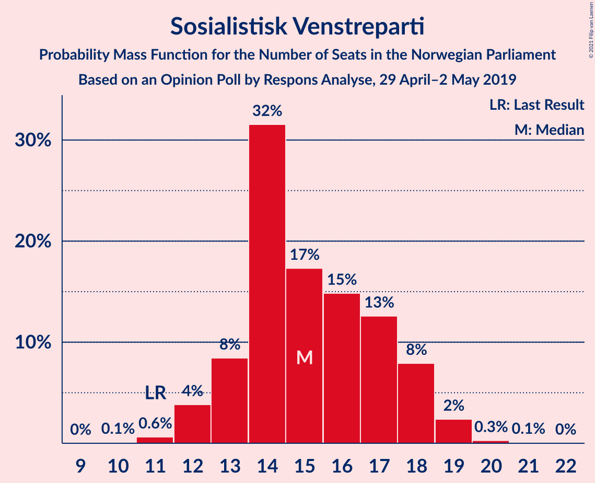
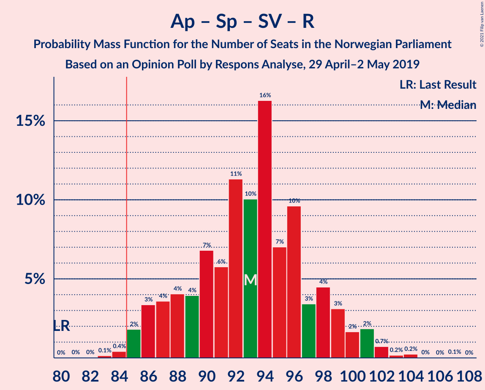
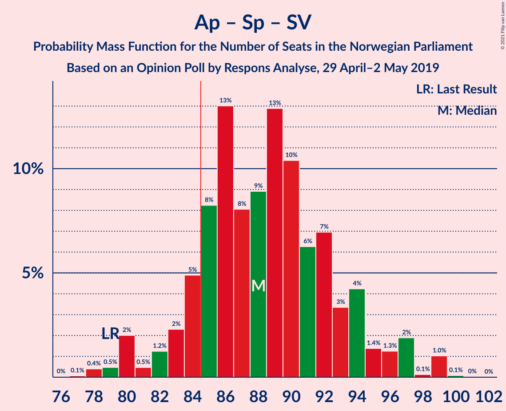
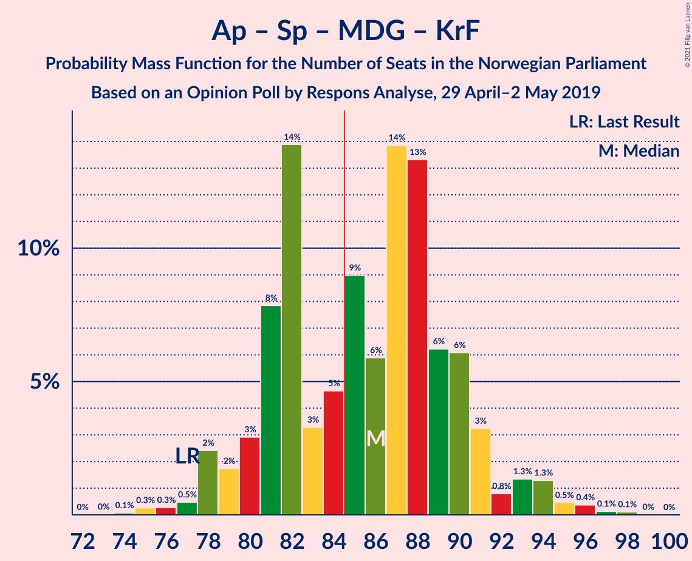
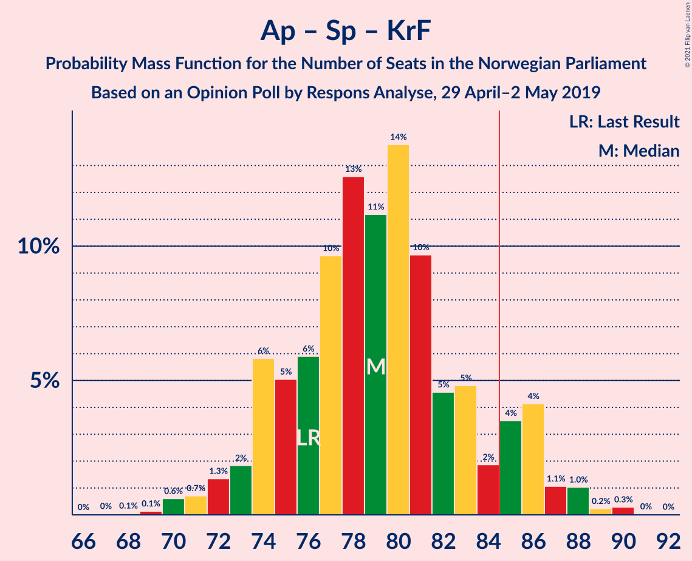
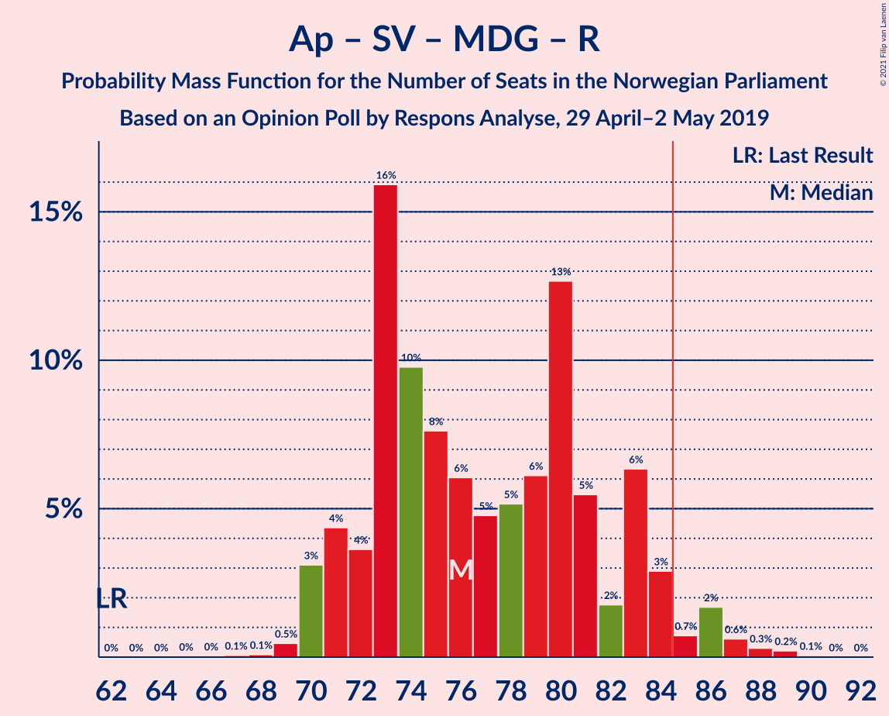
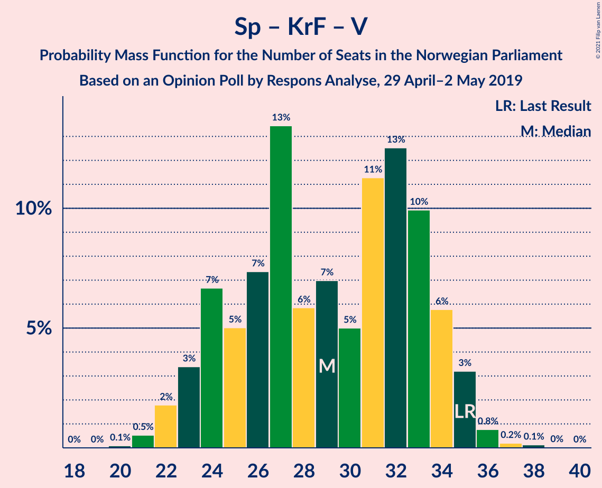

# Opinion Poll by Respons Analyse, 29 April–2 May 2019

<a href="#voting-intentions">Voting Intentions</a> | <a href="#seats">Seats</a> | <a href="#coalitions">Coalitions</a> | <a href="#technical-information">Technical Information</a>

## Voting Intentions

### Confidence Intervals

| Party | Last Result | Poll Result | 80% Confidence Interval | 90% Confidence Interval | 95% Confidence Interval | 99% Confidence Interval |
|:-----:|:-----------:|:-----------:|:-----------------------:|:-----------------------:|:-----------------------:|:-----------------------:|
| Arbeiderpartiet | 27.4% | 28.2% | 26.4–30.1% |25.9–30.6% |25.5–31.1% |24.7–32.0% |
| Høyre | 25.0% | 21.6% | 20.0–23.4% |19.5–23.8% |19.2–24.3% |18.4–25.1% |
| Fremskrittspartiet | 15.2% | 13.0% | 11.7–14.5% |11.4–14.9% |11.1–15.2% |10.5–16.0% |
| Senterpartiet | 10.3% | 12.5% | 11.2–13.9% |10.9–14.3% |10.6–14.7% |10.0–15.4% |
| Sosialistisk Venstreparti | 6.0% | 8.4% | 7.4–9.6% |7.1–10.0% |6.8–10.3% |6.4–10.9% |
| Miljøpartiet De Grønne | 3.2% | 4.4% | 3.7–5.3% |3.5–5.6% |3.3–5.9% |3.0–6.4% |
| Kristelig Folkeparti | 4.2% | 4.1% | 3.4–5.0% |3.2–5.3% |3.0–5.5% |2.7–6.0% |
| Rødt | 2.4% | 3.9% | 3.2–4.8% |3.0–5.1% |2.9–5.3% |2.6–5.8% |
| Venstre | 4.4% | 1.9% | 1.4–2.6% |1.3–2.8% |1.2–3.0% |1.0–3.3% |

*Note:* The poll result column reflects the actual value used in the calculations. Published results may vary slightly, and in addition be rounded to fewer digits.

## Seats

### Confidence Intervals

| Party | Last Result | Median | 80% Confidence Interval | 90% Confidence Interval | 95% Confidence Interval | 99% Confidence Interval |
|:-----:|:-----------:|:------:|:-----------------------:|:-----------------------:|:-----------------------:|:-----------------------:|
| <a href="#arbeiderpartiet">Arbeiderpartiet</a> | 49 | 50 | 47–55 |46–56 |45–56 |44–58 |
| <a href="#høyre">Høyre</a> | 45 | 39 | 36–42 |35–43 |34–44 |33–46 |
| <a href="#fremskrittspartiet">Fremskrittspartiet</a> | 27 | 24 | 21–26 |20–27 |19–28 |18–29 |
| <a href="#senterpartiet">Senterpartiet</a> | 19 | 23 | 20–25 |19–26 |19–27 |17–28 |
| <a href="#sosialistisk-venstreparti">Sosialistisk Venstreparti</a> | 11 | 15 | 13–18 |13–18 |12–19 |11–19 |
| <a href="#miljøpartiet-de-grønne">Miljøpartiet De Grønne</a> | 1 | 8 | 2–10 |2–10 |2–10 |1–11 |
| <a href="#kristelig-folkeparti">Kristelig Folkeparti</a> | 8 | 7 | 2–9 |2–9 |1–9 |1–10 |
| <a href="#rødt">Rødt</a> | 1 | 2 | 2–8 |2–9 |1–9 |1–10 |
| <a href="#venstre">Venstre</a> | 8 | 1 | 0–2 |0–2 |0–2 |0–2 |

### Arbeiderpartiet

*For a full overview of the results for this party, see the [Arbeiderpartiet](party-arbeiderpartiet.html) page.*

| Number of Seats | Probability | Accumulated | Special Marks |
|:---------------:|:-----------:|:-----------:|:-------------:|
| 42 | 0.1% | 100% |  |
| 43 | 0.4% | 99.9% |  |
| 44 | 1.0% | 99.6% |  |
| 45 | 1.3% | 98.6% |  |
| 46 | 3% | 97% |  |
| 47 | 6% | 94% |  |
| 48 | 4% | 88% |  |
| 49 | 23% | 84% | Last Result |
| 50 | 13% | 61% | Median |
| 51 | 6% | 47% |  |
| 52 | 8% | 41% |  |
| 53 | 13% | 33% |  |
| 54 | 10% | 20% |  |
| 55 | 4% | 10% |  |
| 56 | 4% | 7% |  |
| 57 | 2% | 2% |  |
| 58 | 0.3% | 0.6% |  |
| 59 | 0.1% | 0.3% |  |
| 60 | 0.1% | 0.2% |  |
| 61 | 0.1% | 0.1% |  |
| 62 | 0% | 0% |  |

### Høyre

*For a full overview of the results for this party, see the [Høyre](party-høyre.html) page.*

| Number of Seats | Probability | Accumulated | Special Marks |
|:---------------:|:-----------:|:-----------:|:-------------:|
| 31 | 0.1% | 100% |  |
| 32 | 0.2% | 99.9% |  |
| 33 | 0.7% | 99.7% |  |
| 34 | 2% | 99.0% |  |
| 35 | 3% | 97% |  |
| 36 | 9% | 94% |  |
| 37 | 7% | 85% |  |
| 38 | 14% | 78% |  |
| 39 | 27% | 64% | Median |
| 40 | 11% | 38% |  |
| 41 | 11% | 27% |  |
| 42 | 10% | 16% |  |
| 43 | 2% | 6% |  |
| 44 | 2% | 4% |  |
| 45 | 0.6% | 1.2% | Last Result |
| 46 | 0.3% | 0.6% |  |
| 47 | 0.2% | 0.3% |  |
| 48 | 0.1% | 0.1% |  |
| 49 | 0% | 0% |  |

### Fremskrittspartiet

*For a full overview of the results for this party, see the [Fremskrittspartiet](party-fremskrittspartiet.html) page.*

| Number of Seats | Probability | Accumulated | Special Marks |
|:---------------:|:-----------:|:-----------:|:-------------:|
| 17 | 0.1% | 100% |  |
| 18 | 0.8% | 99.9% |  |
| 19 | 3% | 99.1% |  |
| 20 | 4% | 96% |  |
| 21 | 4% | 92% |  |
| 22 | 11% | 88% |  |
| 23 | 14% | 77% |  |
| 24 | 27% | 63% | Median |
| 25 | 18% | 36% |  |
| 26 | 8% | 18% |  |
| 27 | 6% | 10% | Last Result |
| 28 | 2% | 3% |  |
| 29 | 1.0% | 1.2% |  |
| 30 | 0.2% | 0.3% |  |
| 31 | 0% | 0% |  |

### Senterpartiet

*For a full overview of the results for this party, see the [Senterpartiet](party-senterpartiet.html) page.*

| Number of Seats | Probability | Accumulated | Special Marks |
|:---------------:|:-----------:|:-----------:|:-------------:|
| 16 | 0.1% | 100% |  |
| 17 | 0.4% | 99.9% |  |
| 18 | 2% | 99.5% |  |
| 19 | 4% | 98% | Last Result |
| 20 | 11% | 93% |  |
| 21 | 14% | 83% |  |
| 22 | 16% | 69% |  |
| 23 | 22% | 53% | Median |
| 24 | 18% | 30% |  |
| 25 | 6% | 13% |  |
| 26 | 3% | 7% |  |
| 27 | 2% | 4% |  |
| 28 | 1.4% | 2% |  |
| 29 | 0.3% | 0.3% |  |
| 30 | 0% | 0% |  |

### Sosialistisk Venstreparti

*For a full overview of the results for this party, see the [Sosialistisk Venstreparti](party-sosialistiskvenstreparti.html) page.*

| Number of Seats | Probability | Accumulated | Special Marks |
|:---------------:|:-----------:|:-----------:|:-------------:|
| 10 | 0.1% | 100% |  |
| 11 | 0.6% | 99.9% | Last Result |
| 12 | 4% | 99.3% |  |
| 13 | 8% | 95% |  |
| 14 | 32% | 87% |  |
| 15 | 17% | 55% | Median |
| 16 | 15% | 38% |  |
| 17 | 13% | 23% |  |
| 18 | 8% | 11% |  |
| 19 | 2% | 3% |  |
| 20 | 0.3% | 0.4% |  |
| 21 | 0.1% | 0.1% |  |
| 22 | 0% | 0% |  |

### Miljøpartiet De Grønne

*For a full overview of the results for this party, see the [Miljøpartiet De Grønne](party-miljøpartietdegrønne.html) page.*

| Number of Seats | Probability | Accumulated | Special Marks |
|:---------------:|:-----------:|:-----------:|:-------------:|
| 1 | 0.7% | 100% | Last Result |
| 2 | 30% | 99.3% |  |
| 3 | 2% | 69% |  |
| 4 | 3% | 67% |  |
| 5 | 0% | 64% |  |
| 6 | 0% | 64% |  |
| 7 | 9% | 64% |  |
| 8 | 22% | 56% | Median |
| 9 | 19% | 34% |  |
| 10 | 12% | 15% |  |
| 11 | 2% | 2% |  |
| 12 | 0.2% | 0.2% |  |
| 13 | 0% | 0.1% |  |
| 14 | 0% | 0% |  |

### Kristelig Folkeparti

*For a full overview of the results for this party, see the [Kristelig Folkeparti](party-kristeligfolkeparti.html) page.*

| Number of Seats | Probability | Accumulated | Special Marks |
|:---------------:|:-----------:|:-----------:|:-------------:|
| 1 | 4% | 100% |  |
| 2 | 7% | 96% |  |
| 3 | 32% | 89% |  |
| 4 | 0% | 57% |  |
| 5 | 0% | 57% |  |
| 6 | 0% | 57% |  |
| 7 | 9% | 57% | Median |
| 8 | 29% | 48% | Last Result |
| 9 | 17% | 19% |  |
| 10 | 2% | 2% |  |
| 11 | 0.2% | 0.3% |  |
| 12 | 0.1% | 0.1% |  |
| 13 | 0% | 0% |  |

### Rødt

*For a full overview of the results for this party, see the [Rødt](party-rødt.html) page.*

| Number of Seats | Probability | Accumulated | Special Marks |
|:---------------:|:-----------:|:-----------:|:-------------:|
| 1 | 3% | 100% | Last Result |
| 2 | 52% | 97% | Median |
| 3 | 0% | 45% |  |
| 4 | 0% | 45% |  |
| 5 | 0% | 45% |  |
| 6 | 0% | 45% |  |
| 7 | 15% | 45% |  |
| 8 | 24% | 30% |  |
| 9 | 5% | 6% |  |
| 10 | 1.2% | 1.5% |  |
| 11 | 0.2% | 0.2% |  |
| 12 | 0% | 0% |  |

### Venstre

*For a full overview of the results for this party, see the [Venstre](party-venstre.html) page.*

| Number of Seats | Probability | Accumulated | Special Marks |
|:---------------:|:-----------:|:-----------:|:-------------:|
| 0 | 36% | 100% |  |
| 1 | 46% | 64% | Median |
| 2 | 18% | 18% |  |
| 3 | 0% | 0% |  |
| 4 | 0% | 0% |  |
| 5 | 0% | 0% |  |
| 6 | 0% | 0% |  |
| 7 | 0% | 0% |  |
| 8 | 0% | 0% | Last Result |

## Coalitions

### Confidence Intervals

| Coalition | Last Result | Median | Majority? | 80% Confidence Interval | 90% Confidence Interval | 95% Confidence Interval | 99% Confidence Interval |
|:---------:|:-----------:|:------:|:---------:|:-----------------------:|:-----------------------:|:-----------------------:|:-----------------------:|
| Arbeiderpartiet – Senterpartiet – Sosialistisk Venstreparti – Miljøpartiet De Grønne – Kristelig Folkeparti | 88 | 101 | 100% | 95–105 | 95–106 | 94–108 | 92–111 |
| Arbeiderpartiet – Senterpartiet – Sosialistisk Venstreparti – Miljøpartiet De Grønne – Rødt | 81 | 99 | 100% | 94–104 | 93–106 | 93–107 | 92–110 |
| Arbeiderpartiet – Senterpartiet – Sosialistisk Venstreparti – Miljøpartiet De Grønne | 80 | 95 | 99.9% | 88–101 | 87–102 | 87–103 | 86–104 |
| Arbeiderpartiet – Senterpartiet – Sosialistisk Venstreparti – Rødt | 80 | 93 | 99.4% | 88–98 | 86–99 | 86–101 | 84–103 |
| Høyre – Fremskrittspartiet – Senterpartiet – Kristelig Folkeparti – Venstre | 107 | 93 | 96% | 86–97 | 85–98 | 83–99 | 81–100 |
| Arbeiderpartiet – Senterpartiet – Sosialistisk Venstreparti | 79 | 88 | 88% | 84–94 | 83–95 | 80–97 | 78–99 |
| Arbeiderpartiet – Senterpartiet – Miljøpartiet De Grønne – Kristelig Folkeparti | 77 | 86 | 62% | 81–90 | 79–91 | 78–93 | 76–96 |
| Arbeiderpartiet – Senterpartiet – Kristelig Folkeparti | 76 | 79 | 10% | 74–85 | 74–86 | 72–87 | 70–89 |
| Arbeiderpartiet – Sosialistisk Venstreparti – Miljøpartiet De Grønne – Rødt | 62 | 76 | 4% | 72–83 | 71–84 | 70–86 | 69–88 |
| Høyre – Fremskrittspartiet – Miljøpartiet De Grønne – Kristelig Folkeparti – Venstre | 89 | 76 | 0.6% | 71–81 | 70–83 | 68–83 | 66–85 |
| Arbeiderpartiet – Senterpartiet | 68 | 73 | 0% | 70–77 | 68–79 | 66–80 | 64–82 |
| Høyre – Fremskrittspartiet – Kristelig Folkeparti – Venstre | 88 | 70 | 0% | 65–75 | 63–76 | 62–76 | 59–77 |
| Arbeiderpartiet – Sosialistisk Venstreparti | 60 | 66 | 0% | 61–70 | 61–72 | 60–73 | 58–74 |
| Høyre – Fremskrittspartiet – Venstre | 80 | 64 | 0% | 59–67 | 57–68 | 56–72 | 55–73 |
| Høyre – Fremskrittspartiet | 72 | 63 | 0% | 59–66 | 56–67 | 55–70 | 54–72 |
| Høyre – Kristelig Folkeparti – Venstre | 61 | 46 | 0% | 40–51 | 39–51 | 39–52 | 37–53 |
| Senterpartiet – Kristelig Folkeparti – Venstre | 35 | 29 | 0% | 24–34 | 23–34 | 23–35 | 21–36 |

### Arbeiderpartiet – Senterpartiet – Sosialistisk Venstreparti – Miljøpartiet De Grønne – Kristelig Folkeparti

| Number of Seats | Probability | Accumulated | Special Marks |
|:---------------:|:-----------:|:-----------:|:-------------:|
| 88 | 0% | 100% | Last Result |
| 89 | 0.1% | 100% |  |
| 90 | 0.1% | 99.9% |  |
| 91 | 0.2% | 99.8% |  |
| 92 | 0.4% | 99.6% |  |
| 93 | 0.4% | 99.2% |  |
| 94 | 3% | 98.8% |  |
| 95 | 8% | 96% |  |
| 96 | 8% | 88% |  |
| 97 | 5% | 79% |  |
| 98 | 4% | 75% |  |
| 99 | 7% | 70% |  |
| 100 | 8% | 64% |  |
| 101 | 9% | 56% |  |
| 102 | 11% | 47% |  |
| 103 | 9% | 36% | Median |
| 104 | 14% | 27% |  |
| 105 | 7% | 13% |  |
| 106 | 2% | 6% |  |
| 107 | 0.8% | 4% |  |
| 108 | 0.5% | 3% |  |
| 109 | 0.6% | 2% |  |
| 110 | 1.0% | 2% |  |
| 111 | 0.5% | 0.7% |  |
| 112 | 0.2% | 0.2% |  |
| 113 | 0% | 0% |  |

### Arbeiderpartiet – Senterpartiet – Sosialistisk Venstreparti – Miljøpartiet De Grønne – Rødt

| Number of Seats | Probability | Accumulated | Special Marks |
|:---------------:|:-----------:|:-----------:|:-------------:|
| 81 | 0% | 100% | Last Result |
| 82 | 0% | 100% |  |
| 83 | 0% | 100% |  |
| 84 | 0% | 100% |  |
| 85 | 0% | 100% | Majority |
| 86 | 0% | 100% |  |
| 87 | 0% | 100% |  |
| 88 | 0% | 100% |  |
| 89 | 0.1% | 100% |  |
| 90 | 0.1% | 99.9% |  |
| 91 | 0.3% | 99.8% |  |
| 92 | 0.8% | 99.5% |  |
| 93 | 4% | 98.7% |  |
| 94 | 5% | 95% |  |
| 95 | 9% | 90% |  |
| 96 | 12% | 81% |  |
| 97 | 6% | 69% |  |
| 98 | 6% | 63% | Median |
| 99 | 9% | 57% |  |
| 100 | 7% | 48% |  |
| 101 | 8% | 41% |  |
| 102 | 6% | 33% |  |
| 103 | 9% | 27% |  |
| 104 | 8% | 17% |  |
| 105 | 3% | 10% |  |
| 106 | 3% | 6% |  |
| 107 | 1.1% | 3% |  |
| 108 | 0.5% | 2% |  |
| 109 | 1.1% | 2% |  |
| 110 | 0.5% | 0.7% |  |
| 111 | 0.1% | 0.2% |  |
| 112 | 0.1% | 0.1% |  |
| 113 | 0% | 0% |  |

### Arbeiderpartiet – Senterpartiet – Sosialistisk Venstreparti – Miljøpartiet De Grønne

| Number of Seats | Probability | Accumulated | Special Marks |
|:---------------:|:-----------:|:-----------:|:-------------:|
| 80 | 0% | 100% | Last Result |
| 81 | 0% | 100% |  |
| 82 | 0% | 100% |  |
| 83 | 0% | 100% |  |
| 84 | 0.1% | 100% |  |
| 85 | 0.1% | 99.9% | Majority |
| 86 | 0.4% | 99.8% |  |
| 87 | 6% | 99.4% |  |
| 88 | 7% | 93% |  |
| 89 | 1.4% | 86% |  |
| 90 | 3% | 84% |  |
| 91 | 8% | 82% |  |
| 92 | 7% | 73% |  |
| 93 | 5% | 67% |  |
| 94 | 8% | 61% |  |
| 95 | 8% | 53% |  |
| 96 | 5% | 45% | Median |
| 97 | 8% | 40% |  |
| 98 | 6% | 31% |  |
| 99 | 8% | 25% |  |
| 100 | 3% | 17% |  |
| 101 | 5% | 13% |  |
| 102 | 5% | 8% |  |
| 103 | 2% | 3% |  |
| 104 | 0.7% | 1.1% |  |
| 105 | 0.3% | 0.4% |  |
| 106 | 0.1% | 0.1% |  |
| 107 | 0% | 0% |  |

### Arbeiderpartiet – Senterpartiet – Sosialistisk Venstreparti – Rødt

| Number of Seats | Probability | Accumulated | Special Marks |
|:---------------:|:-----------:|:-----------:|:-------------:|
| 80 | 0% | 100% | Last Result |
| 81 | 0% | 100% |  |
| 82 | 0% | 100% |  |
| 83 | 0.1% | 99.9% |  |
| 84 | 0.4% | 99.8% |  |
| 85 | 2% | 99.4% | Majority |
| 86 | 3% | 98% |  |
| 87 | 4% | 94% |  |
| 88 | 4% | 91% |  |
| 89 | 4% | 87% |  |
| 90 | 7% | 83% | Median |
| 91 | 6% | 76% |  |
| 92 | 11% | 70% |  |
| 93 | 10% | 59% |  |
| 94 | 16% | 49% |  |
| 95 | 7% | 32% |  |
| 96 | 10% | 25% |  |
| 97 | 3% | 16% |  |
| 98 | 4% | 12% |  |
| 99 | 3% | 8% |  |
| 100 | 2% | 5% |  |
| 101 | 2% | 3% |  |
| 102 | 0.7% | 1.2% |  |
| 103 | 0.2% | 0.5% |  |
| 104 | 0.2% | 0.3% |  |
| 105 | 0% | 0.1% |  |
| 106 | 0% | 0.1% |  |
| 107 | 0.1% | 0.1% |  |
| 108 | 0% | 0% |  |

### Høyre – Fremskrittspartiet – Senterpartiet – Kristelig Folkeparti – Venstre

| Number of Seats | Probability | Accumulated | Special Marks |
|:---------------:|:-----------:|:-----------:|:-------------:|
| 79 | 0.1% | 100% |  |
| 80 | 0.2% | 99.9% |  |
| 81 | 0.3% | 99.7% |  |
| 82 | 0.6% | 99.4% |  |
| 83 | 2% | 98.8% |  |
| 84 | 0.7% | 97% |  |
| 85 | 3% | 96% | Majority |
| 86 | 6% | 93% |  |
| 87 | 2% | 87% |  |
| 88 | 5% | 85% |  |
| 89 | 13% | 80% |  |
| 90 | 6% | 67% |  |
| 91 | 5% | 61% |  |
| 92 | 5% | 56% |  |
| 93 | 6% | 51% |  |
| 94 | 8% | 45% | Median |
| 95 | 10% | 37% |  |
| 96 | 16% | 28% |  |
| 97 | 4% | 12% |  |
| 98 | 4% | 8% |  |
| 99 | 3% | 4% |  |
| 100 | 0.5% | 0.7% |  |
| 101 | 0.1% | 0.2% |  |
| 102 | 0.1% | 0.1% |  |
| 103 | 0% | 0.1% |  |
| 104 | 0% | 0% |  |
| 105 | 0% | 0% |  |
| 106 | 0% | 0% |  |
| 107 | 0% | 0% | Last Result |

### Arbeiderpartiet – Senterpartiet – Sosialistisk Venstreparti

| Number of Seats | Probability | Accumulated | Special Marks |
|:---------------:|:-----------:|:-----------:|:-------------:|
| 77 | 0.1% | 100% |  |
| 78 | 0.4% | 99.9% |  |
| 79 | 0.5% | 99.5% | Last Result |
| 80 | 2% | 99.0% |  |
| 81 | 0.5% | 97% |  |
| 82 | 1.2% | 97% |  |
| 83 | 2% | 95% |  |
| 84 | 5% | 93% |  |
| 85 | 8% | 88% | Majority |
| 86 | 13% | 80% |  |
| 87 | 8% | 67% |  |
| 88 | 9% | 59% | Median |
| 89 | 13% | 50% |  |
| 90 | 10% | 37% |  |
| 91 | 6% | 27% |  |
| 92 | 7% | 20% |  |
| 93 | 3% | 13% |  |
| 94 | 4% | 10% |  |
| 95 | 1.4% | 6% |  |
| 96 | 1.3% | 4% |  |
| 97 | 2% | 3% |  |
| 98 | 0.1% | 1.3% |  |
| 99 | 1.0% | 1.1% |  |
| 100 | 0.1% | 0.1% |  |
| 101 | 0% | 0% |  |

### Arbeiderpartiet – Senterpartiet – Miljøpartiet De Grønne – Kristelig Folkeparti

| Number of Seats | Probability | Accumulated | Special Marks |
|:---------------:|:-----------:|:-----------:|:-------------:|
| 74 | 0.1% | 100% |  |
| 75 | 0.3% | 99.9% |  |
| 76 | 0.3% | 99.6% |  |
| 77 | 0.5% | 99.3% | Last Result |
| 78 | 2% | 98.9% |  |
| 79 | 2% | 96% |  |
| 80 | 3% | 95% |  |
| 81 | 8% | 92% |  |
| 82 | 14% | 84% |  |
| 83 | 3% | 70% |  |
| 84 | 5% | 67% |  |
| 85 | 9% | 62% | Majority |
| 86 | 6% | 53% |  |
| 87 | 14% | 47% |  |
| 88 | 13% | 33% | Median |
| 89 | 6% | 20% |  |
| 90 | 6% | 14% |  |
| 91 | 3% | 8% |  |
| 92 | 0.8% | 5% |  |
| 93 | 1.3% | 4% |  |
| 94 | 1.3% | 2% |  |
| 95 | 0.5% | 1.1% |  |
| 96 | 0.4% | 0.6% |  |
| 97 | 0.1% | 0.3% |  |
| 98 | 0.1% | 0.1% |  |
| 99 | 0% | 0% |  |

### Arbeiderpartiet – Senterpartiet – Kristelig Folkeparti

| Number of Seats | Probability | Accumulated | Special Marks |
|:---------------:|:-----------:|:-----------:|:-------------:|
| 67 | 0% | 100% |  |
| 68 | 0.1% | 99.9% |  |
| 69 | 0.1% | 99.9% |  |
| 70 | 0.6% | 99.7% |  |
| 71 | 0.7% | 99.1% |  |
| 72 | 1.3% | 98% |  |
| 73 | 2% | 97% |  |
| 74 | 6% | 95% |  |
| 75 | 5% | 89% |  |
| 76 | 6% | 84% | Last Result |
| 77 | 10% | 78% |  |
| 78 | 13% | 69% |  |
| 79 | 11% | 56% |  |
| 80 | 14% | 45% | Median |
| 81 | 10% | 31% |  |
| 82 | 5% | 22% |  |
| 83 | 5% | 17% |  |
| 84 | 2% | 12% |  |
| 85 | 4% | 10% | Majority |
| 86 | 4% | 7% |  |
| 87 | 1.1% | 3% |  |
| 88 | 1.0% | 2% |  |
| 89 | 0.2% | 0.6% |  |
| 90 | 0.3% | 0.4% |  |
| 91 | 0% | 0.1% |  |
| 92 | 0% | 0% |  |

### Arbeiderpartiet – Sosialistisk Venstreparti – Miljøpartiet De Grønne – Rødt

| Number of Seats | Probability | Accumulated | Special Marks |
|:---------------:|:-----------:|:-----------:|:-------------:|
| 62 | 0% | 100% | Last Result |
| 63 | 0% | 100% |  |
| 64 | 0% | 100% |  |
| 65 | 0% | 100% |  |
| 66 | 0% | 100% |  |
| 67 | 0.1% | 99.9% |  |
| 68 | 0.1% | 99.9% |  |
| 69 | 0.5% | 99.8% |  |
| 70 | 3% | 99.3% |  |
| 71 | 4% | 96% |  |
| 72 | 4% | 92% |  |
| 73 | 16% | 88% |  |
| 74 | 10% | 72% |  |
| 75 | 8% | 63% | Median |
| 76 | 6% | 55% |  |
| 77 | 5% | 49% |  |
| 78 | 5% | 44% |  |
| 79 | 6% | 39% |  |
| 80 | 13% | 33% |  |
| 81 | 5% | 20% |  |
| 82 | 2% | 15% |  |
| 83 | 6% | 13% |  |
| 84 | 3% | 7% |  |
| 85 | 0.7% | 4% | Majority |
| 86 | 2% | 3% |  |
| 87 | 0.6% | 1.2% |  |
| 88 | 0.3% | 0.6% |  |
| 89 | 0.2% | 0.3% |  |
| 90 | 0.1% | 0.1% |  |
| 91 | 0% | 0% |  |

### Høyre – Fremskrittspartiet – Miljøpartiet De Grønne – Kristelig Folkeparti – Venstre

| Number of Seats | Probability | Accumulated | Special Marks |
|:---------------:|:-----------:|:-----------:|:-------------:|
| 62 | 0.1% | 100% |  |
| 63 | 0% | 99.9% |  |
| 64 | 0% | 99.9% |  |
| 65 | 0.2% | 99.9% |  |
| 66 | 0.2% | 99.7% |  |
| 67 | 0.7% | 99.5% |  |
| 68 | 2% | 98.8% |  |
| 69 | 2% | 97% |  |
| 70 | 3% | 95% |  |
| 71 | 4% | 92% |  |
| 72 | 3% | 88% |  |
| 73 | 10% | 84% |  |
| 74 | 7% | 75% |  |
| 75 | 16% | 68% |  |
| 76 | 10% | 51% |  |
| 77 | 11% | 41% |  |
| 78 | 6% | 30% |  |
| 79 | 7% | 24% | Median |
| 80 | 4% | 17% |  |
| 81 | 4% | 13% |  |
| 82 | 4% | 9% |  |
| 83 | 3% | 6% |  |
| 84 | 2% | 2% |  |
| 85 | 0.4% | 0.6% | Majority |
| 86 | 0.1% | 0.2% |  |
| 87 | 0% | 0.1% |  |
| 88 | 0% | 0% |  |
| 89 | 0% | 0% | Last Result |

### Arbeiderpartiet – Senterpartiet

| Number of Seats | Probability | Accumulated | Special Marks |
|:---------------:|:-----------:|:-----------:|:-------------:|
| 63 | 0.1% | 100% |  |
| 64 | 0.4% | 99.9% |  |
| 65 | 0.6% | 99.4% |  |
| 66 | 2% | 98.8% |  |
| 67 | 2% | 97% |  |
| 68 | 2% | 95% | Last Result |
| 69 | 3% | 94% |  |
| 70 | 7% | 90% |  |
| 71 | 10% | 84% |  |
| 72 | 14% | 74% |  |
| 73 | 15% | 59% | Median |
| 74 | 11% | 45% |  |
| 75 | 9% | 34% |  |
| 76 | 7% | 25% |  |
| 77 | 8% | 18% |  |
| 78 | 3% | 9% |  |
| 79 | 1.2% | 6% |  |
| 80 | 3% | 5% |  |
| 81 | 1.5% | 2% |  |
| 82 | 0.5% | 0.7% |  |
| 83 | 0.1% | 0.1% |  |
| 84 | 0% | 0.1% |  |
| 85 | 0% | 0% | Majority |

### Høyre – Fremskrittspartiet – Kristelig Folkeparti – Venstre

| Number of Seats | Probability | Accumulated | Special Marks |
|:---------------:|:-----------:|:-----------:|:-------------:|
| 57 | 0.1% | 100% |  |
| 58 | 0.1% | 99.9% |  |
| 59 | 0.5% | 99.8% |  |
| 60 | 1.1% | 99.3% |  |
| 61 | 0.5% | 98% |  |
| 62 | 1.1% | 98% |  |
| 63 | 3% | 97% |  |
| 64 | 3% | 94% |  |
| 65 | 8% | 90% |  |
| 66 | 9% | 83% |  |
| 67 | 6% | 73% |  |
| 68 | 8% | 67% |  |
| 69 | 7% | 59% |  |
| 70 | 9% | 52% |  |
| 71 | 6% | 43% | Median |
| 72 | 6% | 37% |  |
| 73 | 12% | 31% |  |
| 74 | 9% | 19% |  |
| 75 | 5% | 10% |  |
| 76 | 4% | 5% |  |
| 77 | 0.8% | 1.3% |  |
| 78 | 0.3% | 0.4% |  |
| 79 | 0.1% | 0.2% |  |
| 80 | 0% | 0.1% |  |
| 81 | 0% | 0% |  |
| 82 | 0% | 0% |  |
| 83 | 0% | 0% |  |
| 84 | 0% | 0% |  |
| 85 | 0% | 0% | Majority |
| 86 | 0% | 0% |  |
| 87 | 0% | 0% |  |
| 88 | 0% | 0% | Last Result |

### Arbeiderpartiet – Sosialistisk Venstreparti

| Number of Seats | Probability | Accumulated | Special Marks |
|:---------------:|:-----------:|:-----------:|:-------------:|
| 56 | 0.1% | 100% |  |
| 57 | 0.2% | 99.9% |  |
| 58 | 0.3% | 99.7% |  |
| 59 | 1.0% | 99.4% |  |
| 60 | 3% | 98% | Last Result |
| 61 | 6% | 95% |  |
| 62 | 3% | 89% |  |
| 63 | 12% | 86% |  |
| 64 | 13% | 75% |  |
| 65 | 7% | 62% | Median |
| 66 | 10% | 55% |  |
| 67 | 10% | 45% |  |
| 68 | 10% | 35% |  |
| 69 | 11% | 24% |  |
| 70 | 5% | 14% |  |
| 71 | 3% | 9% |  |
| 72 | 3% | 5% |  |
| 73 | 1.0% | 3% |  |
| 74 | 1.2% | 2% |  |
| 75 | 0.3% | 0.5% |  |
| 76 | 0.1% | 0.2% |  |
| 77 | 0% | 0% |  |

### Høyre – Fremskrittspartiet – Venstre

| Number of Seats | Probability | Accumulated | Special Marks |
|:---------------:|:-----------:|:-----------:|:-------------:|
| 54 | 0.1% | 100% |  |
| 55 | 0.6% | 99.9% |  |
| 56 | 2% | 99.3% |  |
| 57 | 4% | 97% |  |
| 58 | 2% | 94% |  |
| 59 | 2% | 92% |  |
| 60 | 2% | 90% |  |
| 61 | 2% | 88% |  |
| 62 | 8% | 85% |  |
| 63 | 23% | 77% |  |
| 64 | 11% | 54% | Median |
| 65 | 19% | 43% |  |
| 66 | 13% | 24% |  |
| 67 | 6% | 11% |  |
| 68 | 0.8% | 5% |  |
| 69 | 0.5% | 5% |  |
| 70 | 0.8% | 4% |  |
| 71 | 0.5% | 3% |  |
| 72 | 0.8% | 3% |  |
| 73 | 2% | 2% |  |
| 74 | 0.1% | 0.1% |  |
| 75 | 0% | 0.1% |  |
| 76 | 0% | 0% |  |
| 77 | 0% | 0% |  |
| 78 | 0% | 0% |  |
| 79 | 0% | 0% |  |
| 80 | 0% | 0% | Last Result |

### Høyre – Fremskrittspartiet

| Number of Seats | Probability | Accumulated | Special Marks |
|:---------------:|:-----------:|:-----------:|:-------------:|
| 52 | 0% | 100% |  |
| 53 | 0.1% | 99.9% |  |
| 54 | 0.4% | 99.8% |  |
| 55 | 2% | 99.4% |  |
| 56 | 3% | 97% |  |
| 57 | 2% | 94% |  |
| 58 | 1.4% | 92% |  |
| 59 | 3% | 91% |  |
| 60 | 5% | 88% |  |
| 61 | 8% | 83% |  |
| 62 | 14% | 75% |  |
| 63 | 15% | 61% | Median |
| 64 | 16% | 46% |  |
| 65 | 16% | 30% |  |
| 66 | 7% | 14% |  |
| 67 | 2% | 7% |  |
| 68 | 0.9% | 5% |  |
| 69 | 0.5% | 4% |  |
| 70 | 1.1% | 3% |  |
| 71 | 0.3% | 2% |  |
| 72 | 2% | 2% | Last Result |
| 73 | 0.2% | 0.2% |  |
| 74 | 0% | 0.1% |  |
| 75 | 0% | 0% |  |

### Høyre – Kristelig Folkeparti – Venstre

| Number of Seats | Probability | Accumulated | Special Marks |
|:---------------:|:-----------:|:-----------:|:-------------:|
| 35 | 0.1% | 100% |  |
| 36 | 0.1% | 99.9% |  |
| 37 | 0.3% | 99.8% |  |
| 38 | 1.4% | 99.5% |  |
| 39 | 4% | 98% |  |
| 40 | 4% | 94% |  |
| 41 | 6% | 90% |  |
| 42 | 11% | 84% |  |
| 43 | 7% | 72% |  |
| 44 | 5% | 65% |  |
| 45 | 7% | 60% |  |
| 46 | 5% | 53% |  |
| 47 | 6% | 47% | Median |
| 48 | 14% | 42% |  |
| 49 | 8% | 27% |  |
| 50 | 3% | 19% |  |
| 51 | 12% | 16% |  |
| 52 | 2% | 4% |  |
| 53 | 1.5% | 2% |  |
| 54 | 0.2% | 0.3% |  |
| 55 | 0.1% | 0.1% |  |
| 56 | 0% | 0% |  |
| 57 | 0% | 0% |  |
| 58 | 0% | 0% |  |
| 59 | 0% | 0% |  |
| 60 | 0% | 0% |  |
| 61 | 0% | 0% | Last Result |

### Senterpartiet – Kristelig Folkeparti – Venstre

| Number of Seats | Probability | Accumulated | Special Marks |
|:---------------:|:-----------:|:-----------:|:-------------:|
| 20 | 0.1% | 100% |  |
| 21 | 0.5% | 99.9% |  |
| 22 | 2% | 99.4% |  |
| 23 | 3% | 98% |  |
| 24 | 7% | 94% |  |
| 25 | 5% | 88% |  |
| 26 | 7% | 82% |  |
| 27 | 13% | 75% |  |
| 28 | 6% | 62% |  |
| 29 | 7% | 56% |  |
| 30 | 5% | 49% |  |
| 31 | 11% | 44% | Median |
| 32 | 13% | 33% |  |
| 33 | 10% | 20% |  |
| 34 | 6% | 10% |  |
| 35 | 3% | 4% | Last Result |
| 36 | 0.8% | 1.1% |  |
| 37 | 0.2% | 0.4% |  |
| 38 | 0.1% | 0.2% |  |
| 39 | 0% | 0% |  |

## Technical Information

### Opinion Poll

+ **Polling firm:** Respons Analyse
+ **Commissioner(s):** —
+ **Fieldwork period:** 29 April–2 May 2019

### Calculations

+ **Sample size:** 1000
+ **Simulations done:** 1,048,576
+ **Error estimate:** 1.91%

