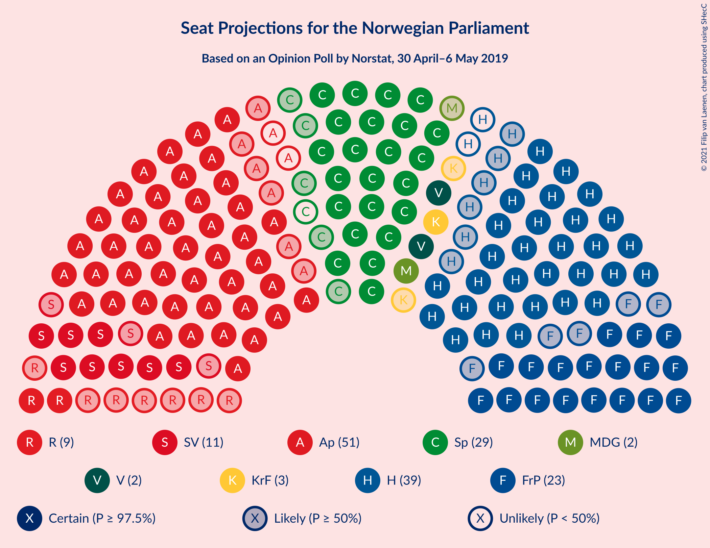
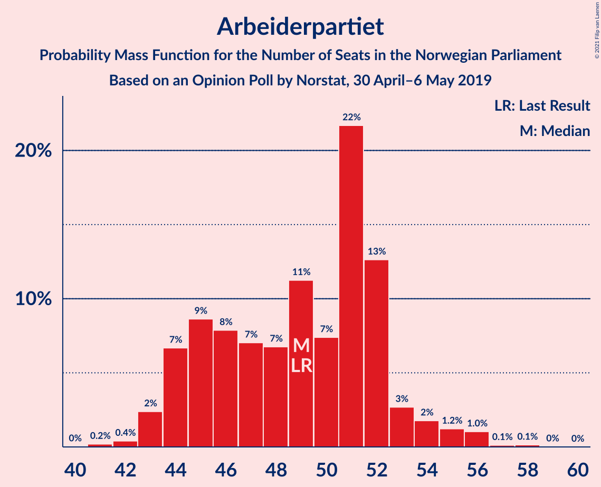
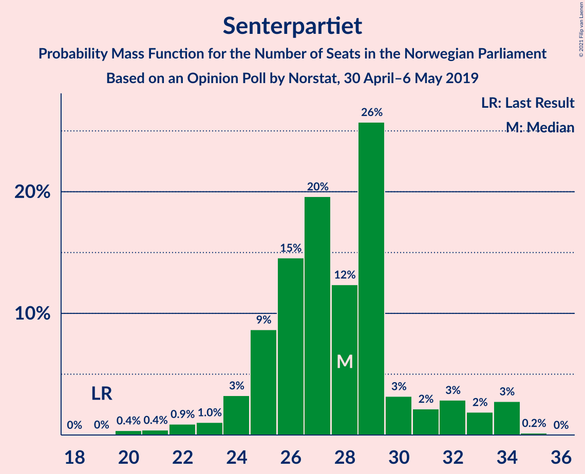
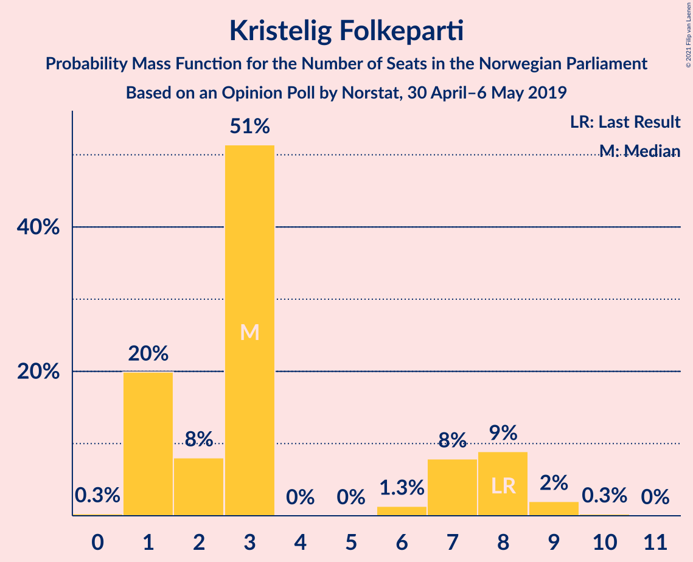
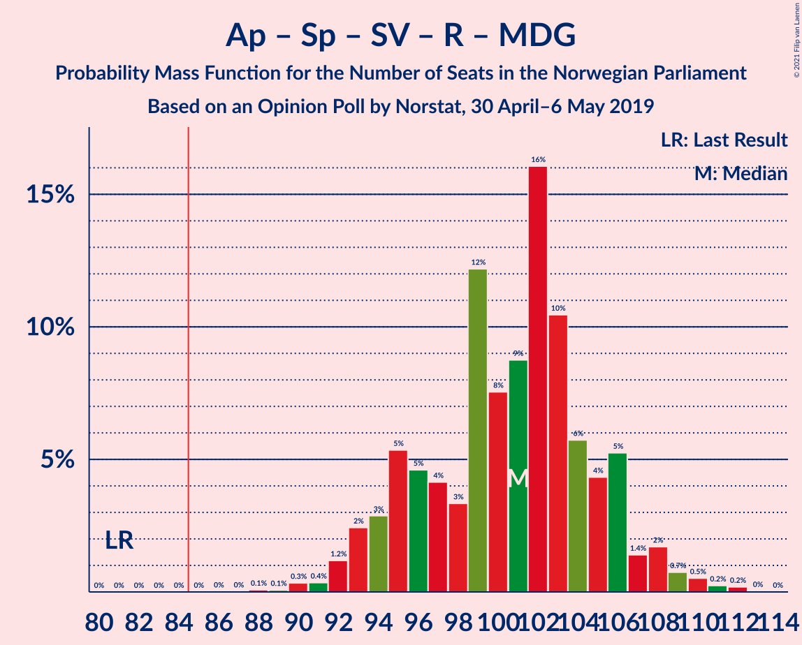
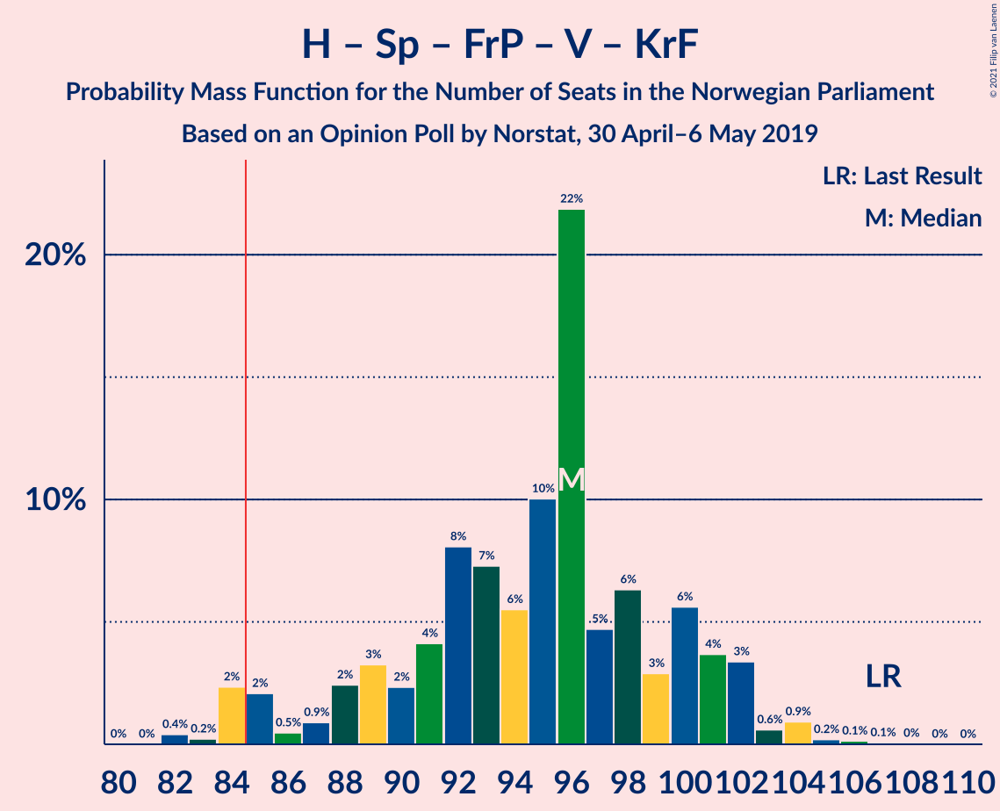
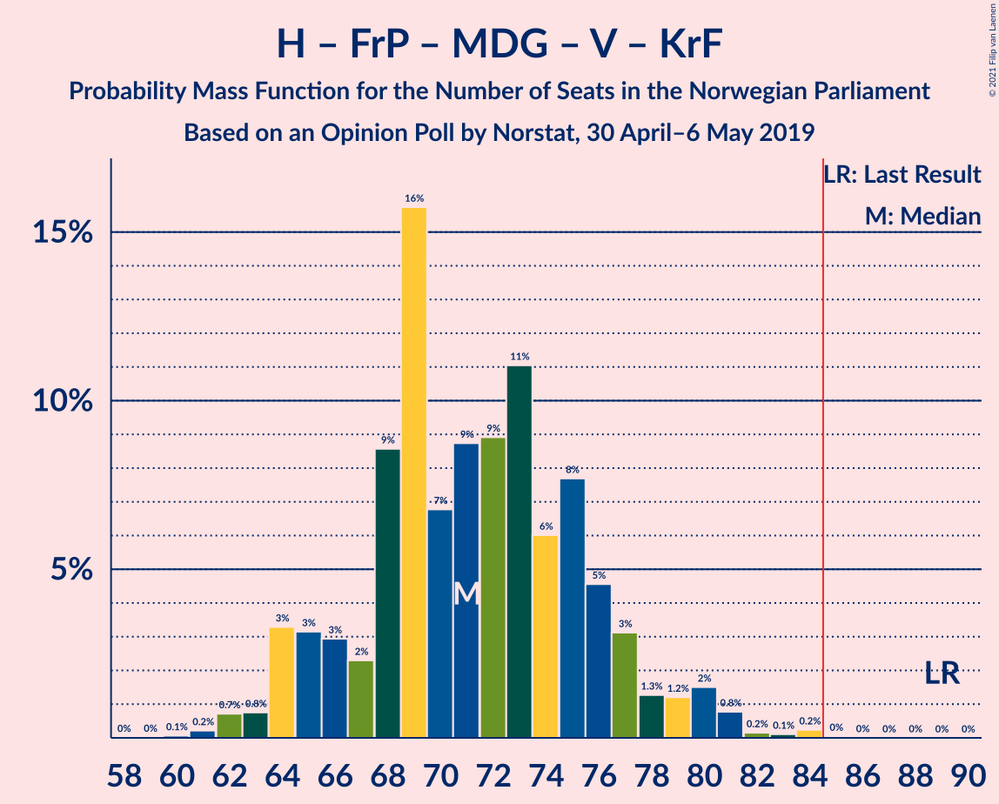
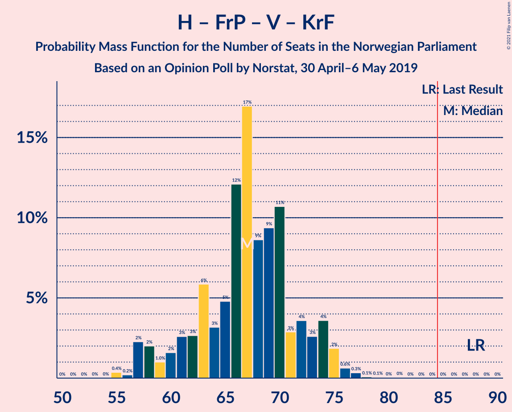

# Opinion Poll by Norstat, 30 April–6 May 2019

<a href="#voting-intentions">Voting Intentions</a> | <a href="#seats">Seats</a> | <a href="#coalitions">Coalitions</a> | <a href="#technical-information">Technical Information</a>

## Voting Intentions

### Confidence Intervals

| Party | Last Result | Poll Result | 80% Confidence Interval | 90% Confidence Interval | 95% Confidence Interval | 99% Confidence Interval |
|:-----:|:-----------:|:-----------:|:-----------------------:|:-----------------------:|:-----------------------:|:-----------------------:|
| Arbeiderpartiet | 27.4% | 26.5% | 24.8–28.3% |24.3–28.9% |23.9–29.3% |23.0–30.2% |
| Høyre | 25.0% | 20.2% | 18.6–21.9% |18.2–22.4% |17.8–22.8% |17.1–23.6% |
| Senterpartiet | 10.3% | 15.0% | 13.6–16.5% |13.2–17.0% |12.9–17.4% |12.3–18.1% |
| Fremskrittspartiet | 15.2% | 12.6% | 11.3–14.0% |11.0–14.4% |10.7–14.8% |10.1–15.5% |
| Sosialistisk Venstreparti | 6.0% | 6.2% | 5.3–7.3% |5.1–7.6% |4.9–7.9% |4.5–8.4% |
| Rødt | 2.4% | 5.0% | 4.2–6.0% |4.0–6.3% |3.8–6.5% |3.5–7.1% |
| Miljøpartiet De Grønne | 3.2% | 3.9% | 3.2–4.8% |3.0–5.1% |2.9–5.3% |2.6–5.8% |
| Venstre | 4.4% | 3.7% | 3.0–4.6% |2.9–4.8% |2.7–5.1% |2.4–5.5% |
| Kristelig Folkeparti | 4.2% | 3.5% | 2.9–4.4% |2.7–4.6% |2.5–4.8% |2.2–5.3% |

*Note:* The poll result column reflects the actual value used in the calculations. Published results may vary slightly, and in addition be rounded to fewer digits.

## Seats

### Confidence Intervals

| Party | Last Result | Median | 80% Confidence Interval | 90% Confidence Interval | 95% Confidence Interval | 99% Confidence Interval |
|:-----:|:-----------:|:------:|:-----------------------:|:-----------------------:|:-----------------------:|:-----------------------:|
| <a href="#arbeiderpartiet">Arbeiderpartiet</a> | 49 | 51 | 44–54 |44–54 |44–55 |42–58 |
| <a href="#høyre">Høyre</a> | 45 | 35 | 33–40 |32–41 |32–42 |30–43 |
| <a href="#senterpartiet">Senterpartiet</a> | 19 | 28 | 25–30 |24–32 |23–34 |21–34 |
| <a href="#fremskrittspartiet">Fremskrittspartiet</a> | 27 | 23 | 20–26 |20–27 |19–27 |17–28 |
| <a href="#sosialistisk-venstreparti">Sosialistisk Venstreparti</a> | 11 | 11 | 9–13 |8–14 |8–14 |8–15 |
| <a href="#rødt">Rødt</a> | 1 | 9 | 8–10 |2–12 |2–12 |2–13 |
| <a href="#miljøpartiet-de-grønne">Miljøpartiet De Grønne</a> | 1 | 2 | 2–8 |1–8 |1–9 |1–10 |
| <a href="#venstre">Venstre</a> | 8 | 2 | 2–8 |2–8 |2–9 |2–10 |
| <a href="#kristelig-folkeparti">Kristelig Folkeparti</a> | 8 | 3 | 1–8 |1–8 |1–9 |1–9 |

### Arbeiderpartiet

*For a full overview of the results for this party, see the [Arbeiderpartiet](party-arbeiderpartiet.html) page.*

| Number of Seats | Probability | Accumulated | Special Marks |
|:---------------:|:-----------:|:-----------:|:-------------:|
| 41 | 0.1% | 100% |  |
| 42 | 1.1% | 99.9% |  |
| 43 | 0.5% | 98.8% |  |
| 44 | 13% | 98% |  |
| 45 | 8% | 85% |  |
| 46 | 6% | 77% |  |
| 47 | 6% | 71% |  |
| 48 | 6% | 65% |  |
| 49 | 6% | 59% | Last Result |
| 50 | 3% | 53% |  |
| 51 | 29% | 51% | Median |
| 52 | 4% | 22% |  |
| 53 | 3% | 17% |  |
| 54 | 10% | 14% |  |
| 55 | 3% | 4% |  |
| 56 | 0.6% | 1.4% |  |
| 57 | 0.2% | 0.8% |  |
| 58 | 0.5% | 0.7% |  |
| 59 | 0.2% | 0.2% |  |
| 60 | 0% | 0% |  |

### Høyre

*For a full overview of the results for this party, see the [Høyre](party-høyre.html) page.*

| Number of Seats | Probability | Accumulated | Special Marks |
|:---------------:|:-----------:|:-----------:|:-------------:|
| 28 | 0.1% | 100% |  |
| 29 | 0.2% | 99.9% |  |
| 30 | 1.0% | 99.7% |  |
| 31 | 0.8% | 98.7% |  |
| 32 | 4% | 98% |  |
| 33 | 27% | 94% |  |
| 34 | 3% | 67% |  |
| 35 | 16% | 64% | Median |
| 36 | 8% | 48% |  |
| 37 | 9% | 40% |  |
| 38 | 7% | 31% |  |
| 39 | 8% | 23% |  |
| 40 | 9% | 15% |  |
| 41 | 3% | 6% |  |
| 42 | 2% | 3% |  |
| 43 | 0.3% | 0.5% |  |
| 44 | 0.1% | 0.2% |  |
| 45 | 0.1% | 0.1% | Last Result |
| 46 | 0% | 0% |  |

### Senterpartiet

*For a full overview of the results for this party, see the [Senterpartiet](party-senterpartiet.html) page.*

| Number of Seats | Probability | Accumulated | Special Marks |
|:---------------:|:-----------:|:-----------:|:-------------:|
| 19 | 0% | 100% | Last Result |
| 20 | 0.1% | 100% |  |
| 21 | 0.8% | 99.9% |  |
| 22 | 0.2% | 99.1% |  |
| 23 | 3% | 98.8% |  |
| 24 | 3% | 96% |  |
| 25 | 13% | 93% |  |
| 26 | 8% | 79% |  |
| 27 | 19% | 71% |  |
| 28 | 27% | 53% | Median |
| 29 | 11% | 26% |  |
| 30 | 7% | 15% |  |
| 31 | 3% | 9% |  |
| 32 | 1.0% | 6% |  |
| 33 | 0.5% | 5% |  |
| 34 | 4% | 4% |  |
| 35 | 0.1% | 0.1% |  |
| 36 | 0% | 0% |  |

### Fremskrittspartiet

*For a full overview of the results for this party, see the [Fremskrittspartiet](party-fremskrittspartiet.html) page.*

| Number of Seats | Probability | Accumulated | Special Marks |
|:---------------:|:-----------:|:-----------:|:-------------:|
| 16 | 0.1% | 100% |  |
| 17 | 0.6% | 99.8% |  |
| 18 | 1.1% | 99.2% |  |
| 19 | 1.4% | 98% |  |
| 20 | 12% | 97% |  |
| 21 | 7% | 85% |  |
| 22 | 17% | 78% |  |
| 23 | 12% | 61% | Median |
| 24 | 29% | 49% |  |
| 25 | 7% | 20% |  |
| 26 | 7% | 13% |  |
| 27 | 5% | 6% | Last Result |
| 28 | 1.1% | 1.3% |  |
| 29 | 0.1% | 0.2% |  |
| 30 | 0.1% | 0.1% |  |
| 31 | 0% | 0% |  |

### Sosialistisk Venstreparti

*For a full overview of the results for this party, see the [Sosialistisk Venstreparti](party-sosialistiskvenstreparti.html) page.*

| Number of Seats | Probability | Accumulated | Special Marks |
|:---------------:|:-----------:|:-----------:|:-------------:|
| 6 | 0% | 100% |  |
| 7 | 0.4% | 99.9% |  |
| 8 | 6% | 99.5% |  |
| 9 | 6% | 93% |  |
| 10 | 13% | 88% |  |
| 11 | 36% | 74% | Last Result, Median |
| 12 | 24% | 39% |  |
| 13 | 8% | 14% |  |
| 14 | 5% | 6% |  |
| 15 | 1.2% | 1.4% |  |
| 16 | 0.2% | 0.2% |  |
| 17 | 0% | 0% |  |

### Rødt

*For a full overview of the results for this party, see the [Rødt](party-rødt.html) page.*

| Number of Seats | Probability | Accumulated | Special Marks |
|:---------------:|:-----------:|:-----------:|:-------------:|
| 1 | 0% | 100% | Last Result |
| 2 | 6% | 100% |  |
| 3 | 0% | 94% |  |
| 4 | 0% | 94% |  |
| 5 | 0.1% | 94% |  |
| 6 | 0.4% | 94% |  |
| 7 | 3% | 93% |  |
| 8 | 23% | 91% |  |
| 9 | 46% | 68% | Median |
| 10 | 13% | 22% |  |
| 11 | 4% | 9% |  |
| 12 | 5% | 6% |  |
| 13 | 0.6% | 0.7% |  |
| 14 | 0.1% | 0.1% |  |
| 15 | 0% | 0% |  |

### Miljøpartiet De Grønne

*For a full overview of the results for this party, see the [Miljøpartiet De Grønne](party-miljøpartietdegrønne.html) page.*

| Number of Seats | Probability | Accumulated | Special Marks |
|:---------------:|:-----------:|:-----------:|:-------------:|
| 1 | 5% | 100% | Last Result |
| 2 | 51% | 95% | Median |
| 3 | 10% | 44% |  |
| 4 | 1.1% | 34% |  |
| 5 | 0% | 33% |  |
| 6 | 0.5% | 33% |  |
| 7 | 14% | 33% |  |
| 8 | 14% | 19% |  |
| 9 | 3% | 5% |  |
| 10 | 2% | 2% |  |
| 11 | 0.1% | 0.1% |  |
| 12 | 0% | 0% |  |

### Venstre

*For a full overview of the results for this party, see the [Venstre](party-venstre.html) page.*

| Number of Seats | Probability | Accumulated | Special Marks |
|:---------------:|:-----------:|:-----------:|:-------------:|
| 1 | 0.2% | 100% |  |
| 2 | 51% | 99.8% | Median |
| 3 | 5% | 49% |  |
| 4 | 0.9% | 44% |  |
| 5 | 0% | 43% |  |
| 6 | 0.6% | 43% |  |
| 7 | 13% | 42% |  |
| 8 | 26% | 30% | Last Result |
| 9 | 3% | 3% |  |
| 10 | 0.4% | 0.6% |  |
| 11 | 0.1% | 0.1% |  |
| 12 | 0% | 0% |  |

### Kristelig Folkeparti

*For a full overview of the results for this party, see the [Kristelig Folkeparti](party-kristeligfolkeparti.html) page.*

| Number of Seats | Probability | Accumulated | Special Marks |
|:---------------:|:-----------:|:-----------:|:-------------:|
| 0 | 0.3% | 100% |  |
| 1 | 17% | 99.7% |  |
| 2 | 8% | 82% |  |
| 3 | 48% | 74% | Median |
| 4 | 0% | 26% |  |
| 5 | 0% | 26% |  |
| 6 | 0.6% | 26% |  |
| 7 | 7% | 25% |  |
| 8 | 13% | 18% | Last Result |
| 9 | 5% | 5% |  |
| 10 | 0.1% | 0.2% |  |
| 11 | 0% | 0.1% |  |
| 12 | 0% | 0% |  |

## Coalitions

### Confidence Intervals

| Coalition | Last Result | Median | Majority? | 80% Confidence Interval | 90% Confidence Interval | 95% Confidence Interval | 99% Confidence Interval |
|:---------:|:-----------:|:------:|:---------:|:-----------------------:|:-----------------------:|:-----------------------:|:-----------------------:|
| Arbeiderpartiet – Senterpartiet – Sosialistisk Venstreparti – Rødt – Miljøpartiet De Grønne | 81 | 101 | 100% | 97–105 | 95–106 | 94–107 | 91–110 |
| Arbeiderpartiet – Senterpartiet – Sosialistisk Venstreparti – Rødt | 80 | 97 | 99.9% | 92–100 | 89–101 | 89–104 | 87–108 |
| Høyre – Senterpartiet – Fremskrittspartiet – Venstre – Kristelig Folkeparti | 107 | 96 | 99.1% | 88–101 | 86–101 | 85–103 | 83–106 |
| Arbeiderpartiet – Senterpartiet – Sosialistisk Venstreparti – Miljøpartiet De Grønne – Kristelig Folkeparti | 88 | 95 | 99.7% | 91–101 | 90–101 | 88–102 | 86–105 |
| Arbeiderpartiet – Senterpartiet – Sosialistisk Venstreparti – Miljøpartiet De Grønne | 80 | 92 | 98.8% | 89–96 | 85–98 | 85–98 | 83–100 |
| Arbeiderpartiet – Senterpartiet – Sosialistisk Venstreparti | 79 | 89 | 78% | 83–91 | 81–94 | 81–95 | 79–98 |
| Arbeiderpartiet – Senterpartiet – Miljøpartiet De Grønne – Kristelig Folkeparti | 77 | 84 | 48% | 79–89 | 77–89 | 76–91 | 73–94 |
| Arbeiderpartiet – Senterpartiet – Kristelig Folkeparti | 76 | 81 | 17% | 76–87 | 73–87 | 72–87 | 71–90 |
| Arbeiderpartiet – Senterpartiet | 68 | 78 | 1.2% | 73–80 | 71–82 | 69–83 | 68–86 |
| Høyre – Fremskrittspartiet – Miljøpartiet De Grønne – Venstre – Kristelig Folkeparti | 89 | 70 | 0% | 65–77 | 65–80 | 64–80 | 61–82 |
| Høyre – Fremskrittspartiet – Venstre – Kristelig Folkeparti | 88 | 68 | 0% | 62–72 | 58–73 | 58–75 | 57–75 |
| Høyre – Fremskrittspartiet – Venstre | 80 | 65 | 0% | 59–68 | 57–68 | 55–70 | 54–73 |
| Arbeiderpartiet – Sosialistisk Venstreparti | 60 | 62 | 0% | 56–66 | 52–66 | 52–66 | 52–69 |
| Høyre – Fremskrittspartiet | 72 | 57 | 0% | 55–65 | 54–66 | 52–66 | 50–66 |
| Høyre – Venstre – Kristelig Folkeparti | 61 | 44 | 0% | 39–49 | 37–50 | 36–52 | 36–54 |
| Senterpartiet – Venstre – Kristelig Folkeparti | 35 | 36 | 0% | 30–40 | 28–43 | 27–43 | 26–47 |

### Arbeiderpartiet – Senterpartiet – Sosialistisk Venstreparti – Rødt – Miljøpartiet De Grønne

| Number of Seats | Probability | Accumulated | Special Marks |
|:---------------:|:-----------:|:-----------:|:-------------:|
| 81 | 0% | 100% | Last Result |
| 82 | 0% | 100% |  |
| 83 | 0% | 100% |  |
| 84 | 0% | 100% |  |
| 85 | 0% | 100% | Majority |
| 86 | 0% | 100% |  |
| 87 | 0% | 100% |  |
| 88 | 0% | 100% |  |
| 89 | 0.1% | 99.9% |  |
| 90 | 0.3% | 99.9% |  |
| 91 | 0.1% | 99.5% |  |
| 92 | 0.2% | 99.4% |  |
| 93 | 0.9% | 99.2% |  |
| 94 | 3% | 98% |  |
| 95 | 4% | 95% |  |
| 96 | 0.6% | 91% |  |
| 97 | 7% | 91% |  |
| 98 | 9% | 84% |  |
| 99 | 11% | 75% |  |
| 100 | 5% | 64% |  |
| 101 | 24% | 59% | Median |
| 102 | 15% | 35% |  |
| 103 | 6% | 20% |  |
| 104 | 5% | 15% |  |
| 105 | 3% | 10% |  |
| 106 | 4% | 7% |  |
| 107 | 1.1% | 3% |  |
| 108 | 0.8% | 2% |  |
| 109 | 0.8% | 2% |  |
| 110 | 0.7% | 0.8% |  |
| 111 | 0.1% | 0.1% |  |
| 112 | 0% | 0.1% |  |
| 113 | 0% | 0% |  |

### Arbeiderpartiet – Senterpartiet – Sosialistisk Venstreparti – Rødt

| Number of Seats | Probability | Accumulated | Special Marks |
|:---------------:|:-----------:|:-----------:|:-------------:|
| 80 | 0% | 100% | Last Result |
| 81 | 0% | 100% |  |
| 82 | 0% | 100% |  |
| 83 | 0% | 100% |  |
| 84 | 0% | 99.9% |  |
| 85 | 0.1% | 99.9% | Majority |
| 86 | 0.2% | 99.8% |  |
| 87 | 0.4% | 99.6% |  |
| 88 | 0.4% | 99.1% |  |
| 89 | 6% | 98.7% |  |
| 90 | 2% | 93% |  |
| 91 | 0.9% | 91% |  |
| 92 | 7% | 91% |  |
| 93 | 9% | 83% |  |
| 94 | 3% | 75% |  |
| 95 | 4% | 72% |  |
| 96 | 15% | 68% |  |
| 97 | 7% | 53% |  |
| 98 | 4% | 46% |  |
| 99 | 25% | 42% | Median |
| 100 | 10% | 17% |  |
| 101 | 2% | 7% |  |
| 102 | 0.6% | 5% |  |
| 103 | 0.3% | 4% |  |
| 104 | 2% | 4% |  |
| 105 | 0.5% | 2% |  |
| 106 | 0.4% | 1.1% |  |
| 107 | 0% | 0.7% |  |
| 108 | 0.6% | 0.6% |  |
| 109 | 0% | 0% |  |

### Høyre – Senterpartiet – Fremskrittspartiet – Venstre – Kristelig Folkeparti

| Number of Seats | Probability | Accumulated | Special Marks |
|:---------------:|:-----------:|:-----------:|:-------------:|
| 82 | 0.2% | 100% |  |
| 83 | 0.5% | 99.8% |  |
| 84 | 0.2% | 99.2% |  |
| 85 | 4% | 99.1% | Majority |
| 86 | 0.5% | 95% |  |
| 87 | 0.5% | 95% |  |
| 88 | 4% | 94% |  |
| 89 | 1.3% | 90% |  |
| 90 | 1.4% | 89% |  |
| 91 | 7% | 87% | Median |
| 92 | 14% | 80% |  |
| 93 | 6% | 67% |  |
| 94 | 2% | 61% |  |
| 95 | 4% | 58% |  |
| 96 | 23% | 54% |  |
| 97 | 6% | 31% |  |
| 98 | 5% | 24% |  |
| 99 | 0.7% | 20% |  |
| 100 | 8% | 19% |  |
| 101 | 7% | 11% |  |
| 102 | 2% | 5% |  |
| 103 | 1.3% | 3% |  |
| 104 | 0.4% | 2% |  |
| 105 | 0.1% | 1.1% |  |
| 106 | 0.9% | 1.0% |  |
| 107 | 0% | 0.1% | Last Result |
| 108 | 0% | 0% |  |

### Arbeiderpartiet – Senterpartiet – Sosialistisk Venstreparti – Miljøpartiet De Grønne – Kristelig Folkeparti

| Number of Seats | Probability | Accumulated | Special Marks |
|:---------------:|:-----------:|:-----------:|:-------------:|
| 82 | 0% | 100% |  |
| 83 | 0% | 99.9% |  |
| 84 | 0.2% | 99.9% |  |
| 85 | 0% | 99.7% | Majority |
| 86 | 1.1% | 99.7% |  |
| 87 | 0.7% | 98.5% |  |
| 88 | 3% | 98% | Last Result |
| 89 | 0.1% | 95% |  |
| 90 | 0.9% | 95% |  |
| 91 | 8% | 94% |  |
| 92 | 3% | 86% |  |
| 93 | 6% | 82% |  |
| 94 | 5% | 76% |  |
| 95 | 24% | 71% | Median |
| 96 | 8% | 47% |  |
| 97 | 13% | 38% |  |
| 98 | 1.3% | 26% |  |
| 99 | 7% | 25% |  |
| 100 | 4% | 18% |  |
| 101 | 11% | 14% |  |
| 102 | 0.4% | 3% |  |
| 103 | 1.0% | 2% |  |
| 104 | 0.8% | 1.3% |  |
| 105 | 0.4% | 0.5% |  |
| 106 | 0.1% | 0.2% |  |
| 107 | 0% | 0.1% |  |
| 108 | 0% | 0.1% |  |
| 109 | 0% | 0% |  |

### Arbeiderpartiet – Senterpartiet – Sosialistisk Venstreparti – Miljøpartiet De Grønne

| Number of Seats | Probability | Accumulated | Special Marks |
|:---------------:|:-----------:|:-----------:|:-------------:|
| 79 | 0.1% | 100% |  |
| 80 | 0% | 99.9% | Last Result |
| 81 | 0.3% | 99.9% |  |
| 82 | 0.1% | 99.6% |  |
| 83 | 0.2% | 99.5% |  |
| 84 | 0.6% | 99.4% |  |
| 85 | 5% | 98.8% | Majority |
| 86 | 0.6% | 94% |  |
| 87 | 0.8% | 93% |  |
| 88 | 2% | 92% |  |
| 89 | 13% | 90% |  |
| 90 | 11% | 77% |  |
| 91 | 4% | 67% |  |
| 92 | 24% | 62% | Median |
| 93 | 13% | 38% |  |
| 94 | 8% | 25% |  |
| 95 | 1.0% | 17% |  |
| 96 | 8% | 16% |  |
| 97 | 3% | 8% |  |
| 98 | 3% | 5% |  |
| 99 | 1.0% | 2% |  |
| 100 | 0.9% | 1.4% |  |
| 101 | 0.1% | 0.5% |  |
| 102 | 0.1% | 0.4% |  |
| 103 | 0.1% | 0.3% |  |
| 104 | 0.2% | 0.2% |  |
| 105 | 0% | 0% |  |

### Arbeiderpartiet – Senterpartiet – Sosialistisk Venstreparti

| Number of Seats | Probability | Accumulated | Special Marks |
|:---------------:|:-----------:|:-----------:|:-------------:|
| 74 | 0% | 100% |  |
| 75 | 0% | 99.9% |  |
| 76 | 0.1% | 99.9% |  |
| 77 | 0.2% | 99.8% |  |
| 78 | 0.1% | 99.7% |  |
| 79 | 0.8% | 99.6% | Last Result |
| 80 | 0.2% | 98.8% |  |
| 81 | 5% | 98.6% |  |
| 82 | 3% | 94% |  |
| 83 | 8% | 90% |  |
| 84 | 3% | 82% |  |
| 85 | 4% | 78% | Majority |
| 86 | 9% | 74% |  |
| 87 | 5% | 65% |  |
| 88 | 7% | 60% |  |
| 89 | 9% | 53% |  |
| 90 | 25% | 45% | Median |
| 91 | 10% | 20% |  |
| 92 | 2% | 10% |  |
| 93 | 2% | 8% |  |
| 94 | 3% | 6% |  |
| 95 | 1.2% | 3% |  |
| 96 | 0.9% | 2% |  |
| 97 | 0.1% | 0.8% |  |
| 98 | 0.3% | 0.7% |  |
| 99 | 0.2% | 0.4% |  |
| 100 | 0.2% | 0.2% |  |
| 101 | 0% | 0% |  |

### Arbeiderpartiet – Senterpartiet – Miljøpartiet De Grønne – Kristelig Folkeparti

| Number of Seats | Probability | Accumulated | Special Marks |
|:---------------:|:-----------:|:-----------:|:-------------:|
| 72 | 0.1% | 100% |  |
| 73 | 0.9% | 99.9% |  |
| 74 | 0.2% | 99.0% |  |
| 75 | 0.1% | 98.8% |  |
| 76 | 2% | 98.7% |  |
| 77 | 2% | 97% | Last Result |
| 78 | 1.0% | 95% |  |
| 79 | 7% | 94% |  |
| 80 | 6% | 87% |  |
| 81 | 4% | 81% |  |
| 82 | 2% | 77% |  |
| 83 | 3% | 75% |  |
| 84 | 25% | 72% | Median |
| 85 | 4% | 48% | Majority |
| 86 | 11% | 44% |  |
| 87 | 7% | 33% |  |
| 88 | 9% | 26% |  |
| 89 | 13% | 17% |  |
| 90 | 0.6% | 3% |  |
| 91 | 0.6% | 3% |  |
| 92 | 0.6% | 2% |  |
| 93 | 0.4% | 2% |  |
| 94 | 0.8% | 1.2% |  |
| 95 | 0.3% | 0.5% |  |
| 96 | 0% | 0.1% |  |
| 97 | 0.1% | 0.1% |  |
| 98 | 0% | 0.1% |  |
| 99 | 0% | 0% |  |

### Arbeiderpartiet – Senterpartiet – Kristelig Folkeparti

| Number of Seats | Probability | Accumulated | Special Marks |
|:---------------:|:-----------:|:-----------:|:-------------:|
| 69 | 0.1% | 100% |  |
| 70 | 0.2% | 99.9% |  |
| 71 | 0.8% | 99.7% |  |
| 72 | 2% | 98.9% |  |
| 73 | 2% | 97% |  |
| 74 | 3% | 95% |  |
| 75 | 1.3% | 92% |  |
| 76 | 6% | 91% | Last Result |
| 77 | 9% | 85% |  |
| 78 | 9% | 76% |  |
| 79 | 6% | 67% |  |
| 80 | 7% | 62% |  |
| 81 | 5% | 55% |  |
| 82 | 26% | 49% | Median |
| 83 | 3% | 23% |  |
| 84 | 2% | 19% |  |
| 85 | 4% | 17% | Majority |
| 86 | 2% | 13% |  |
| 87 | 10% | 11% |  |
| 88 | 0.2% | 1.4% |  |
| 89 | 0.6% | 1.2% |  |
| 90 | 0.5% | 0.6% |  |
| 91 | 0% | 0.1% |  |
| 92 | 0% | 0.1% |  |
| 93 | 0.1% | 0.1% |  |
| 94 | 0% | 0% |  |

### Arbeiderpartiet – Senterpartiet

| Number of Seats | Probability | Accumulated | Special Marks |
|:---------------:|:-----------:|:-----------:|:-------------:|
| 65 | 0.1% | 100% |  |
| 66 | 0.1% | 99.9% |  |
| 67 | 0.2% | 99.9% |  |
| 68 | 0.8% | 99.6% | Last Result |
| 69 | 1.5% | 98.8% |  |
| 70 | 1.1% | 97% |  |
| 71 | 4% | 96% |  |
| 72 | 1.1% | 92% |  |
| 73 | 11% | 91% |  |
| 74 | 6% | 80% |  |
| 75 | 19% | 74% |  |
| 76 | 2% | 56% |  |
| 77 | 2% | 54% |  |
| 78 | 7% | 51% |  |
| 79 | 31% | 44% | Median |
| 80 | 3% | 12% |  |
| 81 | 0.8% | 9% |  |
| 82 | 4% | 8% |  |
| 83 | 3% | 4% |  |
| 84 | 0.1% | 1.3% |  |
| 85 | 0.5% | 1.2% | Majority |
| 86 | 0.5% | 0.7% |  |
| 87 | 0% | 0.2% |  |
| 88 | 0% | 0.2% |  |
| 89 | 0.1% | 0.2% |  |
| 90 | 0% | 0% |  |

### Høyre – Fremskrittspartiet – Miljøpartiet De Grønne – Venstre – Kristelig Folkeparti

| Number of Seats | Probability | Accumulated | Special Marks |
|:---------------:|:-----------:|:-----------:|:-------------:|
| 60 | 0.1% | 100% |  |
| 61 | 0.7% | 99.9% |  |
| 62 | 0.1% | 99.2% |  |
| 63 | 0.8% | 99.2% |  |
| 64 | 3% | 98% |  |
| 65 | 8% | 95% | Median |
| 66 | 0.9% | 87% |  |
| 67 | 1.1% | 86% |  |
| 68 | 3% | 85% |  |
| 69 | 12% | 82% |  |
| 70 | 26% | 70% |  |
| 71 | 3% | 44% |  |
| 72 | 2% | 41% |  |
| 73 | 13% | 39% |  |
| 74 | 4% | 26% |  |
| 75 | 2% | 22% |  |
| 76 | 6% | 20% |  |
| 77 | 6% | 14% |  |
| 78 | 0.3% | 8% |  |
| 79 | 1.4% | 7% |  |
| 80 | 5% | 6% |  |
| 81 | 0.1% | 0.6% |  |
| 82 | 0.3% | 0.5% |  |
| 83 | 0.1% | 0.2% |  |
| 84 | 0.1% | 0.1% |  |
| 85 | 0% | 0% | Majority |
| 86 | 0% | 0% |  |
| 87 | 0% | 0% |  |
| 88 | 0% | 0% |  |
| 89 | 0% | 0% | Last Result |

### Høyre – Fremskrittspartiet – Venstre – Kristelig Folkeparti

| Number of Seats | Probability | Accumulated | Special Marks |
|:---------------:|:-----------:|:-----------:|:-------------:|
| 56 | 0% | 100% |  |
| 57 | 2% | 99.9% |  |
| 58 | 4% | 98% |  |
| 59 | 0.9% | 94% |  |
| 60 | 1.3% | 93% |  |
| 61 | 1.4% | 92% |  |
| 62 | 5% | 90% |  |
| 63 | 4% | 86% | Median |
| 64 | 2% | 82% |  |
| 65 | 1.3% | 80% |  |
| 66 | 5% | 79% |  |
| 67 | 17% | 73% |  |
| 68 | 24% | 57% |  |
| 69 | 4% | 33% |  |
| 70 | 8% | 28% |  |
| 71 | 9% | 20% |  |
| 72 | 6% | 11% |  |
| 73 | 0.3% | 5% |  |
| 74 | 2% | 5% |  |
| 75 | 3% | 3% |  |
| 76 | 0.1% | 0.4% |  |
| 77 | 0.1% | 0.2% |  |
| 78 | 0.1% | 0.2% |  |
| 79 | 0% | 0.1% |  |
| 80 | 0% | 0% |  |
| 81 | 0% | 0% |  |
| 82 | 0% | 0% |  |
| 83 | 0% | 0% |  |
| 84 | 0% | 0% |  |
| 85 | 0% | 0% | Majority |
| 86 | 0% | 0% |  |
| 87 | 0% | 0% |  |
| 88 | 0% | 0% | Last Result |

### Høyre – Fremskrittspartiet – Venstre

| Number of Seats | Probability | Accumulated | Special Marks |
|:---------------:|:-----------:|:-----------:|:-------------:|
| 52 | 0.1% | 100% |  |
| 53 | 0.2% | 99.9% |  |
| 54 | 2% | 99.7% |  |
| 55 | 0.5% | 98% |  |
| 56 | 0.8% | 97% |  |
| 57 | 5% | 97% |  |
| 58 | 2% | 92% |  |
| 59 | 14% | 90% |  |
| 60 | 1.2% | 76% | Median |
| 61 | 5% | 75% |  |
| 62 | 4% | 70% |  |
| 63 | 7% | 66% |  |
| 64 | 5% | 59% |  |
| 65 | 28% | 54% |  |
| 66 | 8% | 26% |  |
| 67 | 3% | 18% |  |
| 68 | 12% | 15% |  |
| 69 | 0.6% | 4% |  |
| 70 | 0.8% | 3% |  |
| 71 | 0.7% | 2% |  |
| 72 | 0.3% | 2% |  |
| 73 | 1.3% | 1.4% |  |
| 74 | 0% | 0.1% |  |
| 75 | 0% | 0.1% |  |
| 76 | 0% | 0.1% |  |
| 77 | 0% | 0% |  |
| 78 | 0% | 0% |  |
| 79 | 0% | 0% |  |
| 80 | 0% | 0% | Last Result |

### Arbeiderpartiet – Sosialistisk Venstreparti

| Number of Seats | Probability | Accumulated | Special Marks |
|:---------------:|:-----------:|:-----------:|:-------------:|
| 50 | 0% | 100% |  |
| 51 | 0.2% | 99.9% |  |
| 52 | 5% | 99.7% |  |
| 53 | 0.8% | 95% |  |
| 54 | 3% | 94% |  |
| 55 | 1.3% | 91% |  |
| 56 | 12% | 90% |  |
| 57 | 7% | 78% |  |
| 58 | 2% | 71% |  |
| 59 | 6% | 69% |  |
| 60 | 3% | 63% | Last Result |
| 61 | 8% | 61% |  |
| 62 | 30% | 53% | Median |
| 63 | 5% | 22% |  |
| 64 | 2% | 17% |  |
| 65 | 4% | 15% |  |
| 66 | 9% | 11% |  |
| 67 | 0.7% | 2% |  |
| 68 | 0.9% | 1.4% |  |
| 69 | 0.1% | 0.5% |  |
| 70 | 0.4% | 0.4% |  |
| 71 | 0% | 0.1% |  |
| 72 | 0% | 0% |  |

### Høyre – Fremskrittspartiet

| Number of Seats | Probability | Accumulated | Special Marks |
|:---------------:|:-----------:|:-----------:|:-------------:|
| 48 | 0% | 100% |  |
| 49 | 0.2% | 99.9% |  |
| 50 | 0.3% | 99.7% |  |
| 51 | 0.5% | 99.5% |  |
| 52 | 2% | 99.0% |  |
| 53 | 2% | 97% |  |
| 54 | 0.9% | 95% |  |
| 55 | 5% | 94% |  |
| 56 | 6% | 89% |  |
| 57 | 37% | 83% |  |
| 58 | 7% | 47% | Median |
| 59 | 7% | 40% |  |
| 60 | 4% | 33% |  |
| 61 | 3% | 29% |  |
| 62 | 4% | 26% |  |
| 63 | 4% | 21% |  |
| 64 | 5% | 18% |  |
| 65 | 4% | 13% |  |
| 66 | 8% | 9% |  |
| 67 | 0.2% | 0.5% |  |
| 68 | 0.1% | 0.3% |  |
| 69 | 0% | 0.1% |  |
| 70 | 0.1% | 0.1% |  |
| 71 | 0.1% | 0.1% |  |
| 72 | 0% | 0% | Last Result |

### Høyre – Venstre – Kristelig Folkeparti

| Number of Seats | Probability | Accumulated | Special Marks |
|:---------------:|:-----------:|:-----------:|:-------------:|
| 34 | 0.1% | 100% |  |
| 35 | 0% | 99.9% |  |
| 36 | 4% | 99.9% |  |
| 37 | 3% | 96% |  |
| 38 | 2% | 93% |  |
| 39 | 2% | 91% |  |
| 40 | 2% | 90% | Median |
| 41 | 3% | 87% |  |
| 42 | 9% | 85% |  |
| 43 | 4% | 76% |  |
| 44 | 31% | 71% |  |
| 45 | 14% | 41% |  |
| 46 | 6% | 26% |  |
| 47 | 4% | 20% |  |
| 48 | 0.4% | 16% |  |
| 49 | 8% | 16% |  |
| 50 | 3% | 8% |  |
| 51 | 2% | 5% |  |
| 52 | 1.4% | 3% |  |
| 53 | 0.1% | 1.2% |  |
| 54 | 1.0% | 1.1% |  |
| 55 | 0% | 0.1% |  |
| 56 | 0% | 0% |  |
| 57 | 0% | 0% |  |
| 58 | 0% | 0% |  |
| 59 | 0% | 0% |  |
| 60 | 0% | 0% |  |
| 61 | 0% | 0% | Last Result |

### Senterpartiet – Venstre – Kristelig Folkeparti

| Number of Seats | Probability | Accumulated | Special Marks |
|:---------------:|:-----------:|:-----------:|:-------------:|
| 26 | 1.3% | 100% |  |
| 27 | 2% | 98.7% |  |
| 28 | 3% | 96% |  |
| 29 | 2% | 93% |  |
| 30 | 4% | 91% |  |
| 31 | 3% | 87% |  |
| 32 | 6% | 84% |  |
| 33 | 3% | 78% | Median |
| 34 | 7% | 75% |  |
| 35 | 14% | 68% | Last Result |
| 36 | 6% | 54% |  |
| 37 | 8% | 48% |  |
| 38 | 5% | 40% |  |
| 39 | 25% | 35% |  |
| 40 | 0.9% | 10% |  |
| 41 | 0.8% | 9% |  |
| 42 | 0.3% | 9% |  |
| 43 | 6% | 8% |  |
| 44 | 1.1% | 2% |  |
| 45 | 0.1% | 1.0% |  |
| 46 | 0.2% | 0.9% |  |
| 47 | 0.6% | 0.7% |  |
| 48 | 0% | 0.1% |  |
| 49 | 0% | 0.1% |  |
| 50 | 0% | 0% |  |

## Technical Information

### Opinion Poll

+ **Polling firm:** Norstat
+ **Commissioner(s):** —
+ **Fieldwork period:** 30 April–6 May 2019

### Calculations

+ **Sample size:** 1000
+ **Simulations done:** 131,072
+ **Error estimate:** 3.48%

