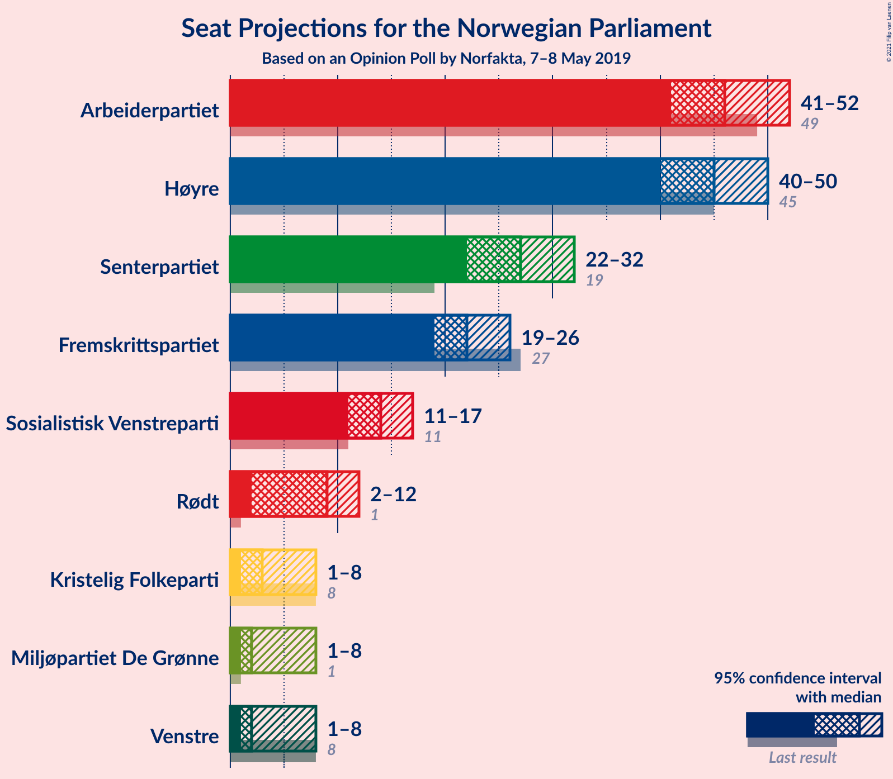
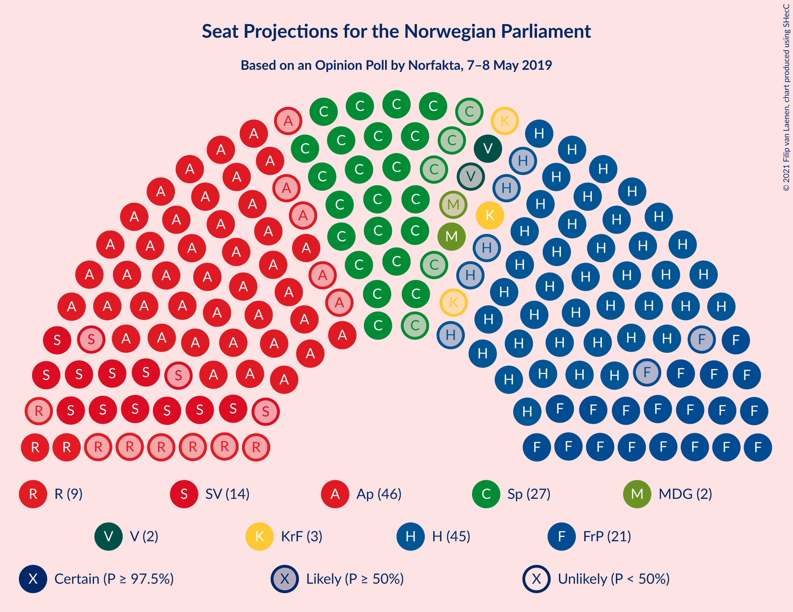
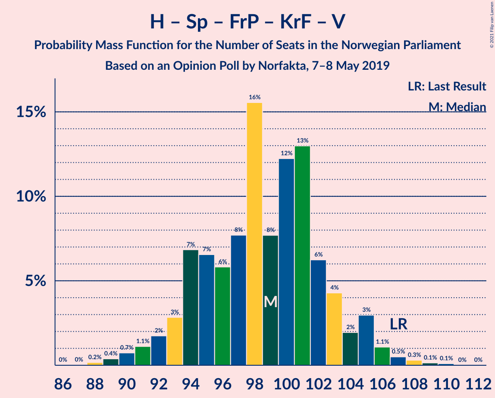
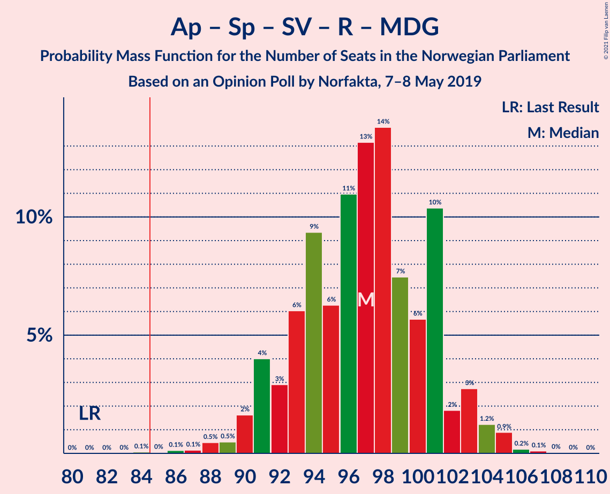
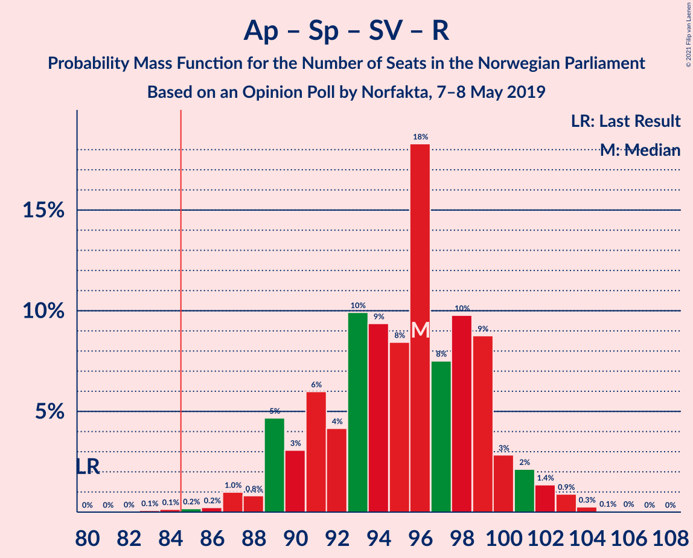
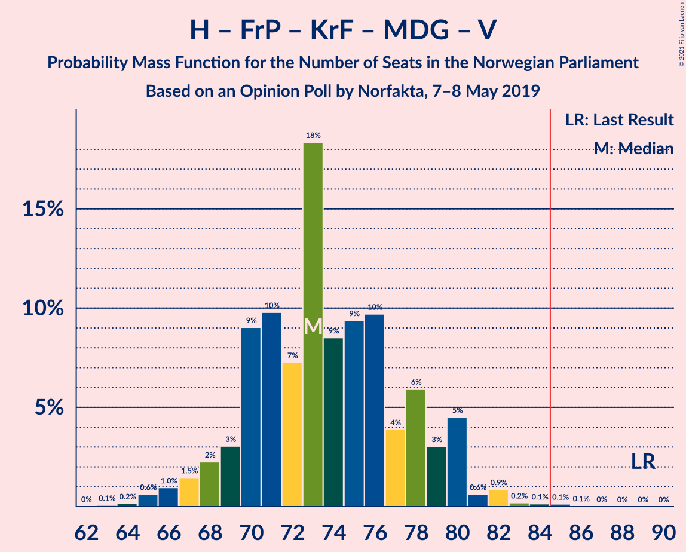
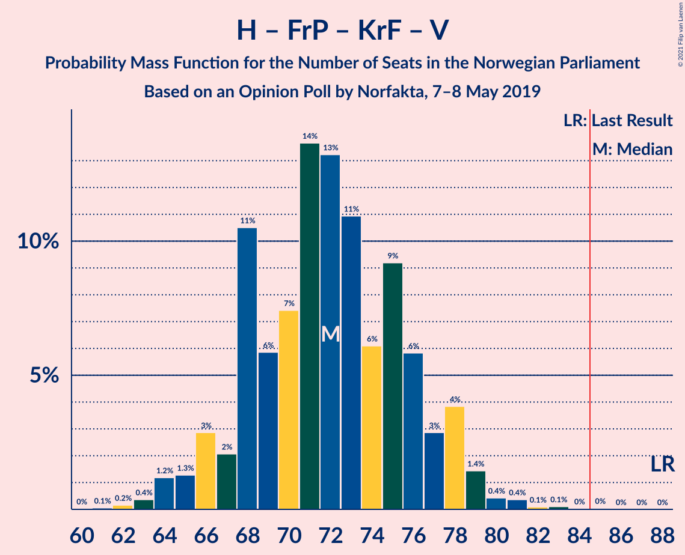
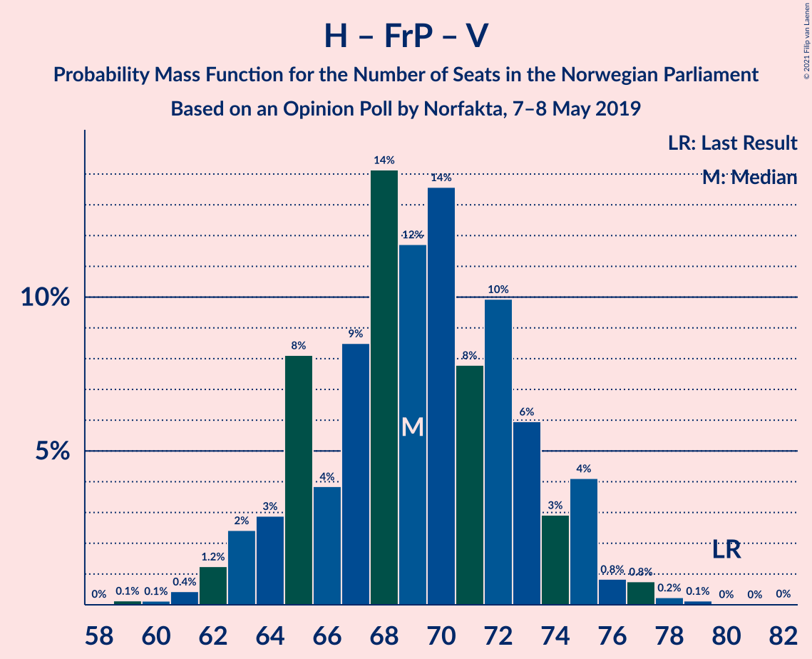
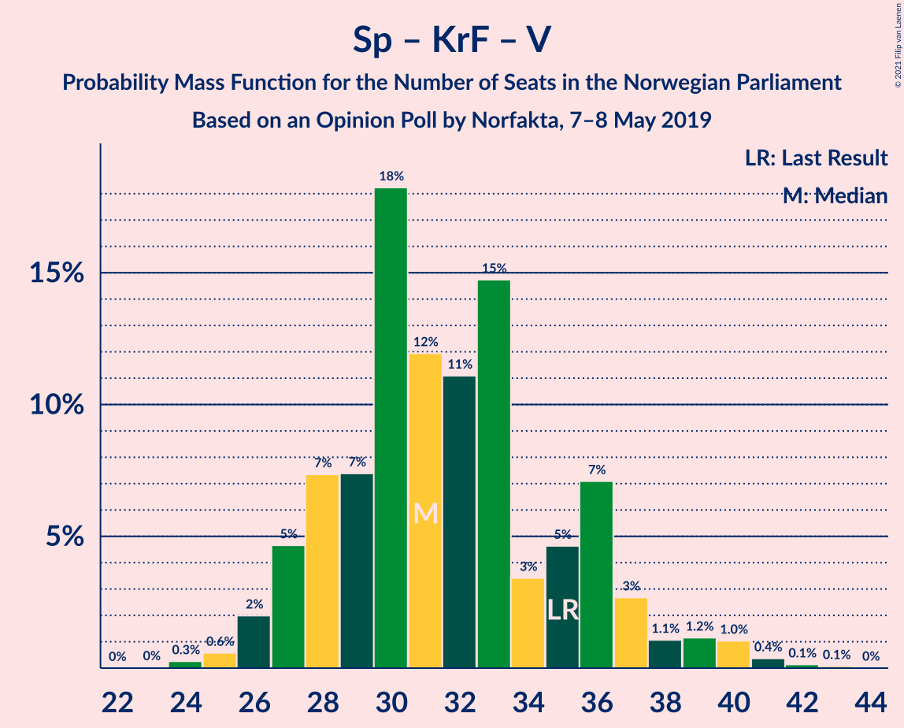

# Opinion Poll by Norfakta, 7–8 May 2019

<a href="#voting-intentions">Voting Intentions</a> | <a href="#seats">Seats</a> | <a href="#coalitions">Coalitions</a> | <a href="#technical-information">Technical Information</a>

## Voting Intentions

### Confidence Intervals

| Party | Last Result | Poll Result | 80% Confidence Interval | 90% Confidence Interval | 95% Confidence Interval | 99% Confidence Interval |
|:-----:|:-----------:|:-----------:|:-----------------------:|:-----------------------:|:-----------------------:|:-----------------------:|
| Arbeiderpartiet | 27.4% | 25.1% | 23.4–26.9% |22.9–27.5% |22.5–27.9% |21.7–28.8% |
| Høyre | 25.0% | 24.4% | 22.7–26.2% |22.3–26.7% |21.9–27.2% |21.1–28.1% |
| Senterpartiet | 10.3% | 14.4% | 13.0–15.9% |12.6–16.3% |12.3–16.7% |11.7–17.4% |
| Fremskrittspartiet | 15.2% | 11.9% | 10.6–13.3% |10.3–13.7% |10.0–14.0% |9.4–14.7% |
| Sosialistisk Venstreparti | 6.0% | 7.4% | 6.4–8.6% |6.1–8.9% |5.9–9.2% |5.5–9.8% |
| Rødt | 2.4% | 4.9% | 4.1–5.9% |3.9–6.2% |3.7–6.4% |3.4–6.9% |
| Kristelig Folkeparti | 4.2% | 3.2% | 2.6–4.0% |2.4–4.3% |2.3–4.5% |2.0–4.9% |
| Miljøpartiet De Grønne | 3.2% | 3.0% | 2.4–3.8% |2.2–4.0% |2.1–4.3% |1.8–4.7% |
| Venstre | 4.4% | 3.0% | 2.4–3.8% |2.2–4.0% |2.1–4.3% |1.8–4.7% |

*Note:* The poll result column reflects the actual value used in the calculations. Published results may vary slightly, and in addition be rounded to fewer digits.

## Seats

### Confidence Intervals

| Party | Last Result | Median | 80% Confidence Interval | 90% Confidence Interval | 95% Confidence Interval | 99% Confidence Interval |
|:-----:|:-----------:|:------:|:-----------------------:|:-----------------------:|:-----------------------:|:-----------------------:|
| <a href="#arbeiderpartiet">Arbeiderpartiet</a> | 49 | 47 | 43–51 |42–51 |41–52 |40–54 |
| <a href="#høyre">Høyre</a> | 45 | 46 | 41–48 |40–49 |40–50 |38–52 |
| <a href="#senterpartiet">Senterpartiet</a> | 19 | 27 | 23–30 |23–30 |23–31 |21–34 |
| <a href="#fremskrittspartiet">Fremskrittspartiet</a> | 27 | 22 | 20–24 |19–26 |18–26 |17–27 |
| <a href="#sosialistisk-venstreparti">Sosialistisk Venstreparti</a> | 11 | 13 | 12–15 |11–16 |11–17 |10–18 |
| <a href="#rødt">Rødt</a> | 1 | 9 | 2–10 |2–11 |2–12 |2–13 |
| <a href="#kristelig-folkeparti">Kristelig Folkeparti</a> | 8 | 3 | 1–8 |1–8 |0–8 |0–9 |
| <a href="#miljøpartiet-de-grønne">Miljøpartiet De Grønne</a> | 1 | 1 | 1–2 |1–8 |1–8 |0–9 |
| <a href="#venstre">Venstre</a> | 8 | 2 | 1–7 |1–7 |1–8 |1–8 |

### Arbeiderpartiet

*For a full overview of the results for this party, see the [Arbeiderpartiet](party-arbeiderpartiet.html) page.*

| Number of Seats | Probability | Accumulated | Special Marks |
|:---------------:|:-----------:|:-----------:|:-------------:|
| 39 | 0.1% | 100% |  |
| 40 | 0.4% | 99.8% |  |
| 41 | 3% | 99.5% |  |
| 42 | 5% | 96% |  |
| 43 | 10% | 91% |  |
| 44 | 5% | 81% |  |
| 45 | 12% | 76% |  |
| 46 | 11% | 64% |  |
| 47 | 5% | 53% | Median |
| 48 | 7% | 48% |  |
| 49 | 22% | 41% | Last Result |
| 50 | 5% | 19% |  |
| 51 | 12% | 14% |  |
| 52 | 0.9% | 3% |  |
| 53 | 0.1% | 2% |  |
| 54 | 1.2% | 2% |  |
| 55 | 0.2% | 0.3% |  |
| 56 | 0% | 0.1% |  |
| 57 | 0% | 0% |  |

### Høyre

*For a full overview of the results for this party, see the [Høyre](party-høyre.html) page.*

| Number of Seats | Probability | Accumulated | Special Marks |
|:---------------:|:-----------:|:-----------:|:-------------:|
| 37 | 0.1% | 100% |  |
| 38 | 0.7% | 99.8% |  |
| 39 | 1.3% | 99.1% |  |
| 40 | 4% | 98% |  |
| 41 | 11% | 94% |  |
| 42 | 13% | 83% |  |
| 43 | 4% | 70% |  |
| 44 | 6% | 66% |  |
| 45 | 5% | 60% | Last Result |
| 46 | 23% | 54% | Median |
| 47 | 12% | 31% |  |
| 48 | 14% | 20% |  |
| 49 | 3% | 6% |  |
| 50 | 2% | 3% |  |
| 51 | 0.6% | 1.2% |  |
| 52 | 0.4% | 0.6% |  |
| 53 | 0.2% | 0.2% |  |
| 54 | 0% | 0% |  |

### Senterpartiet

*For a full overview of the results for this party, see the [Senterpartiet](party-senterpartiet.html) page.*

| Number of Seats | Probability | Accumulated | Special Marks |
|:---------------:|:-----------:|:-----------:|:-------------:|
| 19 | 0.1% | 100% | Last Result |
| 20 | 0.1% | 99.9% |  |
| 21 | 0.4% | 99.8% |  |
| 22 | 0.9% | 99.4% |  |
| 23 | 10% | 98% |  |
| 24 | 4% | 89% |  |
| 25 | 13% | 84% |  |
| 26 | 19% | 71% |  |
| 27 | 25% | 53% | Median |
| 28 | 4% | 27% |  |
| 29 | 5% | 23% |  |
| 30 | 15% | 19% |  |
| 31 | 1.0% | 3% |  |
| 32 | 0.8% | 2% |  |
| 33 | 0.7% | 2% |  |
| 34 | 0.9% | 1.0% |  |
| 35 | 0% | 0% |  |

### Fremskrittspartiet

*For a full overview of the results for this party, see the [Fremskrittspartiet](party-fremskrittspartiet.html) page.*

| Number of Seats | Probability | Accumulated | Special Marks |
|:---------------:|:-----------:|:-----------:|:-------------:|
| 16 | 0.1% | 100% |  |
| 17 | 1.0% | 99.8% |  |
| 18 | 3% | 98.8% |  |
| 19 | 1.2% | 96% |  |
| 20 | 10% | 95% |  |
| 21 | 24% | 85% |  |
| 22 | 44% | 61% | Median |
| 23 | 4% | 17% |  |
| 24 | 3% | 13% |  |
| 25 | 4% | 9% |  |
| 26 | 3% | 5% |  |
| 27 | 2% | 2% | Last Result |
| 28 | 0% | 0.1% |  |
| 29 | 0% | 0.1% |  |
| 30 | 0% | 0.1% |  |
| 31 | 0% | 0% |  |

### Sosialistisk Venstreparti

*For a full overview of the results for this party, see the [Sosialistisk Venstreparti](party-sosialistiskvenstreparti.html) page.*

| Number of Seats | Probability | Accumulated | Special Marks |
|:---------------:|:-----------:|:-----------:|:-------------:|
| 9 | 0.3% | 100% |  |
| 10 | 2% | 99.7% |  |
| 11 | 7% | 98% | Last Result |
| 12 | 25% | 92% |  |
| 13 | 26% | 66% | Median |
| 14 | 12% | 41% |  |
| 15 | 21% | 29% |  |
| 16 | 4% | 7% |  |
| 17 | 2% | 3% |  |
| 18 | 2% | 2% |  |
| 19 | 0.1% | 0.2% |  |
| 20 | 0.1% | 0.1% |  |
| 21 | 0% | 0% |  |

### Rødt

*For a full overview of the results for this party, see the [Rødt](party-rødt.html) page.*

| Number of Seats | Probability | Accumulated | Special Marks |
|:---------------:|:-----------:|:-----------:|:-------------:|
| 1 | 0% | 100% | Last Result |
| 2 | 23% | 100% |  |
| 3 | 0% | 77% |  |
| 4 | 0% | 77% |  |
| 5 | 0% | 77% |  |
| 6 | 0.1% | 77% |  |
| 7 | 0.6% | 77% |  |
| 8 | 15% | 76% |  |
| 9 | 33% | 61% | Median |
| 10 | 19% | 28% |  |
| 11 | 5% | 9% |  |
| 12 | 3% | 4% |  |
| 13 | 0.4% | 0.5% |  |
| 14 | 0.2% | 0.2% |  |
| 15 | 0% | 0% |  |

### Kristelig Folkeparti

*For a full overview of the results for this party, see the [Kristelig Folkeparti](party-kristeligfolkeparti.html) page.*

| Number of Seats | Probability | Accumulated | Special Marks |
|:---------------:|:-----------:|:-----------:|:-------------:|
| 0 | 4% | 100% |  |
| 1 | 28% | 96% |  |
| 2 | 16% | 69% |  |
| 3 | 39% | 53% | Median |
| 4 | 0% | 14% |  |
| 5 | 0% | 14% |  |
| 6 | 0% | 14% |  |
| 7 | 2% | 14% |  |
| 8 | 10% | 11% | Last Result |
| 9 | 2% | 2% |  |
| 10 | 0.2% | 0.2% |  |
| 11 | 0% | 0% |  |

### Miljøpartiet De Grønne

*For a full overview of the results for this party, see the [Miljøpartiet De Grønne](party-miljøpartietdegrønne.html) page.*

| Number of Seats | Probability | Accumulated | Special Marks |
|:---------------:|:-----------:|:-----------:|:-------------:|
| 0 | 1.0% | 100% |  |
| 1 | 49% | 99.0% | Last Result, Median |
| 2 | 40% | 50% |  |
| 3 | 0.4% | 10% |  |
| 4 | 0% | 9% |  |
| 5 | 0% | 9% |  |
| 6 | 0% | 9% |  |
| 7 | 2% | 9% |  |
| 8 | 6% | 7% |  |
| 9 | 0.5% | 0.5% |  |
| 10 | 0% | 0% |  |

### Venstre

*For a full overview of the results for this party, see the [Venstre](party-venstre.html) page.*

| Number of Seats | Probability | Accumulated | Special Marks |
|:---------------:|:-----------:|:-----------:|:-------------:|
| 0 | 0.4% | 100% |  |
| 1 | 15% | 99.6% |  |
| 2 | 64% | 84% | Median |
| 3 | 6% | 20% |  |
| 4 | 0% | 14% |  |
| 5 | 0% | 14% |  |
| 6 | 0% | 14% |  |
| 7 | 9% | 14% |  |
| 8 | 5% | 5% | Last Result |
| 9 | 0.2% | 0.2% |  |
| 10 | 0% | 0% |  |

## Coalitions

### Confidence Intervals

| Coalition | Last Result | Median | Majority? | 80% Confidence Interval | 90% Confidence Interval | 95% Confidence Interval | 99% Confidence Interval |
|:---------:|:-----------:|:------:|:---------:|:-----------------------:|:-----------------------:|:-----------------------:|:-----------------------:|
| Høyre – Senterpartiet – Fremskrittspartiet – Kristelig Folkeparti – Venstre | 107 | 100 | 100% | 93–103 | 92–105 | 91–105 | 89–110 |
| Arbeiderpartiet – Senterpartiet – Sosialistisk Venstreparti – Rødt – Miljøpartiet De Grønne | 81 | 96 | 100% | 91–102 | 90–103 | 90–105 | 86–105 |
| Arbeiderpartiet – Senterpartiet – Sosialistisk Venstreparti – Rødt | 80 | 94 | 99.2% | 90–99 | 89–100 | 87–101 | 84–103 |
| Arbeiderpartiet – Senterpartiet – Sosialistisk Venstreparti – Kristelig Folkeparti – Miljøpartiet De Grønne | 88 | 91 | 95% | 87–97 | 84–97 | 82–97 | 82–99 |
| Arbeiderpartiet – Senterpartiet – Sosialistisk Venstreparti – Miljøpartiet De Grønne | 80 | 89 | 85% | 83–94 | 80–94 | 80–95 | 80–96 |
| Arbeiderpartiet – Senterpartiet – Sosialistisk Venstreparti | 79 | 87 | 71% | 81–92 | 79–92 | 79–92 | 78–94 |
| Arbeiderpartiet – Senterpartiet – Kristelig Folkeparti – Miljøpartiet De Grønne | 77 | 78 | 3% | 73–84 | 71–84 | 69–85 | 69–86 |
| Arbeiderpartiet – Senterpartiet – Kristelig Folkeparti | 76 | 77 | 0.3% | 71–82 | 68–82 | 68–83 | 67–84 |
| Høyre – Fremskrittspartiet – Kristelig Folkeparti – Miljøpartiet De Grønne – Venstre | 89 | 75 | 0.7% | 69–79 | 68–80 | 68–82 | 66–85 |
| Arbeiderpartiet – Senterpartiet | 68 | 74 | 0% | 68–79 | 66–79 | 66–80 | 65–81 |
| Høyre – Fremskrittspartiet – Kristelig Folkeparti – Venstre | 88 | 72 | 0% | 67–78 | 66–79 | 64–79 | 64–83 |
| Høyre – Fremskrittspartiet – Venstre | 80 | 70 | 0% | 64–73 | 63–76 | 63–77 | 60–77 |
| Høyre – Fremskrittspartiet | 72 | 68 | 0% | 62–69 | 61–72 | 60–74 | 58–74 |
| Arbeiderpartiet – Sosialistisk Venstreparti | 60 | 61 | 0% | 56–66 | 55–66 | 54–66 | 53–67 |
| Høyre – Kristelig Folkeparti – Venstre | 61 | 51 | 0% | 45–55 | 44–57 | 43–58 | 43–58 |
| Senterpartiet – Kristelig Folkeparti – Venstre | 35 | 31 | 0% | 28–37 | 27–37 | 27–39 | 25–40 |

### Høyre – Senterpartiet – Fremskrittspartiet – Kristelig Folkeparti – Venstre

| Number of Seats | Probability | Accumulated | Special Marks |
|:---------------:|:-----------:|:-----------:|:-------------:|
| 87 | 0% | 100% |  |
| 88 | 0.1% | 99.9% |  |
| 89 | 0.5% | 99.9% |  |
| 90 | 0.6% | 99.3% |  |
| 91 | 3% | 98.8% |  |
| 92 | 2% | 96% |  |
| 93 | 5% | 95% |  |
| 94 | 2% | 90% |  |
| 95 | 3% | 87% |  |
| 96 | 15% | 84% |  |
| 97 | 5% | 70% |  |
| 98 | 14% | 65% |  |
| 99 | 0.8% | 51% |  |
| 100 | 14% | 50% | Median |
| 101 | 8% | 37% |  |
| 102 | 7% | 28% |  |
| 103 | 12% | 22% |  |
| 104 | 4% | 10% |  |
| 105 | 4% | 5% |  |
| 106 | 0.5% | 2% |  |
| 107 | 0.1% | 1.1% | Last Result |
| 108 | 0.2% | 1.0% |  |
| 109 | 0.2% | 0.9% |  |
| 110 | 0.7% | 0.7% |  |
| 111 | 0% | 0% |  |

### Arbeiderpartiet – Senterpartiet – Sosialistisk Venstreparti – Rødt – Miljøpartiet De Grønne

| Number of Seats | Probability | Accumulated | Special Marks |
|:---------------:|:-----------:|:-----------:|:-------------:|
| 81 | 0% | 100% | Last Result |
| 82 | 0% | 100% |  |
| 83 | 0% | 100% |  |
| 84 | 0% | 100% |  |
| 85 | 0% | 100% | Majority |
| 86 | 0.7% | 99.9% |  |
| 87 | 0.1% | 99.3% |  |
| 88 | 1.4% | 99.2% |  |
| 89 | 0.3% | 98% |  |
| 90 | 5% | 98% |  |
| 91 | 3% | 92% |  |
| 92 | 2% | 89% |  |
| 93 | 2% | 87% |  |
| 94 | 4% | 85% |  |
| 95 | 19% | 81% |  |
| 96 | 13% | 62% |  |
| 97 | 6% | 49% | Median |
| 98 | 21% | 44% |  |
| 99 | 3% | 23% |  |
| 100 | 2% | 19% |  |
| 101 | 6% | 17% |  |
| 102 | 4% | 11% |  |
| 103 | 3% | 7% |  |
| 104 | 0.6% | 4% |  |
| 105 | 3% | 3% |  |
| 106 | 0.1% | 0.3% |  |
| 107 | 0.1% | 0.1% |  |
| 108 | 0% | 0% |  |

### Arbeiderpartiet – Senterpartiet – Sosialistisk Venstreparti – Rødt

| Number of Seats | Probability | Accumulated | Special Marks |
|:---------------:|:-----------:|:-----------:|:-------------:|
| 80 | 0% | 100% | Last Result |
| 81 | 0% | 100% |  |
| 82 | 0% | 100% |  |
| 83 | 0.1% | 100% |  |
| 84 | 0.7% | 99.8% |  |
| 85 | 0% | 99.2% | Majority |
| 86 | 0.4% | 99.1% |  |
| 87 | 2% | 98.7% |  |
| 88 | 0.7% | 97% |  |
| 89 | 6% | 96% |  |
| 90 | 5% | 91% |  |
| 91 | 2% | 86% |  |
| 92 | 4% | 84% |  |
| 93 | 10% | 80% |  |
| 94 | 23% | 70% |  |
| 95 | 7% | 47% |  |
| 96 | 10% | 41% | Median |
| 97 | 17% | 31% |  |
| 98 | 1.5% | 14% |  |
| 99 | 3% | 13% |  |
| 100 | 5% | 10% |  |
| 101 | 3% | 4% |  |
| 102 | 0.4% | 2% |  |
| 103 | 1.0% | 1.3% |  |
| 104 | 0.1% | 0.3% |  |
| 105 | 0.1% | 0.1% |  |
| 106 | 0% | 0% |  |

### Arbeiderpartiet – Senterpartiet – Sosialistisk Venstreparti – Kristelig Folkeparti – Miljøpartiet De Grønne

| Number of Seats | Probability | Accumulated | Special Marks |
|:---------------:|:-----------:|:-----------:|:-------------:|
| 81 | 0% | 100% |  |
| 82 | 4% | 99.9% |  |
| 83 | 0.3% | 96% |  |
| 84 | 0.7% | 96% |  |
| 85 | 3% | 95% | Majority |
| 86 | 1.3% | 92% |  |
| 87 | 2% | 91% |  |
| 88 | 2% | 89% | Last Result |
| 89 | 11% | 87% |  |
| 90 | 24% | 75% |  |
| 91 | 2% | 51% | Median |
| 92 | 2% | 49% |  |
| 93 | 5% | 47% |  |
| 94 | 8% | 41% |  |
| 95 | 5% | 34% |  |
| 96 | 13% | 29% |  |
| 97 | 13% | 15% |  |
| 98 | 1.2% | 2% |  |
| 99 | 0.6% | 1.0% |  |
| 100 | 0.2% | 0.4% |  |
| 101 | 0% | 0.2% |  |
| 102 | 0.1% | 0.1% |  |
| 103 | 0% | 0.1% |  |
| 104 | 0% | 0% |  |

### Arbeiderpartiet – Senterpartiet – Sosialistisk Venstreparti – Miljøpartiet De Grønne

| Number of Seats | Probability | Accumulated | Special Marks |
|:---------------:|:-----------:|:-----------:|:-------------:|
| 77 | 0% | 100% |  |
| 78 | 0% | 99.9% |  |
| 79 | 0% | 99.9% |  |
| 80 | 6% | 99.9% | Last Result |
| 81 | 0.4% | 94% |  |
| 82 | 4% | 94% |  |
| 83 | 1.3% | 90% |  |
| 84 | 4% | 89% |  |
| 85 | 3% | 85% | Majority |
| 86 | 10% | 82% |  |
| 87 | 5% | 72% |  |
| 88 | 10% | 67% | Median |
| 89 | 15% | 57% |  |
| 90 | 3% | 42% |  |
| 91 | 3% | 39% |  |
| 92 | 3% | 36% |  |
| 93 | 15% | 33% |  |
| 94 | 14% | 18% |  |
| 95 | 3% | 4% |  |
| 96 | 0.2% | 0.6% |  |
| 97 | 0.2% | 0.4% |  |
| 98 | 0.2% | 0.3% |  |
| 99 | 0% | 0.1% |  |
| 100 | 0% | 0% |  |

### Arbeiderpartiet – Senterpartiet – Sosialistisk Venstreparti

| Number of Seats | Probability | Accumulated | Special Marks |
|:---------------:|:-----------:|:-----------:|:-------------:|
| 75 | 0.1% | 100% |  |
| 76 | 0.1% | 99.9% |  |
| 77 | 0% | 99.9% |  |
| 78 | 0.6% | 99.8% |  |
| 79 | 5% | 99.3% | Last Result |
| 80 | 1.0% | 94% |  |
| 81 | 4% | 93% |  |
| 82 | 4% | 88% |  |
| 83 | 5% | 85% |  |
| 84 | 9% | 80% |  |
| 85 | 6% | 71% | Majority |
| 86 | 10% | 65% |  |
| 87 | 8% | 55% | Median |
| 88 | 14% | 47% |  |
| 89 | 2% | 33% |  |
| 90 | 3% | 31% |  |
| 91 | 3% | 29% |  |
| 92 | 24% | 26% |  |
| 93 | 1.2% | 2% |  |
| 94 | 0.3% | 0.7% |  |
| 95 | 0.1% | 0.4% |  |
| 96 | 0.2% | 0.2% |  |
| 97 | 0% | 0.1% |  |
| 98 | 0% | 0% |  |

### Arbeiderpartiet – Senterpartiet – Kristelig Folkeparti – Miljøpartiet De Grønne

| Number of Seats | Probability | Accumulated | Special Marks |
|:---------------:|:-----------:|:-----------:|:-------------:|
| 67 | 0.1% | 100% |  |
| 68 | 0.1% | 99.9% |  |
| 69 | 4% | 99.8% |  |
| 70 | 0.3% | 95% |  |
| 71 | 2% | 95% |  |
| 72 | 2% | 93% |  |
| 73 | 1.4% | 91% |  |
| 74 | 0.8% | 89% |  |
| 75 | 13% | 89% |  |
| 76 | 7% | 76% |  |
| 77 | 9% | 69% | Last Result |
| 78 | 13% | 60% | Median |
| 79 | 2% | 47% |  |
| 80 | 7% | 45% |  |
| 81 | 15% | 38% |  |
| 82 | 4% | 23% |  |
| 83 | 0.9% | 19% |  |
| 84 | 16% | 18% |  |
| 85 | 2% | 3% | Majority |
| 86 | 0.3% | 0.8% |  |
| 87 | 0.4% | 0.5% |  |
| 88 | 0% | 0.1% |  |
| 89 | 0.1% | 0.1% |  |
| 90 | 0% | 0.1% |  |
| 91 | 0% | 0% |  |

### Arbeiderpartiet – Senterpartiet – Kristelig Folkeparti

| Number of Seats | Probability | Accumulated | Special Marks |
|:---------------:|:-----------:|:-----------:|:-------------:|
| 65 | 0.1% | 100% |  |
| 66 | 0.1% | 99.9% |  |
| 67 | 0.4% | 99.8% |  |
| 68 | 5% | 99.4% |  |
| 69 | 2% | 95% |  |
| 70 | 2% | 93% |  |
| 71 | 2% | 92% |  |
| 72 | 3% | 89% |  |
| 73 | 14% | 86% |  |
| 74 | 4% | 72% |  |
| 75 | 13% | 68% |  |
| 76 | 2% | 55% | Last Result |
| 77 | 15% | 53% | Median |
| 78 | 2% | 38% |  |
| 79 | 5% | 36% |  |
| 80 | 13% | 31% |  |
| 81 | 2% | 18% |  |
| 82 | 13% | 16% |  |
| 83 | 2% | 3% |  |
| 84 | 1.0% | 1.4% |  |
| 85 | 0.3% | 0.3% | Majority |
| 86 | 0% | 0.1% |  |
| 87 | 0% | 0% |  |

### Høyre – Fremskrittspartiet – Kristelig Folkeparti – Miljøpartiet De Grønne – Venstre

| Number of Seats | Probability | Accumulated | Special Marks |
|:---------------:|:-----------:|:-----------:|:-------------:|
| 61 | 0.1% | 100% |  |
| 62 | 0% | 99.9% |  |
| 63 | 0% | 99.9% |  |
| 64 | 0.1% | 99.8% |  |
| 65 | 0.2% | 99.7% |  |
| 66 | 1.3% | 99.5% |  |
| 67 | 0.5% | 98% |  |
| 68 | 3% | 98% |  |
| 69 | 5% | 95% |  |
| 70 | 3% | 90% |  |
| 71 | 1.5% | 86% |  |
| 72 | 17% | 85% |  |
| 73 | 10% | 68% |  |
| 74 | 7% | 58% | Median |
| 75 | 22% | 52% |  |
| 76 | 10% | 29% |  |
| 77 | 4% | 19% |  |
| 78 | 2% | 15% |  |
| 79 | 5% | 14% |  |
| 80 | 6% | 9% |  |
| 81 | 0.5% | 3% |  |
| 82 | 2% | 3% |  |
| 83 | 0.4% | 1.1% |  |
| 84 | 0% | 0.7% |  |
| 85 | 0.7% | 0.7% | Majority |
| 86 | 0% | 0% |  |
| 87 | 0% | 0% |  |
| 88 | 0% | 0% |  |
| 89 | 0% | 0% | Last Result |

### Arbeiderpartiet – Senterpartiet

| Number of Seats | Probability | Accumulated | Special Marks |
|:---------------:|:-----------:|:-----------:|:-------------:|
| 63 | 0.2% | 100% |  |
| 64 | 0.1% | 99.8% |  |
| 65 | 0.5% | 99.7% |  |
| 66 | 6% | 99.2% |  |
| 67 | 0.6% | 93% |  |
| 68 | 4% | 93% | Last Result |
| 69 | 4% | 89% |  |
| 70 | 5% | 85% |  |
| 71 | 12% | 80% |  |
| 72 | 12% | 68% |  |
| 73 | 6% | 57% |  |
| 74 | 9% | 51% | Median |
| 75 | 1.4% | 41% |  |
| 76 | 10% | 40% |  |
| 77 | 12% | 30% |  |
| 78 | 4% | 18% |  |
| 79 | 11% | 14% |  |
| 80 | 1.3% | 3% |  |
| 81 | 1.1% | 1.3% |  |
| 82 | 0.1% | 0.2% |  |
| 83 | 0% | 0.1% |  |
| 84 | 0% | 0% |  |

### Høyre – Fremskrittspartiet – Kristelig Folkeparti – Venstre

| Number of Seats | Probability | Accumulated | Special Marks |
|:---------------:|:-----------:|:-----------:|:-------------:|
| 60 | 0.1% | 100% |  |
| 61 | 0% | 99.9% |  |
| 62 | 0.1% | 99.9% |  |
| 63 | 0.2% | 99.7% |  |
| 64 | 3% | 99.5% |  |
| 65 | 0.6% | 96% |  |
| 66 | 4% | 96% |  |
| 67 | 4% | 92% |  |
| 68 | 7% | 89% |  |
| 69 | 2% | 82% |  |
| 70 | 3% | 80% |  |
| 71 | 21% | 76% |  |
| 72 | 5% | 55% |  |
| 73 | 13% | 50% | Median |
| 74 | 19% | 37% |  |
| 75 | 4% | 18% |  |
| 76 | 2% | 14% |  |
| 77 | 2% | 12% |  |
| 78 | 3% | 10% |  |
| 79 | 5% | 8% |  |
| 80 | 0.1% | 2% |  |
| 81 | 1.3% | 2% |  |
| 82 | 0% | 0.7% |  |
| 83 | 0.7% | 0.7% |  |
| 84 | 0% | 0% |  |
| 85 | 0% | 0% | Majority |
| 86 | 0% | 0% |  |
| 87 | 0% | 0% |  |
| 88 | 0% | 0% | Last Result |

### Høyre – Fremskrittspartiet – Venstre

| Number of Seats | Probability | Accumulated | Special Marks |
|:---------------:|:-----------:|:-----------:|:-------------:|
| 58 | 0.1% | 100% |  |
| 59 | 0.3% | 99.8% |  |
| 60 | 0.1% | 99.5% |  |
| 61 | 0.8% | 99.4% |  |
| 62 | 0.9% | 98.7% |  |
| 63 | 5% | 98% |  |
| 64 | 5% | 93% |  |
| 65 | 2% | 87% |  |
| 66 | 5% | 86% |  |
| 67 | 8% | 81% |  |
| 68 | 3% | 73% |  |
| 69 | 9% | 70% |  |
| 70 | 27% | 61% | Median |
| 71 | 19% | 34% |  |
| 72 | 3% | 15% |  |
| 73 | 2% | 11% |  |
| 74 | 0.8% | 10% |  |
| 75 | 3% | 9% |  |
| 76 | 2% | 6% |  |
| 77 | 4% | 4% |  |
| 78 | 0.2% | 0.3% |  |
| 79 | 0.1% | 0.1% |  |
| 80 | 0% | 0.1% | Last Result |
| 81 | 0% | 0% |  |

### Høyre – Fremskrittspartiet

| Number of Seats | Probability | Accumulated | Special Marks |
|:---------------:|:-----------:|:-----------:|:-------------:|
| 56 | 0.2% | 100% |  |
| 57 | 0.1% | 99.8% |  |
| 58 | 0.4% | 99.7% |  |
| 59 | 0.8% | 99.3% |  |
| 60 | 1.1% | 98% |  |
| 61 | 4% | 97% |  |
| 62 | 7% | 94% |  |
| 63 | 3% | 87% |  |
| 64 | 10% | 84% |  |
| 65 | 10% | 74% |  |
| 66 | 3% | 65% |  |
| 67 | 6% | 61% |  |
| 68 | 30% | 56% | Median |
| 69 | 16% | 26% |  |
| 70 | 3% | 9% |  |
| 71 | 2% | 7% |  |
| 72 | 1.3% | 5% | Last Result |
| 73 | 1.3% | 4% |  |
| 74 | 2% | 3% |  |
| 75 | 0.1% | 0.4% |  |
| 76 | 0.2% | 0.3% |  |
| 77 | 0.1% | 0.1% |  |
| 78 | 0% | 0% |  |

### Arbeiderpartiet – Sosialistisk Venstreparti

| Number of Seats | Probability | Accumulated | Special Marks |
|:---------------:|:-----------:|:-----------:|:-------------:|
| 51 | 0.1% | 100% |  |
| 52 | 0.2% | 99.9% |  |
| 53 | 2% | 99.7% |  |
| 54 | 2% | 98% |  |
| 55 | 5% | 95% |  |
| 56 | 7% | 90% |  |
| 57 | 11% | 83% |  |
| 58 | 2% | 71% |  |
| 59 | 6% | 69% |  |
| 60 | 5% | 63% | Last Result, Median |
| 61 | 20% | 57% |  |
| 62 | 16% | 37% |  |
| 63 | 6% | 22% |  |
| 64 | 3% | 16% |  |
| 65 | 2% | 13% |  |
| 66 | 11% | 11% |  |
| 67 | 0.6% | 0.7% |  |
| 68 | 0.1% | 0.1% |  |
| 69 | 0% | 0.1% |  |
| 70 | 0% | 0.1% |  |
| 71 | 0% | 0% |  |

### Høyre – Kristelig Folkeparti – Venstre

| Number of Seats | Probability | Accumulated | Special Marks |
|:---------------:|:-----------:|:-----------:|:-------------:|
| 41 | 0.2% | 100% |  |
| 42 | 0.2% | 99.8% |  |
| 43 | 3% | 99.6% |  |
| 44 | 2% | 96% |  |
| 45 | 6% | 94% |  |
| 46 | 6% | 88% |  |
| 47 | 3% | 82% |  |
| 48 | 5% | 79% |  |
| 49 | 13% | 74% |  |
| 50 | 2% | 60% |  |
| 51 | 22% | 58% | Median |
| 52 | 17% | 36% |  |
| 53 | 3% | 19% |  |
| 54 | 4% | 16% |  |
| 55 | 3% | 12% |  |
| 56 | 0.4% | 9% |  |
| 57 | 4% | 9% |  |
| 58 | 5% | 5% |  |
| 59 | 0% | 0.2% |  |
| 60 | 0.1% | 0.2% |  |
| 61 | 0% | 0.1% | Last Result |
| 62 | 0% | 0.1% |  |
| 63 | 0% | 0% |  |

### Senterpartiet – Kristelig Folkeparti – Venstre

| Number of Seats | Probability | Accumulated | Special Marks |
|:---------------:|:-----------:|:-----------:|:-------------:|
| 24 | 0.2% | 100% |  |
| 25 | 0.6% | 99.7% |  |
| 26 | 1.4% | 99.2% |  |
| 27 | 3% | 98% |  |
| 28 | 10% | 95% |  |
| 29 | 6% | 85% |  |
| 30 | 13% | 79% |  |
| 31 | 16% | 66% |  |
| 32 | 3% | 49% | Median |
| 33 | 11% | 46% |  |
| 34 | 5% | 35% |  |
| 35 | 12% | 29% | Last Result |
| 36 | 2% | 18% |  |
| 37 | 11% | 15% |  |
| 38 | 0.5% | 4% |  |
| 39 | 1.3% | 3% |  |
| 40 | 2% | 2% |  |
| 41 | 0.1% | 0.4% |  |
| 42 | 0.2% | 0.3% |  |
| 43 | 0% | 0.1% |  |
| 44 | 0% | 0.1% |  |
| 45 | 0% | 0% |  |

## Technical Information

### Opinion Poll

+ **Polling firm:** Norfakta
+ **Commissioner(s):** —
+ **Fieldwork period:** 7–8 May 2019

### Calculations

+ **Sample size:** 1003
+ **Simulations done:** 131,072
+ **Error estimate:** 2.12%

